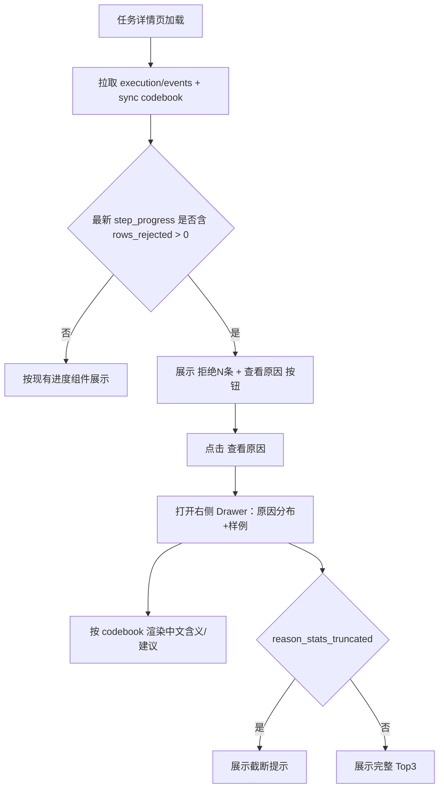
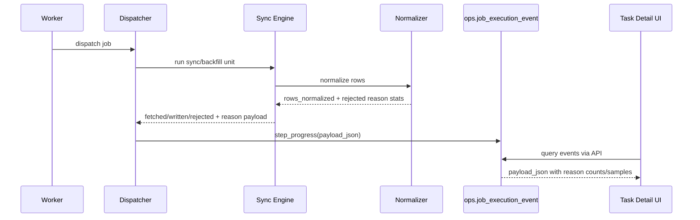

# Sync 任务 Error/Reason 统一编码与可观测性方案 v1

更新时间：2026-04-23  
适用范围：`src/foundation/services/sync_v2/*`、`src/ops/runtime/*`、`src/ops/queries/*`、`frontend/src/pages/ops-task-detail-page.tsx`

---

## 1. 目的

本方案用于统一 Sync 任务的异常表达与行级拒绝表达，解决以下问题：

1. 当前仅能看到 `fetched/written`，无法稳定看到“为什么写入变少”。
2. 当前前端主要依赖 message 文本，缺少可机器识别的稳定编码。
3. 当前 `step_progress` 只带简单进度，不带拒绝原因分布与样例。

本方案目标：

1. 建立统一 `error_code`（任务级）与 `reason_code`（行级）编码体系。
2. 在 `step_progress.payload_json` 中写入可控长度的 `rejected_reason_counts` 与样例。
3. 前端任务详情页通过 codebook 渲染“拒绝原因分布 + 样例”，不依赖硬编码文案。

本方案不包含：

1. 本轮不新增独立 reject 明细大表（避免先引入高成本存储）。
2. 本轮不改动现有调度/执行状态机语义。

---

## 2. 核心定义

### 2.1 `error_code`（任务级）

定义：导致任务失败、部分成功、或关键步骤中断的错误码。  
落点：`JobExecution.error_code`、终态 event/message、日志检索维度。  
用途：前端状态解释、告警聚合、重试策略判断。

### 2.2 `reason_code`（行级）

定义：单行在 normalize/write 过程中被拒绝、过滤、跳过的原因码。  
落点：`step_progress.payload_json.rejected_reason_counts` 与样例。  
用途：解释 `fetched != written` 的原因，不影响任务是否成功。

---

## 3. 统一编码治理规则

### 3.1 命名规则

1. `error_code`：`snake_case`，如 `source_timeout`、`write_failed`。
2. `reason_code`：`domain.reason`，如 `normalize.required_field_missing`、`write.filtered_by_business_rule`。
3. 可附带字段维度（聚合 key）：`<reason_code>:<field>`，如 `normalize.required_field_missing:ts_code`。

### 3.2 稳定性规则

1. code 一旦发布，不允许随意改名；仅允许新增。
2. 文案可迭代，code 不变。
3. 未识别 code 前端统一显示“未收录码”，并保留原码。

### 3.3 单一事实来源

新增统一字典（codebook）：

1. 后端：`sync_codebook` 常量（error/reason + 中文含义 + 建议动作）。
2. 接口：`GET /api/v1/ops/codebook/sync`。
3. 前端：仅消费 codebook，不写死含义映射。

### 3.4 编码字典归属与前后端职责

结论：编码字典归属后端，前端只负责消费与展示。

1. 后端职责（唯一事实源）
   1. 维护 `error_code` / `reason_code` 的 canonical 字典。
   2. 通过 `GET /api/v1/ops/codebook/sync` 统一对外输出（含含义、建议动作、版本）。
   3. 新增 code 时必须先更新后端字典，再发布前端可视化适配。
2. 前端职责（展示层）
   1. 不维护业务语义主字典，不硬编码 code 含义。
   2. 按后端 codebook 渲染中文含义、建议动作与 tooltip。
   3. 仅允许本地维护“表现层映射”（颜色、图标、排序等 UI 规则）。
   4. 遇到未知 code 时显示“未收录码 + 原始 code”，确保前向兼容。
3. 版本与缓存策略
   1. codebook 响应提供 `version`（可选附带 `updated_at`）。
   2. 前端按 `version` 做缓存失效；支持 ETag/短 TTL（例如 5~10 分钟）减少重复请求。
   3. 旧页面读到新 code 时不报错，先走未知码兜底，待下一次 codebook 拉取后自动恢复语义展示。

---

## 4. 编码字典（V1）

## 4.1 `error_code` 字典

| error_code | 含义 | 主要阶段 | 建议动作 |
|---|---|---|---|
| `run_profile_unsupported` | 数据集不支持该运行模式 | validator | 检查任务模式与数据集能力 |
| `invalid_window_for_profile` | 时间窗口与运行模式冲突 | validator/planner | 校验 trade_date/start_date/end_date 组合 |
| `range_required` | 缺少时间范围参数 | validator/planner | 补齐开始和结束日期 |
| `invalid_anchor_type` | 锚点类型非法 | validator/planner | 检查 contract 锚点配置 |
| `source_adapter_not_found` | 数据源适配器不存在 | worker/source | 检查 source_key |
| `source_timeout` | 上游请求超时 | source | 可重试 |
| `source_http_error` | 上游 HTTP 异常 | source | 查看状态码与参数 |
| `source_rate_limited` | 上游限流 | source | 降频或延后重试 |
| `source_server_error` | 上游服务异常 | source | 稍后重试 |
| `source_auth_error` | 上游鉴权失败 | source | 检查凭据 |
| `payload_invalid` | 上游 payload 不合法 | normalize | 检查字段结构 |
| `all_rows_rejected` | 本批次全部行被拒绝 | normalize | 查看 reason 分布 |
| `dao_not_found` | 写入 DAO 路由缺失 | writer | 检查 contract/write_spec |
| `write_failed` | 写入异常 | writer | 检查冲突策略与数据库 |
| `internal_error` | 未归类内部错误 | runtime | 走内部排障 |
| `dispatcher_error` | 调度器执行异常 | runtime | 查看步骤级事件 |
| `workflow_invalid` | 工作流定义异常 | dispatcher | 检查 workflow spec |
| `workflow_step_failed` | 工作流步骤失败 | dispatcher | 检查失败步骤 |
| `execution_failed` | 执行失败（统一兜底） | runtime | 查看 error_message 与事件 |

## 4.2 `reason_code` 字典

| reason_code | 含义 | 典型触发场景 |
|---|---|---|
| `normalize.required_field_missing` | 必填字段缺失 | `ts_code`、`trade_date` 为空 |
| `normalize.invalid_date` | 日期字段非法 | 日期解析失败 |
| `normalize.invalid_decimal` | 数值字段非法 | Decimal 转换失败 |
| `normalize.empty_not_allowed` | 非空字段为空 | 空字符串/空白值 |
| `normalize.row_transform_failed` | 行转换失败 | row_transform 抛错 |
| `normalize.payload_invalid` | 行内容不符合约束 | 类型/结构不满足 |
| `write.filtered_by_business_rule` | 被业务规则过滤 | active pool 或策略过滤 |
| `write.duplicate_conflict_key_in_batch` | 同批次冲突键去重 | 批内同主键重复 |
| `write.target_constraint_filtered` | 目标约束导致未写入 | 目标表约束或策略拒绝 |
| `reason.unknown` | 未归类原因 | 兜底 |

---

## 5. `step_progress.payload_json` 协议与长度控制

## 5.1 新增字段

```json
{
  "progress_message": "moneyflow_cnt_ths: 4/4 trade_date=2026-04-23 fetched=387 written=386 rejected=1",
  "progress_current": 4,
  "progress_total": 4,
  "progress_percent": 100,
  "rows_fetched": 387,
  "rows_written": 386,
  "rows_rejected": 1,
  "rejected_reason_counts": {
    "normalize.required_field_missing:ts_code": 1
  },
  "rejected_reason_samples": [
    {
      "reason_code": "normalize.required_field_missing",
      "field": "ts_code",
      "sample_key": "trade_date=2026-04-23,name=2026一季报预增",
      "sample_message": "required field missing: ts_code"
    }
  ],
  "reason_stats_truncated": false,
  "reason_stats_truncate_note": null
}
```

## 5.2 长度预算与上限

1. `MAX_REASON_BUCKETS = 3`
2. `MAX_REASON_SAMPLES = 3`
3. `MAX_REASON_CODE_LEN = 64`
4. `MAX_FIELD_LEN = 32`
5. `MAX_SAMPLE_KEY_LEN = 120`
6. `MAX_SAMPLE_MSG_LEN = 180`
7. `MAX_PROGRESS_PAYLOAD_BYTES = 2048`

## 5.3 超长降级顺序

1. 先裁剪样例文本。
2. 超限后移除 `rejected_reason_samples`。
3. 仍超限则 `rejected_reason_counts` 仅保留 Top1。
4. 再超限仅保留 `rows_rejected` 总数。
5. 标记 `reason_stats_truncated=true`，并写入 `reason_stats_truncate_note`。

---

## 6. 后端设计

## 6.1 数据流改造

1. `normalizer` 从“异常类计数”升级为“reason_code + field + sample”聚合。
2. `engine` 在 progress 中附加 `rows_rejected` 与 reason 统计。
3. `SyncV2Service` 与 `HistoryBackfillService` 透传结构化 progress。
4. `OperationsDispatcher._build_progress_payload` 支持合并结构化字段。
5. `ExecutionQueryService` 原样返回 payload，前端自行解释。

## 6.2 事件写入策略

1. 仅在 `step_progress` 事件写入 reason 统计。
2. 默认只保留最近批次可见信息，不落全量明细表。
3. 若 `rows_rejected == 0`，可省略 `rejected_reason_counts/samples`。

## 6.3 兼容性

1. 老 payload 无新增字段时，前端按旧逻辑展示。
2. 新旧并行期间，message 保持兼容文本（含 `fetched/written/rejected`）。

---

## 7. 前端交互设计（任务详情页）

## 7.1 展示位置

1. “当前进展”卡片：显示 `读取/写入/拒绝`，并提供“查看原因”。
2. “实时处理记录 > 系统更新”：若 event 含拒绝统计，显示“有拒绝”标记。
3. 点击“查看原因”打开右侧 Drawer：展示原因分布与样例。
4. code 的中文含义由 codebook 渲染，支持 tooltip。

## 7.2 页面结构草图

```text
[当前进展]
阶段性进度: 4/4   100%
读取 387  写入 386  拒绝 1   [查看原因]

[实时处理记录 - 系统更新]
时间 | 更新内容 | 说明 | 拒绝
...  | 步骤进度 | moneyflow_cnt_ths... | 有拒绝(1)

(右侧 Drawer) [拒绝原因详情]
总拒绝: 1
1) normalize.required_field_missing:ts_code  1次 100%
样例:
- reason_code: normalize.required_field_missing
- field: ts_code
- sample_key: trade_date=2026-04-23,name=2026一季报预增
- sample_message: required field missing: ts_code
[提示] 已截断，仅展示部分原因（如触发）
```

## 7.3 前端交互流程图



## 7.4 后端到前端时序图



---

## 8. API 与数据契约变更

1. 新增：`GET /api/v1/ops/codebook/sync`（error/reason 字典）。
2. 现有：`GET /api/v1/ops/executions/{id}/events` 保持不变，透传扩展 payload。
3. 前端类型扩展：
   1. `ExecutionEventsResponse.items[].payload_json.rows_rejected?: number`
   2. `rejected_reason_counts?: Record<string, number>`
   3. `rejected_reason_samples?: Array<{ reason_code: string; field?: string; sample_key?: string; sample_message?: string }>`
   4. `reason_stats_truncated?: boolean`
   5. `reason_stats_truncate_note?: string | null`

---

## 9. 实施分期

1. Phase 1：后端 codebook 与 reason 聚合结构完成；进度文案加入 `rejected`。
2. Phase 2：`step_progress.payload_json` 完整写入 + 长度裁剪器。
3. Phase 3：前端任务详情页增加“拒绝原因分布 + 样例”交互。
4. Phase 4：回归测试、文档模板检查项更新、发布观察。

---

## 10. 验收标准

1. 当 `fetched != written` 时，详情页可见 `rejected` 总数。
2. 至少展示 Top3 原因（不足 3 按实际），并给出 code 含义。
3. payload 触发截断时页面有明确提示，且接口不报错。
4. 前端不再硬编码 reason/error 含义，统一走 codebook。
5. 针对案例 `moneyflow_cnt_ths`，可直接看到 `normalize.required_field_missing:ts_code`。

---

## 11. 风险与回滚

1. 风险：payload 体积增长导致 event 查询负担上升。  
   对策：严格长度预算 + Top3 上限 + 统一裁剪器。
2. 风险：前后端字典不同步。  
   对策：codebook API 带 `version`，前端按版本缓存。
3. 风险：旧任务无结构化字段。  
   对策：前端保持旧逻辑兜底，结构化字段可选读取。

---

## 12. 与现有问题的直接映射

针对样例日志：

`moneyflow_cnt_ths: 4/4 trade_date=2026-04-23 fetched=387 written=386`

在本方案落地后，页面应直接显示：

1. `rejected=1`
2. `reason: normalize.required_field_missing:ts_code`
3. 对应样例 key/message（若未触发截断）
