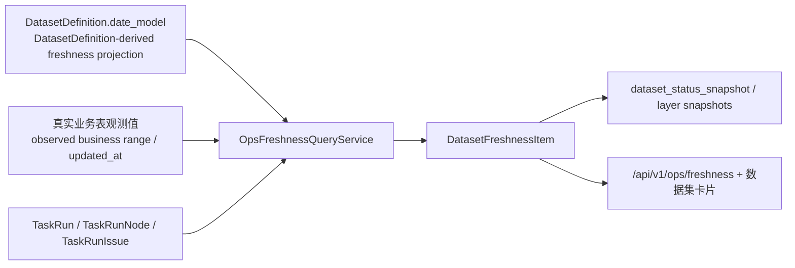

# Ops `sync_job_state` 退场方案 v1

- 状态：已完成
- 更新时间：2026-04-26
- 归属：`docs/ops`
- 风险登记：`RISK-2026-04-26-004`
- 关联基线：
  - [Ops 新鲜度按 Date Model 收口方案 v1](/Users/congming/github/goldenshare/docs/ops/ops-date-model-freshness-alignment-plan-v1.md)
  - [Ops 任务当前对象语义与运行观测数据重置方案 v1](/Users/congming/github/goldenshare/docs/ops/ops-task-current-object-and-ops-runtime-reset-plan-v1.md)
  - [数据集日期模型消费指南 v1](/Users/congming/github/goldenshare/docs/architecture/dataset-date-model-consumer-guide-v1.md)

---

## 1. 一句话结论

`ops.sync_job_state` 必须彻底退场。

Ops 数据集卡片、新鲜度 API、状态重建命令后续只允许依赖三类事实源：

1. `DatasetDefinition.date_model` 与由它派生的 freshness projection 提供静态规则。
2. 真实业务表提供日期/月份/窗口观测值。
3. `ops.task_run / task_run_node / task_run_issue` 提供最近成功时间、最近失败信息、当前活跃任务。

不再保留 `job_name / last_success_date / full_sync_done / last_cursor` 这套旧状态模型，也不做兼容双读。

### 1.1 实施结果（2026-04-26）

1. 已新增 Alembic `20260426_000076_drop_sync_job_state_and_legacy_freshness_fields.py`。
2. `freshness_query_service` 已改为只读 `真实业务表 + TaskRun / TaskRunNode / TaskRunIssue`。
3. `/api/v1/ops/freshness`、`dataset_status_snapshot`、前端 `OpsFreshnessResponse` 已删除：
   - `job_name`
   - `state_business_date`
   - `business_date_source`
   - `full_sync_done`
4. `ops-reconcile-sync-job-state` CLI、`SyncJobState` ORM、旧 reconciliation service、`SyncJobStateDAO` 已删除。
5. 执行层 no-op contract 已同步改名为 `SyncExecutionResultStore`，避免旧术语残留在主链代码里。

---

## 2. 当前起点

### 2.1 已经成立的事实

1. TaskRun 观测主链已经上线，任务详情与问题诊断不再读取 `sync_job_state`。
2. 2026-04-26 远程环境已执行 `20260426_000075`：
   - `ops.sync_job_state` 已清空。
   - `ops.task_run*` 已清空重建。
   - 旧 `job_execution* / sync_run_log` 已删除。
3. 远程环境随后已执行 `ops-rebuild-dataset-status`，当前 `dataset_status_snapshot` 是在“表被清空但 ORM/查询代码仍保留旧语义”的前提下重建出来的。

### 2.2 当前真正的问题

现在不是“还有一张空表无伤大雅”，而是**读模型、写模型、CLI、测试、文档里仍然默认它应该存在**。

已审计到的主链依赖：

1. [freshness_query_service.py](/Users/congming/github/goldenshare/src/ops/queries/freshness_query_service.py)
   - `build_live_items()` 直接 `select(SyncJobState)`。
   - `state_business_date`、`business_date_source=state/state+observed`、`full_sync_done` 仍来自旧表。
   - 还存在“只有 `sync_job_state` 没有 spec/观测时，伪造 fallback item” 的逻辑。
2. [dataset_status_projection.py](/Users/congming/github/goldenshare/src/ops/dataset_status_projection.py)
   - 继续把 `job_name / state_business_date / business_date_source / full_sync_done` 投影到 API。
3. [dataset_status_snapshot.py](/Users/congming/github/goldenshare/src/ops/models/ops/dataset_status_snapshot.py)
   - 当前快照表 schema 仍持有上述旧字段。
4. [operations_dataset_status_snapshot_service.py](/Users/congming/github/goldenshare/src/ops/services/operations_dataset_status_snapshot_service.py)
   - `rebuild_all()` / `refresh_resources()` 会继续把旧字段写入快照。
5. `operations_sync_job_state_reconciliation_service.py`（已删除）
   - 整个服务只为旧表存在。
6. [cli.py](/Users/congming/github/goldenshare/src/cli.py) 与 [ops_handlers.py](/Users/congming/github/goldenshare/src/cli_parts/ops_handlers.py)
   - 仍保留 `ops-reconcile-sync-job-state` 命令。
7. Foundation 侧 legacy 写入链仍在：
   - `sync_job_state_dao.py`（已删除）
   - [factory.py](/Users/congming/github/goldenshare/src/foundation/dao/factory.py)
   - `sync_state_store.py`（已删除；当前 no-op contract 为 [ingestion_state_store.py](/Users/congming/github/goldenshare/src/foundation/kernel/contracts/ingestion_state_store.py)）

---

## 3. 为什么不能继续留着

### 3.1 它和现有单一事实源模型冲突

`sync_job_state` 的主键是 `job_name`，而我们当前已经收敛到：

1. 数据集静态身份：`dataset_key / resource_key`
2. 日期规则身份：`DatasetDefinition.date_model`
3. 任务运行身份：`task_run.id / task_run_node.id`

`job_name` 既不是页面主键，也不是资源状态主键。继续保留它，只会继续制造“一个数据集三套身份”的问题。

### 3.2 它把旧语义继续带回页面

以下字段本质上都是旧模型的延续：

1. `state_business_date`
2. `business_date_source=state/state+observed`
3. `full_sync_done`
4. `last_cursor`

这些字段一旦继续存在，就会让后续开发继续围绕“状态表里怎么写”打补丁，而不是围绕“真实目标表 + TaskRun + date_model”建模。

### 3.3 它已经不再是可靠事实源

远程环境的 `ops.sync_job_state` 已经被清空。  
当前它既不能作为历史状态来源，也不应该被重新写回。这个时间点正适合直接删除，而不是重新给它找存在意义。

---

## 4. 目标模型

### 4.1 新鲜度/状态只保留三层事实



### 4.2 新的资源状态口径

对每个 `resource_key`，查询层只组装以下事实：

1. `latest_business_date`
   - 只来自真实业务表。
   - 必须按 `date_model.date_axis + bucket_rule` 过滤。
   - 绝不能来自 `sync_job_state.last_success_date`。
2. `earliest_business_date / observed_business_date`
   - 只来自真实业务表。
3. `latest_success_at`
   - 来自最近一次成功的 `TaskRunNode(resource_key=...)`。
   - 不再来自 `sync_job_state.last_success_at`。
4. `last_sync_date`
   - 优先使用 `latest_success_at` 的本地日期。
   - 若历史数据在 TaskRun 清空前已经存在、但还没有新任务记录，则允许回退到目标表 `updated_at` 或最新观测日期，仅作为“最近同步时间”展示，不可伪装成业务日期。
5. `recent_failure_*`
   - 来自 `TaskRunIssue`，并按 `TaskRunNode.resource_key` 归属到资源。
6. `active_execution_*`
   - 来自 TaskRun / TaskRunNode 当前运行态。

### 4.3 `not_applicable` 数据集的规则

本方案不替它们发明新健康模型，只做两件事：

1. 去掉 `sync_job_state` 依赖。
2. 保留 `latest_success_at / last_sync_date / recent_failure` 作为运行迹象。

对于 `date_model.bucket_rule=not_applicable` 的资源：

1. `latest_business_date = null`
2. `expected_business_date = null`
3. `lag_days = null`
4. `freshness_status = unknown`

后续如要给主数据/快照类设计单独健康模型，必须走 `RISK-2026-04-26-003` 的独立评审，不在本轮顺手扩展。

---

## 5. API 与快照契约收口

### 5.1 建议直接删除的 API/快照字段

以下字段建议直接下线，不做兼容：

1. `job_name`
2. `state_business_date`
3. `business_date_source`
4. `full_sync_done`

原因：

1. 它们全部与 `sync_job_state` 或旧 `job_name` 状态模型强耦合。
2. 前端当前并不依赖它们做核心交互，主要只是测试和 fallback 拼装还带着。
3. 保留这些字段只会让未来继续出现“虽然删了表，但 API 还在讲旧故事”的问题。

### 5.2 `DatasetFreshnessItem` 目标字段

保留：

1. `dataset_key`
2. `resource_key`
3. `display_name`
4. `domain_key / domain_display_name`
5. `target_table / raw_table`
6. `cadence`
7. `earliest_business_date / observed_business_date / latest_business_date`
8. `freshness_note`
9. `latest_success_at`
10. `last_sync_date`
11. `expected_business_date`
12. `lag_days`
13. `freshness_status`
14. `recent_failure_*`
15. `primary_action_key`
16. `auto_schedule_*`
17. `active_execution_*`

删除：

1. `job_name`
2. `state_business_date`
3. `business_date_source`
4. `full_sync_done`

### 5.3 `dataset_status_snapshot` 建议收口字段

建议同步删除以下列：

1. `job_name`
2. `state_business_date`
3. `business_date_source`
4. `full_sync_done`

原因：

1. `dataset_status_snapshot` 是可重建投影，不应该继续保留已经失效的源语义。
2. 远程环境已经过一次清空重建，继续保留这些列没有迁移包袱价值。

### 5.4 `freshness` API 返回示例

当前示例（旧口径，计划删除字段）：

```json
{
  "dataset_key": "daily",
  "resource_key": "daily",
  "job_name": "sync_equity_daily",
  "display_name": "股票日线",
  "target_table": "core_serving.equity_daily_bar",
  "state_business_date": "2026-04-24",
  "latest_business_date": "2026-04-24",
  "business_date_source": "state+observed",
  "latest_success_at": "2026-04-26T03:11:53Z",
  "last_sync_date": "2026-04-26",
  "full_sync_done": false
}
```

目标示例（新口径）：

```json
{
  "dataset_key": "daily",
  "resource_key": "daily",
  "display_name": "股票日线",
  "target_table": "core_serving.equity_daily_bar",
  "latest_business_date": "2026-04-24",
  "latest_success_at": "2026-04-26T03:11:53Z",
  "last_sync_date": "2026-04-26",
  "freshness_note": "最新业务日当前来自真实目标表观测值。",
  "freshness_status": "fresh"
}
```

收口原则：

1. API 不再讲 `job_name` 故事，只讲 `resource_key` 和数据集事实。
2. API 不再暴露“这个日期来自状态表还是观测表”的内部来源字段。
3. 若页面要解释状态，只允许通过 `freshness_note` 输出用户可理解文案。

---

## 6. 查询与投影实现方案

### 6.1 `freshness_query_service` 的改造方向

现状：

1. 先读 `SyncJobState`
2. 再和 observed date 混合
3. 再生成 item

目标：

1. 完全删除 `select(SyncJobState)` 与 fallback item。
2. 新增按 `resource_key` 聚合的运行态查询：
   - `latest_success_by_resource`
   - `latest_failure_by_resource`
3. observed date / expected bucket 保持基于 `date_model` 计算。
4. `freshness_note` 不再出现“最新业务日当前来自 sync_job_state”这类文案。

### 6.2 `latest_success_at` 的来源

推荐口径：

1. 以 `TaskRunNode.resource_key` 为主键聚合最近一次成功节点。
2. 取 `node.ended_at`，如为空再回退 `task_run.ended_at`。
3. 这样可以覆盖：
   - 手动 `dataset_action`
   - 工作流步骤
   - 后续自动任务

不建议只看 `TaskRun.resource_key`，因为工作流执行时资源级成功记录主要落在 node，而不是单独的新 task_run。

### 6.3 `recent_failure_*` 的来源

推荐口径：

1. 优先按 `TaskRunIssue.node_id -> TaskRunNode.resource_key` 归属失败。
2. 若 issue 没有 node，但 `TaskRun.resource_key` 存在，则回退到 task_run 级资源。
3. 这样可以把工作流步骤失败正确归属到数据集，而不是只得到一个 workflow 级失败。

### 6.4 `last_sync_date` 的来源

推荐顺序：

1. `latest_success_at` 转本地日期。
2. 若没有 TaskRun 成功记录，则回退目标表 `updated_at` 的日期。
3. 若目标表没有 `updated_at`，且存在可观测业务日期，则回退 `latest_business_date`。
4. 若以上都没有，则 `null`。

这里的回退只用于“最近同步时间”展示，不能反向写回 `latest_business_date`。

### 6.5 前端消费点收口

本轮需要同步收口的前端消费点：

1. [frontend/src/shared/api/types.ts](/Users/congming/github/goldenshare/frontend/src/shared/api/types.ts)
   - 删除 `OpsFreshnessResponse` 中的 `job_name / state_business_date / business_date_source / full_sync_done`
2. [frontend/src/pages/ops-v21-shared.ts](/Users/congming/github/goldenshare/frontend/src/pages/ops-v21-shared.ts)
   - synthetic snapshot 的 `snapshot_date` 改为 `latest_business_date || last_sync_date`
   - 不再依赖 `state_business_date`
3. [frontend/src/pages/ops-v21-dataset-detail-page.tsx](/Users/congming/github/goldenshare/frontend/src/pages/ops-v21-dataset-detail-page.tsx)
   - fallback raw/serving snapshot 的 `snapshot_date` 改为 `latest_business_date || last_sync_date`
   - 不再使用 `state_business_date`
4. 相关页面测试：
   - `ops-v21-source-page.test.tsx`
   - `ops-v21-dataset-detail-page.test.tsx`
   - fixture 需要移除旧字段，并把断言改成新口径

说明：

1. 这一轮不要求前端新增新功能，只要求删掉旧依赖。
2. 页面表现上不应出现功能变化，只是底层口径收口。

---

## 7. CLI 与旧服务退场

### 7.1 直接删除

以下内容建议本轮直接删除，不保留“过渡命令”：

1. `ops-reconcile-sync-job-state`
2. `operations_sync_job_state_reconciliation_service.py`
3. `SyncJobState` ORM
4. `ops.sync_job_state` 表

原因：

1. 表已经清空。
2. 当前主链已经没有任务详情依赖它。
3. 保留命令只会制造“是不是还该修这张表”的错误预期。

### 7.2 Foundation legacy 清理边界

这一轮建议一起清理到“数据库层不再触达 `ops.sync_job_state`”：

1. 删除 `SyncJobStateDAO`
2. 删除 `DAOFactory.sync_job_state`
3. 删除 `app.model_registry` 中对 `SyncJobState` 的注册

`SyncJobStateStore` protocol 是否同步重命名，不建议在本轮展开。  
本轮只要保证：

1. 没有任何非测试代码再去读写 `ops.sync_job_state`
2. `base_sync_service` 继续只依赖 `record_execution_outcome()` 抽象即可

后续执行层大重构时，再统一评估是否把该 protocol 改名为更准确的资源结果写入 contract。

---

## 8. 数据迁移与发布策略

### 8.1 总策略

直接切换，不做双读双写，不保留兼容列。

### 8.2 迁移动作

新增 Alembic migration，执行以下动作：

1. `TRUNCATE ops.dataset_status_snapshot`
2. `TRUNCATE ops.dataset_layer_snapshot_current`
3. `TRUNCATE ops.dataset_layer_snapshot_history`
4. `ALTER TABLE ops.dataset_status_snapshot DROP COLUMN ...`
   - `job_name`
   - `state_business_date`
   - `business_date_source`
   - `full_sync_done`
5. `DROP TABLE ops.sync_job_state`

说明：

1. 这些都是可重建投影或已清空旧状态表，不涉及业务数据表。
2. 远程环境当前 `sync_job_state` 已为空，删除不需要做数据搬运。

### 8.3 发布后重建

迁移完成后必须立即执行：

```bash
goldenshare ops-rebuild-dataset-status
```

验收点：

1. 数据集卡片页正常返回。
2. freshness API 正常返回。
3. `dataset_status_snapshot` / `dataset_layer_snapshot_*` 重建成功。
4. `ops.sync_job_state` 不存在。

---

## 9. 里程碑

### M1：查询事实源切换

1. `freshness_query_service` 删除 `SyncJobState` 读取。
2. 新增按 `resource_key` 聚合的 `latest_success` / `recent_failure` 查询。
3. 删除 fallback state-only item。
4. `freshness_note` 改成只描述“真实业务表观测 / 最近同步时间 / 最近失败”，不再出现 `sync_job_state` 文案。

验收：

1. `rg "SyncJobState|sync_job_state" src/ops/queries` 不再命中主链。
2. workflow 步骤成功/失败可正确归属到数据集资源。
3. `not_applicable` 数据集不会伪造 `latest_business_date`。

### M2：API 与快照字段收口

1. 删除 `DatasetFreshnessItem` 旧字段。
2. 删除 `dataset_status_snapshot` 对应列与投影写入。
3. 更新前端 `ops-v21-shared`、`ops-v21-dataset-detail-page` 的 fallback 取值。
4. 更新 `dataset_status_projection` 与 snapshot read path，保证 snapshot/live 两条读取链口径一致。

验收：

1. 前端不再依赖 `state_business_date`。
2. API 类型中无 `full_sync_done / business_date_source / job_name`。
3. snapshot 返回和 live 返回字段集一致。

### M3：旧命令与模型退场

1. 删除 `ops-reconcile-sync-job-state` CLI。
2. 删除 `operations_sync_job_state_reconciliation_service.py`。
3. 删除 `SyncJobState` ORM、model registry、测试工厂。

验收：

1. `rg "ops-reconcile-sync-job-state|SyncJobState" src` 只剩历史文档或 allowlist。

### M4：数据库删除与重建

1. 执行 migration drop `ops.sync_job_state`。
2. 重建 `dataset_status_snapshot` / `dataset_layer_snapshot_*`。
3. 验证远程页面与 API。

验收：

1. 数据库中不存在 `ops.sync_job_state`。
2. `ops-rebuild-dataset-status` 正常。
3. 数据集卡片状态、freshness API、TaskRun 状态口径一致。

---

## 10. 回归与验收命令

建议最低回归集：

```bash
pytest -q tests/web/test_ops_freshness_api.py tests/test_dataset_status_snapshot_service.py tests/web/test_ops_pipeline_modes_api.py
cd frontend && npm test -- --run src/pages/ops-v21-source-page.test.tsx src/pages/ops-v21-dataset-detail-page.test.tsx
python3 scripts/check_docs_integrity.py
```

如本轮同时改了 CLI/旧模型退场，再补：

说明：

1. 旧 CLI/DAO 删除后，不再保留 `tests/test_sync_job_state_reconciliation_service.py` 和 `tests/test_sync_job_state_dao.py`。
2. `tests/test_cli_ops_runtime.py` 只保留新 CLI 行为断言。
3. 远程验收仍以 `goldenshare ops-rebuild-dataset-status` 和页面实测为准。

---

## 11. 需要你 review 的决策点

### D1：是否直接从 freshness API 删除 `job_name / state_business_date / business_date_source / full_sync_done`

建议：`A. 直接删除（推荐）`

原因：

1. 这四个字段全部属于旧语义。
2. 当前前端核心交互不依赖它们。
3. 继续保留只会让后续代码继续围着旧状态表思考。

### D2：`latest_success_at` 是否以 `TaskRunNode.resource_key` 为资源成功事实源

建议：`A. 使用 TaskRunNode（推荐）`

原因：

1. 能覆盖 workflow 步骤。
2. 不会漏掉“工作流里同步了数据集，但没有单独 task_run”的情况。

### D3：`ops-reconcile-sync-job-state` 是否直接删除，不保留替代命令

建议：`A. 直接删除（推荐）`

原因：

1. 表本身就要退场。
2. 保留命令只会误导后续还应维护这套旧状态。

### D4：本轮是否直接 drop `ops.sync_job_state`

建议：`A. 直接 drop（推荐）`

原因：

1. 远程环境表已清空。
2. 当前正是最适合硬切换的窗口。
3. 留着空表只会鼓励旧代码继续回流。

---

## 12. 本轮不做的事

1. 不为 `not_applicable` 数据集设计新的健康模型。
2. 不新增资源状态表、影子字段或并行投影。
3. 不顺手改 TaskRun 观测模型。
4. 不展开执行层 `SyncJobStateStore` protocol 的语义重命名；只保证数据库和主链不再依赖旧表。
