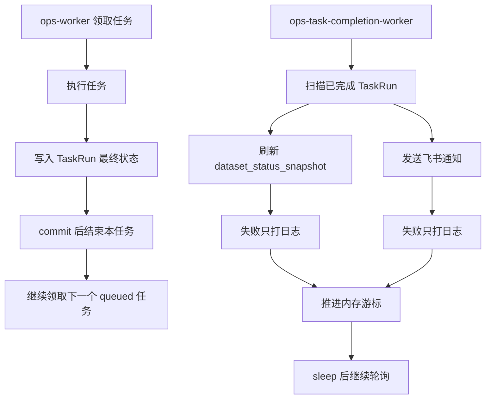

# Ops 任务完成副作用 Worker 方案 v1

状态：本地实现完成，待部署验收

日期：2026-05-30  
适用范围：Ops TaskRun 完成后状态刷新、飞书群通知、生产 systemd 运行服务

---

## 1. 背景

当前 `ops-worker` 在任务最终状态写入后，会同步刷新 `ops.dataset_status_snapshot`。这会带来一个实际问题：如果 freshness 刷新需要扫描大表，例如 `raw_tushare.stk_mins`，任务本体已经完成，但 worker 仍会被刷新动作卡住，导致后续排队任务迟迟得不到执行。

同时，新增“任务完成后发送飞书群通知”能力也属于任务完成后的外部副作用。飞书 webhook 是外部网络调用，存在超时、失败、限流等风险，不能放进任务执行主链路。

因此本方案把任务完成后的副作用统一收敛到一个轻量独立 worker：

1. 异步刷新 `ops.dataset_status_snapshot`。
2. 异步发送飞书任务完成通知。

---

## 2. 目标与非目标

## 2.1 目标

1. `ops-worker` 只负责执行任务、写入 TaskRun 最终状态，不再同步刷新 freshness，也不直接调用飞书 webhook。
2. 新增一个轻量 `ops-task-completion-worker`，专门处理任务完成后的副作用。
3. 任务完成通知覆盖所有终态：`success`、`partial_success`、`failed`、`canceled`。
4. workflow 只通知整个 workflow 顶层任务完成，不通知内部步骤。
5. 飞书通知使用自定义机器人 webhook，必须启用签名 secret。
6. V1 采用普通富文本消息，不做飞书交互卡片。
7. 通知和状态刷新失败只写日志，不影响任务状态，不阻塞后续任务。

## 2.2 非目标

1. 不新增 outbox 表。
2. 不保证通知必达。
3. 不做失败重试。
4. 不补发 worker 停止期间错过的历史通知。
5. 不在 TaskRun issue 中记录飞书发送失败，避免污染任务诊断。
6. 不改任务详情页，不新增通知管理页面。

---

## 3. 核心口径

## 3.1 主链路口径

任务完成的主链路只到 TaskRun 最终状态提交为止：

```text
ops-worker
  -> 领取 queued 任务
  -> 执行业务同步或 workflow
  -> 写入 ops.task_run 最终状态
  -> commit
  -> 返回，继续领取下一个任务
```

禁止在这条链路中做：

1. 扫业务大表刷新 freshness。
2. 请求飞书 webhook。
3. 等待外部网络调用。
4. 因通知或 freshness 失败改变任务最终状态。

## 3.2 副作用 worker 口径

副作用 worker 只读 `ops.task_run` 中已经完成的顶层任务：

```text
ops-task-completion-worker
  -> 初始化游标
  -> 轮询已完成 TaskRun
  -> 对每个完成任务刷新相关 dataset_status_snapshot
  -> 对每个完成任务发送飞书通知
  -> 无论成功失败，推进内存游标
  -> sleep 后继续
```

V1 不落地持久化游标。worker 重启时以当前数据库中最新完成任务作为起点，不补发历史任务。

这意味着：

1. worker 正常运行期间，任务完成后会被处理。
2. worker 停止期间完成的任务可能不会通知。
3. worker 处理失败的通知不会重试。
4. 这是 V1 明确接受的“尽力通知”语义。

---

## 4. 总体流程



---

## 5. 配置项审计

新增配置统一放在 `src.foundation.config.settings.Settings`，生产值写入 `/etc/goldenshare/web.env`。远程环境只通过 `scripts/remote-web-env.sh` 管理。

| 配置名 | 默认值 | 来源 | 持久化位置 | 作用范围 | 消费者 | 说明 |
| --- | --- | --- | --- | --- | --- | --- |
| `OPS_TASK_COMPLETION_WORKER_POLL_SECONDS` | `5` | env / Settings | `/etc/goldenshare/web.env` | completion worker | `ops-task-completion-worker-serve` | 轮询完成任务的间隔 |
| `OPS_TASK_COMPLETION_WORKER_BATCH_SIZE` | `20` | env / Settings | `/etc/goldenshare/web.env` | completion worker | `TaskRunCompletionWorker` | 每轮最多处理的完成任务数 |
| `OPS_TASK_NOTIFY_FEISHU_ENABLED` | `false` | env / Settings | `/etc/goldenshare/web.env` | 飞书通知 | `FeishuTaskNotificationService` | 是否启用飞书通知 |
| `GOLDENSHARE_FEISHU_WEBHOOK_URL` | 空 | env / Settings | `/etc/goldenshare/web.env` | 飞书通知 | `FeishuTaskNotificationService` | 飞书自定义机器人 webhook URL |
| `GOLDENSHARE_FEISHU_WEBHOOK_SECRET` | 空 | env / Settings | `/etc/goldenshare/web.env` | 飞书通知 | `FeishuTaskNotificationService` | 飞书签名 secret；启用通知时必须配置 |
| `OPS_TASK_NOTIFY_TIMEOUT_SECONDS` | `5` | env / Settings | `/etc/goldenshare/web.env` | 飞书通知 | `FeishuTaskNotificationService` | 单次 webhook 超时时间 |
| `OPS_PUBLIC_BASE_URL` | 空 | env / Settings | `/etc/goldenshare/web.env` | 通知链接 | `FeishuTaskNotificationService` | 用于拼接任务详情链接；为空则不展示链接 |

本机 `~/.bash_profile` 已存在：

```text
GOLDENSHARE_FEISHU_WEBHOOK_URL
GOLDENSHARE_FEISHU_WEBHOOK_SECRET
```

上线时不能依赖本机 profile，必须把生产值写入远程 `/etc/goldenshare/web.env`。

---

## 6. 飞书消息设计

## 6.1 消息类型

V1 使用飞书自定义机器人普通富文本消息，不使用交互卡片。

消息标题：

```text
任务完成：{任务标题}（{状态中文}）
```

消息正文字段：

| 字段 | 示例 | 说明 |
| --- | --- | --- |
| 任务 ID | `#1642` | `ops.task_run.id` |
| 任务名称 | `股票历史分钟行情` | `task_run.title` |
| 任务类型 | `数据维护` / `工作流` / `维护动作` | 根据 `task_type` 转中文 |
| 最终状态 | `成功` / `部分成功` / `失败` / `已取消` | 根据 `status` 转中文 |
| 发起方式 | `手动` / `自动` / `系统` | 根据 `trigger_source` 转中文 |
| 处理范围 | `2026-05-01 ~ 2026-05-29` | 从 `time_input_json` 解析 |
| 执行耗时 | `12分35秒` | `ended_at - started_at` |
| 处理进度 | `200/200` | `unit_done/unit_total` |
| 数据量 | `读取 7118638，写入 7118638，拒绝 0` | TaskRun 行数统计 |
| 问题摘要 | `Tushare API error...` | 仅失败或部分成功时展示 |
| 任务详情 | URL | `OPS_PUBLIC_BASE_URL` 存在时展示 |

## 6.2 飞书签名

签名算法沿用仓库内 lake_console 已验证实现口径：

```python
string_to_sign = f"{timestamp}\n{secret}".encode("utf-8")
sign = base64.b64encode(hmac.new(string_to_sign, digestmod=hashlib.sha256).digest()).decode("utf-8")
```

请求 payload 包含：

```json
{
  "timestamp": "1717040000",
  "sign": "...",
  "msg_type": "post",
  "content": {
    "post": {
      "zh_cn": {
        "title": "任务完成：股票日线（成功）",
        "content": [[{"tag": "text", "text": "..."}]]
      }
    }
  }
}
```

如果 `OPS_TASK_NOTIFY_FEISHU_ENABLED=true` 但缺少 webhook URL 或 secret：

1. 不发送通知。
2. 打 warning 日志。
3. 不影响 completion worker 继续处理后续任务。

---

## 7. 实现设计

## 7.1 新增服务

建议新增：

```text
src/ops/runtime/task_completion_worker.py
src/ops/services/task_run_completion_service.py
src/ops/services/feishu_task_notification_service.py
```

职责：

| 文件 | 职责 |
| --- | --- |
| `task_completion_worker.py` | completion worker 主循环、游标、异常隔离 |
| `task_run_completion_service.py` | 查询已完成 TaskRun、解析刷新目标、格式化任务摘要 |
| `feishu_task_notification_service.py` | 飞书签名、消息构造、webhook 调用 |

## 7.2 从主 worker 移除同步刷新

当前 `OperationsWorker._finalize_task_run()` 中同步调用 snapshot 刷新。实现时需要改为：

1. 保留 TaskRun 最终状态写入。
2. 删除或停用 `_refresh_snapshot_for_task_run()` 的主链调用。
3. 不再从 `src.ops.runtime.worker` 直接调用 `DatasetStatusSnapshotService`。

刷新目标解析逻辑不能复制散落，建议迁到 `TaskRunCompletionService.resolve_snapshot_refresh_target(task_run)`，completion worker 复用。

## 7.3 完成任务扫描规则

终态集合：

```text
success
partial_success
failed
canceled
```

查询规则：

```sql
select *
from ops.task_run
where status in ('success', 'partial_success', 'failed', 'canceled')
  and ended_at is not null
  and (
    ended_at > :last_seen_ended_at
    or (ended_at = :last_seen_ended_at and id > :last_seen_id)
  )
order by ended_at asc, id asc
limit :batch_size;
```

启动规则：

1. 启动时查询当前最大 `(ended_at, id)` 作为游标。
2. 不处理启动前已经完成的历史任务。
3. 运行中按游标向前推进。
4. 每个任务无论刷新和通知成功与否，都推进游标。

## 7.4 dataset status 刷新规则

对每个完成任务：

1. `dataset_action`：刷新该数据集对应的 `dataset_status_snapshot`。
2. `workflow`：刷新 workflow 中涉及的数据集。
3. `maintenance_action`：不刷新数据集状态，除非未来明确配置 target。

刷新调用：

```text
DatasetStatusSnapshotService.refresh_for_target(strict=False)
```

异常处理：

1. 捕获异常。
2. 打 warning 日志。
3. 不写 TaskRun issue。
4. 不影响飞书通知发送。
5. 不影响游标推进。

## 7.5 飞书通知规则

对每个完成任务：

1. `OPS_TASK_NOTIFY_FEISHU_ENABLED=false` 时跳过。
2. `OPS_TASK_NOTIFY_FEISHU_ENABLED=true` 时检查 webhook URL 和 secret。
3. 构造富文本消息。
4. 请求飞书 webhook。
5. 请求失败只打 warning 日志，不重试。

workflow 只处理顶层 `task_run.task_type='workflow'` 的最终完成事件，不扫描或通知 workflow 内部步骤。

---

## 8. CLI 与 systemd

## 8.1 CLI

新增命令：

```bash
goldenshare ops-task-completion-worker-serve
```

建议参数：

```text
--sleep-seconds
--batch-size
--max-cycles
```

`--max-cycles` 只用于测试和一次性验收，生产 systemd 不传。

## 8.2 systemd

新增 unit：

```text
scripts/goldenshare-ops-task-completion-worker.service
```

内容结构与现有 worker 类似：

```ini
[Unit]
Description=Goldenshare Ops Task Completion Worker
After=network.target

[Service]
WorkingDirectory=/opt/goldenshare/goldenshare
Environment=GOLDENSHARE_ENV_FILE=/etc/goldenshare/web.env
ExecStart=/opt/goldenshare/goldenshare/.venv/bin/goldenshare ops-task-completion-worker-serve
Restart=always
RestartSec=3

[Install]
WantedBy=multi-user.target
```

部署脚本需要同步和展示该服务：

1. `scripts/deploy-layered-systemd.sh` 增加 unit 源文件变量。
2. `sync_units_if_needed()` 同步新 unit。
3. `DEPLOY_FOUNDATION=1` 或 `DEPLOY_OPS=1` 时 enable + restart 该 worker。
4. 发布后 `print_service_status()` 展示该 worker 状态。

## 8.3 部署链路无感接入口径

新增 completion worker 后，现有“一键编译、发版、重启、验收”链路必须对调用者无感。也就是说，执行现有发布命令：

```bash
bash scripts/deploy-systemd.sh dev-interface
```

或远程默认发布命令时，必须自动完成：

1. 拉取代码。
2. 安装后端依赖。
3. 构建前端。
4. 同步新增 systemd unit。
5. `systemctl daemon-reload`。
6. 执行数据库迁移。
7. 重启原 `goldenshare-ops-worker.service`。
8. 重启原 `goldenshare-ops-scheduler.service`。
9. 重启原 `goldenshare-date-completeness-worker.service`。
10. 若 `DEPLOY_FOUNDATION=1` 或 `DEPLOY_OPS=1`，自动 enable + restart 新增 `goldenshare-ops-task-completion-worker.service`。
11. 发布后状态检查展示新增 worker。

用户不需要单独记住新增 worker，也不需要额外执行单独启动命令。

## 8.4 具体脚本改动清单

实现时必须覆盖以下文件和点位：

| 文件 | 必须修改项 |
| --- | --- |
| `src/cli.py` | 导入 `TaskRunCompletionWorker`；新增 `ops-task-completion-worker-serve` 命令 |
| `src/cli_parts/ops_handlers.py` | 新增 `run_ops_task_completion_worker_serve()` 主循环 handler |
| `scripts/goldenshare-ops-task-completion-worker.service` | 新增 systemd unit |
| `scripts/deploy-layered-systemd.sh` | 增加 `TASK_COMPLETION_WORKER_SERVICE` 与 `TASK_COMPLETION_WORKER_UNIT_SRC` |
| `scripts/deploy-layered-systemd.sh` | `sync_units_if_needed()` 同步新 unit |
| `scripts/deploy-layered-systemd.sh` | `ensure_sudo_ready()` sudo 权限提示加入新服务 |
| `scripts/deploy-layered-systemd.sh` | 新增独立重启判断：`DEPLOY_FOUNDATION=1` 或 `DEPLOY_OPS=1` 时 enable + restart 新 worker |
| `scripts/deploy-layered-systemd.sh` | 发布末尾 `print_service_status()` 展示新 worker 状态 |
| `scripts/deploy-layered-systemd.sh` | enable 常驻自启动必须与 restart 同步执行，不依赖人工首次启用 |
| `scripts/deploy-systemd.sh` | 如帮助文案列出服务层含义，需要补充 completion worker |

## 8.5 systemd 自启动口径

新增 worker 必须随服务器重启自动启动。实现时采用固定口径：只要本次发布包含 Foundation 或 Ops 任一层，就执行 enable + restart。

部署脚本口径：

```bash
if [[ "${DEPLOY_FOUNDATION}" == "1" || "${DEPLOY_OPS}" == "1" ]]; then
  sudo_systemctl enable "${TASK_COMPLETION_WORKER_SERVICE}" >/dev/null
  sudo_systemctl restart "${TASK_COMPLETION_WORKER_SERVICE}"
fi
```

原因：

1. `DEPLOY_FOUNDATION=1` 时，主任务 worker 或共用运行时可能变更，completion worker 作为 TaskRun 完成后的异步下游也必须重启。
2. `DEPLOY_OPS=1` 时，通知、freshness、副作用 worker 自身代码可能变更，也必须重启。
3. `DEPLOY_PLATFORM=1` 且 Foundation/Ops 都为 `0` 时，不重启 completion worker。
4. 新机器、重建机器、首次上线都不需要人工记忆额外 enable。

`ensure_sudo_ready()` 的提示必须同步增加以下权限说明：

```text
systemctl restart/status/enable goldenshare-ops-task-completion-worker.service
```

## 8.6 本地与生产启动命令

本地只允许一次性验证，不允许长期运行：

```bash
GOLDENSHARE_ENV_FILE=.env.web.local uv run goldenshare ops-task-completion-worker-serve --max-cycles 1
```

生产由 systemd 常驻：

```bash
sudo systemctl status goldenshare-ops-task-completion-worker.service
sudo systemctl restart goldenshare-ops-task-completion-worker.service
```

Codex 在本地不得启动无 `--max-cycles` 的常驻 worker。

---

## 9. 测试计划

## 9.1 单元测试

新增或调整测试：

1. `OperationsWorker` 完成任务后不调用 `DatasetStatusSnapshotService`。
2. completion worker 能扫描 `success/partial_success/failed/canceled` 终态任务。
3. completion worker 启动时初始化游标，不补发历史任务。
4. completion worker 运行中只处理游标之后的新完成任务。
5. snapshot 刷新失败不阻断飞书通知，也不抛出 worker 主循环。
6. 飞书通知失败不影响游标推进。
7. workflow 顶层任务只通知一次，不对 workflow step 单独通知。
8. 飞书签名生成符合现有 lake_console 口径。
9. 缺少 webhook URL 或 secret 时跳过发送并打 warning。

## 9.2 CLI 测试

1. `ops-task-completion-worker-serve --max-cycles 1` 能启动并退出。
2. CLI 参数能覆盖 Settings 默认值。
3. systemd unit 文件指向正确命令。
4. 部署脚本会同步新增 unit。
5. `DEPLOY_FOUNDATION=1` 时会 enable + restart 新增 worker。
6. `DEPLOY_OPS=1` 时会 enable + restart 新增 worker。
7. `DEPLOY_PLATFORM=1` 且 Foundation/Ops 都为 `0` 时不会 restart 新增 worker。
8. 发布末尾服务状态检查包含新增 worker。

## 9.3 回归测试

建议运行：

```bash
uv run ruff check src/ops src/foundation/config/settings.py tests/test_cli_ops_runtime.py tests/web/test_ops_runtime.py
uv run pytest -q tests/web/test_ops_runtime.py tests/test_cli_ops_runtime.py
uv run pytest -q tests/test_dataset_status_snapshot_service.py
uv run python scripts/check_docs_integrity.py
```

---

## 10. 验收口径

本需求完成后应满足：

1. 提交一个任务后，`ops-worker` 在 TaskRun final commit 后立即返回，不等待 freshness 刷新。
2. `ops-worker` 日志和 DB 活动中不再出现任务完成后同步扫描大表刷新 snapshot 的阻塞链路。
3. `ops-task-completion-worker` 独立运行。
4. 标准发版脚本会自动同步新 worker unit。
5. 发布后服务状态输出包含 `goldenshare-ops-task-completion-worker.service`。
6. `DEPLOY_FOUNDATION=1` 或 `DEPLOY_OPS=1` 时会自动 enable + restart 新 worker。
7. `DEPLOY_PLATFORM=1` 且 Foundation/Ops 都为 `0` 时不会重启新 worker。
8. 服务器重启后新 worker 会随 systemd 自动启动。
9. 任务完成后，飞书群收到一条顶层任务完成通知。
10. workflow 完成后只收到一条 workflow 通知。
11. 飞书 webhook 失败不会改变 TaskRun 状态。
12. snapshot 刷新失败不会改变 TaskRun 状态。
13. 数据源页 freshness 允许有轻微延迟，但不影响任务队列继续消费。

---

## 11. 风险与后续

| 风险 | V1 处理 |
| --- | --- |
| worker 停止期间完成的任务不通知 | 接受，不补发 |
| 飞书 webhook 短暂失败 | 接受，不重试 |
| completion worker 重启导致游标丢失 | 启动时跳到当前最新完成任务，不补发历史 |
| freshness 刷新仍然慢 | 慢只影响数据状态页，不影响任务队列 |
| 飞书消息太长 | 消息正文截断，保留任务详情链接 |

后续如果需要“通知必达、失败重试、补发历史”，再单独设计 outbox 表或持久化事件模型。V1 不做。
