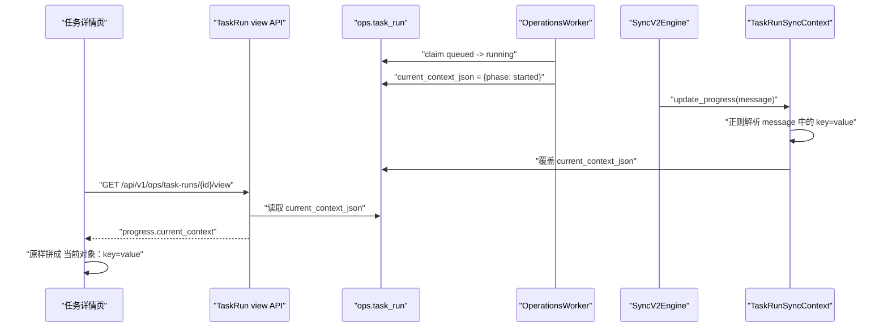
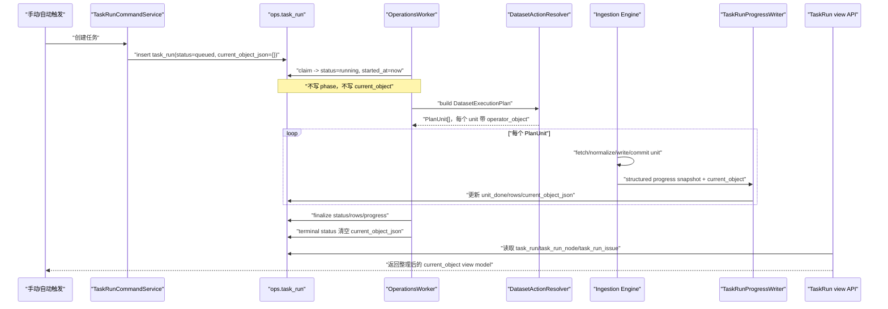
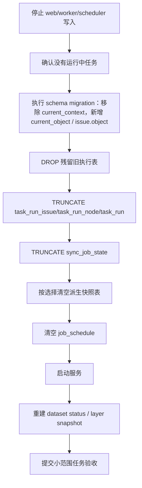

# Ops 任务当前对象语义与运行观测数据重置方案 v1

状态：已评审，待实施  
日期：2026-04-26  
适用范围：Ops 任务详情页、TaskRun view API、TaskRun 运行时进度写回、ops 运行观测数据清空重建

---

## 0. 结论摘要

当前任务详情页出现 `当前对象：phase=started` 和任务结束后 `当前对象：暂无当前对象`，根因不是前端文案问题，而是运行观测模型语义混乱：

1. `ops.task_run.current_context_json` 同时承载了运行阶段、取消请求、当前业务对象等不同语义。
2. 后端 worker 在 claim 任务时写入 `{"phase": "started"}`，该值已经真实落库。
3. TaskRun 进度适配层通过解析进度字符串生成 context，缺少结构化契约。
4. 前端把 API 返回的 `progress.current_context` 原样按 `key=value` 展示，导致内部字段泄漏给用户。

本方案不做临时过滤，不做 `phase` 黑名单补丁，而是重新定义：

1. 页面是否展示“当前对象”。
2. 运行时如何结构化写入“当前处理对象”。
3. 失败位置、停止位置、运行阶段分别落到哪里。
4. 旧 ops 运行观测数据如何停机清空，避免历史脏数据继续误导页面。

评审结论：

1. `current_context` 语义确认删除，不做兼容保留。
2. 任务结束态确认不展示当前对象。
3. `task_run_issue.object_json` 确认新增，用于承载问题位置。
4. `ops.sync_job_state` 确认不作为长期模型保留；本专项先清空并禁止继续作为任务详情或新观测事实源，后续 Date Model Freshness 收口必须彻底移除表、模型和服务引用。
5. `ops.job_schedule` 确认随本轮运行观测数据重置一起清空，自动任务配置后续专项重建。

---

## 1. 现状事实

### 1.1 当前写入链路



### 1.2 已发现的问题

| 问题 | 说明 | 影响 |
| --- | --- | --- |
| 运行阶段写入当前对象 | `{"phase": "started"}` 是 worker 启动占位，不是业务对象 | 用户看到无法理解的信息 |
| 取消请求混入当前对象 | `cancel_requested_by_user_id` 也可能进入 `current_context_json` | 当前对象字段继续变成杂物篮 |
| 字符串解析生成结构化数据 | `TaskRunSyncContext` 通过正则解析 progress message | 数据集稍有差异就会丢失对象信息 |
| 前端展示原始 key | 页面展示 `ts_code=...`、`phase=...` | UI 语言不面向运营用户 |
| 结束态仍展示当前对象槽位 | success / failed 后“当前对象”已无实时含义 | 出现“暂无当前对象”这种低价值文案 |

### 1.3 数据脏污判断

`ops.task_run.current_context_json = {"phase": "started"}` 是真实写入数据库的运行观测数据。它不污染业务行情数据，但污染了任务观测数据。

当前 `ops` 运行观测数据里可能存在：

1. `{"phase": "started"}`。
2. `{}` 空对象。
3. `{"cancel_requested_by_user_id": ...}`。
4. 混有技术 key 的对象，如 `ts_code/freq/start_date/end_date`。
5. 历史旧表中的重复任务日志、错误全文、旧执行状态。

因此，后续应对 ops 运行观测表做一次停机清空重建，不能继续把这些历史数据作为新页面验收依据。

---

## 2. 目标与非目标

### 2.1 目标

1. 明确“当前对象”只表达运行中的业务处理对象。
2. 彻底移除 `current_context` 这个含糊语义，改为结构化 `current_object`。
3. 禁止运行阶段、取消人、统计行数、技术诊断混入当前对象。
4. 前端只展示 API 已整理好的运营语言，不再拼接原始 key。
5. 失败位置、停止位置进入 issue 或节点诊断，不和进度条混在一起。
6. 停机清空旧 ops 运行观测数据，消除历史脏数据对后续验收的干扰。
7. 明确所有 Ops 状态写入与业务数据读写/提交隔离，状态失败不得影响业务数据表事务。

### 2.2 非目标

1. 不修改业务数据表，如 `raw_tushare.*`、`core_serving.*`、`core_serving_light.*`。
2. 不新增 checkpoint、断点重跑、定点恢复能力。
3. 不引入追加式 event stream。
4. 不保留 `current_context` 兼容字段。
5. 不让前端按 dataset_key 写专用分支。

### 2.3 硬约束：状态写入不得影响业务数据

所有 Ops 状态写入，包括但不限于 TaskRun、TaskRunNode、TaskRunIssue、freshness、dataset snapshot、schedule、probe、状态重建结果，都不得影响业务数据表的读取、写入和事务提交。

业务数据表包括但不限于：

1. `raw_tushare.*` / `raw_biying.*` 等 raw 表。
2. `core_*` / `core_serving.*` / `core_serving_light.*`。
3. 标准化、融合、发布链路中的业务结果表。

执行要求：

1. 业务数据事务与 Ops 状态事务必须隔离。
2. Ops 状态写入失败只允许让状态进入失败、待对账或待重建，不允许回滚已经提交的业务数据。
3. Ops 状态写入失败不得阻塞业务数据提交。
4. 任何方案不得提供“状态失败是否回滚业务数据”的开关。
5. 测试必须覆盖状态写入失败时业务数据仍然可见。

---

## 3. 产品语义定义

### 3.1 “当前对象”是否展示

| 任务状态 | 是否展示当前对象 | 页面文案 | 原因 |
| --- | --- | --- | --- |
| `queued` | 否 | 不展示该行 | 任务尚未进入处理单元 |
| `running` | 有明确对象才展示 | `正在处理：xxx` | 用户需要知道当前处理到哪里 |
| `canceling` | 有明确对象才展示 | `正在停止：xxx` | 用户需要知道停止正在等待哪个处理边界 |
| `success` | 否 | 不展示该行 | 任务已结束，“当前”语义失效 |
| `failed` | 否 | 失败位置展示在问题卡片 | 失败不是当前进度，应归属问题诊断 |
| `partial_success` | 否 | 问题位置展示在问题卡片 | 部分成功同样属于结果诊断 |
| `canceled` | 否 | 停止位置展示在问题卡片或节点摘要 | 任务已停止，“当前”语义失效 |

### 3.2 当前对象展示样式

不再展示：

```text
当前对象：ts_code=000001.SZ，security_name=平安银行，freq=60min
```

改为展示运营语言：

```text
正在处理：平安银行（000001.SZ）
频率：60min · 时间：2026-01-05 ~ 2026-04-24
```

热榜类数据集示例：

```text
正在处理：2026-04-24 · 人气榜
```

无证券对象、只有时间对象时：

```text
正在处理：2026-04-24
```

### 3.3 失败位置展示规则

失败后不再在进度条下展示“当前对象”。如果后端能定位失败对象，应进入主问题卡片：

```text
问题位置：平安银行（000001.SZ）
处理范围：2026-01-05 ~ 2026-04-24 · 60min
```

完整技术错误仍只在 issue detail 中按需打开，不复制到主页面其他区域。

---

## 4. 数据模型设计

### 4.1 TaskRun 主表

将 `ops.task_run.current_context_json` 替换为 `current_object_json`。

```text
ops.task_run
  current_object_json jsonb not null default '{}'::jsonb
```

字段语义：

1. 只保存运行中的当前业务对象。
2. 任务未进入具体处理单元时为空。
3. 任务结束时清空。
4. 不保存运行阶段、取消人、技术错误、行数统计。

禁止键：

| 禁止内容 | 禁止原因 | 正确落点 |
| --- | --- | --- |
| `phase` / `started` | 运行阶段不是业务对象 | `task_run.status`、`started_at` |
| `cancel_requested_by_user_id` | 取消请求不是业务对象 | `cancel_requested_at`，必要时单独审计 |
| `fetched` / `written` / `committed` | 行数统计不是对象 | `rows_fetched`、`rows_saved` |
| `technical_message` | 技术诊断不是对象 | `task_run_issue.technical_message` |
| `source_phase` | 内部阶段不是对象 | `task_run_issue.source_phase` |

### 4.2 当前对象结构

DB 存结构化 token，不存最终 UI 文案。

```json
{
  "entity": {
    "kind": "security",
    "code": "000001.SZ",
    "name": "平安银行"
  },
  "time": {
    "kind": "range",
    "start_date": "2026-01-05",
    "end_date": "2026-04-24"
  },
  "attributes": {
    "freq": "60min",
    "hot_type": "人气榜"
  }
}
```

字段说明：

| 字段 | 说明 |
| --- | --- |
| `entity.kind` | `security` / `index` / `board` / `dataset` / `date` / `enum` |
| `entity.code` | 证券代码、指数代码、板块代码等 |
| `entity.name` | 用户可理解名称 |
| `time.kind` | `point` / `range` / `month` / `none` |
| `attributes` | 频率、榜单类型、市场等业务属性 |

### 4.3 Issue 失败位置

为避免失败后继续复用“当前对象”，问题诊断需要自己的定位字段。

```text
ops.task_run_issue
  object_json jsonb not null default '{}'::jsonb
```

语义：

1. `object_json` 表示问题发生位置。
2. 只在失败、部分成功、停止等需要定位时写入。
3. 页面问题卡片可展示 `问题位置`。
4. 技术错误仍在 `technical_message` 和 `technical_payload_json`。

### 4.4 Node 节点上下文

`ops.task_run_node.context_json` 保留为节点级上下文，但不得承载完整错误或当前对象快照。

允许内容：

1. `run_profile`。
2. `dataset_key`。
3. `node_role`。
4. 必要的节点摘要。

不允许内容：

1. 完整技术错误。
2. 当前对象实时快照。
3. 大量重复 progress message。

---

## 5. 后端写入链路

### 5.1 新写入时序



### 5.2 Foundation 到 Ops 的结构化契约

当前 `TaskRunSyncContext.update_progress()` 只能收到 `message: str`，这是问题源头之一。

目标契约：

```python
@dataclass(frozen=True)
class ProgressSnapshot:
    execution_id: int | None
    dataset_key: str
    unit_total: int
    unit_done: int
    unit_failed: int
    rows_fetched: int
    rows_saved: int
    rows_rejected: int
    current_object: dict[str, Any]
```

要求：

1. Engine 不再让 Ops 从 message 里解析对象。
2. message 只作为日志/摘要，不作为结构化数据来源。
3. `PlanUnit` 生成时必须提供 `operator_object` 或等价字段。
4. Foundation 只提供 token，不生成页面文案。
5. Ops QueryService 负责把 token 转成 API view model。

### 5.3 PlanUnit 对象来源

`DatasetActionResolver` / planner 在生成 `PlanUnit` 时确定处理对象。

示例：

```json
{
  "unit_id": "stk_mins:000001.SZ:60min:2026-01-05:2026-04-24",
  "operator_object": {
    "entity": {
      "kind": "security",
      "code": "000001.SZ",
      "name": "平安银行"
    },
    "time": {
      "kind": "range",
      "start_date": "2026-01-05",
      "end_date": "2026-04-24"
    },
    "attributes": {
      "freq": "60min"
    }
  }
}
```

普通单日数据集：

```json
{
  "entity": {
    "kind": "date",
    "name": "2026-04-24"
  },
  "time": {
    "kind": "point",
    "trade_date": "2026-04-24"
  },
  "attributes": {}
}
```

榜单枚举扇出：

```json
{
  "entity": {
    "kind": "enum",
    "name": "人气榜"
  },
  "time": {
    "kind": "point",
    "trade_date": "2026-04-24"
  },
  "attributes": {
    "hot_type": "人气榜"
  }
}
```

---

## 6. API 设计

### 6.1 TaskRun view API

接口保持任务详情唯一入口：

```text
GET /api/v1/ops/task-runs/{task_run_id}/view
```

`progress.current_context` 下线，替换为 `progress.current_object`。

运行中、有对象：

```json
{
  "progress": {
    "unit_total": 29160,
    "unit_done": 28460,
    "unit_failed": 0,
    "progress_percent": 97,
    "rows_fetched": 125327067,
    "rows_saved": 125327067,
    "rows_rejected": 0,
    "current_object": {
      "title": "正在处理：康比特（920429.BJ）",
      "description": "频率：60min · 时间：2026-01-05 ~ 2026-04-24",
      "fields": [
        {"label": "证券代码", "value": "920429.BJ"},
        {"label": "证券名称", "value": "康比特"},
        {"label": "频率", "value": "60min"},
        {"label": "处理范围", "value": "2026-01-05 ~ 2026-04-24"}
      ]
    }
  }
}
```

结束态或无对象：

```json
{
  "progress": {
    "unit_total": 5,
    "unit_done": 5,
    "unit_failed": 0,
    "progress_percent": 100,
    "rows_fetched": 1530,
    "rows_saved": 1530,
    "rows_rejected": 0,
    "current_object": null
  }
}
```

### 6.2 Issue API

问题摘要可返回问题位置：

```json
{
  "primary_issue": {
    "id": 88,
    "severity": "error",
    "code": "execution_failed",
    "title": "任务处理失败",
    "operator_message": "任务处理过程中发生异常，需要查看技术诊断后决定是否重提。",
    "object": {
      "title": "问题位置：康比特（920429.BJ）",
      "description": "频率：60min · 时间：2026-01-05 ~ 2026-04-24"
    }
  }
}
```

完整技术诊断仍通过：

```text
GET /api/v1/ops/task-runs/{task_run_id}/issues/{issue_id}
```

---

## 7. 页面设计

### 7.1 运行中

```text
┌──────────────────────────────────────────────┐
│ 当前进度                                     │
│ 28460 / 29160                         97%    │
│ ███████████████████████████████░░░░░░░       │
│                                              │
│ 正在处理：康比特（920429.BJ）                │
│ 频率：60min · 时间：2026-01-05 ~ 2026-04-24 │
│                                              │
│ 读取 125,327,067   保存 125,327,067   拒绝 0 │
└──────────────────────────────────────────────┘
```

### 7.2 成功结束

```text
┌──────────────────────────────────────────────┐
│ 当前进度                                     │
│ 29160 / 29160                        100%    │
│ ██████████████████████████████████████       │
│                                              │
│ 读取 128,560,821   保存 128,560,821   拒绝 0 │
└──────────────────────────────────────────────┘
```

成功态不展示“当前对象”，也不展示“暂无当前对象”。

### 7.3 失败结束

```text
┌──────────────────────────────────────────────┐
│ 任务处理失败                                 │
│ 问题位置：康比特（920429.BJ）                │
│ 处理范围：2026-01-05 ~ 2026-04-24 · 60min   │
│ 建议：先确认已保存数据和失败位置，再决定重提 │
│ [查看技术诊断]                               │
└──────────────────────────────────────────────┘

┌──────────────────────────────────────────────┐
│ 当前进度                                     │
│ 28460 / 29160                         97%    │
│ ███████████████████████████████░░░░░░░       │
│ 读取 125,327,067   保存 125,327,067   拒绝 0 │
└──────────────────────────────────────────────┘
```

失败态不在进度条下继续展示“当前对象”。

---

## 8. Ops 运行观测数据清空重建

### 8.1 清空原则

1. 只清 ops 运行观测、派生快照和调度历史。
2. 不清业务数据表。
3. 不清用户、权限、账号。
4. 不清 DatasetDefinition、数据源事实、业务配置，除非本方案明确列入可选重置。
5. 新链路上线后再清旧数据，避免清完后继续写入旧脏字段。

### 8.2 必清范围

| 表 | 动作 | 原因 |
| --- | --- | --- |
| `ops.task_run_issue` | `TRUNCATE` | 旧 issue 可能关联旧 context/错误复制语义 |
| `ops.task_run_node` | `TRUNCATE` | 节点上下文历史语义不稳定 |
| `ops.task_run` | `TRUNCATE` | 当前对象字段存在脏值，任务历史已不可信 |
| `ops.sync_job_state` | `TRUNCATE`，并列入 Date Model Freshness 收口退场 TODO | 旧同步状态含 `job_name/full_sync_done/last_cursor` 等旧语义，不作为长期模型保留 |

### 8.3 若生产库仍存在则删除的旧表

这些表已经不应作为当前事实源存在；若数据库里仍残留，直接 `DROP TABLE IF EXISTS`。

| 表 | 动作 |
| --- | --- |
| `ops.job_execution_event` | `DROP TABLE IF EXISTS` |
| `ops.job_execution_unit` | `DROP TABLE IF EXISTS` |
| `ops.job_execution_step` | `DROP TABLE IF EXISTS` |
| `ops.job_execution` | `DROP TABLE IF EXISTS` |
| `ops.sync_run_log` | `DROP TABLE IF EXISTS` |

### 8.4 可重建派生快照

这些表不是业务数据，是 ops 派生观测。清空后必须立即执行重建任务。

| 表 | 建议 | 重建要求 |
| --- | --- | --- |
| `ops.dataset_status_snapshot` | 可清空 | 运行数据集状态重建命令或服务 |
| `ops.dataset_layer_snapshot_current` | 可清空 | 重新计算分层状态 |
| `ops.dataset_layer_snapshot_history` | 可清空 | 历史快照不可信时清空 |
| `ops.probe_run_log` | 可清空 | 探针运行历史不作为业务事实 |

### 8.5 配置表处理

| 表 | 默认动作 | 说明 |
| --- | --- | --- |
| `ops.job_schedule` | 清空 | 自动任务配置当前待重建；本轮先清空，后续自动任务专项重建 |
| `ops.probe_rule` | 保留 | 探针规则是配置，不是运行历史 |
| `ops.dataset_pipeline_mode` | 保留 | 数据集管线配置 |
| `ops.index_series_active` | 保留 | 指数池配置/事实，不属于运行观测历史 |
| `ops.std_mapping_rule` | 保留 | 标准化映射规则 |
| `ops.std_cleansing_rule` | 保留 | 清洗规则 |
| `ops.config_revision` | 保留 | 配置版本记录，除非另立配置重建专项 |
| `ops.resolution_release` / `ops.resolution_release_stage_status` | 保留 | 融合发布配置/状态，非本轮任务详情问题 |

### 8.6 清空顺序



### 8.7 SQL 草案

实际执行前必须根据线上表存在性生成最终 SQL。草案如下：

```sql
begin;

drop table if exists ops.job_execution_event cascade;
drop table if exists ops.job_execution_unit cascade;
drop table if exists ops.job_execution_step cascade;
drop table if exists ops.job_execution cascade;
drop table if exists ops.sync_run_log cascade;

truncate table
  ops.task_run_issue,
  ops.task_run_node,
  ops.task_run
restart identity cascade;

truncate table ops.sync_job_state;

truncate table
  ops.dataset_status_snapshot,
  ops.dataset_layer_snapshot_current,
  ops.dataset_layer_snapshot_history,
  ops.probe_run_log;

truncate table ops.job_schedule restart identity cascade;

commit;
```

### 8.8 `ops.sync_job_state` 退场 TODO

`ops.sync_job_state` 不再被接受为长期模型。它表达的是旧 `job_name` 维度的同步状态，和当前 DatasetDefinition、Date Model、TaskRun 观测主线都不一致。

本专项处理：

1. 清空 `ops.sync_job_state`，避免旧状态继续误导页面和对账。
2. 禁止任务详情、TaskRun view API、当前对象、问题诊断继续依赖该表。
3. 不新增任何新的 `sync_job_state` 写入路径。

Date Model Freshness 收口必须完成：

1. 审计所有 `SyncJobState` ORM、service、CLI、测试引用。
2. 将数据集新鲜度和资源状态改为基于 DatasetDefinition Date Model 与真实业务表观测结果。
3. 删除 `src/ops/models/ops/sync_job_state.py`。
4. 删除 `operations_sync_job_state_reconciliation_service` 等仅服务旧状态表的代码。
5. 删除数据库表 `ops.sync_job_state`。
6. 更新 docs/AGENTS，禁止新代码重新引入 `sync_job_state`。

执行判断：

1. 如果本专项实现时发现 `ops.sync_job_state` 已无有效业务依赖，应直接纳入本轮删除。
2. 如果仍被 Date Model Freshness 或数据集卡片计算依赖，则不得隐性保留，必须作为 Date Model Freshness 收口的 P0 任务完成。

---

## 9. 实施 Milestone

### M1：语义与 schema 收口

1. `ops.task_run.current_context_json` 下线。
2. `ops.task_run.current_object_json` 新增。
3. `ops.task_run_issue.object_json` 新增。
4. Python schema / TS type 删除 `current_context`，新增 `current_object`。
5. 任何代码不得继续写入 `phase` 到对象字段。

验收：

1. 全仓搜索无 `current_context_json` 主链写入。
2. API 类型中无 `progress.current_context`。
3. worker claim 只更新 `status/started_at`，不写对象。

### M2：结构化进度契约

1. `ProgressSnapshot` 增加 `current_object`。
2. Engine 从 `PlanUnit.operator_object` 传递当前对象。
3. `TaskRunSyncContext` 不再正则解析 message 生成对象。
4. message 仅作人类摘要，不作为结构化事实源。

验收：

1. 单元测试覆盖 message 中没有对象字段时，current_object 仍可正确写入。
2. message 中出现 `phase` 也不会进入对象字段。
3. `rows_*` 与对象字段分离。

### M3：PlanUnit 对象生成

1. 通用 planner 为日期、枚举、证券池生成 `operator_object`。
2. `stk_mins` 等自定义策略生成证券 + 频率 + 时间范围对象。
3. 榜单类数据集生成榜单类型对象。
4. 无对象任务保持空对象，不强行展示。

验收：

1. `stk_mins` 运行中显示证券、频率、时间范围。
2. `dc_hot` 运行中显示日期和榜单类型。
3. 普通单日数据集显示日期。
4. 无时间维度任务不展示空文案。

### M4：TaskRun view API 与页面

1. API 返回 `progress.current_object: null | {title, description, fields}`。
2. 前端删除 `formatContext()`。
3. 运行中有对象才展示“正在处理”。
4. 结束态不展示“暂无当前对象”。
5. 失败位置从 issue object 展示，不复用进度当前对象。

验收：

1. 运行中不出现 `key=value` 原始串。
2. 页面不出现 `phase=started`。
3. 成功态不出现 `暂无当前对象`。
4. 失败态问题位置只展示一处。

### M5：ops 运行观测数据清空

1. 停止 web/worker/scheduler 写入。
2. 执行 schema migration。
3. drop 残留旧执行表。
4. truncate 必清表。
5. 清空派生快照和 `ops.job_schedule`。
6. 启动服务并重建派生状态。

验收：

1. `ops.task_run*` 为空后，新任务重新生成干净记录。
2. 旧 `job_execution*` / `sync_run_log` 不存在。
3. 数据集卡片状态可通过重建任务恢复。
4. 自动任务页明确显示待配置状态。

### M5.5：`ops.sync_job_state` 退场审计

1. 审计 `SyncJobState` ORM、service、CLI、测试、文档引用。
2. 判断是否可在本专项直接删除表和代码。
3. 若可删除，纳入本专项完成。
4. 若仍被 Date Model Freshness 依赖，必须把阻塞引用写入 freshness 收口 TODO，并作为后续 P0 完成。

验收：

1. 本专项不新增任何 `sync_job_state` 写入。
2. TaskRun 详情、当前对象、问题诊断不读 `sync_job_state`。
3. Date Model Freshness 文档中存在明确的 `sync_job_state` 删除门禁。

### M6：回归与门禁

1. 后端 TaskRun API 测试。
2. 前端任务详情测试。
3. smoke 覆盖任务记录、任务详情成功态、失败态、运行态。
4. 文档校验。

验收命令：

```bash
pytest -q tests/web/test_ops_task_run_api.py
cd frontend && PLAYWRIGHT_BROWSERS_PATH=.playwright npm run test:smoke:ci
python3 scripts/check_docs_integrity.py
```

---

## 10. 已确认决策

### D1：是否直接删除 `current_context` 语义

结论：删除。  
原因：该字段已经被污染，继续保留只会诱导后续代码兼容旧错误。

### D2：结束态是否一律不展示当前对象

结论：不展示。  
原因：`current` 是实时语义，任务结束后只展示结果、问题位置或节点摘要。

### D3：是否新增 `task_run_issue.object_json`

结论：新增。  
原因：失败位置和当前对象不是同一个语义，不能再混用一个字段。

### D4：`ops.sync_job_state` 如何处理

结论：本轮清空，并列为 Date Model Freshness 收口 P0 退场 TODO。  
原因：该表带有旧 `job_name/full_sync_done/last_cursor` 语义，已多次引发误判；长期必须由 DatasetDefinition Date Model 与真实业务表观测结果替代。

### D5：`ops.job_schedule` 是否随本轮清空

结论：清空。  
原因：它是配置表，不是纯运行历史；清空后自动任务页会进入待配置状态。

---

## 11. 完成定义

本专项完成必须同时满足：

1. 代码中不存在 TaskRun 主链继续写 `current_context_json`。
2. TaskRun view API 不再返回 `progress.current_context`。
3. 页面不再出现 `当前对象：phase=started`。
4. 页面不再出现 `当前对象：暂无当前对象`。
5. 运行中任务有明确对象时展示用户可读的“正在处理”。
6. 结束态任务不展示当前对象槽位。
7. 失败位置只在问题卡片展示，不在进度区重复展示。
8. 旧 ops 运行观测数据完成清空或 drop。
9. 新任务生成的 `ops.task_run*` 数据无运行阶段、取消人、技术错误混入对象字段。
10. 后端 API、前端 smoke、文档校验全部通过。
