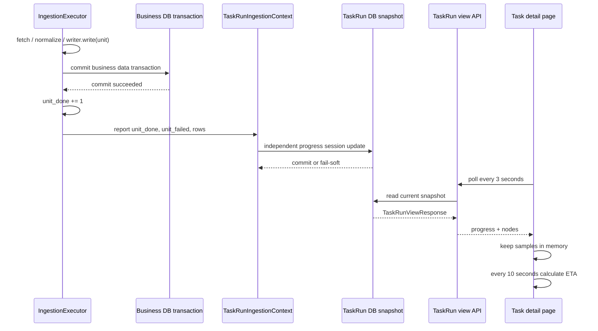
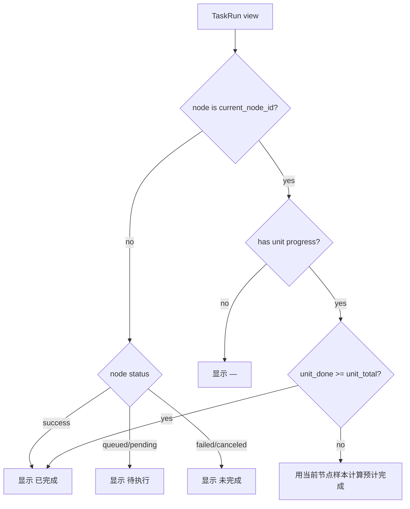

# Ops 任务详情实时 Unit 预计完成时间 LLD v1

状态：已实现，已通过本地定向验证，待发版验收

日期：2026-08-21
适用范围：Ops 任务详情页、TaskRun view API、TaskRun 运行时进度写回、数据维护执行过程

## 1. 文档目的

本 LLD 将“任务详情页执行过程增加预计完成时间”落到当前代码结构，先完成代码审计和实现边界确认，不在本轮修改生产代码。

本需求的唯一业务目标是：在任务详情页的“执行过程”列表中增加“预计完成”列，每 10 秒采样一次当前逻辑 unit 进度，并与上一次采样比较，实时计算当前执行节点预计完成时间。

本需求不把 ETA 当成任务事实，不新增数据库字段、数据表、事件日志、缓存或 API 持久化字段。

## 2. 已确认的硬口径

1. 一个“请求”按一个逻辑 `unit` 计算，不按 HTTP 请求、分页页数或单次 source fetch 计算。
2. 只有一个 unit 的业务数据事务已经提交，才算这个 unit 完成并进入速度统计。
3. 每 10 秒采样并重新计算一次；每次使用当前采样与上一次采样之间完成的 unit 数。
4. 设当前采样已提交完成数量为 `done_now`，上一次采样已提交完成数量为 `done_prev`，总 unit 数为 `total`，两次采样的实际间隔为 `window_seconds`：
   - `rate = delta_done / window_seconds`
   - `delta_done = max(done_now - done_prev, 0)`
   - `remaining = max(total - done_now, 0)`
   - `eta_seconds = remaining / rate`
5. 没有上一次采样、两次采样间没有完成 unit 或速度小于等于 0 时，不显示虚假的时间，只显示“正在计算”或“暂不可估算”。
6. `done_now >= total` 时显示“已完成”，不再显示未来时间。
7. ETA 只在浏览器内存中存在，刷新页面、关闭页面或打开另一个浏览器标签页后重新计算，不写入数据库、Redis、localStorage、sessionStorage 或 TaskRun JSON。
8. 单任务和工作流都使用同一个 `GET /api/v1/ops/task-runs/{id}/view` 快照；工作流只对当前正在执行的节点显示 ETA，不为尚未开始的后续节点猜测完成时间。

## 3. 当前代码审计结论

### 3.1 页面和 API 事实源

当前详情页 [ops-task-detail-page.tsx](/Users/congming/github/goldenshare/frontend/src/pages/ops-task-detail-page.tsx) 已经只调用一个 TaskRun view API：

```text
GET /api/v1/ops/task-runs/{task_run_id}/view
```

页面在 `queued/running/canceling` 状态下每 3 秒轮询，终态停止轮询。执行过程列表使用 `view.nodes`，当前列为：

```text
序号、执行节点、状态、结果、时间、耗时
```

当前没有 ETA 状态、速率样本或本地估算器。

后端入口是 [task_runs.py](/Users/congming/github/goldenshare/src/ops/api/task_runs.py) 的 `GET /{task_run_id}/view`，查询实现位于 [task_run_query_service.py](/Users/congming/github/goldenshare/src/ops/queries/task_run_query_service.py) 的 `TaskRunQueryService.get_view()`。它读取一个 `TaskRun`、其 `TaskRunNode` 列表和问题摘要，按 `sequence_no,id` 返回节点，不拼接旧任务表或旧日志。

因此，页面增加 ETA 不需要新增查询接口；现有轮询已经提供了实时样本入口。

### 3.2 当前持久化模型

`TaskRun` 当前保存：

```text
unit_total
unit_done
unit_failed
progress_percent
current_node_id
rows_fetched / rows_saved / rows_rejected
current_object_json
started_at / ended_at
```

`TaskRunNode` 当前保存节点身份、状态、行数、诊断、开始结束时间和耗时，但没有独立的 unit 计数或 ETA 字段。

`TaskRunNodeItem` 和前端 `TaskRunNodeItem` 类型也没有 ETA 字段。

这意味着本需求不应给 node 表或 TaskRun 增加 ETA 列。ETA 是由页面根据已有快照临时计算的展示结果，而不是后端事实字段。

### 3.3 Unit 完成边界

在 [executor.py](/Users/congming/github/goldenshare/src/foundation/ingestion/executor.py) 的串行处理路径中，顺序是：

```text
fetch unit
  -> normalize
  -> writer.write
  -> 业务 session.commit()
  -> unit_done += 1
  -> report progress
```

并发 fetch 路径仍由主线程执行 normalize、writer、commit 和进度报告；staged stream 路径在 `publisher.finalize_unit` 完成后才增加 `unit_done`。因此，执行器内部具备“业务提交后才计数”的正确边界。

### 3.4 当前存在的进度语义缺口

在 [service.py](/Users/congming/github/goldenshare/src/foundation/ingestion/service.py) 的 `_progress_reporter()` 中，当前写回的是：

```python
current = progress_snapshot.unit_done + progress_snapshot.unit_failed
```

随后 [task_run_ingestion_context.py](/Users/congming/github/goldenshare/src/ops/services/task_run_ingestion_context.py) 把 `current` 写入 `task_run.unit_done`，但没有单独写入 `task_run.unit_failed`。

这会导致当前数据库字段 `task_run.unit_done` 实际表达“已处理 unit”，而不是严格的“已提交成功 unit”。它与本需求的速度统计口径不一致：失败 unit 不能被算作已提交入库 unit。

因此，正式开发前必须修正这个已有契约：

```text
task_run.unit_done   = 已完成业务提交的 unit 数
task_run.unit_failed = 已终态失败的 unit 数
progress_percent     = 继续按现有页面进度语义计算已处理比例
```

这不是新增 ETA 存储，而是把现有进度字段恢复为可被详情页可靠消费的事实语义。此修正会影响现有 TaskRun 进度消费者，必须在 implementation 阶段做全量消费者审计和回归测试，不能只改一个写入点。

### 3.5 Ops 状态写入与业务事务隔离

`TaskRunIngestionContext.update_progress()` 使用独立 SQLAlchemy session 写 TaskRun 状态。业务数据由 ingestion session 提交，进度写入失败时只回滚进度 session，不回滚业务事务。

这个隔离必须保留：

```text
业务数据事务提交成功
  -> 尝试写 TaskRun 进度快照
  -> 进度写入失败时页面可能暂时不更新
  -> 不得阻断或回滚业务数据
```

ETA 只能接受页面看到的最新快照；不能为了提高 ETA 精度把页面计算、状态写入或新的实时通道塞进业务事务。

### 3.6 工作流节点语义

在 [task_run_dispatcher.py](/Users/congming/github/goldenshare/src/ops/runtime/task_run_dispatcher.py) 中：

1. 单数据集任务创建一个 `dataset_plan` 节点。
2. 工作流按顺序创建 `workflow_step` 节点，一次只执行一个步骤。
3. 当前步骤执行数据集动作时，步骤使用与父 TaskRun 相同 id 的临时执行上下文；进度快照仍由同一个 TaskRun view API 对外提供。
4. `current_node_id` 指向当前正在执行的节点。
5. 工作流结束时，父 TaskRun 的最终 `unit_total/unit_done/unit_failed` 会收敛为工作流步骤统计。

当前 view API 不单独投影 `current_node_id`；页面根据节点列表中唯一的 `status=running` 节点确定活动节点，这与 Dispatcher 的“一次只运行一个节点”约束一致。运行中的工作流把当前 TaskRun 进度解释为该活动节点进度；后续节点显示“待执行”，已结束节点显示“已完成”，不能把工作流最终步骤总数与当前数据集步骤的 unit 总数同时当成 ETA 分母。

## 4. 推荐目标设计

### 4.1 计算位置

推荐由任务详情页在浏览器内存中计算 ETA：

```text
worker
  -> 业务事务提交
  -> TaskRun progress snapshot
  -> GET /task-runs/{id}/view
  -> 页面保留最近样本（React state/ref）
  -> 每 10 秒采样并计算 unit 完成速度
  -> 执行过程“预计完成”列展示
```

这样满足“不落数据库存储”，也不新增 Redis、SSE、WebSocket、outbox 或事件表。现有 3 秒轮询继续复用，不新增后端轮询任务。

### 4.2 浏览器临时样本

页面为当前 `taskRunId + current_node_id + unit_total` 保留上一次 ETA 采样和当前最新快照。每次收到 view API 响应时：

1. 读取严格语义的 `progress.unit_done` 和 `progress.unit_total`。
2. 使用浏览器单调时钟 `performance.now()` 记录采样时间；不依赖用户系统时钟计算间隔。
3. 每个 10 秒计算点把当前快照与上一个计算点配对；中间 3 秒轮询只更新最新快照，不形成额外历史速度记录。
4. 页面只在内存中保留当前快照和上一次采样，不写入任何持久化存储。
5. `current_node_id` 或 `unit_total` 变化时清空旧样本，避免把不同节点或不同计划的速度混在一起。

### 4.3 10 秒采样计算

在页面本地每 10 秒触发一次计算。两次计算之间继续使用现有 3 秒轮询获取最新快照；计算点取计算时刻最新收到的快照。伪代码如下：

```text
now = monotonic_now()
current = latest.unit_done
total = latest.unit_total
previous = previous_eta_sample

if total <= 0:
    state = unavailable
elif current >= total:
    state = completed
elif previous is missing:
    state = warming_up
else:
    delta_done = max(current - previous.unit_done, 0)
    window_seconds = now - previous.monotonic_time
    if delta_done <= 0 or window_seconds <= 0:
        state = unavailable
    else:
        rate = delta_done / window_seconds
        remaining = max(total - current, 0)
        eta_seconds = remaining / rate
        state = ready(eta_seconds)
```

关键点：

1. 分母是当前剩余 unit 数，不是总 unit 数；总数只用于计算剩余量。
2. 统计事件是 unit 完成提交后的进度快照变化，不是分页完成、HTTP 返回或请求开始。
3. 如果两个采样点相隔约 10 秒且完成了 5 个 unit，则按 `5 / 实际间隔` 计算；如果当前已完成 200/1000，则剩余量是 800，不是 1000。
4. 如果中间 3 秒轮询跳过了多个 unit，使用两个采样点的完成数差值一次性计入，不伪造中间 unit 时间。
5. 如果速度为 0，不显示“无限久”或错误的时间点。

### 4.4 任务详情列展示

执行过程列表新增一列：`预计完成`。

| 节点状态 | 预计完成列展示 |
| --- | --- |
| 待执行工作流节点 | `待执行` |
| 当前节点，样本不足 10 秒 | `正在计算` |
| 当前节点，两次采样间无 unit 完成 | `暂不可估算` |
| 当前节点，有效速度已计算 | 绝对时间点，例如 `2026/08/21 15:42` |
| 当前节点 `success` | `已完成` |
| 当前节点 `failed/canceled` | `未完成`，不展示虚假时间 |
| 历史已完成节点 | `已完成` |
| 无 unit 进度的维护动作 | `—` |

“预计完成”表示当前执行节点完成，不代表整个工作流全部完成。工作流整体预计完成时间不在本期范围内。

### 4.5 页面轮询与刷新行为

1. 保持活动任务 3 秒轮询，不把轮询改成 10 秒；3 秒轮询保证页面较快看到 unit commit，10 秒只是采样和重算周期。
2. 轮询响应作为样本输入；不额外请求 ETA API。
3. 任务完成、失败、取消后停止采样并展示终态文案。
4. 浏览器刷新后重新进入预热期，这是无持久化的必然行为，不应伪造历史速度。
5. 两个浏览器标签页分别计算，各自只反映本标签页已经观察到的快照。

## 5. API 与数据契约

### 5.1 不新增 API 和持久化字段

本期不新增：

```text
数据库字段
数据库表
Alembic migration
Redis key
TaskRun JSON ETA 字段
WebSocket/SSE 通道
ETA API
```

现有 `TaskRunViewResponse` 和 `TaskRunNodeItem` 不需要返回 `eta_seconds` 或 `estimated_completion_at`。这些字段如果由后端返回，就会被误认为持久化事实，且会把浏览器实时状态和任务历史状态混在一起。

### 5.2 必须修正的现有进度写回契约

implementation 阶段需要让 `ProgressSnapshot` 的两个计数原样传到 `TaskRunIngestionContext.update_progress()`：

```text
ProgressSnapshot.unit_done   -> TaskRun.unit_done
ProgressSnapshot.unit_failed -> TaskRun.unit_failed
```

`current` 不能再作为唯一参数承载二者之和。可以保留一个用于页面百分比的 handled count，但不能把它写入 `unit_done`。

需要全量审计的消费者：

1. `TaskRunQueryService` 和 `TaskRunProgress` schema。
2. 任务列表、任务详情页、工作流节点进度和进度条。
3. `TaskRunDispatcher` 的单任务成功、失败、取消和工作流终态收口。
4. `TaskRunIngestionContext` 及其所有测试替身。
5. Foundation progress reporter、executor 以及 CLI 进度输出。
6. TaskRun completion worker、通知摘要和任何根据 `unit_done` 判断状态的代码。
7. 相关 API、前端类型、前端测试和文档。

## 6. 代码改动边界（implementation 阶段）

### 6.1 必改范围

1. `src/foundation/ingestion/service.py`：传递明确的成功 unit 数和失败 unit 数。
2. `src/ops/services/task_run_ingestion_context.py`：分开写入 `unit_done` 与 `unit_failed`，保留 Ops 与业务事务隔离。
3. 与上述契约直接相关的 TaskRun schema/query/dispatcher 测试和必要的前端类型回归。
4. `frontend/src/pages/ops-task-detail-page.tsx`：新增浏览器内存样本、10 秒计算器和“预计完成”列。
5. `frontend/src/pages/ops-task-detail-page.test.tsx`：覆盖 ETA 状态和工作流节点显示。

### 6.2 明确不改范围

1. 不改 `DatasetDefinition`、unit planner、request builder、writer、DAO 或业务表。
2. 不改变一次 unit 内的分页、fetch 并发和事务边界。
3. 不新增 TaskRun 观测表、进度事件表、缓存表或消息 outbox。
4. 不把 ETA 写入 `task_run`、`task_run_node`、`ingestion_diagnostics_json` 或任何配置。
5. 不新增 WebSocket/SSE；不把浏览器 ETA改造成服务端广播系统。
6. 不计算单页 ETA、单个 HTTP 请求 ETA、行数 ETA 或整个工作流 ETA。

## 7. 流程图

### 7.1 运行时事实产生



### 7.2 工作流页面展示



## 8. 测试与验收门禁

### 8.1 前端计算器测试

至少覆盖：

1. 没有 10 秒样本时显示“正在计算”。
2. 10 秒内完成 5 个 unit，按 `5/10s` 得到正确速度。
3. 当前 200/1000 时只按剩余 800 计算 ETA。
4. 10 秒内没有完成 unit 时显示“暂不可估算”。
5. `unit_done >= unit_total` 时显示“已完成”。
6. `current_node_id` 或 `unit_total` 变化时清空旧样本。
7. 任务失败、取消、刷新页面不会复用旧任务样本。
8. 工作流只给当前节点计算，待执行节点不产生预测时间。
9. 不向 `localStorage`、`sessionStorage`、URL 或 API payload 写入 ETA。

### 8.2 后端进度契约测试

至少覆盖：

1. 业务事务提交后才增加 `unit_done`。
2. 失败 unit 增加 `unit_failed`，不增加 `unit_done`。
3. `ProgressSnapshot` 的两个计数分别写入 TaskRun。
4. 进度 session 写入失败不回滚已提交业务数据。
5. TaskRun view 返回既有 progress/node 结构，不产生 ETA 持久化字段。
6. 单数据集任务和工作流活动步骤的进度语义分别保持正确。
7. terminal success/failure/canceled 的最终计数不被 ETA 逻辑覆盖。

### 8.3 建议验证命令

实现阶段运行：

```bash
uv run ruff check src/foundation/ingestion/service.py src/ops/services/task_run_ingestion_context.py src/ops/queries/task_run_query_service.py src/ops/schemas/task_run.py tests
uv run pytest -q tests/test_dataset_progress.py tests/web/test_ops_runtime.py tests/web/test_ops_task_run_api.py
cd frontend && npm run test -- ops-task-detail-page
cd frontend && npm run typecheck
python3 scripts/check_docs_integrity.py
```

还需要使用延迟 fixture 做一次页面验收：连续收到多个 view 快照，确认 unit commit 后计数增加，10 秒后 ETA 更新，终态停止更新；不调用真实源站，不写生产数据。

## 9. 已确认的实施门禁

### 9.1 浏览器内存计算 ETA

本方案已确认采用浏览器内存计算。原因是：

1. 用户明确要求不做任何存储设计。
2. Web API 与执行 worker 是不同进程，worker 内存中的速度不能被 Web API 直接读取。
3. 如果不新增 Redis、事件流或数据库字段，就只能使用详情页已有的轮询快照在浏览器本地计算。

可见边界是：刷新页面后重新采样；不同标签页各自计算；页面未打开时不计算 ETA。这不会影响任务执行，只影响展示。

如果未来需要页面打开前也能计算，必须另立跨进程实时传输方案，至少新增 Redis、事件流或短期状态存储，不属于本期范围。

### 9.2 修正现有 `unit_done` 语义

按已确认口径修正，且这是实现正确性的必要条件。

现在 `unit_done` 被写成“成功 + 失败”的已处理数量，不能直接代表“已提交入库 unit”。如果不修正，ETA 会把失败 unit 当作已提交 unit，直接违反本次确认的口径。

修正方式不是新增字段，而是：

```text
unit_done = committed successful units
unit_failed = terminal failed units
progress_percent = handled units / total
```

因为这会影响现有页面进度百分比、工作流终态和通知摘要，所以实现前必须完成全量消费者审计并补齐正反例测试。它不是 ETA 存储设计，而是修正 ETA 所依赖的既有进度事实。

## 10. 验收标准

1. 单任务详情页执行过程新增“预计完成”列。
2. 工作流详情页只对当前正在执行的节点显示当前步骤 ETA。
3. ETA 每 10 秒采样一次，并按前后两次采样之间完成的逻辑 unit 动态重算。
4. unit 只有在业务数据事务提交后才进入速度统计。
5. 页面不按分页、HTTP 请求或行数计算速度。
6. ETA 不落任何数据库、缓存、日志 JSON、URL 或 API payload。
7. 没有足够样本或速度为零时不显示虚假时间。
8. Ops 状态写入失败不会影响业务数据提交。
9. 不新增 API、表、字段、migration 或实时消息通道。
10. 旧任务详情、工作流节点、终态展示和现有轮询行为通过回归测试。

## 11. 实施结果与计划对账

当前架构已经具备本需求的主要基础：单一 TaskRun view API、3 秒轮询、节点模型、业务提交后执行器计数、Ops 与业务事务隔离。

本轮已修正 TaskRun 写回层把成功和失败 unit 合并到 `unit_done` 的问题：`unit_done` 现在只表示提交成功 unit，`unit_failed` 单独写入，页面进度百分比仍按已处理 unit 计算。ETA 使用浏览器本地前后两个 10 秒采样点，不新增跨进程实时传输或持久化。

实际落地文件：

1. Foundation 进度 contract、NullRunContext 和 DatasetMaintainService：分别传递 `unit_done/unit_failed`。
2. `TaskRunIngestionContext`：分开写入两个计数，保留 Ops 状态与业务事务隔离。
3. `ops-task-detail-eta.ts`：实现前后两次采样的 ETA 纯计算。
4. `ops-task-detail-page.tsx`：复用现有 TaskRun view 轮询，增加“预计完成”列；工作流只显示当前 running 节点。
5. 后端进度测试、ETA 纯函数测试和任务详情页回归测试。

本地验证已完成：后端定向测试 84 项通过，前端类型检查、ETA 测试、任务详情页测试和生产构建通过；Ruff 与文档完整性检查通过。未新增数据库表、字段、migration、API、缓存、事件日志或实时消息通道。生产发版后的运行态页面验收仍需单独进行。
