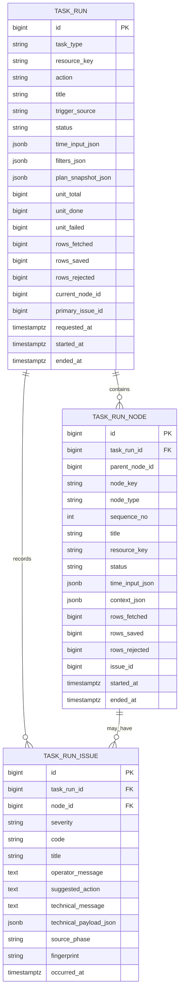
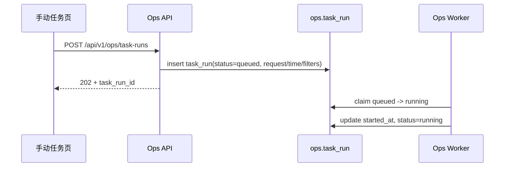
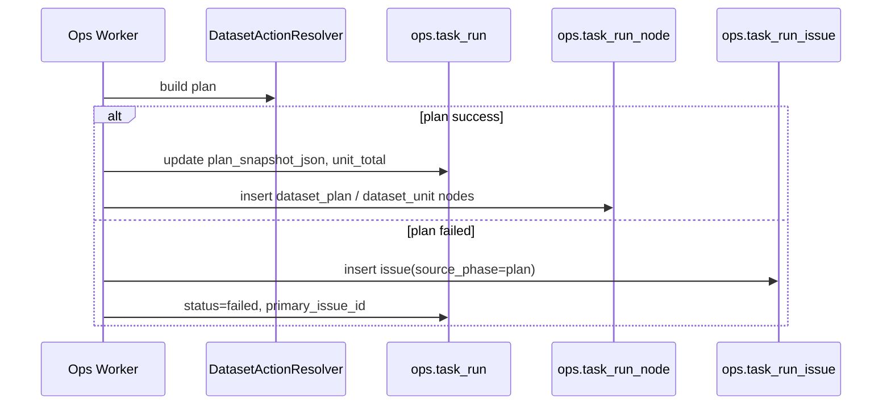
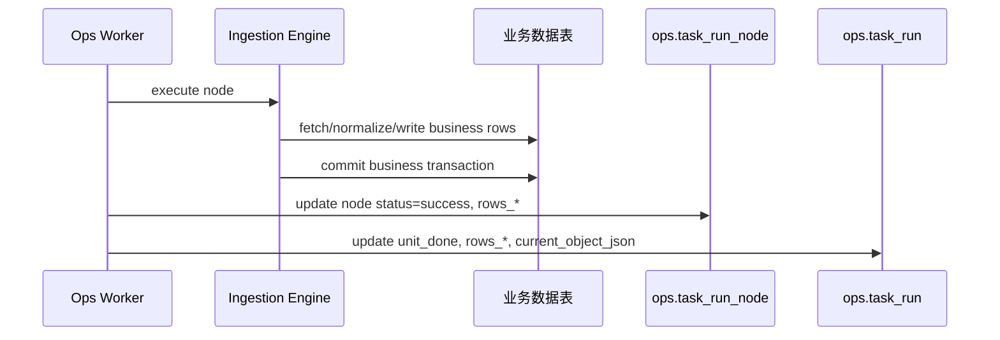
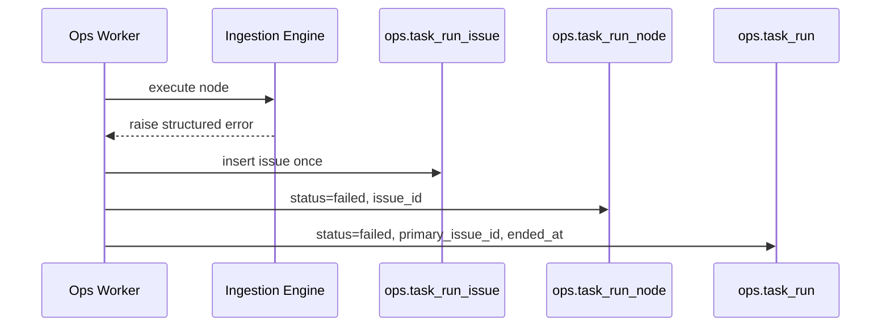
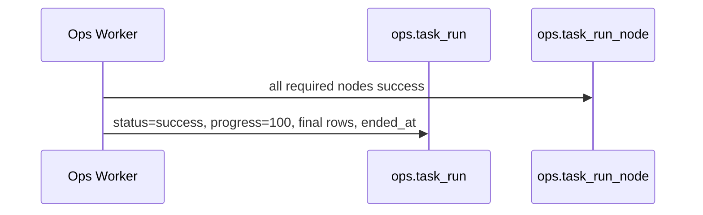
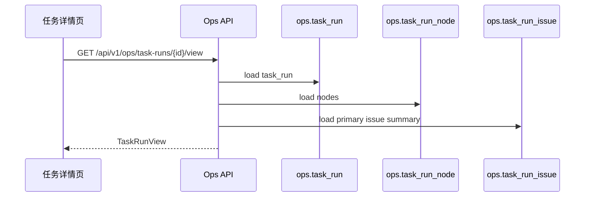
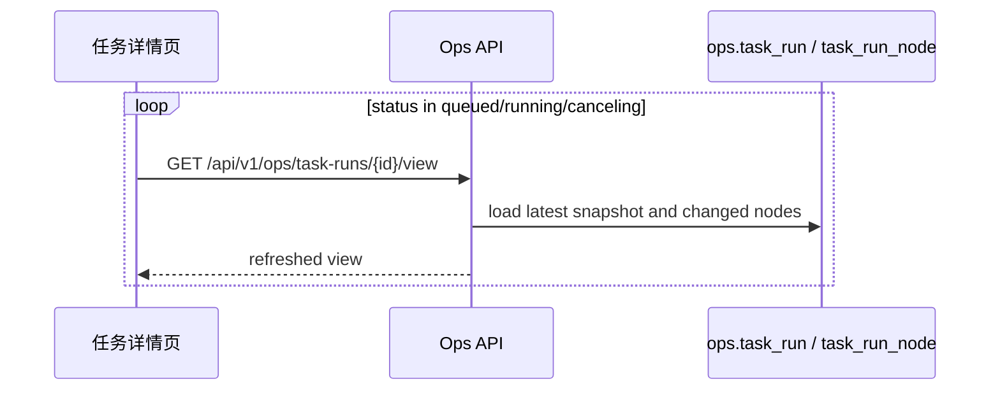
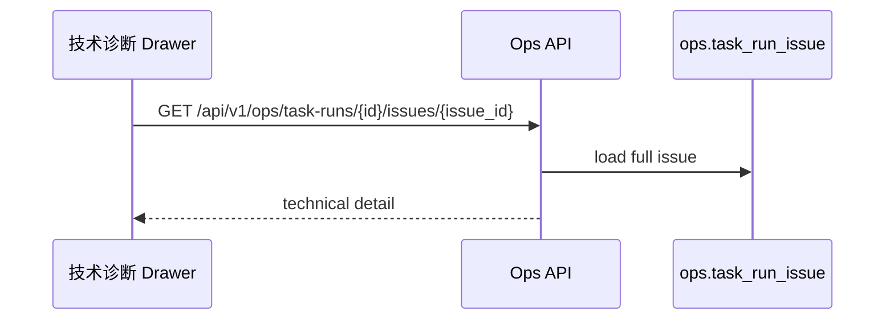
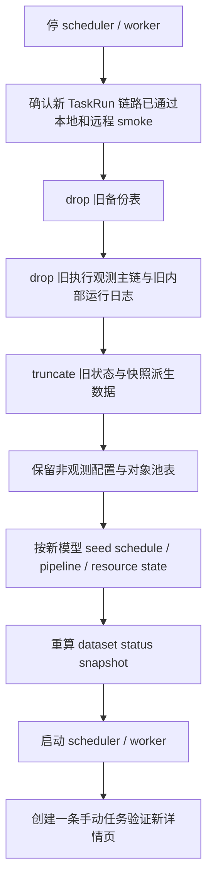

# Ops TaskRun 执行观测模型重设计方案 v1

状态：已上线，代码已按 TaskRun 主链落地  
日期：2026-04-26  
适用范围：Ops 任务中心、任务详情页、任务执行运行时、Dataset Maintain 执行观测链路

> 2026-05-05 修正记录：本方案的停机清表范围曾错误包含 `ops.index_series_active`。该表不是旧任务观测表，也不是可随 TaskRun 重建一起清空的派生噪声表；它会影响指数行情 `core_serving` 入库门禁。后续任何清表、重建、迁移方案不得清空该表，除非同一方案内先定义新的权威来源、重建 SQL、验收查询和回归测试。

---

## 0. 当前上线状态

截至 2026-04-26：

1. 旧任务运行 API 主链已下线，不再作为任务记录、任务详情或手动提交入口。
2. 新表 `ops.task_run`、`ops.task_run_node`、`ops.task_run_issue` 已上线，任务详情只从 TaskRun 读模型取数。
3. 新 API `/api/v1/ops/task-runs*` 与 `/api/v1/ops/manual-actions/{action_key}/task-runs` 已上线。
4. 旧执行观测表与旧内部运行日志已通过 migration 退场。
5. 自动任务配置 `ops.job_schedule` 已按停机清理口径重置，当前默认自动任务配置待重建；在重建前，自动任务页可能为空，这是已知状态，不应误判为页面读取失败。
6. 任务详情页面验收口径：主页面只展示一处失败原因，完整技术诊断只在 drawer 中按需读取；成功态不展示失败原因或技术诊断入口。

---

## 1. 背景与目标

当前任务详情页把同一份执行信息从多个来源重复展示：

1. 旧任务主表：任务主状态、当前快照、最终错误。
2. 旧步骤表：外层步骤摘要。
3. 旧事件表：追加式事件流。
4. 旧内部运行日志：执行器内部日志。

这四类数据职责交叉，失败时同一段技术错误会被复制到多个表，再被前端多个区域重复展示。以 `stk_mins` 失败任务为例，同一条唯一键冲突错误同时出现在顶部失败提示、当前进展、建议下一步、最近更新卡片、实时处理记录中，页面无法形成清晰判断路径。

本方案目标：

1. 删掉旧的执行观测表模型，重新设计更少、更清晰的数据表。
2. 一次任务只有一个任务主状态，一条当前进度快照，一套执行节点，一份唯一问题诊断。
3. 完整技术错误只允许存在一个落点，不再复制到步骤、事件、日志、主表。
4. 任务详情页只消费一个整理后的 view API，不再由前端拼接 `detail + steps + events + logs`。
5. 页面默认面向运营判断；技术诊断按需打开，不污染主阅读路径。

非目标：

1. 不做兼容旧表的长期双写。
2. 不保留旧内部运行日志作为任务详情页数据源。
3. 不引入新的追加式 event stream。
4. 不让前端继续从多接口、多表自行拼装同一任务详情。

---

## 2. 旧表退场口径

本次重设计完成后，以下旧表不再作为主执行观测模型存在：

| 旧表 | 处理方式 | 原因 |
| --- | --- | --- |
| 旧任务主表 | 重建为 `ops.task_run` | 原表混合了任务身份、状态、进度、错误、统计，职责过宽 |
| 旧步骤表 | 删除，由 `ops.task_run_node` 替代 | step / unit / run log 需要统一为节点模型 |
| 旧事件表 | 删除，不再保留追加式事件流 | 当前 event 被当成进度、错误、系统日志混用，重复严重 |
| 旧内部运行日志 | 删除，由 `ops.task_run_node` + `ops.task_run_issue` 替代 | 内部执行器日志不应成为页面事实源 |
| 旧同步状态表 | 不进入任务详情页；后续单独重命名/重构为资源状态表 | 它表达数据集资源状态，不表达某次任务详情 |

硬规则：

1. `task_run` 只存当前任务状态和快照，不存完整技术堆栈。
2. `task_run_node` 只存执行节点状态和统计，不复制完整技术堆栈。
3. `task_run_issue` 是完整错误和诊断信息的唯一落点。
4. 页面主视图不直接读取内部执行器日志。
5. 前端主详情接口只允许使用 `GET /api/v1/ops/task-runs/{id}/view`。

---

## 3. 新数据模型总览



三张表的关系：

1. `task_run`：一次任务的唯一主记录。
2. `task_run_node`：任务内部执行过程，统一承接原 step / unit / run log。
3. `task_run_issue`：问题诊断，完整错误只写这里一份。

---

## 4. 表定义

### 4.1 `ops.task_run`

职责：一次任务的主记录。用于列表、详情顶部、当前进度、最终结果。

禁止：存完整 SQL、traceback、psycopg 原文、重复错误文本。

建议 DDL：

```sql
create table ops.task_run (
  id bigserial primary key,
  task_type varchar(32) not null,
  resource_key varchar(96),
  action varchar(32) not null default 'maintain',
  title varchar(160) not null,
  trigger_source varchar(32) not null,
  requested_by_user_id bigint,
  schedule_id bigint,

  status varchar(24) not null,
  status_reason_code varchar(64),

  time_input_json jsonb not null default '{}'::jsonb,
  filters_json jsonb not null default '{}'::jsonb,
  request_payload_json jsonb not null default '{}'::jsonb,
  plan_snapshot_json jsonb not null default '{}'::jsonb,

  unit_total bigint not null default 0,
  unit_done bigint not null default 0,
  unit_failed bigint not null default 0,
  progress_percent integer,
  current_node_id bigint,
  current_object_json jsonb not null default '{}'::jsonb,

  rows_fetched bigint not null default 0,
  rows_saved bigint not null default 0,
  rows_rejected bigint not null default 0,

  primary_issue_id bigint,

  requested_at timestamptz not null,
  queued_at timestamptz,
  started_at timestamptz,
  ended_at timestamptz,
  cancel_requested_at timestamptz,
  canceled_at timestamptz,
  created_at timestamptz not null default now(),
  updated_at timestamptz not null default now()
);

create index idx_task_run_status_requested_at
  on ops.task_run (status, requested_at desc);

create index idx_task_run_resource_requested_at
  on ops.task_run (resource_key, requested_at desc);

create index idx_task_run_schedule_requested_at
  on ops.task_run (schedule_id, requested_at desc);
```

关键字段说明：

| 字段 | 说明 |
| --- | --- |
| `task_type` | `dataset_action` / `workflow` / `system_job` |
| `resource_key` | 用户理解的维护对象，如 `stk_mins`、`dc_hot` |
| `action` | 当前为 `maintain`，未来可扩展 |
| `title` | 页面标题，如 `股票历史分钟行情` |
| `time_input_json` | 时间输入单一事实源，保留原始语义 |
| `filters_json` | 业务筛选条件 |
| `plan_snapshot_json` | 任务执行计划快照，供审计和重试参考 |
| `current_object_json` | 当前处理对象，如 `ts_code/freq/trade_date/hot_type` |
| `rows_saved` | 页面主指标，表示已经保存到数据库的结果 |
| `primary_issue_id` | 主问题引用；完整错误在 `task_run_issue` |

### 4.2 `ops.task_run_node`

职责：一次任务内部的执行节点。它统一承接原来的 step、unit、run log。

禁止：复制完整异常文本。节点只引用 `issue_id`。

建议 DDL：

```sql
create table ops.task_run_node (
  id bigserial primary key,
  task_run_id bigint not null references ops.task_run(id) on delete cascade,
  parent_node_id bigint references ops.task_run_node(id) on delete cascade,

  node_key varchar(160) not null,
  node_type varchar(32) not null,
  sequence_no integer not null,
  title varchar(160) not null,
  resource_key varchar(96),

  status varchar(24) not null,
  time_input_json jsonb not null default '{}'::jsonb,
  context_json jsonb not null default '{}'::jsonb,

  rows_fetched bigint not null default 0,
  rows_saved bigint not null default 0,
  rows_rejected bigint not null default 0,
  issue_id bigint,

  started_at timestamptz,
  ended_at timestamptz,
  duration_ms integer,
  created_at timestamptz not null default now(),
  updated_at timestamptz not null default now(),

  unique (task_run_id, node_key)
);

create index idx_task_run_node_run_sequence
  on ops.task_run_node (task_run_id, sequence_no, id);

create index idx_task_run_node_run_status
  on ops.task_run_node (task_run_id, status);
```

节点类型：

| `node_type` | 用途 |
| --- | --- |
| `workflow_step` | 工作流步骤 |
| `dataset_plan` | 数据集维护计划根节点 |
| `dataset_unit` | 数据集执行单元，如单只股票、单个交易日、单个枚举组合 |
| `system_action` | 快照刷新、轻量层刷新、状态对账等系统动作 |

### 4.3 `ops.task_run_issue`

职责：一次任务中产生的问题。完整错误、数据库异常、源接口异常、结构化诊断只存在这里。

建议 DDL：

```sql
create table ops.task_run_issue (
  id bigserial primary key,
  task_run_id bigint not null references ops.task_run(id) on delete cascade,
  node_id bigint references ops.task_run_node(id) on delete set null,

  severity varchar(16) not null,
  code varchar(96) not null,
  title varchar(160) not null,
  operator_message text,
  suggested_action text,

  technical_message text,
  technical_payload_json jsonb not null default '{}'::jsonb,
  source_phase varchar(32),
  fingerprint varchar(128) not null,

  occurred_at timestamptz not null,
  created_at timestamptz not null default now(),

  unique (task_run_id, fingerprint)
);

create index idx_task_run_issue_run_occurred
  on ops.task_run_issue (task_run_id, occurred_at desc);

create index idx_task_run_issue_code_occurred
  on ops.task_run_issue (code, occurred_at desc);
```

字段口径：

| 字段 | 说明 |
| --- | --- |
| `title` | 页面失败摘要短标题，如 `任务状态更新失败` |
| `operator_message` | 给运营看的说明，不能是 SQL 原文 |
| `suggested_action` | 建议动作，如 `先不要重跑大范围任务，联系开发确认状态写入失败影响` |
| `technical_message` | 完整技术错误，只在技术诊断 drawer 展示 |
| `technical_payload_json` | `constraint/table/sqlstate/params/phase` 等结构化诊断 |
| `source_phase` | `plan/fetch/normalize/write/state_update/finalize` |
| `fingerprint` | 同一任务内问题去重 |

---

## 5. 写入时序

### 5.1 手动提交任务



写入规则：

1. 提交时只创建 `task_run`。
2. 不创建 event。
3. 不写旧内部运行日志。
4. `request_payload_json` 保留提交入参；页面优先展示整理后的 `time_input_json` 与 `filters_json`。
5. `time_input_json` 保存用户或调度意图，不保存源接口参数；日期模型归一化必须在 `DatasetActionResolver` 中完成。
6. 例如自然月窗口任务应保存 `start_month/end_month`，由 resolver 展开为 `start_date/end_date`，request builder 再格式化为源接口参数。

### 5.2 规划执行计划



写入规则：

1. plan 成功后，`task_run.unit_total` 来自计划实际 unit 数。
2. plan 失败时不创建伪进度。
3. plan 错误完整内容只写 `task_run_issue`。

### 5.3 执行单元成功



写入规则：

1. 业务数据成功提交后，才更新对应 node 为 `success`。
2. 页面主指标使用 `rows_saved`，不展示“尝试写入”。
3. 当前进度快照覆盖写入 `task_run`，不追加事件。

### 5.4 执行单元失败



写入规则：

1. 完整异常只写入 `task_run_issue.technical_message`。
2. `task_run_node` 只写 `issue_id` 和短状态。
3. `task_run` 只写 `primary_issue_id`，不复制错误正文。
4. 如果是状态写入失败、业务数据已提交，不允许回滚已提交业务数据；记录 issue 后将任务标记为需要人工核验。

### 5.5 任务成功结束



写入规则：

1. 成功任务不写“成功事件流”。
2. 任务终态只在 `task_run.status` 表达。
3. 节点列表本身就是过程，不需要额外 event 复述。

---

## 6. 读取时序

### 6.1 任务详情页首次打开



读取规则：

1. 页面主视图只调一个 view API。
2. view API 返回 operator summary，不返回完整技术错误。
3. `technical_message` 只在用户打开技术诊断时读取。

### 6.2 运行中轮询



轮询规则：

1. `queued/running/canceling`：3 秒轮询。
2. `success/failed/canceled`：停止轮询。
3. 失败后只展示一处失败摘要。

### 6.3 技术诊断按需读取



读取规则：

1. 默认页面不请求完整技术错误。
2. 只有点击“查看技术诊断”才请求 issue 详情。
3. drawer 里展示完整技术信息，但主页面不重复展示。

---

## 7. API 定义

### 7.1 创建任务

手动任务页主入口：

```http
POST /api/v1/ops/manual-actions/{action_key}/task-runs
Content-Type: application/json
```

通用 TaskRun 创建入口：

```http
POST /api/v1/ops/task-runs
Content-Type: application/json
```

请求示例：

```json
{
  "task_type": "dataset_action",
  "resource_key": "stk_mins",
  "action": "maintain",
  "time_input": {
    "mode": "range",
    "start_date": "2026-01-05",
    "end_date": "2026-04-24"
  },
  "filters": {
    "freq": "60min"
  }
}
```

响应示例：

```json
{
  "id": 364,
  "status": "queued",
  "title": "股票历史分钟行情",
  "resource_key": "stk_mins",
  "created_at": "2026-04-25T08:44:53+08:00"
}
```

页面区域与调用时机：

| 页面区域 | 调用时机 | 用途 |
| --- | --- | --- |
| 手动任务页提交按钮 | 用户点击提交 | 创建 queued 任务 |
| 提交成功通知 | API 成功后 | 跳转任务详情页 |

### 7.2 任务记录列表

```http
GET /api/v1/ops/task-runs?status=failed&resource_key=stk_mins&page=1&page_size=20
```

响应示例：

```json
{
  "total": 1,
  "items": [
    {
      "id": 364,
      "title": "股票历史分钟行情",
      "resource_key": "stk_mins",
      "status": "failed",
      "trigger_source": "manual",
      "time_scope_label": "2026-01-05 ~ 2026-04-24",
      "rows_saved": 0,
      "unit_done": 29160,
      "unit_total": 29160,
      "primary_issue_title": "任务状态更新失败",
      "requested_at": "2026-04-25T08:44:53+08:00",
      "ended_at": "2026-04-25T19:11:53+08:00"
    }
  ]
}
```

页面区域与调用时机：

| 页面区域 | 调用时机 | 用途 |
| --- | --- | --- |
| 任务记录 tab | 进入页面、切换筛选、翻页 | 展示任务列表 |
| 任务统计卡 | 与列表同筛选条件 | 统计 queued/running/success/failed/canceled |

### 7.3 任务详情主视图

```http
GET /api/v1/ops/task-runs/364/view
```

响应示例：

```json
{
  "run": {
    "id": 364,
    "title": "股票历史分钟行情",
    "resource_key": "stk_mins",
    "action": "maintain",
    "status": "failed",
    "trigger_source": "manual",
    "time_scope_label": "2026-01-05 ~ 2026-04-24",
    "requested_at": "2026-04-25T08:44:53+08:00",
    "started_at": "2026-04-25T08:44:57+08:00",
    "ended_at": "2026-04-25T19:11:53+08:00"
  },
  "progress": {
    "unit_done": 29160,
    "unit_total": 29160,
    "unit_failed": 1,
    "progress_percent": 100,
    "rows_fetched": 128560821,
    "rows_saved": 128560821,
    "rows_rejected": 0,
    "current_object": {
      "title": "正在处理：上港集箱(退)（TS0018.SH）",
      "description": "频率：60min",
      "fields": [
        {"label": "证券代码", "value": "TS0018.SH"},
        {"label": "证券名称", "value": "上港集箱(退)"},
        {"label": "频率", "value": "60min"}
      ]
    },
    "period_source_summary": null
  },
  "primary_issue": {
    "id": 88,
    "severity": "error",
    "code": "state_update_unique_violation",
    "title": "任务状态更新失败",
    "operator_message": "业务数据处理已经结束，但任务状态写入时发生唯一键冲突，需要开发核验本次入库结果与状态表。",
    "suggested_action": "不要重复提交大范围任务。请先完成状态核验，再决定是否补跑缺失范围。",
    "has_technical_detail": true
  },
  "nodes": [
    {
      "id": 571,
      "node_type": "dataset_unit",
      "sequence_no": 29160,
      "title": "股票 TS0018.SH / 60min",
      "status": "failed",
      "rows_fetched": 365,
      "rows_saved": 365,
      "rows_rejected": 0,
      "issue_id": 88,
      "started_at": "2026-04-25T08:44:57+08:00",
      "ended_at": "2026-04-25T19:11:53+08:00"
    }
  ],
  "actions": {
    "can_retry": true,
    "can_cancel": false,
    "can_copy_params": true
  }
}
```

页面区域与调用时机：

| 页面区域 | 调用时机 | 使用字段 |
| --- | --- | --- |
| 顶部状态卡 | 进入详情页、轮询刷新 | `run` |
| 当前进度卡 | 进入详情页、运行中轮询 | `progress` |
| 失败原因卡 | 失败时展示 | `primary_issue` |
| 执行过程 | 进入详情页、轮询刷新 | `nodes` |
| 操作按钮 | 每次 view 返回后刷新 | `actions` |

补充说明：

1. `progress.current_object` 是由 `task_run.current_object_json` 转换后的用户可读展示对象，只在运行中/停止中任务展示当前处理对象。
2. `progress.period_source_summary` 是周期指数任务的只读来源统计，仅 `index_weekly` / `index_monthly` 返回非空。
3. `period_source_summary` 从最终 serving 表按 `source` 聚合，区分 `api` 与 `derived_daily`，不参与 writer、executor 或业务事务。

示例：

```json
{
  "progress": {
    "rows_saved": 1130,
    "period_source_summary": {
      "total_rows": 1130,
      "api_rows": 560,
      "derived_daily_rows": 570,
      "other_rows": 0,
      "start_date": "2026-04-17",
      "end_date": "2026-04-17"
    }
  }
}
```

### 7.4 技术诊断详情

```http
GET /api/v1/ops/task-runs/364/issues/88
```

响应示例：

```json
{
  "id": 88,
  "task_run_id": 364,
  "node_id": 571,
  "severity": "error",
  "code": "state_update_unique_violation",
  "title": "任务状态更新失败",
  "operator_message": "业务数据处理已经结束，但任务状态写入时发生唯一键冲突。",
  "suggested_action": "先核验业务表写入结果，再修复状态表冲突。",
  "technical_message": "(psycopg.errors.UniqueViolation) duplicate key value violates unique constraint ...",
  "technical_payload": {
    "constraint": "unique_resource_state",
    "table": "ops.resource_state",
    "source_phase": "state_update"
  },
  "occurred_at": "2026-04-25T19:11:53+08:00"
}
```

页面区域与调用时机：

| 页面区域 | 调用时机 | 用途 |
| --- | --- | --- |
| 技术诊断 Drawer | 用户点击“查看技术诊断” | 展示完整错误和结构化诊断 |
| 复制诊断按钮 | Drawer 内点击 | 复制 `technical_message + technical_payload` |

### 7.5 停止任务

```http
POST /api/v1/ops/task-runs/364/cancel
```

响应示例：

```json
{
  "id": 364,
  "status": "canceling",
  "cancel_requested_at": "2026-04-25T10:00:00+08:00"
}
```

调用时机：任务状态为 `queued/running` 且用户点击“停止处理”。

### 7.6 重新提交

```http
POST /api/v1/ops/task-runs/364/retry
```

响应示例：

```json
{
  "id": 365,
  "status": "queued",
  "source_task_run_id": 364
}
```

调用时机：任务失败、取消后，用户明确点击“重新提交”。新任务使用原任务 `time_input_json + filters_json + action/resource_key`。

---

## 8. 页面草图

```text
┌──────────────────────────────────────────────────────────────────────────────┐
│ 股票历史分钟行情                                      [复制参数] [重新提交] │
│ 处理范围：2026-01-05 ~ 2026-04-24    发起方式：手动    状态：执行失败       │
└──────────────────────────────────────────────────────────────────────────────┘

┌──────────────────────────────────────────────────────────────────────────────┐
│ 失败原因                                                                     │
│ ┌──────────────────────────────────────────────────────────────────────────┐ │
│ │ 任务状态更新失败                                                         │ │
│ │ 业务数据处理已经结束，但任务状态写入时发生唯一键冲突，需要开发核验。     │ │
│ │ 建议：不要重复提交大范围任务。先完成状态核验，再决定是否补跑缺失范围。   │ │
│ │                                                        [查看技术诊断]    │ │
│ └──────────────────────────────────────────────────────────────────────────┘ │
└──────────────────────────────────────────────────────────────────────────────┘

┌──────────────────────────────────────────┐  ┌───────────────────────────────┐
│ 当前进度                                 │  │ 结果概览                      │
│ 29160 / 29160    100%                    │  │ 已保存：128,560,821           │
│ 当前对象：TS0018.SH 上港集箱(退)         │  │ 已拒绝：0                     │
│ 频率：60min                              │  │ 耗时：10小时26分              │
│ ████████████████████████████████████     │  │                               │
└──────────────────────────────────────────┘  └───────────────────────────────┘

┌──────────────────────────────────────────────────────────────────────────────┐
│ 执行过程                                                                     │
│ 序号    节点                         状态       已保存     耗时             │
│ 1       准备执行计划                 成功       -          2s               │
│ ...                                                                            │
│ 29160   股票 TS0018.SH / 60min       失败       365        10h26m           │
└──────────────────────────────────────────────────────────────────────────────┘

技术诊断 Drawer（默认关闭）
┌──────────────────────────────────────────────────────────────────────────────┐
│ 完整技术错误                                                                 │
│ code: state_update_unique_violation                                          │
│ constraint: unique_resource_state                                            │
│ table: ops.resource_state                                                    │
│ message: (psycopg.errors.UniqueViolation) ...                                │
│ [复制诊断]                                                                   │
└──────────────────────────────────────────────────────────────────────────────┘
```

页面区域规则：

1. 主页面只出现一次失败原因。
2. 当前进度区域不再展示错误全文。
3. 执行过程只展示节点状态，不展示重复错误全文。
4. 技术诊断默认关闭，完整错误只在 drawer 内展示。
5. 若任务成功，失败原因区域不渲染。

---

## 9. 旧表清理与重建计划

执行原则：

1. 先完成新表、新写入链路、新 API、新页面。
2. 新任务中心已经完全切到 `task_run` 链路后，再 drop 旧表。
3. 不做旧执行数据备份。
4. 涉及旧架构数据的运营表允许清空，并通过新模型重新 seed 或重新计算。
5. 清理前必须停掉 scheduler / worker，避免旧任务继续写旧表。
6. 非任务观测表不得因为 TaskRun 重建被顺手清空；尤其是指数对象池、业务规则、人工配置等会参与后续执行规划的数据。

### 9.1 必须 drop：旧执行观测主链

| 表 | 清理前行数 | 处理方式 | 原因 |
| --- | ---: | --- | --- |
| 旧任务主表 | 363 | drop | 混合任务身份、进度、错误、统计 |
| 旧步骤摘要表 | 570 | drop | 被 `task_run_node` 替代 |
| 旧 unit 表 | 63 | drop | 被 `task_run_node` 替代 |
| 旧事件流表 | 135307 | drop | 其中绝大部分是重复 `step_progress` |
| 旧内部运行日志表 | 213806 | drop | 不再作为任务详情来源 |

### 9.2 必须 drop：旧备份表

这些表来自旧 spec 清理过程。既然本轮不保留备份，最终应直接 drop。

| 表 | 清理前行数 | 处理方式 |
| --- | ---: | --- |
| `ops.legacy_spec_backup_20260426_040441_config_revision` | 49 | drop |
| `ops.legacy_spec_backup_20260426_040441_dataset_status_snapshot` | 57 | drop |
| 旧任务主表备份 | 333 | drop |
| 旧事件表备份 | 109 | drop |
| 旧步骤表备份 | 322 | drop |
| 旧 unit 表备份 | 55 | drop |
| `ops.legacy_spec_backup_20260426_040441_job_schedule` | 16 | drop |

### 9.3 清空后重建：旧状态与快照派生数据

| 表 | 清理前行数 | 处理方式 | 重建来源 |
| --- | ---: | --- | --- |
| 旧同步状态表 | 56 | truncate，后续由新资源状态模型替代 | DatasetDefinition / 新执行结果 / 状态重算任务 |
| `ops.dataset_status_snapshot` | 57 | truncate 后重算 | DatasetDefinition + 实际业务表观测 |
| `ops.dataset_layer_snapshot_current` | 229 | truncate 后重算 | 新状态快照计算服务 |
| `ops.dataset_layer_snapshot_history` | 1059 | truncate | 不迁移历史 |
| `ops.probe_run_log` | 365 | truncate | 不迁移旧探测日志 |
| `ops.config_revision` | 57 | truncate | 不迁移旧配置变更历史 |

### 9.4 可选重置：运营配置与规则表

这些表不属于任务详情旧观测主链。TaskRun 重建不应默认清空这些表；只有在对应专题方案已经定义新事实源、重建命令和验收查询后，才允许处理。

| 表 | 清理前行数 | 建议 |
| --- | ---: | --- |
| `ops.job_schedule` | 19 | 建议清空后按新 TaskRun/Schedule 模型重新 seed |
| 旧数据集模式配置表 | 57 | 已下线；由 DatasetDefinition 派生投影替代，不再 seed |
| `ops.std_cleansing_rule` | 56 | 若标准化规则本轮不重做，先保留；若重做规则中心，再清空 |
| `ops.std_mapping_rule` | 56 | 若标准化规则本轮不重做，先保留；若重做规则中心，再清空 |
| `ops.index_series_active` | 历史曾为 1142；当前 `index_daily` 池为 1130 | 禁止随 TaskRun 重建清空；该表参与指数行情 `core_serving` 入库门禁。若确需重建，必须先单独评审指数对象池方案，并提供权威来源、重建 SQL、回填验证和回归测试 |
| `ops.probe_rule` | 0 | 可 drop 或保留空表，取决于探测中心是否保留 |
| `ops.resolution_release` | 0 | 可 drop 或保留空表，取决于融合发布中心是否保留 |
| `ops.resolution_release_stage_status` | 0 | 可 drop 或保留空表，取决于融合发布中心是否保留 |

### 9.4.1 指数对象池误清空事故记录

2026-05-05 核验结果：

1. migration `20260426_000074_task_run_observability_redesign.py` 的 `RESET_TABLES` 错误包含 `index_series_active`，执行时会对 `ops.index_series_active` 做 `TRUNCATE`。
2. 该表一度被误清空；后续已按审阅后的 2026-04-15 指数日线 code 集合重建 `resource='index_daily'`，当前为 1130 个代码。
3. 该表不是 TaskRun 观测主链的一部分，不应随任务详情重建设计一起清空。
4. 当前代码仍会读取该表作为指数行情 `core_serving` 入库门禁；表为空时会回退到 `index_basic`，但这不是稳定运维口径。
5. 当前稳定口径见 [指数行情 active 池与周/月线派生机制说明](/Users/congming/github/goldenshare/docs/datasets/index-series-active-sync-mechanism.md)。

修正后的硬约束：

1. TaskRun 观测清表只允许处理任务观测表、旧内部运行日志、旧状态快照和明确可重算的派生表。
2. 任何会影响 DatasetExecutionPlan 对象池、业务规则、调度配置、人工维护配置的表，必须有独立方案。
3. 清表方案必须逐表写明“是否参与执行规划”；参与执行规划的表默认禁止清空。
4. 如果清空已经发生，恢复方案必须说明能否原样恢复；不能原样恢复时，必须明确“重建口径”和“与原数据的差异”。

### 9.5 清理顺序



清理门禁：

1. 旧任务步骤、事件、日志 API 已无前端引用。
2. 后端 runtime 不再 import 旧任务观测模型。
3. 新手动任务可以创建、运行、失败、重试、取消。
4. 新任务详情页只调用 `/api/v1/ops/task-runs/{id}/view` 和按需 issue detail。
5. 新状态重算任务可以恢复任务统计和数据状态页所需快照。
6. 清表前确认 `ops.index_series_active` 等对象池表不在清理列表中。

---

## 10. 实施 Milestone

### M0：评审定稿

状态：已确认。

1. 确认三张新表：`task_run`、`task_run_node`、`task_run_issue`。
2. 确认旧表最终全部 drop，不做备份。
3. 确认哪些运营配置表进入可选重置范围。
4. 确认新页面只接 TaskRun view API。

### M1：新表与 ORM

状态：已落地。

1. 新增 `ops.task_run`、`ops.task_run_node`、`ops.task_run_issue` DDL。
2. 新增 ORM 模型与基础 schema。
3. 增加模型索引测试和数据库初始化测试。
4. Alembic upgrade 中直接 drop 旧执行观测表与旧备份表，不保留兼容双写。

### M2：新写入链路

状态：已落地。

1. 手动提交写 `task_run`。
2. worker claim 更新 `task_run.status`。
3. planner 写 `plan_snapshot_json` 和 `task_run_node`。
4. executor 更新 node 与 run 当前快照。
5. 失败统一写 `task_run_issue`，完整错误只落一份。

### M3：新 API

状态：已落地。

1. 新增 `POST /api/v1/ops/task-runs`。
2. 新增 `POST /api/v1/ops/manual-actions/{action_key}/task-runs` 作为手动任务页主提交入口。
3. 新增 `GET /api/v1/ops/task-runs` 与 `GET /api/v1/ops/task-runs/summary`。
4. 新增 `GET /api/v1/ops/task-runs/{id}/view`。
5. 新增 `GET /api/v1/ops/task-runs/{id}/issues/{issue_id}`。
6. 新增 cancel / retry API。
7. 后端测试覆盖创建、运行中 view、失败 issue、技术诊断按需读取。

### M4：新页面

状态：已落地。

1. 任务记录 tab 切到新列表 API。
2. 任务详情页切到新 view API。
3. 删除详情页对 `/steps`、`/events`、`/logs` 的调用。
4. 失败原因只展示一次。
5. 技术诊断 drawer 按需读取 issue detail。
6. 补前端单测和 smoke 覆盖。

### M5：新链路远程验证

状态：已完成远程发版与小窗口 TaskRun 验证。

1. 本地编译、后端目标测试、前端单测、build、smoke 已通过。
2. 远程 migration 已执行到 `20260426_000074`。
3. 远程小窗口 TaskRun 验证已通过：`daily` 单日任务可成功进入 `success`，行数统计正常。
4. 失败态页面通过前端单测约束：主页面只展示一处失败原因，完整技术错误只通过 issue detail 按需读取。
5. 任务记录分页、统计、筛选通过前端单测约束。

### M6：旧代码引用清零

状态：已落地。

1. 删除旧任务观测 ORM 和 schema 引用。
2. 删除旧 `ExecutionQueryService` 的 detail / steps / events / logs 主链。
3. 删除旧前端 API 类型和页面 helper。
4. 删除旧任务运行 API 主路由，保留“旧路由不存在”的防回退测试。
5. CLI 自检入口改为 `ops-reconcile-task-runs`，不再保留 `ops-reconcile-executions`。

### M7：停机清表与 drop

状态：已完成远程停机 migration。

1. 停 scheduler / worker。
2. drop 旧备份表。
3. drop 旧任务观测表与旧内部运行日志表。
4. truncate 旧同步状态表、数据集状态快照、层级快照、探测日志和配置变更历史。
5. `ops.job_schedule` 已重置为空，待后续单独重建默认自动任务配置。
6. 事故修正：本轮 migration 曾误清空 `ops.index_series_active`。该行为不符合修正后的清表边界；当前 `resource='index_daily'` 已按审阅后的 1130 个指数代码重建。

### M8：重建 seed 与恢复服务

状态：部分完成；服务已恢复，数据状态快照已重建，自动任务配置待重建。

1. DatasetDefinition 派生投影已替代旧数据集模式配置 seed。
2. `dataset_status_snapshot` 已可通过 `ops-rebuild-dataset-status` 重建。
3. scheduler / worker / web 已恢复。
4. 新 TaskRun 链路已通过小窗口任务验证。
5. `ops.job_schedule` 当前为空，自动任务默认配置需要后续单独设计 seed / rebuild 机制后再恢复。
6. `ops.index_series_active` 已从 TaskRun 重建范围中剥离；当前 `resource='index_daily'` 作为指数日/周/月共同 `core_serving` 入库门禁使用，不能继续把它视为 TaskRun 重建的一部分。

---

## 11. 验收标准

1. 同一次失败任务，完整技术错误在数据库中只出现于 `ops.task_run_issue.technical_message`。
2. `task_run` 和 `task_run_node` 只保存 `issue_id`、短标题或短状态，不复制完整错误。
3. 任务详情页主视图同一个失败原因只展示一次。
4. 页面默认不请求 issue technical detail。
5. 打开技术诊断 drawer 后，才请求完整技术错误。
6. 前端任务详情页不再请求旧步骤、事件、日志接口。
7. 后端不再从旧内部运行日志构造任务详情。
8. 运行中任务只通过覆盖式快照刷新，不追加 event stream。
