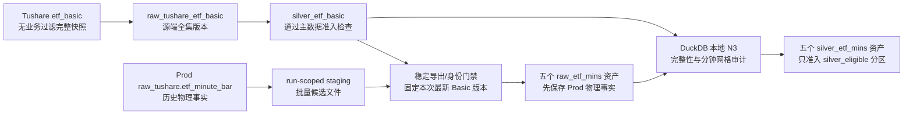

# ETF 市场数据 DG 接入技术方案 v1

状态：架构口径已收敛；P0-P6 代码与临时湖验收已完成；正式 Bootstrap 尚未执行；P7A 及以后尚未授权；N3B 与 N6 仍按后续阶段评审；尚未授权补事件或启用 Sensor
创建日期：2026-08-27
最近更新：2026-08-31
适用范围：`lake_console/orchestrator` 正式 Dagster 数据湖

上游已落地方案：[ETF 基础信息重建与下游数据审计清理技术方案 v1](/Users/congming/github/goldenshare/docs/architecture/etf-basic-rebuild-and-downstream-data-audit-cleanup-plan-v1.md)

上游已落地 LLD：[ETF 基础信息重建与下游数据审计清理 LLD v1](/Users/congming/github/goldenshare/docs/architecture/etf-basic-rebuild-and-downstream-data-audit-cleanup-low-level-design-v1.md)

Prod 分钟方案：[ETF 历史分钟行情数据集接入方案 v1](/Users/congming/github/goldenshare/docs/datasets/etf-mins-dataset-development.md)

Prod 分钟 LLD：[ETF 历史分钟行情数据集 LLD v1](/Users/congming/github/goldenshare/docs/datasets/etf-mins-dataset-low-level-design-v1.md)

DG 接入 LLD：[ETF Basic 与历史分钟 DG 接入低层设计 v1](./dagster-etf-market-data-prod-db-onboarding-low-level-design-v1.md)

---

## 1. 本次修订结论

旧 DG 方案把 ETF Basic、ETF 分钟激活池和 ETF 历史分钟线设计成三类资产。旧激活池已经退场；Prod 的 ETF 分钟请求现在由 `core_serving.etf_basic` 驱动。DG 不再建设激活池，但必须用自己从 Tushare 生成的最新 `silver_etf_basic` 复刻这套请求范围，用来检查从 Prod 批量读出的分钟候选是否可信、是否完整。

本版按已经落地的 Prod 口径完成以下修正：

1. DG 不再建设任何 ETF 激活池 Raw、Silver、manifest、快照、Job、Sensor 或兼容读取。
2. ETF Basic 由 DG 通过现有 Tushare Resource 直接请求 `etf_basic`；不读取 Prod DB 的 raw 或 serving 表。
3. Basic Raw 保存源端无业务过滤的 14 字段完整快照，包括 `.SH/.SZ/.OF` 和 `L/P/D`。
4. Basic Silver 只复刻 Prod `core_serving.etf_basic` 已落地的发布筛选：保留 `.SH/.SZ`，不按状态或上市日继续裁剪。
5. Basic Raw/Silver 都保留不可变版本。分钟任务同时检查启动时最新 Raw 与最新 Silver materialization，两者内容 hash 必须对齐、checks 必须通过且两层观测时间都必须满足当天 freshness；任一不满足立即 fail-closed，不回退更早版本。检查通过后整次任务固定这一版本，避免运行期间口径漂移。
6. ETF 分钟仍从 `raw_tushare.etf_minute_bar` 按日期和频率一次性批量读取，不按 ETF 逐只查询，也不在 Prod SQL 中用 Basic 静默过滤；读取结果先进入 run-scoped staging。
7. staging 候选先通过导出完整性、字段/分区合同和最新 Basic Silver 代码身份校验，再原子提升为正式 Raw。Raw 保存 Prod 当时的物理事实；应覆盖缺口、五频覆盖和日内网格由 Raw 落地后的本地 DuckDB N3 审计判断，不再为了 N3 反复扫描 Prod。
8. 历史补录不寻找历史日期对应的 Basic 快照。无论补哪一段历史，都只以本次任务启动时最新的 Basic Silver 为基线，并按其中的 `list_date` 裁每只 ETF 的可请求起点。
9. 已退市、从最新 Basic 消失或后来不再可请求的 ETF，不要求继续补拉；它已经进入正式 Lake 的历史分钟数据永久保留，不删除、不回收，也不因最新 Basic 变化而重写。
10. 2026 年指定区间的 Prod 对齐已经完成首尾覆盖，但现有 Preview 明确没有审计区间内部空洞。因此分钟 Raw Bootstrap 完成后，必须在本地对正式 Raw 做一次新的 N3 物理审计；审计通过并冻结 blocking/WARN 后才能进入 Silver。日常链由同一份已冻结 policy 生成五频共享 `bar_domain` blocking checks，不为五个频率重复扫描。
11. ETF DG 不读取 `ops.task_run` 或任何其它 Prod `ops.*` 状态表。当前 `stk_mins` 的确同时使用“成功 TaskRun + 五频代码物理覆盖”双门禁，并在每个 Raw asset 内重查本频覆盖；ETF 不复制这些执行状态和重复重查，只在日常 Sensor 启动前做一次五频代码覆盖，Raw asset 只重新验证冻结的 Basic reference，再通过本次实际导出候选完成本地范围校验。
12. 分钟 Raw 前只阻断文件/字段不可读、主键空或重复、日期/频率错位、Basic 身份污染和无法解释的新代码。价格空值、负成交量、OHLC 关系、分钟网格和内部空洞进入 Raw 后由 N3 观察和分类；它们不回滚已经安全保存的 Raw 文件。N3B 冻结后，这些规则落成 Raw 的正式 `bar_domain` blocking check；失败分区阻断日常 Raw 连续性和 Silver，Silver 不修值、不删行。

一句话概括：**分钟数据从 Prod 受控批量搬到 Raw，导出和代码身份先校验；内部空洞与分钟网格统一在本地 Raw 上用 DuckDB 审计，只有通过 Silver 准入口径的数据才能进入 Silver。补历史不回溯历史 Basic，已有的退市 ETF 历史数据也永不因 Basic 变化而删除。**

---

## 2. 本方案解决什么

### 2.1 目标

1. 从 Tushare 获取 ETF Basic 完整快照，在正式 Lake 保存可追溯的 Raw/Silver 版本。
2. 把 Prod ETF 五个原生频率的历史分钟事实批量读入 staging，经最新 ETF Basic Silver 校验后落到 DG Raw。
3. 对 Raw 做完整性和入库标准检查，通过后原样准入 Silver。
4. 支持首次历史 Bootstrap、以后日常增量，以及独立的 2026 年以前补录。
5. 保证以后补录 2026 年以前的数据时，不改动已经验收的 2026 年文件。

### 2.2 明确不做

1. 不恢复 `ops.etf_series_active` 或任何等价的新池。
2. 除 ETF Basic 自身外，DG 不为本方案中的 ETF 分钟重复请求 Tushare。
3. 不引入 `fund_daily`、`fund_adj` 或基金日线作为本链路依赖。
4. 不生成 90/120 分钟线，不用低频补高频或用高频合成源端缺失频率。
5. 不重算 `vwap`，不裁剪价格精度，不前向填充缺失 bar。
6. 不因 ETF 当前变成 `D`、从 Basic 消失，或 `list_date` 后移而删除已有历史分钟事实。
7. 不使用旧 Lake 根目录，不使用 Kopia，不用海量 Dagster backfill 搬历史数据。

---

## 3. 已核清的源合同与 Prod 合同

### 3.1 Tushare ETF Basic：无时间输入的完整快照

DG Basic 的正式源是 Tushare `etf_basic`：

| 口径 | 合同 |
| --- | --- |
| API | `etf_basic` |
| 主键 | `ts_code` |
| 正式请求参数 | 不传 `ts_code/index_code/list_date/list_status/exchange/mgr`；只允许分页参数 |
| 状态 | 源端完整快照可以包含 `L/P/D` |
| 后缀 | 当前已核验为 `.SH/.SZ/.OF` |
| 业务字段 | 14 个 |
| 时间模型 | no-time snapshot；源接口不提供历史版本 |
| 分页 | Tushare 源文档与当前 SDK 主链支持 `limit/offset`，单页上限 5,000；当前 `tushareMcp` 包装未暴露这两个参数，P0 已通过实际 `TushareResource` 关闭真实 offset 边界 |

14 个业务字段固定为：

```text
ts_code, csname, extname, cname, index_code, index_name,
setup_date, list_date, list_status, exchange,
mgr_name, custod_name, mgt_fee, etf_type
```

Raw 中 `setup_date/list_date` 保持源端 `YYYYMMDD` 字符串，`mgt_fee` 保持源端数值；不加入任何 Goldenshare 系统字段。

本轮 `tushareMcp` 已验证：无业务参数默认字段请求与显式 14 字段请求都返回 1,829 行；状态分布为 `L=1658/P=44/D=127`，后缀分布为 `SH=1033/SZ=793/OF=3`。这些只是 2026-08-29 的源端观测，不是永久阈值。2026-08-30 的 P0 又通过实际 `TushareResource` 验证：`limit=5000, offset=0` 返回 1,829 行，`offset=5000` 返回 0 行，字段顺序一致且没有重复 `ts_code`，因此真实分页边界已经关闭。

### 3.2 Basic Silver：复刻 Core Serving 的发布筛选

当前 Prod writer 的真实实现是：Raw 保存源端完整快照，Serving 只保留代码以 `.SH` 或 `.SZ` 结尾的行。DG Silver 精确复刻这个集合规则：

```text
silver_rows = raw_rows WHERE ts_code ENDS WITH '.SH' OR '.SZ'
```

Silver 不增加以下条件：

```text
list_status = 'L'
list_date IS NOT NULL
list_date <= today
```

因此 Silver 仍保存 `.SH/.SZ` 的 `L/P/D` 全状态主数据。日期字段转成稳定 `DATE`，`mgt_fee` 使用 LLD 冻结的稳定数值类型；筛选前后的行数、代码集合和 hash 必须可对账。

### 3.3 DG 当前可请求 ETF：复刻 Prod 请求口径的校验基线

Prod 的 ETF 分钟 planner 会从 `core_serving.etf_basic` 派生当前可请求集合，并按 `list_date` 裁请求起点。DG 不直接读取这张 Serving 表，而是从本地最新 `silver_etf_basic` 复刻同一口径：

```text
list_status = 'L'
list_date IS NOT NULL
list_date <= eligibility_as_of
ts_code 后缀与 exchange 一致，且属于 .SH/.SZ
```

其中 `eligibility_as_of` 是本次分钟任务启动时的上海自然日，不是分钟历史数据所属的交易日。任务启动后固定以下信息，整次执行不得漂移：

```text
basic_raw_snapshot_hash
basic_silver_content_hash
basic_raw_observed_at
basic_silver_observed_at
eligibility_as_of
requestable_code_count
requestable_code_hash
```

这套集合只用于回答“本次按照当前 Basic 应该请求和检查哪些 ETF”。对历史日期 `D`，某只当前可请求 ETF 只有在 `list_date <= D` 时才进入当天的应覆盖集合，等价于 Prod planner 用 `list_date` 裁请求起点。

这里明确不做两件事：

1. 不按历史交易日寻找当时的 Basic 快照；Tushare 没有历史 Basic 接口，DG 接入前也不存在本地历史版本。
2. 不拿最新 Basic 反向删除旧数据。Basic 状态变化只改变本次及以后任务的应请求集合，不改变已经落入正式 Lake 的历史事实。

### 3.4 ETF 历史分钟：实际物理事实

| 口径 | 合同 |
| --- | --- |
| 表 | `raw_tushare.etf_minute_bar` |
| 主键 | `(ts_code, freq, trade_time)` |
| 频率 | `1min/5min/15min/30min/60min` |
| 业务字段 | 11 个 |

11 个业务字段固定为：

```text
ts_code, freq, trade_time, open, close, high, low,
vol, amount, vwap, exchange
```

2026-08-29 的补后 Preview 已确认：当时 1,647 个当前可请求 ETF 的 8,235 个代码/频率组合，在 `2026-01-01..2026-08-28` 指定区间内都已有 Raw 首尾覆盖，后续 action/unit 为 0。这个结论只覆盖首尾，不包含逐交易日和日内网格空洞审计。

---

## 4. 四种范围必须分开

| 范围 | 回答的问题 | DG 用法 |
| --- | --- | --- |
| Tushare ETF Basic 全集 | 源端本次返回了哪些 ETF 身份 | 完整保存到 `raw_tushare_etf_basic` 版本 |
| 本地 ETF Basic Serving 语义 | 当前源快照中的 `.SH/.SZ` 主数据 | 从同版 Raw 生成 `silver_etf_basic` |
| 本次任务当前可请求 ETF | 本次启动时最新 Silver 中哪些代码符合 Prod 请求条件 | 生成分钟应覆盖集合；先校验候选身份，再作为本地 Raw N3 的完整性基线 |
| 历史分钟事实 | Prod 物理表里实际已有哪一些历史行 | 在批准日期范围内批量读入 staging，不先按 Basic 过滤 |

这一区分直接决定以下行为：

1. Basic Silver 的版本变化不会触发已有分钟文件删除或重写，只影响以后新任务的应请求和应覆盖集合。
2. 分钟读取范围与分钟准入范围分开：Prod SQL 批量读取物理事实；本地最新 Basic Silver 负责检查候选代码身份和本次应覆盖范围。
3. 完整性结论只覆盖“本次最新 Basic 所定义的可请求对象”，不宣称还原历史上所有曾经上市 ETF 的完整分钟历史。

---

## 5. DG 资产拓扑



### 5.1 ETF Basic 资产

| 层 | Asset | 含义 |
| --- | --- | --- |
| Raw | `raw_tushare_etf_basic` | Tushare `etf_basic` 14 字段无业务过滤完整快照 |
| Silver | `silver_etf_basic` | 同版 Raw 中 `.SH/.SZ` 的全状态主数据，筛选语义与 Prod Core Serving 一致 |

Silver 不裁成当前可请求集合，也不只保留 `L`。分钟正式 Raw 对 `silver_etf_basic` 建立真实的只读校验依赖：分钟 Job 不负责重跑 Basic，但 latest-only selector 必须确认最新 Raw 与最新 Silver 的内容 hash 对齐、各自 blocking checks 通过且两层观测时间都满足本次 freshness，随后读取该 Silver 版本计算请求范围。

Dagster 建模时使用 `deps=["silver_etf_basic"]` 表达 lineage 和调度依赖；分钟资产自己按已冻结的路径/hash 读取 Basic 文件，不通过 IOManager 把整份快照传入内存。run-scoped staging 只是写入过程中的候选区，不注册为正式资产。

### 5.2 ETF 分钟资产

Raw 五个资产：

```text
raw_etf_mins_1m
raw_etf_mins_5m
raw_etf_mins_15m
raw_etf_mins_30m
raw_etf_mins_60m
```

Silver 五个资产：

```text
silver_etf_mins_1m
silver_etf_mins_5m
silver_etf_mins_15m
silver_etf_mins_30m
silver_etf_mins_60m
```

分钟线使用专属动态分区 `cn_a_etf_mins_trade_days`，不复用股票或指数分钟分区。

---

## 6. ETF Basic 快照如何保存

Tushare Basic 只返回当前快照，因此 DG 需要保存不可变的源观测版本。这个版本能力一方面用于追踪 Basic 自身如何变化，另一方面让每次分钟任务能按 latest-only 合同冻结“启动时最新 Raw/Silver reference”，再从其中的 Silver 计算范围，保证整次校验可复算且不会回退旧版本。

### 6.1 推荐路径

```text
/Volumes/datasource/data_lake/raw/tushare/etf_basic/
  snapshot_id=<raw_snapshot_hash>/part-000.parquet

/Volumes/datasource/data_lake/silver/basic/etf_basic/
  snapshot_id=<raw_snapshot_hash>/part-000.parquet
```

`raw_snapshot_hash` 是 DG 自己的文件内容身份，不要求与 Prod 的业务 hash 相同。它对写入 staging、按 Raw 物理 schema 回读并按 `ts_code` 排序后的 14 个字段计算完整 SHA-256，因此必须能只依靠正式 Raw Parquet 稳定复算。Raw 和由它生成的 Silver 共用同一个 `snapshot_id`，Silver 另外记录 `silver_content_hash`，从而既能还原输入版本，也能独立验证筛选结果。若以后需要核对 Prod 与 DG，可在专项审计中另算兼容 hash，但它不参与 DG 路径、幂等或版本身份。

### 6.2 版本规则

1. 相同内容复用同一个 `snapshot_id` 和文件，不重复制造副本。
2. 内容变化产生新的 hash 和新目录；已验收版本不可覆盖。
3. 不创建 `current` 文件、不创建选择池 manifest，也不持久化第二份 requestable-code Parquet；本次可请求集合从已冻结的 Silver 快照即时、集合化计算。
4. “最新可用版本”同时从任务启动前最新一条 Raw 和最新一条 Silver Dagster materialization 开始检查：两者 blocking checks 必须分别精确绑定并全部通过，Silver 记录的 `raw_snapshot_hash` 必须等于最新 Raw 的 `raw_snapshot_hash`，且 Raw/Silver 各自的 `observed_at` 都必须与本次 `eligibility_as_of` 同属一个上海自然日。最新 Raw 已变化而 Silver 尚未跟上、任一 checks 失败或任一层不新鲜时立即 fail-closed，绝不回退更早版本。相同 Raw 内容产生新的 materialization 时，内容 hash 相同仍视为同一快照，但不能省略当天 Raw 的实际源请求和 materialization。长任务跨日后继续使用启动时冻结的版本。
5. Raw/Silver Materialization 和审计报告记录：

```text
raw_snapshot_hash
silver_content_hash
raw_observed_at / silver_observed_at
api_name = etf_basic
business_params = {}
fields = 14 个显式字段
page_count / page_limit
raw_row_count / silver_row_count / filtered_out_row_count
status_counts / suffix_counts
```

Basic 是 no-time snapshot，自身没有业务 config；Raw/Silver 各自 materialization 的 `goldenshare/observed_at` 与上海观测日来自运行时钟。Basic 自身的 materialization 不预先写 `eligibility_as_of` 或分钟 `request_target_hash`。分钟任务在启动时才冻结 `eligibility_as_of`，读取 latest-only Raw/Silver reference，计算并记录自己的 `requestable_code_count/requestable_code_hash`；这既保留可复算证据，也避免恢复一套独立激活池。

---

## 7. 物理路径和字段

### 7.1 分钟 Raw

```text
/Volumes/datasource/data_lake/raw/tushare/etf_mins/
  freq=<1min|5min|15min|30min|60min>/
  trade_date=YYYY-MM-DD/part-000.parquet
```

规则：

1. 每份文件只包含一个交易日和一个频率。
2. 文件保留 Prod 的 11 个业务字段和数值精度。
3. `trade_date` 由 `trade_time` 推导，只作为路径分区，不增加到 Raw 业务字段。
4. 导出 SQL 只按批准日期范围和频率裁剪，不按 Basic 代码集合过滤；结果先写 `/Volumes/datasource/data_lake_staging` 下的 run-scoped 候选文件。
5. 候选文件必须与本次冻结的最新 Basic Silver 做集合校验。校验通过后才通过同文件系统 `os.replace()` 原子提升到本节正式 Raw 路径。
6. 非 `.SH/.SZ`、交易所冲突、无法由最新 Basic 或本次执行前同一目标正式文件解释的新代码必须进入审计并阻断提升；不能先在 SQL 中静默丢掉，也不能通过删行让检查变绿。
7. 已存在于正式 Lake、后来退市或从最新 Basic 消失的历史代码不参加本次应覆盖集合，但其已有文件和行永久保留。

### 7.2 分钟 Silver

```text
/Volumes/datasource/data_lake/silver/quote/etf_mins/
  freq=<1min|5min|15min|30min|60min>/
  trade_date=YYYY-MM-DD/part-000.parquet
```

Silver 的第一版定位是“Raw 通过完整性和入库标准检查后的准入层”，不是修复层：

1. 仍保留同样的 11 个字段。
2. 只做合同允许的稳定类型表达，不改变有效数值。
3. Raw/Silver 行数、主键集合和 11 字段值逐项一致。
4. Raw 的 `file_contract/request_scope/bar_domain` 任一 blocking check 失败，整个日期/频率分区都不准入 Silver。
5. 真正需要修复的数据回到 Prod 或走以后单独批准的 Raw repair，不在 Silver 静默处理。

---

## 8. 完整性与入库标准

### 8.1 ETF Basic blocking checks

Raw：

1. 请求不带任何业务过滤，恰好保留 14 个源字段。
2. `ts_code` 唯一、非空，后缀只允许已核验的 `.SH/.SZ/.OF`。
3. `.SH/.SZ` 的代码后缀与 `exchange` 一致。
4. `list_status` 只允许已核验的 `L/P/D`；状态、后缀和空 `list_date` 分布写入元数据，不固化当前数量。
5. 源端返回行数、分页合并行数、Raw 行数和主键集合一致；不允许拒绝或静默去重。
6. `raw_snapshot_hash` 可从文件独立复算。

Silver：

1. 恰好保留与 Raw 相同的 14 个业务字段，只做稳定类型表达。
2. 代码集合精确等于 Raw 中 `.SH/.SZ` 的集合，不增加 `list_status/list_date` 条件。
3. Raw 被过滤的行精确等于非 `.SH/.SZ` 行，并输出数量和有界样本。
4. Silver 行数、主键集合、字段值与同版 Raw 的筛选结果一致。
5. `silver_content_hash` 可从文件独立复算，且 Silver 能追溯到唯一 `raw_snapshot_hash`。

### 8.2 分钟 Raw blocking checks 与 Silver 准入候选

以下口径可以先写进 LLD 和审计脚本候选，但最终哪些判为 blocked、哪些只 WARN，必须以第 9 节对本地 Raw 的 N3 审计结果为准。除稳定的导出/身份门禁外，这些候选不阻断首次 Raw 物理 Bootstrap：

1. 本次使用的最新 Basic Raw/Silver 已 materialize、两层各自 blocking checks 全绿、内容 hash 对齐且两层 freshness 都满足要求；任务记录的两个 Basic hash 可独立复算。
2. 从该 Silver 计算当前可请求集合：`list_status='L'`、`list_date` 非空且不晚于 `eligibility_as_of`，结果的代码数量和 hash 与任务记录一致。
3. 对历史交易日 `D`，应覆盖代码为当前可请求集合中 `list_date <= D` 的代码；不按 `D` 回找历史 Basic。
4. 每个日期、频率都输出 `expected/present/missing/known_non_required/retained_legacy/unexplained_new` 集合计数和有界样本。`retained_legacy` 只认本次执行前同一目标正式文件里已经存在的代码，不为判断新候选扫描全部历史 Lake。`unexplained_new` 属于稳定身份污染门禁，阻断候选提升；当前应请求代码缺失、部分频率缺失和分钟网格问题允许原样进入历史 Raw，但在第 9 节审计冻结可接受分类前一律不得进入 Silver。
5. 候选 schema 精确为 11 个字段，字段类型可稳定读取。
6. 文件频率、路径日期与行内 `freq/trade_time` 一致。
7. `(ts_code, trade_time)` 在单频文件内唯一且非空。
8. `ts_code` 为 `.SH/.SZ`；分钟 `exchange` 原始值原样保存。开发前必须用有界样本确认 `.SH/.SZ` 与分钟源端实际 distinct 值的对应关系，冻结比较映射后才能启用 exchange mismatch 门禁；文档不能预猜具体值。
9. `open/high/low/close` 的空值、有限性、正数和 OHLC 区间关系进入 N3 观察，不在 Raw 前先写死 Silver 阻断结论。
10. `vol/amount` 的空值、负值和零成交语义进入 N3 观察，不凭经验删除。
11. 存在数据的 ETF 交易日，其实际时间点、重复、越界和中间断点由 N3 本地网格 profile 记录。
12. 同一 ETF 交易日若某频率存在而其他原生频率缺失，进入 N3 单独分类，不能直接视为停牌。
13. 候选与正式 Raw、Raw 与 Silver 的行数、主键和 11 字段值完全一致。

Raw 前门禁与 Raw 后 N3 的边界固定为：前者只处理“这批文件能否安全、可解释地保存为 Prod 物理事实”，后者回答“这个物理事实分区能否成为 ready 并进入 Silver”。不得把尚未观察真实 ETF 分布的价格、成交或网格规则提前塞回 Raw writer。

N3B 冻结后，每个 Raw 资产只有一套正式 readiness：当前 materialization 的 `file_contract`、`request_scope`、`bar_domain` 三项 blocking checks 全部通过。`bar_domain` 失败不删除、不回滚 Raw 文件，但该分区不 ready，日常连续性停在最早失败日，Silver 也不能越过。Silver 正式 Job 选择五个 Raw checks 与五个 Silver assets/checks；它会重新执行同一套 Raw check 合同，但不会重跑 Raw writer，因此不需要第二套准入引用、状态或写前 guard。

代码集合按下面四类处理，不能简单把“实际存在但当前不再可请求”全部当成脏数据：

| 类别 | 例子 | 处理 |
| --- | --- | --- |
| `expected` | 最新 Silver 中当前为 `L`，且历史交易日不早于 `list_date` | 必须进入覆盖检查；缺失或少频进入 Raw N3，默认阻断 Silver、不阻断 Raw 物理保存 |
| `known_non_required` | 最新 Silver 中已经是 `D/P`，或目标历史日早于 `list_date` | 不要求本次补到；已有历史事实保留，新出现的候选行单独分类，不静默删除 |
| `retained_legacy` | 代码已经从最新 Silver 消失，但本次执行前同一目标正式文件已经有该代码 | 只允许等价复用该目标文件，不参加本次应覆盖集合，不因 Basic 变化重写 |
| `unexplained_new` | 最新 Silver 无法识别，且同一目标正式文件此前没有该代码 | 视为可能的 Prod 脏数据，阻断提升并要求人工解释 |

### 8.3 只告警、不自动删除的候选

1. `vwap` 与 OHLC 的统计关系异常，但源端值本身可解析。
2. 跨频率成交量或成交额存在源端舍入差异。
3. 某 ETF 在一个开市日五个频率都没有数据，但尚不能区分停牌、源端空结果和漏同步。
4. 最新 Basic Silver 中已退市、待上市或已消失的代码，不进入本次应覆盖集合；它们在正式 Lake 中已有的历史分钟事实继续保留。

这些类别必须在审计报告中保留代码、日期、频率、数量和有界样本。没有解释清楚前，不得靠删行让 Silver 变绿。

Basic 的作用是定义“本次还应该拉谁”，不是定义“Lake 里历史上只允许存在谁”。因此，最新 Basic 中已不再可请求的代码不会被判成必须删除；但候选中出现既无法由最新 Basic 识别、又不在本次执行前同一目标正式文件中的代码，必须阻断并人工解释，防止 Prod 脏数据进入 DG Raw。

---

## 9. Raw 落地后如何完成 N3 审计

Prod 上游已经完成的证据包括：

1. `2026-01-01..2026-08-28` 的当前可请求目标 hash 已冻结过。
2. 1,647 个当时可请求 ETF × 5 个频率均有首尾物理覆盖。
3. 补后 Preview 的 prefix/suffix action 和 unit 均为 0。
4. 当时的任务执行记录只能作为规模和排障背景，不能进入 ETF DG 的 ready、Bootstrap 或完整性判断。

这些数字只说明当时的 Prod 上游执行结果，不是 DG 永久固定的预期代码集合。Raw Bootstrap 启动时必须重新取得最新 Basic Silver，并冻结本次代码集合和 hash。

但这还不能等价为“每个交易日、每个频率、每个日内时间点都完整”。N3 不再在 Prod 上执行全量深审计，而是在 Raw Bootstrap 完成后，由 DuckDB 批量扫描本地 Parquet。审计至少需要输出：

1. 最新 Basic Raw/Silver 的两个内容 hash、观测时间、`eligibility_as_of`、当前可请求代码数量和代码 hash。
2. 按 `list_status='L' + list_date` 复刻出的本次请求范围，并证明历史日期只按 `list_date` 裁起点，没有回溯历史 Basic。
3. Raw 分钟总行数、实际代码集合、最早/最晚日期、按月/频率行数，以及 Bootstrap 导出报告中的 source/staging/Raw 行数对账。
4. 按 `ts_code + trade_date + freq` 的行数与时间点网格分布。
5. `expected/present/missing/known_non_required/retained_legacy/unexplained_new` 集合差异，以及“整日五频全空”“部分频率空”“频率存在但日内断点”三个不同类别；其中 `retained_legacy` 只以同一目标文件的既有内容为依据。
6. 已退市或不再出现在最新 Basic 的代码在正式 Lake 中已有历史数据的保留情况；审计不得提出删除或重写这些事实。
7. 主键重复、交换所冲突、数值域异常和有界样本。
8. Bootstrap 每个冻结的 `trade_date + freq` 是否都有一个 schema 正确的 Raw 文件，包括源端零行时生成的显式零行文件；同时对账单次源查询、staging 和 Raw 的行数、日期、频率、代码范围与文件 hash。
9. 全量审计 SQL 的本地文件数、投影列、扫描行数、spill、耗时和结果行数，证明查询通过 Parquet 分区裁剪和集合化聚合完成。
10. 明确证明 Prod 明细读取没有用 Basic 过滤；Basic 集合关联发生在 staging/Raw 的本地 DuckDB 校验阶段。

审计只读 Raw，不访问 Prod、不修改 Raw、不写 Silver、不写 Dagster event。只有发现异常且需要判断“导出损坏还是 Prod 原始事实”时，才允许对明确的日期、频率和代码做有界 Prod 只读回查。

N3 固定拆成两步：

1. **N3A 观察**：输出客观 profile 和 issue，例如某日某频率应有/实有代码数、缺失代码、实际分钟时间点、每个 code-day 的 bar 数、价格空值、负成交量和 OHLC 异常。此时不生成 `silver_eligible`，也不把任何尚未确认的类别写成正式 blocking check。
2. **N3B 决策**：根据 N3A 的真实分布提出逐类建议，由管理员确认哪些 reason code 阻断、哪些只告警；随后冻结 `gap_policy_version`，再用同一份 observation 生成 `raw_partition_decision_manifest` 和 `silver_eligible`。

这里的“blocking/WARN policy 尚未确认”具体指 N3A 报告已经完成、但管理员还没有完成 N3B 评审的时间段。只有 N3B 关闭后，才能进入 Silver。

Bootstrap 的物理写入与日常 readiness 必须分开理解：Bootstrap 可以先完成全部批准范围的正式 Raw 文件，再做 N3；这不表示这些历史分区已经 ready。N3B 冻结后，日常和历史验收都使用同一套 `file_contract/request_scope/bar_domain` blocking 语义。事件补录只是 UI/历史索引，不是全历史 readiness 的事实源。

---

## 10. 源访问合同

### 10.1 Tushare Basic 合同

| 项 | 合同 |
| --- | --- |
| API | `etf_basic` |
| 业务参数 | `{}`；不开放任何过滤输入 |
| 显式字段 | 14 个 ETF Basic 字段 |
| 分页 | `limit/offset`，page limit 5,000，直到短页 |
| 空结果 | fail-closed，不覆盖已有版本 |
| 写入 | 全部分页成功、集合校验通过后才写不可变 Raw 版本 |

第一版复用现有 `TushareResource` 和 full-file 分页能力，不新增第二套 Tushare client，也不把源端可选参数暴露成运营输入。配置继续使用既有 Tushare token/限流合同；P0 已完成配置消费者审计和一次真实分页边界验证。

### 10.2 Prod DB 分钟只读合同

| 连接 | 表 | 用途 | 字段 |
| --- | --- | --- | --- |
| `prod-raw-db` | `raw_tushare.etf_minute_bar` | ETF 分钟事实 | 上述 11 个业务字段 |

ETF Basic 不访问 Prod DB，因此不需要新增 `prod-core-db` 白名单。ETF 分钟也不读取 `ops.task_run`、`ops.task_run_node` 或其它 `ops.*` 表，不修改 `lake_console/AGENTS.md` 的远程状态表例外。日常启动只由 latest-only Basic reference 和 Sensor 的一次 Prod Raw 五频代码覆盖决定；写入是否可信由单次明细导出、staging 回读、本地范围校验和 Raw 后 N3 证明，不再为同一批次增加覆盖重查或导出前后 fingerprint 查询。

### 10.3 查询边界

1. Tushare Basic 无业务过滤，分页只用于完整拉取；任一页失败则整次不发布。
2. Prod coverage/watermark 查询使用 `ProdPostgresResource.connect_readonly_transaction()`、绑定参数和最终 rollback；分钟明细由 DuckDB 以 `TYPE POSTGRES, READ_ONLY` attach 后执行经过白名单和字面量校验的 `postgres_query`。两类查询共享只读、超时和不泄露连接信息的安全合同，但不能混写成同一种参数绑定方式。
3. Prod DB 禁止 `SELECT *`，禁止系统字段，禁止访问未列出的 schema/table。
4. 日常 Sensor 使用同一套批量 coverage evaluator 的单日期模式，对目标日执行一次五频代码 coverage；Raw Job 不重查 coverage，每个频率最多一条目标日明细查询，合计最多五条。
5. Bootstrap plan 使用同一套 evaluator 的多日期模式，只对请求上界向前最多 10 个 SSE 开市日执行一条五频 coverage 来冻结水位；查询必须在一个 set-based SQL 中按各日 `expected(D)` 分组，不能在实现里展开成“日期 × 频率”循环。Raw apply 每批最多 20 个交易日、一次只处理一个频率且只执行一条明细查询，由 DuckDB set-based SQL 按日写 Parquet。单份计划的远程查询预算固定为 `1 + 5 × ceil(冻结交易日数 / 20)`，apply 不重新做水位 coverage。
6. 日常分钟明细过滤固定为 `freq + [D 00:00:00, D+1 个自然日 00:00:00)`，不按 ETF 逐只查询，也不带本地 Basic 代码条件；明细先进入 staging，避免在读取阶段把异常行静默过滤掉。Bootstrap 的多日批次用首日到末日后一个自然日的半开范围，并在本地拒绝任何不属于 frozen trade dates 的行。
7. 最新 Basic Silver 与分钟候选的集合校验在本地用 DuckDB set-based join 完成，不产生 ETF × 日期 × 频率的 Python/SQL N+1。
8. N3 全量汇总审计只扫描本地 Raw Parquet，并按频率、年份或受控日期批次聚合；Prod 只承担 Bootstrap 明细导出和异常小范围回查。
9. P0 用真实小样本记录 coverage 和明细导出耗时，先复用 `ProdPostgresResource.connect_readonly_transaction()` 与 `duckdb_connection_string()` 的现有只读行为，不为 ETF 单独改写 conninfo 或新增 timeout 常量。只有实测证明现有资源级行为不足时，才另立共享资源配置审计和评审；单批行数、磁盘峰值、Basic freshness 或候选范围异常任一超预算时 fail-closed。
10. Raw asset 开始时只重新验证冻结的 Basic reference；明细导出后在本地对账 source relation、staging 和正式候选的行数、字段、主键、日期、频率、代码集合与 exchange 身份。不得为了“再确认一次”重复查询同一批次的 coverage 或明细。

---

## 11. 首次 Bootstrap

历史大批量使用 Direct Lake Bootstrap，不为“日期 × 频率”制造海量 Dagster runs。

### 11.1 先冻结输入

1. ETF Basic 先通过自己的正式 Job 完成一次 Tushare Raw/Silver materialization 和对账；Bootstrap 启动时按 latest-only 规则固定两层最新 materialization 的 hash、`observed_at`、`eligibility_as_of` 和请求代码 hash。两层都必须各自通过 checks、当天新鲜且内容对齐，不回退旧版本。
2. 按 N4 在执行前动态冻结本次分钟起止日期、五个频率和 Prod 物理统计水位；不得把文档日期写成运行常量。
3. 对经批准的小范围样本完成 Prod 五频 coverage 和单批明细导出 profiling，冻结查询数、行数、耗时和空间预算；不读取任务状态表，不增加导出前后重复扫描。
4. 用已冻结 reference 指向的 Basic Silver 重算本次应请求集合，作为 staging/Raw 的身份和后续 N3 覆盖基线；不在 Prod 先跑逐日、逐频率、逐时间点的全量审计，不沿用 2026-08-29 的旧行数或代码数量，也不寻找历史 Basic。
5. dry-run 输出 SQL 数、预计读取行数、文件数、正式盘增量、staging 峰值和批次数。

### 11.2 写入顺序

```text
P0 小日期探索样本写 /private/tmp
-> 正式只读 plan 写 operation staging 并冻结 fingerprint
-> 一次一个频率、每批最多 20 个交易日写 data_lake_staging
-> 候选文件回读 + 最新 Basic Silver 范围校验
-> 对源端零行的冻结日期生成 schema 正确的显式零行 Raw 文件
-> 同文件系统 os.replace 原子提升
-> 每个文件 checkpoint
-> 全部 Raw 目标闭合后生成 finalized_raw_manifest.parquet 和 raw_final_report.json
-> DuckDB 批量审计正式 Raw
-> 冻结 blocking/WARN 和 partition decision manifest
-> 另行授权生成 Silver
-> 生成并验收只绑定本次 operation 的 physical_final_report.json
-> 注册 2026-01-01 到动态水位之间的 SSE 开市日分区
-> 另行授权补 Dagster materialization/check events
```

规则：

1. 已存在且 11 个业务字段双向 `EXCEPT ALL` 等价的正式文件复用；文件字节 hash 只用于记录和保护清单，不替代语义比较。
2. 已存在但内容不同的文件 fail-closed；Bootstrap 不自动覆盖。
3. 候选必须先通过 schema、日期/频率、Parquet 回读、source/staging 行数一致、Basic hash 和 `unexplained_new=0` 等稳定门禁；应覆盖缺口和网格异常可以原样进入 Raw，但在 N3B 判定前不视为 ready，也不能进入 Silver。
4. Raw 完成后只在本地做 N3 全量审计。每个批次只读取一次 Prod 明细，依靠 frozen plan、候选回读以及 source/staging/Raw 行数和集合对账保证传输完整；只有异常定位才做小范围 Prod 回查，不重复全量扫描。
5. 首次 Direct Lake Bootstrap 在日常 Sensor 启用前串行执行；同一 `operation_id` 的 `raw-apply` 只允许一个进程按频率和日期批次推进，各阶段也必须按顺序单独调用和授权。它不与后续日常链并行，因此不建立跨路径 concurrency pool 或外部锁。Raw 物理写入、N3 审计、Silver 写入、动态分区注册、Dagster materialization/check 事件补录和 Sensor 启用分别授权。
6. 正式 plan 只能先把既有目标标成 `missing`、`present_structurally_valid_uncompared` 或 `present_invalid`。`present_invalid` 立即停止；只有 Raw apply 用本批唯一一次明细 relation 做双向 `EXCEPT ALL` 后，才能把结构有效的既有目标判成 `reused` 或 `conflict-stop`。plan 不得在没有明细查询的情况下声称目标已经等价可复用。

---

## 12. 以后补 2026 年以前数据，如何保证不动 2026

历史补录必须走独立通道，硬边界为：

```text
requested_end_date <= 2025-12-31
```

执行规则：

1. Prod 侧按其正式上游合同完成目标历史范围补拉。DG 不寻找 Prod 当时使用过的历史 Basic，也不要求 Prod 保存历史 Basic 版本。
2. DG 开始历史 Bootstrap 时，先取得当时最新且检查通过的本地 Basic Silver，固定其两个内容 hash、`eligibility_as_of` 和本次请求代码 hash；不在任务运行中途切换版本。
3. 本次应请求集合只认这个最新 Silver：`list_status='L'`、`list_date` 非空且不晚于 `eligibility_as_of`。对历史日期 `D` 再加 `list_date <= D`，复刻 Prod 按上市日裁请求起点的行为。
4. DG 按批准日期和频率把 Prod 已存在的全部分钟物理行批量读到 staging，不在 Prod SQL 中用 Basic 过滤。随后用第 3 条的集合检查应有代码、实际代码和频率覆盖。
5. 在本次最新 Basic Silver 中已退市或待上市的 ETF，以及已经从最新 Silver 消失的 ETF，都不进入应覆盖集合。它们没有被本次补到历史数据属于正常结果，不能据此判定补录不完整。
6. 某只 ETF 在早先任务中仍可请求、后来退市或从 Basic 消失时，已经进入正式 Lake 的历史数据继续保留。后续任务不再要求它出现，也绝不删除、回收或重写它的旧数据。
7. 候选中出现无法由最新 Basic 识别、且本次执行前同一目标正式文件也没有的新代码时，必须停下人工解释；Raw 不能靠静默丢行通过校验，也不能为了分类去扫描全部历史 Lake。
8. 历史 writer 在代码层拒绝任何 `trade_date >= 2026-01-01` 的候选路径。
9. 执行前生成 2026 正式文件保护清单，至少包含路径、行数、文件大小和 SHA-256；执行后复算，必须零变化。
10. 历史目标文件不存在时才允许新增；存在且 11 字段语义等价则复用，存在但不同则停止，不能自动覆盖。
11. Raw apply 输出包含 `added/reused` 的完整 finalized manifest。Silver work manifest 取“`silver_eligible=true` 且 Silver 缺失或需要等价核验”的批准范围：缺失则新增，已存在且等价则复用，冲突则停止；不得因为 Raw 已复用就漏掉缺失的 Silver，也不能扫描并重写 2026。
12. 2025 年及以前的动态分区只注册本次已批准 frozen plan 中的 SSE 开市日，且必须在对应 Runless Event 之前完成；Runless Event 消费最终验收的 `added/reused` 文件范围并幂等补缺失事件，不重复写已有等价事件。
13. 单份 frozen plan 最多包含 10,000 个 Raw 目标文件；更长历史按连续、互不重叠的日期段拆成多份计划，分别审批并串行完成。全部完成后对日期并集做总审计，并再次证明 2026 保护清单零变化。

这样做的实际效果是：补 2025 或更早的数据，只会新增对应历史目录；2026 年既不进入候选清单，也不进入写入函数。

这里验收的是“按照 DG 本次启动时最新 Basic Silver 所定义的对象范围，Prod 分钟事实是否足以准入”，不是“历史上所有曾经上市的 ETF 是否全部补齐”。因此，接入前已经退市的 ETF 可能没有被补到，这是接受的业务边界；接入后才退市的 ETF，其此前已落湖数据则自然留存在历史文件中。

---

## 13. 日常增量与 ready 合同

### 13.1 Basic 日常链

1. Raw Job 通过 Tushare `etf_basic` 无业务过滤拉取完整快照，生成或复用 `raw_snapshot_hash` 版本。
2. Raw blocking checks 通过后，Silver Job 从冻结的同版 Raw 生成 `.SH/.SZ` 全状态快照。
3. 同内容重复运行复用已有版本；源端内容变化才新增版本。
4. Basic 仍由自己的唯一正式 Job 写入，不被分钟 Job 顺手重跑。
5. 分钟任务启动前只读检查最新 Raw 与最新 Silver materialization、两层各自的 blocking checks、内容 hash 对齐和两层 freshness；任一不满足，分钟候选可以不读取，或即使已读入 staging 也不得提升为正式 Raw。

### 13.2 分钟 Raw 日常链

目标交易日只有一套 Raw readiness，三项 Raw blocking checks 缺一不可：

1. latest-only Basic selector 已确认最新 Raw/Silver 各自 materialize、blocking checks 全绿、内容 hash 对齐且两层 freshness 满足当日要求，本次两个 hash、两个 `observed_at` 和 `eligibility_as_of` 已冻结。
2. 从最新 Basic Silver 复刻出的目标日应请求代码，在 Prod Raw 五个频率中通过有界代码覆盖 probe；日常 Sensor 遇到 expected code/frequency 缺失时直接 skip，避免把明显仍在写入的日常分区固化成不可覆盖的 Raw。
3. Raw asset 重新验证冻结的 Basic reference 后，每频只做一次明细导出；source relation、staging 和候选文件的行数、代码数、主键、字段、日期和频率在本地完全对账。`unexplained_new` 阻断 Raw 提升；日常候选若与已冻结且全绿的 coverage reference 矛盾，出现零行或 expected 缺失，也直接停止，不增加第二次 Prod 查询。历史 Bootstrap 不套用这条日常一致性门禁，缺失和零行进入 N3。
4. 目标 Lake 文件尚不存在，或存在且与候选完全等价；内容冲突停止，不自动覆盖。
5. 五频 Raw 完成后，由一次共享 DuckDB 评估按当前 N3 policy 生成五个 `bar_domain blocking=True` 结果。任一失败不回滚 Raw 文件，但 Raw readiness 失败，Raw 与 Silver Sensor 都停在最早失败日。Silver 正式 Job 会重新选择并执行五个 Raw checks；失败时 Dagster 在同一 run 内阻断 Silver assets，不需要额外准入引用。

TaskRun 成功与否不进入 ETF DG 判断。日常自动链使用轻量五频代码覆盖避免过早落 Raw；内部分钟空洞、价格和成交域不在 Prod 热路径深扫，仍由落湖后的本地 N3 判断。首次历史 Bootstrap 是经审批的离线路径，允许先把 missing/少频观察原样保存到 Raw，再统一做 N3；在三项 Raw checks 全部通过前不得宣称 ready。任一 Raw blocking check 失败时 Sensor 停在该日并给出可读原因。

分钟 Sensor 只读冻结 latest-only Basic Raw/Silver reference，并从其中的 `silver_etf_basic` 计算范围；不得把 Basic Raw/Silver 加进分钟 Job 的 selection 里顺手更新。这样既保证 Basic 是真实前置依赖，也保持共享基础资产只有自己的唯一写入入口。

### 13.3 Job 和 Sensor

建议：

```text
etf_mins_trade_day_sensor

raw_etf_basic_update_job
silver_etf_basic_update_job
raw_etf_mins_update_job
silver_etf_mins_update_job

raw_etf_basic_update_job_sensor
silver_etf_basic_update_job_sensor
raw_etf_mins_update_job_sensor
silver_etf_mins_update_job_sensor
```

`etf_mins_trade_day_sensor` 只负责从正式交易日历向专属 `cn_a_etf_mins_trade_days` 注册交易日，不请求源、不写 Parquet。所有 Sensor 上线默认 `STOPPED`。Raw 与 Silver Sensor 都使用同一个 `batch_etf_mins_raw_lake_readiness(...)` 复刻三项 Raw checks，并停在最早未 ready 日；Silver Sensor 另外批量检查 Silver 自身 readiness。两者都沿用 10 个交易日的追赶窗口；超出窗口的历史缺口交给受控 Bootstrap，不让 Sensor 无限追历史。

---

## 14. 性能门禁

| 场景 | 查询形状 | 不可接受行为 |
| --- | --- | --- |
| Basic | Tushare 无业务过滤完整快照；每页 5,000，沿用现有 full-file helper 按 `limit/offset` 请求直到短页 | 按代码扇出、带业务过滤覆盖正式版本、写第二份选择池或复制第二套分页循环 |
| 分钟日常 | Sensor 1 条五频 coverage；Raw 每频率 1 条目标日明细，整个 Raw run 最多 6 条 Prod 查询 | Asset 内重复 coverage、导出后重复扫描或 ETF × 频率 N+1 查询 |
| 分钟 Bootstrap | plan 对上界前最多 10 个 SSE 开市日做 1 条五频 coverage；apply 每批最多 20 日、一次 1 个频率且 1 条明细查询 | apply 重查 coverage、每批重复查询、全历史一次装入 Python 内存 |
| Basic 范围校验 | 每批将一个冻结的 Silver 快照与分钟候选做 DuckDB set-based join | ETF × 日期 × 频率逐个查询，或在 Prod SQL 中先删掉不匹配行 |
| 覆盖审计 | 按月/受控日期聚合，再按集合输出差异和有界样本 | 跨所有分区的无界全表聚合 |
| Parquet 写入 | DuckDB set-based `COPY`/等价集合写 | Python 逐行转换或逐行写文件 |

LLD 必须分别通过 Tushare Basic 实测和 Prod 分钟只读 profiling 冻结：

```text
source_row_count
estimated_file_count
query_count
max_rows_per_batch
sample_query_elapsed_seconds
temporary_space_peak
final_space_increment
sample_elapsed_seconds
tushare_request_count / page_count / quota_impact
```

2026-08-29 的 1,829、约 1,647、约 6,787 万等观测数量只能用于估算量级，不是代码常量或发布阈值。

---

## 15. 建设顺序

以下编号与 LLD 第 25 节完全一致；两份文档不再各自定义另一套 `P*`。

### P0：治理、源合同和性能基线（已完成）

冻结 Tushare Basic、Prod Raw 物理查询、Raw/N3 边界和性能测量方案。ETF 不申请任何 Prod `ops.*` 白名单。P0 只用实际 `TushareResource`、只读 Prod 探索 SQL 和 `/private/tmp` 样本确认真实分页边界、`.SH/.SZ` 分钟 exchange、单日/最多 10 日 coverage 查询形状以及受控 Prod 明细性能；不实现生产分页新能力，不实现 coverage evaluator，也不提前编写 P2/P4 的行为测试。

### P1：Catalog、schema、path、partition 基础合同（已完成）

先完成 registry、字段合同、路径、频率/日期/hash 纯函数和专属动态分区，不注册可写资产。

已落地 12 条 contract-only Catalog entries、4 个 partition models、4 份字段 schema、6 个正式/候选路径 helper、ETF Basic/分钟纯合同和专属 `cn_a_etf_mins_trade_days`。P1 结束时 ETF asset、check、job、sensor 和正式运行入口均不存在；验证只运行隔离单元/静态测试，没有读取正式 Dagster instance、Prod DB 或正式 Lake。

### P2：ETF Basic Raw（已完成）

原样复用通用 full-file helper 的 `limit/offset` 短页分页，实现无业务过滤拉取、staging、内容 hash、不可变提升和 Raw checks，不增加 ETF 专属页数/行数熔断，也不复制第二套分页循环。分页、跨页重复、列漂移和请求失败随本阶段实现一起测试。

已落地 `raw_tushare_etf_basic`、三项 blocking checks 和 `raw_etf_basic_update_job`。候选只写 run-scoped staging，按 14 字段 Raw schema 回读并复算内容 hash；正式目标只允许新建或同 hash 等价复用，冲突立即停止，不建立 `current` 文件。隔离测试覆盖短页、恰好 5,000 行继续翻页、第二页失败、空结果、字段漂移、跨页重复、未知状态/后缀、沪深 exchange 错配、`.OF` 保留、同内容复用、不同内容新建和正式目标冲突。

2026-08-30 又用实际 `TushareResource` 在 `/private/tmp` 完成一次完整闭环：源端 1,829 行、Raw 1,829 行、14 字段一致、主键和值域通过、内容 hash 回读一致，分布仍为 `L=1658/P=44/D=127` 和 `SH=1033/SZ=793/OF=3`；没有写正式 Lake、正式 Dagster instance 或 Prod DB。正式 Definitions 已通过加载校验，Sensor 仍未实现。

### P3：ETF Basic Silver 与 latest-only selector（已完成）

实现 `.SH/.SZ` 精确筛选、不可变 Silver、checks、freshness 和冻结 reference。

已落地 `silver_etf_basic`、三项非分区 blocking checks、`silver_etf_basic_update_job`、Raw/Silver 两类小引用、Silver run config builder，以及只检查两层各自最新 materialization 的 fail-closed selector。Silver 只消费冻结 Raw URI/hash/fingerprint，以 DuckDB 完成日期和数值标准化、双向 `EXCEPT ALL` 对账、回读 hash 与不可变提升；目标只允许新增或等价复用，冲突立即停止。selector 对 Raw/Silver 各读取一条最新 materialization、每项 check 只读取一条最新终态记录并精确绑定当前 materialization；两层任一不新鲜、check 失败、hash/路径漂移或版本未对齐都停止，不向前搜索旧成功版本。Sensor 仍留在 P10。

2026-08-30 使用实际 Tushare 快照在 `/private/tmp` 完成 Raw→Silver 临时闭环：Raw 1,829 行，Silver 1,826 行，精确过滤 3 条 `.OF`；Silver 后缀为 `SH=1033/SZ=793`，状态为 `D=127/L=1657/P=42`，Raw hash 为 `1b68a978cf1fdae5f457da0c899387b8130314256ee10e0636279335f39b8b44`，Silver hash 为 `256ad66925266b54c25234c66acde45c9ffbf9e83ebc539a632c1625a52d9166`，两者均可从 Parquet 回读复算。临时目录已清理；没有写正式 Lake、正式 Dagster instance 或 Prod DB。正式 Definitions 加载通过，orchestrator 全量回归为 2,357 passed、833 subtests passed。

### P4：Prod Raw 物理覆盖、SQL 和稳定 Raw validator

实现 P0 已验证查询形状对应的单日/最多 10 日共用 batch coverage evaluator、只读显式列 SQL、六类 Basic 集合、五频代码 coverage/reference 纯合同、单次批量明细 relation 的本地传输对账和 Raw 前稳定 validator，并在本阶段用 fake 正反样本验证 `list_date`、五频缺失、有界样本、10 日上限和单次 coverage SQL 调用；不实现 Raw asset 或 Sensor，不读取 TaskRun，不做导出前后 fingerprint，也不在 Prod 做分钟网格深审计。

已完成：已落地 Prod 单表显式 11 字段明细 SQL、只读 DuckDB attach、1-10 日共用的单次参数化 coverage evaluator、五频全绿小引用、冻结 Basic/coverage 的无 Prod 重查复核，以及 source/candidate 传输、稳定合同和六类 Basic 集合的本地 DuckDB validator。fake 证明单日和 10 日都只执行一条 coverage SQL，逐日 expected 会随 `list_date` 变化，五频缺失会 fail-closed，缺失样本最多 20 个，超过 10 日在连接 Prod 前拒绝。validator 只阻断传输、字段/主键/日期/频率/exchange 和 `unexplained_new`；`missing`、数值域和 grid gap 只作为 N3 诊断，全部继续保持 `unclassified`、不得进入 Silver。P5 开工核对时发现 validator 曾手写第二份 `XSHG/XSHE` 比较值，现已改为只消费 `ETF_MINS_SOURCE_EXCHANGE_BY_CODE_SUFFIX`，并增加静态测试防止第二份映射回流。P4 没有新增 Asset、Job、Sensor 或写入口，也没有访问 Prod、正式 Lake 或正式 Dagster instance。

### P5：分钟 Raw writer 与稳定 validator 集成

把 P4 的 validator 集成进五频共享 writer，实现 staging、候选回读、新增/等价复用/冲突停止和 metadata；本阶段测试每个 Raw writer 只执行一次明细查询、不重查 coverage/fingerprint，五频合计最多五条明细查询；不启用 Sensor，不写正式 Lake。

已完成：新增尚未注册到 Definitions 的 `defs/assets/etf_mins.py` 稳定 writer/helper。每次单日单频写入先回读并复算冻结 Basic Raw/Silver 文件与请求集合，再只校验携带的 coverage reference；随后在一个 DuckDB connection 中执行一条明细 SQL、写 run-scoped staging、回读 Parquet，并复用 P4 validator 完成传输、11 字段、主键、日期/频率、exchange 和六类集合校验。正式目标只允许 `added/reused`，内容冲突立即停止；失败候选保留用于排障，成功候选经同文件系统 `os.replace()` 提升并清理空 staging 目录。历史入口不带日常 coverage reference，因此缺代码、grid gap 和显式零行文件可以原样落 Raw 且继续保持 `unclassified/silver_eligible=false`；日常入口若候选与已冻结的全绿 coverage 自相矛盾则停止，不重查 Prod。metadata helper 已覆盖 LLD 规定的 Basic 双 hash/双观测时间、coverage fingerprint、六类计数、文件 hash、查询数和写入处置。

临时湖 + fake/read-only source 验收证明五个频率合计恰好构建 5 条明细 SQL、每个结果 `query_count=1`，没有 coverage/fingerprint 第二次查询。正反样本覆盖等价复用、目标冲突、Basic 文件漂移、staging 回读损坏、`unexplained_new`、历史 `missing/grid` 和显式零行 Raw。专项与治理回归为 229 passed、432 subtests passed；orchestrator 全量回归为 2,388 passed、833 subtests passed。P5 没有新增 Asset、Check、Job、Sensor、Bootstrap CLI 或配置项，没有访问 Prod、正式 Lake 或正式 Dagster instance，也没有执行任何 Dagster 命令。

### P6：Bootstrap plan 与 Raw apply

按 N4 动态冻结截止水位，先 dry-run、样本和预算，再经单独授权按频率/20 日批次写 Raw；全部目标闭合后生成完整 `finalized_raw_manifest.parquet` 和 `raw_final_report.json`，不写 Silver，不补事件。

已完成 P6 代码与临时湖验收：新增一个 Bootstrap 实现模块和一个 CLI，当前只开放本阶段已经授权开发的 `plan/raw-apply`，后续五个 subcommand 不提前放空壳。plan 只做一次最多 10 个 SSE 开市日的五频 coverage 查询，冻结动态水位、latest-only Basic、目标状态、查询/文件/磁盘预算和 protection mode；不会读取 TaskRun，也不会在 apply 重查 coverage。raw-apply 按单频最多 20 日串行读取，每批只有一次明细查询，逐日生成普通或显式零行候选，复用 P5 稳定 validator，只允许新增或语义等价复用，内容冲突立即停止。

断点续跑只保留尚未完成批次的 source Parquet；整批逐文件验收并写入 checkpoint 后，原子关闭并清理该批自己生成的临时 source 文件，避免 staging 长期保留一份完整历史副本。checkpoint 直接记录每批 source/staging/Raw 行数、added/reused/zero-row、查询耗时和临时空间峰值；最终报告补充正式 Raw 实际空间增量。完成报告只有在全部目标、批次汇总、查询预算、Basic reference、正式文件 hash 和适用的 2026 保护清单都闭合后才生成。

临时湖 + fake/read-only source 已证明：21 日会固定拆成 `5 × ceil(21/20) = 10` 个明细查询；进程中断后复用未完成批次，不重复查询；批次完成但最终报告写出前中断时，可以只靠 checkpoint 完成收尾；结构正确零行文件可进入比较；单文件 schema 损坏会令 plan 停止；Basic 在下一批前漂移时先停且不发出下一条明细查询；已有目标等价时只复用，不一致时不覆盖；完成报告不把绝对 staging 路径算进身份。ETF Basic + 分钟专项与治理回归为 233 passed；orchestrator 全量回归为 2,408 passed、833 subtests passed；Ruff、格式和文档完整性检查通过。没有访问 Prod、正式 Lake 或正式 Dagster instance，也没有执行 CLI、Dagster job、分区或事件写入。

### P7A：本地 Raw N3 observation/profile

只读正式 Raw、冻结 Basic 和交易日历，输出客观 coverage/grid/domain observation、issue 和性能报告；不生成 `silver_eligible`。

### P7B：N3 policy freeze 与 decision manifest

管理员根据 P7A 报告确认 blocking/WARN reason codes，冻结 `gap_policy_version`，再生成覆盖全部 Raw 分区的 decision manifest。

### P8：分钟 Raw/Silver assets/checks/jobs 与 Bootstrap Silver apply

把已经冻结的 Raw 和 N3 policy 接入正式 Definitions；日常同日五频只扫描一次并生成五个 Raw `bar_domain` blocking checks。Silver 正式 Job 选择 Raw checks 与 Silver assets/checks，Raw check 失败时不执行 Silver；历史 Silver 从完整 finalized Raw manifest 中筛选 `silver_eligible=true` 且需要新增或等价核验的分区，物理集合对账通过后由 `silver-apply` 生成 `physical_final_report.json`。

### P9：历史动态分区与 Runless events

只消费 P8 已生成并验收、绑定本次 operation/fingerprint 的 `physical_final_report.json`。随后按单独授权注册 `2026-01-01..execution_watermark_date` 内的 SSE 开市日分区，再按另一份授权补 materialization 和最近 20 个交易日的正式 check events（Raw 3 blocking，Silver 2 blocking）。两个入口遇到 operation/hash 漂移时停止。历史日期只在以后对应 frozen plan 获批后增量注册；更早分区的完整验收以文件、N3 decision manifest 和 Raw/Silver 对账报告为准，不从缺少历史 check event 推断失败。

### P10：分区与更新 Sensors

默认 `STOPPED` 发布。分钟 Raw Sensor 先用 Lake/DuckDB 批量复刻三项 Raw checks 确认连续性，再用 Basic 和一次 Prod Raw 五频代码覆盖决定最早缺失日能否启动；本阶段测试 Sensor 每个目标日只执行一次 coverage，并与 P5 已验证的五条明细查询共同满足日常最多六条 Prod SQL。Raw 写入靠单次明细导出后的本地候选校验，不读取 TaskRun，也不重复扫描 Prod。启用时间按 N6 另行确认。

### P11：2026 年以前独立补录

等 Prod 对应范围同步完成后单独计划、单独授权；按执行时最新 Basic Silver 校验，不回溯历史 Basic，并严格执行第 12 节的 2026 文件零变化门禁。若目标超过单 plan 的 10,000 文件上限，按互不重叠日期段拆分并串行验收。

---

## 16. 已确认与待拍板

### 16.1 已由上游落地事实确定

| 编号 | 结论 |
| --- | --- |
| C1 | 删除所有 ETF 激活池相关 DG 设计，不留兼容资产。 |
| C2 | ETF Basic 由 DG 直接请求 Tushare `etf_basic`，不读取 Prod DB。 |
| C3 | Basic Raw 无业务过滤保留 14 字段源端全集，包括 `.SH/.SZ/.OF` 和 `L/P/D`。 |
| C4 | Basic Silver 精确保留同版 Raw 的 `.SH/.SZ` 行，不按状态或上市日继续筛选。 |
| C5 | Basic Raw/Silver 保留不可变版本，不生成独立 requestable pool；分钟任务按 latest-only 合同冻结最新 Raw/Silver reference，再从其中的 Silver 即时复刻 Prod 请求范围。 |
| C6 | 分钟候选从 `raw_tushare.etf_minute_bar` 批量读取 11 字段和五个原生频率，不在 Prod SQL 中按 Basic 过滤；候选通过 Basic 范围校验后才成为正式 Raw。 |
| C7 | 分钟 Silver 是完整性审计后的准入层，不清洗成另一套数值事实。 |
| C8 | 首次历史搬运使用 Direct Lake Bootstrap，事件和 Sensor 分开授权。 |
| C9 | 以后补 2026 年以前数据必须走独立日期硬边界和 2026 零变化校验。 |
| C10 | 历史补录只用执行时最新 Basic Silver，不寻找历史 Basic；接入前已退市对象缺失属于边界内结果，已经落湖的退市对象历史分钟永久保留。 |
| C11 | 分钟 Raw 先通过 Direct Lake Bootstrap 落地，N3 再用 DuckDB 审计本地 Raw；N3 阻断 Silver，不阻断已通过稳定导出/身份门禁的 Raw 物理写入。 |
| C12 | ETF DG 不读取 `ops.task_run` 或任何其它 Prod `ops.*` 状态表；当前 `stk_mins` 的双门禁只作为已审计现状，不复制到 ETF。 |
| C13 | N4 已确认：Bootstrap 截止水位在每次执行前动态冻结，具体日期不写死在方案或代码中。 |
| C14 | N5 已确认：正式分钟文件只允许新增或内容等价复用；内容冲突立即停止，绝不自动覆盖。 |
| C15 | Raw 前只阻断文件/字段/主键/分区/Basic 身份等稳定错误；价格、成交、OHLC、网格和内部空洞进入 Raw 后由 N3 分类。 |
| C16 | 分钟 exchange 原始值原样保存；启用校验前先用有界样本确认 `.SH/.SZ` 到实际分钟 exchange 值的比较映射。 |
| C17 | N1 已确认：Basic Raw/Silver 使用 `snapshot_id=<Raw内容hash>/part-000.parquet` 的 content-addressed 不可变快照，不建立 `current` 文件；同时检查 Dagster 最新 Raw 与最新 Silver materialization、各自 checks、内容 hash 对齐和两层当天 freshness，任一失败或不新鲜立即 fail-closed，绝不回退旧版本。 |
| C18 | Basic `raw_snapshot_hash` 是 DG Raw 文件自己的可复算内容身份，不要求与 Prod 业务 hash 一致；跨系统兼容 hash 如有需要只在专项审计中计算。 |
| C19 | 日常 Sensor 只做一次五频代码 coverage；Raw asset 不重查 coverage、不做导出前后 Prod fingerprint，只重新验证冻结 Basic，并用单次明细导出的本地候选完成范围和传输对账。 |
| C20 | 每个 frozen `trade_date + freq` 都有 schema 正确的 Raw Parquet；历史源端零行时写显式零行文件进入 N3，日常链仍由 Sensor coverage 在启动前阻断明显未完成日期。 |
| C21 | 首次只注册 `2026-01-01..execution_watermark_date` 内的 SSE 开市日动态分区；更早日期随以后获批的历史 frozen plan 增量注册，且分区写入先于 Runless Event。 |
| C22 | 首次 Direct Lake Bootstrap 在日常 Sensor 启用前按七个受控阶段串行执行；每个写入 subcommand 单进程，同一 `raw-apply` 在进程内按频率/日期批次串行，不与日常链并发，不引入跨路径 pool 或外部锁。 |
| C23 | Bootstrap plan 在请求上界前最多 10 个 SSE 开市日用一条 coverage 冻结水位；apply 不重查。单 plan 最多 10,000 个 Raw 文件，更长历史拆成互不重叠的串行计划。 |
| C24 | 分钟 Raw 只有一套正式 readiness：`file_contract/request_scope/bar_domain` 全部是 `blocking=True`。失败不回滚 Raw 文件，但阻断日常连续性和 Silver；Silver 正式 Job 通过选择 Raw checks 在同一 run 内 fail-closed，不新增第二套准入引用或 writer guard。 |
| C25 | 正式 Bootstrap plan 不预判既有目标可复用；它只标记缺失、结构有效但未比较、结构无效。等价复用或内容冲突只在 apply 的唯一一次明细导出后判定。 |

### 16.2 后续阶段仍需管理员拍板

当前没有需要立即补充拍板的架构口径。P0-P6 代码与临时湖验收已经完成，但 P6 正式 frozen plan 和 Raw apply 仍需另行执行授权；P7A 及以后也须逐阶段授权。N3 的流程已经确认，但具体 blocking/WARN 分类必须等 P7A 真实报告后在 P7B 单独评审；N6 只在 P10 Sensor 启用前确认。

| 阶段门禁 | 待确认事项 | 阻断范围 |
| --- | --- | --- |
| N3B | 根据 P7A 真实 observation 确认 blocking/WARN、阈值、例外和 `gap_policy_version` | 阻断 P7B decision、正式 `bar_domain` check、Silver、green event 和分钟自动化；不阻断 Raw Bootstrap 与 P7A |
| N6 | Basic 与分钟 Sensor 的上海时间运行窗口 | 只阻断 P10 Sensor 启用；全部 Sensor 仍先以 `STOPPED` 发布 |

---

## 17. 文档权威和旧方案处理

1. 本文是 ETF Basic + ETF 历史分钟进入正式 DG orchestrator 的技术方案事实源。
2. 旧文档 `docs/datasets/etf-basic-prod-raw-db-lake-export-plan.md` 描述的是旧 Lake Console 从 Prod Raw DB 导出 `etf_basic` 的候选，已被本文“DG 直接请求 Tushare、Raw/Silver 版本化”的口径取代，不能用于正式 DG。
3. 所有仍引用 `ops.etf_series_active`、ETF active-pool manifest、1,395 固定代码或旧 Lake 路径的 DG 设计均视为失效。
4. 后续若修改 Tushare Basic 字段、Silver 的 `.SH/.SZ` 筛选、当前可请求条件、分钟请求日期语义或 Prod 分钟物理表，必须同步更新对应源合同、上游 Prod 文档和本文，不能只改一边。

---

## 18. 完成定义

只有同时满足以下条件，ETF 分钟 DG 接入才算完成：

1. ETF Basic 能从 Tushare 无业务过滤生成和复算 Raw/Silver 不可变版本，Silver 与 Prod Core Serving 的 `.SH/.SZ` 筛选结果一致，且没有激活池资产。
2. 五个分钟 Raw/Silver 资产、路径、专属分区、四个更新 Job、一个交易日注册 Sensor、四个更新 Sensor 和 Check 与 LLD 一致；Raw readiness 只有三项 blocking checks 这一套正式合同。
3. 每次分钟任务都能 latest-only 检查并冻结内容对齐、checks 通过且两层当天新鲜的最新 Basic Raw/Silver 版本，复刻当前请求范围，并在 staging 提升前完成第 8.2 节六项代码集合统计与四类处理对账。
4. Prod 单次导出 relation、staging、Raw、Silver 在批准范围内完成行数、主键、字段值和覆盖分类对账；Raw asset 没有重复 coverage 或导出后 Prod 扫描，ETF 链也未读取任何 Prod `ops.*` 状态表。
5. blocking/WARN 已由本地 Raw DuckDB N3 审计冻结，不靠猜测，也不依赖 Prod 全量深扫；日常同日五频只做一次 N3 评估，五个 `bar_domain` blocking checks 绑定各自当前 Raw materialization，正式 Silver Job 在同一 run 内先执行这些 Raw checks。
6. Bootstrap 可幂等续跑，冲突 fail-closed，不覆盖未授权正式文件。
7. 2026 年以前补录演练证明 2026 文件路径、行数、大小和 SHA-256 全部零变化。
8. 历史物理文件验收后，先注册批准范围内的动态分区，再补事件；Sensor 默认 `STOPPED`，自然运行通过后才启用。
9. 历史补录没有回溯历史 Basic，最新 Basic 变化没有删除或重写任何已有分钟历史。
10. 分钟链未使用旧 Lake、Kopia、ETF × 频率 N+1 Prod 查询或 Python 逐行大数据处理；Tushare 只由 Basic 自身的正式快照 Job 请求一次完整分页链。
