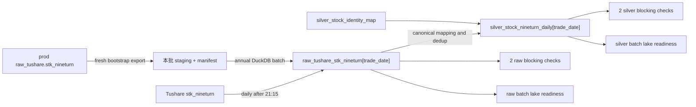

# Dagster 神奇九转数据集接入低层设计

状态：N0-N4 已完成开发与验收；N5A/N5B 已完成代码开发与本地验证；N5 正式 Lake 操作、N6-N7 仍待分阶段审批
日期：2026-07-10
上位方案：[`dagster-stk-nineturn-dataset-onboarding-plan.md`](./dagster-stk-nineturn-dataset-onboarding-plan.md)

## 1. 设计结论

本 LLD 已完成开发前代码审计。当前没有新的业务拍板项，可以进入分阶段开发，但不能把代码开发、正式 Lake 写入和 Dagster runless event 写入合并成一次操作。

本专项固定形成两个资产：

| 层 | Asset key | 长期来源 | 历史初始化 |
| --- | --- | --- | --- |
| Raw | `raw_tushare_stk_nineturn` | Tushare `stk_nineturn` | 本批次从 prod raw DB 重新全量导出 |
| Silver | `silver_stock_nineturn_daily` | Raw + `silver_stock_identity_map` | 从 formal raw 批量派生 |

核心口径：

1. Raw 保存源代码事实，不提前改写北交所旧代码或其它历史代码。
2. Silver 只输出 `latest_ts_code`。新旧代码同行时选择规范新代码来源行；只有旧代码行时保留其业务值并输出规范新代码。
3. 历史文件全部补 materialization event，普通 check event 只补最近 20 个交易日。
4. 日常 sensor 只看最近 10 个交易日，使用 DuckDB true-batch readiness，日期循环内不读 Dagster event/check history。
5. 每个资产只注册 2 个合并后的 blocking checks，共 4 个，避免 Dagster DB 事件增量失控。
6. 历史 prod 导出、formal raw/silver 构建、runless event 写入必须分别 dry-run、样本、审批和验收。

本 LLD 不授权运行 `dg`、写正式 Lake、写 Dagster instance 或删除历史 staging。

## 2. 依据与代码审计

### 2.1 必读规范

- 根 `AGENTS.md`
- `lake_console/AGENTS.md`
- `lake_console/orchestrator/AGENTS.md`
- `lake_console/orchestrator/CODING_STANDARDS.md`
- `lake_console/docs/design/dagster-data-pipeline-performance-governance.md`
- `lake_console/docs/design/dagster-asset-schema-contract-design.md`
- `lake_console/docs/templates/dagster-dataset-onboarding-template.html`
- `lake_console/docs/templates/dagster-bootstrap-migration-template.html`
- `docs/sources/tushare/股票数据/特色数据/0364_神奇九转指标.md`

### 2.2 当前可复用能力

| 能力 | 当前事实 | 本专项用法 |
| --- | --- | --- |
| Definitions 加载 | `load_from_defs_folder(...)` 自动发现 `defs` 文件 | 新文件无需集中注册 import |
| 股票交易日分区 | `cn_a_stock_trade_days` 已存在 | Raw/Silver/check/job 共用，不新增 partition set |
| Tushare raw helper | `fetch_tushare_partition_to_raw(...)` | 日常 Raw 复用，保留分页和原子写入 |
| Tushare 分页大小 | `TUSHARE_API_PAGE_LIMIT = 6000` | 当前单日峰值 5,667 行，通常 1 页 |
| RunRequest | `build_run_request(...)` | 禁止直接构造 `dg.RunRequest(...)` |
| Run key | `build_asset_update_run_key(...)` | 统一生成，不手写、不反解析 |
| Cursor | `build_sensor_cursor(...)`、`build_cursor_details(...)` | 小型 JSON，ASCII reason code，硬上限 8KB |
| 连续性选择 | `load_expected_trade_date_window(...)`、`select_first_not_ready_trade_date(...)` | 最近 10 日 first-not-ready |
| Batch readiness | `ContinuityDateReadiness`、`ContinuityBatchReadiness` | 新增九转专用 lake readiness，不读 Dagster history |
| prod DB 导出 | `DbTradeDateExportService` 已支持 `stk_nineturn` | 新鲜全量导出和 manifest 交接 |
| 历史事件 | `gold_stock_daily_qfq_history_events.py` 已验证 materialization/check 分层补录 | 全历史 materialization + recent20 checks |
| Schema metadata | `ColumnContract`、`build_asset_definition_metadata(...)` | Catalog、definition、runtime 三层同源 |

### 2.3 当前生产规模

2026-07-10 只读复审结果：

| 指标 | 结果 |
| --- | ---: |
| 日期范围 | 2023-01-03 至 2026-07-09 |
| 交易日分区 | 850 |
| 总行数 | 4,523,818 |
| distinct 源代码 | 5,821 |
| 单日最大行数 | 5,667 |
| 原始业务键重复 | 0 |
| 缺失开市日 | 0 |
| 北交所映射后重复标准键 | 4,340 |
| 计数/信号内容冲突键 | 42 |
| OHLC/vol/amount 冲突键 | 0 |

已有历史导出曾以 807 日、4,287,061 行完成，耗时约 430 秒。本次全区间导出的性能停止线定为 600 秒；超过时只做 profiling，不继续 formal build。

## 3. 范围与硬约束

### 3.1 本专项包含

- 两个 schema contract、路径、catalog entry 和中文名称映射。
- 两个 assets、四个 checks、两个 jobs、两个 sensors。
- Raw/Silver 共用语义的 lake readiness。
- prod export manifest 验证、formal raw/silver 历史构建、文件审计。
- 历史 runless materialization/check event dry-run 和补录工具。
- 单元、集成、静态和性能门禁。

### 3.2 本专项不包含

- 不新增 gold 层、页面、API、策略或报告资产。
- 不新增 resource、数据库表、配置项、dynamic partitions、summary/readiness asset。
- 不修改 `silver_stock_identity_map` 生成逻辑。
- 不把 `silver_stock_daily` 作为 blocking dependency。
- 不新增九转计算公式；Silver 不重算九转。
- 不通过 850 个 Dagster jobs 做历史 backfill。
- 不使用已有旧 staging 文件冒充本批 prod 导出结果。
- 不自动删除旧 staging。

## 4. 运行拓扑



历史和日常使用同一 formal Raw schema，但来源职责不同：

- Bootstrap：只接受 prod DB 本批 manifest。
- 日常：只接受 Tushare API。
- Sensor 不具备 prod DB fallback。

## 5. 文件影响面

### 5.1 新增生产模块

```text
lake_console/orchestrator/src/orchestrator/defs/stk_nineturn_contract.py
lake_console/orchestrator/src/orchestrator/defs/assets/stk_nineturn.py
lake_console/orchestrator/src/orchestrator/defs/checks/stk_nineturn_checks.py
lake_console/orchestrator/src/orchestrator/defs/jobs/stk_nineturn_update.py
lake_console/orchestrator/src/orchestrator/defs/sensors/stk_nineturn_sensor.py
lake_console/orchestrator/src/orchestrator/defs/asset_guards/stk_nineturn_lake_readiness.py
lake_console/orchestrator/src/orchestrator/defs/bootstrap/stk_nineturn_history.py
lake_console/orchestrator/src/orchestrator/defs/bootstrap/stk_nineturn_history_cli.py
lake_console/orchestrator/src/orchestrator/defs/bootstrap/stk_nineturn_events.py
lake_console/orchestrator/src/orchestrator/defs/bootstrap/stk_nineturn_events_cli.py
```

`stk_nineturn_contract.py` 不是杂项 `utils`。它只拥有 Raw/Silver check、writer 和 readiness 必须共享的九转业务规则与批量指标 SQL，防止三套实现漂移。

### 5.2 修改生产模块

```text
lake_console/orchestrator/src/orchestrator/defs/paths.py
lake_console/orchestrator/src/orchestrator/defs/run_contracts/asset_column_schemas.py
lake_console/orchestrator/src/orchestrator/defs/catalog/lake_assets.py
lake_console/orchestrator/src/orchestrator/defs/catalog/name_mapping.py
```

不修改 definitions 组合根。`defs` 目录自动发现新 definitions。

### 5.3 测试文件

```text
lake_console/orchestrator/tests/test_stk_nineturn_contracts.py
lake_console/orchestrator/tests/test_stk_nineturn_assets.py
lake_console/orchestrator/tests/test_stk_nineturn_checks.py
lake_console/orchestrator/tests/test_stk_nineturn_sensors.py
lake_console/orchestrator/tests/test_stk_nineturn_lake_readiness.py
lake_console/orchestrator/tests/test_stk_nineturn_history.py
lake_console/orchestrator/tests/test_stk_nineturn_events.py
lake_console/orchestrator/tests/test_asset_governance_contracts.py
lake_console/orchestrator/tests/test_asset_check_incremental_governance.py
lake_console/orchestrator/tests/test_run_contract_static_gates.py
```

## 6. Schema、路径与 Catalog

### 6.1 Schema constants

在 `asset_column_schemas.py` 新增：

```python
RAW_TUSHARE_STK_NINETURN_SCHEMA = (
    ColumnContract("ts_code", "VARCHAR", "Tushare source stock code"),
    ColumnContract("trade_date", "DATE", "Trade date"),
    ColumnContract("freq", "VARCHAR", "Fixed to daily"),
    ColumnContract("open", "DOUBLE", "Open price"),
    ColumnContract("high", "DOUBLE", "High price"),
    ColumnContract("low", "DOUBLE", "Low price"),
    ColumnContract("close", "DOUBLE", "Close price"),
    ColumnContract("vol", "DOUBLE", "Volume"),
    ColumnContract("amount", "DOUBLE", "Amount"),
    ColumnContract("up_count", "DOUBLE", "Up sequence count"),
    ColumnContract("down_count", "DOUBLE", "Down sequence count"),
    ColumnContract("nine_up_turn", "VARCHAR", "+9 marker or null"),
    ColumnContract("nine_down_turn", "VARCHAR", "-9 marker or null"),
)

SILVER_STOCK_NINETURN_DAILY_SCHEMA = (
    ColumnContract("ts_code", "VARCHAR", "Canonical stock code"),
    ColumnContract("trade_date", "DATE", "Trade date"),
    ColumnContract("freq", "VARCHAR", "Fixed to daily"),
    ColumnContract("open", "DOUBLE", "Open price"),
    ColumnContract("high", "DOUBLE", "High price"),
    ColumnContract("low", "DOUBLE", "Low price"),
    ColumnContract("close", "DOUBLE", "Close price"),
    ColumnContract("vol", "DOUBLE", "Volume"),
    ColumnContract("amount", "DOUBLE", "Amount"),
    ColumnContract("up_count", "INTEGER", "Non-negative up sequence count"),
    ColumnContract("down_count", "INTEGER", "Non-negative down sequence count"),
    ColumnContract("nine_up_turn", "VARCHAR", "+9 marker or null"),
    ColumnContract("nine_down_turn", "VARCHAR", "-9 marker or null"),
)
```

Raw `trade_date` 采用 `DATE` 是双来源同 schema 的硬约束：prod DB 字段本身是日期，日常 Tushare datetime/string 由共享 raw helper 按 column type 写成 `DATE`。这不是把 Silver 类型提前到 Raw，而是保证同一 Raw asset 不因来源切换产生物理 schema 分裂。

从 schema 派生：

```python
RAW_STK_NINETURN_COLUMNS = tuple(column.name for column in RAW_TUSHARE_STK_NINETURN_SCHEMA)
RAW_STK_NINETURN_COLUMN_TYPES = {
    column.name: column.type for column in RAW_TUSHARE_STK_NINETURN_SCHEMA
}
```

禁止另写一份字段列表或类型 map。

### 6.2 Paths

在 `paths.py` 新增：

```python
def raw_stk_nineturn_path(root: Path, partition_key: str) -> Path:
    return lake_path(
        root,
        RAW,
        "tushare",
        "stk_nineturn",
        f"trade_date={partition_key}",
        "part-000.parquet",
    )


def silver_stock_nineturn_daily_path(root: Path, partition_key: str) -> Path:
    return lake_path(
        root,
        SILVER,
        "quote",
        "stock_nineturn_daily",
        f"trade_date={partition_key}",
        "part-000.parquet",
    )
```

不得在业务模块中手拼路径。

### 6.3 Catalog

在 `PartitionModel` 增加：

```python
TRADE_DATE_PARTITION_RAW_STK_NINETURN
TRADE_DATE_PARTITION_SILVER_STOCK_NINETURN_DAILY
```

两者均注册为：

- family：trade-date partition。
- dimension：`trade_date`。
- physical layout：单分区文件。
- partition set：definition 侧使用 `cn_a_stock_trade_days`。

Raw `LakeAssetCatalogEntry`：

- `dataset_id="stk_nineturn"`
- `source_system=TUSHARE`
- `ingestion_sources=(TUSHARE_API, PROD_DB_READONLY)`
- `default_daily_ingestion_source=TUSHARE_API`
- `bootstrap_sources=(PROD_DB_READONLY,)`
- `write_policy=PARTITION_FILE_ATOMIC_REPLACE`
- `event_policy=SUPPORTS_RUNLESS_EVENT_BACKFILL`

Raw 不能复用只表达 Tushare 单来源的 `_tushare_raw_entry(...)`，应使用通用 `_entry(...)` 显式描述双来源。

Silver entry：

- `dataset_id="stock_nineturn_daily"`
- `bootstrap_sources=(DERIVED_FROM_ASSETS,)`
- `event_policy=SUPPORTS_RUNLESS_EVENT_BACKFILL`
- deps 事实写明 Raw + identity map。

中文名称映射增加：

```text
stk_nineturn -> 神奇九转
stock_nineturn_daily -> 股票日线神奇九转
```

## 7. 共享契约与批量指标

### 7.1 数据结构

`stk_nineturn_contract.py` 定义：

```python
@dataclass(frozen=True, slots=True)
class StkNineturnPathPlan:
    trade_date: str
    path: Path
    file_exists: bool


@dataclass(frozen=True, slots=True)
class StkNineturnPartitionMetrics:
    trade_date: str
    row_count: int
    null_key_count: int
    duplicate_key_count: int
    partition_date_mismatch_count: int
    non_daily_freq_count: int
    invalid_price_count: int
    negative_volume_amount_count: int
    invalid_count_count: int
    simultaneous_direction_count: int
    invalid_marker_count: int
    marker_count_mismatch_count: int
    simultaneous_marker_count: int
    unmapped_source_code_count: int = 0
    canonical_duplicate_key_count: int = 0
    market_value_conflict_key_count: int = 0
    count_signal_conflict_key_count: int = 0
    source_row_count: int = 0
    mapped_row_count: int = 0
    expected_output_row_count: int = 0
    alias_duplicate_key_count: int = 0
    unresolved_count_signal_conflict_key_count: int = 0
    canonical_selection_mismatch_count: int = 0
```

同时定义最多 10 条的失败样本结构。样本只用于 check metadata 和诊断，不进入 cursor。

### 7.2 共享语义

Raw 内容规则：

1. `ts_code/trade_date/freq` 非空。
2. `(ts_code, trade_date)` 唯一。
3. `trade_date` 等于目标 partition。
4. `freq='daily'`。
5. OHLC 非负，且 high/low 包含 open/close 区间。
6. `vol/amount >= 0`。
7. `up_count/down_count >= 0` 且等于其整数截断值。
8. `up_count` 与 `down_count` 不得同时大于 0。
9. `nine_up_turn` 只能是 `+9/NULL`，`nine_down_turn` 只能是 `-9/NULL`。
10. marker 出现时对应 count 必须 `>= 9`；count `>= 9` 不反向要求 marker 必须出现。
11. 上下 marker 不得同时出现。

Silver 在以上规则上增加：

- source code 全部可被 identity map 的有效区间覆盖。
- 每条 Raw 行在目标交易日必须恰好命中一条有效 identity；0 条是未映射，超过 1 条是重叠映射，均 fail closed。
- 输出代码全部是 `latest_ts_code`。
- canonical key 唯一。
- 行数等于映射去重后的预期行数。
- `up_count/down_count` 物理类型为 `INTEGER`。
- 未解决的行情冲突为 0。

### 7.3 SQL 复用方式

共享模块提供 set-based DuckDB 查询函数：

```python
def load_raw_stk_nineturn_metrics(
    connection,
    *,
    path_plans: Sequence[StkNineturnPathPlan],
) -> Mapping[str, StkNineturnPartitionMetrics]: ...


def load_silver_stock_nineturn_daily_metrics(
    connection,
    *,
    raw_path_plans: Sequence[StkNineturnPathPlan],
    silver_path_plans: Sequence[StkNineturnPathPlan],
    identity_map_path: Path,
) -> Mapping[str, StkNineturnPartitionMetrics]: ...
```

路径通过 `VALUES (trade_date, path)` relation 传入，使用 `read_parquet([...], filename=true, union_by_name=true)` 一次聚合多个日期。禁止在 Python 日期循环里每个日期执行一次重 SQL。

Schema 检查可对最多 10 个文件做 bounded Parquet metadata scan；业务行扫描必须是 batch SQL。

Asset checks、历史审计和 sensor readiness 都调用这两个 metrics loader，不各自复制业务规则。

## 8. Raw Asset

### 8.1 Definition

`assets/stk_nineturn.py`：

```python
@dg.asset(
    name="raw_tushare_stk_nineturn",
    partitions_def=cn_a_stock_trade_days,
    group_name="quote",
    tags=build_asset_tags(...),
    metadata=build_asset_definition_metadata(
        column_schema=RAW_TUSHARE_STK_NINETURN_SCHEMA,
        ...,
    ),
)
def raw_tushare_stk_nineturn(
    context: dg.AssetExecutionContext,
    lake_root: LakeRootResource,
    duckdb: DuckDBResource,
    tushare: TushareResource,
) -> dg.MaterializeResult: ...
```

执行步骤：

1. `lake_root.ensure_available_for_run()`。
2. 读取并规范化 `context.partition_key`，必须为 `YYYY-MM-DD`。
3. 目标路径由 `raw_stk_nineturn_path(...)` 生成。
4. 调用共享 helper：

```python
metadata = fetch_tushare_partition_to_raw(
    tushare=tushare,
    duckdb=duckdb,
    api_name="stk_nineturn",
    api_params={
        "trade_date": f"{partition_key} 00:00:00",
        "freq": "daily",
    },
    fields=RAW_STK_NINETURN_COLUMNS,
    column_types=RAW_STK_NINETURN_COLUMN_TYPES,
    target_path=target_path,
    partition_key=partition_key,
    allow_empty=False,
)
```

5. 返回 `dg.MaterializeResult(metadata=metadata)`。

项目 helper 每页固定 6,000 行并自动推进 `offset`。源接口文档 10,000 是硬上限，不应把 helper 页大小改成 10,000。

### 8.2 Raw 失败边界

- Tushare 返回 0 行：失败且不写空文件。
- 字段集合变化：契约验证失败。
- 请求超过 2 页或耗时超过 60 秒：run 可完成当前写入，但验收标记性能异常，sensor 不扩大并发。
- Raw 不做代码映射、股票池过滤或 stock daily 补齐。

## 9. Silver Asset 与 SQL

### 9.1 Writer API

```python
@dataclass(frozen=True, slots=True)
class SilverStockNineturnDailyWriteResult:
    target_path: Path
    row_count: int
    source_row_count: int
    mapped_row_count: int
    alias_duplicate_key_count: int
    count_signal_conflict_key_count: int
    market_value_conflict_key_count: int
    unmapped_source_code_count: int
    observed_columns: tuple[str, ...]


def write_silver_stock_nineturn_daily_partition(
    *,
    lake_root: Path,
    duckdb: DuckDBResource,
    partition_key: str,
    overwrite: bool = False,
) -> SilverStockNineturnDailyWriteResult: ...
```

`overwrite=False` 时目标已存在必须 fail closed。日常正常 job 不覆盖已 materialized check problem；人工确认后才可显式重跑覆盖。

### 9.2 映射 SQL

连接条件固定为：

```sql
raw.ts_code = identity.source_ts_code
and raw.trade_date >= identity.valid_from
and (
  identity.valid_to is null
  or raw.trade_date < identity.valid_to
)
```

主查询分层：

```sql
with raw_normalized as (...),
mapped as (
  select
    identity.latest_ts_code,
    raw.ts_code as source_ts_code,
    raw.trade_date,
    raw.freq,
    raw.open,
    raw.high,
    raw.low,
    raw.close,
    raw.vol,
    raw.amount,
    raw.up_count,
    raw.down_count,
    nullif(trim(raw.nine_up_turn), '') as nine_up_turn,
    nullif(trim(raw.nine_down_turn), '') as nine_down_turn
  from raw_normalized raw
  left join identity
    on <effective interval predicate>
),
conflicts as (...),
ranked as (
  select *,
    row_number() over (
      partition by latest_ts_code, trade_date
      order by
        case when source_ts_code = latest_ts_code then 0 else 1 end,
        source_ts_code
    ) as source_rank
  from mapped
)
select
  latest_ts_code as ts_code,
  trade_date,
  freq,
  open,
  high,
  low,
  close,
  vol,
  amount,
  cast(up_count as integer) as up_count,
  cast(down_count as integer) as down_count,
  nine_up_turn,
  nine_down_turn
from ranked
where source_rank = 1
order by ts_code;
```

### 9.3 冲突判定

对 `(latest_ts_code, trade_date)` 分组：

1. OHLC/vol/amount 任一字段存在多个值：fail closed，不写正式文件。
2. count/signal 不同且存在 `source_ts_code=latest_ts_code`：允许按规范新代码行选择，并记录冲突数和最多 10 条样本。
3. count/signal 不同且不存在规范新代码来源行：fail closed，不能按字符串排序静默选择历史 alias。
4. 只有一条旧代码来源行：保留其业务值，输出 `latest_ts_code`。
5. 任一 source code 未映射：fail closed。
6. 同一 Raw 行命中多条有效 identity：fail closed，禁止让 JOIN 行数放大后再静默去重。

### 9.4 写入事务边界

1. 先完成全部 metrics/conflict preflight。
2. 写目标同目录临时文件 `part-000.parquet.tmp.<run_id>`。
3. 校验列顺序、类型、目标日期、行数和标准键唯一性。
4. 通过后 `os.replace(...)` 原子替换。
5. 失败时删除临时文件，不修改正式文件。

Asset definition：

```python
@dg.asset(
    name="silver_stock_nineturn_daily",
    partitions_def=cn_a_stock_trade_days,
    deps=[raw_tushare_stk_nineturn, silver_stock_identity_map],
    ...,
)
def silver_stock_nineturn_daily(...) -> dg.MaterializeResult: ...
```

Materialization metadata 只写聚合指标和最多 10 条冲突样本，不写完整代码列表。

## 10. Asset Checks 与 Jobs

### 10.1 Check definitions

文件：`checks/stk_nineturn_checks.py`。

四个 check 均必须：

- `blocking=True`
- `partitions_def=cn_a_stock_trade_days`
- metadata 通过 `build_check_metadata(...)`
- 复用第 7 节 metrics
- 失败样本最多 10 条

名称固定：

```text
raw_tushare_stk_nineturn_contract_check
raw_tushare_stk_nineturn_content_integrity_check
silver_stock_nineturn_daily_contract_check
silver_stock_nineturn_daily_canonical_integrity_check
```

Raw contract check 合并：文件存在、row count、schema、partition date、freq、registered partition。

Raw content check 合并：业务键、价格、成交、count、marker 规则。

Silver contract check 合并：文件、row count、schema、partition date、freq、标准业务键。

Silver canonical check 合并：映射覆盖、alias 冲突、规范行优先、输出行数、内容域。

Silver canonical check 显式声明：

```python
additional_deps=[raw_tushare_stk_nineturn, silver_stock_identity_map]
```

不注册 stock daily coverage check。该覆盖率只进入离线 bootstrap/final audit。

### 10.2 Jobs

文件：`jobs/stk_nineturn_update.py`。

```python
raw_stk_nineturn_update_job = dg.define_asset_job(
    name="raw_stk_nineturn_update_job",
    selection=(
        dg.AssetSelection.assets(raw_tushare_stk_nineturn)
        | dg.AssetSelection.checks_for_assets(raw_tushare_stk_nineturn)
    ),
)

silver_stock_nineturn_daily_update_job = dg.define_asset_job(
    name="silver_stock_nineturn_daily_update_job",
    selection=(
        dg.AssetSelection.assets(silver_stock_nineturn_daily)
        | dg.AssetSelection.checks_for_assets(silver_stock_nineturn_daily)
    ),
)
```

不新增 checks-only job、repair job、schedule 或 backfill policy。若以后确需历史 check refresh，必须另行设计和审批，不能在本轮预埋入口。

## 11. Lake Readiness

### 11.1 API

文件：`asset_guards/stk_nineturn_lake_readiness.py`。

```python
def batch_raw_stk_nineturn_lake_readiness(
    *,
    connection,
    lake_root: Path,
    expected_trade_dates: Sequence[str],
    registered_trade_days: AbstractSet[str],
    full_semantics: bool = True,
) -> ContinuityBatchReadiness: ...


def batch_silver_stock_nineturn_daily_lake_readiness(
    *,
    connection,
    lake_root: Path,
    expected_trade_dates: Sequence[str],
    registered_trade_days: AbstractSet[str],
    full_semantics: bool = True,
) -> ContinuityBatchReadiness: ...
```

### 11.2 状态分类

| 状态 | `materialized` | `checks_passed` | Sensor 行为 |
| --- | --- | --- | --- |
| 目标文件缺失 | false | false | 可提交最早缺失日期 |
| 文件存在但 0 行 | true | false | 人工处理，不自动覆盖 |
| 文件存在且契约失败 | true | false | 人工处理，不推进后续日期 |
| 文件与完整语义通过 | true | true | ready，推进 frontier |
| 未知日期 | false | false | fail closed |

本数据集按日单文件，因此“文件存在但目标日 0 行”不是 year-file 布局里的未生成状态，而是一个已存在的坏分区。

### 11.3 性能实现

- 日期窗口最多 10。
- 每层最多 10 个日文件。
- 业务语义每层 1 个 batch SQL。
- schema metadata scan 最多 10 次轻量读取。
- Silver readiness 额外读取 1 个 identity map snapshot。
- 日期循环内 Dagster event/check history API 调用次数为 0。

Silver readiness 必须复算 canonical 预期行数和冲突语义，不能只检查 Silver row count。

## 12. Sensors、Run Key 与 Cursor

### 12.1 共同 definition

```python
@dg.sensor(
    job_name=<job>,
    default_status=dg.DefaultSensorStatus.STOPPED,
    minimum_interval_seconds=600,
    tags=build_sensor_tags(...),
    required_resource_keys={"lake_root", "duckdb"},
)
```

Raw sensor：`raw_stk_nineturn_update_job_sensor`，21:15。

Silver sensor：`silver_stock_nineturn_daily_update_job_sensor`，21:20。

### 12.2 每 tick 决策顺序

Raw：

1. 读取 `evaluated_at` 和 lake root。
2. 用 `load_expected_trade_date_window(...)` 获取最近 10 个 SSE expected dates。
3. 从 `cn_a_stock_trade_days` 一次读取 registered set。
4. 先构建 registered gap；有缺口直接 skip，不执行 lake batch readiness。
5. 时间窗口未到直接 skip，不扫描九转文件。
6. 一次调用 Raw batch readiness。
7. `select_first_not_ready_trade_date(...)` 选择最早目标。
8. materialized check failure 时 skip；缺文件时提交一个 run。

Silver：

1. expected/registered/time gate 同 Raw。
2. 一次 Raw batch readiness，找出窗口内连续 ready 前缀。
3. Raw 首日不 ready 时直接 skip，不执行 Silver readiness。
4. 只对 Raw 连续 ready 前缀执行一次 Silver batch readiness。
5. 选择该前缀内 first silver not-ready；允许补阻断日前更早的 Silver 缺口，但不得越过 Raw frontier。
6. identity map 缺失或映射不全时 skip，并指向 identity map。
7. Silver 缺文件且同日 Raw ready 时提交一个 run。

### 12.3 Run keys

```python
raw_run_key = build_asset_update_run_key(
    subject="raw_stk_nineturn_update",
    unit_id=trade_date,
)

silver_run_key = build_asset_update_run_key(
    subject="silver_stock_nineturn_daily_update",
    unit_id=trade_date,
)
```

输出固定：

```text
raw_stk_nineturn_update:YYYY-MM-DD
silver_stock_nineturn_daily_update:YYYY-MM-DD
```

请求只通过：

```python
build_run_request(run_key=..., partition_key=trade_date)
```

不传运行时 source mode。Raw 日常 job 永远是 Tushare；prod bootstrap 不复用该 job。

### 12.4 Cursor

标准 reason codes：

```text
run_window_not_started
missing_registered_partition
raw_stk_nineturn_not_ready
silver_stock_nineturn_daily_not_ready
identity_mapping_missing
materialized_check_failed
all_ready
request_run
```

Cursor 通过 `build_cursor_details(...)` 生成：

- `asset_family="stk_nineturn"`
- `partition_set="cn_a_stock_trade_days"`
- `summary` 和 `next_action` 必填
- `frontier` 只保留日期和计数
- `gate_statuses` 只保留 ready/reason_code
- `performance_ms` 只保留 batch 总耗时

不得写路径数组、代码列表、完整 status map 或 schema。目标一般 <2KB，复杂阻断 <3KB，绝不超过 `MAX_SENSOR_CURSOR_BYTES=8192`。

## 13. 历史 Prod Export 交接

### 13.1 新鲜导出是硬前置

历史目录已有文件不能直接参与 bootstrap。必须用 `DbTradeDateExportService` 对完整区间重新执行：

```text
start_date = 2023-01-03
end_date = min(prod raw latest date, latest completed SSE trade date)
freq = daily
```

正式导出使用：

- 单个只读连接。
- server-side cursor。
- batch size 20,000。
- 显式 13 个字段。
- `order by trade_date, ts_code`。
- 每个 trade date 原子写 staging 文件。

当前 backend 默认 Lake 根是旧 Lake。N4 必须显式把 `--lake-root` 指向本批新建的
隔离 mini-lake root；`DbTradeDateExportService` 会在该根下写相对路径
`raw_tushare/stk_nineturn/...`，因此不会碰正式 Raw。样本和 full 使用不同根，目录中
任何旧九转文件都不得参与本批 manifest。

### 13.2 Manifest contract

`stk_nineturn_history.py` 定义：

```python
@dataclass(frozen=True, slots=True)
class StkNineturnProdExportManifest:
    run_id: str
    dataset_id: str
    source_method: str
    mode: str
    start_date: str
    end_date: str
    partition_keys: tuple[str, ...]
    source_row_count: int
    written_row_count: int
    skipped_partition_keys: tuple[str, ...]
    output_paths: tuple[Path, ...]
```

```python
def load_stk_nineturn_prod_export_manifest(
    *,
    manifest_path: Path,
    run_id: str,
) -> StkNineturnProdExportManifest: ...
```

验证项：

- `dataset_id == "stk_nineturn"`
- `source_method == "prod-raw-db"`（backend `DbTradeDateExportService` 的正式 source 标识）
- range mode 且起点为 2023-01-03
- end date 等于本次 cutover
- expected dates 与 partition keys 完全一致
- skipped partitions 为空
- source/written row count 一致且大于 0
- 每个 output path 存在且位于允许 staging root
- 文件 schema、partition date 和 manifest 行数一致

Orchestrator 不能 import `lake_console.backend`。交接边界只能是 staging Parquet + manifest record。

### 13.3 N4 执行结果

生产只读 cutover 审计：

| 项 | 结果 |
| --- | ---: |
| prod latest | 2026-07-09 |
| latest completed SSE | 2026-07-10 |
| cutover | 2026-07-09 |
| partition count | 850 |
| source row count | 4,523,818 |
| source non-daily/null-key | 0 / 0 |

最终 3 日样本根为
`/Volumes/datasource/data_lake/_bootstrap/stk_nineturn/n4_sample_20260710T193201`；
最终 full staging root 为
`/Volumes/datasource/data_lake/_bootstrap/stk_nineturn/n4_full_20260710T193955`。
N5 只能读取 full 根中 run id
`20260710T115046Z-stk_nineturn-prod-raw-db` 对应的 manifest record。

Full audit 结果：

| 项 | 结果 |
| --- | ---: |
| files / dates / rows | 850 / 850 / 4,523,818 |
| size | 146MB |
| elapsed | 401.756s |
| schema mismatch | 0 |
| manifest/file row mismatch | 0 |
| expected-only / actual-only dates | 0 / 0 |
| duplicate/null/partition/freq failures | 0 |
| OHLC/volume/count/signal failures | 0 |

首次样本发现 exporter 把 `trade_date` 插在 `ts_code` 前；首次 full 又发现 13 个
`nine_down_turn` 全 NULL 的日期被 PyArrow 推断为 NULL 类型。实现已改为按字段白名单
顺序构造行，并通过显式 dtype override 固定两个 marker 为 string。早期 sample/full
根均为失败或诊断证据，禁止 N5 消费，也不得在未审批时删除。

### 13.4 CLI

```text
python -m orchestrator.defs.bootstrap.stk_nineturn_history_cli dry-run ...
python -m orchestrator.defs.bootstrap.stk_nineturn_history_cli build-raw ...
python -m orchestrator.defs.bootstrap.stk_nineturn_history_cli build-silver ...
python -m orchestrator.defs.bootstrap.stk_nineturn_history_cli audit ...
```

所有写模式必须使用显式确认参数，dry-run 命令不得包含隐式 apply 路径。

本数据集不新增 `bootstrap/specs/stk_nineturn.py`，因为正式事实源不是 `old_lake_bootstrap`。用旧 Lake spec 会把历史 staging 错写成可信来源。

## 14. Formal Raw/Silver History Build

### 14.1 Plan

```python
@dataclass(frozen=True, slots=True)
class StkNineturnHistoryBuildPlan:
    run_id: str
    start_date: str
    end_date: str
    expected_partition_keys: tuple[str, ...]
    raw_target_paths: tuple[Path, ...]
    silver_target_paths: tuple[Path, ...]
    expected_source_row_count: int
    annual_batches: tuple[int, ...]
```

`dry-run` 只生成 plan/report，不创建目录、不写 temp file、不写 Dagster event。

### 14.2 Formal Raw

按年份处理 2023-2026：

1. 只选择 manifest 指向的当年 staging 文件。
2. 一个 DuckDB 主查询显式投影 13 列并 cast 到 Raw schema。
3. 写到同一 Lake volume 的年度临时输出目录。
4. 批量核对日期集合、每日日数、总行数、schema、业务键。
5. 全年校验通过后，逐分区把已验证临时文件 `os.replace` 到 formal raw。

单个正式文件始终原子；若 promote 阶段进程中断，已替换和未替换文件都各自完整，final audit 会阻止事件补录，允许按 manifest 幂等续跑。

### 14.3 Formal Silver

同样按年执行一个主 SQL：

- 读取当年 formal raw 文件集合。
- 读取一个 identity map snapshot。
- 复用第 9 节映射、冲突和去重语义。
- 写年度临时 partitioned output。
- 全年审计通过后逐分区原子 promote。

如果年度查询发生不可接受的 DuckDB spill，可降为季度批次；不得降级映射或 check 语义。

### 14.4 Final file audit

最终审计报告必须包含：

```text
expected_partition_count
raw_partition_count
silver_partition_count
prod_source_row_count
raw_row_count
silver_row_count
unmapped_source_code_count
canonical_duplicate_key_count
market_value_conflict_key_count
count_signal_conflict_key_count
new_code_preferred_key_count
stock_daily_warmup_gap_count
```

硬验收：

- expected/raw/silver 分区集合完全一致。
- prod source rows = formal raw rows。
- unmapped = 0。
- canonical duplicates = 0。
- market value conflicts = 0。
- 已知 42 个 count/signal 冲突按新代码优先收敛。

stock daily warm-up 缺口只报告，不作为失败项。

## 15. Runless Events

### 15.1 Plan 与数量

`stk_nineturn_events.py` 定义：

```python
@dataclass(frozen=True, slots=True)
class StkNineturnRunlessEventPlan:
    materialization_partition_keys: tuple[str, ...]
    check_partition_keys: tuple[str, ...]
    existing_materialized_partition_keys: tuple[str, ...]
    existing_ready_check_partition_keys: tuple[str, ...]
    planned_materialization_event_count: int
    planned_check_event_count: int
```

默认范围：

- 850 Raw materializations。
- 850 Silver materializations。
- 最近 20 日 x 2 assets x 2 checks = 80 checks。
- 合计最多约 1,780 个新 event；实际减去已存在、已通过事件。

### 15.2 安全顺序

1. 读取 final file audit，必须全绿。
2. 生成 dry-run，禁止写 event。
3. 先对 3 个日期执行样本补录。
4. 只读验证 partition、asset key、check target materialization 归属。
5. 再按固定批次补所有 materializations。
6. 最后补 recent20 checks。
7. final audit 对账。

Check event 必须绑定同分区最新 materialization，通过 `AssetCheckEvaluationTargetMaterializationData` 写入目标 storage id/run id/timestamp。不得写 partition 为空的 check event。

### 15.3 幂等与边界

- materialization 已存在时默认跳过。
- recent20 对应 check 已 ready 且绑定最新 materialization时跳过。
- 只查询 2 个 asset 的目标 partition 集合，不做全库无界 event scan。
- 写入 metadata 包含 bootstrap run id、source manifest run id、file audit report path、partition key。
- 失败后保留已成功事件，重新 dry-run 后幂等续跑。
- 不删除或覆盖历史 Dagster event。

## 16. 性能门禁

| 场景 | 正式模型 | 目标 | 停止条件 |
| --- | --- | ---: | --- |
| prod export | 1 个只读连接、20,000 行流式 batch | 实测 401.756 秒 | >600 秒或连接/内存异常 |
| formal raw | 4 个年度主查询 | 每年 1 个主扫描 | 每日 850 次重 SQL |
| formal silver | 4 个年度 join/window 查询 | 无 Python 明细循环 | spill 且季度切分仍不可控 |
| 日常 Raw | 当前通常 1 个 6,000 行 page | <30 秒 | >2 页或 >60 秒 |
| 日常 Silver | 1 raw + 1 identity SQL | <2 秒 | >5 秒 |
| Raw sensor | 10 文件 true-batch | <2 秒 | >5 秒或 event history read |
| Silver sensor | 最多 20 日文件 + identity | <3 秒 | >5 秒或逐日重 SQL |
| Runless events | 最多约 1,780 | 有界批次 | 全历史普通 checks |

测试必须同时测：

- 正式 10 日窗口。
- 60 日容量样本，仅证明 helper 不退化为逐日重查询。
- 业务异常样本，确认完整语义不因性能优化被隐藏。

性能测试报告至少记录：elapsed ms、文件数、行数、DuckDB 主查询次数、schema metadata 读取次数、Dagster history API 次数。

N3 本地临时 Parquet 实测结果：

| helper | 窗口 | 文件/行模型 | 业务主查询 | schema metadata 读取 | Dagster history | elapsed |
| --- | ---: | --- | ---: | ---: | ---: | ---: |
| Raw | 10 日 | 10 文件 / 10 行 | 1 | 10 | 0 | 6ms |
| Silver | 10 日 | 20 日文件 + identity / 20 行 | 1 | 20 | 0 | 13ms |
| Raw | 60 日容量 | 60 文件 / 60 行 | 1 | 60 | 0 | 22ms |
| Silver | 60 日容量 | 120 日文件 + identity / 120 行 | 1 | 120 | 0 | 42ms |

这些数据只证明读取模型和查询次数符合门禁，不替代业务异常测试。正式 sensor 仍固定
10 日；60 日只作为容量回归样本。

## 17. 测试矩阵

### 17.1 Contract/Catalog/Path

- Raw/Silver schema 列顺序与类型固定。
- path 只由 path helper 生成。
- Catalog 双来源、default daily source、bootstrap source、event policy 正确。
- 中文名称映射存在。
- 不新增 partition set/resource/config。

### 17.2 Raw

- Tushare params 精确为 `trade_date + freq=daily`。
- fields 精确等于 Raw schema。
- 默认请求 page size 为 6,000。
- 返回 6,001 行时发生第二页，offset 为 6,000。
- 0 行不写文件。
- datetime/string trade_date 写成 Parquet DATE。
- Raw 保留 `831xxx.BJ` 等源代码，不做 identity mapping。

### 17.3 Silver

- self mapping。
- 北交所旧代码只输出对应 `920xxx.BJ`。
- `300114.SZ` 只输出 `302132.SZ`。
- 只有旧代码行时业务值保留、输出新代码。
- 新旧同行时规范新代码来源优先。
- count/signal 冲突且有新代码行时成功并记录 metadata。
- count/signal 冲突但无新代码来源时失败。
- OHLC/vol/amount 冲突失败。
- 未映射失败。
- 非整数/负 count、双向 count、marker/count 不匹配失败。
- 输出不含 `source_ts_code`。

### 17.4 Checks/Jobs

- 四个 checks 都显式 partitioned、blocking。
- 每层只有 2 个 Dagster checks。
- checks 与 readiness 对相同 fixture 给出相同 pass/fail。
- Raw job 只选 Raw + Raw checks。
- Silver job 只选 Silver + Silver checks。
- 不产生空 partition check event。

### 17.5 Readiness/Sensors

- registered gap 时 batch helper 调用次数为 0。
- 时间窗口前文件扫描次数为 0。
- 10 日期只执行每层 1 个业务主查询。
- first not-ready 顺序正确。
- 文件缺失可提交。
- 已存在坏文件为 materialized check problem，不自动覆盖。
- Raw frontier 落后时 Silver 不查询/不提交后续目标。
- all ready 正确记录 frontier。
- 每 tick 最多 1 个 RunRequest。
- run key 和 cursor 均经统一 builder。
- cursor 低于 8KB，reason code 全 ASCII。

### 17.6 Bootstrap/Events

- manifest run id 不匹配时失败。
- 非 `prod-raw-db`、旧批次、日期缺口、skipped partition、行数差异、路径越界均失败。
- dry-run 不写文件/event。
- 年度 raw/silver 样本与逐日 fixture 结果一致。
- 全历史 materialization 与 recent20 check 数量正确。
- check target materialization 与 partition 正确。
- event apply 无确认参数时拒绝。
- 3 日样本通过后才能 full。

### 17.7 静态门禁

- Sensor 文件禁止直接 `dg.RunRequest(...)`。
- 禁止 `run_key=f...`、字符串拼 run key、解析 run key 生成 config。
- Sensor 禁止 Dagster event/check history readiness。
- Batch helper 禁止日期循环内执行重 SQL。
- Silver 禁止直接读取 BSE mapping 自造 identity。
- Bootstrap 禁止把 `old_lake_bootstrap` 当来源。
- Runless check 必须有 partitioned target materialization。

## 18. 分阶段执行清单

截至 2026-07-10 的执行进度：

| 阶段 | 状态 | 已验收事实 |
| --- | --- | --- |
| N0 | 已完成 | Raw/Silver schema、path、partition model、中文名和共享 metrics contract 已落地；Raw catalog entry 已随 N1 active asset 注册 |
| N1 | 已完成 | Raw asset、2 个 partitioned blocking checks、Raw job 已落地；Tushare fixture、6000 行分页、0 行不写文件、真实 check execution 分区归属已通过 |
| N2 | 已完成 | Silver set-based writer、asset、2 checks、job、catalog 与完整 alias/identity 冲突矩阵已通过 |
| N3 | 已完成 | Raw/Silver true-batch lake readiness、两个 STOPPED sensors、统一 run key/cursor、first-not-ready 和性能门禁已通过 |
| N4 | 已完成 | prod read-only cutover、3 日 sample、850 日 fresh full export、逐文件 schema 与 manifest/data audit 已通过 |
| N5-N7 | 待推进 | 按下列边界分别开发或审批执行 |

N0 与 N1 按批准口径合并为一个代码提交，但验收边界保持独立。N0 预声明
Silver schema、path 和 partition model；没有提前写入 Silver catalog entry，因为 catalog
门禁要求 catalog asset keys 与当前 active asset definitions 完全一致。Silver catalog entry
将在 N2 与 `silver_stock_nineturn_daily` 一起注册。

### N0 契约地基

改动：schema、paths、catalog、name mapping、共享 contract metrics skeleton。

验收：catalog/schema/path/static tests。无 asset、无 job、无 sensor、无正式写入。

结果：已完成。N0 契约测试在 N1 asset 引入前后均保持 schema/path/catalog 单一事实源；
本阶段没有 sensor、正式 Dagster instance 或正式 Lake 写入。

### N1 Raw 日常链路

改动：Raw asset、2 checks、Raw job。

验收：临时 Lake 单分区 Tushare fixture、分页、0 行、partitioned check。可以与 N0 在同一次开发中实现，但必须分测试提交点对账。

结果：已完成。当前实现固定请求
`trade_date="YYYY-MM-DD 00:00:00", freq="daily"`，项目分页大小为 6000；
两个 checks 显式声明 `partitions_def=cn_a_stock_trade_days`。集成测试同时验证
`AssetCheckEvaluation.partition` 与 `asset_check_executions.partition` 均等于目标交易日，
下游可以按 partition 读取 readiness。

### N2 Silver 日常链路

改动：Silver writer/asset、2 checks、Silver job。

验收：完整 identity 冲突矩阵。该阶段单独推进，不能与 sensor 一起隐藏 SQL 语义问题。

结果：已完成。writer 在写临时文件前检查 Raw 内容、未映射、重叠有效映射、
OHLC/vol/amount 冲突和无规范来源的 count/signal 冲突；写后再次批量比较实际 Silver
与“规范源代码优先”的预期行，并验证 schema、行数和标准键。测试覆盖仅旧代码、
新旧同行、相同 alias、安全的规范来源冲突、无规范来源冲突、行情冲突、失效区间、
重叠 identity、已有目标不覆盖、篡改 Silver 后 canonical check 失败，以及真实
`asset_check_executions.partition` 归属。

### N3 Readiness 与 Sensors

改动：Raw/Silver batch lake readiness、两个 sensors、cursor/run key/static gates。

验收：10 日真实模型、60 日容量、0 次 Dagster history、<5 秒硬门禁。

结果：已完成。Raw readiness 对每个窗口只执行 1 个业务主查询；Silver readiness
复用共享 canonical metrics SQL，对 Raw ready 前缀只执行 1 个业务主查询。文件缺失
可自动提交，文件已存在但 blocking 语义失败则 fail closed 并要求人工处理。Raw/Silver
cursor 分别受 2KB/3KB 测试门禁约束，不写逐文件明细。10 日 Raw/Silver 实测分别为
6ms/13ms，60 日容量样本分别为 22ms/42ms；日期循环内 Dagster history API 为 0。

N3 同时补齐了 Raw contract check 对分区日期与 `freq=daily` 的正式校验，确保
asset check 与 lake readiness 对同一坏文件不会给出相反结论。

### N4 Prod Fresh Export

动作：只读 dry-run -> 3 日样本 -> 全区间 fresh export -> manifest 审计。

需要单独批准 prod 只读访问和 staging 写入。超过 600 秒停止。

结果：已完成。唯一可消费 staging root 为
`n4_full_20260710T193955`，manifest run id 为
`20260710T115046Z-stk_nineturn-prod-raw-db`。850 文件、4,523,818 行、146MB，
导出耗时 401.756 秒；逐文件 schema 和全量业务审计全部通过，正式 Raw 未写入。

### N5 Formal Raw/Silver Bootstrap

动作：dry-run -> 单年度样本 -> Raw full -> Raw audit -> Silver sample -> Silver full -> final file audit。

需要单独批准正式 Lake 写入。Raw 与 Silver 可使用同一代码阶段，但正式执行必须串行并分别验收。

当前开发进度：N5A/N5B 已落地 `stk_nineturn_history.py` 与对应 CLI。工具读取唯一批准的
prod export manifest，Raw 和 Silver 均按年度建立一次 DuckDB 主查询、在临时目录生成
分区文件，再逐分区原子 promote；final audit 复用现有 Raw/Silver canonical metrics SQL，
并报告映射缺失、标准键重复、行情冲突、计数/信号冲突和 stock daily warm-up 缺口。
所有写模式必须显式传 `--confirm-write`；dry-run/audit 只写报告，不读取 Dagster instance，
不写 Dagster event。N5 代码完成不等于正式 Lake 已写入，正式执行仍须单独审批并按
Raw -> Raw audit -> Silver -> final audit 串行验收。

### N6 Runless Events

动作：dry-run -> 3 日样本 -> all materializations -> recent20 checks -> final event audit。

需要单独批准 Dagster instance 写入。不得与 N5 合并。

### N7 日常切换与最终验收

1. 用 cutover 后第一交易日做 Raw Tushare smoke。
2. 验证 Silver 日常生成和 4 个 checks。
3. 人工启动 Raw sensor，观察一个 tick。
4. 人工启动 Silver sensor，观察一个 tick。
5. 验证 first-not-ready、cursor、性能和 UI partition 归属。
6. 更新方案/LLD/CODING_STANDARDS 如有新事实。

旧 staging 清理仍不在 N7 自动执行，必须另行审批。

## 19. 阶段组合与审批边界

| 组合 | 结论 | 原因 |
| --- | --- | --- |
| N0 + N1 代码开发 | 可合并 | Raw 依赖基础契约，风险边界清晰 |
| N2 | 单独 | identity 去重和冲突语义复杂 |
| N3 | 单独 | 性能门禁必须独立证明 |
| N4 | 单独正式操作 | prod 只读 + staging 写入 |
| N5 Raw/Silver 正式执行 | 串行 | Silver 必须消费已验收 Raw |
| N6 | 单独正式操作 | 写 Dagster event，不能与文件写入混合 |
| N7 | 单独验收 | 启用自动化前最后观察点 |

## 20. 停止条件

出现以下任一情况立即停止，不临时扩范围：

1. Tushare 当前字段、分页或 `freq=daily` 行为与已核验契约不一致。
2. Fresh prod export 与生产审计行数/日期集合不一致。
3. identity map 无法覆盖历史 source code。
4. 出现 OHLC/vol/amount alias 冲突。
5. Silver SQL 需要 current-listed-only 过滤才能通过。
6. Sensor true-batch helper 超过 5 秒或需要 Dagster history 才能判断。
7. 历史构建需要 850 个 Dagster jobs。
8. Runless event 无法绑定具体 partition/latest materialization。
9. 需要新增持久化 readiness 实体、数据库表或兼容路径才能完成。
10. 发现现有方案与当前代码、真实数据或源接口行为冲突。

## 21. 开发就绪结论

开发前必须拍板的业务事项已经全部关闭：Raw/Silver 代码语义、双来源边界、check 数量、历史事件范围、sensor 时间窗口和历史 staging 处置均已有明确结论。

因此可以从 N0 + N1 开始编码。正式 prod 导出、正式 Lake 构建和 Dagster runless event 写入仍分别需要执行审批，不能因 LLD 完成而默认获批。
