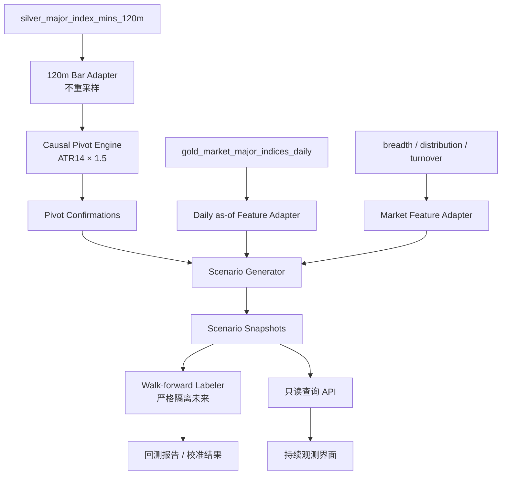
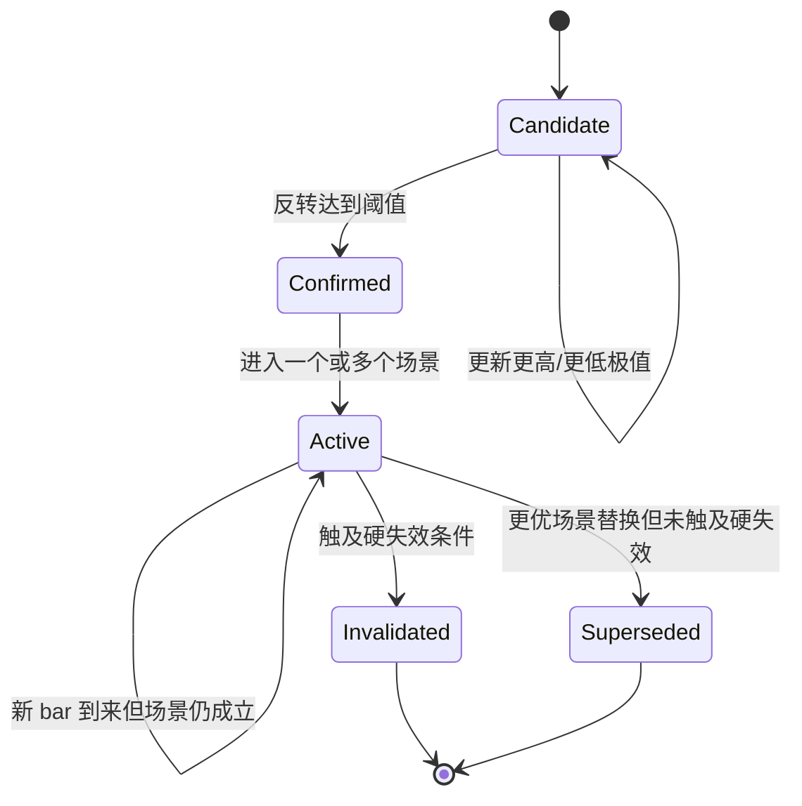

# 波浪浪型识别开源源码学习与 Goldenshare 适配审计 v1

更新时间：2026-08-08

状态：源码审计已完成；适配设计待评审；尚未开发、尚未物化新资产、尚未运行正式回测。

关联文档：

- [指数四浪反弹失效与趋势反转量化回测方案 v1](/Users/congming/github/goldenshare/docs/datasets/index-wave4-trend-reversal-backtest-plan-v1.md)
- [主要指数分钟线接入 LLD](/Users/congming/github/goldenshare/lake_console/docs/design/dagster-major-index-mins-data-onboarding-low-level-design.md)
- [90/120 分钟派生合同重建 LLD](/Users/congming/github/goldenshare/lake_console/docs/design/dagster-derived-minute-bars-90-120-contract-rebuild-low-level-design.md)
- [Dagster Asset Schema 合同](/Users/congming/github/goldenshare/lake_console/docs/design/dagster-asset-schema-contract-design.md)
- [Dagster 数据管道性能治理规范](/Users/congming/github/goldenshare/lake_console/docs/design/dagster-data-pipeline-performance-governance.md)

---

## 0. 这份文档解决什么问题

我们此前从“120 分钟 MACD(7,52,7) 上穿零轴是否容易对应四浪反弹结束”出发，已经形成一份可回放、可做历史统计的四浪专项方案。但四浪只是波浪理论中的一个局部状态。若要把它做成后续持续观察能力，前置问题应该升级为：

> 在每一个历史时点，只使用当时已经可见的 K 线，系统能否同时维护多个可能的浪型解释，并在新行情到来后确认、降级、失效或替换这些解释？

这份文档完成三件事：

1. 系统学习开源技术分析项目，重点逐类阅读 ta4j 的 Elliott Wave 源码、测试和示例。
2. 审计这些实现能解决什么、不能解决什么，尤其检查未来函数、未确认末端、置信度误读和 A 股适配问题。
3. 对照 Goldenshare 当前代码、Lake 资产和既有四浪回测协议，给出可实施但尚未获批的适配方向。

它不是一份“照抄 ta4j 的开发任务单”，也不是一份波浪理论正确性的证明。它是开发前的源码学习记录、适配差距表和决策依据。

### 0.1 给新手的阅读顺序

如果第一次接触波浪识别，建议按以下顺序阅读：

1. 第 2 节：理解为什么浪型是会变化的“假设”，不是一次性标签。
2. 第 3 节：先掌握极值、确认、摆动、场景、失效等术语。
3. 第 6 节：看 ta4j 怎样把 K 线逐步变成多个浪型场景。
4. 第 8 节：看 Goldenshare 现在已经具备什么数据，缺什么能力。
5. 第 9～12 节：看哪些代码思想可借鉴、哪些必须重写，以及如何验证。

### 0.2 与四浪回测方案的边界

两份文档不能互相替代：

| 文档 | 负责的问题 | 不负责的问题 |
| --- | --- | --- |
| 四浪回测方案 | 冻结 `P0→P1→P2→P3`、MACD 触发、四浪延续/结构反转/未决标签、统计口径 | 通用波浪引擎源码选型和完整工程架构 |
| 本文 | 开源源码学习、在线浪型识别模型、Goldenshare 适配差距、工程路线 | 修改已冻结的四浪统计结论，或宣称任何交易规则有效 |

如果后续适配设计改变了四浪方案的事件定义、确认时点或数据合同，必须同步修改原四浪方案，不能让两份文档各自形成不同事实。

---

## 1. 结论先行

### 1.1 总结论

目前最值得学习的开源实现是 [ta4j](https://github.com/ta4j/ta4j)。它已经提供了从摆动点检测、浪段压缩、多场景生成、启发式评分、失效位、目标位、多级别分析到 walk-forward 标签的较完整链路，并且测试规模明显高于其他 Elliott Wave 候选仓库。

但结论不是“直接引入 ta4j 即可”。推荐结论是：

> 以 ta4j 0.23.0 的领域模型和因果回放思路为主要参考，吸收 current master 对“已确认浪”和“形成中末端浪”的分离设计；不把 ta4j Java 运行时直接嵌入 Goldenshare V1，也不逐行移植其大型 Runner。先在现有 Lake/Dagster 体系内实现一个范围受控、可逐时点回放、明确保存 `extreme_at` 与 `confirmed_at` 的指数波浪研究内核。

### 1.2 为什么不能直接采用

存在四个采用阻断项：

1. ta4j 0.23.0 的 `SwingPivot` 只有极值位置、价格和高低类型，没有“何时被确认”；我们的回测必须同时保存极值发生时点和确认时点。
2. ta4j 0.23.0 默认把尚未确认的末端延伸加入场景生成；若直接用于回测，会把事后可见的形成中极值混进已确认结构。
3. ta4j 的 confidence 是规则加权分数，不是历史样本校准后的成功概率；源码中把复合分数映射到名为 `probability` 的字段也不能改变这一事实。
4. ta4j 的示例和参数主要围绕 BTC、ETH、S&P 500 等场景，未提供 A 股交易时段、120 分钟双 bar 合同和中国主要指数的样本外验证。

### 1.3 Goldenshare 当前是否具备启动条件

具备“指数 V1 研究内核”的数据前提，但不具备“直接上线持续观测”的软件前提：

- 已具备：修复后的主要指数 120 分钟线、指数日线、市场宽度、涨跌幅分布和市场成交额等上游事实。
- 已具备：主要指数 120 分钟线从 2009-01-05 到 2026-08-04 的历史覆盖，且固定输出 `11:30/15:00` 两根 bar。
- 尚缺：通用波浪领域模型、确认时点账本、多场景快照、逐时点回放器、版本化参数合同和专属质量检查。
- 当前旧 backend 指标研究链只支持股票分钟线 MACD `12,26,9`，路径和执行方式也不属于当前 registry-first Dagster 主线，不能直接扩展成波浪引擎。

### 1.4 推荐的第一阶段范围

第一阶段只做以下范围：

1. 研究对象固定为既有方案中的非北交所主要指数池。
2. 主周期固定为 120 分钟，日线只承担大级别确认和市场状态特征。
3. 拐点检测先只实现已冻结的 `ATR(14) × 1.5` 因果 ZigZag；其他检测器只作为对照实验。
4. 同时输出多个场景，不强迫系统给出唯一数浪答案。
5. 已确认拐点与形成中末端严格分离；正式四浪回测只允许消费 confirmed-only 输出。
6. 不做交易下单、不做自动投资建议；启发式分数保留原名，另行实现经过样本外验证的概率校准层，二者不得混用。

---

## 2. 核心理解：浪型识别是一个随行情演化的假设系统

### 2.1 为什么波浪不能一次性识别完

行情不是预先写好的完整曲线。系统在时点 `t` 只能看到 `t` 及之前的 K 线，无法知道下一根是继续上涨、快速反转还是横盘。因此，同一段已发生行情在不同时间可能有不同解释：

1. 刚出现一个低点时，它只是“当前最低点”，还不是已确认底部。
2. 价格反弹达到阈值后，这个低点才成为“已确认摆动低点”。
3. 新摆动出现后，原来像三浪的结构可能扩展为更复杂的三浪，也可能被降级为更小级别子浪。
4. 价格突破某个关键位置后，原先的四浪解释失效，新的上升趋势解释成为主场景。
5. 即使主场景改变，历史上“当时系统看到什么、为什么这么判断”也不能被重写。

所以，持续识别不是每天把整段历史重新画一遍然后覆盖昨天答案，而是保存一条可审计的演化链：

```text
候选 CANDIDATE
  -> 已确认 CONFIRMED
  -> 仍有效 ACTIVE
  -> 被价格否定 INVALIDATED
  -> 被更优解释替代 SUPERSEDED
```

### 2.2 “极值发生”与“极值确认”不是同一个时点

假设某指数的 120 分钟最高点出现在 8 月 3 日 11:30，之后价格回落。只有到 8 月 4 日 11:30，回落幅度达到 `1.5 × ATR(14)`，系统才知道 8 月 3 日的高点足够重要。

那么：

- `extreme_at = 2026-08-03 11:30`：图上高点实际发生的时间。
- `confirmed_at = 2026-08-04 11:30`：系统最早能够确认它的时间。

画图时可以把拐点标在 `extreme_at`；回测决策时只能从 `confirmed_at` 开始使用它。把二者混为一谈，是波浪和 ZigZag 回测中最常见、也最致命的未来函数来源。

### 2.3 为什么应该保留多个场景

波浪理论包含级别、延长浪、复杂调整和替代数浪。同一时点经常存在多个符合部分规则的解释。强行只输出一个结果，会隐藏模型的不确定性，并导致结果在新 K 线到来时看起来“突然重画”。

更合理的输出是：

| 排名 | 场景 | 当前阶段 | 硬规则 | 启发式分数 | 失效条件 |
| ---: | --- | --- | --- | ---: | --- |
| 1 | 下跌推动浪后的四浪反弹 | Wave 4 | 全部通过 | 0.72 | 反弹越过 `P2` 后再满足趋势反转结构 |
| 2 | 新上升推动浪的 Wave 1 | Wave 1 | 全部通过 | 0.61 | 跌破新起点 |
| 3 | 更大级别 B 浪反弹 | Corrective B | 全部通过 | 0.44 | 突破该修正结构上界 |

这里的 0.72、0.61、0.44 只是场景排序分数。只有经过独立历史样本校准，才能讨论这些分数分别对应多高的真实成功率。

---

## 3. 新手术语表

| 术语 | 白话解释 | 本文中的严格含义 |
| --- | --- | --- |
| K 线 / bar | 某一段时间内的开高低收和成交数据 | 本项目主研究周期为 120 分钟，每个正常交易日两根 |
| 极值点 | 一段走势中的最高点或最低点 | `extreme_at/extreme_price`，发生时未必已确认 |
| 拐点 / pivot | 被后续价格运动确认的重要极值 | 必须具有 `confirmed_at` |
| 摆动 / swing | 相邻两个已确认拐点之间的涨跌段 | 起点和终点都必须可追溯到 pivot |
| 形成中末端 | 最后一个已确认拐点之后，当前正在延伸的腿 | provisional/forming，不得伪装成 confirmed |
| 浪型场景 | 对一组摆动点的某种波浪解释 | 可以同时存在多个并排序 |
| 浪级 / degree | 波浪所处的相对尺度 | 是结构元数据，不是自然时间单位，也不能仅凭名字自动确定 |
| 硬规则 | 违反后场景立即不合法 | 例如方向不交替、关键起点被明确突破 |
| 软规则 | 不理想但不必立即淘汰 | 例如 Fibonacci 比例偏离典型值 |
| 失效位 | 价格到达后可否定当前场景的位置 | 必须按方向和阶段明确，不是止损建议 |
| 置信度 | 规则和特征的启发式评分 | 不是历史胜率，不得命名为 probability |
| as-of | 系统作出判断时可见数据的截止时点 | 所有输入行的时间都必须 `<= as_of` |
| walk-forward | 按历史时间逐点重放，每次只看当时数据 | 是检验无未来函数的核心方法 |
| repaint / 重画 | 新数据到来后过去的标记被改写 | 形成中端点可变化；已确认事实不可静默变化 |
| 数据快照 | 一次研究使用的数据版本和截止日 | 用 `data_snapshot_id` 保证结果可复现 |

---

## 4. 审计方法与证据边界

### 4.1 审计方法

本次不是只看 README，而是完成了以下检查：

1. 通过 GitHub 仓库元数据比较活跃度、许可证标识、更新时间、star/fork 和问题规模。
2. 把 ta4j 固定到稳定发布版和当前主分支两个不可变提交，逐类阅读源码。
3. 阅读 Elliott Wave 的领域对象、摆动检测器、场景生成器、评分器、Runner、walk-forward 和示例。
4. 本机使用项目要求的 JDK 25 编译并执行测试，避免只根据 CI 徽章判断。
5. 使用 CodeGraph 检查 Goldenshare 当前主要指数分钟资产、指标研究服务及其消费者；对动态 Dagster 定义无法形成静态调用边的部分，再回到源码和 catalog 手工核验。
6. 对照既有四浪方案的数据快照、事件口径和无未来函数要求做 fit-gap 审计。

### 4.2 ta4j 版本冻结

| 用途 | 版本 | 提交 | 说明 |
| --- | --- | --- | --- |
| 主要稳定基线 | `0.23.0` | [`896d7138a9d1818fe6725b89b433ba7860b8f654`](https://github.com/ta4j/ta4j/tree/896d7138a9d1818fe6725b89b433ba7860b8f654) | 2026-07-13 发布，适合做可复现源码审计 |
| 前瞻差异观察 | `0.23.1-SNAPSHOT` master | [`63d17a6ef98da5f320ee971672a9137dde60fd62`](https://github.com/ta4j/ta4j/tree/63d17a6ef98da5f320ee971672a9137dde60fd62) | 包含尚未进入稳定版的 provisional 分离、盘中 profile、prominence 和经验预测 |

本文提到“ta4j 0.23.0”时指稳定提交；提到“current master”时指上述快照。未来仓库继续变化时，不应把本文结论自动套到新的 master。

### 4.3 本机测试证据

运行环境：Temurin OpenJDK 25.0.4 LTS；ta4j 当前 POM 要求 Java release 25。

| 对象 | 测试结果 | 说明 |
| --- | --- | --- |
| ta4j 0.23.0 `ta4j-core` 全量 | 6,643 个测试；0 failure；0 error；13 skipped | 清理旧测试报告后本机重新执行，不是引用 README |
| current master `ta4j-core` 全量 | 7,116 个测试；0 failure；0 error；0 skipped | 用于确认前瞻差异快照可运行 |
| current master 名称匹配 `*Elliott*` 的核心测试 | 366 个测试；全部通过 | 清理旧报告后执行；另有 ZigZag/Slope/Prominence 等通用 swing 测试由全量测试覆盖 |
| current master Elliott 示例测试 | 84 个测试；全部通过 | 说明示例代码具备回归测试，但不等于经过 A 股验证 |

稳定版源码规模的明确统计口径：

- `ta4j-core` 中 `indicators/elliott/**` 与 `rules/elliott/**`：85 个 Java 源文件。
- 对应核心测试：52 个 Java 测试文件。
- 文件名明确包含 Elliott 的示例：15 个主代码文件、13 个测试文件。

这些数量说明实现并非几百行的小脚本，也提醒我们不能低估完整移植成本。

### 4.4 GitHub 候选仓库快照

以下为 2026-08-08 的 GitHub API 快照，star 和问题数会继续变化：

| 仓库 | Stars | Forks | 许可证元数据 | 最近 push | 本次定位 |
| --- | ---: | ---: | --- | --- | --- |
| [ta4j/ta4j](https://github.com/ta4j/ta4j) | 2,479 | 803 | API 为 NOASSERTION；源码头与 README 声明 MIT | 2026-08-03 | Elliott 主研究对象 |
| [jbn/ZigZag](https://github.com/jbn/ZigZag) | 476 | 196 | BSD-3-Clause | 2024-03-21 | 批量 ZigZag 对照，不是在线浪型引擎 |
| [drstevendev/ElliottWaveAnalyzer](https://github.com/drstevendev/ElliottWaveAnalyzer) | 198 | 88 | NOASSERTION | 2024-06-05 | 规则对象设计参考，工程成熟度不足 |
| [alessioricco/ElliottWaves](https://github.com/alessioricco/ElliottWaves) | 42 | 19 | MIT | 2024-01-28 | 小型教学示例 |
| [TA-Lib Python](https://github.com/TA-Lib/ta-lib-python) | 12,178 | 1,995 | BSD-2-Clause | 2026-07-29 | MACD/ATR 公式对照，不做波浪状态 |
| [vectorbt](https://github.com/polakowo/vectorbt) | 8,606 | 1,108 | API 为 NOASSERTION | 2026-08-02 | 向量化回测和参数实验工具 |
| [Stock Indicators for .NET](https://github.com/facioquo/stock-indicators-dotnet) | 1,226 | 273 | Apache-2.0 | 2026-08-08 | ZigZag 未确认末端语义参考 |
| [backtrader](https://github.com/mementum/backtrader) | 22,761 | 5,229 | GPL-3.0 | 2024-08-19 | 通用事件回测框架，不是浪型引擎 |
| [abu](https://github.com/bbfamily/abu) | 18,076 | 4,660 | GPL-3.0 | 2026-01-24 | 综合量化框架；`ABuTLWave` 不是 Elliott Wave |

注意：“热门”只能说明关注度和生态，不证明算法有效。源码质量、因果性、测试、许可证和与本项目数据合同的匹配度更重要。

---

## 5. 候选仓库横向结论

### 5.1 为什么 ta4j 是主要学习对象

ta4j 的优势不是它能给出一个“神奇正确”的数浪结果，而是它把复杂问题拆成了可以单独替换和测试的部件：

1. `SwingDetector`：怎样从 K 线确认摆动点。
2. `ElliottSwing`：怎样表达相邻拐点之间的浪段。
3. `ElliottScenarioGenerator`：怎样生成多个可能解释。
4. `ConfidenceModel`：怎样保留可解释的评分分解。
5. `ElliottScenarioSet`：怎样排序主场景和备选场景。
6. `ElliottWaveAnalysisRunner`：怎样组合多个浪级和上下文。
7. walk-forward：怎样按历史时点生成预测和未来标签。

这套分层非常适合学习，也与我们“识别—判断—修正”的目标一致。

### 5.2 其他仓库分别能学什么

#### jbn/ZigZag

优点：实现短小、使用广泛、批量找峰谷方便，可以作为离线算法输出的对照。

限制：典型实现需要看到整段数组，包含初始 pivot 推断，并强制处理首尾 pivot；最后端点天然依赖整段数据。它适合“完整曲线分析”，不适合直接充当逐时点在线真值。若用于回测，必须对每个 `as_of` 前缀重新计算，不能在全历史上算一次后切片。

结论：只作为数值对照或负面基线，不作为正式在线内核。

#### ElliottWaveAnalyzer

优点：把 monowave、规则和分析器分成对象，适合理解“波浪规则不是一个 if，而是一组可组合约束”。

限制：项目 README 明确提示部分分析器并非可用的迭代实现；测试、持续维护和许可证事实不足，不适合作为生产依赖。

结论：学习规则对象形状，不复制运行链。

#### ElliottWaves

优点：小而直观，适合初学者观察局部极值怎样形成候选浪。

限制：提交量、测试、边界条件和工程治理不足，无法承担历史回放和持续观测。

结论：教学参考，不进入选型决赛。

#### TA-Lib / vectorbt

TA-Lib 适合验证 MACD、EMA、ATR 等基础公式；vectorbt 适合批量参数实验、切分训练/验证窗口和评估收益分布。二者都不负责波浪解释状态。

结论：它们是外围验证工具，不是波浪内核的替代品。

#### Stock Indicators for .NET

该项目对 ZigZag 的最后一段会变化、末端不应视为最终结果有清晰警示。这个语义非常值得采用，但项目语言为 C#，且不提供完整 Elliott 多场景引擎。

#### backtrader / abu

两者是综合量化框架。引入它们只为波浪识别，会带来新的运行时、许可证和架构边界，却不能直接补齐 `confirmed_at` 和 A 股浪型合同。

特别说明：abu 中的 `ABuTLWave` 名称虽然包含 Wave，实际表达的是波动或技术线工具，不能因名字相似就当作 Elliott Wave 实现。

### 5.3 选型矩阵

| 能力 | ta4j | jbn/ZigZag | ElliottWaveAnalyzer | TA-Lib | vectorbt |
| --- | --- | --- | --- | --- | --- |
| 因果摆动检测 | 有，需审计配置 | 默认批量语义 | 不完整 | 无 | 由用户实现 |
| 多浪型场景 | 有 | 无 | 局部 | 无 | 无 |
| 多级别 | 有 | 无 | 有限 | 无 | 可自行组织 |
| 形成中末端语义 | master 已显式区分 | 最后 pivot 会变化 | 不充分 | 不适用 | 由用户实现 |
| walk-forward | 有框架 | 无 | 无 | 无 | 强 |
| 测试成熟度 | 高 | 中 | 低 | 高 | 高 |
| A 股 120 分钟适配 | 无 | 无 | 无 | 仅公式 | 仅框架 |
| 适合直接嵌入 Goldenshare | 否 | 否 | 否 | 可作测试依赖再评审 | 可作研究工具再评审 |

---

## 6. ta4j Elliott Wave 源码学习

### 6.1 源码模块地图

稳定版 0.23.0 的核心源码主要位于：

```text
ta4j-core/src/main/java/org/ta4j/core/indicators/elliott/
  ElliottWaveFacade.java
  ElliottWaveAnalysisRunner.java
  ElliottAnalysisResult.java
  ElliottWaveAnalysisResult.java
  ElliottSwing.java
  ElliottScenario.java
  ElliottScenarioSet.java
  ElliottScenarioGenerator.java
  ElliottConfidence.java
  ElliottDegree.java
  confidence/**
  swing/**
  walkforward/**

ta4j-core/src/main/java/org/ta4j/core/indicators/zigzag/
  ZigZagStateIndicator.java

ta4j-core/src/main/java/org/ta4j/core/rules/elliott/
  各类可用于交易策略组合的规则
```

current master 把通用摆动检测类从 `indicators/elliott/swing` 移到了 `analysis/elliott/swing`，表明维护者也在把“分析领域能力”和“指标展示”进一步分开。

### 6.2 两个主要入口

| 入口 | 适用场景 | 特点 |
| --- | --- | --- |
| `ElliottWaveFacade` | 在 ta4j 指标体系中逐 bar 获取结果 | 更接近指标调用方式 |
| `ElliottWaveAnalysisRunner` | 一次性或多级别完整分析 | 功能最全，但稳定版约 3,722 行，承担职责过多 |

对 Goldenshare 的启示：外部 API 可以简洁，但内部不应复制一个数千行的万能 Runner。摆动检测、场景生成、回放和 Dagster IO 应保持独立。

### 6.3 从 K 线到场景的处理链

```mermaid
flowchart LR
    A["OHLC K 线前缀<br/>只到 as_of"] --> B["SwingDetector<br/>确认 pivots"]
    B --> C["ElliottSwing<br/>连接相邻 pivots"]
    C --> D["可选 Filter"]
    D --> E["Swing Compressor<br/>合并细碎结构"]
    E --> F["场景输入<br/>confirmed + 可选 provisional"]
    F --> G["Scenario Generator<br/>推动浪/修正浪候选"]
    G --> H["Confidence Model<br/>多因素启发式评分"]
    H --> I["Scenario Set<br/>主场景 + 备选场景"]
    I --> J["多级别兼容评分"]
    J --> K["as_of 快照 / walk-forward"]
```



这条链的工程价值很高：拐点算法变化时，不必重写场景数据模型；评分模型变化时，也不应改变已确认 pivot 事实。

### 6.4 `SwingDetector`：可插拔摆动检测接口

稳定版接口的核心方法是：

```java
SwingDetectorResult detect(BarSeries series, int index, ElliottDegree degree);
```

其中 `index` 表示最多分析到哪根 bar。这个接口天然允许做前缀回放：在历史 `t` 时点调用时，只把 `t` 作为上界。

但接口返回的 `SwingPivot` 只有：

```text
index, price, type
```

它把 pivot 描述为 confirmed，却没有保存“在哪一个 index 被确认”。调用方只能看到极值索引，无法直接回答当时是否已经可用。这是 ta4j 与我们研究合同之间最关键的缺口。

### 6.5 四类摆动检测器

#### 6.5.1 FractalSwingDetector

原理：某根候选 bar 的高点或低点，需要同时优于前面 `lookbackLength` 根和后面 `lookforwardLength` 根，才被确认。

优点：

- 规则直观，确认延迟固定。
- 对相同输入结果稳定，适合做对照。
- plateau 可通过 `allowedEqualBars` 处理。

缺点：

- 必须等待未来若干根 bar，但只要把确认时点写成“候选点 + lookforward”，就不属于未来函数。
- 固定窗口不能适应高波动和低波动状态。

适配建议：保留为对照检测器，不作为 V1 主检测器。

#### 6.5.2 ZigZagSwingDetector

原理：上涨阶段持续记录最高点；只有收盘价从该最高点回撤达到阈值，才确认高点并切换到下跌状态。下跌阶段反之。

稳定版 `ZigZagStateIndicator` 已具备几个正确且值得吸收的细节：

1. 用 high/low 寻找极值，用 close 确认离开极值的幅度。
2. 动态阈值取极值所在 bar 的值，即 threshold anchored at extreme，而不是随确认 bar 漂移。
3. 当同一根 bar 可能同时确认两个方向且无法知道日内先后顺序时，不凭空选择方向，而是等待无歧义确认。
4. 每个状态只读取当前及历史数据；反转确认可能等待任意长时间，所以没有固定 lookahead。

缺口仍然存在：内部状态知道“当前 bar 触发了确认”，但最终 `SwingPivot` 没把该确认索引带出来。

#### 6.5.3 AdaptiveZigZagSwingDetector

原理：把 ATR 乘以倍数作为反转阈值，可选平滑，并可设置最小/最大阈值钳制。

稳定版计算可简化为：

```text
threshold(t) = clamp(SMA(ATR(period), smoothing) × atrMultiplier,
                     minThreshold,
                     maxThreshold)
```

它与我们既有 `ATR(14) × 1.5` ZigZag 方向相符，但不能因此直接宣告参数相同：必须逐项冻结 ATR 初值、平滑、阈值锚点、高低价/收盘确认、相等判断和第一 pivot 初始化。

适配建议：V1 只实现我们已经冻结的参数和语义；ta4j 的 min/max clamp 与 smoothing 作为后续敏感性实验，不混入主假设。

#### 6.5.4 SlopeChangeSwingDetector

原理：比较候选点前后两个滚动线性回归斜率，等待新方向持续若干根 bar，再在过渡区间内选真正高低极值，并用 ATR 幅度过滤小波动。

优点：对圆弧顶、圆弧底可能比 ZigZag 更敏感；源码明确保证评估到 `index` 时不读取更晚 bar。

缺点：参数更多，确认延迟更复杂；不应在 V1 与 ATR ZigZag 同时调参，否则会形成巨大的数据窥探空间。

适配建议：作为 V2 鲁棒性对照。

#### 6.5.5 CompositeSwingDetector

它支持：

- 精确 AND：所有检测器在同一索引同意。
- 精确 OR：任一检测器同意。
- 容差投票：相同高低类型的 pivot 在允许的索引距离内聚类，达到 quorum 才保留。

这是很好的“多模型共识”思路。但共识 pivot 的代表点选择和确认时点必须重新定义；不能只取参与者中价格最极端的一点，却忽略最晚确认时间。对 Goldenshare，安全定义应是：

```text
consensus_confirmed_at = max(各参与检测器的 confirmed_at)
```

否则会把尚未集齐的投票提前到历史中。

### 6.6 一个完整的因果 ZigZag 例子

假设某指数的 ATR(14) 为 5 点，阈值为 `1.5 × 5 = 7.5` 点：

| bar | high | low | close | 当时状态 |
| ---: | ---: | ---: | ---: | --- |
| 1 | 100 | 96 | 99 | 记录候选高点 100 |
| 2 | 104 | 99 | 103 | 候选高点更新为 104 |
| 3 | 108 | 102 | 107 | 候选高点更新为 108 |
| 4 | 107 | 101 | 102 | 从 108 回落 6，未达到 7.5；仍未确认 |
| 5 | 103 | 98 | 100 | 从 108 回落 8；在 bar 5 确认 bar 3 的高点 |

正确输出是：

```text
type=HIGH
extreme_index=3
extreme_price=108
confirmed_index=5
threshold_at_extreme=7.5
```

如果回测把这个高点从 bar 3 就当作已确认，就提前使用了 bar 4、bar 5 才能提供的信息。

### 6.7 `ElliottSwing`：浪段模型

稳定版字段为：

```text
fromIndex, toIndex, fromPrice, toPrice, degree
```

并提供方向、幅度和长度。它适合表达“从一个 pivot 到下一个 pivot 的移动”，但仍没有起止 pivot 的确认时点、检测器版本或 provisional 状态。

Goldenshare 适配时，swing 不应复制价格事实而丢掉 pivot 身份；至少要引用稳定的 `from_pivot_key/to_pivot_key`，并可追溯到两个确认事件。

### 6.8 `ElliottScenarioGenerator`：怎样产生多个数浪方案

稳定版默认参数：

- `minConfidence = 0.15`
- `maxScenarios = 5`
- 分解搜索最多保留 16 个 pivot，以限制组合爆炸。

生成器会从不同起点尝试推动浪和修正浪解释，并生成 impulse、zigzag、flat、triangle、complex 等类型。推动浪按当前 swing 数映射到 Wave 1～5，修正浪映射到 A～C 或更复杂结构。

一个容易误解的细节是：ta4j 并不是全链路严格的“经典三条铁律判定器”。普通推动浪候选中：

1. Wave 2 越过 Wave 1 起点。
2. Wave 4 与 Wave 1 区间重叠。
3. Wave 3 成为 1、3、5 中最短。

这些情况多数先被转换成结构分数，再对 confidence 施加惩罚；只有分数低到拒绝阈值才淘汰。分解搜索的某些分支会更早硬剪枝，但整体语义仍是“硬约束和软评分混合”。

这对探索多个解释有价值，但与我们的研究协议不完全一致。Goldenshare 必须把每条规则明确标成：

- `HARD_INVALIDATION`：违反后场景非法。
- `SOFT_PENALTY`：场景保留但扣分。
- `DESCRIPTIVE_ONLY`：只展示，不参与排序。

不能让规则性质隐藏在一个平均分公式里。

### 6.9 场景内容、目标与失效

`ElliottScenario` 包含：

```text
id
currentPhase
swings
confidence
degree
invalidationPrice
primaryTarget
fibonacciTargets
type
startIndex
bullishDirection
```

稳定版常见目标计算包括：

- Wave 3：从 Wave 2 末端投影 Wave 1 的 `1.618` 倍。
- Wave 5：从 Wave 4 末端投影 Wave 1 的 `1.0` 或 `0.618` 倍。
- Corrective C：从 B 末端投影 A 的 `1.0` 或 `1.618` 倍。

失效位的默认计算较粗：推动浪若已进入 Wave 2～5，通常仍以 Wave 1 起点作为失效参考；修正结构以 Wave A 起点为参考。它不能直接替代我们“反弹越过 P2、回踩不破、再创新高”这类阶段化趋势反转定义。

### 6.10 `ElliottConfidence`：可解释，但不是概率

稳定版默认权重：

| 因素 | 权重 | 含义 |
| --- | ---: | --- |
| Fibonacci proximity | 35% | 浪幅比例离典型 Fibonacci 水平有多近 |
| Time proportions | 20% | 各浪持续时间比例是否典型 |
| Wave 2/4 alternation | 15% | 二浪、四浪的深浅/形态是否体现交替 |
| Channel adherence | 15% | 价格是否贴合预期通道 |
| Structure completeness | 15% | 已经确认了多少预期浪段 |

默认高置信阈值为 `>= 0.7`，低置信为 `< 0.3`。

这些数字来自规则设计，不是通过中国指数历史样本拟合得到的概率。即使一个场景分数为 0.8，也不能说它有 80% 成功率。正确做法是保留原始分数和各因素明细，再通过训练区间建立校准模型，并在样本外区间验证：

```text
heuristic score + score breakdown + scenario competition
-> fixed-horizon outcome distribution
-> out-of-sample calibration + uncertainty interval
```

概率校准是正式能力，不是可选报表。第一版概率目标与既有四浪回测标签保持一致：在冻结的主要观察期（当前方案为 60 个交易日）内，输出
`wave4_continuation`、`structural_reversal` 和 `unresolved` 三类概率，三者之和为 1。这里的概率回答的是“同类历史条件下，固定期限内分别落入哪一类结果”，不回答明日涨跌，也不是买卖建议。

V1 推荐采用以下两层基线：

1. 以分箱后的历史发生率和区间作为最简单、可审计的参照基线。
2. 以带正则的多项逻辑回归把主/备场景的启发式分数、分数差和因素明细映射到三分类概率；若独立校准集样本充足，再比较时间缩放或按类单调校准，最终方法只按样本外 Brier score、log loss 和可靠性曲线选择。

禁止随机切分相邻快照。训练、校准、测试必须按时间顺序切分，并按事件去重；同一场景连续多个 as-of 不能同时散落到训练集和测试集。模型或标签合同一旦变更，旧校准器不得继续沿用。

### 6.11 `ElliottScenarioSet`：主场景和备选场景

场景集合会按 confidence 降序形成 base scenario 和 alternatives，并计算高置信场景的一致性、分数差、趋势偏向和是否失效。

值得采用的思想：

1. 输出主场景时必须同时保留替代场景。
2. 主场景与第二名的分差比单看第一名分数更有信息。
3. 多个高分场景方向一致时可以记录 consensus，但不能把 consensus 当作事实。

不应直接采用的细节：稳定版 `id` 由生成顺序构造，参数或候选遍历顺序变化后不适合作为长期稳定身份。Goldenshare 应用内容哈希生成 `scenario_key`。

### 6.12 浪级 `ElliottDegree`

ta4j 定义了从大到小的九个相对浪级，并给出推荐历史跨度。小时级输入通常建议尝试 `INTERMEDIATE` 到 `MINUETTE`。

必须注意：degree 主要是元数据和历史窗口启发式，不是模型从数据中学习出来的真实时间尺度。同一 120 分钟序列可以同时存在不同级别结构，但不能仅因枚举名叫 `MINOR` 就断言它是某种固定自然天数。

Goldenshare V1 应把浪级定义为可复现的检测尺度合同，例如由 ATR 阈值、最小 swing bars 和历史窗口共同决定，而不是只保存一个文学化名称。

### 6.13 多级别分析

Runner 可以分析基准 degree，并结合更高/更低 degree 的兼容性重新排序场景。这个思想与我们“120 分钟触发、日线确认”相似，但实现不能简单等同：

- ta4j 的 higher/lower degree 通常仍来自同一 BarSeries 的不同配置。
- 我们的日线是真实独立 K 线资产，并带有独立交易日合同。
- 120 分钟 `as_of=11:30` 时，当日日线尚未收盘，不能消费当日最终日线。

因此日线确认必须明确可见性：

```text
120m as_of = 某日 11:30 -> 日线最多使用前一交易日
120m as_of = 某日 15:00 -> 若以收盘后计算，可使用当日已闭合日线
```

### 6.14 walk-forward 实现

`ElliottWaveWalkForwardContext` 的默认 selector 会选择：

```text
series.beginIndex ... decisionIndex
```

也就是每次只把历史前缀交给 Runner。这是正确的无未来函数框架。

`ElliottWaveOutcomeLabeler` 从 `decisionIndex + 1` 开始观察未来区间，检查目标位和失效位谁先被触及；如果同一根 bar 同时触及二者，因为无法知道日内顺序，会保守地记为 invalidation first。

值得采用：

- 输入前缀隔离。
- 标签从下一根 bar 开始。
- 同 bar 触碰的保守归因。

不能直接采用：

- 它的标签是通用 `TARGET_FIRST/INVALIDATION_FIRST/NEITHER`。
- 我们已经冻结的是 `wave4_continuation/structural_reversal/unresolved`，需要检查 `P2` 突破、回踩、HH/HL 和 `P3_fail` 等结构。
- ta4j 0.23.0 的默认 Runner 仍会加入 forming terminal，因此“用了 prefix selector”不代表输出天然 confirmed-only。

### 6.15 0.23.0 的 provisional 风险与 master 的修正

在 0.23.0 中，Runner 在过滤和压缩 confirmed swings 后，无条件调用 `appendTerminalExtensionIfNeeded`，扫描最后一个已确认 pivot 到 `endIndex` 的最高/最低点，并把这段形成中腿作为普通 `ElliottSwing` 交给场景生成器。

这并非读取 `endIndex` 之后的数据，所以严格说不是跨越 as-of 的未来函数；但它把“已确认事实”和“形成中假设”放进同一个 swing 列表，容易造成语义污染：

- 场景 waveCount 可能包含一个未确认末端。
- 使用者无法从稳定版结果对象可靠区分它。
- 回测若把所有 swing 当 confirmed，会提前确认结构。

current master 已增加：

- `includeProvisionalTerminalSwing(boolean)`，默认仍为 `true`，但可设为 `false`。
- `ElliottAnalysisResult.WaveCount` 和 `provisionalTerminalSwing()`。
- `usesProvisionalTerminal(scenario)`，可检查具体场景是否使用形成中腿。

这是应该吸收的设计方向。我们的规则应更严格：forming terminal 从数据模型开始就与 confirmed pivot/swing 分开，正式回测默认不可见，只有实时观察界面可以单独展示。

### 6.16 current master 的其他新能力

以下能力截至本次审计仍属于 snapshot，不是 0.23.0 稳定合同：

1. `INTRADAY_LIVE` profile：使用波动率缩放的因果盘中检测，并减少宏观过滤。
2. `ProminenceSwingDetector`：按局部显著性检测 pivot。
3. `EmpiricalElliottWaveForecastIndicator`：在过去样本中寻找相似结构，使用因果历史做经验预测。

第三项尤其不能直接使用。源码默认和示例更贴近 1 分钟/5 分钟加密资产，尚无中国指数样本、交易时段和停牌/熔断语义验证。它可以成为远期“相似浪型检索”的学习对象，不应进入第一版。

### 6.17 示例代码能证明什么、不能证明什么

ta4j 提供 BTC、ETH、S&P 500 锚点、策略和校准示例，部分宏观校准任务可能运行数小时。示例测试能够证明：

- API 能运行。
- 特定固定样本输出没有被代码改坏。
- 常见配置和边界有一定回归保护。

它不能证明：

- 波浪理论在 A 股主要指数上有统计优势。
- 120 分钟 `7,52,7` 与 ta4j 默认场景分数存在稳定关系。
- confidence 已经是可交易概率。
- 参数离开示例资产后仍有效。

### 6.18 运行时、维护与许可证

运行时事实：

- 当前工程要求 Maven 3.9+、Java 25。
- `ta4j-core` 运行依赖包括 SLF4J、Apache Commons Math3、Gson。
- 工程配置 JaCoCo 80% line/branch 阈值；是否在某次普通命令中强制执行仍取决于 Maven profile，不能仅看到配置就宣称每次测试都通过覆盖率门禁。

许可证事实：

- Elliott 源文件带 `SPDX-License-Identifier: MIT`。
- README 明确声明 ta4j 按 MIT License 发布。
- GitHub API 返回 `NOASSERTION`，仓库快照中也未看到标准命名的完整 LICENSE 文件，只有 license header。

因此，学习思想并自行实现风险最低；若未来复制具体源码或把 ta4j 二进制纳入发行物，应由项目维护者再次核对许可证文本、NOTICE/归属和依赖许可证，不能只依赖 GitHub API。

---

## 7. ta4j 采用风险清单

这里的等级表示“阻断 Goldenshare 直接采用的严重度”，不是对 ta4j 项目的缺陷评级。

| 等级 | 风险 | 源码证据 | 对本项目的影响 | 处理决定 |
| --- | --- | --- | --- | --- |
| A0 | pivot 缺少 `confirmed_at` | `SwingPivot(index, price, type)` | 无法证明历史时点何时可见，四浪回测会失真 | 必须重新设计领域模型 |
| A0 | 0.23.0 默认混入 forming terminal | Runner 无条件追加末端延伸 | confirmed-only 场景可能被污染 | 不直接使用稳定版 Runner 输出 |
| A1 | confidence 易被误解为概率 | 固定权重；PredictionProvider 使用 `probability` 名称承载归一化复合分 | 可能把规则自评分误报成胜率 | 字段必须叫 `heuristic_score`，另做校准 |
| A1 | 经典规则有硬软混合 | Wave2/4/3 规则进入结构分和惩罚 | 与研究规则含义不透明 | 建立显式 hard/soft 规则表 |
| A1 | 场景 ID 不稳定 | 按生成顺序生成 id | 每日快照无法可靠追踪同一场景 | 用内容哈希生成稳定 key |
| A1 | 默认失效位较粗 | 多阶段仍以 Wave1/A 起点为主 | 不能覆盖四浪失败到趋势反转的结构转换 | 使用阶段化失效/升级规则 |
| A1 | 未经 A 股校准 | 示例集中在海外指数和加密资产 | 参数与排序的外部有效性未知 | 训练/验证/样本外分开报告 |
| A2 | Runner 责任集中 | 0.23.0 约 3,722 行 | 移植后难维护、难独立测试 | 不逐行移植，拆成纯内核组件 |
| A2 | Java 25 运行时 | POM release 25 | 为小范围指数研究引入新运行壳成本高 | V1 保持 Python/DuckDB，必要时再 benchmark |
| A2 | 组合搜索成本 | 多起点、多类型、多分解 | 扩展到全市场分钟线可能爆炸 | V1 限 10 指数、有限 pivots/scenarios |
| A2 | 许可证元数据不完整 | GitHub NOASSERTION、无标准 LICENSE 文件 | 复制或分发前有合规不确定性 | 学习后独立实现；复制前再法律核验 |

---

## 8. Goldenshare 当前代码与数据适配审计

### 8.1 Dagster 定义加载和事实源

当前 orchestrator 的 `definitions.py` 使用 `load_from_defs_folder` 从 `orchestrator/defs` 自动加载定义。Lake 资产事实还需要登记在 `LAKE_ASSET_CATALOG`，并配套：

- 稳定 schema：`defs/run_contracts/asset_column_schemas.py`
- 路径 helper：`defs/paths.py`
- 资产：`defs/assets/**`
- blocking checks：`defs/checks/**`
- job / sensor：`defs/jobs/**`、`defs/sensors/**`
- 历史初始化：`defs/bootstrap/**`

CodeGraph 对显式函数调用很有效，但无法完整推导 Dagster 装饰器、动态工厂生成 asset key 和 folder auto-loading。因此本次同时使用了 CodeGraph 与逐文件核验，不能因“没有 callers”就判断资产未被加载。

### 8.2 当前主要指数分钟资产

正式研究来源是 `major_index_mins` 资产族，不是旧的通用 `index_mins`：

```text
raw_major_index_mins_1m/5m/15m/30m/60m
  -> silver_major_index_mins_1m/5m/15m/30m/60m
  -> silver_major_index_mins_90m（从 30m 派生）
  -> silver_major_index_mins_120m（从 60m 派生）
```

物理路径合同：

```text
silver/quote/major_index_mins/freq=<freq>/trade_date=<YYYY-MM-DD>/data.parquet
```

Silver 字段为：

```text
ts_code, freq, trade_time,
open, close, high, low,
vol, amount, exchange, vwap
```

90/120 分钟的 `vwap` 按当前派生合同固定为 `NULL`，不属于数据缺陷。

### 8.3 修复后的 120 分钟合同

`silver_major_index_mins_120m` 只读取同指数、同交易日的 60 分钟 source：

| 输出 bar | 输入 | open | close | high/low | vol/amount |
| --- | --- | --- | --- | --- | --- |
| `11:30` | 竞价锚点 `09:30.close` + 常规 `10:30,11:30` | `09:30.close` | `11:30.close` | 锚点和常规 high/low 的 max/min | 三行合计 |
| `15:00` | 常规 `14:00,15:00` | `14:00.open` | `15:00.close` | 两行 max/min | 两行合计 |

Writer 用临时 window map 做集合聚合，并检查每个指数、每个窗口的 source 行数和去重时间数量；窗口不完整时 fail closed，不生成残缺 bar。Silver 标准化还会：

- 修复已发布范围内的已知零价/包络异常。
- 拒绝未发布的非法数据。
- 排除 `899050.BJ`，因为当前 90/120 分钟派生合同只支持上交所/深交所。
- 使用 staging + 原子替换写入目标 Parquet。

这套合同满足波浪价格结构的基础要求。后续波浪内核不得自行再次切 120 分钟自然时钟桶，否则会重新引入已经修复的错误。

### 8.4 当前历史覆盖快照

既有四浪方案在 2026-08-08 已完成正式 Lake 只读审计，截止日冻结为 2026-08-04：

| 频率 | 行数 | 交易日数 | 日期范围 | 正常日每代码 bar 数 |
| --- | ---: | ---: | --- | ---: |
| 1 分钟 | 7,331,702 | 4,271 | 2009-01-05～2026-08-04 | 241 |
| 5 分钟 | 1,490,678 | 4,271 | 同上 | 49 |
| 15 分钟 | 517,174 | 4,271 | 同上 | 17 |
| 30 分钟 | 273,798 | 4,271 | 同上 | 9 |
| 60 分钟 | 152,110 | 4,271 | 同上 | 5 |
| 90 分钟 | 91,266 | 4,271 | 同上 | 3 |
| 120 分钟 | 60,844 | 4,271 | 同上 | 2 |

120 分钟已通过覆盖、重复、锚点、OHLCV 和 60→120 聚合一致性检查。特殊事实仍需保留：

- 2016-01-07 熔断提前收市造成 7 条 15:00 记录 `vol=amount=0`，价格合法；标记 `early_close=true`，不能静默删除。
- 第一版排除北证 50。
- `000680.SH` 有分钟线但当前缺少主要指数日线，因此只能参加纯分钟探索，不能进入需要日线确认的主样本分母。

### 8.5 指数日线确认资产

`gold_market_major_indices_daily` 从 `silver_index_daily` 与版本化主要指数 seed 连接，输出：

```text
trade_date, rank, ts_code, display_name,
open, high, low, close, pre_close,
change_amount, pct_chg, vol, amount
```

其 checks 覆盖文件、schema、分区日期、seed 行数、代码覆盖、唯一性、排序和价格合法性。分钟与全部可用日线确认资产的共同窗口为 2014-01-02～2026-08-04，共 3,060 个交易日。

日线适合承担大级别趋势和收盘确认，不适合替代 120 分钟触发。特别是 11:30 运行时不能使用当日尚未闭合的日线。

### 8.6 市场状态辅助资产

现有 Lake 还可以提供以下辅助证据：

| 资产 | 字段/含义 | 在波浪研究中的用途 | 边界 |
| --- | --- | --- | --- |
| `gold_market_breadth_daily` | 上涨、下跌、平盘、总数、红盘率 | 判断反弹是少数权重股驱动还是全市场扩散 | 日频，不提供 120 分钟内扩散变化 |
| `gold_stock_return_distribution` | 11 个涨跌幅桶和总数 | 衡量上涨/下跌分布尾部是否改善 | 日频，受股票池和日线质量合同约束 |
| `gold_wealth_market_turnover` | 1/5/15/30/60 分钟全市场成交额、成交量、证券数 | 判断趋势反转是否伴随量能扩张 | 当前没有 90/120 输出；可从 60 分钟点按已审合同派生特征，但不得修改原资产语义 |

这些资产只能作为结构确认特征，不能反向决定 pivot 的历史位置。否则同一个价格结构会因未来市场宽度变化而重写已确认拐点。

### 8.7 当前 MACD 能力

当前正式 Dagster 主线已经存在股票分钟线 MACD/KDJ 指标和状态资产，覆盖 `1/5/15/30/60/90/120` 分钟，但参数合同固定为：

```text
params_key=macd_12_26_9__kdj_9_3_3
MACD fast=12, slow=26, signal=9
```

它们是股票前复权分钟指标，不是主要指数 MACD，也不支持按请求切换参数。当前 Wealth 日线和分钟图均固定显示 `MACD(12,26,9)`；周期工具栏只管理 K 线周期，指标接口只返回已经计算好的数值和 `paramsKey`，没有 MACD 参数输入，前端也没有参数编辑状态或控件。

Lake Console 旧 backend 还存在股票分钟线 MACD 研究服务：

- 计算器支持传入 `MacdParams`，EMA 采用递推公式。
- 增量状态保存 `ema_fast/ema_slow/dea/last_trade_time`。
- 研究重排服务和 CLI 对 indicator 与参数做了硬限制：只允许 `macd` 和 `12_26_9`。
- 物理路径使用旧的 `derived/**`、`research/**`、manifest 体系，不是当前 `raw/silver/gold + LAKE_ASSET_CATALOG` Dagster 主线。

全仓检索只有四浪方案文档出现 `7,52,7`，当前业务代码没有该参数的正式资产、用户参数切换能力或研究结果。因此：

1. 不能把现有 `12,26,9` 数据改名后用于本实验。
2. 股票指标资产不能直接替代指数研究输入；基础 EMA 递推思想可作为公式参考，但不应继续扩展旧 backend 研究链。
3. 四浪专项研究结果必须把 `params_key=7_52_7`、公式版本、预热规则和输入资产写入研究合同；这不改变产品 MACD 的默认参数。
4. 最好用独立公式夹具与 TA-Lib/手算序列对照，避免复用实现和 expected 同源导致“共同出错”。

### 8.8 当前是否存在波浪引擎

对业务代码、Lake orchestrator、backend 和 frontend 的 `elliott/zigzag/波浪/浪型/四浪` 检索未发现现成正式实现。当前不存在：

- pivot confirmation 事实表。
- 多场景 scenario 快照。
- stable scenario key。
- wave state API。
- 波浪持续观测 UI。

因此这是新增研究能力，不是给现有模块加一个参数。开发前必须单独评审合同、资产、性能和可见性。

### 8.9 CodeGraph 影响面结论

本次使用 CodeGraph 检查：

- `gold_market_major_indices_daily` 入口、依赖和 checks。
- `write_major_index_mins_silver_partition` 的资产、bootstrap 和测试消费者。
- `_build_silver_asset` 动态工厂。
- `calculate_macd` 与 `StkMinsIndicatorResearchService` 的 CLI、range service 和测试消费者。
- `load_from_defs_folder` 组合根。

索引在审计时为 up to date，约 2,123 files、36,276 nodes、82,221 edges。

明确限制：动态生成的 `silver_major_index_mins_120m` 不一定能以普通符号被 CodeGraph 找到；`load_from_defs_folder` 也不会表现为对每个 asset 的静态 caller。因此真正开发时必须同时审计 catalog、schema、paths、asset/check/job/sensor/bootstrap/tests，不能只依赖 impact 输出。

---

## 9. ta4j 与 Goldenshare 的 fit-gap 矩阵

| 能力 | ta4j 现状 | Goldenshare 要求 | 决策 |
| --- | --- | --- | --- |
| 输入 K 线 | 通用 BarSeries | 规范 120m，11:30/15:00；A 股交易日 | 自建 adapter，不重采样 |
| ATR ZigZag | 已有 adaptive detector | 固定 `ATR14 × 1.5` 且口径冻结 | 学习状态机，按本项目合同重写 |
| pivot 极值 | index/price/type | extreme 与 confirmed 双时点 | 必须扩展 |
| forming endpoint | 0.23.0 混入；master 可分离 | 永远不得伪装成 confirmed | 从模型层分表/分字段 |
| swing | from/to/price/degree | 还要 pivot key、确认时点、模型版本 | 扩展 |
| 场景 | impulse/corrective，多候选 | 四浪专项 + 通用浪型，保留备选 | 借鉴结构，重写规则合同 |
| 场景 ID | 生成顺序 ID | 跨快照稳定追踪 | 内容哈希 |
| 硬规则 | 部分硬剪枝、部分打分 | 每条规则性质显式 | 重写 |
| confidence | 五因素启发式分数 | 可解释分数 + 样本外校准 | 保留明细，禁止称概率 |
| 失效位 | 通用且较粗 | 阶段化失效/升级 | 重写 |
| 目标位 | Fibonacci 投影 | 可作为特征，不先验认定有效 | 可选输出，单独回测 |
| 多级别 | 同序列 degree 组合 | 120m + 独立日线 as-of 可见性 | 自建跨周期 adapter |
| walk-forward | prefix selector + outcome label | `confirmed_at`、三分类标签、去重 | 借鉴框架，重写 labeler |
| 运行时 | Java 25/Maven | Python/DuckDB/Dagster 主线 | V1 不嵌入 Java |
| 持续观测 | 结果对象 | 版本化 Parquet + Dagster checks + API | Goldenshare 原生实现 |

---

## 10. 推荐目标设计（待评审，不是开发批准）

### 10.1 三种技术路线比较

| 路线 | 优点 | 主要代价 | 结论 |
| --- | --- | --- | --- |
| A. 直接嵌入 ta4j Java | 最快获得大量现成功能 | 新运行时；0.23.0 语义不合；字段缺口；A 股校准缺失；服务/IPC 复杂 | 不推荐 V1 |
| B. 逐行翻译 ta4j Runner 到 Python | 表面上保留完整功能 | 会复制 3,000+ 行集中职责和隐含规则；难证明等价 | 不推荐 |
| C. 吸收领域模型，按冻结规则重建小内核 | 合同清晰、贴合 Lake、无未来函数可证明、范围可控 | 前期需要认真定义字段与测试 | 推荐 |

### 10.2 目标组件图



### 10.3 代码边界建议

算法内核不应塞进 Dagster asset 文件，也不应继续扩展旧 backend 指标研究服务。候选结构如下，最终目录需在开发计划评审时确认：

```text
lake_console/orchestrator/src/orchestrator/
  analysis/index_wave/                 # 候选新增纯领域包，无 Dagster import
    pivot_confirmation.py
    wave_scenario_generation.py
    wave_rule_evaluation.py
    wave_walk_forward.py
    wave_models.py

  defs/
    assets/index_wave.py               # 只编排 IO 和调用纯内核
    checks/index_wave_checks.py
    jobs/index_wave.py
    sensors/index_wave.py
    run_contracts/asset_column_schemas.py
    catalog/lake_assets.py
    paths.py
```

为什么建议新建纯领域包：

- `defs/**` 应聚焦 Dagster 定义和强相关合同。
- 算法需要能在单元测试和 walk-forward 中独立运行，不应伪造 Dagster context。
- 后续若性能要求改用 NumPy/Numba/Rust/Java，只替换内核，不改变资产合同。

新增 `analysis` 顶层包属于架构决定，必须先评审；本文没有创建该目录。

### 10.4 在线状态模型

建议把事实和解释分开：

```text
Bar（输入事实）
  -> PivotCandidate（形成中，不落入 confirmed fact）
  -> PivotConfirmation（确认事件，不可静默改写）
  -> ScenarioSnapshot（某 as_of 的解释，可变化）
  -> OutcomeLabel（使用未来生成，只允许回测侧消费）
```

状态转换建议：



历史 `ScenarioSnapshot(as_of=t)` 永不被后来的 `t+n` 覆盖。后续可以重算同一分区，但必须用新的 `model_version/data_snapshot_id/run_id` 显式区分，不能让新模型冒充旧模型当时的判断。

### 10.5 推荐资产最小集

为了避免一开始制造过多状态资产，V1 建议只保留两个正式研究资产；未来标签单独作为回测产物：

#### 资产 1：`gold_index_wave_pivot_confirmations`

含义：按确认交易日保存当日新确认的 pivot 事件。一个 pivot 只在首次确认的分区出现，不在每个后续快照重复复制。

候选路径：

```text
gold/technical/index_wave_pivot_confirmations/
  freq=120min/trade_date=<YYYY-MM-DD>/data.parquet
```

#### 资产 2：`gold_index_wave_scenario_snapshots`

含义：按 as-of 交易日保存当日 11:30 和 15:00 的主场景与备选场景。它是解释快照，不是不可变价格事实。

候选路径：

```text
gold/technical/index_wave_scenario_snapshots/
  freq=120min/trade_date=<YYYY-MM-DD>/data.parquet
```

#### 回测产物：`index_wave_outcome_labels`

未来标签必须与在线输入物理、代码和权限上分离，防止被场景生成器误读。若后续登记为正式 Gold 资产，应使用独立 dataset/asset key 和显式 `label_horizon/version`；V1 可以先作为版本化研究报告产物。

不建议 V1 立即新增 transition 资产。场景状态变化可由相邻 snapshots 计算；只有确认告警、解释审计或查询性能确实需要后，再把 transition 升级为正式事实。

### 10.6 pivot confirmation 字段合同

| 字段 | 类型建议 | 说明 |
| --- | --- | --- |
| `model_version` | VARCHAR | 算法与规则版本 |
| `data_snapshot_id` | VARCHAR | 输入数据快照 |
| `ts_code` | VARCHAR | 指数代码 |
| `freq` | VARCHAR | 首期固定 `120min` |
| `degree_key` | VARCHAR | 可复现尺度合同 key |
| `pivot_key` | VARCHAR | 内容哈希稳定身份 |
| `pivot_type` | VARCHAR | `HIGH/LOW` |
| `extreme_at` | TIMESTAMP | 极值实际发生时点 |
| `extreme_bar_index` | BIGINT | 在规范序列中的索引 |
| `extreme_price` | DOUBLE | high 或 low 极值 |
| `confirmed_at` | TIMESTAMP | 最早可确认时点 |
| `confirmed_bar_index` | BIGINT | 确认 bar 索引 |
| `confirmation_price` | DOUBLE | 用于确认的 close |
| `threshold_type` | VARCHAR | `ATR_ABSOLUTE` 等 |
| `atr_period` | INTEGER | V1 固定 14 |
| `atr_multiplier` | DOUBLE | V1 固定 1.5 |
| `threshold_at_extreme` | DOUBLE | 锚定极值 bar 的阈值 |
| `detector_key` | VARCHAR | 算法名称 |
| `detector_version` | VARCHAR | 算法语义版本 |
| `source_asset_key` | VARCHAR | `silver_major_index_mins_120m` |
| `source_partition` | DATE | 来源分区 |
| `created_at` | TIMESTAMPTZ | 生成时间，不参与交易逻辑 |

必要不变量：

```text
confirmed_at >= extreme_at
pivot_type=HIGH -> extreme_price 来自 extreme bar.high
pivot_type=LOW  -> extreme_price 来自 extreme bar.low
同 ts_code/freq/degree 的 confirmed pivots 必须 HIGH/LOW 交替
pivot_key 不得依赖 run_id 或排名
```

### 10.7 scenario snapshot 字段合同

| 字段组 | 关键字段 | 说明 |
| --- | --- | --- |
| 身份 | `model_version,data_snapshot_id,ts_code,freq,as_of,degree_key` | 可复现输入和时点 |
| 场景 | `scenario_key,scenario_type,current_phase,direction,rank` | 稳定身份和当前解释 |
| 结构 | `start_pivot_key,end_pivot_key,pivot_keys_json,wave_count` | 可还原参与结构 |
| 状态 | `scenario_status,uses_provisional,valid_from_as_of` | confirmed-only 与 forming 严格区分 |
| 评分 | `heuristic_score,score_spread,fibonacci_score,time_score,alternation_score,channel_score,completeness_score` | 不使用 probability 命名 |
| 规则 | `hard_rule_passed,hard_violations_json,soft_penalties_json` | 解释为什么保留/淘汰 |
| 失效 | `invalidation_price,invalidation_rule` | 阶段化失效语义 |
| 目标 | `primary_target,targets_json` | 仅作研究特征 |
| 跨周期 | `daily_visible_through,breadth_visible_through,market_feature_version` | 防止偷看未闭合日线 |
| 来源 | `source_asset_key,engine_key,engine_version` | 追溯算法和数据 |

`scenario_key` 推荐对以下内容做规范化哈希：

```text
ts_code + freq + degree_key + scenario_type + direction
+ ordered pivot_keys + hard-rule profile version
```

排名和启发式分数不进入 key，因为它们会随新 bar 和备选场景变化。

### 10.7.1 概率校准合同（已确认必须实现）

概率是从历史结果学习出的独立事实，不写回 `heuristic_score`，也不覆盖场景排序。建议单独形成 probability snapshot，至少保存：

| 字段组 | 关键字段 | 说明 |
| --- | --- | --- |
| 身份 | `ts_code,as_of,horizon_trading_days,label_version` | 概率对应哪个指数、时点、观察期和标签合同 |
| 上游版本 | `scenario_model_version,scenario_data_snapshot_id` | 指向产生特征的场景版本和数据快照 |
| 校准版本 | `calibration_model_version,calibration_method,calibration_data_snapshot_id` | 能完整复现训练和校准过程 |
| 三类概率 | `p_wave4_continuation,p_structural_reversal,p_unresolved` | 均在 `[0,1]`，且总和为 1 |
| 不确定性 | `probability_intervals_json,calibration_sample_count` | 按事件分组 bootstrap 或等价方法得到的区间及有效样本数 |
| 适用状态 | `calibration_status,calibration_visible_through` | `CALIBRATED/INSUFFICIENT_SAMPLE/STALE` 及训练数据可见截止点 |
| 输入解释 | `heuristic_score,score_spread,feature_values_json` | 记录本次概率使用的启发式输入，不让前端重新计算 |

必须遵守以下口径：

1. `unresolved` 是真实第三类，不得删除后在其余两类间重新归一化。
2. 概率只使用 `as_of` 当时可见的特征；结果标签从决策 bar 的下一根开始观察。
3. 校准集的标签必须已在 `calibration_visible_through` 前完整成熟，不能使用观察期尚未结束的样本。
4. 若有效样本不足、版本不匹配或校准过期，返回状态而不返回伪精确概率；不得退化为 `heuristic_score × 100%`。
5. 第一版先报告总体校准；市场状态或指数分组只有在各组样本门槛和样本外结果通过后才能单独展示。

最小验收指标包括：样本外 Brier score、multiclass log loss、ECE/可靠性分箱、各类召回与基准发生率。概率模型至少应与“永远输出训练期基准发生率”的朴素模型比较；若未改善预测质量或校准度，则保留研究结果但不得进入用户界面。

### 10.8 forming terminal 的严格合同

V1 有两种安全选择：

1. 正式资产完全不保存 forming terminal，只输出 confirmed-only 场景。
2. scenario snapshot 可额外保存 `forming_leg_from_pivot/forming_extreme_at/forming_extreme_price`，但必须 `uses_provisional=true`，且不增加 confirmed `wave_count`。

推荐第二种用于持续观察、第一种用于正式回测过滤。任何默认查询和回测必须显式写：

```text
WHERE uses_provisional = false
```

前端可以用虚线显示形成中腿，但图例必须说明它会变化。

### 10.9 硬规则和软规则建议

V1 先围绕下跌三浪后的四浪场景建立最小规则，不追求覆盖所有 Elliott 复杂形态。

| 规则 | V1 性质 | 解释 |
| --- | --- | --- |
| pivot 高低必须交替 | HARD | 否则不是有效 swing 序列 |
| `P1 < P0`、`P2 < P0`、`P3 < P1` | HARD | 既有下跌推动结构合同 |
| `P2 > P1` | HARD | 二浪必须形成反弹高点 |
| 每个 P 点在使用时已 confirmed | HARD | 无未来函数 |
| Wave 2 不越过 Wave 1 起点 | HARD | V1 经典推动浪底线 |
| Wave 3 不能是 1/3/5 中最短 | 暂缓 | 在 P3 时 Wave 5 未形成，不能提前判断 |
| Wave 4 与 Wave 1 区域重叠 | SOFT/分形态 | 斜向结构等例外需后续独立定义，不能粗暴一刀切 |
| Fibonacci 浪幅比例 | SOFT | 用于评分和分层统计，不预设有效 |
| 二四浪交替 | SOFT | 只有 Wave 4 结构逐步形成后才能评价 |
| 通道贴合 | SOFT | 作为特征，不作为价格事实 |
| 越过 `P2` 后形成 HL+HH | SCENARIO TRANSITION | 从四浪反弹升级为结构反转候选 |
| 跌破 `P3_fail` | HARD INVALIDATION | 反转场景失效或四浪延续得到支持 |

### 10.10 与既有四浪 `P0→P3` 的映射

既有方案中的下跌结构：

```text
P0 --下跌--> P1 --反弹--> P2 --下跌--> P3 --反弹--> t0
```

对应最小波浪解释：

| 结构点 | 解释 | 最早可用时间 |
| --- | --- | --- |
| P0 | 下跌推动结构起点 | P0 的 `confirmed_at` |
| P1 | Wave 1 终点 | P1 的 `confirmed_at` |
| P2 | Wave 2 终点 | P2 的 `confirmed_at` |
| P3 | Wave 3 终点 | P3 的 `confirmed_at` |
| P3 后 forming leg | Wave 4 候选反弹 | 只作为 provisional 展示 |
| t0 | `DIF_7_52` 首次上穿零轴 | t0 收盘后才可见 |

注意：P3 已确认后，系统才有资格说“Wave 4 候选反弹正在形成”。MACD 上穿零轴是该候选过程中的一个事件，不是 pivot，也不是 Wave 4 结束的自证。

如果后续价格：

1. 有效突破 P2；
2. 回踩形成 higher low；
3. 再次形成 higher high；
4. 日线和市场广度达到既有方案的确认条件；

则场景可以从 `WAVE4_REBOUND` 升级为 `STRUCTURAL_REVERSAL_CANDIDATE`。升级使用的是新证据，不得回头把历史 P3 改成“当时已经知道的牛市起点”。

### 10.11 MACD(7,52,7) 四浪专项的适配方式

必须先冻结产品使用边界：

1. 120 分钟只是 K 线周期，不等于 `MACD(7,52,7)`；切换到 120 分钟时，MACD 仍默认使用 `12,26,9`。
2. `7,52,7` 只服务于“四浪是否接近结束”的特殊研究场景。未来产品若支持，应由用户明确手动选择，不能由周期切换、浪型识别结果或右侧技术分析 Tab 自动代选。
3. 当前系统尚未支持 MACD 参数调整。研究内核可以离线计算特殊参数，但在独立完成参数输入合同、计算来源、缓存身份、界面状态和测试设计前，不得把它描述成已有交互能力。
4. 图表和分析输出必须始终显示实际参数；默认结果和四浪专项结果不能共用无参数身份的缓存、API 字段或持久化 key。

标准公式必须冻结：

```text
EMA_fast(t) = close(t) × 2/(7+1)  + EMA_fast(t-1) × (1-2/(7+1))
EMA_slow(t) = close(t) × 2/(52+1) + EMA_slow(t-1) × (1-2/(52+1))
DIF(t)      = EMA_fast(t) - EMA_slow(t)
DEA(t)      = DIF(t) × 2/(7+1) + DEA(t-1) × (1-2/(7+1))
MACD_bar(t) = 2 × (DIF(t) - DEA(t))
```

事件定义保持原方案：

```text
DIF(t-1) <= 0 < DIF(t)
```

开发前还必须冻结：

- 第一根 EMA/DEA 如何初始化。
- 至少多少根预热 bar 后事件才有效。
- 输入只用 close，且按 `ts_code,trade_time` 严格升序。
- 断档、重复、非有限 close 如何 fail closed。
- 全量计算与跨日增量状态必须逐行一致。

`7,52,7` 是实验组；`12,26,9` 是同事件池基准组。不能只报告实验组成功率而不做基准比较。

### 10.12 历史回放与日常增量

#### 历史 bootstrap

历史任务必须按每个指数的完整时间序列顺序运行，因为 pivot 和 EMA 都有状态。推荐：

1. DuckDB 批量读取所有需要的 120 分钟 Parquet，只投影必要字段并排序。
2. 每个 `ts_code` 在内存中顺序运行小型状态机。
3. 对每个历史 as-of 产生确认事件和场景快照。
4. 先写 staging，完成 schema、行数、不变量和前缀一致性验证后再原子 promote。
5. 历史事件补录和 Dagster materialization 状态与物理文件分开审批。

不能用每日 asset 从 2009 年逐日触发 4,000 多次回填来代替专门 bootstrap，也不能逐文件重复打开 DuckDB connection。

#### 日常增量

日常任务每个交易日最多处理两个新 120 分钟 bar。正确流程：

1. 等待 `silver_major_index_mins_120m` 目标分区 materialized，blocking checks 全过且 freshness 合格。
2. 读取上一个已确认状态和当天新 bar；或在数据量很小时从安全窗口重放并做前缀一致性检查。
3. 生成当天 pivot confirmation 和 scenario snapshot 分区。
4. 运行 blocking checks。
5. 只有通过后，API/前端才能消费新的 latest。

若状态文件和全量重放结果不一致，应 fail closed，并要求显式修复；不能悄悄以前者覆盖后者。

### 10.13 Dagster readiness 和自动化

波浪下游 readiness 不等于“120m Parquet 文件存在”。至少需要：

```text
upstream materialized
+ upstream blocking checks passed
+ upstream freshness acceptable
+ model_version 与预期一致
+ 当日 11:30/15:00 as-of 数量符合交易时段
```

首期建议使用 asset sensor 或 bounded polling sensor 观察上游合格事件，再请求同一交易日分区；不要先写固定时间 schedule 假定上游一定完成。

历史 bootstrap 与日常自动 sensor 必须分离。任何 materialize、backfill、runless event 或新 sensor 启用都需要独立执行审批；本文没有授权这些动作。

### 10.14 性能边界

当前 V1 只有约 60,844 条主要指数 120 分钟历史行，顺序状态机规模很小。Python 逐 bar 计算在这个受控范围内可以接受，但仍需基准测试并遵守以下边界：

- 大文件扫描、过滤、排序、join、聚合由 DuckDB 做。
- Python 只处理投影后的、按指数排序的有限序列和状态机，不逐 Parquet 文件做业务聚合。
- 场景搜索限制最大 pivot 数、起点数、浪级数和 `max_scenarios`。
- 记录读取行数、输出行数、每指数耗时、峰值内存、候选分支和剪枝数量。
- 若未来扩展到 5,000+ 股票的 1/5 分钟数据，必须重新 benchmark；不能把“指数 V1 可用”外推成“全市场可用”。

建议第一版预算：

| 项目 | 初始门禁 |
| --- | --- |
| 目标指数 | 10 个非北交所池；需日线确认的主样本当前 9 个 |
| 输入行 | 以当前快照约 60,844 条为基准 |
| confirmed pivots | 每指数设置合理上限并报告，不静默截断 |
| 单 as-of 场景 | 默认最多 5 个，另记录生成和剪枝总数 |
| 历史全量 | 单进程先建立基线；必须输出 elapsed/memory |
| 日常增量 | 目标为分钟级内完成，不以牺牲一致性换速度 |

### 10.15 API 与界面边界

持续观察界面不是第一阶段前置，但数据合同应支持未来展示：

- 指数详情页只保留一个当前周期图表工作区，通过顶部周期按钮在日 K、120 分钟等周期之间切换，不并排展示多张周期 K 线。
- 右侧“技术分析走势”Tab 展示当前周期的技术分析；紧凑的跨周期文字矩阵可以保留，但不等于增加第二张周期图。
- K 线上的 confirmed pivot 用实心标记。
- forming terminal 用虚线和不同颜色，明确“会变化”。
- 同时展示主场景和最多若干备选场景。
- 显示 `as_of`、模型版本、数据截止时点和日线可见截止日。
- 周期选择与 MACD 参数选择必须是两个独立状态。MACD 默认 `12,26,9`；仅在用户明确选择四浪专项参数时使用 `7,52,7`，且界面必须显示当前参数。当前版本没有参数调整能力。
- confidence 显示为“启发式评分”；概率区单独显示固定观察期的三类校准概率、不确定性区间、有效样本数和校准状态，二者不能混为一个百分比。
- 显示硬规则、软扣分、失效位和最近一次场景变更原因。
- 前端只消费后端事实，不自行数浪、拼装 latest 或推断 readiness。

任何“买入/卖出”按钮、自动下单或个性化投资建议不属于本项目研究范围。

---

## 11. 无未来函数和质量门禁

### 11.1 必须通过的算法不变量

1. **前缀不变性**：在 `t` 已确认的 pivot，用 `t+n` 数据重放时，其 `pivot_key/extreme_at/confirmed_at` 不变。
2. **确认时点顺序**：`confirmed_at >= extreme_at`。
3. **输入可见性**：任一快照所有分钟输入 `trade_time <= as_of`。
4. **日线可见性**：11:30 快照不读取当日最终日线；15:00 是否使用当日日线必须由固定收盘后口径决定。
5. **forming 隔离**：形成中端点不能出现在 confirmed pivot 资产，也不能增加 confirmed wave count。
6. **确定性**：同一数据快照、模型版本和参数产生相同 key、同排名和同分数。
7. **方向交替**：同一尺度 confirmed pivots 必须 HIGH/LOW 交替。
8. **同 bar 歧义保守**：目标和失效同 bar 触碰时，不假设有利的日内顺序。
9. **下一 bar 标签**：结果标签从决策 bar 的下一根开始观察。
10. **样本资格不漂移**：缺日线的 `000680.SH` 不能静默进入既有分母。

### 11.2 必须有的测试层级

#### 单元测试

- ATR、EMA、DIF、DEA、MACD 公式金标。
- ZigZag 初始化、极值更新、阈值锚定、确认、相等价格和双向歧义。
- pivot key 和 scenario key 稳定性。
- 硬规则逐条正反例。
- 软规则只扣分、不误淘汰。

#### 性质测试

- 随机序列的 confirmed pivot 前缀不变。
- 全量与增量 MACD 完全一致。
- 输入重复或乱序必须被拒绝或规范化后产生确定结果。
- 所有输出时间都不晚于 as-of，标签端未来列不进入特征端。

#### 夹具测试

- 人工构造标准推动浪、失败四浪、趋势反转、平台、尖峰、圆弧、缺口。
- 2016-01-07 提前收市样本。
- `09:30` 竞价锚点、11:30/15:00 两 bar 真实合同。
- `000680.SH` 日线缺失资格。

#### 集成测试

- 小型 Parquet 输入 -> pivot asset -> scenario asset -> checks。
- staging 校验失败时目标文件不被覆盖。
- Dagster blocking checks 失败时 downstream readiness 为 false。
- 历史 bootstrap 与日常 asset 对同一日期输出一致。

#### 研究验证

- 训练、验证、样本外按时间切分。
- 参数敏感性，而不是只报最优参数。
- `7,52,7` 与 `12,26,9` 同事件池比较。
- unresolved 单独报告，不强行判成成功或失败。
- 置信区间、事件去重和每指数贡献度。
- 概率校准使用严格的时间顺序训练/校准/样本外切分，同一事件的连续快照不得跨集合泄漏。
- 概率模型报告 Brier score、multiclass log loss、ECE/可靠性曲线，并与训练期基准发生率比较。
- 分指数、分市场状态的概率只有在各组有效样本门槛通过后才报告；否则回退到总体校准或标记样本不足。

### 11.3 建议的 asset checks

| Check | 阻断 | 核验内容 |
| --- | --- | --- |
| file/schema contract | 是 | 文件存在、列名、类型、无额外列 |
| partition/as-of match | 是 | 所有 as-of 属于目标交易日，时间只为 11:30/15:00 |
| source coverage | 是 | 与当天有效指数池一致 |
| confirmation ordering | 是 | `confirmed_at >= extreme_at` |
| pivot alternation/uniqueness | 是 | key 唯一，高低交替 |
| no provisional in pivot facts | 是 | confirmations 全部 confirmed |
| scenario rank uniqueness | 是 | 每 as-of 排名连续且唯一 |
| hard rule audit | 是 | ACTIVE 场景无硬违规 |
| source/model lineage | 是 | snapshot、model、source asset 不为空 |
| scenario count diagnostics | 否/观察 | 候选数异常、全部为空、分数分布漂移 |
| probability simplex | 是 | 三类概率均在 `[0,1]` 且总和为 1 |
| calibration lineage/status | 是 | 标签、场景、校准版本完整；样本不足或过期时不输出伪概率 |

---

## 12. 分阶段实施和验收标准

本文只完成审计。若用户批准开发，建议按以下门禁推进，每一阶段都可单独停止。

### P0：规则合同冻结

交付：

- ATR、ZigZag、pivot confirmation、forming、scenario key 的精确定义。
- 四浪最小 hard/soft 规则表。
- `as_of` 和日线可见性表。
- 字段 schema 草案和 10 组人工夹具。

验收：任何字段和规则都能回答“什么时候可见、违反后怎样处理、如何回放”。

### P1：纯内核原型

交付：

- 无 Dagster 依赖的 bar adapter、pivot engine、scenario generator、walk-forward replay。
- confirmed-only 与 provisional 两套明确输出。
- 单元、性质、金标测试。

验收：前缀不变性、全量/增量一致性和人工结构夹具全部通过。

### P2：真实数据只读对照

交付：

- 对 10 个主要指数当前 120 分钟快照只读运行。
- pivot 密度、确认延迟、场景数、空结果、性能和异常样本报告。
- 与简单 Fractal、jbn 批量 ZigZag 或 ta4j 小样本输出做解释性对照。

验收：不写正式 Lake；每个差异能解释到算法语义，不能只比较图像“看起来像”。

### P3：Dagster 资产 LLD

交付：

- asset key、path、schema、catalog、checks、job、sensor、bootstrap 的完整 LLD。
- 物理覆盖、事件语义、历史重建量级和原子发布方案。
- CodeGraph 全量消费者审计。

验收：设计评审通过后才可编码 Dagster 写链。

### P4：历史 bootstrap 与一致性验收

交付：

- staging 全历史结果。
- 行数、schema、不变量、性能和样本图审计。
- bootstrap 与日常增量同日期一致性。

验收：单独审批 promote；物理文件和 Dagster events 分阶段验收。

### P5：正式四浪回测

交付：

- 按原方案生成事件和三分类标签。
- `7,52,7` vs `12,26,9`、有/无场景评分、分阶段特征消融。
- 训练/验证/样本外结果、置信区间、失败样本和 unresolved。
- 建立启发式分数到三分类概率的版本化校准层，保存样本量、区间、训练截止点和校准指标。

验收：统计结论不能由训练区间最佳参数替代样本外结果；未通过样本外校准门禁的概率不得进入持续观测 API。

### P6：持续观测

交付：

- 每日/每 bar 场景快照。
- 只读 API 和面向研究者的解释界面。
- 至少多个实际交易日的自动化稳定性观察。

验收：形成中腿、已确认浪、三类校准概率和 heuristic score 均清晰区分；概率附带观察期、区间、样本数和版本，无交易指令。

---

## 13. 尚待评审的具体决策

| 决策 | 推荐选项 | 原因 |
| --- | --- | --- |
| V1 是否直接引入 ta4j | 否 | 字段和 provisional 语义不符合；Java 25 运行时成本高 |
| 主摆动检测器 | `ATR14 × 1.5` 因果 ZigZag | 与既有四浪方案一致，减少搜索空间 |
| 是否同时调 Fractal/Slope/Prominence | 不在主模型中 | 防止第一版参数爆炸；只做鲁棒性对照 |
| 是否保留多场景 | 是，默认最多 5 个 | 波浪存在替代解释，避免唯一答案伪确定性 |
| forming terminal 是否展示 | 可展示，但明确 provisional | 支持持续观察；正式回测必须排除 |
| confidence 字段名 | `heuristic_score` | 防止误读为概率 |
| 是否实现概率校准层 | 是，独立于 heuristic score | 用户已确认是正式能力；必须通过时间样本外校准后才可展示 |
| 第一版概率目标 | 60 个交易日内三分类分布 | 与既有回测标签一致，并保留 unresolved |
| 指数详情图表布局 | 单一图表工作区，顶部切换周期 | 与现有 Figma Index Detail 交互一致，不并排展示日 K 与 120 分钟 K 线 |
| MACD 默认参数 | 所有周期默认 `12,26,9` | 120 分钟不自动绑定特殊参数 |
| `7,52,7` 的启用方式 | 四浪专项中由用户明确手动选择 | 这是使用特例，不是周期默认；当前尚无参数调整功能 |
| 是否建立稳定 scenario key | 是 | 追踪每日场景演化所必需 |
| 第一版是否做复杂修正浪 | 否，只留扩展接口 | 四浪前置最小闭环优先 |
| 第一版是否覆盖个股 | 否 | 指数样本小、数据合同已验收；个股规模和复权另行评审 |
| 是否立即做前端 | 否 | 先证明算法因果性和数据合同 |
| 是否创建 transition 资产 | 暂不 | 相邻快照可推导；先避免状态资产膨胀 |

---

## 14. 对“学习和积累”的长期价值

这次源码学习可以沉淀为后续技术分析手册的五条通用经验：

1. **图上位置和可知时间必须分开。** 极值画在过去，不代表过去当时已经知道。
2. **指标分数不是成功概率。** 任何 0～1 分数都必须经过独立历史校准后才能讨论概率。
3. **复杂技术分析应输出假设集合。** 主场景、备选场景、失效条件和变更原因比唯一标签更诚实。
4. **硬规则和软特征必须分开。** 否则“违反经典规则却仍高分”的结果很难解释。
5. **外部项目测试通过只证明软件行为稳定。** 是否适合 A 股、特定指数和特定周期，仍需本地数据的样本外验证。

未来每次新增技术分析方法，都可以复用本次审计模板：

```text
概念定义
-> 源码与许可证
-> 因果性/未来函数
-> 数据合同
-> 可解释字段
-> 规则与参数冻结
-> 历史回放
-> 样本外验证
-> 持续观测
```

---

## 15. 最终审计意见

### 15.1 可以立即确认的结论

1. ta4j 是当前候选中最系统、最值得深入学习的 Elliott Wave 开源实现。
2. 它的核心架构——可插拔摆动检测、多场景、评分分解、失效位、多级别和 walk-forward——适合成为我们的设计参考。
3. 它的稳定版输出模型不能直接满足 Goldenshare 的无未来函数证据要求，尤其缺少 `confirmed_at`，并混入形成中末端。
4. Goldenshare 修复后的主要指数 120 分钟线已满足启动小范围研究内核的数据门槛。
5. 当前仓库没有通用波浪引擎，旧 MACD 研究链也不应成为新主实现。

### 15.2 推荐下一步

下一步不是马上写完整波浪系统，而是评审并冻结 P0：

- pivot confirmation 精确定义；
- confirmed 与 provisional 边界；
- 四浪最小 hard/soft 规则；
- scenario key 和两张资产 schema；
- as-of 日线可见性；
- K 线周期与 MACD 参数的独立状态合同，以及特殊参数的显式启用边界；
- 三分类概率目标、时间切分、校准版本和展示门禁；
- 10 组人工金标夹具。

P0 通过后，再开发一个只读纯内核原型，在真实 120 分钟数据上审计 pivot 和场景质量。只有这个原型的因果性、稳定性和性能都通过，才值得设计正式 Dagster 资产与持续观测功能。

---

## 附录 A：ta4j 关键类速查

| 类 | 职责 | 值得学习 | 不可直接照搬 |
| --- | --- | --- | --- |
| `SwingDetector` | 检测 pivots/swings | 插件接口、按 index 分析 | 返回模型缺确认时点 |
| `SwingPivot` | pivot 值对象 | 简单不可变对象 | 字段不足 |
| `ZigZagStateIndicator` | 因果 ZigZag 状态 | high/low 极值、close 确认、阈值锚定 | 需把确认事件显式输出 |
| `AdaptiveZigZagSwingDetector` | ATR 自适应阈值 | volatility scaling | clamp/smoothing 不进入 V1 主参数 |
| `FractalSwingDetector` | 固定前后窗口确认 | 确定性对照 | 固定尺度不适应波动状态 |
| `SlopeChangeSwingDetector` | 斜率持续变化确认 | 圆弧转折、因果性 | 参数多，后续再研究 |
| `CompositeSwingDetector` | 多检测器共识 | tolerance/quorum | 共识确认时间需重定义 |
| `ElliottSwing` | pivot 间浪段 | 幅度、长度、方向 | 缺 pivot key/确认状态 |
| `ElliottScenarioGenerator` | 生成推动/修正候选 | 多起点、多解释、剪枝 | 硬软规则混合 |
| `ElliottConfidence` | 五因素评分 | 可解释分解 | 不是概率 |
| `ElliottScenarioSet` | 排序和共识 | 主/备场景、分差 | ID 不适合长期追踪 |
| `ElliottWaveAnalysisRunner` | 组合完整分析 | 端到端参考 | 体量大、职责集中、稳定版 provisional 混入 |
| `ElliottWaveWalkForwardContext` | 历史前缀选择 | 防未来数据进入输入 | 不能自动修正 Runner 语义 |
| `ElliottWaveOutcomeLabeler` | 未来目标/失效标签 | 下一 bar、同 bar 保守 | 标签与四浪方案不同 |
| `EmpiricalElliottWaveForecastIndicator` | 历史相似场景预测 | 远期研究方向 | snapshot 功能，未做 A 股验证 |

## 附录 B：源码链接

稳定版 0.23.0：

- [0.23.0 Release](https://github.com/ta4j/ta4j/releases/tag/0.23.0)
- [SwingDetector](https://github.com/ta4j/ta4j/blob/896d7138a9d1818fe6725b89b433ba7860b8f654/ta4j-core/src/main/java/org/ta4j/core/indicators/elliott/swing/SwingDetector.java)
- [SwingPivot](https://github.com/ta4j/ta4j/blob/896d7138a9d1818fe6725b89b433ba7860b8f654/ta4j-core/src/main/java/org/ta4j/core/indicators/elliott/swing/SwingPivot.java)
- [ZigZagSwingDetector](https://github.com/ta4j/ta4j/blob/896d7138a9d1818fe6725b89b433ba7860b8f654/ta4j-core/src/main/java/org/ta4j/core/indicators/elliott/swing/ZigZagSwingDetector.java)
- [AdaptiveZigZagSwingDetector](https://github.com/ta4j/ta4j/blob/896d7138a9d1818fe6725b89b433ba7860b8f654/ta4j-core/src/main/java/org/ta4j/core/indicators/elliott/swing/AdaptiveZigZagSwingDetector.java)
- [SlopeChangeSwingDetector](https://github.com/ta4j/ta4j/blob/896d7138a9d1818fe6725b89b433ba7860b8f654/ta4j-core/src/main/java/org/ta4j/core/indicators/elliott/swing/SlopeChangeSwingDetector.java)
- [CompositeSwingDetector](https://github.com/ta4j/ta4j/blob/896d7138a9d1818fe6725b89b433ba7860b8f654/ta4j-core/src/main/java/org/ta4j/core/indicators/elliott/swing/CompositeSwingDetector.java)
- [ZigZagStateIndicator](https://github.com/ta4j/ta4j/blob/896d7138a9d1818fe6725b89b433ba7860b8f654/ta4j-core/src/main/java/org/ta4j/core/indicators/zigzag/ZigZagStateIndicator.java)
- [ElliottScenarioGenerator](https://github.com/ta4j/ta4j/blob/896d7138a9d1818fe6725b89b433ba7860b8f654/ta4j-core/src/main/java/org/ta4j/core/indicators/elliott/ElliottScenarioGenerator.java)
- [ElliottConfidence](https://github.com/ta4j/ta4j/blob/896d7138a9d1818fe6725b89b433ba7860b8f654/ta4j-core/src/main/java/org/ta4j/core/indicators/elliott/ElliottConfidence.java)
- [ElliottWaveAnalysisRunner](https://github.com/ta4j/ta4j/blob/896d7138a9d1818fe6725b89b433ba7860b8f654/ta4j-core/src/main/java/org/ta4j/core/indicators/elliott/ElliottWaveAnalysisRunner.java)
- [ElliottWaveWalkForwardContext](https://github.com/ta4j/ta4j/blob/896d7138a9d1818fe6725b89b433ba7860b8f654/ta4j-core/src/main/java/org/ta4j/core/indicators/elliott/walkforward/ElliottWaveWalkForwardContext.java)
- [ElliottWaveOutcomeLabeler](https://github.com/ta4j/ta4j/blob/896d7138a9d1818fe6725b89b433ba7860b8f654/ta4j-core/src/main/java/org/ta4j/core/indicators/elliott/walkforward/ElliottWaveOutcomeLabeler.java)

current master 前瞻差异：

- [ElliottWaveAnalysisRunner provisional 开关](https://github.com/ta4j/ta4j/blob/63d17a6ef98da5f320ee971672a9137dde60fd62/ta4j-core/src/main/java/org/ta4j/core/indicators/elliott/ElliottWaveAnalysisRunner.java)
- [ElliottAnalysisResult provisional 输出](https://github.com/ta4j/ta4j/blob/63d17a6ef98da5f320ee971672a9137dde60fd62/ta4j-core/src/main/java/org/ta4j/core/indicators/elliott/ElliottAnalysisResult.java)
- [ProminenceSwingDetector](https://github.com/ta4j/ta4j/blob/63d17a6ef98da5f320ee971672a9137dde60fd62/ta4j-core/src/main/java/org/ta4j/core/analysis/elliott/swing/ProminenceSwingDetector.java)
- [EmpiricalElliottWaveForecastIndicator](https://github.com/ta4j/ta4j/blob/63d17a6ef98da5f320ee971672a9137dde60fd62/ta4j-core/src/main/java/org/ta4j/core/indicators/elliott/EmpiricalElliottWaveForecastIndicator.java)

## 附录 C：本文未执行的动作

为了保持审计与实施边界，本次明确没有：

1. 修改任何业务代码、schema、asset、job、sensor、API 或前端。
2. 执行 Dagster materialize、backfill、runless event 或动态分区写入。
3. 写入 Lake、prod、远程数据库或 Tushare。
4. 运行正式四浪回测或得出交易结论。
5. 引入 ta4j、TA-Lib、vectorbt 等新依赖。
6. 创建分支、worktree、commit 或 push。
