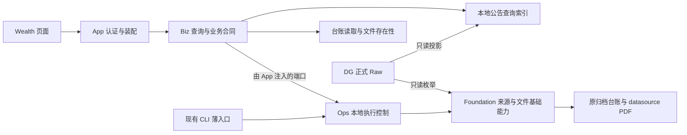

# 数据中心与上市公司公告技术方案 v1

日期：2026-10-07。状态：**DC1已提交9ad6654c；DC2已提交a1b47713；DC3已提交83ffb83f；DC4已提交b5534947；DC5本机归档验收完成，记录见§14；DG日常稳定性另行验收。** 产品规则及 Figma R1 已确认，不再重复请求产品拍板。2026-10-06用户确认按本LLD进入DC1，并授权在根现有.venv安装本地可选pypinyin。当时的DC1授权不包含正式资源操作；2026-10-07用户进入DC5后已授权并完成正式台账升级、请求范围索引和独立小范围真实下载。

## 1. 目标、依据与范围

实现本地数据中心首页，以及公告查询、日期下载、进度、停止、原任务继续、失败重试和历史详情。Prod 提供首页，不提供公告模块。实现必须覆盖[产品方案](../../../../docs/product/wealth-data-center-announcements-product-plan-v1.md) §5、§8.4，以及 [Figma R1](https://www.figma.com/design/RADlZzREU4lPVviYfkLy6x/Goldenshare-Web?node-id=1944-79) 的 24 个画板。

本方案说明架构和取舍；[LLD](data-center-announcements-low-level-design-v1.md) 是字段、存储、状态机、配置、异常、测试和分期实现的唯一详细合同。原 [PDF 技术方案](../../../../docs/datasets/anns-d-pdf-download-technical-plan-v1.md)与[PDF LLD](../../../../docs/datasets/anns-d-pdf-download-low-level-design-v1.md)继续说明当前 CLI 与历史验收；其网页扩展以本组文档为准。

不增加网页 DG 同步、自动全量下载、公司/标题/单公告创建下载、本地 PDF 服务、删除、清空、强制覆盖或独立核验/修复页面。失败行重试是原任务恢复操作，不是单公告首次下载入口。

依据还包括仓库架构边界、Wealth 工程/设计基线、模块交付清单和 DG 性能治理。此次不改变 DatasetDefinition、DG 六字段合同、Lake 路径、调度或 Prod 表。

## 2. 当前实现审计与差距

以下为DC0设计时的源码审计基线；后续DC1/DC2交付与当前状态见§10，不能用旧审计结论覆盖已落地实现。

| 当前实现 | 核验结果 | 设计处理 |
| --- | --- | --- |
| `src/scripts/download_announcements.py:execute` | 每次新建 run，逐日枚举、封存后下载；重跑依靠文件复用 | 保留 CLI 的日期重放行为；新增网页原 run 继续和关联失败批次，不能调用 CLI 冒充精确恢复 |
| `announcement_download/core.py:source_projection` | record_key 使用原六字段；artifact_key 使用 ISO 日期、原代码、trim URL，**不含标题** | 身份算法原样抽取；不同记录可关联同一文件，Raw 不因此合并 |
| `ledger.py:Ledger` | schema 2；runs、source_records、artifacts、run_artifacts、run_source_days、cooldown；严格 schema 校验 | 增量升级 schema 3，补充预览、执行控制、尝试与可见进度；所有读写消费者同轮迁移 |
| `files.py:Files` | 安全命名、size/hash、prepared、同目录原子提升；没有接收字节回调 | 保留唯一文件提交协议，增加轻量观察回调；查询只检查存在性 |
| `http.py:Downloader/Limiter` | 单请求、默认 5 秒、最多 3 次、退避、持久化冷却、403/验证码阻断 | 所有下载、重试、重定向和源站检查共用 limiter；0 秒不绕过冷却 |
| `volume.py:Volume/SourceVolume` | 输出外盘身份验证、独占锁；来源只读；台账位于本机 Application Support | 网页与 CLI 共用同归档锁，读取路径新增无写探测的检查模式 |
| `maintenance.py` 与 `announcement_ledger.py` | 台账概况/历史/文件/来源/核验/修复；查询不是完整公告目录 | 保留现有命令行为；完整公告目录另做可重建索引，不把下载过的集合当全量公告 |
| `WealthRouter.tsx` / `TopMarketBar.tsx` | 顶栏已有 data 项，但没有数据中心路由和页面 | 接入现有导航、认证、顶栏和面包屑，不复制运营 UI |
| `StockSearchQuery` | `core_serving.Security`，只取当前上市 CNY A 股；匹配代码/cnspell 前缀 | 不复用其数据范围或 API；公告候选必须覆盖公告代码、历史名称及退市对象 |
| `Settings` / 本地分钟 capability | APP_ENV、显式本地能力开关已有模式 | 公告单独能力开关；不绑定分钟开关，不用磁盘存在推断部署 |
| Web lifespan | 当前装配交易助手运行资源，没有公告后台执行器 | App 只装配，执行控制归 Ops；不在请求线程或 React 中下载 |

CodeGraph 已执行 `status`、`explore`、`node`、`impact`，覆盖下载入口、Source/Ledger/HTTP/File、认证、搜索、路由与相关测试。通用 `execute/search/resolve` 名称产生跨域噪声，补读真实源码、SQL 与消费者；不把宽匹配当完整影响面。`source_projection` 的具体影响包含 Ledger、DayReader 和 DG 消费者测试。当前网页合同尚不存在，后续迁移影响面见 LLD §2、§12。

### 2.1 正式来源最小只读证据

本次用 orchestrator 现有解释器及内存 DuckDB（256 MiB、1 线程、无 spill/扩展下载）读取正式文件，`hive_partitioning=false`，没有连接 DG instance、网站或 Prod，也未写 Lake。

| 文件 | 2026-10-06 读回事实 | 使用边界 |
| --- | --- | --- |
| `raw/tushare/anns_d/ann_date=2026-09-30/part-000.parquet` | 六列 VARCHAR，2,257 行；该日 URL/rec_time 空值均 0 | 证明这一天的物理合同，不证明全历史、每日稳定性或无空值 |
| `raw/tushare/stock_basic/full/part-000.parquet` | 5,911 行，L 5,572、D 339；含 name、cnspell | 使用全部状态，不能复用仅 L 的 Silver 主表过滤公告 |
| `raw/tushare/namechange/full/part-000.parquet` | 14,229 行；000001.SZ 含平安银行、深发展A、S深发展A | 历史别名补充，不当作生命周期或上市范围 |

样例当前简称/首字母：000001.SZ 平安银行/PAYH；600036.SH 招商银行/ZSYH；601127.SH 赛力斯/SLS；601360.SH 三六零/SLL。三份文件位于唯一正式根 `/Volumes/datasource/data_lake`；主表样本更新时间为 9 月 30 日，不能宣称已验证 10 月 6 日同步成功。

## 3. 总体架构与简洁性取舍

图中端口箭头是运行期调用；代码依赖仍由App注入，Biz不得import Ops。

1. **不新建 PG/CH 业务表，不导出 Prod。** 使用两类现有/必要本地存储：下载台账是文件与执行事实；新增 SQLite 查询索引是 DG 的可重建投影，不能反写 Raw，也不充当新数据集事实源。
2. **不增加 Redis/Celery/Dagster 下载任务。** 命令被接纳的 Web 进程启动 Ops 的一个后台执行线程，App lifespan 管理资源并注入端口。浏览器关闭不影响线程；后端退出后手动继续。多 Web 进程通过本机执行锁、归档锁和 SQLite 控制事实协调，不以 Python 内存布尔值保证单执行。
3. **下载核心只有一份。** 将工具目录中的 core/source/volume/files/http、台账与查询移至 Foundation 对应基础目录；单文件修复编排归Ops；原 CLI 保持参数、输出与退出行为，改为薄入口。执行循环移至 Ops；Biz 不 import scripts/Ops/App。端口只服务此归档域，不建设通用任务框架。
4. **页面按职责拆分。** 页面只编排；两个 controller 管理查询和下载状态；小组件消费明确 DTO。每个页面文件不超过 400 行，不建立巨大万能 service/hook，不为每个字段建立抽象层。
5. **查询索引按需要的日期构建。** 首次只构建默认 30 天；扩大查询/下载日期才补相应日期。DG 更新后增量替换发生变化的日版本；不要求先复制 800 万条全历史数据才能使用页面。

### 3.1 目标目录

| 层 | 目标落点与职责 |
| --- | --- |
| Foundation | `clients/announcement_archive/`：来源、卷、HTTP、文件协议与身份；`dao/announcement_archive/`：台账与查询索引存储；`kernel/contracts/announcement_archive.py`：端口、输入/观察事件 |
| Ops | `runtime/announcement_archive/`：后台生命周期、准备、领取、停止、继续/重试与异常收口；只依赖自身和 Foundation |
| Biz | `api/wealth/data_center/`、`queries/wealth/data_center/announcements/`、`schemas/wealth/data_center/`、`services/wealth/data_center/announcements/`：查询语义、名称、状态、预览命令与 DTO；不承载运行线程 |
| App | `runtime/announcement_archive_lifespan.py`、`api/v1/router.py`、`web/lifespan.py`：认证、依赖注入和启动装配 |
| Wealth | `pages/data-center/` + `features/data-center/{api,model,ui}/`；现有 routes、顶栏导航映射 |

这是已有独立本地 PDF 归档能力的产品化，不新增正式数据集同步类型，不改变 Prod TaskRun/节点、resolver 或 DatasetExecutionPlan。SQLite 的 run 是已存在的本地文件处理事实；网页扩展不建立第二套 Prod 任务系统。Ops 承担新后台运行控制，不能由 Biz 自行调度或在 App 写业务循环。

## 4. 公告查询与搜索

### 4.1 元数据与名称

公告从 DG 六字段 Raw 读取，所有源记录分别保留，NULL、空串不同。记录/文件身份复用原算法。索引按日校验和发布版本，缺日是来源不可用，完整零行日才是合法空日。默认范围包括当天；DG 当天尚未落盘时明确来源未就绪，不偷换为前一个完整日期。

公司显示名称优先 DG Raw stock_basic 当前 name，**不限制 list_status**；无该代码时用所查询范围公告中最近日期的非空名称作为带来源说明的回退，仍缺则显示代码。同日不同名称按固定 record_key 排序选取。别名来自同代码 namechange、所查询范围公告历史 name。候选集合包含所查询范围公告的全部代码，以及主表/更名表代码；缺名、退市、非股票代码不被主表 JOIN 排除。范围外尚未索引的公告名称不宣称已收集；扩大查询日期后补齐相应候选，不让首屏等待全历史扫描。

当前简称首字母优先源 cnspell。历史名称首字母使用确定的中文转换及多音词覆盖，集中在索引构建阶段；不在每次按键或前端自行计算。2026-10-06已获pypinyin本地依赖准入/安装授权，固定版本与验证见LLD §5；未满足前不得以仅代码/当前简称搜索宣称整项交付。

输入名称/完整代码/六位代码/数字前缀/首字母给出最多 20 个候选，选定完整代码再查询。标题按原文 contains，与日期、公司、状态取交集，SQL 参数绑定，`%/_` 作为普通文本。无公司选择查全部公司。公告六列及源站外链严格按产品呈现。

### 4.2 下载状态与分页

后端定义已下载 = 台账 succeeded 且安全路径下普通文件存在；删除或未成功为未下载。查询不计算 hash、不扫描归档全目录；同文件关联多条公告时共享一次检查。无 URL 永远未下载，仍保留公告行。文件大小不一致可用于“不可用”判定，但不把轻量检查宣传为完整内容核验。

状态筛选不能先拿 50 条再过滤。查询先对匹配范围内**有成功台账的文件集合**做存在性检查，再在索引 SQL 做状态过滤、总数和分页。大范围检查异步准备，进度可见；结果未就绪时不给伪造总数或未下载状态。默认 all 只检查实际页文件；已下载/未下载先冻结存在性快照，页读取再次核验，变化则提示刷新，不悄悄输出错误计数。

默认日期为上海当日向前 29 天、每页 50；顺序 `ann_date DESC, ts_code ASC, record_key ASC`（NULL 代码固定排最后）。应用筛选/重置回第 1 页。总数由同一版本 SQL 产生；版本变化后重新查询，不跨版本拼页。刷新只更新本地投影/查询，不访问 Tushare、DG API 或源站。

## 5. 下载范围、持久化与后台执行

### 5.1 预览与准备

下载创建只接受起止日期和间隔。日期初始空，间隔 5 秒，非负有限值；归档路径固定置灰，不接收浏览器路径。先预览，后开始。预览异步扫描/统计时显示已检查日期与记录，不发 HTTP、不取得 PDF 写入权。

预览保存日期、间隔、来源卷身份与逐日版本指纹，返回记录数、唯一 artifact 文件数、无 URL 数、预计复用/需下载。只保存摘要及小型日版本清单，不把所有候选塞进 JSON/内存。来源变化或参数修改使预览失效，要求重新预览。

开始时取得归档独占权，再检查外盘/空间/来源。准备使用固定日版本，500 行一批落台账；全日合同、行数/指纹对账后封存原 run 文件集合，所有日期完成才允许 HTTP。无可处理文件不创建空下载 run。准备中停止取消草稿，保留诊断但不可“继续下载”未封存 run。

### 5.2 运行、继续和失败重试

一个活动执行，不排队。每份文件为 unit；领取、尝试、prepared、完成都形成短事务事实，不持有跨网络/哈希/全历史事务。文件路径和 prepared 协议沿用现有实现，成功后才增加成功量；观察写入失败不能删除/回滚已经提升的 PDF。

原 run 停止/阻断/中断后，“继续”只领取其未完成文件，不重新读 Raw 扩大集合，失败不纳入继续。失败行/全部失败项创建关联 retry run，集合分别为 1 或原 run 尚未解决的失败文件；全部成功的历史 run 不提供失败重试。旧失败结果保留，关联批次展示新进度和已解决数；执行前已归档的文件复用而不请求。

开始、继续、重试均是经过幂等校验的命令。运行停止确认后持久化 stopRequested，页面立刻显示 stopping；执行器确认后 stopped。后端退出 active run 标记 interrupted；重启只恢复观察与物理诊断，绝不自动恢复 HTTP。已封存任务保存完整下载输入，继续不依赖后续 Raw 内容；来源卷不可用仍阻断，正常 DG 原子更新不阻断已封存集合。

文件后来删除，通过新建对应日期下载恢复；历史 succeeded 不能永久挡住下载。处理中的候选无字节续传承诺。

### 5.3 进度与结果

后端每不超过 5 秒持久化/返回业务进度，前端 2 秒轮询；无变化只更新 heartbeat，不更新 businessUpdatedAt。准备总量未知时 percent=NULL。运行 `processed=success+reused+failed`，`remaining=total-processed`，100% 有失败仍为 partial_failed。当前记录、尝试次数、实际 bytes、可靠 content-length、间隔/退避/冷却等待及业务更新时间均为 DTO 字段；ETA 为 NULL，显示“暂无法估算”。

断网/观察失败显示“任务状态暂不可获取”，保留最后结果，不伪装失败/停止。失败明细与全部文件结果分页；历史分页，显示原始与关联批次；下载管理默认当前活动任务，无活动时可查最近任务，查看旧详情不能覆盖活动执行控制。

## 6. 环境、权限与异常

所有 API 要求登录，不用可匿名的 quote 鉴权配置。App 在装配时加认证依赖；Biz 不反向 import App。公告能力条件为 `APP_ENV in {dev,local}` 且专用开关 true。Prod 即便有同名路径也关闭公告，首页正常返回空模块；直达地址明确不可用，公告 API 返回 404。拔盘只影响可用性，不隐藏本地卡片。

磁盘核验复用物理外卷、UUID、device、可写、空间、防链接、锁、禁止 Lake 路径规则；读取检查不调用原 Volume.open 的写探针/目录创建。任务启动才允许写探针及创建归档目录。只读历史可在拔盘时展示并注明无法核验。

URL 来自冻结源元数据，网页不接受任意 URL；源站详情外链使用新标签、安全 rel、HTTP(S)协议校验。下载器仍须防止不可信 URL/重定向落到本机、私网或云 metadata 等目的地，不能让网页后台成为任意地址请求工具；具体解析/连接约束见 LLD。不存在替代 URL 搜索、验证码绕过或登录代管。

异常集中登记于 [Wealth 异常码注册表](../../system/exception-code-registry.md)，不得直接将底层异常/路径/token 透传。来源错误与零结果区分；全局阻断停止领取，一般文件失败继续处理其他文件。源站检查使用原阻断文件的有限探测并遵守同一冷却，不能清空冷却或自动重启。

## 7. 配置、性能与事务预算

配置完整审计见 LLD §5。仅新增一个部署开关和首字母词表，GUI 公共参数只有日期/间隔；内部预算集中 Policy。既有 CLI output-root 不变，网页固定默认根。

| 操作 | 读取/写入模型与目标预算 |
| --- | --- |
| 首页/状态/历史 | 不扫 Raw、不扫 PDF；P95 ≤ 0.5 秒，历史每页 20 |
| 已索引默认公告页/公司候选 | SQL 筛选计数/分页；只检查页内 ≤50 个不同文件；候选 ≤20；P95 ≤2 秒，SQL截止4秒，单次API共享读预算5秒 |
| 索引/大范围状态准备/下载预览 | 后台分日、批 500、进度 ≤5 秒；首屏不等待全历史；一次最多一个 DuckDB（256 MiB/1线程/无 spill） |
| 状态筛选 | 只检查匹配范围内成功台账文件 K，不检查全部源记录 R；短读事务后检查文件；超同步预算转 preparing |
| 下载 | 单文件 ≤512 MiB，chunk64 KiB，保留空间1 GiB；单请求、默认间隔5秒；源/运行/文件预算沿用原 Policy |
| 常驻内存 | 日期迭代器、一批500行/日版本、一个文件chunk、分页 DTO；日版本清单落表不整段加载；不允许 O(R) fetchall、完整 DataFrame/候选 list；进程 RSS 容量验收目标 ≤512 MiB |

本地索引首次某范围成本约为 D 个日文件 ×（两次指纹流读+一次 Parquet 扫描）及 ceil(R/500) 次批写；只发布完整日版本。开始下载准备是独立再次读取/核验成本，不在每个 PDF 前重扫。查询刷新未变日只做文件版本检查；新/变化日才重建。范围大仍允许后台准备，不能悄悄缩短日期。索引空间不足或 deadline 中断保留旧版本和 checkpoint，不发布部分日。

PDF 时间不能靠增加并发缩短。示例预览 990 个需下载、5 秒间隔，仅间隔下限约 82.4 分钟，另加传输/重定向/重试；10 万份仅间隔约 5.8 天。不得把预览成功当全量执行授权，实际范围上线前记录数量、磁盘与估计耗时。性能数字为**设计验收目标**，不是本轮实测结果。

## 8. 跨模块八原则映射

| 原则 | 本方案落点 | 必须验证 |
| --- | --- | --- |
| 事实源单一 | DG Raw 元数据、台账/文件事实、后端 DTO | 同文件多记录、缺值/未知状态、无前端拼装 |
| 契约先行 | LLD 固定字段/空值/状态/样例 | 真实 API 与前端逐字段断言 |
| 配置一致 | 一个 capability、一份 Policy、词表版本 | Prod强制关闭、0秒/冷却、无页面隐式常量 |
| 默认显式 | 最近30天、50条、空下载日期、5秒 | 未传/空/反向日期、Reset/Refresh |
| 确定排序筛选 | 固定同日次序、全范围状态过滤 | 翻页/同日同标题/删除文件 |
| 性能预算 | 日分区、索引、500批、异步准备 | 默认30日与全历史容量的 SQL/文件/RSS/耗时 |
| 可观测/异常 | 进度持久化、心跳分离、异常注册 | 等待/失联/退出/观察写失败 |
| 用户可见测试 | Figma 24状态、核心API与真实浏览器 | 主流程与禁用路径都验收 |

## 9. 实施顺序与风险

| 阶段 | 唯一目标与交付门槛 |
| --- | --- |
| DC0 技术基线 | 本方案/LLD评审；来源证据、边界、配置、依赖准入清楚；不写正式资源 |
| DC1 共用核心与台账 | 已完成：核心移位、schema3、CLI全消费者迁移；完整387项、最终受影响217项通过；正式台账未迁移，见验收报告 |
| DC2 公告查询后端 | 已提交a1b47713：日期索引、名称/别名/首字母、查询状态/分页及capability；257项回归，正式来源只读和隔离800万容量验证；见§10 |
| DC3 下载管理后端 | 已提交83ffb83f：日期预览、后台执行、进度、停止/继续/精确重试/检查/历史；隔离验收见LLD §17，正式归档另验 |
| DC4 Wealth 页面 | 已提交b5534947：复用实际共享组件，真实API消费、24画板状态对照及桌面浏览器验收；交付记录见§13和LLD §19 |
| DC5 发布验收 | 本机台账/索引与独立5个真实PDF的停止—继续—重试—物理对账通过，见§14；Prod模块关闭；DG最新范围及日常稳定性仍需独立验收 |

每阶段独立验收后再推进，不从技术文档自动获得后续写入授权。最大风险是 schema 消费者遗漏、文件存在性过滤产生错误总数、多进程误恢复、预览变化扩大集合；LLD 对应负例是合入门禁。历史任务无完整冻结证据时只读展示，不能猜出可继续集合。

新中文依赖pypinyin及DC1已于2026-10-06获准；已确认产品没有新增待拍板项。该依赖的准入与正式迁移/执行是技术实施授权，不是再次讨论下载范围。若性能样本达不到预算，先优化索引/事务/存在性批处理并重测，不能降低 Raw 保留口径或增加下载并发。

## 10. 当前交付边界（2026-10-06）

DC1已提交`9ad6654c`，原[验收报告](../../../../reports/wealth_data_center_dc1_acceptance_20261006.md)记录提交前证据，历史测试数量保留。用户随后授权DC2，开发范围为本地公告索引、公司/历史名称/首字母搜索、公告列表与存在性筛选、capability及登录API。正式台账迁移、正式索引初始化、远程PDF、DG/Prod/Lake写入、前端页面未执行；DC3下载管理后端交付见下文及LLD §17。

DC2目录实现见LLD §15。索引是本机可重建缓存，每个请求范围逐日准备；500条写入、完整校验后发布，失败保留未发布版本而不用于查询。API不同步构建长范围，后台本地准备返回202；与下载队列/源同步无关。依赖仍只有已获准的pypinyin0.55.0，无额外安装。

正式来源只读核验：stock_basic 5911条、namechange 14229条；2026-09-05—10-04完整30日共29619条，最终临时索引冷构建30.624秒、复用0.290秒，首屏0.089秒、搜索0.074秒，峰值约227MiB。2026-10-05公告Raw分区缺失；查询跨该日必须明确来源未就绪，不裁剪、不填零、不自动触发DG。此证据不代表DG持续更新已经验收。

DC2[验收报告](../../../../reports/wealth_data_center_dc2_acceptance_20261006.md)及[机器证据](../../../../reports/wealth_data_center_dc2_acceptance_20261006.json)记录大日/800万容量、存在性和257项最终回归。最初全历史COUNT/OFFSET超4秒；最终按日完整准备匹配数，页面按日定位后取50条keys再补名，第159999页读取0.017秒。标题/状态全历史准备仍需约40—80秒，通过202和持久进度展示，不输出部分总数。点时样本不是P95，状态SQL容量不代表800万真实文件stat验证。正式索引未初始化，DC2不进入页面和真实下载验收。

用户随后授权DC3，具体开工约束与新增本机身份绑定审计见LLD §16；本轮不执行正式台账迁移、真实下载或前端开发。

DC3交付见[验收报告](../../../../reports/wealth_data_center_dc3_acceptance_20261006.md)、[机器证据](../../../../reports/wealth_data_center_dc3_acceptance_20261006.json)及LLD §17。App注入ArchiveExecutionPort，CLI/Web共用一个文件循环；预览统计在后台以500条批次生成，完整日版本固定后接纳。继续只处理原pending，失败重试创建关联精确批次，原错误保留。进程退出只恢复中断事实，不自动请求源站；文件已完成但结果写失败可读回补账。

本轮新增本机最近验证归档身份绑定，支持拔盘查看本机历史；Catalog schema2仅增一张可重建预览标记表，已知schema1原子升级保留数据。配置审计先行见LLD §16；未操作正式台账、索引、Lake/DG/Prod或实际服务。800万已有隔离索引预览150万/800万记录约10.5/41.4秒，127MiB；这是34188个共享合成key的点时SQL样本，真实五万唯一文件另走Parquet/实际API验证。页面和正式最小归档验收留待DC4/DC5。

## 13. DC4页面交付（2026-10-07）

用户授权提交DC3后推进DC4；DC3已提交`83ffb83f`。新增首页与公告模块，接入现有登录、顶栏、行情上下文和面包屑；六列公告列表、公司候选、查询草稿与应用条件、独立日期预览、持久任务进度、停止/续跑/失败精确重试、检查和分页历史均消费真实公告API。后端合同、CLI、DG与业务分层不变，不增加依赖或用户配置。

前端观察预算集中在`features/data-center/api/clientPolicy.ts`，与Foundation DataCenterPolicy的固定协议值由跨端测试核对；日期、间隔、轮询默认仍读取context。网络失联保留最后事实；明确404/409等拒绝等待人工重读；继续同一run后恢复轮询。分页表区上限494px，50条为后端每页数量，表区滚动不改变分页。

[DC4验收记录](../../../../reports/wealth_data_center_dc4_acceptance_20261007.md)列出硬口径落点、24画板对照、真实流程与合成罕见状态的区别、截图及未执行项。正式台账迁移、索引初始化、真实源站PDF及DG连续稳定性仍须DC5独立验收；页面开发不表示正式归档已可用。

## 14. DC5本机验收（2026-10-07）

用户授权提交DC4后进入DC5；DC4提交`b5534947`。默认归档台账schema1→3，在独占锁内保留全部旧字段摘要：2个任务、34188个文件记录（363成功、33825待处理）、34188个来源记录及原冷却。正式身份绑定与按需日期索引已建立；9/5—10/4的29619条公告及7/26的5条真实元数据可查询。正式API验证名称/代码/首字母、标题筛选、全范围已下载/未下载计数和末页；旧无执行策略任务的重新检查资格与执行器保持一致，新增schema1/2升级负例。

独立归档`/Volumes/datasource/announcements/dc5-acceptance-20261007`验证5个真实源站PDF，原run停止后精确继续，测试注入的1个文件失败经关联单项重试恢复，原失败保留、未解决数归零；重放5个复用、0请求，5个size/hash均matched，远程请求最短间隔5.153秒。实际传输与测试注入边界、103项后端/4项分层验证见[DC5记录](../../../../reports/wealth_data_center_dc5_acceptance_20261007.md)。

本机`.env.web.local`启用既有开关，启动Web后生效；未留下常驻验收服务。Prod强制关闭、DG/Raw/Prod不写、未全量下载。最新Raw仍只到10/4，10/5—07缺分区，默认查询真实返回来源未就绪；不裁短范围或造空日。DG连续更新和补齐后的默认范围另行验收，不能把DC5本机功能通过当作DG日常稳定性通过。
