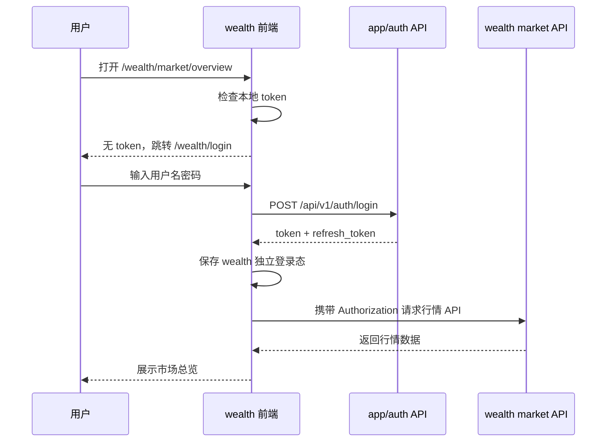
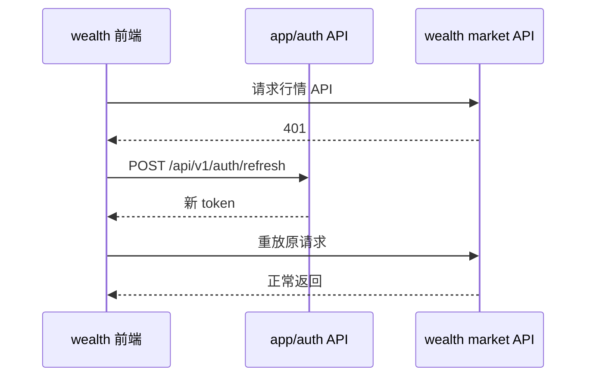

# 财势乾坤登录页与鉴权接入方案 v1

## 1. 目标

为 `wealth` 独立前端工程新增财势乾坤行情系统登录页，并让行情系统上线后必须具备登录态才能进入。

本方案只做设计，不进入编码实现。

本轮目标包括：

1. 登录页沿用 `wealth/docs/update/login-page-v4.2.html` 的背景、表单与按钮风格；顶部 Logo/`QUOTE TERMINAL`/`行情系统登录`/副标题展示已按最新产品口径移除。
2. 背景图使用 `wealth/docs/update/cover.png`。
3. 前端登录页、登录态管理、路由守卫在 `wealth` 内独立实现。
4. 后端认证 API 复用现有 `src/app/auth/**` 能力，不为 wealth 单独重建用户体系。
5. 行情 API 继续使用现有 `require_quote_access` 鉴权入口。

不在本轮范围：

1. 不开发注册流程。
2. 不开发找回密码、修改密码、会话管理页面。
3. 不改现有账号模型、角色模型、Token 模型。
4. 不把运营后台前端 `frontend/**` 的登录页或 shell 复制进 `wealth`。
5. 不新增 wealth 专属后端用户表。

## 2. 已核验依据

### 2.1 showcase

文件：`wealth/docs/update/login-page-v4.2.html`

已核验的页面事实：

1. 页面标题为 `财势乾坤｜行情系统登录`。
2. 全屏背景图铺满视口，最小视觉基线为 `1200 x 680`。
3. 登录区是一个左下偏中的 cluster，不是居中卡片；最新口径下只保留表单主体，并整体上移。
4. 登录页不再展示顶部 Logo、`QUOTE TERMINAL`、`行情系统登录` 与 `专业 · 稳定 · 高密度行情终端`。
5. 表单字段包含：
   - 用户名
   - 密码
6. 按钮包含：
   - 注册
   - 登录
7. 登录提示使用轻量 message，不是普通后台 toast。
8. 右下角有数据接入状态提示，当前实现为 `数据接入状态：登录保护已启用`。

关键布局 token 来自 showcase：

| token | showcase 值 | 实现要求 |
|---|---:|---|
| `--login-left` | `clamp(292px, 20.15vw, 394px)` | 必须保留同口径 |
| `--login-top` | `clamp(300px, 43vh, 470px)` | 顶部标题区移除后，表单整体上移 |
| `--login-width` | `clamp(360px, 23vw, 430px)` | 必须保留同口径 |

### 2.2 现有后端认证 API

文件：

1. `src/app/auth/api/auth.py`
2. `src/app/auth/schemas/auth.py`
3. `src/app/auth/dependencies.py`

可复用接口：

| 方法 | 路径 | 用途 | 本轮是否使用 |
|---|---|---|---|
| `POST` | `/api/v1/auth/login` | 用户名密码登录 | 使用 |
| `GET` | `/api/v1/auth/me` | 获取当前用户 | 使用 |
| `POST` | `/api/v1/auth/refresh` | 刷新 access token | 使用 |
| `POST` | `/api/v1/auth/logout` | 退出登录 | 使用 |
| `POST` | `/api/v1/auth/register` | 注册 | 暂不接入 |

现有行情接口鉴权入口：

1. `src/biz/api/wealth/market/**` 已使用 `require_quote_access`。
2. `require_quote_access` 在 `QUOTE_API_AUTH_REQUIRED=true` 时要求存在登录态。
3. 当前 `require_quote_access` 只校验“是否登录”，没有强制校验 `quote.read` 权限。

## 3. 登录态口径

### 3.1 用户视角

用户打开财势乾坤行情系统：

1. 没有登录态时，进入 `/wealth/login`。
2. 登录成功后，进入 `/wealth/market/overview`。
3. 刷新页面后，如果 token 有效，仍停留在行情系统。
4. token 过期时，前端先尝试 refresh。
5. refresh 失败时，清空登录态并回到 `/wealth/login`。

### 3.2 后端视角

后端不新增 wealth 专属认证系统，继续使用现有 app/auth：

1. 用户名密码由 `/api/v1/auth/login` 校验。
2. access token 通过 `Authorization: Bearer <token>` 传给后端。
3. `/api/v1/auth/me` 用来恢复当前用户。
4. wealth market API 继续依赖 `require_quote_access`。
5. 生产上线必须配置 `QUOTE_API_AUTH_REQUIRED=true`，否则后端仍允许未登录访问行情 API。

### 3.3 权限口径

本轮只落实“必须登录”。

不在本轮强制增加 `quote.read` 权限拦截。原因：

1. 现有 wealth market API 的真实代码只挂了 `require_quote_access`。
2. `require_quote_access` 当前语义是“环境要求时必须登录”，不是“必须拥有 quote.read 权限”。
3. 如果本轮强行加入权限校验，会扩大后端权限模型改动范围。

后续如果要做到“登录且必须有行情查看权限”，应单独评审是否把 `require_quote_access` 改为校验 `quote.read`，或新增 `require_quote_permission`。

## 4. API 契约

### 4.1 登录请求

接口：`POST /api/v1/auth/login`

请求字段：

| 字段 | 类型 | 约束 | 来源 |
|---|---|---|---|
| `username` | string | `1 <= length <= 64` | `LoginRequest.username` |
| `password` | string | `1 <= length <= 256` | `LoginRequest.password` |

示例：

```json
{
  "username": "demo",
  "password": "******"
}
```

### 4.2 登录响应

响应字段：

| 字段 | 类型 | 可空 | 含义 |
|---|---|---|---|
| `token` | string | 否 | access token |
| `refresh_token` | string | 是 | refresh token |
| `access_token_expires_at` | string(datetime) | 是 | access token 到期时间 |
| `username` | string | 否 | 用户名 |
| `is_admin` | boolean | 否 | 是否管理员 |
| `display_name` | string | 是 | 展示名 |

示例：

```json
{
  "token": "eyJ...",
  "refresh_token": "eyJ...",
  "access_token_expires_at": "2026-05-14T16:00:00+08:00",
  "username": "demo",
  "is_admin": false,
  "display_name": "Demo"
}
```

### 4.3 当前用户

接口：`GET /api/v1/auth/me`

请求头：

```text
Authorization: Bearer <token>
```

响应字段：

| 字段 | 类型 | 可空 | 含义 |
|---|---|---|---|
| `id` | number | 否 | 用户 ID |
| `username` | string | 否 | 用户名 |
| `display_name` | string | 是 | 展示名 |
| `email` | string | 是 | 邮箱 |
| `account_state` | string | 否 | 账号状态 |
| `is_admin` | boolean | 否 | 是否管理员 |
| `is_active` | boolean | 否 | 是否启用 |
| `roles` | string[] | 否 | 角色列表 |
| `permissions` | string[] | 否 | 权限列表 |

### 4.4 刷新 Token

接口：`POST /api/v1/auth/refresh`

请求字段：

| 字段 | 类型 | 约束 | 含义 |
|---|---|---|---|
| `refresh_token` | string | `8 <= length <= 512` | refresh token |

响应与登录响应一致。

### 4.5 退出登录

接口：`POST /api/v1/auth/logout`

请求字段：

| 字段 | 类型 | 可空 | 含义 |
|---|---|---|---|
| `refresh_token` | string | 是 | 需要注销的 refresh token |

前端行为：

1. 尽力调用后端 logout。
2. 无论后端 logout 是否成功，都清理本地登录态。
3. 回到 `/wealth/login`。

## 5. 前端工程设计

### 5.1 目录规划

```text
wealth/src/
  app/
    App.tsx
    routes/
      WealthRouter.tsx
      ProtectedRoute.tsx

  features/
    auth/
      api/
        authApi.ts
        authTypes.ts
      model/
        authSession.ts
        authStorage.ts
      ui/
        LoginPage.tsx
        LoginForm.tsx
        LoginMessage.tsx
        LoginPage.css

  assets/
    auth/
      cover.png
      icon22.png
```

说明：

1. `features/auth/**` 是 wealth 前端自己的登录功能，不复用 `frontend/**`。
2. `assets/auth/**` 存放从 `wealth/docs/update/**` 落地的登录页素材。
3. `app/routes/**` 只负责路由和守卫，不写业务接口逻辑。
4. 现有 `MarketOverviewPage` 保留在 `wealth/src/pages/market-overview/**`。

### 5.2 路由设计

首期路由：

| 路径 | 页面 | 是否需要登录 |
|---|---|---|
| `/wealth/login` | 登录页 | 否 |
| `/wealth/market/overview` | 市场总览页 | 是 |
| `/market/overview` | 本地开发兼容入口 | 是 |
| `/` | 重定向到市场总览或登录 | 按登录态判断 |

路由守卫规则：

1. 无 token：跳转 `/wealth/login?redirect=<currentPath>`。
2. 有 token：调用 `/api/v1/auth/me` 恢复用户。
3. `/me` 返回 401：尝试 refresh。
4. refresh 成功：继续进入目标页面。
5. refresh 失败：清理 token 并回到登录页。

### 5.3 登录态存储

wealth 使用独立 localStorage key，不复用运营后台前端 key。

建议 key：

| key | 内容 |
|---|---|
| `wealth.auth.access-token` | access token |
| `wealth.auth.refresh-token` | refresh token |
| `wealth.auth.expires-at` | access token 到期时间 |

原因：

1. `wealth` 是独立前端工程。
2. 不应与运营后台 `frontend/**` 的登录状态互相污染。
3. 后续如果要做跨系统单点登录，应单独设计 cookie/session 方案，而不是共享 localStorage key。

### 5.4 API Client 设计

新增 wealth 专用 API client 能力：

1. 所有 wealth API 请求自动带 `Accept: application/json`。
2. 有 access token 时自动带 `Authorization: Bearer <token>`。
3. 401 且有 refresh token 时自动刷新一次。
4. refresh 后重放原请求一次。
5. refresh 失败时抛出 `AUTH_REQUIRED`，由路由层处理跳转。
6. 非 auth 错误保持模块现有四态处理，不把业务接口错误统一吞掉。

注意：

1. 不把 token 拼到 URL query 中。
2. 不在各模块 API 文件中重复写 token 逻辑。
3. 不让页面组件自己拼装 auth header。

## 6. 登录页视觉实现要求

登录页以 showcase 为视觉基础，但当前最新产品口径已移除顶部 Logo 与标题区，只保留表单主体并上移。除该处明确变更外，不做重新设计。

### 6.1 素材

| 素材 | 来源 | 落地位置 |
|---|---|---|
| 背景图 | `wealth/docs/update/cover.png` | `wealth/src/assets/auth/cover.png` |

### 6.2 结构

```text
LoginPage
  full-screen background
  login-cluster
    login-form
      username field
      password field
      register button
      login button
      login message
  corner-status
```

### 6.3 按钮行为

登录按钮：

1. 用户名或密码为空：显示 `请输入用户名和密码`。
2. 登录中：按钮进入 loading/disabled。
3. 登录成功：进入 redirect 或 `/wealth/market/overview`。
4. 登录失败：显示后端错误信息或统一文案 `登录失败，请检查用户名或密码`。

注册按钮：

1. 视觉必须保留，因为 showcase 有该按钮。
2. 本轮不接注册 API。
3. 点击时显示 `注册入口暂未开放`。
4. 不跳转、不打开新页面。

### 6.4 corner-status

showcase 文案为 `数据接入状态：模拟环境`。

真实实现建议：

1. 本地开发环境显示 `数据接入状态：本地开发`。
2. 生产环境显示 `数据接入状态：登录保护已启用`。
3. 该文案只属于登录页辅助状态，不代表行情数据新旧。

如果要做到完全静态复刻，也可以先固定为 showcase 文案；但上线前建议改为真实环境语义，避免误导用户。

## 7. 后端接入方案

### 7.1 复用现有 auth

不新增 wealth 后端认证 API。

原因：

1. 用户体系已经在 `src/app/auth/**`。
2. 登录、刷新、退出、当前用户接口已经完整。
3. 重新做 wealth 专属 auth 会导致用户体系分裂。

### 7.2 wealth API 登录保护

现有 `src/biz/api/wealth/market/**` 已依赖 `require_quote_access`。

上线要求：

```text
QUOTE_API_AUTH_REQUIRED=true
```

该配置生效后：

1. 未登录访问 wealth market API 返回 401。
2. 已登录访问 wealth market API 正常返回。
3. 前端路由守卫负责让用户先登录。

### 7.3 是否需要新增后端代码

首期可不新增后端 API。

可能需要的后端最小补充：

1. 增加或补齐 auth/wealth API 的测试用例。
2. 如果决定强制 `quote.read` 权限，则需要修改 `require_quote_access` 或新增依赖函数。

本方案默认不做第 2 点。

## 8. 交互流程

### 8.1 首次访问



### 8.2 Token 过期



## 9. 测试与验收

### 9.1 前端测试

需要覆盖：

1. 未登录访问市场总览会显示登录页或触发登录跳转。
2. 用户名为空时不调用 `/api/v1/auth/login`。
3. 密码为空时不调用 `/api/v1/auth/login`。
4. 登录成功后保存 token 并进入市场总览。
5. 登录失败时显示错误信息。
6. refresh 成功时重放原请求。
7. refresh 失败时清理登录态并回登录页。
8. 注册按钮点击只显示“暂未开放”，不请求后端。

建议命令：

```bash
cd wealth && npm run test -- auth
cd wealth && npm run build
```

### 9.2 后端测试

需要覆盖：

1. `QUOTE_API_AUTH_REQUIRED=true` 时，未登录访问 `/api/v1/wealth/market/summary` 返回 401。
2. 登录后携带 token 访问 `/api/v1/wealth/market/summary` 成功。
3. `/api/v1/auth/login` 的字段契约保持不变。
4. `/api/v1/auth/me` 可用来恢复当前用户。

后端真实账号冒烟不得把账号密码写入仓库，应使用本地或部署环境变量提供。

### 9.3 视觉验收

验收标准：

1. 登录页背景与 `cover.png` 一致。
2. 登录页不展示顶部 Logo、`QUOTE TERMINAL`、`行情系统登录` 与副标题。
3. 登录表单整体位于原标题区下方更靠上的位置，不再因移除标题区留下大块空白。
4. 字体、按钮、输入框、message 样式与 showcase 表单风格高保真一致。
5. 不出现运营后台风格组件。
6. 不出现浅色后台登录页。

## 10. 实施里程碑

### M0：方案评审

目标：

1. 确认是否复用现有 auth API。
2. 确认是否只要求登录态，不额外强制 `quote.read`。
3. 确认注册按钮只保留视觉，不接注册流程。

### M1：素材与页面骨架

目标：

1. 拷贝 `cover.png`、`icon22.png` 到 `wealth/src/assets/auth/`。
2. 新增登录页组件与 CSS。
3. 复刻 showcase 视觉。

### M2：auth client 与 session model

目标：

1. 新增 wealth 专用 auth API client。
2. 新增 token storage。
3. 新增 session 恢复与 refresh 能力。

### M3：路由守卫

目标：

1. 新增 `/wealth/login`。
2. 保护 `/wealth/market/overview`。
3. 未登录自动跳转登录页。
4. 登录后按 redirect 回跳。

### M4：wealth market API 接入 token

目标：

1. 市场总览各模块 API 统一通过 wealth API client。
2. 所有请求带 `Authorization`。
3. 401/refresh 行为统一。

### M5：测试与上线配置

目标：

1. 前端 auth 测试通过。
2. market overview 原有测试通过。
3. 后端 auth-required 测试通过。
4. 部署配置确认 `QUOTE_API_AUTH_REQUIRED=true`。

## 11. 需要拍板的点

### 11.1 是否只做“登录态必需”

推荐：是。

说明：

1. 当前代码事实已经支持登录态保护。
2. 权限粒度可以后续单独升级。

### 11.2 注册按钮如何处理

推荐：保留视觉，不接注册流程，点击显示 `注册入口暂未开放`。

原因：

1. showcase 有注册按钮，视觉上应保留。
2. 用户自助注册属于产品能力，不应在登录页复刻时顺手开放。

### 11.3 登录态是否与运营后台共享 localStorage key

推荐：不共享。

原因：

1. wealth 是独立前端工程。
2. 避免运营后台与行情系统互相污染登录状态。
3. 后续如果需要单点登录，应单独设计 cookie/session。

### 11.4 是否在生产配置中强制 `QUOTE_API_AUTH_REQUIRED=true`

推荐：是。

原因：

1. 这是“上线即要求登录”的后端保障。
2. 只有前端路由守卫不够，用户仍可直接请求 API。

## 12. 风险与约束

1. 如果只做前端登录页、不设置 `QUOTE_API_AUTH_REQUIRED=true`，后端 API 仍可能被匿名访问。
2. 如果复用运营后台 localStorage key，会造成两个独立前端项目登录态互相污染。
3. 如果本轮顺手接注册，会扩大用户体系开放风险。
4. 如果不统一 API client，各市场模块会重复处理 token 和 401，后续维护会发散。
5. 如果强行加 `quote.read` 权限，需要同步审计用户角色与现有账号权限，否则可能导致已登录用户无法访问行情。
