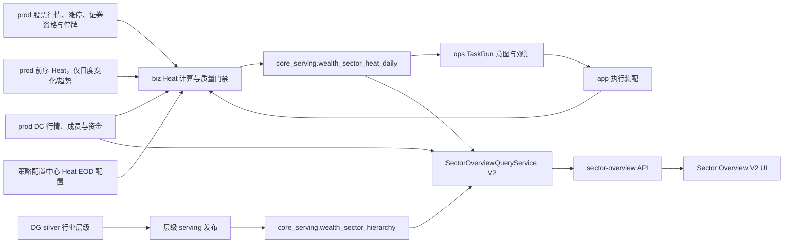

# 市场总览｜板块速览技术实施方案 v2（implementation-design）

> 状态：按批准顺序实施中；Slice 1-4 已完成生产验收，Slice 5 的 prod-native Heat 本地实现与测试已完成，待部署后提交正式 PLAN/APPLY；前后端 V2 尚未开始。
> 对应需求：[sector-overview-benchmark-requirement-v2.md](./sector-overview-benchmark-requirement-v2.md)
> 对应门禁：[sector-overview-m2-coding-gate-v2.md](./sector-overview-m2-coding-gate-v2.md)
> 对应低层设计：[sector-overview-low-level-design-v2.md](./sector-overview-low-level-design-v2.md)

---

## 1. 开发目标、依据与范围

### 1.1 开发目标

1. 用行业三级联动、概念热度和地域独立排行三个工作台替换现有板块速览 `4 × 2 + 5 × 4` 布局。
2. 将 DG 行业三级层级发布为 Web 可读的正式 serving 事实。
3. 建立只读取 prod 正式表、使用目标交易日有效 A 股成分池、可重跑、可回放、可解释的盘后概念热度物化链路。
4. 将现有模块 API 原子升级到 V2，前端不保留旧 DTO 兼容层。
5. 完成真实数据、性能、状态、像素和生产发布门禁。

### 1.2 依据

1. Figma 正式节点 `538:517/538:520/538:521/571:516/538:522/554:516`。
2. 板块速览标杆需求 v2。
3. 当前实现：
   - `src/biz/api/wealth/market/sector_overview.py`
   - `src/biz/queries/wealth/market/sector_overview/**`
   - `src/biz/schemas/wealth/market/sector_overview.py`
   - `wealth/src/features/market-overview/sectors/**`
4. DG 层级事实：`silver_dc_industry_hierarchy`。
5. 当前正式模型：`DcDaily/DcIndex/DcMember/BoardMoneyflowDc/EquityDailyBar/EquityLimitList/Security/EquitySuspendD`。

### 1.3 改动范围

| 子系统 | 计划范围 |
|---|---|
| `lake_console/orchestrator` | 仅保留行业层级快照校验与 hierarchy serving 发布；不承载 Heat 计算、分区、checks、sensor 或回放 |
| `src/foundation` | 两张 serving 表 ORM/DAO 契约与 Alembic 迁移 |
| `src/biz` | prod-only Heat 来源查询、有效池、计算/质量 contract、事务发布，以及 V2 查询、状态、选择路径、DTO 和 API 参数 |
| `src/ops` | Heat 单日/历史任务意图、TaskRun/节点/问题/进度、调度与失败观测；不实现 Heat 公式 |
| `src/app` | 装配 ops 执行端口与 biz Heat 服务；不承载 Heat 业务规则 |
| `wealth` | V2 组件树、API 类型、交互状态、样式和测试 |
| 文档 | API 基线、异常码、模块三件套、首页结构基线 |

本期不改 Tushare `DatasetDefinition`、request builder、现有来源表，也不建设实时链路。DG/Lake 不能作为 Heat 计算、回放或 Web API 的事实来源。

---

## 2. 当前代码与影响面审计

### 2.1 当前行为

1. API 已存在，路径为 `GET /api/v1/wealth/market/sector-overview`。
2. 后端当前查询 `dc_daily + dc_index + board_moneyflow_dc`，构建 8 个固定 Top5 列和 20 个涨跌热力格。
3. 当前服务已从 `dc_index` 组装领涨股字段，但前端排名行没有把领涨股作为主要信息展示。
4. 当前前端消费 `columns[] + heatMapItems[]`，没有行业层级、成员列表或概念热度契约。
5. 当前 API 测试和前端真实 API 测试均冻结在旧 DTO 上。
6. 当前 `ops-worker-run/serve` 由 `src/cli.py` 直接把 `OperationsWorker` 交给 CLI handler 构造；`OperationsWorker`/`TaskRunDispatcher` 尚无 app 注入的 Heat executor registry。

### 2.2 CodeGraph 影响面结论

已审计入口、调用链、调用方、被调用方、测试和前端消费者，V2 直接影响：

```text
wealth MarketOverviewPage
  -> SectorOverviewPanel
  -> marketSectorOverviewApi
  -> /api/v1/wealth/market/sector-overview
  -> MarketSectorOverviewQueryService
  -> current sector query/state/status/schema
  -> DcDaily / DcIndex / BoardMoneyflowDc
```

新增数据链：

```text
silver_dc_industry_hierarchy
  -> prod_core_wealth_sector_hierarchy
  -> core_serving.wealth_sector_hierarchy

prod 盘后正式来源 + prod 前序热度快照
  -> biz Heat 计算与质量 contract
  -> core_serving.wealth_sector_heat_daily[trade_date]
  -> core_serving.wealth_sector_heat_daily

ops-worker-run/serve
  -> src/cli.py
  -> app ops_worker_factory
  -> OperationsWorker / TaskRunDispatcher executor port
  -> app sector_heat_task_executor
  -> biz Heat service
```

不影响指数详情、股票详情、榜单、成交额、资金流等其它业务契约。共享 Ops 运行时只增加通用执行端口和装配入口，既有非 Heat action 的 dispatch 语义必须保持；整页 `pageStatus` 仍沿用现有归并规则。

### 2.3 原子切换要求

V2 必须在一个受控发布单元内同时完成：

1. 后端 schema 和 query service。
2. 前端 API 类型、adapter、组件和 fixture。
3. 后端 Web 测试与前端真实 API 测试。
4. 文档中的旧 `columns/heatMapItems` 当前契约标记。

禁止提供 V1/V2 双写、`version` 请求参数、字段别名或前端兼容判断。

### 2.4 计划文件落点

```text
lake_console/orchestrator/src/orchestrator/defs/
  assets/wealth_sector_hierarchy_prod_core.py
  prod_db/wealth_sector_hierarchy.py

src/foundation/
  models/core_serving/wealth_sector_hierarchy.py
  models/core_serving/wealth_sector_heat_daily.py
  models/core_serving/__init__.py
  models/all_models.py

alembic/versions/
  20260813_000134_add_wealth_sector_overview_serving.py

src/biz/
  api/wealth/market/sector_overview.py
  queries/wealth/market/sector_overview/
  schemas/wealth/market/sector_overview.py
  services/wealth/market/sector_overview/
    sector_heat_source_query.py
    sector_heat_config_resolver.py
    sector_heat_contract.py
    sector_heat_materialization_service.py
    sector_heat_replay_planner.py

src/biz/services/wealth/config/
  definitions/sector_overview.cn_a.v1.json
  strategy_config_models.py
  strategy_config_registry.py

src/ops/
  action_catalog.py
  runtime/maintenance_executor.py
  runtime/task_run_dispatcher.py
  runtime/worker.py

src/app/
  services/wealth/market/sector_overview/sector_heat_task_executor.py
  services/wealth/market/sector_overview/sector_source_completion_evidence.py
  runtime/ops_worker_factory.py

src/cli.py
src/cli_parts/ops_handlers.py

tests/
  test_extended_models.py
  test_foundation_table_model_registry.py
  test_wealth_sector_serving_constraints.py
  test_wealth_sector_serving_migration.py
  test_wealth_sector_heat_contract.py
  test_wealth_sector_heat_materialization_service.py
  test_wealth_sector_heat_task_execution.py
  test_wealth_sector_database_access_boundaries.py
  test_cli_ops_runtime.py
  architecture/test_subsystem_dependency_matrix.py

wealth/src/features/market-overview/sectors/
  SectorOverviewPanel.tsx
  SectorOverviewTabs.tsx
  SectorRankingToolbar.tsx
  industry/**
  concept/**
  region/**
  detail/**
  api/marketSectorOverviewApi.ts
```

迁移已在实施日重新核验本地与生产单 head `20260812_000133` 后创建为 `20260813_000134`；部署后仓库与生产当前单 head 已推进为 `20260813_000135`。后续 revision 仍必须重新读取真实 head，不得沿用本文快照猜测。

---

## 3. 目标架构



### 3.1 架构决策

1. 层级进入 serving 表：Web 不读 Parquet，也不复制层级常量。
2. 热度 prod-native 物化：全部输入只读生产 PostgreSQL 正式表；Web API 不做 20 日窗口、多表成员 join 或横截面分位计算。
3. 热度不再写 DG Gold 或其它第二份事实；质量 contract 通过后直接按 `trade_date` 事务发布 PostgreSQL serving，并保存配置版本/hash、来源日期/行数/hash作为复算证据。
4. 每个交易日 Heat 使用独立业务事务替换并 read-back；TaskRun 状态使用独立 ops 事务，任一状态写入失败不得回滚或污染已经提交的 Heat，也不得触碰来源表。
5. 首版不加 Redis 或 API 结果缓存；索引和预计算应先满足 P95，缓存不得掩盖慢查询。
6. 有效 A 股成分池由 biz Heat 物化服务和后端详情查询复用同一查询 contract；前端、其它 SQL 调用方和地域视图不得各自复制过滤条件。
7. `biz` 承载 Heat 规则，`ops` 只承载意图与观测；因 `ops -> biz` 被依赖矩阵禁止，二者只能由 `app` 组合根通过窄执行端口装配。
8. DG 只允许发布 hierarchy；禁止新增 Heat asset、Heat dynamic partition、Heat asset check、Heat sensor、Heat history CLI 或 Heat Gold 路径。

---

## 4. 持久化设计

### 4.1 `core_serving.wealth_sector_hierarchy`

| 列 | 类型建议 | 约束 |
|---|---|---|
| `sector_code` | `varchar(16)` | PK |
| `sector_name` | `varchar(128)` | not null |
| `industry_level` | `smallint` | not null, check 1..3 |
| `industry_level_name` | `varchar(32)` | not null |
| `parent_sector_code` | `varchar(16)` | 一级可空 |
| `parent_sector_name` | `varchar(128)` | 一级可空 |
| `root_sector_code` | `varchar(16)` | not null |
| `root_sector_name` | `varchar(128)` | not null |
| `hierarchy_path` | `varchar(512)` | not null |
| `is_leaf` | `boolean` | not null |
| `display_order` | `integer` | not null, >=0 |
| `baseline_version` | `varchar(128)` | not null |
| `source_received_date` | `date` | not null |
| `code_reference_trade_date` | `date` | not null |
| `published_at` | `timestamptz` | not null |

索引：

1. `(industry_level, display_order, sector_code)`。
2. `(parent_sector_code, industry_level, display_order, sector_code)`。
3. `(root_sector_code, industry_level, display_order, sector_code)`。

一级节点的父代码/名称必须同时为空，二三级必须同时非空；发布为全表事务替换，read-back 必须校验 496 行、31/128/337 分布、父子闭包和版本一致。

### 4.2 `core_serving.wealth_sector_heat_daily`

| 列 | 类型建议 | 约束 |
|---|---|---|
| `trade_date` | `date` | PK part 1 |
| `sector_code` | `varchar(16)` | PK part 2 |
| `sector_name` | `varchar(128)` | not null |
| `heat_status` | `varchar(16)` | `VALID/INVALID` |
| `invalid_reason` | `varchar(64)` | nullable，固定原因码 |
| `base_heat_score` | `numeric(8,4)` | null or 0..100 |
| `base_heat_rank` | `integer` | null or >0 |
| `heat_score` | `numeric(8,4)` | null or 0..100 |
| `heat_rank` | `integer` | null or >0 |
| `heat_level` | `varchar(16)` | enum check |
| `heat_delta_1d` | `numeric(8,4)` | nullable |
| `heat_trend` | `varchar(16)` | enum check |
| `raw_heat_trend` | `varchar(16)` | enum check |
| `price_strength_score` | `numeric(8,6)` | 0..1 |
| `breadth_score` | `numeric(8,6)` | 0..1 |
| `capital_flow_score` | `numeric(8,6)` | 0..1 |
| `activity_score` | `numeric(8,6)` | 0..1 |
| `persistence_score` | `numeric(8,6)` | 0..1 |
| `source_member_count` | `integer` | >=0，`dc_member` 去重原始数 |
| `member_count` | `integer` | >=0，有效 A 股数 |
| `suspended_count` | `integer` | >=0 且 <= member_count |
| `quote_eligible_count` | `integer` | member_count - suspended_count |
| `valid_quote_count` | `integer` | >=0 |
| `missing_quote_count` | `integer` | quote_eligible_count - valid_quote_count |
| `quote_coverage` | `numeric(8,6)` | 0..1 |
| `score_version` | `varchar(64)` | not null |
| `config_hash` | `varchar(64)` | not null，Heat 配置 canonical SHA-256 |
| `source_dates_json` | `jsonb` | not null |
| `source_row_counts_json` | `jsonb` | not null，按来源记录有界读取行数 |
| `source_hash` | `varchar(64)` | not null，参与计算的 canonical 输入摘要 |
| `calculated_at` | `timestamptz` | not null |

索引：

1. `(trade_date, heat_score desc, sector_code)`。
2. `(sector_code, trade_date desc)`。
3. `(trade_date, heat_delta_1d desc, sector_code)`。

每个当日概念保留一行。有效行必须保留五个分量、有效池计数和来源日期，不可只保存总分；无效行保留原始成员、有效成员、停牌、可报价、缺行情、覆盖率、来源日期与 `invalid_reason`，不可伪造 0 分。

### 4.3 迁移规则

1. 实施时先重新读取当前 Alembic head，`down_revision` 只接真实 head。
2. 迁移只建表、约束、索引，并给现有 DG 写入账号 `lake_raw_writer` 增加 hierarchy 单表 `SELECT/INSERT/DELETE`；不创建账号、不新增连接配置，也不回填生产数据。
3. 层级由 DG hierarchy 发布链回填；Heat 由 prod-native biz 物化链回放。迁移不得调用 DG、Lake、Tushare 或业务计算服务。
4. downgrade 只删除本次新增表/索引，不触碰来源业务表。

### 4.4 现有连接复用与数据库访问边界

本需求不新增数据库账号、DSN、engine 或板块专用环境变量。publisher/materializer/reader 仅表示逻辑职责，不表示三个数据库身份。

| 逻辑职责 | 复用的现有连接 | 运行时访问边界 |
|---|---|---|
| migration | 现有 Alembic `DATABASE_URL` | 创建两张表、约束和索引；只给既有 `lake_raw_writer` 增加 hierarchy 单表授权 |
| DG hierarchy publisher | `ProdPostgresWriteResource` / `PROD_POSTGRES_WRITE_*`，当前账号 `lake_raw_writer` | 仅对 `wealth_sector_hierarchy` 执行 `SELECT/DELETE/INSERT` |
| Heat materializer | `DATABASE_URL` / `SessionLocal` 新开的 business session | 只读九张 prod 来源表；仅对 `wealth_sector_heat_daily` 执行 `SELECT/DELETE/INSERT` |
| Wealth Web reader | `DATABASE_URL` / 现有 `get_db_session` | V2 查询代码只读取所需来源、hierarchy 与 Heat 表 |

1. migration 不创建 login、密码或新配置；只对已存在的 `lake_raw_writer` 执行 `GRANT SELECT, INSERT, DELETE ON core_serving.wealth_sector_hierarchy`，不授予 `UPDATE/CREATE/TRUNCATE`，也不改变其现有成交额 serving 表授权。
2. app 继续使用现有 `DATABASE_URL` 和单一 engine/sessionmaker；Heat 与 Web 不新增 `WEALTH_SECTOR_*_DATABASE_URL`。
3. DG 继续使用现有 `ProdPostgresWriteResource` 和 `PROD_POSTGRES_WRITE_*`；不新增 hierarchy 专用 resource 或 secret。
4. 所有 SQL 必须使用固定 schema、固定表名、显式列名和有界日期/代码条件；运行时代码禁止 `TRUNCATE`、schema DDL、来源表 DML 和动态表名。
5. 应用现有数据库账号具有较宽权限，因此 Heat/Web 的模块边界由 DAO/SQL 白名单、事务测试和静态扫描保证；全站数据库账号治理不扩大进本需求。

### 4.5 Session 与事务边界

1. Web V2 handler 继续注入通用 `get_db_session`，与现有板块速览和其它 Wealth API 保持一致。
2. Heat executor 从现有 `SessionLocal` 工厂新开 `heat_session`；CLI/worker 外层 `ops_session` 只维护 TaskRun。两者复用相同 DSN/账号，但不得共享 `Session`、connection 或 transaction。
3. `heat_session` 在一个交易日内完成来源读取、`DELETE + INSERT + read-back` 并独立 commit/rollback；Heat 提交成功后，Ops 状态写入失败不得回滚业务数据。
4. DG publisher 沿用 `ProdPostgresWriteResource.connect()` 的成功 commit、异常 rollback 语义；hierarchy helper 负责固定目标表、显式字段和 read-back。
5. 现有 URL/password 仍按通用 secret 规则处理，不得写入代码、文档、日志、TaskRun 或 materialization metadata。
6. 测试覆盖 Heat/Ops 双 Session 事务隔离、DG commit/rollback/read-back、固定 SQL 访问范围、Web 无 DML，以及既有配置不泄漏 secret。

---

## 5. DG hierarchy 与 prod-native Heat 链路

### 5.1 层级 serving 发布

DG 唯一新增资产：`prod_core_wealth_sector_hierarchy`。

输入：

```text
/Volumes/datasource/data_lake/silver/board/dc_industry_hierarchy/full/part-000.parquet
```

执行：

1. 读取候选文件并校验固定 schema、唯一 `sector_code`、层级数和闭包。
2. 复用现有 `ProdPostgresWriteResource` / `PROD_POSTGRES_WRITE_*`，通过既有 `lake_raw_writer` 在单独事务中替换 serving 表。
3. read-back 校验行数、层级分布、版本和内容 hash。
4. 只在全部一致后提交。
5. 该资产不依赖、触发或观测任何 Heat 任务；不创建 Heat 分区、check、sensor 或历史回放入口。

### 5.2 Heat prod 来源与窗口

| prod 来源 | 范围 |
|---|---|
| `core_serving.trade_calendar` | 沿用 CN_A 当前口径，以 `exchange='SSE' AND is_open=true` 解析目标日、warm-up 与历史窗口 |
| `core_serving.dc_daily` | 目标日及前 25 个已完成交易日 |
| `core_serving.dc_index` | `t-5..t` 概念集合；目标日同时提供领涨事实 |
| `core_serving.dc_member` | 目标日及前 5 个已完成交易日，仅概念代码 |
| `core_serving.board_moneyflow_dc` | `t-9..t` 共 10 个已完成交易日；用于复算前 5 日基础热度各自的 5 日资金流窗口，仅概念且 `ts_code` 非空 |
| `core_serving.equity_daily_bar` | 目标日及前 5 个已完成交易日，仅相关成员代码 |
| `core_serving.equity_limit_list` | 目标日及前 5 个已完成交易日，`limit_type='U'` |
| `core_serving.security_serving` | 当前证券主数据；按每个计算日的上市/退市边界投影资格 |
| `core_serving.equity_suspend_d` | 目标日及前 5 个已完成交易日，仅 `suspend_type='S'` |
| `core_serving.wealth_sector_heat_daily` | 前序最多 2 个连续且 `scoreVersion/configHash` 相同的成功交易日，仅用于 `heatDelta1d` 和趋势确认；跨版本/断点不比较 |

来源读取策略：

1. 所有来源使用 ORM/显式 SQL 在生产 PostgreSQL 读取；禁止访问 Parquet、DuckDB、DG resource 或 Tushare。
2. 查询必须按交易日、概念代码和成员代码集合有界，不使用 `SELECT *`，不逐概念 N+1。
3. 每次计算记录来源日期、行数、查询范围、canonical source hash 和配置 hash。
4. 持续性在当前 prod 原始窗口内复算前 5 日 `baseHeatRank`；前序 Heat 表只用于 delta 和趋势确认，不作为五维总分输入。
5. 有效池固定为：同日成员去重 -> `security_type='EQUITY' + curr_type='CNY' + list_status IN ('L','D') + 上市/退市日期边界` -> 同日停牌 -> 可报价池 -> 有效行情；禁止用代码前缀或行情存在性猜资格。
6. `config_hash` 为严格 payload 的 UTF-8 canonical JSON SHA-256；`source_hash` 按“表名 -> 日期 -> 表主键/稳定键”排序后，只摘要参与公式/资格判定的显式字段和查询边界，排除 `created_at/updated_at` 等摄取元数据。字段清单变化必须升级 `scoreVersion`。
7. Ops TaskRun/日期完整性记录只作为来源“已完成/合法零行”的执行证据，不提供行情、成员、资金或任何公式值，不属于 Heat 事实源；app 将其映射为不含 ops 类型的 `SourceCompletionEvidence` 后交给 biz quality contract。
8. PLAN 使用 PostgreSQL `REPEATABLE READ, READ ONLY`，单日物化使用 `REPEATABLE READ`；来源查询、有效池关系聚合、公式与 source hash 必须处在同一一致性快照内。

### 5.3 Heat 计算与质量 contract

`src/biz/services/wealth/market/sector_overview` 内的纯 contract 负责配置校验、winsor、平均秩、五分量、基础/最终分数、rank、等级、变化和趋势；来源查询与事务发布不得复制公式。

发布前必须一次性通过：

1. schema、主键、枚举、数值范围和计数恒等式。
2. 必需来源日期/窗口完整；目标概念逐一归类为“特征完整可计算”或“源站现状缺行导致 `INVALID`”，禁止丢弃候选、补 0、跨日补值或把局部缺行升级成整日失败。若某张必需来源整日无数据且没有完成证据，才阻断该交易日。
3. 固定样本复算与配置 hash 一致。
4. rank 唯一连续、等级阈值正确、INVALID 原因可解释。
5. delta/trend/persistence 无前视且断点不填充。
6. 有效池排除、停牌、可报价和真实缺行情逐行可追溯。

任一阻断项失败时不执行该交易日 Heat 表替换；质量结果返回给执行适配器并写入 TaskRun issue/summary，不落入来源业务表。

### 5.4 Heat 事务发布

1. biz 物化服务在独立业务 session 中读取来源、计算、校验并生成完整候选行。
2. 同一业务事务执行 `DELETE WHERE trade_date=:date`、批量 `INSERT` 和显式列 read-back；不得 `TRUNCATE`。
3. read-back 比较完整 semantic rows canonical hash、行数、`scoreVersion/configHash/sourceHash/tradeDate`；semantic hash 排除 `calculated_at` 等运行时间字段，不一致立即回滚。
4. 每个交易日独立提交；来源表全程只读。已提交 Heat 不受随后 TaskRun 状态写入失败影响。
5. 同日同 `scoreVersion + configHash + sourceHash` 重跑幂等；来源或配置变化则重新计算并原子替换。
6. replay 续跑先复算当日 config/source/content hash；若现存该日 semantic content hash 已等于冻结计划，则不执行 DML 并记为已核验跳过，否则才执行当日替换。

### 5.5 Ops 意图、app 装配与 60 日回放

1. `ops.action_catalog` 登记单日物化与历史回放意图，TaskRun 保存请求日期、计划快照、逐日节点、进度、结果计数和失败问题；ops 不 import biz、不实现公式。
2. `ops.runtime` 只定义窄 `MaintenanceExecutor` 端口并按 `executor_key` 调用；`app` 组合根把该端口绑定到 biz Heat 服务。未装配执行器时失败关闭，不静默跳过。
3. Heat 业务 session 与 TaskRun ops session 必须由 app 适配器分别创建；状态/观测失败只能影响 TaskRun，不得回滚 Heat 或污染来源表。
4. app `sector_source_completion_evidence` 使用独立 Ops read session 查询已有 TaskRun/日期完整性事实，只返回 dataset/date/status/evidence id/hash；biz 不 import ops，也不读取 Ops 表。
5. `src/cli.py` 的 `ops-worker-run/serve` 必须调用 app `ops_worker_factory`；CLI handler 接收 worker factory/callable，不得继续硬编码或直接构造未装配的 `OperationsWorker`。Web runtime 端点仍保持 decoupled，不新增 Web 内执行 Heat。
6. 单日任务仅在全部必需 prod 来源完成后执行。合法零行的涨停/停牌必须有对应成功 TaskRun 或日期完整性证据；不能把表中无行直接解释为零。证据缺失是 gap，不把空集作为特征 0。
7. 历史 plan 先从 prod 交易日历冻结连续至少 60 个 `exchange='SSE' AND is_open=true` 的目标交易日及其之前 25 个 warm-up 交易日、逐日来源证据、配置版本/hash、预计行数和 plan hash；目标窗任一来源缺口未修复时不得 apply，不能跳日凑数。
8. apply 从旧到新逐日执行，每日独立 Heat 事务和 TaskRun node；失败停在首个失败日，可根据 Heat read-back 与 plan hash 从最后成功日续跑。
9. warm-up 日不计入 60 日验收；不完整日期、仅有部分来源日期或旧 scoreVersion 行不得凑数。
10. 不创建 DG Heat run、partition、materialization、check、sensor、runless event 或 history CLI。

TaskRun 参数冻结：

1. `maintenance.materialize_wealth_sector_heat_daily`：`trade_date` 必填；可由人工或标准 Ops schedule 创建，运行前仍执行来源完成性门禁。
2. `maintenance.replay_wealth_sector_heat_history`：`execution_mode=PLAN|APPLY`。`PLAN` 必须给出 `start_date/end_date`，只生成 gap ledger、日期/来源证据、预计行数和 `plan_hash`，不得写 Heat；`APPLY` 必须给出成功的 `plan_task_run_id + plan_hash`，且禁止重新指定日期窗。
3. ops 在 APPLY 前读取所引用 TaskRun 的 immutable `plan_snapshot_json` 并校验 action、状态、日期窗和 hash；app/biz 每日执行时重新计算 config/source hash，与 plan 不同立即停止。biz 不读取 TaskRun 表。
4. `plan_snapshot_json` 同时保存逐日来源日期/行数、config/source/plan/content hash 和 Ops 计算的 `snapshot_integrity_hash`；APPLY 校验快照完整性后才取冻结 units，任何单元或日期窗篡改均在业务执行前失败。
5. 历史 replay `schedule_enabled=false`；单日 action 只有在 60 日和最新日验收通过后才允许由现有 Ops Schedule 配置启用，不新增 DG sensor 或第二套自动化。

---

## 6. Heat EOD 配置审计

公式参数只有 biz Heat contract 一个消费者，统一接入 wealth 策略配置中心，不接收 API、ops 或前端覆盖。

### 6.1 配置清单

| 配置 | 默认值 |
|---|---:|
| `scoreVersion` | `concept-heat-eod-v1` |
| `weights.priceStrength` | `0.30` |
| `weights.breadth` | `0.25` |
| `weights.capitalFlow` | `0.25` |
| `weights.activity` | `0.10` |
| `weights.persistence` | `0.10` |
| `componentWeights.price.dailyReturn/relativeStrength5/dailyAcceleration` | `0.50/0.3333/0.1667` |
| `componentWeights.breadth.upRatio/limitUpRatio` | `0.60/0.40` |
| `componentWeights.capitalFlow.current/persistence` | `0.60/0.40` |
| `componentWeights.capitalFlow.persistence.positiveDayRatio/slope` | `0.60/0.40` |
| `componentWeights.persistence.top20Streak/rankImprovement` | `0.50/0.50` |
| `levelThresholds.boiling` | `90` |
| `levelThresholds.hot` | `80` |
| `levelThresholds.active` | `60` |
| `trendThresholds.heating` | `8` |
| `trendThresholds.cooling` | `-8` |
| `trendConfirmationDays` | `2` |
| `minMemberCount` | `10` |
| `minQuoteCoverage` | `0.80` |
| `baselineTradingDays` | `20` |
| `flowTradingDays` | `5` |
| `persistenceTradingDays` | `5` |
| `persistenceTopN` | `20` |
| `winsorLower/Upper` | `0.01/0.99` |

### 6.2 配置治理

| 维度 | 口径 |
|---|---|
| 配置名/默认值 | `sectorOverview/CN_A`；默认值由 `sector_overview.cn_a.v1.json` 的 payload 唯一定义 |
| 来源/持久化 | `src/biz/services/wealth/config/definitions/sector_overview.cn_a.v1.json`，仓库 JSON |
| 作用范围 | `CN_A` 概念板块盘后热度 |
| 所有消费者 | `SectorHeatConfigResolver -> SectorHeatContract/MaterializationService`；API、ops、DG、前端不得直接读取配置文件 |
| 依赖 | 五个主权重、各分量内权重与资金流嵌套权重之和必须分别为 1；阈值严格递减；窗口/TopN 为正整数 |
| 生效方式 | 部署并重启生产 worker/Web 进程；不支持运行时热更新或旧值回退 |
| 运维可见性 | Heat 行记录 `scoreVersion/configHash`，TaskRun 记录配置版本/hash |
| 测试门禁 | strategy config 注册/模型/schema、非法权重/阈值负例、唯一消费者扫描、固定样本 golden test |

任何会改变结果的参数（包括主/子权重、窗口、TopN、阈值、winsor 和质量阈值）变化都必须同时升级配置 `version` 和 payload `scoreVersion`；禁止只改 JSON 数值而沿用旧版本。配置文件不存在、未知字段或非法值时严格失败，不得使用代码默认值或前序 Heat 配置兜底。

---

## 7. API V2 设计

### 7.1 请求

```ts
interface SectorOverviewRequestV2 {
  market?: "CN_A";
  tradeDate?: string;
  view?: "INDUSTRY" | "CONCEPT" | "REGION";
  industryRankMetric?: "CHANGE_PCT" | "MAIN_NET_INFLOW" | "UP_COUNT";
  selectedIndustryCode?: string;
  conceptRankMetric?: "HEAT_SCORE" | "HEAT_DELTA_1D" | "CHANGE_PCT" | "MAIN_NET_INFLOW";
  selectedConceptCode?: string;
  regionRankMetric?: "CHANGE_PCT" | "MAIN_NET_INFLOW" | "UP_COUNT";
  selectedRegionCode?: string;
  debug?: 0 | 1;
}
```

默认值：`market=CN_A`、`view=INDUSTRY`、行业和地域按 `CHANGE_PCT`、概念按 `HEAT_SCORE`。

参数规则：

1. `tradeDate` 为盘后交易日，不接受时间戳。
2. 当前 `view` 无关的 rank/selection 参数返回 `400001`。
3. 不接受 `level/parentCode/limit/weights/thresholds/scoreVersion`。
4. 无效代码格式返回 `400001`；合法但已不在候选集的旧选择按默认路径纠正，并在 debug 返回 `SO_SELECTION_INVALID`。
5. `selectedIndustryCode` 可传一级、二级或三级行业代码；后端从层级事实解析祖先路径，客户端不传父级代码。
6. `selectedConceptCode/selectedRegionCode` 只接受各自候选代码；三个视图的 rank/selection 参数严格互斥。

### 7.2 响应主体

```ts
interface SectorOverviewResponseDataV2 {
  tradingDay: TradingDay;
  pageStatus: PageStatus;
  sectorOverview: SectorOverviewPanelV2;
  debugInfo?: DebugInfo;
}

interface SectorOverviewPanelV2 {
  tradeDate: string;
  status: "READY" | "PARTIAL" | "DELAYED" | "EMPTY" | "ERROR";
  view: "INDUSTRY" | "CONCEPT" | "REGION";
  asOf: string;
  industry?: IndustryWorkspace;
  concept?: ConceptWorkspace;
  region?: RegionWorkspace;
}

interface IndustryWorkspace {
  rankMetric: "CHANGE_PCT" | "MAIN_NET_INFLOW" | "UP_COUNT";
  selection: {
    level1Code: string | null;
    level2Code: string | null;
    level3Code: string | null;
    detailSectorCode: string | null;
  };
  columns: IndustryRankColumn[];
  detail: SectorDetail | null;
}

interface IndustryRankColumn {
  level: 1 | 2 | 3;
  parentSectorCode: string | null;
  rows: SectorRankItem[];
}

interface ConceptWorkspace {
  rankMetric: "HEAT_SCORE" | "HEAT_DELTA_1D" | "CHANGE_PCT" | "MAIN_NET_INFLOW";
  selectedConceptCode: string | null;
  rows: SectorRankItem[];
  detail: SectorDetail | null;
}

interface RegionWorkspace {
  rankMetric: "CHANGE_PCT" | "MAIN_NET_INFLOW" | "UP_COUNT";
  selectedRegionCode: string | null;
  rows: SectorRankItem[];
  detail: SectorDetail | null;
}

interface SectorRankItem {
  rank: number;
  sectorCode: string;
  sectorName: string;
  level?: 1 | 2 | 3;
  primaryMetric: MetricValue;
  leader: SectorLeaderStock | null;
  heat?: ConceptHeat | null;
  selected: boolean;
}

interface SectorDetail {
  sectorCode: string;
  sectorName: string;
  sectorType: "INDUSTRY" | "CONCEPT" | "REGION";
  hierarchyPath?: string | null;
  metrics: SectorMetrics;
  heat?: ConceptHeat | null;
  heatHistory?: ConceptHeatPoint[];
  leader: SectorLeaderStock | null;
  members: SectorMemberStock[];
}

interface ConceptHeatPoint {
  tradeDate: string;
  heatScore: number | null;
  heatRank: number | null;
  heatLevel: "BOILING" | "HOT" | "ACTIVE" | "NONE";
}

interface ConceptHeat {
  heatStatus: "VALID" | "INVALID";
  invalidReason: "MEMBER_COUNT_LOW" | "QUOTE_ELIGIBLE_COUNT_ZERO" | "QUOTE_COVERAGE_LOW" | "HISTORY_INSUFFICIENT" | "FEATURE_MISSING" | null;
  heatScore: number | null;
  heatLevel: "BOILING" | "HOT" | "ACTIVE" | "NONE";
  heatDelta1d: number | null;
  heatTrend: "HEATING" | "STABLE" | "COOLING" | "UNKNOWN";
  heatRank: number | null;
  scoreVersion: string;
  tradeDate: string;
  calculatedAt: string;
}

interface MetricValue {
  value: number | null;
  displayText: string;
  direction: "UP" | "DOWN" | "FLAT" | "UNKNOWN";
}

interface SectorMetrics {
  changePct: number | null;
  upCount: number | null;
  downCount: number | null;
  sourceMemberCount: number;
  memberCount: number;
  suspendedCount: number;
  quoteEligibleCount: number;
  validQuoteCount: number;
  missingQuoteCount: number;
  mainNetInflow: number | null;
  turnoverAmount: number | null;
  quoteCoverage: number | null;
}

interface SectorLeaderStock {
  stockCode: string | null;
  stockName: string | null;
  changePct: number | null;
}

interface SectorMemberStock {
  stockCode: string;
  stockName: string | null;
  changePct: number | null;
  direction: "UP" | "DOWN" | "FLAT" | "UNKNOWN";
}
```

响应只返回当前 `view` 的 workspace，其它 workspace 字段省略，避免一次请求构建三个视图。
`FORBIDDEN` 由前端把 HTTP 403 映射为稳定模块状态，不作为 HTTP 200 的 `SectorOverviewPanelV2.status` 值。
`tradeDate` 是全部盘后事实的观测日期；`asOf` 是该模块响应组装时间，不得把它解释为实时行情时间，Heat 自身物化时间使用 `calculatedAt`。

### 7.3 查询分解

后端拆成有界查询：

1. `SectorOverviewStateQuery`：解析期望/观测交易日与来源 readiness。
2. `SectorHierarchyQuery`：一次加载 496 个当前层级节点，可进程内按 `baselineVersion` 缓存。
3. `SectorMetricsQuery`：按当前候选代码集和目标日查询板块行情/资金流。
4. `SectorHeatQuery`：按目标日查询概念热度 Top20，并为所选概念查询最近 20 个已发布交易日历史。
5. `EffectiveAStockPoolQuery`：按目标日构建有效 A 股、停牌、可报价和真实缺行情集合；供 Heat 对账与详情计数复用。
6. `SectorMemberQuery`：仅对右侧详情的一个板块查询有效池成员并补目标日股票行情。
7. `SectorSelectionResolver`：后端生成三级选择路径，不访问数据库。
8. `SectorOverviewQueryService`：编排、排序、截断和状态归并。

禁止一次把全部成员与全市场股票日线 join 后再由 Python 截断。
`SectorMetricsQuery` 对资金流只做 `trade_date + ts_code` 精确关联；`board_moneyflow_dc.ts_code` 为空的行不按名称补 join，覆盖缺口进入 debug 和 M0 数据验收。

### 7.4 行业查询算法

1. 若请求带 `selectedIndustryCode`，先从层级表解析该节点的 `level/parent/root`；不从字符串或名称推断。
2. 取得全部一级节点，按指定指标排序并截断 Top5；请求节点的 root 仍在 Top5 时选中该 root，否则选中榜首。
3. 只查询/排序所选一级的直接二级子节点并截断 Top5；请求节点为二/三级且其二级祖先仍在该 Top5 时保留，否则选中榜首。
4. 只查询/排序所选二级的直接三级子节点并截断 Top5；请求节点为三级且仍在该 Top5 时保留，否则选中榜首。
5. 请求节点是一级或二级时，后续更深层级按各自榜首自动补齐。
6. 详情节点取最终选择路径中的最深合法节点。
7. 若某级无子节点，后续列返回空数组，详情停在当前最深节点。

### 7.5 概念查询算法

1. `HEAT_SCORE/HEAT_DELTA_1D` 直接从热度表按索引排序 Top20。
2. `CHANGE_PCT/MAIN_NET_INFLOW` 从板块表排序 Top20，再批量关联这 20 个概念的热度。
3. 所选代码仍在 Top20 时保留，否则选择榜首。
4. 热度未就绪且请求热度排序时不自动改成涨跌幅排序，返回空榜单或可用静态详情并标记 `PARTIAL + SO_HEAT_NOT_READY`。
5. 热度历史按 `trade_date asc` 返回最多 20 点；无效点保留日期并返回空分数，不向前填充。

### 7.6 地域查询算法

1. 通过生产已核验的 `idx_type/category/content_type` 枚举只取 31 个地域板块，不按 `security_serving.area` 临时聚合。
2. 三种排名均按指定字段排序并返回全部 31 个地域板块，空值排在末尾，同分最终按 `sectorCode asc`。
3. 所选地域仍在 31 个候选中时保留，否则选择榜首；详情不返回层级与 Heat 字段。
4. 详情成员、涨跌分布和覆盖计数统一经过 `EffectiveAStockPoolQuery`。

### 7.7 日期与状态

1. 默认 `tradeDate` 先按当前视图的盘后基础来源求最近共同完成交易日。
2. 层级无版本：`ERROR + SO_HIERARCHY_UNAVAILABLE`。
3. 概念热度缺同日快照：基础榜单仍可用则 `PARTIAL + SO_HEAT_NOT_READY`。
4. 来源日期不一致：不得拼接，`DELAYED/PARTIAL + SO_HEAT_SOURCE_MISMATCH`。
5. 显式日期无数据：`EMPTY`，不回退。

---

## 8. 前端设计

### 8.1 目标组件树

```text
SectorOverviewPanel
  SectorOverviewTabs
  SectorRankingToolbar
  IndustryHierarchyWorkspace
    IndustryLevelColumn × 3
      IndustryRankItem
  ConceptHeatWorkspace
    ConceptHeatRankingList
      ConceptRankItem
      HeatBadge
      HeatTrendBadge
  RegionRankingWorkspace
    RegionRankingList
      RegionRankItem
    RegionBreadthDistribution
  SectorDetailPanel
    SectorMetricGrid
    SectorLeaderCard
    SectorMemberStockList
```

`SectorDetailPanel` 只在当前 feature 内共享，不提前抽到全局 `shared/ui`。

### 8.2 状态归属

1. 组件本地保留三个 Tab 各自的 rankMetric 和 selectedCode。
2. Tab、排名维度、选择变化触发模块 API 请求。
3. 使用请求序号或 AbortController 丢弃过期响应，防止快速切换回写旧选择。
4. 旧数据可在局部 loading 时保留，但必须显示刷新状态；首次请求只显示稳定骨架。
5. 前端不排序、不修正父子路径、不计算热度标签或趋势。

### 8.3 布局

1. 模块基准 `1564 × 680`，继承首页内容宽度。
2. 行业三列排名区与右侧详情保持设计稿比例；每列 5 行可见。
3. 概念和地域列表均为 7 行可见、内部滚动；页面本身不因列表增长继续增高。
4. 名称和领涨股分别设独立一行；长名称单行省略并通过 tooltip 查看全文。
5. Loading/Empty/Error/Partial/Forbidden 复用同一外层 grid，不重建不同高度页面。

### 8.4 删除项

V2 切换时删除或彻底替换：

1. `SectorRankMatrix` 的 8 列旧呈现。
2. `SectorHeatmap` 的 20 格涨跌热力图。
3. `columns/heatMapItems` 类型、adapter 和 fixture。
4. 只验证旧 8 列/20 格的测试断言。

---

## 9. 异常码

新增并登记：

| code | 场景 |
|---|---|
| `SO_HIERARCHY_UNAVAILABLE` | 层级 serving 缺失或闭包非法 |
| `SO_SELECTION_INVALID` | 请求选择已不属于当前候选路径 |
| `SO_HEAT_NOT_READY` | 目标日热度尚未成功发布 |
| `SO_HEAT_SOURCE_MISMATCH` | 热度记录来源日期与响应日期不一致 |
| `SO_MEMBER_COVERAGE_LOW` | 所选板块成分盘后行情覆盖不足 |

继续使用 `SO_SOURCE_DELAYED/SO_SOURCE_EMPTY/SO_QUERY_FAILED`。`SO_COLUMN_METRIC_UNAVAILABLE` 在 V2 上线前仍解释当前 V1，完成原子切换后标记 deprecated。

---

## 10. 性能与容量

### 10.1 API 预算

1. 同机房 P95 `< 250ms`，P99 `< 500ms`。
2. 响应 `< 120KB`。
3. 行业视图最多 `15` 个排名项 + `1` 个详情 + `5` 个成员。
4. 概念视图最多 `20` 个排名项 + `1` 个详情 + `5` 个成员 + `20` 个热度历史点。
5. 地域视图固定 `31` 个排名项 + `1` 个详情 + `5` 个成员。
6. 每请求 SQL 往返目标 `<= 8`，不得出现逐行 N+1。

### 10.2 prod-native 物化预算

1. 日常单交易日 P95 `< 60s`。
2. 连续 60 个有效交易日首次回放平均每交易日 `< 60s`，失败可续跑。
3. 全部 prod 来源查询必须按日期、板块或成员代码有界；记录行数、耗时和执行计划。
4. 每日发布只删除并重建目标 `trade_date`，不得全表删除或 `TRUNCATE`。
5. 60 日计划阶段必须估算日期数、来源查询次数/行数、Heat 写入行数、事务数、预计时长和失败重试成本；实测超出预算时停止全量回放并先优化查询计划。

### 10.3 估算门禁

进入编码前用生产只读统计补齐：

```text
概念数、行业数、地域数、当日 member pair 数、单板最大成员数、
`t-25..t` dc_daily 行数、`t-9..t` moneyflow 行数、
有效 A 股/B 股/未上市/已退市/停牌/可报价/真实缺行情数量、
目标日 equity_daily_bar 命中数、目标日 limit-up 行数。
```

没有真实数量前只允许使用上述算法边界，不得宣称容量已验收。

---

## 11. 测试与验收

### 11.1 DG hierarchy、prod Heat 与访问边界

1. 层级 schema、496 行、31/128/337、闭包、hash 和 read-back。
2. DG 静态门禁确认不存在 Heat asset、partition、check、sensor、history CLI、Gold 路径或 Heat 配置消费者。
3. Heat 策略配置中心注册、合法/非法权重阈值版本负例和唯一消费者扫描。
4. 固定横截面 golden test：winsor、平均秩、五分量、总分、rank；no-lookahead 验证改变 `t+1` 不影响 `t`。
5. 历史不足、有效成员不足、可报价池为零、覆盖不足、来源日期错位不得静默补权；无效概念保留 `INVALID + reason`。
6. B 股与目标日未上市/已退市证券排除；停牌保留有效资格但不进入可报价分母；其余无行情计入真实缺失。
7. 单日事务重跑幂等、read-back 不同回滚并保留旧成功日；TaskRun 状态失败不回滚已提交 Heat。
8. 访问边界测试证明 DG SQL 只触及 hierarchy、Heat DML 只触及 Heat 且来源查询只读、Web 查询路径不产生 DML；`lake_raw_writer` 的 hierarchy 单表授权正向成功且 `CREATE/TRUNCATE` 仍失败。
9. 60 个有效交易日全部有 prod 来源证据、Heat read-back、逐日质量结果和可续跑记录。
10. CLI `ops-worker-run/serve` 使用 app worker factory；默认未装配 worker 对 Heat action 失败关闭，既有非 Heat action 回归通过。

### 11.2 后端

1. 三层候选范围、默认选择和无子级路径。
2. 三种行业、四种概念、三种地域排序及同分稳定排序。
3. 领涨股严格来自 `dc_index`。
4. 成分 Top5 查询无 N+1。
5. 热度缺失不回退为其它排名维度。
6. 热度历史固定最多 20 点、按日期升序且无效点不填充。
7. `READY/PARTIAL/DELAYED/EMPTY/ERROR/FORBIDDEN`。
8. 地域候选固定 31 个板块、无层级/Heat 字段，选择与详情联动正确。
9. 旧 DTO 字段在 V2 schema 中不存在。

### 11.3 前端

1. 三级联动、三个 Tab 独立状态、排名切换、列表滚动和 stale response 防护。
2. 板块名、主指标、领涨股、热度标签和成员股的真实 API 可见断言。
3. 长文本、空字段、负值、极大金额、热度无效场景。
4. 红涨绿跌、键盘焦点、tooltip 和禁止误点击。
5. 全部状态保持相同模块外框。

### 11.4 像素验收

1. 以 Figma 行业/概念/地域 `1564 × 680` 同尺寸截图为基线。
2. 三种 Tab、四种概念排序、三种行业和三种地域排序至少各留一张验收截图。
3. 普通 UI 偏差 `<=2px`；无新增换行、裁剪、重叠和溢出。
4. 首页完整截图确认模块增高没有挤压、重叠或改变其它模块宽度。

---

## 12. 实施顺序

1. **文档与契约冻结**：本方案、LLD、需求基线和 M2 门禁统一为 prod-only Heat、DG 仅 hierarchy；冻结 V2 API、配置和异常码。
2. **实施日 Alembic head**：本需求 revision 创建时本地与生产均为 `20260812_000133`，已正确接为 `20260813_000134`；部署后复核仓库与生产当前单 head 均为 `20260813_000135`。后续迁移继续实施日重查。
3. **两表与现有连接复用**：创建 hierarchy/heat 模型、迁移、索引和约束；给既有 `lake_raw_writer` 增加 hierarchy 单表授权，完成访问范围与事务正反测试后再继续。
4. **DG hierarchy -> prod hierarchy**：实施唯一 DG 发布资产并完成 496/31/128/337、闭包、版本、hash 和生产 read-back。
5. **60 日 prod 来源缺口闭环**：冻结 60 个有效交易日和 25 日 warm-up；逐日核验枚举、日期、数量、唯一键、零行完成证据和代码覆盖。能从 prod 正式事实修复的缺口先修复；`dc_daily/dc_member` 与 Prod Raw 一致但源站本身缺少的板块行按已批准的“源站现状”口径进入逐概念 `INVALID`，不得伪造数据，也不得把其它可计算概念所在交易日整体剔除。
6. **prod Heat 与回放**：先实现 biz 计算/质量/事务发布、ops 意图/观测和 app 装配；通过固定样本、访问边界及双 Session 事务测试后，从旧到新完成至少 60 个有效交易日回放和最新日发布。
7. **后端 V2**：只读 prod，替换 query/service/status/schema/API；通过无 Lake/DG 依赖静态门禁、真实路由、状态和性能测试。
8. **前端三工作台**：最后搭稳定 `1564 × 680` 骨架，依次实现行业、概念、地域和共享详情，接真实 V2 API，删除旧 DTO/组件并完成交互与像素验收。

发布窗口顺序固定为：迁移与既有账号对象授权 -> hierarchy read-back -> prod 来源整窗全绿 -> 60 日 Heat + 最新日 -> 后端 V2 -> 前端 V2 -> smoke/性能/截图。每个阶段独立验收，前一阶段失败不得越级。

当前进度（2026-08-13）：步骤 1-5 已完成。生产当前单 head 为 `20260813_000135`；hierarchy 已由正式 Dagster Run `e875b632-dfb4-4898-a577-944ffa51de95` 发布并只读验收为 496 行、31/128/337、闭包全绿，源 hash 与 prod read-back hash 同为 `5094c9f1b0cfd51890351a8d6ecb6d2e0dc7ee4d1de816b5cb3ccf9946ce3525`。60 日目标窗冻结为 `2026-05-20..2026-08-12`，25 日 warm-up 为 `2026-04-10..2026-05-19`；成员、资金流、有效池、日线、涨停和停牌均完成整窗只读对账。`dc_daily` 在 `2026-05-18/20/22/25` 分别缺 88/448/1/2 个概念，Prod Raw 与 Core 完全一致，按源站现状归类为逐概念 `INVALID`，不构成整日缺口。步骤 6 已完成本地代码：严格 Heat 配置、prod 有界来源、有效池、纯公式、单日事务/read-back、60 日 PLAN/APPLY、快照完整性、断点幂等续跑、Ops 端口、app 双 Session 和 CLI factory 均已落地并通过回归；生产 Heat 仍保持未写入，下一步先部署本提交，再提交正式只读 PLAN，经核验后单独批准 APPLY。

---

## 13. 边界与依赖矩阵结论

1. `foundation` 只新增存储模型，不依赖 `ops/biz/app`。
2. `biz` 只依赖 `foundation` 的 serving 模型，不依赖 DG 或 `ops`。
3. `ops` 只保存 Heat TaskRun 意图、计划快照、节点、状态和问题，并调用抽象执行端口；不 import `biz`。
4. `app` 组合根实现并装配 Heat 执行适配器，使 ops 端口调用 biz 服务；生产 CLI 只消费 app factory，app 不实现公式或 SQL。
5. Web 不依赖 Lake、Tushare、DG runtime 或 Redis。
6. DG 复用现有 `ProdPostgresWriteResource`，但其本需求 SQL 只发布 hierarchy，不参与 Heat 计算、调度、回放或观测。

因此本方案不改变根依赖矩阵方向。新增的数据链只有 DG -> prod hierarchy；Heat 是 prod -> biz -> prod，TaskRun 由 app 在 ops 与 biz 之间完成装配。

---

## 14. 已知风险

1. Figma 已完成盘后、地域和有效池口径同步；后续 Web 实现仍需按同尺寸截图做像素验收。
2. 首发整窗已完成只读核验，但实现仍必须把逐日来源行数、逐概念 `INVALID` 原因和 source hash 写入 plan/TaskRun，防止后续来源漂移被静默吞掉。
3. Ops generic executor、app binding 与生产 CLI factory 已实现；剩余风险是部署后真实 PLAN 的查询耗时、statement timeout 和 TaskRun snapshot 体积，必须先做 PLAN 验收再允许 APPLY。
4. Heat V1 是产品首版，60 日回放只能验证稳定性和可解释性，不能证明投资预测能力。
5. 行业层级当前是当前版本快照；历史 `tradeDate` 请求不会还原历史层级变化。
6. Web 与 Heat 复用现有应用账号，数据库不会提供模块级拒绝保护；必须以固定 DAO/SQL、Web 无 DML、Heat/Ops 双 Session 和事务回滚测试防止访问边界漂移。全站账号拆分属于独立治理范围。
7. 首发 85 日窗口内 `equity_limit_list/equity_suspend_d` 每日均非空；未来若出现“物理零行但无完成性证据”，该日期仍必须进入 gap ledger，不能把未知解释为 0。
8. 85 日有效池单次聚合在 60 秒内未完成；生产物化必须按单交易日读取，历史审计批次上限为 10 个交易日，禁止整窗大查询回流。

以上风险均在第 12 节阶段门禁中显式处理，未通过不得进入后续阶段。

---

## 15. 版本记录

| 版本 | 日期 | 变更摘要 |
|---|---|---|
| v2.8 | 2026-08-13 | 记录 Slice 5 本地实现：严格配置与两位最终分、prod 有界来源/有效池、REPEATABLE READ、单日事务/read-back、60 日 PLAN/APPLY、snapshot integrity、断点幂等续跑、Ops/app/CLI 装配及访问边界测试；生产 PLAN/APPLY 仍待部署后分阶段批准 |
| v2.7 | 2026-08-13 | 记录 hierarchy 正式发布与 hash 验收、冻结 60+25 日窗口并完成九张 prod 来源整窗审计；明确 Prod Raw/Core 同步缺少的 `dc_daily` 板块行按逐概念 `INVALID` 处理，不伪造数据、不阻断其它概念所在交易日 |
| v2.6 | 2026-08-13 | 记录生产已升级至单 head `20260813_000135`，两表结构与 hierarchy 精确授权验收通过；Slice 3 hierarchy publisher 已实施并通过隔离测试，正式生产发布仍待部署后单独执行 |
| v2.5 | 2026-08-13 | 记录 Slice 1/2 实施结果：基于真实 head `20260812_000133` 新增 revision `20260813_000134`、两表 ORM/注册及本地约束与迁移测试；本提交 head 为 `000134`，生产仍为 `000133`、尚未迁移 |
| v2.4 | 2026-08-13 | 按现有生产链路撤回三账号/三 DSN 设计；Web/Heat 复用 `DATABASE_URL`，DG 复用 `ProdPostgresWriteResource` 与 `lake_raw_writer`；保留双 Session 事务隔离和 hierarchy 单表授权 |
| v2.3 | 2026-08-13 | Heat 全量改为 prod-native；DG 仅发布 hierarchy；新增 biz/ops/app 职责、60 个有效交易日缺口修复与八步实施顺序；其中三账号/三 DSN 门禁已由 v2.4 撤回 |
| v2.2 | 2026-08-12 | 历史基线：曾按 Lake 优先与 prod 部分来源设计，已被 v2.3 全面替代，不得用于实施 |
| v2.1 | 2026-08-12 | 增加地域工作台；冻结有效 A 股池、停牌感知可报价池、字段与实现门禁 |
| v2 | 2026-08-12 | 基于正式 Figma、行业三级产品方案和盘后热度口径形成完整开发技术方案 |
