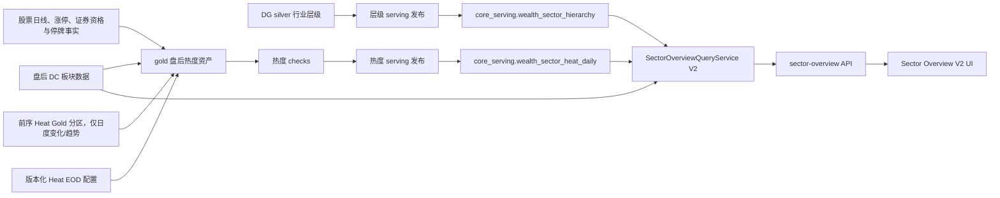

# 市场总览｜板块速览技术实施方案 v2（implementation-design）

> 状态：编码前评审稿；本文件不授权业务代码、迁移或生产写入。
> 对应需求：[sector-overview-benchmark-requirement-v2.md](./sector-overview-benchmark-requirement-v2.md)
> 对应门禁：[sector-overview-m2-coding-gate-v2.md](./sector-overview-m2-coding-gate-v2.md)
> 对应低层设计：[sector-overview-low-level-design-v2.md](./sector-overview-low-level-design-v2.md)

---

## 1. 开发目标、依据与范围

### 1.1 开发目标

1. 用行业三级联动、概念热度和地域独立排行三个工作台替换现有板块速览 `4 × 2 + 5 × 4` 布局。
2. 将 DG 行业三级层级发布为 Web 可读的正式 serving 事实。
3. 建立使用目标交易日有效 A 股成分池、可重跑、可回放、可解释的盘后概念热度物化链路。
4. 将现有模块 API 原子升级到 V2，前端不保留旧 DTO 兼容层。
5. 完成真实数据、性能、状态、像素和生产发布门禁。

### 1.2 依据

1. Figma 正式节点 `538:517/538:520/538:521/571:516/538:522/554:516`。
2. 板块速览标杆需求 v2。
3. 当前实现：
   - `src/biz/api/wealth/market/sector_overview.py`
   - `src/biz/queries/wealth/market/sector_overview/**`
   - `src/biz/schemas/wealth/market/sector_overview.py`
   - `wealth/src/features/market-overview/sectors/**`
4. DG 层级事实：`silver_dc_industry_hierarchy`。
5. 当前正式模型：`DcDaily/DcIndex/DcMember/BoardMoneyflowDc/EquityDailyBar/EquityLimitList/Security/EquitySuspendD`。

### 1.3 改动范围

| 子系统 | 计划范围 |
|---|---|
| `lake_console/orchestrator` | 层级 serving 发布、盘后热度 gold 资产、热度 serving 发布、checks、schedule/sensor 与回放入口 |
| `src/foundation` | 两张 serving 表 ORM/DAO 契约与 Alembic 迁移 |
| `src/biz` | V2 查询、状态、选择路径、DTO 和 API 参数 |
| `src/app` | 仅保持现有路由装配；无业务规则 |
| `wealth` | V2 组件树、API 类型、交互状态、样式和测试 |
| 文档 | API 基线、异常码、模块三件套、首页结构基线 |

本期不改 Tushare `DatasetDefinition`、request builder、现有来源表，也不建设实时链路。

---

## 2. 当前代码与影响面审计

### 2.1 当前行为

1. API 已存在，路径为 `GET /api/v1/wealth/market/sector-overview`。
2. 后端当前查询 `dc_daily + dc_index + board_moneyflow_dc`，构建 8 个固定 Top5 列和 20 个涨跌热力格。
3. 当前服务已从 `dc_index` 组装领涨股字段，但前端排名行没有把领涨股作为主要信息展示。
4. 当前前端消费 `columns[] + heatMapItems[]`，没有行业层级、成员列表或概念热度契约。
5. 当前 API 测试和前端真实 API 测试均冻结在旧 DTO 上。

### 2.2 CodeGraph 影响面结论

已审计入口、调用链、调用方、被调用方、测试和前端消费者，V2 直接影响：

```text
wealth MarketOverviewPage
  -> SectorOverviewPanel
  -> marketSectorOverviewApi
  -> /api/v1/wealth/market/sector-overview
  -> MarketSectorOverviewQueryService
  -> current sector query/state/status/schema
  -> DcDaily / DcIndex / BoardMoneyflowDc
```

新增数据链：

```text
silver_dc_industry_hierarchy
  -> prod_core_wealth_sector_hierarchy
  -> core_serving.wealth_sector_hierarchy

盘后正式来源 + 前序热度快照
  -> gold_wealth_sector_heat_daily[trade_date]
  -> prod_core_wealth_sector_heat_daily[trade_date]
  -> core_serving.wealth_sector_heat_daily
```

不影响指数详情、股票详情、榜单、成交额、资金流等其它模块契约。整页 `pageStatus` 仍沿用现有归并规则。

### 2.3 原子切换要求

V2 必须在一个受控发布单元内同时完成：

1. 后端 schema 和 query service。
2. 前端 API 类型、adapter、组件和 fixture。
3. 后端 Web 测试与前端真实 API 测试。
4. 文档中的旧 `columns/heatMapItems` 当前契约标记。

禁止提供 V1/V2 双写、`version` 请求参数、字段别名或前端兼容判断。

### 2.4 计划文件落点

```text
lake_console/orchestrator/src/orchestrator/defs/
  assets/wealth_sector_overview.py
  assets/wealth_sector_overview_prod_core.py
  checks/wealth_sector_overview_checks.py
  config/wealth_sector_heat.cn_a.v1.json
  prod_db/wealth_sector_overview.py
  wealth_sector_heat_contract.py

src/foundation/
  models/core_serving/wealth_sector_hierarchy.py
  models/core_serving/wealth_sector_heat_daily.py
  models/core_serving/__init__.py
  models/all_models.py

src/biz/
  api/wealth/market/sector_overview.py
  queries/wealth/market/sector_overview/
  schemas/wealth/market/sector_overview.py
  services/wealth/market/sector_overview/

wealth/src/features/market-overview/sectors/
  SectorOverviewPanel.tsx
  SectorOverviewTabs.tsx
  SectorRankingToolbar.tsx
  industry/**
  concept/**
  region/**
  detail/**
  api/marketSectorOverviewApi.ts
```

迁移文件名和具体 test 文件在实施时按真实 Alembic head、最近同类测试目录和当前命名规范确定；不得提前猜 migration revision。

---

## 3. 目标架构



### 3.1 架构决策

1. 层级进入 serving 表：Web 不读 Parquet，也不复制层级常量。
2. 热度离线物化：Web API 不做 20 日窗口、多表成员 join 或横截面分位计算。
3. 热度先写 Gold 候选文件，校验通过后再发布 PostgreSQL serving，保留复算证据。
4. 热度发布按 `trade_date` 事务替换并 read-back；来源表不与热度表共享事务。
5. 首版不加 Redis 或 API 结果缓存；索引和预计算应先满足 P95，缓存不得掩盖慢查询。
6. 有效 A 股成分池由离线 Heat 资产和后端详情查询复用同一纯函数/查询 contract；前端、SQL 调用方和地域视图不得各自复制过滤条件。

---

## 4. 持久化设计

### 4.1 `core_serving.wealth_sector_hierarchy`

| 列 | 类型建议 | 约束 |
|---|---|---|
| `sector_code` | `varchar(16)` | PK |
| `sector_name` | `varchar(128)` | not null |
| `industry_level` | `smallint` | not null, check 1..3 |
| `industry_level_name` | `varchar(16)` | not null |
| `parent_sector_code` | `varchar(16)` | 一级可空 |
| `parent_sector_name` | `varchar(128)` | 一级可空 |
| `root_sector_code` | `varchar(16)` | not null |
| `root_sector_name` | `varchar(128)` | not null |
| `hierarchy_path` | `varchar(512)` | not null |
| `is_leaf` | `boolean` | not null |
| `display_order` | `integer` | not null |
| `baseline_version` | `varchar(128)` | not null |
| `source_received_date` | `date` | not null |
| `code_reference_trade_date` | `date` | not null |
| `published_at` | `timestamptz` | not null |

索引：

1. `(industry_level, display_order, sector_code)`。
2. `(parent_sector_code, industry_level, display_order)`。
3. `(root_sector_code, industry_level, display_order)`。

发布为全表事务替换；read-back 必须校验 496 行、31/128/337 分布、父子闭包和版本一致。

### 4.2 `core_serving.wealth_sector_heat_daily`

| 列 | 类型建议 | 约束 |
|---|---|---|
| `trade_date` | `date` | PK part 1 |
| `sector_code` | `varchar(16)` | PK part 2 |
| `sector_name` | `varchar(128)` | not null |
| `heat_status` | `varchar(16)` | `VALID/INVALID` |
| `invalid_reason` | `varchar(64)` | nullable，固定原因码 |
| `base_heat_score` | `numeric(8,4)` | null or 0..100 |
| `base_heat_rank` | `integer` | null or >0 |
| `heat_score` | `numeric(8,4)` | null or 0..100 |
| `heat_rank` | `integer` | null or >0 |
| `heat_level` | `varchar(16)` | enum check |
| `heat_delta_1d` | `numeric(8,4)` | nullable |
| `heat_trend` | `varchar(16)` | enum check |
| `raw_heat_trend` | `varchar(16)` | enum check |
| `price_strength_score` | `numeric(8,6)` | 0..1 |
| `breadth_score` | `numeric(8,6)` | 0..1 |
| `capital_flow_score` | `numeric(8,6)` | 0..1 |
| `activity_score` | `numeric(8,6)` | 0..1 |
| `persistence_score` | `numeric(8,6)` | 0..1 |
| `source_member_count` | `integer` | >=0，`dc_member` 去重原始数 |
| `member_count` | `integer` | >=0，有效 A 股数 |
| `suspended_count` | `integer` | >=0 且 <= member_count |
| `quote_eligible_count` | `integer` | member_count - suspended_count |
| `valid_quote_count` | `integer` | >=0 |
| `missing_quote_count` | `integer` | quote_eligible_count - valid_quote_count |
| `quote_coverage` | `numeric(8,6)` | 0..1 |
| `score_version` | `varchar(64)` | not null |
| `source_dates_json` | `jsonb` | not null |
| `calculated_at` | `timestamptz` | not null |

索引：

1. `(trade_date, heat_score desc, sector_code)`。
2. `(sector_code, trade_date desc)`。
3. `(trade_date, heat_delta_1d desc, sector_code)`。

每个当日概念保留一行。有效行必须保留五个分量、有效池计数和来源日期，不可只保存总分；无效行保留原始成员、有效成员、停牌、可报价、缺行情、覆盖率、来源日期与 `invalid_reason`，不可伪造 0 分。

### 4.3 迁移规则

1. 实施时先重新读取当前 Alembic head，`down_revision` 只接真实 head。
2. 迁移只建表、约束和索引，不回填生产数据。
3. 层级和热度回填由 DG 发布链负责；迁移不得调用 Lake 或 Tushare。
4. downgrade 只删除本次新增表/索引，不触碰来源业务表。

---

## 5. DG 离线链路设计

### 5.1 层级 serving 发布

新增资产建议：`prod_core_wealth_sector_hierarchy`。

输入：

```text
/Volumes/datasource/data_lake/silver/board/dc_industry_hierarchy/full/part-000.parquet
```

执行：

1. 读取候选文件并校验固定 schema、唯一 `sector_code`、层级数和闭包。
2. 使用 `ProdPostgresWriteResource` 在单独事务中替换 serving 表。
3. read-back 校验行数、层级分布、版本和内容 hash。
4. 只在全部一致后提交。

### 5.2 热度 Gold 资产

新增日期分区资产建议：`gold_wealth_sector_heat_daily`。

输入窗口：

| 来源 | 范围 |
|---|---|
| `dc_daily` | 目标日及前 25 个已完成交易日 |
| `dc_index` | 目标日 |
| `dc_member` | 目标日及前 5 个已完成交易日 |
| `board_moneyflow_dc` | 目标日及前 10 个已完成交易日 |
| `silver_stock_daily` | 目标日及前 5 个已完成交易日，仅相关成员代码 |
| `equity_limit_list` | 目标日及前 5 个已完成交易日，`limit_type='U'` |
| `silver_stock_lifecycle` | 当前全状态 CNY 股票生命周期快照；按每个计算日的 `list_date/delist_date` 投影证券资格 |
| `silver_stock_suspend_daily` | 目标日及前 5 个已完成交易日，仅 `suspend_type='S'` |
| 前序 Heat Gold 分区 | 仅用于 `heatDelta1d` 和两日趋势确认；不参与当前五维总分 |

来源读取策略：

1. 已存在的 DG Silver DC、股票日线、股票生命周期和停牌资产从正式 Lake 路径读取。
2. 当前 DG 尚无正式等价的 `board_moneyflow_dc/equity_limit_list` Lake 资产；V2 首版只对这两类事实通过 `ProdPostgresResource` 做有界只读提取。
3. 不为本模块重复接入 Tushare，不在资产中改变来源表。
4. 每次提取记录日期、行数、查询范围和 source hash。
5. 持续性在当前有界原始数据窗口内先复算前 5 日 `baseHeatRank`，不依赖任何最终 Heat 分区；前序 Heat Gold 只用于 `heatDelta1d` 和趋势确认。
6. 不反向依赖 PostgreSQL serving；serving 可从 Gold 独立重建。
7. 离线有效池构建顺序固定为：同日成员去重 -> `silver_stock_lifecycle.is_cny_stock + list_status IN ('L','D') + 上市/退市日期边界` -> 同日停牌标记 -> 可报价池 -> 有效行情；`stock_basic` 源行天然属于股票证券。Web 详情侧使用 `security_serving` 的 `EQUITY + CNY + L/D + 日期边界` 表达同一语义。两侧以同一 golden cases 对账，禁止用证券代码前缀替代主数据。
8. `silver_stock_lifecycle` 来自 `stock_basic` 股票域并保留全状态 CNY 股票生命周期，离线侧不再重复读取 prod `security_serving`；Web API 仍只读 PostgreSQL，不允许读取 Lake。

输出路径建议：

```text
/Volumes/datasource/data_lake/gold/wealth/sector_heat_daily/trade_date=YYYY-MM-DD/part-000.parquet
```

候选文件只允许先写入 `/Volumes/datasource/data_lake_staging`，校验后用同文件系统 `os.replace()` 原子提升；禁止 Kopia。

### 5.3 Heat 资产检查

至少新增：

1. `wealth_sector_heat_schema_check`：列、类型、主键、状态、原因码、枚举和范围。
2. `wealth_sector_heat_source_date_check`：所有必需源日期等于分区日期。
3. `wealth_sector_heat_identity_check`：概念代码集合与当日有效概念集合一致或有明确拒绝原因。
4. `wealth_sector_heat_formula_check`：抽样复算五分量与总分。
5. `wealth_sector_heat_distribution_check`：分数、等级、rank 唯一性和覆盖率。
6. `wealth_sector_heat_history_check`：`heatDelta1d`、趋势确认和持久性只使用过去数据。
7. `wealth_sector_heat_effective_pool_check`：原始成员、有效 A 股、B 股/未上市排除、停牌、可报价和真实缺行情计数可逐行对账。

任一阻断型检查失败时不得发布 serving。

### 5.4 热度 serving 发布

新增资产建议：`prod_core_wealth_sector_heat_daily`。

1. 依赖 Gold 资产及其阻断型检查。
2. 单独事务 `delete where trade_date=:date` 后批量 insert。
3. read-back 校验行数、hash、scoreVersion、tradeDate 和分数范围。
4. 失败只影响该资产运行，不影响来源数据提交。

### 5.5 调度与回放

1. 仅在目标交易日七类日频来源均完成、证券主数据资格字段可用后触发，不以固定时钟代替 readiness。
2. 对 Lake 来源，sensor 核验对应分区 materialization 与 blocking checks；对 prod 来源，只读核验 `ops.dataset_status_snapshot` 中 `moneyflow_ind_dc/limit_list_d` 的观测日期和成功时间。
3. `limit_list_d` 当日零行时，还必须存在覆盖目标日期且 `status='success'` 的真实 TaskRun；不得把表中无行直接解释为零涨停。
4. readiness 证据（dataset key、观测日期、TaskRun id、完成时间）写入 materialization metadata，不进入来源业务表事务。
5. 历史回放不能用“当前最新 snapshot”证明旧日完整性；必须读取日期完整性审计或覆盖该日期的历史成功 TaskRun，无证据的空结果直接阻断。
6. 每个交易日最多成功发布一个当前 `scoreVersion` 快照；同版本重跑幂等覆盖。
7. 首次上线按交易日从旧到新发布至少 60 日；计算首个发布日时还需向前读取 25 个已完成交易日作为基础特征 warm-up，但 warm-up 不伪装成 60 日验收结果。
8. 历史回放每个分区独立提交、逐日 checkpoint，失败可从最后成功日续跑。
9. 不生成 runless 成功事件冒充真实物化。
10. `suspend_d` 当日零行与 `limit_list_d` 相同，必须用成功 TaskRun/日期完整性证据证明“零停牌”，不得把无数据直接视为零。

---

## 6. Heat EOD 配置审计

公式参数只有 DG 热度资产一个消费者，统一使用一个版本化定义文件，不接收 API 或前端覆盖。

### 6.1 配置清单

| 配置 | 默认值 |
|---|---:|
| `scoreVersion` | `concept-heat-eod-v1` |
| `weights.priceStrength` | `0.30` |
| `weights.breadth` | `0.25` |
| `weights.capitalFlow` | `0.25` |
| `weights.activity` | `0.10` |
| `weights.persistence` | `0.10` |
| `levelThresholds.boiling` | `90` |
| `levelThresholds.hot` | `80` |
| `levelThresholds.active` | `60` |
| `trendThresholds.heating` | `8` |
| `trendThresholds.cooling` | `-8` |
| `trendConfirmationDays` | `2` |
| `minMemberCount` | `10` |
| `minQuoteCoverage` | `0.80` |
| `baselineTradingDays` | `20` |
| `flowTradingDays` | `5` |
| `persistenceTradingDays` | `5` |
| `winsorLower/Upper` | `0.01/0.99` |

### 6.2 配置治理

| 维度 | 口径 |
|---|---|
| 来源/持久化 | `lake_console/orchestrator/src/orchestrator/defs/config/wealth_sector_heat.cn_a.v1.json`，唯一版本化 JSON 定义 |
| 作用范围 | `CN_A` 概念板块盘后热度 |
| 消费者 | `gold_wealth_sector_heat_daily` |
| 依赖 | 权重和分量内权重之和必须分别为 1；阈值严格递减 |
| 生效方式 | 部署并重启 DG code location；不支持运行时热更新 |
| 运维可见性 | materialization metadata 记录版本、hash 和完整参数 |
| 测试门禁 | schema 校验、非法权重/阈值负例、固定样本 golden test |

任何参数变化都必须同时升 `scoreVersion`；禁止只改 JSON 数值而沿用旧版本。

---

## 7. API V2 设计

### 7.1 请求

```ts
interface SectorOverviewRequestV2 {
  market?: "CN_A";
  tradeDate?: string;
  view?: "INDUSTRY" | "CONCEPT" | "REGION";
  industryRankMetric?: "CHANGE_PCT" | "MAIN_NET_INFLOW" | "UP_COUNT";
  selectedIndustryCode?: string;
  conceptRankMetric?: "HEAT_SCORE" | "HEAT_DELTA_1D" | "CHANGE_PCT" | "MAIN_NET_INFLOW";
  selectedConceptCode?: string;
  regionRankMetric?: "CHANGE_PCT" | "MAIN_NET_INFLOW" | "UP_COUNT";
  selectedRegionCode?: string;
  debug?: 0 | 1;
}
```

默认值：`market=CN_A`、`view=INDUSTRY`、行业和地域按 `CHANGE_PCT`、概念按 `HEAT_SCORE`。

参数规则：

1. `tradeDate` 为盘后交易日，不接受时间戳。
2. 当前 `view` 无关的 rank/selection 参数返回 `400001`。
3. 不接受 `level/parentCode/limit/weights/thresholds/scoreVersion`。
4. 无效代码格式返回 `400001`；合法但已不在候选集的旧选择按默认路径纠正，并在 debug 返回 `SO_SELECTION_INVALID`。
5. `selectedIndustryCode` 可传一级、二级或三级行业代码；后端从层级事实解析祖先路径，客户端不传父级代码。
6. `selectedConceptCode/selectedRegionCode` 只接受各自候选代码；三个视图的 rank/selection 参数严格互斥。

### 7.2 响应主体

```ts
interface SectorOverviewResponseDataV2 {
  tradingDay: TradingDay;
  pageStatus: PageStatus;
  sectorOverview: SectorOverviewPanelV2;
  debugInfo?: DebugInfo;
}

interface SectorOverviewPanelV2 {
  tradeDate: string;
  status: "READY" | "PARTIAL" | "DELAYED" | "EMPTY" | "ERROR";
  view: "INDUSTRY" | "CONCEPT" | "REGION";
  asOf: string;
  industry?: IndustryWorkspace;
  concept?: ConceptWorkspace;
  region?: RegionWorkspace;
}

interface IndustryWorkspace {
  rankMetric: "CHANGE_PCT" | "MAIN_NET_INFLOW" | "UP_COUNT";
  selection: {
    level1Code: string | null;
    level2Code: string | null;
    level3Code: string | null;
    detailSectorCode: string | null;
  };
  columns: IndustryRankColumn[];
  detail: SectorDetail | null;
}

interface IndustryRankColumn {
  level: 1 | 2 | 3;
  parentSectorCode: string | null;
  rows: SectorRankItem[];
}

interface ConceptWorkspace {
  rankMetric: "HEAT_SCORE" | "HEAT_DELTA_1D" | "CHANGE_PCT" | "MAIN_NET_INFLOW";
  selectedConceptCode: string | null;
  rows: SectorRankItem[];
  detail: SectorDetail | null;
}

interface RegionWorkspace {
  rankMetric: "CHANGE_PCT" | "MAIN_NET_INFLOW" | "UP_COUNT";
  selectedRegionCode: string | null;
  rows: SectorRankItem[];
  detail: SectorDetail | null;
}

interface SectorRankItem {
  rank: number;
  sectorCode: string;
  sectorName: string;
  level?: 1 | 2 | 3;
  primaryMetric: MetricValue;
  leader: SectorLeaderStock | null;
  heat?: ConceptHeat | null;
  selected: boolean;
}

interface SectorDetail {
  sectorCode: string;
  sectorName: string;
  sectorType: "INDUSTRY" | "CONCEPT" | "REGION";
  hierarchyPath?: string | null;
  metrics: SectorMetrics;
  heat?: ConceptHeat | null;
  heatHistory?: ConceptHeatPoint[];
  leader: SectorLeaderStock | null;
  members: SectorMemberStock[];
}

interface ConceptHeatPoint {
  tradeDate: string;
  heatScore: number | null;
  heatRank: number | null;
  heatLevel: "BOILING" | "HOT" | "ACTIVE" | "NONE";
}

interface ConceptHeat {
  heatStatus: "VALID" | "INVALID";
  invalidReason: "MEMBER_COUNT_LOW" | "QUOTE_ELIGIBLE_COUNT_ZERO" | "QUOTE_COVERAGE_LOW" | "HISTORY_INSUFFICIENT" | "FEATURE_MISSING" | null;
  heatScore: number | null;
  heatLevel: "BOILING" | "HOT" | "ACTIVE" | "NONE";
  heatDelta1d: number | null;
  heatTrend: "HEATING" | "STABLE" | "COOLING" | "UNKNOWN";
  heatRank: number | null;
  scoreVersion: string;
  tradeDate: string;
  calculatedAt: string;
}

interface MetricValue {
  value: number | null;
  displayText: string;
  direction: "UP" | "DOWN" | "FLAT" | "UNKNOWN";
}

interface SectorMetrics {
  changePct: number | null;
  upCount: number | null;
  downCount: number | null;
  sourceMemberCount: number;
  memberCount: number;
  suspendedCount: number;
  quoteEligibleCount: number;
  validQuoteCount: number;
  missingQuoteCount: number;
  mainNetInflow: number | null;
  turnoverAmount: number | null;
  quoteCoverage: number | null;
}

interface SectorLeaderStock {
  stockCode: string | null;
  stockName: string | null;
  changePct: number | null;
}

interface SectorMemberStock {
  stockCode: string;
  stockName: string | null;
  changePct: number | null;
  direction: "UP" | "DOWN" | "FLAT" | "UNKNOWN";
}
```

响应只返回当前 `view` 的 workspace，其它 workspace 字段省略，避免一次请求构建三个视图。
`FORBIDDEN` 由前端把 HTTP 403 映射为稳定模块状态，不作为 HTTP 200 的 `SectorOverviewPanelV2.status` 值。
`tradeDate` 是全部盘后事实的观测日期；`asOf` 是该模块响应组装时间，不得把它解释为实时行情时间，Heat 自身物化时间使用 `calculatedAt`。

### 7.3 查询分解

后端拆成有界查询：

1. `SectorOverviewStateQuery`：解析期望/观测交易日与来源 readiness。
2. `SectorHierarchyQuery`：一次加载 496 个当前层级节点，可进程内按 `baselineVersion` 缓存。
3. `SectorMetricsQuery`：按当前候选代码集和目标日查询板块行情/资金流。
4. `SectorHeatQuery`：按目标日查询概念热度 Top20，并为所选概念查询最近 20 个已发布交易日历史。
5. `EffectiveAStockPoolQuery`：按目标日构建有效 A 股、停牌、可报价和真实缺行情集合；供 Heat 对账与详情计数复用。
6. `SectorMemberQuery`：仅对右侧详情的一个板块查询有效池成员并补目标日股票行情。
7. `SectorSelectionResolver`：后端生成三级选择路径，不访问数据库。
8. `SectorOverviewQueryService`：编排、排序、截断和状态归并。

禁止一次把全部成员与全市场股票日线 join 后再由 Python 截断。
`SectorMetricsQuery` 对资金流只做 `trade_date + ts_code` 精确关联；`board_moneyflow_dc.ts_code` 为空的行不按名称补 join，覆盖缺口进入 debug 和 M0 数据验收。

### 7.4 行业查询算法

1. 若请求带 `selectedIndustryCode`，先从层级表解析该节点的 `level/parent/root`；不从字符串或名称推断。
2. 取得全部一级节点，按指定指标排序并截断 Top5；请求节点的 root 仍在 Top5 时选中该 root，否则选中榜首。
3. 只查询/排序所选一级的直接二级子节点并截断 Top5；请求节点为二/三级且其二级祖先仍在该 Top5 时保留，否则选中榜首。
4. 只查询/排序所选二级的直接三级子节点并截断 Top5；请求节点为三级且仍在该 Top5 时保留，否则选中榜首。
5. 请求节点是一级或二级时，后续更深层级按各自榜首自动补齐。
6. 详情节点取最终选择路径中的最深合法节点。
7. 若某级无子节点，后续列返回空数组，详情停在当前最深节点。

### 7.5 概念查询算法

1. `HEAT_SCORE/HEAT_DELTA_1D` 直接从热度表按索引排序 Top20。
2. `CHANGE_PCT/MAIN_NET_INFLOW` 从板块表排序 Top20，再批量关联这 20 个概念的热度。
3. 所选代码仍在 Top20 时保留，否则选择榜首。
4. 热度未就绪且请求热度排序时不自动改成涨跌幅排序，返回空榜单或可用静态详情并标记 `PARTIAL + SO_HEAT_NOT_READY`。
5. 热度历史按 `trade_date asc` 返回最多 20 点；无效点保留日期并返回空分数，不向前填充。

### 7.6 地域查询算法

1. 通过生产已核验的 `idx_type/category/content_type` 枚举只取 31 个地域板块，不按 `security_serving.area` 临时聚合。
2. 三种排名均按指定字段排序并返回全部 31 个地域板块，空值排在末尾，同分最终按 `sectorCode asc`。
3. 所选地域仍在 31 个候选中时保留，否则选择榜首；详情不返回层级与 Heat 字段。
4. 详情成员、涨跌分布和覆盖计数统一经过 `EffectiveAStockPoolQuery`。

### 7.7 日期与状态

1. 默认 `tradeDate` 先按当前视图的盘后基础来源求最近共同完成交易日。
2. 层级无版本：`ERROR + SO_HIERARCHY_UNAVAILABLE`。
3. 概念热度缺同日快照：基础榜单仍可用则 `PARTIAL + SO_HEAT_NOT_READY`。
4. 来源日期不一致：不得拼接，`DELAYED/PARTIAL + SO_HEAT_SOURCE_MISMATCH`。
5. 显式日期无数据：`EMPTY`，不回退。

---

## 8. 前端设计

### 8.1 目标组件树

```text
SectorOverviewPanel
  SectorOverviewTabs
  SectorRankingToolbar
  IndustryHierarchyWorkspace
    IndustryLevelColumn × 3
      IndustryRankItem
  ConceptHeatWorkspace
    ConceptHeatRankingList
      ConceptRankItem
      HeatBadge
      HeatTrendBadge
  RegionRankingWorkspace
    RegionRankingList
      RegionRankItem
    RegionBreadthDistribution
  SectorDetailPanel
    SectorMetricGrid
    SectorLeaderCard
    SectorMemberStockList
```

`SectorDetailPanel` 只在当前 feature 内共享，不提前抽到全局 `shared/ui`。

### 8.2 状态归属

1. 组件本地保留三个 Tab 各自的 rankMetric 和 selectedCode。
2. Tab、排名维度、选择变化触发模块 API 请求。
3. 使用请求序号或 AbortController 丢弃过期响应，防止快速切换回写旧选择。
4. 旧数据可在局部 loading 时保留，但必须显示刷新状态；首次请求只显示稳定骨架。
5. 前端不排序、不修正父子路径、不计算热度标签或趋势。

### 8.3 布局

1. 模块基准 `1564 × 680`，继承首页内容宽度。
2. 行业三列排名区与右侧详情保持设计稿比例；每列 5 行可见。
3. 概念和地域列表均为 7 行可见、内部滚动；页面本身不因列表增长继续增高。
4. 名称和领涨股分别设独立一行；长名称单行省略并通过 tooltip 查看全文。
5. Loading/Empty/Error/Partial/Forbidden 复用同一外层 grid，不重建不同高度页面。

### 8.4 删除项

V2 切换时删除或彻底替换：

1. `SectorRankMatrix` 的 8 列旧呈现。
2. `SectorHeatmap` 的 20 格涨跌热力图。
3. `columns/heatMapItems` 类型、adapter 和 fixture。
4. 只验证旧 8 列/20 格的测试断言。

---

## 9. 异常码

新增并登记：

| code | 场景 |
|---|---|
| `SO_HIERARCHY_UNAVAILABLE` | 层级 serving 缺失或闭包非法 |
| `SO_SELECTION_INVALID` | 请求选择已不属于当前候选路径 |
| `SO_HEAT_NOT_READY` | 目标日热度尚未成功发布 |
| `SO_HEAT_SOURCE_MISMATCH` | 热度记录来源日期与响应日期不一致 |
| `SO_MEMBER_COVERAGE_LOW` | 所选板块成分盘后行情覆盖不足 |

继续使用 `SO_SOURCE_DELAYED/SO_SOURCE_EMPTY/SO_QUERY_FAILED`。`SO_COLUMN_METRIC_UNAVAILABLE` 在 V2 上线前仍解释当前 V1，完成原子切换后标记 deprecated。

---

## 10. 性能与容量

### 10.1 API 预算

1. 同机房 P95 `< 250ms`，P99 `< 500ms`。
2. 响应 `< 120KB`。
3. 行业视图最多 `15` 个排名项 + `1` 个详情 + `5` 个成员。
4. 概念视图最多 `20` 个排名项 + `1` 个详情 + `5` 个成员 + `20` 个热度历史点。
5. 地域视图固定 `31` 个排名项 + `1` 个详情 + `5` 个成员。
6. 每请求 SQL 往返目标 `<= 8`，不得出现逐行 N+1。

### 10.2 离线预算

1. 日常单分区 P95 `< 60s`。
2. 60 日首次回放平均每分区 `< 60s`，失败可续跑。
3. PostgreSQL 资金流和涨停提取必须按日期、板块或成员代码有界；记录行数、耗时和执行计划。
4. 发布批次规模为概念板块数量级，不做全表删除。

### 10.3 估算门禁

进入编码前用生产只读统计补齐：

```text
概念数、行业数、地域数、当日 member pair 数、单板最大成员数、
20 日 dc_daily 行数、5 日 moneyflow 行数、
有效 A 股/B 股/未上市/已退市/停牌/可报价/真实缺行情数量、
目标日 equity_daily_bar 命中数、目标日 limit-up 行数。
```

没有真实数量前只允许使用上述算法边界，不得宣称容量已验收。

---

## 11. 测试与验收

### 11.1 DG/数据层

1. 层级 schema、496 行、31/128/337、闭包、hash 和 read-back。
2. Heat 配置正向和非法权重/阈值/版本负例。
3. 固定横截面 golden test：winsor、平均秩、五分量、总分、rank。
4. no-lookahead：改变 `t+1` 输入不得改变 `t` 结果。
5. 历史不足、有效成员不足、可报价池为零、覆盖不足、来源日期错位不得静默补权。
6. 无效概念保留 `INVALID + reason`，不得落成 0 分。
7. 分区重跑幂等、发布失败不污染旧成功分区。
8. B 股与目标日未上市/已退市证券排除；停牌保留有效资格但不进入可报价分母；其余无行情计入真实缺失。

### 11.2 后端

1. 三层候选范围、默认选择和无子级路径。
2. 三种行业、四种概念、三种地域排序及同分稳定排序。
3. 领涨股严格来自 `dc_index`。
4. 成分 Top5 查询无 N+1。
5. 热度缺失不回退为其它排名维度。
6. 热度历史固定最多 20 点、按日期升序且无效点不填充。
7. `READY/PARTIAL/DELAYED/EMPTY/ERROR/FORBIDDEN`。
8. 地域候选固定 31 个板块、无层级/Heat 字段，选择与详情联动正确。
9. 旧 DTO 字段在 V2 schema 中不存在。

### 11.3 前端

1. 三级联动、三个 Tab 独立状态、排名切换、列表滚动和 stale response 防护。
2. 板块名、主指标、领涨股、热度标签和成员股的真实 API 可见断言。
3. 长文本、空字段、负值、极大金额、热度无效场景。
4. 红涨绿跌、键盘焦点、tooltip 和禁止误点击。
5. 全部状态保持相同模块外框。

### 11.4 像素验收

1. 以 Figma 行业/概念/地域 `1564 × 680` 同尺寸截图为基线。
2. 三种 Tab、四种概念排序、三种行业和三种地域排序至少各留一张验收截图。
3. 普通 UI 偏差 `<=2px`；无新增换行、裁剪、重叠和溢出。
4. 首页完整截图确认模块增高没有挤压、重叠或改变其它模块宽度。

---

## 12. 实施顺序

### M0：契约与生产只读验收

1. Figma 盘后字段、地域第三视图和有效 A 股池说明已经同步，以正式节点为基线。
2. 完成地域枚举、Web 侧证券资格/停牌完成证据、离线与 Web 有效池同义性、有效池分类和可报价覆盖率的只读审计。
3. 冻结 V2 API 样例、Heat 配置和异常码。

### M1：持久化与 DG

1. 新建两张表及模型。
2. 发布层级 serving。
3. 实现 Heat Gold、checks、60 日回放和 serving 发布。
4. 生产 read-back 验收。

### M2：后端 V2

1. 重写查询分解和选择 resolver。
2. 原子替换 schema/API。
3. 完成后端契约、性能和状态测试。

### M3：前端 V2

1. 先搭稳定 `1564 × 680` 骨架。
2. 实现行业，再实现概念、地域和详情共享块。
3. 接真实 V2 API，删除旧 DTO 和旧组件。
4. 完成交互、状态和像素验收。

### M4：发布

1. 迁移 -> 层级发布 -> 60 日 Heat 回放 -> 最新日发布。
2. 后端和前端同发布窗口切换。
3. 观察 API P95、模块状态、Heat 覆盖和 source mismatch。
4. 回滚时回滚应用版本；新表可保留，不回写旧 DTO 兼容逻辑。

---

## 13. 边界与依赖矩阵结论

1. `foundation` 只新增存储模型，不依赖 `ops/biz/app`。
2. `biz` 只依赖 `foundation` 的 serving 模型，不依赖 DG 或 `ops`。
3. `ops` 不调用 `biz`；Heat 调度由 DG 承担。
4. `app` 只保持 API 装配。
5. Web 不依赖 Lake、Tushare、DG runtime 或 Redis。

因此本方案不改变根依赖矩阵方向，但新增了 DG -> prod serving 的数据发布链，实施时需补齐资产定义加载、checks、资源权限和运维观测。

---

## 14. 已知风险

1. Figma 已完成盘后、地域和有效池口径同步；后续 Web 实现仍需按同尺寸截图做像素验收。
2. 六个既有来源已完成目标日审计，但 Web 侧 `security_serving/equity_suspend_d` 的生产有效池分类、历史完成证据，以及它与 Lake 有效池的同义性仍需在 M0 补验。
3. 当前 DG 没有正式等价的资金流和涨停 Lake 资产，Heat 首版仍对这两类 prod PostgreSQL 来源存在有界只读提取依赖；股票日线、停牌和生命周期已校准为正式 Lake 输入。
4. Heat V1 是产品首版，60 日回放只能验证稳定性和可解释性，不能证明投资预测能力。
5. 行业层级当前是当前版本快照；历史 `tradeDate` 请求不会还原历史层级变化。

以上风险均在 M0/M1 门禁中显式处理，未通过不得进入真实数据发布。

---

## 15. 版本记录

| 版本 | 日期 | 变更摘要 |
|---|---|---|
| v2.2 | 2026-08-12 | 按当前代码审计校准模型落点与 Heat 输入：股票日线、停牌、生命周期改用正式 Lake，prod 有界只读收敛为资金流和涨停；增加 LLD 入口 |
| v2.1 | 2026-08-12 | 增加地域工作台；冻结有效 A 股池、停牌感知可报价池、字段与实现门禁 |
| v2 | 2026-08-12 | 基于正式 Figma、行业三级产品方案和盘后热度口径形成完整开发技术方案 |
