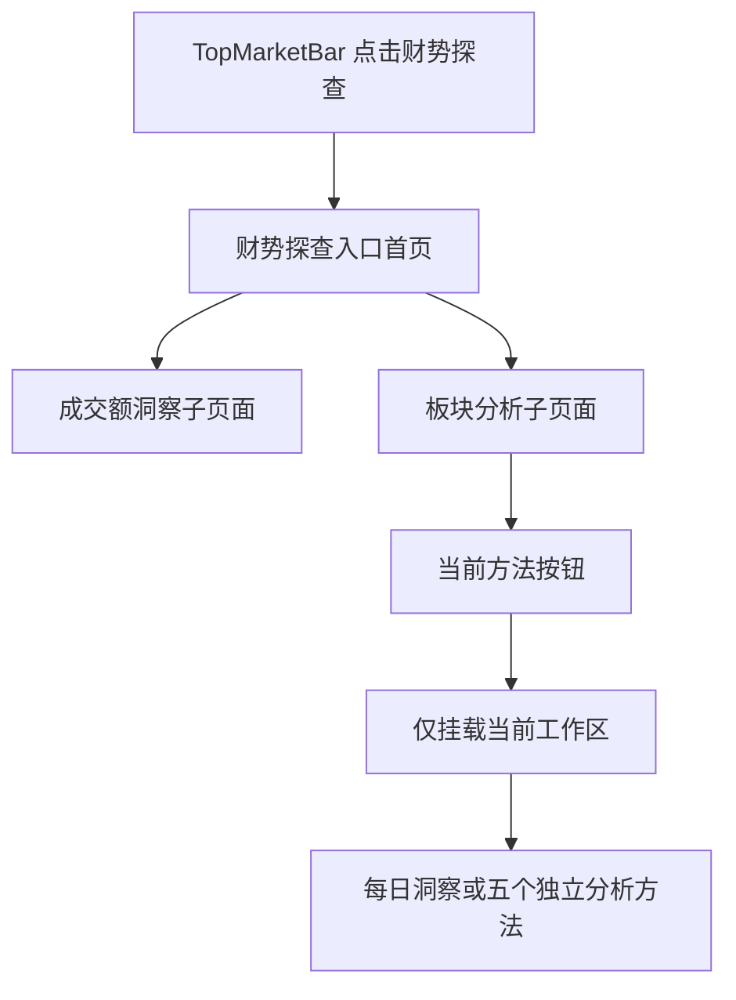
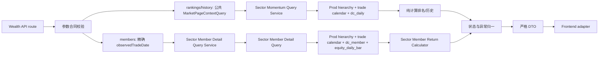

# 财势探查｜板块分析技术实施方案 v1

> - 文档性质：技术实施方案与里程碑对账，不是 LLD。
> - 当前状态：v1.71；横截面动量排名 M0～M3A、双动量 M5～M8、相对轮动 M9～M12R、成员广度 M13～M16R2、量价分布 M17～M20、每日事实 M22 与历史回补 M23 均已收口。M24R 及动量 serving 切读子阶段已验收通过并关闭：提交 `d5f42566` 部署后，最大三级30日周期／60日 History 的两轮生产认证 HTTPS P95 为 `358.4/370.9ms`，60＋60槽、缺失语义与排名分母保持一致。用户已批准该计时路径作为本次等效验收，700ms门槛不变。M24／G63 整体仍在进行；下一方法为双动量，其余四方法尚未切读，M25～M26 不得提前执行。
> - 产品事实源：[财势乾坤板块分析产品交互基线文档 v1](./sector-analysis-product-interaction-baseline-v1.md)。
> - Figma 文件：`Goldenshare Web`，file key `RADlZzREU4lPVviYfkLy6x`。
> - 基线日期：2026-09-03。

---

## 0. 结论摘要

本方案把当前已确认的交互拆成六个明确交付范围：

1. 先把现有财势探查单页改成“入口首页 + 独立模块子页面”，并让财势探查真正复用财势乾坤首页的快捷入口组件。
2. 横截面动量排名及三级行业成分明细已经完成；双动量作为第二个独立方法，严格按产品基线 v1.4 和正式 Figma 建设独立路由、独立接口与独立工作区，不与动量排名混合成综合评分。
3. 在三级行业可被选中的两个工作区中，左栏保持总高度不变并拆成上下两个独立滚动区：上部继续展示三级行业榜单，下部展示当前所选三级行业的成分股名称、代码、目标日收盘价和所选统计周期区间涨跌幅。该能力是动量排名的事实明细，不是“成员广度”方法，也不产生新的评分或预测。
4. 相对轮动作为第三个独立方法，使用“当前同组强度百分位 + 5个交易日百分位变化”形成四象限快照，并只为当前选中行业展示 `20/30/60` 日轨迹；它不实现传统 RRG、不读取宽基指数，也不解释为预测。
5. 成员广度作为第四个独立方法，使用同日来源成分关系、股票日行情和复权因子，分别计算成分股数量、成交额参与和均线位置三项客观广度；不合成为综合分、不解释为预测。其正式交互、数据合同和分期方案由第 12C 节冻结；M14、M15、M16R、M16I 和 M16R2 已完成本轮收口，页面及30日口径可用，较重的60日口径仍存在超过15秒客户端等待的已知限制。当前不继续放宽超时，持久化／预计算作为后续独立需求。
6. 量价分布作为第五个独立方法，使用同一行业体系的区间涨跌幅和两段等长窗口成交额均值变化，形成当前横截面散点、完整列表和所选行业双历史趋势；不生成预测、信号、综合分或交易建议。第 12D 节冻结其三只只读 API、独立路由／controller、最大119个交易日窗口、状态、性能和验收边界；M18 后端、M19 前端和 M20 部署联调均已完成，本轮正式关闭。
7. 每日洞察作为板块分析默认入口，汇总同一业务日期、同一行业层级版本和同一公式包下五种方法的已发布客观事实；它不是第六种公式，不调用生成式 AI，也不在线并发五组现算接口。第12E节新增每日事实批次、方法事实表、洞察汇总／事件表、自动物化、自2025年8月22日起回补、只读 API、独立路由和五方法等价切读方案。

既有动量排名直接读取 Prod 已有正式事实：

- `core_serving.trade_calendar`
- `core_serving.wealth_sector_hierarchy`
- `core_serving.dc_daily`
- `core_serving.dc_member`（仅三级行业成分关系）
- `core_serving.equity_daily_bar`（仅成分股目标日收盘价和区间涨跌幅）

双动量、相对轮动和量价分布都只复用其中前三张表，不读取成分股关系或股票行情。成员广度新增读取 `core.equity_adj_factor`，但仍只读 Prod，不新增数据库表、迁移、物化结果、缓存或同步任务；不读取 DG/Lake，不依赖 `dc_index`、资金流、Heat、QTF、申万、概念或地域数据。DG 只继续承担既有行业层级发布，Web 查询只读 Prod。

上述“不新增物化结果”是五个方法各自在线计算阶段的历史边界。每日洞察新阶段以性能和每日事实沉淀为明确目标，将在同一 Prod DB 的 `core_serving` 新增版本化每日事实及发布批次；来源仍只读上述现有 Prod 表，不复制来源数据，不写 DG/Lake，不新增数据库、账号或连接配置。

## 1. 目标、依据与边界

### 1.1 实现目标

1. 将 `/wealth/exploration` 调整为纯财势探查入口首页，不再在首页直接加载成交额洞察。
2. 为“成交额洞察”和“板块分析”建立独立、可复制、可刷新和可前进后退恢复的子页面路由。
3. 抽取现有财势乾坤首页 `ShortcutBar / ShortcutCard` 为真正共享的展示组件，保证市场总览视觉无漂移，财势探查只提供自己的入口数据。
4. 建立板块分析稳定页面骨架和方法导航，只挂载当前选中的工作区。
5. 实现行业一级、二级、三级及父级内部的完整涨幅榜、跌幅榜、父子下钻、交易日复盘和 `20/30/60` 日历史趋势。
6. 所有业务日期继续服从公共 `pageContext.tradeDate` 和 20:00 盘后切换约定。
7. 后端提供明确的行业层级、动量排行和历史趋势事实；前端只做展示适配，不自行拼接业务事实或计算排名。
8. 三级行业成分股列表只读取当前页面实际展示的盘后交易日；切换行业、统计周期或榜单方向后独立刷新，不阻塞右侧详情和双趋势图。
9. 双动量使用与动量排名相同的区间收益、比较池、同组强度排名和百分位事实，在此之上只判断“绝对动量是否为正”和“相对动量是否达到阈值”；不新增综合分、权重、预测或信号。
10. 双动量支持五类比较范围、`5/10/20/30` 日观察周期、`70/80/90` 百分位阈值、历史日期复盘、符合条件／全部行业切换、列表与散点图联动及产品基线冻结的全部边界状态。
11. 相对轮动复用同一动量公式和五类比较池，支持 `5/10/20/30` 日强度周期、固定5日改善周期、`20/30/60` 日选中行业轨迹、四象限筛选、搜索、放大图和历史日期复盘；前端不重新计算百分位、变化值或象限。
12. 成员广度支持五类比较范围、上涨／下跌两种方向、成分股／成交额／均线位置三项独立排名指标、`5/10/15/20/30/60` 日均线、`20/30/60` 日趋势和完整成分股明细。
13. 成员广度的每个历史点使用该日来源成员关系；各项指标独立计算分母和覆盖率，不补零、不前向填充，不借用最新成员，不把样本不足行业从完整列表中删除。
14. 成员广度后端输出排名、组成、趋势和明细事实；前端只负责选择服务器已返回的事实并格式化展示，不自行计算均线、占比、覆盖率或排名。
15. 量价分布支持五类比较池、`1/5/10/20/30` 日统一分析周期、四种零轴状态、两种可排序指标、五种列表视图、`20/30/60` 日双历史趋势和历史日期复盘。
16. 量价分布后端输出价格动量、成交活跃度、两项横向名次、状态、缺失原因和历史序列；前端只做筛选、稳定排序选择、坐标映射与格式化，不重新计算公式、名次或缺失事实。
17. 板块分析默认路由调整为每日洞察；现有五个方法精确路由保持不变，方法切换仍只挂载当前工作区。
18. 将五个方法约94%的核心结果沉淀为按业务日期和批次发布的 typed serving facts；逐只股票明细、页面筛选、Tooltip 和运行时状态不物化。
19. 每个交易日的五方法事实、洞察摘要和洞察事件必须以一个发布批次原子可见；新批次未发布时 API 只能读取上一已发布批次，不能混用不同日期或版本。
20. 正式结果从 `2025-08-22` 起补齐全部 SSE 开市日。`2025-05-30～2025-08-21` 只作为60个交易日滚动窗口预热，不写入九张事实表、不对页面发布；更早且无法匹配当前发布层级的数据不参与本版计算，也不物理删除来源表历史行。
21. 五个既有方法在完成逐字段等价对账后切换为读取每日事实；公开 API、公式、缺失原因、完整行业数、成员明细和历史槽位不得降级。

### 1.2 视觉与交互依据

| 页面或状态 | Figma 节点 | 本方案用途 |
|---|---|---|
| 财势探查入口首页 | `978:545` | 入口首页、两张快捷入口卡、无业务工作区 |
| 成交额洞察子页面 | `978:982` | 既有成交额能力从首页拆出后的独立页面 |
| 板块分析／动量排名默认态 | `965:55` | 一级总榜、1 日、涨幅榜默认工作区 |
| 动量排名／跌幅榜 | `971:352` | 同一容器内的跌幅榜状态 |
| 二级总榜 | `1051:951` | 全部二级行业、所属一级路径及全局／父级双排名摘要 |
| 三级总榜 | `1051:1251` | 左栏上部为全部三级行业榜单，下部为所选三级行业成分股列表；右栏保留全局／父级双排名摘要和双趋势图 |
| 一级内二级 | `987:476` | 一级选择器、直属二级完整榜和详情 |
| 二级内三级 | `987:776` | 一级／二级级联选择器；左栏上部为直属三级完整榜，下部为所选三级行业成分股列表；右栏保留详情与双趋势图 |
| 动量排名／双图悬停 | `1053:5261` | 两图共享日期十字线和联合 Tooltip |
| 动量排名／交易日选择器 | `1062:2` | 全部 SSE 开市日可选；完整、部分缺失、无数据状态可见 |
| Loading | `1036:634` | 保留页面骨架、方法栏和工具栏，正文显示加载骨架 |
| Delayed | `1036:1014` | 保留最近完整交易日内容并明确实际盘后日期 |
| Empty | `1036:1386` | 显式历史无数据或比较池全部不可计算 |
| Error | `1036:1762` | 查询或合同失败后的稳定错误态与重试 |
| 每日洞察／一级行业 Ready | `1227:22298` | 板块分析默认入口、一级行业概览与四类事实列表 |
| 每日洞察／二级行业 Ready | `1227:23074` | 二级行业独立汇总，不跨层级比较 |
| 每日洞察／三级行业 Ready | `1227:23850` | 三级行业独立汇总及完整滚动列表 |
| 每日洞察／Delayed | `1227:24626` | 当前批次未发布时读取最近已发布批次并明确实际日期 |
| 每日洞察／Loading | `1227:25085` | 六方法稳定骨架及洞察加载占位 |
| 每日洞察／Empty | `1227:25544` | 显式业务日期无已发布批次或当前层级无可展示事实 |
| 每日洞察／Error | `1227:26003` | 合同、查询或网络失败与重试 |
| 每日洞察／交互与数据合同 | `1227:26462` | 默认入口、层级、日期、阈值、模板、缺失和状态合同 |
| 双动量旧草稿 | `967:72` | 已移动至 Archive 并标记 `Frozen / Do Not Implement`，不得作为编码依据 |
| 相对轮动旧草稿 | `967:158` | 已标记 `Archive / Frozen / Relative Rotation / Do Not Implement`，不得作为编码依据 |
| 成员广度旧草稿 | `967:244` | 已冻结并移入交付区，只保留历史参考，不作为编码依据 |
| 量价分布旧草稿 | `967:330` | 已标记 `Archive / Frozen / Price Volume / Do Not Implement`，不得作为编码依据 |

Figma 页面 `14 Wealth Exploration - Sector Analysis`（`965:2`）负责板块分析交互事实。旧板块雷达和原复杂量化研究画板保持冻结，不参与本方案。

每日洞察组件交付区根节点为 `1219:21622`，概览指标组件为 `1219:21625`，列表行组件为 `1219:21630`，稳定状态面板为 `1219:21647`；一级／二级／三级 Ready 工作区组件分别为 `1221:21622`、`1225:21837`、`1225:22183`，非 Ready 工作区组件为 `1225:22529`、`1225:22556`、`1225:22583`、`1225:22610`，交互合同组件为 `1226:22295`。8张正式画板均为 `1600×1292.390625`，工作区为 `1564×1006`。页面骨架、工具栏、指标卡、四类列表和状态面板使用 Auto Layout；本工作区没有需要复制为运行时绝对坐标的图表。

双动量正式交互以同一页面中的以下节点为唯一视觉和状态依据；旧草稿节点 `967:72` 不再具备需求效力：

| 双动量正式状态 | Figma 节点 | 技术语义 |
|---|---|---|
| 符合条件默认态 | `1096:1267` | 一级总榜、20 日、80% 阈值、符合条件列表 |
| 全部行业 | `1101:5478` | 同一计算结果切换完整行业列表，不重新定义比较池 |
| 一级内二级 | `1103:1425` | 仅比较所选一级行业直属二级行业 |
| 二级内三级 | `1104:1898` | 仅比较所选二级行业直属三级行业 |
| 二级总榜 | `1105:1583` | 全部二级行业同组比较 |
| 三级总榜 | `1105:1938` | 全部三级行业同组比较 |
| Hover | `1106:1741` | 散点 Hover、列表与图表关联 |
| Partial Data | `1106:2109` | Ready 内容态中的覆盖提示，不是独立页面状态 |
| Loading | `1106:2528` | 稳定页面骨架与加载占位 |
| Delayed | `1106:7209` | 展示上一有效交易日事实及明确日期提示 |
| Empty | `1106:2713` | 比较池不存在可计算事实 |
| Error | `1106:2894` | 合同或查询失败与重试 |
| Small Group | `1107:2216` | 小于 3 个可计算对象时展示事实但不判定是否符合条件 |
| No Qualified | `1115:2295` | 有可计算事实但零个行业符合条件，仍属于 Ready |
| Missing Selected Coordinate | `1115:2571` | 所选行业事实不完整，列表可选但散点不伪造坐标 |

相对轮动正式交互以同一页面中的以下节点为唯一视觉和状态依据；组件与状态交付区根节点为 `1148:5611`，旧草稿 `967:158` 不再具备需求效力：

| 相对轮动正式状态 | Figma 节点 | 技术语义 |
|---|---|---|
| 一级总榜默认态 | `1150:5870` | 默认一级总榜、20日强度、20日选中轨迹 |
| 二级总榜 | `1152:6286` | 全部二级行业同组比较 |
| 三级总榜 | `1152:7139` | 全部三级行业同组比较 |
| 一级内二级 | `1152:7994` | 所选一级直属二级行业比较 |
| 二级内三级 | `1152:8838` | 所选二级直属三级行业比较 |
| Hover | `1154:7772` | 圆点悬停事实与列表联动 |
| Small Group | `1155:8264` | 少于3个可计算行业时不赋予四象限语义 |
| Missing Selected Coordinate | `1156:8578` | 所选行业坐标缺失但列表、摘要和其他圆点保留 |
| Delayed | `1156:13471` | 展示最近完整交易日并明确实际数据日期 |
| Enlarged Plot | `1157:9236` | 与普通图共享同一坐标范围 |
| Loading | `1158:9938` | 稳定页面骨架与加载占位 |
| Empty | `1158:10319` | 当前比较池没有任何可计算行业 |
| Error | `1158:10707` | 查询或合同失败与重试 |
| Filtered / 领先且增强 | `1161:10430` | 只过滤右侧列表，图中继续保留全量快照 |

相对轮动状态标签组件集为 `1148:5622`，行业行组件集为 `1148:5647`。14张正式画板均为 `1600×1292.390625`，工作区为 `1564×1006`；页面骨架、工具栏、摘要和列表使用 Auto Layout，绝对坐标只用于四象限绘图区和放大弹层。

成员广度正式交互以同一页面中的以下节点为唯一视觉和状态依据；组件与状态交付区根节点为 `1169:10235`，旧草稿 `967:244` 不再具备需求效力：

| 成员广度正式状态 | Figma 节点 | 技术语义 |
|---|---|---|
| 一级总榜默认态 | `1186:11797` | 一级总榜、上涨广度、成分股占比、MA20、20日趋势 |
| 趋势查看 Active | `1190:15904` | 最近交易日吸附、横纵十字线、三项有效交点、同日 Tooltip 和右侧日期的左向避让视觉基准 |
| 二级总榜 | `1186:12191` | 全部二级行业同组排名，样本不足行业仍保留 |
| 三级总榜 | `1186:12585` | 全部三级行业同组排名与完整选中行业明细 |
| 一级内二级 | `1186:12979` | 所选一级直属二级行业比较 |
| 二级内三级 | `1186:13376` | 所选二级直属三级行业比较 |
| 下跌广度 | `1186:13776` | 切换为下跌成员、下跌成交额和跌破均线事实 |
| 成交额占比排名 | `1186:14170` | 同一行业池按方向对应的成交额占比排名 |
| MA60 | `1186:14564` | 完整60日复权价格窗口与均线位置事实 |
| Delayed | `1186:14958` | 保留最近完整盘后事实并显示实际数据日期 |
| 选中行业样本不足 | `1186:15352` | Ready 骨架内的局部不可计算，不伪造比例或名次 |
| Loading | `1186:15631` | 稳定页面骨架和加载占位 |
| Empty | `1186:15805` | 当前比较池没有任何可计算行业 |
| Error | `1186:15979` | 查询或合同失败与重试 |
| 交互与数据合同 | `1186:16155` | 控件联动、局部状态、字段和滚动边界 |

成员广度 Ready 工作区组件为 `1174:10235`，行业行组件集为 `1170:10263`，成分股行组件为 `1172:10235`，三段组成条组件集为 `1173:10268`。13张既有正式状态画板与新增1张趋势查看 Active 画板均为 `1600×1292.390625`，工作区为 `1564×1006`；Active 视觉叠层子节点为 `1190:15918`（`1004×232`）。1600px 基线采用 `548 + 12 + 1004` 左右栏，运行时必须按第 12C.8 节连续响应式伸缩，不能把设计像素写成页面固定宽度。页面骨架、工具栏、摘要、列表和状态面板使用 Auto Layout；绝对坐标只允许用于趋势图绘图区和不参与布局的弹层。Active 画板只冻结视觉结果，不替代第 12C.8.1 节的动态状态机和边界合同。

量价分布正式交互以同一页面中的以下节点为唯一视觉和状态依据；旧草稿 `967:330` 不再具备需求效力：

| 量价分布正式状态 | Figma 节点 | 技术语义 |
|---|---|---|
| 一级总榜默认态 | `1198:16656` | 一级总览、20日分析周期、全部状态、价格动量降序和20日历史范围 |
| 二级总榜 | `1199:17226` | 全部二级行业同组观察 |
| 三级总榜 | `1199:18374` | 全部三级行业同组观察并展示所属路径 |
| 一级内二级 | `1200:18386` | 所选一级行业直属二级行业观察 |
| 二级内三级 | `1200:19424` | 所选二级行业直属三级行业观察和两级父行业选择器 |
| Hover | `1201:19489` | 散点事实 Tooltip、双历史图共享日期定位和同日双值 Tooltip |
| Filtered / 量价共同增强 | `1201:20282` | 列表只保留命中项，图中未命中可绘制点继续弱化保留 |
| Missing Selected Coordinate | `1203:20537` | 所选行业缺任一坐标时保留列表、摘要和历史，不生成伪点 |
| Delayed | `1203:21323` | 自动日期延迟时展示最近完整盘后事实和实际日期 |
| Loading | `1204:21545` | 稳定骨架和局部加载占位 |
| Empty | `1204:22057` | 当前比较池完整二维坐标数为0 |
| Error | `1205:21658` | 查询或合同失败、零旧结果冒充及重新加载 |
| 交互与数据合同 | `1205:22159` | 公式、范围、筛选、历史、缺失、状态和字段基线 |

量价分布组件与状态交付区根节点为 `1196:16280`，默认 Ready 工作区组件为 `1198:16286`，状态标签组件集为 `1196:16296`，行业行组件集为 `1196:16342`，坐标缺失标签组件为 `1203:19971`。2026-08-30 通过 Figma Plugin API 复核：13张正式画板均为 `1600×1292.39`，工作区为 `1564×1006`；工具栏为 `1564×128`，正文为 `600 + 12 + 952`、高度 `866`，左侧列表 viewport 为 `600×772`，右侧摘要／散点／双历史图区依次为 `952×100`、`952×430`、`952×312`。工作区、工具栏、列表、摘要和历史外壳均使用 Auto Layout；散点绘图区 `924×360` 与两张 `924×126` 历史绘图区保留必要绝对坐标。上述尺寸只用于1600px设计基线，运行时必须按第12D.8节连续响应式伸缩，不能写成页面固定宽度。

双动量正式工作区已收敛为组件集 `1132:9777` 的 15 个变体，每个工作区实例均为 `1564×1006`；交互说明节点为 `1137:422`。15 张正式页面均为 `1600×1292.390625`。运行时仍必须服从第 4.6 节的连续响应式合同：`1564px` 只是 1600px 视口下的设计基线，不能写成固定页面宽度。

2026-08-27 横截面动量节点树、属性、交互和 1600px 截图对账已通过：12 张正式画板均为 `1600×1292.390625`；一级涨／跌、二级总榜、三级总榜、两类父级榜、双图悬停、交易日覆盖选择器和四个异常态均具备独立开发基线。榜单 viewport 使用纵向滚动；页面壳、工具栏、行、摘要和状态面板使用 Auto Layout；图表、数据条、十字线、Tooltip、日期 Popover 和滚动条叠层保留必要绝对坐标。该阶段四个后续方法按钮均未接草稿；此历史说明不覆盖上表已经正式收口的双动量设计。行业行选择与独立下钻已区分，三级无下钻，`20/30/60` 明确为动量排名两图共用。

2026-08-28 的成分股增量已落到上述两张正式画板：左侧正文继续保持 `776×866`，内部改为上部行业榜单 `776×390`、间距 `12`、下部成分股列表 `776×464`；两个列表各自拥有固定表头和独立纵向滚动 viewport。下部四列固定表达名称、代码、收盘价和区间涨跌幅，不增加操作列；右侧详情仍位于 `x=788` 且保持 `776×866`，没有改变摘要和图表位置。Figma 的四列固定像素宽度只用于 `1600px` 基线验收；运行时必须按第 4.6 节使用共享响应式 Grid，不能把 `752px` 内容宽写死。

| 正式状态 | 左栏新包装节点 | 成分股面板根节点 | 说明 |
|---|---|---|---|
| 三级总榜 `1051:1251` | `1085:1267` | `1085:1268` | 上下双滚动；成员节点树 `1085:1269..1272`、内容节点 `1086:1267..1275` 与 `1087:1268..1307` |
| 二级内三级 `987:776` | `1088:1267` | `1088:1268` | 上下双滚动；成员节点树 `1088:1269..1321` |

设计语义也已逐项核对：一级 31 个对象的排名纵轴完整覆盖 `1..31`；涨幅榜最强示例为 `100.0%`，跌幅榜最弱示例为 `31/31、0.0%`；二级和三级详情同时展示全层级与直属父级排名；代表性 Hover 状态同时显示日期、区间涨跌幅和“第 N 名 / M 个可计算行业”。模块自有正式文本已绑定可精确匹配的本地 Text Style，`System/Warning` 已补 Web syntax `var(--cs-color-warning)` 和正确使用范围；共享组件既有债务不在本期扩改。

### 1.3 本期明确不做

1. 不做转热、续热、转冷、预测、成功率、Lift、信号或综合评分。
2. 量价分布 M17 只完成LLD、异常码登记、架构门禁和有界Prod只读性能预检，不包含业务代码、部署或页面验收；M17已经通过，业务编码只能从M18开始并按后端、前端、联调验收顺序推进。
3. 不接入 QTF，不建设参数审批、研究发布或行情信号发布。
4. 不做概念、地域、申万行业或行业体系对比。
5. 不使用 Heat、资金流、新闻、宽基或分钟数据；成员广度只使用来源成员、股票日行情和复权因子，不扩展为选股或预测能力。
6. 不改 `TopMarketBar` 的结构、样式和一级导航。
7. 不在财势探查入口首页预加载、隐藏挂载成交额或板块分析工作区。
8. 不扩展移动端设计；继续使用当前宽桌面基线。
9. 五个已完成方法原阶段不新增数据库表、迁移、账号、连接、定时任务、缓存服务或第三方前端依赖；每日洞察只按第12E节新增同一 Prod DB 内的 serving 表、迁移和既有 Ops 维护动作，不新增数据库、账号、连接、Worker Lane、缓存服务或第三方依赖。
10. 不增加成分股筛选器、搜索、分页控件、勾选、导出、股票详情跳转或更多行情字段；本增量严格保留已确认的四列。
11. 双动量不读取成分股、资金流、Heat、新闻、宽基、分钟行情、概念、地域或申万数据，也不新增历史趋势、详情 API 或成员 API。
12. 双动量不提供预测、转热信号、成功率、参数回测、多个方法勾选组合、综合分或对行情系统的发布流程。
13. 相对轮动不实现或宣称传统 RRG，不读取宽基指数，不增加第二个改善周期选择器，不显示全部行业名称或全部行业轨迹，也不提供预测、信号、综合分或发布流程。
14. 成员广度不生成综合广度分、转热／转冷信号、预测、成功率或发布结果；不允许在前端把三项指标自行加权合并。
15. 成员广度不使用最新成员替代历史成员，不使用下级行业成员并集替代当前层级来源成员，不补零、不前向填充、不按缺失事实推断上涨、下跌或均线位置。
16. 成员广度不新增数据库表、迁移、结果物化、Redis、服务端缓存、分页、截断、导出、股票详情跳转、筛选器或第三方图表依赖。
17. 量价分布不读取成分股、复权因子、资金流、Heat、新闻、宽基、分钟行情、概念、地域、申万或QTF数据；不增加成交量、换手率、市值加权、横截面标准化、平滑、截断、权重合成或阈值配置。
18. 量价分布不新增数据库表、迁移、结果物化、Redis、服务端缓存、后台任务、分页、Top N 截断、导出、详情跳转或第三方图表依赖；如果编码前真实性能门禁否定在线计算，必须停止并重新评审，不能在本方案名义下自行增加持久化。

### 1.4 跨模块抽象门禁原则适配

| 原则 | 本模块结论 | 设计落点 | 计划测试 |
|---|---|---|---|
| 事实源单一原则 | 层级、交易日、行业日行情、成分关系、股票日行情和复权因子只由后端 Prod 查询归一；每日事实是可追溯计算结果，不是来源快照或副本 | 第 5、6、12C、12D、12E 节 | 前端无公式、无事实补值；来源 hash、批次和真实 API 字段对账 |
| 契约先行与冻结原则 | 既有五方法公开合同保持不变；每日洞察只在技术方案、LLD、迁移和等价对账依次通过后新增两只 endpoint 并切换默认路由 | 第 7、12A.5、12B.6、12C.6、12D.5、12E.8、13 节 | schema 正反例、未知字段拒绝、既有消费者逐字段零变化 |
| 配置一致性原则 | 公式周期、范围、阈值和版本均为产品合同枚举；每日任务只复用 Ops 维护动作元数据，不新增散落的环境变量或页面常量 | 第 6.8、12A.2、12B.2、12C.2、12D.2、12E.10 节 | 未批准枚举拒绝；任务定义、公式包和前端无第二套常量 |
| 默认行为显式原则 | 五方法保持既有默认值；每日洞察固定为默认入口、一级行业、公共业务日期和同批次事实 | 第 4.4、12A.2、12B.2、12C.2、12D.2、12E.2 节 | 无参数、非法参数、历史日期、Delayed 和默认路由测试 |
| 排序与筛选确定性原则 | 比较池、空值、并列和稳定次序全部固定；量价分布筛选只改变列表和图中强调，不改变横截面事实 | 第 6.3、6.5、12D.4 节 | 同值、缺值、跨父级、完整列表、筛选零重算测试 |
| 性能预算前置原则 | 只查询当前工作区；每日洞察和五方法主事实优先读取已发布 typed facts，逐只股票明细继续按需读取 | 第 11、12A.9、12B.9、12C.9、12D.9、12E.11 节 | SQL 数量、payload、P95、未选工作区零请求和事实完整性 |
| 可观测与异常标准化原则 | 只输出用户状态和已登记异常码；debug 不泄露 SQL | 第 9 节 | READY/DELAYED/EMPTY/ERROR 和未登录 401 反例 |
| 测试以用户可见结果为中心原则 | 真实路由字段必须逐项驱动榜单、摘要、散点、双趋势和边界状态 | 第 12、12D.11 节 | 后端真实 API + 前端真实 API smoke 双门禁 |

### 1.5 已拍板合同（2026-08-28）

| 编号 | 拍板结论 | 固定理由 |
|---|---|---|
| D01 | 使用目标交易日 `dc_member` 的来源成分全集，不套用 Heat 的“有效 A 股池”过滤 | 这里展示的是来源成分明细；行情缺失不能被误解为股票不是成分股。 |
| D02 | 成分股排序跟随当前“涨幅榜／跌幅榜”：按所选周期涨跌幅降序／升序；空值末尾，同值按股票代码升序 | 上下区域使用同一排行方向，用户不需要重新理解第二套排序。 |
| D03 | 个别股票缺收盘价或历史不足时保留该行，缺失值显示 `--`；接口返回总成员数、收盘价可用数和区间涨跌幅可计算数 | 用户能区分“不是成分股”和“是成分股但数据暂缺”，列表不会因周期变化而静默丢股票。 |
| D04 | 1 日使用来源 `pct_chg(t)`；5/10/20/30 日使用区间内每日 `pct_chg` 连乘 | 避免股票分红、送转和除权使未复权收盘价首尾比产生虚假涨跌，同时不新增数据源。 |
| D05 | 接口一次返回所选三级行业的全部来源成员，由页面内部滚动，不设计分页 | LLD 前先以最小 Prod 聚合审计验证最大成员数、`256KB` payload 和 P95 门禁；若超预算必须停止并重新拍板，不得静默截断。 |

以下交互合同同样已经确认：仅 `三级总榜` 和 `二级内三级` 展示成员列表；只显示四列；左栏总高不变；上下列表独立滚动；不增加股票详情入口。

## 2. 当前代码审计结论

### 2.1 M1 完成后的页面与路由事实

当前代码已经实现入口、重定向和四个可用方法路由：

```text
/wealth/exploration
/wealth/exploration/turnover-insight
/wealth/exploration/sector-analysis
/wealth/exploration/sector-analysis/momentum-ranking
/wealth/exploration/sector-analysis/dual-momentum
/wealth/exploration/sector-analysis/relative-rotation
/wealth/exploration/sector-analysis/member-breadth
```

`WealthRouter` 通过有界 route resolver 分别渲染 landing、turnover 和 sector 页面；板块根地址使用 `replace` 并保留 query 后进入动量地址。公共 Shell 只读取页面上下文和主要指数，业务 controller 只由对应子页挂载。

M1 已关闭原先三项页面差异：

1. `/wealth/exploration` 已是零业务预加载的入口首页。
2. 成交额洞察已有独立子页面，继续复用原 API、adapter、controller 和 5 秒超时合同。
3. 板块分析已有独立路由、页面壳、方法栏、M2/M3 动量排名真实工作区及 M3A 成分股第四接口、独立计算和左栏下半区；当前页面已于 2026-08-28 通过用户验收。

### 2.2 当前公共组件事实

1. `TopMarketBar` 已是共享组件，市场总览、详情页和财势探查可以继续直接复用；本期无需复制或改版。
2. `PageBreadcrumb` 已是共享组件，可通过 items 配置三层路径；本期只增加页面级配置，不新增第二套面包屑。
3. `ShortcutBar / ShortcutCard` 已移至 `shared/ui/shortcut-bar`；市场总览六项仍由 `MarketShortcutBar` 持有，财势探查两项由自己的 feature 配置持有。
4. `WealthExplorationShell` 已统一 TopBar、公共上下文、ticker、面包屑、快捷入口、toast 和内容插槽，不读取业务模块。

### 2.3 当前后端能力事实

现有 `/api/v1/wealth/market/sector-overview` 服务于财势乾坤首页板块速览，合同是行业三级 Top5 联动、概念热度和地域排行。它不满足本页需要：

1. 行业列每级最多 5 行，不返回全部行业。
2. 只提供当日排序指标，不提供 `5/10/20/30` 日累计涨跌幅。
3. 不提供全体二级／三级总榜。
4. 不提供当前榜单口径下的 20/30/60 日历史排名。
5. 其 DTO 和状态还绑定首页板块速览的概念、地域、成员、资金流和 Heat 语义。

因此本方案禁止扩写或复用 `sector-overview` DTO 来凑板块分析。板块分析建立独立 `sector_analysis` 模块 API；两者只允许共享无页面语义的行业层级只读查询。

### 2.4 CodeGraph 影响面结论

本轮已用仓库根 CodeGraph 索引核验：

1. `WealthRouter` 通过判别联合解析三个页面和一个 replace 入口；三个页面测试及成交额静态门禁是当前消费者证据。
2. `TopMarketBar` 是公共组件，实际消费者覆盖市场总览、财势探查、股票详情和指数详情；本期不修改其 props 与视觉。
3. 共享 `ShortcutBar` 当前由市场总览和财势探查两类 feature wrapper 消费；页面不持有两套展示实现。
4. `MarketPageContextQuery` 同时被公共 context、股票／指数详情和部分行情查询使用。Pre-M2 已把其内部 1～4 条交易日历查询收敛为 1 条，公开方法、返回结构、20:00 规则和全部消费者语义保持不变。
5. 当前代码已把行业层级查询移到 Biz 公共目录，并更新 `MarketSectorOverviewQueryService` 与 `SectorSelectionResolver` 两个消费者；首页板块速览和架构回归已有证据，M2 三个 API 已完成。
6. `SectorMomentumQueryService` 当前组合 meta、rankings 和 history；成员明细已经由独立 `SectorMemberDetailQueryService` 承担，没有把成员循环塞进 `build_rankings()` 或 `build_history()`。双动量只影响单日排名事实主链，不触碰成员 service。
7. 前端 `useMomentumRankingController` 继续只包含 meta、ranking、history 和独立 member state；双动量已建立独立 Meta／Results controller，两个方法由精确路由按需挂载，没有向既有 controller 追加模式分支。
8. `MomentumRankingWorkspace` 已完成两类三级 scope 的上下双滚动左栏和右侧双趋势详情；双动量使用独立列表＋散点工作区，不复用或改写该 DOM。
9. 首页 `SectorMemberQuery` 的 CodeGraph 消费者仍是 `MarketSectorOverviewQueryService`，语义仍为 Top5 与单日涨跌幅；板块分析完整多周期成员合同没有反向污染首页，本增量继续保持零修改。
10. `test_wealth_sector_analysis_guardrails.py` 已把来源精确冻结为 `TradeCalendar/WealthSectorHierarchy/DcDaily/DcMember/EquityDailyBar/EquityAdjFactor`；`EquityAdjFactor` 仅允许成员广度链路读取，动量、双动量、相对轮动和量价分布仍禁止成员／因子，并继续禁止资金、Heat、DG/Lake 与 QTF 依赖。
11. 2026-08-31 M19 开工前 CodeGraph 索引为 2,918 个文件、52,414 个节点、130,769 条边；量价分布前端影响面集中在 Wealth route resolver、`SectorAnalysisPage`、方法栏、新 feature 和对应测试。M19 没有修改 Biz 后端、`TopMarketBar`、首页板块速览、Foundation 模型、Ops、QTF、DG/Lake 和既有四个方法的公开合同。

### 2.5 双动量 M6／M7 实现现状与复用边界

本轮再次对当前代码、消费者和测试进行 CodeGraph 影响面核验，得到以下约束：

1. 前端路由已分别识别动量排名、双动量、相对轮动、成员广度和量价分布五个精确方法；`SectorAnalysisPage` 按显式方法只挂载一个 controller。五个方法分别使用独立 API、adapter、URL、controller 和工作区，没有在既有 controller 中增加模式分支。
2. 后端 `SectorMomentumCalculator` 已经实现区间累计涨跌幅、同组平均并列排名和百分位，是双动量需要复用的客观事实算法。双动量不得复制这些公式，也不得改变其版本和现有动量排名结果。
3. `SectorMomentumQueryService.build_rankings()` 已改为消费页面无关的不可变单日动量事实快照，只负责方向排序、`listPosition` 和旧 DTO；`SectorDualMomentumQueryService` 直接消费同一快照，不调用旧页面 DTO、私有方法或第二次读取事实。
4. 公共 Meta 已收敛为日期、层级和覆盖事实；既有动量 Meta 继续返回 1 日周期、方向和历史范围，双动量 Meta 使用独立 strict DTO，周期只允许 `5/10/20/30`。
5. 双动量不需要 history、members 或详情接口。其列表、摘要和散点图均由同一份当日全量结果产生；“符合条件／全部行业”、选中行业和表头排序是前端展示状态，不得触发额外业务查询。
6. 现有 `SectorAnalysisStatusResolver` 的 `READY/DELAYED/EMPTY/ERROR` 可继续作为页面主状态；`Partial Data`、`No Qualified`、`Small Group` 和 `Missing Selected Coordinate` 必须作为 Ready 内容态的确定性子状态，不能扩写公共主状态枚举。
7. 影响面集中在 `src/biz/**/sector_analysis`、Biz 聚合路由、Wealth 板块分析路由与新双动量 feature，以及对应后端、前端和架构测试；`foundation`、`ops`、`qtf`、DG/Lake、首页板块速览和既有动量成员链路均不在修改范围。

### 2.6 相对轮动代码可行性与实现结论

本轮再次基于当前代码和 CodeGraph 做了实现前影响面审计，结论如下：

1. `SectorMomentumCalculator` 已冻结完整区间涨跌幅、并列平均排名和 `0..100` 百分位公式，并提供 `calculate_for_dates()` 批量历史计算；相对轮动必须复用这些事实，不得复制涨跌幅或排名公式。
2. `SectorMomentumSnapshotQueryService.prepare_for_context()` 已能一次完成公共日期、层级版本、五类比较池和目标日期解析；相对轮动可复用该准备阶段，但现有 `build_prepared()` 只生成一个日期快照，不能通过循环调用它生成轨迹，否则会产生重复查询。
3. `SectorMomentumQuery.load_open_dates()` 当前最多允许90个交易日。相对轮动最大需要 `60轨迹 + 5改善 + 30强度 = 95` 个交易日；M10 只能把该通用上限精确扩至95并增加 `96` 拒绝反例，不能解除边界或引入无限历史查询。
4. 相对轮动一次 Results 计算必须批量读取最多95个开市日、当前比较池全部行业的日行情；随后在内存中一次生成最多65个目标日期（60个轨迹日期及其5日比较前沿）的收益和同组排名。禁止按行业或按日期循环查询数据库。
5. M10 已新增相对轮动方法专属 `meta/results`、DTO、公式合同和查询服务，且没有改变既有六只 endpoint。
6. M11 完成时，`WealthExplorationRoute`、`SectorAnalysisMethod` 和 `SectorAnalysisPage` 已识别相对轮动第三条精确 route，并使用独立 feature/controller；当时成员广度和量价分布仍走“待建设” toast。该句仅记录 M11 历史边界；M15 已使成员广度成为第四条正式 route，M19 已使量价分布成为第五条正式 route。
7. 双动量的 strict adapter、请求竞态保护、URL 恢复、响应式 SVG、放大 dialog 和长行业名测量可以作为工程模式参考，但相对轮动的 DTO、状态标签、图表几何和 CSS 必须留在自己的 feature 内，不得通过条件分支改写双动量组件。
8. CodeGraph 影响面显示，共享快照服务的直接业务消费者是动量排名和双动量。相对轮动若修改其准备阶段或开市日上限，必须回归这两个消费者、四个既有动量 endpoint、两个双动量 endpoint 及架构护栏；首页板块速览、成员明细、QTF、Ops 和 Foundation 写链路不应被触碰。

### 2.7 成员广度当前代码事实与复用边界

2026-08-29 以仓库根 CodeGraph 当前索引和实际代码完成 M13 审计时，成员广度尚未实现；该段保留为实现依据，M14/M15 已按此边界落地：

1. M13 审计时 `SectorAnalysisMethodBar` 的可用方法联合只有 `momentum-ranking/dual-momentum/relative-rotation`，成员广度仍是本地 toast；M15 已按审计结论只修改方法栏、`SectorAnalysisPage`、route resolver 和对应测试，没有修改 `TopMarketBar` 或财势探查入口卡。
2. 后端聚合路由已有动量、双动量、相对轮动和三级成员明细 endpoint，但没有成员广度 schema、query、calculator 或 service。现有公开响应不得扩字段或改语义。
3. `SectorMemberDetailQueryService` 只接受三级行业，只读取目标日成员和最多30个交易日的 `close/pct_chg`，输出四列明细；它没有成交额、复权因子、历史逐日成员或五种比较池语义，禁止通过模式参数扩写成成员广度。
4. `SectorHierarchyQuery`、公共业务日期解析、五类 scope 解析和层级版本校验可以继续复用；成员广度必须建立独立 contract、query、pure calculator、QueryService 和 strict DTO。
5. `core_serving.equity_daily_bar` 的 `close` 是未复权日收盘价；`core.equity_adj_factor` 提供复权因子。均线必须在后端使用二者生成同一复权基准，不能把未复权 `close` 直接求均线。
6. 复权基准采用 `close(d) × adj_factor(d)`。在同一目标日比较价格与均线时，它与把全部历史价格归一到目标日因子的前复权序列完全等价，因为共同除数不会改变大小关系；实现不需要生成或保存第二份复权行情。
7. CodeGraph 影响面集中在 `src/biz/**/sector_analysis`、Biz 聚合路由、异常注册表、Wealth 板块分析 route/method bar 和新增 `member-breadth` feature；`foundation` 模型、同步链路、Ops、QTF、DG/Lake、首页板块速览及三个已完成方法不在改动范围。

### 2.8 量价分布当前代码事实与复用边界

2026-08-30 已结合 CodeGraph、当时代码和正式 Figma 完成实现前审计；M18/M19 已按审计边界落地：

1. M17 审计时方法联合只有前四项；M19 已将量价分布加入可用方法联合，`SectorAnalysisPage` 使用独立 controller 且没有隐藏挂载或 Mock 兜底。
2. M17 审计时 `routerState.ts` 只登记到成员广度；M19 已新增独立精确路由，没有把量价分布塞入既有方法 query，也没有改变板块分析根地址默认跳转动量排名的行为。
3. M17 审计时后端聚合文件已有十一只板块分析 endpoint；M18 已按结论追加量价专属 Meta／Snapshot／Details schema、query、calculator 和 QueryService，没有给既有 DTO 增加字段。
4. `SectorHierarchyQuery`、公共 `MarketPageContextQuery`、五类 `resolve_scope_pool()` 和现有区间收益算法可以复用；价格动量必须调用或等价复用当前 `SectorMomentumCalculator` 的冻结语义，不能在量价分布内出现第二套首尾价格公式。
5. 现有 `SectorDailyFact` 只有 `close/pct_change`，`SectorMomentumQuery.load_facts()` 也不读取 `amount`。禁止为了量价分布给该共享事实强加可空成交额字段；应新增量价分布专属日事实和查询投影，避免改变动量、双动量和相对轮动消费者。
6. `core_serving.dc_daily` 已有 `amount` 数值列，业务键为 `ts_code + trade_date + category`；新查询只读取 `category='行业板块'` 的 `ts_code/trade_date/close/pct_change/amount`，不需要 Foundation 模型变更。
7. 当前共享 `SectorMomentumQuery.load_open_dates()` 上限为95日，而量价分布最大历史请求需要 `60 + 2×30 - 1 = 119` 日。不得扩大全局上限影响既有消费者；量价分布 query 使用自己的 `1..119` 有界开市日读取。
8. 当前成员广度三接口模式证明“Meta + 全比较池榜单 + 所选对象详情”能够将大列表和单对象历史解耦；量价分布采用同样的请求拓扑，但不复用其成员、复权、资格或超时语义。
9. 前端筛选、表头排序、散点 Hover 和图中强调只需要已返回的完整 Snapshot，可在 feature 内零请求完成；价格／成交名次、公式值、状态与缺失原因仍必须由后端返回，前端不得重新计算业务事实。
10. 当前图表实现以模块内 SVG/CSS 为主，未引入通用散点图库。量价分布首版继续使用 feature 内响应式 SVG；只有形成两个以上真实消费者后才能抽取共享散点组件。

### 2.9 每日洞察与事实物化当前代码审计

2026-08-31 已结合当前代码、CodeGraph、五方法 M20 部署证据和每日洞察正式 Figma 完成方案前审计：

1. `SectorAnalysisPage` 当前只识别五个方法，板块分析根地址仍重定向到动量排名；`SectorAnalysisMethodBar` 也只有五项。每日洞察必须新增第六个精确方法和 route，且只在该 route 挂载自己的 controller。
2. 后端 `sector_analysis.py` 当前聚合五个方法共十四只公开只读 endpoint；没有每日洞察 DTO、API、查询服务、物化服务或 serving 模型。不得通过调用这些 HTTP endpoint 或循环调用五个 QueryService 拼出每日洞察。
3. 五个方法当前均从 Prod 来源在线计算。成员广度最重链路虽已做等价投影优化，但60日口径仍存在超过15秒客户端等待的已接受限制；该事实证明“只调超时”不能同时满足性能和事实沉淀目标。
4. 五个公式已经分别冻结为 `sector-cross-sectional-momentum@1`、`sector-dual-momentum@1`、`sector-relative-rotation@1`、`sector-member-breadth@1` 和 `sector-price-volume-distribution@1`。物化层必须调用这些既有纯计算语义或其等价共享内核，禁止复制出第二套公式。
5. 当前来源边界已经由架构测试冻结为 `TradeCalendar / WealthSectorHierarchy / DcDaily / DcMember / EquityDailyBar / EquityAdjFactor`；每日事实不增加 Heat、资金流、新闻、宽基、分钟、概念、地域、申万、QTF、DG 或 Lake 依赖。
6. 现有 `SectorHeatMaterializationService + SectorHeatTaskExecutor + Ops MaintenanceAction` 已证明“Biz 承载计算与业务写入、App 负责执行器装配、Ops 只保存执行意图和状态”的链路可用。每日事实复用该职责模式，但不复用 Heat 表、配置或计算合同。
7. 现有 Heat 写法按日期删除重写单表，不能直接满足多张事实表的原子可见。每日事实需要独立批次表：先构建不可见批次，全部 read-back 通过后再一次性发布；API 只读 `PUBLISHED` 批次。
8. 当前 `GENERAL` Worker 已能派发 maintenance executor，因此本需求不需要新 Worker Lane、systemd unit、数据库账号或连接配置；只需在现有 action catalog、dispatcher 装配和 scheduler readiness 中增加一个板块每日事实动作。
9. 五个现有公开 API 和前端 strict adapter 已有大量正反例消费者。切读物化结果必须先做旧在线结果与新事实逐字段对账，再保持公开响应不变；禁止为了迁移方便修改旧公式、字段、状态或缺失语义。
10. 影响面集中在 Foundation `core_serving` ORM／Alembic、Biz 物化与只读查询、App executor 装配、Ops 维护动作、Wealth 新 daily-insight feature 和五方法内部 reader；不修改 DatasetDefinition、ingestion、上游同步、首页板块速览、QTF、DG/Lake 或 legacy 目录。

## 3. 目标信息架构与正式路由

### 3.1 路由表

| 页面 | 正式路由 | 当前状态 |
|---|---|---|
| 财势探查入口首页 | `/wealth/exploration` | M1 已实现 |
| 成交额洞察 | `/wealth/exploration/turnover-insight` | M1 已实现 |
| 板块分析默认入口 | `/wealth/exploration/sector-analysis` | 每日洞察上线后 `replace` 到每日洞察；当前代码仍指向动量排名 |
| 每日洞察 | `/wealth/exploration/sector-analysis/daily-insight` | 产品、正式 Figma、技术方案、代码级LLD和M21～M22已完成；M23代码合同已完成但生产回补未执行，M24～M26尚未实施，路由仍未开放 |
| 横截面动量排名 | `/wealth/exploration/sector-analysis/momentum-ranking` | M3 与 M3A 已完成并通过验收 |
| 双动量 | `/wealth/exploration/sector-analysis/dual-momentum` | M8 已完成并关闭；冷启动性能按用户决定接受现状 |
| 相对轮动 | `/wealth/exploration/sector-analysis/relative-rotation` | M12/M12R 已完成并关闭 |
| 成员广度 | `/wealth/exploration/sector-analysis/member-breadth` | 本轮已带已接受性能限制关闭；事实、载荷和等价合同通过，30日口径现场可返回，较重的60日口径在15秒客户端等待下仍超时；持久化／预计算另列后续 TODO |
| 量价分布 | `/wealth/exploration/sector-analysis/price-volume` | M19 已切换为第五条正式路由；M20 部署联调与交付验收已通过，需求关闭 |

`momentum-ranking`、`dual-momentum`、`relative-rotation`、`member-breadth` 与 `price-volume` 现在是五个可用且互相独立的方法路由。每日洞察上线时只增加第六个精确路由并调整根重定向，不改变现有五条地址；未选中的工作区仍不得隐藏挂载或提前请求。

### 3.2 面包屑

| 页面 | 面包屑 |
|---|---|
| 入口首页 | 财势乾坤 / 财势探查 |
| 成交额洞察 | 财势乾坤 / 财势探查 / 成交额洞察 |
| 板块分析 | 财势乾坤 / 财势探查 / 板块分析 |

“财势乾坤”返回市场总览，“财势探查”返回入口首页。板块分析方法不增加第四层面包屑，方法状态由页面内按钮栏和 URL 表达。

### 3.3 页面加载边界



1. 入口首页只请求页面公共上下文和 TopMarketBar ticker，不请求成交额或板块数据。
2. 成交额子页面只请求现有成交额洞察接口。
3. 板块分析只请求当前路由方法的数据；每日洞察和五个方法不得同时挂载 controller、图表或隐藏 DOM。
4. 未选方法不创建 controller、图表实例、网络请求或隐藏 DOM。
5. 成员广度已由 M15 接入精确路由并按第12C节请求数据；M16I 已补齐趋势图本地查看增量，不能退回“待建设” toast，也不能接入第二套趋势交互。量价分布已由 M19 使用独立 route/controller 替换 toast，不修改其他方法状态。

## 4. 前端目标架构

### 4.1 目录落点

```text
wealth/src/
  app/routes/
    WealthRouter.tsx
    routerState.ts
  pages/wealth-exploration/
    WealthExplorationLandingPage.tsx
    TurnoverInsightPage.tsx
    SectorAnalysisPage.tsx
    layout/
      WealthExplorationShell.tsx
      useWealthExplorationShell.ts
  features/wealth-exploration/
    navigation/
      ExplorationShortcutBar.tsx
      explorationNavigation.ts
    turnover-insight/                 # 既有 feature，保持业务合同
    sector-analysis/
      navigation/
        SectorAnalysisMethodBar.tsx
      momentum-ranking/
        api/
        model/
        ui/
      dual-momentum/                  # 既有实现，保持合同
        api/
        model/
        ui/
      relative-rotation/
        api/
        model/
        ui/
      member-breadth/                 # 既有实现，保持合同
        api/
        model/
        ui/
      price-volume/                   # M19 新增，独立方法
        api/
        model/
        ui/
  shared/ui/
    shortcut-bar/
      ShortcutBar.tsx
      ShortcutCard.tsx
      shortcut-bar.css
```

目录名在 LLD 中可按当前命名细化，但职责不得变化。

### 4.2 财势探查页面壳

`WealthExplorationShell` 只负责：

1. 复用 `TopMarketBar` 并设置 `activeNav="exploration"`。
2. 读取公共页面上下文并加载 TopMarketBar 主要指数 ticker。
3. 按当前子页面配置 `PageBreadcrumb`。
4. 渲染财势探查两项快捷入口及 active 状态。
5. 提供稳定内容插槽和页面级 toast。

它不读取成交额、板块排行或任何方法数据。业务 controller 只在对应子页面内容区挂载。

### 4.3 快捷入口共享收口

现有市场总览 `ShortcutBar` 拆成两层：

1. `shared/ui/shortcut-bar`：只接收 `items / activeKey / onNavigate`，保留现有内部 DOM、class、尺寸、间距、hover 和 selected 样式；最外层交互节点按 LLD 更正为原生 button，并以 CSS reset 保证零视觉漂移。
2. `features/market-overview/layout/MarketShortcutBar`：继续持有市场总览六个入口的数据与当前 toast 行为。
3. `features/wealth-exploration/navigation/ExplorationShortcutBar`：只持有“成交额洞察 / 板块分析”两项入口。

CSS 从 `market-overview-page.css` 原样移到共享组件 CSS；不得借提取重做首页样式。市场总览是视觉回归基线，提取前后普通元素偏差目标为 `0px`。

### 4.4 动量排名 URL 状态

已建设的方法使用 path，工作区状态使用 query；本节只记录既有动量排名 path 的 URL 合同，双动量使用第 12A.7 节的独立合同：

| query | 允许值 | 默认值 | 说明 |
|---|---|---|---|
| `tradeDate` | `YYYY-MM-DD`、Meta 覆盖区间内 SSE 开市日；允许 COMPLETE/PARTIAL/MISSING | 公共默认日期 | 只有用户历史选日时写入 URL |
| `scope` | `level1/level2/level3/level1-children/level2-children` | `level1` | 五类榜单 |
| `level1Code` | 当前层级存在的一级行业代码 | 当前层级第一项 | 父级榜或下钻状态 |
| `level2Code` | 当前一级直属二级行业代码 | 当前一级第一项 | 二级内三级 |
| `period` | `1/5/10/20/30` | `1` | 累计涨跌幅计算周期 |
| `direction` | `gainers/losers` | `gainers` | 涨幅榜或跌幅榜 |
| `range` | `20/30/60` | `20` | 右侧历史显示范围 |
| `sectorCode` | 当前比较池中的行业代码 | 第一条可计算行业；否则第一项 | 当前详情对象 |

状态规则：

1. 非法枚举、层级闭包错误或不在比较池的代码由后端拒绝；前端不静默猜测另一套口径。
2. 首次进入且 URL 没有合法 `sectorCode` 时，选择榜单第一条可计算行业；没有可计算行业时选择第一项。
3. 切换 `tradeDate/period/direction/range` 后，只要当前 `sectorCode` 仍属于当前比较池，就保留该行业；即使该行业在新日期或周期下不可计算，也不得自动换成别的行业。
4. 切换 `scope` 或父级后，若当前行业仍属于新比较池则继续保留；只有不再属于时，才选择新榜单第一条可计算行业，没有可计算行业时选择第一项。
5. 改变一级行业后，二级行业重置为新一级下 `displayOrder` 第一项；随后按第 4 条验证当前行业是否仍属于新比较池。
6. 行业行选择使用 `replaceState`，避免连续浏览多行污染浏览器返回栈；范围、下钻和方法变化使用 `pushState`。
7. 下钻保留 `tradeDate/period/direction/range`，只替换 scope、父级和必要时失效的选中项。
8. URL 是可恢复状态，组件本地状态不得形成第二套默认值。

### 4.5 动量排名组件边界

```text
SectorAnalysisPage
└── SectorAnalysisMethodBar
    └── MomentumRankingWorkspace
        ├── MomentumControlBar
        ├── MomentumLeftWorkspace
        │   ├── MomentumRankingPanel
        │   │   ├── RankingDirectionSwitch
        │   │   ├── MomentumRankingTable
        │   │   └── MomentumRankingRow
        │   └── SectorMemberPanel（仅选中三级行业时挂载）
        │       ├── SectorMemberTableHeader
        │       └── SectorMemberTableViewport
        └── MomentumDetailPanel
            ├── SelectedSectorSummary
            ├── RollingReturnChart
            └── HistoricalRankChart
```

1. `MomentumRankingTable` 渲染全部返回行，固定表头、内部滚动，不做前端 Top N 截断。
2. 二级、三级行独立显示父级路径；Tooltip 只展示被省略的完整路径。
3. 数据条宽度属于展示几何，由 adapter 根据同一响应的有效最小／最大值计算；业务涨跌幅、同组强度排名和百分位必须来自 API。
4. 两张趋势图始终同时挂载，不使用 Tab 二选一；共用交易日 x 轴、悬停位置和 Tooltip 联动，但使用独立 y 轴。
5. 排名图只绘制稳定的同组强度排名，区间涨跌幅最高始终为第 1 名；y 轴反转，使第一名位于顶部。
6. 区间涨跌幅图标题带当前周期，例如“10 日区间涨跌幅趋势”；排名图标题带当前 scope 或父级范围。
7. 图表没有数据时不创建空 canvas；缺失点保留日期槽并断线，不补零、不前向填充。
8. `LEVEL_3` 和 `LEVEL_2_CHILDREN` 的当前选中对象必为三级行业，左栏使用 Figma 已冻结的上下结构；其他三个 scope 继续使用既有单榜单左栏，不预取或隐藏挂载成分股列表。
9. 成分股列表是独立的子请求和局部状态面。它加载、为空或失败时只影响左栏下半区，不得清空上方行业榜单或右侧详情；行业榜单切换仍可继续操作。
10. 成分股行只展示四个字段，不复用首页只支持 Top5、单日涨跌幅的 `SectorMemberQuery.load_top()`，也不复用其 DTO；首页板块速览行为必须保持不变。

### 4.6 运行时宽度适配

Figma 的 `1600px` 是像素验收基线，不是运行时固定页面宽度。运行时必须服从既有 `PageShell` 和全局内容宽度 Token：

```text
shellOuterWidth = min(max(viewportWidth, 1460), 1840)
contentWidth = shellOuterWidth - 18 * 2
columnWidth = (contentWidth - 12) / 2
```

因此：

1. 在 `1600px` 视口下，内容宽 `1564px`，两列严格为 `776 + 12 + 776`，用于对照 Figma。
2. 在用户截图对应的约 `1512px` 视口下，内容宽 `1476px`，两列自动收缩为 `732 + 12 + 732`，不得产生页面横向裁剪。
3. 在更宽屏幕下，两列随 Shell 等宽扩展，直到现有 `--cs-layout-content-max-width: 1840px`；不得把模块锁死为 `1564px`。
4. 低于现有全局 `--cs-layout-content-min-width: 1460px` 时，继续使用全站统一的最小宽度和页面级横向滚动，不对板块分析单独做 CSS scale 或另造断点。
5. 工具栏、Ready 工作区、Loading/Empty/Error 状态面板使用 `width:100%`；Ready 两列使用 `repeat(2, minmax(0, 1fr))` 和固定 `12px` 列距。
6. 榜单、详情摘要和图表容器使用 `width:100%`。高度合同保持不变：工具栏 `128px`、正文 `866px`、摘要 `112px`、趋势图 `365px`、榜单行 `56px`。
7. SVG 保留 `776×365` 的内部 viewBox 和既有 plot padding，通过实际容器宽度等比例渲染；指针位置继续从实际 `getBoundingClientRect()` 映射到 viewBox，禁止改变数据点、轴或 Tooltip 语义。
8. Selected Summary 的 Identity 以真实文字溢出为判断条件，而不是按浏览器宽度或固定行业名猜测：先用设计稿字号测量行业名和完整层级路径；任一文本溢出时进入 compact（行业名 `17→14px`、路径 `11→9px`、等级标签 `11→10px`）并立即重新测量；仍然溢出时进入 extra-compact（行业名 `12px`、路径 `8px`、等级标签 `9px`）。容器变宽后从设计稿字号重新测量，空间足够时自动恢复。行业等级标签始终禁止换行；不得用固定小字号损失短名称和宽屏可读性，也不得以省略号代替本应容纳的正式行业名。
9. 成分股表头和数据行必须共享同一个 CSS Grid 声明。`1600px` 基线的四列 `240/176/144/192` 只定义比例约 `31.9%/23.4%/19.1%/25.6%`；运行时使用 `minmax(0, 240fr) minmax(0, 176fr) minmax(0, 144fr) minmax(0, 192fr)` 随左栏收缩或扩展。名称列允许单行省略并提供 Tooltip，代码、收盘价和涨跌幅禁止换行且右对齐；不得在 `1512px` 视口继续写死 `752px` 内容宽。

## 5. 数据事实源与字段

### 5.1 来源合同

| Prod 表 | 使用字段 | 用途 |
|---|---|---|
| `core_serving.trade_calendar` | `exchange, trade_date, is_open, pretrade_date` | 公共交易日、历史窗口和历史选择器 |
| `core_serving.wealth_sector_hierarchy` | `sector_code, sector_name, industry_level, parent_sector_code, parent_sector_name, root_sector_code, root_sector_name, hierarchy_path, display_order, baseline_version, published_at` | 当前一级／二级／三级关系、父级选择器、路径和稳定顺序 |
| `core_serving.dc_daily` | `ts_code, trade_date, category, close, pct_change, amount` | 行业 1 日及多日累计涨跌幅；量价分布的两段等长窗口成交额均值变化 |
| `core_serving.dc_member` | `trade_date, ts_code, con_code, name` | 动量明细读取目标日三级行业成员；成员广度按每个事实日读取当前层级行业的直接来源成员 |
| `core_serving.equity_daily_bar` | `ts_code, trade_date, close, pct_chg, amount` | 成分股收盘价、涨跌幅、成交额和成员广度价格窗口；`amount` 源单位为千元 |
| `core.equity_adj_factor` | `ts_code, trade_date, adj_factor` | 成员广度 `5/10/15/20/30/60` 日复权均线基准；只读 Prod Core，不生成副本 |

固定过滤：

```text
trade_calendar.exchange = 'SSE'
trade_calendar.is_open = true
dc_daily.category = '行业板块'
dc_member.trade_date = rankings.tradingDay.observedTradeDate
dc_member.ts_code = 当前选中的三级行业代码
member-breadth.dc_member.trade_date = 当前排名日或趋势点日期
member-breadth.dc_member.ts_code = 当前比较池行业或当前选中行业
member-breadth.equity_daily_bar / equity_adj_factor = 成员代码集合 × 有界 SSE 日期窗口
price-volume.dc_daily = 当前比较池行业代码集合 × 最多119个有界 SSE 开市日
```

### 5.2 不读取的已有表

`dc_index`、`board_moneyflow_dc`、`wealth_sector_heat_daily`、股票分钟行情和其他股票衍生表不参与板块分析五个已批准方法。动量排名中的 `dc_member/equity_daily_bar` 仍严格限于三级行业成分股列表；成员广度使用同两张表及 `core.equity_adj_factor` 建立自己的独立事实链。量价分布只读取 `trade_calendar/wealth_sector_hierarchy/dc_daily`，不得把成员广度字段反向写入其它方法 DTO，也不得把 `amount` 扩入既有共享 `SectorDailyFact`。

本次代码审计确认：首页 `SectorMemberQuery.load_top()` 只取最多 5 只股票，按单日涨跌幅排序，DTO 也没有收盘价或多周期涨跌幅；直接扩写会改变首页合同并引入错误消费者耦合。因此 M3A 必须在 `sector_analysis` 内建立独立成员查询和 DTO，只共享 Foundation ORM 事实模型，不能修改或兼容扩展首页查询。

### 5.3 层级使用规则

1. 只使用 DG 已发布到 Prod 的当前 DC 行业一级、二级、三级关系，即当前唯一的 `wealth_sector_hierarchy.baseline_version`；产品侧只称“行业分类”，不展示来源品牌或 `DC` 字样。
2. 一级节点必须无父级；二级父级必须是一级；三级父级必须是二级；root 闭包不合法时整个层级接口失败。
3. 各方法的比较池继续使用当前发布层级；成员广度的历史点只把当前选中行业代码映射到该日 `dc_member` 的直接来源成员，不借用最新成员，也不尝试从下级行业成员并集重建历史关系。
4. 每个响应返回 `hierarchyVersion`，使结果可解释。
5. 未来重新发布层级版本后，旧日期按新当前层级重新查询可能得到不同比较池；首期不建设历史层级版本表。该限制必须在 LLD 和验收记录中保留。
6. 成分股关系按板块页面实际展示的 `observedTradeDate` 精确读取，不用当前自然日、不按 URL 原始目标日重复推导，也不单独做延迟回退。

### 5.4 DG 边界

DG 继续沿用既有流程发布 `core_serving.wealth_sector_hierarchy`。板块分析 API 不直接连接 DG、不读 Lake 文件、不触发层级发布，也不新建第二份层级、成员、行情或复权副本。成分关系、股票行情和复权因子只读 Prod 现有表。

### 5.5 已完成的行业事实 Prod DuckDB 覆盖审计

2026-08-27 使用 DuckDB `postgres` 扩展，以现有 Web 只读连接直接附加 Prod；当时的查询只覆盖原 M2 三张白名单表、固定字段和 `2024-01-02..2026-08-26`，没有导出来源行、写库或创建副本。

| 审计项 | 结果 |
|---|---:|
| 当前发布行业池 | 一级 31、二级 128、三级 337，共 496 |
| 行业行情覆盖 | 642 个 SSE 开市日，`2024-01-02..2026-08-26` |
| 当前行业池行情行 | 317,825 |
| 重复业务键／非开市日行 | 0／0 |
| 空、非有限或非正收盘价 | 0 |
| 空或非有限日涨跌幅 | 0 |
| 行情代码不在当前层级 | 14 个代码、7,216 行；不计入当前比较池 |
| 当前行业池单日覆盖缺口 | 20 个开市日、607 个行业日事实 |

20 个缺口日及缺失行业数为：`2024-06-27(1)`、`2024-10-29(1)`、`2024-10-30(1)`、`2024-10-31(1)`、`2024-11-01(1)`、`2025-02-27(1)`、`2025-02-28(1)`、`2025-03-03(1)`、`2025-03-04(1)`、`2025-03-05(1)`、`2025-03-06(1)`、`2025-03-07(1)`、`2025-03-10(1)`、`2025-03-11(1)`、`2025-03-12(1)`、`2025-04-29(1)`、`2025-12-26(1)`、`2026-05-18(97)`、`2026-05-20(484)`、`2026-05-25(9)`。

以 `2026-08-26` 为结束日，对最近 60 个 SSE 开市日、496 个当前行业逐点执行完整 `N+1` 窗口审计：5 日窗口 `29,760/29,760` 可计算；10 日 `29,249/29,760`，4 个结束日受影响；20 日 `24,391/29,760`，14 个结束日受影响；30 日 `19,531/29,760`，24 个结束日受影响。最新结束日 `2026-08-26` 的 5/10/20/30 日窗口均完整，但历史趋势内确实存在缺点。

因此实现不能假设生产历史完整：日期选择器必须暴露覆盖缺口，计算器必须逐行业逐窗口执行完整 `N+1` 门禁。后续若 Prod 补齐缺失事实，接口自然由 `PARTIAL/MISSING` 恢复为 `COMPLETE`，不需要修改产品枚举或前端代码。

### 5.6 M3A 成分事实最小审计结论

2026-08-28 通过现有 Web 只读连接执行有界 Prod 聚合审计；事务只读并设置超时，只检查当前 337 个三级行业、最近 30 个 SSE 开市日和目标日成员/行情覆盖，没有导出来源行、写库或建立副本。

1. 最近 30 个开市日为 `2026-07-17..2026-08-27`；`337×30=10,110` 个三级行业组日均存在成员快照，缺失组日为 0。
2. 单行业成员数最小 1、P50 11、P95 约 55、最大 139；最大 139 行按冻结 DTO 估算约 `13.5KB`，远低于单 endpoint `256KB` 门禁，因此 D05 完整返回、不分页、不截断成立。
3. 目标日共有 5,641 条来源成员、5,547 条目标日行情可用。94 条没有目标日行情，其中 78 条为 B 股代码、3 条为当日停牌、其余 13 条为其他行情缺口；按 D01/D03 全部保留并显示 `--`，不得被错误解释为查询失败或静默过滤。
4. 严格按“任一必要交易日缺行即不可计算”的合同，1/5/10/20/30 日可计算数分别为 `5,547/5,537/5,529/5,508/5,487`。本期不新增停牌表、不把停牌日补零，也不引入第二套收益分支。
5. `dc_member(trade_date, ts_code, con_code)` 与 `equity_daily_bar(ts_code, trade_date)` 未发现重复业务键；目标日成员名称无空白值。ORM 仍允许来源名称为空，因此 DTO 和前端必须保留可空处理。

该审计关闭“完整列表是否超预算”的编码门禁，但没有关闭部署态 Members P95；后者必须在 M3A 实现后按真实 API 验收。来源缺口的修复责任仍属于 Prod/Lake 数据链，板块分析只审计、保留行和展示缺值。

### 5.7 成员广度生产只读覆盖与门槛核验

2026-08-29 使用现有 Web 专用只读连接，在 `REPEATABLE READ, READ ONLY` 事务中执行有界聚合审计。审计仅投影当前层级代码、最近60个 SSE 开市日、目标日成员覆盖和最多60日复权价格可计算计数；没有导出成员明细、写库或创建副本。

| 审计项 | 结果 |
|---|---:|
| 当前发布层级 | 一级31、二级128、三级337，共496 |
| 三张输入共同最新日 | `2026-08-28` |
| 最近60日行业成员组日 | 每日496个行业均有来源成员 |
| 最新日行业成员关系 | 16,923行、5,641只去重股票 |
| 最新日股票行情 | 5,547行；`pct_chg/amount` 均非空 |
| 最新日复权因子 | 5,565行；全部为正值 |
| 单行业来源成员数 | 一级 `22..625`；二级 `2..280`；三级 `1..138` |

按已拍板的“可计算数至少5且覆盖率至少80%”门槛，最新日资格分布如下：

| 层级 | 成分股／成交额指标 | MA20 | MA60 | 不合格的主要原因 |
|---|---:|---:|---:|---|
| 一级 | `31/31` | `31/31` | `31/31` | 无 |
| 二级 | `122/128` | `122/128` | `119/128` | 6个行业来源成员本身少于5只；MA60另有3个完整窗口不足 |
| 三级 | `258/337` | `258/337` | `252/337` | 73个行业来源成员本身少于5只；普通指标另有6个覆盖不足，MA60再受完整窗口影响 |

该结果不构成数据源阻断：一级默认榜完整；二／三级未获排名的对象主要是客观小样本行业，不是同步缺口，而且产品已要求完整保留并显示“样本不足”。因此 `5 + 80%` 门槛保持不变，不新增补值、过滤或例外名单。这里的最近60日审计只是一次性的设计可行性证据，不得被实现成每次 Meta 请求都扫描全历史成员、股票行情或复权因子的运行时门禁。实际缺口必须在 Rankings／Details 读取所选日期和有界计算窗口时按指标返回。若真实 API 超过第12C.9节预算，必须回到方案评审，不能静默分页、截断或物化结果。

## 6. 动量计算与排名合同

### 6.1 公式版本

首期公式身份固定为：

```text
formulaKey = sector-cross-sectional-momentum
formulaVersion = 1
```

该版本只表达区间累计涨跌幅和横截面排名，不包含权重、标准化、平滑、热度或预测。

### 6.2 区间累计涨跌幅

1 日直接使用来源事实：

```text
returnPct(1, t) = dc_daily.pct_change(t)
```

`N=5/10/20/30` 时，N 个交易日区间包含截至 `t` 的最近 N 个开市日，使用区间前一交易日收盘价作为分母：

```text
returnPct(N, t) = (close(t) / close(t-N) - 1) × 100
```

其中 `t-N` 是 N 日区间开始前的上一开市日，因此一次 N 日计算需要 N+1 个收盘事实。例：计算 5 日累计涨跌幅，需要“前一日收盘 + 最近 5 个交易日收盘”。

缺少分母、期末收盘或任一必要交易日时，该行业该点返回 `null`，不使用日涨跌幅连乘补值，不补零，不借用相邻日期。

### 6.3 五类比较池

| scope | 比较池 |
|---|---|
| `level1` | 当前层级全部一级行业 |
| `level2` | 当前层级全部二级行业，不区分所属一级 |
| `level3` | 当前层级全部三级行业，不区分所属二级 |
| `level1-children` | 指定一级行业的直属二级行业 |
| `level2-children` | 指定二级行业的直属三级行业 |

父级内部榜不包含孙级节点；全体二级／三级榜不按父级分组后再拼接。

### 6.4 涨幅榜和跌幅榜

1. 涨幅榜按 `returnPct desc` 排序。
2. 跌幅榜按 `returnPct asc` 排序。
3. `direction` 只决定列表输出顺序，不参与同组强度排名、百分位、详情摘要或历史趋势计算。
4. 每行返回 `listPosition`，表示该响应列表中的顺序，从 `1` 开始连续编号；它不是可跨方向比较的业务排名。
5. `returnPct=null` 的行业保留在列表末尾，`strengthRank/percentile=null`，页面显示 `--`；缺值行最终按 `sectorCode asc` 稳定输出。
6. 有效值相同的行业使用相同 `strengthRank`；同值行在涨幅榜和跌幅榜中均按 `sectorCode asc` 固定次序。
7. 页面返回当前比较池的全部行业，不使用 limit/TopN。

### 6.5 同组强度排名和百分位

`strengthRank` 是唯一业务排名，始终按 `returnPct desc` 计算：区间涨跌幅最高为第 1 名。并列值使用竞赛排名，例如 `1, 2, 2, 4`。切换涨幅榜或跌幅榜不会改变同一行业的 `strengthRank`。

`percentile` 始终表达“强弱位置”，不因涨跌榜切换改变。对当日同一比较池的 `n` 个可计算行业，先按区间涨跌幅从高到低求并列平均名次 `averageRank`，再计算：

```text
percentile = (n - averageRank) / (n - 1) × 100
```

最强严格为 `100.0`，最弱严格为 `0.0`，并列对象取相同平均位置；`n=1` 时返回 `100.0`，空值对象返回 `null`。DTO 统一四舍五入到 1 位小数。

这样，同一行业在涨幅榜和跌幅榜切换时，`returnPct/strengthRank/percentile` 完全不变，只改变 `listPosition` 和列表顺序。列表首列在产品上称为“榜单序号”；详情摘要和历史图统一称为“同组强度排名”。

### 6.6 默认选择与详情摘要

默认状态固定为：

```text
scope=level1
period=1
direction=gainers
range=20
sectorCode=当前榜单第一条可计算行业；否则第一项
```

详情摘要必须返回：

1. 当前范围的同组强度排名、有效组大小、比较池总大小和同组百分位。
2. 当前区间累计涨跌幅。
3. 二级行业的全体二级强度排名与所属一级内部强度排名。
4. 三级行业的全体三级强度排名与所属二级内部强度排名。
5. 当前 `tradeDate`、`hierarchyVersion` 和 `formulaVersion`。

一级行业不伪造父级内部排名。

### 6.7 历史趋势

1. 显示范围只允许截至 `observedTradeDate` 的最近 `20/30/60` 个 SSE 开市日；不能因为行业日行情缺失而从日期轴删除该日。`observedTradeDate` 是两条历史序列的共同结束日期。
2. 上图每个日期重新按当前 `period` 计算滚动累计涨跌幅。
3. 下图每个日期重新按当前 `scope + parent` 计算同组强度排名；`direction` 不进入历史计算合同。
4. 最大查询边界为 `60` 个显示交易日加最早显示点之前的 `30` 个交易日，共 `90` 个不同交易日；最早一日就是 30 日窗口的分母日，不再额外加第 91 日。
5. 历史不足时返回已有日期；缺失点保留日期并返回 `null`，前端断线。
6. 历史排名的 `calculableCount` 只统计该日可计算对象，同时返回 `totalCount` 表示当前层级比较池总数；不能把缺值对象计入有效排名分母。
7. 两张图按同一组交易日升序返回并同时展示；共享 x 轴和悬停索引，前端 Tooltip 同时显示当日 `returnPct`、`strengthRank/calculableCount` 和缺值状态。

“历史排名”的技术定义是：固定当前请求的 `sectorCode + scope + parent + period`，对显示范围内每个历史交易日逐日重算该行业的滚动累计涨跌幅及其在当日比较池中的同组强度排名。它不是历史行业分类版本，也不是读取预存榜单快照。

示例：`scope=level1-children`、父级为“信息技术”、`period=10`、`sectorCode` 为“软件服务”、`range=20`。查询必须对 20 个显示交易日中的每一天，使用当前发布层级筛出“信息技术”的直属二级行业，按截至该日的 10 日累计涨跌幅从高到低完成强度排名，再输出“软件服务”的当日 `strengthRank/calculableCount/totalCount`。前端把这 20 个名次按交易日升序绘成趋势线。

### 6.8 参数性质

`1/5/10/20/30`、`20/30/60`、五类 scope 和两类 direction 是已批准产品合同，不接入策略配置中心，不新增环境变量或数据库配置。变更这些枚举必须先改产品基线、技术方案、LLD、API schema 和测试。

### 6.9 成分股区间涨跌幅合同

成员行使用页面当前 `period`，不增加第二个周期控件。目标日展示的收盘价始终是 `equity_daily_bar.close(t)`，不得用复权价替代。已确认公式为：

```text
memberReturnPct(1, t) = equity_daily_bar.pct_chg(t)
memberReturnPct(N, t) = (Π[1 + pct_chg(d) / 100] - 1) × 100
N ∈ {5,10,20,30}
其中 d 为截至 t 的最近 N 个 SSE 开市日
```

多日使用来源日涨跌幅连乘，是为了避免股票除权除息造成未复权首尾收盘价失真；它只使用已批准的 `equity_daily_bar.pct_chg`。若区间内任一必要交易日缺行或 `pct_chg` 为空／非有限，区间涨跌幅为 `null`；目标日 `close` 为空／非有限／非正时收盘价为 `null`。该股票仍保留并显示 `--`，不补零、不前向填充、不借用最近有价日，也不在前端计算。LLD 和代码不得保留未获选择的收盘首尾比运行分支。

## 7. 后端 API 方案

### 7.1 API 范围

统一前缀：

```text
/api/v1/wealth/market/sector-analysis
```

| Endpoint | 职责 | 触发时机 |
|---|---|---|
| `GET /meta` | 返回公式身份、允许枚举、当前层级和带覆盖状态的 SSE 开市日 | 进入动量排名时一次 |
| `GET /momentum/rankings` | 返回当前日期、范围、周期、方向的完整榜单 | 日期／范围／父级／周期／方向变化 |
| `GET /momentum/history` | 返回当前行业摘要与两条历史序列 | 日期／范围／父级／周期／显示长度／行业变化；方向变化不触发 |
| `GET /momentum/members` | 返回当前所选三级行业在页面实际展示日期的完整成分股事实 | 仅三级 scope 下，实际展示日期／行业／周期／方向变化 |

四个接口只返回板块分析对象，不返回整页对象。新增 members 接口不复用首页 `sector-overview` DTO，也不改变既有 meta、rankings、history 合同。

### 7.2 Meta 请求与响应

请求：

```http
GET /api/v1/wealth/market/sector-analysis/meta?market=CN_A
```

核心响应：

```json
{
  "formula": {
    "formulaKey": "sector-cross-sectional-momentum",
    "formulaVersion": 1,
    "periods": [1, 5, 10, 20, 30],
    "historyRanges": [20, 30, 60],
    "scopes": ["LEVEL_1", "LEVEL_2", "LEVEL_3", "LEVEL_1_CHILDREN", "LEVEL_2_CHILDREN"],
    "directions": ["GAINERS", "LOSERS"]
  },
  "hierarchy": {
    "hierarchyVersion": "...",
    "publishedAt": "...",
    "nodes": []
  },
  "coverageStartDate": "2024-01-02",
  "coverageEndDate": "2026-08-26",
  "tradeDates": [
    {
      "tradeDate": "2026-08-26",
      "availability": "COMPLETE",
      "expectedSectorCount": 496,
      "validSectorCount": 496
    }
  ]
}
```

`coverageStartDate` 是当前行业池在 `dc_daily(category='行业板块')` 中首次出现可用事实的 SSE 开市日；`coverageEndDate` 是公共 `pageContext.expectedTradeDate` 对应的目标开市日。`tradeDates` 必须返回该闭区间内全部 SSE 开市日，不与已有行业行情日期取交集，也不返回自然日。

`availability` 只描述当日当前层级行业池的来源覆盖，不是页面状态：`COMPLETE` 表示全部存在有效事实，`PARTIAL` 表示至少一个但不足全部，`MISSING` 表示一个都没有。`expectedSectorCount` 必须由当前 hierarchy snapshot 动态取得（本次审计为 496），不得写死；`validSectorCount` 只统计业务键唯一、`close` 有限且大于 0、`pct_change` 有限的当前层级行业。当前层级外的历史代码不进入分子或分母。后续补数后同一日期状态按事实自然更新。

### 7.3 Rankings 请求

```http
GET /api/v1/wealth/market/sector-analysis/momentum/rankings
  ?market=CN_A
  &tradeDate=2026-08-26
  &scope=LEVEL_1_CHILDREN
  &level1Code=BKxxxx.DC
  &period=10
  &direction=GAINERS
```

核心响应字段：

```text
tradingDay.expectedTradeDate
tradingDay.observedTradeDate
tradingDay.expectedAvailability/expectedSectorCount/expectedValidSectorCount
tradingDay.observedAvailability/observedValidSectorCount
pageStatus.status/displayText/asOfTime
ranking.formulaKey/formulaVersion/hierarchyVersion
ranking.scope/period/direction
ranking.parentSelection
ranking.totalCount/calculableCount
ranking.rows[]:
  listPosition
  strengthRank
  sectorCode
  sectorName
  industryLevel
  parentSectorCode
  parentSectorName
  hierarchyPath
  returnPct
  percentile
  canDrillDown
```

### 7.4 History 请求

```http
GET /api/v1/wealth/market/sector-analysis/momentum/history
  ?market=CN_A
  &tradeDate=2026-08-26
  &scope=LEVEL_1_CHILDREN
  &level1Code=BKxxxx.DC
  &period=10
  &historyRange=60
  &sectorCode=BKyyyy.DC
```

核心响应字段：

```text
tradingDay/pageStatus
detail.sectorCode/sectorName/industryLevel/hierarchyPath
detail.returnPct/currentScopeStrengthRank/currentScopeCalculableCount/currentScopeTotalCount/percentile
detail.globalLevelStrengthRank/globalLevelCalculableCount/globalLevelTotalCount
detail.parentStrengthRank/parentCalculableCount/parentTotalCount
detail.scopeTitle
rollingReturns[].tradeDate/returnPct
historicalRanks[].tradeDate/strengthRank/calculableCount/totalCount/percentile
```

### 7.5 请求校验

1. Pydantic DTO `extra="forbid"`；未知参数、重复参数和非法枚举返回 400。
2. `market` 首期只允许 `CN_A`。
3. `tradeDate` 必须为 `YYYY-MM-DD`，位于 Meta 覆盖区间且是 SSE 开市日；`PARTIAL/MISSING` 日期仍是合法选择，不把来源缺失误报为参数错误。显式 `MISSING` 日返回 EMPTY；显式 `PARTIAL` 日继续计算可用行业并保留缺值行。
4. `LEVEL_1_CHILDREN` 必须带合法一级代码，不接受二级代码。
5. `LEVEL_2_CHILDREN` 必须带闭包正确的一级和二级代码。
6. `sectorCode` 必须属于当前比较池；不得静默替换成别的父级行业。
7. 默认请求由服务端返回规范化 selection；非法显式请求严格失败。

### 7.6 Members 请求（合同已确认，待 LLD 冻结编码细节）

```http
GET /api/v1/wealth/market/sector-analysis/momentum/members
  ?market=CN_A
  &tradeDate=2026-08-27
  &hierarchyVersion=dc-industry-v1
  &sectorCode=BKyyyy.DC
  &period=20
  &direction=GAINERS
```

核心响应拟定为：

```text
status/message/exceptionCode
tradeDate
hierarchyVersion
sectorCode/sectorName
period/direction
totalMemberCount/closeAvailableCount/calculableCount
rows[]:
  stockName
  stockCode
  close
  returnPct
```

合同边界：

1. `tradeDate` 必须由前端使用 rankings 的 `tradingDay.observedTradeDate` 传入；members 接口只做显式开市日和来源事实校验，不再次执行 20:00 默认日期选择，避免同一页面出现两个“当前日”。
2. `hierarchyVersion` 为必填参数，必须等于当前 rankings 返回的版本；后端必须与当前唯一发布层级版本核对。版本不一致返回 HTTP 409 `SA_MEMBER_FACT_MISMATCH`，前端废弃当前四类事实并从 meta 开始重新加载，禁止拼接两代层级。
3. `sectorCode` 必须是该 `hierarchyVersion` 中的三级行业。一级、二级、跨层级和未知代码返回 400；接口不接受 scope 或父级参数。
4. `period` 只允许 `1/5/10/20/30`；`direction` 只允许 `GAINERS/LOSERS`，成员列表分别按 `returnPct desc/asc` 排序；空值末尾，同值按 `stockCode asc` 稳定输出。
5. 正常响应返回来源成员全集而不是 TopN，不提供分页参数；第 5.6 节已经证明最大 139 行和约 `13.5KB` 响应满足预算。
6. 行按确定性规则排序后返回，前端不得重新做业务排序或自行计算收益。`rows.length` 必须等于 `totalMemberCount`；`calculableCount` 与 `closeAvailableCount` 均必须位于 `0..totalMemberCount`，但两者互不要求包含，因为目标日 close 与区间 `pct_chg` 完整性是两项独立事实。
7. 有来源成员但全部收益不可计算仍返回局部 READY 和完整 rows；只有来源成员数为零才是局部 EMPTY。部分行情缺失返回完整 rows 和覆盖计数；查询失败只让下半区显示局部 ERROR，不得把已有行业榜单和右侧详情替换为整页错误。
8. `stockName/close/returnPct` 均允许为 null；名称为空显示 `--`，代码使用完整 `ts_code`。API Decimal 保留 Foundation 字段精度，前端收盘价和涨跌幅分别格式化为 2 位小数，不改变原始排序值。
9. DTO 继续 `extra="forbid"`，未知／重复参数拒绝；不增加任意排序字段、limit、offset 或用户自定义公式。

## 8. 后端分层与执行链路

### 8.1 目录落点

```text
src/biz/
  api/wealth/market/
    sector_analysis.py
  queries/wealth/market/
    common/
      sector_hierarchy_query.py
    sector_analysis/
      sector_analysis_meta_query.py
      sector_momentum_query.py
      sector_member_detail_query.py
      sector_member_detail_query_service.py
      sector_momentum_query_service.py
  schemas/wealth/market/
    sector_analysis.py
  services/wealth/market/
    sector_analysis/
      sector_analysis_exception_builder.py
      sector_analysis_status_resolver.py
      sector_momentum_contract.py
      sector_member_detail_contract.py
      sector_member_return_calculator.py
```

### 8.2 公共层级查询当前事实

`SectorHierarchyQuery` 已在 M2 完整迁移到 `queries/wealth/market/common/sector_hierarchy_query.py`，首页 `MarketSectorOverviewQueryService` 与板块分析均使用该公共查询，旧模块实现已经删除且没有兼容 re-export。M3A 只调用现有公共查询并增加 `hierarchyVersion` 精确校验，不重复迁移、不改变层级闭包和首页选择语义。

### 8.2A 成员查询、计算与编排职责

1. `SectorMemberDetailQuery` 只执行集合 IO：校验精确 SSE 开市日、批量加载目标三级行业来源成员、一次批量读取成员代码在最近 N 个开市日的股票日行情；不得在循环中查询数据库。
2. `SectorMemberReturnCalculator` 是无 IO 纯计算器：1 日读取目标日 `pct_chg`，多日严格按每日 `pct_chg` 连乘；处理非有限值、完整窗口、Decimal 取舍、方向排序和稳定 tie-break。
3. `SectorMemberDetailQueryService` 负责层级版本和三级行业校验、交易日窗口、调用 Query/Calculator、覆盖计数、局部状态和 DTO 组装。
4. 现有 `SectorMomentumCalculator` 继续只处理行业首尾收盘价公式，不得复用为成员收益计算器；首页 `SectorMemberQuery.load_top()` 继续保持 Top5/单日口径，不得修改或扩展 DTO。

### 8.3 请求链路



API 不访问 Ops、TaskRun、DG 或 QTF。`src/biz` 继续只依赖 `src.foundation` 和自身，`src.app` 只增加路由装配。

## 9. 日期、状态与异常

### 9.1 公共日期语义

1. 前端先调用公共 `/api/v1/wealth/market/context`。
2. URL 没有 `tradeDate` 时，公共 context 和板块 API 都使用默认模式：20:00 前是上一交易日；20:00 后目标是当日。
3. URL 有 `tradeDate` 时，视为历史复盘，meta/rankings/history 沿用同一页面日期语义；members 始终使用 rankings 已确认的 `observedTradeDate`，不直接信任浏览器本地时间。
4. 默认模式下当天行业日行情未达到 `COMPLETE`，板块 API 返回最近一个 `COMPLETE` 交易日和 `DELAYED`；页面显示“当前展示 YYYY-MM-DD 盘后数据”。
5. 显式历史日期没有行业日行情时不得退到更早日期，返回 `EMPTY`。
6. 前端不得读取本机时钟推导业务日；本机时钟只保留 Breadcrumb 已有的当前时间显示。

默认请求不附 `tradeDate` 不是另算日期，而是保留公共接口已经存在的“默认日期可延迟回退”与“显式历史日期严格命中”的区别。最终响应必须校验 `expectedTradeDate/observedTradeDate` 与页面上下文一致。

### 9.2 Pre-M2 公共日期查询单语句化

状态：`PASS (2026-08-27)`。

改造前 `MarketPageContextQuery.resolve_context()` 的默认交易日模式会分步查询“最近开市日、今天是否开市、上一开市日和最终日期记录”，最坏执行 4 条 SQL。该查询有 9 个直接调用入口，不能为了板块分析复制另一套 20:00 日期算法，也不能让 Meta 信任前端传入的业务日期。

Pre-M2 将其内部数据库访问收敛为一条只读 SQL，方案如下：

1. Python 端只生成一次 `Asia/Shanghai` 的 `localNow`，把 `localDate`、是否已到 20:00 和可选 `requestedTradeDate` 作为绑定参数；禁止使用数据库会话时区推导当前日期。
2. 同一 SQL 使用标量子查询或 CTE 取得：截至 `localDate` 的最近 SSE 开市日、今天的日历记录、今天之前最近的 SSE 开市日、显式日期的日历记录，以及最终业务日期之前最近的 SSE 开市日。
3. 显式模式始终以 `requestedTradeDate` 为 `resolvedTradeDate`；存在日历记录时直接读取其 `is_open/pretrade_date`，不存在时 `isTradingDay=false`，`prevTradeDate` 取该日期之前最近的 SSE 开市日。
4. 默认模式在“今天是 SSE 开市日、当前时间早于 20:00 且今天之前存在开市日”时使用查询得到的最近前一开市日；其余情况使用截至今天最近的 SSE 开市日。若没有任何开市日，继续使用 `localDate`，不得凭空生成交易日。该规则保持当前 `max(open trade_date < localDate)` 语义，不改为信任 `today.pretrade_date`。
5. 最终 SQL 一次返回 `resolvedTradeDate/isTradingDay/prevTradeDate` 所需事实；`sessionStatus/generatedAt/source` 继续在 Python 中按现有规则组装。
6. 保持 `MarketPageContextQuery.resolve_context(session, market, requested_trade_date)` 方法签名、`MarketPageContext` 字段和所有消费者不变；不新增缓存、配置、数据库对象或兼容分支。

验收已使用 SQLAlchemy event counter 证明每次合法 `resolve_context()` 恰好 1 条 SQL，并覆盖：交易日 19:59、20:00、周末／节假日、显式开市日、显式休市日、显式日期无日历记录、无任何开市日以及不支持市场。不支持市场在发 SQL 前拒绝。公共 context、个股详情、指数详情／K 线／权重、成交额洞察、个股九转和指数九转已完成回归。

完成 Pre-M2 后，板块分析查询预算统一为：Meta 最多 3 条，Rankings 最多 5 条，History 最多 5 条。不得为了把 Meta 压到 2 条而合并行业层级和日期覆盖职责。

### 9.3 状态机

| 状态 | 条件 | 页面行为 |
|---|---|---|
| `LOADING` | 前端请求进行中 | 稳定工作区 skeleton，保留外壳和控件位置 |
| `READY` | 显式目标日有至少一个可计算行业，或默认目标日来源完整 | 展示完整比较池；缺值行显示 `--`，日期为 PARTIAL 时明确缺失数量 |
| `DELAYED` | 默认目标日来源不是 COMPLETE，返回较早完整盘后日 | 展示旧数据并明确日期提示 |
| `EMPTY` | 显式日无数据，或比较池无任何可计算事实 | 稳定空态，不展示旧数据 |
| `ERROR` | 查询、层级或合同失败 | 稳定错误态和重试，不用 mock 兜底 |

本期不新增 `PARTIAL` 页面状态。`PARTIAL` 只存在于 Meta 的交易日覆盖标记；用户显式进入该日时页面仍使用 READY 骨架，完整行业行仍返回，`validSectorCount/expectedSectorCount` 与 `calculableCount/totalCount` 共同使来源和计算覆盖可观测。只有完全不可计算时进入 EMPTY。

成员列表使用局部状态，不扩展整页状态机：

| 成员局部状态 | 条件 | 只影响的区域 |
|---|---|---|
| `LOADING` | 切换三级行业、统计周期或方向后请求中 | 下半区显示固定表头和加载骨架；上榜单与右详情保留 |
| `READY` | 有来源成员；允许全部或部分行情字段为 null | 下半区展示完整成员行、覆盖计数和 `--` 缺值；即使 `calculableCount=0` 也不改成 EMPTY |
| `EMPTY` | 目标日该三级行业没有来源成员 | 下半区显示“暂无成分股数据” |
| `ERROR` | 成员查询或合同失败 | 下半区显示失败与重试，不清空其他区域 |

### 9.4 异常码规划

编码前必须先在异常码注册表登记：

| 异常码 | 含义 | 用户状态 |
|---|---|---|
| `SA_SOURCE_DELAYED` | 默认目标日行业行情尚未发布 | DELAYED |
| `SA_SOURCE_EMPTY` | 显式日期或比较池无可计算行情 | EMPTY |
| `SA_HIERARCHY_UNAVAILABLE` | 当前层级为空、多版本或闭包非法 | ERROR |
| `SA_SCOPE_INVALID` | scope 与父级参数不匹配 | 400 |
| `SA_SELECTION_INVALID` | 行业不属于当前比较池 | 400 |
| `SA_MEMBER_FACT_MISMATCH` | members 请求的层级版本与当前发布版本不一致 | HTTP 409；废弃当前事实并从 meta 重新加载 |
| `SA_MEMBER_SOURCE_EMPTY` | 目标日所选三级行业没有来源成员 | 成员局部 EMPTY |
| `SA_MEMBER_QUERY_FAILED` | 成分关系或股票日行情查询失败 | 成员局部 ERROR |
| `SA_QUERY_FAILED` | 查询或计算失败 | ERROR |

`debugInfo` 仅在现有 debug 机制显式开启时返回有界计数、日期和样本代码；不得返回 SQL、连接信息、堆栈或数据源凭据。

## 10. 前端请求与交互时序

### 10.1 首次进入

1. 加载公共 page context 和 TopMarketBar ticker。
2. 加载 sector-analysis meta。
3. 以 URL 或默认值请求 rankings。
4. rankings 成功后确认 URL 选中项；没有合法选中项时选择第一条可计算行，没有可计算行时选择第一行。
5. 只为当前选中项请求 history。
6. 若当前选中项是三级行业，同时以 rankings 返回的 `observedTradeDate` 请求 members；history 与 members 彼此独立，不串行等待。
7. 使用请求序号或 AbortController 丢弃过期响应，防止快速切换造成旧数据覆盖新状态。

### 10.2 父级选择与下钻

1. 一级内二级只展示一个一级选择器。
2. 二级内三级展示一级和二级级联选择器。
3. 改一级时从 meta 层级按 `displayOrder, sectorCode` 选新一级下第一项二级。
4. 行内下钻箭头只负责切换 scope 和父级；点击普通行只改变 `sectorCode`。
5. 三级行业不渲染下钻按钮，也不能通过键盘触发不存在的下钻。

### 10.3 选择保持与双图联动

1. `tradeDate/period/direction/range` 变化后先检查当前 `sectorCode` 是否仍属于响应比较池；属于则保留，不因榜单重新排序或当前值缺失而替换。
2. `scope` 或父级变化后，只有当前行业退出新比较池时才按第 10.1 节选择新行业。
3. `direction` 变化只重新获取或重排 rankings；当前行业的 history query key 不包含 direction，不重新计算另一套历史名次。
4. `range` 变化只改变历史显示长度；`period` 或 `tradeDate` 变化会重算两条历史序列，但仍保持当前行业。
5. 两张图共用交易日索引。任一图 hover/focus 时，另一张图同步定位同一日期；历史排名 Tooltip 显示 `strengthRank / calculableCount`，并可同时说明 `totalCount`。

### 10.4 成分股列表联动

1. 只有当前 scope 为 `LEVEL_3` 或 `LEVEL_2_CHILDREN` 且选中项确认为三级行业时创建 members 请求；切换到其他 scope 后立即取消旧请求并卸载下半区。
2. 请求 key 固定包含 `observedTradeDate + hierarchyVersion + sectorCode + period + direction`。`range` 只控制右侧图表，不触发 members 请求。
3. 切换三级行业时，上方行业选中态和右侧详情按既有规则更新，下方列表显示局部 Loading；旧行业返回结果不得覆盖新选择。
4. members EMPTY/ERROR 不改变整页 READY/DELAYED，也不触发 sectorCode 自动切换；用户仍可选择另一个三级行业或调整周期。
5. 列表 viewport 自身滚动，表头固定；切换行业、日期、周期或方向后滚动位置重置到顶部，不把上一行业的滚动位置带入新结果。
6. members 响应必须逐项匹配请求的 `tradeDate/hierarchyVersion/sectorCode/period/direction`。普通旧响应只丢弃；`SA_MEMBER_FACT_MISMATCH` 表示服务器层级版本已变化，必须清空 meta/rankings/history/members 的短期状态并从 meta 重载。

### 10.5 可访问性

1. 方法、范围、周期、方向使用真实 button/tab 语义和唯一 active 状态。
2. 排名行可用键盘选择；下钻按钮有独立 label，不能把整行点击与下钻混淆。
3. 图表提供可读标题、当前行业、范围、日期和关键值；颜色不是唯一涨跌表达。
4. Tooltip 支持 hover 和键盘 focus，长路径只在真实溢出时出现。
5. 成分股列表使用真实表格语义；数值列携带清晰列名，`--` 的辅助文本说明为“该日期或周期数据不足”，不把颜色作为唯一涨跌表达。

## 11. 性能与缓存

### 11.1 查询边界

1. Meta 只读当前 496 级别的层级事实和已发布日期列表，不做行情计算。
2. Rankings 只查询一个 scope、一个目标日和最多 30 日预热。
3. History 只查询一个选中行业的收益序列，同时查询该 scope 最多 `60+30=90` 个不同交易日的排名所需事实。
4. Members 只查询一个当前选中的三级行业、一个精确展示日和最多 30 个 SSE 开市日；一次取得该行业全部来源成员，再以成员代码集合批量读取股票日行情，禁止逐股票发 SQL。
5. 不逐行业或逐股票发 SQL，不在 Python 循环中回查数据库；使用有界集合查询和窗口／分组计算。
6. 数据库返回后可以做确定性的纯内存排序和 DTO 组装，但不得把全表拉到前端计算。

### 11.2 首期预算

| 项目 | 编码门禁目标 |
|---|---:|
| Meta P95 | `<= 300ms` |
| Rankings P95 | `<= 500ms` |
| History P95 | `<= 700ms` |
| Members P95 | `<= 500ms` |
| 首次工作区可用 | `<= 1.5s`（不含网络环境异常） |
| 单 endpoint payload | `<= 256KB` |
| 同一交互重复请求 | `1` 次有效请求；旧请求必须取消或丢弃 |

后端正常路径 SQL 数量门禁冻结为：Meta `<=3`、Rankings `<=5`、History `<=5`、Members `<=4`。前三者包含 Pre-M2 收敛后的 1 条公共日期查询；Members 的四条上限分别覆盖当前层级快照、精确 SSE 开市日及窗口、目标行业成员集合、成员代码集合的批量日行情，不重复调用公共日期解析。查询数不得随行业数、股票数、历史日期数或空值行数线性增长。

M2 已完成 Prod 只读 EXPLAIN 和纯应用计算基准：最重 History 查询的数据库服务端执行约 `116.8ms`，同规模完整 service DTO 与 JSON 组装 P95 为 `99.721ms`，现有索引足以支持本期查询，不需要新增索引或迁移。跨公网逐条调用的本地诊断值包含 5 次网络往返，不能冒充部署拓扑下的 API P95；因此 Meta/Rankings 已完成候选链路预算验证，History 的“数据库执行 + 应用计算”分段预算已通过，最终部署态端到端 P95 仍在 M4 验收。

### 11.3 缓存

1. 首期不新增 Redis 或服务端结果表。
2. Meta 可在单页生命周期内按 `hierarchyVersion` 复用。
3. Rankings/history/members 以各自的完整规范化 query key 做前端短生命周期内存复用。Rankings 在交易日、层级版本、范围、父级、周期或方向变化时失效；history 不包含方向，只在交易日、层级版本、范围、父级、周期、显示长度或行业变化时失效；members 不包含显示长度，只在实际展示日、层级版本、行业、周期或方向变化时失效。
4. 不把缓存结果当作数据事实；API 返回的 `observedTradeDate/hierarchyVersion/formulaVersion` 必须随结果保留。

## 12. 安全、测试与验收

### 12.1 安全边界

1. 四个 endpoint 复用现有 `require_quote_access`，不新增角色或权限模型；当前公共合同只在启用行情登录门禁且用户未登录时返回 401，本需求不虚构不存在的 403 权限路径。
2. 所有查询使用现有 `DATABASE_URL` 业务连接，只读 Prod 正式表。
3. 不提供 SQL、公式表达式执行、任意排序字段、任意表名或任意窗口输入。
4. 前端不展示 `DC`、数据源品牌名、表名或技术异常详情。

### 12.2 后端正反例

必须覆盖：

1. 五类比较池的对象集合完全正确，父子闭包正确。
2. 1/5/10/20/30 日公式及 N+1 日边界。
3. Meta 返回覆盖区间内全部 SSE 开市日及 `COMPLETE/PARTIAL/MISSING`；缺口日不被过滤，层级外历史代码不进入覆盖计数。
4. 涨幅／跌幅排序、`listPosition`、方向无关的 `strengthRank`、并列排名、稳定次序、null 末尾和完整列表。
5. 二级／三级全局排名和父级内部排名同时正确。
6. 历史 `20/30/60` 日、预热、缺点断线、无补值、方向无关强度排名和逐日可计算分母。
7. 默认 20:00 日期、默认不完整日回退、显式完整／部分缺失／整日缺失严格命中。
8. 非交易日、非法日期、非法 scope、错层父级、跨父级行业和未知参数拒绝。
9. 层级为空、多版本、错误 parent/root 闭包进入 ERROR。
10. Meta、rankings、history 真实路由返回前端核心字段，不 mock service/query。
11. Members 只接受三级行业和精确展示日；1 日来源涨跌幅、5/10/20/30 日涨跌幅连乘及其完整窗口、来源成员全集、方向排序、null 保留、覆盖计数、局部 EMPTY/ERROR 和严格参数均有正反例。
12. Members 批量读取股票行情，不出现逐股票 SQL；未来日期或其他行业成员变化不影响当前请求结果。
13. 现有 `/sector-overview` 的 Top5 成员查询、DTO、排序和响应在 M3A 后零回退。

### 12.3 前端正反例

必须覆盖：

1. `/wealth/exploration` 只显示两个入口，不请求成交额和板块 API。
2. 两个入口与子页面快捷切换、active 和面包屑正确。
3. 市场总览共享 Shortcut 提取前后 DOM 和视觉无漂移。
4. 默认一级总榜／1 日／涨幅榜／20 日／首条可计算行业选中。
5. 五 scope、两个方向、五周期、三个图表范围和历史日期恢复。
6. 一级内二级、二级内三级级联重置和行内下钻保留状态。
7. 全列表内部滚动、固定表头、长路径 Tooltip 和 `--` 缺值。
8. 两张图同时显示、共享 x 轴与悬停日期、独立 y 轴、强度排名第一位于顶部、缺点断线。
9. 切换日期、周期、方向或显示范围时保留仍在比较池内的当前行业；只有 scope 或父级使其失效时才重置。
10. 涨幅榜／跌幅榜切换只改变列表顺序和 `listPosition`，不改变 `strengthRank/percentile`，也不重新请求另一套 history。
11. 快速切换时旧请求不能覆盖新状态；五个已批准方法最终都通过各自正式路由切换且只挂载当前工作区。当前前四个方法已经接入；量价分布在 M19 前继续只显示 toast、零业务请求、零图表实例，M19 通过后才按第12D节替换为独立工作区。
12. READY/DELAYED/EMPTY/ERROR 和重试全部由真实 API 响应驱动，不回退 mock。
13. 只有两个三级 scope 渲染 `390 + 12 + 464` 左栏；其他 scope 保持既有单榜单，不发送 members 请求。
14. 成员列表四列、固定表头、完整内部滚动、切换选择回顶、长名称不挤压数值列，并按第 1.5 节已拍板合同展示。
15. 成员局部 Loading/Empty/Error 不遮蔽上方行业榜单或右侧详情；快速切换行业、周期和方向时旧成员响应不得覆盖当前选择。

### 12.4 核心测试 case

后端真实 API 核心字段：

```text
expectedTradeDate / observedTradeDate / status
formulaVersion / hierarchyVersion
scope / period / direction / parentSelection
listPosition / strengthRank / sectorCode / sectorName / industryLevel / hierarchyPath
returnPct / percentile / canDrillDown
currentScopeStrengthRank / globalLevelStrengthRank / parentStrengthRank
rollingReturns / historicalRanks
member tradeDate / hierarchyVersion / sectorCode / period / direction
totalMemberCount / closeAvailableCount / calculableCount
stockName / stockCode / close / member returnPct
```

前端真实展示必须逐项断言：页面日期提示、范围标题、榜单方向、榜单序号、同组强度排名、行业名称、所属路径、涨跌幅、百分位、详情双排名、同步展示的两条历史序列、成分股四列和各自局部状态文案。

### 12.5 Figma 验收

1. 1600px 宽桌面基线逐状态截图对照上述 12 个 Figma 正式节点。
2. `TopMarketBar`、面包屑和市场总览快捷入口不发生视觉漂移。
3. 一级总榜涨／跌、二级总榜、三级总榜、一级内二级、二级内三级、双图 Hover 和交易日选择器分别验收，不用一个默认截图代替。
4. 普通 UI 偏差不超过 2px；无新增换行、裁剪、重叠或溢出。
5. 榜单真实长数据必须验证固定表头和内部滚动；不能只用短 fixture 验收。
6. 额外执行运行时宽度验收：`1600px` 必须精确命中 Figma 尺寸；`1512px` 必须等宽收缩且无横向裁剪；`1460px` 内容最小宽度必须无内部重叠；`1366px` 只允许由全局最小宽度产生页面级横向滚动，不允许模块自身再固定为 `1564px`。
7. 三级总榜 `1051:1251` 与二级内三级 `987:776` 必须单独验收：左栏总高仍为 `866px`，上榜单 `390px`、间距 `12px`、下成员列表 `464px`，两个 viewport 独立滚动；右栏位置、尺寸、摘要和图表相对增量修改前不漂移。
8. 成分股真实长数据必须验证四列表头与行严格对齐，长股票名不能挤压代码和数值列；空值、正负值和最大成员数样本均不得造成换行、裁剪、重叠或横向溢出。

## 12A. 双动量增量技术方案

### 12A.1 目标合同

双动量是“描述当前状态”的独立研究方法，不是预测模型。页面针对同一行业、同一交易日和同一观察周期，同时展示两项客观事实：

1. 绝对动量：该行业所选周期的区间涨跌幅是否严格大于 `0`。
2. 相对动量：该行业在当前比较池内的同组强度百分位是否达到所选阈值。

只有两项同时满足，`qualificationStatus` 才能是 `QUALIFIED`。两个条件不设权重，不相互抵消，不合成为综合分。页面不得出现“信号触发”“未来继续上涨”“成功率”或买卖建议等预测表述。

本节记录 M5～M8 的双动量增量边界：该阶段只增加双动量，不改变已经验收的横截面动量排名公式、API、页面和成分股明细；相对轮动、成员广度和量价分布在 M5～M8 执行期间保持待建设。本历史边界不覆盖第 12B 节已经完成的相对轮动技术设计。

### 12A.2 参数、比较池与默认值

| 参数 | 允许值 | 默认值 | 技术规则 |
|---|---|---|---|
| `scope` | `LEVEL_1/LEVEL_2/LEVEL_3/LEVEL_1_CHILDREN/LEVEL_2_CHILDREN` | `LEVEL_1` | 完全复用动量排名的当前发布行业层级和比较池解析规则 |
| `level1Code` | 当前层级中的一级行业代码 | 无 | 只在两个父级内范围按既有规则要求或保留 |
| `level2Code` | 所选一级行业直属二级行业代码 | 无 | 只在 `LEVEL_2_CHILDREN` 必填；闭包非法直接拒绝 |
| `tradeDate` | SSE 已开市历史日期 | 公共 `pageContext.tradeDate` | 不自行使用浏览器当天或另一套时间戳 |
| `period` | `5/10/20/30` | `20` | 绝对和相对动量使用同一周期；明确拒绝 `1` |
| `leadingThreshold` | `70/80/90` | `80` | 判定为 `percentile >= leadingThreshold` |
| `resultView` | `QUALIFIED/ALL` | `QUALIFIED` | 纯前端列表视图，不改变比较池和散点数据，不触发请求 |
| `sectorCode` | 当前比较池中的行业代码 | 见选择规则 | 纯选择状态，不改变结果计算 |

所有行业继续使用当前 `SW2021` 之外的既有东财行业层级事实；页面和 API 不出现“东财”或 `DC` 品牌字样。比较池、父子闭包、并列排名和百分位语义只允许复用第 6 节现有公式，不新建第二套行业池。

### 12A.3 公式与分类状态

底层事实版本保持：

```text
basisFormulaKey = sector-cross-sectional-momentum
basisFormulaVersion = 1
```

双动量分类公式单独注册为：

```text
formulaKey = sector-dual-momentum
formulaVersion = 1
minimumGroupSize = 3
```

对每个行业按以下顺序计算：

1. 复用 `SectorMomentumCalculator` 计算所选周期的 `returnPct`、`strengthRank` 和 `percentile`；完整 `N+1` 交易日、缺口传播、并列平均名次和稳定排序语义不变。
2. `returnPct > 0` 为 `absoluteStatus=POSITIVE`；`returnPct <= 0` 为 `NOT_POSITIVE`；缺失为 `UNAVAILABLE`。恰好 `0%` 不算上涨。
3. 当前比较池至少有 3 个可计算行业时，`percentile >= leadingThreshold` 为 `relativeStatus=LEADING`，否则为 `NOT_LEADING`。
4. 当前比较池少于 3 个可计算行业时，仍返回客观排名、百分位和可绘制坐标，但所有可计算行业均为 `relativeStatus=SAMPLE_INSUFFICIENT`，不得判定领先。
5. 只有 `absoluteStatus=POSITIVE` 且 `relativeStatus=LEADING` 时，`qualificationStatus=QUALIFIED`；其他具有完整且样本充分事实的组合为 `NOT_QUALIFIED`；缺数据或样本不足为 `NOT_EVALUATED`。
6. 只要 `returnPct` 和 `percentile` 均存在，`coordinateStatus=PLOTTABLE`；缺少任一坐标时为 `UNAVAILABLE`，前端不得补零或伪造点位。

为避免前端根据文案或颜色重新推导业务结论，后端逐行返回三类机器状态和一个展示状态：

| 字段 | 枚举 |
|---|---|
| `absoluteStatus` | `POSITIVE / NOT_POSITIVE / UNAVAILABLE` |
| `relativeStatus` | `LEADING / NOT_LEADING / SAMPLE_INSUFFICIENT / UNAVAILABLE` |
| `qualificationStatus` | `QUALIFIED / NOT_QUALIFIED / NOT_EVALUATED` |
| `coordinateStatus` | `PLOTTABLE / UNAVAILABLE` |
| `displayStatus` | `QUALIFIED / UP_NOT_LEADING / NOT_UP_LEADING / NOT_UP_NOT_LEADING / SAMPLE_INSUFFICIENT / DATA_INSUFFICIENT` |

`displayStatus` 只是上述事实的后端稳定映射，不是新的分数。接口还必须满足以下不变量：

```text
totalCount = 当前比较池的全部行业数
calculableCount = returnPct 与 percentile 均可计算的行业数
qualifiedCount = qualificationStatus == QUALIFIED 的行业数
insufficientCount = qualificationStatus == NOT_EVALUATED 的行业数
plottableCount = coordinateStatus == PLOTTABLE 的行业数
0 <= qualifiedCount <= calculableCount <= totalCount
0 <= plottableCount <= totalCount
```

小组样本不足时，`qualifiedCount` 固定为 `0`，但 `calculableCount` 和 `plottableCount` 仍按客观事实统计。缺数据行业不能从 `totalCount` 中静默删除。

### 12A.4 后端复用结构

为复用已验证事实且不让两个页面合同互相污染，目标结构为：

```text
SectorAnalysisMetaQueryService
  ├── Momentum Meta mapper（保持现有响应不变）
  └── Dual Momentum Meta mapper（方法专属公式与参数）

SectorMomentumSnapshotQueryService
  ├── MarketPageContextQuery
  ├── SectorHierarchyQuery / resolve_scope_pool
  ├── SectorMomentumQuery
  └── SectorMomentumCalculator
          ↓ immutable single-date snapshot
      ├── SectorMomentumQueryService.build_rankings()（现有 DTO 映射）
      └── SectorDualMomentumQueryService
              └── SectorDualMomentumClassifier（纯分类）
```

实施约束：

1. `SectorMomentumSnapshotQueryService` 返回页面无关、不可变的单日事实快照，至少包含公共日期、层级版本、比较池、父级选择、周期、全量行业身份、收益／排名／百分位和覆盖计数。
2. 现有 `build_rankings()` 改为消费快照并映射原 DTO；其公开响应、排序、SQL 上限和全部既有测试必须零变化。
3. `SectorDualMomentumQueryService` 消费同一快照和纯 `SectorDualMomentumClassifier`，不得调用动量排名 HTTP DTO、不得调用另一个 service 的私有方法、不得复制区间收益或百分位公式。
4. Meta 的公共日期、层级和覆盖查询可抽为页面无关服务；现有动量 Meta 响应仍保持原字段，双动量 Meta 只返回本方法所需合同，禁止把动量排名的 `directions/historyRanges/period=1` 暴露给双动量。
5. 不新增 ORM 模型、数据库表、迁移、物化结果、缓存服务或后台任务；每次查询仍直接只读 Prod 当前事实。
6. 新实现只落 `src/biz/**` 和 `wealth/src/**`，由 `src.app` 组合路由；不得产生 `foundation|ops|biz -> qtf` 依赖。

计划新增或调整的后端文件边界：

```text
src/biz/queries/wealth/market/sector_analysis/
  sector_analysis_meta_query_service.py
  sector_momentum_snapshot_query_service.py
  sector_dual_momentum_query_service.py

src/biz/services/wealth/market/sector_analysis/
  sector_dual_momentum_contract.py
  sector_dual_momentum_classifier.py

src/biz/schemas/wealth/market/
  sector_dual_momentum.py

src/biz/api/wealth/market/
  sector_analysis.py                     # 只增加双动量路由
```

最终文件名和拆分可在 LLD 根据当前模块命名再次核定，但上述职责边界不可合并回通用大 service。

### 12A.5 API 合同

新增两个只读 endpoint：

```text
GET /api/v1/wealth/market/sector-analysis/dual-momentum/meta
GET /api/v1/wealth/market/sector-analysis/dual-momentum/results
```

两者继续要求现有 Web 登录态，不新增角色或权限。请求和响应使用 camelCase 且 `extra="forbid"`；不得返回 SQL、连接、表名、堆栈或技术 payload。

#### Meta

请求只接受：

```text
market
```

响应至少包含：

```text
status / tradingDay / pageStatus / message / exceptionCode / debugInfo
hierarchyVersion / hierarchy / coverage
formulaKey / formulaVersion
basisFormulaKey / basisFormulaVersion
periods = [5, 10, 20, 30]
leadingThresholds = [70, 80, 90]
minimumGroupSize = 3
scopes = [LEVEL_1, LEVEL_2, LEVEL_3, LEVEL_1_CHILDREN, LEVEL_2_CHILDREN]
defaults = {scope: LEVEL_1, period: 20, leadingThreshold: 80, resultView: QUALIFIED}
```

Meta 继续遵守公共日期查询单语句化后的最多 3 条 SQL 预算：公共日期 1 条、当前发布层级 1 条、行情覆盖 1 条。

#### Results

请求只接受：

```text
market
tradeDate
scope
level1Code?
level2Code?
period
leadingThreshold
hierarchyVersion
debug?
```

`resultView`、`sectorCode` 和列表排序不进入请求：它们不改变业务事实，只由前端对返回的全量行做可逆展示。`hierarchyVersion` 必须与当前唯一发布版本一致；不一致返回 HTTP 409 `SA_FACT_VERSION_MISMATCH`，前端废弃旧 Meta 和 Results 后从 Meta 重新加载，禁止拼接两个层级版本。

响应至少包含：

```text
status / tradingDay / pageStatus / message / exceptionCode / debugInfo
formulaKey / formulaVersion / basisFormulaKey / basisFormulaVersion
hierarchyVersion / scope / period / leadingThreshold / minimumGroupSize
parentSelection
totalCount / calculableCount / qualifiedCount / insufficientCount / plottableCount
items[]
```

每个 `items[]` 至少包含：

```text
sectorCode / sectorName / industryLevel / hierarchyPath / canDrillDown
returnPct / strengthRank / percentile
absoluteStatus / relativeStatus / qualificationStatus / coordinateStatus / displayStatus
missingReason?
```

服务端按“百分位降序、区间涨跌幅降序、行业代码升序”输出规范顺序。缺值参与排序时固定置底；前端本地切换表头排序不能改变服务端规范事实顺序。

### 12A.6 日期、状态与缺失语义

1. 默认日期必须来自公共 `pageContext.tradeDate`；20:00 前展示上一有效交易日，20:00 后优先展示当天盘后事实。
2. 当天事实延迟时，沿用既有 Delayed 行为：继续展示上一有效交易日内容，并提示“当前展示某日盘后数据”。
3. 历史复盘只通过交易日选择器切换；Results 的列表、摘要、散点坐标和统计数量必须使用同一 `tradingDay.actualTradeDate`。
4. `Loading/Ready/Delayed/Empty/Error` 是页面主状态；不得增加 `PARTIAL` 主状态。
5. `Partial Data` 是 Ready：保留所有可用行业、散点和统计，明确数据不足数量及原因。
6. `No Qualified` 是 Ready：只要 `calculableCount > 0`，即使 `qualifiedCount=0`，摘要和散点图仍正常展示，符合条件列表显示局部空提示并允许切换到全部行业。
7. `Small Group` 是 Ready：`0 < calculableCount < 3` 时展示客观事实和可绘制点，但不判定是否符合条件，也不使用符合条件填充色。
8. `Missing Selected Coordinate` 是 Ready：所选行业仍保留在全部行业列表和摘要中，缺值显示 `--`，图中不伪造点并提示“当前行业坐标不可计算”；其独立层级下钻仍可使用。
9. 只有 `calculableCount=0` 时才进入 Empty；查询、层级或合同失败进入 Error。

### 12A.7 前端路由、状态与请求时序

前端新增独立 feature：

```text
wealth/src/features/wealth-exploration/sector-analysis/dual-momentum/
  api/
    sectorDualMomentumApi.ts
    sectorDualMomentumAdapter.ts
  model/
    sectorDualMomentumTypes.ts
    sectorDualMomentumUrlState.ts
    useSectorDualMomentumController.ts
  ui/
    DualMomentumWorkspace.tsx
    DualMomentumToolbar.tsx
    DualMomentumResultPanel.tsx
    DualMomentumResultList.tsx
    DualMomentumSelectedSummary.tsx
    DualMomentumScatterPlot.tsx
    DualMomentumStateSurface.tsx
    DualMomentumWorkspace.css
```

路由和加载规则：

1. `WealthRouter` 增加 `sector-analysis-dual-momentum` 判别值；`SectorAnalysisPage` 根据路由只挂载动量排名或双动量一个工作区。
2. M5～M8 的方法栏改为受控 `activeMethod`：当时只有动量排名和双动量执行真实导航，其余三个按钮只提示待建设；相对轮动后续接入规则以第 12B.8 节为准。
3. 首次进入双动量先请求 Meta，再用 Meta 的 `hierarchyVersion` 和规范化 URL 状态请求 Results。
4. 切换范围、父级、日期、周期或阈值时请求 Results；切换符合条件／全部行业、选择行业或切换列表排序时不得请求服务器。
5. Meta 和 Results 均使用 `AbortController + requestKey`；旧响应不得覆盖当前筛选。收到 `SA_FACT_VERSION_MISMATCH` 时清除两类短期状态并从 Meta 重新加载。
6. 未选中的方法不创建 controller、SVG 图表、请求或隐藏 DOM。

可恢复 URL 状态固定为：

```text
market / debug / tradeDate / scope / level1Code / level2Code
period / threshold / resultView / sectorCode
```

未知 query 参数忽略并从规范化 URL 中清除；非法枚举回到明确默认值。列表表头排序属于当前页面临时展示偏好，不进入业务 URL，也不改变选择或后端结果。

父级状态与 API 参数必须区分：页面可以在切到全局总榜时继续记住最近一次合法的 `level1Code/level2Code`，以便返回父级内范围时恢复；Results request builder 只能按当前 scope 发送其要求的父级字段，全局总榜不得把隐藏父级参数发给后端。改变一级父级后，若原二级不再属于新一级，必须重置为新一级下首个合法二级；除此以外不得顺带重置日期、周期、阈值或结果视图。

选择规则严格按产品基线：

1. `QUALIFIED` 视图下，原选中行业仍符合条件则保留；否则选择规范结果中的第一只符合条件行业；零结果时清空选择。
2. `ALL` 视图下，原选中行业仍属于比较池即保留；只有退出比较池才按规范结果第一行重置。
3. 列表行和散点互相选择同一 `sectorCode`；“被选中”和“符合条件”是两个独立状态。
4. 下钻使用独立控件：一级进入其直属二级，二级进入其直属三级，三级无下钻；下钻保留日期、周期和阈值，当前对象退出新池后才重置选择。

### 12A.8 列表、摘要与散点图实现

结果列表必须完整显示当前结果视图，不截断 Top N，并使用固定表头和内部纵向滚动。列固定为行业名称、行业路径、区间涨跌幅、同组强度排名、百分位和当前状态。

1. 规范默认排序为百分位降序、区间涨跌幅降序、行业代码升序。
2. 用户只能点击“区间涨跌幅”和“同组强度百分位”表头改变本地排序；不提供综合分排序。
3. `QUALIFIED` 视图只过滤 `qualificationStatus=QUALIFIED`；`ALL` 展示全量 `items`，包括缺数据对象。
4. 长名称和路径单行省略并提供 Tooltip；数字使用 `tabular-nums`；缺失显示 `--`。
5. 选择摘要只展示所选行业已有事实和稳定状态，不把缺值转成 0，也不显示预测语言。
6. 颜色、边框、圆角、阴影、字体和间距只能复用 `wealth/src/styles/design-tokens.css` 的 `--cs-*` 变量及既有板块分析公共样式；不得从 Figma 复制十六进制颜色或建立方法私有的同义 Token。涨跌继续使用中国市场红涨绿跌语义，选择态使用品牌色，系统异常使用系统语义色。

二维散点图使用响应式 SVG：

1. 横轴为所选周期 `returnPct`，纵轴固定为 `0..100` 的 `percentile`。
2. 横轴域以 `0` 为中心包含所有可绘制值并保留边距；绘制 `0%` 竖线、当前阈值横线和右上符合条件区域。
3. 无论列表当前是 `QUALIFIED` 还是 `ALL`，图中都绘制全部 `coordinateStatus=PLOTTABLE` 的行业，避免切换列表时误解比较池发生变化。
4. 符合条件由填充色表达；选中由点尺寸和外描边表达。选中不改变资格状态；小组样本不足使用中性填充，即使被选中也只增加金色描边。
5. 只让当前选中行业常驻名称；Hover 显示名称、路径、涨跌幅、同组排名和百分位。其他名称不常驻，避免重叠。
6. 缺坐标行业没有点；若它被选中，摘要正常展示，图中显示局部提示。禁止用 `(0,0)`、上一日或组均值伪造位置。
7. 图表放大仅放大同一事实视图，不新增轨迹或历史序列，也不默认显示全部名称。

工作区根使用：

```css
grid-template-columns: minmax(0, 1fr) 12px minmax(0, 1fr);
```

在 1600px 视口命中 Figma 的 `776 + 12 + 776`；1512px 和 1460px 等宽收缩且内部使用 `min-width: 0`；1366px 只允许公共页面最小宽产生页面级横向滚动。运行时不得把工作区写死为 `1564px`。

### 12A.9 数据源、查询和性能预算

双动量只读取既有三张 Prod 事实表：

| 表 | 用途 |
|---|---|
| `core_serving.trade_calendar` | 公共业务日期和 `N+1` 个 SSE 开市日窗口 |
| `core_serving.wealth_sector_hierarchy` | 当前唯一发布行业层级、五类比较池和路径 |
| `core_serving.dc_daily` | 行业每日收盘事实、区间收益和覆盖信息 |

不读取 `dc_member`、`equity_daily_bar` 或其他成员／股票事实。前述三张来源已经在动量排名 M2 完成合同和覆盖审计，本增量不重新做数据集审计；编码验收只验证新查询计划、SQL 数量、响应体和真实只读性能。

性能门禁：

| 请求 | SQL 上限 | P95 | payload |
|---|---:|---:|---:|
| 双动量 Meta | 3 | `<= 500ms` | `<= 256KB` |
| 双动量 Results | 5 | `<= 500ms` | `<= 256KB` |

Results 一次返回当前比较池全量行；不得按列表视图发两次请求，不得为每个行业执行 N+1 SQL。首版不增加服务端缓存；若真实性能超预算，必须回到 LLD 审查查询计划，不能擅自新增缓存、结果表或索引。

### 12A.10 异常码与安全

M5 已在既有异常码注册表登记并在 LLD 冻结下列新增或复用关系：

| 异常码 | 场景 | HTTP／页面处理 |
|---|---|---|
| `SA_FACT_VERSION_MISMATCH` | Results 携带的层级版本已过期 | `409`；清空 Meta/Results 并重载 |
| 既有 `SA_SCOPE_INVALID` | 父级缺失、层级不符或闭包非法 | `400`；稳定 Error 文案 |
| 既有 `SA_SELECTION_INVALID` | 非开市日、非法周期、非法阈值或其他选择值 | `400`；稳定 Error 文案 |
| 既有 `SA_HIERARCHY_UNAVAILABLE` | 当前层级为空、多版本或闭包非法 | Error |
| 既有来源／查询异常码 | Prod 事实不可读取或合同失败 | Error；不泄露内部信息 |

若注册表已有语义完全相同的版本冲突码，LLD 必须复用而不是新增同义码。API 继续验证未登录为 401；不存在未授权匿名页面路径，也不新增角色、账号或权限配置。

### 12A.11 自动化测试矩阵

后端至少覆盖：

1. 五类比较池及父子闭包正反例；其他一级父级数据变化不影响当前父级内结果。
2. `5/10/20/30` 正例和 `1`、未知周期反例。
3. `70/80/90` 正例、阈值边界相等入选及其他阈值拒绝。
4. `returnPct > 0` 严格边界，`0` 与负数均不满足绝对动量。
5. 四种完整组合的 `displayStatus`、资格状态和数量不变量。
6. 可计算对象为 2 时保留排名、百分位和坐标，但所有对象不判定资格；达到 3 时恢复正常判断。
7. 缺收益、缺百分位、完整窗口缺口、并列值、非有限值和稳定行业代码排序。
8. 零个符合条件仍返回 Ready；零个可计算对象才返回 Empty；Partial、Delayed 和 Error 映射。
9. `hierarchyVersion` 匹配与 409 失配；strict query 和响应 schema 拒绝未知字段。
10. Meta/Results SQL 上限；新查询无 N+1；现有动量 meta/rankings/history/members 响应与测试零回退。
11. 架构护栏证明只读取三张批准表、无迁移、无 QTF/DG/Lake/预测/资金/成员依赖。

前端至少覆盖：

1. 双动量正式路由、方法按钮高亮、刷新／前进／后退恢复；其余三个按钮继续 toast 且零请求。
2. 同一时刻只挂载一个方法 controller；切换后旧请求被取消且不能提交状态。
3. URL 白名单、默认值、五类范围、父级联动、日期、周期、阈值、结果视图和选中行业恢复。
4. `QUALIFIED/ALL` 本地切换零请求；表头排序零请求且不改变资格和选择。
5. 列表／散点双向选择、Hover、选中与符合条件两种视觉语义。
6. 15 个 Figma 状态：默认、全部、三类其他范围、Hover、Partial、Loading、Delayed、Empty、Error、Small Group、No Qualified、Missing Selected Coordinate。
7. 小组样本不足无资格高亮；缺坐标行业可在全部列表选择、图中无伪点、下钻仍可用。
8. 409 自动废弃旧事实并从 Meta 重载；401、错误重试和过期响应丢弃。
9. strict adapter 对未知字段、枚举和数量不变量失败闭合，不用 mock 或旧数据兜底。
10. 1600／1512／1460／1366 四档宽度、长行业名、完整长列表和散点密集样本无换行、裁剪、重叠或模块级横向溢出。

### 12A.12 Figma 交付验收

编码验收必须逐个对照第 1.2 节的 15 张正式画板和组件集，不得只拿默认态截图代表全部交互：

1. 1600px 下工作区严格命中 `1564×1006`，左右列为 `776 + 12 + 776`；普通 UI 相对 Figma 偏差不超过 2px。
2. 工具栏、结果列表、选择摘要、散点图外壳和状态面板复用已冻结的局部组件／变体语义。
3. `Ready / No Qualified` 与 `Ready / Missing Selected Coordinate` 必须是正常页面骨架中的局部状态，不得退化为 Empty 或 Error。
4. Small Group 的“选中”描边和“符合条件”填充必须独立；不能因选中而看起来符合条件。
5. 旧 Draft 已冻结且不在正式画板区域，开发不得引用 `967:72`。
6. 列表与散点、Hover、下钻、结果视图、交易日选择和状态恢复均需真实交互验收，不只验静态像素。

### 12A.13 编码停止门禁

M5 已完成以下编码前门禁；它们是进入 M6 的硬约束：

1. 把本节逐项映射到当前文件、类、DTO、路由、URL 状态、测试和 Figma 节点。
2. 再次核验异常码注册表，冻结是否复用现有码及最终名称。
3. 冻结共享单日事实快照的数据结构和现有动量 DTO 零变化证明方式。
4. 冻结 Meta／Results 的完整请求响应 schema、SQL 预算和前端 adapter。
5. 用 CodeGraph 对最终改动符号做调用方、被调用方和影响面复核。

若 LLD 发现现有代码无法在不改变动量排名合同的情况下抽取共享快照，必须停下说明冲突，不得复制公式或在旧 service 上叠加页面模式参数。

## 12B. 相对轮动增量技术方案

### 12B.1 目标合同与实现边界

相对轮动是第三个独立的板块分析方法，只描述“行业当前在同组中的强弱位置，以及该位置相对5个交易日前是否改善”。它不预测未来，也不实现传统 RRG。

技术实现必须同时满足：

1. 公式身份固定为 `sector-relative-rotation@1`，基础事实公式固定为 `sector-cross-sectional-momentum@1`。
2. 只复用动量排名已经验证的完整区间涨跌幅、同组排名和百分位；不得在新 service 或前端复制公式。
3. 只读取 Prod 的 `trade_calendar / wealth_sector_hierarchy / dc_daily`，不读取宽基指数、成员、股票行情、资金流、Heat、新闻、概念、地域、申万、DG、Lake 或 QTF。
4. 不增加数据库表、迁移、持久化结果、缓存服务、运营配置、定时任务、第三方图表依赖或后台写入。
5. 不修改六只既有动量／双动量 endpoint 的请求、响应、排序、状态、SQL 或页面行为。
6. M11 前保持“待建设”；M11 前端门禁通过后切换为正式路由，M12 继续完成真实 API、部署态性能和最终交付验收，不以半成品 Mock 代替服务端事实。

### 12B.2 参数、比较池、公式和默认值

| 参数 | 允许值 | 默认值 | 性质 |
|---|---|---|---|
| `scope` | `LEVEL_1 / LEVEL_2 / LEVEL_3 / LEVEL_1_CHILDREN / LEVEL_2_CHILDREN` | `LEVEL_1` | 用户可选 |
| `period` | `5 / 10 / 20 / 30` | `20` | 用户可选强度周期 |
| `improvementLookbackDays` | `5` | `5` | 固定公式参数，不暴露控件 |
| `trailLength` | `20 / 30 / 60` | `20` | 用户可选轨迹长度 |
| `minimumGroupSize` | `3` | `3` | 固定解释门槛 |
| `quadrantFilter` | `ALL / LEADING_IMPROVING / WEAK_IMPROVING / STRONG_NOT_IMPROVING / WEAK_NOT_IMPROVING` | `ALL` | 前端列表视图状态，不改变计算 |
| `search` | 行业名称子串 | 空 | 前端列表视图状态，不改变计算 |

比较池完全复用 `resolve_scope_pool()`，父子闭包和默认父级规则与动量排名、双动量一致。每个目标日期 `d`、强度周期 `N` 的基础事实为：

```text
returnPct(d, N) = sector-cross-sectional-momentum@1 的完整区间涨跌幅
P(d, N)         = returnPct(d, N) 在当日同一比较池内的同组强度百分位
X(d)            = P(d, N)
Y(d)            = P(d, N) - P(d-5, N)
```

约束：

1. `d-5` 是 SSE 开市日序列中向前第5个交易日，不是自然日。
2. `P(d,N)` 与 `P(d-5,N)` 必须使用同一个 `N`、同一个 scope、同一个父级比较池和同一个层级版本。
3. 两个百分位均使用最强 `100.0%`、最弱 `0.0%`、并列平均名次和0.1精度。
4. `Y` 使用两项已量化百分位直接相减，并量化到0.1个百分点；前端不得重新相减。
5. 每个轨迹日期都独立计算自己的 `X/Y`，不得拿当前日期的排名套在历史日期上。
6. 不足完整 `N+1` 行情窗口、任一必要日期缺失或非法值时，按既有动量缺失原因返回 null；不补零、不前向填充、不借用相邻日期。

四象限由后端按以下固定规则分类：

| 条件 | `rotationStatus` | 页面文案 |
|---|---|---|
| `X >= 50` 且 `Y > 0` | `LEADING_IMPROVING` | 领先且增强 |
| `X < 50` 且 `Y > 0` | `WEAK_IMPROVING` | 偏弱但改善 |
| `X >= 50` 且 `Y <= 0` | `STRONG_NOT_IMPROVING` | 较强但未增强 |
| `X < 50` 且 `Y <= 0` | `WEAK_NOT_IMPROVING` | 偏弱且未改善 |

### 12B.3 单次批量计算与时间前沿

Results 不按行业或轨迹日期逐次查询。一次请求按以下顺序执行：

1. 解析公共 `pageContext.tradeDate`、当前发布层级、层级版本、比较池和目标展示日期。
2. 根据 `trailLength + improvementLookbackDays + period` 计算所需最大开市日窗口；最大为 `60 + 5 + 30 = 95`。
3. 单次加载该窗口内、当前比较池全部行业的 `dc_daily` 事实，并使用 `(sectorCode, tradeDate)` 建立内存索引。
4. 目标计算日期为交易日历中最近 `trailLength + 5` 个 SSE 开市日，不得因为行情缺失而删掉日期；调用 `calculate_for_dates()` 一次生成全部目标日期的完整区间涨跌幅。
5. 每个目标日期独立调用既有 `rank_strength()`，生成当日比较池百分位；不跨日共用名次。
6. 对最后 `trailLength` 个展示日期，使用日期位置而非自然日减法找到5个交易日前事实，生成 `X/Y`、状态和缺失原因。
7. 当前快照返回比较池全部行业；历史轨迹只返回当前选中行业，其他行业只保留当前日期圆点。

时间前沿必须满足：计算日期 `d` 的区间收益只读取 `d` 及以前的行情，`Y(d)` 只读取 `d` 和 `d-5` 两个百分位及它们各自向前的完整窗口。修改 `d+1` 及以后数据不得改变 `d` 的收益、百分位、坐标和状态。

现有 `load_open_dates()` 的有界上限由90精确扩展到95，只服务上述最大合同；`count=96` 及更大必须继续拒绝。该调整不得改变既有动量 history 的90日最重窗口及响应。

### 12B.4 小组、缺失、排序和数量不变量

每个日期分别统计该比较池当日可计算行业数：

1. 日期 `d` 与 `d-5` 两个排名截面的 `calculableCount` 均不小于3，且 `X/Y` 均存在：返回四象限状态和可绘制坐标。
2. 日期 `d` 或 `d-5` 任一排名截面的 `calculableCount < 3`，但 `X/Y` 均存在：返回 `SAMPLE_INSUFFICIENT`，坐标仍可绘制但必须使用中性灰色，不进入任何象限计数。两个截面的样本数都必须进入内部事实和测试，但页面不增加新的配置项。
3. 当前百分位缺失：`X/Y` 均为 null，返回 `DATA_INSUFFICIENT / UNAVAILABLE`。
4. 当前百分位存在但5日前百分位缺失：保留当前区间涨跌幅、排名、`X`，`Y` 为 null，返回 `DATA_INSUFFICIENT / UNAVAILABLE`；不得伪造完整二维坐标。
5. 当前选中行业坐标不可用时，Results 仍返回与选中代码一致、包含完整日期槽的 `selectedTrail`，但相应点的坐标字段为 null、`coordinateStatus=UNAVAILABLE`；页面使用正式 `Missing Selected Coordinate` 状态，其他行业圆点、列表和已存在的摘要事实继续显示。
6. 轨迹内部单日坐标缺失时仍保留该交易日槽，前端按 null 断线；不得连接缺口两端。

当前快照 canonical 顺序固定为：

1. `PLOTTABLE` 行在前，按 `percentile desc -> percentileDelta5d desc -> sectorCode asc`。
2. 只有当前百分位、缺少变化值的行随后，按 `percentile desc -> sectorCode asc`。
3. 当前百分位也缺失的行最后，按 `sectorCode asc`。

请求响应必须满足：

```text
totalCount == items.length
currentCalculableCount == count(items.percentile != null)
plottableCount == count(items.coordinateStatus == PLOTTABLE)
missingCoordinateCount == totalCount - plottableCount
sum(quadrantCounts) == plottableCount       # 仅 groupInterpretation=QUADRANT 时
sum(quadrantCounts) == 0                    # groupInterpretation=SAMPLE_INSUFFICIENT 时
```

列表象限筛选和搜索只作用于前端可见行，不改变上述计数、后端 canonical 顺序、图中全量当前快照或当前选择。

### 12B.5 日期与页面状态

1. 默认日期继续由公共 `pageContext.tradeDate` 决定；20:00以前使用上一交易日，20:00以后使用当天。
2. 默认日期来源未完整时，使用最近完整交易日作为 `observedTradeDate`，返回 `DELAYED`，轨迹终点和全部当前快照事实必须以该日为准。
3. 用户显式选择 `PARTIAL` 日期时不回退：只要至少一个行业当前百分位可计算就保持 Ready 骨架，缺失行业留在列表并计入 `missingCoordinateCount`。
4. 用户显式选择整日 `MISSING` 日期时不借用上一日，返回 `EMPTY`。
5. `Loading/Ready/Delayed/Empty/Error` 继续复用公共主状态；Hover、Small Group、Missing Selected Coordinate 和象限过滤均为 Ready 内容态，不增加公共状态枚举。
6. 所有响应必须同时带 `expectedTradeDate/observedTradeDate/pageStatus/asOfTime`，页面只显示 `observedTradeDate` 对应事实。

### 12B.6 API 合同

相对轮动新增两只 GET，只读且都复用 `require_quote_access`、camelCase 和 strict DTO：

```text
GET /api/v1/wealth/market/sector-analysis/relative-rotation/meta
GET /api/v1/wealth/market/sector-analysis/relative-rotation/results
```

#### Meta

请求只允许：

```text
market=CN_A
```

响应包括：

```text
status / tradingDay / pageStatus / message / exceptionCode
formula {
  formulaKey=sector-relative-rotation
  formulaVersion=1
  basisFormulaKey=sector-cross-sectional-momentum
  basisFormulaVersion=1
  periods=[5,10,20,30]
  improvementLookbackDays=5
  trailLengths=[20,30,60]
  minimumGroupSize=3
  scopes=[五类固定范围]
  xDomain=[0,100]
  xSplit=50
  ySplit=0
}
defaults {
  scope=LEVEL_1
  period=20
  trailLength=20
  quadrantFilter=ALL
}
hierarchy / coverageStartDate / coverageEndDate / tradeDates
```

Meta 复用 `SectorAnalysisMetaQueryService`，SQL 上限仍为3；它不返回当前结果或轨迹。

#### Results

请求：

```text
market=CN_A                        必填
tradeDate=YYYY-MM-DD               可选；缺省服从公共业务日
scope                             必填
level1Code / level2Code            按 scope 校验
period=5|10|20|30                  必填
trailLength=20|30|60               必填
sectorCode                         可选；缺省由服务端选择 canonical 第一只可绘制行业，否则第一行
hierarchyVersion                   必填
debug=0|1                          仅 local/dev/test 生效
```

响应 `analysis`：

```text
formulaKey / formulaVersion / basisFormulaKey / basisFormulaVersion
hierarchyVersion / scope / period / improvementLookbackDays / trailLength
minimumGroupSize / parentSelection / selectedSectorCode
groupInterpretation=QUADRANT|SAMPLE_INSUFFICIENT
totalCount / currentCalculableCount / plottableCount / missingCoordinateCount
quadrantCounts {
  leadingImproving / weakImproving / strongNotImproving / weakNotImproving
}
items[] {
  sectorCode / sectorName / industryLevel
  parentSectorCode / parentSectorName / hierarchyPath / canDrillDown
  returnPct / strengthRank / percentile / percentileDelta5d
  rotationStatus / coordinateStatus
  currentMissingReason / comparisonMissingReason
}
selectedTrail {
  sectorCode / requestedLength / dateSlotCount
  points[] {
    tradeDate / returnPct / percentile / percentileDelta5d
    rotationStatus / coordinateStatus
    currentMissingReason / comparisonMissingReason
  }
}
```

READY／DELAYED 的 `selectedTrail` 必须存在且代码等于 `selectedSectorCode`；Missing Selected Coordinate 只把轨迹点坐标置为 null，不能把整个轨迹对象置空。`dateSlotCount <= requestedLength`；每一个返回的 SSE 开市日都必须在 `points` 中保留一个槽，即使该点坐标为 null。只有来源覆盖开始时间晚于请求窗口时才允许少于请求长度，不得按“有可计算坐标的天数”压缩时间轴。EMPTY／ERROR 的 `analysis` 整体为 null，不单独返回轨迹。

Results 同时返回当前全量快照和当前选中行业轨迹，以一次原子响应保证摘要、列表、圆点、选中标签和轨迹使用同一层级版本、同一数据日期和同一参数。切换行业或轨迹长度需要重新请求 Results；搜索、象限筛选、Hover 和放大只使用当前响应，零业务请求。

### 12B.7 后端分层与文件落点

```text
src/biz/
  api/wealth/market/sector_analysis.py             # 只增加两只 GET 与参数校验
  schemas/wealth/market/
    sector_relative_rotation.py                    # 方法专属 strict DTO 与不变量
  queries/wealth/market/sector_analysis/
    sector_relative_rotation_query_service.py      # 单次批量读取、编排、DTO 映射
    sector_momentum_query.py                        # 只把 open-date 上限 90 精确扩至95
  services/wealth/market/sector_analysis/
    sector_relative_rotation_contract.py           # 公式、枚举、不可变事实和 parser
    sector_relative_rotation_calculator.py          # X/Y、四象限、小组与缺失纯计算
```

职责边界：

1. `sector_relative_rotation_contract.py` 冻结公式身份、参数枚举、状态和不可变计算结果，不访问数据库或 HTTP。
2. `SectorRelativeRotationCalculator` 只消费按日期已经计算好的收益事实与排名事实；收益事实负责保留精确缺失原因，排名事实负责提供排名和百分位。两类事实必须在同一个日期切片中按行业代码逐项对齐，计算器不得重新计算收益或排名，也不读取表、不解析请求、不格式化页面文案。
3. `SectorRelativeRotationQueryService` 复用 `SectorAnalysisMetaQueryService`、`SectorMomentumSnapshotQueryService.prepare_for_context()`、`SectorMomentumQuery`、`SectorMomentumCalculator` 和 `SectorAnalysisStatusResolver`，一次构建完整响应。
4. API 只做参数白名单、类型／长度／行业代码格式、认证和异常映射；不承载公式。
5. 不把相对轮动模式参数加入 `SectorMomentumQueryService` 或 `SectorDualMomentumQueryService`，不创建兼容别名或第二套动量公式。

### 12B.8 前端路由、URL、组件与请求时序

正式路由：

```text
/wealth/exploration/sector-analysis/relative-rotation
```

URL 可恢复状态：

| query | 允许值 | 是否触发请求 | 历史行为 |
|---|---|---|---|
| `tradeDate` | Meta 中 SSE 开市日 | 是 | 用户切换使用 push |
| `scope` | 五类范围 | 是 | 使用 push |
| `level1Code/level2Code` | 当前层级闭包内代码 | 是 | 使用 push |
| `period` | `5/10/20/30` | 是 | 使用 push |
| `trailLength` | `20/30/60` | 是 | 使用 push |
| `sectorCode` | 当前比较池行业 | 是 | 行选择使用 replace |
| `quadrant` | `ALL` 或四象限 | 否 | 使用 replace |
| `search` | 经 trim 的行业名称子串 | 否 | 使用 replace |
| `market/debug` | 既有公共规则 | market/debug | 保持现状 |

前端目录：

```text
wealth/src/features/wealth-exploration/sector-analysis/relative-rotation/
  api/
    sectorRelativeRotationApi.ts
    sectorRelativeRotationAdapter.ts
  model/
    sectorRelativeRotationTypes.ts
    sectorRelativeRotationUrlState.ts
    useSectorRelativeRotationController.ts
    relativeRotationPlotGeometry.ts
  ui/
    RelativeRotationWorkspace.tsx
    RelativeRotationToolbar.tsx
    RelativeRotationSelectedSummary.tsx
    RelativeRotationPlot.tsx
    RelativeRotationIndustryList.tsx
    RelativeRotationStateSurface.tsx
    sector-relative-rotation.css
```

页面装配只增加第三个判别分支：

```text
WealthRouter
  -> SectorAnalysisPage(method="relative-rotation")
     -> useSectorRelativeRotationController
        -> RelativeRotationWorkspace
```

请求时序：

1. 进入路由后先请求 Meta；Meta 未通过 strict adapter 前不请求 Results。
2. controller 用 Meta 默认值和 URL 白名单生成完整 Results 参数；初次没有 `sectorCode` 时允许服务端返回默认选择，随后以 replace 写回 URL。
3. 任一会影响事实的参数改变时取消旧 Results，请求新响应；只有 request key 与当前 URL 一致的完整响应才能提交。
4. 行业选择需要新轨迹，因此重新请求 Results；在响应完成前保持上一组“选择 + 摘要 + 轨迹”一致渲染，成功后原子切换，禁止先换名称再短暂展示旧轨迹。
5. 象限筛选和搜索只过滤右侧列表；图中仍显示全部当前快照圆点，当前选择即使暂时不在可见列表中也继续保留。
6. Hover、放大、关闭弹层和键盘焦点不改 URL、不发请求。
7. 409 时废弃当前 Meta/Results 和所有局部选择，从新 Meta 重新建立事实版本；不得把新层级和旧坐标拼接。
8. 切换到其他方法时取消请求并卸载整个相对轮动 controller 和 SVG；未选中时必须零 API、零图表实例。

### 12B.9 图表几何、布局、Design System 与性能

Figma 1600px 基线：

```text
工作区：1564 × 1006
工具栏：1564 × 128
主区：1564 × 866
主图列：1088
间距：12
行业列表列：464
绘图区：1088 × 733
列表 viewport：464 × 694，内部纵向滚动
```

运行时不得写死整个 `1564px`。主区使用：

```css
grid-template-columns:
  minmax(0, 2.344827586fr)
  12px
  minmax(360px, 1fr);
```

这样在1600基线精确得到 `1088 + 12 + 464`，在1512和1460宽度下继续按比例收缩；1366只允许沿用公共 `body min-width:1460px` 的页面级横向查看，不允许模块再产生第二层横向溢出。

图表使用 feature 内响应式 SVG，不引入新图表库：

1. 横轴固定 `0..100`，50分界线固定；纵轴0线固定。
2. 前端仅根据后端已返回的有限 `percentileDelta5d` 计算展示范围：收集当前快照全部可绘制值和当前选中轨迹可绘制值，以最大绝对值生成上下对称范围；这属于像素几何，不得改变业务坐标。
3. 普通图和放大图共用同一个不可变 `plotScale`，放大只改变 SVG 容器尺寸，不重算范围。
4. 默认圆点不显示名称；只给选中行业常驻名称，Hover 使用 Tooltip。长名称使用测量和宽度档位处理，不允许换行、截断关键行业名或挤压指标。
5. 小组不足使用中性灰点和文字状态；四象限颜色必须同时有象限标题／状态标签，不能只靠颜色表达。
6. 选中与象限状态是两种语义：象限用点填充，选中用尺寸和描边；键盘 focus 使用独立可见轮廓。
7. 放大弹层支持按钮关闭、遮罩关闭和 ESC，焦点返回触发按钮；Tooltip 和标签在四边自动避让。

性能预算：

| 项目 | 上限 |
|---|---:|
| Meta SQL | 3 |
| Results SQL | 5 |
| Results 开市日窗口 | 95 |
| 日行情查询 | 1次、当前比较池批量读取 |
| Results 响应 | `<=256KB` |
| 部署同拓扑稳态 P95 | `<=1,000ms` |
| 前端超时 | 5秒 |

双动量的冷启动性能接受结论不自动豁免相对轮动。M9 曾使用当前337个三级行业、最近95个 SSE 开市日和31,614条行情事实做有界只读分段测量：5条 SQL 数据库端执行合计 `91.868ms`，纯计算、DTO 与 JSON 50次 P95 为 `107.363ms`，同部署拓扑核心链路估算 P95 为 `199.231ms`，当时据此允许进入 M10。跨网络完整链路20次 P95 `2343.531ms` 仅作为网络环境诊断。M12 首轮部署 HTTP 测量曾超过原 `500ms` 门禁；M12R 稀疏修正后两轮 P95 为 `848.025/847.416ms`。用户结合当前机器性能，将本功能最终部署门禁明确调整为 `1,000ms`，因此 M12R 性能通过。M9 估算仍不得替代真实部署证据，M10/M12R 也不得静默截断行业、轨迹或返回字段，或引入缓存、索引、结果表、分页掩盖问题。

### 12B.10 异常、安全与配置审计

1. 复用已登记的 `SA_HIERARCHY_UNAVAILABLE / SA_QUERY_FAILED / SA_SCOPE_INVALID / SA_SELECTION_INVALID / SA_FACT_VERSION_MISMATCH`；M9 已完成注册表核对并把版本冲突说明扩展到双动量／相对轮动，没有增加同义异常码。
2. `hierarchyVersion` 不匹配返回409；非法 scope、周期、轨迹长度、父级闭包、行业代码、重复 query、未知 query 返回400。
3. 未登录返回401；无权访问行情返回既有权限状态，不泄露 SQL、表名、连接信息、堆栈或 debug payload。
4. `debug=1` 只在 local/dev/test 生效，Prod 静默关闭；debug 仅返回数量和样本代码，不返回原始查询。
5. 本方法没有运营可调配置。公式版本、周期枚举、5日改善、轨迹长度、最小组规模和坐标分界都属于代码合同；不得在页面、后端、JSON 和环境变量中散落第二套值。
6. 全链路只读，不创建 session 写事务，不写 Prod、Lake、QTF 或 Ops 状态。

### 12B.11 自动化与真实验收矩阵

后端正反例至少覆盖：

1. 五类比较池、四强度周期、三轨迹长度和默认值。
2. `X=P(d,N)`、`Y=P(d,N)-P(d-5,N)`、并列平均百分位、0值边界和四象限分类。
3. 同组2个／3个可计算行业边界；小组不足零象限计数且仍可绘制客观坐标。
4. 当前缺失、5日前缺失、轨迹中间缺失、完整窗口不足和非正／非有限收盘价；所有缺口不补值且轨迹断线。
5. 未来数据扰动不影响历史日期坐标；跨 scope、跨父级或跨层级数据不进入当前比较池。
6. 最大95日允许、96日拒绝；一只 Results 请求最多5条 SQL且 `dc_daily` 只批量读取一次。
7. strict DTO 拒绝未知字段、重复行业、数量不匹配、canonical 排序篡改、错误象限、伪坐标和断线槽丢失。
8. Meta／Results 401、400、409、500 安全映射和 Prod debug 关闭。
9. 现有三只动量 endpoint、成员 endpoint、两只双动量 endpoint、Calculator 和首页板块速览响应零变化。
10. 来源架构门禁只允许三张 Prod 表，禁止 members、股票、资金、Heat、QTF、DG、Lake、申万和宽基依赖。

前端正反例至少覆盖：

1. 第三条精确 route、方法栏 active、切换方法只挂载一个 controller；未选中相对轮动零请求、零 SVG。
2. URL 全部已冻结状态的恢复、非法值失败闭合、父级联动、选择保留和浏览器前进／后退。
3. 14张正式 Figma 状态：五种 Ready 范围、Hover、Small Group、Missing Selected Coordinate、Delayed、Enlarged、Loading、Empty、Error、Filtered。
4. 右侧列表完整滚动、搜索和四象限筛选；筛选零请求且不删除图中其他行业圆点。
5. 行与圆点双向选择、选中轨迹原子切换、旧响应丢弃、5秒超时、重试和409全量重载。
6. 只有选中行业常驻名称和轨迹；其他行业没有常驻名称／轨迹；缺失点不生成 `(0,0)`，轨迹 null 断线。
7. 普通图与放大图严格共享坐标范围，横轴 `0..100`、50线、纵轴0线和对称范围一致。
8. 鼠标、键盘、焦点、Tooltip 避让、ESC／遮罩关闭及 reduced-motion。
9. `1600/1512/1460/1366` 四档宽度、最长三级行业名、337行业密集点和完整列表无换行、裁剪、重叠或模块级横向溢出。
10. 真实 API 核心 case 逐项证明：日期、行业、区间涨跌幅、百分位、5日变化、象限、列表、选择和轨迹点均来自正式 DTO，不由前端推导业务事实。

### 12B.12 Figma 交付验收

编码验收必须逐个对照第1.2节14张正式画板和组件集：

1. 1600px 工作区、工具栏、主图、12px列间距和464px列表列命中 Figma；普通 UI 偏差不超过2px。
2. 五种比较范围必须各有真实 API 页面，不用一级总榜替代父级选择和长行业名状态。
3. Hover、Small Group、Missing Selected Coordinate、Delayed、Loading、Empty、Error、Filtered 和放大图分别验收。
4. 列表表头、内容、搜索、状态标签和滚动严格对齐；状态文字在标签内水平与垂直居中。
5. 四象限图内部保留绝对坐标；页面壳、工具栏、摘要和列表使用响应式布局，不用补偿坐标模拟 Figma。
6. 旧草稿 `967:158` 和 Archive 区域不得进入代码、测试 fixture 或截图基线。

### 12B.13 编码停止门禁

M9 已完成下列代码级门禁，允许进入 M10：

1. 精确文件、类、DTO、请求参数、响应字段和状态不变量。
2. 95日窗口的只读规模、SQL、payload 和 P95 测量。
3. Results 一次响应同时承载当前快照与选中轨迹的实现细节和选择原子切换方案。
4. 现有动量／双动量零变化的 response dump、调用方清单和回归命令。
5. 前端 SVG 几何、纵轴取整／刻度、长名称测量、响应式尺寸和14状态截图验收方法。
6. 编码门禁矩阵、例外白名单和异常码注册表对账。

若 M10 实现或 M12 部署态验收发现最大95日窗口无法在5 SQL、256KB和稳态1,000ms预算内完成，或必须改变既有动量公式／接口才能实现，必须停止并等待重新拍板；不得用缓存、索引、结果表、分页或截断事实自行扩展范围。

### 12B.14 M12 真实部署审计与 M12R 纠偏边界

状态：`PASS (2026-08-29)`。

M12 已在远程部署版本 `6b07ae96c9dab353f801c80c9d77006e12ecc404` 上完成最大窗口真实只读审计。该轮结果证明相对轮动 Results 没有达到当时有效的部署同拓扑稳态 `P95 <= 500ms`，因此触发 M12R；本段保留原始审计事实，不代表当前最终门禁：

| 验收项 | 真实结果 | 结论 |
|---|---:|---|
| Meta SQL／payload／HTTP P95 | `3 / 207,265 bytes / 207.985ms` | 通过 |
| Results 最大样本 | `LEVEL_3 + period=30 + trailLength=60`，337 行、60 个轨迹槽 | 事实完整 |
| Results SQL／payload | `5 / 158,749 bytes` | 通过 |
| Results 第1轮20次稳态 HTTP P95 | `1250.883ms` | 不通过 |
| Results 第2轮20次稳态 HTTP P95 | `1275.006ms` | 不通过；排除单次冷启动解释 |

当前代码和运行剖析已经确认四个事实：

1. `SectorRelativeRotationQueryService.build_results()` 为最多65个计算日期的337个行业全部调用 `rank_strength()`，构造最多 `65 × 337 = 21,905` 个排名事实；但公开响应只需要当前日与5日前两个完整横截面，以及其余日期的当前选中行业排名。按最大窗口计算，所需排名事实只有 `2 × 337 + 63 = 737` 个。
2. `SectorRelativeRotationCalculator.calculate_grid()` 为60个展示日的337个行业构造 `60 × 337 = 20,220` 个坐标事实；公开响应只返回当前337行和选中行业60个轨迹槽，共397个输出槽位。
3. `SectorMomentumQuery.load_facts()` 一次读取并转换31,614行四字段行情事实。5次真实方法级剖析中，该阶段约 `305～456ms`，是当前最大单阶段；`calculate_for_dates`、65次全量排名和全量坐标网格又继续叠加应用计算时间。
4. M10 的自动化性能测试把31,614条 `SectorDailyFact` 预先构造在内存中，并替换了真实上下文、层级和查询。它能证明“纯计算 + DTO + JSON”预算，却不包含认证、真实 SQL、结果集传输和 SQLAlchemy 行物化，因此不能证明 M12 部署 HTTP 门禁。该测试不是错误测试，但其证明范围小于最终验收范围。

一次最大窗口 `cProfile` 记录了737,398次函数调用：`load_facts` 累计约 `0.357s`，`calculate_for_dates` 约 `0.188s`，65次 `rank_strength` 约 `0.161s`，`calculate_grid` 约 `0.155s`；20,220个 `SectorRelativeRotationPointFact` 的构造本身约 `0.126s`。`model_dump_json()` 只约 `1.2～2.1ms`，所以 JSON 不是瓶颈。

本轮同时排除下列无证据结论：

- 不能把问题归因于“缺少数据库索引”。`dc_daily` 已有 `(ts_code, trade_date, category)` 主键和日期／日期分类索引，且数据库语句执行时间明显小于完整 `load_facts` 的结果读取与对象转换时间；本轮没有支持新增索引的证据。
- 不能声称删除 `pct_change` 字段即可解决问题。三字段与四字段只读对比没有稳定改善，首期仍须支持 `period=1` 的共享动量语义。
- 不能直接引入缓存、结果表、分页、截断、数据库迁移或新依赖；这些既未被当前证据证明必要，也不在本需求批准范围内。

只读等价原型已经证明两个可以先做、且不改变业务合同的收敛点：

| 等价原型 | 旧路径 P95 | 稀疏路径 P95 | 对账 |
|---|---:|---:|---|
| 20,220个全历史坐标 → 当前337行 + 选中60槽 | `190.868ms` | `3.182ms` | 最大窗口输出逐项相等 |
| 21,905个全量排名 → 两个完整切片 + 其余选中行 | `182.470ms` | `7.756ms` | 生产事实上的选中排名逐项相等 |

因此 M12R 只能按以下顺序推进：

1. **R1 稀疏内存计算**：保持公开 API、DTO、公式、缺失语义、SQL 数、事实源和前端完全不变；共享排名公式只允许提取一个内部公共查找表，既有 `rank_strength()` 和新增的单行业排名都必须复用它，禁止复制第二套排名公式。相对轮动只生成当前完整横截面和选中行业轨迹，不再构造全部行业的历史坐标网格。
2. **R1 等价与回归门禁**：用旧算法作为测试 oracle，对五类 scope、四周期、三轨迹长度、默认／显式选择、并列、缺失、小组和未来数据扰动逐项对账；现有动量排名、成员、双动量和相对轮动公开响应必须零变化。
3. **R2 部署复测**：部署同一提交后，对 Meta 和最大 Results 各预热一次，再分别执行两轮、每轮20次 localhost 认证 HTTP；两轮 Results P95 都必须 `<=1,000ms`，同时保持5 SQL、337行、60轨迹槽和256KB门禁。
4. **失败即停止**：稀疏计算若仍未通过1,000ms，不得继续猜测或顺手改 SQL；必须先形成独立的只读事实投影／行物化缩减可行性方案并等待批准。当前两轮均已通过，本分支未触发，后续不再自动开展事实投影审计。

M12R 没有改变产品交互、Figma、前端状态、异常码、数据库、索引、缓存或部署配置。代码已按上述边界完成稀疏修正：最大窗口每次只执行2次完整排名、其余63日只投影选中行业，并只构造337个当前点和60个轨迹点；旧生产 `calculate_grid()` 已在等价门禁通过后删除。部署态两轮 HTTP 复测已经执行并通过当前 `1,000ms` 门禁，M12 性能阻断已经解除。

部署提交 `a110f6a952ed73119ddedc8236aa789fe17b8234` 已完成固定复测。公共业务日为 `2026-08-28`，层级版本为 `eastmoney_dc_industry_hierarchy.cn_a.v1`；Meta 保持3条 SQL、`207,265 bytes`，两轮 P95 为 `246.014/206.779ms`；最大 Results 保持5条 SQL、337行、337行可计算、60个轨迹槽、`158,749 bytes`，两轮 P95 为 `848.025/847.416ms`。这组数据在原 `500ms` 门禁下曾被记录为失败；用户于2026-08-29结合当前机器性能，将相对轮动 Results 的最终部署稳态门禁调整为 `P95 <= 1,000ms`。两轮均低于现行门禁，因此 M12R 性能结论改为通过并关闭；无需继续开展事实投影、SQL、缓存、索引、结果表、分页、截断、迁移或部署配置改造。

## 12C. 成员广度增量技术方案

### 12C.1 目标合同与实现边界

成员广度回答的是“一个行业当天的上涨或下跌，由多少股票、多少成交额和多少均线位置事实共同参与”，只描述当前和历史客观状态：

1. 三项事实彼此独立：成分股数量广度、成交额广度、均线位置广度。
2. 支持 `UP/DOWN` 两种方向、五类比较范围、完整行业列表和历史日期复盘。
3. 支持 `5/10/15/20/30/60` 日均线和 `20/30/60` 日选中行业趋势。
4. 右侧只展示当前选中行业的三项组成、三线趋势和完整来源成员明细。
5. 不生成综合分、预测、信号、成功率、行业推荐或股票推荐，不与前三种方法混算。
6. 公式身份冻结为：

```text
formulaKey = sector-member-breadth
formulaVersion = 1
```

### 12C.2 参数、比较池与默认值

| 参数 | 允许值 | 默认值 | 语义 |
|---|---|---|---|
| `market` | `CN_A` | `CN_A` | 首版唯一市场 |
| `scope` | `LEVEL_1/LEVEL_2/LEVEL_3/LEVEL_1_CHILDREN/LEVEL_2_CHILDREN` | `LEVEL_1` | 复用已冻结五类行业比较池 |
| `direction` | `UP/DOWN` | `UP` | 分别选择上涨侧或下跌侧事实 |
| `metric` | `MEMBER_COUNT/TURNOVER/MA_POSITION` | `MEMBER_COUNT` | 当前榜单排名指标 |
| `maPeriod` | `5/10/15/20/30/60` | `20` | 均线位置事实周期 |
| `historyRange` | `20/30/60` | `20` | 选中行业趋势显示交易日数 |
| `tradeDate` | SSE 开市日 | `pageContext.tradeDate` 解析后的业务日 | 历史复盘日期 |
| `sectorCode` | 当前比较池行业代码 | 第一只有资格排名的行业 | 右侧选中行业 |

父级参数继续沿用当前五类 scope 合同：`LEVEL_1_CHILDREN` 只接受 `level1Code`，`LEVEL_2_CHILDREN` 同时接受匹配的 `level1Code/level2Code`，三个总榜不得携带父级。所有未批准枚举、错层父级、跨父级选择和未知参数必须拒绝；代码中不得设置第二套默认值。

### 12C.3 来源成员、可计算集合与公式

对行业 `s` 和交易日 `t`，来源成员集合固定为：

```text
S(s,t) = dc_member where trade_date=t and ts_code=s
```

各日期必须精确读取 `S(s,t)`。历史点不得使用 `S(s,latest)`，也不得把下级行业成员并集替代 `S(s,t)`。

#### 成分股数量广度

```text
C_member(s,t) = {i in S(s,t) | pct_chg(i,t) 可计算}
upMemberPct   = count(pct_chg > 0) / count(C_member) × 100
flatMemberPct = count(pct_chg = 0) / count(C_member) × 100
downMemberPct = count(pct_chg < 0) / count(C_member) × 100
```

#### 成交额广度

```text
C_amount(s,t) = {i in S(s,t) | pct_chg(i,t) 可计算且 amount(i,t) 非空、有限、>=0}
totalAmount   = sum(amount(i,t), i in C_amount)
upAmountPct   = sum(amount where pct_chg > 0) / totalAmount × 100
flatAmountPct = sum(amount where pct_chg = 0) / totalAmount × 100
downAmountPct = sum(amount where pct_chg < 0) / totalAmount × 100
```

`amount` 保持来源千元单位，比例计算不做单位转换；公开明细字段命名为 `amountThousandYuan`，前端只按现有金额 formatter 转换为万／亿展示。`totalAmount=0` 时成交额广度不可计算，不伪造 `0%`。

#### 均线位置广度

对周期 `N`，窗口包含 `t` 在内最近 N 个 SSE 开市日：

```text
adjustedBasis(i,d) = close(i,d) × adj_factor(i,d)
MA_N(i,t) = avg(adjustedBasis(i,d), d in last N SSE open days ending t)
maDistancePct(i,t) = (adjustedBasis(i,t) / MA_N(i,t) - 1) × 100
```

只有 N 个日期的 `close>0`、`adj_factor>0` 全部存在时，股票才进入 `C_ma(s,t,N)`。高于、等于、低于均线分别映射 `ABOVE/EQUAL/BELOW`；等于均线属于中性。`close × adj_factor` 与把窗口价格共同归一到目标日因子的前复权序列在大小比较上等价，且不需要保存第二份复权行情。

```text
aboveMaPct = count(ABOVE) / count(C_ma) × 100
equalMaPct = count(EQUAL) / count(C_ma) × 100
belowMaPct = count(BELOW) / count(C_ma) × 100
```

全链路使用 `Decimal`；比例和距离在计算结束后按 DTO 精度统一量化，不使用二进制浮点决定正负、相等或排名。

### 12C.4 资格、排名、缺失与时间前沿

每项指标独立计算：

```text
sourceCount = count(S)
coveragePct = calculableCount / sourceCount × 100
eligible = calculableCount >= 5 and coveragePct >= 80
```

1. 成交额还要求 `totalAmount>0`；均线还要求完整 N 日窗口。
2. 不合格行业保留在完整列表，`metricValuePct/rank/rankTotal=null`，并返回结构化原因；前端显示 `--` 和“样本不足”。
3. 合格行业按当前方向和当前指标的比例降序排名；同值使用标准竞争排名 `1,2,2,4`，共享名次。显示顺序在同值时按 `sectorCode` 升序稳定，但代码不打破并列名次。
4. `rankTotal` 只统计当前比较池中该指标合格的行业；列表总行数仍是比较池全部行业数。
5. 趋势日期按升序返回固定 `20/30/60` 个 SSE 日期槽。某日某项不可计算时该项为 `null` 并带原因，保留日期槽、折线断开。
6. 目标日排名只读取截至目标日的事实；历史趋势点只读取该点及之前 N-1 日复权价格。未来日期或未来成员变化不得改变过去结果。
7. 成员明细的 `amountContributionPct` 使用同日 `C_amount` 的统一分母；不在 `C_amount` 中的来源成员仍保留行，但贡献为 `null`。

### 12C.5 日期覆盖与页面状态

1. Meta 继续调用公共 `MarketPageContextQuery`，服从北京时间 20:00 盘后切换和 `pageContext.tradeDate`。
2. Meta 的 `tradeDates` 只复用当前行业池 `dc_daily(category='行业板块')` 的公共日期覆盖；它用于业务日期选择和默认回退，不代表成员、股票行情或复权因子的全历史完整性。Meta 禁止扫描 `dc_member/equity_daily_bar/equity_adj_factor` 的全部历史。
3. URL 没有 `tradeDate` 时属于自动日期模式。Meta 使用公共日期覆盖确定 `expectedTradeDate` 和 `defaultTradeDate`：预期日行业行情完整则二者相同；不完整则取最近一个公共 COMPLETE 行业日，并把 `defaultStatus` 标记为 `DELAYED`。页面只在这种自动回退模式显示“当前展示某日盘后数据”。
4. URL 显式带 `tradeDate` 时属于历史复盘模式。前端直接把该日作为 Rankings／Details 的事实日，不执行自动回退；即使它等于默认回退日，也不得显示自动延迟提示。超出公共日期范围或非 SSE 开市日仍按非法请求拒绝。
5. Rankings／Details 在读取所选事实日及其有界窗口时完成成员、股票行情和复权因子的实际检查，不额外做预审计：缺少个别股票事实时保留来源成员，按每项指标分别返回 `sourceCount/calculableCount/coveragePct/reasonCodes`。
6. 三项指标的数据资格互不连坐。复权因子缺失只影响均线位置广度；成分股数量和成交额事实仍可展示。某项达到 `calculableCount>=5 && coveragePct>=80` 就正常计算，否则该项显示 `--/样本不足`，不得使其他两项回退或清空。
7. 自动日期模式下，只有公共行业日行情尚未完整才按第3条回退。成员或股票事实的局部缺失由当前日结果表达；不得因为复权因子批次不完整而把整个页面回退到上一日。
8. 当前比较池至少一个行业在所请求排名指标上可计算时，页面保持 Ready／Delayed 骨架；当前选中行业或单项指标不足只产生局部 `--`。所请求排名指标在整个比较池都不可计算时 Rankings 为 Empty；Details 的单项不可计算仍是局部状态。来源查询或合同异常进入 Error。

### 12C.6 API 合同

成员广度新增三只只读 API，不修改现有八只板块分析 endpoint：

```text
GET /api/v1/wealth/market/sector-analysis/member-breadth/meta
GET /api/v1/wealth/market/sector-analysis/member-breadth/rankings
GET /api/v1/wealth/market/sector-analysis/member-breadth/details
```

#### Meta

请求只接受 `market`。响应复用公共行业日期覆盖和 hierarchy 形状，并增加方法专属冻结合同：

```text
formulaKey / formulaVersion
scopes / directions / metrics
maPeriods=[5,10,15,20,30,60]
historyRanges=[20,30,60]
minimumCalculableCount=5
minimumCoveragePct=80
defaults
dateCoverageBasis=INDUSTRY_DAILY
dateContext:
  expectedTradeDate / defaultTradeDate
  defaultStatus=READY|DELAYED|EMPTY
  displayText
coverageStartDate / coverageEndDate / tradeDates[]
```

`tradeDates[].availability/expectedSectorCount/validSectorCount` 继续表示公共行业日行情覆盖，不得改名冒充成员广度完整性。`defaultTradeDate` 可为空；为空时默认模式进入 Empty。是否为用户显式历史日期由 URL 中是否存在 `tradeDate` 决定，Rankings／Details 不得仅凭日期值反推用户意图。

#### Rankings

必填参数：`market/tradeDate/scope/direction/metric/maPeriod/hierarchyVersion`；父级参数按 scope 条件必填。响应至少包含：

```text
status / message / exceptionCode
tradeDate / hierarchyVersion
formulaKey / formulaVersion
scope / parentSelection / direction / metric / maPeriod
totalSectorCount / eligibleSectorCount / ineligibleSectorCount
availability: metric / calculableSectorCount / eligibleSectorCount / status / reasonCodes
defaultSelectedSectorCode
rows[]:
  listPosition / rank / rankTotal
  sectorCode / sectorName / industryLevel / hierarchyPath
  sourceMemberCount / calculableCount / coveragePct
  metricValuePct / qualificationStatus / reasonCodes
```

`listPosition` 是完整列表顺序，`rank` 是合格对象共享名次，二者不得混用。
Rankings 只计算请求中的一个 `metric`，不得为了返回未选指标的可用性而额外执行均线计算。`calculableSectorCount` 统计本指标已有有效分母、能够算出客观百分比的行业数，不要求它同时达到 `5 + 80%` 排名资格；`eligibleSectorCount` 只统计进一步达到排名资格的行业数。`availability.status` 必须按以下唯一规则生成：可计算行业为 0 时为 `UNAVAILABLE`；可计算行业等于比较池行业总数时为 `AVAILABLE`；介于两者之间时为 `PARTIAL`。因此“有可计算行业但全部不够排名资格”仍是 Ready 内容态，返回完整列表和不可排名原因，不得误判为 Empty。`availability` 只描述本次排名指标；前端不得通过扫描行猜页面状态。

#### Details

必填参数：`market/tradeDate/sectorCode/direction/maPeriod/historyRange/hierarchyVersion`。响应只为一个选中行业返回：

```text
status / message / exceptionCode
tradeDate / hierarchyVersion / formulaKey / formulaVersion
sector identity / direction / maPeriod / historyRange
compositions:
  member: sourceCount / calculableCount / coveragePct / eligible / up-flat-down count+pct
  turnover: sourceCount / calculableCount / coveragePct / eligible / up-flat-down amount+pct
  maPosition: sourceCount / calculableCount / coveragePct / eligible / above-equal-below count+pct
trend[]:
  tradeDate / memberPct / turnoverPct / maPositionPct / perMetricReasonCodes
members[]:
  stockName / stockCode / dailyPctChg / amountThousandYuan
  amountContributionPct / maRelation / maDistancePct / reasonCodes
```

成员行在上涨方向按 `dailyPctChg DESC NULLS LAST`，下跌方向按 `dailyPctChg ASC NULLS LAST`；同值按 `amountThousandYuan DESC NULLS LAST, stockCode ASC` 稳定。该排序只改变明细展示顺序，不改变任何广度分母或行业排名。

三只 endpoint 全部使用 strict schema、lowerCamelCase、未知字段拒绝和现有 `require_quote_access`。`hierarchyVersion` 不一致必须在股票事实查询前返回409，禁止拼接两个层级版本。Rankings／Details 的 `tradeDate` 是实际计算日期且必须显式提供；自动／历史模式只由 Meta + URL 状态决定，不向计算接口增加含糊的“是否延迟”布尔参数。

### 12C.7 后端分层与执行链路

目标落点：

```text
src/biz/
  api/wealth/market/sector_analysis.py
  schemas/wealth/market/sector_member_breadth.py
  queries/wealth/market/sector_analysis/
    sector_member_breadth_query.py
    sector_member_breadth_query_service.py
  services/wealth/market/sector_analysis/
    sector_member_breadth_contract.py
    sector_member_breadth_calculator.py
```

职责固定为：

1. `contract`：冻结枚举、公式版本、请求值对象、来源事实和结构化原因；不访问数据库。
2. `query`：只做批准来源表的集合查询、紧凑事实投影和结果键唯一性校验；Rankings 第三条 SQL 继续返回 SSE 日期窗口、当前层级 `dc_daily` 覆盖起点和成员关系，Details 在 M16R2 后使用日期／覆盖查询与单条逐日成员／行情／因子投影，禁止逐行业、逐日期或逐股票 SQL。
3. `calculator`：纯内存计算百分比、资格、竞争排名、原因码、趋势 DTO 前事实和成员明细；无 SQL、无 session、无 DTO。Details 的方向原始计数、金额合计和滚动均线合计可由 Query 作为等价原始投影输入，但业务百分比和资格不得下沉到 SQL。
4. `query_service`：复用公共日期、层级和 scope 解析，编排查询、状态、异常与 DTO；不得调用或解释已有页面 response DTO。
5. API 层只解析严格参数、注入 session、映射已登记异常；不承载公式。

查询链路拆为：

```text
Meta = 公共日期上下文 + 当前层级 + 公共行业日行情日期覆盖
Rankings = 层级版本校验 + 公共页面日期 + 目标窗口/覆盖边界/当前比较池来源成员一条集合 SQL + 成员股票行情/因子一次批量读取
Details（M16R2目标） = 层级版本校验 + 公共页面日期 + 最多119个开市日/覆盖边界/目标日成员计数一条紧凑 SQL + 当前行业逐日成员/股票行情/因子一次聚合投影
```

Meta 不读取成员、股票行情或复权因子。Rankings／Details 必须调用既有 `MarketPageContextQuery` 取得公共 `coverageEndDate`，不得复制20:00算法；窗口查询只用当前 hierarchy 代码计算 `dc_daily` 覆盖起点并校验请求日期，不返回全历史覆盖序列。Rankings 最大只计算一个目标日、一个指标的全部行业；Details 投影最大只处理一个选中行业的有界119个开市日、60个趋势点和目标日完整成员。禁止为了方便预先构造“496行业×60日”的全历史广度网格，也禁止增加“历史日期完整性预扫描”。

### 12C.8 前端路由、状态、组件与布局

新增精确路由：

```text
/wealth/exploration/sector-analysis/member-breadth
```

新增独立 feature：

```text
wealth/src/features/wealth-exploration/sector-analysis/member-breadth/
  api/
  model/
  ui/
```

组件边界与 Figma 对齐：

```text
MemberBreadthWorkspace
├── MemberBreadthToolbar
└── MemberBreadthReadyGrid
    ├── MemberBreadthRankingPanel
    │   └── MemberBreadthIndustryRow
    └── MemberBreadthDetailPanel
        ├── MemberBreadthSelectedSummary
        ├── MemberBreadthCompositionBars
        ├── MemberBreadthTrendChart
        └── MemberBreadthMemberTable
```

1. URL 恢复字段固定为 `market/tradeDate/scope/level1Code/level2Code/direction/metric/maPeriod/historyRange/sectorCode`。
2. 首次进入先取 Meta。URL 无 `tradeDate` 时使用 `dateContext.defaultTradeDate` 并保留 `defaultStatus`；URL 显式带日期时直接使用该日。确定实际日期后：URL 已有且仍属于当前比较池的合法 `sectorCode` 时并行发 Rankings 和 Details；URL 没有合法 `sectorCode` 时先取 Rankings，再使用响应中的 `defaultSelectedSectorCode`，若没有资格行业则使用完整列表第一行，随后请求 Details。不得从 Meta 或层级顺序猜测“第一只有资格行业”，也不得为了伪并发先发一次错误或随后必然被替换的 Details。只有层级版本409时清空当前方法短期事实并从 Meta 重载。
3. scope、父级、日期或均线周期变化时刷新 Rankings 和 Details；方向变化刷新两者；排名指标变化只刷新 Rankings；历史范围或选中行业变化只刷新 Details。
4. 快速切换使用 AbortController 和完整 request key；旧响应不得覆盖当前 URL。选择仍在新比较池时保留，退出时才采用新榜第一只有资格行业；没有资格行业时保留第一行但详情允许样本不足。
5. 未进入成员广度路由时零 Meta、零 Rankings、零 Details、零趋势图实例；不得隐藏挂载。
6. adapter 严格校验公式版本、枚举、数量不变量、百分比范围、组成和与日期升序；页面不重算均线、占比、覆盖率、资格或名次。
7. 1600px 设计基线使用 `548 + 12 + 1004`。运行时以 `grid-template-columns: minmax(480px, 548fr) minmax(0, 1004fr)` 在 PageShell 内连续伸缩；`1564px` 不是固定页面宽度。
8. 榜单和成员表分别使用固定表头与内部纵向滚动；表头和数据行共享同一 CSS Grid 声明。趋势图使用稳定 viewBox 和容器宽度映射，不按视口缩放整个页面。
9. 所有颜色、边框、圆角、字号、间距和行情红涨绿跌只使用现有 Design Token；不新增近似 token 或第二套卡片样式。

#### 12C.8.1 M16I 成员广度趋势图十字线交互

默认 `IDLE` 的正式视觉依据为成员广度一级总榜默认态 `1186:11797`；单击进入 `ACTIVE` 后的正式视觉依据为 `1190:15904`。Active 画板是同一工作区的静态视觉状态，用于冻结十字线、交点、浮动轴标签、Tooltip 层级和避让效果，不是可执行原型，也不取代本节对鼠标连续移动、null 分支和退出条件的定义。

M16I 开工前，`MemberBreadthTrendChart` 只绘制静态 SVG 三线、网格和日期标签，没有指针状态、十字线、交点高亮或 Tooltip。M16I 只补充本图表的本地查看交互，不改变既有页面骨架、API、DTO、URL、controller、计算公式或请求次数。现有 controller 在排名指标刷新期间会暂时卸载 Ready 正文；为了满足“排名指标变化不清除最后读数”，`MemberBreadthWorkspace` 持有仅供趋势图使用的局部查看状态，`MemberBreadthTrendChart` 只负责事件和绘制。该状态不进入 controller、URL、请求或任何跨页面存储：

1. 初始为 `IDLE`，不显示十字线、浮动轴标签、交点或 Tooltip。用户在有效绘图区单击后进入 `ACTIVE`，单击位置先映射到 SVG viewBox，再吸附到最近的真实交易日槽；禁止停在两个日期之间，也禁止在日期之间插值业务值。
2. `ACTIVE` 状态显示一条纵向日期线和一条横向百分比线。纵线落在吸附日期的 x 坐标，并在横轴显示该日 `MM-DD`；横线跟随指针 y 坐标，在既有 `0..100%` 纵轴显示一位小数的百分比标签。横线只是读数辅助，不参与三项业务值计算。
3. 指针在有效绘图区左右移动时，只更新最近交易日索引；纵线、横轴日期标签、三个交点和 Tooltip 必须原子切换到同一天。上下移动只改变横线及纵轴浮动值，不改变当前吸附日期。
4. 纵线与成分股占比、成交额占比、均线位置占比三条折线的有效交点分别使用各自系列颜色高亮；某条线当日为 `null` 时不绘制伪点，Tooltip 对应值显示 `--`，其他有效系列继续显示。
5. Tooltip 显示完整 `YYYY-MM-DD` 和三项同日百分比，数值沿用成员广度既有一位小数展示口径；它只消费 Details 已返回的 `trend` 事实，不重算占比。吸附点位于图表右侧约62%以后时 Tooltip 放左侧，否则放右侧，并在四边收敛，不能遮住当前交点或溢出图表。
6. 鼠标离开图表后保留最后一次 `ACTIVE` 读数，不自动清除。再次单击 SVG 内、有效绘图区外的空白／坐标轴区域，或图表交互面获得焦点时按 `Esc`，退出并恢复 `IDLE`。
7. 切换行业、业务日期、上涨／下跌方向、均线周期、历史范围或进入非 Ready/Details 状态时清除旧交互；单纯切换左侧排名指标不刷新 Details，也不得误清除或发起新请求。
8. 视觉复用现有 `--cs-color-chart-crosshair-line`、`--cs-color-chart-tooltip-bg`、`--cs-color-chart-tooltip-border` 及三条成员广度系列 token。股票详情 K 线只作为十字线、轴标签和 Tooltip 避让的交互参照；不得直接引入整套多面板 K 线工作区，也不得把其“移动即显示”语义覆盖本期“单击进入”的状态机。

Figma 中 Active 状态的视觉叠层 `1190:15918` 为 `1004×232`，只表达1600px设计基线下的视觉比例。运行时继续使用现有 SVG viewBox、真实容器 `getBoundingClientRect()` 和第 12C.8 节响应式网格完成坐标换算；SVG 显式使用 `preserveAspectRatio="none"`，使真实容器宽高分别映射到固定 viewBox，避免默认等比缩放产生左右留白和指针偏移。不得复制 Figma 画布的绝对 x/y，也不得把 `1004×232` 写成固定运行尺寸。

局部状态提升只解决既有 Ready 正文短暂卸载造成的状态寿命问题：排名指标刷新时允许趋势图暂时随正文隐藏，刷新完成后恢复同一读数；任何 Details 身份变化、trend 替换、Details Empty/Error 或页面 Empty/Error 都必须先清除。禁止用模块级变量、全局 store、sessionStorage 或 URL 保存该状态。

### 12C.9 查询、payload、性能与缓存

已完成的生产只读审计表明：目标日排名约处理16,923条行业成员关系；选中行业最大625只成员；最大详情窗口为 `60趋势 + MA60 - 1 = 119` 个 SSE 开市日。首期采用按请求集合计算，不新增结果表或缓存服务。

| endpoint | SQL 上限 | payload 门禁 | 部署稳态 P95 |
|---|---:|---:|---:|
| Meta | `<=3` | `<=256KB` | `<=1,000ms` |
| Rankings，非 MA60 | `<=4` | `<=256KB` | `<=1,000ms` |
| Rankings，MA60 | `<=4` | `<=256KB` | `<=2,000ms` |
| Details，全部均线周期 | `<=4` | `<=512KB` | `<=8,000ms` |

1. Meta 三条上限分别覆盖公共业务日期、层级、公共 `dc_daily` 日期覆盖聚合；禁止增加成员／行情／因子的全历史扫描 SQL。
2. Rankings 四条上限继续固定为：当前层级1条、既有公共页面日期1条、`SSE窗口 + 当前层级dc_daily覆盖起点 + 来源成员` 合并集合查询1条、股票日行情与按需复权因子批量读取1条。M16R2 之后 Details 仍保持四条，但内部两条事实查询改为“有界日期／覆盖／目标日成员计数1条 + 所选行业逐日成员、股票行情和因子的紧凑事实投影1条”；查询数不得随行业、股票或日期线性增长，也不得复制20:00算法。
3. Rankings 只计算所选排名指标；成分股数量或成交额排名不得被未请求的均线计算拖慢。Details 因正式交互同时展示三项组成和趋势，需要按所选 `maPeriod` 计算均线事实。
4. 首屏 Meta 完成后，有合法 `sectorCode` 时 Rankings 与 Details 并发；首次无合法 `sectorCode` 时按“Rankings 返回规范默认选择后再发 Details”的必要顺序执行。Rankings 仍承担一秒／两秒的后端首要可用目标，Details 是局部重计算区，不阻塞已返回的榜单和工具栏。基于完整625成员、60趋势槽的真实测量，Details 全部均线周期的最终部署稳态 P95 临时统一为8秒；该后端门禁放宽不得扩散到 Meta、Rankings 或其他方法。Rankings 前端等待时间调整为15秒只用于避免客户端过早中止并观察真实返回边界，不改变非MA60一秒、MA60两秒的后端验收门禁。
5. Meta 可按 `hierarchyVersion` 在页面生命周期复用；Rankings 和 Details 仅做前端完整 query-key 短期复用，不把缓存当事实源。
6. 前端超时按请求职责拆分为：Meta 5秒、Rankings 15秒、Details 10秒。Rankings 的15秒只扩大客户端等待窗口；Details 的10秒为8秒服务门禁保留网络、调度和响应解析余量。快速切换、Abort、request key、409重载和局部重试语义不变。
7. 若真实最大样本超过预算，必须先剖析 SQL执行、结果传输、ORM物化、纯计算和JSON阶段；未经证据不得新增索引、缓存、结果表、分页或截断。

#### 12C.9.1 M16 生产验收结果与停止结论

2026-08-29 在已部署提交 `dc1911358dd71b42ddae924f6b5c68f666e9024b` 上执行同机认证 HTTP 只读验收，得到以下事实：

1. Meta 返回公共业务日 `2026-08-28`、覆盖起点 `2024-01-02`、644 个交易日槽、唯一层级版本和 496 个行业节点（一级31、二级128、三级337）；响应 `207,014 bytes`。
2. 五类 scope、上涨／下跌、三项指标、六个均线周期和三种历史范围均能返回冻结合同；三级普通指标门槛分布为成员数量 `258/337`、成交额 `258/337`、MA20 `257/337`。最大行业 `BK1205.DC` 返回625只成员、60个趋势槽和三项组成，响应 `158,294 bytes`。事实、枚举、行数、槽数和 payload 门禁通过。
3. Meta 两轮20次稳态 P95 为 `211.896ms` 和 `209.411ms`，通过一秒门禁。
4. 三级 MA20 Rankings 的预热和未完成轮次中，已完成请求均约为 `19.926～22.471s`；因远超一秒门禁，没有凑满20次并伪造 P95。随后单次三级 MA60 Rankings 的服务端日志耗时为 `64.580s`，明确超过两秒门禁。
5. 全部请求结束后，Web 实时线程采样为0% CPU、健康检查正常，无需重启服务。M13 的生产查询计划已给出 MA60 数据库阶段约1.54秒，而本次完整 HTTP 达64.58秒；当前没有逐阶段运行时计时，不能编造 SQL／物化／计算各自占比，但代码审计已确认存在会随生产规模放大的重复内存工作。

已确认的首要结构问题位于 `SectorMemberBreadthCalculator`：`rank_requested_metric()` 为每个行业调用一次 `calculate_composition()`，后者每次都对同一批 `market_facts` 重建完整索引；三级榜会重复337次。`build_details()` 也在当前组成和每个趋势日的三项指标中反复扫描关系并重建相同行情索引。现有成员广度 HTTP 性能自动化只有2个行业、每个5只成员，能够证明合同与 SQL 数，却没有覆盖337行业和约16,923条目标日关系，因此未能暴露该放大问题。该实现对小型样本成立，但不能满足生产规模；纠偏后仍须用分段计时和完整 HTTP 复测确认是否还有第二瓶颈。

因此 M16 当时的结论为不通过并立即停止。不得放宽门禁，也不得直接增加缓存、索引、结果表、分页或截断。当时冻结的下一步是经用户确认后执行一次语义等价的计算内核纠偏：每个请求只构建一次行情索引，排名关系按行业一次分组，详情关系按日期一次分组，继续保持现有 API、公式、SQL、返回完整性和缺失语义；该纠偏现已在 M16R 完成本地代码收口。

#### 12C.9.2 M16R 本地代码收口

2026-08-30 按已确认范围完成语义等价的计算内核纠偏：

1. `SectorMemberBreadthCalculator.rank_requested_metric()` 对目标日成员关系按行业一次分组，并在每个请求中只构建一次完整行情索引；各行业只读取自己的关系桶，不再为337个行业重复扫描全部关系和重建同一索引。
2. `build_details()` 对所选行业的成员关系按日期一次分组；当前三项组成、全部趋势点和成员明细共享同一个只读行情索引，不再为每个日期和每项指标重复处理整批行情。
3. 对外 API、DTO、公式版本、三项独立分母、`5 + 80%` 资格、逐日来源成员、4 SQL、完整列表和缺失语义均未改变；没有修改前端、Figma、数据库、查询字段、产品阈值、缓存或持久化设计。
4. 新增旧／新结果全矩阵等价门禁，覆盖三指标、两方向和六个均线周期；新增337行业／16,923条目标日关系／60日行情，以及625成员／119日行情／60个趋势槽两类现实规模数据。两类请求均断言完整行情索引只构建一次。
5. 本地现实规模纯计算用例分别为 `1.16s`（三级 MA60 Rankings）和 `1.03s`（最大 Details）；冻结后端回归 `347 passed`。这些结果只证明代码结构与本地计算门禁通过，不能代替部署后的 SQL、传输、物化、JSON 和完整 HTTP 验收。

M16R 与 M16I 随后已由用户部署到提交 `0211c13c11e878af7169c37d8a379af219b6bd65`。部署后的复测结论见下一节；本地代码和测试通过不能覆盖真实 HTTP 性能失败。

#### 12C.9.3 M16R/M16I 部署后复测与停止结论

2026-08-30 在部署提交 `0211c13c11e878af7169c37d8a379af219b6bd65` 上重新执行同机认证 localhost HTTP 只读验收：

1. 远程分支为 `dev-interface`，Web、Ops Worker、Ops Scheduler 均为 `active`，Web 入口仍为 `python -m src.app.web.run`，两只健康检查均返回 Prod `ok`。
2. Meta 返回业务日 `2026-08-28`、层级版本 `eastmoney_dc_industry_hierarchy.cn_a.v1`、496个行业节点和 `207,014 bytes`；预热后两轮各20次 P95 为 `223.944ms/199.428ms`，通过一秒门禁。
3. 三级总榜、上涨方向、成员数量、MA20 Rankings 返回完整337行和 `112,582 bytes`；两轮各20次 P95 为 `756.329ms/618.890ms`，通过一秒门禁。
4. 最大行业 `BK1205.DC`、60日趋势、MA20 Details 返回625只成员、60个趋势槽、三项组成和 `157,840 bytes`，事实与载荷正确；但预热为 `3,100.867ms`，第一轮20次 P95 为 `4,592.429ms`（中位数 `3,517.780ms`、最大 `4,851.954ms`），明确超过非MA60一秒门禁。
5. 按冻结停止条件，本轮没有继续 MA20 Details 第二轮，也没有执行 MA60 Rankings/Details，更没有用平均值、缩小样本或放宽门禁掩盖失败。压力结束后三项服务和健康检查仍正常。
6. 用户已对部署页面做大体验收并确认无明显问题，M16I 的页面交互可记为通过；在当时的M16阶段，性能仍是独立硬门禁，因此 G47 和成员广度整体尚不能关闭。后续最终收口状态以M16R2节为准。

本次复测只证明 M16R 已消除旧的 Rankings 数十秒级重复计算瓶颈，不能证明 Details 达到交付标准。按停止门禁，随后先完成了 Details 的 SQL执行、行读取／ORM物化、纯计算和JSON序列化分段剖析，并形成下一节 M16R2 等价纠偏方案；当时的前置条件是方案评审通过前不得编码，也不得自行增加缓存、索引、结果表、分页、截断或调整阈值。该评审后来已由用户通过，实施结果见第12C.9.4节末尾。

#### 12C.9.4 M16R2 Details 紧凑事实投影与计算复用方案

2026-08-30 已完成只读分段剖析。最大 `BK1205.DC + historyRange=60 + maPeriod=20` 的生产形状为：79个开市日、60个成员关系日、37,201条成员关系、48,833条股票行情／因子事实、625条目标日成员和60个趋势槽。预热后的服务内三次总耗时为 `2,854.797～3,139.112ms`，其中数据库真正执行 SQL 约 `366.919ms`，结果读取／SQLAlchemy 行物化／领域对象构造约 `1,053.6ms`，纯计算中位数约 `1,518.188ms`，DTO 与 JSON 小于 `21ms`。纯计算中 `_calculate_ma_member()` 被调用38,451次，并重复执行约198万次日期窗口筛选。由此得到以下结论：

1. 只增加索引或只改 SQL 不能通过一秒门禁；即使数据库执行耗时归零，现有物化与计算仍约2.57秒。
2. 只优化计算器也不能通过；即使纯计算耗时归零，现有两批事实的查询、传输与物化仍约1.41秒。
3. JSON、公开 DTO、前端和 payload 不是瓶颈，不得以删字段、分页或截断掩盖问题。
4. 下一轮必须同时减少跨数据库边界返回的中间行，并消除均线窗口重复计算；对外业务事实、公式和结果必须完全等价。

M16R2 采用“数据库紧凑投影 + 应用层业务组装”的单一方案，不采用缓存、结果表、后台预计算、采样、TopN、分页、缩短历史或旧数据回退：

1. 第三条 Details SQL 只返回升序 SSE 开市日、公共 `dc_daily` 覆盖起点、目标日来源成员计数和窗口边界，不再把37,201条逐日关系物化成 Python 领域对象；目标日成员为0时仍在第3条 SQL 后返回既有 Empty。
2. 第四条 Details SQL 在单个有界 CTE 链中读取同一所选行业的逐日 `dc_member`、股票日行情和复权因子。数据库仍处理全部来源成员和全部窗口事实，但只向应用层返回两类紧凑结果：每个趋势日期1条的三项原始计数／金额／缺失标志，以及目标日每只来源成员1条的原始行情、滚动均线和缺失标志。最大返回行数从 `37,201 + 48,833` 收敛为 `60 + 625`，不是减少参与计算的数据。
3. 均线窗口在数据库内按“股票 × SSE日期”一次展开，用固定 `ROWS BETWEEN N-1 PRECEDING AND CURRENT ROW` 同时得到窗口槽数、有效复权价格数、`close×adj_factor` 精确合计及缺失标志。高于／等于／低于均线使用 `currentAdjustedBasis × N` 与 `rollingAdjustedSum` 的精确 Decimal 大小关系，避免数据库除法舍入改变边界。
4. 数据库只投影原始计数、金额合计、滚动合计和原因标志；应用层继续用 Decimal 生成组成百分比、`5 + 80%` 资格、原因码顺序、成交额贡献、成员 MA 距离、三项 DTO 和稳定排序。目标日日期投影由当前摘要、趋势最后一点和成员明细共同复用，不再重复计算。
5. `dc_member`、`equity_daily_bar`、`equity_adj_factor` 的现有联合主键继续保证来源业务键唯一；投影结果仍对日期键和目标成员键显式查重，任何重复都按现有合同失败，禁止静默去重。
6. SQL 只使用 SQLAlchemy 可同时编译到 PostgreSQL 与当前 SQLite 集成测试环境的 CTE、`CASE/SUM/COUNT`、窗口函数和 `UNION ALL`；禁止为测试建立第二套运行算法或按数据库方言分支业务语义。

以下产品与数据体验是不变量，任一项无法保持时立即停止并重新评审，不得继续编码：

1. API 路径、请求参数、strict DTO、formula/version、异常码、3/4/4 SQL 和 payload 门禁不变。
2. 625只来源成员完整返回；不分页、不TopN、不采样、不按资格删行。
3. 20/30/60个真实交易日趋势槽、六个均线周期、三项独立分母、逐日来源成员、`close×adj_factor`、目标日收盘事实和完整缺失原因不变。
4. 不补零、不前向填充、不使用最新成员替代历史成员、不使用旧行情替代目标日事实。
5. 新旧实现对同一输入的 compositions、trend、members、原因码顺序、Decimal 值、成员顺序和最终 JSON 必须逐字段一致；性能改善不能覆盖任何差异。

M16R2 评审通过后的执行顺序固定为：先建立旧实现的测试专用 oracle 与新投影正反例，再实现紧凑查询和投影计算，等价矩阵全部通过后删除 Details 旧主链，随后执行现实规模分段门禁；本地收口后停止，等待用户部署，再以同一提交重新执行 M16 两轮认证 HTTP。若任一等价测试失败、SQL 超过4条、返回成员／槽位减少，或性能仍超预算，立即停止，不放宽门禁、不继续叠加方案。

2026-08-30 实施验证触发了当时生效的停止条件。新主链在本地 SQLite API 和纯计算门禁中保持4 SQL、625只成员、60个趋势槽、3项组成、`157,840 bytes` 载荷和公开 schema不变；Prod只读 `EXPLAIN (ANALYZE, BUFFERS)` 也证明数据库内部实际处理37,201条逐日成员关系、50,086个股票日期格，最终只返回685行。MA20的20次只读调用中，完整 service P95 为`1,645.836ms`、最大`1,856.839ms`；第四条投影 SQL 单次 EXPLAIN 约`1,365.600ms`，且出现临时块读写。一次有界的滚动字段压缩实验仍为约`1,092.641ms`且继续溢写，已撤销，不进入正式候选。

同日追加的 MA60 同口径只读测量继续返回625只成员、60个趋势槽、3项组成和`158,294 bytes`；数据库内部处理37,201条关系和75,446个股票日期格。20次完整 service 中位数为`2,108.612ms`、P95 为`5,502.148ms`、最大`5,628.549ms`。这些证据明确否定了旧的 Details 一秒／两秒门禁，但也证明 M16R2 在不减数据的前提下可把旧 MA20 部署 P95 `4,592.429ms` 降至约`1,646ms`。用户随后把 Details 临时门禁调整为`8,000ms`，并把 Rankings 客户端等待扩大到15秒；现场仍观察到30日口径可返回、较重的60日口径超时。用户决定不再继续放宽或叠加在线计算补丁，本轮以已接受性能限制关闭，持久化／预计算另立后续需求。

### 12C.10 异常、安全与配置

M13 已冻结下列异常合同；M14 编码时必须先在中央注册表登记，再由 API 引用：

| 异常码 | 语义 | 恢复动作 |
|---|---|---|
| `SA_BREADTH_FACT_MISMATCH` | Meta 后层级版本变化 | HTTP409；清空当前成员广度事实并从 Meta 重载 |
| `SA_BREADTH_SOURCE_EMPTY` | 所选行业在目标日没有来源成员 | Details 局部 Empty；左侧榜单保留 |
| `SA_BREADTH_QUERY_FAILED` | 成员、行情、因子或计算合同失败 | 当前 endpoint Error；安全重试，不泄露技术细节 |
| `SA_HIERARCHY_UNAVAILABLE` | 当前行业层级为空、多版本或闭包非法 | Meta 返回 HTTP500；Rankings／Details 返回 HTTP200 安全 Error；不得混同为成员广度计算失败 |

日期延迟／整日空继续使用 `SA_SOURCE_DELAYED/SA_SOURCE_EMPTY`，层级、scope 和选择错误继续使用现有 `SA_HIERARCHY_UNAVAILABLE/SA_SCOPE_INVALID/SA_SELECTION_INVALID`；不得复用语义不同的 M3A 成员明细异常码。

本增量没有运营配置：六个均线周期、三个历史范围、`5`、`80%`、公式版本、scope 和默认值都是产品合同常量，唯一注册在成员广度 contract 中，并由 Meta 下发。不得散落到页面常量、环境变量或数据库配置。401继续复用认证层，不虚构403。

### 12C.11 自动化与真实验收矩阵

后端至少覆盖：

1. 五类比较池、精确历史成员、最新成员不得污染旧日期、跨父级拒绝。
2. 上／平／下成员组成、成交额组成、零成交额、平盘中性及三项独立分母。
3. 六个均线周期、完整窗口、`close×adj_factor`、等于均线中性、缺一天即不可计算、未来扰动不影响过去。
4. `5 + 80%` 资格、三项独立资格、样本不足保留、竞争排名 `1,2,2,4`、代码稳定顺序和 null 无名次。
5. 20/30/60 日期槽升序、缺点断线、无补零／前填、最大119日边界和120日拒绝。
6. 成员明细金额千元、贡献统一分母、MA距离、方向排序、null末尾和完整无分页返回。
7. Meta/Rankings/Details strict 参数、未知字段、409、局部 Empty/Error、默认 Delayed 与显式 Partial/Missing；同一日期在自动模式显示 Delayed、显式历史模式不显示自动回退提示；计算接口必须以公共页面日期为覆盖上界，并由合并窗口／成员 SQL 校验覆盖起点和 SSE 开市日。
8. Meta 零成员／行情／因子历史扫描；Rankings 只计算请求指标；复权因子缺失只影响均线，不影响成员数量和成交额。
9. 3/4/4 SQL：Rankings 保持“层级／公共日期／窗口覆盖成员／行情因子”四段，M16R2 Details 使用“层级／公共日期／日期覆盖与目标日成员计数／逐日成员行情因子紧凑投影”四段；无逐行业／逐股票查询，最大496行业／625成员／119日结构及 payload 门禁不变；Rankings 仍按非MA60一秒、MA60两秒验收，Details 六个均线周期统一按临时8秒验收。
10. 既有八只 endpoint、首页板块速览、三级成员明细和架构护栏零回退；来源白名单只新增 `core.equity_adj_factor` 给成员广度链路。

前端至少覆盖：

1. 精确 route、方法按钮、浏览器前进后退和完整 URL 恢复。
2. 默认一级／上涨／成分股／MA20／20日／第一有资格行业。
3. 五 scope、父级级联、两方向、三指标、六均线、三趋势范围和选择保持。
4. 完整滚动榜单、三个组成条、三线趋势、完整成员表、长名称 Tooltip 和表头行对齐。
5. 样本不足、单项不可计算、Delayed、Loading、Empty、Error、401、409、超时和竞态。
6. 未选成员广度零请求；只改 metric 不重取 Details，只改 historyRange/sectorCode 不重取 Rankings。
7. `1600/1512/1460/1366` 四档宽度无模块级裁剪、重叠、换行或第二条横向滚动。
8. 趋势图初始 `IDLE`；有效绘图区单击后进入 `ACTIVE`，按真实容器到 viewBox 的映射吸附最近交易日，不在日期间插值。
9. `ACTIVE` 中纵向日期线、横向百分比线、两个浮动轴标签、三线有效交点和同日 Tooltip 同步；null 系列不画点且显示 `--`。
10. 左右移动按日期槽更新，上下移动只更新横线；Tooltip 左右避让且四边不溢出，鼠标离开保留最后读数。
11. 绘图区外空白／轴区域再次单击和 `Esc` 均退出；行业、业务日期、方向、均线周期、历史范围或 Details 状态变化清除，排名指标变化不误清除。
12. 全部趋势图交互为本地零请求；不得引入股票详情多面板图表实例，不改变现有 null 断线、20/30/60 日期槽、图表尺寸或其他成员广度 DOM。

真实验收必须使用部署同拓扑认证 HTTP：Meta、最大三级 Rankings、最大来源成员 Details 和 MA60+60日趋势分别预热一次后执行两轮，每轮20次；同时核对 SQL 数、payload、行数、趋势槽和生产门槛分布。自动化或本地预制 facts 不得冒充部署验收。

### 12C.12 Figma 交付与停止门禁

1. 逐一验收第1.2节13张成员广度正式页面，不用默认一级页替代其它 scope、方向、指标、MA60或边界状态。
2. 工作区在1600px命中 `1564×1006`、左右栏 `548+12+1004`；连续响应式验收遵守第12C.8节。
3. 三项组成条、趋势图和成员表必须由真实 DTO 字段驱动；不可计算项显示 `--` 和原因，不以0冒充。
4. 组件 `1174:10235`、`1170:10263`、`1172:10235`、`1173:10268` 的状态、选中、滚动和对齐语义必须由局部组件实现，不复制整页 DOM。
5. M13 已把精确文件、DTO、SQL、纯计算不变量、异常码、测试矩阵和响应式尺寸写入 LLD；M14/M15 必须以该冻结合同为编码门禁，不得边开发边改变口径。
6. 若当前表结构、生产覆盖、Figma或既有消费者与本节冲突，立即停止并回到方案层；不得边编码边修改产品口径。

## 12D. 量价分布增量技术方案

### 12D.1 目标合同与实现边界

量价分布是板块分析第五个独立观察方法，只回答“同一比较池中，各行业当前价格表现与成交额活跃变化分别处在什么位置，以及所选行业两项事实如何随时间变化”。它不调用 QTF，不生成预测、信号、综合分、机会等级或买卖建议。

本增量必须满足：

1. 只使用当前发布行业层级、SSE交易日和 `dc_daily` 行业日行情，全部只读 Prod。
2. 价格和成交共享一个 `1/5/10/20/30` 日分析周期；成交固定比较最近N日与紧邻此前N日两段日均成交额。
3. Snapshot 一次返回当前比较池完整行业列表和全部可绘制二维坐标；列表筛选、排序、Hover和图中强调不触发新请求。
4. Details 只返回当前选中行业的 `20/30/60` 日双历史序列；选择行业或历史范围时不重新请求完整横截面。
5. 任一坐标缺失的行业保留在列表，数值、名次和状态按事实置空；不补零、不前向填充、不伪造散点。
6. M17～M20 只影响量价分布自己的 contract、API、route、controller、SVG、样式和测试；既有四个方法公开合同与页面结果必须零变化。

### 12D.2 参数、比较池、公式版本与默认值

版本化合同固定为：

```text
formulaKey = sector-price-volume-distribution
formulaVersion = 1
periods = [1, 5, 10, 20, 30]
historyRanges = [20, 30, 60]
scopes = [LEVEL_1, LEVEL_2, LEVEL_3, LEVEL_1_CHILDREN, LEVEL_2_CHILDREN]
states = [JOINT, PRICE_ONLY, AMOUNT_ONLY, NEUTRAL]
```

五类比较池继续调用既有 `resolve_scope_pool()`，父子闭包和当前发布层级语义不另造一套。默认值固定为：

```text
scope = LEVEL_1
period = 20
stateFilter = ALL
sortBy = PRICE_MOMENTUM
sortDirection = DESC
tradeDate = pageContext.tradeDate（URL 未显式选择日期）
sectorCode = 当前列表第一只二维坐标完整的行业
historyRange = 20
```

参数都是产品合同枚举，不属于运营配置；不新增 Settings、环境变量、数据库配置、JSON策略文件或运行时开关。

### 12D.3 价格动量、成交活跃度与时间前沿

价格动量必须复用 `sector-cross-sectional-momentum@1` 已冻结的区间收益语义和四位小数百分比精度：

```text
N = 1:
  priceMomentumPct(t, 1) = dc_daily.pct_change(t)

N > 1:
  priceMomentumPct(t, N) = (close(t) / close(t-N) - 1) × 100
```

多日价格窗口必须包含从 `t-N` 到 `t` 的完整 `N+1` 个 SSE 开市日；缺少中间任一日也不可计算，不能只看首尾两个端点。

成交活跃度使用原始行业成交额并同样输出四位小数百分比：

```text
recentAverage(t, N) = average(amount[t-N+1 ... t])
priorAverage(t, N)  = average(amount[t-2N+1 ... t-N])
amountActivityPct(t, N)
  = (recentAverage(t, N) / priorAverage(t, N) - 1) × 100
```

其中N=1自然等于当日成交额相对上一交易日成交额的变化。每段必须具备完整N个 SSE开市日；`amount` 缺失、非有限、为负或此前窗口均值不大于0时不可计算。源单位在比值中抵消，不做千元／万元换算，不读取成交量、换手率或市值。

时间前沿固定为：计算交易日t的任何当前值或历史点，只允许读取t及以前事实；当前横截面最多读取 `2N` 个开市日，最大60日；H日历史序列一次读取：

```text
requiredOpenDates = H + 2N - 1
max = 60 + 2×30 - 1 = 119
```

不得读取t之后数据，不得因未来事实补齐而回写历史点。

### 12D.4 状态、名次、排序与缺失语义

只有价格和成交两项均可计算时才生成二维状态：

| 条件 | 状态值 | 页面文案 |
|---|---|---|
| `price > 0 && amount > 0` | `JOINT` | 量价共同增强 |
| `price > 0 && amount <= 0` | `PRICE_ONLY` | 价格增强、成交未增强 |
| `price <= 0 && amount > 0` | `AMOUNT_ONLY` | 成交增强、价格未增强 |
| `price <= 0 && amount <= 0` | `NEUTRAL` | 量价均不明显 |

零值明确归入“未增强”一侧；状态没有阈值配置，也不代表“符合条件”。

后端分别对价格动量和成交活跃度在当前比较池内做降序竞争排名：同值共享名次，下一名按占用位置递增；不可计算项名次为空。每行返回 `priceRank/priceRankableCount` 和 `amountRank/amountRankableCount`。前端摘要的“横向名次”随当前排序字段展示对应一组服务器名次；升降序只改变列表顺序，不颠倒“第1名代表数值最高”的业务含义。

列表本地排序固定为：

1. 先将当前排序字段可计算行按所选升／降序排列；同值按 `sectorCode` 升序。
2. 当前排序字段不可计算行固定置于末尾，再按 `sectorCode` 升序。
3. 状态筛选只改变左侧列表和散点强调；所有其他可绘制点继续弱化保留。
4. 当前选择仍在新范围和新筛选结果内时保留；否则选择新列表第一只坐标完整行业。筛选结果没有完整坐标时清空选择，不借用被筛掉行业。

两项事实独立返回缺失原因，至少覆盖：

```text
HISTORY_INSUFFICIENT
DATE_MISSING
PCT_CHANGE_MISSING
CLOSE_MISSING
CLOSE_NON_POSITIVE
AMOUNT_MISSING
AMOUNT_NON_FINITE
AMOUNT_NEGATIVE
PRIOR_AMOUNT_AVERAGE_NON_POSITIVE
```

个别缺失属于 Ready 内容边界；Snapshot 同时返回 `totalCount/coordinateCount/missingCoordinateCount`。只有 `coordinateCount=0` 才进入 Empty。历史点按交易日升序保留日期槽，两项独立可空并携带原因；任一项缺失只让该折线在该日断开。

### 12D.5 API 合同

量价分布新增三只只读接口，不修改现有十一只板块分析 endpoint：

```http
GET /api/v1/wealth/market/sector-analysis/price-volume/meta
GET /api/v1/wealth/market/sector-analysis/price-volume/snapshot
GET /api/v1/wealth/market/sector-analysis/price-volume/details
```

#### Meta

```http
GET /price-volume/meta?market=CN_A
```

返回 `formulaKey/formulaVersion`、周期与范围枚举、defaults、`dateCoverageBasis=INDUSTRY_PRICE_AMOUNT_DAILY`、dateContext、当前层级和日期覆盖。`tradeDates[].availability` 只判断当前发布全部行业在该日是否具备有效 `close/pct_change/amount` 当前日事实，用于公共日期选择和自动延迟回退；它不提前扫描每个周期的历史窗口。某个周期是否可计算由 Snapshot／Details 的真实有界窗口决定。

#### Snapshot

```http
GET /price-volume/snapshot
  ?market=CN_A
  &tradeDate=2026-08-28
  &scope=LEVEL_3
  &period=20
  &hierarchyVersion=...
  [&level1Code=...]
  [&level2Code=...]
  [&debug=1]
```

`tradeDate/scope/period/hierarchyVersion` 必填；父级参数按scope精确要求。响应包含公共状态与日期，以及：

```text
snapshot.formulaKey/formulaVersion/hierarchyVersion
snapshot.scope/parentSelection/period
snapshot.totalCount/coordinateCount/missingCoordinateCount
snapshot.rows[]:
  sectorCode/sectorName/industryLevel/hierarchyPath
  parentSectorCode/parentSectorName/rootSectorCode/rootSectorName
  priceMomentumPct/amountActivityPct
  priceRank/priceRankableCount
  amountRank/amountRankableCount
  state
  priceMissingReason/amountMissingReason
```

Snapshot 不接收 `stateFilter/sortBy/sortDirection/sectorCode/historyRange`，因为这些不会改变当前横截面事实。后端按价格动量降序、空值末尾、行业代码升序返回稳定默认顺序；前端可以在不改变值和名次的前提下切换本地列表视图。

#### Details

```http
GET /price-volume/details
  ?market=CN_A
  &tradeDate=2026-08-28
  &scope=LEVEL_3
  &period=20
  &historyRange=60
  &sectorCode=BK....DC
  &hierarchyVersion=...
  [&level1Code=...]
  [&level2Code=...]
  [&debug=1]
```

响应包含公共状态与日期、公式／层级／范围／父级／周期／历史范围、所选行业身份，以及最多60个升序历史点；每点返回 `tradeDate`、两项可空数值和各自缺失原因。Details 必须验证所选行业属于当前scope和父级，日期与Snapshot使用同一observedTradeDate；它不重复返回整张Snapshot，也不计算列表筛选或排序。

三只DTO均使用 `extra='forbid'`，数值只允许有限值或 `null`；行数、计数、日期顺序、状态与坐标完整性必须通过Pydantic交叉校验。所有请求拒绝未知参数，`market`只接受`CN_A`，`debug=1`只在local/dev/test生效。

### 12D.6 后端分层、目录与执行链路

目标落点：

```text
src/biz/
  api/wealth/market/sector_analysis.py          # 只追加三只route
  queries/wealth/market/sector_analysis/
    sector_price_volume_query.py
    sector_price_volume_query_service.py
  schemas/wealth/market/
    sector_price_volume.py
  services/wealth/market/sector_analysis/
    sector_price_volume_contract.py
    sector_price_volume_calculator.py
```

职责固定为：contract定义版本、枚举、不可变事实和严格解析；calculator只做Decimal纯计算；query只做层级、日历和`dc_daily`批量读取与业务键唯一性校验；query_service组合公共日期、层级、scope、版本、状态和DTO；API只校验query shape、注入session、调用service和映射已登记异常。

查询链路固定为：

```text
Meta = 当前层级1条 + 公共页面日期1条 + 价格/成交当前日覆盖1条

Snapshot = 当前层级1条
         + 公共页面日期1条
         + 量价专属精确日期覆盖1条（只校验，不回退）
         + 最多60个SSE开市日1条
         + 当前比较池dc_daily批量事实1条

Details = 当前层级1条
        + 公共页面日期1条
        + 量价专属精确日期覆盖1条（只校验，不回退）
        + 最多119个SSE开市日1条
        + 当前选中行业dc_daily批量事实1条
```

Meta 是自动日期解析的唯一责任方：只有期望日当前日量价事实不完整时，Meta 才选择最近完整日并返回 Delayed 语义。Snapshot 和 Details 只计算客户端传入的精确 `tradeDate`，不得再次回退；显式历史日期因此始终严格命中。前端自动模式先从 Meta 取得 `defaultTradeDate/defaultStatus`，再把该日期传给 Snapshot／Details；显式模式直接传 URL 中的日期。计算接口必须在读取日行情前校验hierarchyVersion、scope、父级、SSE开市日和覆盖范围。查询返回无效值而不是在SQL中静默过滤掉整行，使计算器能够精确输出缺失原因；不得按行业或日期循环SQL。

### 12D.7 前端路由、URL、状态与请求时序

目标路由为：

```text
/wealth/exploration/sector-analysis/price-volume
```

URL状态固定为：

| query | 允许值 | 默认值 |
|---|---|---|
| `tradeDate` | Meta覆盖内SSE开市日 | 公共默认日期；自动态不写URL |
| `scope` | `level1/level2/level3/level1-children/level2-children` | `level1` |
| `level1Code` | 当前发布一级行业 | 对应父级范围第一项 |
| `level2Code` | 所选一级直属二级行业 | 对应父级范围第一项 |
| `period` | `1/5/10/20/30` | `20` |
| `stateFilter` | `all/joint/price/amount/neutral` | `all` |
| `sortBy` | `price-momentum/amount-activity` | `price-momentum` |
| `sortDirection` | `desc/asc` | `desc` |
| `sectorCode` | 当前范围和筛选结果中的行业 | 第一只坐标完整行业 |
| `historyRange` | `20/30/60` | `20` |

前端目录：

```text
wealth/src/features/wealth-exploration/sector-analysis/price-volume/
  api/
    sectorPriceVolumeApi.ts
    sectorPriceVolumeTypes.ts
    sectorPriceVolumeAdapter.ts
  model/
    sectorPriceVolumeUrlState.ts
    useSectorPriceVolumeController.ts
    sectorPriceVolumeGeometry.ts
  ui/
    PriceVolumeWorkspace.tsx
    PriceVolumeToolbar.tsx
    PriceVolumeIndustryList.tsx
    PriceVolumeSelectedSummary.tsx
    PriceVolumeScatterPlot.tsx
    PriceVolumeHistoryCharts.tsx
    PriceVolumeStateSurface.tsx
    sector-price-volume.css
```

请求时序：

1. 只有精确路由激活且公共pageContext已就绪时请求Meta；未选方法零量价请求、零图表挂载。
2. Meta校准scope、父级、日期和枚举后，controller先确定唯一 `observedTradeDate`：URL无`tradeDate`时使用Meta的`defaultTradeDate/defaultStatus`，URL有日期时严格使用该日；随后把这个明确日期传给Snapshot。非法URL进入稳定Error，不静默猜另一套业务口径。
3. Snapshot返回后按当前筛选与排序确定或保留`sectorCode`，再请求对应Details。首次无合法选择不发送无效Details预请求。
4. 切换scope、父级、分析日期或period刷新Snapshot，随后只为最终选择请求Details；旧响应按完整request key丢弃。
5. 切换状态筛选、排序字段、排序方向、Hover或散点强调零请求；选择行业只请求Details；切换historyRange只请求Details。
6. Snapshot与已成功Details解耦：Details加载或局部失败时保留左侧列表和散点，右侧历史显示局部Loading/Error及重试，不把整页降为Error。
7. hierarchyVersion返回409时当前方法最多自动重载一次Meta；第二次冲突进入可重试Error，不能循环。
8. Meta、Snapshot、Details客户端等待首版均为5秒；Abort、快速切换和组件卸载不展示错误，真实超时显示“请求超时，请稍后重试”。

API DTO必须先经strict adapter转为view model；组件不得读取原始DTO、计算公式、名次、状态或缺失原因。列表筛选和排序属于已有事实的展示投影，可以在controller中完成，但不得改变后端值。

### 12D.8 Figma布局、图表几何与Design System

1600px正式基线固定为：

```text
Workspace              1564 × 1006
Toolbar                1564 × 128
Analysis Body          1564 × 866
Industry List           600 × 866
Column Gap               12
Selection and Charts    952 × 866
Selected Summary        952 × 100
Scatter                 952 × 430（plot 924 × 360）
Historical Changes      952 × 312（两张plot各924 × 126）
```

运行时不得写死上述总宽：正文使用 `minmax(520px, 600fr) 12px minmax(760px, 952fr)`，随现有 `1460..1840px` 内容宽连续伸缩；低于全站最小宽时只使用公共页面横向滚动，不做CSS scale。左侧固定表头和`772px`可视区内部滚动；完整列表不分页、不截断。

列表表头和行必须共享同一CSS Grid，五列按Figma的行业主体／路径／区间涨跌幅／成交活跃度／状态比例伸缩；名称和路径单行省略并提供Tooltip，数值右对齐且使用`.num`。selected、missing、hover和四种状态样式只使用现有Design Token及已交付组件变体。

散点图使用模块内SVG：

1. 前端只根据服务器返回的原始坐标计算像素映射；domain必须包含全部可绘制点、横纵零值和固定比例留白。
2. 当某轴所有值相等时，以该真实值和零轴建立非零显示区间；不得制造业务数值或裁剪极端点。
3. 圆点半径固定；选中点常驻名称，其他点只在Hover显示Tooltip；筛选未命中点降低透明度但不移除。
4. 零轴、网格、坐标标签、行情方向色和Tooltip全部使用现有图表token；四象限文案不覆盖数据点。
5. SVG使用稳定viewBox并从实际`getBoundingClientRect()`映射指针，不按Figma绝对像素计算运行时坐标。

双历史图共享横轴和hover日期，纵轴独立自适应；每项null都形成断线，Tooltip显示`--`。交互只保留Figma批准的即时Hover，不新增锁定、缩放、拖拽或散点历史轨迹。

### 12D.9 查询规模、性能、payload与缓存

首版继续在线只读计算，不新增缓存、结果表、物化视图、索引、后台任务或迁移：

| 接口 | SQL上限 | 最大业务规模 | 部署稳态P95 | payload上限 |
|---|---:|---:|---:|---:|
| Meta | 3 | 当前496节点层级＋全历史日期覆盖聚合 | `<=1,000ms` | `<=256KB` |
| Snapshot | 5 | 337个三级行业×60个开市日，完整337行 | `<=2,000ms` | `<=256KB` |
| Details | 5 | 1个行业×119个开市日，最多60个显示点 | `<=1,000ms` | `<=64KB` |

实现必须每请求只构建一次 `(sectorCode, tradeDate)` 事实索引；Snapshot按行业一次计算，Details为单行业滚动窗口使用前缀缺失计数和成交额前缀和，禁止为每个历史点重新切片求和。SQL数量不得随行业或日期增长。

M17在编码前只做一次有界Prod只读 `EXPLAIN/代表性调用`，验证最大窗口、行数、payload以及Meta／Details一秒、Snapshot两秒预算；这不是重新审计数据覆盖，也不允许写生产。如果任一最大请求在合理实现下无法满足预算，立即停止让用户拍板；不能通过TopN、分页、采样、缩短历史、降精度或隐藏缺失来“优化”。

2026-08-30 已使用现有 Prod 连接在 `REPEATABLE READ, READ ONLY` 事务中执行20次代表性链路，并统一回滚；只读三张冻结表，不保存原始行。结果如下：

| 接口 | 真实规模 | DB读取＋行物化P95 | 计算P95 | JSON P95 | 总链路P95 | 最大payload | 结论 |
|---|---:|---:|---:|---:|---:|---:|---|
| Meta | 496节点＋644个开市日覆盖 | `243.538ms` | 不适用 | `7.802ms` | `249.546ms` | `141,770B` | 通过预检 |
| Snapshot | 337行业×60日＝20,220行 | `1,452.792ms` | `122.738ms` | `0.833ms` | `1,521.863ms` | `161,686B` | 通过两秒门禁 |
| Details | 请求119日、真实117行、输出60点 | `190.739ms` | `4.251ms` | `0.177ms` | `193.725ms` | `8,958B` | 通过预检 |

同一 Snapshot SQL 的数据库端 `EXPLAIN ANALYZE` 执行约 `41.954ms`，主要耗时在当前远程拓扑下20,220行的读取与行物化。用户于2026-08-30批准只将Snapshot门禁调整为`P95 <=2,000ms`；Meta／Details一秒、5条SQL、完整337×60、256KB、前端5秒和全部数据体验约束不变。实测`1,521.863ms`通过现行门禁，M17可以关闭；不得把本次拍板扩散为缓存、持久化、截断或其他接口阈值放宽。

### 12D.10 异常、安全与配置审计

继续复用已登记的 `SA_HIERARCHY_UNAVAILABLE`、`SA_SCOPE_INVALID`、`SA_SELECTION_INVALID` 和 `SA_QUERY_FAILED`。M17需新增并先登记：

- `SA_PRICE_VOLUME_FACT_MISMATCH`：客户端hierarchyVersion过期；HTTP409，只重载当前量价分布Meta，且必须在读取量价行情前返回。

接口复用`require_quote_access`；当前公共合同只验证未登录401，不虚构不存在的403角色路径。响应不得包含SQL、表名、连接信息、堆栈或未登记技术异常。debug只返回安全的请求范围、期望／实际日期、池大小、窗口大小和原因计数。

配置审计结论：本方案不新增任何配置项。公式版本、枚举、默认值、5秒客户端等待、SQL／payload／P95门禁都是代码与文档合同，不进入策略配置中心；若后续需要可调参数，必须另立配置审计，不能散落常量。

### 12D.11 自动化与真实验收矩阵

后端正反例至少覆盖：

1. 五类scope、父子闭包、当前发布层级版本和非法跨父级选择。
2. `1/5/10/20/30` 日价格、成交公式；完整窗口、缺中间日、非有限／负成交额、此前均值0和时间前沿。
3. 价格／成交独立缺失，四种状态及零轴边界；缺任一坐标不生成状态或散点。
4. 两项竞争排名、并列、空值、可排名数量和行业代码稳定次序；不生成综合名次。
5. 自动日期Delayed回退、显式历史不回退、Partial Ready、零坐标Empty和查询Error。
6. Details `20/30/60` 点升序、最大119日、日期槽断线和所选行业不在scope的400。
7. strict query／DTO未知字段拒绝、401、一次409恢复所需合同和安全异常。
8. Meta/Snapshot/Details `3/5/5` SQL、最大337行／60点、payload和纯计算预算；无逐行业／逐日SQL。
9. 既有动量、双动量、相对轮动、成员广度十一只endpoint和首页板块速览回归零变化。

前端正反例至少覆盖：

1. 精确route和10项URL状态恢复；根路由默认动量行为不变。
2. 未选方法零请求；Meta→Snapshot→最终选择Details的确定时序；快速切换旧响应丢弃。
3. 筛选、排序、Hover和图中强调零请求；选择行业／历史范围只请求Details。
4. 五类scope、两级父选择器、独立下钻、三级无下钻和历史日期恢复。
5. 完整滚动列表、两种排序、五种状态视图、可计算／缺失计数和Missing Selected Coordinate。
6. 散点全量domain包含零轴和极端点；固定点大小、选中名称、Tooltip、筛选弱化及容器缩放坐标正确。
7. 双历史图共享日期、独立纵轴、null断线和同日`--`。
8. Loading/Ready/Delayed/Empty/Error稳定骨架、Details局部Loading/Error、5秒超时、Abort和一次409重载。
9. `1600/1512/1460/1366`四档页面：模块内部零横向溢出、列表表头对齐、正文比例伸缩和Design Token未漂移。

真实验收必须使用同一部署提交，记录公共业务日、hierarchyVersion、最大scope、最大period/historyRange、SQL、行数、payload、两轮稳态HTTP P95及13张正式Figma状态。Mock或受控fixture只能补生产无法自然制造的异常视觉态，不能冒充真实事实或性能证据。

### 12D.12 Figma交付与停止门禁

1. 开发只能引用第1.2节登记的13张量价分布正式画板、`1198:16286` Ready组件和三组正式组件；旧草稿`967:330`禁止进入代码。
2. 1600px像素验收以Figma尺寸为基线，普通UI偏差不超过2px；散点和历史图按数据domain验收语义，不要求模拟数据点与真实生产点像素相同。
3. 页面骨架、工具栏、列表、摘要和图表外壳使用正常流／Grid／Flex；绝对定位只允许图表内部绘制和Tooltip叠层。
4. M17已经把本节落成代码级文件、类型、SQL、DTO、状态机和测试映射，并完成LLD、异常码、架构门禁和性能预检；现行门禁通过后，M18已具备进入条件。
5. 若当前代码、真实字段、Figma、产品基线或性能预检与本节冲突，立即停止并回到方案层；不得边编码边改公式、状态、接口或布局。

## 12E. 每日洞察与每日事实物化增量技术方案

### 12E.1 目标合同与实现边界

本增量同时解决两个已经明确的问题：

1. 为板块分析提供默认“每日洞察”，让用户先看到同一业务日的结构、头部强弱和相对上一交易日的显著变化，再进入五个方法查看证据。
2. 将五个方法约94%的核心计算结果沉淀为可追溯的每日事实，消除成员广度等重计算的重复在线开销，并为后续历史分析保留稳定事实。

每日洞察不是第六种量化公式。它只汇总以下五个已冻结版本：

```text
sector-cross-sectional-momentum@1
sector-dual-momentum@1
sector-relative-rotation@1
sector-member-breadth@1
sector-price-volume-distribution@1
```

首版只覆盖当前发布的行业一级、二级、三级；不增加概念、地域、申万、跨体系、预测、信号、综合热度分、机会等级或买卖建议。确定性文案只由版本化模板和结构化事实生成，不调用生成式 AI。

### 12E.2 默认入口、层级与日期合同

默认行为固定为：

```text
route = /wealth/exploration/sector-analysis/daily-insight
industryLevel = 1
tradeDate = pageContext.tradeDate（URL 未显式选择日期）
factBatch = 目标日期最新 PUBLISHED 批次
```

1. `/wealth/exploration/sector-analysis` 在本增量正式上线后使用 `replace` 进入每日洞察；五条既有方法路由不改名、不加兼容分支。
2. 页面支持一级、二级、三级切换；三种层级只读取本层级全局比较池，不增加“一级内二级／二级内三级”。
3. 日期选择器覆盖从 `2025-08-22` 起至公共目标日期的全部已发布 SSE 开市日。URL 显式 `tradeDate` 时严格查看该日，不自动回退。
4. 自动模式下，公共目标日没有 `PUBLISHED` 批次时读取不晚于目标日的最近已发布批次并进入 Delayed；页面必须同时显示公共目标日和实际事实日。
5. 显式历史日没有批次时进入 Empty，不借用更早批次。任一响应只能引用一个 `batchKey`，不能组合不同日期或不同版本。

### 12E.3 来源、计算范围与94%口径

物化任务只读取现有 Prod：

- `core_serving.trade_calendar`
- `core_serving.wealth_sector_hierarchy`
- `core_serving.dc_daily`
- `core_serving.dc_member`
- `core_serving.equity_daily_bar`
- `core.equity_adj_factor`

不读取 API 响应，不通过 Web 请求反向抓取五个方法，不保存上述来源的快照、副本、CSV、JSON 或缓存。DG 仍只承担既有行业层级发布；每日事实计算与发布全部发生在 Prod-native Biz 主链。

| 方法 | 需要物化的核心结果 | 不物化的展示或明细 |
|---|---|---|
| 动量排名 | `1/5/10/20/30` 日收益、五类比较池名次／分母／百分位、缺失原因 | 榜单方向、表头排序、Hover、逐只成分股 |
| 双动量 | `5/10/20/30` 日绝对动量、三档阈值状态、小组资格和原因 | “符合条件／全部行业”筛选、选中态、散点像素 |
| 相对轮动 | 四周期强度、固定5日改善、四象限状态、小组资格和原因 | 象限筛选、搜索、放大图、Tooltip |
| 成员广度 | 成员／成交额／六均线位置组成、覆盖、资格、五类比较池名次和每日趋势点 | 页面当前选中的逐只股票明细、Tooltip和十字线 |
| 量价分布 | 五周期价格动量、成交活跃度、两项名次、四状态和缺失原因 | 状态筛选、排序、散点坐标像素和Tooltip |
| 每日洞察 | 三层概览、头部上涨／下跌、显著转强／转弱、模板和证据引用 | Loading、用户筛选、滚动位置、Hover |

“约94%”表示五个方法的行业级数值、名次、分母、百分位、状态、覆盖和缺失原因进入每日事实；逐只股票明细和纯交互状态继续按需读取或本地表达。任何未物化项都不能被删除或改成更粗口径。

### 12E.4 Prod serving 表与版本模型

新增 typed serving 表，不使用一张 `metric_key/value` 大 EAV 表，也不把核心业务数值塞进任意 JSON：

| 表 | 粒度与职责 |
|---|---|
| `core_serving.wealth_sector_analysis_publish_batch` | 一个业务日期的一次完整计算与发布代次；保存状态、版本、hash、数量和时间 |
| `core_serving.wealth_sector_momentum_daily` | `batch × scope × parent × sector × period` 的收益、名次、分母、百分位和缺失 |
| `core_serving.wealth_sector_dual_momentum_daily` | `batch × scope × parent × sector × period` 的绝对／相对状态、70／80／90三档结果和资格 |
| `core_serving.wealth_sector_relative_rotation_daily` | `batch × scope × parent × sector × period` 的当前强度、5日变化、象限和资格 |
| `core_serving.wealth_sector_member_breadth_daily` | `batch × scope × parent × sector` 的成员数与成交额组成、覆盖、资格和双向名次 |
| `core_serving.wealth_sector_member_ma_breadth_daily` | `batch × scope × parent × sector × maPeriod` 的均线上／等于／下组成、覆盖、资格和双向名次 |
| `core_serving.wealth_sector_price_volume_daily` | `batch × scope × parent × sector × period` 的价格、成交、两项名次、状态和缺失 |
| `core_serving.wealth_sector_daily_insight_summary` | `batch × industryLevel` 的八项概览计数、行业总数、可计算数和缺失数 |
| `core_serving.wealth_sector_daily_insight_item` | `batch × industryLevel × category × sector` 的稳定顺序、事件变化、模板身份和证据引用 |

所有子表都以 `batch_id` 关联批次，并保留 `trade_date` 便于约束和分区式查询。六张方法事实表的公共维度至少包括：

```text
trade_date
batch_id
hierarchy_version
comparison_scope
parent_sector_code（全局范围为空）
sector_code / sector_name / industry_level / hierarchy_path
formula_key / formula_version
calculation_status / missing_reason
calculated_at
```

批次表至少保存：

```text
batch_id（UUID）
trade_date
status = BUILDING | PUBLISHED | SUPERSEDED | FAILED
hierarchy_version
formula_bundle_version
template_version
source_hash / plan_hash / content_hash
source_dates_json / source_row_counts_json
expected_fact_counts_json / actual_fact_counts_json
started_at / calculated_at / published_at
```

JSON 只允许保存来源日期／数量、各 typed 表预期／实际计数和公式版本清单等审计元数据；页面所用业务数值必须有明确列、类型和约束。每个业务日期最多一个当前 `PUBLISHED` 批次；旧批次只能变为 `SUPERSEDED`，不能与新批次同时被公开读取。

按当前496个行业节点和五类比较池估算，单日约产生2.4万至2.6万条 typed facts；从 `2025-08-22` 起仍为数百万级，适合 Prod PostgreSQL serving。该估算只用于证明量级合理，LLD仍需按真实层级数量、索引和行宽重新计算存储及回补耗时。

#### 12E.4.1 HDD 物理存储硬门禁

用户已明确九张新表不得占用 SSD。物理存储合同固定如下：

1. 九张表的 heap、TOAST、主键索引、唯一索引和全部普通／覆盖索引统一落到现有 HDD tablespace `gs_raw_cold_hdd`；不得把“小批次表”“当前日期索引”或其他看似较小对象例外留在 `pg_default`。
2. 若 LLD 最终决定按日期分区，则所有有物理存储的叶分区及其本地索引仍必须显式绑定 `gs_raw_cold_hdd`；分区父表没有 heap 不等于叶分区可以继承数据库默认 tablespace。
3. Alembic migration 必须在创建任何对象前一次性验证 `gs_raw_cold_hdd` 存在、当前迁移角色具有所需权限，并能从 PostgreSQL catalog 解析到非空物理位置；任一条件不满足即 fail-closed，整个迁移回滚，禁止静默省略 `TABLESPACE` 或回退 `pg_default`。
4. 建表 DDL 必须显式使用 `TABLESPACE gs_raw_cold_hdd`；由主键／唯一约束自动创建的索引必须通过 `USING INDEX TABLESPACE gs_raw_cold_hdd` 或等价的受控 DDL 落盘；后建索引也必须逐条显式指定同一 tablespace。
5. migration 完成后必须从 `pg_class / pg_namespace / pg_tablespace` read-back 九张表及其全部索引的真实 tablespace。只要任一有存储对象解析为 `pg_default`、数据库默认 tablespace 或其他 tablespace，迁移验收即失败，不得启动历史回补。
6. 不新建数据库、账号、连接或第二个 tablespace；复用生产已经存在的 `gs_raw_cold_hdd`。方案只冻结目标 catalog 名称，不把其历史物理目录名当成业务合同；部署验收仍需确认该 tablespace 的实际目录位于 HDD 挂载盘。
7. HDD 只决定表、TOAST和索引的持久化位置，不代表回补过程不会产生 WAL、排序临时文件或事务峰值。M23 在执行自 `2025-08-22` 起的回补前必须检查 SSD 上 `pg_wal`／临时目录的剩余空间，按有界批次提交并观测峰值；禁止用超大单事务把 HDD 数据量转化为 SSD 瞬时占用风险。
8. HDD 查询性能必须使用真实生产 tablespace 验收。若 Meta／Snapshot 或五方法切读未通过既定 P95，优先修正索引、查询和读放大，不能未经用户批准把任一表或索引迁回 SSD，也不能通过 Top N、缩短历史或过滤缺失行业降低数据体验。

### 12E.5 计算、read-back 与原子发布

单日执行顺序固定为：

```text
Ops 产生单日维护意图
  -> App executor 使用独立业务 session
  -> Biz readiness 读取上游完成证据
  -> Biz source query 在一致读取边界内加载来源
  -> 复用五个冻结公式生成 typed facts
  -> 生成概览、洞察事件和确定性模板
  -> 写入 BUILDING batch 及全部子表
  -> 逐表 read-back 数量、业务键和 content hash
  -> 同一小事务将旧 PUBLISHED 改为 SUPERSEDED、新 batch 改为 PUBLISHED
  -> API 才能看见新批次
```

关键约束：

1. `source_hash` 对按稳定业务键排序的实际输入列计算，不复制来源行；`plan_hash` 覆盖日期、层级、公式包、模板、范围和来源 hash；`content_hash` 覆盖全部待发布 typed facts。
2. 同一 `plan_hash + content_hash` 已有 PUBLISHED 批次时幂等跳过，不新增重复代次。
3. 来源或公式版本变化导致 hash 漂移时创建新批次；旧批次在新批次 read-back 完成前继续服务。
4. 任一表数量、唯一键、约束或 hash 不一致时新批次标为 FAILED，旧 PUBLISHED 批次保持不变。
5. 日级来源任务尚未完成属于硬阻断，不创建可发布批次；上游已明确完成但个别行业仍缺事实属于行业级缺失，写入原因并允许该日批次发布。
6. 不补零、不前向填充、不借用其他行业或上一日数值。显著转强／转弱只比较紧邻上一 SSE 交易日的同版本 PUBLISHED facts；上一日不可比较时不生成事件。
7. Ops TaskRun 状态与业务发布使用不同 session；Ops 观测写失败不能回滚已经通过 read-back 的业务批次，业务发布失败也不能被 Ops 误记为业务成功。
8. 当前发布层级版本变化时禁止把新层级当日事实与旧层级上一日事实比较。每日动作必须先阻断并要求以新层级版本生成升序 replay PLAN；至少重新发布上一 SSE 日和目标日后才能恢复当日洞察，`2025-08-22` 以来历史随后按同一 PLAN 口径重放。

### 12E.6 自动任务与2025年8月22日以来回补

新增现有 Ops maintenance 主链中的两个动作：

```text
maintenance.materialize_wealth_sector_analysis_daily
maintenance.replay_wealth_sector_analysis_history
executor_key = wealth_sector_analysis_daily
worker_lane = GENERAL
```

不新增 Worker Lane、systemd 服务、数据库账号、连接或队列。单日自动动作从20:05起每10分钟检查一次来源完成证据，最晚检查至次日00:30；来源未齐时不进入计算，页面继续使用上一 PUBLISHED 批次。该时刻只决定“何时开始检查”，不替代来源齐备门禁。

正式回补要求：

1. 先以 SSE 日历生成从 `2025-08-22` 至批准结束日的升序 PLAN；PLAN 对全部目标日期冻结同一个当前发布层级版本。`2025-05-30～2025-08-21` 只进入首个目标日的60交易日预热读取范围，不生成目标 unit。
2. PLAN 固定日期清单、公式包、层级版本策略、预期表、预期行数区间和 plan hash；APPLY 只能执行已确认 PLAN。
3. 按交易日从旧到新发布，保证每一天能精确读取紧邻上一日结果；单日失败不删除已完成日期。
4. 完成后逐日 read-back 批次、九张表数量、hash、上一交易日链路和空洞。原方案还要求对同一全窗口 PLAN 做幂等重放；本次 M23 经用户明确豁免不执行该生产重放，以自动化幂等反例、`2026-08-28` 替换发布和最终物理对账收口。该豁免不改变后续新任务的幂等要求。
5. 历史回补和每日任务使用同一计算／发布服务，禁止维护第二套“回补公式”。

#### 12E.6.1 M23R：长周期 PLAN 进度、取消与节点终态

M23 重新生成生产 PLAN 前必须先完成以下两项前置修复。本节只改变长任务的执行与观测方式，不改变来源表、公式、层级、九张事实表、PLAN／APPLY 审批关系或页面数据体验。生产实测后，历史日期范围已按用户拍板单独收敛为 `2025-08-22` 起。

1. **PLAN 改为交易日分段。** 先用一个短只读事务冻结 SSE 目标日期清单、当前发布层级、公式包和模板身份；随后按交易日升序逐日执行 source preview。每个交易日使用独立的 `REPEATABLE READ, READ ONLY` 事务，且 `SET TRANSACTION` 仍必须是该事务第一条 SQL。最终冻结前再用短只读事务复核日期清单与层级身份；发生漂移时不得生成成功 PLAN。
2. **只持有有界内存。** 当前交易日的来源行和计算中间量在该日完成后立即释放；进程内只保留目标日期清单和已经序列化的轻量 unit／gap 证据，不得把跨年来源行、五方法明细或九表事实长期堆在内存中。
3. **进度以持久化检查点为准。** PLAN 节点创建后，`unitTotal` 立即设为目标 SSE 交易日数；每完成一个交易日，把该日 unit 或 gap 追加到 TaskRun 的非执行草稿 snapshot，并在同一小事务中更新 `unitDone`、`progressPercent`、当前日期、当前阶段和最后检查点时间。只有草稿持久化成功，完成数才允许增加；阶段心跳可以更新“正在读取／正在计算／正在保存”，但不得虚增完成数。
4. **草稿不能被 APPLY。** 分段期间 snapshot 明确标记 `BUILDING`，不产生可提交的 `planHash`，`applyReady` 固定为 false。全部日期完成、最终范围复核通过后，才一次性替换为现有完整、带完整性 hash 的冻结 snapshot，并把 PLAN 节点和 TaskRun 置为 success。失败、取消或进程中断留下的草稿只用于定位已完成边界和审计，任何 APPLY 都必须继续拒绝非 success TaskRun。
5. **取消点覆盖真实耗时阶段。** 在目标日期解析前、每个交易日事务开始前、各来源读取阶段之间、该日事实计算前后、草稿检查点提交前后以及最终冻结前检查取消请求。取消查询使用独立短 Ops session，不能复用 Biz 的长只读 session；收到请求后回滚当前未完成的日分段，保留上一个已提交检查点，不写九张业务表，不继续后续日期。
6. **取消必须是 canceled，不得落成 failed。** registered maintenance PLAN 主链显式捕获既有 `IngestionCanceledError`；当前 `maintenance_plan` 节点结束为 `canceled`，TaskRun 由 worker 收口为 `canceled`，保留当时的完成数、当前日期和草稿证据，不把进度改成100%，也不生成失败 issue。
7. **stale cancel 对账同步结束内部节点。** `OperationsTaskRunReconciliationService` 把超时 `canceling` TaskRun 对账为 `canceled` 时，必须在同一数据库事务内，将该 TaskRun 所有 `pending/running` 节点一并收口为 `canceled`，补齐 `endedAt/duration` 和对账原因；已终结节点、其他 TaskRun、已完成数和业务数据保持不变。重复对账必须幂等，最终不得出现“TaskRun 已取消、内部节点仍运行中”。
8. **本轮不新增存储或产品合同。** 复用 `TaskRun.plan_snapshot_json`、现有进度字段和节点表；不新增迁移、业务表、HTTP API、前端页面、配置、账号或数据副本。M23R 也不授权执行真实 PLAN 或 APPLY。

当前历史动作继续注册在既有 GENERAL 主链；M23R 不新增 Lane、Worker、systemd、队列或调度配置。本轮只修复既有主链的分段进度、取消检查和节点终态，不把“长任务”解释成新增执行基础设施的理由。

### 12E.7 洞察汇总、事件与确定性模板

每个层级的 summary 固定输出：

```text
up_count / down_count / flat_count / median_change_pct_1d
dual_momentum_count_20d_80
leading_improving_count_20d_5d
price_volume_joint_count_20d
breadth_up_share_above_50_count
sector_count / calculable_count / missing_count
```

四类列表全部由服务器确定顺序并完整返回，由固定高度容器内部滚动，不做 Top N、分页或静默截断：

1. `HEAD_GAINER`：当日涨幅大于0，按1日涨跌幅降序、行业代码升序。
2. `HEAD_LOSER`：当日涨幅小于0，按1日涨跌幅升序、行业代码升序。
3. `STRENGTHENING`：20日同层级百分位提升至少10个百分点，或从非前20%进入前20%；按提升值降序、行业代码升序。
4. `WEAKENING`：20日同层级百分位下降至少10个百分点，或从非后20%进入后20%；按下降绝对值降序、行业代码升序。

平盘行业只进入结构概览，不进入上涨／下跌列表。不可计算行业继续进入缺失计数和批次事实，但不制造头部或变化事件。

洞察 item 至少引用当日／5日／20日收益、当前20日名次与分母、上一日名次与分母、百分位变化、量价状态、双动量状态、相对轮动状态以及成员／成交额／均线广度中实际存在的证据。模板生成器固定：

```text
template_key
template_version = sector-daily-insight-template@1
primary_evidence_type
secondary_evidence_types（最多2项）
rendered_text
```

证据选择顺序严格服从产品基线；没有事实时省略，不写“可能因为”、不猜原因。相同 batch、item 和 templateVersion 必须得到字节一致的文案。

### 12E.8 每日洞察 API 合同

新增两只只读接口，不修改既有十四只板块分析 endpoint：

```http
GET /api/v1/wealth/market/sector-analysis/daily-insight/meta
GET /api/v1/wealth/market/sector-analysis/daily-insight/snapshot
```

#### Meta

```http
GET /daily-insight/meta?market=CN_A
```

返回：

```text
contractKey = sector-daily-insight
contractVersion = 1
formulaBundleVersion
templateVersion
levels = [1, 2, 3]
defaultLevel = 1
dateContext
coverageStartDate / coverageEndDate
tradeDates[].availability = PUBLISHED | MISSING
defaultTradeDate / defaultBatchKey / defaultStatus
hierarchyVersion
```

Meta 是自动回退的唯一入口：公共目标日有 PUBLISHED 批次则 Ready；否则选择不晚于目标日的最近批次并返回 Delayed。日期覆盖只按发布批次判断，不在线扫描六张来源表。

#### Snapshot

```http
GET /daily-insight/snapshot
  ?market=CN_A
  &tradeDate=2026-08-28
  &industryLevel=1
  &batchKey=...
  &hierarchyVersion=...
  [&debug=1]
```

`tradeDate/industryLevel/batchKey/hierarchyVersion` 必填。响应包含：

```text
status / message / exceptionCode
requestedTradeDate / observedTradeDate / previousTradeDate
batchKey / hierarchyVersion / formulaBundleVersion / templateVersion
publishedAt / calculatedAt
industryLevel
summary
headGainers[] / headLosers[] / strengthening[] / weakening[]
missingSectorCount / missingReasonCounts
```

每个列表项返回行业身份／路径、1／5／20日收益、20日名次／分母／百分位、上一交易日对应事实、变化值、事件类型、量价／双动量／轮动／广度证据、模板身份和确定性文案。未知字段、重复行业、顺序错误、非有限数值、分母不一致或跨 batch 数据必须被 strict schema 拒绝。

Snapshot 不再次自动回退；`batchKey` 已被替换、层级版本不一致或不再是该日期当前 PUBLISHED 批次时返回409，前端最多重载一次 Meta。显式日期无批次返回 Empty，不把数据库表名、SQL、hash 明文、连接或堆栈返回页面。

新增异常码：

```text
SA_DAILY_INSIGHT_BATCH_MISMATCH    HTTP 409
SA_DAILY_INSIGHT_QUERY_FAILED      HTTP 500
SA_DAILY_FACT_SOURCE_NOT_READY     仅任务失败原因，不直接暴露来源细节
SA_DAILY_FACT_READBACK_MISMATCH    仅任务失败原因，不发布批次
SA_DAILY_FACT_PLAN_DRIFT           仅回补 APPLY 失败原因
```

接口继续复用 `require_quote_access`；当前认证合同只验证未登录401，不虚构不存在的403角色路径。

### 12E.9 五个既有方法的等价切读

物化完成不等于可以直接切换五个页面。切读顺序固定为：

1. 在线现算继续作为对账基线，先生成 `2025-08-22` 以来每日事实。
2. 对一级、二级、三级、两个父级范围、全部周期、方向、阈值、MA周期、历史范围和代表性缺失日执行“现算结果 vs typed facts”逐字段比较。
3. 数值、名次、分母、百分位、状态、资格、缺失原因、行业数量、日期槽和排序语义全部一致后，才把各 QueryService 的内部 reader 改为 serving reader。
4. 五个方法公开 URL、query、DTO、strict adapter、默认值和状态机保持不变；前端不感知数据来自在线计算还是 typed facts。
5. 动量成分股四列和成员广度逐只股票明细不物化，仍在用户选中行业后按需读取 Prod；行业级排名、组成和历史趋势改读每日事实。
6. Meta 的自动模式只选择有 PUBLISHED 批次的日期；显式历史仍严格命中。行业级部分缺失已经保存在批次内，页面继续 Ready 并显示原缺失原因。
7. 切读后删除被完全替代的在线聚合路径和重复重计算代码，不保留运行时双读开关或永久 fallback；等价比较工具只作为测试／验收代码存在。

这一步不能通过放宽精度、减少行业、缩短窗口、隐藏缺失或改变成员口径来“通过”。任一字段不等价必须停在切读前定位公式或事实模型错误。

### 12E.10 前端路由、URL、交互与 Design System

前端新增独立 feature：

```text
wealth/src/features/wealth-exploration/sector-analysis/daily-insight/
  api/
    sectorDailyInsightApi.ts
    sectorDailyInsightTypes.ts
    sectorDailyInsightAdapter.ts
  model/
    sectorDailyInsightUrlState.ts
    useSectorDailyInsightController.ts
  ui/
    DailyInsightWorkspace.tsx
    DailyInsightToolbar.tsx
    DailyInsightOverview.tsx
    DailyInsightPanel.tsx
    DailyInsightRow.tsx
    DailyInsightStateSurface.tsx
    sector-daily-insight.css
```

URL 只保存用户能理解且需要恢复的状态：

| query | 允许值 | 默认值 |
|---|---|---|
| `market` | `CN_A` | `CN_A` |
| `tradeDate` | Meta范围内 SSE 开市日 | 公共自动日期；自动模式不写URL |
| `level` | `1/2/3` | `1` |

`batchKey`、公式包、模板版本属于内部一致性合同，不写入用户 URL。请求时序为：精确路由激活 → Meta → 确定唯一 observedTradeDate／batchKey → Snapshot；切换层级只请求 Snapshot，切换历史日期先由当前 Meta 校准后请求对应 Snapshot。快速切换使用完整 request key 和 AbortController 丢弃旧响应；未选每日洞察时零请求、零 DOM。

交互跳转固定为：

1. 点击行业主体进入现有动量排名工作区，带入同一业务日期、对应全局层级 scope、20日周期和 `sectorCode`；不新增独立“行业详情页”。
2. 点击双动量、相对轮动、成员广度或量价证据标签进入对应既有方法，带入同一日期、层级 scope、行业和该方法已批准的默认参数。
3. 切换方法时只保留公共日期和能被目标方法识别的范围／行业参数，不把洞察的内部 batch 身份泄漏给其他 URL。

四类列表完整渲染在各自固定高度、固定表头、独立纵向滚动 viewport 中。名称和路径单行省略并提供 Tooltip；数值右对齐并使用 `.num`。页面只使用现有背景、边框、文字、行情方向、warning、间距和圆角 token；不复制 Figma 的绝对 `x/y`，不新增硬编码颜色或第二套状态组件。

### 12E.11 查询、payload 与性能门禁

每日洞察线上只读路径不再扫描来源表：

| 接口 | SQL上限 | 最大响应 | 部署稳态P95 | payload上限 |
|---|---:|---:|---:|---:|
| Meta | 2 | 2025-08-22以来交易日发布覆盖＋当前批次身份 | `<=1,000ms` | `<=256KB` |
| Snapshot | 3 | 单层级完整四列表、概览和缺失摘要 | `<=1,000ms` | `<=1MB` |

Meta 最多执行公共页面日期1条和批次覆盖1条；Snapshot 最多执行当前 PUBLISHED 批次校验1条、summary 1条、四类 item 与所需 typed facts 联表1条。SQL 数量不得随行业数增长。

五方法切读后继续遵守各自既有 SQL、payload 和 P95 门禁；成员广度行业级 Rankings／Details 的重计算必须消失，目标为完整事实 P95 不高于2秒。逐只股票明细仍完整返回，不以分页、Top N、采样、缩窗或旧事实回退换性能。

每日任务和历史回补属于后台执行，不以一次页面等待为预算。LLD 编码前必须用当前最大层级和60日成员／复权窗口做有界 Prod 只读原型，记录单日来源行数、计算耗时、写入行数、表大小估算和 read-back 耗时；若单日自动任务无法在盘后窗口稳定完成，必须停止评审执行分块或索引方案，不能降低事实范围。

上述 API 和切读性能门禁必须在九张表及全部索引真实位于 `gs_raw_cold_hdd` 的生产拓扑上测量；SSD 临时库或 `pg_default` 上的结果只能用于功能调试，不能作为部署性能验收证据。

### 12E.12 自动化、真实验收与安全删除

后端正反例至少覆盖：

1. 六张来源表精确白名单、未来事实不影响历史、无 DG/Lake/Heat/QTF/资金流依赖。
2. 九张表业务键、CheckConstraint、批次 FK、单日唯一 PUBLISHED、旧批次 supersede 和 FAILED 不可见。
3. migration 在 HDD tablespace 缺失、权限不足时 fail-closed；成功时九张表的 heap／TOAST和所有约束／普通索引均由 catalog 解析为 `gs_raw_cold_hdd`，零对象落入 `pg_default`。
4. 五公式所有周期、五scope、并列、空值、小组、资格、覆盖和缺失原因与现算结果一致。
5. 单日 PREVIEW／APPLY、source／plan／content hash、逐表 read-back、同内容幂等、来源漂移和发布事务回滚。
6. 上游未完成零公式执行；个别行业缺失可发布且原因完整；上一日缺失零显著变化事件。
7. 三层 summary、四类完整列表、±10个百分点、进入前／后20%、稳定排序和确定性模板字节一致。
8. Meta自动Delayed、显式日期不回退、Snapshot batch 409、Empty、500、未知参数、strict DTO和401。
9. Meta／Snapshot `2/3` SQL、全三级最大payload、两轮稳态HTTP P95和未发布批次零泄漏。
10. `2025-08-22` 以来 PLAN 必须逐交易日持久化草稿检查点，进度只在检查点成功后推进；覆盖开始前、逐日来源读取／计算／保存之间和最终冻结前取消。中途取消保留最后检查点、零业务写入、零可执行 plan hash，非 success／非冻结 snapshot 必须被 APPLY 拒绝。
11. canceling TaskRun 经主动取消或 stale reconciliation 收口后，TaskRun 与全部 `pending/running` 内部节点必须同为 `canceled`；保留真实完成数且进度不得伪造100%，重复对账幂等，其他任务和已终结节点不变。
12. `2025-08-22` 以来 APPLY／read-back／幂等重放，无自然日空行、无日期洞、无跨批次引用；回补期间 SSD WAL／临时文件峰值受控。
13. 五个方法全部公开响应逐字段等价；切读后静态门禁禁止 QueryService 回到来源重计算行业级事实。

前端正反例至少覆盖：

1. 根路由默认每日洞察、六方法精确 route、切换只挂载一个 controller、未选零请求。
2. `tradeDate/level` URL恢复、Meta→Snapshot、Delayed、显式Empty、一次409重载、Abort和竞态丢弃。
3. 一级／二级／三级概览和四类完整滚动列表，长名称、空列表、局部缺失和确定性文案。
4. 行业主体与证据标签进入正确既有方法，并带入日期、全局层级、行业和方法默认参数。
5. 8张正式 Figma 状态、`1600/1512/1460/1366` 四档、普通UI偏差不超过2px、无模块内部横向溢出。
6. 既有五个工作区视觉、URL、选择、图表和完整数据体验零回归。

删除在线重计算代码只能发生在全量等价测试和新 reader 生产验收之后。LLD 必须逐文件列出：被事实 reader 完全替代的查询／聚合方法、仍被成员明细使用的来源读取、所有消费者和删除顺序；禁止只删入口后留下死代码，也禁止保留运行时兼容分支。

### 12E.13 配置审计、待决策与停止门禁

本方案不新增 Settings、环境变量、数据库配置文件、账号、连接或前端运行开关。新增的固定值及唯一来源为：

| 项目 | 固定值 | 持久化／消费者 | 生效方式 |
|---|---|---|---|
| 洞察合同 | `sector-daily-insight@1` | Biz contract、API strict schema、前端 adapter | 随部署提交生效 |
| 模板 | `sector-daily-insight-template@1` | Biz 模板生成器、item、API | 随部署提交生效 |
| 公式包 | 五个既有 `@1` 版本 | batch、五事实表、物化器 | 随公式代码版本生效 |
| 变化阈值 | `±10pp`、进入前／后20% | Biz insight builder | 产品合同，不可运行时改 |
| 自动检查 | 20:05起、600秒重试、次日00:30截止 | Ops action catalog、scheduler | 部署后由现有 scheduler 读取 |
| 历史起点 | `2025-08-22` | replay planner、Ops action 文案、Meta coverage | 代码门禁将更早输入收敛到该日；首次回补后生效 |
| 物理存储 | `gs_raw_cold_hdd` | 九张表 heap／TOAST、主键和全部索引 | migration 显式DDL并由catalog read-back；缺失时fail-closed |

当前没有新增产品拍板项：完整滚动列表、三层级、默认公共日期、显著变化阈值、确定性模板、`2025-08-22` 起回补和约94%物化范围均已获批准；本节将“行业主体进入既有动量详情、证据标签进入对应方法、无Top N截断”作为对既有交互的最小技术落点，不增加新页面或新业务能力。

进入编码前仍必须先完成代码级 LLD，并在实施日重新确认 Alembic 单一 head；2026-08-31 方案编写时 head 为 `20260830_000167`，不得将该值提前写死为未来迁移的 `down_revision`。若 LLD 审计发现真实表字段、当前 Ops 调度、最大事实规模、公式复用点或 Figma 与本节冲突，必须停在方案层等待确认，不得边编码边改口径。

## 13. 分期里程碑

### M0：合同与治理收口

状态：`PASS (2026-08-27)`。

1. 以已完成的[代码级 LLD](./sector-analysis-low-level-design-v1.md)为唯一编码明细，确认其路由、三 endpoint、公式、排名、状态、文件矩阵和测试门禁。
2. 维护静态架构门禁，冻结三张 Prod 来源表、无迁移、无 QTF/DG/Lake/预测能力。
3. 核对已登记的 `SA_*` 异常码，不在业务代码中新增未登记同义码。
4. 证据为 `tests/architecture/test_wealth_sector_analysis_guardrails.py`；M0 只建立可持续门禁，没有实现页面、API、查询或计算逻辑。

### M1：财势探查页面结构收口

状态：`PASS (2026-08-27)`。

1. 将 `/wealth/exploration` 改为纯入口首页。
2. 建立成交额洞察与板块分析独立子页面。
3. 提取共享 Shortcut 组件并完成市场总览零漂移回归。
4. 只完成页面壳和路由，不接板块真实数据。
5. 验收证据：46 项 M1 前端定向测试、16 项静态/架构门禁、TypeScript 检查和生产构建通过；旧单页、旧私有 Shortcut 和零高度占位已删除。

### Pre-M2：公共业务日期查询收敛

状态：`PASS (2026-08-27)`。

1. 将 `MarketPageContextQuery.resolve_context()` 的交易日历访问从默认最坏 4 条、显式最坏 2 条统一收敛为 1 条 SQL。
2. 保持 `MarketPageContext`、20:00 日期规则、显式历史语义、Session 状态和 9 个直接消费者合同不变。
3. 补齐时间边界、空日历、显式日期和 SQL 数量正反例，并回归全部消费者。
4. 验收证据：Pre-M2 与全部直接消费者、首页板块速览及架构定向回归共 106 项通过；Ruff、Alembic 单一 head、文档和 diff 门禁通过。
5. 停止点已满足：公共日期查询单次合法调用严格为 1 条 SQL，Meta 的后续预算固定为 3 条。

### M2：动量排名后端

状态：`PASS (2026-08-27)`。

1. 保留当前工作区已完成的公共层级查询移动，并在 M2 收口时再次证明首页板块速览行为不变。
2. 实现 meta、rankings、history 三个只读 API。
3. 完成公式、比较池、状态、异常和真实 API 测试。
4. 生产只读 EXPLAIN 与性能预算验收后停止。
5. 验收证据：三个 endpoint 的 strict 参数、五类比较池、五个周期、完整列表、并列排名、缺口传播、20/30/60 日历史、四态和未登录 401 均有正反例；Meta/Rankings/History SQL 上限分别为 3/5/5；M2 定向与回归共 156 项通过。
6. Prod 只读对账：当前发布层级 496 个节点、其中三级 337 个；行情覆盖 `2024-01-02..2026-08-27`、643 个交易日。Meta P95 `260.439ms`、Rankings P95 `374.495ms`，payload 分别为 `206533/99715` bytes；History 数据库服务端与应用计算分段预算通过，最终部署态 API P95 留在 M4。

### M3：动量排名前端

状态：`PASS (2026-08-28)`。

1. 在 M1 已完成的方法栏下实现动量排名 controller/adapter/UI。
2. 完成五类榜单、涨跌榜、日期复盘、父子下钻和双历史图。
3. 接入真实 API，禁止 mock 兜底。
4. 运行时工作区遵守第 4.6 节响应式合同；1600px 保持 Figma 基线，1512px 和内容最小宽度不得裁剪。

### M3A：三级行业成分股明细增量

状态：`PASS (2026-08-28)`。

1. D01-D05 和第 5.6 节有界 Prod 只读聚合审计已经完成；最大 139 行、约 `13.5KB`，完整返回合同通过，不需要分页、截断或新拍板。
2. LLD 已新增 members DTO、查询、独立计算器、编排服务、异常、SQL／payload 预算、前端局部状态、响应式 Grid、架构护栏更新和文件级改动清单；不修改 M2 已冻结的行业排名公式和三个既有 endpoint。
3. 后端新增独立 `/momentum/members` 只读主链，只读取当前发布层级、精确展示日成员和股票日行情；不复用或修改首页 Top5 查询。
4. 前端仅在 `LEVEL_3/LEVEL_2_CHILDREN` 挂载成员 controller 和列表，把左栏改为 Figma 冻结的上下独立滚动结构；其他 scope、右侧详情和图表保持不变。
5. 已完成第四 endpoint、独立计算主链、成员局部状态、409 全量重载、过期响应丢弃、四列共享 Grid 和双滚动区；139 成员×30 日仍为 4 条 SQL。
6. 本地真实只读最大组日样本为 138 行；20 次同拓扑 GET 的 P95 为 `334.279ms`，响应 `12,126 bytes`，满足 `500ms/256KB` 门禁。
7. 1600/1512/1460 三档浏览器实测无页面或模块横向溢出，四列表头与内容列偏差为 0；M3 与 M3A 已于 2026-08-28 一并通过用户验收。

### M4：联调与交付验收

进入条件已满足：用户已于 2026-08-28 确认 M3/M3A 当前页面通过验收。

状态：`AUTOMATED GATES PASS / FIGMA FINAL ACCEPTANCE UNDECIDED (2026-08-28)`。

1. 真实 API 前端 smoke、全量回归、typecheck 和 build 已通过：后端冻结套件 `179 passed`，前端全量 `379 passed`，TypeScript 与生产构建通过；Alembic 单一 head 为 `20260828_000154`，文档完整性与 `git diff --check` 通过。
2. 逐节点完成 Figma 像素与交互验收；本项先说明工作内容、复杂度和消耗，由用户另行决定是否执行。
3. 按用户 2026-08-28 的决定，不再单列周边页面专项人工回归；相关代码回退风险只由第 1 项现有自动化套件覆盖。
4. 按用户 2026-08-28 的决定，本阶段不执行部署后生产只读数据和页面验收。

### M5：双动量 LLD 与编码门禁

状态：`PASS (2026-08-28)`。

1. 依据第 12A 节和产品基线 v1.4 编写双动量 LLD，完成文件级职责、DTO、状态、URL、异常、测试和 Figma 节点映射。
2. 使用 CodeGraph 再次核验共享快照抽取对现有动量排名、API、测试和前端消费者的影响。
3. 冻结异常码、两个 endpoint、SQL 预算、数量不变量及动量排名零变化回归门禁。
4. M5 只收口文档和编码合同，不实现接口或页面；出现方案与代码冲突时停止等待拍板。

### M6：双动量后端

状态：`PASS (2026-08-28)`。

1. 抽取页面无关的 Meta 事实和单日动量事实快照，保持四个既有动量 endpoint 合同不变。
2. 实现版本化双动量分类器、Meta／Results 两个只读 endpoint 和异常码。
3. 完成五类比较池、四周期、三阈值、四组合、小组／缺失／零符合条件及 SQL／性能正反例。
4. 验收证据：LLD 冻结后端套件 `217 passed`；既有四 endpoint、Calculator 和首页板块速览零回退；本地同拓扑最大规模 Meta 使用当前完整 496 节点层级、Results 使用最大 337 行比较池，分别为 `3/5 SQL`、P95 `14.646/158.317ms`、payload `150,638/157,518 bytes`，均低于 `500ms/256KB`。
5. 未新增迁移、模型、配置、依赖、缓存、结果表、前端代码或生产写入；M6 已停止，未自动进入 M7。

### M7：双动量前端

状态：`PASS (CODE + AUTOMATED TESTS, 2026-08-28)`。

1. 已新增正式路由、受控方法栏、独立 API／controller、strict adapter 和十项 URL 状态恢复；两个方法只挂载当前 controller。
2. 已按 15 张 Figma 正式画板实现工具栏、完整滚动列表、选择摘要、响应式 SVG 散点、放大 dialog 及 Ready 内容边界态。
3. 自动化已证明未选方法零请求、结果视图／选择／排序／放大零请求、浏览器历史恢复、5 秒超时、401、409、旧响应丢弃和快速连续筛选不覆盖。
4. M7 定向 82 项及前端全量 436 项测试、TypeScript 与生产构建通过；未修改 M6 后端、数据库、迁移、配置、依赖、TopMarketBar、Shortcut 或既有动量工作区。

### M8：双动量联调与交付验收

状态：`COMPLETE (2026-08-28)`。

1. 真实接口以公共业务日 `2026-08-27` 返回 READY：Meta 返回完整 496 节点层级，最大 `LEVEL_3` Results 返回 337 行且 337 行可计算；真实 SQL event counter 为 Meta `3`、Results `5`，payload 为 `207,102/154,491 bytes`，均满足数量和 `256KB` 门禁。
2. 每组 20 次真实 HTTP 的首轮 P95 为 Meta `672.030ms`、Results `347.204ms`；紧接的两轮 P95 分别为 `280.642/391.372ms` 与 `307.458/372.163ms`。两轮稳态均通过 `500ms`，冷启动 Meta 另有单次 `610.89ms`；用户于 2026-08-28 明确接受当前冷启动性能，不再把该项作为本需求阻断项，也不另立性能优化范围。
3. 已逐一验收 15 个正式状态：六类 Ready 工作台、Hover、Partial、Loading、Delayed、Empty、Error、Small Group、No Qualified、Missing Selected Coordinate。其中六类 Ready、Hover、Partial、Empty、Small Group、No Qualified 和 Missing Coordinate 共十二个状态使用当前真实接口；Loading 使用真实请求过程；当前生产数据无法自然产生 Delayed 和可重试 Error，因此仅在浏览器传输层注入符合冻结 DTO 的受控响应做视觉验收，没有修改代码，也没有把它们冒充为生产事实。
4. `1600/1512/1460/1366` 按浏览器可布局区 `clientWidth` 验收：对应工作区宽 `1564/1476/1424/1424px`，两列严格为 `776/732/706/706px`，列间均为 `12px`；前三档页面和模块横向溢出为 0，1366 仅由公共 `1460px` 最小宽产生页面级横向滚动，模块自身溢出为 0。
5. 真实浏览器交互证明结果视图、选择、排序、放大／ESC 关闭和三个待建设按钮均不产生双动量请求；周期切换和浏览器返回正确恢复 URL、20 日周期及所选行业。后端冻结套件 `203 passed`、前端全量 `436 passed`、typecheck 和生产构建均通过。
6. 用户已完成页面验收并接受冷启动性能现状，M8 与本次双动量需求正式关闭；不自动进入下一个方法。

### M9：相对轮动 LLD 与编码门禁

状态：`PASS (2026-08-28)`。

1. 已依据产品基线第7节、正式 Figma 14张状态和本文第12B节完成相对轮动代码级 LLD。
2. 已冻结两个只读 endpoint、DTO、异常码、公式版本、95日最大窗口、单次批量查询、URL 状态、图表几何和测试矩阵。
3. 已使用 CodeGraph 对共享动量计算器、快照准备服务、API 消费者和前端路由完成实现前影响面核验。
4. 最大三级比较池、30日强度、60日轨迹的有界只读分段测量满足 `5 SQL / 256KB / 同拓扑稳态 P95 500ms` 的 M10 可行性门禁；部署态真实 HTTP 留待 M12。
5. M9 只修改技术方案、既有 LLD 和异常码注册表，没有编码、注册路由、读取新数据源或写入生产数据。

### M10：相对轮动后端

状态：`PASS (2026-08-28)`。

1. 已实现 `sector-relative-rotation@1` 公式合同、纯计算器、专属 Meta／Results 查询服务、strict DTO 和两只只读 API。
2. 复用既有区间收益与同组百分位事实；Results 最多读取95个开市日且96日明确拒绝，行情只批量读取一次，不按行业或日期循环查询，SQL 上限保持5条。
3. 一次响应原子返回当前全量快照和当前选中行业 `20/30/60` 日轨迹；小组不足、精确缺失原因、断线日期槽、Delayed／Partial／Empty、层级版本冲突和安全异常映射均有正反例。
4. 日期切片同时携带并校验同源 `SectorReturnFact` 与 `SectorRankFact`，因此 `currentMissingReason/comparisonMissingReason` 直接来自真实输入，不从排名空值反推原因。
5. 最大337行业×95日的 HTTP 结构门禁证明 `5 SQL`、完整337行、60个轨迹槽和 payload 不超过256KB；纯计算、DTO 与 JSON 的自动化 P95 不超过400ms。部署同拓扑真实 HTTP P95 仍按原边界留在 M12，不以本地 SQLite／TestClient 代替。
6. M10 冻结后端回归共 `261 passed`；既有动量、成员、双动量六只 endpoint 与首页板块速览合同未变化，也未新增迁移、配置、依赖、缓存、结果表或前端实现。

M10 开工纠偏：`SectorRankFact` 不保存来源缺失原因，不能单独支撑 Results 已冻结的 `currentMissingReason/comparisonMissingReason`。因此日期切片必须同时携带同源 `SectorReturnFact` 与 `SectorRankFact`，并在纯计算入口校验日期、代码、顺序、数量、收益值及缺失状态完全一致；这只修正内部事实链，不改变公式、API、产品口径或查询次数。

### M11：相对轮动前端

状态：`PASS (2026-08-28)`。

1. 已新增第三个精确路由、独立 feature／strict adapter／controller 和可恢复11项 URL 状态，只挂载当前工作区。
2. 已严格实现正式 Figma 的工具栏、四象限图、完整滚动列表、选中轨迹、放大图和14种状态骨架；CSS 保持 Design Token 与既定响应式比例。
3. 搜索、象限筛选、Hover 和放大零业务请求；比较池、日期、周期、轨迹长度或选中行业按第12B.8节执行原子刷新、过期响应丢弃和单次409重载。
4. 相对轮动定向62项、前端全量473项、typecheck、production build和20项静态／架构门禁通过；M10 后端合同、依赖、配置和数据库均未修改。
5. 真实只读 API、部署态 HTTP P95 和四档最终人工视觉验收仍属于 M12，不在 M11 以 Mock 或本地超时页面代替。

### M12：相对轮动联调与交付验收

状态：`PASS (2026-08-29)`。

1. 远程部署、健康检查、真实 Meta、最大337行 Results、3/5 SQL、payload 和事实完整性已经通过首轮对账。
2. 首轮 Results 两轮20次稳态 HTTP P95 为 `1250.883ms/1275.006ms`，曾触发原 `500ms` 门禁；M12R 部署后降至 `848.025/847.416ms`，两轮均通过用户最终确认的 `1,000ms` 门禁。
3. 相对轮动前端自动化、响应式布局和既有页面交互验收结论继续有效；用户确认页面验收无问题，并在性能门禁调整通过后明确 M12 完成。
4. M12 已关闭；不得自动进入成员广度或量价分布。

### M12R：相对轮动 Results 性能纠偏

状态：`PASS (2026-08-29)`。

1. 按第12B.14节先删除无输出价值的全历史全行业排名／坐标物化，保持 API、公式、DTO、SQL 和前端零变化。
2. 先通过旧／新算法全矩阵等价测试和共享消费者回归，再部署复测两轮20次最大 Results。
3. 部署提交 `a110f6a9` 的两轮 Results P95 为 `848.025/847.416ms`，均通过用户最终确认的 `1,000ms` 门禁；M12R 关闭，M12 最终交付验收随后完成。
4. 原“失败后进入查询投影审计”的分支不再触发；不得自动增加缓存、索引、结果表、分页、截断或迁移。
5. 代码证据：测试内旧网格 oracle 与稀疏入口逐点相等；最大窗口每请求 `rank_strength=2`、`rank_selected=63`、当前点337、轨迹点60；后端冻结回归274项、前端473项、typecheck、production build 和单一 Alembic head 均通过。部署 HTTP P95 不在本地门禁中冒充完成。

### M13：成员广度 LLD 与编码门禁

状态：`PASS (2026-08-29)`。

1. 以第12C节和正式 Figma 为唯一增量依据，审计精确消费者、文件、DTO、查询投影、复权计算、状态和响应式尺寸。
2. 已冻结三只 API、3/4/4 SQL、最大119日窗口、`5+80%` 资格、异常码和正反例矩阵；Meta 只复用公共行业日期覆盖，不扫描成员／行情／因子的全历史完整性。M14 开工审计进一步把计算接口4条 SQL 修正为“层级、公共页面日期、窗口覆盖成员合并查询、行情因子”，解决显式日期服务端校验缺口。
3. 已用有界生产只读样本完成 SQL EXPLAIN、代表性规模和最大对象验证；确认 Meta 全历史成员检查不合理、MA60 最大排名数据库阶段约1.54秒，因此冻结“非MA60一秒、MA60两秒”的分层门禁。
4. 已把自动日期／显式历史、三指标独立缺失、现有三级成员链不可复用、精确文件与测试写入 LLD；M13 没有修改运行代码、注册路由、写库或生成结果表。

### M14：成员广度后端

状态：`PASS (2026-08-29)`。

1. 已登记三只成员广度异常码，实现版本化 contract、纯计算器、合并窗口／覆盖／成员集合查询、QueryService、strict DTO 和三只只读 API。
2. 已落实三项独立分母、六均线、`close × adj_factor`、5只+80%、竞争排名、逐日历史成员、119日上限与完整成员列表；Rankings 只投影所选指标，Details 返回三项组成、趋势和成员事实。
3. Meta／Rankings／Details 自动化证明3/4/4 SQL、公共20:00日期、严格参数、401、409、局部 Empty/Error、payload和既有消费者零回退；层级不可用统一为 Meta HTTP500、业务接口 HTTP200 Error 的 `SA_HIERARCHY_UNAVAILABLE`。
4. 后端冻结回归317项通过；没有修改前端、迁移、Foundation 模型、配置、依赖或部署，部署真实性能仍由 M16 验收。

### M15：成员广度前端

状态：`PASS (2026-08-29)`。

1. 已新增精确 route、strict adapter、九字段 URL、独立 controller 和正式工作区组件，移除成员广度“待建设”行为；量价分布继续保留原 toast。
2. 已落实两条冻结请求路径：URL 有合法 `sectorCode` 时 Meta 后并发 Rankings/Details；无合法选择时先取 Rankings，再使用 `defaultSelectedSectorCode ?? rows[0]` 请求 Details，不猜行业、不发送无效预请求。
3. 已完成正式 Figma 主状态和内容子状态、三项独立缺失、局部 Details 重试、当时统一的5秒超时、一次409重载、竞态丢弃、固定表头独立滚动、趋势断点及四档宽度布局；当前超时合同以后续第12C.9节的Meta 5秒、Rankings 15秒、Details 10秒为准。
4. 前端全量 `501 passed`、新增工作区 `16 passed`、typecheck 与 production build 通过；冻结后端317项继续通过。受本机既有8000后端进程早于 M14 部署影响，本轮浏览器像素与交互使用同合同受控 fixture 验证，真实 API、事实和 P95 严格留在 M16。
5. 已在1600/1512/1460/1366四档验证 `548fr + 12px + 1004fr` 自适应骨架、表头行列对齐和模块无横向溢出；没有改动既有三个方法、API、数据库、迁移、配置、依赖或部署。

### M16：成员广度联调与交付验收

状态：`NOT PASS / STOPPED (2026-08-30 DEPLOYMENT RETEST)`。

1. 首轮验收已证明生产事实与 payload 正确，但旧实现的 MA20／MA60 Rankings 不通过；随后 M16R/M16I 已部署到提交 `0211c13c11e878af7169c37d8a379af219b6bd65`。
2. 部署复测中 Meta 两轮 P95 为 `223.944/199.428ms`，三级成员数量 MA20 Rankings 为 `756.329/618.890ms`，均通过一秒门禁，证明旧 Rankings 数十秒级放大已经消除。
3. 最大行业、60日趋势、MA20 Details 第一轮 P95 为 `4,592.429ms`，超过一秒门禁；因此停止第二轮和全部 MA60 请求，M16 仍为不通过。
4. 用户已确认部署页面大体验收无明显问题，M16I 页面交互通过；该结论不能覆盖独立的 Details 性能失败。
5. Details 分段剖析和 M16R2 等价纠偏已经完成；当时按旧门禁停止是正确执行结果。现场进一步确认30日口径可返回、较重的60日口径在15秒客户端等待下仍超时；用户接受该限制并关闭本轮，不再执行为了“通过”而继续放宽超时或叠加在线计算补丁。

### M16R：成员广度等价计算内核纠偏

状态：`DEPLOYED / RANKINGS GATE PASS / DETAILS GATE NOT PASS (2026-08-30)`。

1. Rankings 每次请求只构建一次行情索引并按行业分组，Details 按日期分组且由组成、趋势和成员共享索引。
2. 旧／新全矩阵、337行业／16,923关系和625成员／119日／60趋势槽现实规模门禁通过，对外合同、SQL、前端和数据层未变。
3. 部署后 Rankings 已通过原门禁；最大 Details 仍未通过，M16R 不能单独关闭整体交付。

### M16I：成员广度趋势图十字线交互增量

状态：`DEPLOYED / CODE + AUTOMATION + USER PAGE ACCEPTANCE PASS (2026-08-30)`。

1. 仅修改 `MemberBreadthWorkspace`、`MemberBreadthTrendChart`、成员广度局部样式和定向前端测试，落实第12C.8.1节状态机与视觉叠层。
2. 产品基线与正式 Figma Active 状态 `1190:15904` 已完成；编码不再修改既有 Figma 页面骨架，也不修改后端、API、DTO、URL、controller、数据库、迁移、查询、配置或依赖；不新增请求，也不进入量价分布。
3. 定向23项、前端全量508项、typecheck和production build均通过；浏览器已证明单击进入、日期吸附、三交点、轴标签、Tooltip、避让、离开保留、Esc退出、排名指标切换恢复读数及四档宽度下模块内部零横向溢出。
4. M16I 已随 M16R 部署，用户页面大体验收无明显问题；它不产生新请求，也不改变 Details 性能结论，不能据此宣告成员广度关闭。

### M16R2：成员广度 Details 等价投影性能纠偏

状态：`CLOSED / ACCEPTED PERFORMANCE LIMITATION (2026-08-30)`。

1. Details 后端内部查询投影和计算复用已完成；Rankings、Meta、三只公开 API、DTO、Figma和产品数据口径不变。前端等待时间当前固定为 Meta 5秒、Rankings 15秒、Details 10秒；Rankings 的客户端调整不改变其后端一秒／两秒门禁。
2. 第三条 SQL 收敛为日期／覆盖／目标日成员计数，第四条 SQL 在数据库内部处理全部逐日成员、行情和因子，只返回60个日期聚合与625个目标日成员投影；不减少任何参与计算的事实。
3. 应用层继续负责 Decimal 百分比、资格、原因码、贡献、MA距离和排序；新旧最终 JSON 必须逐字段一致。
4. 不新增索引、缓存、结果表、迁移、配置、依赖或后台任务，不分页、不截断、不采样、不缩短窗口、不回退旧数据。
5. 本地等价、4 SQL、685行和载荷门禁已经通过；Prod只读 MA20/MA60 最大样本完整 service P95 分别为`1,645.836ms/5,502.148ms`。现场30日口径可返回，但较重的60日口径在15秒客户端等待下仍超时；该反馈不冒充精确 endpoint P95，也不记为性能通过。用户接受当前限制并结束本轮，G47/G47A 以“带已接受限制关闭”收口。

#### 后续 TODO：成员广度持久化／预计算

该 TODO 是后续独立需求，不属于 M16R2，也不授权当前代码直接新增缓存、结果表、迁移或后台任务：

1. 先复现并记录超时请求的完整 request key，明确60日反馈对应 `maPeriod`、`historyRange`、Rankings 或 Details 中的哪一条链路，并取得数据库、service、HTTP 分段耗时。
2. 设计按公共 `pageContext.tradeDate`、行业层级版本、公式版本和请求维度可追溯的持久化结果模型；不得建立来源数据副本，也不得降低成员数、趋势槽、缺失原因或完整榜单体验。
3. 补齐计算调度、输入齐备门禁、幂等重算、原子发布、失败观测、旧版本失效和读写一致性方案，再决定使用结果表、物化视图或其他 serving 形式。
4. 单独评审数据库迁移、存储规模、刷新时点、回补范围、API读取切换和新的性能验收标准；未完成方案和 LLD 前不得实施。

### M17：量价分布 LLD 与编码门禁

状态：`PASS (2026-08-30)`。

1. 以产品基线第9节、正式Figma 13张状态和本文第12D节为唯一增量依据，代码级LLD已经完成。
2. 三只strict API、专属日事实、最大119日窗口、`3/5/5` SQL、前缀计算、URL状态、响应式SVG和正反例矩阵已经在LLD冻结。
3. `SA_PRICE_VOLUME_FACT_MISMATCH` 已写入统一注册表；架构护栏已预先约束M18指定文件只允许读取交易日历、行业层级和行业日行情，并禁止成员、股票、复权因子、资金、Heat、QTF、DG/Lake、配置、缓存和持久化依赖。
4. 有界Prod只读预检已完成；Meta／Snapshot／Details总链路P95分别为`249.546/1,521.863/193.725ms`，通过用户确认的`1,000/2,000/1,000ms`现行门禁。
5. M17通过且下一步固定为M18；本轮没有实现业务代码、修改Figma、写生产、增加迁移／配置／依赖或降低数据体验。

### M18：量价分布后端

状态：`PASS (2026-08-30)`。

1. 实现`sector-price-volume-distribution@1`合同、纯计算器、专属query／QueryService、strict DTO和Meta／Snapshot／Details三只只读API。
2. 落实五类scope、五周期、四状态、两项独立名次、精确缺失、自动／显式日期语义和最大119日有界读取。
3. 完成`3/5/5` SQL、完整337行、60个历史点、payload、时间前沿、401／409和既有十一只endpoint零回退测试。
4. 完成后停止，不自动进入M19；不得修改前端、数据库、迁移、配置、依赖或部署。

实现证据：新增专属不可变日事实、价格组合复用、成交额前缀和／缺失前缀、两项竞争排名、四状态、三只 strict DTO 与三只只读 API；Meta 是唯一自动回退入口，Snapshot／Details 严格命中请求日期。自动化证明最大337行、最大119日、119允许／120拒绝、PARTIAL／MISSING、独立缺失、未来事实不影响历史、`3/5/5` SQL、Snapshot／Details payload、401／409和安全异常；LLD冻结后端矩阵共`402 passed`。本轮没有进入M19，也没有修改前端、Figma、数据库、迁移、配置、依赖或部署。

### M19：量价分布前端

状态：`PASS (2026-08-31)`。

1. 新增第五条精确route、独立strict adapter／URL／controller／workspace，并从方法栏移除量价分布“待建设”行为。
2. 严格实现Figma工具栏、完整滚动列表、摘要、响应式散点、双历史趋势和13种状态；不接Mock兜底。
3. 落实未选零请求、Meta→Snapshot→Details、局部详情状态、本地筛选／排序／Hover零请求、竞态丢弃和一次409重载。
4. 完成四档宽度、typecheck、production build、全量前端回归和既有四个方法零视觉／行为漂移后停止。

实现证据：新增第五条精确 route、独立 API 类型与 strict adapter、十项 URL reducer、Meta→Snapshot→Details controller、完整滚动列表、摘要、响应式散点、共享悬停日期的双历史趋势和稳定状态骨架；未选方法零挂载，筛选／排序／Hover 只在本地发生。量价 feature 正反例、路由和既有方法回归纳入前端全量，`76` 个测试文件、`537` 项测试、typecheck 与 production build 均通过；未修改后端、数据库、迁移、配置、依赖或部署。

### M20：量价分布联调与交付验收

状态：`PASS (2026-08-31)`。

1. 用户部署提交 `22e5531d6802a7d7172ad964b52671291e1fcc29` 后，远程分支、提交、零脏文件、Web／worker／scheduler active 和两只健康接口均已只读确认；未登录三只量价接口均返回401。
2. 认证 localhost HTTP 使用公共完整日 `2026-08-28`、层级版本 `eastmoney_dc_industry_hierarchy.cn_a.v1`：最大三级 Snapshot 完整返回337行／337点／0缺失，30日周期＋60日历史 Details 返回60个升序交易日点。业务 SQL 恰好为 `3/5/5`，Meta／Snapshot／Details payload 分别为 `206,987/158,331/9,144 bytes`。
3. 三接口各预热一次后执行两轮、每轮20次认证HTTP；合并40次样本的P95分别为 `223.72/661.94/45.38ms`，通过 `1,000/2,000/1,000ms` 门禁。
4. 真实页面五类 scope 分别返回 `31/128/337/8/4` 个行业及等量散点；状态筛选只把三级列表由337行收敛到94行，散点仍保留337个背景点；成交活跃度排序、行业选择、摘要、双历史图和 Hover Tooltip 均联动正确。
5. `1600/1512/1460/1366` 四档下工作区分别为 `1549/1461/1424/1424px`，量价模块内部横向溢出均为0；1366仅保留全站已批准的1460px最小宽页面级滚动。13张正式 Figma 与前端13态自动化继续逐一对账，真实 Ready 页面和用户部署验收均无问题。
6. 冻结后端矩阵 `402 passed`，前端 `76` 个测试文件／`537 passed`、typecheck和production build均通过。量价分布自身正式关闭；后续 M21～M26 属于独立的每日事实／每日洞察增量，不回写 M17～M20 状态。

### M21：每日事实与每日洞察 LLD／编码门禁

状态：`PASS (2026-08-31)`。

1. 以产品基线第4.5节、每日洞察8张正式 Figma 和本文第12E节为唯一新增依据，完成代码级 LLD。
2. 逐表冻结九张 ORM／迁移、业务键、索引、约束、批次状态、hash、read-back、原子发布和回补 PLAN／APPLY 合同；所有有存储对象统一使用 `gs_raw_cold_hdd`，零 SSD 例外。
3. 逐文件审计五公式复用点、现有十四只 endpoint、Ops maintenance 主链、App executor、前端 route 和全部消费者；列出未来安全删除在线聚合路径的顺序。
4. 实施日前重新确认 Alembic 单一 head；当前方案记录的 `20260830_000167` 只作审计证据，不能提前作为迁移父版本。
5. 用最大三级池和成员广度60日来源窗口完成一次有界 Prod 只读规模／耗时原型；超出合理盘后窗口时停下评审，不缩数据。
6. M21实测使用 `2026-08-28` 完整盘后日、496个层级节点和337个三级行业，在单个 `REPEATABLE READ, READ ONLY` 事务中读取60个SSE交易日：`dc_daily=29,760`、三级成员关系`337,193`、股票日线`331,493`、匹配复权因子`331,493`。来源读取与行物化约`35.298s`，五类计算器与摘要／模板约`2.570s`，完整原型约`38.819s`，通过20:05～00:30盘后窗口可行性门禁。
7. `gs_raw_cold_hdd` 已只读确认存在、位置可解析且当前迁移身份具备CREATE权限；25,020条typed rows的逻辑序列化投影约`5.72MB/日`、约`1.44GB/252交易日`。这只是M21容量预估，M23仍须以真实表、TOAST、索引、WAL和temp实测为准。

### M22：表结构、单日物化与自动任务

状态：`PASS（2026-09-01）`。M26仍负责最终自动任务与整体验收。

1. 新增九张 `core_serving` ORM、单一 Alembic 迁移和 App 模型注册；迁移对 `gs_raw_cold_hdd` fail-closed，并将九张表的 heap／TOAST、约束索引和普通索引全部显式落到该 HDD tablespace；不新增数据库、账号、连接或 DatasetDefinition。
2. 实现共享来源读取、五公式 typed facts、洞察 summary／item、确定性模板、hash、read-back、幂等和批次原子发布。
3. 在既有 GENERAL Worker 注册单日／历史维护动作、readiness 和 App executor；Ops 只保存意图／状态，Biz 承载计算与业务写入。
4. 完成上游未齐、行业级缺失、失败批次不可见、同内容重放、来源漂移和 Ops 观测失败不回滚业务发布测试。
5. 完成后只生成受控测试日或明确批准的单日，M22不自动执行历史回补、不切读五方法、不修改前端默认路由。
6. 实际实现新增 Alembic head `20260831_000168`，其父版本来自实施日重新读取的真实单一 head `20260830_000167`；迁移在首个 DDL 前校验 `gs_raw_cold_hdd` 的存在、位置和 CREATE 权限，并为九表 heap／TOAST／全部索引声明同一 tablespace。迁移代码和本地模型门禁先行通过，随后已由本节第9～11项的远程证据完成 Prod 迁移、catalog 与受控单日验收。
7. 单日主链只读取冻结的六来源，在独立只读事务中生成五类 typed facts、三层洞察汇总和确定性条目；source／plan／content hash、read-back、同内容零新增、新内容替换、旧内容禁止静默回退和失败批次不可见均有自动化反例。
8. Ops 注册单日 action 与 M23 历史 replay action；单日 action 固定 GENERAL lane、20:05、600秒重试、次日00:30截止和四个上游节点。Heat 的旧专属 readiness 被收敛到通用维护 readiness 合同，Heat／news／QTF／分钟及默认 Ops API 回归保持通过。
9. 远程提交 `09007004cb12f118c1b7d141bd0089668d128bcf` 已部署，Prod Alembic head 为 `20260831_000168`；九张表的 heap、实际 TOAST 和27个索引全部解析到 `gs_raw_cold_hdd`，27个索引有效、38个约束已验证，未发现 SSD 回退。
10. 经正式 ManualAction → TaskRun → GENERAL Worker 主链执行受控单日 `2026-08-28`：TaskRun `10386` 成功，`1/1/0` unit，读取／写入 `24,525/24,525` 行，issue 为0；批次 `2c11013d-1505-4bc8-bed8-409a6292b574` 为唯一 PUBLISHED，九表逐表计数、plan/content/source hash 和缺失原因 read-back 一致，总物理占用约 `15.3MiB`。本次未执行幂等重放或历史回补。
11. 远程 Web、GENERAL Worker 与 Scheduler 均为 active，健康接口正常；尚未配置每日 action 的 schedule row，保留到 M26 自动化终验，不阻断 M22 关闭。

### M23：2025年8月22日以来回补与物理验收

状态：`PASS（2026-09-02）`。

1. 生成并确认从 `2025-08-22` 至目标日的升序 PLAN；`2025-05-30～2025-08-21` 只作为60交易日预热。
2. 执行 APPLY、逐日九表 read-back、内容 hash、日期连续性和前一交易日引用核验。
3. 失败日期必须可恢复且不影响已发布日期；本次中断后只执行实际缺口尾段。原定全窗口幂等重放按用户明确豁免不再执行，不能把该豁免扩展到后续新任务。
4. 记录总交易日、每表行数、无批次日期、行业级缺失分布、HDD存储量、SSD WAL／临时文件峰值、单日／全量耗时和 PUBLISHED 唯一性。
5. M23通过前，现有五方法仍以当前在线链路服务；回补事实不得被页面偷偷读取。
6. `SectorAnalysisReplayPlanner` 的正式最早物化日已收敛为 `2025-08-22`：PLAN 从该日起升序生成日期单元，冻结唯一层级版本、公式包、模板、预热起点、每日日源 hash／日期／行数和逐表行数范围；任一硬缺口均保留为 gap 并令 `apply_ready=false`。更早输入会被代码门禁收敛到该日，不能重新引入已知无效历史范围。
7. PLAN 不伪造尚不存在的前一日批次 UUID，也不提前冻结依赖该 UUID 的每日 content hash。APPLY 先验证冻结的交易日清单、层级／公式／模板、来源 hash 和计数范围，再由同一单日物化服务结合当时已发布的紧邻前一日批次计算 plan/content hash；预览与写入间再次漂移仍由既有 hash 门禁拒绝。
8. 现有 maintenance dispatcher 的 PLAN/APPLY 识别已从 Heat 动作名特例收敛为 action 配置，Heat 行为保持不变；分析回补 action 已开放管理员手动入口，APPLY 仍必须引用成功 PLAN TaskRun 和精确 plan hash。
9. 提交 `bab80b5e` 已部署；远程 HEAD、Web／GENERAL Worker／Scheduler、健康接口和 Alembic head `20260831_000168` 均通过。公共页面日期由远程 `MarketPageContextQuery` 解析为 `2026-08-31`。
10. 首次生产 PLAN TaskRun `10421` 在 planner 先查交易日历、source query 后设 `REPEATABLE READ, READ ONLY` 时被 PostgreSQL 以 `2j85` 拒绝；任务在生成 snapshot 前失败，未执行 APPLY、未写九张业务事实表。事务顺序根因已经定位，但随后真实运行又确认现有 PLAN 只有开始／100%两态、无中间取消点，stale cancel 对账也会遗留运行中节点；因此不得只部署事务顺序修复后直接重跑。
11. M23R 提交 `685b42a3` 已部署，历史遗留节点已收口。生产 PLAN TaskRun `10518` 在逐日检查点下完成403个 SSE 日期，耗时约2小时20分49秒，snapshot 为 `FROZEN` 且完整性 hash 有效；其中248个有效 unit、155个 `SA_DAILY_FACT_SOURCE_NOT_READY` gap，`applyReady=false`，全程未写九张业务事实表。
12. `10518` 的155个 gap 全部位于 `2025-01-02～2025-08-21`。只读对账证明当前发布层级的成员代码从 `2025-05-30` 起才与 `core_serving.dc_member` 匹配；首个目标日所需60个 SSE 交易日预热结束于 `2025-08-22`。用户据此拍板：本版只使用与当前发布层级匹配的成员数据，正式物化起点改为 `2025-08-22`；不删除来源表中更早历史行。
13. TaskRun `10518` 只保留为不可变审计证据，不执行 APPLY，也不删除或改写。当时批准的下一步是以 `2025-08-22～2026-08-31` 生成正式全窗口 PLAN；只读预核验该窗口共有248个 SSE 开市日，均已在旧 PLAN 中形成有效 unit，已知 gap 为0。最终执行结果见第14～18项。
14. 正式全窗口 PLAN TaskRun `10548` 冻结248/248个日期且零 gap；其 APPLY TaskRun `10567` 因部署期间进程退出在213/248后失败，已经提交的213个日期全部保留。遗留的运行中节点 `16635` 已按父任务失败事实收口为 failed，TaskRun与活动节点不再存在终态冲突；该对账只修正 Ops 观测状态，没有改写业务事实。
15. 为避免无意义重算已发布的213日，恢复范围按实际缺口收敛为尾段 `2026-07-14～2026-08-31`。PLAN TaskRun `10585` 成功冻结35个 SSE 开市日、零 gap、`applyReady=true`；其 PLAN hash 为 `ac63319603b63730dbfd6c9509f51ecc6d75b0e556d42cc50e606b92dd72901e`。35个单元包含34个缺失日期和已经存在的 `2026-08-28`，后者必须重发以建立正确的前一交易日批次引用。
16. APPLY TaskRun `10587` 成功完成35/35个单元，写入／读回 `862,983/862,983` 行、拒绝0行、issue为0。旧 `2026-08-28` 批次已变为 SUPERSEDED；新批次正确引用新发布的 `2026-08-27` 批次，没有删除来源数据或此前已发布的其他日期。
17. 最终 Prod 物理对账：`2025-08-22～2026-08-31` 共有248个 SSE 开市日、248个唯一 PUBLISHED 批次、0缺口、0重复日期；九表 expected/actual 计数差异、物理行数差异、previous日期差异和previous批次差异均为0。当前批次及八张事实表合计 `6,112,135` 条有效事实，九表总物理占用约 `3,774MB`；九个 heap、八个实际 TOAST 和35个索引对象均位于 `gs_raw_cold_hdd`，未发现 SSD 回退。`/data/disk` 验收时可用约269GB。
18. 按用户明确豁免，本次存量 M23 不再为了证明全窗口幂等而重放全部248日，也不追溯补做其后新增的长任务门禁；最终日期覆盖、唯一发布、hash／计数 read-back、previous 链和 HDD 物理事实作为本阶段关闭证据。该豁免仅适用于本次 M23，不改变后续 Prod 长任务的现行治理规则。

#### M23R：PLAN 可观测、可取消与节点终态收口

状态：`REMOTE PASS（2026-09-02）`。

1. 把历史 PLAN 从“一次长只读事务 + 全量内存结果”改为“短范围冻结 + 一交易日一只读分段 + 最终范围复核”；每个分段继续遵守第一条 SQL 设置只读隔离级别。
2. 为 task-aware PLAN 增加非执行草稿 snapshot、逐日持久化检查点、当前日期／阶段和真实完成比例；只有完整结束才冻结现有可执行 snapshot。
3. 在逐日来源读取、计算、检查点和最终冻结边界检查取消；取消当前未完成分段并返回 `canceled`，不写业务事实、不生成可执行 PLAN。
4. 对账服务在 `canceling -> canceled` 时同步把同 TaskRun 的全部未终结节点置为 `canceled`，补齐结束字段并保证幂等。
5. 261项代码正反例和既有 Heat／news／QTF／分钟／普通 maintenance 回归已通过；提交 `685b42a3` 已部署。TaskRun `10518` 以403次逐日检查点证明真实进度、短事务和最终冻结有效，历史 stale cancel 节点也已收口。取消路径保留自动化反例，不为生产验收专门破坏新 PLAN。TaskRun `10421` 与 `10518` 均永久保留为审计证据，不得续用。

### M24：五方法逐字段等价与 serving 切读

状态：`IN PROGRESS（动量切读与 M24R 已 PASS / CLOSED；其余四方法 OPEN）`。

1. 对五类 scope、全部周期／阈值／MA／历史范围、正常日和代表性缺失日执行现算与 typed facts 逐字段对账。
2. 等价通过后，按方法逐个将行业级 QueryService 改读 serving facts；每次只切一个方法并完成旧 endpoint、前端和生产样本回归。
3. 动量成分股四列与成员广度逐只股票明细继续按需读取 Prod，不物化、不截断。
4. 每个方法部署验收通过后删除被完全替代的在线聚合路径；不保留运行时双读开关、旧事实 fallback 或兼容实现。
5. 任一字段、行业数、日期槽、缺失原因或性能门禁不一致即停止该方法切读，不影响其他已验证方法。
6. 第一切片已新增统一 `SectorAnalysisFactReader`，动量 Meta／Rankings／History 只接受当前唯一层级、冻结公式包和 `PUBLISHED` 批次下的 `wealth_sector_momentum_daily`；不再从 `dc_daily` 在线聚合行业级收益和名次。三级行业成分股四列接口仍走原按需事实链。
7. 自动日期只在目标日不存在 PUBLISHED 批次时回退到最近 PUBLISHED；目标日已经 PUBLISHED 但部分行业不可计算时必须保留目标日和缺失行。显式未发布日期仍返回 Empty，不回退；历史图保留 SSE 日期槽，未发布日为 null 断点。
8. 2026-09-03 Prod 只读等价对账覆盖最近60个展示交易日和一个真实部分缺失日 `2026-05-25`，共61个已发布目标日、49,410个 scope／父级／周期切片、293,105行及98,820组涨／跌排序；收益、名次、分母、百分位、状态、缺失原因和排序差异均为0。生产共有248个 PUBLISHED 日期，范围仍为 `2025-08-22～2026-08-31`。
9. 本地冻结回归为439项通过；旧在线 Snapshot／Calculator 继续保留为双动量、相对轮动等未切方法的共享实现和测试 oracle，不能在动量排名切片中删除。
10. 2026-09-03 独立部署验收确认远程版本包含提交 `2bd2ad4b`，Web／Worker／Scheduler 与健康检查正常。Meta 为3条 SQL、496层级节点、248个发布日期、`166,259 bytes`，稳态服务 P95 `155.949ms`；最大三级 Rankings 为4条 SQL、337行、`99,949 bytes`，P95 `180.230ms`；Members 保持4条 SQL并正常返回。上述事实通过。
11. 首轮最大三级、30日统计周期、60日 History 保持5条 SQL、60个收益槽和60个排名槽、`10,062 bytes`，但20次稳态服务 P95 为 `1,108.223ms`，超过既有 `700ms` 门禁。未登录两只接口正确返回401，日志未发现相关异常；当时没有可用生产登录态，认证页面与端到端 HTTP P95 未完成，因此该轮停止。此项保留为历史失败记录，最终结论以 M24R 第7节为准。

#### M24R：动量 History 紧凑读取纠偏方案

状态：`PASS / CLOSED（2026-09-03，用户确认生产 HTTPS 等效验收）`。

##### 1. 问题边界与根因

M24R 只修正 `/momentum/history` 的内部读取形状。Meta、Rankings、Members、公开 URL/query/DTO、状态、日期回退、前端交互和数据精度全部冻结。

纠偏前 History 已经读取预计算的 `return_pct/strength_rank/rankable_count/percentile`，但仍按每个历史日期加载完整比较池，再在 Python 中恢复整张排名表，最后只取用户选中的一个行业。最大三级60日因此从 HDD 表读取并跨数据库连接物化约 `337 × 60 = 20,220` 行；当前日若还需全层级或直属父级名次，会再读取相应比较池。排名早已在 serving 表中确定，这部分全行传输和全榜对象重建没有新增业务信息，是首轮性能失败的直接读放大，已由下述紧凑读取替代。

不能简单只查选中行业一行：当选中行业当日不可计算而同组其他行业仍可计算时，页面仍必须准确显示该日 `calculableCount`。因此 M24R 采用“数据库内完整切片审计＋选中行业投影”，而不是省略同组完整性检查。

##### 2. 目标查询形状

1. History 仍只读当前唯一层级、冻结公式包和 `PUBLISHED` batch 下的 `wealth_sector_momentum_daily`。
2. 一次 History 请求最多包含三类互不重复的内部选择：当前范围最近20／30／60日、当前日全层级范围、当前日直属父级范围；相同范围合并，不重复扫描。
3. 单条 SQL 内按选择分支聚合，每个 `trade_date + comparison_scope + comparison_key` 最多返回一行。数据库仍检查完整比较池，但跨连接只返回最多 `historyRange + 2` 行，即最大62行，而不是20,220行以上。
4. 每个聚合行同时返回：切片总行数、可计算行业数、排名分母最小／最大值、成员集合匹配数、层级身份／公式／数值规则错误计数，以及所选行业唯一一行的收益、名次、分位、状态和缺失原因。
5. 应用层使用 serving 表已经保存的名次和分位，不重新排序；`calculableCount` 来自完整切片聚合，不从所选行业的 nullable `rankable_count` 猜测。
6. 未发布的 SSE 日期仍由交易日历保留为空槽；已发布日期缺少完整切片、所选行业行、正确排名分母或任何身份不变量时继续 fail-closed 为安全 Error，不得把损坏事实伪装成 null 断点。

##### 3. 数据体验与边界

以下内容必须逐字段零变化：

- 五类比较范围、五个统计周期和20／30／60日历史范围；
- `rollingReturns` 与 `historicalRanks` 日期升序、长度相同；
- 已发布部分缺失日保留真实 `calculableCount`，所选行业指标为 null；
- 未发布日期保留日期空槽，收益、名次、分位为 null，`calculableCount=0`，不补零、不前向填充；
- 当前范围、全层级和直属父级名次／分母／总数；
- READY／DELAYED／EMPTY／ERROR、异常码、自动回退和显式日期不回退；
- 完整337行业 Rankings 和三级成分股列表继续按原路径提供，不因 History 优化被截断。

M24R 不新增缓存、分页、Top N、采样、缩短历史、旧事实 fallback、运行时双读或性能开关；不修改前端等待时间，也不新增配置项。

##### 4. 索引与迁移结论

现有 HDD 索引 `idx_wealth_sector_momentum_trade_scope_period_rank(trade_date, comparison_scope, comparison_key, period, strength_rank, sector_code)` 已覆盖按日期、范围、比较键和周期定位切片。候选查询仍需扫描比较池以得到真实 `calculableCount` 和完整性证据，因此新增仅以 `sector_code` 开头的索引既不能替代切片扫描，也不能解决主要的20,220行传输问题。

2026-09-03 有界 Prod 只读原型限定三级总榜、30日周期、最近60个已发布交易日和同一所选行业：旧形状返回20,220行，数据库执行约 `273.043ms`；候选聚合形状返回60行，数据库执行约 `97.747ms`，无临时块读写；候选实际读取20次的 P95 为 `140.323ms`。该证据支持“零迁移、零新索引”进入编码，但不能替代实现后的完整服务和部署 HTTP 验收。

##### 5. 实施与验收顺序

1. 评审通过后，先为紧凑 History 选择／聚合结果增加独立只读合同和正反例，不改公开 schema。
2. 实现单 SQL 聚合 reader；先证明所有切片完整性、选中行业缺失和未发布日期语义，再替换 `build_history()` 的全量行路径。
3. 以现有在线 Calculator 和 M24 已发布事实为 oracle，覆盖五scope×五period×三historyRange、正常／部分缺失／未发布日期，逐字段比较公开响应。
4. 等价通过后删除只服务旧 History 全榜重建的私有 helper；Rankings 所需的全量 `load_momentum_rows()` 与 `_ranked_from_published_rows()`、未切方法共享的 Snapshot／Calculator 必须保留。
5. 本地门禁通过后停止，等待用户提交／部署；同一部署提交再执行真实认证 endpoint、页面、5 SQL、payload和两轮各20次稳态 HTTP P95。
6. 两轮 History P95 均必须 `<=700ms`，且60槽、名次、分母、缺失原因和状态完全一致，M24R 才能通过。任一轮超限或任一字段不等价即停止，不自行放宽阈值、不增加索引／缓存，也不进入双动量。

2026-09-03 用户已批准本次验收例外：使用现有浏览器登录态执行两轮生产 HTTPS 请求，以包含客户端至服务器网络开销的完整请求耗时代替服务器本机 localhost 客户端计时，700ms门槛、场景规模和两轮各20次要求均不变。未执行独立 localhost 客户端压测，不得将 HTTPS 或服务日志计时写成 localhost 实测。本例外仅用于 M24R 本次结案，不自动适用于其余方法；详见 LLD M24R.8。

##### 6. 2026-09-03 实施与本地预验收结果（历史记录）

1. 已新增 History 专属不可变选择与聚合结果合同，以及单条 `UNION ALL` 聚合 reader；每个已发布切片仍在数据库内核对完整对象池、层级与父级、公式、状态、空值组合和排名分母，仅跨连接返回逐日聚合结果和所选行业事实。
2. `SectorMomentumQueryService.build_history()` 已改为消费紧凑切片；只服务旧 History 的三个全榜重建 helper 已在引用清零和回归通过后删除。Rankings 的全量 reader／组装路径、Members 和其他四方法共享的 Snapshot／Calculator 均未修改。
3. 自动化新增 reader 的正常、部分缺失、对象池缺行／多行、层级／父级、公式包／公式版本、非法状态／空值、排名越界／分母和重复选择等18项正反例；既有 API 全矩阵继续覆盖五scope×五period×三historyRange，另增加未发布 SSE 日期 null 槽反例。相关后端187项、前端578项、typecheck和production build全部通过。
4. Prod 只读直接服务验收使用最大三级总榜、30日统计周期、60日历史、行业 `BK1616.DC`，在每次独立 `REPEATABLE READ, READ ONLY` 事务中预热1次并实测20次：固定5条 SQL、61行聚合事实、60个收益槽、60个排名槽、响应 `10,062 bytes`；P95 `483.41ms`，中位数 `348.64ms`，最大 `624.85ms`，通过700ms预门禁。当前日期状态为 DELAYED，仍按公共日期合同展示最近 PUBLISHED 事实。
5. 实施轮没有迁移、索引、缓存、配置、依赖、API／DTO、前端、Figma或生产数据修改；该轮仅完成本地与只读预门禁，未提前关闭 M24R。后续部署验收及用户批准结论见下一节。

##### 7. 2026-09-03 部署验收与结案

1. 远程 `dev-interface` 部署提交为 `d5f42566e17dd509bf515a03b66c8eea2f01b3ae`；Web、Ops Worker、Ops Scheduler 均为 active，两个健康接口正常，生产动量页面与成分明细正常加载。
2. 最大场景固定为 `LEVEL_3 / period=30 / historyRange=60 / BK1616.DC`，预热1次后两轮各20次认证 HTTPS 请求全部返回200；完整请求 P95 为 `358.4/370.9ms`，两轮最慢为407ms，均低于700ms。服务端日志 P95 `307.344/304.129ms` 仅作辅助证据，不替代完整请求计时。
3. 页面保持337个三级行业、各60个收益／排名日期槽和真实 null 断点；所选白银当前／全层级名次为1/337，直属父级名次为1/2。真实缺失日 `2026-06-08` 的所选收益／名次为空，同组 `calculableCount=3、totalCount=337`，与 Prod 表一致。实际展示日为 `2026-08-31`，目标日 `2026-09-02` 未发布，DELAYED提示符合原合同。
4. SQL数量、61行紧凑投影和精确 `10,062 bytes` 沿用同一实现提交的自动化及前轮 Prod 只读证据；本次未向运行服务注入计数器，网络面板实见资源约10.1kB、传输约10.3kB。证据来源和原始浏览器计时保存在 LLD M24R.8，不能混写为本轮重新测得的SQL／精确字节数。
5. 用户已确认第5节等效验收口径并要求结案：M24R 与动量 serving 切读子阶段均为 `PASS / CLOSED`，无未决验收项。M24／G63 整体仍为 `IN PROGRESS`；双动量、相对轮动、成员广度、量价分布仍为 `OPEN`。本轮只归档结论，不执行下一方法、不提交或部署。

### M25：每日洞察后端与前端

状态：`PENDING`。

1. 实现两只 strict API、异常码、批次一致性、Meta唯一自动回退和 Snapshot 显式日期语义。
2. 新增每日洞察精确 route、strict adapter、URL／controller、概览、四类完整滚动列表和五状态组件。
3. 调整板块分析根地址默认进入每日洞察，方法栏升级为六项；五条既有地址和工作区合同不变。
4. 行业主体进入现有动量详情，证据标签进入对应方法；带入日期、层级、行业和方法默认参数，不新增行业详情页。
5. 完成8张 Figma、四档宽度、未选零请求、401／409、超时、竞态和既有五方法零回归测试。

### M26：部署、自动化与交付验收

状态：`PENDING`。

1. 用户完成迁移／部署后，只读确认九表结构、全部表／TOAST／索引位于 `gs_raw_cold_hdd`、零对象落入 `pg_default`、单一 head、GENERAL Worker／scheduler、维护动作和健康状态。
2. 使用同一部署提交验证当日自动物化、来源未齐延迟、来源齐备发布、上一批次保留和页面 Delayed→Ready 转换。
3. 记录 Meta／Snapshot `2/3` SQL、全三级 payload、两轮稳态 HTTP P95、完整列表、确定性文案和批次身份。
4. 对五方法各执行最大代表性请求，确认 serving 切读后的数据完整性和性能；成员广度60日不得再依赖15秒在线重计算。
5. 完成后回填产品、技术方案和 LLD 的真实状态；没有部署／数据／页面证据时不得把 M26 写成 PASS。

## 14. 影响面、风险与处理

| 风险 | 触发条件 | 处理 |
|---|---|---|
| 旧财势探查地址语义变化 | 用户书签原本把 `/wealth/exploration` 当成交额页 | 新根路由明确成为入口页；成交额使用正式子路由，不保留旧语义兼容分支 |
| Shortcut 提取造成首页漂移 | CSS 移动或 props 改变现有 DOM | 原样迁移样式，市场总览 DOM/截图/交互回归作为 M1 否决项 |
| 公共层级查询提取影响首页 | sector-overview import 和异常行为变化 | 无兼容 re-export；同提交跑首页真实 API 全回归并做响应对账 |
| 当前层级用于历史排名 | 层级版本未来变化 | 返回 hierarchyVersion；首期明确不重建历史层级，版本变化后重新计算 |
| 多日窗口缺行情 | 某行业缺分母或期末收盘 | 行保留、值和强度排名为 null、显示 `--`，不补值 |
| 成分关系与行情覆盖不同步 | 目标日有成员但个别股票没有收盘或完整周期 | 保留来源成员并返回覆盖计数；缺失字段显示 `--`，不删除、不借值 |
| 首页成员查询被误复用 | 为省代码扩写只返回 Top5/单日涨跌幅的 `SectorMemberQuery` | 新增板块分析独立 query/DTO；首页响应回归为 M3A 否决项 |
| 完整成员列表超过预算 | 单个三级行业成员异常多或 DTO 过宽 | LLD 前做数量与 payload 聚合审计；超预算回到 D05，不静默 limit |
| 成员请求拖慢整个工作区 | members 与 history 串行或共享整页状态 | 两个请求并行、局部状态隔离；members 失败不影响榜单和详情 |
| 全列表和历史计算变慢 | 三级全榜 + 60 日 + 30 日预热 | SQL 有界、无 N+1 查询，按第 11 节预算实测；超预算先回 LLD |
| 快速切换串数据 | 多个异步请求乱序返回 | AbortController + request key，过期响应不可提交 UI |
| 切换控件导致研究对象丢失 | 日期、周期、方向或显示范围变化后榜单重排 | 先按比较池验证 sectorCode；仍属于时保留，只有退出比较池才重置 |
| 排名随榜单方向翻转 | 把涨幅／跌幅列表序号误作历史排名 | API 分离 listPosition 与 strengthRank；history 不接受 direction |
| 双动量复用动量排名页面 DTO | 为省代码直接调用 `build_rankings()` 或解释其响应 | 抽取不可变单日事实快照；两个页面 service 分别映射，现有响应零变化 |
| 双动量 Meta 泄漏旧公式语义 | 复用包含 1 日、方向和历史范围的动量 Meta | 新增方法专属 Meta；公共服务只返回日期、层级和覆盖事实 |
| 前端二次计算资格 | 只返回收益和百分位，让页面自行判断颜色与文案 | 后端返回绝对、相对、资格、坐标和展示状态；adapter 严格校验 |
| 零符合条件被当成空页 | `qualifiedCount=0` 直接映射 Empty | 只要 `calculableCount>0` 就保持 Ready，并提供切换全部行业入口 |
| 选中与符合条件视觉混淆 | 用同一种颜色表达两种状态 | 符合条件使用填充，选中使用尺寸／描边；小组不足永不使用资格填充 |
| 缺坐标被伪造成零点 | 图表为缺值补 `(0,0)` 或上一日事实 | 后端返回 `coordinateStatus`；缺点只留列表和摘要，图中显示局部提示 |
| 小组产生伪资格 | 两个行业也按百分位阈值判定领先 | `minimumGroupSize=3`；小组只展示事实，不判定资格 |
| 层级版本混用 | Meta 后层级重发，Results 继续使用旧父子池 | Results 强制携带版本；409 后清空并从 Meta 重载 |
| 双方法同时加载 | 页面隐藏挂载两个 controller | 路由判别联合只挂载当前方法；未选工作区零 DOM、零请求 |
| Figma 固定宽度进入代码 | 把 `1564px` 设计基线写成运行时宽度 | 使用响应式等宽 Grid；四档视口作为验收门禁 |
| 旧草稿被误当正式设计 | 开发继续引用 `967:72` | 旧节点已冻结移入 Archive；只接受第 1.2 节 15 个正式状态与组件集 |
| 相对轮动被误实现为传统 RRG | 引入宽基指数或使用 `RS-Ratio / RS-Momentum` | 冻结 `sector-relative-rotation@1`；只允许本文的同组百分位与5日变化公式 |
| 前端复制轮动公式 | 页面自行计算百分位、5日变化或象限 | 后端返回全部事实和状态；strict adapter 只校验与展示，不重算业务事实 |
| 95日窗口产生 N+1 查询 | 按轨迹日期或行业逐次读取行情 | 单次读取开市日、层级和行情，在内存中批量生成最多65个目标日期；SQL 上限为5 |
| 当前快照与选中轨迹不一致 | 选中行业切换时旧轨迹覆盖新快照 | Results 原子返回快照与选中轨迹；request key 丢弃过期响应 |
| 列表筛选误删图中行业 | 把象限筛选作为服务端比较池条件 | 象限筛选和搜索只影响右侧列表，图中保持同一响应的全量快照 |
| 普通图与放大图坐标漂移 | 两张图分别计算纵轴范围或刻度 | controller 只生成一份 plotScale，两种视图共享范围和刻度 |
| 密集圆点和长名称重叠 | 为全部行业常驻标签或按固定字符截断 | 只有选中行业常驻名称；其他名称只在 Tooltip，文字按实际宽度测量和省略 |
| 小组或缺失数据生成伪象限 | 为 null 补零，或不足3个行业仍赋予状态 | 返回明确 coordinate／group 状态；缺点不绘制，小组只用灰色客观坐标 |
| 性能单测被误当部署验收 | 预制内存 facts 的测试不包含真实查询、传输和 ORM 行物化 | 保留纯计算门禁，但 M12R 必须另做部署 localhost HTTP 两轮 P95 |
| 全历史全行业中间事实过度物化 | Results 只返回当前全榜和单行业轨迹，却构造全部行业历史排名与坐标 | M12R 只做经等价原型证明的稀疏计算；公开合同和公式零变化 |
| 未经证明扩大性能方案 | 稀疏计算仍未达到1,000ms后直接加索引、缓存或结果表 | 立即停止；先做独立只读查询投影可行性方案并等待批准 |
| 历史成员被最新成员污染 | 为减少查询，把最新成员用于全部趋势点 | 每个趋势日精确读取同日 `dc_member`；未来成员扰动回归必须证明旧日结果不变 |
| 未复权收盘价制造伪均线穿越 | 直接对 `equity_daily_bar.close` 求均线 | 后端使用 `close×adj_factor` 完整窗口；缺任一价格或因子即不可计算 |
| 三项分母被错误合并 | 用一套“有效成分池”计算全部指标 | 数量、成交额、均线分别返回 source/calculable/coverage；前端不得重算 |
| 小行业被静默删除 | 以5只和80%门槛过滤 response rows | 完整列表始终保留；只把指标、名次置空并返回原因 |
| 成员广度复用M3A成员DTO | 为省代码扩写只支持三级／30日／四列的现有 service | 建立独立 query/calculator/service/DTO；M3A公开响应零变化 |
| 全行业历史广度过度物化 | 为一个选中行业趋势计算496行业×60日 | Rankings只算目标日全部行业，Details只算选中行业历史，最大119日一次批量读取 |
| 设计固定列宽造成窄屏裁剪 | 把`548+12+1004`直接写死 | 使用第12C.8节比例Grid和全站最小宽度；四档视口为否决门禁 |
| 量价两段窗口被错误合并 | 成交活跃度把当前日与此前窗口混算，或误用单日成交额 | 只允许第12D.3节两段等长、互不重叠的N日日均成交额公式；边界日、缺日和手算正反例必须冻结 |
| 共享动量事实被量价字段污染 | 为复用代码给现有`SectorDailyFact`增加`amount`，改变既有四方法消费者 | 量价分布建立专属日事实与query；只复用已验证的价格公式语义，不扩写既有公开／内部合同 |
| 119日需求被共享95日上限截断 | 直接调用相对轮动的开市日加载上限 | 新建量价分布专属最大119日有界读取；不得放宽其他方法的共享上限 |
| 状态筛选破坏散点分布上下文 | 把状态筛选下推服务端并从散点图删除未命中行业 | Snapshot始终返回完整比较池；筛选仅由前端改变列表结果和点的强调／弱化，不新增请求 |
| 缺坐标行业被补成零点 | 任一价格或成交事实缺失时用0或旧值代替 | 行业继续保留在完整列表，值显示`--`且不绘点；只有全部行业均无完整坐标才进入Empty |
| 选择行业导致全快照重复读取 | 每次点击列表或散点都重新请求Snapshot | Snapshot与Details分离；选择只请求单行业Details，筛选、排序和Hover保持零请求 |
| 量价Figma固定几何造成横向溢出 | 把`600+12+952`直接写成运行时固定宽度 | 以Figma比例实现响应式Grid，散点和历史图按真实容器计算SVG几何；1600/1512/1460/1366四档为否决门禁 |
| 多表只写了一部分就被页面读到 | 各方法事实分事务直接按日期公开 | 先写 BUILDING batch，九表 read-back 后用一个小事务切换唯一 PUBLISHED；API只读PUBLISHED |
| 同一页混用不同日期或公式 | 页面分别请求五方法现算接口或按“最新行”拼接 | 每日洞察只接受一个 batchKey；summary、item和所有证据必须属于同一批次 |
| 物化复制出第二套公式 | 为后台任务重写涨跌幅、百分位、广度或量价计算 | 调用既有冻结纯计算语义并做逐字段等价测试；任何差异阻断切读 |
| 物化被做成来源数据副本 | 把行情、成员和复权原始行复制到新表或文件 | 只存方法计算结果、版本、hash和计数；来源继续直接读Prod，不建快照／缓存／CSV |
| 为性能减少数据体验 | 只存Top N、缩短60日、过滤缺失行业或成员 | typed facts保留完整行业、分母、日期槽和原因；逐只股票明细继续按需完整返回 |
| 回补使用当前层级混写历史批次 | 回放中层级版本改变，日期间比较不可追溯 | 每个batch保存hierarchyVersion；显著变化只比较相同版本的紧邻上一SSE日，不跨版本硬接 |
| 新批次失败覆盖旧数据 | 先删除旧日事实再计算 | 旧PUBLISHED保持服务；新batch失败只标FAILED，绝不删除旧批次 |
| Ops状态失败污染业务发布 | TaskRun与业务表使用同一session提交 | App executor拆分业务session和观测session；Ops失败只影响观测，不回滚业务批次 |
| 默认首页并发五套重接口 | DailyInsight挂载五个controller或调用现有十四只API | 两只专属只读API只查serving；未选工作区零挂载、零请求 |
| 切读后遗留双实现 | 现算与serving通过长期开关并存 | 等价验收后按方法删除被完全替代路径；只保留测试对账工具和仍需的逐股明细读取 |
| 固定任务时点早于来源齐备 | 20:05直接计算未完成上游 | 20:05只开始检查；完成证据未齐零公式执行并每10分钟重试，截止后保持Delayed |
| 确定性话术发生漂移 | 页面临时拼文案或模板无版本 | Biz生成并物化templateKey/version/renderedText；同事实同版本必须字节一致 |
| 九张物化表或索引误占 SSD | migration 未显式指定tablespace，或只移动heap未移动约束／普通索引 | 全部物理对象固定`gs_raw_cold_hdd`；创建前fail-closed，创建后catalog逐对象read-back，任何`pg_default`对象阻断回补 |
| HDD回补间接打满SSD | 2025-08-22以来回补在`pg_wal`或临时目录产生峰值 | 回补前核对SSD余量，使用有界批次提交并观测WAL／临时文件；不足即停止，不减少业务事实范围 |
| 长周期 PLAN 无进度且取消后全部丢失 | dispatcher 只在 `executor.plan()` 完整返回后写100%，planner 把全部日期证据留在内存 | M23R 一交易日一分段；unit/gap 草稿逐日持久化，完成数只在检查点提交后增加，当前日期和阶段持续可见；取消只回滚当前分段 |
| TaskRun 已取消但节点仍显示运行 | stale reconciliation 只修改 TaskRun，不收口 `TaskRunNode` | 对账同事务关闭该任务全部 `pending/running` 节点；保留真实完成数，不伪造100%，增加幂等和跨任务隔离反例 |
| 历史 PLAN 运行期间缺少可见进度与及时取消 | 既有 GENERAL 主链在 `executor.plan()` 全部结束后才一次性写进度 | 保留既有 GENERAL；M23R 按交易日写真实检查点并在耗时阶段检查取消，不新增 Lane、Worker 或 systemd |

## 15. 边界与依赖矩阵结论

1. 新业务 API、strict schema、来源／serving query、公式编排、物化、模板和读服务落 `src/biz/**`；业务计算和业务事务不得进入 Ops 或 App。
2. `src.foundation` 只新增九张 `core_serving` ORM 和迁移注册，不新增 DatasetDefinition、ingestion 或 Foundation 业务服务。
3. `src.app` 只增加路由 include、maintenance executor 和现有 worker／scheduler 组合装配；不承载板块公式或发布事务。
4. `src.ops` 只增加维护动作定义、readiness、执行意图和 TaskRun 观测；不得 import Biz 公式或写业务事实表。
5. `wealth` 前端继续独立，不复用运营后台 Shell。
6. 不新增 `foundation -> biz`、`biz -> ops`、`ops -> biz` 或任何 `src -> qtf` 反向依赖；App 是唯一组合根。
7. 不修改 `platform/operations` legacy 目录，不接入 QTF、DG/Lake 或新数据库。
8. 相对轮动、成员广度和量价分布的既有公开合同继续有效；第12E节只改变内部事实来源，不能反向污染其公式或前端状态。
9. M22 已新增 Foundation ORM、Ops action 和 App executor，属于职责内增量且没有改变仓库级依赖方向；CodeGraph影响面和零白名单架构护栏均已复核，无需修改依赖矩阵正文。
10. 逐只股票明细仍属于 Biz 按需只读 Prod 的现有链路；不得因行业级事实物化把股票事实复制到新表或把 Foundation 依赖反向引入 Wealth。

## 16. 编码入口与停止门禁

[板块分析低层设计 v1](./sector-analysis-low-level-design-v1.md) 已经覆盖第12E节和 M21～M26。M22、M23 已关闭；TaskRun `10421`、`10518`、`10548`、`10567`、`10585` 和 `10587` 分别保留失败、缺口、全窗口计划、中断恢复和最终尾段补齐证据。M24R 与动量 serving 切读已完成部署验收和用户确认并关闭。下一步固定为 M24 的双动量等价切读，随后按相对轮动、成员广度、量价分布顺序分别实施和独立验收；本轮不自动执行。其余四方法未完成前，不得关闭 M24／G63 或进入 M25～M26。

M21～M26 若发现当前字段、公式消费者、Ops调度、最大事实规模、历史层级、真实性能或 Figma 与本文冲突，必须停止并回到方案层修正。不得通过 Top N、分页、采样、缩窗、补零、旧事实回退、跨批次拼接或长期双读兼容来绕过问题。

## 17. 版本记录

| 版本 | 日期 | 变更摘要 | 负责人 |
|---|---|---|---|
| v1.71 | 2026-09-03 | 关闭M24R与动量serving切读子阶段：部署提交d5f42566服务／页面正常，最大三级30日／60日两轮各20次认证HTTPS全部200，完整请求P95 358.4/370.9ms、最慢407ms；60＋60槽、337行业、当前／全局／父级名次与缺失分母和Prod一致。用户批准本次HTTPS替代localhost计时，700ms门槛不变且例外不扩散。M24／G63仍IN PROGRESS，下一步双动量，本轮不开发或提交 | Codex |
| v1.70 | 2026-09-03 | 完成M24R本地实施：新增History专属紧凑选择／聚合reader，数据库内保留完整切片审计，跨连接最大结果由约20,220行降至61行；`build_history()`切读并安全删除三个专属旧helper，公开合同与其他方法零变化。后端187项、前端578项、typecheck/build通过；Prod只读最大三级30日／60日场景固定5 SQL、60＋60槽、10,062 bytes，20次P95 483.41ms通过700ms预门禁。当前待提交／部署后认证HTTP与页面验收，不关闭M24R，不进入双动量 | Codex |
| v1.69 | 2026-09-03 | 完成M24R技术方案：部署验收确认Meta／Rankings／Members通过，但最大三级30日周期／60日History稳态服务P95 `1,108.223ms`超过700ms门禁。根因是已物化名次仍按60日完整比较池返回约20,220行并在应用层重建全榜；冻结单SQL数据库内完整切片审计＋所选行业投影、最多62行返回、零公开合同／数据体验变化、零迁移／索引／缓存及两轮HTTP P95门禁。当前仅文档，等待评审后方可编码 | Codex |
| v1.68 | 2026-09-03 | 推进M24首个动量排名切片：新增PUBLISHED typed fact reader，Meta／Rankings／History改读`wealth_sector_momentum_daily`，保留成员按需链和未切方法共享Snapshot；自动未发布回退、已发布部分缺失不回退、显式未发布Empty及历史null槽均冻结。Prod只读比较61个目标日、49,410切片、293,105行和98,820组排序零差异，本地439项回归通过；当前待独立部署验收，未进入双动量或M25～M26 | Codex |
| v1.67 | 2026-09-02 | 关闭M23：全窗口PLAN 10548之后的APPLY 10567在213/248后因进程退出失败，已提交日期保留；尾段PLAN 10585冻结2026-07-14～2026-08-31共35日、零gap、applyReady，APPLY 10587完成35/35、写入读回862,983行且零issue。最终2025-08-22～2026-08-31为248/248唯一PUBLISHED，日期／计数／物理行数／previous链差异均为0，九表约3,774MB且全部位于HDD。按用户豁免不再全窗口幂等重放；下一步固定M24 | Codex |
| v1.66 | 2026-09-02 | M23R远程验收通过：TaskRun 10518以逐日检查点完成403日PLAN且零业务写入，得到248个有效unit和155个来源缺口。只读对账确认当前发布层级成员代码自2025-05-30起匹配，60个SSE交易日预热后的首个正式物化日为2025-08-22。按用户拍板将replay日期门禁、动作说明、Meta覆盖和M23合同统一为2025-08-22起；旧PLAN只保留证据，下一步创建2025-08-22～2026-08-31替代PLAN并等待APPLY批准 | Codex |
| v1.65 | 2026-09-01 | 完成M23R本地编码：继续使用既有GENERAL且不新增Worker/Lane；replay PLAN拆为短范围解析、逐交易日独立只读事务和最终范围复核，逐日原子写BUILDING草稿、真实完成比例与当前阶段；取消保留最后检查点并返回canceled，Worker保留取消现场；stale cancel同事务关闭全部未终结节点。261项板块事实、Heat、news、QTF、分钟、普通maintenance、worker lane和架构回归通过；未部署、未创建真实PLAN/APPLY | Codex |
| v1.64 | 2026-09-01 | 冻结 M23R 重跑前置方案：历史 PLAN 改为一交易日一短只读分段、逐日非执行草稿检查点、真实进度与阶段、分阶段取消和最终范围复核；取消不得生成可执行 PLAN。stale cancel 对账必须同事务收口 TaskRun 与全部未终结节点，保持真实完成数且幂等。继续使用既有 GENERAL，不新增 Lane、Worker 或 systemd；当前只完成方案，禁止直接重跑 M23 | Codex |
| v1.63 | 2026-09-01 | M23 首次生产 PLAN TaskRun `10421` 在 snapshot 生成前因 PostgreSQL `2j85` 失败：planner 已先查询交易日历，source query 才设置事务隔离级别。九张业务事实表零写入。修复为 planner 在第一条 SQL 前建立一次 `REPEATABLE READ, READ ONLY` 快照，source query 以 transaction identity 幂等复用；新增顺序反例，待提交、重新部署后创建新 PLAN，失败任务禁止重用 | Codex |
| v1.62 | 2026-09-01 | 关闭M22并推进M23：远程head `20260831_000168`、九表heap／实际TOAST／27索引全量HDD catalog、38约束和服务健康通过；正式主链TaskRun `10386` 成功发布`2026-08-28`唯一批次，九表24,525行、hash/read-back和显式缺失一致。M23新增2025起升序replay planner、来源／层级／公式／模板／日期清单／计数范围冻结、BLOCKED、共享PLAN/APPLY snapshot、精确漂移码及正反例；未执行真实PLAN/APPLY、未切读、未进入M24 | Codex |
| v1.61 | 2026-08-31 | 完成M22代码开发：新增九张每日事实／洞察ORM和单一HDD fail-closed迁移`20260831_000168`，实现六来源只读bundle、五公式typed facts、确定性洞察、source／plan／content hash、read-back、幂等与原子发布；将维护readiness与registered executor收敛为通用合同，注册20:05单日action和M23前禁用的历史action，并保持Heat／news／QTF／分钟lane回归。源码head、模型、物化、调度、执行器、架构和既有五方法回归通过；未部署迁移、未写Prod、未回补、未切读、未新增API／前端。下一步先提交／部署并完成M22远程初验，通过后才进入M23 PLAN | Codex |
| v1.60 | 2026-08-31 | 完成M21编码门禁：代码级LLD、CodeGraph影响面、五个每日异常码与静态架构门禁对账通过；最大三级337行业／60日Prod只读原型读取29,760条行业行情、337,193条成员关系、331,493条股票日线及同量匹配复权因子，总耗时约38.819秒，HDD tablespace前置条件通过，25,020 typed rows逻辑投影约5.72MB/日。未创建迁移、表、任务、API、前端或生产事实；下一步固定M22 | Codex |
| v1.59 | 2026-08-31 | 按用户明确的物理落盘要求，将每日洞察九张新表的 heap、TOAST、主键、唯一索引和全部普通／覆盖索引固定到 HDD tablespace `gs_raw_cold_hdd`；迁移在 tablespace 缺失、位置不可解析或权限不足时 fail-closed，禁止回退 `pg_default`。补充 catalog 逐对象 read-back、真实 HDD 性能验收、2025回补前 SSD WAL／临时文件空间门禁，以及 M21～M26 对应落点；当前仍只修改技术方案，不创建表或执行迁移 | Codex |
| v1.58 | 2026-08-31 | 依据每日洞察产品基线与8张正式Figma完成增量技术方案：冻结默认路由、三层级、同批次原子发布、九张typed serving表、五公式约94%物化、确定性模板、两只strict API、五方法逐字段等价切读、2025年以来PLAN/APPLY/read-back/幂等回补、GENERAL Worker自动任务、性能／缺失／安全／删除门禁及M21～M26顺序。当前只完成方案，不修改LLD、代码、数据库或生产数据 | Codex |
| v1.57 | 2026-08-31 | 完成量价分布M20：远程提交`22e5531d`及三服务／健康接口通过；公共完整日2026-08-28返回337行／337点／0缺失和60历史点，业务SQL `3/5/5`，payload `206,987/158,331/9,144 bytes`，两轮40次认证HTTP P95 `223.72/661.94/45.38ms`。五scope、筛选、排序、选择、Hover、13态、四档模块零溢出和用户验收通过；后端402项、前端537项、typecheck/build通过，量价分布需求关闭 | Codex |
| v1.56 | 2026-08-31 | 完成量价分布M19前端：启用第五条精确route，新增独立strict adapter、十项URL、Meta→Snapshot→Details controller、完整滚动列表、摘要、响应式散点、双历史趋势、局部Details错误和13态；落实筛选／排序／Hover零请求、5秒等待、401、一次409重载、竞态丢弃及按需挂载。前端76个测试文件／537项测试、typecheck与production build通过；下一步固定M20部署联调与交付验收 | Codex |
| v1.55 | 2026-08-30 | 完成量价分布M18后端：新增专属contract/calculator/query/QueryService/strict schema和Meta/Snapshot/Details三只只读API；落实五scope、五周期、三历史范围、四状态、价格公式组合复用、成交额前缀计算、独立缺失、Meta唯一回退、显式日期不回退、3/5/5 SQL、最大337行与119日、payload、401/409和架构边界。LLD冻结后端矩阵402项通过；未进入前端、部署或生产验收，下一步固定M19 | Codex |
| v1.54 | 2026-08-30 | 用户依据完整337×60实测批准仅将量价分布Snapshot P95门禁由1秒调整为2秒；Meta/Details仍1秒，5 SQL、完整337行×60日、256KB、前端5秒和数据体验不变。实测Snapshot P95 1,521.863ms通过现行门禁，M17关闭，下一步固定M18 | Codex |
| v1.53 | 2026-08-30 | 执行量价分布M17：登记409异常码并增加三表只读预门禁；Prod只读20次预检中Meta/Details P95为249.546/193.725ms且payload通过，最大337×60 Snapshot完整20,220行总链路P95为1,521.863ms，超过一秒门禁。M17结论为NOT PASS并停止，未实现业务代码、修改Figma、写生产或进入M18 | Codex |
| v1.52 | 2026-08-30 | 完成量价分布代码级LLD并校准日期职责：Meta唯一负责自动完整日回退，Snapshot/Details只严格计算已明确的tradeDate，不进行第二次回退；M17仍保留异常码、架构门禁和有界Prod只读性能预检三个未完成项，未进入业务编码 | Codex |
| v1.51 | 2026-08-30 | 依据产品基线v1.17与量价分布13张正式Figma完成增量技术方案：冻结五类比较范围、1/5/10/20/30日统一周期、区间涨跌幅与两段等长成交额日均变化、四种客观状态、完整列表与散点／双趋势联动、Meta/Snapshot/Details三只strict只读API、独立前后端边界、最大119日、3/5/5 SQL、响应式几何、缺失／日期／异常／性能／测试门禁及M17～M20顺序；当前仅完成方案，不修改LLD和代码 | Codex |
| v1.50 | 2026-08-30 | 现场确认30日口径可返回、较重的60日口径在15秒客户端等待下仍超时；用户接受当前限制并结束本轮。M16R2/G47改为带已接受性能限制关闭，不冒充性能通过；新增独立持久化／预计算TODO，要求先锁定精确请求与分段耗时，再设计可追溯结果模型、调度、幂等、原子发布、失效和迁移，不授权当前直接实现 | Codex |
| v1.49 | 2026-08-30 | 成员广度三级总榜MA60 Rankings在8秒客户端等待下仍超时，用户批准将该Rankings等待上限继续调整为15秒，以观察是否能在更长窗口内完成；Meta仍为5秒、Details仍为10秒，全部后端P95门禁保持不变 | Codex |
| v1.48 | 2026-08-30 | 用户针对三级总榜MA60 Rankings反复发生前端5秒超时，批准将成员广度 Rankings 客户端等待时间调整为8秒；Meta继续5秒、Details继续10秒。该调整不改变非MA60 Rankings一秒、MA60 Rankings两秒和Details八秒的后端P95门禁，也不扩散到其他板块分析方法 | Codex |
| v1.47 | 2026-08-30 | 基于完整数据体验和当前机器性能，用户批准成员广度 Details 六个均线周期临时统一采用8秒部署稳态P95门禁，Meta/非MA60 Rankings继续1秒、MA60 Rankings继续2秒。追加Prod只读MA20/MA60最大样本：完整service P95为1,645.836/5,502.148ms，625成员、60趋势槽、3项组成不变；前端仅Details等待改为10秒。M16R2恢复为代码完成、待提交部署和两轮HTTP验收；预计算仅记为后续独立方案 | Codex |
| v1.46 | 2026-08-30 | 执行M16R2并按失败门禁停止：本地等价、4 SQL、625成员、60趋势槽、3项组成、157,840 bytes与685行投影通过；Prod只读EXPLAIN证明37,201条关系和50,086个股票日期格完整参与，但第四条SQL约1,365.600ms、两条事实SQL 20次P95为1,590.864ms且发生临时磁盘溢写，未通过MA20 600ms预门禁。有界字段压缩实验仍约1,092.641ms且已撤销；禁止部署、放宽门禁或继续叠加方案，等待重新评审 | Codex |
| v1.45 | 2026-08-30 | 完成M16 Details只读分段剖析和M16R2方案：确认数据库SQL约占12%、8.6万行读取／物化约占36%、38,451次均线判断约占51%，排除JSON与单纯索引修复；冻结“日期／覆盖紧凑查询 + 全事实数据库投影 + 应用层Decimal业务组装”，最大跨边界结果收敛为60日聚合+625成员但全部来源事实仍参与计算。明确API、DTO、公式、成员、趋势、缺失、3/4/4 SQL和一秒／两秒门禁零变化，禁止缓存、结果表、分页、截断、采样、缩窗或旧数据回退；等待文档评审后方可编码 | Codex |
| v1.44 | 2026-08-30 | 记录M16R/M16I部署后真实复测：提交`0211c13c`上Meta两轮P95为223.944/199.428ms，三级成员数量MA20 Rankings为756.329/618.890ms，均通过一秒门禁；最大BK1205.DC、60日趋势、MA20 Details第一轮P95为4,592.429ms，未通过一秒门禁并按约定停止第二轮及MA60。用户页面验收无明显问题，但G47与成员广度仍不关闭，下一步只允许先做Details分段剖析方案 | Codex |
| v1.43 | 2026-08-30 | 完成M16I本地收口：Workspace持有纯局部查看状态，TrendChart实现单击进入、真实日期吸附、横纵十字线、三系列交点、同日Tooltip、null、左右避让、离开保留、空白单击／Escape退出和身份变化清除；显式非等比SVG映射消除宽容器下左右留白造成的坐标偏差。定向23项、前端全量508项、typecheck、build及四档浏览器验收通过；下一步仅部署M16R+M16I并完整重跑M16 | Codex |
| v1.42 | 2026-08-30 | 校准成员广度趋势查看的产品、Figma 与编码状态：默认IDLE引用`1186:11797`，Active视觉引用`1190:15904`；明确Active画板只冻结视觉结果，运行时继续按真实容器映射现有SVG viewBox，不复制Figma绝对坐标；成员广度当前已是正式路由，M16I仍为代码未实现，完成后方可部署重跑M16 | Codex |
| v1.41 | 2026-08-30 | 按用户确认新增 M16I 成员广度趋势图交互：单击进入、最近交易日吸附、横纵十字线和浮动轴标签、三线有效交点高亮、同日三值 Tooltip、null 显示、左右避让、离开保留、绘图区外空白单击或 Esc 退出，以及数据身份变化清除；冻结为纯前端零请求增量，不修改 API/DTO/URL/controller/Figma骨架或数据层，下一步先实现M16I再部署重跑M16 | Codex |
| v1.40 | 2026-08-30 | 完成 M16R 本地代码收口：Rankings 每请求只构建一次行情索引并按行业一次分组，Details 按日期一次分组且组成／趋势／成员共享索引；新增旧／新全矩阵等价和337行业／16,923关系、625成员／119日／60趋势槽现实规模门禁，纯计算约1.16s／1.03s，冻结后端347项通过；对外合同、SQL、前端和数据层零变化，部署后完整 M16 复测仍待执行 | Codex |
| v1.39 | 2026-08-29 | 执行成员广度 M16 生产只读验收：公共日期、496行业、五scope、资格分布、最大625成员、六均线、三趋势范围及payload通过；Meta两轮P95约212/209ms通过，但三级MA20约19.9～22.5秒、MA60单次64.58秒，明确不满足一秒／两秒门禁。代码审计确认排名和详情重复重建整批行情索引、重复扫描关系；按停止门禁中止，等待确认等价内核纠偏，不关闭成员广度 | Codex |
| v1.38 | 2026-08-29 | 完成成员广度 M15 前端：新增第四条精确路由、strict adapter、九字段 URL、独立 controller、完整工作区与状态；落实合法选择并发、无选择先 Rankings 后 Details、5秒超时、一次409重载、局部错误、竞态丢弃、完整滚动列表、趋势断点和四档自适应；前端501项、工作区16项、typecheck/build、后端317项及受控 fixture 浏览器验收通过，下一步固定 M16 真实 API 与性能验收 | Codex |
| v1.37 | 2026-08-29 | 完成成员广度 M14 后端：新增版本化合同、纯计算、逐日成员与行情因子集合查询、strict DTO、QueryService 和三只只读 API；落实3/4/4 SQL、119日、三指标独立缺失、5+80%、六均线、竞争排名、完整成员、401/409/安全异常及架构边界；统一层级不可用为 Meta HTTP500、业务接口 HTTP200 Error 的 `SA_HIERARCHY_UNAVAILABLE`；317项冻结回归通过，下一步固定 M15 前端 | Codex |
| v1.36 | 2026-08-29 | 修正 M14 开工审计发现的日期校验与4 SQL冲突：Meta仍为公共日期／层级／日期覆盖3条；Rankings／Details 固定为层级、既有公共页面日期、SSE窗口＋当前层级dc_daily覆盖起点＋成员关系合并查询、行情＋因子4条；不复制20:00算法、不信任前端日期、不增加历史成员预扫描，M14仍未编码 | Codex |
| v1.35 | 2026-08-29 | 完成成员广度 M13 纠偏与代码级收口：Meta 删除成员／行情／因子全历史完整性扫描，只复用公共行业日期覆盖；实际缺口在 Rankings／Details 计算时按三指标独立表达，复权因子缺失不连坐成员和成交额；自动日期与显式历史由 Meta+URL 明确区分；Rankings 只计算所选指标；MA60 单独采用2秒门禁，其他请求保持1秒；LLD 冻结精确文件、DTO、SQL、状态、测试和 M14～M16 顺序，尚未编码 | Codex |
| v1.34 | 2026-08-29 | 依据成员广度产品基线与13张正式Figma完成增量技术方案：冻结三项独立广度、五类比较池、六均线、三种趋势范围、同日来源成员、复权价格公式、5+80%资格、三只只读API、独立前后端边界、3/4/4 SQL、状态／异常／性能／测试门禁及M13～M16顺序；生产只读核验确认最近60日496行业成员组日完整，一级31/31、二级122/128、三级258/337普通指标可排名；尚未编码 | Codex |
| v1.33 | 2026-08-29 | 校准相对轮动最终状态：既有页面与交互验收无问题，M12R 两轮部署 P95 通过1,000ms门禁后已解除唯一剩余阻断；M12、M12R、G37、G39 全部关闭，本需求结束且不自动进入后续方法 | Codex |
| v1.32 | 2026-08-29 | 用户结合当前机器性能，将相对轮动 Results 的部署同拓扑稳态门禁由 `500ms` 调整为 `1,000ms`；提交 `a110f6a9` 的两轮 P95 `848.025/847.416ms` 因此通过，M12R 关闭并取消事实投影审计分支，M12 仅剩四档宽度、完整交互和最终用户验收 | Codex |
| v1.31 | 2026-08-29 | 完成 M12R 部署复测：提交 `a110f6a9` 保持3/5 SQL、337行、60槽和 `158,749 bytes`，Results 两轮20次 P95 为 `848.025/847.416ms`，虽较旧版本约1.25秒改善但仍未通过500ms；按冻结门禁立即停止，下一步仅允许先提交只读事实投影／行物化缩减方案等待批准 | Codex |
| v1.30 | 2026-08-29 | 完成 M12R 稀疏计算代码：唯一排名 helper 同时服务全量／单行业投影，当前只构造两个完整排名切片、337个当前点与60个选中轨迹点，旧 `calculate_grid()` 已在测试 oracle 等价后删除；274项后端、473项前端、typecheck/build及单一 Alembic head 通过，部署两轮20次 Results P95 仍待同一提交复测 | Codex |
| v1.29 | 2026-08-29 | 完成 M12 首轮真实部署审计与 M12R 方案收口：Meta、SQL、payload 和最大事实完整性通过，但 Results 两轮20次稳态 P95 为 `1250.883/1275.006ms`；代码剖析确认全历史全行业排名／坐标过度物化和31,614行事实读取／物化成本，排除 JSON 瓶颈与无证据索引猜测，冻结“稀疏内存等价修正→部署复测→失败即停并另审查询投影”的顺序，尚未修改代码 | Codex |
| v1.28 | 2026-08-28 | 完成相对轮动 M11 前端：新增第三条精确路由、独立 strict adapter／URL／controller、14态响应式工作区、共享坐标 SVG、完整滚动列表、原子选择与零请求本地交互；相对轮动定向62项、前端全量473项、typecheck/build及架构门禁通过，下一步固定为 M12 真实 API 联调与交付验收 | Codex |
| v1.27 | 2026-08-28 | 完成相对轮动 M10 后端：落实已批准的收益／排名事实对齐纠偏，新增版本化合同、纯计算器、QueryService、strict DTO 和两只只读 API；95允许／96拒绝、3/5 SQL、一次行情读取、最大337×95结构／payload、精确缺失、状态与来源边界正反例以及261项冻结回归通过，下一步固定为 M11 前端；部署态真实 HTTP P95 仍留在 M12 | Codex |
| v1.26 | 2026-08-28 | M10 开工纠偏：日期切片同时保留同源收益事实和排名事实，使 current/comparison 缺失原因可由真实输入直接传递；不改变产品、公式、API、SQL 或里程碑边界 | Codex |
| v1.25 | 2026-08-28 | 完成相对轮动 M9 代码级收口：当前代码与消费者影响面、两只 strict API、95日一次批量查询、公式／状态／URL／SVG几何、异常与测试矩阵均已写入 LLD v1.18；337行业×95日的有界只读分段性能门禁通过，下一步固定为 M10 后端，尚未编码 | Codex |
| v1.24 | 2026-08-28 | 依据产品基线 v1.7 与14张正式 Figma 状态完成相对轮动增量技术方案：冻结自有同组百分位公式、五类比较池、四周期、固定5日改善、三种轨迹长度、两只只读 API、95日批量计算、独立路由／controller、响应式四象限图、异常与性能门禁；下一步固定为 M9 LLD，不进入代码 | Codex |
| v1.23 | 2026-08-28 | 用户确认页面验收无重大问题并接受当前冷启动性能；双动量 M8/G30 关闭，本需求结束，不另立性能优化范围，也不自动进入其他分析方法 | Codex |
| v1.22 | 2026-08-28 | 完成双动量 M8 技术联调：真实 496 节点／337 行 API、3/5 SQL、payload、15 正式状态、1600/1512/1460/1366 四档宽度、零请求交互、203 项后端与 436 项前端回归均已对账；两轮稳态 P95 通过但冷启动 Meta 曾超过 500ms，最终用户验收和性能结论仍待确认 | Codex |
| v1.21 | 2026-08-28 | 完成双动量 M7 前端：正式路由与按需挂载、独立 strict adapter／URL／controller、15 个正式状态、响应式列表和散点、浏览器历史、超时／401／409／竞态保护及零请求交互均完成自动化；定向 82 项、前端全量 436 项、typecheck/build 通过，下一步 M8 | Codex |
| v1.20 | 2026-08-28 | 完成双动量 M6 后端：抽取公共 Meta 与单日事实快照，实现版本化分类器、专属 strict DTO、Meta/Results、409 门禁、3/5 SQL、完整 496 节点 Meta／最大 337 行 Results 性能和全矩阵回归；下一步 M7，尚未编码前端 | Codex |
| v1.19 | 2026-08-28 | M5 完成：代码与消费者影响面、公共 Meta／单日动量事实快照、专属 strict DTO、版本冲突异常、前端 URL/controller、15 状态与 M6～M8 编码门禁已在 LLD v1.13 冻结；下一步 M6，尚未编码 | Codex |
| v1.18 | 2026-08-28 | 按产品基线 v1.4 与双动量 15 张正式 Figma 状态完成增量技术方案：冻结独立路由、两只只读 API、共享事实快照、双动量分类状态、五类比较池、四周期、三阈值、Ready 边界态、前端 URL／选择／散点交互、性能与测试门禁；旧草稿冻结，下一步固定为 M5 LLD，不进入编码 | Codex |
| v1.17 | 2026-08-28 | 用户确认 M3/M3A 页面通过验收；M4 自动化联调门禁以 179 项后端、379 项前端、typecheck、build、单一 Alembic head、文档与 diff 检查通过。M4 不再单列周边页面专项人工回归或生产部署验收，最终 Figma 像素与交互验收待说明工作量后另行决定 | Codex |
| v1.16 | 2026-08-28 | 完成 M3A：第四只读 endpoint、独立成员收益计算、局部状态与竞态保护、双滚动响应式页面、4 SQL 门禁、真实最大组日 API P95 和全量回归均通过；等待用户验收，不进入 M4 | Codex |
| v1.15 | 2026-08-28 | 完成 M3A 编码前纠偏：生产聚合审计证明完整列表不分页可行；补齐产品事实源、必填 hierarchyVersion 与事实版本冲突处理、独立 Query/Calculator/Service 职责、响应式四列、局部状态不变量和 SQL 上限；下一步严格按 LLD 编码 | Codex |
| v1.14 | 2026-08-28 | 明确 D01-D05 全部按建议拍板：来源成员全集、方向联动排序、缺值保留、日涨跌幅连乘和完整无分页返回；下一步固定为最小 Prod 聚合审计与 M3A LLD | Codex |
| v1.13 | 2026-08-28 | 同步三级总榜与二级内三级的上下双滚动 Figma 增量；新增成分股四列、Prod 来源、独立 members API、局部状态、性能与回归方案；插入 M3A 并明确 D01-D05 待拍板，LLD 更新前停止编码 | Codex |
| v1.12 | 2026-08-28 | Selected Summary Identity 增加二次溢出测量和 extra-compact 档，覆盖“通信网络设备及器件”等更长三级行业名，同时保留宽度恢复后的原字号恢复行为 | Codex |
| v1.11 | 2026-08-28 | Selected Summary Identity 改为按真实文字溢出动态缩小行业名、层级路径和等级标签；空间恢复后自动恢复设计稿字号，防止三级长行业名截断和等级标签折行 | Codex |
| v1.10 | 2026-08-28 | 纠正把 1600px Figma 基线误写成运行时固定宽度的问题；冻结 PageShell 范围内连续等宽伸缩、1512/1460/1366 验收语义及 SVG viewBox 保持规则；M3 标记为已实现待验收 | Codex |
| v1.9 | 2026-08-27 | 完成 M2：三个只读 API、纯计算内核、五类比较池、严格契约和状态映射收口；完成 156 项回归及 Prod 只读 SQL/性能分段验收，最终部署态 P95 留在 M4 | Codex |
| v1.8 | 2026-08-27 | 完成 Pre-M2：公共业务日期查询收敛为单条 SQL，固定北京时间与全部日期边界正反例通过，9 个直接消费者零回退；下一步继续 M2 | Codex |
| v1.7 | 2026-08-27 | 新增 Pre-M2 公共日期查询单语句化：保持20:00与公开合同不变，将单次调用收敛为1条 SQL；Meta/Rankings/History 预算调整为3/5/5 | Codex |
| v1.6 | 2026-08-27 | 完成 M1 页面结构收口：三个页面、四个精确路由、公共 Shell、共享 Shortcut、成交额入口迁移、方法栏及旧占位删除；下一步固定为 M2 | Codex |
| v1.5 | 2026-08-27 | 完成 M0 合同与治理收口；新增静态架构门禁，冻结三张 Prod 来源表、无迁移、无 QTF/DG/Lake/预测及统一 `SA_*` 异常码合同 | Codex |
| v1.4 | 2026-08-27 | 完成 Figma 二次纠偏与逐项对账；补齐二／三级总榜、双排名摘要、共享 Hover、百分位、完整日期选择和 Prod DuckDB 缺口审计，冻结覆盖元数据及完整 N+1 门禁 | Codex |
| v1.3 | 2026-08-27 | 完成代码级 LLD 和首轮 Figma 开发交付收口；补齐四个正式异常态、单一显示范围、滚动语义、精确 90 日历史边界和编码入口 | Codex |
| v1.2 | 2026-08-27 | 双趋势图固定同时展示；区分榜单序号与方向无关的同组强度排名；切换日期、周期、方向和显示范围时保留当前行业 | Codex |
| v1.1 | 2026-08-27 | 固化多日涨跌幅、当前行业层级历史重算、四个待建设按钮和个别行业缺值状态口径 | Codex |
| v1 | 2026-08-27 | 基于已确认财势探查入口、模块子页面、动量排名及两类层级下钻交互，形成首版技术实施方案 | Codex |
