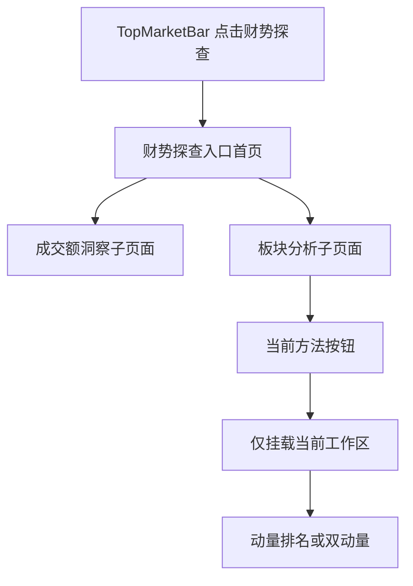
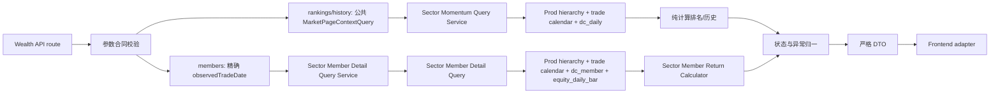

# 财势探查｜板块分析技术实施方案 v1

> - 文档性质：技术实施方案与里程碑对账，不是 LLD。
> - 当前状态：v1.22；横截面动量排名 M0～M3A 已完成，M4 自动化门禁已通过；双动量 M8 真实接口、15 个正式状态、四档宽度和自动化门禁已完成对账，最终用户验收及冷启动 Meta 性能结论仍待确认。
> - 产品事实源：[财势乾坤板块分析产品交互基线文档 v1](./sector-analysis-product-interaction-baseline-v1.md)。
> - Figma 文件：`Goldenshare Web`，file key `RADlZzREU4lPVviYfkLy6x`。
> - 基线日期：2026-08-28。

---

## 0. 结论摘要

本方案把当前已确认的交互拆成四个明确交付范围：

1. 先把现有财势探查单页改成“入口首页 + 独立模块子页面”，并让财势探查真正复用财势乾坤首页的快捷入口组件。
2. 横截面动量排名及三级行业成分明细已经完成；双动量作为第二个独立方法，严格按产品基线 v1.4 和正式 Figma 建设独立路由、独立接口与独立工作区，不与动量排名混合成综合评分。
3. 在三级行业可被选中的两个工作区中，左栏保持总高度不变并拆成上下两个独立滚动区：上部继续展示三级行业榜单，下部展示当前所选三级行业的成分股名称、代码、目标日收盘价和所选统计周期区间涨跌幅。该能力是动量排名的事实明细，不是“成员广度”方法，也不产生新的评分或预测。
4. 相对轮动、成员广度和量价分布继续只保留可点击按钮并提示“待建设”；本版不为它们注册路由、接口、controller 或占位结果页。

既有动量排名直接读取 Prod 已有正式事实：

- `core_serving.trade_calendar`
- `core_serving.wealth_sector_hierarchy`
- `core_serving.dc_daily`
- `core_serving.dc_member`（仅三级行业成分关系）
- `core_serving.equity_daily_bar`（仅成分股目标日收盘价和区间涨跌幅）

双动量只复用其中前三张表，不读取成分股关系或股票行情。不新增数据库表、不新增迁移、不读取 DG/Lake、不依赖 `dc_index`、资金流、Heat、QTF、申万、概念或地域数据。DG 只继续承担既有行业层级发布，Web 查询只读 Prod。

## 1. 目标、依据与边界

### 1.1 实现目标

1. 将 `/wealth/exploration` 调整为纯财势探查入口首页，不再在首页直接加载成交额洞察。
2. 为“成交额洞察”和“板块分析”建立独立、可复制、可刷新和可前进后退恢复的子页面路由。
3. 抽取现有财势乾坤首页 `ShortcutBar / ShortcutCard` 为真正共享的展示组件，保证市场总览视觉无漂移，财势探查只提供自己的入口数据。
4. 建立板块分析稳定页面骨架和方法导航，只挂载当前选中的工作区。
5. 实现行业一级、二级、三级及父级内部的完整涨幅榜、跌幅榜、父子下钻、交易日复盘和 `20/30/60` 日历史趋势。
6. 所有业务日期继续服从公共 `pageContext.tradeDate` 和 20:00 盘后切换约定。
7. 后端提供明确的行业层级、动量排行和历史趋势事实；前端只做展示适配，不自行拼接业务事实或计算排名。
8. 三级行业成分股列表只读取当前页面实际展示的盘后交易日；切换行业、统计周期或榜单方向后独立刷新，不阻塞右侧详情和双趋势图。
9. 双动量使用与动量排名相同的区间收益、比较池、同组强度排名和百分位事实，在此之上只判断“绝对动量是否为正”和“相对动量是否达到阈值”；不新增综合分、权重、预测或信号。
10. 双动量支持五类比较范围、`5/10/20/30` 日观察周期、`70/80/90` 百分位阈值、历史日期复盘、符合条件／全部行业切换、列表与散点图联动及产品基线冻结的全部边界状态。

### 1.2 视觉与交互依据

| 页面或状态 | Figma 节点 | 本方案用途 |
|---|---|---|
| 财势探查入口首页 | `978:545` | 入口首页、两张快捷入口卡、无业务工作区 |
| 成交额洞察子页面 | `978:982` | 既有成交额能力从首页拆出后的独立页面 |
| 板块分析／动量排名默认态 | `965:55` | 一级总榜、1 日、涨幅榜默认工作区 |
| 动量排名／跌幅榜 | `971:352` | 同一容器内的跌幅榜状态 |
| 二级总榜 | `1051:951` | 全部二级行业、所属一级路径及全局／父级双排名摘要 |
| 三级总榜 | `1051:1251` | 左栏上部为全部三级行业榜单，下部为所选三级行业成分股列表；右栏保留全局／父级双排名摘要和双趋势图 |
| 一级内二级 | `987:476` | 一级选择器、直属二级完整榜和详情 |
| 二级内三级 | `987:776` | 一级／二级级联选择器；左栏上部为直属三级完整榜，下部为所选三级行业成分股列表；右栏保留详情与双趋势图 |
| 动量排名／双图悬停 | `1053:5261` | 两图共享日期十字线和联合 Tooltip |
| 动量排名／交易日选择器 | `1062:2` | 全部 SSE 开市日可选；完整、部分缺失、无数据状态可见 |
| Loading | `1036:634` | 保留页面骨架、方法栏和工具栏，正文显示加载骨架 |
| Delayed | `1036:1014` | 保留最近完整交易日内容并明确实际盘后日期 |
| Empty | `1036:1386` | 显式历史无数据或比较池全部不可计算 |
| Error | `1036:1762` | 查询或合同失败后的稳定错误态与重试 |
| 双动量旧草稿 | `967:72` | 已移动至 Archive 并标记 `Frozen / Do Not Implement`，不得作为编码依据 |
| 相对轮动草稿态 | `967:158` | 仅保留后续方法位置，不作为首期数据实现基线 |
| 成员广度草稿态 | `967:244` | 仅保留后续方法位置，不作为首期数据实现基线 |
| 量价分布草稿态 | `967:330` | 仅保留后续方法位置，不作为首期数据实现基线 |

Figma 页面 `14 Wealth Exploration - Sector Analysis`（`965:2`）负责板块分析交互事实。旧板块雷达和原复杂量化研究画板保持冻结，不参与本方案。

双动量正式交互以同一页面中的以下节点为唯一视觉和状态依据；旧草稿节点 `967:72` 不再具备需求效力：

| 双动量正式状态 | Figma 节点 | 技术语义 |
|---|---|---|
| 符合条件默认态 | `1096:1267` | 一级总榜、20 日、80% 阈值、符合条件列表 |
| 全部行业 | `1101:5478` | 同一计算结果切换完整行业列表，不重新定义比较池 |
| 一级内二级 | `1103:1425` | 仅比较所选一级行业直属二级行业 |
| 二级内三级 | `1104:1898` | 仅比较所选二级行业直属三级行业 |
| 二级总榜 | `1105:1583` | 全部二级行业同组比较 |
| 三级总榜 | `1105:1938` | 全部三级行业同组比较 |
| Hover | `1106:1741` | 散点 Hover、列表与图表关联 |
| Partial Data | `1106:2109` | Ready 内容态中的覆盖提示，不是独立页面状态 |
| Loading | `1106:2528` | 稳定页面骨架与加载占位 |
| Delayed | `1106:7209` | 展示上一有效交易日事实及明确日期提示 |
| Empty | `1106:2713` | 比较池不存在可计算事实 |
| Error | `1106:2894` | 合同或查询失败与重试 |
| Small Group | `1107:2216` | 小于 3 个可计算对象时展示事实但不判定是否符合条件 |
| No Qualified | `1115:2295` | 有可计算事实但零个行业符合条件，仍属于 Ready |
| Missing Selected Coordinate | `1115:2571` | 所选行业事实不完整，列表可选但散点不伪造坐标 |

双动量正式工作区已收敛为组件集 `1132:9777` 的 15 个变体，每个工作区实例均为 `1564×1006`；交互说明节点为 `1137:422`。15 张正式页面均为 `1600×1292.390625`。运行时仍必须服从第 4.6 节的连续响应式合同：`1564px` 只是 1600px 视口下的设计基线，不能写成固定页面宽度。

2026-08-27 横截面动量节点树、属性、交互和 1600px 截图对账已通过：12 张正式画板均为 `1600×1292.390625`；一级涨／跌、二级总榜、三级总榜、两类父级榜、双图悬停、交易日覆盖选择器和四个异常态均具备独立开发基线。榜单 viewport 使用纵向滚动；页面壳、工具栏、行、摘要和状态面板使用 Auto Layout；图表、数据条、十字线、Tooltip、日期 Popover 和滚动条叠层保留必要绝对坐标。该阶段四个后续方法按钮均未接草稿；此历史说明不覆盖上表已经正式收口的双动量设计。行业行选择与独立下钻已区分，三级无下钻，`20/30/60` 明确为动量排名两图共用。

2026-08-28 的成分股增量已落到上述两张正式画板：左侧正文继续保持 `776×866`，内部改为上部行业榜单 `776×390`、间距 `12`、下部成分股列表 `776×464`；两个列表各自拥有固定表头和独立纵向滚动 viewport。下部四列固定表达名称、代码、收盘价和区间涨跌幅，不增加操作列；右侧详情仍位于 `x=788` 且保持 `776×866`，没有改变摘要和图表位置。Figma 的四列固定像素宽度只用于 `1600px` 基线验收；运行时必须按第 4.6 节使用共享响应式 Grid，不能把 `752px` 内容宽写死。

| 正式状态 | 左栏新包装节点 | 成分股面板根节点 | 说明 |
|---|---|---|---|
| 三级总榜 `1051:1251` | `1085:1267` | `1085:1268` | 上下双滚动；成员节点树 `1085:1269..1272`、内容节点 `1086:1267..1275` 与 `1087:1268..1307` |
| 二级内三级 `987:776` | `1088:1267` | `1088:1268` | 上下双滚动；成员节点树 `1088:1269..1321` |

设计语义也已逐项核对：一级 31 个对象的排名纵轴完整覆盖 `1..31`；涨幅榜最强示例为 `100.0%`，跌幅榜最弱示例为 `31/31、0.0%`；二级和三级详情同时展示全层级与直属父级排名；代表性 Hover 状态同时显示日期、区间涨跌幅和“第 N 名 / M 个可计算行业”。模块自有正式文本已绑定可精确匹配的本地 Text Style，`System/Warning` 已补 Web syntax `var(--cs-color-warning)` 和正确使用范围；共享组件既有债务不在本期扩改。

### 1.3 本期明确不做

1. 不做转热、续热、转冷、预测、成功率、Lift、信号或综合评分。
2. 不实现相对轮动、成员广度和量价分布的业务计算、真实 API 或正式结果页。
3. 不接入 QTF，不建设参数审批、研究发布或行情信号发布。
4. 不做概念、地域、申万行业或行业体系对比。
5. 不使用 Heat、资金流、新闻、宽基或分钟数据；成分股日行情只用于已批准的三级行业成分事实列表，不扩展为成员广度、选股或预测能力。
6. 不改 `TopMarketBar` 的结构、样式和一级导航。
7. 不在财势探查入口首页预加载、隐藏挂载成交额或板块分析工作区。
8. 不扩展移动端设计；继续使用当前宽桌面基线。
9. 不新增数据库表、迁移、账号、连接、定时任务、缓存服务或第三方前端依赖。
10. 不增加成分股筛选器、搜索、分页控件、勾选、导出、股票详情跳转或更多行情字段；本增量严格保留已确认的四列。
11. 双动量不读取成分股、资金流、Heat、新闻、宽基、分钟行情、概念、地域或申万数据，也不新增历史趋势、详情 API 或成员 API。
12. 双动量不提供预测、转热信号、成功率、参数回测、多个方法勾选组合、综合分或对行情系统的发布流程。

### 1.4 跨模块抽象门禁原则适配

| 原则 | 本模块结论 | 设计落点 | 计划测试 |
|---|---|---|---|
| 事实源单一原则 | 层级、交易日、行业日行情、三级成分关系和股票日行情只由后端 Prod 查询归一 | 第 5、6 节 | 前端无公式、无事实补值；真实 API 字段对账 |
| 契约先行与冻结原则 | 既有四个动量只读 endpoint 已冻结；双动量两个 endpoint 必须先完成 M5 LLD 再编码 | 第 7、12A.5、13 节 | schema 正反例、未知字段拒绝、前后端契约测试 |
| 配置一致性原则 | 本期没有运营配置；各方法的周期、范围、阈值和版本均为产品合同枚举 | 第 6.8、12A.2 节 | 未批准枚举拒绝；仓库不存在第二套常量 |
| 默认行为显式原则 | 动量排名默认一级总榜／1 日／涨幅榜／20 日图表；双动量默认一级总榜／20 日／80%／符合条件 | 第 4.4、6.6、12A.2 节 | 无参数、非法参数、保留选择、父级切换和失效选择测试 |
| 排序与筛选确定性原则 | 比较池、空值、并列和稳定次序全部固定 | 第 6.3、6.5 节 | 同值、缺值、跨父级、完整列表测试 |
| 性能预算前置原则 | 只查询当前工作区；既有历史最重窗口为 60+30 日，双动量单日结果最大使用 30 日观察窗口 | 第 11、12A.9 节 | SQL 数量、payload、P95、未选工作区零请求 |
| 可观测与异常标准化原则 | 只输出用户状态和已登记异常码；debug 不泄露 SQL | 第 9 节 | READY/DELAYED/EMPTY/ERROR 和未登录 401 反例 |
| 测试以用户可见结果为中心原则 | 真实路由字段必须逐项驱动榜单、详情和双趋势图 | 第 12 节 | 后端真实 API + 前端真实 API smoke 双门禁 |

### 1.5 已拍板合同（2026-08-28）

| 编号 | 拍板结论 | 固定理由 |
|---|---|---|
| D01 | 使用目标交易日 `dc_member` 的来源成分全集，不套用 Heat 的“有效 A 股池”过滤 | 这里展示的是来源成分明细；行情缺失不能被误解为股票不是成分股。 |
| D02 | 成分股排序跟随当前“涨幅榜／跌幅榜”：按所选周期涨跌幅降序／升序；空值末尾，同值按股票代码升序 | 上下区域使用同一排行方向，用户不需要重新理解第二套排序。 |
| D03 | 个别股票缺收盘价或历史不足时保留该行，缺失值显示 `--`；接口返回总成员数、收盘价可用数和区间涨跌幅可计算数 | 用户能区分“不是成分股”和“是成分股但数据暂缺”，列表不会因周期变化而静默丢股票。 |
| D04 | 1 日使用来源 `pct_chg(t)`；5/10/20/30 日使用区间内每日 `pct_chg` 连乘 | 避免股票分红、送转和除权使未复权收盘价首尾比产生虚假涨跌，同时不新增数据源。 |
| D05 | 接口一次返回所选三级行业的全部来源成员，由页面内部滚动，不设计分页 | LLD 前先以最小 Prod 聚合审计验证最大成员数、`256KB` payload 和 P95 门禁；若超预算必须停止并重新拍板，不得静默截断。 |

以下交互合同同样已经确认：仅 `三级总榜` 和 `二级内三级` 展示成员列表；只显示四列；左栏总高不变；上下列表独立滚动；不增加股票详情入口。

## 2. 当前代码审计结论

### 2.1 M1 完成后的页面与路由事实

当前代码已经实现四个精确财势探查路由：

```text
/wealth/exploration
/wealth/exploration/turnover-insight
/wealth/exploration/sector-analysis
/wealth/exploration/sector-analysis/momentum-ranking
```

`WealthRouter` 通过有界 route resolver 分别渲染 landing、turnover 和 sector 页面；板块根地址使用 `replace` 并保留 query 后进入动量地址。公共 Shell 只读取页面上下文和主要指数，业务 controller 只由对应子页挂载。

M1 已关闭原先三项页面差异：

1. `/wealth/exploration` 已是零业务预加载的入口首页。
2. 成交额洞察已有独立子页面，继续复用原 API、adapter、controller 和 5 秒超时合同。
3. 板块分析已有独立路由、页面壳、方法栏、M2/M3 动量排名真实工作区及 M3A 成分股第四接口、独立计算和左栏下半区；当前页面已于 2026-08-28 通过用户验收。

### 2.2 当前公共组件事实

1. `TopMarketBar` 已是共享组件，市场总览、详情页和财势探查可以继续直接复用；本期无需复制或改版。
2. `PageBreadcrumb` 已是共享组件，可通过 items 配置三层路径；本期只增加页面级配置，不新增第二套面包屑。
3. `ShortcutBar / ShortcutCard` 已移至 `shared/ui/shortcut-bar`；市场总览六项仍由 `MarketShortcutBar` 持有，财势探查两项由自己的 feature 配置持有。
4. `WealthExplorationShell` 已统一 TopBar、公共上下文、ticker、面包屑、快捷入口、toast 和内容插槽，不读取业务模块。

### 2.3 当前后端能力事实

现有 `/api/v1/wealth/market/sector-overview` 服务于财势乾坤首页板块速览，合同是行业三级 Top5 联动、概念热度和地域排行。它不满足本页需要：

1. 行业列每级最多 5 行，不返回全部行业。
2. 只提供当日排序指标，不提供 `5/10/20/30` 日累计涨跌幅。
3. 不提供全体二级／三级总榜。
4. 不提供当前榜单口径下的 20/30/60 日历史排名。
5. 其 DTO 和状态还绑定首页板块速览的概念、地域、成员、资金流和 Heat 语义。

因此本方案禁止扩写或复用 `sector-overview` DTO 来凑板块分析。板块分析建立独立 `sector_analysis` 模块 API；两者只允许共享无页面语义的行业层级只读查询。

### 2.4 CodeGraph 影响面结论

本轮已用仓库根 CodeGraph 索引核验：

1. `WealthRouter` 通过判别联合解析三个页面和一个 replace 入口；三个页面测试及成交额静态门禁是当前消费者证据。
2. `TopMarketBar` 是公共组件，实际消费者覆盖市场总览、财势探查、股票详情和指数详情；本期不修改其 props 与视觉。
3. 共享 `ShortcutBar` 当前由市场总览和财势探查两类 feature wrapper 消费；页面不持有两套展示实现。
4. `MarketPageContextQuery` 同时被公共 context、股票／指数详情和部分行情查询使用。Pre-M2 已把其内部 1～4 条交易日历查询收敛为 1 条，公开方法、返回结构、20:00 规则和全部消费者语义保持不变。
5. 当前代码已把行业层级查询移到 Biz 公共目录，并更新 `MarketSectorOverviewQueryService` 与 `SectorSelectionResolver` 两个消费者；首页板块速览和架构回归已有证据，M2 三个 API 已完成。
6. `SectorMomentumQueryService` 当前组合 meta、rankings 和 history；成员明细已经由独立 `SectorMemberDetailQueryService` 承担，没有把成员循环塞进 `build_rankings()` 或 `build_history()`。双动量只影响单日排名事实主链，不触碰成员 service。
7. 前端 `useMomentumRankingController` 继续只包含 meta、ranking、history 和独立 member state；双动量已建立独立 Meta／Results controller，两个方法由精确路由按需挂载，没有向既有 controller 追加模式分支。
8. `MomentumRankingWorkspace` 已完成两类三级 scope 的上下双滚动左栏和右侧双趋势详情；双动量使用独立列表＋散点工作区，不复用或改写该 DOM。
9. 首页 `SectorMemberQuery` 的 CodeGraph 消费者仍是 `MarketSectorOverviewQueryService`，语义仍为 Top5 与单日涨跌幅；板块分析完整多周期成员合同没有反向污染首页，本增量继续保持零修改。
10. `test_wealth_sector_analysis_guardrails.py` 当前已把来源精确冻结为 `TradeCalendar/WealthSectorHierarchy/DcDaily/DcMember/EquityDailyBar` 并继续禁止资金、Heat、DG/Lake 与 QTF 依赖；双动量执行链只能使用其中前三类来源，LLD 必须为该更窄边界增加方法级反例，不能因为模块总白名单包含成员表就读取成员事实。

### 2.5 双动量 M6／M7 实现现状与复用边界

本轮再次对当前代码、消费者和测试进行 CodeGraph 影响面核验，得到以下约束：

1. 前端路由已分别识别 `sector-analysis-momentum` 和 `sector-analysis-dual-momentum`；`SectorAnalysisPage` 按显式方法只挂载一个 controller，方法栏仅将相对轮动、成员广度和量价分布保留为“待建设”。双动量使用独立 API、adapter、URL、controller 和工作区，没有在既有动量 controller 中增加模式分支。
2. 后端 `SectorMomentumCalculator` 已经实现区间累计涨跌幅、同组平均并列排名和百分位，是双动量需要复用的客观事实算法。双动量不得复制这些公式，也不得改变其版本和现有动量排名结果。
3. `SectorMomentumQueryService.build_rankings()` 已改为消费页面无关的不可变单日动量事实快照，只负责方向排序、`listPosition` 和旧 DTO；`SectorDualMomentumQueryService` 直接消费同一快照，不调用旧页面 DTO、私有方法或第二次读取事实。
4. 公共 Meta 已收敛为日期、层级和覆盖事实；既有动量 Meta 继续返回 1 日周期、方向和历史范围，双动量 Meta 使用独立 strict DTO，周期只允许 `5/10/20/30`。
5. 双动量不需要 history、members 或详情接口。其列表、摘要和散点图均由同一份当日全量结果产生；“符合条件／全部行业”、选中行业和表头排序是前端展示状态，不得触发额外业务查询。
6. 现有 `SectorAnalysisStatusResolver` 的 `READY/DELAYED/EMPTY/ERROR` 可继续作为页面主状态；`Partial Data`、`No Qualified`、`Small Group` 和 `Missing Selected Coordinate` 必须作为 Ready 内容态的确定性子状态，不能扩写公共主状态枚举。
7. 影响面集中在 `src/biz/**/sector_analysis`、Biz 聚合路由、Wealth 板块分析路由与新双动量 feature，以及对应后端、前端和架构测试；`foundation`、`ops`、`qtf`、DG/Lake、首页板块速览和既有动量成员链路均不在修改范围。

## 3. 目标信息架构与正式路由

### 3.1 路由表

| 页面 | 正式路由 | 当前状态 |
|---|---|---|
| 财势探查入口首页 | `/wealth/exploration` | M1 已实现 |
| 成交额洞察 | `/wealth/exploration/turnover-insight` | M1 已实现 |
| 板块分析默认入口 | `/wealth/exploration/sector-analysis` | `replace` 到动量排名 |
| 横截面动量排名 | `/wealth/exploration/sector-analysis/momentum-ranking` | M3 与 M3A 已完成并通过验收 |
| 双动量 | `/wealth/exploration/sector-analysis/dual-momentum` | M8 技术联调已完成；待用户验收及冷启动 Meta 性能结论确认 |
| 相对轮动 | 暂不注册正式路由 | 按钮保留，点击提示“待建设” |
| 成员广度 | 暂不注册正式路由 | 按钮保留，点击提示“待建设” |
| 量价分布 | 暂不注册正式路由 | 按钮保留，点击提示“待建设” |

双动量完成后，`momentum-ranking` 与 `dual-momentum` 是两个可用且互相独立的方法路由。点击这两个按钮必须切换 URL 并只挂载目标工作区；相对轮动、成员广度和量价分布三个按钮继续通过当前 Design System 的轻量 toast 提示“待建设”，不得改变 URL、创建 controller、请求接口、渲染占位结果页或使用 mock 数据。

### 3.2 面包屑

| 页面 | 面包屑 |
|---|---|
| 入口首页 | 财势乾坤 / 财势探查 |
| 成交额洞察 | 财势乾坤 / 财势探查 / 成交额洞察 |
| 板块分析 | 财势乾坤 / 财势探查 / 板块分析 |

“财势乾坤”返回市场总览，“财势探查”返回入口首页。板块分析方法不增加第四层面包屑，方法状态由页面内按钮栏和 URL 表达。

### 3.3 页面加载边界



1. 入口首页只请求页面公共上下文和 TopMarketBar ticker，不请求成交额或板块数据。
2. 成交额子页面只请求现有成交额洞察接口。
3. 板块分析只请求当前路由方法的数据；动量排名和双动量不得同时挂载 controller、图表或隐藏 DOM。
4. 未选方法不创建 controller、图表实例、网络请求或隐藏 DOM。
5. 点击三个待建设按钮只触发本地 toast，不改变 URL、页面状态或已加载的当前方法事实。

## 4. 前端目标架构

### 4.1 目录落点

```text
wealth/src/
  app/routes/
    WealthRouter.tsx
    routerState.ts
  pages/wealth-exploration/
    WealthExplorationLandingPage.tsx
    TurnoverInsightPage.tsx
    SectorAnalysisPage.tsx
    layout/
      WealthExplorationShell.tsx
      useWealthExplorationShell.ts
  features/wealth-exploration/
    navigation/
      ExplorationShortcutBar.tsx
      explorationNavigation.ts
    turnover-insight/                 # 既有 feature，保持业务合同
    sector-analysis/
      navigation/
        SectorAnalysisMethodBar.tsx
      momentum-ranking/
        api/
        model/
        ui/
  shared/ui/
    shortcut-bar/
      ShortcutBar.tsx
      ShortcutCard.tsx
      shortcut-bar.css
```

目录名在 LLD 中可按当前命名细化，但职责不得变化。

### 4.2 财势探查页面壳

`WealthExplorationShell` 只负责：

1. 复用 `TopMarketBar` 并设置 `activeNav="exploration"`。
2. 读取公共页面上下文并加载 TopMarketBar 主要指数 ticker。
3. 按当前子页面配置 `PageBreadcrumb`。
4. 渲染财势探查两项快捷入口及 active 状态。
5. 提供稳定内容插槽和页面级 toast。

它不读取成交额、板块排行或任何方法数据。业务 controller 只在对应子页面内容区挂载。

### 4.3 快捷入口共享收口

现有市场总览 `ShortcutBar` 拆成两层：

1. `shared/ui/shortcut-bar`：只接收 `items / activeKey / onNavigate`，保留现有内部 DOM、class、尺寸、间距、hover 和 selected 样式；最外层交互节点按 LLD 更正为原生 button，并以 CSS reset 保证零视觉漂移。
2. `features/market-overview/layout/MarketShortcutBar`：继续持有市场总览六个入口的数据与当前 toast 行为。
3. `features/wealth-exploration/navigation/ExplorationShortcutBar`：只持有“成交额洞察 / 板块分析”两项入口。

CSS 从 `market-overview-page.css` 原样移到共享组件 CSS；不得借提取重做首页样式。市场总览是视觉回归基线，提取前后普通元素偏差目标为 `0px`。

### 4.4 动量排名 URL 状态

已建设的方法使用 path，工作区状态使用 query；本节只记录既有动量排名 path 的 URL 合同，双动量使用第 12A.7 节的独立合同：

| query | 允许值 | 默认值 | 说明 |
|---|---|---|---|
| `tradeDate` | `YYYY-MM-DD`、Meta 覆盖区间内 SSE 开市日；允许 COMPLETE/PARTIAL/MISSING | 公共默认日期 | 只有用户历史选日时写入 URL |
| `scope` | `level1/level2/level3/level1-children/level2-children` | `level1` | 五类榜单 |
| `level1Code` | 当前层级存在的一级行业代码 | 当前层级第一项 | 父级榜或下钻状态 |
| `level2Code` | 当前一级直属二级行业代码 | 当前一级第一项 | 二级内三级 |
| `period` | `1/5/10/20/30` | `1` | 累计涨跌幅计算周期 |
| `direction` | `gainers/losers` | `gainers` | 涨幅榜或跌幅榜 |
| `range` | `20/30/60` | `20` | 右侧历史显示范围 |
| `sectorCode` | 当前比较池中的行业代码 | 第一条可计算行业；否则第一项 | 当前详情对象 |

状态规则：

1. 非法枚举、层级闭包错误或不在比较池的代码由后端拒绝；前端不静默猜测另一套口径。
2. 首次进入且 URL 没有合法 `sectorCode` 时，选择榜单第一条可计算行业；没有可计算行业时选择第一项。
3. 切换 `tradeDate/period/direction/range` 后，只要当前 `sectorCode` 仍属于当前比较池，就保留该行业；即使该行业在新日期或周期下不可计算，也不得自动换成别的行业。
4. 切换 `scope` 或父级后，若当前行业仍属于新比较池则继续保留；只有不再属于时，才选择新榜单第一条可计算行业，没有可计算行业时选择第一项。
5. 改变一级行业后，二级行业重置为新一级下 `displayOrder` 第一项；随后按第 4 条验证当前行业是否仍属于新比较池。
6. 行业行选择使用 `replaceState`，避免连续浏览多行污染浏览器返回栈；范围、下钻和方法变化使用 `pushState`。
7. 下钻保留 `tradeDate/period/direction/range`，只替换 scope、父级和必要时失效的选中项。
8. URL 是可恢复状态，组件本地状态不得形成第二套默认值。

### 4.5 动量排名组件边界

```text
SectorAnalysisPage
└── SectorAnalysisMethodBar
    └── MomentumRankingWorkspace
        ├── MomentumControlBar
        ├── MomentumLeftWorkspace
        │   ├── MomentumRankingPanel
        │   │   ├── RankingDirectionSwitch
        │   │   ├── MomentumRankingTable
        │   │   └── MomentumRankingRow
        │   └── SectorMemberPanel（仅选中三级行业时挂载）
        │       ├── SectorMemberTableHeader
        │       └── SectorMemberTableViewport
        └── MomentumDetailPanel
            ├── SelectedSectorSummary
            ├── RollingReturnChart
            └── HistoricalRankChart
```

1. `MomentumRankingTable` 渲染全部返回行，固定表头、内部滚动，不做前端 Top N 截断。
2. 二级、三级行独立显示父级路径；Tooltip 只展示被省略的完整路径。
3. 数据条宽度属于展示几何，由 adapter 根据同一响应的有效最小／最大值计算；业务涨跌幅、同组强度排名和百分位必须来自 API。
4. 两张趋势图始终同时挂载，不使用 Tab 二选一；共用交易日 x 轴、悬停位置和 Tooltip 联动，但使用独立 y 轴。
5. 排名图只绘制稳定的同组强度排名，区间涨跌幅最高始终为第 1 名；y 轴反转，使第一名位于顶部。
6. 区间涨跌幅图标题带当前周期，例如“10 日区间涨跌幅趋势”；排名图标题带当前 scope 或父级范围。
7. 图表没有数据时不创建空 canvas；缺失点保留日期槽并断线，不补零、不前向填充。
8. `LEVEL_3` 和 `LEVEL_2_CHILDREN` 的当前选中对象必为三级行业，左栏使用 Figma 已冻结的上下结构；其他三个 scope 继续使用既有单榜单左栏，不预取或隐藏挂载成分股列表。
9. 成分股列表是独立的子请求和局部状态面。它加载、为空或失败时只影响左栏下半区，不得清空上方行业榜单或右侧详情；行业榜单切换仍可继续操作。
10. 成分股行只展示四个字段，不复用首页只支持 Top5、单日涨跌幅的 `SectorMemberQuery.load_top()`，也不复用其 DTO；首页板块速览行为必须保持不变。

### 4.6 运行时宽度适配

Figma 的 `1600px` 是像素验收基线，不是运行时固定页面宽度。运行时必须服从既有 `PageShell` 和全局内容宽度 Token：

```text
shellOuterWidth = min(max(viewportWidth, 1460), 1840)
contentWidth = shellOuterWidth - 18 * 2
columnWidth = (contentWidth - 12) / 2
```

因此：

1. 在 `1600px` 视口下，内容宽 `1564px`，两列严格为 `776 + 12 + 776`，用于对照 Figma。
2. 在用户截图对应的约 `1512px` 视口下，内容宽 `1476px`，两列自动收缩为 `732 + 12 + 732`，不得产生页面横向裁剪。
3. 在更宽屏幕下，两列随 Shell 等宽扩展，直到现有 `--cs-layout-content-max-width: 1840px`；不得把模块锁死为 `1564px`。
4. 低于现有全局 `--cs-layout-content-min-width: 1460px` 时，继续使用全站统一的最小宽度和页面级横向滚动，不对板块分析单独做 CSS scale 或另造断点。
5. 工具栏、Ready 工作区、Loading/Empty/Error 状态面板使用 `width:100%`；Ready 两列使用 `repeat(2, minmax(0, 1fr))` 和固定 `12px` 列距。
6. 榜单、详情摘要和图表容器使用 `width:100%`。高度合同保持不变：工具栏 `128px`、正文 `866px`、摘要 `112px`、趋势图 `365px`、榜单行 `56px`。
7. SVG 保留 `776×365` 的内部 viewBox 和既有 plot padding，通过实际容器宽度等比例渲染；指针位置继续从实际 `getBoundingClientRect()` 映射到 viewBox，禁止改变数据点、轴或 Tooltip 语义。
8. Selected Summary 的 Identity 以真实文字溢出为判断条件，而不是按浏览器宽度或固定行业名猜测：先用设计稿字号测量行业名和完整层级路径；任一文本溢出时进入 compact（行业名 `17→14px`、路径 `11→9px`、等级标签 `11→10px`）并立即重新测量；仍然溢出时进入 extra-compact（行业名 `12px`、路径 `8px`、等级标签 `9px`）。容器变宽后从设计稿字号重新测量，空间足够时自动恢复。行业等级标签始终禁止换行；不得用固定小字号损失短名称和宽屏可读性，也不得以省略号代替本应容纳的正式行业名。
9. 成分股表头和数据行必须共享同一个 CSS Grid 声明。`1600px` 基线的四列 `240/176/144/192` 只定义比例约 `31.9%/23.4%/19.1%/25.6%`；运行时使用 `minmax(0, 240fr) minmax(0, 176fr) minmax(0, 144fr) minmax(0, 192fr)` 随左栏收缩或扩展。名称列允许单行省略并提供 Tooltip，代码、收盘价和涨跌幅禁止换行且右对齐；不得在 `1512px` 视口继续写死 `752px` 内容宽。

## 5. 数据事实源与字段

### 5.1 来源合同

| Prod 表 | 使用字段 | 用途 |
|---|---|---|
| `core_serving.trade_calendar` | `exchange, trade_date, is_open, pretrade_date` | 公共交易日、历史窗口和历史选择器 |
| `core_serving.wealth_sector_hierarchy` | `sector_code, sector_name, industry_level, parent_sector_code, parent_sector_name, root_sector_code, root_sector_name, hierarchy_path, display_order, baseline_version, published_at` | 当前一级／二级／三级关系、父级选择器、路径和稳定顺序 |
| `core_serving.dc_daily` | `ts_code, trade_date, category, close, pct_change` | 行业 1 日及多日累计涨跌幅 |
| `core_serving.dc_member` | `trade_date, ts_code, con_code, name` | 目标交易日三级行业与成分股的来源关系、股票代码和来源名称 |
| `core_serving.equity_daily_bar` | `ts_code, trade_date, close, pct_chg` | 成分股目标日收盘价、1 日涨跌幅和多日区间涨跌幅 |

固定过滤：

```text
trade_calendar.exchange = 'SSE'
trade_calendar.is_open = true
dc_daily.category = '行业板块'
dc_member.trade_date = rankings.tradingDay.observedTradeDate
dc_member.ts_code = 当前选中的三级行业代码
```

### 5.2 不读取的已有表

`dc_index`、`board_moneyflow_dc`、`wealth_sector_heat_daily`、股票分钟行情和其他股票衍生表不参与本期动量排名。`dc_member` 与 `equity_daily_bar` 的使用范围严格限于三级行业成分股列表，不进入行业排名、百分位、详情摘要或两条历史趋势的计算。

本次代码审计确认：首页 `SectorMemberQuery.load_top()` 只取最多 5 只股票，按单日涨跌幅排序，DTO 也没有收盘价或多周期涨跌幅；直接扩写会改变首页合同并引入错误消费者耦合。因此 M3A 必须在 `sector_analysis` 内建立独立成员查询和 DTO，只共享 Foundation ORM 事实模型，不能修改或兼容扩展首页查询。

### 5.3 层级使用规则

1. 只使用 DG 已发布到 Prod 的当前 DC 行业一级、二级、三级关系，即当前唯一的 `wealth_sector_hierarchy.baseline_version`；产品侧只称“行业分类”，不展示来源品牌或 `DC` 字样。
2. 一级节点必须无父级；二级父级必须是一级；三级父级必须是二级；root 闭包不合法时整个层级接口失败。
3. 历史排名也使用当前发布层级，不尝试重建历史成员有效期。
4. 每个响应返回 `hierarchyVersion`，使结果可解释。
5. 未来重新发布层级版本后，旧日期按新当前层级重新查询可能得到不同比较池；首期不建设历史层级版本表。该限制必须在 LLD 和验收记录中保留。
6. 成分股关系按板块页面实际展示的 `observedTradeDate` 精确读取，不用当前自然日、不按 URL 原始目标日重复推导，也不单独做延迟回退。

### 5.4 DG 边界

DG 继续沿用既有流程发布 `core_serving.wealth_sector_hierarchy`。板块分析 API 不直接连接 DG、不读 Lake 文件、不触发层级发布，也不新建第二份层级或成员副本。成分关系与股票行情只读 Prod 现有表。

### 5.5 已完成的行业事实 Prod DuckDB 覆盖审计

2026-08-27 使用 DuckDB `postgres` 扩展，以现有 Web 只读连接直接附加 Prod；当时的查询只覆盖原 M2 三张白名单表、固定字段和 `2024-01-02..2026-08-26`，没有导出来源行、写库或创建副本。

| 审计项 | 结果 |
|---|---:|
| 当前发布行业池 | 一级 31、二级 128、三级 337，共 496 |
| 行业行情覆盖 | 642 个 SSE 开市日，`2024-01-02..2026-08-26` |
| 当前行业池行情行 | 317,825 |
| 重复业务键／非开市日行 | 0／0 |
| 空、非有限或非正收盘价 | 0 |
| 空或非有限日涨跌幅 | 0 |
| 行情代码不在当前层级 | 14 个代码、7,216 行；不计入当前比较池 |
| 当前行业池单日覆盖缺口 | 20 个开市日、607 个行业日事实 |

20 个缺口日及缺失行业数为：`2024-06-27(1)`、`2024-10-29(1)`、`2024-10-30(1)`、`2024-10-31(1)`、`2024-11-01(1)`、`2025-02-27(1)`、`2025-02-28(1)`、`2025-03-03(1)`、`2025-03-04(1)`、`2025-03-05(1)`、`2025-03-06(1)`、`2025-03-07(1)`、`2025-03-10(1)`、`2025-03-11(1)`、`2025-03-12(1)`、`2025-04-29(1)`、`2025-12-26(1)`、`2026-05-18(97)`、`2026-05-20(484)`、`2026-05-25(9)`。

以 `2026-08-26` 为结束日，对最近 60 个 SSE 开市日、496 个当前行业逐点执行完整 `N+1` 窗口审计：5 日窗口 `29,760/29,760` 可计算；10 日 `29,249/29,760`，4 个结束日受影响；20 日 `24,391/29,760`，14 个结束日受影响；30 日 `19,531/29,760`，24 个结束日受影响。最新结束日 `2026-08-26` 的 5/10/20/30 日窗口均完整，但历史趋势内确实存在缺点。

因此实现不能假设生产历史完整：日期选择器必须暴露覆盖缺口，计算器必须逐行业逐窗口执行完整 `N+1` 门禁。后续若 Prod 补齐缺失事实，接口自然由 `PARTIAL/MISSING` 恢复为 `COMPLETE`，不需要修改产品枚举或前端代码。

### 5.6 M3A 成分事实最小审计结论

2026-08-28 通过现有 Web 只读连接执行有界 Prod 聚合审计；事务只读并设置超时，只检查当前 337 个三级行业、最近 30 个 SSE 开市日和目标日成员/行情覆盖，没有导出来源行、写库或建立副本。

1. 最近 30 个开市日为 `2026-07-17..2026-08-27`；`337×30=10,110` 个三级行业组日均存在成员快照，缺失组日为 0。
2. 单行业成员数最小 1、P50 11、P95 约 55、最大 139；最大 139 行按冻结 DTO 估算约 `13.5KB`，远低于单 endpoint `256KB` 门禁，因此 D05 完整返回、不分页、不截断成立。
3. 目标日共有 5,641 条来源成员、5,547 条目标日行情可用。94 条没有目标日行情，其中 78 条为 B 股代码、3 条为当日停牌、其余 13 条为其他行情缺口；按 D01/D03 全部保留并显示 `--`，不得被错误解释为查询失败或静默过滤。
4. 严格按“任一必要交易日缺行即不可计算”的合同，1/5/10/20/30 日可计算数分别为 `5,547/5,537/5,529/5,508/5,487`。本期不新增停牌表、不把停牌日补零，也不引入第二套收益分支。
5. `dc_member(trade_date, ts_code, con_code)` 与 `equity_daily_bar(ts_code, trade_date)` 未发现重复业务键；目标日成员名称无空白值。ORM 仍允许来源名称为空，因此 DTO 和前端必须保留可空处理。

该审计关闭“完整列表是否超预算”的编码门禁，但没有关闭部署态 Members P95；后者必须在 M3A 实现后按真实 API 验收。来源缺口的修复责任仍属于 Prod/Lake 数据链，板块分析只审计、保留行和展示缺值。

## 6. 动量计算与排名合同

### 6.1 公式版本

首期公式身份固定为：

```text
formulaKey = sector-cross-sectional-momentum
formulaVersion = 1
```

该版本只表达区间累计涨跌幅和横截面排名，不包含权重、标准化、平滑、热度或预测。

### 6.2 区间累计涨跌幅

1 日直接使用来源事实：

```text
returnPct(1, t) = dc_daily.pct_change(t)
```

`N=5/10/20/30` 时，N 个交易日区间包含截至 `t` 的最近 N 个开市日，使用区间前一交易日收盘价作为分母：

```text
returnPct(N, t) = (close(t) / close(t-N) - 1) × 100
```

其中 `t-N` 是 N 日区间开始前的上一开市日，因此一次 N 日计算需要 N+1 个收盘事实。例：计算 5 日累计涨跌幅，需要“前一日收盘 + 最近 5 个交易日收盘”。

缺少分母、期末收盘或任一必要交易日时，该行业该点返回 `null`，不使用日涨跌幅连乘补值，不补零，不借用相邻日期。

### 6.3 五类比较池

| scope | 比较池 |
|---|---|
| `level1` | 当前层级全部一级行业 |
| `level2` | 当前层级全部二级行业，不区分所属一级 |
| `level3` | 当前层级全部三级行业，不区分所属二级 |
| `level1-children` | 指定一级行业的直属二级行业 |
| `level2-children` | 指定二级行业的直属三级行业 |

父级内部榜不包含孙级节点；全体二级／三级榜不按父级分组后再拼接。

### 6.4 涨幅榜和跌幅榜

1. 涨幅榜按 `returnPct desc` 排序。
2. 跌幅榜按 `returnPct asc` 排序。
3. `direction` 只决定列表输出顺序，不参与同组强度排名、百分位、详情摘要或历史趋势计算。
4. 每行返回 `listPosition`，表示该响应列表中的顺序，从 `1` 开始连续编号；它不是可跨方向比较的业务排名。
5. `returnPct=null` 的行业保留在列表末尾，`strengthRank/percentile=null`，页面显示 `--`；缺值行最终按 `sectorCode asc` 稳定输出。
6. 有效值相同的行业使用相同 `strengthRank`；同值行在涨幅榜和跌幅榜中均按 `sectorCode asc` 固定次序。
7. 页面返回当前比较池的全部行业，不使用 limit/TopN。

### 6.5 同组强度排名和百分位

`strengthRank` 是唯一业务排名，始终按 `returnPct desc` 计算：区间涨跌幅最高为第 1 名。并列值使用竞赛排名，例如 `1, 2, 2, 4`。切换涨幅榜或跌幅榜不会改变同一行业的 `strengthRank`。

`percentile` 始终表达“强弱位置”，不因涨跌榜切换改变。对当日同一比较池的 `n` 个可计算行业，先按区间涨跌幅从高到低求并列平均名次 `averageRank`，再计算：

```text
percentile = (n - averageRank) / (n - 1) × 100
```

最强严格为 `100.0`，最弱严格为 `0.0`，并列对象取相同平均位置；`n=1` 时返回 `100.0`，空值对象返回 `null`。DTO 统一四舍五入到 1 位小数。

这样，同一行业在涨幅榜和跌幅榜切换时，`returnPct/strengthRank/percentile` 完全不变，只改变 `listPosition` 和列表顺序。列表首列在产品上称为“榜单序号”；详情摘要和历史图统一称为“同组强度排名”。

### 6.6 默认选择与详情摘要

默认状态固定为：

```text
scope=level1
period=1
direction=gainers
range=20
sectorCode=当前榜单第一条可计算行业；否则第一项
```

详情摘要必须返回：

1. 当前范围的同组强度排名、有效组大小、比较池总大小和同组百分位。
2. 当前区间累计涨跌幅。
3. 二级行业的全体二级强度排名与所属一级内部强度排名。
4. 三级行业的全体三级强度排名与所属二级内部强度排名。
5. 当前 `tradeDate`、`hierarchyVersion` 和 `formulaVersion`。

一级行业不伪造父级内部排名。

### 6.7 历史趋势

1. 显示范围只允许截至 `observedTradeDate` 的最近 `20/30/60` 个 SSE 开市日；不能因为行业日行情缺失而从日期轴删除该日。`observedTradeDate` 是两条历史序列的共同结束日期。
2. 上图每个日期重新按当前 `period` 计算滚动累计涨跌幅。
3. 下图每个日期重新按当前 `scope + parent` 计算同组强度排名；`direction` 不进入历史计算合同。
4. 最大查询边界为 `60` 个显示交易日加最早显示点之前的 `30` 个交易日，共 `90` 个不同交易日；最早一日就是 30 日窗口的分母日，不再额外加第 91 日。
5. 历史不足时返回已有日期；缺失点保留日期并返回 `null`，前端断线。
6. 历史排名的 `calculableCount` 只统计该日可计算对象，同时返回 `totalCount` 表示当前层级比较池总数；不能把缺值对象计入有效排名分母。
7. 两张图按同一组交易日升序返回并同时展示；共享 x 轴和悬停索引，前端 Tooltip 同时显示当日 `returnPct`、`strengthRank/calculableCount` 和缺值状态。

“历史排名”的技术定义是：固定当前请求的 `sectorCode + scope + parent + period`，对显示范围内每个历史交易日逐日重算该行业的滚动累计涨跌幅及其在当日比较池中的同组强度排名。它不是历史行业分类版本，也不是读取预存榜单快照。

示例：`scope=level1-children`、父级为“信息技术”、`period=10`、`sectorCode` 为“软件服务”、`range=20`。查询必须对 20 个显示交易日中的每一天，使用当前发布层级筛出“信息技术”的直属二级行业，按截至该日的 10 日累计涨跌幅从高到低完成强度排名，再输出“软件服务”的当日 `strengthRank/calculableCount/totalCount`。前端把这 20 个名次按交易日升序绘成趋势线。

### 6.8 参数性质

`1/5/10/20/30`、`20/30/60`、五类 scope 和两类 direction 是已批准产品合同，不接入策略配置中心，不新增环境变量或数据库配置。变更这些枚举必须先改产品基线、技术方案、LLD、API schema 和测试。

### 6.9 成分股区间涨跌幅合同

成员行使用页面当前 `period`，不增加第二个周期控件。目标日展示的收盘价始终是 `equity_daily_bar.close(t)`，不得用复权价替代。已确认公式为：

```text
memberReturnPct(1, t) = equity_daily_bar.pct_chg(t)
memberReturnPct(N, t) = (Π[1 + pct_chg(d) / 100] - 1) × 100
N ∈ {5,10,20,30}
其中 d 为截至 t 的最近 N 个 SSE 开市日
```

多日使用来源日涨跌幅连乘，是为了避免股票除权除息造成未复权首尾收盘价失真；它只使用已批准的 `equity_daily_bar.pct_chg`。若区间内任一必要交易日缺行或 `pct_chg` 为空／非有限，区间涨跌幅为 `null`；目标日 `close` 为空／非有限／非正时收盘价为 `null`。该股票仍保留并显示 `--`，不补零、不前向填充、不借用最近有价日，也不在前端计算。LLD 和代码不得保留未获选择的收盘首尾比运行分支。

## 7. 后端 API 方案

### 7.1 API 范围

统一前缀：

```text
/api/v1/wealth/market/sector-analysis
```

| Endpoint | 职责 | 触发时机 |
|---|---|---|
| `GET /meta` | 返回公式身份、允许枚举、当前层级和带覆盖状态的 SSE 开市日 | 进入动量排名时一次 |
| `GET /momentum/rankings` | 返回当前日期、范围、周期、方向的完整榜单 | 日期／范围／父级／周期／方向变化 |
| `GET /momentum/history` | 返回当前行业摘要与两条历史序列 | 日期／范围／父级／周期／显示长度／行业变化；方向变化不触发 |
| `GET /momentum/members` | 返回当前所选三级行业在页面实际展示日期的完整成分股事实 | 仅三级 scope 下，实际展示日期／行业／周期／方向变化 |

四个接口只返回板块分析对象，不返回整页对象。新增 members 接口不复用首页 `sector-overview` DTO，也不改变既有 meta、rankings、history 合同。

### 7.2 Meta 请求与响应

请求：

```http
GET /api/v1/wealth/market/sector-analysis/meta?market=CN_A
```

核心响应：

```json
{
  "formula": {
    "formulaKey": "sector-cross-sectional-momentum",
    "formulaVersion": 1,
    "periods": [1, 5, 10, 20, 30],
    "historyRanges": [20, 30, 60],
    "scopes": ["LEVEL_1", "LEVEL_2", "LEVEL_3", "LEVEL_1_CHILDREN", "LEVEL_2_CHILDREN"],
    "directions": ["GAINERS", "LOSERS"]
  },
  "hierarchy": {
    "hierarchyVersion": "...",
    "publishedAt": "...",
    "nodes": []
  },
  "coverageStartDate": "2024-01-02",
  "coverageEndDate": "2026-08-26",
  "tradeDates": [
    {
      "tradeDate": "2026-08-26",
      "availability": "COMPLETE",
      "expectedSectorCount": 496,
      "validSectorCount": 496
    }
  ]
}
```

`coverageStartDate` 是当前行业池在 `dc_daily(category='行业板块')` 中首次出现可用事实的 SSE 开市日；`coverageEndDate` 是公共 `pageContext.expectedTradeDate` 对应的目标开市日。`tradeDates` 必须返回该闭区间内全部 SSE 开市日，不与已有行业行情日期取交集，也不返回自然日。

`availability` 只描述当日当前层级行业池的来源覆盖，不是页面状态：`COMPLETE` 表示全部存在有效事实，`PARTIAL` 表示至少一个但不足全部，`MISSING` 表示一个都没有。`expectedSectorCount` 必须由当前 hierarchy snapshot 动态取得（本次审计为 496），不得写死；`validSectorCount` 只统计业务键唯一、`close` 有限且大于 0、`pct_change` 有限的当前层级行业。当前层级外的历史代码不进入分子或分母。后续补数后同一日期状态按事实自然更新。

### 7.3 Rankings 请求

```http
GET /api/v1/wealth/market/sector-analysis/momentum/rankings
  ?market=CN_A
  &tradeDate=2026-08-26
  &scope=LEVEL_1_CHILDREN
  &level1Code=BKxxxx.DC
  &period=10
  &direction=GAINERS
```

核心响应字段：

```text
tradingDay.expectedTradeDate
tradingDay.observedTradeDate
tradingDay.expectedAvailability/expectedSectorCount/expectedValidSectorCount
tradingDay.observedAvailability/observedValidSectorCount
pageStatus.status/displayText/asOfTime
ranking.formulaKey/formulaVersion/hierarchyVersion
ranking.scope/period/direction
ranking.parentSelection
ranking.totalCount/calculableCount
ranking.rows[]:
  listPosition
  strengthRank
  sectorCode
  sectorName
  industryLevel
  parentSectorCode
  parentSectorName
  hierarchyPath
  returnPct
  percentile
  canDrillDown
```

### 7.4 History 请求

```http
GET /api/v1/wealth/market/sector-analysis/momentum/history
  ?market=CN_A
  &tradeDate=2026-08-26
  &scope=LEVEL_1_CHILDREN
  &level1Code=BKxxxx.DC
  &period=10
  &historyRange=60
  &sectorCode=BKyyyy.DC
```

核心响应字段：

```text
tradingDay/pageStatus
detail.sectorCode/sectorName/industryLevel/hierarchyPath
detail.returnPct/currentScopeStrengthRank/currentScopeCalculableCount/currentScopeTotalCount/percentile
detail.globalLevelStrengthRank/globalLevelCalculableCount/globalLevelTotalCount
detail.parentStrengthRank/parentCalculableCount/parentTotalCount
detail.scopeTitle
rollingReturns[].tradeDate/returnPct
historicalRanks[].tradeDate/strengthRank/calculableCount/totalCount/percentile
```

### 7.5 请求校验

1. Pydantic DTO `extra="forbid"`；未知参数、重复参数和非法枚举返回 400。
2. `market` 首期只允许 `CN_A`。
3. `tradeDate` 必须为 `YYYY-MM-DD`，位于 Meta 覆盖区间且是 SSE 开市日；`PARTIAL/MISSING` 日期仍是合法选择，不把来源缺失误报为参数错误。显式 `MISSING` 日返回 EMPTY；显式 `PARTIAL` 日继续计算可用行业并保留缺值行。
4. `LEVEL_1_CHILDREN` 必须带合法一级代码，不接受二级代码。
5. `LEVEL_2_CHILDREN` 必须带闭包正确的一级和二级代码。
6. `sectorCode` 必须属于当前比较池；不得静默替换成别的父级行业。
7. 默认请求由服务端返回规范化 selection；非法显式请求严格失败。

### 7.6 Members 请求（合同已确认，待 LLD 冻结编码细节）

```http
GET /api/v1/wealth/market/sector-analysis/momentum/members
  ?market=CN_A
  &tradeDate=2026-08-27
  &hierarchyVersion=dc-industry-v1
  &sectorCode=BKyyyy.DC
  &period=20
  &direction=GAINERS
```

核心响应拟定为：

```text
status/message/exceptionCode
tradeDate
hierarchyVersion
sectorCode/sectorName
period/direction
totalMemberCount/closeAvailableCount/calculableCount
rows[]:
  stockName
  stockCode
  close
  returnPct
```

合同边界：

1. `tradeDate` 必须由前端使用 rankings 的 `tradingDay.observedTradeDate` 传入；members 接口只做显式开市日和来源事实校验，不再次执行 20:00 默认日期选择，避免同一页面出现两个“当前日”。
2. `hierarchyVersion` 为必填参数，必须等于当前 rankings 返回的版本；后端必须与当前唯一发布层级版本核对。版本不一致返回 HTTP 409 `SA_MEMBER_FACT_MISMATCH`，前端废弃当前四类事实并从 meta 开始重新加载，禁止拼接两代层级。
3. `sectorCode` 必须是该 `hierarchyVersion` 中的三级行业。一级、二级、跨层级和未知代码返回 400；接口不接受 scope 或父级参数。
4. `period` 只允许 `1/5/10/20/30`；`direction` 只允许 `GAINERS/LOSERS`，成员列表分别按 `returnPct desc/asc` 排序；空值末尾，同值按 `stockCode asc` 稳定输出。
5. 正常响应返回来源成员全集而不是 TopN，不提供分页参数；第 5.6 节已经证明最大 139 行和约 `13.5KB` 响应满足预算。
6. 行按确定性规则排序后返回，前端不得重新做业务排序或自行计算收益。`rows.length` 必须等于 `totalMemberCount`；`calculableCount` 与 `closeAvailableCount` 均必须位于 `0..totalMemberCount`，但两者互不要求包含，因为目标日 close 与区间 `pct_chg` 完整性是两项独立事实。
7. 有来源成员但全部收益不可计算仍返回局部 READY 和完整 rows；只有来源成员数为零才是局部 EMPTY。部分行情缺失返回完整 rows 和覆盖计数；查询失败只让下半区显示局部 ERROR，不得把已有行业榜单和右侧详情替换为整页错误。
8. `stockName/close/returnPct` 均允许为 null；名称为空显示 `--`，代码使用完整 `ts_code`。API Decimal 保留 Foundation 字段精度，前端收盘价和涨跌幅分别格式化为 2 位小数，不改变原始排序值。
9. DTO 继续 `extra="forbid"`，未知／重复参数拒绝；不增加任意排序字段、limit、offset 或用户自定义公式。

## 8. 后端分层与执行链路

### 8.1 目录落点

```text
src/biz/
  api/wealth/market/
    sector_analysis.py
  queries/wealth/market/
    common/
      sector_hierarchy_query.py
    sector_analysis/
      sector_analysis_meta_query.py
      sector_momentum_query.py
      sector_member_detail_query.py
      sector_member_detail_query_service.py
      sector_momentum_query_service.py
  schemas/wealth/market/
    sector_analysis.py
  services/wealth/market/
    sector_analysis/
      sector_analysis_exception_builder.py
      sector_analysis_status_resolver.py
      sector_momentum_contract.py
      sector_member_detail_contract.py
      sector_member_return_calculator.py
```

### 8.2 公共层级查询当前事实

`SectorHierarchyQuery` 已在 M2 完整迁移到 `queries/wealth/market/common/sector_hierarchy_query.py`，首页 `MarketSectorOverviewQueryService` 与板块分析均使用该公共查询，旧模块实现已经删除且没有兼容 re-export。M3A 只调用现有公共查询并增加 `hierarchyVersion` 精确校验，不重复迁移、不改变层级闭包和首页选择语义。

### 8.2A 成员查询、计算与编排职责

1. `SectorMemberDetailQuery` 只执行集合 IO：校验精确 SSE 开市日、批量加载目标三级行业来源成员、一次批量读取成员代码在最近 N 个开市日的股票日行情；不得在循环中查询数据库。
2. `SectorMemberReturnCalculator` 是无 IO 纯计算器：1 日读取目标日 `pct_chg`，多日严格按每日 `pct_chg` 连乘；处理非有限值、完整窗口、Decimal 取舍、方向排序和稳定 tie-break。
3. `SectorMemberDetailQueryService` 负责层级版本和三级行业校验、交易日窗口、调用 Query/Calculator、覆盖计数、局部状态和 DTO 组装。
4. 现有 `SectorMomentumCalculator` 继续只处理行业首尾收盘价公式，不得复用为成员收益计算器；首页 `SectorMemberQuery.load_top()` 继续保持 Top5/单日口径，不得修改或扩展 DTO。

### 8.3 请求链路



API 不访问 Ops、TaskRun、DG 或 QTF。`src/biz` 继续只依赖 `src.foundation` 和自身，`src.app` 只增加路由装配。

## 9. 日期、状态与异常

### 9.1 公共日期语义

1. 前端先调用公共 `/api/v1/wealth/market/context`。
2. URL 没有 `tradeDate` 时，公共 context 和板块 API 都使用默认模式：20:00 前是上一交易日；20:00 后目标是当日。
3. URL 有 `tradeDate` 时，视为历史复盘，meta/rankings/history 沿用同一页面日期语义；members 始终使用 rankings 已确认的 `observedTradeDate`，不直接信任浏览器本地时间。
4. 默认模式下当天行业日行情未达到 `COMPLETE`，板块 API 返回最近一个 `COMPLETE` 交易日和 `DELAYED`；页面显示“当前展示 YYYY-MM-DD 盘后数据”。
5. 显式历史日期没有行业日行情时不得退到更早日期，返回 `EMPTY`。
6. 前端不得读取本机时钟推导业务日；本机时钟只保留 Breadcrumb 已有的当前时间显示。

默认请求不附 `tradeDate` 不是另算日期，而是保留公共接口已经存在的“默认日期可延迟回退”与“显式历史日期严格命中”的区别。最终响应必须校验 `expectedTradeDate/observedTradeDate` 与页面上下文一致。

### 9.2 Pre-M2 公共日期查询单语句化

状态：`PASS (2026-08-27)`。

改造前 `MarketPageContextQuery.resolve_context()` 的默认交易日模式会分步查询“最近开市日、今天是否开市、上一开市日和最终日期记录”，最坏执行 4 条 SQL。该查询有 9 个直接调用入口，不能为了板块分析复制另一套 20:00 日期算法，也不能让 Meta 信任前端传入的业务日期。

Pre-M2 将其内部数据库访问收敛为一条只读 SQL，方案如下：

1. Python 端只生成一次 `Asia/Shanghai` 的 `localNow`，把 `localDate`、是否已到 20:00 和可选 `requestedTradeDate` 作为绑定参数；禁止使用数据库会话时区推导当前日期。
2. 同一 SQL 使用标量子查询或 CTE 取得：截至 `localDate` 的最近 SSE 开市日、今天的日历记录、今天之前最近的 SSE 开市日、显式日期的日历记录，以及最终业务日期之前最近的 SSE 开市日。
3. 显式模式始终以 `requestedTradeDate` 为 `resolvedTradeDate`；存在日历记录时直接读取其 `is_open/pretrade_date`，不存在时 `isTradingDay=false`，`prevTradeDate` 取该日期之前最近的 SSE 开市日。
4. 默认模式在“今天是 SSE 开市日、当前时间早于 20:00 且今天之前存在开市日”时使用查询得到的最近前一开市日；其余情况使用截至今天最近的 SSE 开市日。若没有任何开市日，继续使用 `localDate`，不得凭空生成交易日。该规则保持当前 `max(open trade_date < localDate)` 语义，不改为信任 `today.pretrade_date`。
5. 最终 SQL 一次返回 `resolvedTradeDate/isTradingDay/prevTradeDate` 所需事实；`sessionStatus/generatedAt/source` 继续在 Python 中按现有规则组装。
6. 保持 `MarketPageContextQuery.resolve_context(session, market, requested_trade_date)` 方法签名、`MarketPageContext` 字段和所有消费者不变；不新增缓存、配置、数据库对象或兼容分支。

验收已使用 SQLAlchemy event counter 证明每次合法 `resolve_context()` 恰好 1 条 SQL，并覆盖：交易日 19:59、20:00、周末／节假日、显式开市日、显式休市日、显式日期无日历记录、无任何开市日以及不支持市场。不支持市场在发 SQL 前拒绝。公共 context、个股详情、指数详情／K 线／权重、成交额洞察、个股九转和指数九转已完成回归。

完成 Pre-M2 后，板块分析查询预算统一为：Meta 最多 3 条，Rankings 最多 5 条，History 最多 5 条。不得为了把 Meta 压到 2 条而合并行业层级和日期覆盖职责。

### 9.3 状态机

| 状态 | 条件 | 页面行为 |
|---|---|---|
| `LOADING` | 前端请求进行中 | 稳定工作区 skeleton，保留外壳和控件位置 |
| `READY` | 显式目标日有至少一个可计算行业，或默认目标日来源完整 | 展示完整比较池；缺值行显示 `--`，日期为 PARTIAL 时明确缺失数量 |
| `DELAYED` | 默认目标日来源不是 COMPLETE，返回较早完整盘后日 | 展示旧数据并明确日期提示 |
| `EMPTY` | 显式日无数据，或比较池无任何可计算事实 | 稳定空态，不展示旧数据 |
| `ERROR` | 查询、层级或合同失败 | 稳定错误态和重试，不用 mock 兜底 |

本期不新增 `PARTIAL` 页面状态。`PARTIAL` 只存在于 Meta 的交易日覆盖标记；用户显式进入该日时页面仍使用 READY 骨架，完整行业行仍返回，`validSectorCount/expectedSectorCount` 与 `calculableCount/totalCount` 共同使来源和计算覆盖可观测。只有完全不可计算时进入 EMPTY。

成员列表使用局部状态，不扩展整页状态机：

| 成员局部状态 | 条件 | 只影响的区域 |
|---|---|---|
| `LOADING` | 切换三级行业、统计周期或方向后请求中 | 下半区显示固定表头和加载骨架；上榜单与右详情保留 |
| `READY` | 有来源成员；允许全部或部分行情字段为 null | 下半区展示完整成员行、覆盖计数和 `--` 缺值；即使 `calculableCount=0` 也不改成 EMPTY |
| `EMPTY` | 目标日该三级行业没有来源成员 | 下半区显示“暂无成分股数据” |
| `ERROR` | 成员查询或合同失败 | 下半区显示失败与重试，不清空其他区域 |

### 9.4 异常码规划

编码前必须先在异常码注册表登记：

| 异常码 | 含义 | 用户状态 |
|---|---|---|
| `SA_SOURCE_DELAYED` | 默认目标日行业行情尚未发布 | DELAYED |
| `SA_SOURCE_EMPTY` | 显式日期或比较池无可计算行情 | EMPTY |
| `SA_HIERARCHY_UNAVAILABLE` | 当前层级为空、多版本或闭包非法 | ERROR |
| `SA_SCOPE_INVALID` | scope 与父级参数不匹配 | 400 |
| `SA_SELECTION_INVALID` | 行业不属于当前比较池 | 400 |
| `SA_MEMBER_FACT_MISMATCH` | members 请求的层级版本与当前发布版本不一致 | HTTP 409；废弃当前事实并从 meta 重新加载 |
| `SA_MEMBER_SOURCE_EMPTY` | 目标日所选三级行业没有来源成员 | 成员局部 EMPTY |
| `SA_MEMBER_QUERY_FAILED` | 成分关系或股票日行情查询失败 | 成员局部 ERROR |
| `SA_QUERY_FAILED` | 查询或计算失败 | ERROR |

`debugInfo` 仅在现有 debug 机制显式开启时返回有界计数、日期和样本代码；不得返回 SQL、连接信息、堆栈或数据源凭据。

## 10. 前端请求与交互时序

### 10.1 首次进入

1. 加载公共 page context 和 TopMarketBar ticker。
2. 加载 sector-analysis meta。
3. 以 URL 或默认值请求 rankings。
4. rankings 成功后确认 URL 选中项；没有合法选中项时选择第一条可计算行，没有可计算行时选择第一行。
5. 只为当前选中项请求 history。
6. 若当前选中项是三级行业，同时以 rankings 返回的 `observedTradeDate` 请求 members；history 与 members 彼此独立，不串行等待。
7. 使用请求序号或 AbortController 丢弃过期响应，防止快速切换造成旧数据覆盖新状态。

### 10.2 父级选择与下钻

1. 一级内二级只展示一个一级选择器。
2. 二级内三级展示一级和二级级联选择器。
3. 改一级时从 meta 层级按 `displayOrder, sectorCode` 选新一级下第一项二级。
4. 行内下钻箭头只负责切换 scope 和父级；点击普通行只改变 `sectorCode`。
5. 三级行业不渲染下钻按钮，也不能通过键盘触发不存在的下钻。

### 10.3 选择保持与双图联动

1. `tradeDate/period/direction/range` 变化后先检查当前 `sectorCode` 是否仍属于响应比较池；属于则保留，不因榜单重新排序或当前值缺失而替换。
2. `scope` 或父级变化后，只有当前行业退出新比较池时才按第 10.1 节选择新行业。
3. `direction` 变化只重新获取或重排 rankings；当前行业的 history query key 不包含 direction，不重新计算另一套历史名次。
4. `range` 变化只改变历史显示长度；`period` 或 `tradeDate` 变化会重算两条历史序列，但仍保持当前行业。
5. 两张图共用交易日索引。任一图 hover/focus 时，另一张图同步定位同一日期；历史排名 Tooltip 显示 `strengthRank / calculableCount`，并可同时说明 `totalCount`。

### 10.4 成分股列表联动

1. 只有当前 scope 为 `LEVEL_3` 或 `LEVEL_2_CHILDREN` 且选中项确认为三级行业时创建 members 请求；切换到其他 scope 后立即取消旧请求并卸载下半区。
2. 请求 key 固定包含 `observedTradeDate + hierarchyVersion + sectorCode + period + direction`。`range` 只控制右侧图表，不触发 members 请求。
3. 切换三级行业时，上方行业选中态和右侧详情按既有规则更新，下方列表显示局部 Loading；旧行业返回结果不得覆盖新选择。
4. members EMPTY/ERROR 不改变整页 READY/DELAYED，也不触发 sectorCode 自动切换；用户仍可选择另一个三级行业或调整周期。
5. 列表 viewport 自身滚动，表头固定；切换行业、日期、周期或方向后滚动位置重置到顶部，不把上一行业的滚动位置带入新结果。
6. members 响应必须逐项匹配请求的 `tradeDate/hierarchyVersion/sectorCode/period/direction`。普通旧响应只丢弃；`SA_MEMBER_FACT_MISMATCH` 表示服务器层级版本已变化，必须清空 meta/rankings/history/members 的短期状态并从 meta 重载。

### 10.5 可访问性

1. 方法、范围、周期、方向使用真实 button/tab 语义和唯一 active 状态。
2. 排名行可用键盘选择；下钻按钮有独立 label，不能把整行点击与下钻混淆。
3. 图表提供可读标题、当前行业、范围、日期和关键值；颜色不是唯一涨跌表达。
4. Tooltip 支持 hover 和键盘 focus，长路径只在真实溢出时出现。
5. 成分股列表使用真实表格语义；数值列携带清晰列名，`--` 的辅助文本说明为“该日期或周期数据不足”，不把颜色作为唯一涨跌表达。

## 11. 性能与缓存

### 11.1 查询边界

1. Meta 只读当前 496 级别的层级事实和已发布日期列表，不做行情计算。
2. Rankings 只查询一个 scope、一个目标日和最多 30 日预热。
3. History 只查询一个选中行业的收益序列，同时查询该 scope 最多 `60+30=90` 个不同交易日的排名所需事实。
4. Members 只查询一个当前选中的三级行业、一个精确展示日和最多 30 个 SSE 开市日；一次取得该行业全部来源成员，再以成员代码集合批量读取股票日行情，禁止逐股票发 SQL。
5. 不逐行业或逐股票发 SQL，不在 Python 循环中回查数据库；使用有界集合查询和窗口／分组计算。
6. 数据库返回后可以做确定性的纯内存排序和 DTO 组装，但不得把全表拉到前端计算。

### 11.2 首期预算

| 项目 | 编码门禁目标 |
|---|---:|
| Meta P95 | `<= 300ms` |
| Rankings P95 | `<= 500ms` |
| History P95 | `<= 700ms` |
| Members P95 | `<= 500ms` |
| 首次工作区可用 | `<= 1.5s`（不含网络环境异常） |
| 单 endpoint payload | `<= 256KB` |
| 同一交互重复请求 | `1` 次有效请求；旧请求必须取消或丢弃 |

后端正常路径 SQL 数量门禁冻结为：Meta `<=3`、Rankings `<=5`、History `<=5`、Members `<=4`。前三者包含 Pre-M2 收敛后的 1 条公共日期查询；Members 的四条上限分别覆盖当前层级快照、精确 SSE 开市日及窗口、目标行业成员集合、成员代码集合的批量日行情，不重复调用公共日期解析。查询数不得随行业数、股票数、历史日期数或空值行数线性增长。

M2 已完成 Prod 只读 EXPLAIN 和纯应用计算基准：最重 History 查询的数据库服务端执行约 `116.8ms`，同规模完整 service DTO 与 JSON 组装 P95 为 `99.721ms`，现有索引足以支持本期查询，不需要新增索引或迁移。跨公网逐条调用的本地诊断值包含 5 次网络往返，不能冒充部署拓扑下的 API P95；因此 Meta/Rankings 已完成候选链路预算验证，History 的“数据库执行 + 应用计算”分段预算已通过，最终部署态端到端 P95 仍在 M4 验收。

### 11.3 缓存

1. 首期不新增 Redis 或服务端结果表。
2. Meta 可在单页生命周期内按 `hierarchyVersion` 复用。
3. Rankings/history/members 以各自的完整规范化 query key 做前端短生命周期内存复用。Rankings 在交易日、层级版本、范围、父级、周期或方向变化时失效；history 不包含方向，只在交易日、层级版本、范围、父级、周期、显示长度或行业变化时失效；members 不包含显示长度，只在实际展示日、层级版本、行业、周期或方向变化时失效。
4. 不把缓存结果当作数据事实；API 返回的 `observedTradeDate/hierarchyVersion/formulaVersion` 必须随结果保留。

## 12. 安全、测试与验收

### 12.1 安全边界

1. 四个 endpoint 复用现有 `require_quote_access`，不新增角色或权限模型；当前公共合同只在启用行情登录门禁且用户未登录时返回 401，本需求不虚构不存在的 403 权限路径。
2. 所有查询使用现有 `DATABASE_URL` 业务连接，只读 Prod 正式表。
3. 不提供 SQL、公式表达式执行、任意排序字段、任意表名或任意窗口输入。
4. 前端不展示 `DC`、数据源品牌名、表名或技术异常详情。

### 12.2 后端正反例

必须覆盖：

1. 五类比较池的对象集合完全正确，父子闭包正确。
2. 1/5/10/20/30 日公式及 N+1 日边界。
3. Meta 返回覆盖区间内全部 SSE 开市日及 `COMPLETE/PARTIAL/MISSING`；缺口日不被过滤，层级外历史代码不进入覆盖计数。
4. 涨幅／跌幅排序、`listPosition`、方向无关的 `strengthRank`、并列排名、稳定次序、null 末尾和完整列表。
5. 二级／三级全局排名和父级内部排名同时正确。
6. 历史 `20/30/60` 日、预热、缺点断线、无补值、方向无关强度排名和逐日可计算分母。
7. 默认 20:00 日期、默认不完整日回退、显式完整／部分缺失／整日缺失严格命中。
8. 非交易日、非法日期、非法 scope、错层父级、跨父级行业和未知参数拒绝。
9. 层级为空、多版本、错误 parent/root 闭包进入 ERROR。
10. Meta、rankings、history 真实路由返回前端核心字段，不 mock service/query。
11. Members 只接受三级行业和精确展示日；1 日来源涨跌幅、5/10/20/30 日涨跌幅连乘及其完整窗口、来源成员全集、方向排序、null 保留、覆盖计数、局部 EMPTY/ERROR 和严格参数均有正反例。
12. Members 批量读取股票行情，不出现逐股票 SQL；未来日期或其他行业成员变化不影响当前请求结果。
13. 现有 `/sector-overview` 的 Top5 成员查询、DTO、排序和响应在 M3A 后零回退。

### 12.3 前端正反例

必须覆盖：

1. `/wealth/exploration` 只显示两个入口，不请求成交额和板块 API。
2. 两个入口与子页面快捷切换、active 和面包屑正确。
3. 市场总览共享 Shortcut 提取前后 DOM 和视觉无漂移。
4. 默认一级总榜／1 日／涨幅榜／20 日／首条可计算行业选中。
5. 五 scope、两个方向、五周期、三个图表范围和历史日期恢复。
6. 一级内二级、二级内三级级联重置和行内下钻保留状态。
7. 全列表内部滚动、固定表头、长路径 Tooltip 和 `--` 缺值。
8. 两张图同时显示、共享 x 轴与悬停日期、独立 y 轴、强度排名第一位于顶部、缺点断线。
9. 切换日期、周期、方向或显示范围时保留仍在比较池内的当前行业；只有 scope 或父级使其失效时才重置。
10. 涨幅榜／跌幅榜切换只改变列表顺序和 `listPosition`，不改变 `strengthRank/percentile`，也不重新请求另一套 history。
11. 快速切换时旧请求不能覆盖新状态；动量排名与双动量通过正式路由切换且仅挂载当前工作区，另外三个待建设按钮只显示 toast、零业务请求、零图表实例。
12. READY/DELAYED/EMPTY/ERROR 和重试全部由真实 API 响应驱动，不回退 mock。
13. 只有两个三级 scope 渲染 `390 + 12 + 464` 左栏；其他 scope 保持既有单榜单，不发送 members 请求。
14. 成员列表四列、固定表头、完整内部滚动、切换选择回顶、长名称不挤压数值列，并按第 1.5 节已拍板合同展示。
15. 成员局部 Loading/Empty/Error 不遮蔽上方行业榜单或右侧详情；快速切换行业、周期和方向时旧成员响应不得覆盖当前选择。

### 12.4 核心测试 case

后端真实 API 核心字段：

```text
expectedTradeDate / observedTradeDate / status
formulaVersion / hierarchyVersion
scope / period / direction / parentSelection
listPosition / strengthRank / sectorCode / sectorName / industryLevel / hierarchyPath
returnPct / percentile / canDrillDown
currentScopeStrengthRank / globalLevelStrengthRank / parentStrengthRank
rollingReturns / historicalRanks
member tradeDate / hierarchyVersion / sectorCode / period / direction
totalMemberCount / closeAvailableCount / calculableCount
stockName / stockCode / close / member returnPct
```

前端真实展示必须逐项断言：页面日期提示、范围标题、榜单方向、榜单序号、同组强度排名、行业名称、所属路径、涨跌幅、百分位、详情双排名、同步展示的两条历史序列、成分股四列和各自局部状态文案。

### 12.5 Figma 验收

1. 1600px 宽桌面基线逐状态截图对照上述 12 个 Figma 正式节点。
2. `TopMarketBar`、面包屑和市场总览快捷入口不发生视觉漂移。
3. 一级总榜涨／跌、二级总榜、三级总榜、一级内二级、二级内三级、双图 Hover 和交易日选择器分别验收，不用一个默认截图代替。
4. 普通 UI 偏差不超过 2px；无新增换行、裁剪、重叠或溢出。
5. 榜单真实长数据必须验证固定表头和内部滚动；不能只用短 fixture 验收。
6. 额外执行运行时宽度验收：`1600px` 必须精确命中 Figma 尺寸；`1512px` 必须等宽收缩且无横向裁剪；`1460px` 内容最小宽度必须无内部重叠；`1366px` 只允许由全局最小宽度产生页面级横向滚动，不允许模块自身再固定为 `1564px`。
7. 三级总榜 `1051:1251` 与二级内三级 `987:776` 必须单独验收：左栏总高仍为 `866px`，上榜单 `390px`、间距 `12px`、下成员列表 `464px`，两个 viewport 独立滚动；右栏位置、尺寸、摘要和图表相对增量修改前不漂移。
8. 成分股真实长数据必须验证四列表头与行严格对齐，长股票名不能挤压代码和数值列；空值、正负值和最大成员数样本均不得造成换行、裁剪、重叠或横向溢出。

## 12A. 双动量增量技术方案

### 12A.1 目标合同

双动量是“描述当前状态”的独立研究方法，不是预测模型。页面针对同一行业、同一交易日和同一观察周期，同时展示两项客观事实：

1. 绝对动量：该行业所选周期的区间涨跌幅是否严格大于 `0`。
2. 相对动量：该行业在当前比较池内的同组强度百分位是否达到所选阈值。

只有两项同时满足，`qualificationStatus` 才能是 `QUALIFIED`。两个条件不设权重，不相互抵消，不合成为综合分。页面不得出现“信号触发”“未来继续上涨”“成功率”或买卖建议等预测表述。

本增量只增加双动量，不改变已经验收的横截面动量排名公式、API、页面和成分股明细。相对轮动、成员广度和量价分布继续保持待建设。

### 12A.2 参数、比较池与默认值

| 参数 | 允许值 | 默认值 | 技术规则 |
|---|---|---|---|
| `scope` | `LEVEL_1/LEVEL_2/LEVEL_3/LEVEL_1_CHILDREN/LEVEL_2_CHILDREN` | `LEVEL_1` | 完全复用动量排名的当前发布行业层级和比较池解析规则 |
| `level1Code` | 当前层级中的一级行业代码 | 无 | 只在两个父级内范围按既有规则要求或保留 |
| `level2Code` | 所选一级行业直属二级行业代码 | 无 | 只在 `LEVEL_2_CHILDREN` 必填；闭包非法直接拒绝 |
| `tradeDate` | SSE 已开市历史日期 | 公共 `pageContext.tradeDate` | 不自行使用浏览器当天或另一套时间戳 |
| `period` | `5/10/20/30` | `20` | 绝对和相对动量使用同一周期；明确拒绝 `1` |
| `leadingThreshold` | `70/80/90` | `80` | 判定为 `percentile >= leadingThreshold` |
| `resultView` | `QUALIFIED/ALL` | `QUALIFIED` | 纯前端列表视图，不改变比较池和散点数据，不触发请求 |
| `sectorCode` | 当前比较池中的行业代码 | 见选择规则 | 纯选择状态，不改变结果计算 |

所有行业继续使用当前 `SW2021` 之外的既有东财行业层级事实；页面和 API 不出现“东财”或 `DC` 品牌字样。比较池、父子闭包、并列排名和百分位语义只允许复用第 6 节现有公式，不新建第二套行业池。

### 12A.3 公式与分类状态

底层事实版本保持：

```text
basisFormulaKey = sector-cross-sectional-momentum
basisFormulaVersion = 1
```

双动量分类公式单独注册为：

```text
formulaKey = sector-dual-momentum
formulaVersion = 1
minimumGroupSize = 3
```

对每个行业按以下顺序计算：

1. 复用 `SectorMomentumCalculator` 计算所选周期的 `returnPct`、`strengthRank` 和 `percentile`；完整 `N+1` 交易日、缺口传播、并列平均名次和稳定排序语义不变。
2. `returnPct > 0` 为 `absoluteStatus=POSITIVE`；`returnPct <= 0` 为 `NOT_POSITIVE`；缺失为 `UNAVAILABLE`。恰好 `0%` 不算上涨。
3. 当前比较池至少有 3 个可计算行业时，`percentile >= leadingThreshold` 为 `relativeStatus=LEADING`，否则为 `NOT_LEADING`。
4. 当前比较池少于 3 个可计算行业时，仍返回客观排名、百分位和可绘制坐标，但所有可计算行业均为 `relativeStatus=SAMPLE_INSUFFICIENT`，不得判定领先。
5. 只有 `absoluteStatus=POSITIVE` 且 `relativeStatus=LEADING` 时，`qualificationStatus=QUALIFIED`；其他具有完整且样本充分事实的组合为 `NOT_QUALIFIED`；缺数据或样本不足为 `NOT_EVALUATED`。
6. 只要 `returnPct` 和 `percentile` 均存在，`coordinateStatus=PLOTTABLE`；缺少任一坐标时为 `UNAVAILABLE`，前端不得补零或伪造点位。

为避免前端根据文案或颜色重新推导业务结论，后端逐行返回三类机器状态和一个展示状态：

| 字段 | 枚举 |
|---|---|
| `absoluteStatus` | `POSITIVE / NOT_POSITIVE / UNAVAILABLE` |
| `relativeStatus` | `LEADING / NOT_LEADING / SAMPLE_INSUFFICIENT / UNAVAILABLE` |
| `qualificationStatus` | `QUALIFIED / NOT_QUALIFIED / NOT_EVALUATED` |
| `coordinateStatus` | `PLOTTABLE / UNAVAILABLE` |
| `displayStatus` | `QUALIFIED / UP_NOT_LEADING / NOT_UP_LEADING / NOT_UP_NOT_LEADING / SAMPLE_INSUFFICIENT / DATA_INSUFFICIENT` |

`displayStatus` 只是上述事实的后端稳定映射，不是新的分数。接口还必须满足以下不变量：

```text
totalCount = 当前比较池的全部行业数
calculableCount = returnPct 与 percentile 均可计算的行业数
qualifiedCount = qualificationStatus == QUALIFIED 的行业数
insufficientCount = qualificationStatus == NOT_EVALUATED 的行业数
plottableCount = coordinateStatus == PLOTTABLE 的行业数
0 <= qualifiedCount <= calculableCount <= totalCount
0 <= plottableCount <= totalCount
```

小组样本不足时，`qualifiedCount` 固定为 `0`，但 `calculableCount` 和 `plottableCount` 仍按客观事实统计。缺数据行业不能从 `totalCount` 中静默删除。

### 12A.4 后端复用结构

为复用已验证事实且不让两个页面合同互相污染，目标结构为：

```text
SectorAnalysisMetaQueryService
  ├── Momentum Meta mapper（保持现有响应不变）
  └── Dual Momentum Meta mapper（方法专属公式与参数）

SectorMomentumSnapshotQueryService
  ├── MarketPageContextQuery
  ├── SectorHierarchyQuery / resolve_scope_pool
  ├── SectorMomentumQuery
  └── SectorMomentumCalculator
          ↓ immutable single-date snapshot
      ├── SectorMomentumQueryService.build_rankings()（现有 DTO 映射）
      └── SectorDualMomentumQueryService
              └── SectorDualMomentumClassifier（纯分类）
```

实施约束：

1. `SectorMomentumSnapshotQueryService` 返回页面无关、不可变的单日事实快照，至少包含公共日期、层级版本、比较池、父级选择、周期、全量行业身份、收益／排名／百分位和覆盖计数。
2. 现有 `build_rankings()` 改为消费快照并映射原 DTO；其公开响应、排序、SQL 上限和全部既有测试必须零变化。
3. `SectorDualMomentumQueryService` 消费同一快照和纯 `SectorDualMomentumClassifier`，不得调用动量排名 HTTP DTO、不得调用另一个 service 的私有方法、不得复制区间收益或百分位公式。
4. Meta 的公共日期、层级和覆盖查询可抽为页面无关服务；现有动量 Meta 响应仍保持原字段，双动量 Meta 只返回本方法所需合同，禁止把动量排名的 `directions/historyRanges/period=1` 暴露给双动量。
5. 不新增 ORM 模型、数据库表、迁移、物化结果、缓存服务或后台任务；每次查询仍直接只读 Prod 当前事实。
6. 新实现只落 `src/biz/**` 和 `wealth/src/**`，由 `src.app` 组合路由；不得产生 `foundation|ops|biz -> qtf` 依赖。

计划新增或调整的后端文件边界：

```text
src/biz/queries/wealth/market/sector_analysis/
  sector_analysis_meta_query_service.py
  sector_momentum_snapshot_query_service.py
  sector_dual_momentum_query_service.py

src/biz/services/wealth/market/sector_analysis/
  sector_dual_momentum_contract.py
  sector_dual_momentum_classifier.py

src/biz/schemas/wealth/market/
  sector_dual_momentum.py

src/biz/api/wealth/market/
  sector_analysis.py                     # 只增加双动量路由
```

最终文件名和拆分可在 LLD 根据当前模块命名再次核定，但上述职责边界不可合并回通用大 service。

### 12A.5 API 合同

新增两个只读 endpoint：

```text
GET /api/v1/wealth/market/sector-analysis/dual-momentum/meta
GET /api/v1/wealth/market/sector-analysis/dual-momentum/results
```

两者继续要求现有 Web 登录态，不新增角色或权限。请求和响应使用 camelCase 且 `extra="forbid"`；不得返回 SQL、连接、表名、堆栈或技术 payload。

#### Meta

请求只接受：

```text
market
```

响应至少包含：

```text
status / tradingDay / pageStatus / message / exceptionCode / debugInfo
hierarchyVersion / hierarchy / coverage
formulaKey / formulaVersion
basisFormulaKey / basisFormulaVersion
periods = [5, 10, 20, 30]
leadingThresholds = [70, 80, 90]
minimumGroupSize = 3
scopes = [LEVEL_1, LEVEL_2, LEVEL_3, LEVEL_1_CHILDREN, LEVEL_2_CHILDREN]
defaults = {scope: LEVEL_1, period: 20, leadingThreshold: 80, resultView: QUALIFIED}
```

Meta 继续遵守公共日期查询单语句化后的最多 3 条 SQL 预算：公共日期 1 条、当前发布层级 1 条、行情覆盖 1 条。

#### Results

请求只接受：

```text
market
tradeDate
scope
level1Code?
level2Code?
period
leadingThreshold
hierarchyVersion
debug?
```

`resultView`、`sectorCode` 和列表排序不进入请求：它们不改变业务事实，只由前端对返回的全量行做可逆展示。`hierarchyVersion` 必须与当前唯一发布版本一致；不一致返回 HTTP 409 `SA_FACT_VERSION_MISMATCH`，前端废弃旧 Meta 和 Results 后从 Meta 重新加载，禁止拼接两个层级版本。

响应至少包含：

```text
status / tradingDay / pageStatus / message / exceptionCode / debugInfo
formulaKey / formulaVersion / basisFormulaKey / basisFormulaVersion
hierarchyVersion / scope / period / leadingThreshold / minimumGroupSize
parentSelection
totalCount / calculableCount / qualifiedCount / insufficientCount / plottableCount
items[]
```

每个 `items[]` 至少包含：

```text
sectorCode / sectorName / industryLevel / hierarchyPath / canDrillDown
returnPct / strengthRank / percentile
absoluteStatus / relativeStatus / qualificationStatus / coordinateStatus / displayStatus
missingReason?
```

服务端按“百分位降序、区间涨跌幅降序、行业代码升序”输出规范顺序。缺值参与排序时固定置底；前端本地切换表头排序不能改变服务端规范事实顺序。

### 12A.6 日期、状态与缺失语义

1. 默认日期必须来自公共 `pageContext.tradeDate`；20:00 前展示上一有效交易日，20:00 后优先展示当天盘后事实。
2. 当天事实延迟时，沿用既有 Delayed 行为：继续展示上一有效交易日内容，并提示“当前展示某日盘后数据”。
3. 历史复盘只通过交易日选择器切换；Results 的列表、摘要、散点坐标和统计数量必须使用同一 `tradingDay.actualTradeDate`。
4. `Loading/Ready/Delayed/Empty/Error` 是页面主状态；不得增加 `PARTIAL` 主状态。
5. `Partial Data` 是 Ready：保留所有可用行业、散点和统计，明确数据不足数量及原因。
6. `No Qualified` 是 Ready：只要 `calculableCount > 0`，即使 `qualifiedCount=0`，摘要和散点图仍正常展示，符合条件列表显示局部空提示并允许切换到全部行业。
7. `Small Group` 是 Ready：`0 < calculableCount < 3` 时展示客观事实和可绘制点，但不判定是否符合条件，也不使用符合条件填充色。
8. `Missing Selected Coordinate` 是 Ready：所选行业仍保留在全部行业列表和摘要中，缺值显示 `--`，图中不伪造点并提示“当前行业坐标不可计算”；其独立层级下钻仍可使用。
9. 只有 `calculableCount=0` 时才进入 Empty；查询、层级或合同失败进入 Error。

### 12A.7 前端路由、状态与请求时序

前端新增独立 feature：

```text
wealth/src/features/wealth-exploration/sector-analysis/dual-momentum/
  api/
    sectorDualMomentumApi.ts
    sectorDualMomentumAdapter.ts
  model/
    sectorDualMomentumTypes.ts
    sectorDualMomentumUrlState.ts
    useSectorDualMomentumController.ts
  ui/
    DualMomentumWorkspace.tsx
    DualMomentumToolbar.tsx
    DualMomentumResultPanel.tsx
    DualMomentumResultList.tsx
    DualMomentumSelectedSummary.tsx
    DualMomentumScatterPlot.tsx
    DualMomentumStateSurface.tsx
    DualMomentumWorkspace.css
```

路由和加载规则：

1. `WealthRouter` 增加 `sector-analysis-dual-momentum` 判别值；`SectorAnalysisPage` 根据路由只挂载动量排名或双动量一个工作区。
2. 方法栏改为受控 `activeMethod`。动量排名和双动量执行真实导航；其余三个按钮只提示待建设。
3. 首次进入双动量先请求 Meta，再用 Meta 的 `hierarchyVersion` 和规范化 URL 状态请求 Results。
4. 切换范围、父级、日期、周期或阈值时请求 Results；切换符合条件／全部行业、选择行业或切换列表排序时不得请求服务器。
5. Meta 和 Results 均使用 `AbortController + requestKey`；旧响应不得覆盖当前筛选。收到 `SA_FACT_VERSION_MISMATCH` 时清除两类短期状态并从 Meta 重新加载。
6. 未选中的方法不创建 controller、SVG 图表、请求或隐藏 DOM。

可恢复 URL 状态固定为：

```text
market / debug / tradeDate / scope / level1Code / level2Code
period / threshold / resultView / sectorCode
```

未知 query 参数忽略并从规范化 URL 中清除；非法枚举回到明确默认值。列表表头排序属于当前页面临时展示偏好，不进入业务 URL，也不改变选择或后端结果。

父级状态与 API 参数必须区分：页面可以在切到全局总榜时继续记住最近一次合法的 `level1Code/level2Code`，以便返回父级内范围时恢复；Results request builder 只能按当前 scope 发送其要求的父级字段，全局总榜不得把隐藏父级参数发给后端。改变一级父级后，若原二级不再属于新一级，必须重置为新一级下首个合法二级；除此以外不得顺带重置日期、周期、阈值或结果视图。

选择规则严格按产品基线：

1. `QUALIFIED` 视图下，原选中行业仍符合条件则保留；否则选择规范结果中的第一只符合条件行业；零结果时清空选择。
2. `ALL` 视图下，原选中行业仍属于比较池即保留；只有退出比较池才按规范结果第一行重置。
3. 列表行和散点互相选择同一 `sectorCode`；“被选中”和“符合条件”是两个独立状态。
4. 下钻使用独立控件：一级进入其直属二级，二级进入其直属三级，三级无下钻；下钻保留日期、周期和阈值，当前对象退出新池后才重置选择。

### 12A.8 列表、摘要与散点图实现

结果列表必须完整显示当前结果视图，不截断 Top N，并使用固定表头和内部纵向滚动。列固定为行业名称、行业路径、区间涨跌幅、同组强度排名、百分位和当前状态。

1. 规范默认排序为百分位降序、区间涨跌幅降序、行业代码升序。
2. 用户只能点击“区间涨跌幅”和“同组强度百分位”表头改变本地排序；不提供综合分排序。
3. `QUALIFIED` 视图只过滤 `qualificationStatus=QUALIFIED`；`ALL` 展示全量 `items`，包括缺数据对象。
4. 长名称和路径单行省略并提供 Tooltip；数字使用 `tabular-nums`；缺失显示 `--`。
5. 选择摘要只展示所选行业已有事实和稳定状态，不把缺值转成 0，也不显示预测语言。
6. 颜色、边框、圆角、阴影、字体和间距只能复用 `wealth/src/styles/design-tokens.css` 的 `--cs-*` 变量及既有板块分析公共样式；不得从 Figma 复制十六进制颜色或建立方法私有的同义 Token。涨跌继续使用中国市场红涨绿跌语义，选择态使用品牌色，系统异常使用系统语义色。

二维散点图使用响应式 SVG：

1. 横轴为所选周期 `returnPct`，纵轴固定为 `0..100` 的 `percentile`。
2. 横轴域以 `0` 为中心包含所有可绘制值并保留边距；绘制 `0%` 竖线、当前阈值横线和右上符合条件区域。
3. 无论列表当前是 `QUALIFIED` 还是 `ALL`，图中都绘制全部 `coordinateStatus=PLOTTABLE` 的行业，避免切换列表时误解比较池发生变化。
4. 符合条件由填充色表达；选中由点尺寸和外描边表达。选中不改变资格状态；小组样本不足使用中性填充，即使被选中也只增加金色描边。
5. 只让当前选中行业常驻名称；Hover 显示名称、路径、涨跌幅、同组排名和百分位。其他名称不常驻，避免重叠。
6. 缺坐标行业没有点；若它被选中，摘要正常展示，图中显示局部提示。禁止用 `(0,0)`、上一日或组均值伪造位置。
7. 图表放大仅放大同一事实视图，不新增轨迹或历史序列，也不默认显示全部名称。

工作区根使用：

```css
grid-template-columns: minmax(0, 1fr) 12px minmax(0, 1fr);
```

在 1600px 视口命中 Figma 的 `776 + 12 + 776`；1512px 和 1460px 等宽收缩且内部使用 `min-width: 0`；1366px 只允许公共页面最小宽产生页面级横向滚动。运行时不得把工作区写死为 `1564px`。

### 12A.9 数据源、查询和性能预算

双动量只读取既有三张 Prod 事实表：

| 表 | 用途 |
|---|---|
| `core_serving.trade_calendar` | 公共业务日期和 `N+1` 个 SSE 开市日窗口 |
| `core_serving.wealth_sector_hierarchy` | 当前唯一发布行业层级、五类比较池和路径 |
| `core_serving.dc_daily` | 行业每日收盘事实、区间收益和覆盖信息 |

不读取 `dc_member`、`equity_daily_bar` 或其他成员／股票事实。前述三张来源已经在动量排名 M2 完成合同和覆盖审计，本增量不重新做数据集审计；编码验收只验证新查询计划、SQL 数量、响应体和真实只读性能。

性能门禁：

| 请求 | SQL 上限 | P95 | payload |
|---|---:|---:|---:|
| 双动量 Meta | 3 | `<= 500ms` | `<= 256KB` |
| 双动量 Results | 5 | `<= 500ms` | `<= 256KB` |

Results 一次返回当前比较池全量行；不得按列表视图发两次请求，不得为每个行业执行 N+1 SQL。首版不增加服务端缓存；若真实性能超预算，必须回到 LLD 审查查询计划，不能擅自新增缓存、结果表或索引。

### 12A.10 异常码与安全

M5 已在既有异常码注册表登记并在 LLD 冻结下列新增或复用关系：

| 异常码 | 场景 | HTTP／页面处理 |
|---|---|---|
| `SA_FACT_VERSION_MISMATCH` | Results 携带的层级版本已过期 | `409`；清空 Meta/Results 并重载 |
| 既有 `SA_SCOPE_INVALID` | 父级缺失、层级不符或闭包非法 | `400`；稳定 Error 文案 |
| 既有 `SA_SELECTION_INVALID` | 非开市日、非法周期、非法阈值或其他选择值 | `400`；稳定 Error 文案 |
| 既有 `SA_HIERARCHY_UNAVAILABLE` | 当前层级为空、多版本或闭包非法 | Error |
| 既有来源／查询异常码 | Prod 事实不可读取或合同失败 | Error；不泄露内部信息 |

若注册表已有语义完全相同的版本冲突码，LLD 必须复用而不是新增同义码。API 继续验证未登录为 401；不存在未授权匿名页面路径，也不新增角色、账号或权限配置。

### 12A.11 自动化测试矩阵

后端至少覆盖：

1. 五类比较池及父子闭包正反例；其他一级父级数据变化不影响当前父级内结果。
2. `5/10/20/30` 正例和 `1`、未知周期反例。
3. `70/80/90` 正例、阈值边界相等入选及其他阈值拒绝。
4. `returnPct > 0` 严格边界，`0` 与负数均不满足绝对动量。
5. 四种完整组合的 `displayStatus`、资格状态和数量不变量。
6. 可计算对象为 2 时保留排名、百分位和坐标，但所有对象不判定资格；达到 3 时恢复正常判断。
7. 缺收益、缺百分位、完整窗口缺口、并列值、非有限值和稳定行业代码排序。
8. 零个符合条件仍返回 Ready；零个可计算对象才返回 Empty；Partial、Delayed 和 Error 映射。
9. `hierarchyVersion` 匹配与 409 失配；strict query 和响应 schema 拒绝未知字段。
10. Meta/Results SQL 上限；新查询无 N+1；现有动量 meta/rankings/history/members 响应与测试零回退。
11. 架构护栏证明只读取三张批准表、无迁移、无 QTF/DG/Lake/预测/资金/成员依赖。

前端至少覆盖：

1. 双动量正式路由、方法按钮高亮、刷新／前进／后退恢复；其余三个按钮继续 toast 且零请求。
2. 同一时刻只挂载一个方法 controller；切换后旧请求被取消且不能提交状态。
3. URL 白名单、默认值、五类范围、父级联动、日期、周期、阈值、结果视图和选中行业恢复。
4. `QUALIFIED/ALL` 本地切换零请求；表头排序零请求且不改变资格和选择。
5. 列表／散点双向选择、Hover、选中与符合条件两种视觉语义。
6. 15 个 Figma 状态：默认、全部、三类其他范围、Hover、Partial、Loading、Delayed、Empty、Error、Small Group、No Qualified、Missing Selected Coordinate。
7. 小组样本不足无资格高亮；缺坐标行业可在全部列表选择、图中无伪点、下钻仍可用。
8. 409 自动废弃旧事实并从 Meta 重载；401、错误重试和过期响应丢弃。
9. strict adapter 对未知字段、枚举和数量不变量失败闭合，不用 mock 或旧数据兜底。
10. 1600／1512／1460／1366 四档宽度、长行业名、完整长列表和散点密集样本无换行、裁剪、重叠或模块级横向溢出。

### 12A.12 Figma 交付验收

编码验收必须逐个对照第 1.2 节的 15 张正式画板和组件集，不得只拿默认态截图代表全部交互：

1. 1600px 下工作区严格命中 `1564×1006`，左右列为 `776 + 12 + 776`；普通 UI 相对 Figma 偏差不超过 2px。
2. 工具栏、结果列表、选择摘要、散点图外壳和状态面板复用已冻结的局部组件／变体语义。
3. `Ready / No Qualified` 与 `Ready / Missing Selected Coordinate` 必须是正常页面骨架中的局部状态，不得退化为 Empty 或 Error。
4. Small Group 的“选中”描边和“符合条件”填充必须独立；不能因选中而看起来符合条件。
5. 旧 Draft 已冻结且不在正式画板区域，开发不得引用 `967:72`。
6. 列表与散点、Hover、下钻、结果视图、交易日选择和状态恢复均需真实交互验收，不只验静态像素。

### 12A.13 编码停止门禁

M5 已完成以下编码前门禁；它们是进入 M6 的硬约束：

1. 把本节逐项映射到当前文件、类、DTO、路由、URL 状态、测试和 Figma 节点。
2. 再次核验异常码注册表，冻结是否复用现有码及最终名称。
3. 冻结共享单日事实快照的数据结构和现有动量 DTO 零变化证明方式。
4. 冻结 Meta／Results 的完整请求响应 schema、SQL 预算和前端 adapter。
5. 用 CodeGraph 对最终改动符号做调用方、被调用方和影响面复核。

若 LLD 发现现有代码无法在不改变动量排名合同的情况下抽取共享快照，必须停下说明冲突，不得复制公式或在旧 service 上叠加页面模式参数。

## 13. 分期里程碑

### M0：合同与治理收口

状态：`PASS (2026-08-27)`。

1. 以已完成的[代码级 LLD](./sector-analysis-low-level-design-v1.md)为唯一编码明细，确认其路由、三 endpoint、公式、排名、状态、文件矩阵和测试门禁。
2. 维护静态架构门禁，冻结三张 Prod 来源表、无迁移、无 QTF/DG/Lake/预测能力。
3. 核对已登记的 `SA_*` 异常码，不在业务代码中新增未登记同义码。
4. 证据为 `tests/architecture/test_wealth_sector_analysis_guardrails.py`；M0 只建立可持续门禁，没有实现页面、API、查询或计算逻辑。

### M1：财势探查页面结构收口

状态：`PASS (2026-08-27)`。

1. 将 `/wealth/exploration` 改为纯入口首页。
2. 建立成交额洞察与板块分析独立子页面。
3. 提取共享 Shortcut 组件并完成市场总览零漂移回归。
4. 只完成页面壳和路由，不接板块真实数据。
5. 验收证据：46 项 M1 前端定向测试、16 项静态/架构门禁、TypeScript 检查和生产构建通过；旧单页、旧私有 Shortcut 和零高度占位已删除。

### Pre-M2：公共业务日期查询收敛

状态：`PASS (2026-08-27)`。

1. 将 `MarketPageContextQuery.resolve_context()` 的交易日历访问从默认最坏 4 条、显式最坏 2 条统一收敛为 1 条 SQL。
2. 保持 `MarketPageContext`、20:00 日期规则、显式历史语义、Session 状态和 9 个直接消费者合同不变。
3. 补齐时间边界、空日历、显式日期和 SQL 数量正反例，并回归全部消费者。
4. 验收证据：Pre-M2 与全部直接消费者、首页板块速览及架构定向回归共 106 项通过；Ruff、Alembic 单一 head、文档和 diff 门禁通过。
5. 停止点已满足：公共日期查询单次合法调用严格为 1 条 SQL，Meta 的后续预算固定为 3 条。

### M2：动量排名后端

状态：`PASS (2026-08-27)`。

1. 保留当前工作区已完成的公共层级查询移动，并在 M2 收口时再次证明首页板块速览行为不变。
2. 实现 meta、rankings、history 三个只读 API。
3. 完成公式、比较池、状态、异常和真实 API 测试。
4. 生产只读 EXPLAIN 与性能预算验收后停止。
5. 验收证据：三个 endpoint 的 strict 参数、五类比较池、五个周期、完整列表、并列排名、缺口传播、20/30/60 日历史、四态和未登录 401 均有正反例；Meta/Rankings/History SQL 上限分别为 3/5/5；M2 定向与回归共 156 项通过。
6. Prod 只读对账：当前发布层级 496 个节点、其中三级 337 个；行情覆盖 `2024-01-02..2026-08-27`、643 个交易日。Meta P95 `260.439ms`、Rankings P95 `374.495ms`，payload 分别为 `206533/99715` bytes；History 数据库服务端与应用计算分段预算通过，最终部署态 API P95 留在 M4。

### M3：动量排名前端

状态：`PASS (2026-08-28)`。

1. 在 M1 已完成的方法栏下实现动量排名 controller/adapter/UI。
2. 完成五类榜单、涨跌榜、日期复盘、父子下钻和双历史图。
3. 接入真实 API，禁止 mock 兜底。
4. 运行时工作区遵守第 4.6 节响应式合同；1600px 保持 Figma 基线，1512px 和内容最小宽度不得裁剪。

### M3A：三级行业成分股明细增量

状态：`PASS (2026-08-28)`。

1. D01-D05 和第 5.6 节有界 Prod 只读聚合审计已经完成；最大 139 行、约 `13.5KB`，完整返回合同通过，不需要分页、截断或新拍板。
2. LLD 已新增 members DTO、查询、独立计算器、编排服务、异常、SQL／payload 预算、前端局部状态、响应式 Grid、架构护栏更新和文件级改动清单；不修改 M2 已冻结的行业排名公式和三个既有 endpoint。
3. 后端新增独立 `/momentum/members` 只读主链，只读取当前发布层级、精确展示日成员和股票日行情；不复用或修改首页 Top5 查询。
4. 前端仅在 `LEVEL_3/LEVEL_2_CHILDREN` 挂载成员 controller 和列表，把左栏改为 Figma 冻结的上下独立滚动结构；其他 scope、右侧详情和图表保持不变。
5. 已完成第四 endpoint、独立计算主链、成员局部状态、409 全量重载、过期响应丢弃、四列共享 Grid 和双滚动区；139 成员×30 日仍为 4 条 SQL。
6. 本地真实只读最大组日样本为 138 行；20 次同拓扑 GET 的 P95 为 `334.279ms`，响应 `12,126 bytes`，满足 `500ms/256KB` 门禁。
7. 1600/1512/1460 三档浏览器实测无页面或模块横向溢出，四列表头与内容列偏差为 0；M3 与 M3A 已于 2026-08-28 一并通过用户验收。

### M4：联调与交付验收

进入条件已满足：用户已于 2026-08-28 确认 M3/M3A 当前页面通过验收。

状态：`AUTOMATED GATES PASS / FIGMA FINAL ACCEPTANCE UNDECIDED (2026-08-28)`。

1. 真实 API 前端 smoke、全量回归、typecheck 和 build 已通过：后端冻结套件 `179 passed`，前端全量 `379 passed`，TypeScript 与生产构建通过；Alembic 单一 head 为 `20260828_000154`，文档完整性与 `git diff --check` 通过。
2. 逐节点完成 Figma 像素与交互验收；本项先说明工作内容、复杂度和消耗，由用户另行决定是否执行。
3. 按用户 2026-08-28 的决定，不再单列周边页面专项人工回归；相关代码回退风险只由第 1 项现有自动化套件覆盖。
4. 按用户 2026-08-28 的决定，本阶段不执行部署后生产只读数据和页面验收。

### M5：双动量 LLD 与编码门禁

状态：`PASS (2026-08-28)`。

1. 依据第 12A 节和产品基线 v1.4 编写双动量 LLD，完成文件级职责、DTO、状态、URL、异常、测试和 Figma 节点映射。
2. 使用 CodeGraph 再次核验共享快照抽取对现有动量排名、API、测试和前端消费者的影响。
3. 冻结异常码、两个 endpoint、SQL 预算、数量不变量及动量排名零变化回归门禁。
4. M5 只收口文档和编码合同，不实现接口或页面；出现方案与代码冲突时停止等待拍板。

### M6：双动量后端

状态：`PASS (2026-08-28)`。

1. 抽取页面无关的 Meta 事实和单日动量事实快照，保持四个既有动量 endpoint 合同不变。
2. 实现版本化双动量分类器、Meta／Results 两个只读 endpoint 和异常码。
3. 完成五类比较池、四周期、三阈值、四组合、小组／缺失／零符合条件及 SQL／性能正反例。
4. 验收证据：LLD 冻结后端套件 `217 passed`；既有四 endpoint、Calculator 和首页板块速览零回退；本地同拓扑最大规模 Meta 使用当前完整 496 节点层级、Results 使用最大 337 行比较池，分别为 `3/5 SQL`、P95 `14.646/158.317ms`、payload `150,638/157,518 bytes`，均低于 `500ms/256KB`。
5. 未新增迁移、模型、配置、依赖、缓存、结果表、前端代码或生产写入；M6 已停止，未自动进入 M7。

### M7：双动量前端

状态：`PASS (CODE + AUTOMATED TESTS, 2026-08-28)`。

1. 已新增正式路由、受控方法栏、独立 API／controller、strict adapter 和十项 URL 状态恢复；两个方法只挂载当前 controller。
2. 已按 15 张 Figma 正式画板实现工具栏、完整滚动列表、选择摘要、响应式 SVG 散点、放大 dialog 及 Ready 内容边界态。
3. 自动化已证明未选方法零请求、结果视图／选择／排序／放大零请求、浏览器历史恢复、5 秒超时、401、409、旧响应丢弃和快速连续筛选不覆盖。
4. M7 定向 82 项及前端全量 436 项测试、TypeScript 与生产构建通过；未修改 M6 后端、数据库、迁移、配置、依赖、TopMarketBar、Shortcut 或既有动量工作区。

### M8：双动量联调与交付验收

状态：`TECHNICAL REVIEW COMPLETE / USER ACCEPTANCE AND COLD-START PERFORMANCE DECISION PENDING (2026-08-28)`。

1. 真实接口以公共业务日 `2026-08-27` 返回 READY：Meta 返回完整 496 节点层级，最大 `LEVEL_3` Results 返回 337 行且 337 行可计算；真实 SQL event counter 为 Meta `3`、Results `5`，payload 为 `207,102/154,491 bytes`，均满足数量和 `256KB` 门禁。
2. 每组 20 次真实 HTTP 的首轮 P95 为 Meta `672.030ms`、Results `347.204ms`；紧接的两轮 P95 分别为 `280.642/391.372ms` 与 `307.458/372.163ms`。两轮稳态均通过 `500ms`，但冷启动 Meta 另有单次 `610.89ms`，因此不把性能写成无条件通过；该现象保留为最终验收前的明确风险。
3. 已逐一验收 15 个正式状态：六类 Ready 工作台、Hover、Partial、Loading、Delayed、Empty、Error、Small Group、No Qualified、Missing Selected Coordinate。其中六类 Ready、Hover、Partial、Empty、Small Group、No Qualified 和 Missing Coordinate 共十二个状态使用当前真实接口；Loading 使用真实请求过程；当前生产数据无法自然产生 Delayed 和可重试 Error，因此仅在浏览器传输层注入符合冻结 DTO 的受控响应做视觉验收，没有修改代码，也没有把它们冒充为生产事实。
4. `1600/1512/1460/1366` 按浏览器可布局区 `clientWidth` 验收：对应工作区宽 `1564/1476/1424/1424px`，两列严格为 `776/732/706/706px`，列间均为 `12px`；前三档页面和模块横向溢出为 0，1366 仅由公共 `1460px` 最小宽产生页面级横向滚动，模块自身溢出为 0。
5. 真实浏览器交互证明结果视图、选择、排序、放大／ESC 关闭和三个待建设按钮均不产生双动量请求；周期切换和浏览器返回正确恢复 URL、20 日周期及所选行业。后端冻结套件 `203 passed`、前端全量 `436 passed`、typecheck 和生产构建均通过。
6. 用户验收及冷启动 Meta 性能结论确认前不把双动量标记为最终完成，不自动进入下一个方法。

### 后续方法

相对轮动、成员广度和量价分布分别建立自己的产品补充、Figma 正式态、implementation design 增量和 LLD slice。不得在 M5-M8 中顺手实现。

## 14. 影响面、风险与处理

| 风险 | 触发条件 | 处理 |
|---|---|---|
| 旧财势探查地址语义变化 | 用户书签原本把 `/wealth/exploration` 当成交额页 | 新根路由明确成为入口页；成交额使用正式子路由，不保留旧语义兼容分支 |
| Shortcut 提取造成首页漂移 | CSS 移动或 props 改变现有 DOM | 原样迁移样式，市场总览 DOM/截图/交互回归作为 M1 否决项 |
| 公共层级查询提取影响首页 | sector-overview import 和异常行为变化 | 无兼容 re-export；同提交跑首页真实 API 全回归并做响应对账 |
| 当前层级用于历史排名 | 层级版本未来变化 | 返回 hierarchyVersion；首期明确不重建历史层级，版本变化后重新计算 |
| 多日窗口缺行情 | 某行业缺分母或期末收盘 | 行保留、值和强度排名为 null、显示 `--`，不补值 |
| 成分关系与行情覆盖不同步 | 目标日有成员但个别股票没有收盘或完整周期 | 保留来源成员并返回覆盖计数；缺失字段显示 `--`，不删除、不借值 |
| 首页成员查询被误复用 | 为省代码扩写只返回 Top5/单日涨跌幅的 `SectorMemberQuery` | 新增板块分析独立 query/DTO；首页响应回归为 M3A 否决项 |
| 完整成员列表超过预算 | 单个三级行业成员异常多或 DTO 过宽 | LLD 前做数量与 payload 聚合审计；超预算回到 D05，不静默 limit |
| 成员请求拖慢整个工作区 | members 与 history 串行或共享整页状态 | 两个请求并行、局部状态隔离；members 失败不影响榜单和详情 |
| 全列表和历史计算变慢 | 三级全榜 + 60 日 + 30 日预热 | SQL 有界、无 N+1 查询，按第 11 节预算实测；超预算先回 LLD |
| 快速切换串数据 | 多个异步请求乱序返回 | AbortController + request key，过期响应不可提交 UI |
| 切换控件导致研究对象丢失 | 日期、周期、方向或显示范围变化后榜单重排 | 先按比较池验证 sectorCode；仍属于时保留，只有退出比较池才重置 |
| 排名随榜单方向翻转 | 把涨幅／跌幅列表序号误作历史排名 | API 分离 listPosition 与 strengthRank；history 不接受 direction |
| 双动量复用动量排名页面 DTO | 为省代码直接调用 `build_rankings()` 或解释其响应 | 抽取不可变单日事实快照；两个页面 service 分别映射，现有响应零变化 |
| 双动量 Meta 泄漏旧公式语义 | 复用包含 1 日、方向和历史范围的动量 Meta | 新增方法专属 Meta；公共服务只返回日期、层级和覆盖事实 |
| 前端二次计算资格 | 只返回收益和百分位，让页面自行判断颜色与文案 | 后端返回绝对、相对、资格、坐标和展示状态；adapter 严格校验 |
| 零符合条件被当成空页 | `qualifiedCount=0` 直接映射 Empty | 只要 `calculableCount>0` 就保持 Ready，并提供切换全部行业入口 |
| 选中与符合条件视觉混淆 | 用同一种颜色表达两种状态 | 符合条件使用填充，选中使用尺寸／描边；小组不足永不使用资格填充 |
| 缺坐标被伪造成零点 | 图表为缺值补 `(0,0)` 或上一日事实 | 后端返回 `coordinateStatus`；缺点只留列表和摘要，图中显示局部提示 |
| 小组产生伪资格 | 两个行业也按百分位阈值判定领先 | `minimumGroupSize=3`；小组只展示事实，不判定资格 |
| 层级版本混用 | Meta 后层级重发，Results 继续使用旧父子池 | Results 强制携带版本；409 后清空并从 Meta 重载 |
| 双方法同时加载 | 页面隐藏挂载两个 controller | 路由判别联合只挂载当前方法；未选工作区零 DOM、零请求 |
| Figma 固定宽度进入代码 | 把 `1564px` 设计基线写成运行时宽度 | 使用响应式等宽 Grid；四档视口作为验收门禁 |
| 旧草稿被误当正式设计 | 开发继续引用 `967:72` | 旧节点已冻结移入 Archive；只接受第 1.2 节 15 个正式状态与组件集 |

## 15. 边界与依赖矩阵结论

1. 新业务 API、查询、schema、service 只落 `src/biz/**`。
2. `src.app` 只增加路由 include；不承载板块业务逻辑。
3. `wealth` 前端继续独立，不复用运营后台 Shell。
4. 不新增 `foundation -> biz`、`biz -> ops` 或任何 `src -> qtf` 反向依赖。
5. 不修改 `platform/operations` legacy 目录。
6. 本方案不要求更新仓库级依赖矩阵；编码后仍必须通过零白名单架构护栏。

## 16. 编码入口与停止门禁

[板块分析低层设计 v1](./sector-analysis-low-level-design-v1.md) v1.16 已完成双动量 M8 技术联调：真实 API、3/5 SQL、payload、15 个正式状态、四档宽度、真实交互和全量门禁均已对账；冷启动 Meta 曾超过 500ms，且最终用户验收尚未完成，因此 G30 继续保持待确认。不得自动开始其他分析方法。

编码期间若发现当前数据字段、索引、消费者、真实性能或 Figma 与本文/LLD 冲突，必须停止并回到方案层修正，禁止边编码边改口径。任何新增索引、迁移、缓存、结果表、第三方依赖或范围扩张都不在本方案授权内。

## 17. 版本记录

| 版本 | 日期 | 变更摘要 | 负责人 |
|---|---|---|---|
| v1.22 | 2026-08-28 | 完成双动量 M8 技术联调：真实 496 节点／337 行 API、3/5 SQL、payload、15 正式状态、1600/1512/1460/1366 四档宽度、零请求交互、203 项后端与 436 项前端回归均已对账；两轮稳态 P95 通过但冷启动 Meta 曾超过 500ms，最终用户验收和性能结论仍待确认 | Codex |
| v1.21 | 2026-08-28 | 完成双动量 M7 前端：正式路由与按需挂载、独立 strict adapter／URL／controller、15 个正式状态、响应式列表和散点、浏览器历史、超时／401／409／竞态保护及零请求交互均完成自动化；定向 82 项、前端全量 436 项、typecheck/build 通过，下一步 M8 | Codex |
| v1.20 | 2026-08-28 | 完成双动量 M6 后端：抽取公共 Meta 与单日事实快照，实现版本化分类器、专属 strict DTO、Meta/Results、409 门禁、3/5 SQL、完整 496 节点 Meta／最大 337 行 Results 性能和全矩阵回归；下一步 M7，尚未编码前端 | Codex |
| v1.19 | 2026-08-28 | M5 完成：代码与消费者影响面、公共 Meta／单日动量事实快照、专属 strict DTO、版本冲突异常、前端 URL/controller、15 状态与 M6～M8 编码门禁已在 LLD v1.13 冻结；下一步 M6，尚未编码 | Codex |
| v1.18 | 2026-08-28 | 按产品基线 v1.4 与双动量 15 张正式 Figma 状态完成增量技术方案：冻结独立路由、两只只读 API、共享事实快照、双动量分类状态、五类比较池、四周期、三阈值、Ready 边界态、前端 URL／选择／散点交互、性能与测试门禁；旧草稿冻结，下一步固定为 M5 LLD，不进入编码 | Codex |
| v1.17 | 2026-08-28 | 用户确认 M3/M3A 页面通过验收；M4 自动化联调门禁以 179 项后端、379 项前端、typecheck、build、单一 Alembic head、文档与 diff 检查通过。M4 不再单列周边页面专项人工回归或生产部署验收，最终 Figma 像素与交互验收待说明工作量后另行决定 | Codex |
| v1.16 | 2026-08-28 | 完成 M3A：第四只读 endpoint、独立成员收益计算、局部状态与竞态保护、双滚动响应式页面、4 SQL 门禁、真实最大组日 API P95 和全量回归均通过；等待用户验收，不进入 M4 | Codex |
| v1.15 | 2026-08-28 | 完成 M3A 编码前纠偏：生产聚合审计证明完整列表不分页可行；补齐产品事实源、必填 hierarchyVersion 与事实版本冲突处理、独立 Query/Calculator/Service 职责、响应式四列、局部状态不变量和 SQL 上限；下一步严格按 LLD 编码 | Codex |
| v1.14 | 2026-08-28 | 明确 D01-D05 全部按建议拍板：来源成员全集、方向联动排序、缺值保留、日涨跌幅连乘和完整无分页返回；下一步固定为最小 Prod 聚合审计与 M3A LLD | Codex |
| v1.13 | 2026-08-28 | 同步三级总榜与二级内三级的上下双滚动 Figma 增量；新增成分股四列、Prod 来源、独立 members API、局部状态、性能与回归方案；插入 M3A 并明确 D01-D05 待拍板，LLD 更新前停止编码 | Codex |
| v1.12 | 2026-08-28 | Selected Summary Identity 增加二次溢出测量和 extra-compact 档，覆盖“通信网络设备及器件”等更长三级行业名，同时保留宽度恢复后的原字号恢复行为 | Codex |
| v1.11 | 2026-08-28 | Selected Summary Identity 改为按真实文字溢出动态缩小行业名、层级路径和等级标签；空间恢复后自动恢复设计稿字号，防止三级长行业名截断和等级标签折行 | Codex |
| v1.10 | 2026-08-28 | 纠正把 1600px Figma 基线误写成运行时固定宽度的问题；冻结 PageShell 范围内连续等宽伸缩、1512/1460/1366 验收语义及 SVG viewBox 保持规则；M3 标记为已实现待验收 | Codex |
| v1.9 | 2026-08-27 | 完成 M2：三个只读 API、纯计算内核、五类比较池、严格契约和状态映射收口；完成 156 项回归及 Prod 只读 SQL/性能分段验收，最终部署态 P95 留在 M4 | Codex |
| v1.8 | 2026-08-27 | 完成 Pre-M2：公共业务日期查询收敛为单条 SQL，固定北京时间与全部日期边界正反例通过，9 个直接消费者零回退；下一步继续 M2 | Codex |
| v1.7 | 2026-08-27 | 新增 Pre-M2 公共日期查询单语句化：保持20:00与公开合同不变，将单次调用收敛为1条 SQL；Meta/Rankings/History 预算调整为3/5/5 | Codex |
| v1.6 | 2026-08-27 | 完成 M1 页面结构收口：三个页面、四个精确路由、公共 Shell、共享 Shortcut、成交额入口迁移、方法栏及旧占位删除；下一步固定为 M2 | Codex |
| v1.5 | 2026-08-27 | 完成 M0 合同与治理收口；新增静态架构门禁，冻结三张 Prod 来源表、无迁移、无 QTF/DG/Lake/预测及统一 `SA_*` 异常码合同 | Codex |
| v1.4 | 2026-08-27 | 完成 Figma 二次纠偏与逐项对账；补齐二／三级总榜、双排名摘要、共享 Hover、百分位、完整日期选择和 Prod DuckDB 缺口审计，冻结覆盖元数据及完整 N+1 门禁 | Codex |
| v1.3 | 2026-08-27 | 完成代码级 LLD 和首轮 Figma 开发交付收口；补齐四个正式异常态、单一显示范围、滚动语义、精确 90 日历史边界和编码入口 | Codex |
| v1.2 | 2026-08-27 | 双趋势图固定同时展示；区分榜单序号与方向无关的同组强度排名；切换日期、周期、方向和显示范围时保留当前行业 | Codex |
| v1.1 | 2026-08-27 | 固化多日涨跌幅、当前行业层级历史重算、四个待建设按钮和个别行业缺值状态口径 | Codex |
| v1 | 2026-08-27 | 基于已确认财势探查入口、模块子页面、动量排名及两类层级下钻交互，形成首版技术实施方案 | Codex |
