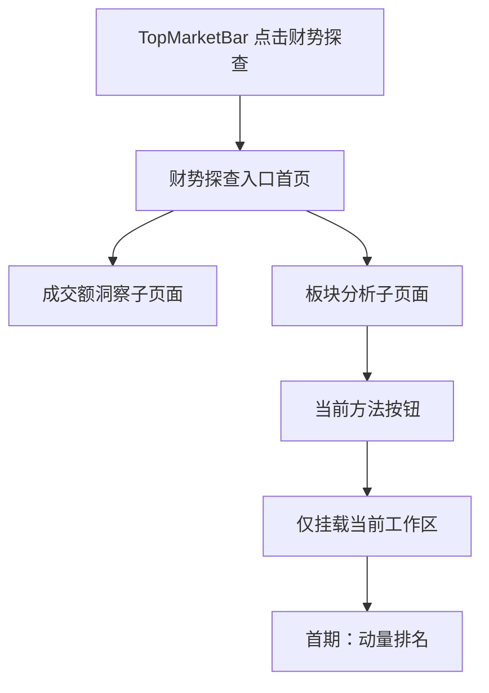

# 财势探查｜板块分析技术实施方案 v1

> - 文档性质：技术实施方案与里程碑对账，不是 LLD。
> - 当前状态：v1.12；M0、M1、Pre-M2、M2 已完成；M3 动量排名前端已实现，正在进行响应式布局纠偏和用户验收。
> - 产品事实源：[财势乾坤板块分析产品交互基线文档 v1](./sector-analysis-product-interaction-baseline-v1.md)。
> - Figma 文件：`Goldenshare Web`，file key `RADlZzREU4lPVviYfkLy6x`。
> - 基线日期：2026-08-27。

---

## 0. 结论摘要

本方案把当前已确认的交互拆成两个明确交付范围：

1. 先把现有财势探查单页改成“入口首页 + 独立模块子页面”，并让财势探查真正复用财势乾坤首页的快捷入口组件。
2. 板块分析首期只建设已经确认完整的“横截面动量排名”；双动量、相对轮动、成员广度和量价分布只保留可点击的方法按钮并提示“待建设”，在各自产品口径和正式工作区评审完成前不注册路由，不实现数据接口或计算逻辑。

首期动量排名直接读取 Prod 已有正式事实：

- `core_serving.trade_calendar`
- `core_serving.wealth_sector_hierarchy`
- `core_serving.dc_daily`

不新增数据库表、不新增迁移、不读取 DG/Lake、不依赖 `dc_index`、`dc_member`、资金流、Heat、QTF、申万、概念或地域数据。DG 只继续承担既有行业层级发布，Web 查询只读 Prod。

## 1. 目标、依据与边界

### 1.1 实现目标

1. 将 `/wealth/exploration` 调整为纯财势探查入口首页，不再在首页直接加载成交额洞察。
2. 为“成交额洞察”和“板块分析”建立独立、可复制、可刷新和可前进后退恢复的子页面路由。
3. 抽取现有财势乾坤首页 `ShortcutBar / ShortcutCard` 为真正共享的展示组件，保证市场总览视觉无漂移，财势探查只提供自己的入口数据。
4. 建立板块分析稳定页面骨架和方法导航，只挂载当前选中的工作区。
5. 实现行业一级、二级、三级及父级内部的完整涨幅榜、跌幅榜、父子下钻、交易日复盘和 `20/30/60` 日历史趋势。
6. 所有业务日期继续服从公共 `pageContext.tradeDate` 和 20:00 盘后切换约定。
7. 后端提供明确的行业层级、动量排行和历史趋势事实；前端只做展示适配，不自行拼接业务事实或计算排名。

### 1.2 视觉与交互依据

| 页面或状态 | Figma 节点 | 本方案用途 |
|---|---|---|
| 财势探查入口首页 | `978:545` | 入口首页、两张快捷入口卡、无业务工作区 |
| 成交额洞察子页面 | `978:982` | 既有成交额能力从首页拆出后的独立页面 |
| 板块分析／动量排名默认态 | `965:55` | 一级总榜、1 日、涨幅榜默认工作区 |
| 动量排名／跌幅榜 | `971:352` | 同一容器内的跌幅榜状态 |
| 二级总榜 | `1051:951` | 全部二级行业、所属一级路径及全局／父级双排名摘要 |
| 三级总榜 | `1051:1251` | 全部三级行业、一级／二级路径及全局／父级双排名摘要 |
| 一级内二级 | `987:476` | 一级选择器、直属二级完整榜和详情 |
| 二级内三级 | `987:776` | 一级／二级级联选择器、直属三级完整榜和详情 |
| 动量排名／双图悬停 | `1053:5261` | 两图共享日期十字线和联合 Tooltip |
| 动量排名／交易日选择器 | `1062:2` | 全部 SSE 开市日可选；完整、部分缺失、无数据状态可见 |
| Loading | `1036:634` | 保留页面骨架、方法栏和工具栏，正文显示加载骨架 |
| Delayed | `1036:1014` | 保留最近完整交易日内容并明确实际盘后日期 |
| Empty | `1036:1386` | 显式历史无数据或比较池全部不可计算 |
| Error | `1036:1762` | 查询或合同失败后的稳定错误态与重试 |
| 双动量草稿态 | `967:72` | 仅保留后续方法位置，不作为首期数据实现基线 |
| 相对轮动草稿态 | `967:158` | 仅保留后续方法位置，不作为首期数据实现基线 |
| 成员广度草稿态 | `967:244` | 仅保留后续方法位置，不作为首期数据实现基线 |
| 量价分布草稿态 | `967:330` | 仅保留后续方法位置，不作为首期数据实现基线 |

Figma 页面 `14 Wealth Exploration - Sector Analysis`（`965:2`）负责板块分析交互事实。旧板块雷达和原复杂量化研究画板保持冻结，不参与本方案。

2026-08-27 最终节点树、属性、交互和 1600px 截图对账已通过：12 张正式画板均为 `1600×1292.390625`；一级涨／跌、二级总榜、三级总榜、两类父级榜、双图悬停、交易日覆盖选择器和四个异常态均具备独立开发基线。榜单 viewport 使用纵向滚动；页面壳、工具栏、行、摘要和状态面板使用 Auto Layout；图表、数据条、十字线、Tooltip、日期 Popover 和滚动条叠层保留必要绝对坐标。四个待建设方法按钮没有草稿跳转，行业行选择与独立下钻已区分，三级无下钻，`20/30/60` 明确为两图共用。

设计语义也已逐项核对：一级 31 个对象的排名纵轴完整覆盖 `1..31`；涨幅榜最强示例为 `100.0%`，跌幅榜最弱示例为 `31/31、0.0%`；二级和三级详情同时展示全层级与直属父级排名；代表性 Hover 状态同时显示日期、区间涨跌幅和“第 N 名 / M 个可计算行业”。模块自有正式文本已绑定可精确匹配的本地 Text Style，`System/Warning` 已补 Web syntax `var(--cs-color-warning)` 和正确使用范围；共享组件既有债务不在本期扩改。

### 1.3 本期明确不做

1. 不做转热、续热、转冷、预测、成功率、Lift、信号或综合评分。
2. 不实现双动量、相对轮动、成员广度和量价分布的业务计算、真实 API 或正式结果页。
3. 不接入 QTF，不建设参数审批、研究发布或行情信号发布。
4. 不做概念、地域、申万行业或行业体系对比。
5. 不使用 Heat、资金流、成员股、新闻、宽基或分钟数据。
6. 不改 `TopMarketBar` 的结构、样式和一级导航。
7. 不在财势探查入口首页预加载、隐藏挂载成交额或板块分析工作区。
8. 不扩展移动端设计；继续使用当前宽桌面基线。
9. 不新增数据库表、迁移、账号、连接、定时任务、缓存服务或第三方前端依赖。

### 1.4 跨模块抽象门禁原则适配

| 原则 | 本模块结论 | 设计落点 | 计划测试 |
|---|---|---|---|
| 事实源单一原则 | 层级、交易日和行业日行情只由后端 Prod 查询归一 | 第 5、6 节 | 前端无公式、无事实补值；真实 API 字段对账 |
| 契约先行与冻结原则 | 三个只读 endpoint 和 DTO 必须在 LLD 中冻结后编码 | 第 7 节 | schema 正反例、未知字段拒绝、前后端契约测试 |
| 配置一致性原则 | 本期没有运营配置；周期、范围和版本为产品合同枚举 | 第 6.7 节 | 未批准枚举拒绝；仓库不存在第二套常量 |
| 默认行为显式原则 | 默认一级总榜、1 日、涨幅榜、20 日图表；首次选中首条可计算行业，后续切换优先保留当前行业 | 第 4.4、6.6 节 | 无参数、非法参数、保留选择、父级切换和失效选择测试 |
| 排序与筛选确定性原则 | 比较池、空值、并列和稳定次序全部固定 | 第 6.3、6.5 节 | 同值、缺值、跨父级、完整列表测试 |
| 性能预算前置原则 | 只查询当前工作区；窗口最大为 60+30 个交易日 | 第 11 节 | SQL 数量、payload、P95、未选工作区零请求 |
| 可观测与异常标准化原则 | 只输出用户状态和已登记异常码；debug 不泄露 SQL | 第 9 节 | READY/DELAYED/EMPTY/ERROR 和未登录 401 反例 |
| 测试以用户可见结果为中心原则 | 真实路由字段必须逐项驱动榜单、详情和双趋势图 | 第 12 节 | 后端真实 API + 前端真实 API smoke 双门禁 |

## 2. 当前代码审计结论

### 2.1 M1 完成后的页面与路由事实

当前代码已经实现四个精确财势探查路由：

```text
/wealth/exploration
/wealth/exploration/turnover-insight
/wealth/exploration/sector-analysis
/wealth/exploration/sector-analysis/momentum-ranking
```

`WealthRouter` 通过有界 route resolver 分别渲染 landing、turnover 和 sector 页面；板块根地址使用 `replace` 并保留 query 后进入动量地址。公共 Shell 只读取页面上下文和主要指数，业务 controller 只由对应子页挂载。

M1 已关闭原先三项页面差异：

1. `/wealth/exploration` 已是零业务预加载的入口首页。
2. 成交额洞察已有独立子页面，继续复用原 API、adapter、controller 和 5 秒超时合同。
3. 板块分析已有独立路由、页面壳和方法栏，但尚无板块 API、查询、计算、Mock 或结果工作区。

### 2.2 当前公共组件事实

1. `TopMarketBar` 已是共享组件，市场总览、详情页和财势探查可以继续直接复用；本期无需复制或改版。
2. `PageBreadcrumb` 已是共享组件，可通过 items 配置三层路径；本期只增加页面级配置，不新增第二套面包屑。
3. `ShortcutBar / ShortcutCard` 已移至 `shared/ui/shortcut-bar`；市场总览六项仍由 `MarketShortcutBar` 持有，财势探查两项由自己的 feature 配置持有。
4. `WealthExplorationShell` 已统一 TopBar、公共上下文、ticker、面包屑、快捷入口、toast 和内容插槽，不读取业务模块。

### 2.3 当前后端能力事实

现有 `/api/v1/wealth/market/sector-overview` 服务于财势乾坤首页板块速览，合同是行业三级 Top5 联动、概念热度和地域排行。它不满足本页需要：

1. 行业列每级最多 5 行，不返回全部行业。
2. 只提供当日排序指标，不提供 `5/10/20/30` 日累计涨跌幅。
3. 不提供全体二级／三级总榜。
4. 不提供当前榜单口径下的 20/30/60 日历史排名。
5. 其 DTO 和状态还绑定首页板块速览的概念、地域、成员、资金流和 Heat 语义。

因此本方案禁止扩写或复用 `sector-overview` DTO 来凑板块分析。板块分析建立独立 `sector_analysis` 模块 API；两者只允许共享无页面语义的行业层级只读查询。

### 2.4 CodeGraph 影响面结论

本轮已用仓库根 CodeGraph 索引核验：

1. `WealthRouter` 通过判别联合解析三个页面和一个 replace 入口；三个页面测试及成交额静态门禁是当前消费者证据。
2. `TopMarketBar` 是公共组件，实际消费者覆盖市场总览、财势探查、股票详情和指数详情；本期不修改其 props 与视觉。
3. 共享 `ShortcutBar` 当前由市场总览和财势探查两类 feature wrapper 消费；页面不持有两套展示实现。
4. `MarketPageContextQuery` 同时被公共 context、股票／指数详情和部分行情查询使用。Pre-M2 已把其内部 1～4 条交易日历查询收敛为 1 条，公开方法、返回结构、20:00 规则和全部消费者语义保持不变。
5. 当前工作区已把行业层级查询移到 Biz 公共目录，并更新 `MarketSectorOverviewQueryService` 与 `SectorSelectionResolver` 两个消费者；首页板块速览和架构回归 33 项通过。该已完成移动不代表 M2 API 已开始或完成。

## 3. 目标信息架构与正式路由

### 3.1 路由表

| 页面 | 正式路由 | 当前状态 |
|---|---|---|
| 财势探查入口首页 | `/wealth/exploration` | 本期改造 |
| 成交额洞察 | `/wealth/exploration/turnover-insight` | 本期从旧首页拆出 |
| 板块分析默认入口 | `/wealth/exploration/sector-analysis` | `replace` 到动量排名 |
| 横截面动量排名 | `/wealth/exploration/sector-analysis/momentum-ranking` | 本期实现 |
| 双动量 | 暂不注册正式路由 | 按钮保留，点击提示“待建设” |
| 相对轮动 | 暂不注册正式路由 | 按钮保留，点击提示“待建设” |
| 成员广度 | 暂不注册正式路由 | 按钮保留，点击提示“待建设” |
| 量价分布 | 暂不注册正式路由 | 按钮保留，点击提示“待建设” |

首期只有 `momentum-ranking` 是可用方法。其余四个按钮保持可点击，点击后通过当前 Design System 的轻量 toast 提示“待建设”，页面继续停留在当前动量排名路由和工作区。不得为未建设方法注册业务路由、创建 controller、空 API、占位结果页或 mock 数据。

### 3.2 面包屑

| 页面 | 面包屑 |
|---|---|
| 入口首页 | 财势乾坤 / 财势探查 |
| 成交额洞察 | 财势乾坤 / 财势探查 / 成交额洞察 |
| 板块分析 | 财势乾坤 / 财势探查 / 板块分析 |

“财势乾坤”返回市场总览，“财势探查”返回入口首页。板块分析方法不增加第四层面包屑，方法状态由页面内按钮栏和 URL 表达。

### 3.3 页面加载边界



1. 入口首页只请求页面公共上下文和 TopMarketBar ticker，不请求成交额或板块数据。
2. 成交额子页面只请求现有成交额洞察接口。
3. 板块分析只请求当前方法的数据；首期只会请求动量排名。
4. 未选方法不创建 controller、图表实例、网络请求或隐藏 DOM。
5. 点击四个待建设按钮只触发本地 toast，不改变 URL、页面状态或已加载的动量排名事实。

## 4. 前端目标架构

### 4.1 目录落点

```text
wealth/src/
  app/routes/
    WealthRouter.tsx
    routerState.ts
  pages/wealth-exploration/
    WealthExplorationLandingPage.tsx
    TurnoverInsightPage.tsx
    SectorAnalysisPage.tsx
    layout/
      WealthExplorationShell.tsx
      useWealthExplorationShell.ts
  features/wealth-exploration/
    navigation/
      ExplorationShortcutBar.tsx
      explorationNavigation.ts
    turnover-insight/                 # 既有 feature，保持业务合同
    sector-analysis/
      navigation/
        SectorAnalysisMethodBar.tsx
      momentum-ranking/
        api/
        model/
        ui/
  shared/ui/
    shortcut-bar/
      ShortcutBar.tsx
      ShortcutCard.tsx
      shortcut-bar.css
```

目录名在 LLD 中可按当前命名细化，但职责不得变化。

### 4.2 财势探查页面壳

`WealthExplorationShell` 只负责：

1. 复用 `TopMarketBar` 并设置 `activeNav="exploration"`。
2. 读取公共页面上下文并加载 TopMarketBar 主要指数 ticker。
3. 按当前子页面配置 `PageBreadcrumb`。
4. 渲染财势探查两项快捷入口及 active 状态。
5. 提供稳定内容插槽和页面级 toast。

它不读取成交额、板块排行或任何方法数据。业务 controller 只在对应子页面内容区挂载。

### 4.3 快捷入口共享收口

现有市场总览 `ShortcutBar` 拆成两层：

1. `shared/ui/shortcut-bar`：只接收 `items / activeKey / onNavigate`，保留现有内部 DOM、class、尺寸、间距、hover 和 selected 样式；最外层交互节点按 LLD 更正为原生 button，并以 CSS reset 保证零视觉漂移。
2. `features/market-overview/layout/MarketShortcutBar`：继续持有市场总览六个入口的数据与当前 toast 行为。
3. `features/wealth-exploration/navigation/ExplorationShortcutBar`：只持有“成交额洞察 / 板块分析”两项入口。

CSS 从 `market-overview-page.css` 原样移到共享组件 CSS；不得借提取重做首页样式。市场总览是视觉回归基线，提取前后普通元素偏差目标为 `0px`。

### 4.4 动量排名 URL 状态

已建设的方法使用 path，工作区状态使用 query；首期只有动量排名 path：

| query | 允许值 | 默认值 | 说明 |
|---|---|---|---|
| `tradeDate` | `YYYY-MM-DD`、Meta 覆盖区间内 SSE 开市日；允许 COMPLETE/PARTIAL/MISSING | 公共默认日期 | 只有用户历史选日时写入 URL |
| `scope` | `level1/level2/level3/level1-children/level2-children` | `level1` | 五类榜单 |
| `level1Code` | 当前层级存在的一级行业代码 | 当前层级第一项 | 父级榜或下钻状态 |
| `level2Code` | 当前一级直属二级行业代码 | 当前一级第一项 | 二级内三级 |
| `period` | `1/5/10/20/30` | `1` | 累计涨跌幅计算周期 |
| `direction` | `gainers/losers` | `gainers` | 涨幅榜或跌幅榜 |
| `range` | `20/30/60` | `20` | 右侧历史显示范围 |
| `sectorCode` | 当前比较池中的行业代码 | 第一条可计算行业；否则第一项 | 当前详情对象 |

状态规则：

1. 非法枚举、层级闭包错误或不在比较池的代码由后端拒绝；前端不静默猜测另一套口径。
2. 首次进入且 URL 没有合法 `sectorCode` 时，选择榜单第一条可计算行业；没有可计算行业时选择第一项。
3. 切换 `tradeDate/period/direction/range` 后，只要当前 `sectorCode` 仍属于当前比较池，就保留该行业；即使该行业在新日期或周期下不可计算，也不得自动换成别的行业。
4. 切换 `scope` 或父级后，若当前行业仍属于新比较池则继续保留；只有不再属于时，才选择新榜单第一条可计算行业，没有可计算行业时选择第一项。
5. 改变一级行业后，二级行业重置为新一级下 `displayOrder` 第一项；随后按第 4 条验证当前行业是否仍属于新比较池。
6. 行业行选择使用 `replaceState`，避免连续浏览多行污染浏览器返回栈；范围、下钻和方法变化使用 `pushState`。
7. 下钻保留 `tradeDate/period/direction/range`，只替换 scope、父级和必要时失效的选中项。
8. URL 是可恢复状态，组件本地状态不得形成第二套默认值。

### 4.5 动量排名组件边界

```text
SectorAnalysisPage
└── SectorAnalysisMethodBar
    └── MomentumRankingWorkspace
        ├── MomentumControlBar
        ├── MomentumRankingPanel
        │   ├── RankingDirectionSwitch
        │   ├── MomentumRankingTable
        │   └── MomentumRankingRow
        └── MomentumDetailPanel
            ├── SelectedSectorSummary
            ├── RollingReturnChart
            └── HistoricalRankChart
```

1. `MomentumRankingTable` 渲染全部返回行，固定表头、内部滚动，不做前端 Top N 截断。
2. 二级、三级行独立显示父级路径；Tooltip 只展示被省略的完整路径。
3. 数据条宽度属于展示几何，由 adapter 根据同一响应的有效最小／最大值计算；业务涨跌幅、同组强度排名和百分位必须来自 API。
4. 两张趋势图始终同时挂载，不使用 Tab 二选一；共用交易日 x 轴、悬停位置和 Tooltip 联动，但使用独立 y 轴。
5. 排名图只绘制稳定的同组强度排名，区间涨跌幅最高始终为第 1 名；y 轴反转，使第一名位于顶部。
6. 区间涨跌幅图标题带当前周期，例如“10 日区间涨跌幅趋势”；排名图标题带当前 scope 或父级范围。
7. 图表没有数据时不创建空 canvas；缺失点保留日期槽并断线，不补零、不前向填充。

### 4.6 运行时宽度适配

Figma 的 `1600px` 是像素验收基线，不是运行时固定页面宽度。运行时必须服从既有 `PageShell` 和全局内容宽度 Token：

```text
shellOuterWidth = min(max(viewportWidth, 1460), 1840)
contentWidth = shellOuterWidth - 18 * 2
columnWidth = (contentWidth - 12) / 2
```

因此：

1. 在 `1600px` 视口下，内容宽 `1564px`，两列严格为 `776 + 12 + 776`，用于对照 Figma。
2. 在用户截图对应的约 `1512px` 视口下，内容宽 `1476px`，两列自动收缩为 `732 + 12 + 732`，不得产生页面横向裁剪。
3. 在更宽屏幕下，两列随 Shell 等宽扩展，直到现有 `--cs-layout-content-max-width: 1840px`；不得把模块锁死为 `1564px`。
4. 低于现有全局 `--cs-layout-content-min-width: 1460px` 时，继续使用全站统一的最小宽度和页面级横向滚动，不对板块分析单独做 CSS scale 或另造断点。
5. 工具栏、Ready 工作区、Loading/Empty/Error 状态面板使用 `width:100%`；Ready 两列使用 `repeat(2, minmax(0, 1fr))` 和固定 `12px` 列距。
6. 榜单、详情摘要和图表容器使用 `width:100%`。高度合同保持不变：工具栏 `128px`、正文 `866px`、摘要 `112px`、趋势图 `365px`、榜单行 `56px`。
7. SVG 保留 `776×365` 的内部 viewBox 和既有 plot padding，通过实际容器宽度等比例渲染；指针位置继续从实际 `getBoundingClientRect()` 映射到 viewBox，禁止改变数据点、轴或 Tooltip 语义。
8. Selected Summary 的 Identity 以真实文字溢出为判断条件，而不是按浏览器宽度或固定行业名猜测：先用设计稿字号测量行业名和完整层级路径；任一文本溢出时进入 compact（行业名 `17→14px`、路径 `11→9px`、等级标签 `11→10px`）并立即重新测量；仍然溢出时进入 extra-compact（行业名 `12px`、路径 `8px`、等级标签 `9px`）。容器变宽后从设计稿字号重新测量，空间足够时自动恢复。行业等级标签始终禁止换行；不得用固定小字号损失短名称和宽屏可读性，也不得以省略号代替本应容纳的正式行业名。

## 5. 数据事实源与字段

### 5.1 来源合同

| Prod 表 | 使用字段 | 用途 |
|---|---|---|
| `core_serving.trade_calendar` | `exchange, trade_date, is_open, pretrade_date` | 公共交易日、历史窗口和历史选择器 |
| `core_serving.wealth_sector_hierarchy` | `sector_code, sector_name, industry_level, parent_sector_code, parent_sector_name, root_sector_code, root_sector_name, hierarchy_path, display_order, baseline_version, published_at` | 当前一级／二级／三级关系、父级选择器、路径和稳定顺序 |
| `core_serving.dc_daily` | `ts_code, trade_date, category, close, pct_change` | 行业 1 日及多日累计涨跌幅 |

固定过滤：

```text
trade_calendar.exchange = 'SSE'
trade_calendar.is_open = true
dc_daily.category = '行业板块'
```

### 5.2 不读取的已有表

`dc_index`、`dc_member`、`board_moneyflow_dc`、`wealth_sector_heat_daily` 与股票行情不参与动量排名。它们在首页板块速览有用途，但不能因为已有查询方便就带入本模块。

### 5.3 层级使用规则

1. 只使用 DG 已发布到 Prod 的当前 DC 行业一级、二级、三级关系，即当前唯一的 `wealth_sector_hierarchy.baseline_version`；产品侧只称“行业分类”，不展示来源品牌或 `DC` 字样。
2. 一级节点必须无父级；二级父级必须是一级；三级父级必须是二级；root 闭包不合法时整个层级接口失败。
3. 历史排名也使用当前发布层级，不尝试重建历史成员有效期。
4. 每个响应返回 `hierarchyVersion`，使结果可解释。
5. 未来重新发布层级版本后，旧日期按新当前层级重新查询可能得到不同比较池；首期不建设历史层级版本表。该限制必须在 LLD 和验收记录中保留。

### 5.4 DG 边界

DG 继续沿用既有流程发布 `core_serving.wealth_sector_hierarchy`。板块分析 API 不直接连接 DG、不读 Lake 文件、不触发层级发布，也不新建第二份层级副本。

### 5.5 Prod DuckDB 覆盖审计

2026-08-27 使用 DuckDB `postgres` 扩展，以现有 Web 只读连接直接附加 Prod；查询只覆盖第 5.1 节三张白名单表、固定字段和 `2024-01-02..2026-08-26`，没有导出来源行、写库或创建副本。

| 审计项 | 结果 |
|---|---:|
| 当前发布行业池 | 一级 31、二级 128、三级 337，共 496 |
| 行业行情覆盖 | 642 个 SSE 开市日，`2024-01-02..2026-08-26` |
| 当前行业池行情行 | 317,825 |
| 重复业务键／非开市日行 | 0／0 |
| 空、非有限或非正收盘价 | 0 |
| 空或非有限日涨跌幅 | 0 |
| 行情代码不在当前层级 | 14 个代码、7,216 行；不计入当前比较池 |
| 当前行业池单日覆盖缺口 | 20 个开市日、607 个行业日事实 |

20 个缺口日及缺失行业数为：`2024-06-27(1)`、`2024-10-29(1)`、`2024-10-30(1)`、`2024-10-31(1)`、`2024-11-01(1)`、`2025-02-27(1)`、`2025-02-28(1)`、`2025-03-03(1)`、`2025-03-04(1)`、`2025-03-05(1)`、`2025-03-06(1)`、`2025-03-07(1)`、`2025-03-10(1)`、`2025-03-11(1)`、`2025-03-12(1)`、`2025-04-29(1)`、`2025-12-26(1)`、`2026-05-18(97)`、`2026-05-20(484)`、`2026-05-25(9)`。

以 `2026-08-26` 为结束日，对最近 60 个 SSE 开市日、496 个当前行业逐点执行完整 `N+1` 窗口审计：5 日窗口 `29,760/29,760` 可计算；10 日 `29,249/29,760`，4 个结束日受影响；20 日 `24,391/29,760`，14 个结束日受影响；30 日 `19,531/29,760`，24 个结束日受影响。最新结束日 `2026-08-26` 的 5/10/20/30 日窗口均完整，但历史趋势内确实存在缺点。

因此实现不能假设生产历史完整：日期选择器必须暴露覆盖缺口，计算器必须逐行业逐窗口执行完整 `N+1` 门禁。后续若 Prod 补齐缺失事实，接口自然由 `PARTIAL/MISSING` 恢复为 `COMPLETE`，不需要修改产品枚举或前端代码。

## 6. 动量计算与排名合同

### 6.1 公式版本

首期公式身份固定为：

```text
formulaKey = sector-cross-sectional-momentum
formulaVersion = 1
```

该版本只表达区间累计涨跌幅和横截面排名，不包含权重、标准化、平滑、热度或预测。

### 6.2 区间累计涨跌幅

1 日直接使用来源事实：

```text
returnPct(1, t) = dc_daily.pct_change(t)
```

`N=5/10/20/30` 时，N 个交易日区间包含截至 `t` 的最近 N 个开市日，使用区间前一交易日收盘价作为分母：

```text
returnPct(N, t) = (close(t) / close(t-N) - 1) × 100
```

其中 `t-N` 是 N 日区间开始前的上一开市日，因此一次 N 日计算需要 N+1 个收盘事实。例：计算 5 日累计涨跌幅，需要“前一日收盘 + 最近 5 个交易日收盘”。

缺少分母、期末收盘或任一必要交易日时，该行业该点返回 `null`，不使用日涨跌幅连乘补值，不补零，不借用相邻日期。

### 6.3 五类比较池

| scope | 比较池 |
|---|---|
| `level1` | 当前层级全部一级行业 |
| `level2` | 当前层级全部二级行业，不区分所属一级 |
| `level3` | 当前层级全部三级行业，不区分所属二级 |
| `level1-children` | 指定一级行业的直属二级行业 |
| `level2-children` | 指定二级行业的直属三级行业 |

父级内部榜不包含孙级节点；全体二级／三级榜不按父级分组后再拼接。

### 6.4 涨幅榜和跌幅榜

1. 涨幅榜按 `returnPct desc` 排序。
2. 跌幅榜按 `returnPct asc` 排序。
3. `direction` 只决定列表输出顺序，不参与同组强度排名、百分位、详情摘要或历史趋势计算。
4. 每行返回 `listPosition`，表示该响应列表中的顺序，从 `1` 开始连续编号；它不是可跨方向比较的业务排名。
5. `returnPct=null` 的行业保留在列表末尾，`strengthRank/percentile=null`，页面显示 `--`；缺值行最终按 `sectorCode asc` 稳定输出。
6. 有效值相同的行业使用相同 `strengthRank`；同值行在涨幅榜和跌幅榜中均按 `sectorCode asc` 固定次序。
7. 页面返回当前比较池的全部行业，不使用 limit/TopN。

### 6.5 同组强度排名和百分位

`strengthRank` 是唯一业务排名，始终按 `returnPct desc` 计算：区间涨跌幅最高为第 1 名。并列值使用竞赛排名，例如 `1, 2, 2, 4`。切换涨幅榜或跌幅榜不会改变同一行业的 `strengthRank`。

`percentile` 始终表达“强弱位置”，不因涨跌榜切换改变。对当日同一比较池的 `n` 个可计算行业，先按区间涨跌幅从高到低求并列平均名次 `averageRank`，再计算：

```text
percentile = (n - averageRank) / (n - 1) × 100
```

最强严格为 `100.0`，最弱严格为 `0.0`，并列对象取相同平均位置；`n=1` 时返回 `100.0`，空值对象返回 `null`。DTO 统一四舍五入到 1 位小数。

这样，同一行业在涨幅榜和跌幅榜切换时，`returnPct/strengthRank/percentile` 完全不变，只改变 `listPosition` 和列表顺序。列表首列在产品上称为“榜单序号”；详情摘要和历史图统一称为“同组强度排名”。

### 6.6 默认选择与详情摘要

默认状态固定为：

```text
scope=level1
period=1
direction=gainers
range=20
sectorCode=当前榜单第一条可计算行业；否则第一项
```

详情摘要必须返回：

1. 当前范围的同组强度排名、有效组大小、比较池总大小和同组百分位。
2. 当前区间累计涨跌幅。
3. 二级行业的全体二级强度排名与所属一级内部强度排名。
4. 三级行业的全体三级强度排名与所属二级内部强度排名。
5. 当前 `tradeDate`、`hierarchyVersion` 和 `formulaVersion`。

一级行业不伪造父级内部排名。

### 6.7 历史趋势

1. 显示范围只允许截至 `observedTradeDate` 的最近 `20/30/60` 个 SSE 开市日；不能因为行业日行情缺失而从日期轴删除该日。`observedTradeDate` 是两条历史序列的共同结束日期。
2. 上图每个日期重新按当前 `period` 计算滚动累计涨跌幅。
3. 下图每个日期重新按当前 `scope + parent` 计算同组强度排名；`direction` 不进入历史计算合同。
4. 最大查询边界为 `60` 个显示交易日加最早显示点之前的 `30` 个交易日，共 `90` 个不同交易日；最早一日就是 30 日窗口的分母日，不再额外加第 91 日。
5. 历史不足时返回已有日期；缺失点保留日期并返回 `null`，前端断线。
6. 历史排名的 `calculableCount` 只统计该日可计算对象，同时返回 `totalCount` 表示当前层级比较池总数；不能把缺值对象计入有效排名分母。
7. 两张图按同一组交易日升序返回并同时展示；共享 x 轴和悬停索引，前端 Tooltip 同时显示当日 `returnPct`、`strengthRank/calculableCount` 和缺值状态。

“历史排名”的技术定义是：固定当前请求的 `sectorCode + scope + parent + period`，对显示范围内每个历史交易日逐日重算该行业的滚动累计涨跌幅及其在当日比较池中的同组强度排名。它不是历史行业分类版本，也不是读取预存榜单快照。

示例：`scope=level1-children`、父级为“信息技术”、`period=10`、`sectorCode` 为“软件服务”、`range=20`。查询必须对 20 个显示交易日中的每一天，使用当前发布层级筛出“信息技术”的直属二级行业，按截至该日的 10 日累计涨跌幅从高到低完成强度排名，再输出“软件服务”的当日 `strengthRank/calculableCount/totalCount`。前端把这 20 个名次按交易日升序绘成趋势线。

### 6.8 参数性质

`1/5/10/20/30`、`20/30/60`、五类 scope 和两类 direction 是已批准产品合同，不接入策略配置中心，不新增环境变量或数据库配置。变更这些枚举必须先改产品基线、技术方案、LLD、API schema 和测试。

## 7. 后端 API 方案

### 7.1 API 范围

统一前缀：

```text
/api/v1/wealth/market/sector-analysis
```

| Endpoint | 职责 | 触发时机 |
|---|---|---|
| `GET /meta` | 返回公式身份、允许枚举、当前层级和带覆盖状态的 SSE 开市日 | 进入动量排名时一次 |
| `GET /momentum/rankings` | 返回当前日期、范围、周期、方向的完整榜单 | 日期／范围／父级／周期／方向变化 |
| `GET /momentum/history` | 返回当前行业摘要与两条历史序列 | 日期／范围／父级／周期／显示长度／行业变化；方向变化不触发 |

三个接口只返回板块分析对象，不返回整页对象，不复用首页 `sector-overview` DTO。

### 7.2 Meta 请求与响应

请求：

```http
GET /api/v1/wealth/market/sector-analysis/meta?market=CN_A
```

核心响应：

```json
{
  "formula": {
    "formulaKey": "sector-cross-sectional-momentum",
    "formulaVersion": 1,
    "periods": [1, 5, 10, 20, 30],
    "historyRanges": [20, 30, 60],
    "scopes": ["LEVEL_1", "LEVEL_2", "LEVEL_3", "LEVEL_1_CHILDREN", "LEVEL_2_CHILDREN"],
    "directions": ["GAINERS", "LOSERS"]
  },
  "hierarchy": {
    "hierarchyVersion": "...",
    "publishedAt": "...",
    "nodes": []
  },
  "coverageStartDate": "2024-01-02",
  "coverageEndDate": "2026-08-26",
  "tradeDates": [
    {
      "tradeDate": "2026-08-26",
      "availability": "COMPLETE",
      "expectedSectorCount": 496,
      "validSectorCount": 496
    }
  ]
}
```

`coverageStartDate` 是当前行业池在 `dc_daily(category='行业板块')` 中首次出现可用事实的 SSE 开市日；`coverageEndDate` 是公共 `pageContext.expectedTradeDate` 对应的目标开市日。`tradeDates` 必须返回该闭区间内全部 SSE 开市日，不与已有行业行情日期取交集，也不返回自然日。

`availability` 只描述当日当前层级行业池的来源覆盖，不是页面状态：`COMPLETE` 表示全部存在有效事实，`PARTIAL` 表示至少一个但不足全部，`MISSING` 表示一个都没有。`expectedSectorCount` 必须由当前 hierarchy snapshot 动态取得（本次审计为 496），不得写死；`validSectorCount` 只统计业务键唯一、`close` 有限且大于 0、`pct_change` 有限的当前层级行业。当前层级外的历史代码不进入分子或分母。后续补数后同一日期状态按事实自然更新。

### 7.3 Rankings 请求

```http
GET /api/v1/wealth/market/sector-analysis/momentum/rankings
  ?market=CN_A
  &tradeDate=2026-08-26
  &scope=LEVEL_1_CHILDREN
  &level1Code=BKxxxx.DC
  &period=10
  &direction=GAINERS
```

核心响应字段：

```text
tradingDay.expectedTradeDate
tradingDay.observedTradeDate
tradingDay.expectedAvailability/expectedSectorCount/expectedValidSectorCount
tradingDay.observedAvailability/observedValidSectorCount
pageStatus.status/displayText/asOfTime
ranking.formulaKey/formulaVersion/hierarchyVersion
ranking.scope/period/direction
ranking.parentSelection
ranking.totalCount/calculableCount
ranking.rows[]:
  listPosition
  strengthRank
  sectorCode
  sectorName
  industryLevel
  parentSectorCode
  parentSectorName
  hierarchyPath
  returnPct
  percentile
  canDrillDown
```

### 7.4 History 请求

```http
GET /api/v1/wealth/market/sector-analysis/momentum/history
  ?market=CN_A
  &tradeDate=2026-08-26
  &scope=LEVEL_1_CHILDREN
  &level1Code=BKxxxx.DC
  &period=10
  &historyRange=60
  &sectorCode=BKyyyy.DC
```

核心响应字段：

```text
tradingDay/pageStatus
detail.sectorCode/sectorName/industryLevel/hierarchyPath
detail.returnPct/currentScopeStrengthRank/currentScopeCalculableCount/currentScopeTotalCount/percentile
detail.globalLevelStrengthRank/globalLevelCalculableCount/globalLevelTotalCount
detail.parentStrengthRank/parentCalculableCount/parentTotalCount
detail.scopeTitle
rollingReturns[].tradeDate/returnPct
historicalRanks[].tradeDate/strengthRank/calculableCount/totalCount/percentile
```

### 7.5 请求校验

1. Pydantic DTO `extra="forbid"`；未知参数、重复参数和非法枚举返回 400。
2. `market` 首期只允许 `CN_A`。
3. `tradeDate` 必须为 `YYYY-MM-DD`，位于 Meta 覆盖区间且是 SSE 开市日；`PARTIAL/MISSING` 日期仍是合法选择，不把来源缺失误报为参数错误。显式 `MISSING` 日返回 EMPTY；显式 `PARTIAL` 日继续计算可用行业并保留缺值行。
4. `LEVEL_1_CHILDREN` 必须带合法一级代码，不接受二级代码。
5. `LEVEL_2_CHILDREN` 必须带闭包正确的一级和二级代码。
6. `sectorCode` 必须属于当前比较池；不得静默替换成别的父级行业。
7. 默认请求由服务端返回规范化 selection；非法显式请求严格失败。

## 8. 后端分层与执行链路

### 8.1 目录落点

```text
src/biz/
  api/wealth/market/
    sector_analysis/
      __init__.py
      meta.py
      momentum.py
  queries/wealth/market/
    common/
      sector_hierarchy_query.py
    sector_analysis/
      sector_analysis_meta_query.py
      sector_momentum_query.py
      sector_momentum_query_service.py
  schemas/wealth/market/
    sector_analysis.py
  services/wealth/market/
    sector_analysis/
      sector_analysis_exception_builder.py
      sector_analysis_status_resolver.py
      sector_momentum_contract.py
```

### 8.2 公共层级查询提取

当前 `SectorHierarchyQuery` 位于 `sector_overview` 模块内部。编码时将它完整迁移到 `queries/wealth/market/common/sector_hierarchy_query.py`：

1. 保留唯一版本、父子闭包、root 闭包和稳定排序校验。
2. 首页 `MarketSectorOverviewQueryService` 和新板块分析共同依赖公共查询。
3. 删除旧模块内实现，不保留兼容 re-export。
4. 现有首页 sector-overview 全量测试必须证明响应零变化。

### 8.3 请求链路


API 不访问 Ops、TaskRun、DG 或 QTF。`src/biz` 继续只依赖 `src.foundation` 和自身，`src.app` 只增加路由装配。

## 9. 日期、状态与异常

### 9.1 公共日期语义

1. 前端先调用公共 `/api/v1/wealth/market/context`。
2. URL 没有 `tradeDate` 时，公共 context 和板块 API 都使用默认模式：20:00 前是上一交易日；20:00 后目标是当日。
3. URL 有 `tradeDate` 时，视为历史复盘，三个板块 API 都传同一显式日期。
4. 默认模式下当天行业日行情未达到 `COMPLETE`，板块 API 返回最近一个 `COMPLETE` 交易日和 `DELAYED`；页面显示“当前展示 YYYY-MM-DD 盘后数据”。
5. 显式历史日期没有行业日行情时不得退到更早日期，返回 `EMPTY`。
6. 前端不得读取本机时钟推导业务日；本机时钟只保留 Breadcrumb 已有的当前时间显示。

默认请求不附 `tradeDate` 不是另算日期，而是保留公共接口已经存在的“默认日期可延迟回退”与“显式历史日期严格命中”的区别。最终响应必须校验 `expectedTradeDate/observedTradeDate` 与页面上下文一致。

### 9.2 Pre-M2 公共日期查询单语句化

状态：`PASS (2026-08-27)`。

改造前 `MarketPageContextQuery.resolve_context()` 的默认交易日模式会分步查询“最近开市日、今天是否开市、上一开市日和最终日期记录”，最坏执行 4 条 SQL。该查询有 9 个直接调用入口，不能为了板块分析复制另一套 20:00 日期算法，也不能让 Meta 信任前端传入的业务日期。

Pre-M2 将其内部数据库访问收敛为一条只读 SQL，方案如下：

1. Python 端只生成一次 `Asia/Shanghai` 的 `localNow`，把 `localDate`、是否已到 20:00 和可选 `requestedTradeDate` 作为绑定参数；禁止使用数据库会话时区推导当前日期。
2. 同一 SQL 使用标量子查询或 CTE 取得：截至 `localDate` 的最近 SSE 开市日、今天的日历记录、今天之前最近的 SSE 开市日、显式日期的日历记录，以及最终业务日期之前最近的 SSE 开市日。
3. 显式模式始终以 `requestedTradeDate` 为 `resolvedTradeDate`；存在日历记录时直接读取其 `is_open/pretrade_date`，不存在时 `isTradingDay=false`，`prevTradeDate` 取该日期之前最近的 SSE 开市日。
4. 默认模式在“今天是 SSE 开市日、当前时间早于 20:00 且今天之前存在开市日”时使用查询得到的最近前一开市日；其余情况使用截至今天最近的 SSE 开市日。若没有任何开市日，继续使用 `localDate`，不得凭空生成交易日。该规则保持当前 `max(open trade_date < localDate)` 语义，不改为信任 `today.pretrade_date`。
5. 最终 SQL 一次返回 `resolvedTradeDate/isTradingDay/prevTradeDate` 所需事实；`sessionStatus/generatedAt/source` 继续在 Python 中按现有规则组装。
6. 保持 `MarketPageContextQuery.resolve_context(session, market, requested_trade_date)` 方法签名、`MarketPageContext` 字段和所有消费者不变；不新增缓存、配置、数据库对象或兼容分支。

验收已使用 SQLAlchemy event counter 证明每次合法 `resolve_context()` 恰好 1 条 SQL，并覆盖：交易日 19:59、20:00、周末／节假日、显式开市日、显式休市日、显式日期无日历记录、无任何开市日以及不支持市场。不支持市场在发 SQL 前拒绝。公共 context、个股详情、指数详情／K 线／权重、成交额洞察、个股九转和指数九转已完成回归。

完成 Pre-M2 后，板块分析查询预算统一为：Meta 最多 3 条，Rankings 最多 5 条，History 最多 5 条。不得为了把 Meta 压到 2 条而合并行业层级和日期覆盖职责。

### 9.3 状态机

| 状态 | 条件 | 页面行为 |
|---|---|---|
| `LOADING` | 前端请求进行中 | 稳定工作区 skeleton，保留外壳和控件位置 |
| `READY` | 显式目标日有至少一个可计算行业，或默认目标日来源完整 | 展示完整比较池；缺值行显示 `--`，日期为 PARTIAL 时明确缺失数量 |
| `DELAYED` | 默认目标日来源不是 COMPLETE，返回较早完整盘后日 | 展示旧数据并明确日期提示 |
| `EMPTY` | 显式日无数据，或比较池无任何可计算事实 | 稳定空态，不展示旧数据 |
| `ERROR` | 查询、层级或合同失败 | 稳定错误态和重试，不用 mock 兜底 |

本期不新增 `PARTIAL` 页面状态。`PARTIAL` 只存在于 Meta 的交易日覆盖标记；用户显式进入该日时页面仍使用 READY 骨架，完整行业行仍返回，`validSectorCount/expectedSectorCount` 与 `calculableCount/totalCount` 共同使来源和计算覆盖可观测。只有完全不可计算时进入 EMPTY。

### 9.4 异常码规划

编码前必须先在异常码注册表登记：

| 异常码 | 含义 | 用户状态 |
|---|---|---|
| `SA_SOURCE_DELAYED` | 默认目标日行业行情尚未发布 | DELAYED |
| `SA_SOURCE_EMPTY` | 显式日期或比较池无可计算行情 | EMPTY |
| `SA_HIERARCHY_UNAVAILABLE` | 当前层级为空、多版本或闭包非法 | ERROR |
| `SA_SCOPE_INVALID` | scope 与父级参数不匹配 | 400 |
| `SA_SELECTION_INVALID` | 行业不属于当前比较池 | 400 |
| `SA_QUERY_FAILED` | 查询或计算失败 | ERROR |

`debugInfo` 仅在现有 debug 机制显式开启时返回有界计数、日期和样本代码；不得返回 SQL、连接信息、堆栈或数据源凭据。

## 10. 前端请求与交互时序

### 10.1 首次进入

1. 加载公共 page context 和 TopMarketBar ticker。
2. 加载 sector-analysis meta。
3. 以 URL 或默认值请求 rankings。
4. rankings 成功后确认 URL 选中项；没有合法选中项时选择第一条可计算行，没有可计算行时选择第一行。
5. 只为当前选中项请求 history。
6. 使用请求序号或 AbortController 丢弃过期响应，防止快速切换造成旧数据覆盖新状态。

### 10.2 父级选择与下钻

1. 一级内二级只展示一个一级选择器。
2. 二级内三级展示一级和二级级联选择器。
3. 改一级时从 meta 层级按 `displayOrder, sectorCode` 选新一级下第一项二级。
4. 行内下钻箭头只负责切换 scope 和父级；点击普通行只改变 `sectorCode`。
5. 三级行业不渲染下钻按钮，也不能通过键盘触发不存在的下钻。

### 10.3 选择保持与双图联动

1. `tradeDate/period/direction/range` 变化后先检查当前 `sectorCode` 是否仍属于响应比较池；属于则保留，不因榜单重新排序或当前值缺失而替换。
2. `scope` 或父级变化后，只有当前行业退出新比较池时才按第 10.1 节选择新行业。
3. `direction` 变化只重新获取或重排 rankings；当前行业的 history query key 不包含 direction，不重新计算另一套历史名次。
4. `range` 变化只改变历史显示长度；`period` 或 `tradeDate` 变化会重算两条历史序列，但仍保持当前行业。
5. 两张图共用交易日索引。任一图 hover/focus 时，另一张图同步定位同一日期；历史排名 Tooltip 显示 `strengthRank / calculableCount`，并可同时说明 `totalCount`。

### 10.4 可访问性

1. 方法、范围、周期、方向使用真实 button/tab 语义和唯一 active 状态。
2. 排名行可用键盘选择；下钻按钮有独立 label，不能把整行点击与下钻混淆。
3. 图表提供可读标题、当前行业、范围、日期和关键值；颜色不是唯一涨跌表达。
4. Tooltip 支持 hover 和键盘 focus，长路径只在真实溢出时出现。

## 11. 性能与缓存

### 11.1 查询边界

1. Meta 只读当前 496 级别的层级事实和已发布日期列表，不做行情计算。
2. Rankings 只查询一个 scope、一个目标日和最多 30 日预热。
3. History 只查询一个选中行业的收益序列，同时查询该 scope 最多 `60+30=90` 个不同交易日的排名所需事实。
4. 不逐行业发 SQL，不在 Python 循环中回查数据库；使用有界集合查询和窗口／分组计算。
5. 数据库返回后可以做确定性的纯内存排序和 DTO 组装，但不得把全表拉到前端计算。

### 11.2 首期预算

| 项目 | 编码门禁目标 |
|---|---:|
| Meta P95 | `<= 300ms` |
| Rankings P95 | `<= 500ms` |
| History P95 | `<= 700ms` |
| 首次工作区可用 | `<= 1.5s`（不含网络环境异常） |
| 单 endpoint payload | `<= 256KB` |
| 同一交互重复请求 | `1` 次有效请求；旧请求必须取消或丢弃 |

后端正常路径 SQL 数量门禁为：Meta `<=3`、Rankings `<=5`、History `<=5`。三者都包含 Pre-M2 收敛后的 1 条公共日期查询；查询数不得随行业数、历史日期数或空值行数线性增长。

M2 已完成 Prod 只读 EXPLAIN 和纯应用计算基准：最重 History 查询的数据库服务端执行约 `116.8ms`，同规模完整 service DTO 与 JSON 组装 P95 为 `99.721ms`，现有索引足以支持本期查询，不需要新增索引或迁移。跨公网逐条调用的本地诊断值包含 5 次网络往返，不能冒充部署拓扑下的 API P95；因此 Meta/Rankings 已完成候选链路预算验证，History 的“数据库执行 + 应用计算”分段预算已通过，最终部署态端到端 P95 仍在 M4 验收。

### 11.3 缓存

1. 首期不新增 Redis 或服务端结果表。
2. Meta 可在单页生命周期内按 `hierarchyVersion` 复用。
3. Rankings/history 以各自的完整规范化 query key 做前端短生命周期内存复用。Rankings 在交易日、层级版本、范围、父级、周期或方向变化时失效；history 不包含方向，只在交易日、层级版本、范围、父级、周期、显示长度或行业变化时失效。
4. 不把缓存结果当作数据事实；API 返回的 `observedTradeDate/hierarchyVersion/formulaVersion` 必须随结果保留。

## 12. 安全、测试与验收

### 12.1 安全边界

1. 三个 endpoint 复用现有 `require_quote_access`，不新增角色或权限模型；当前公共合同只在启用行情登录门禁且用户未登录时返回 401，本需求不虚构不存在的 403 权限路径。
2. 所有查询使用现有 `DATABASE_URL` 业务连接，只读 Prod 正式表。
3. 不提供 SQL、公式表达式执行、任意排序字段、任意表名或任意窗口输入。
4. 前端不展示 `DC`、数据源品牌名、表名或技术异常详情。

### 12.2 后端正反例

必须覆盖：

1. 五类比较池的对象集合完全正确，父子闭包正确。
2. 1/5/10/20/30 日公式及 N+1 日边界。
3. Meta 返回覆盖区间内全部 SSE 开市日及 `COMPLETE/PARTIAL/MISSING`；缺口日不被过滤，层级外历史代码不进入覆盖计数。
4. 涨幅／跌幅排序、`listPosition`、方向无关的 `strengthRank`、并列排名、稳定次序、null 末尾和完整列表。
5. 二级／三级全局排名和父级内部排名同时正确。
6. 历史 `20/30/60` 日、预热、缺点断线、无补值、方向无关强度排名和逐日可计算分母。
7. 默认 20:00 日期、默认不完整日回退、显式完整／部分缺失／整日缺失严格命中。
8. 非交易日、非法日期、非法 scope、错层父级、跨父级行业和未知参数拒绝。
9. 层级为空、多版本、错误 parent/root 闭包进入 ERROR。
10. Meta、rankings、history 真实路由返回前端核心字段，不 mock service/query。
11. 现有 `/sector-overview` 在公共层级查询提取后响应和测试零回退。

### 12.3 前端正反例

必须覆盖：

1. `/wealth/exploration` 只显示两个入口，不请求成交额和板块 API。
2. 两个入口与子页面快捷切换、active 和面包屑正确。
3. 市场总览共享 Shortcut 提取前后 DOM 和视觉无漂移。
4. 默认一级总榜／1 日／涨幅榜／20 日／首条可计算行业选中。
5. 五 scope、两个方向、五周期、三个图表范围和历史日期恢复。
6. 一级内二级、二级内三级级联重置和行内下钻保留状态。
7. 全列表内部滚动、固定表头、长路径 Tooltip 和 `--` 缺值。
8. 两张图同时显示、共享 x 轴与悬停日期、独立 y 轴、强度排名第一位于顶部、缺点断线。
9. 切换日期、周期、方向或显示范围时保留仍在比较池内的当前行业；只有 scope 或父级使其失效时才重置。
10. 涨幅榜／跌幅榜切换只改变列表顺序和 `listPosition`，不改变 `strengthRank/percentile`，也不重新请求另一套 history。
11. 快速切换时旧请求不能覆盖新状态；点击四个待建设按钮只显示 toast，URL 和动量工作区不变，并且零业务请求、零图表实例。
12. READY/DELAYED/EMPTY/ERROR 和重试全部由真实 API 响应驱动，不回退 mock。

### 12.4 核心测试 case

后端真实 API 核心字段：

```text
expectedTradeDate / observedTradeDate / status
formulaVersion / hierarchyVersion
scope / period / direction / parentSelection
listPosition / strengthRank / sectorCode / sectorName / industryLevel / hierarchyPath
returnPct / percentile / canDrillDown
currentScopeStrengthRank / globalLevelStrengthRank / parentStrengthRank
rollingReturns / historicalRanks
```

前端真实展示必须逐项断言：页面日期提示、范围标题、榜单方向、榜单序号、同组强度排名、行业名称、所属路径、涨跌幅、百分位、详情双排名、同步展示的两条历史序列和状态文案。

### 12.5 Figma 验收

1. 1600px 宽桌面基线逐状态截图对照上述 12 个 Figma 正式节点。
2. `TopMarketBar`、面包屑和市场总览快捷入口不发生视觉漂移。
3. 一级总榜涨／跌、二级总榜、三级总榜、一级内二级、二级内三级、双图 Hover 和交易日选择器分别验收，不用一个默认截图代替。
4. 普通 UI 偏差不超过 2px；无新增换行、裁剪、重叠或溢出。
5. 榜单真实长数据必须验证固定表头和内部滚动；不能只用短 fixture 验收。
6. 额外执行运行时宽度验收：`1600px` 必须精确命中 Figma 尺寸；`1512px` 必须等宽收缩且无横向裁剪；`1460px` 内容最小宽度必须无内部重叠；`1366px` 只允许由全局最小宽度产生页面级横向滚动，不允许模块自身再固定为 `1564px`。

## 13. 分期里程碑

### M0：合同与治理收口

状态：`PASS (2026-08-27)`。

1. 以已完成的[代码级 LLD](./sector-analysis-low-level-design-v1.md)为唯一编码明细，确认其路由、三 endpoint、公式、排名、状态、文件矩阵和测试门禁。
2. 维护静态架构门禁，冻结三张 Prod 来源表、无迁移、无 QTF/DG/Lake/预测能力。
3. 核对已登记的 `SA_*` 异常码，不在业务代码中新增未登记同义码。
4. 证据为 `tests/architecture/test_wealth_sector_analysis_guardrails.py`；M0 只建立可持续门禁，没有实现页面、API、查询或计算逻辑。

### M1：财势探查页面结构收口

状态：`PASS (2026-08-27)`。

1. 将 `/wealth/exploration` 改为纯入口首页。
2. 建立成交额洞察与板块分析独立子页面。
3. 提取共享 Shortcut 组件并完成市场总览零漂移回归。
4. 只完成页面壳和路由，不接板块真实数据。
5. 验收证据：46 项 M1 前端定向测试、16 项静态/架构门禁、TypeScript 检查和生产构建通过；旧单页、旧私有 Shortcut 和零高度占位已删除。

### Pre-M2：公共业务日期查询收敛

状态：`PASS (2026-08-27)`。

1. 将 `MarketPageContextQuery.resolve_context()` 的交易日历访问从默认最坏 4 条、显式最坏 2 条统一收敛为 1 条 SQL。
2. 保持 `MarketPageContext`、20:00 日期规则、显式历史语义、Session 状态和 9 个直接消费者合同不变。
3. 补齐时间边界、空日历、显式日期和 SQL 数量正反例，并回归全部消费者。
4. 验收证据：Pre-M2 与全部直接消费者、首页板块速览及架构定向回归共 106 项通过；Ruff、Alembic 单一 head、文档和 diff 门禁通过。
5. 停止点已满足：公共日期查询单次合法调用严格为 1 条 SQL，Meta 的后续预算固定为 3 条。

### M2：动量排名后端

状态：`PASS (2026-08-27)`。

1. 保留当前工作区已完成的公共层级查询移动，并在 M2 收口时再次证明首页板块速览行为不变。
2. 实现 meta、rankings、history 三个只读 API。
3. 完成公式、比较池、状态、异常和真实 API 测试。
4. 生产只读 EXPLAIN 与性能预算验收后停止。
5. 验收证据：三个 endpoint 的 strict 参数、五类比较池、五个周期、完整列表、并列排名、缺口传播、20/30/60 日历史、四态和未登录 401 均有正反例；Meta/Rankings/History SQL 上限分别为 3/5/5；M2 定向与回归共 156 项通过。
6. Prod 只读对账：当前发布层级 496 个节点、其中三级 337 个；行情覆盖 `2024-01-02..2026-08-27`、643 个交易日。Meta P95 `260.439ms`、Rankings P95 `374.495ms`，payload 分别为 `206533/99715` bytes；History 数据库服务端与应用计算分段预算通过，最终部署态 API P95 留在 M4。

### M3：动量排名前端

状态：`IMPLEMENTED / PENDING USER ACCEPTANCE (2026-08-28)`。

1. 在 M1 已完成的方法栏下实现动量排名 controller/adapter/UI。
2. 完成五类榜单、涨跌榜、日期复盘、父子下钻和双历史图。
3. 接入真实 API，禁止 mock 兜底。
4. 运行时工作区遵守第 4.6 节响应式合同；1600px 保持 Figma 基线，1512px 和内容最小宽度不得裁剪。

### M4：联调与交付验收

1. 完成真实 API 前端 smoke、全量回归、typecheck 和 build。
2. 逐节点完成 Figma 像素与交互验收。
3. 验证首页、成交额洞察、市场总览和详情页无回退。
4. 用户部署后完成生产只读数据和页面验收。

### 后续方法

双动量、相对轮动、成员广度和量价分布分别建立自己的产品补充、Figma 正式态、implementation design 增量和 LLD slice。不得在 M1-M4 中顺手实现。

## 14. 影响面、风险与处理

| 风险 | 触发条件 | 处理 |
|---|---|---|
| 旧财势探查地址语义变化 | 用户书签原本把 `/wealth/exploration` 当成交额页 | 新根路由明确成为入口页；成交额使用正式子路由，不保留旧语义兼容分支 |
| Shortcut 提取造成首页漂移 | CSS 移动或 props 改变现有 DOM | 原样迁移样式，市场总览 DOM/截图/交互回归作为 M1 否决项 |
| 公共层级查询提取影响首页 | sector-overview import 和异常行为变化 | 无兼容 re-export；同提交跑首页真实 API 全回归并做响应对账 |
| 当前层级用于历史排名 | 层级版本未来变化 | 返回 hierarchyVersion；首期明确不重建历史层级，版本变化后重新计算 |
| 多日窗口缺行情 | 某行业缺分母或期末收盘 | 行保留、值和强度排名为 null、显示 `--`，不补值 |
| 全列表和历史计算变慢 | 三级全榜 + 60 日 + 30 日预热 | SQL 有界、无 N+1 查询，按第 11 节预算实测；超预算先回 LLD |
| 快速切换串数据 | 多个异步请求乱序返回 | AbortController + request key，过期响应不可提交 UI |
| 切换控件导致研究对象丢失 | 日期、周期、方向或显示范围变化后榜单重排 | 先按比较池验证 sectorCode；仍属于时保留，只有退出比较池才重置 |
| 排名随榜单方向翻转 | 把涨幅／跌幅列表序号误作历史排名 | API 分离 listPosition 与 strengthRank；history 不接受 direction |
| 草稿方法被误当已完成 | 四个草稿节点存在于 Figma | 按钮点击仅提示“待建设”；不跳路由，无 API、无 mock、无隐藏实现 |

## 15. 边界与依赖矩阵结论

1. 新业务 API、查询、schema、service 只落 `src/biz/**`。
2. `src.app` 只增加路由 include；不承载板块业务逻辑。
3. `wealth` 前端继续独立，不复用运营后台 Shell。
4. 不新增 `foundation -> biz`、`biz -> ops` 或任何 `src -> qtf` 反向依赖。
5. 不修改 `platform/operations` legacy 目录。
6. 本方案不要求更新仓库级依赖矩阵；编码后仍必须通过零白名单架构护栏。

## 16. 编码入口与停止门禁

[板块分析低层设计 v1](./sector-analysis-low-level-design-v1.md)已经回答最终 DTO 和可空策略、查询与窗口、排名算法、层级 Query 移动、异常码、测试矩阵和例外白名单。M0、M1、Pre-M2 与 M2 已通过；M3 已实现并进入响应式布局与用户验收，未通过验收前不得进入 M4。

编码期间若发现当前数据字段、索引、消费者、真实性能或 Figma 与本文/LLD 冲突，必须停止并回到方案层修正，禁止边编码边改口径。任何新增索引、迁移、缓存、结果表、第三方依赖或范围扩张都不在本方案授权内。

## 17. 版本记录

| 版本 | 日期 | 变更摘要 | 负责人 |
|---|---|---|---|
| v1.12 | 2026-08-28 | Selected Summary Identity 增加二次溢出测量和 extra-compact 档，覆盖“通信网络设备及器件”等更长三级行业名，同时保留宽度恢复后的原字号恢复行为 | Codex |
| v1.11 | 2026-08-28 | Selected Summary Identity 改为按真实文字溢出动态缩小行业名、层级路径和等级标签；空间恢复后自动恢复设计稿字号，防止三级长行业名截断和等级标签折行 | Codex |
| v1.10 | 2026-08-28 | 纠正把 1600px Figma 基线误写成运行时固定宽度的问题；冻结 PageShell 范围内连续等宽伸缩、1512/1460/1366 验收语义及 SVG viewBox 保持规则；M3 标记为已实现待验收 | Codex |
| v1.9 | 2026-08-27 | 完成 M2：三个只读 API、纯计算内核、五类比较池、严格契约和状态映射收口；完成 156 项回归及 Prod 只读 SQL/性能分段验收，最终部署态 P95 留在 M4 | Codex |
| v1.8 | 2026-08-27 | 完成 Pre-M2：公共业务日期查询收敛为单条 SQL，固定北京时间与全部日期边界正反例通过，9 个直接消费者零回退；下一步继续 M2 | Codex |
| v1.7 | 2026-08-27 | 新增 Pre-M2 公共日期查询单语句化：保持20:00与公开合同不变，将单次调用收敛为1条 SQL；Meta/Rankings/History 预算调整为3/5/5 | Codex |
| v1.6 | 2026-08-27 | 完成 M1 页面结构收口：三个页面、四个精确路由、公共 Shell、共享 Shortcut、成交额入口迁移、方法栏及旧占位删除；下一步固定为 M2 | Codex |
| v1.5 | 2026-08-27 | 完成 M0 合同与治理收口；新增静态架构门禁，冻结三张 Prod 来源表、无迁移、无 QTF/DG/Lake/预测及统一 `SA_*` 异常码合同 | Codex |
| v1.4 | 2026-08-27 | 完成 Figma 二次纠偏与逐项对账；补齐二／三级总榜、双排名摘要、共享 Hover、百分位、完整日期选择和 Prod DuckDB 缺口审计，冻结覆盖元数据及完整 N+1 门禁 | Codex |
| v1.3 | 2026-08-27 | 完成代码级 LLD 和首轮 Figma 开发交付收口；补齐四个正式异常态、单一显示范围、滚动语义、精确 90 日历史边界和编码入口 | Codex |
| v1.2 | 2026-08-27 | 双趋势图固定同时展示；区分榜单序号与方向无关的同组强度排名；切换日期、周期、方向和显示范围时保留当前行业 | Codex |
| v1.1 | 2026-08-27 | 固化多日涨跌幅、当前行业层级历史重算、四个待建设按钮和个别行业缺值状态口径 | Codex |
| v1 | 2026-08-27 | 基于已确认财势探查入口、模块子页面、动量排名及两类层级下钻交互，形成首版技术实施方案 | Codex |
