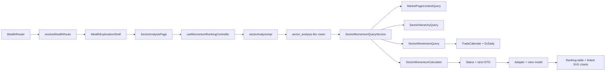
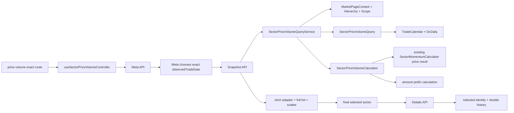
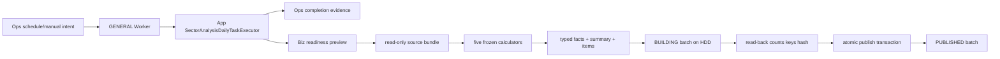
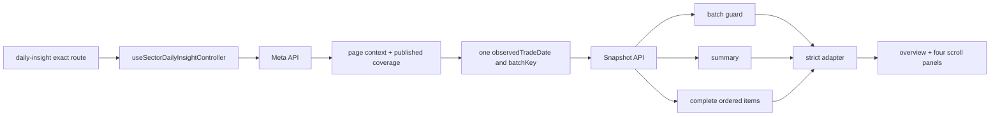

# 财势探查｜板块分析低层设计 v1

## 0. 文档状态

- 状态：v1.64；M22、M23、动量切读／M24R及M24.3双动量已PASS/CLOSED。M24.4相对轮动代码与Prod只读预验收通过：7,688行和所选60日轨迹零差异、3/5SQL、直接服务P95 242.67/352.49ms，正式部署／认证HTTP／页面验收OPEN。不新增上游审计、不回查原行情、不改公式与页面；已发布PARTIAL不回退。下一步为相对轮动提交／部署后的独立验收，再进入成员广度、量价分布；M24／G63仍进行中，不进入M25～M26。
- 编写日期：2026-09-03。
- 适用仓库：`/Users/congming/github/goldenshare`，当前开发分支 `dev-interface`。
- 产品依据：[财势乾坤板块分析产品交互基线文档](./sector-analysis-product-interaction-baseline-v1.md)。
- 技术依据：[财势探查｜板块分析技术实施方案 v1](./sector-analysis-implementation-design-v1.md)。
- Figma：`Goldenshare Web`，file key `RADlZzREU4lPVviYfkLy6x`，页面 `14 Wealth Exploration - Sector Analysis`（`965:2`）。
- 目标路由：五条既有精确方法路由保持不变；M25 新增 `/wealth/exploration/sector-analysis/daily-insight`，并在其正式上线时把板块分析根地址改为 `replace` 到每日洞察。六个工作区始终只挂载当前 controller。
- 目标 API：既有十四只板块分析只读 API 保持公开合同不变；M25 新增 `/daily-insight/meta` 与 `/daily-insight/snapshot` 两只 strict 只读 API。
- 待实施项：M23无待执行的生产回补，M24R、动量与双动量切读均无待验收项。下一步固定为相对轮动改读物化事实，再依次完成成员广度、量价分布切读并独立验收。本次仅按用户批准完成文档结案与提交，不自动开发下一方法或部署。随后才是M25每日洞察前后端、M26自动化与最终交付。TaskRun `10421`、`10518`、`10548`、`10567`、`10585` 与 `10587` 均保留为不可变执行证据，不得重用或改写。

本文定义财势探查页面结构、五个已完成的独立分析方法，以及新增“每日洞察 + 每日事实物化”的代码级方案。每日洞察不是第六种公式，只汇总同一业务日期、同一层级版本、同一公式包和同一发布批次下的五方法客观事实；不生成综合分、预测、信号、机会等级或买卖建议。M3A 成分股明细和成员广度逐只股票明细继续按需读取，不进入本期物化结果。

---

## 1. 冻结口径与开发约束

| 硬口径 | 编码落点 | 必须证明的正反例 |
|---|---|---|
| 五方法与每日洞察职责分离 | 五个独立 method feature + 一个 `daily-insight` feature | 每日洞察只汇总五方法冻结事实，不成为第六种公式；没有概念、地域、申万、Heat、预测或 QTF 依赖 |
| Prod 是唯一事实源和结果 serving | 六张现有来源表 + 九张 `core_serving` 新表 | 物化只读 `TradeCalendar/WealthSectorHierarchy/DcDaily/DcMember/EquityDailyBar/EquityAdjFactor`，不读 API、DG/Lake、资金或 Heat；线上洞察与切读只读 PUBLISHED typed facts |
| 公共业务日期唯一 | `MarketPageContextQuery` + URL `tradeDate` | Pre-M2 将内部访问收敛为 1 条 SQL；20:00 默认口径、显式历史严格命中和公开合同不变；前端无本机业务日计算 |
| 历史缺口必须可见 | Meta 日期覆盖 DTO + 日期选择器 | 覆盖区间内全部 SSE 开市日均返回；COMPLETE/PARTIAL/MISSING 不被过滤 |
| 五类比较池固定 | `SectorMomentumScope` + `resolve_scope_pool()` | 全体一级/二级/三级与两类直属子级集合完全正确 |
| 周期固定为 1/5/10/20/30 | `SectorMomentumPeriod` | 未批准周期和任意整数被拒绝 |
| 1 日读取 `pct_change`，多日读取完整 N+1 收盘窗口 | `SectorMomentumCalculator` | 缺任一日期、空值、非正收盘均不可计算，不补值 |
| 涨/跌只改变展示顺序 | `sort_ranking_rows()` | 同行业 `returnPct/strengthRank/percentile` 在两方向完全一致 |
| `strengthRank` 是唯一历史排名 | `rank_strength()` | 最高收益第 1，竞赛排名，历史接口无 direction |
| 完整列表，不做 TopN | rankings DTO + table | 返回当前比较池全部对象，null 行仍保留在末尾 |
| 三级成员使用来源全集 | members DTO + member table | 不套 Heat 有效池；B 股、停牌或行情缺口行保留并显示 `--` |
| 成员收益公式独立 | `SectorMemberReturnCalculator` | 1 日取 `pct_chg(t)`；多日逐日连乘；禁止复用行业首尾收盘价算法 |
| 成员事实版本一致 | members 必填 `hierarchyVersion` | 版本不一致返回 409；禁止把不同层级版本的榜单和成员拼接 |
| 成员局部状态隔离 | 独立 member controller/state | 成员 Loading/Empty/Error 不改变整页 READY/DELAYED，不遮蔽行业榜单和右侧详情 |
| 当前行业尽量保留 | URL reducer + controller | 日期、周期、方向、显示范围变化不擅自换行业 |
| 两图同时展示并联动 | `MomentumDetailPanel` | 同一交易日索引、独立纵轴、缺点断线、排名第 1 在顶部 |
| 1600 仅是像素基线，运行时必须等宽适配 | `sector-momentum.css` | 1600px 为 `776+12+776`；1512px 自动收缩且无裁剪；不得把 1564px 写成运行时固定宽度 |
| 页面状态只用五态 | API 四态 + 前端 LOADING | READY/DELAYED/EMPTY/ERROR；PARTIAL 只能作为日期覆盖元数据，不能成为第六种页面状态 |
| 双动量是独立方法 | 独立 route、Meta/Results、controller 和工作区 | 动量排名与双动量不能同时挂载；不得复制收益/排名公式或解释旧页面 DTO |
| 双动量周期与阈值固定 | period `5/10/20/30`；threshold `70/80/90` | 1 日、任意周期、任意阈值均拒绝；阈值相等时计入领先 |
| 双动量只描述当前状态 | `sector-dual-momentum@1` 分类器 | 不输出综合分、预测、信号、成功率、Lift 或发布状态 |
| 相对轮动是第三个独立方法 | `sector-relative-rotation@1` + 独立 route/API/controller | 不使用传统 RRG、不读取宽基、不与前两种方法混算 |
| 相对轮动只复用冻结动量事实 | `SectorMomentumCalculator.calculate_for_dates()/rank_strength()` | 不复制区间收益、百分位公式；前端不得计算 X/Y 或象限 |
| 相对轮动参数固定 | `period=5/10/20/30`、`lookback=5`、`trail=20/30/60`、`minGroup=3` | 1 日、任意 lookback/trail、任意分界值和页面自定义公式均拒绝 |
| 相对轮动原子响应 | Results 同时返回当前全量快照与一条选中轨迹 | 选中切换不能先换名称再显示旧轨迹；搜索/象限筛选/hover/放大零请求 |
| 成员广度三项事实独立 | `sector_member_breadth_calculator.py` | 数量、成交额、均线分别计算分母、资格和缺失；复权因子缺失不得污染前两项 |
| 成员广度日期检查随计算发生 | Meta 复用公共行业日期覆盖；Rankings／Details 使用公共页面日期并在合并窗口／成员 SQL 校验覆盖边界 | 禁止复制20:00规则、信任前端日期或让 Meta 扫描成员／行情／因子全历史；所选日期缺口按指标返回 |
| 成员广度复权均线 | `close × adj_factor` + 完整 N 日窗口 | 5/10/15/20/30/60；缺任一日只使该股票均线不可计算；现有 M3A 不读取因子 |
| 自动日期与历史日期分离 | Meta `dateContext` + URL 是否存在 `tradeDate` | 同一日期在自动回退时显示 Delayed，用户显式选择时不显示自动回退提示 |
| 成员广度性能分层 | Meta／非MA60 1秒，MA60 2秒 | Rankings 只算所选指标；MA60 放宽不得扩散到其他请求 |
| 工作区按需挂载 | `SectorAnalysisMethodBar` + `SectorAnalysisPage` | M25 增加每日洞察后共六项；始终只挂载当前 controller，未选工作区零请求、零隐藏 DOM |
| typed facts 原子发布 | 九张 `core_serving` 表 + 单一 publish batch | BUILDING/FAILED 不可见；read-back 后在小事务中 SUPERSEDE 旧批次并发布新批次；同 plan/content 幂等零新增 |
| 九表全对象只落 HDD | Alembic 显式 DDL + catalog read-back | heap、TOAST、主键、唯一和普通索引全部解析为 `gs_raw_cold_hdd`；缺 tablespace、权限或物理位置时迁移 fail-closed，禁止回退 SSD |
| 不新增基础设施分叉 | 既有 Prod 连接、GENERAL Worker、Ops maintenance 主链 | 不新增数据库、账号、连接、Lane、systemd、队列、Redis、第三方依赖或 DatasetDefinition |
| 五方法只能等价切读 | typed fact reader + 逐字段 oracle | 公开 URL/query/DTO/状态机不变；未通过全 scope/周期/缺失逐字段等价前继续现算，禁止运行时双读和永久 fallback |
| 量价分布独立公式与状态 | `sector_price_volume_contract.py` + calculator | `1/5/10/20/30`、两段等长成交额窗口、四种客观状态；不生成综合分或预测 |
| 量价分布完整日口径 | 专属 Meta 覆盖查询 | 当前发布全部行业同日 `close/pct_change/amount` 有效才是 COMPLETE；自动模式可回退，显式日期绝不回退 |
| 量价分布完整列表与缺失透明 | Snapshot DTO + 前端列表／散点 | 全池行业都返回；任一坐标缺失的行业仍显示 `--`，不画伪点；全部坐标缺失才 Empty |

公式身份固定：

```text
formulaKey = sector-cross-sectional-momentum
formulaVersion = 1
```

本版本描述当前和历史表现，不输出预测、信号、成功率、持续性或未来解释。

成员广度公式身份固定：

```text
formulaKey = sector-member-breadth
formulaVersion = 1
```

量价分布公式身份固定：

```text
formulaKey = sector-price-volume-distribution
formulaVersion = 1
```

每日事实与洞察身份固定：

```text
formulaBundleVersion = sector-analysis-daily-facts@1
contractKey = sector-daily-insight
contractVersion = 1
templateVersion = sector-daily-insight-template@1
```

上述版本只随明确的新公式、字段语义或模板文字合同升级；重新计算、历史回补和同内容幂等重放不得自行改版本。

## 2. 当前实现审计

### 2.1 CodeGraph 与代码影响面

M1 开发前使用仓库根 CodeGraph 索引完成了入口、调用方、被调用方、共享契约、测试和前端消费者核验。索引状态为 healthy；M1 前基线主链为：

```text
WealthRouter
  -> routerState.isWealthExplorationPath
  -> WealthExplorationPage
      -> MarketPageContext API
      -> MajorIndices API
      -> TurnoverInsight controller

MarketOverviewPage
  -> market-overview/layout/ShortcutBar

sector-overview API
  -> MarketSectorOverviewQueryService
      -> SectorHierarchyQuery
      -> SectorSelectionResolver(SectorHierarchyNode)
```

M1 完成后的当前主链为：

```text
WealthRouter
  -> resolveWealthExplorationRoute
      -> WealthExplorationLandingPage
      -> TurnoverInsightPage
      -> SectorAnalysisPage
  -> WealthExplorationShell
      -> MarketPageContext API
      -> MajorIndices API

MarketOverviewPage
  -> MarketShortcutBar
      -> shared/ui/shortcut-bar
```

结论：页面结构、精确路由和共享 Shortcut 已完成；M2 已提供 meta/rankings/history 三个真实接口，M3 已实现动量排名结果工作区，M3A 已实现 members 第四接口、独立成员计算主链、成员局部 controller/state 和左栏下半区。M3 与 M3A 已于 2026-08-28 通过用户验收。

### 2.2 前端真实现状

1. `routerState.ts` 使用判别联合解析四个精确地址；未知 `/wealth/exploration/**` 不会被宽松吞入模块路由。
2. `/wealth/exploration`、`/turnover-insight` 和 `/sector-analysis/momentum-ranking` 分别由 landing、turnover、sector 三页承载；板块根地址以 `replace` 保留 query 后进入动量地址。
3. `WealthExplorationShell` 只加载公共时间和主要指数 ticker；入口首页没有成交额或板块业务请求。
4. `TurnoverInsightPage` 独占既有 `TurnoverInsightSection/controller`，接口、超时和 adapter 合同未变。
5. `SectorAnalysisPage` 已挂载真实动量排名 controller/workspace；一个 active 方法和四个“待建设”按钮仍保持，四按钮只产生本地 toast，不改变 URL，不发对应方法请求。
6. 市场总览六项数据已移入 `MarketShortcutBar`；共享卡片外层改为原生 button，内部 DOM/class、6 等分、10px 列距、12px 底距、最小高 72px 和内边距保持不变。
7. 旧 `WealthExplorationPage`、旧私有 Shortcut、零高度 `sector-radar` 节点和对应历史门禁已经删除，不留 wrapper 或 re-export。
8. `TopMarketBar`、`PageBreadcrumb`、market context 和主要指数 ticker 继续复用既有公共能力，没有复制或改契约。

### 2.3 后端真实现状

1. `DcDaily` 映射 `core_serving.dc_daily`，业务键为 `(ts_code, trade_date, category)`；本需求使用 `close/pct_change`，已有 `trade_date` 及 `(trade_date, category)` 索引。
2. `WealthSectorHierarchy` 映射 `core_serving.wealth_sector_hierarchy`，包含本需求所需层级、父级、root、路径、排序、版本和发布时间字段；已有 level/parent/root 三组查找索引。
3. `TradeCalendar` 映射 `core_serving.trade_calendar`，业务键 `(exchange, trade_date)`，已有 `trade_date` 索引。
4. `MarketPageContextQuery` 已实现 SSE 交易日和 20:00 默认切换。Pre-M2 已将显式模式最坏 2 条、默认模式最坏 4 条 SQL 收敛为 1 条只读 SQL；20:00 规则、公开方法、返回字段和消费者语义保持不变。
5. 当前工作区已把 `SectorHierarchyQuery` 移到 `queries/wealth/market/common/sector_hierarchy_query.py`，补齐父／root 名称、`is_leaf` 和最大 `published_at`；两个直接消费者均已切换到公共绝对 import，首页板块速览与架构回归 33 项通过。该独立完成项不等于 M2 API 已开始或完成。
6. 现有 `sector-overview` DTO 绑定首页 Top5、概念、地域、成员、资金和 Heat，不能扩写为本页 DTO。
7. `src/app/api/v1/router.py` 逐模块 include `src.biz.api.wealth.market.*`；板块分析只需新增一个 Biz router include，App 不承载业务逻辑。
8. `sector_analysis.py` 当前提供 meta、rankings、history 和 members 四类事实；members 使用独立 DTO、Query、Calculator、QueryService 和前端局部状态，不改变既有三类事实。
9. `DcMember` 已映射 `core_serving.dc_member`，业务键为 `(trade_date, ts_code, con_code)`，名称字段允许为空；`EquityDailyBar` 已映射 `core_serving.equity_daily_bar`，业务键为 `(ts_code, trade_date)`，`close/pct_chg` 均允许为空。M3A 复用现有 ORM，不新增模型或迁移。
10. 首页 `SectorMemberQuery.load_top()` 还会连接证券和停牌事实、最多返回 5 行并按单日涨跌幅排序；它只被首页板块速览消费，M3A 禁止修改、扩写或复用该 DTO。
11. 现有 `SectorMomentumCalculator` 的多日行业收益使用首尾收盘价比，不符合 M3A 已拍板的逐日 `pct_chg` 连乘；M3A 必须新增独立纯计算器。

### 2.4 当前状态与目标状态的差异

| 事项 | 当前代码 | 本期目标 | 处理方式 |
|---|---|---|---|
| 财势探查根页 | 纯入口首页（M1 已完成） | 纯入口首页 | 保持 landing 零业务请求 |
| 成交额路由 | `/turnover-insight`（M1 已完成） | 独立子页 | 保持既有业务合同 |
| 板块分析 | M2 三接口 + M3 动量工作区已实现 | 增加三级行业成员下钻 | 插入独立 M3A，不修改既有三个 endpoint 和右侧详情 |
| Shortcut | 共享展示 + 两个 feature wrapper（M1 已完成） | 零漂移共享能力 | 后续不得回写 feature 私有副本 |
| 行业层级 Query | Biz 公共 Query（当前工作区已移动） | Biz 公共 Query | M2 收口时再次回归首页板块速览，不再重复移动 |
| 动量事实 | meta/rankings/history 已实现 | 增加 members 第四个只读 API | 独立 query/calculator/service/DTO，不复用首页 Top5 |
| 页面异常态 | 整页五态已实现 | 增加成员局部四态 | 局部失败不得升级为整页 ERROR |
| 左栏 | 所有 scope 只有单行业榜单 | 两个三级 scope 使用上下双滚动 | 其他三个 scope 的 DOM、请求和尺寸保持不变 |

### 2.5 Prod DuckDB 只读覆盖证据

2026-08-27 用 DuckDB 1.5.5 `postgres` 扩展，通过现有 Web 只读连接直接附加 Prod，白名单只包含 `trade_calendar/wealth_sector_hierarchy/dc_daily`。审计没有写库、导出来源行或建立快照。

1. 当前层级为一级 31、二级 128、三级 337，共 496 个行业。
2. `2024-01-02..2026-08-26` 有 642 个 SSE 开市日、317,825 条当前行业池行情；重复业务键、非开市日行情、无效 close 和无效 pct_change 均为 0。
3. 20 个开市日存在 607 个行业日缺口：2026-05-20 缺 484、2026-05-18 缺 97、2026-05-25 缺 9，其余 17 日各缺 1。完整日期表见技术方案第 5.5 节。
4. 另有 14 个不属于当前发布层级的历史行情代码、7,216 行；它们不得进入当前行业池、覆盖分母或排名。
5. 以 2026-08-26 为结束日审计最近 60 个结束点：5 日完整窗口 29,760/29,760；10 日 29,249/29,760；20 日 24,391/29,760；30 日 19,531/29,760。历史缺口会真实传导到 N+1 可计算性。

这项审计关闭“是否存在缺口”的事实问题，但不关闭 M2 的实现验收：编码仍必须用同一门禁生成日期覆盖状态、空值行和断点，并通过正反例证明没有补值或隐藏缺口。

### 2.6 M3A Prod 成分事实审计

2026-08-28 使用现有 Web 只读连接审计当前 337 个三级行业、最近 30 个 SSE 开市日和目标日成员行情；只返回聚合数量和少量代码样本，没有写库、导出来源行或建立副本。

1. 最近 30 个开市日 `2026-07-17..2026-08-27` 共 10,110 个三级行业组日，成员快照缺失为 0。
2. 单行业成员数最小 1、P50 11、P95 约 55、最大 139；139 行冻结 DTO 估算约 `13.5KB`，低于 `256KB`，因此完整返回且不分页。
3. 目标日 5,641 条来源成员中 5,547 条有日行情，94 条无目标日行情：78 条 B 股、3 条停牌、13 条其他缺口。全部保留为来源成员并显示 `--`，不引入证券池、停牌补零或前向填充。
4. 1/5/10/20/30 日严格可计算数量为 `5,547/5,537/5,529/5,508/5,487`。
5. 两张来源表未发现重复业务键；目标日名称无空白，但 ORM 允许名称为空，DTO 必须允许 null。

该证据冻结 Members `<=4 SQL` 和完整列表设计；实现后仍需验证真实 API P95，不能用聚合审计替代部署态性能结论。

### 2.7 M5～M7 双动量代码与消费者审计

2026-08-28 在仓库根的最新 CodeGraph 索引上复核了后端 API、QueryService、Calculator、schema、前端路由、方法栏、URL 状态、controller、页面消费者和测试。索引状态为 up to date，共 2,787 个文件、49,059 个节点和 124,757 条边。

1. `SectorMomentumQueryService.build_rankings()` 已改为消费 `SectorMomentumSnapshotQueryService` 的不可变单日快照，只增加 `direction/listPosition` 和旧 Rankings DTO；双动量直接消费同一快照，不依赖旧页面响应。
2. `SectorMomentumCalculator` 已正确实现本需求所需的区间收益、竞赛排名和并列平均百分位。M6 必须复用该纯计算器；禁止复制公式、修改 `formulaVersion=1` 或在双动量分类器里重算收益和百分位。
3. 单日快照已一次加载公共日期、层级、比较池和行情，按 `(display_order, sector_code)` 保留全量事实行；既有 Rankings service 负责方向排序与旧 DTO，新 Dual service 负责状态分类与新 DTO。History 继续走原多日网格，未进入快照重构。
4. 公共 Meta service 已只输出日期、层级和覆盖事实；既有 Meta 与双动量 Meta 分别映射自己的 strict DTO，旧 Meta 的 `period=1/directions/historyRanges` 未泄漏到双动量。
5. 前端已具有 `sector-analysis-momentum` 与 `sector-analysis-dual-momentum` 两个精确路由；`SectorAnalysisPage` 通过显式方法判别只挂载一个 controller，`SectorAnalysisMethodBar` 对两个已建设方法执行真实导航，其余三个按钮继续仅触发“待建设”提示。
6. 现有动量 URL/parser/API/adapter/controller 都在 `momentum-ranking` feature 内，含方向、历史范围和成员事实；不得扩成带 method 分支的通用大 controller。双动量建立 feature-local 的 Meta/Results、URL 和状态边界。
7. CodeGraph 影响面确认 `SectorMomentumQueryService` 变化会传导到既有 meta/rankings/history API 与查询测试，`SectorMomentumCalculator` 会传导到 rankings/history 和计算测试；因此 M6 的硬回归是四个既有 endpoint 响应零变化和 calculator 全量测试，而不是只测新接口。
8. `SectorAnalysisMethodBar` 当前唯一页面消费者是 `SectorAnalysisPage`；`parseSectorMomentumUrlState` 的直接消费者是现有 controller 和测试。新增双动量独立 parser 可避免污染现有 URL 合同。
9. 双动量不需要 history、members、成分股、资金、Heat、QTF、DG/Lake 或数据库写入；其列表、摘要和散点图都由同一个 Results 全量响应派生。M5 没有发现需要新增配置、依赖、迁移、缓存、结果表或账号的理由。

### 2.8 M9 相对轮动代码、消费者与性能审计

2026-08-28 使用仓库根最新 CodeGraph 索引（up to date，2,816 files、49,716 nodes、126,302 edges）和当前源码完成实现前影响面核验。审计覆盖 `SectorMomentumCalculator`、`SectorMomentumQuery`、`SectorMomentumSnapshotQueryService`、动量／双动量 QueryService、Biz router/schema、`SectorAnalysisPage`、方法栏、前端路由、双动量独立 controller／adapter／SVG 以及全部直接测试消费者。

1. `SectorMomentumCalculator.calculate_for_dates()` 已能在一个内存事实索引上批量生成多个目标交易日的完整 N 日收益；`rank_strength()` 已固定最强 100、最弱 0、并列平均百分位和 0.1 精度。相对轮动只能组合这两项公开纯计算能力，不能调用 `SectorMomentumQueryService` 的私有 `_rank_by_date()`，也不能复制公式。
2. `SectorMomentumSnapshotQueryService.prepare_for_context()` 已按“公共日期→层级版本→比较池→目标日解析”返回不可变准备事实。相对轮动可以复用该公开方法完成前三项 SQL 与版本前置门禁，但不能循环调用 `build_prepared()`，否则会为每个轨迹日期重复读取开市日和行情。
3. `SectorMomentumQuery.load_open_dates()` 当前明确拒绝 `count>90`；M10 只允许把该上限和错误文案精确改为95，并增加96拒绝反例。既有 History 最大请求仍为90，不得改变其输出或允许任意窗口。
4. 正常 Results 的真实 SQL 形态可以固定为5条：公共 page context 1条、层级 1条、目标日解析 1条、95日交易日 1条、当前比较池行情 1条。`dc_daily` 必须只出现一条集合查询，禁止按日期、行业或轨迹点循环读取。
5. `SectorMomentumQueryService.build_history()` 已有多日网格思路，但还会为了详情摘要并入全层级／父级池，且 DTO 是单行业收益与排名趋势，不符合相对轮动的“当前全池 + 一条轨迹”原子合同；不得复用或扩写该 endpoint。
6. `SectorDualMomentumQueryService`、schema、adapter、URL 和 controller 提供了专属方法分层、strict DTO、5秒超时、409重载、过期响应丢弃和按需挂载范式。相对轮动应复制职责形态而不是复制业务字段或在其中增加 method 分支。
7. M9 审计时，`SectorAnalysisPage` 和 `SectorAnalysisMethodBar` 的可用方法类型只包含 `momentum-ranking | dual-momentum`，`WealthRouter/routerState` 也只有两个精确方法路由；因此 M11 必须一次性增加第三个判别分支，并在当时继续让成员广度和量价分布保持零请求 toast。该历史事实已由 M11 和 M15 依次推进为当前四条正式方法路由，只有量价分布仍保持 toast。
8. `tests/architecture/test_wealth_sector_analysis_guardrails.py` 已把板块分析来源全集冻结为五张表，但相对轮动方法级白名单仍需单独限制为前三张；同时需要把相对轮动文件加入禁止 QTF/DG/Lake/预测/持久化扫描。
9. 中央注册表原先把 `SA_FACT_VERSION_MISMATCH` 写成“双动量专用”，与技术方案要求的同语义复用冲突。本轮已把它收敛为双动量／相对轮动 Results 共用的页面级层级版本冲突；成员局部请求仍单独使用 `SA_MEMBER_FACT_MISMATCH`，没有新增异常码。
10. 配置审计结论为“不适用”：period、5日改善、trailLength、最小组规模、X轴范围和分界线都是版本化公式合同；本期不增加 env、Settings、数据库配置、配置文件、运营开关或页面常量的第二事实源。

M9 最大窗口使用现有 Web 只读连接做了有界核验：只读当前发布的337个三级行业、最近95个 SSE 开市日，事实行31,614条；不导出来源行、不保存快照。结果如下：

| 证据 | 结果 | 结论 |
|---|---:|---|
| SQL 数 | 5 | 通过 |
| `dc_daily` 行数 | 31,614（理论上限32,015） | 有界 |
| 目标计算日期 | 65（60轨迹+5比较前沿） | 与公式一致 |
| 冻结 DTO 估算最大响应 | 159,859 bytes | 通过256KB |
| 数据库5条 SQL 的 `EXPLAIN ANALYZE` 执行合计 | 91.868ms | 通过分段预算 |
| 纯计算+DTO/JSON 50次 P95 | 107.363ms | 通过分段预算 |
| 同拓扑核心链路估算 P95 | 199.231ms | 低于500ms，允许进入 M10 |
| 本机跨网络全链20次 P95 | 2,343.531ms | 只记录网络诊断，不冒充部署态 P95 |

分段估算只关闭 M10 的“方案是否明显不可行”门禁，不代替 M12 的部署态真实 HTTP P95。M10 不得以该结果为由删减行业、轨迹或字段，也不得引入缓存、索引、结果表或分页。

### 2.9 M13 成员广度代码、消费者与性能审计

2026-08-29 使用仓库根最新 CodeGraph 索引（up to date，2,833 files、50,270 nodes、126,705 edges）、当前源码和 Prod 只读 `EXPLAIN ANALYZE` 完成编码前审计。影响面只包括 Biz 板块分析 API／schema／query／service、中央异常注册表、Wealth 板块分析路由／方法栏／页面及新增 feature；Foundation 模型、同步、Ops、QTF、DG/Lake、首页板块速览和三个已完成方法不需要修改。

1. M13 审计时没有成员广度 API、schema、query、calculator、service、route、controller 或运行页面；M14 已新增独立后端合同与三只 API，M15 已新增第四条精确 route、独立 API/adapter/URL/controller/feature，并从 `SectorAnalysisMethodBar` 移除成员广度“待建设”行为。既有方法 DTO 未被偷渡成员广度字段。
2. `SectorMemberDetailQueryService` 只服务 M3A 三级行业成员明细：最多30日，只读取目标日成员和 `close/pct_chg`，区间涨跌幅使用逐日 `pct_chg` 连乘，不读取复权因子。它没有五类比较池、历史逐日成员、成交额或均线语义，M14 必须建立独立链路。
3. `core.equity_adj_factor` 是本需求唯一复权因子表；均线位置使用 `close × adj_factor`。任何窗口日缺价格或因子，只使对应股票的均线事实不可计算，不影响该股票的数量／成交额事实，也不使整个日期回退。
4. 现有 `SectorTradeDateAvailabilityDto` 只能表达当前行业 `dc_daily` 的 `COMPLETE/PARTIAL/MISSING`，不能同时表达“三项成员指标各自可用性”。成员广度 Meta 只复用它作为公共交易日期覆盖；Rankings／Details 使用自己的指标可用性合同，禁止改写这个既有公开 DTO。
5. URL 中是否存在 `tradeDate` 是自动日期与显式历史的唯一判别。Meta 根据公共行业日期覆盖返回 `expectedTradeDate/defaultTradeDate/defaultStatus`；Rankings／Details 只计算显式传入的实际日期，不根据相同日期值猜用户意图。
6. Meta 若按410个历史交易日逐日检查496个行业成员，数据库阶段约8.95秒；即使改成逐键探测也约3.11秒。该设计已否决。Meta 只能执行公共日期、层级和 `dc_daily` 覆盖三条 SQL，零成员／行情／因子历史扫描。
7. 目标日496行业成员覆盖检查约6ms；真正计算时做所选日期和有界窗口检查不会增加无意义的全表预扫。成员数和成交额只需要目标日；MA 需要成员股票的 N 日价格和因子。
8. 最新三级全榜5,641只成员的 MA60 原始窗口约331,327股票日行；数据库 join 约3.99秒，按目标投影聚合约1.54秒。M13 当时冻结 MA60 `<=2,000ms`、其他请求 `<=1,000ms`；M16R2 后该历史门禁仅对 Details 被第6.32.5节新8秒最终门禁覆盖，Meta/Rankings仍保持原值。
9. Rankings 必须只计算请求中的一个指标，不能为了“顺便返回三项可用性”让数量榜或成交额榜等待均线。Details 的正式交互同时展示三项组成与趋势，因此按所选 `maPeriod` 计算三项事实，MA60 使用两秒门禁。
10. 最大来源成员 Details 为625只；119日价格／因子窗口查询约366ms，具备按请求集合计算可行性。M14 不新增索引、缓存、结果表、分页、截断、迁移或后台任务。

### 2.10 M17 量价分布代码与消费者审计

2026-08-30 使用仓库根 CodeGraph 当前索引和源码完成 M17 影响面复核，覆盖聚合 API router、现有 momentum Query／Calculator、五类 scope helper、前端 route／方法栏／页面挂载、现有四个 controller、测试和首页板块速览消费者。结论如下：

1. M17 开工时没有量价分布 API、schema、query、calculator、service、精确路由、controller 或运行工作区；方法栏中的“量价分布”仍是本地待建设行为。该条只记录 M17 的实现前事实，M18/M19 已按后文里程碑证据完成对应前后端能力。
2. `DcDaily` 已提供 `ts_code/trade_date/category/close/pct_change/amount`；业务键为 `(ts_code, trade_date, category)`。量价分布无需修改 Foundation ORM、DatasetDefinition、同步、索引或迁移。
3. 既有 `SectorDailyFact` 只有价格事实；给它增加 `amount` 会改变动量、双动量和相对轮动消费者。量价分布必须新增专属 `SectorPriceVolumeDailyFact`，既有事实合同零变化。
4. 既有 `SectorMomentumCalculator` 已冻结价格区间公式和完整 `N+1` 开市日语义。新 calculator 通过组合该纯计算器的公开批量入口获得价格结果，不复制第二套价格公式；成交额只在量价专属 calculator 中计算。
5. 既有 `SectorMomentumQuery.resolve_trading_date()` 的有效事实条件只覆盖价格，不覆盖 `amount`；其 `load_open_dates()` 上限为95且仍被相对轮动消费。量价分布必须新增专属覆盖谓词和119日上限，不修改或放宽共享 Query。
6. `resolve_scope_pool()` 已正确实现一级／二级／三级总榜和两类直属子级范围，可以原样复用；不得复制父子闭包算法。
7. 当前聚合 router 已挂载在 App；M18 只需在 `src/biz/api/wealth/market/sector_analysis.py` 追加三只 route，不修改 `src/app/api/v1/router.py`。
8. 前端 `routerState.ts` 的 route 联合、`SectorAnalysisMethodBar` 的四方法联合和 `SectorAnalysisPage` 的按需挂载均需要第五个显式分支。不得把量价分布塞进任一既有 controller，也不得用宽松前缀匹配吞掉未知子路由。
9. 当前图表均为 feature 内 SVG/CSS，没有可直接复用且语义完整的散点组件。M19 新增量价专属几何 helper 和 SVG；不引入第三方图表依赖，也不把未形成两个真实消费者的组件过早提升为 shared。
10. 精确影响面限定为第5.11节文件矩阵。首页、TopMarketBar、Shortcut、Foundation、Ops、QTF、DG/Lake、既有十一只 endpoint 和前四个方法的事实／页面都必须零变化。

### 2.11 M21 每日事实、Ops、API 与前端影响面审计

2026-08-31 使用仓库根 CodeGraph 最新索引与当前源码完成代码级影响面核验。索引状态为 up to date，共 2,953 个文件、53,267 个节点和133,487条边；审计覆盖共享快照、五方法 QueryService、API、ORM 注册、Alembic、Ops action/dispatcher/scheduler、App executor 和前端 route/page/method bar。

1. `SectorMomentumSnapshotQueryService` 当前影响48个符号，是动量、双动量、相对轮动、成员广度和量价分布的共同日事实入口之一；切读前不得直接改其公开输出。M24 必须先新增 typed reader，再按方法逐个替换 QueryService 内部来源。
2. `SectorMemberBreadthQueryService` 影响36个符号，当前 Rankings/Details 都会进入成员、行情和因子计算；行业级组成、名次和趋势可由 typed facts 替代，但 Details 的逐只股票行必须继续走现有按需来源主链。
3. `SectorPriceVolumeQueryService` 影响25个符号，Meta/Snapshot/Details 三只接口均有直接测试和前端消费者；物化切读不得改变 `3/5/5` 公开 SQL 以外的 URL、DTO、状态和缺失语义。
4. `sector_analysis.py` 当前公开十四只只读 endpoint；本期只新增两只 daily-insight endpoint。每日洞察不得循环调用十四只 HTTP endpoint，也不得在 Biz QueryService 内调用其他页面 QueryService 拼响应。
5. `SectorAnalysisPage` 当前判别五个方法，`WealthRouter` 将板块根地址 `replace` 到动量排名，`SectorAnalysisMethodBar` 只有五项。M25 需同时新增第六个判别值、精确 route、path builder、根重定向和 daily controller；未选方法仍不得挂载。
6. Foundation 模型由 `src.foundation.models.all_models` 显式进入 App registry；只创建 model 文件但漏掉 `core_serving/__init__.py` 或 `all_models.py` 会导致迁移后运行时 metadata 不完整，因此两处注册都列为 M22 原子改动。
7. 现有 HDD migration 证明仓库已有 `TABLESPACE gs_raw_cold_hdd` 和 `USING INDEX TABLESPACE` 先例；本期还必须额外验证迁移角色权限和 catalog 物理位置，并 read-back TOAST 与所有索引，不能只验证表名存在。
8. `TaskRunDispatcher` 虽声明通用 `MaintenanceExecutor.plan()`，当前注册动作仍把非 Heat replay/news 的执行单元默认拼成 Heat 单日 unit；新增 executor 前必须把普通 registered maintenance action 收敛为调用自身 `plan()`，并让 Heat 单日 executor 同样通过该通用入口，删除 `_single_day_heat_unit()` 的业务特例。公开 TaskRun 合同不变。
9. `OperationsScheduleService` 和 `OperationsScheduler` 当前把自动 readiness 命名和分支硬编码为 Heat；直接再复制一套 analysis 分支会继续堆业务特例。M22 只把该能力收敛成按 action key 注入的 readiness evaluator 映射，Heat 行为用原回归证明零变化；Ops 不导入 Biz，App 组合具体 evaluator。
10. `daily_market_close_maintenance` 已包含 `daily/adj_factor/dc_index/dc_member/dc_daily`；本期来源证据只要求其中 `daily/adj_factor/dc_member/dc_daily` 与当日层级已发布事实，不依赖 `daily_moneyflow_maintenance`。层级当前只有一份 serving 快照，因此 readiness 还必须把 hierarchy version 和 publishedAt 纳入 plan/hash，而不是虚构一个不存在的日级 hierarchy workflow。
11. 当前 Alembic head 审计证据为 `20260830_000167`，但实施日必须重新执行 `alembic heads`；迁移文件名与 `down_revision` 不在本 LLD 中写死。
12. 当前实现没有九张事实表、materializer、replay planner、daily insight API 或前端 feature。本版只冻结编码方案，不把任何未实现内容写成完成。

结论：现状与技术方案不存在需要改变产品口径的冲突。Ops 的 Heat 特例和可空父级主键是编码层必须先纠正的真实问题，已在第5、6、11、13节冻结为 M22 范围，不需要新增产品拍板。

## 3. Figma 开发交付审计

### 3.1 正式节点基线

| 状态 | 节点 | 尺寸 | 用途 |
|---|---|---:|---|
| Ready／一级总榜涨幅 | `965:55` | 1600×1292.390625 | 默认视觉基线 |
| Ready／一级总榜跌幅 | `971:352` | 1600×1292.390625 | 方向切换 |
| Ready／二级总榜 | `1051:951` | 1600×1292.390625 | 全部二级、所属一级路径和双排名摘要 |
| Ready／三级总榜 | `1051:1251` | 1600×1292.390625 | 全部三级；左栏上下双滚动，成员面板 `1085:1268` |
| Ready／一级内二级 | `987:476` | 1600×1292.390625 | 单父级选择器及下钻结果 |
| Ready／二级内三级 | `987:776` | 1600×1292.390625 | 两级联动；左栏上下双滚动，成员面板 `1088:1268` |
| Ready／双图 Hover | `1053:5261` | 1600×1292.390625 | 两图同日期十字线和联合 Tooltip |
| Ready／交易日选择器 | `1062:2` | 1600×1292.390625 | COMPLETE/PARTIAL/MISSING 可见且均可选择 |
| Loading | `1036:634` | 1600×1292.390625 | 稳定骨架加载态 |
| Delayed | `1036:1014` | 1600×1292.390625 | 保留上一完整交易日内容 |
| Empty | `1036:1386` | 1600×1292.390625 | 全部不可计算或显式日无数据 |
| Error | `1036:1762` | 1600×1292.390625 | 错误与重试 |

`1292.390625px` 是现有 Figma 内容边界形成的画板高度，不是运行时固定高度合同。编码只把 `1600px` 作为桌面截图验收宽度，并按下文整数尺寸实现内部骨架；页面根节点不得写死 `height:1292.390625px`，应由内容高度和现有页面 Shell 自然撑开。

双动量旧草稿 `967:72` 已冻结并移出正式画板区域，不得作为编码依据。双动量唯一正式基线为：

| 状态 | 节点 | 编码用途 |
|---|---|---|
| Ready／符合条件 | `1096:1267` | 默认一级总榜、20 日、80% 阈值 |
| Ready／全部行业 | `1101:5478` | 同一 Results 本地切换完整列表 |
| Ready／一级内二级 | `1103:1425` | 所选一级直属二级池 |
| Ready／二级内三级 | `1104:1898` | 所选二级直属三级池 |
| Ready／二级总榜 | `1105:1583` | 全部二级同组比较 |
| Ready／三级总榜 | `1105:1938` | 全部三级同组比较 |
| Ready／Hover | `1106:1741` | 散点 Hover 与列表联动 |
| Ready／Partial Data | `1106:2109` | 有可用事实时的局部覆盖提示 |
| Loading | `1106:2528` | 稳定工作区骨架 |
| Delayed | `1106:7209` | 上一完整交易日事实与实际日期提示 |
| Empty | `1106:2713` | 比较池零个可计算对象 |
| Error | `1106:2894` | 合同或查询失败与重试 |
| Ready／Small Group | `1107:2216` | 可计算对象少于 3，只展示事实不判定资格 |
| Ready／No Qualified | `1115:2295` | 有可计算事实但零符合条件对象 |
| Ready／Missing Selected Coordinate | `1115:2571` | 所选行业可保留，但散点不伪造坐标 |

上述 15 张正式页面均为 `1600×1292.390625`，双动量工作区实例为 `1564×1006`，组件集为 `1132:9777`，交互说明节点为 `1137:422`。运行时继续使用等宽弹性 Grid，不把 1564px 写成固定宽度。

相对轮动旧草稿 `967:158` 已冻结并移出正式交付区；成员广度和量价分布的 `967:244/967:330` 继续只是 Draft 按钮占位。相对轮动唯一正式基线为：

| 状态 | 节点 | 编码用途 |
|---|---|---|
| Ready／一级总榜 | `1150:5870` | 默认一级总榜、20日强度、20日轨迹 |
| Ready／二级总榜 | `1152:6286` | 全部二级行业同组轮动 |
| Ready／三级总榜 | `1152:7139` | 337个三级行业密集点与完整列表 |
| Ready／一级内二级 | `1152:7994` | 所选一级直属二级池 |
| Ready／二级内三级 | `1152:8838` | 两级联动后的直属三级池 |
| Ready／Hover | `1154:7772` | 单点 Tooltip，不常驻全部名称 |
| Ready／Small Group | `1155:8264` | 坐标可绘制但不解释象限 |
| Ready／Missing Selected Coordinate | `1156:8578` | 全池保留、选中轨迹断线／不可绘制 |
| Delayed | `1156:13471` | 最近完整盘后日与实际日期提示 |
| Ready／放大图 | `1157:9236` | 与普通图共用同一坐标范围 |
| Loading | `1158:9938` | 保留方法栏和工具栏的稳定骨架 |
| Empty | `1158:10319` | 显式缺失或全池无当前百分位 |
| Error | `1158:10707` | 安全文案与重试 |
| Ready／Filtered | `1161:10430` | 列表局部搜索／象限过滤，图中全量点不变 |

相对轮动组件交付根为 `1148:5611`，状态徽标集为 `1148:5622`，列表行集为 `1148:5647`。14张页面均为 `1600×1292.390625`，工作区为 `1564×1006`；页面普通布局使用 Auto Layout，四象限绘图区和放大图内部坐标保留绝对定位。

### 3.2 结构与 Design System 结论

1. 正式画板直接复用 `TopMarketBar` 实例、`PageBreadcrumb` 实例、`ShortcutCard` 实例和方法 Tab 组件实例。
2. PageShell 使用纵向 Auto Layout；`1600px` 验收基线下左右工作区为 `776 + 12 + 776 = 1564px`，运行时两列使用等分弹性轨道，不得固定为 776px。
3. `1600px` 基线下工具栏为 `1564×128`、正文为 `1564×866`；运行时宽度均为当前 PageShell 内容宽度的 `100%`，高度不变。
4. 一级、二级和一级内二级继续使用单榜单左栏：`1600px` 基线下榜单滚动 viewport 为 `776×772`；运行时宽度随左列变化，高度仍为 772px。固定表头高 40px、行高 56px、`clipsContent=true`、`overflowDirection=VERTICAL` 不变。
5. 三级总榜和二级内三级的左栏包装节点分别为 `1085:1267/1088:1267`，均为 `776×866` 纵向 Auto Layout：上部行业榜单 `776×390`、间距 `12`、下部成员面板 `776×464`。成员面板包含 54px 标题、40px 固定表头和 370px 纵向滚动 viewport，成员行高 48px。
6. 图表、涨跌数据条和滚动条叠层保留绝对坐标。它们是几何绘图区，不应改成 Auto Layout。
7. 页面普通容器、工具栏、行、摘要卡、状态面板均使用 Auto Layout；不存在用补偿坐标模拟页面布局的新增节点。
8. 核心颜色已绑定 `CSQ / Market Overview / M0 / Color` 变量；Delayed 新增语义变量 `System/Warning`（`VariableID:1033:2`，`#f59e0b`），Web syntax 为 `var(--cs-color-warning)`，scope 覆盖 Frame/Shape/Text Fill 和 Stroke。
9. Shortcut 外层容器已从原始色值绑定到 `Background/Panel` 和 `Border/Subtle`。
10. Loading skeleton 已绑定 `Background/PanelSoft`；Error 重试复用 `Button / Neutral / M0`。
11. 模块自有正式文本已绑定可精确匹配的本地 Text Style；共享 TopMarketBar 和 ShortcutCard 内仍有少量继承自既有组件的原始色值和无 textStyleId 文本。它们是现有共享组件债务，本期不修改，否则会扩大到全站；其实际颜色与 Web Token 一致，不阻塞本模块编码。

### 3.3 已修正的问题

| ID | 原问题 | 严重度 | 修正结果 |
|---|---|---|---|
| F01 | 列表“排名”与详情“当前排名”混淆展示序号和业务排名 | 高 | 改为“序号”与“同组强度排名” |
| F02 | 上下两图各有一套 20/30/60 控件，可能形成两套显示范围 | 高 | 每张 Ready 画板只保留上图一套共用控件 |
| F03 | viewport 只有手绘滚动条，没有 Figma 纵向滚动语义 | 高 | 六类 Ready 榜单画板均设置 `VERTICAL` overflow |
| F04 | 只有 Ready，没有 Loading/Delayed/Empty/Error 正式页 | 高 | 新增四张完整正式状态画板 |
| F05 | 图题“历史排名”未说明范围，滚动收益未显示计算周期 | 中 | 标题改为周期和比较范围专属文案 |
| F06 | Shortcut 外层未绑定变量 | 中 | 绑定 Panel/Subtle Token |
| F07 | 本地 Breadcrumb 组件横向溢出 section 32px | 中 | `966:55.x` 从 32 改为 0 |
| F08 | Loading skeleton 继承白色底和原始灰 | 中 | 清除白底并绑定 PanelSoft |
| F09 | 涨跌榜把展示序号误当业务排名，百分位端点不符合公式 | 高 | 跌幅最弱示例改为 `31/31、0.0%`，涨幅最强示例改为 `100.0%`；方向只改变展示顺序 |
| F10 | 缺二级／三级总榜和双排名摘要 | 高 | 新增 `1051:951/1051:1251`；二／三级同时表达全层级和直属父级排名 |
| F11 | 四个待建设按钮跳草稿，行选择与下钻边界不清 | 高 | 清除草稿导航；行点击只选中，独立箭头下钻，三级明确无下钻 |
| F12 | 两图共用范围和 Hover 无正式编码状态 | 高 | 六张 Ready 均标注“两图共用”；新增 `1053:5261` 展示共享十字线和联合 Tooltip |
| F13 | 一级排名轴只到 20，无法表达 31 个对象 | 高 | 涨／跌与 Hover 纵轴完整覆盖 `1..31`；二／三级总榜分别覆盖 `1..128`、`1..337` |
| F14 | Warning Token 和模块文字样式未完成开发交付绑定 | 中 | 补 Web syntax/scope；模块自有正式文本绑定本地 Text Style，不拆共享实例 |
| F15 | 日期字段只表达当前值，无法看到缺口日 | 高 | 新增 `1062:2`；Popover 使用真实覆盖示例显示日期、完整／部分缺失／无数据图例及 `valid/expected`，所有状态均可选择 |
| F16 | 选中三级行业后无法继续查看成分明细 | 高 | `1051:1251/987:776` 左栏改为 `390+12+464` 双滚动；下部四列显示完整来源成员、目标日收盘价和当前周期涨跌幅 |

### 3.4 Figma 基线与运行时响应式映射

| Figma 区域 | 代码约束 |
|---|---|
| 1600 根画板 | 设计验收宽度，不是运行时固定宽度；运行时外壳使用现有 content max/min Token，不做 CSS scale，不写死 Figma 小数画板高度 |
| PageShell | `padding: 14px 18px 34px`，纵向 12px 基础节奏 |
| ShortcutBar | 1600 基线宽 1564px，运行时跟随 PageShell 为 `width:100%`；卡间 10px、当前两卡保持卡宽约 252.33px，不强制两卡拉满整行 |
| 方法栏 | 高 48px、内边距 4px、按钮间 4px |
| 工具栏 | 1600 基线为 1564×128；运行时 `width:100%`，16px 内边距、两行各 44px、行间 8px |
| 分析正文 | 1600 基线为两列各 776px；运行时 `repeat(2,minmax(0,1fr))`、列间 12px、高 866px |
| 单榜单左栏 | 仅一级、二级、一级内二级；运行时宽度等于左列；标题 54px、固定表头 40px、viewport 高 772px、行 56px |
| 三级双列表左栏 | 仅三级总榜、二级内三级；总高 866px，上榜单 390px、间距 12px、下成员 464px；两个 viewport 独立纵向滚动 |
| 成员表 | 标题 54px、固定表头 40px、viewport 370px、行 48px、左右内边距 12px；表头与行共用同一响应式 Grid |
| 详情摘要 | 1600 基线 776×112；运行时 `width:100%`、高度 112px |
| 趋势图 | 1600 基线每图 776×365；运行时 `width:100%`、高度 365px、图间 12px |
| 状态面板 | 运行时 `width:100%`、高 866px，替换正文但保留工具栏及页面骨架 |

Figma 是视觉和布局事实源；交互状态、数据语义、缺失处理和请求边界以产品基线与本 LLD 为准。不得从示例文字、示例日期或示例行业推导生产默认值。

运行时宽度计算固定为：

```text
shellOuterWidth = min(max(viewportWidth, 1460), 1840)
contentWidth = shellOuterWidth - 36
columnWidth = (contentWidth - 12) / 2
```

在 1600px 下列宽为 776px；约 1512px 下列宽为 732px。低于全局 1460px 最小宽度时沿用全站页面级横向滚动，不允许本模块另加 CSS scale、固定 1564px 宽度或独立响应式断点。

Selected Summary 的 Identity 额外使用 `ResizeObserver` 观察自身尺寸，并以真实 DOM 溢出决定字号，不读取浏览器视口宽度：

1. 每次行业、层级路径或 Identity 宽度变化时，先移除 compact/extra-compact，以设计稿字号测量行业名和完整层级路径的 `scrollWidth/clientWidth`。
2. 两者均完整容纳时维持行业名 `17px`、层级路径 `11px`；任一文本溢出时设置 compact，行业名改为 `14px`、层级路径改为 `9px`，等级标签同步收紧为 `10px` 和 `2px 5px` 内边距。
3. compact 应用后必须立即再次测量；若行业名或路径仍溢出，则增加 extra-compact，行业名改为 `12px`、路径改为 `8px`，等级标签改为 `9px` 和 `2px 4px` 内边距。
4. 容器再次变宽时必须从设计稿字号重新测量；宽度足够后自动退出两级 compact，不能永久停留在小字号。
5. 等级标签始终 `white-space:nowrap` 且不得参与 flex 收缩；行业名和层级路径在 extra-compact 后仍保留 Tooltip/省略保护，只用于防御超过当前正式名称长度的异常数据。

成分股四列在 Figma `776px` 基线内为 `240/176/144/192`，只定义相对比例。代码统一使用：

```css
grid-template-columns:
  minmax(0, 240fr)
  minmax(0, 176fr)
  minmax(0, 144fr)
  minmax(0, 192fr);
```

同一声明必须同时用于表头和每一行。名称列单行省略并提供 Tooltip；代码、收盘价和涨跌幅禁止换行，后三列右对齐。运行时不得写死 752px，否则在 1512px 视口下左栏内容宽约 708px 时会溢出。

### 3.5 量价分布正式 Figma 编码基线

M19 只能引用 Figma 页面 `965:2` 的下列正式节点，旧草稿 `967:330` 已冻结且禁止实现：

| 状态 | 节点 | 编码用途 |
|---|---|---|
| 一级总榜默认态 | `1198:16656` | 默认范围、20日周期、全部状态、20日历史 |
| 二级总榜 | `1199:17226` | 全部二级行业 |
| 三级总榜 | `1199:18374` | 全部三级行业及所属路径 |
| 一级内二级 | `1200:18386` | 一级父级选择 |
| 二级内三级 | `1200:19424` | 一级／二级父级级联 |
| Hover | `1201:19489` | 散点 Tooltip 与双历史共享日期 |
| Filtered | `1201:20282` | 列表筛选、未命中点弱化 |
| Missing Selected Coordinate | `1203:20537` | 行业保留、坐标不伪造 |
| Delayed | `1203:21323` | 最近完整交易日与实际日期 |
| Loading | `1204:21545` | 稳定骨架 |
| Empty | `1204:22057` | 全池零完整坐标 |
| Error | `1205:21658` | 查询失败与重试 |
| 交互与数据合同 | `1205:22159` | 字段、状态和滚动边界 |

量价分布 Ready 工作区组件为 `1198:16286`，状态标签集为 `1196:16296`，行业行集为 `1196:16342`，坐标缺失标签为 `1203:19971`。1600基线尺寸固定为：工作区 `1564×1006`、工具栏 `1564×128`、正文 `1564×866`、左栏 `600×866`、列间12、右栏 `952×866`、摘要 `952×100`、散点 `952×430`、历史 `952×312`。运行时使用比例 Grid 连续伸缩，不写死1564或600/952；只有 SVG 绘图区、点、线、十字线和 Tooltip 允许绝对坐标。

### 3.6 每日洞察正式 Figma 编码基线

开发只允许引用 `Goldenshare Web / 14 Wealth Exploration - Sector Analysis`（`965:2`）中的以下正式节点：

| 状态 | 节点 | 运行时合同 |
|---|---|---|
| 一级 Ready | `1227:22298` | 默认层级、概览与四类完整列表 |
| 二级 Ready | `1227:23074` | 只比较二级行业 |
| 三级 Ready | `1227:23850` | 只比较三级行业，列表内部滚动 |
| Delayed | `1227:24626` | 同一旧批次完整展示，明确目标日与事实日 |
| Loading | `1227:25085` | 六按钮和正文稳定骨架 |
| Empty | `1227:25544` | 显式日期无批次或本层级无可展示事实 |
| Error | `1227:26003` | 安全错误文案与重新加载 |
| 交互合同 | `1227:26462` | 路由、层级、日期、阈值、模板、缺失与五态 |

组件引用固定为：交付根 `1219:21622`、概览指标 `1219:21625`、列表行 `1219:21630`、状态面板 `1219:21647`；三张 Ready 工作区为 `1221:21622/1225:21837/1225:22183`，四张非 Ready 工作区为 `1225:22529/22556/22583/22610`，合同组件为 `1226:22295`。

1. 像素基线为 `1600×1292.39`，工作区为 `1564×1006`；运行时沿用现有页面内容宽度和四档响应式规则，不把1564写成固定最小宽。
2. 页面骨架、工具栏、概览卡、四个列表面板、表头和状态面板使用正常流、Grid/Flex；本工作区没有图表，禁止用绝对定位拼普通 UI。
3. 四个列表均完整渲染，固定表头和独立纵向滚动；不得用设计稿首屏行数推导 Top N、分页或截断。
4. 文本、颜色、字号、圆角、边框和间距复用现有 Wealth token；行业名称／路径单行省略并提供 Tooltip，数值使用 `.num` 右对齐。
5. 设计中的示例数值只作布局证据；运行时只消费 API 事实，不写死行业、日期、名次或模板文案。
6. 普通 UI 相对基线偏差不超过2px；`1600/1512/1460/1366` 四档无模块内部横向溢出。1366只允许沿用全站已批准的页面级最小宽滚动，不允许洞察模块自行裁剪。

## 4. 目标调用链



页面壳只加载 page context 和 ticker；业务 controller 只由对应子页挂载。Backend API 不访问 Ops、TaskRun、QTF、DG 或 Lake。

量价分布 M18/M19 的目标主链为：



Meta只决定一次自动实际日期；Snapshot／Details严格消费该日期。两只业务请求之间只共享响应身份，不共享可变缓存或来源副本。

每日事实写入与线上读取必须分成两条边界清晰的主链：





边界要求：Ops 只保存意图、证据和运行状态；Biz 负责来源校验、计算、写入和发布；App 只组合两个 session 与 executor/evaluator；Foundation 只承载 ORM。线上两只 API 只读取 PUBLISHED serving facts，不访问来源表或 Ops。

## 5. 文件级编码矩阵

### 5.1 前端移动与共享提取

| 操作 | 文件 | 精确要求 |
|---|---|---|
| 新增 | `wealth/src/shared/ui/shortcut-bar/shortcutBarTypes.ts` | 定义 `ShortcutItem` 和 key/path/title/description；无 feature 常量 |
| 新增 | `wealth/src/shared/ui/shortcut-bar/ShortcutCard.tsx` | 外层使用真实 `<button type="button">`；保留既有内部 DOM/class；接收 selected/disabled/onSelect |
| 新增 | `wealth/src/shared/ui/shortcut-bar/ShortcutBar.tsx` | 接收 items/activeKey/onNavigate；不决定业务路由 |
| 新增 | `wealth/src/shared/ui/shortcut-bar/shortcut-bar.css` | 原样迁移 `.shortcut-*` 视觉；补 button reset、focus-visible，不改尺寸 |
| 删除 | `wealth/src/features/market-overview/layout/ShortcutBar.tsx` | 全部消费者切换后彻底删除，不留 wrapper/re-export |
| 修改 | `wealth/src/pages/market-overview/market-overview-page.css` | 只删除已迁移 Shortcut 规则；其它 CSS 字节级保持 |
| 新增 | `wealth/src/features/market-overview/layout/MarketShortcutBar.tsx` | 保留当前六项数据和 toast 行为 |
| 修改 | `wealth/src/pages/market-overview/MarketOverviewPage.tsx` | 仅切换 wrapper import；渲染顺序不变 |

共享组件只把最外层 `article` 更正为 `button`，内部两层 DOM、全部 class、选中伪元素和视觉尺寸必须不变。CSS 必须增加 `appearance:none; color:inherit; font:inherit; text-align:left; width:100%`，避免浏览器默认按钮样式造成漂移。技术方案所称“保留 DOM”在编码中具体指保留内部结构和 CSS 选择器，不保留缺少键盘语义的错误外层标签。

### 5.2 财势探查页面结构

| 操作 | 文件 | 精确要求 |
|---|---|---|
| 新增 | `wealth/src/pages/wealth-exploration/layout/WealthExplorationShell.tsx` | TopBar、context、ticker、breadcrumb、shortcut、toast 和 children slot |
| 新增 | `wealth/src/pages/wealth-exploration/layout/useWealthExplorationShell.ts` | 迁移现页 context/ticker 两段请求；不加载业务模块 |
| 新增 | `wealth/src/features/wealth-exploration/navigation/explorationNavigation.ts` | 两个入口的唯一配置和正式 path |
| 新增 | `wealth/src/features/wealth-exploration/navigation/ExplorationShortcutBar.tsx` | 组合共享 Shortcut；入口首页 activeKey=null |
| 新增 | `wealth/src/pages/wealth-exploration/WealthExplorationLandingPage.tsx` | 只渲染 Shell，无业务请求 |
| 新增 | `wealth/src/pages/wealth-exploration/TurnoverInsightPage.tsx` | Shell + 既有 `TurnoverInsightSection/controller` |
| 新增 | `wealth/src/pages/wealth-exploration/SectorAnalysisPage.tsx` | Shell + 方法栏 + 当前动量工作区 |
| 删除 | `wealth/src/pages/wealth-exploration/WealthExplorationPage.tsx` | 三个新页面接管全部用途后删除，不保留兼容页面 |
| 修改 | `wealth/src/pages/wealth-exploration/wealth-exploration-page.css` | 删除零高度 slot，增加 Shell/shortcut/method/workspace 布局；复用 Token |

### 5.3 前端路由

| 操作 | 文件 | 精确要求 |
|---|---|---|
| 修改 | `wealth/src/app/routes/routerState.ts` | 新增正式常量、路径 builder 和有界 route resolver |
| 修改 | `wealth/src/app/routes/WealthRouter.tsx` | 按判别联合类型渲染三个页面；sector-analysis 根 path replace 到 momentum path |
| 修改 | `wealth/src/app/routes/routerState.test.ts` | 正反例覆盖精确路径、未知子路径、query 保留和 replace |

不得继续扩写一个返回 boolean 的宽松 `isWealthExplorationPath()`。目标解析器：

```ts
type WealthExplorationRoute =
  | { kind: "landing" }
  | { kind: "turnover-insight" }
  | { kind: "sector-analysis-redirect" }
  | { kind: "sector-analysis-momentum" }
  | { kind: "not-exploration" };

resolveWealthExplorationRoute(pathname: string): WealthExplorationRoute
```

精确路由常量：

```text
/wealth/exploration
/wealth/exploration/turnover-insight
/wealth/exploration/sector-analysis
/wealth/exploration/sector-analysis/momentum-ranking
```

未知 `/wealth/exploration/**` 必须返回 `not-exploration`，证明它没有被误识别为本模块路由；本期继续保留 Router 当前既有 fallback，不顺手新增全站 404 或错误路由框架。

### 5.4 后端公共查询移动（M2 已完成，不得重复执行）

| 操作 | 文件 | 精确要求 |
|---|---|---|
| 新增 | `src/biz/queries/wealth/market/common/sector_hierarchy_query.py` | 原类完整移动；Node 补齐父/root 名称和 `is_leaf`，Snapshot 增加 `published_at` 元数据 |
| 删除 | `src/biz/queries/wealth/market/sector_overview/sector_hierarchy_query.py` | 消费者和测试改完后删除，无兼容 re-export |
| 修改 | `sector_overview/sector_overview_query_service.py` | 相对 import 改为 common 绝对 import；行为不变 |
| 修改 | `sector_overview/sector_selection_resolver.py` | `SectorHierarchyNode` 改为 common import |

上述移动已经完成。M3A 只复用公共查询的单一版本、代码唯一、一级 root、父级层次、root 闭包和稳定排序结果，并以现有 `baseline_version` 校验 members 请求；不得再次移动文件、增加兼容 re-export 或改变首页选择和错误语义。

### 5.4A Pre-M2 公共日期查询收敛

| 操作 | 文件 | 精确要求 |
|---|---|---|
| 修改 | `src/biz/queries/wealth/market/context/market_page_context_query.py` | 保持公开合同和 20:00 语义不变，把单次 `resolve_context()` 收敛为 1 条只读 SQL |
| 新增 | `tests/test_wealth_market_page_context_query.py` | 注入固定北京时间，覆盖时间边界、显式／默认、日历缺失和 SQL 数量 |
| 修改 | `tests/web/test_wealth_market_context_api.py` | 保持公共 context HTTP 响应合同不变，补充 20:00 前后和无日历记录反例 |

Pre-M2 不修改任何调用方 API，不新增模型、迁移、缓存或配置。CodeGraph 当前确认的 9 个直接调用入口全部继续调用同一个 `resolve_context()`；实施后必须回归公共 context、个股详情、指数详情／K 线／权重、成交额洞察、个股九转和指数九转。

### 5.5 后端新增

```text
src/biz/api/wealth/market/sector_analysis.py
src/biz/schemas/wealth/market/sector_analysis.py
src/biz/queries/wealth/market/sector_analysis/
  __init__.py
  sector_analysis_meta_query.py
  sector_momentum_query.py
  sector_momentum_query_service.py
src/biz/services/wealth/market/sector_analysis/
  __init__.py
  sector_analysis_exception_builder.py
  sector_analysis_status_resolver.py
  sector_momentum_contract.py
  sector_momentum_calculator.py
```

只使用一个 Biz router 文件，避免两个 endpoint 文件分别复制参数验证。`src/app/api/v1/router.py` 只增加一次 import 和 include。

### 5.6 前端板块分析新增

```text
wealth/src/features/wealth-exploration/sector-analysis/
  navigation/
    SectorAnalysisMethodBar.tsx
  momentum-ranking/
    api/
      sectorMomentumApi.ts
      sectorMomentumAdapter.ts
    model/
      sectorMomentumTypes.ts
      sectorMomentumUrlState.ts
      useMomentumRankingController.ts
    ui/
      MomentumRankingWorkspace.tsx
      MomentumControlBar.tsx
      MomentumRankingPanel.tsx
      MomentumRankingTable.tsx
      MomentumRankingRow.tsx
      MomentumReturnBar.tsx
      MomentumDetailPanel.tsx
      SelectedSectorSummary.tsx
      RollingReturnChart.tsx
      HistoricalRankChart.tsx
      MomentumLinkedTooltip.tsx
      MomentumStateSurface.tsx
      sector-momentum.css
```

首个消费者保持 feature-local，不提前沉到 shared。只有 Shortcut 是当前已经存在两个消费者且视觉合同相同的真正共享组件。

### 5.7 M3A 文件级增量矩阵

| 操作 | 文件 | 精确要求 |
|---|---|---|
| 修改 | `src/biz/api/wealth/market/sector_analysis.py` | 新增第四个 `GET /momentum/members`；继续 strict unknown/duplicate 参数；不得改变三个既有 endpoint |
| 修改 | `src/biz/schemas/wealth/market/sector_analysis.py` | 新增严格 Members DTO 和计数不变量；不改既有 DTO |
| 新增 | `src/biz/queries/wealth/market/sector_analysis/sector_member_detail_query.py` | 集合读取精确开市日窗口、来源成员和批量股票行情；禁止 N+1 SQL |
| 新增 | `src/biz/queries/wealth/market/sector_analysis/sector_member_detail_query_service.py` | 版本/层级校验、调用 Query/Calculator、局部状态和 DTO 组装 |
| 新增 | `src/biz/services/wealth/market/sector_analysis/sector_member_detail_contract.py` | 输入事实、结果事实、缺失原因和固定枚举；不引入任意表达式 |
| 新增 | `src/biz/services/wealth/market/sector_analysis/sector_member_return_calculator.py` | 纯计算每日 `pct_chg` 连乘、Decimal 取舍、稳定排序和覆盖计数；无 IO |
| 修改 | `tests/architecture/test_wealth_sector_analysis_guardrails.py` | 精确新增两张允许表/模型和第四 endpoint；删除只针对 `dc_member` 的旧禁止项，继续禁止其他股票衍生表、资金、Heat、DG/Lake/QTF |
| 修改 | `wealth/docs/system/exception-code-registry.md` | 登记三个 Members 专用异常码；与本文和技术方案完全一致 |
| 修改 | `wealth/src/features/wealth-exploration/sector-analysis/momentum-ranking/api/sectorMomentumApi.ts` | 新增 members URL/fetch；请求必带 observedTradeDate 和 hierarchyVersion |
| 修改 | `wealth/src/features/wealth-exploration/sector-analysis/momentum-ranking/api/sectorMomentumAdapter.ts` | 严格校验响应、计数、可空字段和请求事实一致性；不计算收益或重排 |
| 修改 | `wealth/src/features/wealth-exploration/sector-analysis/momentum-ranking/model/sectorMomentumTypes.ts` | 新增 Member DTO/ViewModel 和局部四态 |
| 修改 | `wealth/src/features/wealth-exploration/sector-analysis/momentum-ranking/model/useMomentumRankingController.ts` | 增加独立 member requestId/AbortController/retry；不把 member 状态并入整页五态 |
| 修改 | `wealth/src/features/wealth-exploration/sector-analysis/momentum-ranking/ui/MomentumRankingWorkspace.tsx` | 两个三级 scope 使用 `MomentumLeftWorkspace`；其他 scope 保持既有渲染 |
| 新增 | `wealth/src/features/wealth-exploration/sector-analysis/momentum-ranking/ui/SectorMemberPanel.tsx` | 54px 标题、40px 表头、370px viewport、48px 行和局部四态 |
| 修改 | `wealth/src/features/wealth-exploration/sector-analysis/momentum-ranking/ui/sector-momentum.css` | 冻结 `390+12+464`、共享响应式四列 Grid、独立滚动；不改右栏 |

明确禁止修改：`sector_overview/sector_member_query.py`、`SectorMomentumCalculator`、`MomentumDetailPanel` 两图业务、TopMarketBar、Shortcut、数据库模型、迁移、配置和第三方依赖。

### 5.8 M6／M7 双动量文件级增量矩阵

本节是已完成M6／M7的历史增量记录；当前M24切读不重新执行它。双动量当前读取文件、日期策略、来源门禁和删除范围以M24.3为准。

M6 后端只允许下列增量：

| 操作 | 文件 | 精确要求 |
|---|---|---|
| 新增 | `src/biz/queries/wealth/market/sector_analysis/sector_analysis_meta_query_service.py` | 一次加载公共 context、当前层级和日期覆盖，返回页面无关事实；不返回任何 DTO，不增加 SQL |
| 新增 | `src/biz/queries/wealth/market/sector_analysis/sector_momentum_snapshot_query_service.py` | 解析比较池、业务日期和单日窗口，调用现有 Calculator，输出不可变事实快照；正常路径最多 5 SQL |
| 新增 | `src/biz/queries/wealth/market/sector_analysis/sector_dual_momentum_query_service.py` | 组合专属 Meta/Results、状态、计数、稳定排序和安全异常；不访问 members/history |
| 新增 | `src/biz/services/wealth/market/sector_analysis/sector_dual_momentum_contract.py` | 冻结公式、周期、阈值、分类／坐标／展示状态及不可变分类结果；不含 ORM、Session 或 DTO |
| 新增 | `src/biz/services/wealth/market/sector_analysis/sector_dual_momentum_classifier.py` | 只根据快照的 return/rank/percentile 分类，纯函数、无 IO、不重算收益或排名 |
| 新增 | `src/biz/schemas/wealth/market/sector_dual_momentum.py` | 双动量专属 strict Meta/Results DTO 与跨字段 validator；不扩写旧 Formula/Ranking DTO |
| 修改 | `src/biz/queries/wealth/market/sector_analysis/sector_momentum_query_service.py` | `build_meta/build_rankings` 改为消费公共 Meta／单日快照；旧 response model 与 JSON 事实必须零变化；`build_history` 计算链保持不变 |
| 修改 | `src/biz/api/wealth/market/sector_analysis.py` | 在同一 router 增加双动量 Meta/Results；继续 strict query、quote auth 和安全错误映射 |
| 修改 | `wealth/docs/system/exception-code-registry.md` | 登记 `SA_FACT_VERSION_MISMATCH`；不复用成员专用版本冲突码 |
| 新增 | `tests/test_wealth_sector_momentum_snapshot_query_service.py` | 快照、SQL 数、缺口、比较池、日期和旧 Rankings 等价性 |
| 新增 | `tests/test_wealth_sector_dual_momentum_classifier.py` | 公式边界、小组、缺值、状态组合和排序纯函数测试 |
| 新增 | `tests/test_wealth_sector_dual_momentum_query_service.py` | Meta/Results 状态、计数、版本、性能预算和来源门禁 |
| 修改 | `tests/web/test_wealth_sector_analysis_api.py` | 新增两个 endpoint 正反例；四个旧 endpoint response dump 回归 |
| 修改 | `tests/architecture/test_wealth_sector_analysis_guardrails.py` | 方法级证明双动量只读前三张表，禁止成员、股票、资金、Heat、QTF、DG/Lake、迁移和配置 |

M7 前端只允许下列增量：

| 操作 | 文件 | 精确要求 |
|---|---|---|
| 修改 | `wealth/src/features/wealth-exploration/navigation/explorationNavigation.ts` | 新增双动量正式 path 常量；入口卡仍默认进入动量排名 |
| 修改 | `wealth/src/app/routes/routerState.ts` | 增加 `sector-analysis-dual-momentum` 判别值、path builder 和精确反例 |
| 修改 | `wealth/src/app/routes/WealthRouter.tsx` | 向同一 `SectorAnalysisPage` 传显式 method；根地址仍 replace 到动量排名 |
| 修改 | `wealth/src/pages/wealth-exploration/SectorAnalysisPage.tsx` | 按 method 只挂载一个 controller/workspace；公共 Shell、context 和 toast 不变 |
| 修改 | `wealth/src/features/wealth-exploration/sector-analysis/navigation/SectorAnalysisMethodBar.tsx` | 改为受控 activeMethod/onSelect；两个可用方法导航，另外三个只 toast |
| 新增 | `wealth/src/features/wealth-exploration/sector-analysis/dual-momentum/api/sectorDualMomentumApi.ts` | 专属 Meta/Results URL、fetch 和专属有界错误类 |
| 新增 | `wealth/src/features/wealth-exploration/sector-analysis/dual-momentum/api/sectorDualMomentumAdapter.ts` | strict 读取、数量／状态／排序／请求事实校验；不计算资格、收益或百分位 |
| 新增 | `wealth/src/features/wealth-exploration/sector-analysis/dual-momentum/model/sectorDualMomentumTypes.ts` | 独立 DTO、ViewModel、URL、主状态和局部展示类型 |
| 新增 | `wealth/src/features/wealth-exploration/sector-analysis/dual-momentum/model/sectorDualMomentumUrlState.ts` | 十个 URL key、默认值、枚举、父级状态和 canonical search |
| 新增 | `wealth/src/features/wealth-exploration/sector-analysis/dual-momentum/model/useSectorDualMomentumController.ts` | Meta→Results、竞态、409、选择、resultView 和本地排序；不请求 history/members |
| 新增 | `wealth/src/features/wealth-exploration/sector-analysis/dual-momentum/ui/**` | 严格实现 Toolbar、ResultPanel/List、SelectedSummary、ScatterPlot、StateSurface 和正式 CSS |
| 修改／新增 | 对应 route、page、feature 测试 | 覆盖精确路由、按需挂载、URL、两请求、15 个状态、散点、响应式和三个待建设按钮 |

禁止在 M6/M7 修改 `SectorMomentumCalculator` 公式、Members 查询／controller、`MomentumRankingWorkspace` DOM、首页板块速览、TopMarketBar、Shortcut、Foundation/Ops/QTF/DG/Lake、ORM、Alembic、配置、依赖或构建脚本。若共享快照无法保持旧 Rankings JSON 和测试零变化，M6 必须停止，不能退回复制公式或兼容分支。

### 5.9 M10／M11 相对轮动文件级增量矩阵

M10 后端只允许下列增量：

| 操作 | 文件 | 精确要求 |
|---|---|---|
| 新增 | `src/biz/services/wealth/market/sector_analysis/sector_relative_rotation_contract.py` | 公式身份、四周期、固定5日、三轨迹长度、状态枚举、不可变日期切片／坐标事实和 parser；不得导入 Session、ORM、schema 或 API |
| 新增 | `src/biz/services/wealth/market/sector_analysis/sector_relative_rotation_calculator.py` | 只消费按日期的 `SectorRankFact`，计算 X/Y、样本解释、象限、缺失原因和 canonical 顺序；无 IO、无文案、不重算收益／排名 |
| 新增 | `src/biz/queries/wealth/market/sector_analysis/sector_relative_rotation_query_service.py` | 复用公共 Meta、snapshot preparation、MomentumQuery/Calculator/StatusResolver；5 SQL 内批量生成当前全池和选中轨迹并映射 DTO |
| 新增 | `src/biz/schemas/wealth/market/sector_relative_rotation.py` | 专属 strict Meta/Results DTO、状态组合、计数、日期槽、选择、排序和请求事实 validator；不扩写旧 schema |
| 修改 | `src/biz/queries/wealth/market/sector_analysis/sector_momentum_query.py` | 仅把 `load_open_dates()` 上限90改为95并同步错误文案；96继续拒绝，其他 SQL 不变 |
| 修改 | `src/biz/api/wealth/market/sector_analysis.py` | 增加相对轮动 Meta/Results 两只 GET；复用 quote auth、unknown/duplicate 检查和安全异常映射 |
| 修改 | `tests/architecture/test_wealth_sector_analysis_guardrails.py` | 相对轮动只允许前三张 Prod 表和既有共享查询；禁止成员、股票、资金、Heat、指数、QTF、DG/Lake、写入、迁移和配置 |
| 新增 | `tests/test_wealth_sector_relative_rotation_calculator.py` | 公式、并列、象限边界、小组、缺失、断点、排序和未来扰动纯计算正反例 |
| 新增 | `tests/test_wealth_sector_relative_rotation_query_service.py` | Meta/Results、5 SQL、95日、选择、日期状态、计数、轨迹槽、版本和异常正反例 |
| 修改 | `tests/test_wealth_sector_momentum_query_service.py` | 95允许／96拒绝，同时证明既有 History 90日事实不变 |
| 修改 | `tests/web/test_wealth_sector_analysis_api.py` | 新增两只真实 endpoint、strict query、401/400/409/500 和旧六只 endpoint response 回归 |

M11 前端只允许下列增量：

| 操作 | 文件 | 精确要求 |
|---|---|---|
| 修改 | `wealth/src/app/routes/routerState.ts` | 增加 path 常量／builder 和 `sector-analysis-relative-rotation` 判别值；未知子路由仍失败闭合 |
| 修改 | `wealth/src/app/routes/WealthRouter.tsx` | 第三个精确分支向同一页面传 `method="relative-rotation"` |
| 修改 | `wealth/src/pages/wealth-exploration/SectorAnalysisPage.tsx` | 第三个独立 content 分支；按 method 只挂载一个 controller，公共 Shell/context 不变 |
| 修改 | `wealth/src/features/wealth-exploration/sector-analysis/navigation/SectorAnalysisMethodBar.tsx` | `SectorAnalysisMethod` 增加第三项；相对轮动正式导航，成员广度／量价分布仍 toast |
| 新增 | `.../relative-rotation/api/sectorRelativeRotationApi.ts` | 专属 Meta/Results GET、5秒超时所需 signal 和安全错误类 |
| 新增 | `.../relative-rotation/api/sectorRelativeRotationAdapter.ts` | 精确字段、枚举、数量、canonical 顺序、日期槽和请求事实校验；不得计算百分位、差值或象限 |
| 新增 | `.../relative-rotation/model/sectorRelativeRotationTypes.ts` | 独立 wire/view/url/controller 类型和判别联合状态 |
| 新增 | `.../relative-rotation/model/sectorRelativeRotationUrlState.ts` | 十一个 URL key、默认值、父级闭包、canonical search 和非法输入失败闭合 |
| 新增 | `.../relative-rotation/model/useSectorRelativeRotationController.ts` | Meta→Results、request key、Abort、409一次重载、原子选中轨迹、本地搜索／象限过滤和 URL 恢复 |
| 新增 | `.../relative-rotation/model/relativeRotationPlotGeometry.ts` | 仅处理 SVG 像素映射、对称Y轴、刻度、避让和一份不可变 `plotScale`；不得产生业务坐标 |
| 新增 | `.../relative-rotation/ui/**` | Toolbar、SelectedSummary、Plot、IndustryList、StateSurface、ExpandedDialog 和正式 CSS |
| 新增／修改 | 对应 route/page/feature 测试 | 覆盖精确路由、按需挂载、URL、14状态、图表、完整列表、响应式、可访问性和两个待建设按钮 |

前端目录中的 `...` 固定展开为：

```text
wealth/src/features/wealth-exploration/sector-analysis/relative-rotation/
```

禁止在 M10/M11 修改 `SectorMomentumCalculator` 现有公式、动量／双动量 schema 和 DTO、Members 主链、首页板块速览、TopMarketBar、Shortcut、Foundation/Ops/QTF/DG/Lake、ORM、Alembic、依赖、配置或构建／部署脚本。若实现需要超出本矩阵，必须停止并回到方案层，不得“顺手”扩写。

### 5.10 M14／M15 成员广度文件级增量矩阵

M14 后端只允许下列增量：

| 操作 | 文件 | 精确要求 |
|---|---|---|
| 新增 | `src/biz/services/wealth/market/sector_analysis/sector_member_breadth_contract.py` | 公式身份、五 scope、两方向、三指标、六均线、三趋势范围、`5+80%`、日期／来源事实、资格和缺失原因；无 Session、ORM、schema 或 API |
| 新增 | `src/biz/services/wealth/market/sector_analysis/sector_member_breadth_calculator.py` | 三项独立分母、复权均线、资格、竞争排名、趋势、成员明细和稳定排序；纯内存、Decimal、无 IO／DTO／文案 |
| 新增 | `src/biz/queries/wealth/market/sector_analysis/sector_member_breadth_query.py` | 批量读取 SSE 窗口、指定行业逐日成员及股票行情+复权因子；唯一性检查；禁止逐行业／逐日期／逐股票 SQL |
| 新增 | `src/biz/queries/wealth/market/sector_analysis/sector_member_breadth_query_service.py` | 复用公共 Meta／hierarchy／scope；编排 Meta、Rankings、Details、409、状态和 DTO；Meta 零成员／行情／因子历史扫描 |
| 新增 | `src/biz/schemas/wealth/market/sector_member_breadth.py` | 专属 strict Meta/Rankings/Details DTO 与跨字段 validator；不得扩写既有公开 DTO |
| 修改 | `src/biz/api/wealth/market/sector_analysis.py` | 增加三只 GET，复用 quote auth、unknown/duplicate 拒绝和安全异常映射；Rankings/Details 的 `tradeDate` 必填 |
| 修改 | `wealth/docs/system/exception-code-registry.md` | 登记 `SA_BREADTH_FACT_MISMATCH/SA_BREADTH_SOURCE_EMPTY/SA_BREADTH_QUERY_FAILED`，不得新增同义码 |
| 新增 | `tests/test_wealth_sector_member_breadth_calculator.py` | 三公式、三分母、六均线、缺值独立、资格、排名、趋势、成员排序和未来扰动 |
| 新增 | `tests/test_wealth_sector_member_breadth_query_service.py` | Meta零预扫、自动／显式日期、五scope、3/4/4 SQL、指标按需、状态、409、payload和性能门禁 |
| 修改 | `tests/web/test_wealth_sector_analysis_api.py` | 新增三只 endpoint 的 strict/401/400/409/500 正反例；既有八只 endpoint 响应零变化 |
| 修改 | `tests/architecture/test_wealth_sector_analysis_guardrails.py` | 只给成员广度新增 `EquityAdjFactor` 白名单；证明其他三个方法不读取成员／股票／因子，全部方法无写入／迁移／缓存／QTF／DG/Lake |

M15 前端只允许下列增量：

| 操作 | 文件 | 精确要求 |
|---|---|---|
| 修改 | `wealth/src/app/routes/routerState.ts` | 增加 `sector-analysis-member-breadth` 精确判别和 path builder；未知子路由失败闭合 |
| 修改 | `wealth/src/app/routes/WealthRouter.tsx` | 第四个精确分支向同一页面传 `method="member-breadth"` |
| 修改 | `wealth/src/pages/wealth-exploration/SectorAnalysisPage.tsx` | 第四个独立 content 分支；只挂载当前 controller，公共 Shell/context 不变 |
| 修改 | `wealth/src/features/wealth-exploration/sector-analysis/navigation/SectorAnalysisMethodBar.tsx` | `SectorAnalysisMethod` 增加成员广度；量价分布继续 toast |
| 新增 | `.../member-breadth/api/sectorMemberBreadthApi.ts` | 三只 GET、Abort signal 和安全错误边界；超时由controller按Meta 5秒、Rankings 15秒、Details 10秒精确控制 |
| 新增 | `.../member-breadth/api/sectorMemberBreadthAdapter.ts` | strict 枚举、日期模式、数量、组成和、百分比、资格、排名、趋势槽和请求事实校验；不重算业务公式 |
| 新增 | `.../member-breadth/model/sectorMemberBreadthTypes.ts` | 独立 wire/view/url/controller 类型和五态／局部状态 |
| 新增 | `.../member-breadth/model/sectorMemberBreadthUrlState.ts` | `market/tradeDate/scope/level1Code/level2Code/direction/metric/maPeriod/historyRange/sectorCode`；URL 有日期即显式历史 |
| 新增 | `.../member-breadth/model/useSectorMemberBreadthController.ts` | Meta→实际日期；合法选中行业时 Rankings+Details 并发，无合法选中行业时 Rankings→规范默认行业→Details；request key、Abort、409一次重载、选择保持和默认延迟提示 |
| 新增 | `.../member-breadth/ui/**` | Toolbar、RankingPanel、SelectedSummary、CompositionBars、TrendChart、MemberTable、StateSurface 和正式 CSS |
| 新增／修改 | 对应 route/page/feature 测试 | 覆盖精确路由、零隐藏挂载、自动／历史日期、13状态、滚动、四档宽度、可访问性和量价分布零副作用 |

前端目录中的 `...` 固定展开为：

```text
wealth/src/features/wealth-exploration/sector-analysis/
```

M14/M15 禁止修改现有 M3A 成员明细、三个已完成方法的 API／DTO／公式／DOM、首页板块速览、TopMarketBar、Shortcut、Foundation 模型／同步、Ops、QTF、DG/Lake、Alembic、依赖、配置或部署脚本。若需要新增索引、缓存、结果表、分页、截断或后台任务，立即停止。

M16I 只允许下列前端增量：

| 操作 | 文件 | 精确要求 |
|---|---|---|
| 修改 | `.../member-breadth/ui/MemberBreadthWorkspace.tsx` | 持有趋势查看的局部 UI 状态；按 Details 身份、trend 替换和非 Ready 状态清除，排名 metric 刷新造成的正文短暂卸载不得清除；不得进入 controller／URL／跨页面存储 |
| 修改 | `.../member-breadth/ui/MemberBreadthTrendChart.tsx` | 受控消费 `IDLE/ACTIVE` 局部状态，增加真实容器到 viewBox 坐标映射、最近交易日吸附、十字线、轴浮标、三线有效交点、同日 Tooltip和空白单击／Esc退出；不得改折线事实或请求 |
| 修改 | `.../member-breadth/ui/sector-member-breadth.css` | 只增加交互层、Tooltip、浮标、交点和 focus-visible 样式；全部使用现有 `--cs-*` token，图表卡尺寸、viewBox、plot padding和页面骨架不变 |
| 新增 | `.../member-breadth/ui/MemberBreadthTrendChart.test.tsx` | 组件级正反例覆盖单击进入、日期吸附、左右／上下移动、null、Tooltip避让、离开保留、空白单击／Esc退出、身份变化清除、响应式坐标映射和零请求 |
| 修改 | `.../member-breadth/ui/MemberBreadthWorkspace.test.tsx` | 只补工作区切换行业／日期／方向／MA／历史范围时清除交互，以及切换排名指标不误清除、不新增请求的集成断言 |

上表中的 `...` 固定展开为 `wealth/src/features/wealth-exploration/sector-analysis`。M16I 不修改 API、DTO、adapter、URL、controller、后端、数据库、迁移、Figma 页面骨架、其他分析方法或量价分布；若实现需要扩大范围，立即停止并回到方案层。

M16R2 只允许下列后端、前端超时和定向测试增量；它不是新的产品功能，不改变任何数据事实或视觉交互：

| 操作 | 文件 | 精确要求 |
|---|---|---|
| 修改 | `src/biz/services/wealth/market/sector_analysis/sector_member_breadth_contract.py` | 新增 Details 专属窗口、日期聚合和目标成员投影值对象；保留公开枚举、公式版本、原因码和 Rankings 使用的 `MemberRelationFact/MemberMarketFact` |
| 修改 | `src/biz/queries/wealth/market/sector_analysis/sector_member_breadth_query.py` | Rankings 两个既有集合读取保持不变；新增 `load_details_window()` 与 `load_details_projection()`，使用一条有界日期查询和一条可移植 CTE／窗口／聚合查询，返回紧凑事实而非8.6万行领域对象 |
| 修改 | `src/biz/services/wealth/market/sector_analysis/sector_member_breadth_calculator.py` | `build_details()` 改为消费紧凑投影；百分比、资格、原因码、贡献、MA距离和排序继续使用 Decimal 在内存生成；复用目标日日期投影，删除 Details 旧的逐成员逐日期均线重复主链 |
| 修改 | `src/biz/queries/wealth/market/sector_analysis/sector_member_breadth_query_service.py` | Details 改用两只新 Query 方法并保持4 SQL、Empty/Error/409及 DTO 完全不变；Meta、Rankings 不改 |
| 修改 | `tests/test_wealth_sector_member_breadth_calculator.py` | 增加测试专用旧实现 oracle、新旧36组主矩阵、缺失／边界／未来扰动逐字段等价及685行投影现实规模门禁；生产代码不得保留双路径 |
| 修改 | `tests/test_wealth_sector_member_breadth_query_service.py` | 更新 Details stub 合同，证明目标日空成员仍3 SQL、Ready仍4 SQL、完整槽位／成员／原因和 DTO 零变化；Rankings 用例零变化 |
| 修改 | `tests/web/test_wealth_sector_analysis_api.py` | 真实 SQLite API 继续证明4 SQL、完整 JSON、625规模构造态、未知／重复／日期／空源反例；新 SQL 禁止按方言切业务分支 |
| 修改 | `tests/architecture/test_wealth_sector_analysis_guardrails.py` | 增加 M16R2 零缓存／结果表／分页／TopN／迁移／新来源及公开 contract 零变化静态反例 |
| 修改 | `wealth/src/features/wealth-exploration/sector-analysis/member-breadth/model/useSectorMemberBreadthController.ts` | 三类请求使用独立常量：Meta 5秒、Rankings 15秒、Details 10秒；Rankings 客户端等待调整不改变后端一秒／两秒门禁，requestId、request key、409和局部重试不变 |
| 修改 | `wealth/src/features/wealth-exploration/sector-analysis/member-breadth/ui/MemberBreadthWorkspace.test.tsx` | 分别证明Meta在5秒超时、Rankings在15秒前保持等待且15秒到达后进入可重试主Error、Details在10秒前保持等待且10秒到达后进入可重试局部Error |

明确禁止修改：`src/biz/api/**`、`src/biz/schemas/**`、除上表两个精确文件外的 `wealth/src/**`、Figma、Foundation 模型、Alembic、配置、依赖、部署脚本、其他三个板块分析方法和量价分布。`load_window_relations()/load_market_facts()` 与 `_calculate_ma_member()` 仍被 Rankings 正式主链消费，不能把它们误当兼容代码删除；只删除已经失去生产消费者的 Details 旧组装分支。

### 5.11 M17～M19 量价分布文件级增量矩阵

M17 文档完成后，M18 后端只允许以下增量：

| 操作 | 文件 | 精确职责 |
|---|---|---|
| 新增 | `src/biz/services/wealth/market/sector_analysis/sector_price_volume_contract.py` | 公式身份、五scope、五周期、三历史范围、四状态、缺失原因、专属日事实和不可变计算结果；无Session／ORM／DTO／文案 |
| 新增 | `src/biz/services/wealth/market/sector_analysis/sector_price_volume_calculator.py` | 组合既有价格计算器，新增成交额前缀和／缺失前缀计数、两项竞争排名、状态和历史序列；纯内存Decimal、无IO |
| 新增 | `src/biz/queries/wealth/market/sector_analysis/sector_price_volume_query.py` | 量价专属完整日覆盖、最多119个SSE开市日和`dc_daily`集合读取；稳定排序、唯一性校验、无N+1 SQL |
| 新增 | `src/biz/queries/wealth/market/sector_analysis/sector_price_volume_query_service.py` | 编排Meta／Snapshot／Details、当前层级、scope、版本、日期、状态、计数和strict DTO；Meta唯一负责自动回退 |
| 新增 | `src/biz/schemas/wealth/market/sector_price_volume.py` | 三只响应的strict DTO、有限数值、计数、日期、状态、排名和请求事实交叉校验 |
| 修改 | `src/biz/api/wealth/market/sector_analysis.py` | 只追加三只GET、unknown／duplicate拒绝、quote auth、400/401/409/500安全映射；不改既有十一只route |
| 修改 | `wealth/docs/system/exception-code-registry.md` | 先登记`SA_PRICE_VOLUME_FACT_MISMATCH`；不得增加同义码 |
| 新增 | `tests/test_wealth_sector_price_volume_contract.py` | 枚举、严格参数、事实唯一、缺失原因和公式版本反例 |
| 新增 | `tests/test_wealth_sector_price_volume_calculator.py` | 价格复用等价、成交公式、前缀计算、排名、状态、缺失、历史和未来扰动 |
| 新增 | `tests/test_wealth_sector_price_volume_query_service.py` | 完整日、五scope、3/5/5 SQL、119/120、状态、409、payload和性能 |
| 修改 | `tests/web/test_wealth_sector_analysis_api.py` | 三只endpoint的strict／401／400／409／500正反例及既有十一只响应零变化 |
| 修改 | `tests/architecture/test_wealth_sector_analysis_guardrails.py` | 量价只读三张Prod表；无成员／股票／因子／资金／Heat／QTF／DG/Lake／迁移／缓存／配置 |

M19 前端只允许以下增量：

| 操作 | 文件 | 精确职责 |
|---|---|---|
| 修改 | `wealth/src/app/routes/routerState.ts` | 增加`sector-analysis-price-volume`精确判别和builder；未知子路由失败闭合 |
| 修改 | `wealth/src/app/routes/WealthRouter.tsx` | 第五个精确分支传`method="price-volume"`；其他路由不变 |
| 修改 | `wealth/src/pages/wealth-exploration/SectorAnalysisPage.tsx` | 只挂载当前方法controller；第五分支启用后移除量价toast |
| 修改 | `wealth/src/features/wealth-exploration/sector-analysis/navigation/SectorAnalysisMethodBar.tsx` | `SectorAnalysisMethod`加入`price-volume`，顺序仍为产品基线五按钮 |
| 新增 | `.../price-volume/api/sectorPriceVolumeApi.ts` | Meta／Snapshot／Details GET、AbortSignal和5秒等待边界 |
| 新增 | `.../price-volume/api/sectorPriceVolumeTypes.ts` | 独立wire／view／URL／controller类型；不复用既有方法DTO |
| 新增 | `.../price-volume/api/sectorPriceVolumeAdapter.ts` | strict公式／枚举／请求事实／计数／排名／状态／日期校验；不重算业务公式 |
| 新增 | `.../price-volume/model/sectorPriceVolumeUrlState.ts` | 十项URL状态、精确默认值、父级闭包、未知／重复拒绝 |
| 新增 | `.../price-volume/model/useSectorPriceVolumeController.ts` | Meta日期决策、Snapshot／Details时序、局部详情状态、request key、Abort和409一次重载 |
| 新增 | `.../price-volume/model/sectorPriceVolumeGeometry.ts` | 纯几何domain、零轴、坐标、分段折线、Tooltip避让；不产生业务值 |
| 新增 | `.../price-volume/ui/**` | Toolbar、IndustryList、SelectedSummary、ScatterPlot、HistoryCharts、StateSurface、Workspace和局部CSS |
| 新增／修改 | 对应route／page／feature测试 | 精确路由、按需挂载、十项URL、请求时序、零请求交互、13状态、四档宽度和可访问性 |

上表中的 `...` 固定展开为 `wealth/src/features/wealth-exploration/sector-analysis`。明确禁止修改：Foundation ORM／DatasetDefinition、Alembic、App router、既有 `SectorDailyFact`、共享95日上限、既有十一只endpoint、前四方法contract/controller/UI、首页板块速览、TopMarketBar、Shortcut、Ops、QTF、DG/Lake、配置、依赖和部署脚本。若需要扩大文件范围，立即停止并回到方案层。

### 5.12 M22～M25 每日事实与每日洞察文件级编码矩阵

#### 5.12.1 Foundation 与迁移

| 操作 | 文件 | 精确要求 |
|---|---|---|
| 新增 | `src/foundation/models/core_serving/wealth_sector_analysis_publish_batch.py` | batch 状态、版本、hash、审计计数与时间；应用侧 `uuid.uuid4()`，不依赖新扩展 |
| 新增 | `src/foundation/models/core_serving/wealth_sector_momentum_daily.py` | 五周期收益、排名、分母、百分位和缺失 |
| 新增 | `src/foundation/models/core_serving/wealth_sector_dual_momentum_daily.py` | 四周期一行保存70/80/90三档状态，禁止按阈值扩成三行 |
| 新增 | `src/foundation/models/core_serving/wealth_sector_relative_rotation_daily.py` | 四周期当前强度、固定5日变化、状态和资格 |
| 新增 | `src/foundation/models/core_serving/wealth_sector_member_breadth_daily.py` | 成员／成交额组成、覆盖、资格与双向排名 |
| 新增 | `src/foundation/models/core_serving/wealth_sector_member_ma_breadth_daily.py` | 六均线组成、覆盖、资格与双向排名 |
| 新增 | `src/foundation/models/core_serving/wealth_sector_price_volume_daily.py` | 五周期价格、成交活跃度、两项排名、四状态与缺失 |
| 新增 | `src/foundation/models/core_serving/wealth_sector_daily_insight_summary.py` | `batch × level` 概览与缺失计数 |
| 新增 | `src/foundation/models/core_serving/wealth_sector_daily_insight_item.py` | `batch × level × category × sector` 事件、证据、模板与稳定顺序 |
| 修改 | `src/foundation/models/core_serving/__init__.py`、`src/foundation/models/all_models.py` | 显式注册九个模型；缺任一项即测试失败 |
| 新增 | `alembic/versions/<implementation_head>_add_wealth_sector_analysis_daily_facts.py` | 实施日接真实单一 head；建九张非分区表，全部物理对象落 `gs_raw_cold_hdd`；不支持自动 downgrade 删除业务事实 |

首版明确使用九张**非分区表**。按当前约2.4万行／交易日、`2025-08-22` 以来数百万行量级，`trade_date/batch_id` 有界索引足够；分区会把九张逻辑表扩成大量物理叶表和索引，增加原子发布、catalog验收、迁移和回补复杂度，现有证据没有证明需要它。未来只有在真实表规模、维护或查询证据触发独立方案后才允许分区，不在本期预埋。

#### 5.12.2 Biz 计算、写入与只读 API

| 操作 | 文件 | 精确要求 |
|---|---|---|
| 新增 | `src/biz/services/wealth/market/sector_analysis/daily_facts/contract.py` | batch、source bundle、typed rows、summary/item、preview/result 与版本常量 |
| 新增／修改 | `src/biz/services/wealth/market/sector_analysis/daily_facts/source_query.py` | 单日一致性读取六张白名单来源；稳定排序、计数和 source hash；M23R 在各来源读取阶段之间执行无 Ops 依赖的取消回调；无来源副本 |
| 新增 | `src/biz/services/wealth/market/sector_analysis/daily_facts/fact_builder.py` | 组合调用五个冻结 calculator；不复制公式，不调用页面 QueryService/API |
| 新增 | `src/biz/services/wealth/market/sector_analysis/daily_facts/insight_builder.py` | 三层 summary、四类完整事件、上一日同版本比较与稳定排序 |
| 新增 | `src/biz/services/wealth/market/sector_analysis/daily_facts/template_renderer.py` | `sector-daily-insight-template@1`，固定证据优先级、最多2项、字节确定性 |
| 新增 | `src/biz/services/wealth/market/sector_analysis/daily_facts/repository.py` | BUILDING 写入、逐表 read-back、状态切换、PUBLISHED reader；唯一业务写入边界 |
| 新增／修改 | `src/biz/services/wealth/market/sector_analysis/daily_facts/materialization_service.py` | preview/materialize 单日主链、hash、幂等、失败和原子发布；M23R 仅为 preview 透传纯取消回调，单日自动物化行为不变 |
| 新增／重构 | `src/biz/services/wealth/market/sector_analysis/daily_facts/replay_planner.py` | `MIN_PUBLISH_DATE=2025-08-22` 的升序 PLAN、APPLY 绑定、层级版本、预期计数和 plan hash；更早请求只收敛到该日，不生成已知无效目标 unit。M23R 拆为范围解析、单日 unit/gap 预览和纯 finalize，删除跨全部日期持有同一 session 的旧 `plan(session, ...)` 主链 |
| 新增 | `src/biz/queries/wealth/market/sector_analysis/sector_daily_insight_query.py` | 只读 batch coverage、summary 和 item；不碰六张来源 |
| 新增 | `src/biz/queries/wealth/market/sector_analysis/sector_daily_insight_query_service.py` | Meta/Snapshot 组合、唯一回退点、batch/hierarchy guard、稳定DTO |
| 新增 | `src/biz/schemas/wealth/market/sector_daily_insight.py` | strict camelCase request/response DTO；拒绝 unknown、跨批次、非有限和顺序错误 |
| 修改 | `src/biz/api/wealth/market/sector_analysis.py` | 只新增两只 daily-insight GET；复用 `require_quote_access` 与安全异常 builder |
| 修改 | `wealth/docs/system/exception-code-registry.md` | M21已登记五个每日洞察／每日事实专属码；不新造同义码 |

#### 5.12.3 Ops 与 App 组合

| 操作 | 文件 | 精确要求 |
|---|---|---|
| 新增 | `src/ops/runtime/maintenance_readiness.py` | 通用 request/result/evaluator 协议；Ops 不认识 Biz 公式 |
| 修改／删除 | `src/ops/runtime/heat_readiness.py` 及全部消费者 | Heat 常量迁入专属模块，通用类型迁入 `maintenance_readiness.py`；全引用切换后删除旧混合模块，不留兼容 re-export |
| 新增 | `src/ops/runtime/sector_analysis_daily_readiness.py` | analysis action 的 reason codes 与只读结果合同 |
| 新增 | `src/ops/services/sector_analysis_daily_upstream_readiness_service.py` | 只核验 SSE 日期、`daily_market_close_maintenance` 必需节点及时间证据；不 import Biz |
| 修改 | `src/ops/action_catalog.py` | 增加单日／历史两动作，20:05/600秒/00:30，GENERAL executor key；目标九表 |
| 修改 | `src/ops/services/operations_schedule_service.py` | 把 Heat 专属自动 readiness 收敛为 action-key evaluator 映射；保留每 action 唯一 schedule、固定 cron、日期生成、重试与超时 issue；Heat输出零变化 |
| 修改 | `src/ops/runtime/scheduler.py` | 接收通用 evaluator 映射，不 import Biz |
| 修改 | `src/ops/runtime/maintenance_executor.py` | M23R 增加通用 `MaintenancePlanCheckpoint`、`MaintenancePlanTaskRunContext` 与 `TaskRunAwareMaintenancePlanner`；只表达计划进度／取消／草稿写回，不认识板块业务 |
| 新增 | `src/ops/services/task_run_maintenance_plan_context.py` | M23R 用独立短 session 读取取消请求并原子保存 PLAN 草稿、真实完成数、当前阶段与节点诊断；检查点失败必须终止 PLAN，禁止吞错 |
| 修改 | `src/ops/runtime/task_run_dispatcher.py` | 普通 registered maintenance action 一律调用 executor.plan() 获取 units；Heat daily 同步迁移并删除 `_single_day_heat_unit()`；M23R 对 task-aware PLAN 注入 context，显式把 `IngestionCanceledError` 收口为 canceled，最终成功才写冻结 snapshot |
| 修改 | `src/ops/services/operations_task_run_reconciliation_service.py` | M23R 在 `canceling -> canceled` 同一事务内收口该 TaskRun 全部 `pending/running` 节点；补 ended/duration/原因并保证幂等，不改其他 TaskRun |
| 修改 | `src/ops/runtime/worker.py` | canceled 终态保留最后一个持久化检查点的当前日期、阶段、完成数和诊断；success／failed 既有收口不变 |
| 新增／修改 | `src/app/runtime/sector_analysis_daily_task_executor.py` | App 组合 Ops evidence 与 Biz materializer；M23R 编排短范围事务、逐交易日只读事务、检查点与取消；业务和观测使用不同 session |
| 新增 | `src/app/runtime/sector_analysis_daily_readiness_evaluator.py` | 先核验 Ops evidence，再用只读 Biz preview；失败零业务写入 |
| 修改 | `src/app/runtime/sector_heat_task_executor.py` | Heat daily `plan()` 生成自身单日 unit，证明通用 dispatcher 重构零行为变化 |
| 修改 | `src/app/runtime/ops_worker_factory.py` | GENERAL 注册 `wealth_sector_analysis_daily` executor；不新增 Lane |
| 修改 | `src/app/runtime/ops_scheduler_factory.py` | 注入 Heat 与 analysis 两个 evaluator；不新增 scheduler/systemd |

#### 5.12.4 五方法切读

| 操作 | 文件／目录 | 精确要求 |
|---|---|---|
| 新增 | `src/biz/queries/wealth/market/sector_analysis/sector_analysis_fact_reader.py` | 按PUBLISHED batch读取六类typed facts；当前日只接受选定batch，历史每个日期绑定各自选定batch，全部同一hierarchy/formula bundle，不同日期不能误要求共用batchId |
| 修改 | 五方法现有 QueryService | M24 按动量→双动量→相对轮动→成员广度→量价分布顺序逐个切行业级事实；公开 DTO/URL/状态不变 |
| 保留 | `sector_member_detail_query_service.py` | 动量三级成分股四列继续按需读取 |
| 保留 | 成员广度 Details 的逐只股票 projection | 逐只股票行继续按需读取；行业级组成与趋势从 typed facts 读取 |
| 删除 | 被 typed reader 完全替代的在线行业级聚合方法 | 仅在该方法全矩阵等价和生产切读验收后删除；先查全量调用方，不留 alias、feature flag、双读或 fallback |

安全删除顺序固定为：先保留现算 oracle → 新 reader 逐字段对账 → 单方法切读 → 公开/API/前端/生产验收 → CodeGraph 和 `rg` 复核零消费者 → 删除该方法已完全替代的聚合入口与死测试 → 再进入下一个方法。成员明细来源 query、五个纯 calculator 和测试 oracle 不因页面切读被误删。

#### 5.12.5 前端每日洞察

| 操作 | 文件 | 精确要求 |
|---|---|---|
| 新增 | `wealth/src/features/wealth-exploration/sector-analysis/daily-insight/api/sectorDailyInsightApi.ts` | 两只 GET、独立5秒超时、Abort、401与一次409语义 |
| 新增 | `wealth/src/features/wealth-exploration/sector-analysis/daily-insight/api/sectorDailyInsightTypes.ts`、`wealth/src/features/wealth-exploration/sector-analysis/daily-insight/api/sectorDailyInsightAdapter.ts` | 原始合同与严格 view model；前端不计算业务分类或模板 |
| 新增 | `wealth/src/features/wealth-exploration/sector-analysis/daily-insight/model/sectorDailyInsightUrlState.ts` | 只解析 `market/tradeDate/level`；unknown/duplicate拒绝 |
| 新增 | `wealth/src/features/wealth-exploration/sector-analysis/daily-insight/model/useSectorDailyInsightController.ts` | Meta→Snapshot、自动／显式日期、一次409重载、generation丢弃旧响应 |
| 新增 | `wealth/src/features/wealth-exploration/sector-analysis/daily-insight/ui/DailyInsightWorkspace.tsx`、`wealth/src/features/wealth-exploration/sector-analysis/daily-insight/ui/DailyInsightToolbar.tsx`、`wealth/src/features/wealth-exploration/sector-analysis/daily-insight/ui/DailyInsightOverview.tsx`、`wealth/src/features/wealth-exploration/sector-analysis/daily-insight/ui/DailyInsightPanel.tsx`、`wealth/src/features/wealth-exploration/sector-analysis/daily-insight/ui/DailyInsightRow.tsx`、`wealth/src/features/wealth-exploration/sector-analysis/daily-insight/ui/DailyInsightStateSurface.tsx`、`wealth/src/features/wealth-exploration/sector-analysis/daily-insight/ui/sector-daily-insight.css` | 严格实现8张正式画板、四类完整滚动列表、五态和四档响应式 |
| 修改 | `wealth/src/features/wealth-exploration/sector-analysis/navigation/SectorAnalysisMethodBar.tsx` | `SectorAnalysisMethod` 增加 `daily-insight`，顺序置于五方法之前 |
| 修改 | `wealth/src/pages/wealth-exploration/SectorAnalysisPage.tsx` | 只挂载选中 daily controller；方法跳转只保留目标认识的参数 |
| 修改 | `wealth/src/app/routes/routerState.ts`、`WealthRouter.tsx` | 新精确 route/path builder；根地址正式上线时 replace 到 daily insight |

#### 5.12.6 测试文件

至少新增／修改：

```text
tests/test_wealth_sector_analysis_daily_models.py
tests/test_wealth_sector_analysis_daily_materialization.py
tests/test_wealth_sector_analysis_daily_replay.py
tests/test_wealth_sector_daily_insight_query_service.py
tests/test_task_run_reconciliation_service.py
tests/web/test_wealth_sector_analysis_api.py
tests/web/test_wealth_sector_analysis_replay_runtime.py
tests/test_worker_lane.py
tests/test_ops_scheduler.py
tests/test_ops_worker_factory.py
tests/architecture/test_wealth_sector_analysis_guardrails.py
tests/architecture/test_subsystem_dependency_matrix.py
wealth/src/features/wealth-exploration/sector-analysis/daily-insight/**/*.test.ts(x)
wealth/src/app/routes/routerState.test.ts
wealth/src/pages/wealth-exploration/SectorAnalysisPage.test.tsx
```

测试不得连接生产写库；PostgreSQL tablespace/catalog 和性能只能在用户部署后以只读验收补证，SQLite单元测试不能冒充物理落盘证明。

## 6. 后端合同与纯计算设计

### 6.1 代码枚举

```python
SectorMomentumScope = Literal[
    "LEVEL_1", "LEVEL_2", "LEVEL_3",
    "LEVEL_1_CHILDREN", "LEVEL_2_CHILDREN",
]
SectorMomentumDirection = Literal["GAINERS", "LOSERS"]
SectorMomentumPeriod = Literal[1, 5, 10, 20, 30]
SectorHistoryRange = Literal[20, 30, 60]
SectorAnalysisStatus = Literal["READY", "DELAYED", "EMPTY", "ERROR"]
```

API 接受大写枚举，前端 URL 使用小写短值；转换只允许在前端 adapter/request builder 一处完成。

### 6.2 查询数据结构

```python
@dataclass(frozen=True, slots=True)
class SectorDailyFact:
    sector_code: str
    trade_date: date
    close: Decimal | None
    pct_change: Decimal | None

@dataclass(frozen=True, slots=True)
class SectorReturnFact:
    sector_code: str
    trade_date: date
    return_pct: Decimal | None
    missing_reason: Literal[
        "NONE", "HISTORY_INSUFFICIENT", "DATE_MISSING",
        "CLOSE_MISSING", "CLOSE_NON_POSITIVE", "PCT_CHANGE_MISSING",
    ]

@dataclass(frozen=True, slots=True)
class SectorRankFact:
    sector_code: str
    return_pct: Decimal | None
    strength_rank: int | None
    percentile: Decimal | None
```

`missing_reason` 只用于服务内部和有界 debug，正式行不新增解释字段；页面统一显示 `--`。

### 6.3 比较池解析

`resolve_scope_pool(snapshot, scope, level1_code, level2_code)` 必须是纯函数：

1. `LEVEL_1`：全部 `industry_level=1`。
2. `LEVEL_2`：全部 `industry_level=2`。
3. `LEVEL_3`：全部 `industry_level=3`。
4. `LEVEL_1_CHILDREN`：`parent_sector_code=level1Code` 且 level=2。
5. `LEVEL_2_CHILDREN`：先验证 level2 是 level1 直属子级，再取其直属 level=3。
6. 返回次序固定为 `(display_order, sector_code)`；不因行情值变化改变对象池顺序。
7. 缺父级、错层、跨父级分别抛有界合同异常，API 映射 `SA_SCOPE_INVALID`。

### 6.3.1 Pre-M2 单语句日期锚点

`MarketPageContextQuery.resolve_context()` 保持现有入口：

```python
resolve_context(
    session: Session,
    *,
    market: str,
    requested_trade_date: date | None,
) -> MarketPageContext
```

内部只允许执行一条 SQL。Python 端先且只生成一次 `local_now=datetime.now(ZoneInfo("Asia/Shanghai"))`，SQL 使用绑定参数 `local_date`、`before_eod_switch` 和可选 `requested_trade_date`，不得使用数据库 `CURRENT_DATE/current_timestamp` 推导业务时间。

单条 SQL 必须通过标量子查询或 CTE 同时构造以下事实：

```text
latest_open_date      = max(SSE open trade_date <= local_date)
today_calendar        = SSE calendar row at local_date
previous_open_before_today = max(SSE open trade_date < local_date)
requested_calendar    = SSE calendar row at requested_trade_date（显式模式）
resolved_trade_date   = 显式日期；否则在今天开市、20:00前且存在 previous_open_before_today 时取该值，其余取 latest_open_date
resolved_calendar     = SSE calendar row at resolved_trade_date
previous_open_fallback = max(SSE open trade_date < resolved_trade_date)
```

结果映射规则冻结为：

1. 显式模式：`trade_date=requested_trade_date`。若 `resolved_calendar` 存在，`is_trading_day=resolved_calendar.is_open`、`prev_trade_date=resolved_calendar.pretrade_date`；若不存在，`is_trading_day=false`、`prev_trade_date=previous_open_fallback`。
2. 默认模式：今天开市、`local_now.hour < 20` 且 `previous_open_before_today` 非空时使用该日期；否则使用 `latest_open_date`。必须保持当前 `max(open trade_date < local_date)` 语义，不改为信任 `today_calendar.pretrade_date`。
3. 默认模式没有任何开市日时，继续使用 `local_date`。若该日存在日历记录，仍读取其 `is_open/pretrade_date`；若不存在，返回 `is_trading_day=false` 和有界 fallback。
4. `session_status` 继续按现有 `_resolve_session_status(local_now=local_now, is_trading_day=is_trading_day)` 原样计算；Pre-M2 不额外引入“最终日期必须等于 local_date”的判断，避免改变现有显式日期与调用方合同。
5. `source` 仍严格为 `explicit/default`，`generated_at` 必须等于本次唯一的 `local_now`。
6. 禁止第二次查询最终日历行、禁止再次查询上一开市日、禁止在调用方复制20:00分支、禁止服务端全局缓存。

SQLAlchemy event counter 必须证明所有正反例都是恰好 1 条 SQL。参数或市场在发 SQL 前即可判定非法时允许 0 条；不得为了满足计数跳过合法日期事实。

### 6.4 日期解析

服务同时接收 `trade_date: date | None`，不能只接收 context 的日期结果，因为必须区分默认和显式模式：

1. 先用 `MarketPageContextQuery.resolve_context()` 得到 `expectedTradeDate`。
2. 显式模式：只查 `expectedTradeDate`；`COMPLETE` 和 `PARTIAL` 日都严格命中该日，`MISSING` 日返回 EMPTY，不回退。
3. 默认模式：先计算 expected 日的当前 496 行业来源覆盖；只有 `COMPLETE` 才直接使用 expected。若为 `PARTIAL/MISSING`，向前取最近一个 `COMPLETE` SSE 开市日作为 observed 并返回 DELAYED，不能把“当天只来了几行”误当当日数据已经发布完整。
4. observed 必须同时位于 SSE 开市日；非开市脏日期不能成为页面日期。
5. history 的结束日期固定为 observed，rankings 与 history 不得分别选择日期。
6. 显式日期早于 `coverageStartDate` 或晚于 `coverageEndDate` 是范围非法，不作为来源缺失；Meta 不把覆盖起始日前的历史交易日伪装成 MISSING。

### 6.5 交易日窗口

`SectorMomentumQuery.load_open_dates(end_date, count)` 使用：

```sql
SELECT trade_date
FROM core_serving.trade_calendar
WHERE exchange = 'SSE'
  AND is_open = true
  AND trade_date <= :end_date
ORDER BY trade_date DESC
LIMIT :count
```

取回后在内存反转为升序。rankings 最大 `count=31`；history 最大 `count=90`（60 个显示日 + 最早显示点之前 30 个交易日，最早一日已经是分母日）。禁止自然日减法或再多取第 91 日。

Meta 的日期覆盖查询使用当前层级 496 个代码作为固定分母，对 `coverageStartDate..coverageEndDate` 的全部 SSE 开市日做日级聚合并左连接有效行情计数。结果必须按日期升序返回：`valid=expected` 为 COMPLETE，`0<valid<expected` 为 PARTIAL，`valid=0` 为 MISSING。当前层级外代码不参与计数；不能用 `INNER JOIN dc_daily` 过滤掉缺口日。

### 6.6 行情查询

一个请求只发一次有界行情查询：

```sql
SELECT ts_code, trade_date, close, pct_change
FROM core_serving.dc_daily
WHERE category = '行业板块'
  AND ts_code IN :sector_codes
  AND trade_date BETWEEN :start_date AND :end_date
ORDER BY trade_date, ts_code
```

禁止逐行业、逐日期回查。返回行先验证业务键唯一；虽然数据库有主键，单元测试仍必须覆盖重复输入反例，纯计算内核不得静默后写覆盖前写。

### 6.7 区间收益计算

1 日：

```text
returnPct = pct_change(t)
```

N 日：

```text
requiredDates = [t-N, ..., t] 共 N+1 个 SSE 交易日
returnPct = (close(t) / close(t-N) - 1) * 100
```

门禁：

1. 每个 required date 必须有且只有一条该行业行。
2. 每条 `close` 必须非空、有限且大于 0；中间日期虽不进入除法，也作为完整窗口门禁。
3. 任一门禁失败返回 `null`，不连乘 `pct_change`、不跳过停牌日、不补零、不前向填充。
4. 内部使用 `Decimal`；DTO 边界按 `0.0001`、`ROUND_HALF_UP` 输出 4 位小数并转 JSON number。

### 6.8 强度排名与百分位

对同日同一比较池的非空收益：

```text
strengthRank(x) = 1 + count(returnPct > x)
```

因此并列值为竞赛排名 `1,2,2,4`。

百分位使用并列平均名次：

```text
greater = count(returnPct > x)
equal = count(returnPct == x)
averageRank = greater + (equal + 1) / 2      # 1-based
percentile = (n - averageRank) / (n - 1) * 100
```

1. `n=1` 时返回 `100.0`。
2. 最强为 100，最弱为 0；并列对象返回相同值。
3. DTO 按 `0.1`、`ROUND_HALF_UP` 输出 1 位小数。
4. null 行的 rank/percentile 都为 null，且不进入 `calculableCount`。

### 6.9 展示排序与榜单序号

1. GAINERS：非空收益 `desc`。
2. LOSERS：非空收益 `asc`。
3. 同值使用 `sector_code asc`。
4. null 永远在所有有效值之后，并按 `sector_code asc`。
5. 排序完成后才赋值 `listPosition=1..totalCount`。
6. `direction` 不传入 `rank_strength()`，也不传入 history Query/Calculator。

### 6.10 历史序列

一次 history 请求取得 `historyRange + period` 个不同交易日；其中 period 个日期位于最早显示点之前，最早一个就是该点的分母日。然后：

1. 对每个显示日重新计算当前比较池每个行业的 returnPct。
2. 对当日非空值重新计算 strengthRank 和 percentile。
3. 只输出当前 `sectorCode` 的两条同日期序列。
4. 两数组必须长度相同、日期严格升序且日期集合完全相同。
5. 当前行业缺值时，`returnPct/strengthRank/percentile=null`，但保留日期槽；`calculableCount` 仍表达该日其他可计算对象数量。
6. `totalCount` 是当前发布层级下比较池大小，每个点都返回，不能把它误作 calculableCount。
7. 历史不足 20/30/60 时返回现有全部显示日，不伪造前序日期。

### 6.11 查询数量预算

| Endpoint | 正常路径最大 SQL 数 |
|---|---:|
| meta | 3：公共日期 1、层级（含发布时间）1、可用日期 1 |
| rankings | 显式／默认日期均最多 5：公共日期 1、层级 1、observed 1、窗口日历 1、行情事实 1 |
| history | 显式／默认日期均最多 5；行情仍为一次有界集合查询 |
| members | 4：当前层级 1、精确开市日及窗口 1、来源成员 1、成员集合批量日行情 1 |

实现测试使用 SQLAlchemy event counter 记录数量；Pre-M2 已证明公共日期查询严格为 1 条，M2 已证明 Meta/Rankings/History 分别不超过 3/5/5 条。M3A 必须证明 Members 不超过 4 条，且成员数和周期变化不会增加 SQL 数。允许同一请求内复用已经加载的 hierarchy snapshot，不允许增加服务端全局缓存。

### 6.12 Members 输入事实与窗口

```python
@dataclass(frozen=True, slots=True)
class SectorMemberSourceFact:
    stock_code: str
    stock_name: str | None

@dataclass(frozen=True, slots=True)
class SectorMemberDailyFact:
    stock_code: str
    trade_date: date
    close: Decimal | None
    pct_change: Decimal | None

@dataclass(frozen=True, slots=True)
class SectorMemberReturnFact:
    stock_code: str
    stock_name: str | None
    close: Decimal | None
    return_pct: Decimal | None
    return_missing_reason: Literal[
        "NONE", "DATE_MISSING", "PCT_CHANGE_MISSING",
        "HISTORY_INSUFFICIENT",
    ]
```

1. 成员关系固定读取 `dc_member.trade_date=tradeDate` 且 `dc_member.ts_code=sectorCode`；不连接 `Security`、停牌表或 Heat 有效池。
2. 1 日和多日都使用截至 `tradeDate` 的最近 N 个 SSE 开市日；成员多日公式需要 N 个每日 `pct_chg`，不是行业公式的 N+1 个收盘价。
3. 行情查询使用全部成员代码集合和窗口日期集合一次读取，按 `trade_date, ts_code` 稳定排序；同一业务键重复立即失败，不取第一条。
4. 目标日收盘价只读取 `close(tradeDate)`，与区间收益是否可计算相互独立：收益缺失时仍可显示收盘价，收盘价缺失时若必要 `pct_chg` 完整仍可显示区间收益。

### 6.13 Members 收益纯计算

1 日：

```text
memberReturnPct(1,t) = pct_chg(t)
```

N 日，其中 `N ∈ {5,10,20,30}`：

```text
requiredDates = 截至 t 的最近 N 个 SSE 开市日
memberReturnPct(N,t) = (Π[d ∈ requiredDates](1 + pct_chg(d) / 100) - 1) × 100
```

门禁：

1. 每个必要日期必须有且只有一条该股票行情；任一日期缺行返回 `DATE_MISSING`。
2. 每个必要 `pct_chg` 必须非空且有限；否则返回 `PCT_CHANGE_MISSING`。
3. 开市日窗口不足 N 个返回 `HISTORY_INSUFFICIENT`。
4. 目标日 `close` 非空、有限且大于 0 时保留原值，否则 `close=null`；收盘价缺失不写入 `return_missing_reason`，避免覆盖独立的收益缺失原因。
5. 内部使用 Decimal；`returnPct` 按 `0.0001/ROUND_HALF_UP` 输出，禁止在前端重新连乘。
6. 不补零、不前向填充、不借用最近有价日、不按停牌自动视为 0，也不保留首尾收盘价的第二运行分支。

### 6.14 Members 排序和覆盖计数

```text
GAINERS: returnPct 非空 desc, stockCode asc
LOSERS:  returnPct 非空 asc,  stockCode asc
null:    始终末尾, stockCode asc
```

服务必须满足：

```text
rows.length == totalMemberCount
0 <= calculableCount <= totalMemberCount
0 <= closeAvailableCount <= totalMemberCount
```

`calculableCount` 与 `closeAvailableCount` 彼此不要求包含关系，因为目标日收盘价和区间 `pct_chg` 的完整性是两项独立事实；这避免错误拒绝“有收益但目标 close 缺失”的合法来源行。

### 6.15 Members 层级版本和状态

1. 请求必须携带 rankings 返回的 `hierarchyVersion`；服务重新加载当前唯一层级快照并要求完全相等。
2. 版本不一致返回 HTTP 409 `SA_MEMBER_FACT_MISMATCH`，不执行成员和行情查询；前端必须清空四类短期事实并从 meta 重载。
3. `sectorCode` 必须在该版本中存在且 `industry_level=3`；否则 HTTP 400 `SA_SELECTION_INVALID`，不静默替换行业。
4. 来源成员数大于 0 时始终返回局部 `READY`，即使全部 `close/returnPct` 为 null。
5. 来源成员数为 0 返回局部 `EMPTY/SA_MEMBER_SOURCE_EMPTY`；查询、重复键或计算合同失败返回局部 `ERROR/SA_MEMBER_QUERY_FAILED`。

### 6.16 Members Query/Service 伪代码

```python
def build_members(session, request):
    hierarchy = hierarchy_query.load_current(session)                  # SQL 1
    require_version_and_level3(hierarchy, request)
    open_dates = member_query.load_open_window(session, request)       # SQL 2
    members = member_query.load_members(session, request)              # SQL 3
    if not members:
        return empty_response(request, hierarchy)
    daily = member_query.load_daily_facts(                             # SQL 4
        session, codes={row.stock_code for row in members}, dates=open_dates
    )
    facts = member_calculator.calculate(members, daily, open_dates, request)
    rows = member_calculator.sort(facts, direction=request.direction)
    return build_strict_dto(rows, request, hierarchy)
```

Query 不返回 DTO，Calculator 不访问 Session，Service 不在循环中执行 SQL。任一层不得调用首页 `SectorMemberQuery.load_top()`。

### 6.17 双动量公式与固定枚举

双动量不是新收益算法。它依赖既有公式：

```text
basisFormulaKey = sector-cross-sectional-momentum
basisFormulaVersion = 1
formulaKey = sector-dual-momentum
formulaVersion = 1
minimumGroupSize = 3
periods = [5, 10, 20, 30]
leadingThresholds = [70, 80, 90]
```

输入只接受五类既有 `SectorMomentumScope`、一个固定 period 和一个固定 leadingThreshold。`1` 日、列表方向、historyRange、成员参数、任意阈值或任意公式版本均不属于双动量合同。

分类公式固定为：

```text
absoluteStatus = POSITIVE       iff returnPct > 0
                 NOT_POSITIVE  iff returnPct <= 0
                 UNAVAILABLE   iff returnPct is null

relativeStatus = SAMPLE_INSUFFICIENT
                   iff returnPct/percentile 可计算且 calculableCount < 3
                 LEADING
                   iff calculableCount >= 3 and percentile >= leadingThreshold
                 NOT_LEADING
                   iff calculableCount >= 3 and percentile < leadingThreshold
                 UNAVAILABLE
                   iff returnPct or percentile is null

qualificationStatus = QUALIFIED
  iff absoluteStatus=POSITIVE and relativeStatus=LEADING
qualificationStatus = NOT_QUALIFIED
  iff absoluteStatus in {POSITIVE, NOT_POSITIVE}
      and relativeStatus in {LEADING, NOT_LEADING}
qualificationStatus = NOT_EVALUATED
  otherwise

coordinateStatus = PLOTTABLE iff returnPct and percentile are both non-null
                   UNAVAILABLE otherwise
```

`returnPct=0` 明确属于 `NOT_POSITIVE`。小于 3 个可计算对象时，既有排名和百分位仍是客观事实，但所有可计算对象的 `relativeStatus=SAMPLE_INSUFFICIENT`、`qualificationStatus=NOT_EVALUATED`，不能产生伪 `QUALIFIED`。

`displayStatus` 由上述事实唯一映射：

```text
QUALIFIED
UP_NOT_LEADING
NOT_UP_LEADING
NOT_UP_NOT_LEADING
SAMPLE_INSUFFICIENT
DATA_INSUFFICIENT
```

前四项分别对应绝对／相对的四种完整组合；小组与事实缺失使用后两项。前端不得自行重算或覆盖该状态。

### 6.18 页面无关 Meta 事实与单日快照

本节保留M6在线阶段的共享设计，继续服务尚未切读的方法及离线验证。当前动量排名、双动量均已按M24改读typed facts；下述两者消费旧Meta／Snapshot的描述不再适用其线上路径，当前双动量以M24.3为准，不能据此重新接回来源行情。

公共 Meta service 输出不可变 `SectorAnalysisMetaFacts`：

```python
@dataclass(frozen=True, slots=True)
class SectorAnalysisMetaFacts:
    context: MarketPageContext
    hierarchy: SectorHierarchySnapshot
    coverage_start_date: date
    coverage_end_date: date
    trade_dates: tuple[SectorTradeDateAvailability, ...]
```

公共 Meta 事实仍只执行 3 条 SQL：公共日期 1、层级 1、日期覆盖 1。既有动量 Meta 映射原 `SectorAnalysisMetaResponseDto`；双动量 Meta 映射专属 DTO。公共 service 不包含公式、方向、历史范围、默认筛选或页面文案。

单日快照输出：

```python
@dataclass(frozen=True, slots=True)
class SectorMomentumSnapshotRow:
    node: SectorHierarchyNode
    return_fact: SectorReturnFact
    rank_fact: SectorRankFact

@dataclass(frozen=True, slots=True)
class SectorMomentumSnapshot:
    context: MarketPageContext
    hierarchy: SectorHierarchySnapshot
    resolution: SectorTradingDateResolution
    scope: SectorMomentumScope
    period: SectorMomentumPeriod
    level1_code: str | None
    level2_code: str | None
    rows: tuple[SectorMomentumSnapshotRow, ...]
```

不变量：

1. `rows` 与 `resolve_scope_pool()` 一一对应，次序固定为 `(display_order, sector_code)`；缺行情对象不能丢行。
2. `return_fact.sector_code == rank_fact.sector_code == node.sector_code`；return/rank/percentile 只能同空或同有。
3. 快照只加载一个业务日期和一个比较池，正常路径最多 5 条 SQL；不访问 history 或 members。
4. `SectorMomentumQueryService.build_rankings()` 只在快照之上增加 direction 排序、listPosition 和旧 DTO；旧 JSON、状态、异常、SQL 上限和测试必须不变。
5. 双动量 service 只在快照之上调用分类器、计算数量并映射专属 DTO；不得调用 `build_rankings()`、解析旧 DTO、访问其私有方法或第二次读 Prod。
6. `build_history()` 继续使用现有历史网格算法；M6 不把历史链路强行改造成快照，也不改变其查询计划。

### 6.19 双动量结果计数、排序和主状态

对当前PUBLISHED批次的全量双动量行计数（分类与数值已存储，不重新计算）：

```text
totalCount       = rows.length
calculableCount  = count(returnPct and percentile are non-null)
qualifiedCount   = count(qualificationStatus=QUALIFIED)
insufficientCount= count(qualificationStatus=NOT_EVALUATED)
plottableCount   = count(coordinateStatus=PLOTTABLE)
```

必须满足：

```text
0 <= qualifiedCount <= calculableCount <= totalCount
0 <= insufficientCount <= totalCount
0 <= plottableCount <= calculableCount <= totalCount
qualifiedCount + count(NOT_QUALIFIED) + insufficientCount = totalCount
items.length = totalCount
```

规范响应排序固定为：可计算行在前，`percentile desc`、`returnPct desc`、`sectorCode asc`；缺值行在末尾并按 `sectorCode asc`。服务不接收 resultView 或本地 sort 参数。

页面主状态继续复用 `READY/DELAYED/EMPTY/ERROR`：

1. `calculableCount>0` 且 observed=expected 为 READY。
2. 默认目标日尚未发布、已选此前最近PUBLISHED日且 `calculableCount>0` 为DELAYED；实际日可为PARTIAL，不继续找更早COMPLETE日。目标日已发布PARTIAL则留在该日。
3. `calculableCount=0` 为 EMPTY。
4. 查询、层级、公式、DTO 或内部合同失败为 ERROR。
5. `qualifiedCount=0`、`calculableCount<3`、部分行缺坐标都仍是 Ready/Delayed 内容状态，不得改成 Empty/Error。

### 6.20 层级版本与查询时序

双动量 Results 必须携带 Meta 返回的 `hierarchyVersion`，最长128个字符、trim后非空；服务加载当前唯一发布层级后先比较版本，再读取已发布覆盖和typed结果。版本不一致立即返回HTTP 409 `SA_FACT_VERSION_MISMATCH`，不得继续读取事实或返回新旧混合结果。

M24.3正常Results顺序固定为：公共日期、层级、已发布覆盖／日期选择、所选批次的一次双动量结果投影，最多4条SQL。显式未发布日不回退，3SQL返回EMPTY；目标日已发布PARTIAL不回退。禁止原始行情查询、自然日减法、逐行业SQL、缓存、来源快照副本和新增完整性计数。本期不新增表，只读取M22已有结果表。

### 6.21 相对轮动合同与不可变事实

`sector_relative_rotation_contract.py` 固定声明：

```python
SectorRelativeRotationPeriod = Literal[5, 10, 20, 30]
SectorRelativeRotationTrailLength = Literal[20, 30, 60]
SectorRelativeRotationStatus = Literal[
    "LEADING_IMPROVING",
    "WEAK_IMPROVING",
    "STRONG_NOT_IMPROVING",
    "WEAK_NOT_IMPROVING",
    "SAMPLE_INSUFFICIENT",
    "DATA_INSUFFICIENT",
]
SectorRelativeCoordinateStatus = Literal["PLOTTABLE", "UNAVAILABLE"]
SectorRelativeGroupInterpretation = Literal["QUADRANT", "SAMPLE_INSUFFICIENT"]

FORMULA_KEY = "sector-relative-rotation"
FORMULA_VERSION = 1
BASIS_FORMULA_KEY = "sector-cross-sectional-momentum"
BASIS_FORMULA_VERSION = 1
IMPROVEMENT_LOOKBACK_DAYS = 5
MINIMUM_GROUP_SIZE = 3
X_DOMAIN = (Decimal("0.0"), Decimal("100.0"))
X_SPLIT = Decimal("50.0")
Y_SPLIT = Decimal("0.0")
ALLOWED_PERIODS = (5, 10, 20, 30)
ALLOWED_TRAIL_LENGTHS = (20, 30, 60)
```

parser 只接受上述枚举；缺字段、bool 冒充 int、非整数、1日、90日、任意改善周期和任意分界值均拒绝。公式常量只在该 contract 中定义；schema Meta 和前端 adapter 必须校验服务端返回值，不再各维护一套可执行常量。

纯计算中间事实：

```python
@dataclass(frozen=True, slots=True)
class SectorRelativeRotationRankSlice:
    trade_date: date
    returns: tuple[SectorReturnFact, ...]
    ranked: tuple[SectorRankFact, ...]
    calculable_count: int

@dataclass(frozen=True, slots=True)
class SectorRelativeRotationPointFact:
    sector_code: str
    trade_date: date
    return_pct: Decimal | None
    strength_rank: int | None
    percentile: Decimal | None
    percentile_delta_5d: Decimal | None
    current_calculable_count: int
    comparison_calculable_count: int
    rotation_status: SectorRelativeRotationStatus
    coordinate_status: SectorRelativeCoordinateStatus
    current_missing_reason: MissingReason | None
    comparison_missing_reason: MissingReason | None
```

`SectorRelativeRotationRankSlice` 中两组事实来自同一次 `calculate_for_dates()` 与紧随其后的 `rank_strength()`：`returns` 保留精确缺失原因，`ranked` 保留排名和百分位。构造及纯计算入口必须验证两组事实数量一致、行业代码唯一且顺序一致、`return_pct` 一致；有收益时缺失原因必须为 `NONE`，无收益时缺失原因不得为 `NONE`，否则立即拒绝。计算器不得重算收益、排名或猜测缺失原因。

`MissingReason="NONE"` 在 PointFact 中规范化为 null；不得新增同义缺失原因。PointFact 不持有 ORM、DTO、页面文案或 CSS 状态。

### 6.22 批量输入、日期槽与查询编排（M10～M12R历史链路）

M24.4已以当前完整池＋所选历史的typed读取替代下列在线链路，当前编码要求见M24.4.1～.2。本节保留历史算法／对账oracle说明，95日原行情窗口不再由页面请求加载；不得重新接回旧Snapshot或复制其在线聚合。

```python
context = context_query.resolve_context(session, market="CN_A")       # SQL 1
preparation = snapshot_service.prepare_for_context(                    # SQL 2 + 3
    session,
    context=context,
    trade_date=request.trade_date,
    scope=request.scope,
    level1_code=request.level1_code,
    level2_code=request.level2_code,
    period=request.period,
    expected_hierarchy_version=request.hierarchy_version,
    date_errors_are_selection=True,
)

if observed is None or observed.availability == "MISSING":
    return EMPTY

required_count = request.period + IMPROVEMENT_LOOKBACK_DAYS + request.trail_length
open_dates = momentum_query.load_open_dates(                            # SQL 4
    session, end_date=observed.trade_date, count=required_count
)
facts = momentum_query.load_facts(                                      # SQL 5
    session,
    sector_codes=pool_codes,
    start_date=open_dates[0],
    end_date=open_dates[-1],
)
fact_index = momentum_calculator.index_facts(facts)

candidate_display_dates = open_dates[-request.trail_length:]
display_dates = tuple(
    day for day in candidate_display_dates
    if day >= preparation.resolution.coverage_start_date
)
comparison_dates = tuple(
    open_dates[open_dates.index(day) - IMPROVEMENT_LOOKBACK_DAYS]
    for day in display_dates
)
calculation_dates = tuple(sorted(set(display_dates + comparison_dates)))
returns_by_date = momentum_calculator.calculate_for_dates(
    sector_codes=pool_codes,
    open_dates=open_dates,
    target_dates=calculation_dates,
    period=request.period,
    fact_index=fact_index,
)
rank_slices = {
    day: make_rank_slice(
        day,
        returns_by_date[day],
        momentum_calculator.rank_strength(returns_by_date[day]),
    )
    for day in calculation_dates
}
points_by_date = relative_calculator.calculate_grid(
    sector_codes=pool_codes,
    open_dates=open_dates,
    display_dates=display_dates,
    rank_slices=rank_slices,
)
return build_atomic_response(current=display_dates[-1], selected=request.sector_code)
```

实现细节：

1. `required_count` 范围为30～95；`load_open_dates()` 返回实际存在的 SSE 开市日，按升序。不能因为行情缺失而删交易日。
2. `calculation_dates` 必须按 `open_dates` 的位置取值并去重、升序；不得使用 `date - timedelta(days=5)`。
3. `display_dates` 只有在来源覆盖起点晚于请求轨迹起点时才缩短；覆盖区间内的 PARTIAL/MISSING 日必须继续保留为 null 槽。
4. `calculate_for_dates()` 每请求只调用一次；`rank_strength()` 每个 calculation date 调用一次但只操作内存，不产生 SQL。`make_rank_slice()` 同时保留两组同源事实并执行第6.21节的一致性门禁，不允许只传排名事实而丢失缺失原因。
5. `SectorMomentumSnapshotQueryService.prepare_for_context()` 是唯一允许复用的 snapshot 方法；不得调用 `build()` 或 `build_prepared()`，避免重复日历／行情 SQL。
6. `SectorRelativeRotationQueryService` 不调用 `SectorMomentumQueryService.build_history()`、`SectorDualMomentumQueryService` 或任何页面 DTO。
7. 只要进入行情读取，`load_facts()` 必须恰好一次；异常和409前置路径可以少于5条 SQL，但不能多于5条。

### 6.23 X/Y、样本解释与四象限纯计算

对每个展示日 `d` 和行业 `s`：

```text
current     = ranks[d][s]
comparison  = ranks[open_date_index(d)-5][s]
X           = current.percentile
Y           = quantize_0_1(current.percentile - comparison.percentile)
```

分类顺序必须先处理缺失，再处理样本，最后处理象限：

```python
if current.percentile is None:
    X = None
    Y = None
    coordinate = "UNAVAILABLE"
    status = "DATA_INSUFFICIENT"
elif comparison.percentile is None:
    X = current.percentile
    Y = None
    coordinate = "UNAVAILABLE"
    status = "DATA_INSUFFICIENT"
elif current_count < 3 or comparison_count < 3:
    X = current.percentile
    Y = quantized_delta
    coordinate = "PLOTTABLE"
    status = "SAMPLE_INSUFFICIENT"
elif X >= 50 and Y > 0:
    status = "LEADING_IMPROVING"
elif X < 50 and Y > 0:
    status = "WEAK_IMPROVING"
elif X >= 50 and Y <= 0:
    status = "STRONG_NOT_IMPROVING"
else:
    status = "WEAK_NOT_IMPROVING"
```

边界不允许解释漂移：`X=50` 属于较强侧；`Y=0` 属于未增强；`Y` 在 Decimal 中计算并以 `ROUND_HALF_UP` 量化到0.1个百分点。前端只展示数值和服务端状态，不得用浮点重新分类。

当前日的 `groupInterpretation` 只由当前与5日前两个截面的 `calculable_count` 决定：二者均不少于3为 `QUADRANT`，否则为 `SAMPLE_INSUFFICIENT`。它不由选中行业决定。小组不足时所有有二维坐标的行都必须是 `SAMPLE_INSUFFICIENT`，四个象限计数全为0。

### 6.24 当前快照、选中轨迹和规范选择

当前快照对应 `observedTradeDate`，必须包含比较池全部行业。规范选择规则：

1. 请求显式 `sectorCode`：必须在当前比较池；否则抛 `SectorSelectionInvalidError` 并返回400，不静默换行业。
2. 请求缺省 `sectorCode`：先取 canonical 顺序第一只 `PLOTTABLE` 行；若没有可绘制行但页面仍有可计算 X，则取第一只当前百分位存在的行；否则主状态为 EMPTY，不构造 analysis。
3. READY/DELAYED 的 `analysis.selectedSectorCode` 必须有值，`selectedTrail` 必须存在并与其代码一致。Missing Selected Coordinate 通过轨迹点内 null 和 `coordinateStatus=UNAVAILABLE` 表达，不把整个 `selectedTrail` 设为 null。
4. `selectedTrail.points` 与 `display_dates` 一一对应、严格升序、日期唯一；每个日期槽都保留，即使 X/Y 均为空。
5. `requestedLength` 等于请求枚举，`dateSlotCount == points.length <= requestedLength`。只允许因 `coverageStartDate` 较晚而缩短；不得按可绘制点数压缩。
6. 轨迹只返回所选行业；不得为全部行业返回60日历史，以免扩大 payload 和前端状态。

当前 items canonical 顺序：

```text
PLOTTABLE:
  percentile desc, percentileDelta5d desc, sectorCode asc
current percentile exists but Y missing:
  percentile desc, sectorCode asc
current percentile missing:
  sectorCode asc
```

`SAMPLE_INSUFFICIENT` 有二维坐标，因此属于第一组。排序只能在 service 中执行一次；schema 和 adapter 只验证，不另行排序。

### 6.25 数量、状态与时间前沿不变量

```text
totalCount = len(items) = len(resolve_scope_pool())
currentCalculableCount = count(item.percentile is not null)
plottableCount = count(item.coordinateStatus == PLOTTABLE)
missingCoordinateCount = totalCount - plottableCount
```

当 `groupInterpretation=QUADRANT`：

```text
sum(four quadrantCounts) == plottableCount
every PLOTTABLE row has one quadrant status
```

当 `groupInterpretation=SAMPLE_INSUFFICIENT`：

```text
sum(four quadrantCounts) == 0
every PLOTTABLE row has SAMPLE_INSUFFICIENT
```

主状态：

1. 当前日 `currentCalculableCount>0` 且 observed=expected：READY。
2. 默认日回退且 `currentCalculableCount>0`：DELAYED。
3. 显式 MISSING、没有 display date 或当前日 `currentCalculableCount=0`：EMPTY，`analysis=null`。
4. 层级、查询、已发布字段或DTO不变量失败：ERROR，`analysis=null`；M24.4线上不再执行纯计算。
5. `plottableCount=0` 但 `currentCalculableCount>0` 仍为 Ready/Delayed 的 Missing Coordinate 内容态，因为一维 X 事实仍可展示。

时间前沿反例必须证明：修改任意计算日 `d` 之后的 `dc_daily` 输入，不改变 `d` 的 return、rank、percentile、Y、状态和缺失原因；把未来行加入 fact_index 也不能改变已计算日期。任何基于响应末日回填旧点、用当前排名替代历史排名或连接 null 两端的实现都判为失败。

### 6.26 Meta、Results 组合和异常顺序

M24.4相对轮动Meta复用公共context、当前hierarchy与 `SectorAnalysisFactReader.load_momentum_coverage()` 的PUBLISHED覆盖映射专属DTO；正常路径3SQL，不再依赖旧 `SectorAnalysisMetaQueryService` 或原行情完整日回退。

Results 的异常顺序固定为：

1. API 校验 unknown/duplicate、格式和固定枚举；失败0条业务 SQL。
2. 公共 context 与层级加载后立即校验 `hierarchyVersion`；不一致返回409，行情 SQL为0。
3. `resolve_scope_pool()` 校验父级闭包；非法范围返回400，不加载窗口行情。
4. 解析日期；显式非法日期返回400，显式 MISSING 返回200 EMPTY，默认延迟按公共规则回退。
5. 按M24.4.2读取当前完整轮动池及所选历史，严格映射DTO；只读取已发布事实，不读取原行情、不执行公式。
6. 已知 scope/selection/version 异常必须透传；层级不可用映射 `SA_HIERARCHY_UNAVAILABLE`，其余未分类内部异常映射 `SA_QUERY_FAILED`。不得用大范围 `except` 把400/409吞成200 ERROR。

### 6.27 M10 后端伪代码停止点

```python
class SectorRelativeRotationQueryService:
    def build_meta(...) -> SectorRelativeRotationMetaResponseDto: ...

    def build_results(...) -> SectorRelativeRotationResultsResponseDto:
        # 只执行第6.22节主链，不处理前端 search/quadrant。
        ...

class SectorRelativeRotationCalculator:
    def calculate_grid(
        *,
        sector_codes: tuple[str, ...],
        open_dates: tuple[date, ...],
        display_dates: tuple[date, ...],
        rank_slices: Mapping[date, SectorRelativeRotationRankSlice],
    ) -> dict[date, tuple[SectorRelativeRotationPointFact, ...]]: ...

    def canonical_sort(
        rows: Iterable[SectorRelativeRotationPointFact],
    ) -> tuple[SectorRelativeRotationPointFact, ...]: ...
```

`rank_slices` 中每个切片必须同时携带已经计算好的 `SectorReturnFact` 和 `SectorRankFact`。计算器只做对齐校验、X/Y、样本与四象限计算；不得从排名事实反推或猜测缺失原因。

M10 完成后必须停止：只允许后端、测试、异常注册表／两份既有设计文档的状态对账；不增加前端路由，不把方法按钮改成可用，不修改 Figma，不部署、不读写新数据源。

### 6.28 成员广度不可变合同

```python
SectorMemberBreadthMetric = Literal["MEMBER_COUNT", "TURNOVER", "MA_POSITION"]
SectorMemberBreadthDirection = Literal["UP", "DOWN"]
SectorMemberBreadthMaPeriod = Literal[5, 10, 15, 20, 30, 60]
SectorMemberBreadthHistoryRange = Literal[20, 30, 60]
SectorMemberBreadthQualification = Literal["ELIGIBLE", "INELIGIBLE"]
SectorMemberBreadthAvailability = Literal["AVAILABLE", "PARTIAL", "UNAVAILABLE"]

MEMBER_BREADTH_FORMULA_KEY = "sector-member-breadth"
MEMBER_BREADTH_FORMULA_VERSION = 1
MEMBER_BREADTH_MINIMUM_CALCULABLE_COUNT = 5
MEMBER_BREADTH_MINIMUM_COVERAGE_PCT = Decimal("80")
```

五类 scope 直接复用 `SectorMomentumScope/resolve_scope_pool()`；不得复制父级闭包算法。`direction=UP` 选择 `upMemberPct/upAmountPct/aboveMaPct`，`DOWN` 选择 `downMemberPct/downAmountPct/belowMaPct`。平盘／等于均线是中性组成，进入分母但不进入上涨或下跌值。

来源事实至少拆成下列不可变值对象：

```python
MemberRelationFact(sector_code, trade_date, stock_code, stock_name)
MemberMarketFact(stock_code, trade_date, close, pct_change, amount_thousand_yuan, adj_factor)
MetricCoverageFact(source_count, calculable_count, coverage_pct, eligible, reason_codes)
MemberBreadthCompositionFact(metric, up_count, flat_count, down_count, up_pct, flat_pct, down_pct, coverage)
MemberBreadthRankFact(sector_code, metric_value_pct, rank, rank_total, coverage, reason_codes)
MemberBreadthTrendPointFact(trade_date, member_pct, turnover_pct, ma_position_pct, per_metric_reasons)
MemberBreadthMemberFact(stock_code, stock_name, daily_pct_change, amount_thousand_yuan, amount_contribution_pct, ma_relation, ma_distance_pct, reason_codes)
```

结构化原因至少包含：`SOURCE_MEMBER_EMPTY/MARKET_ROW_MISSING/PCT_CHANGE_MISSING/AMOUNT_MISSING/AMOUNT_NON_POSITIVE/ADJ_FACTOR_MISSING/ADJ_FACTOR_NON_POSITIVE/MA_HISTORY_INSUFFICIENT/MINIMUM_COUNT_NOT_MET/COVERAGE_NOT_MET`。原因属于指标或成员事实，不得升级成技术异常。

### 6.29 三项纯计算和资格

对行业 `s`、事实日 `t`、来源成员集合 `S(s,t)`：

```text
C_member = pct_chg(t) 有限的成员
member up/flat/down = 按 pct_chg 正/零/负计数 ÷ count(C_member)

C_amount = pct_chg(t) 有限且 amount(t) 有限并 >=0 的成员
amount up/flat/down = 对应方向 amount 合计 ÷ sum(C_amount.amount)

adjustedBasis(i,d) = close(i,d) × adj_factor(i,d)
MA_N(i,t) = 最近 N 个 SSE 开市日 adjustedBasis 的平均值
C_ma = N 日 close>0 与 adj_factor>0 全部存在的成员
ma above/equal/below = 对应关系计数 ÷ count(C_ma)
```

每项单独计算：

```text
coveragePct = calculableCount / sourceCount × 100
eligible = calculableCount >= 5 and coveragePct >= 80
```

不变量：

1. 三项的 `sourceCount` 相同，均来自 `S(s,t)`；`calculableCount/coveragePct/eligible/reasonCodes` 独立。
2. `adj_factor` 缺失或无效只影响 `C_ma`，不得删除成员、减少 `C_member/C_amount` 或改变它们的资格。
3. `totalAmount=0` 时成交额指标不可计算，不能返回 `0%`。
4. 组成百分比在有分母时合计100%，量化误差只允许来自 DTO 最终精度；中间计算全部使用 `Decimal`。
5. 资格不通过的行业仍进入完整列表；`metricValuePct/rank/rankTotal` 为 null，原因必须可解释。
6. 合格行业按所选方向和指标值降序使用标准竞争排名 `1,2,2,4`；并列行按 `sectorCode` 升序显示但不打破名次。
7. Rankings 只调用所请求指标的计算入口；禁止生成未请求指标，特别是数量／成交额请求不得计算 MA。
8. Details 为同一选中行业同时计算三项组成、趋势和成员明细；趋势点缺失保留日期槽并断线，不补零或前向填充。
9. 每个趋势点使用该日 `dc_member`，并且只读取该点及以前的价格／因子。改变未来成员、价格或因子不得改变过去结果。

### 6.30 Query 集合边界与 SQL

`SectorMemberBreadthQuery` 只暴露集合读取或紧凑投影，不返回 ORM 实例。下列两个既有方法继续专供 Rankings；M16R2 的 Details 专属方法见第6.32节：

```python
load_window_relations(
    session,
    *,
    target_date,
    coverage_end_date,
    hierarchy_sector_codes,
    relation_sector_codes,
    open_date_count,
    relation_date_count,
) -> MemberBreadthWindowRelationsFact
load_market_facts(session, *, stock_codes, start_date, end_date) -> tuple[MemberMarketFact, ...]
```

`MemberBreadthWindowRelationsFact` 至少包含 `coverage_start_date/coverage_end_date/open_dates/relation_dates/relations`。合并 SQL 必须：

1. 只用当前 hierarchy 全部代码和有效 `dc_daily(category='行业板块')` 事实计算公共 `coverageStartDate`，不返回全历史覆盖序列。
2. 验证 `coverageStartDate <= targetDate <= coverageEndDate` 且目标日是 SSE 开市日；范围或休市日非法时抛出 `SectorSelectionInvalidError`。
3. 返回截至目标日升序的最多 `open_date_count` 个 SSE 开市日；上限119，120必须在 SQL 前拒绝。
4. 只为最后 `relation_date_count` 个显示日期读取 `relation_sector_codes` 的来源成员；该既有方法在 M16R2 后仅服务 Rankings，因此固定1个关系日。
5. Rankings 的目标日即使没有成员，也必须保留已验证的交易日事实并由现有业务状态处理；不得用成员表内连接删除交易日。
6. 对 `(trade_date, sector_code, stock_code)` 做唯一性校验；不得静默去重。

SQL 边界：

1. Meta 固定复用 `SectorAnalysisMetaQueryService.load()` 的三条 SQL：公共业务日、层级、当前行业 `dc_daily` 日期覆盖。不得调用 `load_window_relations/load_market_facts`。
2. Rankings 最多四条：层级1条、既有 `MarketPageContextQuery.resolve_context(requested_trade_date=None)` 1条、目标窗口／公共覆盖起点／当前比较池成员合并查询1条、去重股票的日行情与复权因子批量读取1条。`metric=MEMBER_COUNT/TURNOVER` 时窗口收缩到1日且不投影复权列；`MA_POSITION` 使用 `maPeriod` 日。
3. Details 最多四条：层级1条、既有公共页面日期1条、最多 `historyRange + maPeriod - 1`（上限119）个开市日／公共覆盖起点／目标日成员计数1条、当前行业逐日成员／去重股票行情与因子紧凑投影1条。第四条在数据库内部处理全部有界事实，跨边界只返回日期聚合与目标日完整成员。
4. `hierarchyVersion` 必须在成员和股票事实查询前核验；不一致立即抛出版本冲突。
5. 成员业务键 `(trade_date, sector_code, stock_code)`、行情／因子键 `(stock_code, trade_date)` 继续由现有联合主键保证；Query 对返回的日期和目标成员投影键再次显式查重，重复属于合同失败，不得静默去重。
6. Query 不判断资格、不生成页面状态、不拼 DTO；Calculator 不访问 Session。禁止按行业、趋势日或股票循环查询。
7. 现有 `SectorMemberDetailQuery/Service/Calculator` 零修改；不得复用其30日上限或 `pct_chg` 连乘返回值。
8. 禁止在新 Query 中复制 `MarketPageContextQuery` 的20:00算法；`coverage_end_date` 只能来自该公共查询。禁止为保持旧方法签名增加第5条 SQL，也禁止用方言分支、缓存、结果表、分页或截断规避投影设计。

### 6.31 Meta、Rankings、Details 编排

```python
class SectorMemberBreadthQueryService:
    def build_meta(self, session, *, market):
        facts = common_meta_service.load(session, market=market)  # 恰好3条SQL
        expected = facts.context.trade_date
        default = expected if expected对应公共COMPLETE else 最近公共COMPLETE
        return method_meta_dto(dateCoverageBasis="INDUSTRY_DAILY", ...)

    def build_rankings(self, session, *, request):
        hierarchy = hierarchy_query.load(session)
        assert_version_before_source_reads(hierarchy, request.hierarchy_version)
        pool = resolve_scope_pool(...)
        context = context_query.resolve_context(                 # 公共20:00口径
            session, market=request.market, requested_trade_date=None
        )
        window = query.load_window_relations(
            ...,
            target_date=request.trade_date,
            coverage_end_date=context.trade_date,
            hierarchy_sector_codes=all_current_hierarchy_codes,
            relation_sector_codes=pool_codes,
            open_date_count=1 or request.ma_period,
            relation_date_count=1,
        )
        market = query.load_market_facts(..., requested metric projection)
        rows = calculator.rank_requested_metric(...)
        return rankings_dto(...)

    def build_details(self, session, *, request):
        hierarchy = hierarchy_query.load(session)
        assert_selected_node_and_version(...)
        context = context_query.resolve_context(
            session, market=request.market, requested_trade_date=None
        )
        window = query.load_details_window(
            ...,
            target_date=request.trade_date,
            coverage_end_date=context.trade_date,
            hierarchy_sector_codes=all_current_hierarchy_codes,
            sector_code=request.sector_code,
            open_date_count=request.history_range + request.ma_period - 1,
            relation_date_count=request.history_range,
        )
        if window.target_source_count == 0:
            return existing_empty_details(...)
        projection = query.load_details_projection(
            ...,
            sector_code=request.sector_code,
            target_date=request.trade_date,
            open_dates=window.open_dates,
            relation_dates=window.relation_dates,
            ma_period=request.ma_period,
        )
        facts = calculator.build_details(window=window, projection=projection, ...)
        return details_dto(...)
```

Meta 在内存中从公共 `tradeDates` 找默认日期，不增加第四条 SQL。`defaultTradeDate=None` 时默认模式为 Empty。Rankings／Details 的 `tradeDate` 都是实际计算日期且必填；它们不接受 `isDelayed/dateMode`，也不从日期值反推用户意图。计算接口通过公共页面日期获得覆盖上界，通过窗口查询获得当前层级覆盖起点和 SSE 开市日校验，因此既不信任前端 Meta 结果，也不重复 Meta 的完整日期覆盖扫描。M16R2 只替换 Details 内部中间表示，Rankings 伪代码和公开 DTO 不变。

M16R2 只替换 Details 的内部编排；文档评审已经通过，编码严格限定在第5节文件矩阵列出的 Details 内部后端和测试。当前本地等价已通过、Prod只读性能预门禁失败并停止，不自动提交、部署或重跑 M16。

### 6.32 M16R2 Details 紧凑投影代码合同

#### 6.32.1 已验证瓶颈与方案选择

生产同拓扑只读分段剖析使用 `BK1205.DC + tradeDate=2026-08-28 + historyRange=60 + maPeriod=20`。实际输入为79个开市日、60个成员日期、37,201条成员关系、48,833条行情／因子事实和625只目标日成员。三次直接服务调用为 `2,854.797～3,139.112ms`；中位分段如下：

| 阶段 | 中位耗时／占比 | 结论 |
|---|---:|---|
| 数据库真正执行4条 SQL | 约`366.919ms / 12.4%` | 现有主键和查询计划生效，单独补索引不是主解 |
| 结果读取、SQLAlchemy行物化、去重和领域对象构造 | 约`1,053.6ms / 35.6%` | 37,201+48,833条跨边界中间行本身已经超过一秒 |
| Calculator | `1,518.188ms / 51.3%` | 38,451次单股MA判断和约198万次日期筛选是最大CPU热点 |
| DTO+JSON | `<21ms / <1%` | 不得删字段或缩payload换性能 |

因此 M16R2 不选择“只补索引”“只改 Python 循环”或“只调门禁”。选择把同一有界原始事实留在数据库内完成机械投影，只跨边界返回日期聚合与目标日成员；应用层继续执行全部业务百分比、资格、原因和输出组装。该选择改变中间表示，不改变输入事实、公式或公开结果。

#### 6.32.2 新增内部值对象

只在 `sector_member_breadth_contract.py` 增加下列 Details 内部事实；它们不是公开 DTO，也不改变 formulaVersion：

```python
@dataclass(frozen=True, slots=True)
class MemberBreadthDetailsWindowFact:
    coverage_start_date: date
    coverage_end_date: date
    open_dates: tuple[date, ...]
    relation_dates: tuple[date, ...]
    target_source_count: int

@dataclass(frozen=True, slots=True)
class MemberBreadthDailyProjectionFact:
    trade_date: date
    source_count: int
    member_calculable_count: int
    member_up_count: int
    member_flat_count: int
    member_down_count: int
    turnover_calculable_count: int
    turnover_up_count: int
    turnover_flat_count: int
    turnover_down_count: int
    turnover_up_amount: Decimal
    turnover_flat_amount: Decimal
    turnover_down_amount: Decimal
    ma_calculable_count: int
    ma_above_count: int
    ma_equal_count: int
    ma_below_count: int
    member_source_reasons: tuple[SectorMemberBreadthReason, ...]
    turnover_source_reasons: tuple[SectorMemberBreadthReason, ...]
    ma_source_reasons: tuple[SectorMemberBreadthReason, ...]

@dataclass(frozen=True, slots=True)
class MemberBreadthMemberProjectionFact:
    trade_date: date
    stock_code: str
    stock_name: str | None
    daily_pct_change: Decimal | None
    amount_thousand_yuan: Decimal | None
    current_adjusted_basis: Decimal | None
    rolling_adjusted_sum: Decimal | None
    rolling_slot_count: int
    rolling_valid_count: int
    source_reasons: tuple[SectorMemberBreadthReason, ...]

@dataclass(frozen=True, slots=True)
class MemberBreadthDetailsProjectionFact:
    daily: tuple[MemberBreadthDailyProjectionFact, ...]
    members: tuple[MemberBreadthMemberProjectionFact, ...]
```

`MINIMUM_COUNT_NOT_MET/COVERAGE_NOT_MET` 不从 SQL 返回，仍由 Calculator 按 `5 + 80%` 产生。SQL 只返回能够从来源行直接观察到的缺失标志；Query 解析器必须使用 `ordered_member_breadth_reasons()` 固定顺序。

三项 `turnover_*_count` 是内部等价投影必需字段：公开成交额组成既返回金额占比，也返回上涨／平盘／下跌的可计算股票数。它们只补齐原LLD值对象漏列，不新增公开字段或业务口径。

#### 6.32.3 两条 Details 专属 Query

Rankings 继续消费现有 `load_window_relations()/load_market_facts()`，禁止受本次改动影响。Details 改为：

```python
load_details_window(
    session,
    *,
    target_date,
    coverage_end_date,
    hierarchy_sector_codes,
    sector_code,
    open_date_count,
    relation_date_count,
) -> MemberBreadthDetailsWindowFact

load_details_projection(
    session,
    *,
    sector_code,
    target_date,
    open_dates,
    relation_dates,
    ma_period,
) -> MemberBreadthDetailsProjectionFact
```

`load_details_window()` 是第三条 SQL：

1. 复用现有 `dc_daily(category='行业板块')` 有效条件计算当前层级覆盖起点。
2. 返回截至目标日升序的 `historyRange + maPeriod - 1` 个 SSE 开市日，并从尾部确定20/30/60个关系日期。
3. 同一 SQL 用标量聚合返回目标日所选行业 `dc_member` 数量；为0时服务保持现有3 SQL Empty，禁止为了确认空源再发第四条 SQL。
4. 保持119允许、120 SQL前拒绝、目标日晚于公共日／早于覆盖起点／非SSE开市日拒绝。
5. 结果行数只随开市日数增长，最大119；不得返回历史成员明细。

`load_details_projection()` 是第四条 SQL，使用一条有界、无方言业务分支的 CTE 链：

```text
open_dates
  -> relation_members                    # 所选行业、仅relation_dates
  -> stock_pool                          # 全历史关系涉及股票去重
  -> stock_pool CROSS JOIN open_dates    # 每只股票保留每个SSE日期槽
  -> LEFT JOIN equity_daily_bar/equity_adj_factor
  -> market_flags                        # 当前行有效性与 adjustedBasis
  -> rolling_market                      # 每股票固定N日 ROWS 窗口
  -> member_day                          # 精确回连该日 dc_member
  -> daily_projection                    # 每日一行原始计数/金额/原因标志
  -> target_member_projection            # 目标日每来源成员一行
  -> UNION ALL with rowKind
```

硬规则：

1. `stock_pool × open_dates` 的内部格子全部参与窗口判断；缺市场行保留空槽，不能因内连接消失。
2. `adjustedBasis` 只有 `close` 有限且大于0、`adj_factor` 有限且大于0时有效；窗口同时累计槽数、有效数、精确 `SUM(close×adj_factor)` 和各类缺失标志。原因码必须逐项复刻当前实现：行情行不存在、`close` 缺失／非有限／非正继续归入既有 `MARKET_ROW_MISSING + MA_HISTORY_INSUFFICIENT`，复权因子缺失／非有限继续归入 `ADJ_FACTOR_MISSING + MA_HISTORY_INSUFFICIENT`，复权因子非正继续归入 `ADJ_FACTOR_NON_POSITIVE + MA_HISTORY_INSUFFICIENT`；不得借内部投影新增或改名公开原因码。
3. MA 可计算必须同时满足：窗口槽数恰为N、有效数恰为N、目标日有效。MA方向使用 `currentAdjustedBasis × N` 与 `rollingAdjustedSum` 比较；SQL 禁止先除法或转 float。
4. `daily_projection` 只生成整数计数、Decimal 金额合计和来源原因标志；不生成百分比、覆盖率、资格、页面状态或 DTO。
5. `target_member_projection` 返回625只来源成员的目标日原始行情、滚动合计和原因；不得按方向、资格或数据完整性过滤成员。
6. 查询返回固定判别列 `rowKind=DAY|MEMBER`。Query 解析后必须证明 DAY 日期集合严格等于 `relation_dates`、MEMBER 全部等于目标日、日期和股票键无重复。
7. 最大跨边界结果行数为 `historyRange + targetSourceCount`，当前最大样本为 `60 + 625 = 685`；该门禁只约束中间行，不约束数据库内部参与计算的事实数量。
8. 只使用 PostgreSQL 与当前 SQLite 测试库都支持的 SQLAlchemy CTE、`CASE/SUM/COUNT`、窗口 `ROWS` 和 `UNION ALL`；禁止生产／测试两套算法、原生 SQL 字符串或按 dialect 分支业务语义。

#### 6.32.4 Calculator 等价组装

`SectorMemberBreadthCalculator.build_details()` 改为接收 `window + projection`，执行顺序固定为：

1. 校验 daily 日期严格等于 relationDates、目标日为最后日期、目标日 `sourceCount == targetSourceCount == len(members)`，所有成员代码唯一。
2. 每个 `MemberBreadthDailyProjectionFact` 分别调用现有 `_coverage()` 生成三项独立覆盖与资格；`sourceCount=0`、成交额总和为0及来源原因继续保持旧语义。
3. 用投影的方向计数构造成分股／MA组成，用三个方向金额合计构造成交额组成；全部百分比继续以 Python Decimal 计算。
4. 目标日的三项 composition 直接复用对应 daily 投影；60日 trend 的最后一点与当前摘要来自同一个事实，不再二次计算。
5. 每只目标成员只计算一次 `maDistancePct = (currentAdjustedBasis / (rollingAdjustedSum / N) - 1) × 100`；MA关系必须与 `currentAdjustedBasis × N` 对 rolling sum 的比较一致。
6. `amountContributionPct` 继续使用同日 `C_amount` 的统一总额；不在 `C_amount` 中的来源成员保留且贡献为null。
7. 继续使用现有 `_member_sort_key()`、`_coverage()`、`_count_composition()` 和 DTO 映射；不得引入 float 决定关系、资格或排名。

安全删除边界：

1. 删除 `build_details()` 中 `relations_by_date/market_index` 的旧主链和60次三指标循环。
2. 删除只为旧 Details 服务、且无其他调用方的 `_build_members()` 原始行情版本。
3. `load_window_relations()/load_market_facts()`、`calculate_composition()`、`rank_requested_metric()`、`_ma_composition()`、`_calculate_ma_member()` 仍被 Rankings 正式消费，必须保留；禁止为了“清理”破坏已通过的一秒 Rankings。
4. 生产代码不得同时保留 legacy/new 两条 Details 选择分支。旧实现只允许作为测试文件内 oracle，等价通过后主链唯一指向投影实现。

#### 6.32.5 等价、性能与停止门禁

编码顺序固定，任何一步失败立即停止：

1. 先在测试中冻结当前 Details oracle，覆盖2方向 × 6均线 × 3历史范围共36组正常矩阵；再增加成员随日期变化、缺首／中／末行情、pct/amount/close/因子缺失或非法、平盘、等于均线、零成交额、历史不足、未来扰动和同值排序。
2. 新 Query 与 Calculator 对每组输入必须逐字段等于 oracle：三项 composition、60日槽、每项原因顺序、625成员、Decimal 数值、null、成员顺序及最终 JSON；不允许只比较四舍五入后的显示值。
3. 真实 SQLite API 继续断言 Ready为4 SQL、目标日空成员为3 SQL、payload不超过512KB、公开 schema无新增／删除字段；PostgreSQL编译快照证明没有方言分支和N+1。
4. 625成员、119开市日、60趋势槽的投影后 Calculator+DTO+JSON 预制事实20次 P95目标为 `<=200ms`；最大中间返回行严格 `<=685`。该内核预算不是最终HTTP证明。
5. 代码收口后做 Prod 只读 `EXPLAIN (ANALYZE, BUFFERS)` 和20次完整 service 调用，用来证明数据形状、主要成本和候选是否具备部署资格。MA20 必须保畐37,201条关系和50,086个股票日期格；MA60 必须保畐37,201条关系和75,446个股票日期格。临时磁盘溢写继续记录为后续预计算／数据库优化证据，不再单独否决本次等价候选；任何事实减少仍立即失败。
6. 候选的同拓扑直接 service 20次 P95 必须 `<=7,000ms`，为最终8秒 HTTP 门禁保留服务壳、认证和JSON余量。当前 MA20/MA60 只读完整 service P95 为`1,645.836/5,502.148ms`，通过该预门禁。
7. 最终只认同一提交的 localhost 认证 HTTP：以默认 MA20 和最重 MA60 两类最大 Details 请求作为代表，各预热后执行两轮、每轮20次，每轮均必须 `<=8,000ms`；同时核对4 SQL、625成员、60趋势槽、三项组成和payload。其他四个均线周期由全矩阵自动化和 MA60 最坏窗口覆盖，不重复执行无信息增量的全量HTTP性能轮次。Meta/Rankings 不属于该放宽，继续按既有一秒／两秒门禁验收。
8. 任一等价差异、成员／日期减少、SQL超过4条、公开合同变化、直接 service P95 超过7秒或最终 HTTP P95 超过8秒，结论均为NOT PASS并停止。不得再自动放宽门禁、增加缓存／索引／结果表／迁移、分页／TopN／采样、缩短历史、使用旧数据或自动进入量价分布。

M16R2 文档评审、等价代码、自动化和 Prod 只读直接 service 预门禁已通过；后续现场观察确认30日口径可返回、较重的60日口径在15秒客户端等待下仍超时。用户接受该性能限制并结束本轮，G47/G47A 不记为性能通过，而以“带已接受限制关闭”收口。

### 6.33 量价分布版本化合同

`sector_price_volume_contract.py` 固定下列代码枚举，不接受任意字符串或运行时配置：

```python
SectorPriceVolumePeriod = Literal[1, 5, 10, 20, 30]
SectorPriceVolumeHistoryRange = Literal[20, 30, 60]
SectorPriceVolumeState = Literal["JOINT", "PRICE_ONLY", "AMOUNT_ONLY", "NEUTRAL"]
SectorPriceVolumeSortField = Literal["PRICE_MOMENTUM", "AMOUNT_ACTIVITY"]

class SectorPriceVolumeMissingReason(StrEnum):
    HISTORY_INSUFFICIENT = "HISTORY_INSUFFICIENT"
    DATE_MISSING = "DATE_MISSING"
    PCT_CHANGE_MISSING = "PCT_CHANGE_MISSING"
    CLOSE_MISSING = "CLOSE_MISSING"
    CLOSE_NON_POSITIVE = "CLOSE_NON_POSITIVE"
    AMOUNT_MISSING = "AMOUNT_MISSING"
    AMOUNT_NON_FINITE = "AMOUNT_NON_FINITE"
    AMOUNT_NEGATIVE = "AMOUNT_NEGATIVE"
    PRIOR_AMOUNT_AVERAGE_NON_POSITIVE = "PRIOR_AMOUNT_AVERAGE_NON_POSITIVE"
```

比较范围继续复用 `SectorMomentumScope` 和 `resolve_scope_pool()`；不得新建同义 scope。专属不可变事实至少包括：

```python
@dataclass(frozen=True, slots=True)
class SectorPriceVolumeDailyFact:
    sector_code: str
    trade_date: date
    close: Decimal | None
    pct_change: Decimal | None
    amount: Decimal | None

@dataclass(frozen=True, slots=True)
class SectorPriceVolumeMetricFact:
    sector_code: str
    trade_date: date
    price_momentum_pct: Decimal | None
    amount_activity_pct: Decimal | None
    price_missing_reason: SectorPriceVolumeMissingReason | None
    amount_missing_reason: SectorPriceVolumeMissingReason | None

@dataclass(frozen=True, slots=True)
class SectorPriceVolumeRankedFact:
    metric: SectorPriceVolumeMetricFact
    price_rank: int | None
    price_rankable_count: int
    amount_rank: int | None
    amount_rankable_count: int
    state: SectorPriceVolumeState | None
```

所有公开百分比在纯计算边界使用 `Decimal("0.0001")` 和 `ROUND_HALF_UP` 取四位小数；内部前缀和保留来源Decimal精度，到公开结果时才取舍。来源日事实只接受`Decimal | None`，其中来源Decimal的NaN／Infinity必须保留下来并由计算器映射成批准的缺失原因，否则`AMOUNT_NON_FINITE`等来源审计语义无法成立；公开Metric／DTO中的NaN／Infinity、任意float、字符串数值或隐式默认参数必须拒绝。来源容错与公开输出严格性不得混为一层。

### 6.34 价格计算复用与成交额公式

量价计算器不得复制已冻结的价格公式。实现步骤固定为：

1. 将专属日事实投影为现有 `SectorDailyFact` 的价格字段。
2. 调用 `SectorMomentumCalculator.calculate_for_dates()` 的公开纯计算批量入口，取得每个目标日、每个行业的价格区间结果和缺失原因。
3. 把既有价格原因严格映射到本节批准的价格原因；不得用成交额缺失改变价格结果。
4. 成交活跃度在新计算器中独立计算。

成交额对目标日索引 `i` 和周期 `N` 的窗口为：

```text
recent  = openDates[i-N+1 : i+1]
prior   = openDates[i-2N+1 : i-N+1]
amountActivityPct = (sum(recent) / sum(prior) - 1) × 100
```

两个窗口必须各有N个真实SSE开市日并且每个槽都有同一行业的有限、非负 `amount`。`sum(prior) <= 0` 返回 `PRIOR_AMOUNT_AVERAGE_NON_POSITIVE`；`sum(recent)=0` 且此前和大于0时 `-100%` 是合法事实。均值中的N相消，允许用两段和做等价计算，但测试必须与手算日均值公式逐项相等。

每个行业只建立一次：

```text
amountPrefix[i+1] = amountPrefix[i] + validAmountOrZero[i]
invalidPrefix[i+1] = invalidPrefix[i] + (0 if amountValid else 1)
```

任意窗口的合计和无效数均为O(1)。缺失原因优先级固定为：窗口开市日不足→事实行不存在→amount为空→非有限→负数→此前窗口均值不大于0。不得因遍历顺序不同返回不同原因。

### 6.35 两项名次、状态与稳定输出

价格和成交分别在当前比较池内降序做竞争排名：同值共享名次，下一名跳过已占位置。例如 `10,10,8` 的名次为 `1,1,3`。实现只保留一个内部 `_competition_rank(values_by_code)` helper，两项调用同一helper：

```text
sort key = (-value, sectorCode)
rank = first index of this distinct value + 1
null = rank null, fixed at list tail
```

`priceRankableCount` 等于价格非空行业数，`amountRankableCount` 等于成交非空行业数；同一Snapshot所有行的相应count必须一致。二维状态只在两值均非空时生成：

```text
price > 0, amount > 0  -> JOINT
price > 0, amount <= 0 -> PRICE_ONLY
price <= 0, amount > 0 -> AMOUNT_ONLY
otherwise              -> NEUTRAL
```

Snapshot的服务器默认顺序固定为：价格非空降序、价格空值末尾、`sectorCode`升序。该顺序只保证稳定传输；前端本地切换排序不得改写服务器排名。历史点只返回两项数值和原因，不计算每日横截面排名或历史状态。

### 6.36 量价专属日期与完整日语义

Meta 是自动日期决策唯一责任方。完整日谓词固定为：当前发布层级中每个行业在该SSE开市日都存在 `category='行业板块'` 的唯一 `dc_daily` 行，且 `close` 有限并大于0、`pct_change` 有限、`amount` 有限且不小于0。

Meta 以一条覆盖聚合SQL返回覆盖区间内全部SSE开市日及 `expectedSectorCount/validSectorCount/availability`：

```text
valid == expected > 0 -> COMPLETE
0 < valid < expected  -> PARTIAL
valid == 0            -> MISSING
```

自动模式：公共 `MarketPageContextQuery` 给出 `expectedTradeDate`；若该日COMPLETE，`defaultTradeDate=expectedTradeDate/defaultStatus=READY`；否则选择不晚于期望日的最近COMPLETE日并返回`defaultStatus=DELAYED`。没有任何COMPLETE日则 `defaultTradeDate=null`，页面进入Empty。该覆盖只检查当前日三项基础事实，不检查周期历史窗口。

Snapshot／Details 的 `tradeDate` 必填且始终是精确计算日：

1. URL无日期时，前端传Meta的`defaultTradeDate`。
2. URL有日期时，前端传该显式日期。
3. 后端只验证该日为覆盖区间内SSE开市日并读取其真实状态，绝不再次回退。
4. 显式PARTIAL仍计算并保留缺失行业；显式MISSING返回Empty，不借用旧日。

这消除了“Meta回退一次、Snapshot再次回退”的双重日期风险。Snapshot和Details响应的`observedTradeDate`必须等于请求`tradeDate`；页面Delayed文案只来自自动模式下Meta的`defaultStatus`，不能由日期值相等与否猜测。

### 6.37 Query 集合读取与边界

`SectorPriceVolumeQuery` 只读取 `TradeCalendar/WealthSectorHierarchy/DcDaily`，提供下列有界方法：

```python
load_trade_date_coverage(*, hierarchy_codes, expected_trade_date) -> CoverageFacts
load_exact_trade_date_status(*, hierarchy_codes, trade_date) -> TradeDateStatusFact
load_open_dates(*, end_date, count) -> tuple[date, ...]
load_facts(*, sector_codes, start_date, end_date) -> tuple[SectorPriceVolumeDailyFact, ...]
```

硬约束：

1. `load_open_dates()` 只接受 `1..119`；120直接拒绝。不得修改既有95日上限。
2. Snapshot读取 `2N` 个开市日，最大60；Details读取 `H+2N-1`，最大119。
3. `load_facts()` 只选择六个冻结字段，条件下推行业代码池、日期范围和`category='行业板块'`，按 `trade_date, ts_code` 稳定排序。
4. 查询不得过滤掉空值或非法业务值；计算器需要据此返回精确原因。只有category、日期和代码池属于SQL过滤条件。
5. 返回后校验 `(sectorCode, tradeDate)` 唯一；重复键立即进入安全查询错误，不采用最后一行覆盖。
6. 缺失组合由计算器对 `scopePool × openDates` 显式识别，不补零、不前向填充、不生成来源副本。

### 6.38 QueryService 编排和SQL预算

三只服务的顺序冻结为：

```text
Meta (3 SQL)
  1. MarketPageContextQuery.resolve_context()
  2. SectorHierarchyQuery.load_current()
  3. load_trade_date_coverage(all current published codes)

Snapshot (5 SQL)
  1. MarketPageContextQuery.resolve_context()
  2. SectorHierarchyQuery.load_current()
  -- immediately validate hierarchyVersion + scope + parents
  3. load_exact_trade_date_status(all current published codes, tradeDate)
  4. load_open_dates(end=tradeDate, count=2N)
  5. load_facts(scopePool, firstOpenDate, tradeDate)

Details (5 SQL)
  1. MarketPageContextQuery.resolve_context()
  2. SectorHierarchyQuery.load_current()
  -- immediately validate hierarchyVersion + scope + parents + sector membership
  3. load_exact_trade_date_status(all current published codes, tradeDate)
  4. load_open_dates(end=tradeDate, count=H+2N-1)
  5. load_facts([sectorCode], firstOpenDate, tradeDate)
```

层级版本、scope或选择不合法必须在第3条SQL前失败，因此量价行情读取为0。Snapshot／Details不会把第3条SQL用于回退，只用于精确日期状态、覆盖边界和安全debug计数。SQL数量不得随行业、周期、历史点或缺口数增长。

### 6.39 Snapshot 与 Details 伪代码

```python
def build_snapshot(request):
    context = page_context.resolve_context(request.market)
    hierarchy = hierarchy_query.load_current(request.market)
    assert_hierarchy_version(request.hierarchy_version, hierarchy)
    pool = resolve_scope_pool(hierarchy, request.scope, request.parents)
    status = query.load_exact_trade_date_status(hierarchy.codes, request.trade_date)
    assert_exact_open_date(request.trade_date, context, status)
    dates = query.load_open_dates(request.trade_date, 2 * request.period)
    facts = query.load_facts(pool.codes, dates[0], dates[-1])
    rows = calculator.calculate_snapshot(pool, dates, facts, request.period)
    return snapshot_dto(status, pool, rows)

def build_details(request):
    context = page_context.resolve_context(request.market)
    hierarchy = hierarchy_query.load_current(request.market)
    assert_hierarchy_version(request.hierarchy_version, hierarchy)
    pool = resolve_scope_pool(hierarchy, request.scope, request.parents)
    selected = assert_sector_in_pool(request.sector_code, pool)
    status = query.load_exact_trade_date_status(hierarchy.codes, request.trade_date)
    assert_exact_open_date(request.trade_date, context, status)
    count = request.history_range + 2 * request.period - 1
    dates = query.load_open_dates(request.trade_date, count)
    facts = query.load_facts((selected.code,), dates[0], dates[-1])
    history = calculator.calculate_history(
        selected, dates, facts, request.period, request.history_range
    )
    return details_dto(status, selected, history)
```

若覆盖起点导致开市日不足，Query返回实际已有日期，Calculator为受影响目标点输出`HISTORY_INSUFFICIENT`；不得把较短历史扩成伪119日，也不得因一个行业缺失让整个Snapshot失败。

### 6.40 时间前沿与不变量

1. 目标日`t`的价格、成交、状态和名次只能读取`t`及以前事实；修改`t+1`以后任何行不得改变`t`输出。
2. Snapshot行数始终等于当前scope pool大小；代码唯一。`coordinateCount + missingCoordinateCount = totalCount`。
3. 行具备完整坐标当且仅当两项数值非空、两项missing reason为空、两项rank非空且state非空。
4. Details日期升序唯一、末槽等于`observedTradeDate`、长度不超过historyRange；缺点保留槽，不跨空值连线。
5. 价格与成交缺失完全独立；一种缺失不得清空另一种已存在的值或原因。
6. 所有行业共用同一公式版本和period；不允许按行业、层级或父级覆盖公式。
7. Calculator无Session、ORM、当前时间、随机数、网络、文件、缓存或环境变量；相同输入必须逐字段相同。

### 6.41 配置、迁移和依赖审计

本能力不新增可配置项。公式身份、五个周期、三个历史范围、四状态、默认值、最大119日、5秒客户端等待和SQL／payload／P95门禁均是冻结代码合同，不进入环境变量、Settings、数据库配置、JSON文件或运营配置中心。后端唯一来源是contract模块，前端允许值只能来自Meta并由本地strict联合类型约束；不得散落第二套可执行默认值。

M18开始前重新执行`alembic heads`只用于确认没有意外分叉；本能力不新增迁移、ORM model、索引、表、视图或数据库权限。依赖清单不变，不引入NumPy、Pandas或图表库。若实现需要任何新配置、迁移或依赖，立即触发第17节停止条件。

### 6.42 每日事实公共身份与比较键

九表公共身份不复用页面 DTO。`comparison_scope` 仍为五个冻结值；新增不可空 `comparison_key` 解决全局范围父级为空而主键不可空的问题：

```text
LEVEL_1           -> GLOBAL:L1
LEVEL_2           -> GLOBAL:L2
LEVEL_3           -> GLOBAL:L3
LEVEL_1_CHILDREN  -> PARENT:L1:{level1Code}
LEVEL_2_CHILDREN  -> PARENT:L2:{level2Code}
```

约束固定为：

1. 全局 scope 的 `parent_sector_code IS NULL` 且 `comparison_key` 必须等于对应 `GLOBAL:*`。
2. 父级 scope 的 parent 非空，`comparison_key` 必须由规范父级代码生成；父级代码本身仍单列保存并可查。
3. `sector_code/sector_name/industry_level/hierarchy_path` 是计算时层级快照，不通过后续 current hierarchy join 回填历史名称。
4. 所有子表使用 `(batch_id, trade_date)` 复合外键引用 batch 的同名唯一键，数据库层阻止跨日期挂错批次。
5. 所有百分比、百分位和收益使用 `NUMERIC`；不得用 PostgreSQL float 或 JSON number。百分位与比例范围均为 `0..100`，排名和分母成对为空或成对有效。
6. 多原因字段在 PostgreSQL 使用有序 `VARCHAR[]`，顺序按冻结枚举；测试方言可用 SQLAlchemy 受控 variant，但生产列不得落成 JSON。

按当前层级 `N1=31/N2=128/N3=337`：

```text
scope-sector facts P = N1 + 2*N2 + 2*N3 = 961
method rows/day = (5 + 4 + 4 + 1 + 6 + 5) * P = 24,025
summary rows/day = 3
insight item rows/day <= 2 * (N1 + N2 + N3) = 992
all typed rows/day <= 25,020
```

双动量的70/80/90结果必须是同一 `batch/scope/sector/period` 行内的三组状态列，因此系数是4而不是12；拆行属于事实粒度错误，迁移和模型测试必须拒绝。

### 6.43 发布批次模型

`wealth_sector_analysis_publish_batch` 字段和约束冻结如下：

| 字段 | 类型 | 约束／用途 |
|---|---|---|
| `batch_id` | UUID | 主键，应用侧生成 |
| `trade_date` | DATE | 非空；与全部子表一致 |
| `status` | VARCHAR(16) | `BUILDING/PUBLISHED/SUPERSEDED/FAILED` |
| `previous_trade_date` | DATE nullable | 紧邻上一 SSE 日；不能跳日 |
| `previous_batch_id` | UUID nullable | 同版本上一日批次；自引用 FK |
| `hierarchy_version` | VARCHAR(128) | 当前发布层级版本 |
| `formula_bundle_version` | VARCHAR(64) | 固定 `sector-analysis-daily-facts@1` |
| `template_version` | VARCHAR(64) | 固定 `sector-daily-insight-template@1` |
| `source_hash/plan_hash/content_hash` | CHAR(64) | 小写 SHA-256，DB check |
| `source_dates_json/source_row_counts_json` | JSONB | 只存审计元数据，不存业务值 |
| `expected_fact_counts_json/actual_fact_counts_json` | JSONB | 九表逐表计数，只作 read-back 证据 |
| `started_at/calculated_at/published_at/superseded_at/failed_at` | TIMESTAMPTZ | 状态时间 |
| `failure_reason_code` | VARCHAR(64) nullable | 只存内部已登记原因，不存堆栈 |

索引：

1. `UNIQUE(batch_id, trade_date)` 为子表复合 FK 目标。
2. 部分唯一索引 `UNIQUE(trade_date) WHERE status='PUBLISHED'`，保证公开读只有一个当前批次。
3. 部分唯一索引 `UNIQUE(trade_date, plan_hash, content_hash) WHERE status IN ('PUBLISHED','SUPERSEDED')`，保证同内容历史成功代次唯一；FAILED 不阻断重新执行。
4. `(status, trade_date DESC, published_at DESC)` 支持 Meta coverage 与最近发布回退。
5. `(hierarchy_version, trade_date)` 支持回补和版本变更核验。

合法状态迁移仅为：`BUILDING -> PUBLISHED|FAILED`、`PUBLISHED -> SUPERSEDED`。SUPERSEDED/FAILED 均为终态；禁止物理删除已发布批次或把旧批次改回 PUBLISHED。失败技术详情进入 Ops issue，不进入 serving batch。

### 6.44 六张方法事实表

六表共同包含第6.42节身份、`formula_key/formula_version/calculation_status/missing_reason/calculated_at`。每表专属列如下。

#### 6.44.1 Momentum

主键：`batch_id + comparison_scope + comparison_key + sector_code + period`。

```text
period = 1|5|10|20|30
return_pct
strength_rank / rankable_count / percentile
calculation_status = CALCULABLE|UNAVAILABLE
missing_reason = NONE|HISTORY_INSUFFICIENT|DATE_MISSING|CLOSE_MISSING|CLOSE_NON_POSITIVE|PCT_CHANGE_MISSING
```

值可计算时 rank 三字段必须完整；不可计算时三者和 return 均为空且 reason 非 NONE。索引 `(trade_date, comparison_scope, comparison_key, period, strength_rank, sector_code)` 服务榜单和事件。

#### 6.44.2 Dual momentum

主键：`batch_id + comparison_scope + comparison_key + sector_code + period`，period只允许5/10/20/30。保存 basis return/rank/count/percentile、`absolute_status`、`coordinate_status`，以及三档：

```text
relative_status_70 / qualification_status_70 / display_status_70
relative_status_80 / qualification_status_80 / display_status_80
relative_status_90 / qualification_status_90 / display_status_90
minimum_group_size = 3
```

三档全部由同一 basis fact 分类，不重复计算收益。索引 `(trade_date, comparison_scope, comparison_key, period, qualification_status_80, sector_code)` 优先服务每日概览，70/90仍可按同一行读取。

#### 6.44.3 Relative rotation

主键同上，period只允许5/10/20/30：

```text
comparison_trade_date
return_pct / strength_rank / rankable_count / percentile
comparison_return_pct / comparison_strength_rank / comparison_rankable_count / comparison_percentile
percentile_delta_5d
rotation_status / coordinate_status / group_interpretation
current_missing_reason / comparison_missing_reason
minimum_group_size = 3
```

`comparison_trade_date` 必须是当前日期前第5个有效 SSE 槽；不可因缺口换更早日。索引 `(trade_date, comparison_scope, comparison_key, period, rotation_status, sector_code)`。

#### 6.44.4 Member breadth

主键：`batch_id + comparison_scope + comparison_key + sector_code`。一行同时保存成员数量和成交额两项，不把方向拆行：

```text
source_member_count
member_calculable_count / member_coverage_pct / member_qualification / member_reason_codes[]
member_up_count / member_flat_count / member_down_count
member_up_pct / member_flat_pct / member_down_pct
member_up_rank/count/percentile + member_down_rank/count/percentile

turnover_calculable_count / turnover_coverage_pct / turnover_qualification / turnover_reason_codes[]
turnover_up_count / turnover_flat_count / turnover_down_count
turnover_up_amount / turnover_flat_amount / turnover_down_amount
turnover_up_pct / turnover_flat_pct / turnover_down_pct
turnover_up_rank/count/percentile + turnover_down_rank/count/percentile
```

金额使用与现有合同相同的千元单位和 `NUMERIC(24,6)`；coverage资格仍为至少5只且至少80%。索引分别覆盖 `member_up_rank/member_down_rank/turnover_up_rank/turnover_down_rank` 的日期、scope、comparison key 与sector。

#### 6.44.5 Member MA breadth

主键在 breadth 基础上增加 `ma_period`，只允许5/10/15/20/30/60：

```text
source_member_count / calculable_count / coverage_pct / qualification / reason_codes[]
above_count / equal_count / below_count
above_pct / equal_pct / below_pct
up_rank/count/percentile + down_rank/count/percentile
```

只允许 `close * adj_factor` 的冻结复权口径；缺因子只影响本表。索引覆盖 `(trade_date, scope, comparison_key, ma_period, up_rank|down_rank, sector_code)`。

#### 6.44.6 Price volume

主键同 momentum，period允许1/5/10/20/30：

```text
price_momentum_pct / price_missing_reason / price_rank / price_rankable_count / price_percentile
amount_activity_pct / amount_missing_reason / amount_rank / amount_rankable_count / amount_percentile
distribution_state = JOINT|PRICE_ONLY|AMOUNT_ONLY|NEUTRAL|null
```

state 只有两个坐标都存在时非空；索引分别覆盖价格排名、成交排名和状态。

### 6.45 洞察 summary 与 item

`wealth_sector_daily_insight_summary` 主键为 `batch_id + industry_level`，industryLevel只允许1/2/3。字段：

```text
sector_count / calculable_count / missing_count
up_count / down_count / flat_count / median_change_pct_1d
dual_momentum_count_20d_80
leading_improving_count_20d_5d
price_volume_joint_count_20d
breadth_up_share_above_50_count
missing_history_count / missing_date_count / missing_price_count
missing_member_count / missing_amount_count / missing_adj_factor_count
missing_group_size_count / missing_coverage_count / missing_previous_batch_count / missing_other_count
```

缺失计数使用固定 typed 列，不把页面业务数字塞入 JSON。API 的 `missingReasonCounts` 由非零固定列映射成稳定数组，顺序按上表；`sector_count = calculable_count + missing_count`，涨跌平三数只统计1日可计算行业并相加等于 calculable_count。

`wealth_sector_daily_insight_item` 主键为 `batch_id + industry_level + category + sector_code`；category只允许四类。字段分组：

```text
stable_order / event_type
sector identity and hierarchy path
return_pct_1d / return_pct_5d / return_pct_20d
current_rank_20d / current_rankable_count_20d / current_percentile_20d
previous_rank_20d / previous_rankable_count_20d / previous_percentile_20d
rank_change / percentile_change_pp
price_volume_state_current / previous
dual_qualification_20d_80_current / previous
rotation_status_20d_current / previous
member_up_pct_current / previous
turnover_up_pct_current / previous
ma20_above_pct_current / previous
primary_evidence_type / secondary_evidence_type_1 / secondary_evidence_type_2
template_key / template_version / rendered_text
```

`stable_order` 从1连续递增；同一 category 行业唯一。HEAD两类允许没有上一日证据；STRENGTHENING/WEAKENING 必须有同版本上一日 rank/denominator/percentile。索引 `(batch_id, industry_level, category, stable_order, sector_code)` 保证 Snapshot 无应用层二次排序。

### 6.46 单日来源读取与时间前沿

`SourceQuery.load_bundle()` 在一个 `REPEATABLE READ, READ ONLY` 事务中完成：

1. 目标日和所需历史 SSE 日期槽；只读截至目标日，最多覆盖当前五公式所需的60个开市日，禁止未来行。
2. 唯一当前发布 hierarchy snapshot，冻结 `hierarchy_version/published_at` 和五类比较池。
3. `dc_daily` 所需 `trade_date/ts_code/category/close/pct_change/amount`。
4. `dc_member` 在窗口内的日期快照和成员身份。
5. `equity_daily_bar` 所需 `ts_code/trade_date/close/pct_chg/amount`。
6. `equity_adj_factor` 所需 `ts_code/trade_date/adj_factor`。

来源按表名、业务键和明确列排序流式进入 SHA-256；hash只保存摘要和逐表行数，不保存行副本。目标日上游 workflow 成功只证明允许预检，Biz preview仍须核验真实表：日期合法、层级闭包唯一、业务键唯一、数值有限、所需窗口边界存在。个别行业／股票缺值转成 typed missing reason；目标表为空、层级无效、来源日期整体未发布或业务键重复属于硬阻断。

事实构建只调用现有五个纯 calculator 或提取其无IO公共 helper。若现有 QueryService 把查询、计算和DTO耦合，先抽取现有 calculator 入参适配器并用旧服务作 oracle；禁止复制一套“后台公式”。改变 `t+1` 以后来源时，t日 source hash、typed facts、summary和items必须字节不变。

### 6.47 洞察事件与模板算法

每层级只使用对应全局 scope。算法顺序固定：

1. 读取本批次1日、5日、20日 momentum 以及默认口径的四方法证据。
2. 概览 median 只对1日可计算行业按 Decimal 排序；偶数取中间两值均值，不用 float。
3. HEAD_GAINER 只取1日收益 `>0`，按收益降序、code升序；HEAD_LOSER只取 `<0`，按收益升序、code升序；平盘不入列表。
4. 找紧邻上一 SSE 日、同 `hierarchy_version` 和同 `formula_bundle_version` 的 PUBLISHED batch；找不到时两类显著变化列表为空且 `missing_previous_batch_count` 可见，不能跨日跳过。
5. STRENGTHENING 条件为 `delta >=10pp` 或 `previous <80且current >=80`；按 delta 降序、code升序。
6. WEAKENING 条件为 `delta <=-10pp` 或 `previous >20且current <=20`；按 `abs(delta)` 降序、code升序。
7. 逆势抗跌／上涨滞后只改变 `event_type` 和模板选择，不改变是否进入显著变化的数学条件。
8. 证据按量价→成员数量广度→成交额广度→双动量→相对轮动→MA20广度，选择实际发生变化或可证明当前状态的最多两项；缺值跳过，不补主观原因。
9. 模板使用冻结 Decimal 格式、中文标点和空白；相同 item 和 templateVersion 重放的 UTF-8 文本必须完全一致。

### 6.48 Preview、写入、read-back 与原子发布

`preview_trade_date()` 只读生成完整 immutable plan：source/plan/content hash、九表行数、缺失计数和有限摘要，不写表。`materialize_trade_date()` 必须接收 executor unit 中的 expected hashes，再重新读取来源并比较，防止 readiness 与实际执行之间来源漂移。

写入分三段：

1. 事务A：插入 BUILDING batch，按固定表顺序批量写六方法 facts、summary、items后提交；任何异常回滚整段，不产生孤儿子表。
2. read-back事务：逐表核对期望计数、复合业务键唯一性、batch/tradeDate、稳定排序内容hash和FK；失败时用独立小事务将 batch 标为 FAILED，旧 PUBLISHED 不变。
3. 发布事务B：`SELECT ... FOR UPDATE` 锁定目标日当前PUBLISHED；重查 plan/content 是否已有成功代次。相同则把新BUILDING标FAILED并返回幂等跳过；不同则旧批次转SUPERSEDED、新批次转PUBLISHED并写时间，一次提交。

API所有查询都显式 `status='PUBLISHED'`。业务发布提交后 Ops progress/issue 写失败只能降低观测状态，不允许回滚业务批次；业务写失败也不得让 TaskRun返回success。

### 6.49 HDD migration 与 catalog 验收

实施日流程固定：

1. `alembic heads` 必须恰好一个；迁移 `down_revision` 接该真实值。
2. DDL前查询 `pg_tablespace`、`has_tablespace_privilege(current_user, ..., 'CREATE')` 和 `pg_tablespace_location(oid)`；缺失、无权限、空位置均抛错并让整个 migration 回滚。
3. 九张非分区表逐张 `TABLESPACE gs_raw_cold_hdd`；PK/Unique constraint 使用 `USING INDEX TABLESPACE`；所有后建索引逐条 `TABLESPACE`。
4. 表含可能触发 TOAST 的 JSONB/ARRAY/text，建表后不得假设 TOAST自动正确；验收通过 `reltoastrelid` 解析 TOAST relation 与其索引 tablespace。若 PostgreSQL 未为某表创建 TOAST，该表记录为 `NOT_APPLICABLE`，不能伪造对象。
5. catalog read-back 输出 relation schema/name/kind/effective tablespace/location，范围包括九个heap、实际TOAST、PK、unique与全部普通索引；effective tablespace为空或非目标即失败。
6. 不创建或移动现有来源表，不新建tablespace；downgrade fail-closed，禁止自动DROP九张业务事实表。

M23回补前另行读取 `pg_wal` 与 temp 所在文件系统余量；一次提交只包含一个交易日，失败停在该日。HDD放置不等于允许用超大事务消耗SSD上的WAL/temp。

### 6.50 回补 PLAN/APPLY

历史动作参数沿用现有 maintenance PLAN/APPLY 风格：

```text
execution_mode = PLAN|APPLY
start_date / end_date
plan_task_run_id / plan_hash（APPLY必填）
```

PLAN：

1. 只生成从 `max(requestedStart, 2025-08-22)` 到结束日的升序开放日。常量唯一落在 `daily_facts/replay_planner.py::MIN_PUBLISH_DATE`；更早输入不得形成 unit 或 gap。
2. 冻结当前唯一 hierarchy version、公式包、模板、每日期望表和行数区间、预热起点、来源证据摘要与 plan hash。首个正式目标日 `2025-08-22` 的60交易日预热从 `2025-05-30` 开始；预热日期不写业务事实。
3. 标出 BLOCKED 日期与原因；只要存在硬阻断则 `apply_ready=false`，禁止偷偷跳过。
4. PLAN 冻结的是不依赖未来发布结果的身份：目标日清单及其 hash、唯一 hierarchy version、公式包、模板、预热起点、每日日源内容 hash、来源日期／行数和逐表行数范围。`wealth_sector_daily_insight_item` 的数量会受紧邻前一日变化事件影响，因此冻结 `0..2×层级节点数` 合法范围，其余表冻结精确数量。
5. PLAN 阶段尚不存在后续各日的 PUBLISHED batch UUID，禁止伪造 previous batch、每日 content hash 或跨日洞察。整体 `plan_hash` 只覆盖上述真实可冻结事实、全部 units 和全部 gaps。
6. PostgreSQL PLAN 不再用一个跨全部历史日期的长事务。范围解析使用一个短 `REPEATABLE READ, READ ONLY` 事务；每个交易日 preview 使用一个新的短 `REPEATABLE READ, READ ONLY` 事务；最终冻结前再使用一个短事务复核目标日期清单与层级身份。每个事务都必须在任何日历、层级或来源 SQL 前调用 `ensure_repeatable_read_only_transaction()`，同一 transaction identity 内幂等复用，禁止用进程级布尔标志跨事务复用。
7. 单日事务之间不宣称共享同一个数据库瞬时快照。安全性由三层保证：范围身份先冻结；每个 unit 保存自己的 source hash／日期／行数；最终冻结前复核范围，APPLY 再逐日重算并拒绝漂移。任一日层级身份不同、最终日期清单变化或来源漂移都不得被静默合并成可执行 PLAN。

M23R 将 `SectorAnalysisReplayPlanner` 拆成三个无 Ops 依赖的业务步骤：

```text
resolve_scope(session, start_date, end_date) -> SectorAnalysisReplayScope
preview_unit(session, scope, trade_date, cancel_probe) -> ReplayUnit | ReplayGap
finalize(scope, units, gaps) -> SectorAnalysisReplayPlan
```

1. `resolve_scope()` 只解析日期清单、日期 hash、唯一 hierarchy version、公式／模板和预热起点，不读取跨全部日期的来源明细。
2. `preview_unit()` 只处理一个交易日；来源读取、五方法计算和 unit/gap 序列化结束后，调用方必须关闭／回滚该只读 session 并释放该日来源行和计算中间量。
3. `finalize()` 是纯内存轻量步骤，只接收已经序列化的 unit/gap 证据；它复算最终 `plan_hash`，不得重新读取来源或产生业务写入。
4. 删除原 `plan(session, start_date, end_date)` 跨日期循环主链及其“全 PLAN 只有一个 SET TRANSACTION”的测试；不得保留旧入口、兼容分支或第二套规划路径。

M23R 的 PLAN 运行合同落在 Ops 通用协议，不把 Biz 类型反向引入 Ops：

```text
MaintenancePlanCheckpoint
  snapshot_state = BUILDING
  total_dates / completed_dates
  current_trade_date / current_phase / last_checkpoint_at
  serialized_units / serialized_gaps
  draft_integrity_hash

MaintenancePlanTaskRunContext
  task_run_id
  is_cancel_requested()
  save_checkpoint(checkpoint)

TaskRunAwareMaintenancePlanner.plan_for_task_run(request, context)
```

1. `src.app` 的 `SectorAnalysisDailyTaskExecutor` 实现 `TaskRunAwareMaintenancePlanner`；其他 maintenance executor 继续使用现有 `plan(request)`，Heat 行为不变。
2. dispatcher 创建 `maintenance_plan` 节点后，task-aware PLAN 先解析范围，将 `unit_total` 设置为目标 SSE 日期数、`unit_done=0`、`progress_percent=0`；普通 PLAN 不受影响。
3. 每个交易日完成后，App 把 Biz unit/gap 转成通用 JSON，调用 `save_checkpoint()`。该方法使用与 Biz 只读事务分离的短 Ops session，在一个事务中更新 `plan_snapshot_json`、`unit_done/unit_total/progress_percent`、`current_object_json`、`ingestion_diagnostics_json` 和当前 running plan node。只有该事务提交成功，内存循环才进入下一日。
4. BUILDING 草稿复用现有 `TaskRun.plan_snapshot_json`，不新增表或迁移。它不得保存来源原始行、五方法完整中间事实或股票明细；只保存最终 PLAN 本来就需要的 unit/gap 证据和进度元数据。
5. BUILDING 草稿的 `plan_hash` 必须为 null、`apply_ready=false`。全部日期完成并通过最终范围复核后，dispatcher 才以现有 `_maintenance_plan_snapshot()` 一次性替换为 schema v1 冻结 snapshot，随后令节点 success、TaskRun progress 100。APPLY 继续要求引用 success PLAN TaskRun、完整性 hash、精确 plan hash 和 `apply_ready=true`，因此草稿、失败或取消任务天然不可执行。
6. 进度百分比固定为 `floor(completed_dates / total_dates × 100)`，但在冻结前最高只能是99；100只代表最终冻结 snapshot 已提交。`current_object_json` 使用既有安全结构：`entity={type:'trade_date', value:...}`、`time={tradeDate:...}`、`attributes={phase, completed, total}`。
7. `current_phase` 只允许 `RESOLVING_SCOPE/READING_SOURCE/CALCULATING/SAVING_CHECKPOINT/FINALIZING`。阶段心跳可更新当前对象和节点诊断，但不得增加 `unit_done`；完成数只认已提交检查点。

取消检查固定在以下边界：

1. 范围解析前、范围解析后。
2. 每个交易日事务开始前。
3. source query 的日历／层级、行业行情、成员、股票日线、复权因子读取阶段之间。
4. 五方法计算前后。
5. 草稿检查点提交前后。
6. 最终范围复核前和冻结 snapshot 提交前。

`MaintenancePlanTaskRunContext.is_cancel_requested()` 必须使用独立短 Ops session 读取最新取消请求，不能借用逐日 Biz 只读 session。收到取消后抛既有 `IngestionCanceledError`：当前未完成交易日事务回滚，最后一个已提交 BUILDING 检查点保留；registered maintenance dispatcher 必须在通用异常分支之前单独捕获该异常，把当前 plan node 收口为 `canceled` 并返回 canceled outcome。不得创建失败 issue、不得把 `unit_done` 改成总数、不得把进度改为100，也不得生成冻结 snapshot。单条正在执行的数据库 SQL 只能在返回后检查取消；因此每个来源阶段必须保持有界，禁止重新合并成一条无法观测的跨年 SQL。

APPLY：

1. 必须读取原 PLAN TaskRun snapshot，重算 hash 并验证当前参数完全一致。
2. 一日一个 unit，从旧到新执行；完成日期提交后再进入下一日，单日失败不删除已完成日。
3. hierarchy version 漂移、日期清单变化、公式包变化或 expected hash 不同均报 `SA_DAILY_FACT_PLAN_DRIFT`。
4. 全量后逐日核对一个PUBLISHED、九表计数、hash、上一日链路和日期洞；随后对同PLAN重放，必须零新增、零状态漂移。
5. 每个 unit 执行前先重算整个目标交易日清单（首单元）、当前日 source hash／日期／行数、层级／公式／模板和计数范围；全部相等后，再由同一 `materialization_service` 读取当前已发布的紧邻前一日批次并生成当日 plan/content hash。该预览与写入之间若再漂移，既有三 hash 门禁继续拒绝。

### 6.51 Ops readiness 与 dispatcher 收敛

自动任务固定工作日20:05触发首次检查，之后每600秒重试，次日00:30截止。analysis upstream service 只接受：

1. tradeDate 是 SSE 开市日；非交易日直接推进下一次schedule，不创建失败任务。
2. 同一tradeDate的 `daily_market_close_maintenance` 已有成功节点 `daily/adj_factor/dc_member/dc_daily`；节点必须有结束时间和相同tradeDate输入。
3. Biz只读 preview 成功并返回 expected hashes/counts；workflow成功但真实来源整体未齐仍不算READY。

初次20:05不是workflow的最早启动时刻，不能要求上游 TaskRun 在20:05以后创建；只核对节点日期、成功状态和完成时间，避免把已于20:05前完成的有效同步误判为无证据。`dc_index`不是六张计算来源，层级事实直接取当前 `wealth_sector_hierarchy` 并进入plan/hash；资金workflow完全不参与。

dispatcher重构后的普通 registered action 流程为 `executor.plan(request) -> units -> execute_unit()`。Heat daily executor补齐自身单日plan，news与既有replay行为不变；删除默认“非特殊动作就是Heat单日”的分支。架构测试必须证明 Ops 仍不import Biz、GENERAL仍排除QTF、分钟lane不变。

### 6.51A stale cancel 的 TaskRun／节点一致性

当前 `OperationsTaskRunReconciliationService._apply_reconciliation()` 只更新 TaskRun；当 worker 已中断、任务停在 `canceling` 时，`TaskRunNode.status` 仍可能长期保持 `running`。M23R 只修正取消对账，不改变既有 running-stale → failed 判定阈值或其他任务状态机：

1. `_apply_reconciliation()` 在处理 `canceling -> canceled` 时，先锁定该 TaskRun，并查询 `task_run_id` 相同且 `status in ('pending','running')` 的全部节点。
2. 在同一事务中把这些节点设为 `canceled`，`ended_at=now`；已有 `started_at` 时按 `now-started_at` 计算非负 `duration_ms`，未开始的 pending 节点记0。节点保留已记录的 rows、issue 和业务诊断，并在诊断中追加 `reconciliation={reason:'stale_cancel_reconciled', previousStatus:...}`。
3. 同一事务再把 TaskRun 设为 `canceled`，补 `ended_at/canceled_at/status_reason_code`。`unit_done/unit_failed/progress_percent/current_node_id/current_object_json/plan_snapshot_json` 保留最后真实值，禁止清零或伪造100%。
4. 已经 success/failed/canceled/skipped 的节点不得改写；其他 TaskRun 节点不得触碰。重复执行时因零未终结节点而成为幂等空操作，原 `ended_at/duration_ms` 不得漂移。
5. 事务任一步失败则 TaskRun 和节点一起回滚，禁止出现只结束一边。该收口只写 Ops 表，不读取或修改九张业务事实表。

### 6.52 配置审计

本期无 Settings/env/数据库配置/前端开关。固定值仅存在于以下唯一来源：

| 固定项 | 值 | 唯一代码来源 |
|---|---|---|
| 公式包 | `sector-analysis-daily-facts@1` | Biz daily facts contract |
| 模板 | `sector-daily-insight-template@1` | template renderer |
| 变化阈值 | `±10pp`、前80/后20 | insight builder |
| 自动检查 | 20:05/600秒/次日00:30 | Ops action catalog readiness policy |
| 历史起点 | `2025-08-22` | replay planner、Ops action 文案、Meta coverage |
| 物理存储 | `gs_raw_cold_hdd` | Alembic migration 常量 |

禁止把同一值复制到页面常量、脚本或env。前端从 API 获取公式／模板身份，不参与判定。若以后需要可运营配置，必须另做配置审计和版本迁移，不在本期预埋。

## 7. API 与 DTO 冻结

### 7.1 Router 形态

一个 router：

```python
router = APIRouter(prefix="/wealth/market/sector-analysis", tags=["wealth-market"])
```

既有六个 `GET` 与 M10 新增两个 `GET` 均复用 `require_quote_access` 和 `get_db_session`。每个请求先显式检查 unknown/duplicate query 参数，再做类型和闭包校验；不得依赖 FastAPI 默认忽略未知参数。

### 7.2 Meta

```http
GET /api/v1/wealth/market/sector-analysis/meta?market=CN_A
```

```python
class SectorTradeDateAvailabilityDto(StrictDto):
    tradeDate: date
    availability: Literal["COMPLETE", "PARTIAL", "MISSING"]
    expectedSectorCount: int
    validSectorCount: int

class SectorAnalysisMetaResponseDto(StrictDto):
    formula: SectorFormulaDto
    hierarchy: SectorHierarchyDto
    coverageStartDate: date
    coverageEndDate: date
    tradeDates: list[SectorTradeDateAvailabilityDto]
```

Meta 的 `tradeDates` 日期严格升序、无重复，且必须等于覆盖闭区间内 SSE 开市日全集。`expectedSectorCount` 从本次请求加载的 hierarchy snapshot 节点数动态取得，本次审计值为 496，禁止写成代码常量；`validSectorCount` 只统计当前层级代码中业务键唯一、close 有限且大于 0、pct_change 有限的行。`COMPLETE/PARTIAL/MISSING` 分别对应 `valid=expected`、`0<valid<expected`、`valid=0`。

`SectorHierarchyNodeDto` 字段：

```text
sectorCode, sectorName, industryLevel,
parentSectorCode, parentSectorName,
rootSectorCode, rootSectorName,
hierarchyPath, displayOrder, isLeaf
```

Meta 只存在成功 DTO。层级空、多版本或闭包非法时 API 返回 HTTP 500、业务 code `SA_HIERARCHY_UNAVAILABLE`；前端进入 ERROR，不使用空 hierarchy 猜默认值。

### 7.3 Rankings 请求

```text
market=CN_A
tradeDate?=YYYY-MM-DD
scope=LEVEL_1|LEVEL_2|LEVEL_3|LEVEL_1_CHILDREN|LEVEL_2_CHILDREN
level1Code?=BKxxxx.DC
level2Code?=BKxxxx.DC
period=1|5|10|20|30
direction=GAINERS|LOSERS
debug=0|1
```

响应：

```python
class SectorMomentumRankingsResponseDto(StrictDto):
    status: Literal["READY", "DELAYED", "EMPTY", "ERROR"]
    tradingDay: SectorAnalysisTradingDayDto
    pageStatus: SectorAnalysisPageStatusDto
    ranking: SectorRankingDto | None
    message: str | None
    exceptionCode: str | None
    debugInfo: SectorAnalysisDebugInfoDto | None
```

`SectorAnalysisTradingDayDto` 固定字段：

```text
expectedTradeDate, observedTradeDate,
expectedAvailability, expectedSectorCount, expectedValidSectorCount,
observedAvailability, observedValidSectorCount
```

显式完整／部分缺失日的 expected 与 observed 相同；默认目标日不完整时，expected 保留目标日及其 PARTIAL/MISSING 覆盖，observed 指向最近 COMPLETE 日。这样页面既能展示回退事实，也不会隐藏当天为何回退。

`SectorRankingDto`：

```text
formulaKey, formulaVersion, hierarchyVersion,
scope, period, direction, parentSelection,
totalCount, calculableCount, rows
```

`SectorRankingRowDto`：

```text
listPosition: int
strengthRank: int | null
sectorCode: string
sectorName: string
industryLevel: 1|2|3
parentSectorCode: string|null
parentSectorName: string|null
hierarchyPath: string
returnPct: number|null
percentile: number|null
canDrillDown: boolean
```

### 7.4 History 请求

history 参数与 rankings 相同，删除 `direction`，增加：

```text
historyRange=20|30|60
sectorCode=BKxxxx.DC
```

重复或未知 `direction` 必须返回 400，不能接收后忽略。

```python
class SectorMomentumHistoryResponseDto(StrictDto):
    status: Literal["READY", "DELAYED", "EMPTY", "ERROR"]
    tradingDay: SectorAnalysisTradingDayDto
    pageStatus: SectorAnalysisPageStatusDto
    detail: SectorMomentumDetailDto | None
    rollingReturns: list[RollingReturnPointDto]
    historicalRanks: list[HistoricalRankPointDto]
    message: str | None
    exceptionCode: str | None
    debugInfo: SectorAnalysisDebugInfoDto | None
```

Detail 字段：

```text
sectorCode, sectorName, industryLevel, hierarchyPath, scopeTitle,
returnPct, percentile,
currentScopeStrengthRank/currentScopeCalculableCount/currentScopeTotalCount,
globalLevelStrengthRank/globalLevelCalculableCount/globalLevelTotalCount,
parentStrengthRank/parentCalculableCount/parentTotalCount,
formulaKey/formulaVersion/hierarchyVersion
```

一级的 parent 三字段为 null。二级/三级按产品合同同时返回全层级和直属父级内摘要；当前 scope 摘要始终对应历史线的分母。

### 7.5 状态校验器

Pydantic 全部 `ConfigDict(extra="forbid")`，并增加模型级校验：

1. READY/DELAYED rankings 必须有 ranking 且 `calculableCount>0`，rows 数等于 totalCount。
2. EMPTY/ERROR rankings 的 ranking 可保留规范化选择和空 rows，但不得带伪造可计算值；首版统一设 `ranking=null`，减少歧义。
3. READY/DELAYED history 必须有 detail，两数组日期一一对应。
4. EMPTY/ERROR history 必须 detail=null、两数组为空。
5. DELAYED 必须 `observedTradeDate < expectedTradeDate`、`expectedAvailability in {PARTIAL,MISSING}` 且 `observedAvailability=COMPLETE`；READY 必须日期相等且 expectedAvailability 不得为 MISSING。
6. 所有 count 非负且不大于 expectedSectorCount；COMPLETE/PARTIAL/MISSING 与 count 关系必须满足 Meta 的同一判定式。
7. exceptionCode 与状态一致；READY 为 null。
8. debugInfo 只在现有 local/dev/test debug 门禁下出现。

### 7.6 HTTP 与异常映射

| 情况 | HTTP | code | 页面状态 |
|---|---:|---|---|
| 启用行情登录门禁后未登录 | 401 | `require_quote_access` | 全页权限壳 |
| 未知/重复参数、非法市场 | 400 | `SA_SCOPE_INVALID` 或通用请求错误 | 不发后续请求 |
| scope/父级闭包非法 | 400 | `SA_SCOPE_INVALID` | 保留当前页面并提示修正 |
| sectorCode 不在比较池 | 400 | `SA_SELECTION_INVALID` | URL 状态无效，不静默换行业 |
| 默认目标日 PARTIAL/MISSING | 200 | `SA_SOURCE_DELAYED` | DELAYED，保留最近 COMPLETE 日内容并说明目标日覆盖 |
| 显式 MISSING 日或当前周期全部不可计算 | 200 | `SA_SOURCE_EMPTY` | EMPTY；日期缺口仍保留在选择器 |
| 层级不可用 | 500(meta) / 200(业务响应) | `SA_HIERARCHY_UNAVAILABLE` | ERROR |
| 未分类查询/计算异常 | 200 | `SA_QUERY_FAILED` | ERROR |
| members 层级版本过期 | 409 | `SA_MEMBER_FACT_MISMATCH` | 成员局部 ERROR；清空四类事实并从 meta 重载 |
| members 来源成员为空 | 200 | `SA_MEMBER_SOURCE_EMPTY` | 成员局部 EMPTY；上榜单和右详情保留 |
| members 查询/计算失败 | 200 | `SA_MEMBER_QUERY_FAILED` | 成员局部 ERROR；仅重试 members |

Meta 无法构建页面对象池时返回 500；rankings/history 已有稳定响应壳时返回 200 ERROR；members 使用自己的严格响应壳和局部状态。三类都由同一异常 builder 生成安全文案，不返回 SQL、堆栈、连接信息或源凭据。

### 7.7 Members 请求与 DTO

```http
GET /api/v1/wealth/market/sector-analysis/momentum/members
  ?market=CN_A
  &tradeDate=2026-08-27
  &hierarchyVersion=dc-industry-v1
  &sectorCode=BKyyyy.DC
  &period=20
  &direction=GAINERS
```

所有参数均必填；不接受 `scope/level1Code/level2Code/historyRange/range/limit/offset/sort/debug`。`market` 只允许 `CN_A`，`tradeDate` 必须是显式 ISO 日期和 SSE 开市日，`sectorCode` 必须是 `BKxxxx.DC` 且属于指定层级版本的三级行业。

```python
class SectorMemberRowDto(StrictDto):
    stockName: str | None
    stockCode: str
    close: Decimal | None
    returnPct: Decimal | None

class SectorMemberDetailResponseDto(StrictDto):
    status: Literal["READY", "EMPTY", "ERROR"]
    message: str | None
    exceptionCode: str | None
    tradeDate: date
    hierarchyVersion: str
    sectorCode: str
    sectorName: str
    period: Literal[1, 5, 10, 20, 30]
    direction: Literal["GAINERS", "LOSERS"]
    totalMemberCount: int
    closeAvailableCount: int
    calculableCount: int
    rows: list[SectorMemberRowDto]
```

模型级校验：

1. `rows` 股票代码唯一，顺序满足第 6.14 节；`rows.length=totalMemberCount`。
2. 三个 count 均非负且不大于 total；`calculableCount` 与 `closeAvailableCount` 互不要求包含。
3. READY 必须 `totalMemberCount>0`，允许 `closeAvailableCount=0` 或 `calculableCount=0`；exceptionCode 为 null。
4. EMPTY 必须 `totalMemberCount=closeAvailableCount=calculableCount=0`、rows 为空、exceptionCode=`SA_MEMBER_SOURCE_EMPTY`。
5. ERROR 不返回来源行，三个 count 为 0、rows 为空；exceptionCode 只允许 `SA_MEMBER_QUERY_FAILED`。版本不一致在 HTTP 409 错误壳返回 `SA_MEMBER_FACT_MISMATCH`，不伪造 200 ERROR DTO。
6. `stockCode` 保留完整 `ts_code`；`stockName/close/returnPct` 可空。API 使用 Decimal JSON number，不返回格式化字符串。

### 7.8 双动量 Meta 请求与 DTO

```http
GET /api/v1/wealth/market/sector-analysis/dual-momentum/meta?market=CN_A
```

只接受 `market`，未知或重复参数返回 400。专属 schema 可以复用既有 `SectorHierarchyDto`、`SectorTradeDateAvailabilityDto`、`SectorAnalysisTradingDayDto`、`SectorAnalysisPageStatusDto` 和安全 Debug DTO，但不能复用 `SectorFormulaDto`。

```python
class SectorDualMomentumFormulaDto(StrictDto):
    formulaKey: Literal["sector-dual-momentum"]
    formulaVersion: Literal[1]
    basisFormulaKey: Literal["sector-cross-sectional-momentum"]
    basisFormulaVersion: Literal[1]
    periods: list[Literal[5, 10, 20, 30]]
    leadingThresholds: list[Literal[70, 80, 90]]
    minimumGroupSize: Literal[3]
    scopes: list[SectorMomentumScopeValue]

class SectorDualMomentumDefaultsDto(StrictDto):
    scope: Literal["LEVEL_1"]
    period: Literal[20]
    leadingThreshold: Literal[80]
    resultView: Literal["QUALIFIED"]

class SectorDualMomentumMetaResponseDto(StrictDto):
    status: Literal["READY", "DELAYED"]
    tradingDay: SectorAnalysisTradingDayDto
    pageStatus: SectorAnalysisPageStatusDto
    message: str | None
    exceptionCode: str | None
    debugInfo: SectorAnalysisDebugInfoDto | None
    formula: SectorDualMomentumFormulaDto
    defaults: SectorDualMomentumDefaultsDto
    hierarchy: SectorHierarchyDto
    coverageStartDate: date
    coverageEndDate: date
    tradeDates: list[SectorTradeDateAvailabilityDto]
```

Meta 的 `status/tradingDay` 只描述公共默认业务日期当前是否回退，用于首屏提示；用户选中的历史日期以 Results 为权威。Meta 构建失败继续使用 HTTP 500 安全错误壳，不伪造带空层级的 ERROR DTO。`periods/leadingThresholds/scopes` 必须按上面顺序精确返回，不能混入 1 日、direction 或 historyRange。

### 7.9 双动量 Results 请求与 DTO

```http
GET /api/v1/wealth/market/sector-analysis/dual-momentum/results
  ?market=CN_A
  &tradeDate=2026-08-27
  &scope=LEVEL_1
  &period=20
  &leadingThreshold=80
  &hierarchyVersion=dc-industry-v1
  &debug=0
```

请求字段严格为：

```text
market=CN_A
tradeDate?=YYYY-MM-DD
scope=LEVEL_1|LEVEL_2|LEVEL_3|LEVEL_1_CHILDREN|LEVEL_2_CHILDREN
level1Code?=BKxxxx.DC
level2Code?=BKxxxx.DC
period=5|10|20|30
leadingThreshold=70|80|90
hierarchyVersion=<non-empty, max 128>
debug=0|1
```

`market/scope/period/leadingThreshold/hierarchyVersion` 必填；`tradeDate` 缺省时使用公共业务日期。父级字段仍按既有 scope 闭包校验。请求禁止 `resultView/sectorCode/sort/direction/historyRange/range/limit/offset`，收到即 400，不能接收后忽略。

```python
AbsoluteStatus = Literal["POSITIVE", "NOT_POSITIVE", "UNAVAILABLE"]
RelativeStatus = Literal[
    "LEADING", "NOT_LEADING", "SAMPLE_INSUFFICIENT", "UNAVAILABLE"
]
QualificationStatus = Literal["QUALIFIED", "NOT_QUALIFIED", "NOT_EVALUATED"]
CoordinateStatus = Literal["PLOTTABLE", "UNAVAILABLE"]
DisplayStatus = Literal[
    "QUALIFIED", "UP_NOT_LEADING", "NOT_UP_LEADING",
    "NOT_UP_NOT_LEADING", "SAMPLE_INSUFFICIENT", "DATA_INSUFFICIENT",
]

class SectorDualMomentumRowDto(StrictDto):
    sectorCode: str
    sectorName: str
    industryLevel: Literal[1, 2, 3]
    parentSectorCode: str | None
    parentSectorName: str | None
    hierarchyPath: str
    canDrillDown: bool
    returnPct: float | None
    strengthRank: int | None
    percentile: float | None
    absoluteStatus: AbsoluteStatus
    relativeStatus: RelativeStatus
    qualificationStatus: QualificationStatus
    coordinateStatus: CoordinateStatus
    displayStatus: DisplayStatus
    missingReason: Literal[
        "HISTORY_INSUFFICIENT", "DATE_MISSING", "CLOSE_MISSING",
        "CLOSE_NON_POSITIVE", "PCT_CHANGE_MISSING",
    ] | None

class SectorDualMomentumAnalysisDto(StrictDto):
    formulaKey: Literal["sector-dual-momentum"]
    formulaVersion: Literal[1]
    basisFormulaKey: Literal["sector-cross-sectional-momentum"]
    basisFormulaVersion: Literal[1]
    hierarchyVersion: str
    scope: SectorMomentumScopeValue
    period: Literal[5, 10, 20, 30]
    leadingThreshold: Literal[70, 80, 90]
    minimumGroupSize: Literal[3]
    parentSelection: SectorParentSelectionDto
    totalCount: int
    calculableCount: int
    qualifiedCount: int
    insufficientCount: int
    plottableCount: int
    items: list[SectorDualMomentumRowDto]

class SectorDualMomentumResultsResponseDto(StrictDto):
    status: SectorAnalysisStatusValue
    tradingDay: SectorAnalysisTradingDayDto
    pageStatus: SectorAnalysisPageStatusDto
    analysis: SectorDualMomentumAnalysisDto | None
    message: str | None
    exceptionCode: str | None
    debugInfo: SectorAnalysisDebugInfoDto | None
```

模型级校验必须重算并证明第 6.19 节全部计数、代码唯一、规范排序及状态组合：

1. `returnPct/strengthRank/percentile` 只能同空或同有；同有必须 `coordinateStatus=PLOTTABLE`，同空必须 `UNAVAILABLE` 且 `missingReason` 非空。
2. `QUALIFIED` 必须同时 `POSITIVE + LEADING + PLOTTABLE`；小组和缺数据只能 `NOT_EVALUATED`。
3. READY/DELAYED 必须有 `analysis` 且 `calculableCount>0`；EMPTY/ERROR 必须 `analysis=null`。
4. No Qualified、Small Group、Partial Data 和 Missing Selected Coordinate 都通过 READY/DELAYED 的 `analysis` 表达，不增加响应状态。
5. Decimal 输出沿用既有收益 4 位、百分位 1 位 JSON number；不返回格式化字符串、综合分或预测文案。

### 7.10 双动量 HTTP 与异常映射

| 情况 | HTTP | code | 处理 |
|---|---:|---|---|
| 未登录 | 401 | 认证层 | 全页权限壳 |
| 未知／重复参数、非法枚举或闭包 | 400 | `SA_SCOPE_INVALID` | 不执行后续事实查询 |
| 选中日期非法 | 400 | `SA_SELECTION_INVALID` | 保留输入并提示修正 |
| hierarchyVersion 过期 | 409 | `SA_FACT_VERSION_MISMATCH` | 清空双动量 Meta/Results 并从 Meta 重载 |
| 默认目标日延迟 | 200 | `SA_SOURCE_DELAYED` | DELAYED，保留最近 COMPLETE 日全量结果 |
| 当前池零个可计算对象 | 200 | `SA_SOURCE_EMPTY` | EMPTY |
| 层级不可用 | 500 Meta／200 Results | `SA_HIERARCHY_UNAVAILABLE` | 稳定 ERROR |
| 未分类查询／合同失败 | 500 Meta／200 Results | `SA_QUERY_FAILED` | 稳定 ERROR |

`SA_MEMBER_FACT_MISMATCH` 只能用于成员请求，不能承担双动量版本冲突；两者恢复范围不同。409 必须发生在行情 SQL 之前。

### 7.11 相对轮动 Meta 请求与 DTO

```http
GET /api/v1/wealth/market/sector-analysis/relative-rotation/meta?market=CN_A
```

只接受一个且仅一个 `market=CN_A`；重复、未知或其他市场返回400。DTO：

```python
class SectorRelativeRotationFormulaDto(StrictDto):
    formulaKey: Literal["sector-relative-rotation"]
    formulaVersion: Literal[1]
    basisFormulaKey: Literal["sector-cross-sectional-momentum"]
    basisFormulaVersion: Literal[1]
    periods: list[Literal[5, 10, 20, 30]]
    improvementLookbackDays: Literal[5]
    trailLengths: list[Literal[20, 30, 60]]
    minimumGroupSize: Literal[3]
    scopes: list[SectorMomentumScopeValue]
    xDomain: tuple[Literal[0], Literal[100]]
    xSplit: Literal[50]
    ySplit: Literal[0]

class SectorRelativeRotationDefaultsDto(StrictDto):
    scope: Literal["LEVEL_1"]
    period: Literal[20]
    trailLength: Literal[20]
    quadrantFilter: Literal["ALL"]

class SectorRelativeRotationMetaResponseDto(StrictDto):
    status: Literal["READY", "DELAYED"]
    tradingDay: SectorAnalysisTradingDayDto
    pageStatus: SectorAnalysisPageStatusDto
    message: str | None
    exceptionCode: str | None
    debugInfo: SectorAnalysisDebugInfoDto | None
    formula: SectorRelativeRotationFormulaDto
    defaults: SectorRelativeRotationDefaultsDto
    hierarchy: SectorHierarchyDto
    coverageStartDate: date
    coverageEndDate: date
    tradeDates: list[SectorTradeDateAvailabilityDto]
```

列表枚举顺序必须与 contract 完全一致；Meta 不返回 search、用户当前 quadrant、行业坐标或轨迹。状态、交易日、日期覆盖和 hierarchy validator 复用双动量 Meta 的公共 DTO，不复制校验函数。

### 7.12 相对轮动 Results 请求与 DTO

```http
GET /api/v1/wealth/market/sector-analysis/relative-rotation/results
  ?market=CN_A
  &scope=LEVEL_1
  &period=20
  &trailLength=20
  &hierarchyVersion=dc-industry-v1
```

严格请求字段：

```text
market=CN_A                                      required
tradeDate=YYYY-MM-DD                             optional
scope=LEVEL_1|LEVEL_2|LEVEL_3|LEVEL_1_CHILDREN|LEVEL_2_CHILDREN required
level1Code=BKxxxx.DC                              conditional
level2Code=BKxxxx.DC                              conditional
period=5|10|20|30                                required
trailLength=20|30|60                             required
sectorCode=BKxxxx.DC                              optional
hierarchyVersion=<trimmed non-empty, max 128>     required
debug=0|1                                         optional
```

禁止 `improvementLookbackDays/minimumGroupSize/xSplit/ySplit/quadrant/search/direction/threshold/historyRange/resultView/range/limit/offset/sort`；出现即400，不能接收后忽略。

```python
RelativeRotationStatusValue = Literal[
    "LEADING_IMPROVING", "WEAK_IMPROVING",
    "STRONG_NOT_IMPROVING", "WEAK_NOT_IMPROVING",
    "SAMPLE_INSUFFICIENT", "DATA_INSUFFICIENT",
]
RelativeCoordinateStatusValue = Literal["PLOTTABLE", "UNAVAILABLE"]
RelativeMissingReasonValue = Literal[
    "HISTORY_INSUFFICIENT", "DATE_MISSING", "CLOSE_MISSING",
    "CLOSE_NON_POSITIVE", "PCT_CHANGE_MISSING",
]

class SectorRelativeRotationRowDto(StrictDto):
    sectorCode: str
    sectorName: str
    industryLevel: Literal[1, 2, 3]
    parentSectorCode: str | None
    parentSectorName: str | None
    hierarchyPath: str
    canDrillDown: bool
    returnPct: float | None
    strengthRank: int | None
    percentile: float | None
    percentileDelta5d: float | None
    rotationStatus: RelativeRotationStatusValue
    coordinateStatus: RelativeCoordinateStatusValue
    currentMissingReason: RelativeMissingReasonValue | None
    comparisonMissingReason: RelativeMissingReasonValue | None

class SectorRelativeRotationTrailPointDto(StrictDto):
    tradeDate: date
    returnPct: float | None
    percentile: float | None
    percentileDelta5d: float | None
    rotationStatus: RelativeRotationStatusValue
    coordinateStatus: RelativeCoordinateStatusValue
    currentMissingReason: RelativeMissingReasonValue | None
    comparisonMissingReason: RelativeMissingReasonValue | None

class SectorRelativeRotationTrailDto(StrictDto):
    sectorCode: str
    requestedLength: Literal[20, 30, 60]
    dateSlotCount: int
    points: list[SectorRelativeRotationTrailPointDto]

class SectorRelativeRotationQuadrantCountsDto(StrictDto):
    leadingImproving: int
    weakImproving: int
    strongNotImproving: int
    weakNotImproving: int

class SectorRelativeRotationAnalysisDto(StrictDto):
    formulaKey: Literal["sector-relative-rotation"]
    formulaVersion: Literal[1]
    basisFormulaKey: Literal["sector-cross-sectional-momentum"]
    basisFormulaVersion: Literal[1]
    hierarchyVersion: str
    scope: SectorMomentumScopeValue
    period: Literal[5, 10, 20, 30]
    improvementLookbackDays: Literal[5]
    trailLength: Literal[20, 30, 60]
    minimumGroupSize: Literal[3]
    parentSelection: SectorParentSelectionDto
    selectedSectorCode: str
    groupInterpretation: Literal["QUADRANT", "SAMPLE_INSUFFICIENT"]
    totalCount: int
    currentCalculableCount: int
    plottableCount: int
    missingCoordinateCount: int
    quadrantCounts: SectorRelativeRotationQuadrantCountsDto
    items: list[SectorRelativeRotationRowDto]
    selectedTrail: SectorRelativeRotationTrailDto

class SectorRelativeRotationResultsResponseDto(StrictDto):
    status: SectorAnalysisStatusValue
    tradingDay: SectorAnalysisTradingDayDto
    pageStatus: SectorAnalysisPageStatusDto
    analysis: SectorRelativeRotationAnalysisDto | None
    message: str | None
    exceptionCode: str | None
    debugInfo: SectorAnalysisDebugInfoDto | None
```

跨字段 validator 必须逐项重算：

1. READY/DELAYED 必须有 analysis、至少一个当前百分位、合法选中代码和完全匹配的 selectedTrail；EMPTY/ERROR 必须 `analysis=null`。
2. items 行业代码唯一，长度等于 totalCount，且严格满足第6.24节 canonical 顺序；selected code 必须存在于 items。
3. `returnPct/strengthRank/percentile` 同空同有；当前缺失时三个值全空且 currentMissingReason 非空。比较百分位不直接返回，`percentileDelta5d` 为空时 comparisonMissingReason 必须说明原因，除非当前本身已缺失。
4. `PLOTTABLE` 必须 `percentile` 与 `percentileDelta5d` 同有，missing reasons 均空，rotationStatus 不能 DATA_INSUFFICIENT；`UNAVAILABLE` 必须不能伪造完整二维坐标。
5. `groupInterpretation=QUADRANT` 时可绘制行只能属于四象限且计数之和等于 plottable；`SAMPLE_INSUFFICIENT` 时可绘制行全为该状态且四计数为0。
6. `missingCoordinateCount=totalCount-plottableCount`，全部 count 非负且不超过 total。
7. trail 日期严格升序、唯一，`dateSlotCount=points.length<=requestedLength`，最后一个槽必须等于 `observedTradeDate`；所有点 sector 隐含等于 trail sector，不重复返回代码。
8. Response 的 scope/period/trailLength/hierarchyVersion 和父级选择必须与规范化请求一致；adapter 在前端再次校验，不接受服务端静默改参数。
9. JSON 数值必须有限；return 保留4位、percentile/delta保留1位，不返回 Decimal 字符串、格式化百分号、综合分或前端文案。

### 7.13 相对轮动 HTTP 与异常映射

| 情况 | HTTP | code | 处理 |
|---|---:|---|---|
| 未登录 | 401 | 认证层 | 公共权限壳；不验证不存在的403路径 |
| unknown/duplicate、非法枚举／格式／父级闭包 | 400 | `SA_SCOPE_INVALID` | 停止，不执行后续事实查询 |
| 显式 sectorCode 不在池或日期非法 | 400 | `SA_SELECTION_INVALID` | 不静默换行业／日期 |
| hierarchyVersion 过期 | 409 | `SA_FACT_VERSION_MISMATCH` | 丢弃相对轮动 Meta/Results，只重载相对轮动 Meta |
| 默认目标日延迟 | 200 | `SA_SOURCE_DELAYED` | DELAYED，事实终点使用 observed 日 |
| 显式 MISSING 或当前百分位全空 | 200 | `SA_SOURCE_EMPTY` | EMPTY，不借旧日 |
| 层级不可用 | 500 Meta／200 Results | `SA_HIERARCHY_UNAVAILABLE` | 稳定 ERROR |
| 未分类查询／计算／DTO失败 | 500 Meta／200 Results | `SA_QUERY_FAILED` | 稳定 ERROR，可重试 |

相对轮动与双动量复用 `SA_FACT_VERSION_MISMATCH` 的同一层级版本语义，但恢复状态必须按当前方法隔离；不得清空另一方法或动量排名状态。成员请求继续使用 `SA_MEMBER_FACT_MISMATCH`。

### 7.14 成员广度 Meta DTO

```http
GET /api/v1/wealth/market/sector-analysis/member-breadth/meta?market=CN_A
```

```python
class SectorMemberBreadthDateContextDto(StrictDto):
    expectedTradeDate: date
    defaultTradeDate: date | None
    defaultStatus: Literal["READY", "DELAYED", "EMPTY"]
    displayText: str

class SectorMemberBreadthDefaultsDto(StrictDto):
    scope: Literal["LEVEL_1"]
    direction: Literal["UP"]
    metric: Literal["MEMBER_COUNT"]
    maPeriod: Literal[20]
    historyRange: Literal[20]

class SectorMemberBreadthMetaResponseDto(StrictDto):
    formulaKey: Literal["sector-member-breadth"]
    formulaVersion: Literal[1]
    dateCoverageBasis: Literal["INDUSTRY_DAILY"]
    dateContext: SectorMemberBreadthDateContextDto
    hierarchy: SectorHierarchyDto
    coverageStartDate: date
    coverageEndDate: date
    tradeDates: list[SectorTradeDateAvailabilityDto]
    scopes: list[SectorMomentumScopeValue]
    directions: list[Literal["UP", "DOWN"]]
    metrics: list[Literal["MEMBER_COUNT", "TURNOVER", "MA_POSITION"]]
    maPeriods: list[Literal[5, 10, 15, 20, 30, 60]]
    historyRanges: list[Literal[20, 30, 60]]
    minimumCalculableCount: Literal[5]
    minimumCoveragePct: Literal[80]
    defaults: SectorMemberBreadthDefaultsDto
```

Validator 必须证明：枚举顺序与 contract 完全一致；`tradeDates` 仍是公共行业 `dc_daily` 覆盖且闭区间升序；`defaultTradeDate` 只能是 `tradeDates` 中最近的 COMPLETE 日期；预期日 COMPLETE 时默认日必须等于预期日且状态 READY；预期日不完整但存在更早 COMPLETE 时状态 DELAYED；不存在默认日时状态 EMPTY。Meta 不返回成员、股票或因子覆盖字段。

### 7.15 成员广度 Rankings DTO

请求必填：`market/tradeDate/scope/direction/metric/maPeriod/hierarchyVersion`；父级字段按 scope 条件必填。`tradeDate` 必须是 ISO SSE 开市日且位于 Meta 公共覆盖区间；API 不接受 `dateMode/isDelayed`。

```python
class SectorMemberBreadthAvailabilityDto(StrictDto):
    metric: SectorMemberBreadthMetricValue
    calculableSectorCount: int
    eligibleSectorCount: int
    status: Literal["AVAILABLE", "PARTIAL", "UNAVAILABLE"]
    reasonCodes: list[SectorMemberBreadthReasonValue]

class SectorMemberBreadthRankingRowDto(StrictDto):
    listPosition: int
    rank: int | None
    rankTotal: int | None
    sectorCode: str
    sectorName: str
    industryLevel: Literal[1, 2, 3]
    hierarchyPath: str
    sourceMemberCount: int
    calculableCount: int
    coveragePct: float
    metricValuePct: float | None
    qualificationStatus: Literal["ELIGIBLE", "INELIGIBLE"]
    reasonCodes: list[SectorMemberBreadthReasonValue]

class SectorMemberBreadthRankingsResponseDto(StrictDto):
    status: Literal["READY", "EMPTY", "ERROR"]
    message: str | None
    exceptionCode: str | None
    tradeDate: date
    hierarchyVersion: str
    formulaKey: Literal["sector-member-breadth"]
    formulaVersion: Literal[1]
    scope: SectorMomentumScopeValue
    parentSelection: SectorParentSelectionDto
    direction: Literal["UP", "DOWN"]
    metric: SectorMemberBreadthMetricValue
    maPeriod: Literal[5, 10, 15, 20, 30, 60]
    totalSectorCount: int
    eligibleSectorCount: int
    ineligibleSectorCount: int
    availability: SectorMemberBreadthAvailabilityDto
    defaultSelectedSectorCode: str | None
    rows: list[SectorMemberBreadthRankingRowDto]
```

Validator 必须证明完整列表、连续 `listPosition`、资格计数、标准竞争排名、同值稳定顺序、百分比0..100、`rank/rankTotal/metricValuePct` 同空同有。响应只允许出现请求的一个 metric；不得返回 `metricAvailability[]` 或三项预计算结果。ERROR 安全壳只允许 `SA_HIERARCHY_UNAVAILABLE` 或 `SA_BREADTH_QUERY_FAILED`，且列表和计数必须为空。

`availability` 的生成规则冻结为：

1. `calculableSectorCount` 统计本指标能够得到有效客观百分比的行业数；它不要求行业同时达到 `minimumCalculableCount=5` 和 `minimumCoveragePct=80`。
2. `eligibleSectorCount` 统计在可计算基础上进一步达到上述两项排名资格的行业数。
3. `calculableSectorCount == 0` 时 `status=UNAVAILABLE`。
4. `calculableSectorCount == totalSectorCount` 时 `status=AVAILABLE`。
5. `0 < calculableSectorCount < totalSectorCount` 时 `status=PARTIAL`。
6. `calculableSectorCount > 0 && eligibleSectorCount == 0` 仍返回 `status=READY`、完整行和逐行不可排名原因；只有可计算行业数为 0 才返回 Empty。不得把“小样本不能排名”误写成“没有客观数据”。

### 7.16 成员广度 Details DTO

请求必填：`market/tradeDate/sectorCode/direction/maPeriod/historyRange/hierarchyVersion`。`sectorCode` 必须属于当前层级；Details 不接收 scope/父级/metric，身份由 hierarchy 验证，三项详情同时返回。

```python
class SectorMemberBreadthCompositionDto(StrictDto):
    metric: SectorMemberBreadthMetricValue
    sourceCount: int
    calculableCount: int
    coveragePct: float
    eligible: bool
    positiveCount: int
    neutralCount: int
    negativeCount: int
    positivePct: float | None
    neutralPct: float | None
    negativePct: float | None
    reasonCodes: list[SectorMemberBreadthReasonValue]

class SectorMemberBreadthTrendPointDto(StrictDto):
    tradeDate: date
    memberPct: float | None
    turnoverPct: float | None
    maPositionPct: float | None
    memberReasonCodes: list[SectorMemberBreadthReasonValue]
    turnoverReasonCodes: list[SectorMemberBreadthReasonValue]
    maPositionReasonCodes: list[SectorMemberBreadthReasonValue]

class SectorMemberBreadthMemberRowDto(StrictDto):
    stockName: str | None
    stockCode: str
    dailyPctChg: float | None
    amountThousandYuan: float | None
    amountContributionPct: float | None
    maRelation: Literal["ABOVE", "EQUAL", "BELOW"] | None
    maDistancePct: float | None
    reasonCodes: list[SectorMemberBreadthReasonValue]

class SectorMemberBreadthDetailsResponseDto(StrictDto):
    status: Literal["READY", "EMPTY", "ERROR"]
    message: str | None
    exceptionCode: str | None
    tradeDate: date
    hierarchyVersion: str
    formulaKey: Literal["sector-member-breadth"]
    formulaVersion: Literal[1]
    sectorCode: str
    sectorName: str
    industryLevel: Literal[1, 2, 3]
    hierarchyPath: str
    direction: Literal["UP", "DOWN"]
    maPeriod: Literal[5, 10, 15, 20, 30, 60]
    historyRange: Literal[20, 30, 60]
    compositions: list[SectorMemberBreadthCompositionDto]
    trend: list[SectorMemberBreadthTrendPointDto]
    members: list[SectorMemberBreadthMemberRowDto]
```

Validator 必须证明 compositions 精确三项且顺序固定；有分母时三部分数量和、百分比和正确；趋势日期升序、唯一、最多等于 historyRange 且最后为 tradeDate；成员代码唯一、完整不分页、方向和同值次序稳定。复权因子缺失时 member/turnover 组成仍可 READY，只有 `maPositionPct/maRelation/maDistancePct` 为空并携带原因。ERROR 安全壳只允许 `SA_HIERARCHY_UNAVAILABLE` 或 `SA_BREADTH_QUERY_FAILED`，且组成、趋势和成员列表必须全部为空。

### 7.17 成员广度 HTTP 与异常映射

| 情况 | HTTP | code | 处理 |
|---|---:|---|---|
| 未登录 | 401 | 认证层 | 复用 quote access；不虚构403 |
| unknown/duplicate、非法枚举／格式／父级闭包 | 400 | `SA_SCOPE_INVALID` | 停止，不读取成员或股票事实 |
| 显式日期非法或 sectorCode 不存在 | 400 | `SA_SELECTION_INVALID` | 不静默换日期／行业 |
| hierarchyVersion 过期 | 409 | `SA_BREADTH_FACT_MISMATCH` | 只清空成员广度事实并重载成员广度 Meta |
| 层级为空、多版本或闭包非法 | 500 Meta／200 Rankings/Details | `SA_HIERARCHY_UNAVAILABLE` | Meta 阻断；业务接口返回安全 Error 壳，不混同成员广度计算失败 |
| 选中行业目标日无来源成员 | 200 Details | `SA_BREADTH_SOURCE_EMPTY` | Details 局部 Empty；Rankings 和页面骨架保留 |
| 当前排名指标全池不可计算 | 200 Rankings | `SA_SOURCE_EMPTY` | Rankings Empty；不借用上一日或其他指标 |
| 个别股票／单项指标缺数据 | 200 | 无技术异常码 | READY 中返回覆盖、资格和 reasonCodes |
| 查询／合同失败 | 200 Rankings/Details 或 500 Meta | `SA_BREADTH_QUERY_FAILED` | 安全 Error；不泄露 SQL、表名、堆栈或连接信息 |

`DELAYED` 不是 Rankings／Details 的计算状态：只有 URL 没有 `tradeDate` 且 Meta 的 `defaultStatus=DELAYED` 时，前端把实际日期内容渲染为 Delayed 页面。URL 显式选择同一天时保持普通历史复盘状态。

### 7.18 量价分布请求合同

```http
GET /api/v1/wealth/market/sector-analysis/price-volume/meta?market=CN_A

GET /api/v1/wealth/market/sector-analysis/price-volume/snapshot
  ?market=CN_A
  &tradeDate=2026-08-28
  &scope=LEVEL_3
  &period=20
  &hierarchyVersion=...
  [&level1Code=...]
  [&level2Code=...]
  [&debug=1]

GET /api/v1/wealth/market/sector-analysis/price-volume/details
  ?market=CN_A
  &tradeDate=2026-08-28
  &scope=LEVEL_3
  &period=20
  &historyRange=60
  &sectorCode=BK1234.DC
  &hierarchyVersion=...
  [&level1Code=...]
  [&level2Code=...]
  [&debug=1]
```

Meta 的 `market` 可省略并默认 `CN_A`，与现有 Meta 一致。Snapshot／Details 的 `market/tradeDate/scope/period/hierarchyVersion` 必填；Details 再要求 `historyRange/sectorCode`。父级字段精确遵循scope：总榜不接受父级；一级内二级只接受必填 `level1Code`；二级内三级同时要求闭包正确的 `level1Code/level2Code`。所有接口拒绝未知和重复query，`debug=1`只在local/dev/test允许。

Snapshot／Details 的 `tradeDate` 是“已经确定的实际计算日”，不是自动日期意图。自动／显式模式只由Meta和前端URL共同决定，计算接口不得增加 `dateMode`、不得自行猜测或回退。

### 7.19 量价分布 Meta DTO

```python
class PriceVolumeTradeDateAvailabilityDto(StrictDto):
    tradeDate: date
    availability: Literal["COMPLETE", "PARTIAL", "MISSING"]
    expectedSectorCount: int
    validSectorCount: int

class PriceVolumeDateContextDto(StrictDto):
    expectedTradeDate: date
    defaultTradeDate: date | None
    defaultStatus: Literal["READY", "DELAYED", "EMPTY"]
    displayText: str

class SectorPriceVolumeDefaultsDto(StrictDto):
    scope: Literal["LEVEL_1"]
    period: Literal[20]
    stateFilter: Literal["ALL"]
    sortBy: Literal["PRICE_MOMENTUM"]
    sortDirection: Literal["DESC"]
    historyRange: Literal[20]

class SectorPriceVolumeMetaResponseDto(StrictDto):
    formulaKey: Literal["sector-price-volume-distribution"]
    formulaVersion: Literal[1]
    market: Literal["CN_A"]
    periods: list[Literal[1, 5, 10, 20, 30]]
    historyRanges: list[Literal[20, 30, 60]]
    scopes: list[SectorMomentumScope]
    states: list[SectorPriceVolumeState]
    defaults: SectorPriceVolumeDefaultsDto
    dateCoverageBasis: Literal["INDUSTRY_PRICE_AMOUNT_DAILY"]
    dateContext: PriceVolumeDateContextDto
    hierarchy: SectorHierarchyDto
    coverageStartDate: date
    coverageEndDate: date
    tradeDates: list[PriceVolumeTradeDateAvailabilityDto]
```

列表枚举顺序必须与contract一致；`tradeDates`升序唯一、count非负且`valid<=expected`。COMPLETE要求`expected>0 && valid==expected`，PARTIAL要求`0<valid<expected`，MISSING要求`valid==0`。`defaultTradeDate`非空时必须出现在列表中且为COMPLETE；DELAYED要求它早于`expectedTradeDate`。

### 7.20 量价分布 Snapshot DTO

```python
class SectorPriceVolumeSnapshotRowDto(StrictDto):
    sectorCode: str
    sectorName: str
    industryLevel: Literal[1, 2, 3]
    hierarchyPath: str
    parentSectorCode: str | None
    parentSectorName: str | None
    rootSectorCode: str
    rootSectorName: str
    priceMomentumPct: float | None
    amountActivityPct: float | None
    priceRank: int | None
    priceRankableCount: int
    amountRank: int | None
    amountRankableCount: int
    state: SectorPriceVolumeState | None
    priceMissingReason: SectorPriceVolumeMissingReason | None
    amountMissingReason: SectorPriceVolumeMissingReason | None

class SectorPriceVolumeSnapshotDto(StrictDto):
    formulaKey: Literal["sector-price-volume-distribution"]
    formulaVersion: Literal[1]
    hierarchyVersion: str
    observedTradeDate: date
    availability: Literal["COMPLETE", "PARTIAL", "MISSING"]
    scope: SectorMomentumScope
    level1Code: str | None
    level2Code: str | None
    period: SectorPriceVolumePeriod
    totalCount: int
    coordinateCount: int
    missingCoordinateCount: int
    rows: list[SectorPriceVolumeSnapshotRowDto]

class SectorPriceVolumeDebugInfoDto(StrictDto):
    expectedTradeDate: date
    observedTradeDate: date | None
    scope: SectorMomentumScope | None
    poolSize: int
    requestedOpenDateCount: int
    loadedOpenDateCount: int
    reasonCounts: dict[SectorPriceVolumeMissingReason, int]

class SectorPriceVolumeSnapshotResponseDto(StrictDto):
    status: Literal["READY", "EMPTY", "ERROR"]
    snapshot: SectorPriceVolumeSnapshotDto | None
    message: str | None
    exceptionCode: str | None
    debugInfo: SectorPriceVolumeDebugInfoDto | None
```

Snapshot精确日不会返回DELAYED；自动Delayed由Meta `defaultStatus` 和前端页面态表达。`READY`要求`coordinateCount>0`且snapshot非空；`EMPTY`要求`coordinateCount=0`且snapshot保留范围／计数事实；`ERROR`不得携带rows。行数必须等于totalCount，代码唯一，计数闭合，排名／状态／缺失必须满足第6.40节不变量。

### 7.21 量价分布 Details DTO

```python
class SectorPriceVolumeHistoryPointDto(StrictDto):
    tradeDate: date
    priceMomentumPct: float | None
    amountActivityPct: float | None
    priceMissingReason: SectorPriceVolumeMissingReason | None
    amountMissingReason: SectorPriceVolumeMissingReason | None

class SectorPriceVolumeSelectedDto(StrictDto):
    sectorCode: str
    sectorName: str
    industryLevel: Literal[1, 2, 3]
    hierarchyPath: str
    parentSectorCode: str | None
    rootSectorCode: str

class SectorPriceVolumeDetailsDto(StrictDto):
    formulaKey: Literal["sector-price-volume-distribution"]
    formulaVersion: Literal[1]
    hierarchyVersion: str
    observedTradeDate: date
    availability: Literal["COMPLETE", "PARTIAL", "MISSING"]
    scope: SectorMomentumScope
    level1Code: str | None
    level2Code: str | None
    period: SectorPriceVolumePeriod
    historyRange: SectorPriceVolumeHistoryRange
    selected: SectorPriceVolumeSelectedDto
    history: list[SectorPriceVolumeHistoryPointDto]

class SectorPriceVolumeDetailsResponseDto(StrictDto):
    status: Literal["READY", "EMPTY", "ERROR"]
    details: SectorPriceVolumeDetailsDto | None
    message: str | None
    exceptionCode: str | None
    debugInfo: SectorPriceVolumeDebugInfoDto | None
```

history升序唯一、长度不超过historyRange、末日不晚于且有日期槽时等于observedTradeDate；每项值和原因必须一有一无。`READY`要求details非空且历史中至少一项指标存在真实值；`EMPTY`仍返回所选身份和已有日期槽，但全部两项均不可计算；`ERROR`的details为空。显式MISSING日不得改用旧日。Details不返回整张Snapshot、横截面排名、状态筛选或排序结果。

### 7.22 HTTP、异常和安全映射

| 条件 | HTTP/业务状态 | code |
|---|---|---|
| 未登录 | 401 | 复用公共认证错误 |
| unknown／duplicate／非法枚举／父级闭包错误 | 400 | `SA_SCOPE_INVALID` |
| sector不在scope、日期非法 | 400 | `SA_SELECTION_INVALID` |
| hierarchyVersion过期 | 409 | `SA_PRICE_VOLUME_FACT_MISMATCH` |
| Meta层级不可用 | 500 | `SA_HIERARCHY_UNAVAILABLE` |
| Snapshot／Details层级不可用 | HTTP 200 + `ERROR` | `SA_HIERARCHY_UNAVAILABLE` |
| 合法请求但来源查询失败 | HTTP 200 + `ERROR` | `SA_QUERY_FAILED` |
| 合法请求无完整坐标／无历史 | HTTP 200 + `EMPTY` | 无技术异常码 |

`SA_PRICE_VOLUME_FACT_MISMATCH` 必须先登记再编码，且只用于量价分布。409发生在量价覆盖、开市日和行情SQL之前。响应不得暴露SQL、表名、连接、堆栈、原始异常或来源品牌；安全debug最多返回请求scope、日期、池大小、窗口大小和按原因计数，不返回行业明细或原始行。

### 7.23 每日洞察 Meta 与 Snapshot

两只路由继续挂在既有 `sector_analysis` router：

```http
GET /api/v1/wealth/market/sector-analysis/daily-insight/meta?market=CN_A
GET /api/v1/wealth/market/sector-analysis/daily-insight/snapshot
  ?market=CN_A&tradeDate=YYYY-MM-DD&industryLevel=1|2|3
  &batchKey=<uuid>&hierarchyVersion=<text>[&debug=1]
```

请求模型全部 `extra='forbid'`；Snapshot四个事实身份必填，duplicate query由既有 query-shape guard拒绝。batchKey使用UUID字符串但响应仍统一camelCase。

Meta DTO：

```text
SectorDailyInsightMetaResponseDto
  status: READY | DELAYED | EMPTY | ERROR
  message / exceptionCode
  contractKey = sector-daily-insight
  contractVersion = 1
  formulaBundleVersion / templateVersion
  levels = [1,2,3] / defaultLevel = 1
  dateContext:
    requestedTradeDate
    observedTradeDate?
    previousTradeDate?
    mode: AUTO
    isDelayed
    asOf / delayReason?
  coverageStartDate / coverageEndDate
  tradeDates[]:
    tradeDate
    availability: PUBLISHED | MISSING
    batchKey?
    hierarchyVersion?
    publishedAt?
  defaultTradeDate? / defaultBatchKey?
  hierarchyVersion?
```

Meta固定2条SQL：公共 `MarketPageContextQuery` 1条；从 `2025-08-22` 起 PUBLISHED 批次覆盖、目标日前最近批次、前一交易日和默认身份合并为1条。没有任何PUBLISHED时返回EMPTY且覆盖日期仍由批次查询的日历CTE表达；不得扫描六张来源或六张事实子表。

Snapshot DTO：

```text
SectorDailyInsightSnapshotResponseDto
  status: READY | EMPTY | ERROR
  message / exceptionCode
  requestedTradeDate / observedTradeDate / previousTradeDate?
  batchKey / hierarchyVersion / formulaBundleVersion / templateVersion
  publishedAt / calculatedAt / industryLevel
  summary: SectorDailyInsightSummaryDto
  headGainers[] / headLosers[]
  strengthening[] / weakening[]
  missingSectorCount
  missingReasonCounts[] { reasonCode, count }
```

Summary字段与第6.45节逐一同名camelCase。四列表项统一超集DTO：

```text
sectorCode / sectorName / hierarchyPath / industryLevel
eventType
returnPct1d / returnPct5d / returnPct20d
currentRank20d / currentRankableCount20d / currentPercentile20d
previousRank20d / previousRankableCount20d / previousPercentile20d
rankChange / percentileChangePp
priceVolumeStateCurrent / priceVolumeStatePrevious
dualQualification20d80Current / dualQualification20d80Previous
rotationStatus20dCurrent / rotationStatus20dPrevious
memberUpPctCurrent / memberUpPctPrevious
turnoverUpPctCurrent / turnoverUpPctPrevious
ma20AbovePctCurrent / ma20AbovePctPrevious
primaryEvidenceType / secondaryEvidenceTypes（0..2）
templateKey / templateVersion / renderedText
```

DTO validator必须证明：

1. 四数组内行业不重复且顺序与 `stable_order` 一致；同一行业允许同时出现于一个HEAD和一个变化列表。
2. HEAD_GAINER均 `returnPct1d>0` 且降序；HEAD_LOSER均 `<0` 且升序。
3. 变化列表必须有current/previous rank、denominator、percentile和delta；分母正数、rank在分母内、delta等于两百分位之差。
4. 所有数值有限；百分比和百分位范围、count守恒、summary与数组及missing一致。
5. 每个item的batch/hierarchy/formula/template身份由QueryService统一绑定，不允许输入行覆盖。
6. `secondaryEvidenceTypes` 最多2个、无重复、按冻结优先级；renderedText非空且模板版本一致。

Snapshot固定3条SQL：

1. 精确锁定该日期当前 PUBLISHED batch，校验 batchKey/hierarchyVersion；不匹配抛 `SA_DAILY_INSIGHT_BATCH_MISMATCH`。
2. 读取该batch/level唯一summary。
3. 读取四类完整items，已含页面所需typed evidence；按 category/stableOrder稳定排序。

Snapshot不回退。显式日期没有PUBLISHED批次时由 Meta 标记MISSING，前端不发无batch的Snapshot；若竞态中批次被替换，409后最多重载一次Meta。未登录只验证401；没有现存非管理员403合同，本期不得虚构。

## 8. 前端低层设计

### 8.1 Shell 状态

`useWealthExplorationShell(search)` 按 M1 前 `WealthExplorationPage` 的既有请求语义迁移：

```ts
interface WealthExplorationShellModel {
  contextState: "loading" | "ready" | "error";
  pageContext: MarketPageContextViewModel | null;
  tickers: readonly TopMarketTicker[];
  retryContext(): void;
}
```

1. context 成功后才加载主要指数 ticker。
2. ticker 失败只清空 ticker，不阻断子页。
3. 子页业务请求必须等待 context ready。
4. landing 不挂载任何业务 controller。
5. turnover 子页继续复用现有 controller 的 5 秒超时和业务状态，不改成交额接口。

### 8.2 URL 状态

```ts
interface SectorMomentumUrlState {
  tradeDate: string | null;
  scope: "level1" | "level2" | "level3" | "level1-children" | "level2-children";
  level1Code: string | null;
  level2Code: string | null;
  period: 1 | 5 | 10 | 20 | 30;
  direction: "gainers" | "losers";
  range: 20 | 30 | 60;
  sectorCode: string | null;
}
```

`parseSectorMomentumUrlState()` 只做语法解析和固定枚举检查；层级闭包和比较池归属由 meta/rankings 事实校验。非法语法不发业务请求，并显示可恢复错误。

写入规则：

1. 选择榜单行只 `replaceState` sectorCode。
2. scope、父级、周期、方向、范围、历史日期和下钻使用 `pushState`。
3. 默认值不强制写入 URL；服务返回规范化选择后，只在需要恢复用户选择时写入。
4. 浏览器 popstate 重新解析全部状态，不保留组件私有旧值。

### 8.3 Controller 状态机

```ts
type MomentumViewState =
  | { kind: "loading"; meta?: MetaVm }
  | { kind: "ready"; meta: MetaVm; ranking: RankingVm; history: HistoryVm; selectedCode: string }
  | { kind: "delayed"; meta: MetaVm; ranking: RankingVm; history: HistoryVm; selectedCode: string }
  | { kind: "empty"; meta: MetaVm; message: string }
  | { kind: "error"; meta?: MetaVm; message: string; retryable: boolean };

type MemberViewState =
  | { kind: "idle" }
  | { kind: "loading"; key: string }
  | { kind: "ready"; key: string; data: MemberVm }
  | { kind: "empty"; key: string; message: string }
  | { kind: "error"; key: string; message: string; retryable: boolean };
```

请求阶段：

1. context ready 后请求 meta。
2. meta 成功后构造覆盖闭区间内的完整交易日选择器：COMPLETE/PARTIAL/MISSING 均保留并显示状态，不允许过滤缺口日。
3. 按 URL/default 请求 rankings；显式 MISSING 日仍发送请求并由真实 EMPTY 响应驱动页面，不能在前端静默改成别的日期。
4. rankings READY/DELAYED 后确定选中行业：保留池内现值；否则首条可计算；否则第一行。
5. 只对选中行业请求 history。
6. direction 变化只刷新 rankings；history key 不含 direction。
7. range 变化只刷新 history。
8. scope/父级/period/tradeDate 变化刷新 rankings 和 history。
9. 每个请求使用 AbortController 和规范化 requestKey；旧响应必须在 reducer 前丢弃。
10. rankings 与 history 的 observedDate、hierarchyVersion、formulaVersion 或日期覆盖计数任一不一致时进入 ERROR，不拼接不同事实。
11. 只有 scope 为 `level3/level2-children` 且整页已经有 rankings READY/DELAYED 和合法 selectedCode 时派生 members 请求；请求事实固定取 rankings 的 `observedTradeDate/hierarchyVersion`，不得使用浏览器时间或 URL 原始目标日。
12. members requestKey 为 `observedTradeDate|hierarchyVersion|sectorCode|period|direction`；`range` 不在 key 中。切换到非三级 scope 立即 abort 并置 idle。
13. members 使用独立 `memberRequestId/memberRetryVersion/AbortController`；局部 loading/empty/error 不改变 MomentumViewState，局部重试只增加 memberRetryVersion。
14. 普通旧响应或请求事实不匹配时只丢弃；收到 HTTP 409 `SA_MEMBER_FACT_MISMATCH` 时清空 meta/rankings/history/member 状态并重新启动 meta 请求。

### 8.4 Adapter 边界

Adapter 允许：

1. 枚举大小写映射。
2. 数值显示文本、`--`、百分号和“第 N / M 名”。
3. 把 Meta 的 COMPLETE/PARTIAL/MISSING 映射为日期控件的完整、部分缺失和整日缺失标记，并展示 `valid/expected`；不得重新判断覆盖状态。
4. 按 API 有效 min/max 生成 ReturnBar 几何。
5. 把两历史数组按日期 zip 为图表 view model，并在不一致时拒绝。
6. 校验 Members `tradeDate/hierarchyVersion/sectorCode/period/direction` 与请求完全一致，校验代码唯一、排序、count 和状态不变量。
7. 把 `stockName/close/returnPct` 的 null 映射为 `--`，收盘价和涨跌幅显示 2 位小数；保留原始 Decimal 数值用于颜色和已由后端确定的顺序。

Adapter 禁止：

1. 计算 returnPct、strengthRank、percentile 或父级排名。
2. 过滤 null 行或重新做业务排序。
3. 根据 direction 生成另一套历史排名。
4. 补日期、补零、前向填充或用最近点延长曲线。
5. 过滤 B 股、停牌、缺行情或空名称成员，重新排序成员，或在前端连乘 `pct_chg`。

ReturnBar 只做视觉几何：有效值的 `maxAbs=max(abs(min),abs(max))`，零点固定 50%，端点为 `50% + value/maxAbs*50%`；全为 0 时只显示零线。红涨绿跌来自 CSS Token，数值文本永远保留。

### 8.5 组件职责

1. `SectorAnalysisMethodBar`：一个 active 按钮；四个未建设按钮只调用页面 toast。
2. `MomentumControlBar`：scope、父级选择器、日期、period、direction 和 DataStatus；不承载计算。
3. `MomentumRankingPanel`：标题、总数、固定表头和滚动区域。
4. `MomentumRankingRow`：真实 button/row 选择语义；下钻是独立 button，阻止事件冒泡。
5. `SelectedSectorSummary`：行业身份、路径、同组强度排名、收益、百分位和二/三级双排名摘要。
6. `RollingReturnChart`、`HistoricalRankChart`：纯 SVG；不引入图表库。
7. `MomentumLinkedTooltip`：由父级 detail panel 持有一个 hoverIndex，两图共享。
8. `MomentumStateSurface`：Loading/Empty/Error；Delayed 不替换内容，只在 DataStatus 显示实际日期。
9. `MomentumLeftWorkspace`：只根据 scope 选择单榜单或 `390+12+464` 双列表骨架，不持有数据计算。
10. `SectorMemberPanel`：成员标题与总数、四列表头、局部四态和滚动行；不增加股票跳转或操作列。

### 8.6 榜单滚动和长文本

1. 非三级 scope 的外层 `MomentumRankingPanel` 高 866px；两个三级 scope 中该 panel 高 390px，外层 `MomentumLeftWorkspace` 高 866px。
2. viewport 使用 `overflow-y:auto; min-height:0; scrollbar-gutter:stable`。
3. rows 容器不做虚拟化；当前层级对象规模可在一个 panel 内完整渲染。若真实 DOM 性能超预算，必须回 LLD，不自行增加 TopN。
4. 行业和路径 `white-space:nowrap; overflow:hidden; text-overflow:ellipsis`。
5. 只有 `scrollWidth > clientWidth` 时才提供 title/Tooltip，避免所有行都重复朗读。
6. `SectorMemberPanel` 高 464px：header 54px、固定表头 40px、viewport 370px、行 48px；成员 viewport 与上部行业 viewport 完全独立。
7. 成员表头和行共享 `240fr 176fr 144fr 192fr` Grid；名称单行省略，后三列禁止换行且右对齐。不得复制 Figma 的固定 752px 内容宽。
8. 成员请求 key 变化后 `viewport.scrollTop=0`；相同 key 的局部重试不要求保留失败前滚动位置。

### 8.7 双图几何

SVG 使用固定的 `776×365` 内部坐标系，但由浏览器按实际容器宽度缩放；页面不使用固定 1600px 坐标：

1. 1600px 基线下图外容器为 776×365；运行时宽度随右列变化、高度保持 365px。SVG 固定使用 `viewBox="0 0 776 365"`，plot padding 固定 left 58/right 28/top 76/bottom 53，与 Figma 基线一致。
2. x 使用共同日期索引均匀分布；显示 20/30/60 时只减少标签密度，不删事实点。
3. return y domain 包含 0；全为同值时增加最小视觉 padding，但 Tooltip 保留真实值。
4. rank y domain 为 `1..max(calculableCount)`，SVG range 从 top 到 bottom，使第 1 名在顶部。
5. null 点切断 path；不跨缺口连线。
6. hover/focus 以最近 x 索引定位，两图同时画 crosshair 和同日期 marker。
7. Tooltip 显示日期、N 日收益、`第 strengthRank 名 / calculableCount 个可计算行业`；同时可显示 totalCount。
8. 只有上图一套 20/30/60 显示范围控件，控制两图共同范围。

### 8.8 可访问性

1. 方法栏使用 `role=tablist` 或 button group；只允许一个 `aria-selected/aria-pressed`。
2. scope/period/direction/range 都用原生 button；父级和日期使用有 label 的 select/date control。
3. 行使用 button 或 roving tabindex；Enter/Space 选择。
4. 下钻按钮的 accessible name 包含行业名和目标层级。
5. SVG 提供 title/desc；键盘 focus 可以更新 Tooltip。
6. 所有 focus-visible 使用 Brand Token 描边，颜色不是唯一涨跌表达。

### 8.9 样式 Token

只允许使用现有 Web Token：

```text
--cs-color-bg / panel / panel-soft / surface-card
--cs-color-text-primary / secondary / muted
--cs-color-market-up / down / flat
--cs-color-brand / warning / error
--cs-color-border-subtle / default / strong
--cs-radius-panel / card / control
--cs-space-*
--cs-font-family-number
```

禁止把 Figma RGB 值复制为新的页面常量。图表颜色也从 CSS custom property 读取后传入 SVG。

### 8.10 双动量路由和方法装配

路由判别联合增加：

```ts
| { kind: "sector-analysis-dual-momentum" }
```

正式路径固定为 `/wealth/exploration/sector-analysis/dual-momentum`。`SectorAnalysisPage` 接收：

```ts
type SectorAnalysisMethod = "momentum-ranking" | "dual-momentum";
```

该段记录 M7 完成时的双动量装配基线：页面只根据路由判别值创建一个 controller 和一个工作区，不得用 CSS 隐藏其他方法。M11 已在第 8.16 节既定联合类型上增加相对轮动第三分支；当时三个已完成方法分别导航到自己的 path，并只保留跨方法共享的 `market/debug/tradeDate`，成员广度和量价分布仍 toast“待建设”。该句只记录 M11 历史状态；M15 已增加成员广度第四分支，M19 已增加量价分布第五分支。板块分析根地址仍 replace 到动量排名，五个方法始终只挂载当前 controller。

### 8.11 双动量 URL 状态

```ts
interface SectorDualMomentumUrlState {
  market: "CN_A";
  debug: boolean;
  tradeDate: string | null;
  scope: "level1" | "level2" | "level3" | "level1-children" | "level2-children";
  level1Code: string | null;
  level2Code: string | null;
  period: 5 | 10 | 20 | 30;
  threshold: 70 | 80 | 90;
  resultView: "qualified" | "all";
  sectorCode: string | null;
}
```

默认值是 `level1 / 20 / 80 / qualified`，日期取公共 context。白名单严格为这 10 个 key；未知、重复、非法日期、代码或枚举进入可恢复的 URL Error，不发 Results。`threshold` 只在前端 URL 使用，API 唯一映射为 `leadingThreshold`。

父级状态规则：全局 scope 切换时可以继续保留 URL 中最近合法的 `level1Code/level2Code`，便于返回父级内 scope；Results request builder 必须按当前 scope 省略无关父级参数。一级选择改变后，原二级不属于新一级时重置为新一级首个合法二级；不得顺带重置日期、周期、阈值或 resultView。

scope、父级、日期、period、threshold 和独立下钻使用 `pushState`；自动规范化失效 `sectorCode` 使用 `replaceState`。浏览器前进／后退重新解析完整 URL，不保留与 URL 冲突的组件旧状态。

### 8.12 双动量 controller 状态与请求

```ts
type DualMomentumViewState =
  | { kind: "loading"; meta?: DualMomentumMetaVm }
  | { kind: "ready"; meta: DualMomentumMetaVm; results: DualMomentumResultsVm; selectedCode: string | null }
  | { kind: "delayed"; meta: DualMomentumMetaVm; results: DualMomentumResultsVm; selectedCode: string | null }
  | { kind: "empty"; meta: DualMomentumMetaVm; message: string }
  | { kind: "error"; meta?: DualMomentumMetaVm; message: string; retryable: boolean };
```

1. 公共 context ready 后请求双动量 Meta；Meta 成功后规范化父级和 URL，再携带其 `hierarchyVersion` 请求 Results。
2. Meta request key 为 `market|debug`；Results key 为 `market|tradeDate|scope|active parents|period|threshold|hierarchyVersion|debug`。
3. `resultView/sectorCode/本地排序` 不在 Results key；这三类交互请求数必须增加 0。
4. Meta 与 Results 各自使用 AbortController、单调 requestId 和 5 秒既有网络超时；旧请求完成后必须在 adapter 和 reducer 前双重校验 key。
5. 409 `SA_FACT_VERSION_MISMATCH` 只允许执行一次“废弃 Meta/Results→重新加载 Meta”；重载后的同一版本再次 409 进入 Error，禁止无限重试。
6. QUALIFIED 视图保留仍 `QUALIFIED` 的 sectorCode，否则选规范结果第一只 Qualified；零符合条件时清空选择。ALL 视图保留仍在比较池的 sectorCode，否则选规范结果第一行。
7. 列表行和散点选择同一个 sectorCode；自动选择写 URL 使用 replace，用户主动选择也使用 replace，避免长列表点击污染浏览器历史。
8. 本地排序初始为 `percentile desc`；只允许 `percentile` 与 `returnPct`，同列点击切换升降序，换列默认降序。排序偏好只在当前挂载周期内保留，刷新重置，不改后端数组和资格。

### 8.13 strict adapter 不变量

Adapter 除格式化和映射外，必须拒绝：未知字段／枚举、错误公式版本、Meta 固定数组缺项或乱序、响应事实与 request 不一致、重复行业代码、计数不一致、错误规范排序、非法状态组合、Ready 无 analysis、Empty/Error 带 analysis。

Adapter 可以生成数字文本、颜色 class、筛选后的展示数组和散点几何输入；不得计算 returnPct、rank、percentile、absolute/relative/qualification/displayStatus，不得把缺值变为 0，也不得用 resultView 解释为新的比较池。

### 8.14 列表、摘要和散点图

1. Result list 使用固定表头和内部纵向滚动，完整展示当前视图；QUALIFIED 只过滤后端 `QUALIFIED`，ALL 保留全部行业和缺值行。
2. 表头本地排序只影响行序；显示序号由当前展示数组 index 派生，不作为业务事实或 API 字段。
3. 名称、路径单行省略且仅溢出时 Tooltip；数值使用 `tabular-nums`，缺值显示 `--`。
4. 选择摘要只消费已选 row；行业名称响应式字号继续使用既有长名称规则，不因双动量复制一套不一致规则。
5. Scatter 使用响应式 SVG，x=`returnPct`，y=`percentile`，y 域固定 `[0,100]`。x 域令 `extent=max(abs(min),abs(max))`；`extent=0` 时为 `[-1,1]`，否则为 `[-1.08*extent,1.08*extent]`。绘制 0% 竖线、阈值横线和右上资格区域。
6. 图中始终绘制全量 `PLOTTABLE` 行，与 resultView 无关。符合条件用填充表达；选中用更大点和品牌描边表达；小组不足使用中性填充。
7. 只有选中行业常驻名称。Pointer/键盘在 10px 命中半径内选择最近点；距离并列时优先当前选中点，再按 sectorCode。Hover 展示名称、路径、收益、排名和百分位。
8. 缺坐标行业不绘点；被选中时摘要保留，图内显示“当前行业坐标不可计算”，不得放在 `(0,0)`。
9. 放大按钮打开同页可访问 dialog，只复用当前全量结果和选择，不发请求、不新增轨迹；Escape、关闭按钮和焦点回归必须可用。

### 8.15 双动量响应式和 Design System

工作区根固定使用：

```css
grid-template-columns: minmax(0, 1fr) 12px minmax(0, 1fr);
```

1600px 命中 `776+12+776`；1512px、1460px 连续等宽收缩并对所有 Grid 子项设置 `min-width:0`；1366px 仅允许公共 `min-width:1460px` 产生页面级横向滚动。不得固定 `width:1564px`、CSS scale 或模块级横向滚动。

颜色、边框、圆角、字体、字号、间距和阴影只使用现有 `--cs-*` Token 与板块分析公共 class。M7 不新增 Design Token、不修改 TopMarketBar/Shortcut、不从 Figma 复制十六进制值，也不引入图表库。

### 8.16 相对轮动路由、方法装配与 URL 状态

路由判别联合新增：

```ts
type WealthExplorationRoute =
  | /* existing */
  | { kind: "sector-analysis-relative-rotation" };

export const WEALTH_EXPLORATION_SECTOR_RELATIVE_ROTATION_PATH =
  "/wealth/exploration/sector-analysis/relative-rotation";

export type SectorAnalysisMethod =
  | "momentum-ranking"
  | "dual-momentum"
  | "relative-rotation";
```

根 `/sector-analysis` 仍 replace 到动量排名；未知方法继续 `not-exploration`。方法切换只保留跨方法公共 query：`market=CN_A`、`debug=1`、合法 `tradeDate`；不得把 period、scope、父级、行业或列表过滤状态带到另一种公式。

相对轮动 URL 状态：

```ts
interface SectorRelativeRotationUrlState {
  market: "CN_A";
  debug: boolean;
  tradeDate: string | null;
  scope: "level1" | "level2" | "level3" | "level1-children" | "level2-children";
  level1Code: string | null;
  level2Code: string | null;
  period: 5 | 10 | 20 | 30;
  trailLength: 20 | 30 | 60;
  sectorCode: string | null;
  quadrant: "all" | "leading-improving" | "weak-improving"
    | "strong-not-improving" | "weak-not-improving";
  search: string;
}
```

默认值为 `CN_A / debug=false / tradeDate=null / level1 / 20 / 20 / sector=null / quadrant=all / search=""`。parser 必须：

1. 只允许上述11个 key，重复 key 失败；代码匹配 `BK[0-9]{4}.DC`，日期做真实 ISO 校验。
2. `search` 先 trim，空字符串不写 URL，长度上限64个 Unicode code points；超限失败而不是截断。
3. 全层级 scope 不接受父级；一级内二级只接受 level1；二级内三级同时接受闭包内 level1/level2。
4. canonical builder 省略默认值和 null；用户改变日期／scope／父级／period／trail 使用 push，行业／象限／搜索使用 replace。
5. URL 不合法进入不可重试 Error，Meta/Results 请求均为0；不得偷偷恢复默认值掩盖坏书签。

### 8.17 相对轮动 controller 状态机

状态分层：

```ts
type RelativeMetaState = Idle | Loading | Ready(metaKey, meta) | Error;
type RelativeResultsState = Idle | Loading | Ready(resultsKey, data)
  | Empty(resultsKey, message) | Error;
type RelativeViewState = Loading | Ready | Delayed | Empty | Error;
```

请求键：

```text
metaKey = market
resultsKey = market|debug|tradeDate|scope|level1|level2|period|trailLength|
             sectorCode|hierarchyVersion
```

`quadrant/search` 不进入 resultsKey。controller 顺序：

1. method 未激活或公共 context 尚未匹配 URL 时维持 idle，API请求0；卸载时 abort Meta/Results。
2. Meta strict 成功后，用 Meta 层级和默认值规范 URL；闭包不合法进入 Error，不发 Results。
3. 生成 Results 请求。每次事实参数变化递增 requestId 并 abort 旧请求；只有 `requestId + resultsKey + 当前URL` 全部一致的响应可提交。
4. 初始 sectorCode 缺省时由服务端规范选择；成功后用 replace 把 response 的 `selectedSectorCode` 写回 URL，不再补发同 key 请求。
5. 行／圆点选择先把新 sectorCode 写入 URL并发 Results；等待期间继续渲染上一份完整“selectedCode + summary + trail + plotScale”，只显示局部 pending，不得把新名称配旧轨迹。新原子响应成功后一次切换。
6. scope/父级切换时，若旧 sector 仍在新池则保留，否则置 null；一级变化先选择其第一直属二级，再校验二级内三级闭包。
7. 搜索和象限过滤用 `useMemo` 派生 `visibleRows`，只影响列表；`plotRows` 始终来自全量 items，当前选择即使被过滤也保留。
8. 409 只允许一次“清相对轮动 Meta/Results→重载相对轮动 Meta”；同一轮再次409进入可重试 Error，禁止无限循环，也不清其他方法状态。
9. 超时固定5000ms；Abort 与旧响应不显示错误。401交公共权限壳；普通错误安全重试当前阶段。

### 8.18 strict adapter 与 ViewModel 边界

`sectorRelativeRotationAdapter.ts` 必须从 `unknown` 开始逐层执行 exact-record 校验，字段白名单与第7.11/7.12节完全一致。它可以生成：

```text
returnText / percentileText / deltaText
statusText / statusClass
scopeTitle / dateLabel
```

但不得：

1. 从 returnPct 重算 percentile／rank。
2. 从两个 percentile 重算 delta。
3. 根据 X/Y 重算象限或小组状态。
4. 删除缺失行、删除 null 日期槽、压缩轨迹或改变 canonical items 顺序。
5. 为缺坐标生成0、上一个值或屏幕中心。

adapter 必须复算全部计数、日期槽、状态组合和排序；任一不变量失败进入 Error，不展示部分解析结果。

### 8.19 组件职责和事件边界

| 组件 | 唯一职责 |
|---|---|
| `RelativeRotationWorkspace` | 组合 toolbar、主状态和 Ready 主区，不计算业务事实 |
| `RelativeRotationToolbar` | scope/父级/日期/period/trail 控件和数据日期提示 |
| `RelativeRotationSelectedSummary` | 当前行业名称、路径、X/Y、区间涨跌幅与状态；长名称单行保护 |
| `RelativeRotationPlot` | 全量当前圆点、选中轨迹、Hover、键盘选择和放大入口 |
| `RelativeRotationIndustryList` | 搜索、象限筛选、完整滚动列表、当前选中行 |
| `RelativeRotationStateSurface` | Loading/Empty/Error 稳定正文骨架 |
| `RelativeRotationExpandedDialog` | 复用相同 points/trail/plotScale，仅改变容器尺寸 |

行点击和圆点点击都调用 `selectSector(code)`；列表中的下钻箭头只对 `canDrillDown=true` 生效并 stopPropagation，按现有父级规则切 scope。搜索框、象限 chip、Hover、放大、关闭弹层不得调用 API。

### 8.20 SVG 几何、坐标范围和标签避让

Figma 正式实例实际属性已在 M9 只读核验：主图工作区 `1088×866`，Chart Header `1088×56`，Selected Summary `1088×75`，Quadrant Plot `1088×733`；绘图区边界为 `left=68/right=36/top=44/bottom=56`，即 `984×633`。实现固定内部 viewBox：

```ts
const VIEWBOX = { width: 1088, height: 733 } as const;
const PLOT = { left: 68, right: 36, top: 44, bottom: 56 } as const;
```

像素映射：

```text
x(value) = left + value / 100 * plotWidth
y(value) = top + (yMax - value) / (yMax - yMin) * plotHeight
```

`plotScale` 在 controller/useMemo 中由“当前全量 PLOTTABLE items + selectedTrail PLOTTABLE points”的有限 delta 生成：

```ts
raw = max(abs(all finite deltas), 0)
extent = raw === 0 ? 1 : niceCeil(raw * 1.08)
yMin = -extent
yMax = extent
xMin = 0
xMax = 100
```

`niceCeil` 只能使用 `1/2/5 × 10^n` 的向上刻度；纵轴固定5条刻度 `[-extent, -extent/2, 0, extent/2, extent]`，显示到最多1位小数；横轴固定 `[0,25,50,75,100]`。普通图和放大图接收同一个 frozen `plotScale` 对象，放大不得重算。

绘制顺序：背景象限→网格/轴→全量普通点→选中轨迹分段线／轨迹点→选中当前点→常驻选中标签→Hover Tooltip。null 轨迹点把 path 切成多段，不跨缺口连线。Small Group 使用中性点，但位置不变。

名称策略：

1. 只有当前选中行业显示常驻标签；其他337个点只在 hover/focus 时显示 Tooltip。
2. 标签宽度按 Canvas/SVG `getComputedTextLength()` 的实测值加左右12px，不按字符数猜；最大宽220px，超出时名称视觉省略且 Tooltip保留全名。
3. 标签候选依次尝试右上、左上、右下、左下，和 viewBox 四边保持至少8px；若与 Tooltip 冲突，Tooltip优先并把常驻标签移到下一个候选。
4. 指针位置用 `getBoundingClientRect()` 映射到 viewBox；命中半径按实际宽度换算，重叠点优先当前选中，再按距离、sectorCode稳定决定。

### 8.21 响应式布局和滚动

Figma 1600基线：Toolbar `1564×128`（内边距12、两行48、行距8）；正文 `1564×866`，主图1088、间距12、列表464。CSS：

```css
.relative-rotation-workspace {
  display: flex;
  flex-direction: column;
  gap: var(--cs-space-12);
  min-width: 0;
  width: 100%;
}

.relative-rotation-ready-grid {
  display: grid;
  grid-template-columns:
    minmax(0, 2.344827586fr)
    12px
    minmax(360px, 1fr);
  height: 866px;
  min-width: 0;
  width: 100%;
}
```

右侧 Industry List 高866：Header 52、过滤区120、Viewport 694，viewport 设置 `overflow-y:auto; scrollbar-gutter:stable`，表头／行共用同一 CSS Grid。完整337行不分页、不虚拟截断；搜索无结果只显示列表局部空态，左图不变。

1512/1460 时主图和列表连续收缩，所有 flex/grid 子项 `min-width:0`；1366只允许公共 `body min-width:1460px` 产生页面级横向查看。模块不能固定1564、增加第二层横向滚动或 CSS scale。

### 8.22 Design System 与可访问性

1. 只使用现有 `--cs-*` 颜色、字体、圆角、阴影和4px间距节奏；不新增 Design Token，不复制 Figma 十六进制值。
2. 数字使用 `var(--cs-font-family-number)` 与 `font-variant-numeric:tabular-nums`；状态不能只靠颜色，必须带中文文本。
3. SVG 圆点可聚焦，Enter/Space选择；搜索、filter、放大和关闭均为原生 button/input。focus-visible 使用现有品牌轮廓。
4. 弹层 `role=dialog aria-modal=true`，打开聚焦关闭按钮，ESC／遮罩／按钮关闭，关闭后焦点回到放大按钮。
5. `prefers-reduced-motion` 下禁用轨迹/点过渡；数据更新不得用动画掩盖旧新事实切换。
6. 行业全名、层级路径和状态都有可访问名称；视觉省略不影响 `title/aria-label` 完整内容。

### 8.23 成员广度路由、URL 与日期模式

新增精确 path `/wealth/exploration/sector-analysis/member-breadth`，只在 M15 注册。`SectorAnalysisMethod` 增加 `member-breadth`；页面使用显式第四分支，只挂载 `useSectorMemberBreadthController` 和 `MemberBreadthWorkspace`。

```ts
interface SectorMemberBreadthUrlState {
  market: "CN_A";
  tradeDate: string | null;
  scope: "level1" | "level2" | "level3" | "level1-children" | "level2-children";
  level1Code: string | null;
  level2Code: string | null;
  direction: "up" | "down";
  metric: "member-count" | "turnover" | "ma-position";
  maPeriod: 5 | 10 | 15 | 20 | 30 | 60;
  historyRange: 20 | 30 | 60;
  sectorCode: string | null;
}
```

`tradeDate=null` 是自动模式，不能在 Meta 返回后立即把默认日期写进 URL；否则刷新后会被误判成用户主动历史复盘。用户操作交易日选择器后才写入 `tradeDate`。清除历史选择时删除该 key 并重新使用 Meta 的 `defaultTradeDate/defaultStatus`。

### 8.24 成员广度 controller 请求状态机

请求顺序：

```text
enter route
  -> GET Meta
  -> actualDate = URL.tradeDate ?? Meta.defaultTradeDate
  -> actualDate null => EMPTY
  -> URL sectorCode 合法且仍属于当前比较池
       => parallel GET Rankings(actualDate) + GET Details(actualDate, sectorCode)
  -> URL 无合法 sectorCode
       => GET Rankings(actualDate)
       => selected = defaultSelectedSectorCode ?? rows[0]?.sectorCode
       => selected null => EMPTY
       => GET Details(actualDate, selected)
```

1. 自动模式的页面主状态由 `Meta.defaultStatus + Rankings/Details` 合成；Meta DELAYED 时使用实际默认日内容和延迟提示。显式历史模式忽略 Meta 的默认延迟提示。
2. Meta、Rankings、Details 各自使用完整 request key、AbortController 和 generation；旧响应不得覆盖当前 URL。
3. scope、父级、日期或 maPeriod 改变时刷新 Rankings 和 Details；direction 改变刷新二者；metric 只刷新 Rankings；historyRange 或 sectorCode 只刷新 Details。
4. controller 只能根据 Rankings 返回的完整池判断当前 sectorCode 是否仍有效；仍在池内时保持选择，退出比较池时选择 `defaultSelectedSectorCode`，没有资格行业则保留第一行并允许 Details 显示样本不足。Meta 不提供排名资格，禁止用层级顺序猜默认选择；无合法选择时不得提前发一次无效 Details。
5. 409 只清空成员广度短期事实，最多自动重载一次 Meta；不得清空或重发其他三个方法。
6. Rankings Ready 而 Details Empty/Error 时保留左榜和右侧局部状态；Details 慢不得使已完成 Rankings 回退到 Loading。
7. 未进入成员广度路由时三只请求数均为0，DOM 和趋势图实例均为0。

### 8.25 strict adapter 与组件职责

adapter 必须复核第7.14～7.16节全部枚举、数量、日期、组成和、百分比、资格、排名、完整成员、请求参数回显和 formula/version。禁止：

1. 在前端计算上涨／下跌、成交额贡献、复权价格、均线、覆盖率、资格或行业排名。
2. 把缺值转成0、前值、最近值或另一指标结果。
3. 依据 Meta 的公共 `tradeDates.availability` 推断成员／行情／因子完整性。
4. 因某项不可用删除行业行、成员行或趋势日期槽。

| 组件 | 唯一职责 |
|---|---|
| `MemberBreadthWorkspace` | 组合 toolbar、主状态和 Ready Grid；M16I 持有不进入 controller／URL 的趋势查看局部状态，以跨越排名指标刷新造成的 Ready 正文短暂卸载 |
| `MemberBreadthToolbar` | scope/父级/日期/方向/metric/maPeriod/historyRange 控件与实际日期提示 |
| `MemberBreadthRankingPanel` | 完整行业榜、固定表头、选中和样本不足表达 |
| `MemberBreadthSelectedSummary` | 当前行业身份、路径、三项覆盖摘要 |
| `MemberBreadthCompositionBars` | 三项独立组成条；只消费 DTO 百分比 |
| `MemberBreadthTrendChart` | 20/30/60 日期槽和三条事实线；null 断线；M16I 受控消费工作区局部查看状态并负责事件、坐标映射和绘制 |
| `MemberBreadthMemberTable` | 完整成员明细、固定表头和内部滚动 |
| `MemberBreadthStateSurface` | Loading/Empty/Error 和 Details 局部 Empty/Error |

#### 8.25.1 M16I 趋势图交互状态机与几何

Figma 状态映射固定为：默认 `IDLE` 视觉依据 `1186:11797`；单击进入后的 `ACTIVE` 视觉依据 `1190:15904`，其中视觉叠层子节点为 `1190:15918`（`1004×232`）。`1190:15904` 是静态视觉验收画板，只冻结横纵十字线、三项交点、浮动轴标签、Tooltip 层级和右侧日期左向避让；鼠标连续移动、Tooltip 右向分支、null 单项和退出行为继续以本节合同及自动化为准，不得从单张静态画板自行推断。

开工审计事实：`MemberBreadthTrendChart.tsx` 是无事件处理器的静态 SVG；排名 metric 变化虽然不刷新 Details，但 `useSectorMemberBreadthController` 会把 Rankings 暂时置为 Loading，`MemberBreadthWorkspace` 因而卸载整个 Ready 正文。若状态只存在于 TrendChart，组件卸载必然违反“metric变化不清除”。M16I 因此把状态提升到持续挂载的 Workspace，仍属于当前方法内部的局部 UI 状态；不得修改 controller，也不得使用模块级缓存或全局状态。股票详情 `DetailChartWorkspace` 已有十字线、浮动轴标签和 Tooltip 左右避让，但其交互由图表库的 pointer move 直接驱动。M16I 只借鉴后者的视觉与边界处理，不复用多面板图表组件，也不改变“单击后才进入查看”的批准语义。

局部状态固定为：

```ts
type MemberBreadthTrendInspection = null | {
  index: number;
  pointerY: number;
};
```

- 该状态由 `MemberBreadthWorkspace` 的 React state 持有，通过受控属性传给 TrendChart；`null` 即 `IDLE`，非空即 `ACTIVE`。
- `index` 是 `details.trend` 的真实日期下标，不保存任意 x 值，也不插值日期或三项指标。
- `pointerY` 是 clamp 后的 viewBox 绘图区 y 坐标，只用于横向辅助线和纵轴浮动标签，不写入 URL、controller 或业务状态。

几何与事件顺序固定为：

1. 继续使用 `VIEW = 920×244`、`left=48/right=18/top=22/bottom=30`；SVG 固定 `preserveAspectRatio="none"`，指针坐标通过 `svg.getBoundingClientRect()` 按实际宽高分别映射到 viewBox，禁止使用浏览器默认等比留白，也禁止假设 CSS 像素等于 viewBox 单位。
2. 主按钮单击落在有效 plot 内时，先计算 `rawIndex = (x-left)/plotWidth×(pointCount-1)`，再 `Math.round()` 并 clamp 到 `0..pointCount-1`；同时 clamp y 到 `top..top+plotHeight`，写入一个新的原子状态。
3. `ACTIVE` 后的 `pointermove` 只有在 plot 内才更新；左右移动重复上述最近日期吸附，上下移动只改变 `pointerY`。`pointerleave` 不清除状态。
4. SVG 内但 plot 外的空白／坐标轴区域再次单击，或可聚焦图表交互面接收 `Escape`，统一置为 `null`。进入 `ACTIVE` 的单击必须把焦点交给图表交互面，使 Esc 有明确作用域；退出后不修改当前行业或页面其他焦点状态。
5. Workspace 收到新的交互身份时清除：`tradeDate + sectorCode + direction + maPeriod + historyRange` 任一变化、Details 非 Ready、页面 Empty/Error 或 trend 被替换均回到 `IDLE`。排名 `metric` 不属于 Details 身份；其刷新期间允许 TrendChart 随 Ready 正文短暂卸载，完成后必须恢复同一状态，不得清除。

`ACTIVE` 绘制顺序固定为：既有网格／轴 → 三条折线 → 纵向日期线与横向百分比线 → 三个有效系列交点 → x/y 浮动轴标签。Tooltip 使用 SVG 外同一图表 body 内的绝对定位 HTML，位于所有绘图层之上：

1. x 浮标显示吸附日 `MM-DD`，Tooltip 标题显示完整 `YYYY-MM-DD`；y 浮标显示由 `pointerY` 反算的 `0..100%` 一位小数。
2. 交点读取同一 `trend[index]` 的 `memberPct/turnoverPct/maPositionPct`。有效值以系列色实心圆和面板色描边高亮；null 不画圆点。
3. Tooltip 三行顺序固定为“成分股占比／成交额占比／均线位置占比”，有效值一位小数百分比，null 为 `--`；只格式化 DTO，不计算业务事实。
4. 吸附 x 超过 plot 宽度62%时 Tooltip 放左侧，否则放右侧；最终位置对图表 body 四边 clamp。Tooltip 使用 `pointer-events:none`，不得阻断移动、单击或退出。
5. 十字线使用 `--cs-color-chart-crosshair-line`，Tooltip 使用 `--cs-color-chart-tooltip-bg/border`，交点继续使用 `member/turnover/ma` 三系列 token；不得新增十六进制颜色或第二套 tooltip 样式。
6. `details.trend` 为空时保持静态空图语义且不可进入 `ACTIVE`；全日三项都为 null 时日期仍可吸附，三点均不画，Tooltip 三项均显示 `--`。

该交互完全使用已加载 Details：点击、移动、退出、Tooltip 避让和焦点操作的成员广度 API 请求增量必须严格为0。

Figma Active 画板中的视觉叠层 `1190:15918` 为 `1004×232`，仅代表1600px设计基线下的视觉比例。运行时仍以本节既有 `VIEW = 920×244` 和 `svg.getBoundingClientRect()` 做真实容器到 viewBox 的映射；不得复制 Figma 绝对 x/y、不得把 `1004×232` 写成固定尺寸，也不得为匹配静态画板改写第8.26节的响应式骨架。

### 8.26 成员广度响应式与 Design System

1600设计基线正文为 `548 + 12 + 1004`，运行时：

```css
.member-breadth-ready-grid {
  display: grid;
  grid-template-columns:
    minmax(480px, 548fr)
    12px
    minmax(0, 1004fr);
  width: 100%;
  min-width: 0;
}
```

榜单和成员表分别使用固定表头+内部纵向滚动，表头与行必须共用同一 CSS Grid 声明。1600/1512/1460 连续收缩且模块无横向滚动；1366遵守公共 `body min-width:1460px`，不得缩放整个页面或把1564写成固定宽度。趋势图使用稳定 viewBox 和容器映射；长名称单行省略并保留 Tooltip/aria-label。颜色、字号、圆角、边框、间距、行情红涨绿跌和数字字体只使用现有 `--cs-*` token。

### 8.27 量价分布精确路由与URL

路由新增判别值 `sector-analysis-price-volume`，精确地址为：

```text
/wealth/exploration/sector-analysis/price-volume
```

URL只允许十项：

```text
tradeDate, scope, level1Code, level2Code, period,
stateFilter, sortBy, sortDirection, sectorCode, historyRange
```

默认值为 `scope=level1/period=20/stateFilter=all/sortBy=price-momentum/sortDirection=desc/historyRange=20`；自动日期不写`tradeDate`。总榜移除父级字段；一级内二级保留合法level1；二级内三级保留闭包正确的level1/level2。parser必须拒绝未知、重复、错误大小写、非法日期、未批准整数和不可能的父级组合；不得静默改成别的方法或默认scope。

### 8.28 Controller 状态机与请求键

controller只在第五条精确路由激活且公共pageContext就绪时运行：

```text
IDLE
  -> META_LOADING
  -> META_READY
      -> SNAPSHOT_LOADING
      -> SNAPSHOT_READY
          -> DETAILS_LOADING | DETAILS_READY | DETAILS_EMPTY | DETAILS_ERROR
  -> PAGE_EMPTY | PAGE_ERROR
```

请求键固定为：

```text
metaKey = market
snapshotKey = market|observedTradeDate|scope|level1|level2|period|hierarchyVersion
detailsKey = snapshotKey|sectorCode|historyRange
```

日期时序：

1. URL无`tradeDate`：Meta的`defaultTradeDate`是唯一observedTradeDate；`defaultStatus=DELAYED`时页面保留Delayed文案。
2. URL有`tradeDate`：使用该显式日，普通历史内容不显示自动Delayed；不得比较日期值来猜模式。
3. Snapshot和Details始终接收同一observedTradeDate；响应日期不一致时strict adapter拒绝，不能拼接。

选择规则：Snapshot成功后先在本地应用stateFilter和sort；当前sector仍在筛选结果中时必须保留，即使当前坐标缺失，以支持正式的 Missing Selected Coordinate 状态；当前sector退出结果时，才选择过滤后第一只坐标完整行业并`replace`规范URL。既无合法当前选择也无完整坐标时清空sector且不发Details。合法选择无论当前坐标是否完整都请求Details。切换筛选／排序只更新本地投影和选择，不重发Snapshot；选择变化只发Details；historyRange变化只发Details。

每类请求独立AbortController和generation。完整key变化或卸载时取消旧请求；Abort不展示错误。409最多清空当前量价短期事实并重新请求一次Meta，第二次409进入可重试Error。Meta／Snapshot／Details首版各5秒；不得借用成员广度15秒常量。

### 8.29 Strict adapter 与 ViewModel

adapter按7.19～7.21逐字段拒绝未知字段、公式身份、枚举顺序、请求事实错代、非有限数值、重复代码／日期、非法计数、排名、状态和null组合。它只完成：

1. wire snake/camel字段到不可变ViewModel的显式映射；
2. Decimal JSON字符串到有限number的安全转换；
3. missing reason到批准展示文案的穷尽映射；
4. hierarchyPath长文本和Tooltip字段整理；
5. 页面／局部状态对象构造。

adapter和组件都不得重算价格、成交活跃度、排名或四状态。状态筛选和显示排序只是对已经验证的rows做展示投影，不改变服务器事实。

### 8.30 组件职责与事件边界

| 组件 | 唯一职责 |
|---|---|
| `PriceVolumeWorkspace` | 组装稳定骨架、主状态和局部Details状态 |
| `PriceVolumeToolbar` | scope、父级、日期、period、筛选和排序控件；只发语义事件 |
| `PriceVolumeIndustryList` | 共享Grid表头／行、完整内部滚动、选择与Tooltip |
| `PriceVolumeSelectedSummary` | 当前行业身份、两项当前值、横向名次和状态；缺失显示`--` |
| `PriceVolumeScatterPlot` | 全量坐标、零轴、四区、选中／Hover／筛选弱化；不做业务计算 |
| `PriceVolumeHistoryCharts` | 两张独立纵轴折线、共享日期Hover、null断线和局部状态 |
| `PriceVolumeStateSurface` | Loading／Empty／Error稳定正文，不改变工具栏和页面骨架 |

列表行和散点圆点都只触发 `onSelectSector(code)`；下钻按钮另发 `onDrillDown(code)`，不能因行选择自动改scope。列表、散点、摘要和历史共用同一selected identity，禁止局部复制选择状态。

### 8.31 散点和历史纯几何

`sectorPriceVolumeGeometry.ts` 只接受已验证的有限坐标／历史点，输出SVG几何，不读DTO或业务枚举。每个散点轴domain：

```text
rawMin = min(allValues, 0)
rawMax = max(allValues, 0)
if rawMax > rawMin:
    padding = (rawMax - rawMin) * 0.08
else:
    padding = max(abs(rawMax) * 0.08, 1)
domain = [rawMin - padding, rawMax + padding]
```

因此零轴和全部真实点始终可见；全值相等时只扩展显示域，不创建业务点。散点使用稳定 `viewBox="0 0 924 360"`；指针通过真实`getBoundingClientRect()`映射到viewBox，必须同时处理横纵非等比缩放。圆点半径固定，选中行业常驻名称，其他行业仅Hover显示；标签按测量宽度在四边内避让，不让337个名称常驻重叠。

历史两图各使用 `viewBox="0 0 924 126"`，共享升序日期索引但各算独立纵轴；纵轴同样包含真实值并留8%边距，不强制包含零。连续非null点形成一个segment，null在两图中分别断开。Hover吸附最近日期，Tooltip同时显示两项，当日null显示`--`；该Hover是即时查看，不新增锁定、缩放、拖动或请求。

### 8.32 响应式与Design Token

1600基线正文使用：

```css
grid-template-columns: minmax(520px, 600fr) 12px minmax(760px, 952fr);
```

实际实现应使用等价的两列Grid（列间12px），在现有 `1460..1840px` 页面内容宽内按600:952比例伸缩；不得写死600/952或1564。低于全站最小宽只使用公共页面横向滚动，不做CSS scale或模块内第二滚动层。左侧标题54px、表头40px，其余772px为唯一垂直滚动viewport；完整列表不分页、不TopN。

表头与行共享一份CSS Grid声明；行业名称／路径单行省略并提供Tooltip，数值右对齐、`.num`、不换行。颜色、字号、边框、圆角、间距、焦点环、行情红绿、Warning和图表网格全部复用现有`--cs-*` token；不得复制Figma原始hex或增加模块私有主题。

### 8.33 可访问性与零副作用

1. 方法、scope、period、状态筛选和排序使用可键盘操作的button／radio语义及`aria-pressed`。
2. 列表行为button或可聚焦row，Enter／Space选择；下钻按钮有独立可读名称且阻止冒泡。
3. 散点SVG提供图题和当前选择摘要；圆点可聚焦但不把337个Tooltip常驻进DOM。
4. Error重试只重发失败链路；Details局部失败不清空Snapshot列表和散点。
5. 未进入量价精确路由时零Meta／Snapshot／Details请求、零ResizeObserver和零SVG实例；前四方法DOM、请求和URL不变。

### 8.34 每日洞察路由、URL、controller 与 UI

路由新增：

```text
/wealth/exploration/sector-analysis/daily-insight
```

`SectorAnalysisMethod` 变为 `daily-insight | momentum-ranking | dual-momentum | relative-rotation | member-breadth | price-volume`。根地址只在M25正式交付时从动量改为 `replace` 到daily insight；在M22～M24不得提前改变用户默认页。

Daily URL只允许：

```text
market=CN_A（默认省略）
tradeDate=YYYY-MM-DD（自动模式省略）
level=1|2|3（默认1省略）
```

`batchKey/hierarchyVersion/formulaBundleVersion/templateVersion` 只存在controller请求身份，不进URL。unknown、duplicate、非法日期／level进入Error且零业务请求。

Controller状态机：

```text
parse URL
  -> LOADING_META
  -> Meta READY|DELAYED|EMPTY|ERROR
  -> validate explicit date or choose default observed date/batch
  -> LOADING_SNAPSHOT
  -> READY|DELAYED|EMPTY|ERROR
```

1. 自动模式使用Meta默认事实身份；目标日与事实日不同则页面为DELAYED，但Snapshot仍请求事实日的同一完整batch。
2. 显式日期只接受该日PUBLISHED batch；MISSING直接Empty，不请求更早日。
3. level变化只更换Snapshot request key；不重新请求Meta。
4. tradeDate变化先更新URL并重载Meta，确保batch/hierarchy来自服务器；不沿用旧batchKey。
5. 409只允许清空daily短期事实并重载Meta一次；第二次409进入Error。401交给现有认证壳；超时、Abort、网络错误不得显示旧日期事实。
6. 每次请求键包含URL search、observedTradeDate、batchKey、hierarchyVersion和level；AbortController + generation丢弃乱序响应。
7. 离开daily route立即取消请求并卸载DOM；五方法controller零请求。进入daily时五方法同理全部未挂载。

组件职责：

| 组件 | 职责 | 禁止 |
|---|---|---|
| `DailyInsightWorkspace` | 稳定骨架、五态、四列表布局 | 业务分类、模板拼接 |
| `DailyInsightToolbar` | level和历史日期；展示目标日／事实日状态 | 自算20:00、写batch到URL |
| `DailyInsightOverview` | 展示summary卡 | 合成综合分、推断好坏 |
| `DailyInsightPanel` | 标题、计数、固定表头、滚动viewport | TopN、分页、共用滚动条 |
| `DailyInsightRow` | typed item、Tooltip、方法证据跳转 | 重算名次、证据或文案 |
| `DailyInsightStateSurface` | Loading/Delayed/Empty/Error统一视觉 | 泄露SQL/hash/表名 |

跳转构造必须调用目标方法自己的 URL builder，不手拼未校验query：

1. 行业主体：动量排名，`scope=level1|level2|level3`、`period=20`、`direction=gainers`、`range=20`、`sectorCode`、同一 `tradeDate`。
2. 双动量证据：同scope、`period=20/threshold=80/resultView=all`、sectorCode、tradeDate。
3. 相对轮动证据：同scope、`period=20/trailLength=20/quadrant=all`、sectorCode、tradeDate。
4. 成员广度证据：同scope、`direction=up/metric=member-count/maPeriod=20/historyRange=20`、sectorCode、tradeDate。
5. 量价证据：同scope、`period=20/stateFilter=all/sortBy=price-momentum/sortDirection=desc/historyRange=20`、sectorCode、tradeDate。

每日洞察只有全局level，因此目标跳转不携带level1Code/level2Code。方法栏普通切换只保留 `tradeDate`，各方法使用自身默认scope和参数；行业／证据点击才显式携带sectorCode。内部batch身份不得泄漏。

## 9. 状态、缺失与交互规则

### 9.1 五态

| 前端态 | 来源 | UI |
|---|---|---|
| LOADING | 任一当前 request pending | `1036:634`，保留 shell/method/toolbar，正文 skeleton |
| READY | 至少一个可计算行业且 observed=expected | 对应六类 Ready 榜单画板；共享 Hover 见 `1053:5261` |
| DELAYED | 默认请求 observed<expected | `1036:1014`，保留内容并显示实际日期 |
| EMPTY | 显式日无数据或当前池全部不可计算 | `1036:1386`，不展示旧事实 |
| ERROR | meta、query、合同或组合失败 | `1036:1762`，安全文案和重试 |

`PARTIAL` 只描述交易日来源覆盖，不是页面态。显式 PARTIAL 日仍使用 READY 骨架，缺值行业继续存在，`returnPct/strengthRank/percentile` 显示 `--`，并展示 `validSectorCount/expectedSectorCount`；默认目标日为 PARTIAL 时按公共延迟体验进入 DELAYED 并回退最近 COMPLETE 日。

### 9.2 默认与保留选择

1. 默认：一级总榜、1 日、涨幅榜、20 日显示范围。
2. 第一次没有合法 sectorCode：首条可计算行，否则第一行。
3. tradeDate/period/direction/range 变化：当前行业仍在对象池就保留，即使当前值为 null。
4. scope/父级变化：当前行业仍在新池则保留；退出时才重选。
5. 一级父级变化时，二级父级必须重置为新一级的第一直属子级，再验证 sectorCode。
6. 下钻保留日期、周期、方向和显示范围。

### 9.3 方法按钮

M15 前三个已完成方法进入各自正式路由，只挂载目标方法；成员广度／量价分布执行下列零副作用。M15 完成后成员广度改为第四个正式路由，只剩量价分布执行：

```text
toast = 待建设
route unchanged
URL query unchanged
controller unchanged
network requests +0
chart instances +0
```

不得创建禁用按钮，因为产品已确认需要可点击提示；也不得切到 Draft Figma 工作区。

### 9.4 Members 局部四态

| 局部态 | 条件 | UI 与恢复 |
|---|---|---|
| IDLE | 非两个三级 scope，或整页尚未形成合法选中三级行业 | 不挂载成员面板、不发请求 |
| LOADING | 当前 members key 请求中 | 固定标题/表头和 370px skeleton；上榜单与右详情保留 |
| READY | 来源成员数大于 0；允许全部数值为空 | 完整行、覆盖计数和 `--`；可继续滚动和切换行业 |
| EMPTY | 来源成员数为 0 | 只在下半区显示“暂无成分股数据” |
| ERROR | 查询、合同或版本失败 | 只在下半区显示安全文案；普通失败仅重试 members，版本冲突重载全部事实 |

成员局部状态不是第六种页面状态。整页 READY/DELAYED 只由既有 ranking/history 决定；member Loading/Empty/Error 不得改变工具栏日期状态、清空行业榜单、隐藏右侧详情或自动切换行业。

### 9.5 双动量 Ready 内容状态

| 内容状态 | 判定 | 展示规则 |
|---|---|---|
| 普通 Ready | `calculableCount>=3` 且 `qualifiedCount>0` | 列表、摘要、散点完整展示 |
| Partial Data | `0<calculableCount<totalCount` | 保留全部行；缺值显示 `--`，散点只画可绘制对象，明确缺失数量 |
| No Qualified | `calculableCount>=3` 且 `qualifiedCount=0` | 符合条件列表局部空提示；允许切换全部行业；散点仍展示全量可绘制对象 |
| Small Group | `0<calculableCount<3` | 展示收益、排名、百分位和散点；不做资格填充，说明样本不足 |
| Missing Selected Coordinate | 选中 row 的 `coordinateStatus=UNAVAILABLE` | 列表和摘要保留，图内局部提示，无伪点 |

以上状态可以同时出现，例如 Partial Data + No Qualified；它们只由 Results 事实派生，不增加网络请求、页面主状态或异常码。Delayed 也可以携带这些内容状态，但页面必须优先明确实际盘后日期。

### 9.6 相对轮动 Ready 内容状态

| 内容状态 | 判定 | 展示规则 |
|---|---|---|
| 普通 Ready | 当前组两截面均不少于3且选中坐标可绘制 | 四象限、全量圆点、列表、摘要和轨迹完整展示 |
| Partial Data | `0<currentCalculableCount<totalCount` 或 `missingCoordinateCount>0` | 缺失行业保留在列表；无坐标不绘点，计数明确可见 |
| Small Group | `groupInterpretation=SAMPLE_INSUFFICIENT` | 有坐标行业使用中性点；四象限计数为0，不给象限解释 |
| Missing Selected Coordinate | 选中行业当前或5日前百分位缺失 | 其他圆点／列表保留；摘要显示可用事实，轨迹保留日期槽并断线，不造点 |
| Filtered | `quadrant!=all` 或 search 非空 | 只过滤右侧列表；图中全量当前快照、选中点和轨迹不变；零请求 |
| Hover | 圆点或行获得 pointer/focus | 只出现一个 Tooltip；不常驻其他行业名称，不发请求 |
| Enlarged | 打开放大图 | 复用相同坐标和 plotScale；不请求、不重算业务坐标 |

以上内容态可以与 DELAYED/Partial Data 同时存在；主状态仍只有 Loading/Ready/Delayed/Empty/Error。搜索无匹配不是整页 Empty，Missing Selected Coordinate 不是 Error，Small Group 不是“没有数据”。

### 9.7 成员广度主状态与局部缺失

| 状态 | 判定 | 展示 |
|---|---|---|
| Loading | 当前方法 Meta 尚未完成；或首次 Rankings/Details 均未完成 | 保留 Shell、方法栏和 toolbar 骨架 |
| Ready | 显式历史模式，或自动模式 defaultStatus=READY；当前排名指标至少一个行业可计算 | 完整榜单；详情允许单项 `--` |
| Delayed | 仅自动模式且 Meta defaultStatus=DELAYED | 使用 defaultTradeDate 内容并显示“当前展示某日盘后数据” |
| Empty | Meta 无 defaultTradeDate；或当前排名指标全池不可计算 | 不借用其他指标或旧日结果；可恢复选择日期／指标 |
| Error | Meta／Rankings 合同或查询失败 | 安全文案；按当前 request key 重试 |

Details 另有局部 Loading/Empty/Error，不能清空左榜。三项指标的 `AVAILABLE/PARTIAL/UNAVAILABLE` 是内容状态，不是第六种页面主状态：

1. 复权因子局部缺失时，成员数量和成交额继续显示，MA 显示可计算覆盖或 `--`。
2. 某行业未达到5只／80%只使该指标不合格；完整行业行、其他指标和成员行均保留。
3. 趋势某日不可计算保留日期槽并断线；不得删除日期形成伪连续。
4. 公共 `tradeDates` 的 PARTIAL/MISSING 只说明行业 `dc_daily` 覆盖；显式历史选择后仍让 Rankings／Details 按成员事实计算，不把公共状态直接映射成成员广度 Empty。
5. 同一实际日期：自动模式可以是 Delayed，显式历史模式必须是普通历史内容态。adapter/controller 以 URL 是否存在 `tradeDate` 判断，不比较日期值。

### 9.8 量价分布主状态与局部状态

量价分布页面只使用五种主状态：

| 主状态 | 条件 | 展示 |
|---|---|---|
| Loading | 首次Meta或Snapshot未完成 | 保留工具栏和正文骨架，占位不显示旧方法数据 |
| Ready | Snapshot `coordinateCount>0` | 完整列表、散点、摘要；Details可独立加载 |
| Delayed | URL无日期且Meta `defaultStatus=DELAYED`，Snapshot仍Ready | Ready全部事实＋“当前展示YYYY-MM-DD盘后数据” |
| Empty | Meta无完整默认日，或精确日Snapshot `coordinateCount=0` | 稳定空态；不得展示旧Snapshot |
| Error | Meta或Snapshot真实失败 | 稳定错误态和重试；不得把旧结果冒充当前请求 |

个别行业缺任一坐标仍属于Ready：行保留、值／名次／状态显示`--`，散点不画伪点。选中行业缺坐标时，摘要保留身份与已有单项事实，历史按真实数据展示；当前筛选后没有完整坐标则清空选择并停止Details。

Details有独立 `IDLE/LOADING/READY/EMPTY/ERROR`：加载或失败只替换右侧历史区域，左侧列表、散点和已选摘要保留；重试只重发当前detailsKey。切换Snapshot身份时旧Details立即失效，不能让旧行业历史挂在新摘要下。

### 9.9 每日洞察五态与局部缺失

| 页面态 | 判定 | 展示 |
|---|---|---|
| Loading | Meta或Snapshot首次请求中 | 六按钮、工具栏和正文稳定占位；无旧列表 |
| Ready | 目标日batch已发布且当前level有可展示事实 | 概览、四类完整列表、事实日期 |
| Delayed | 自动目标日未发布，Meta选择更早PUBLISHED | 完整显示同一旧batch；提示“当前展示YYYY-MM-DD盘后数据”并保留目标日 |
| Empty | 显式日期无batch，或batch该level无可展示事实 | 稳定空面板；不借更早日、不把0伪装为空 |
| Error | URL、合同、网络、500或二次409 | 安全文案与重新加载；零旧结果冒充 |

个别行业缺失不是第六页面态：Ready/Delayed继续展示可用事实，summary显示missingSectorCount与原因计数，缺值行不制造事件。某一事件列表为空只在该panel显示“暂无符合条件的行业”，不能把整页升级Empty。上一日不可比较时HEAD仍展示，显著变化两个panel显示暂不可比较及原因。

Delayed只允许整批回退：禁止“目标日动量 + 上一日广度”、禁止五方法各自选择最新日。事实日期、上一比较日、batch、hierarchy、formula bundle和template必须在整页一致。

## 10. 异常码与安全

`wealth/docs/system/exception-code-registry.md` 已登记既有 `sectorAnalysis` 异常及量价分布新增码；业务代码只能引用下列条目：

| code | severity | debugOnly | 恢复动作 |
|---|---|---:|---|
| `SA_SOURCE_DELAYED` | warn | true | 显示实际盘后日期 |
| `SA_SOURCE_EMPTY` | warn | true | 空态，不回退显式历史 |
| `SA_HIERARCHY_UNAVAILABLE` | error | true | 错误态，禁止猜层级 |
| `SA_SCOPE_INVALID` | warn | false | HTTP 400，修正 URL/选择 |
| `SA_SELECTION_INVALID` | warn | false | HTTP 400，保留当前输入 |
| `SA_FACT_VERSION_MISMATCH` | warn | false | 双动量／相对轮动 Results HTTP 409；只清空当前方法 Meta/Results 并重新加载该方法 Meta |
| `SA_MEMBER_FACT_MISMATCH` | warn | false | HTTP 409，清空四类短期事实并从 meta 重载 |
| `SA_MEMBER_SOURCE_EMPTY` | warn | true | 成员局部 EMPTY，不影响整页 |
| `SA_MEMBER_QUERY_FAILED` | error | true | 成员局部 ERROR，仅重试当前请求 |
| `SA_BREADTH_FACT_MISMATCH` | warn | false | HTTP 409，只清空成员广度短期事实并重载成员广度 Meta |
| `SA_BREADTH_SOURCE_EMPTY` | warn | true | Details 局部 EMPTY，榜单保留 |
| `SA_BREADTH_QUERY_FAILED` | error | true | 当前成员广度 endpoint ERROR，安全重试 |
| `SA_QUERY_FAILED` | error | true | 错误态，可重试 |
| `SA_PRICE_VOLUME_FACT_MISMATCH` | warn | false | M17已登记；HTTP409，只清空量价分布短期事实并重载量价Meta |
| `SA_DAILY_INSIGHT_BATCH_MISMATCH` | warn | false | HTTP409；只清空每日洞察短期事实并重载Meta一次 |
| `SA_DAILY_INSIGHT_QUERY_FAILED` | error | true | HTTP500；安全Error和当前链路重试 |
| `SA_DAILY_FACT_SOURCE_NOT_READY` | warn | true | 仅TaskRun/readiness；零公式执行、零新批次 |
| `SA_DAILY_FACT_READBACK_MISMATCH` | error | true | 仅TaskRun；新batch FAILED且旧PUBLISHED继续服务 |
| `SA_DAILY_FACT_PLAN_DRIFT` | error | true | 仅回补APPLY；拒绝执行漂移计划 |

安全边界：

1. 复用 `require_quote_access`；不新增用户、角色或账号。当前公共依赖只定义未登录 401，本需求不增加权限模型，也不验证不存在的 403 路径。
2. market 首期只允许 CN_A；代码只允许 `BK[0-9]{4}.DC` 规范形态；`tradeDate` 必须是 SSE 开市日，开市日无来源事实进入 EMPTY。
3. 用户不可输入 SQL、字段名、表名、排序表达式或任意窗口。
4. debug 只在 local/dev/test 生效，details 只含计数、日期、scope 和最多 5 个 sectorCode。
5. 页面不出现 DC、数据源品牌、表名或技术堆栈。
6. Members 不返回 SQL、缺失原因内部枚举、停牌判断、来源表名或连接信息；用户只看到完整成员行、空值和覆盖计数。
7. 双动量只暴露第 7.9 节批准的有界 `missingReason`；相对轮动只暴露第 7.12 节的 current/comparison 缺失原因。两者都不返回 SQL、表名、连接、计算堆栈、原始异常或 debug 技术 payload。
8. `SA_FACT_VERSION_MISMATCH` 与成员版本冲突码不得互换；相对轮动409只重载相对轮动短期事实，不清空双动量或动量排名状态。
9. 三只成员广度专属异常码只能由成员广度链路使用；普通股票／因子缺值是结果 reasonCode，不得被包装成技术异常或泄露表名。
10. `SA_PRICE_VOLUME_FACT_MISMATCH` 登记前不得在代码中使用；登记后也不得替代既有 `SA_FACT_VERSION_MISMATCH/SA_BREADTH_FACT_MISMATCH`。价格／成交缺失是内容reason，不是技术异常。
11. 五个每日码必须在M22编码前进入中央注册表；前三个任务内部码不得作为页面 `exceptionCode` 暴露，页面只看到延迟／空／安全错误。
12. Daily debug只允许日期、level、batch短标识、行数和reason count；不得返回完整hash、来源TaskRun payload、SQL、表名、tablespace路径、连接或堆栈。
13. BUILDING/FAILED/SUPERSEDED批次均不属于用户可见事实；即使直接猜batchKey也必须按404/409安全语义拒绝，不得泄露其内容。

## 11. 测试设计

### 11.1 后端单元测试

既有测试继续保留；M14 再增加成员广度两项：

```text
tests/test_wealth_market_page_context_query.py
tests/test_wealth_sector_analysis_contract.py
tests/test_wealth_sector_momentum_calculator.py
tests/test_wealth_sector_momentum_query_service.py
tests/test_wealth_sector_member_return_calculator.py
tests/test_wealth_sector_member_detail_query_service.py
tests/test_wealth_sector_momentum_snapshot_query_service.py
tests/test_wealth_sector_dual_momentum_classifier.py
tests/test_wealth_sector_dual_momentum_query_service.py
tests/test_wealth_sector_relative_rotation_calculator.py
tests/test_wealth_sector_relative_rotation_query_service.py
tests/test_wealth_sector_member_breadth_calculator.py
tests/test_wealth_sector_member_breadth_query_service.py
tests/web/test_wealth_sector_analysis_api.py
tests/architecture/test_wealth_sector_analysis_guardrails.py
```

必须覆盖：

1. Pre-M2 公共日期查询在交易日 19:59／20:00、周末／节假日、显式开市／休市／缺行、空日历下保持原语义；每个合法调用严格 1 条 SQL，9 个直接消费者无回退。
2. 五个 scope 的精确 code 集合和父子闭包反例。
3. 1/5/10/20/30 公式与 N+1 日期；缺中间日也必须 null。
4. 日期覆盖全集：COMPLETE/PARTIAL/MISSING 三类、左连接缺口不丢日、当前层级外代码不计数、coverage 边界和稳定日期排序。
5. Decimal 取舍、非正收盘、pct_change 空、重复业务键。
6. GAINERS/LOSERS 全列表、null 末尾、sectorCode 稳定 tie-break。
7. `listPosition` 随方向变化；`strengthRank/percentile` 不变。
8. 竞赛排名、平均百分位、最强 100.0、最弱 0.0、n=1 和全部 null。
9. 二/三级全局与父级内摘要。
10. 20/30/60 历史、预热、缺点日期槽、分母变化和方向参数拒绝。
11. 默认 COMPLETE 为 READY、默认 PARTIAL/MISSING 回退为 DELAYED、显式 PARTIAL 为 READY、显式 MISSING 为 EMPTY、层级 ERROR、query ERROR。
12. Meta/rankings/history 未知参数、重复参数、非法日期/market/code。
13. 启用行情登录门禁后的未登录 401、debug 环境门禁和敏感信息反例；不构造不存在的 403 权限场景。
14. Meta/Rankings/History SQL 数分别不超过 3/5/5，且不随行业数和历史点线性增长。
15. 公共层级 Query 移动后 `/sector-overview` 响应与既有测试零回退。
16. Members 只接受必填 market/tradeDate/hierarchyVersion/sectorCode/period/direction；未知、重复、一级/二级、非开市日和未批准周期均拒绝。
17. hierarchyVersion 匹配成功；不匹配时 409 `SA_MEMBER_FACT_MISMATCH`，成员和行情 SQL 均为 0。
18. 1 日 `pct_chg(t)` 和 5/10/20/30 日每日连乘；缺首日、中间日、末日、空值、非有限值和历史不足均返回 null，不补零。
19. 目标 close 与 returnPct 独立可空；有 return/无 close、有 close/无 return、两者皆无都保留来源行。
20. GAINERS/LOSERS、null 末尾、同值 stockCode 升序；B 股、停牌和其他缺行情样本不被过滤。
21. READY 允许 calculableCount=0；EMPTY 只允许来源成员为 0；三个 count、代码唯一和 rows 长度的 DTO 反例全部拒绝。
22. Members 正常路径最多 4 SQL，且 1/139 个成员、1/30 日窗口 SQL 数相同；禁止逐股票查询。
23. 现有三个 endpoint、行业 `SectorMomentumCalculator` 和首页 `/sector-overview` Top5 成员响应零回退。
24. 快照 rows 与比较池一一对应、缺值不丢行、事实代码一致；既有 Rankings 在抽取前后 response dump、状态和 SQL 数完全相同。
25. 双动量 5/10/20/30、70/80/90、阈值相等、return=0、四种完整组合、缺值、小组 1/2/3 和 displayStatus 全矩阵。
26. total/calculable/qualified/insufficient/plottable 五个计数、代码唯一、规范排序和 strict DTO 反例。
27. 五个 scope、父子闭包、显式／默认日期、Partial/Delayed/Empty/Error、No Qualified、Missing Coordinate 和 Small Group。
28. hierarchyVersion 匹配；过期返回 409 `SA_FACT_VERSION_MISMATCH` 且行情 SQL 为 0；重用成员专用 code 的反例失败。
29. 双动量 Meta/Results 分别不超过 3/5 SQL，且只使用 `TradeCalendar/WealthSectorHierarchy/DcDaily`；成员、股票、资金、Heat、QTF、DG/Lake、迁移、配置和预测词门禁保持 0。
30. 既有四个 endpoint、现有 Calculator、首页板块速览及完整后端冻结套件零回退。
31. 相对轮动合同只接受五类 scope、`period=5/10/20/30`、`trailLength=20/30/60`、`improvementLookbackDays=5`、`minimumGroupSize=3`；未知值、未知字段、重复 query、错误父子闭包和越界行业代码全部拒绝。
32. `X=P(d,N)`、`Y=P(d,N)-P(d-5,N)` 使用既有区间收益和平均并列百分位；覆盖 `X/Y` 为零、四象限边界、同值、负值、全 null 和稳定 `sectorCode` tie-break。
33. 每个目标日期独立排名；修改 `d+1` 以后事实不改变 `d` 的收益、百分位、坐标、状态或轨迹槽，跨 scope、跨父级和跨层级事实不能进入比较池。
34. 当前和比较截面分别覆盖可计算行业数为 2/3 的边界：小组不足仍返回中性客观坐标但象限计数为零；组规模达到3才允许象限解释。
35. 当前缺失、5日前缺失、轨迹中间缺失、覆盖开始日晚于窗口、完整窗口不足、非正或非有限收盘均保留明确 null 槽；不得补零、前向填充、压缩交易日或跨缺口连线。
35A. 日期切片中的收益事实与排名事实必须数量、代码、顺序和收益值一致；重复代码、错序、错值、可计算事实带缺失原因、不可计算事实缺失原因丢失均立即失败，不允许计算器猜测原因。
36. 未显式选择行业时选 canonical 第一只可绘制行业，否则第一行；显式选择必须属于当前比较池。READY/DELAYED 的 `selectedTrail` 必须存在、代码一致、日期升序唯一、末槽等于 `observedTradeDate`。
37. `total/currentCalculable/plottable/missingCoordinate/quadrantCounts`、唯一代码、canonical 排序、`groupInterpretation`、状态组合和 strict DTO 全部有篡改反例。
38. Results 只允许最大95个开市日，96拒绝；一次请求严格为5条 SQL，行情只读取一次，SQL 数不随行业数、目标日期数或轨迹长度增长。
39. 层级版本冲突在任何行情 SQL 前返回409 `SA_FACT_VERSION_MISMATCH`；401、400、409、500 均使用安全 DTO，Prod debug 不泄露 SQL、表名、连接或堆栈。
40. 相对轮动只读取前三张 Prod 表；成员、股票、资金、Heat、宽基、申万、QTF、DG/Lake、写事务、迁移、配置、缓存、结果表和第三方依赖保持0。
41. 相对轮动加入后，既有动量排名三只、成员一只、双动量两只共六只 endpoint，以及 Calculator、首页板块速览和冻结后端套件必须零变化。

### 11.2 前端测试

新增/修改：

```text
wealth/src/app/routes/routerState.test.ts
wealth/src/shared/ui/shortcut-bar/ShortcutBar.test.tsx
wealth/src/pages/market-overview/MarketOverviewPage.test.tsx
wealth/src/pages/wealth-exploration/WealthExplorationLandingPage.test.tsx
wealth/src/pages/wealth-exploration/TurnoverInsightPage.test.tsx
wealth/src/pages/wealth-exploration/SectorAnalysisPage.test.tsx
wealth/src/features/wealth-exploration/sector-analysis/**/**.test.ts(x)
tests/test_wealth_turnover_insight_static_gates.py
```

关键断言：

1. landing 只请求 context/ticker，零 turnover/sector 请求。
2. turnover 子页继续展示既有真实模块；旧业务 adapter/controller 测试不变。
3. sector 根地址 replace 到 momentum；刷新、前进、后退恢复 query。
4. 市场总览 Shortcut 提取前后 class、顺序、选中、hover/focus 和视觉不漂移。
5. 入口两卡顺序、active、breadcrumb 和直达切换正确。
6. 默认控件和首条可计算选择正确。
7. 日期选择器完整显示覆盖区间内全部 SSE 开市日及三类覆盖标记；PARTIAL/MISSING 不被禁用或隐藏。
8. 五 scope、父级级联、行选择、独立下钻和三级无下钻。
9. 全列表固定表头和内部滚动；null 行显示 `--`。
10. direction 只导致 rankings 请求，history 请求数不增加。
11. 两图同时存在，共享 hover index；rank 1 在顶部，null 断线。
12. 选择保留规则覆盖日期、周期、方向、range、scope 和父级。
13. 双动量按钮进入正式 route 并只挂载双动量 controller；另外三个待建设按钮只 toast，零路由/请求/图表副作用。
14. 五态真实 API 驱动；显式 PARTIAL 使用 READY 骨架并展示缺失数，显式 MISSING 进入 EMPTY；重试只重发失败链路。
15. 快速切换时旧响应不能覆盖当前 URL 状态。
16. 只有 level3/level2-children 请求 members；其他三个 scope 请求数为 0，且保持既有 866px 单榜单。
17. members key 精确包含 observedTradeDate/hierarchyVersion/sectorCode/period/direction；range 变化请求数不增加，direction 变化只刷新 ranking/member，不刷新 history。
18. 成员局部 Loading/Ready/Empty/Error 只替换下半区；上榜单、右详情和整页 READY/DELAYED 保留。
19. HTTP 409 层级版本冲突重载 meta；普通成员失败的重试只重发 members。
20. 表头和行共用相同 Grid；1512px 下不横向溢出，长名称省略有 Tooltip，代码和数字不换行。
21. `390+12+464`、成员 54/40/370/48 高度、上下独立滚动和请求 key 变化回顶均有 DOM/CSS 断言。
22. 双动量 URL 十个 key、默认值、五 scope、父级保留／省略、日期、周期、阈值、resultView、sectorCode 和历史导航恢复。
23. Meta→Results 时序、未选方法零请求、旧响应丢弃、5 秒超时、409 单次重载和重复 409 停止。
24. resultView、行业选择、列表排序均零请求；QUALIFIED/ALL 的选择保留和规范化写 URL 正确。
25. strict adapter 拒绝未知字段、公式版本、固定数组乱序、请求事实错代、计数、规范排序和状态组合错误；前端源码无资格公式。
26. 列表／散点双向选择、选中与资格视觉分离、10px Hover 命中、缺坐标无伪点、Small Group 中性点、放大 dialog 零请求。
27. 15 个双动量正式状态和 1600/1512/1460/1366 四档宽度；长名称、完整长列表和密集散点无新增换行、裁剪、重叠或模块级横向溢出。
28. 相对轮动第三条精确 route、方法栏 active 和按需挂载正确；进入 M11 前仍是“待建设”零请求，进入 M11 后只挂载相对轮动 controller，其他两个 controller 不运行。
29. 相对轮动 URL 十一个 key、默认值、五 scope、父级保留／省略、日期、周期、轨迹长度、象限筛选、搜索、sectorCode 和浏览器前进／后退完整恢复；非法组合失败闭合。
30. Meta→Results 时序、5秒超时、401、409单次 Meta 重载、重复409停止、请求 key 与旧响应丢弃；比较池／日期／周期／轨迹／行业切换原子替换当前快照和选中轨迹。
31. strict adapter 拒绝未知字段、公式版本、固定数组乱序、请求事实错代、重复行业、计数、canonical 顺序、错误象限、伪坐标、丢失日期槽和状态组合错误；前端源码无收益、百分位、改善值或象限公式。
32. 搜索、象限筛选、Hover 和放大均为零业务请求；筛选只改变右侧可见行，不删除主图中的全量当前圆点，不改变服务端计数或选中对象。
33. 行与圆点双向选择；只有选中行业显示常驻名称和轨迹，其他行业只在 Tooltip 显示；缺坐标不生成 `(0,0)`，null 轨迹槽断线，小组不足使用中性样式。
34. 普通图与放大图共享同一 `plotScale`；横轴固定 `0..100`、50分界，纵轴围绕0对称并使用 `1/2/5×10^n` nice ceiling 与5个刻度。
35. 逐一覆盖相对轮动14个正式状态和 `1600/1512/1460/1366` 四档宽度；最长三级行业名、337个密集圆点、完整滚动列表、Tooltip避让、键盘焦点、ESC／遮罩关闭均无新增换行、裁剪、重叠或模块级横向溢出。

### 11.3 删除旧门禁的安全步骤

1. 先新增 landing/turnover/sector 三页测试，证明新页面职责。
2. 再修改 `WealthExplorationPage.test.tsx`：拆成三页测试后删除旧文件，不简单删除覆盖。
3. 修改 `test_wealth_turnover_insight_static_gates.py`：
   - 删除 `sector-radar` slot 必须存在的断言；
   - 改为 Turnover 只被 `TurnoverInsightPage` 消费；
   - 新增 landing 不 import Turnover、SectorAnalysis 的反例；
   - 保留 turnover feature 无跨 feature 依赖、无预测和后端数学门禁。
4. 新门禁全部通过后才删除旧 `WealthExplorationPage.tsx` 和零高度 CSS。

### 11.4 Figma/浏览器验收

1. 1600px 对照 12 个正式节点。
2. 1512px 验证两列等宽收缩且无横向裁剪；1460px 验证内容最小宽度无内部重叠；1366px 仅允许全局 `min-width:1460px` 产生页面级横向滚动，不允许模块自身再固定为 1564px，也不允许 CSS scale、文字裁剪或列间重叠。
3. Ready 默认/跌幅/二级总榜/三级总榜/一级内二级/二级内三级/Hover/交易日选择器分别验收。
4. 长列表验证真实固定表头和内部滚动，不以短 fixture 替代。
5. Tooltip、键盘、focus-visible、下钻事件隔离和双图 hover 联动人工验收。
6. 普通 UI 相对 Figma 允许误差不超过 2px；图表坐标轴、plot padding 和零线不得无依据移动。
7. `1051:1251/987:776` 单独验收：左栏总高 866px、上榜单 390px、间距 12px、下成员 464px；四列表头/行在 1600/1512/1460 三档严格对齐且无横向溢出。
8. 双动量逐一对照第 3.1 节 15 个正式节点和组件集 `1132:9777`；旧草稿 `967:72` 不得出现在截图依据或代码注释中。
9. 双动量 1600px 工作区命中 `1564×1006` 和 `776+12+776`；1512/1460 连续等宽收缩，1366 只出现页面级横向滚动。
10. No Qualified、Small Group、Missing Selected Coordinate 和 Partial Data 必须在 Ready 骨架内验收；不能用 Empty/Error 画板替代。
11. 相对轮动逐一对照第3.1节14个正式节点；默认 Ready 根节点 `1150:5870` 必须命中 `1600×1292.390625`，工作区 `1150:6227` 为 `1564×1006`。
12. 相对轮动工具栏 `1564×128`、主体 `1564×866`、图表列 `1088×866`、列表列 `464×866`、列间距12px；1512/1460连续收缩，1366只允许公共页面级滚动。
13. 主图 `1088×733` 内绘图区固定 `left=68/right=36/top=44/bottom=56`；普通图和放大图使用同一坐标范围，Small Group、Missing Selected Coordinate、Filtered、Delayed、Loading、Empty、Error 均按正式画板单独验收。
14. 相对轮动旧草稿 `967:158`、Archive 区域以及传统 RRG 术语／宽基字段不得进入实现、fixture、截图或验收说明。

### 11.5 成员广度 M14～M16 专项矩阵

后端正反例：

1. Meta 恰好复用公共3条 SQL，查询计划和源码均不得出现 `DcMember/EquityDailyBar/EquityAdjFactor`；410日×496行业历史完整性扫描必须有静态反例。
2. 自动模式 Meta 在预期 COMPLETE／PARTIAL／MISSING 下分别给出 READY／最近公共 COMPLETE 的 DELAYED／无默认日的 EMPTY；同一默认日期作为显式 URL 日期时不携带自动延迟语义。
3. 五 scope 和父级闭包；hierarchyVersion 过期在公共日期、成员／行情／因子 SQL 前409；合法版本后必须调用既有公共页面日期，目标日期早于当前层级覆盖起点、晚于公共页面日期或不是 SSE 开市日均在行情 SQL 前拒绝。
4. 三项独立分母：缺复权因子只改变 MA；缺 amount 只改变成交额；缺 pct_chg 同时影响数量／成交额但不删除成员或复权窗口事实。
5. 5/10/15/20/30/60 均线、`close×adj_factor`、等于均线中性、缺首／中／末日、因子非正、历史不足和未来扰动。
6. `5+80%` 两个边界分别等于／低于；小行业保留；标准竞争排名和完整列表。
7. Rankings 的 MEMBER_COUNT/TURNOVER 路径不得调用 MA 计算器或投影因子；MA_POSITION 才允许读取／计算因子。
8. Details 三项同时返回；趋势20/30/60升序槽、null断线；最大119日允许、120拒绝。
9. 成员表完整无分页；方向排序、成交额贡献统一分母、MA距离、null末尾、同值稳定。
10. strict API 的 unknown/duplicate、非法日期／枚举／code、401、409、局部 Empty/Error、安全异常和敏感信息反例。
11. SQL 固定 Meta/Rankings/Details `3/4/4`；Rankings 四段保持层级、公共页面日期、窗口覆盖成员合并查询、行情因子，M16R2 Details 四段为层级、公共页面日期、窗口覆盖与目标日成员计数、逐日成员／行情／因子紧凑投影；1个／496个行业、1个／625个成员、5／60／119日不出现 N+1。
12. 性能分别验收 Meta／非MA60 Rankings一秒、MA60 Rankings两秒、Details六均线周期八秒，不能用平均值掩盖 P95；既有八只 endpoint 响应、SQL和来源白名单零回退。
13. M16R2 后 Rankings 仍使用原始集合事实；Details 第三条 SQL 只返回最多119个日期和目标日成员计数，第四条只返回 `historyRange + targetSourceCount` 个紧凑投影行。生产最大样本必须证明数据库内部仍处理37,201条逐日关系和完整股票日期格，禁止把“返回行减少”实现成“参与计算的数据减少”。
14. M16R2 的36组主矩阵与缺失边界逐字段等于测试专用旧 oracle；组成、覆盖、资格、原因顺序、趋势槽、成员行、Decimal、null、排序和最终JSON任一差异均失败。
15. `close×adj_factor` 滚动合计使用Decimal，方向比较固定为 `currentAdjustedBasis×N` 对 `rollingAdjustedSum`；不得在SQL中先除法、转float或量化后再判断 ABOVE/EQUAL/BELOW。
16. M16R2 Ready仍4 SQL、目标日空成员仍3 SQL；新查询在PostgreSQL和SQLite使用同一SQLAlchemy表达式，无方言业务分支、原生SQL字符串、缓存、索引、结果表、迁移、分页、TopN或采样。
17. 现实规模先过Calculator+DTO+JSON `P95<=200ms`、中间行`<=685`，再过只读EXPLAIN和部署同拓扑预门禁，最后才执行两轮认证HTTP；任一步失败停止，不得用后一步结果覆盖前一步等价失败。

前端正反例：

1. 第四条精确 route、方法栏、前进／后退；未进入成员广度时三请求和图表实例为0。
2. URL 无 tradeDate 保持自动模式且不把 defaultTradeDate 写回；用户选历史才写入，清除后恢复自动模式。
3. 同一日期在自动回退时显示 Delayed，显式历史时不显示自动回退；页面不得根据日期相等自行判断。
4. Meta→实际日期后，有合法 sectorCode 时 Rankings/Details 并发且允许局部先完成；无合法 sectorCode 时必须由 Rankings 解析 `defaultSelectedSectorCode ?? rows[0]` 后再发 Details。两条路径均覆盖Abort、request key、409一次重载和旧响应丢弃；Meta使用5秒、Rankings使用15秒、Details使用10秒超时，并证明没有猜测行业或无效 Details 预请求。Rankings 客户端15秒等待不改变非MA60一秒、MA60两秒的后端P95门禁。
5. 五 scope、父级级联、两方向、三指标、六均线、三历史范围、选择保持和默认第一资格行业。
6. metric 变化只请求 Rankings；historyRange/sectorCode 只请求 Details；maPeriod/scope/父级/日期刷新二者。
7. 复权因子缺失只使 MA 内容 `--`；成员／成交额卡、榜单和趋势仍显示真实 DTO。
8. 完整行业榜与成员表固定表头、独立滚动；趋势 null 断线；前端不计算公式或补值。
9. 13张正式 Figma 状态逐一对照；1600基线 `548+12+1004`，1512/1460连续收缩，1366仅公共页面级滚动。
10. 长行业／股票名、最大列表、MA60慢请求、Details局部失败、键盘、focus-visible、Tooltip和重试无裁剪／串代／整页误清空。
11. `MemberBreadthTrendChart` 初始无十字线；plot 内主按钮单击按真实容器映射并吸附最近交易日，不能命中日期间的任意像素或插值值。
12. `ACTIVE` 的日期纵线、百分比横线、x/y浮标、三项有效交点和Tooltip必须来自同一状态；左右移动切换日期，上下移动只改变横线。
13. null 系列不画交点且Tooltip显示 `--`；全null日期仍允许查看日期，但不得生成0值或伪点。
14. Tooltip 在62%边界切换左右侧并对四边clamp；pointerleave保留最后读数，plot外空白／轴区域再次单击和Escape都回到 `IDLE`。
15. `tradeDate/sectorCode/direction/maPeriod/historyRange` 或Details状态变化清除；单改排名metric不清除。以上交互不改变URL、controller或任何成员广度请求数。
16. 1600/1512/1460/1366四档都使用 `getBoundingClientRect()` 映射到同一viewBox；交互层不得改变图表卡高度、plot padding、null断线、成员表或其他三个方法DOM。

### 11.6 量价分布 M17～M20 专项矩阵

后端正反例：

1. contract只接受五scope、五period、三historyRange、四state和冻结公式身份；未知字段、重复字段、任意整数和公开Metric／DTO非有限数值拒绝；来源日事实的Decimal非有限值必须进入精确缺失原因，不得输出为数值。
2. 价格结果逐矩阵等于既有`SectorMomentumCalculator`：1日、5/10/20/30、缺首／中／末日、非正close、pct_change空和Decimal取舍均不得漂移。
3. 成交两段等长窗口手算；N=1、recent为0、prior为0、空／非有限／负amount、缺中间日、历史不足和原因优先级。
4. 前缀和／缺失前缀实现逐点等于简单切片oracle；不得因性能实现改变数值或原因。
5. 价格／成交竞争排名的并列、跳号、null、稳定代码顺序；两项rankableCount独立且全行一致。
6. 四状态和零轴边界；缺任一坐标时state/rank按合同置空，不生成伪坐标。
7. 五scope、父级闭包和最大337行；每个scope返回完整对象池，个别缺失不丢行。
8. Meta完整日必须同时验证当前发布全部行业的close/pct_change/amount；COMPLETE/PARTIAL/MISSING和最近完整日回退。周期历史不足不得改变当前日availability。
9. Snapshot／Details精确tradeDate不回退；显式PARTIAL可Ready、显式MISSING Empty；响应observedTradeDate严格等于请求。
10. Details 20/30/60槽升序、null断线、最大119允许／120拒绝；修改未来事实不改变历史输出。
11. hierarchyVersion过期在第3条SQL前409；非法scope／父级／sector／休市日在行情读取前失败。
12. SQL严格Meta/Snapshot/Details=`3/5/5`，1／337行业、1／30周期、20／60历史不出现N+1；facts按业务键唯一。
13. strict DTO拒绝计数不闭合、重复代码／日期、非法排名、状态与符号不一致、值／原因同时存在或同时为空、请求事实错代。
14. 未登录401、unknown／duplicate 400、版本409、安全Error和debug不泄露；既有十一只endpoint逐响应零变化。
15. 架构门禁只允许三张Prod表，无成员、股票、因子、资金、Heat、宽基、申万、QTF、DG/Lake、写事务、迁移、缓存、配置或新依赖。

前端正反例：

1. 第五条精确route、五按钮顺序和按需挂载；M19前toast，M19后精确route，其他方法零请求／零DOM变化。
2. 十项URL的默认、恢复、unknown／duplicate、五scope父级闭包、前进／后退和清除tradeDate回自动模式。
3. URL无日期时Meta决定observedTradeDate和Delayed；URL有日期严格命中；Snapshot／Details请求日期一致。
4. Meta→Snapshot→合法选择Details时序；无完整坐标不发Details；Abort、generation、5秒超时和一次409重载。
5. stateFilter／sortBy／sortDirection／Hover零请求；sectorCode和historyRange只刷新Details；scope／父级／日期／period刷新Snapshot后只请求最终Details。
6. adapter拒绝公式、枚举、数值、计数、排名、状态、原因、日期和请求身份篡改；源码不得出现价格／成交公式。
7. 完整滚动列表、两个排序字段、五状态视图、缺失行`--`、选择保持和独立下钻。
8. 散点domain包含零轴与全部真实极端点；全值相等、非等比容器、选中标签、Hover、筛选弱化和Missing Selected Coordinate无伪点。
9. 双历史共享日期、独立纵轴、null分段、同日Tooltip和20/30/60范围；不增加散点轨迹或锁定交互。
10. Loading／Ready／Delayed／Empty／Error稳定骨架和Details局部五态；旧结果不得串代。
11. 1600/1512/1460/1366四档：列表表头对齐、图表无裁剪、模块无横向溢出、token和字号不漂移。
12. 逐一对照第3.5节13个正式Figma节点；旧草稿`967:330`不得出现在实现、fixture或验收截图。

### 11.7 每日事实与每日洞察 M22～M26 矩阵

#### 模型／迁移

1. 九表名称、列型、PK、复合FK、check、partial unique和索引逐项断言；全局parent为空仍能唯一，错误comparisonKey拒绝。
2. 当前31/128/337层级生成961个scope-sector位、24,025方法行、3 summary且item不超过992；双动量四周期只生成3,844行。
3. 两个PUBLISHED同日冲突；BUILDING/FAILED不可被reader看到；跨日期batch FK失败。
4. tablespace缺失、无CREATE权限、空物理位置三反例均在首个DDL前失败；成功后heap、实际TOAST和所有索引effective tablespace全部为HDD。
5. 实施日单一Alembic head；无迁移分叉、无自动downgrade删表。

#### 计算／发布

1. 六张来源白名单和字段白名单；禁止HTTP、DG/Lake、Heat、资金、QTF、未来行和来源副本。
2. 五scope、所有周期／阈值／MA、并列、小组、资格、覆盖、缺失和Decimal与现算oracle逐字段相等。
3. source/plan/content hash对稳定排序不敏感，对任一有效输入／公式／模板变化敏感；相同输入重放字节一致。
4. workflow未齐、日期整体未齐、重复键、层级闭包错误时零BUILDING；行业局部缺失可发布且原因完整。
5. read-back任一表删行、增行、改键、改值或hash不一致时新batch FAILED、旧PUBLISHED不变。
6. 同内容幂等零新增；新内容成功后恰好一个PUBLISHED、旧批次SUPERSEDED；并发发布靠唯一索引和行锁收敛。
7. Ops状态提交失败不回滚已发布业务批次；业务失败不能被TaskRun记success。
8. 上一日缺失或版本不同零变化事件；HEAD仍可生成。±10pp、进入80/20、逆势事件、排序和最多2项证据全边界。
9. 确定性模板在不同进程、重放和行输入顺序变化时字节一致；缺事实不猜原因。

#### Ops／回补

1. 20:05前不触发；20:05后缺证据每600秒重试；00:30超时只写安全issue；非交易日不建失败任务。
2. 20:05前已完成的同日上游节点仍可被识别；错误tradeDate、失败或未结束节点不可用。
3. Heat自动任务在通用readiness/dispatcher重构前后产生相同unit、payload、状态、重试和超时结果；news、QTF、分钟lane零变化。
4. 普通registered executor必须调用自身plan；删除Heat默认unit后未知executor/action失败，不得误构造Heat payload。
5. PLAN日期升序、`2025-08-22` 起点、`2025-05-30～2025-08-21` 只预热、BLOCKED阻止APPLY；APPLY hash/params/hierarchy漂移全部拒绝。
6. 部分失败可从失败日恢复；同PLAN幂等重放零新增；日期洞、跨批次previous和自然日空行均失败。

#### API／前端

1. Meta 2 SQL、Snapshot 3 SQL，数量不随行业数增长；API查询源码禁止六张来源model。
2. 自动Ready/Delayed、显式Missing Empty、Snapshot不回退、409一次重载、500、401、unknown/duplicate和strict DTO。
3. summary守恒、四类完整列表、稳定顺序、长名称、空panel、局部缺失、确定性文案和跨batch拒绝。
4. 根路由、六精确route、按需挂载、离开Abort；未选daily零请求／DOM，进入daily五方法零请求／图表。
5. `market/tradeDate/level` URL恢复；内部版本不进URL；方法和证据跳转使用目标builder并携带正确默认参数。
6. 8张正式Figma、`1600/1512/1460/1366`、固定表头、四独立滚动区、2px基线、无模块横向溢出。
7. 五方法公开URL/query/DTO/adapter/状态逐字段零回归；每个方法切读后最大事实、缺失日和历史槽与现算oracle相等。

真实Prod写入、回补、HDD catalog和部署HTTP只在用户批准／部署后的M22～M26阶段执行。M22的远程迁移、catalog和受控单日已由真实证据关闭；M23当前只把本地回补合同写成完成，不把尚未发生的生产PLAN、APPLY、全量read-back或幂等写成已通过。

## 12. 性能与验收门禁

| 项目 | 门禁 |
|---|---:|
| Meta P95 | <= 300ms |
| Rankings P95 | <= 500ms |
| History P95 | <= 700ms |
| Members P95 | <= 500ms |
| 双动量 Meta P95 | <= 500ms |
| 双动量 Results P95 | <= 500ms |
| 相对轮动 Meta P95 | <= 500ms |
| 相对轮动 Results P95 | <= 1,000ms |
| 相对轮动 Results 最大开市日窗口 | 95；96 必须拒绝 |
| 成员广度 Meta P95 | <= 1,000ms；零成员／行情／因子历史扫描 |
| 成员广度 Rankings 非MA60 P95 | <= 1,000ms |
| 成员广度 Rankings MA60 P95 | <= 2,000ms |
| 成员广度 Details 六个均线周期 P95 | <= 8,000ms |
| 成员广度最大开市日窗口 | 119；120 必须拒绝 |
| 量价分布 Meta P95 | <= 1,000ms |
| 量价分布 Snapshot P95 | <= 2,000ms；必须保持337行业×60日完整事实 |
| 量价分布 Details P95 | <= 1,000ms |
| 每日洞察 Meta P95 | <= 1,000ms；2 SQL；<=256KB |
| 每日洞察 Snapshot P95 | <= 1,000ms；3 SQL；完整单层四列表；<=1MB |
| 每日事实单日规模 | 当前层级方法行24,025；全部typed rows不高于25,020，按真实层级公式重算 |
| 五方法 serving 切读 | 各自既有门禁不放宽；成员广度行业级完整事实目标<=2,000ms |
| 当前工作区可用 | <= 1.5s，不含异常网络 |
| 单 endpoint payload | 既有/Rankings/Meta <=256KB；成员广度 Details <=512KB |
| 同一 query key 有效请求 | 1 |
| 未选工作区请求/图表 | 0 |

M2 Prod 只读验收已经证明现有索引满足既有三接口查询：最重 History 查询的数据库服务端执行约 `116.8ms`，同规模完整 service DTO 与 JSON 组装 P95 为 `99.721ms`。M3A 聚合审计证明最大成员数 139，不需要分页或虚拟列表；实现后以 `2026-08-27` 最大真实组日 `BK1444.DC` 的 138 行、30 日窗口连续执行 20 次本地同拓扑 GET，P95 为 `334.279ms`，响应 `12,126 bytes`，满足 Members `500ms/256KB` 门禁。M6 使用当前完整 496 节点层级 Meta 与最大 337 行比较池 Results，各执行 20 次本地同拓扑 GET：双动量 Meta 为 3 SQL、P95 `14.646ms`、`150,638 bytes`，Results 为 5 SQL、P95 `158.317ms`、`157,518 bytes`，均满足 `500ms/256KB`；没有新增缓存、索引、结果表或迁移。

M9 使用现有 Web 只读连接对当前发布337个三级行业和最近95个 SSE 开市日做了有界审计：行情事实实际返回31,614行，理论上限32,015行；不导出来源行、不保存快照。跨网络完整链路20次 P95 为 `2343.531ms`，只用于识别网络环境差异；数据库端5条 SQL 的执行时间合计 `91.868ms`，其中行情事实查询 `45.847ms`，纯计算、DTO 与 JSON 50次 P95 为 `107.363ms`。按同部署拓扑核心链路估算 P95 为 `199.231ms`，当时据此关闭 M10 的可行性门禁。M12/M12R 已用真实部署 HTTP 覆盖最终验收效力；M12R 两轮 P95 为 `848.025/847.416ms`，均通过用户最终确认的 `1,000ms` 门禁。M9 分段结果不得替代部署验收，也不能作为增加缓存、索引、结果表或删减返回事实的理由。

M13 的 Prod 只读 EXPLAIN 证明：成员广度 Meta 若做全历史完整性聚合约8.95秒，逐键探测约3.11秒，已从运行合同删除；目标日496行业成员检查约6ms，可随实际计算完成。三级全榜 MA60 约331,327股票日原始行，聚合投影数据库阶段约1.54秒，因此 MA60 单独使用2秒门禁；MA20聚合约557ms，其他请求继续保持1秒。最大625成员、119日 Details 的行情+因子读取约366ms。以上只关闭 M14 编码可行性，不冒充部署 HTTP P95；M16 必须分别复测 Meta、非MA60和MA60。

M16R2 前的部署剖析进一步证明：最大 MA20 Details 的 SQL 执行仅约367ms，但37,201条关系和48,833条行情／因子结果的读取／物化约1.05秒，Calculator约1.52秒，DTO/JSON小于21ms。因此原“行情+因子数据库阶段约366ms”不能再被解释为完整 Details 可在一秒内完成。M16R2 已把跨边界中间行收敛为最多685行并复用滚动均线；所有原始关系和股票日期格仍在数据库内部参与计算。完整 service 的 MA20/MA60 P95 为`1,645.836/5,502.148ms`，用户据此将 Details 最终部署门禁临时调整为8秒；Meta/Rankings门禁不变。

前端不引入新第三方依赖。图表用 SVG/CSS，列表先使用原生滚动。首次实现禁止为了预期性能增加虚拟列表、服务端缓存或结果表。

### 12.1 M12 真实部署性能审计

审计对象为远程部署提交 `6b07ae96c9dab353f801c80c9d77006e12ecc404`。服务健康和真实事实合同正常；最大 Results 使用 `LEVEL_3 + period=30 + trailLength=60`，返回337个行业、60个选中轨迹日期槽、5条 SQL 和 `158,749 bytes`。Meta 为3条 SQL、`207,265 bytes`、HTTP P95 `207.985ms`，通过预算。

Results 连续两轮、每轮20次部署 localhost 认证 HTTP 的稳态 P95 分别为 `1250.883ms` 和 `1275.006ms`。两轮都超过当时有效的 `500ms` 门禁，因此触发 M12R；该结论是 M12R 前的历史审计事实，不代表当前最终门禁或当前状态。

CodeGraph 和当前代码逐项审计覆盖：

| 入口／实现 | 当前真实行为 | 影响面结论 |
|---|---|---|
| `src/biz/api/wealth/market/sector_analysis.py` | route 只校验参数并同步调用 `SectorRelativeRotationQueryService.build_results()` | 公共 HTTP DTO 无需修改 |
| `sector_relative_rotation_query_service.py` | 读取最多95日、构造最多65个完整排名切片和60个完整坐标切片，最后只返回当前全榜与选中轨迹 | M12R 的主要编排纠偏点 |
| `sector_momentum_query.py::load_facts()` | 一次查询并把31,614行 `ts_code/trade_date/close/pct_change` 转成 `SectorDailyFact` | 最大单阶段；当前仍保持一次读取和共享事实语义 |
| `sector_momentum_calculator.py::calculate_for_dates()` | 为最多65个目标日计算全部337行业收益 | 相对轮动、动量排名、双动量共享；不得改变公式 |
| `sector_momentum_calculator.py::rank_strength()` | 每个日期构造整个比较池的 `SectorRankFact` | 共享消费者影响面；只能共用公式后增加稀疏投影 |
| `sector_relative_rotation_calculator.py::calculate_grid()` | 60个展示日逐日构造337个坐标事实 | 生产路径存在明确过度物化 |
| `tests/test_wealth_sector_relative_rotation_query_service.py` | 最大窗口性能用预制 facts 和 stub query 测纯计算／DTO／JSON | 保留内核门禁，但不能替代部署 HTTP 门禁 |
| 前端 `useSectorRelativeRotationController`／strict adapter | 一次消费整个 Results，5秒超时，不重算业务事实 | M12R 不改前端和响应合同 |

CodeGraph 影响面确认：`SectorMomentumCalculator.calculate_for_dates()` 和 `rank_strength()` 同时被动量排名、双动量、相对轮动及各自测试消费；`SectorRelativeRotationCalculator.calculate_grid()` 只被相对轮动及其测试消费；Results 的公开消费者为相对轮动 API 和前端 strict adapter。因此共享排名实现的任何内部重构都必须回归三个方法，公开 DTO 变化则会直接影响前端，本轮禁止 DTO 变化。

真实方法级剖析共5次，范围如下：

| 阶段 | 观测范围 |
|---|---:|
| 公共日期上下文 | `4～6ms` |
| 快照准备 | `73～113ms` |
| 开市日读取 | `1.5～2ms` |
| 31,614行事实读取与物化 | `305～456ms` |
| 事实索引 | `10～20ms` |
| 65日收益事实计算 | `76～121ms` |
| 65次全量横截面排名 | `95～134ms` |
| 60×337完整坐标网格 | `82～196ms` |
| DTO JSON | `1.2～2.1ms` |

一次 `cProfile` 最大窗口记录737,398次函数调用：`load_facts` 累计约 `0.357s`、`calculate_for_dates` 约 `0.188s`、65次 `rank_strength` 约 `0.161s`、`calculate_grid` 约 `0.155s`；其中20,220个点对象的构造约 `0.126s`。这些数据确认 JSON 不是瓶颈，也不能仅凭 SQL server event 时间把结果读取和 SQLAlchemy 行物化成本忽略掉。

当前数据库模型已具备 `(ts_code, trade_date, category)` 主键，以及 `trade_date`、`(trade_date, category)` 索引。现有证据不支持把失败归因于缺索引。三字段／四字段读取实验也没有得到稳定差异，不能把删除 `pct_change` 写成解决方案。

### 12.2 M12R 文件级编码方案

M12R 只删除无输出价值的中间事实物化，不改变任何公开业务事实。允许改动文件固定如下：

| 文件 | 允许改动 | 禁止项 |
|---|---|---|
| `src/biz/services/wealth/market/sector_analysis/sector_momentum_calculator.py` | 把现有并列排名查找逻辑提取为单一内部 helper；既有 `rank_strength()` 和新增“只投影一个行业排名”的方法共用同一个 helper | 不改收益、竞赛排名、平均并列百分位、量化精度或已有返回顺序；不复制第二套公式 |
| `src/biz/services/wealth/market/sector_analysis/sector_relative_rotation_contract.py` | 新增只供内部轨迹计算使用的不可变“单行业日期排名切片”，严格校验日期、收益、排名、缺失原因和可计算数量 | 不进入 schema、API 或前端 DTO |
| `src/biz/services/wealth/market/sector_analysis/sector_relative_rotation_calculator.py` | 新增“当前日全池坐标”和“选中行业历史轨迹”两个有界入口，共用现有单点公式；生产路径切换后安全删除全量 `calculate_grid()` | 不改象限、5日差值、缺失、小组或 canonical sort 语义；不保留生产兼容入口 |
| `src/biz/queries/wealth/market/sector_analysis/sector_relative_rotation_query_service.py` | 当前日和其5日前只构造两个完整排名切片；先生成当前337行并决定默认／显式选择，再为其余日期只投影选中行业排名和轨迹 | 不改5 SQL、一次 facts 读取、响应选择规则、状态、计数、DTO 或 debug |
| 三个 calculator/query service 测试文件 | 增加旧／新输出等价、调用数量、缺失、小组、并列、选择和未来前沿反例；迁移已有 `calculate_grid()` 测试后删除旧入口测试 | 不降低现有断言，不用仅计时断言代替事实等价 |

安全删除顺序：

1. 先为现有最大窗口和边界样本保存稳定 response dump／事实断言，作为公开结果基线；不保存生产来源行。
2. 提取共享排名 helper，让原 `rank_strength()` 原样走新 helper；先跑动量排名、双动量和相对轮动回归，证明这一步零行为变化。
3. 增加单行业排名切片、当前快照和选中轨迹入口；用当前 `calculate_grid()` 作为临时测试 oracle，对五类 scope、四周期、三轨迹长度和边界样本逐项比较。
4. QueryService 切换为稀疏编排：最大窗口全量 `rank_strength()` 调用严格从65次降为2次；其余最多63个日期只生成选中行业排名；坐标产出从20,220个收敛为当前337行与60个选中轨迹槽。
5. 全部等价门禁通过后，从生产代码删除 `calculate_grid()`，将其既有测试迁移到两个新入口；不得保留兼容 alias、废弃分支或无法到达的旧网格路径。
6. 最后运行全量共享消费者、API、架构和前端 contract 回归；任一公开 dump、SQL 数、计数、状态或选择变化即回退 M12R，不进入部署。

当前 `calculate_for_dates()` 仍会计算历史横截面收益，因为选中行业在每个历史日期的百分位必须与当日全部同组行业比较。M12R 不得为了少建对象而改写该共享收益公式；事实读取／物化的进一步缩减没有完成独立方案与等价证明，明确不属于本轮。

### 12.3 M12R 正反例、性能与停止门禁

自动化必须同时证明：

1. 五类 scope、`5/10/20/30`、`20/30/60`、默认和显式 sectorCode 的旧／新 Results DTO 完全相等。
2. 并列平均百分位、只有一个可计算对象、2个／3个小组、当前缺失、比较日缺失、轨迹中间断点和不可计算行业完全相等。
3. 修改未来事实不影响历史结果；不同父级、scope 或层级代码不进入当前比较池。
4. 最大窗口全量排名严格2次，单行业排名最多63次，坐标事实不超过337个当前行加60个轨迹槽；`load_facts()` 仍严格1次，Results 仍最多5 SQL。
5. 动量排名、成员、双动量、相对轮动 API response dump 与前端 strict adapter 全部通过；公开 schema、URL、异常和 Figma 零变化。
6. 当前纯计算性能测试改名或增加注释，明确其范围是“预制 facts 后的内核预算”，不得再把它描述为部署 HTTP 证明。

代码门禁通过后才允许部署。部署验收固定为同一 Git commit、同一最大请求、localhost 认证 HTTP，Meta／Results 各预热一次后执行两轮、每轮20次。两轮 Results P95 都必须 `<=1,000ms`，并同时满足5 SQL、337行、60槽、256KB和事实逐项对账。

如果任一轮仍超过1,000ms，M12R 结论为不通过并立即停止。不得在同一轮继续修改 SQL、增加缓存／索引／结果表／分页／截断／迁移；只能先做一个新的只读事实投影可行性审计，明确需要哪些行、如何保持缺失窗口和共享消费者语义、真实 SQL/物化耗时及旧新事实对账，再由用户批准是否进入下一轮。当前两轮均低于1,000ms，该失败分支未触发。

### 12.4 量价分布性能预算与M17预检

| 接口 | SQL上限 | 最大计算规模 | payload | 部署稳态P95 |
|---|---:|---:|---:|---:|
| Meta | 3 | 当前496层级节点＋全覆盖日期聚合 | `<=256KB` | `<=1,000ms` |
| Snapshot | 5 | 337行业×60开市日，完整337行 | `<=256KB` | `<=2,000ms` |
| Details | 5 | 1行业×119开市日，最多60显示点 | `<=64KB` | `<=1,000ms` |

M17预检不重新审计数据覆盖，只做有界只读可行性验证：

1. 用当前最大三级scope、period=30获取最多60日事实的`EXPLAIN ANALYZE`、返回行数和估算payload。
2. 用真实单行业、period=30/historyRange=60获取最多119日事实，证明单次读取和前缀计算规模。
3. Meta只验证一条全日期覆盖聚合的计划与耗时，不逐日期／逐行业发SQL。
4. 记录数据库执行、ORM行物化、Calculator、DTO/JSON分段；不能只用SQL event时间冒充全链。
5. M17预检只判断方案是否明显不可行，不替代M20部署同提交的两轮认证HTTP P95。

任何预检超过合理预算时立即停止：不得用TopN、分页、采样、缩短周期／历史、隐藏缺失、降低精度或回退旧日换性能。需要索引、缓存、结果表、物化、后台任务、迁移或新阈值时必须另行拍板。

2026-08-30实际执行证据：复用现有Prod连接，在单个`REPEATABLE READ, READ ONLY`事务中完成20次代表性链路，结束统一回滚；只读三张冻结表，未导出来源行、未写生产。`expectedTradeDate=2026-08-28`，层级496节点、三级337节点、单一版本，结果如下：

| 接口 | SQL／规模 | DB读取＋行物化P95 | Calculator P95 | JSON P95 | 总链路P95 | 最大payload | M17结论 |
|---|---|---:|---:|---:|---:|---:|---|
| Meta | 3 SQL；496节点＋644日期 | `243.538ms` | 不适用 | `7.802ms` | `249.546ms` | `141,770B` | PASS |
| Snapshot | 5 SQL；337×60＝20,220行 | `1,452.792ms` | `122.738ms` | `0.833ms` | `1,521.863ms` | `161,686B` | PASS（两秒门禁） |
| Details | 5 SQL；119日期请求、真实117行、60点 | `190.739ms` | `4.251ms` | `0.177ms` | `193.725ms` | `8,958B` | PASS |

数据库端`EXPLAIN ANALYZE`分别为Meta覆盖约`113.625ms`、Snapshot事实SQL约`41.954ms`、Details事实SQL约`0.292ms`。Snapshot payload低于256KB，计算和JSON不是阻断；主要耗时来自当前远程读取和20,220行物化。用户于2026-08-30批准仅将Snapshot门禁调整为`P95 <=2,000ms`，Meta／Details仍为一秒，完整数据、SQL、payload和客户端等待均不变。实测三接口通过现行门禁，M17可以关闭；该拍板不得扩散为数据缩减或其他阈值放宽。

### 12.5 每日事实规模预检、HDD与性能门禁

M22编码前必须执行一次有界Prod只读原型，不再重复全量数据覆盖审计。原型固定目标为当前最大三级池、最重60日成员／复权窗口和一个正常完整交易日，只输出聚合计数与分段耗时：

```text
hierarchy nodes and P
open dates
dc_daily rows
dc_member rows
equity_daily_bar rows
equity_adj_factor rows
source read/ORM materialization ms
five calculators ms
summary/item/template ms
expected rows per typed table
estimated bytes per row/table/day/year
read-back scan/hash ms
```

该原型是M22开始前的盘后窗口可行性门禁，不读取或消耗Tushare额度，不写Prod，不导出来源行。若单日完整计算明显无法在20:05～00:30窗口稳定完成，必须停下来给出按表批量写、数据库索引或计算复用方案；不得减少行业、成员、周期、历史、缺失原因或精度。

2026-08-31 M21实际执行证据：使用现有Prod连接，在一个`REPEATABLE READ, READ ONLY`事务中读取并最终回滚；目标为最近完整盘后日`2026-08-28`、层级版本`eastmoney_dc_industry_hierarchy.cn_a.v1`、最大三级池337个行业和60个SSE交易日（`2026-06-05`～`2026-08-28`）。没有写SQL、Tushare请求或来源行导出。

| 阶段 | 行数／规模 | 耗时 |
|---|---:|---:|
| Catalog前置 | `gs_raw_cold_hdd`存在、位置可解析、当前身份具备CREATE | `15.624ms` |
| 页面日期／层级／覆盖 | 496节点，`31/128/337` | `582.554ms` |
| 六来源读取与行物化 | 60日；`dc_daily=29,760`（三级20,220）、`dc_member=337,193`、5,654只股票、`equity_daily_bar=331,493`、匹配`equity_adj_factor=331,493` | `35,298.321ms` |
| Momentum | 三级池5个周期、1,685行 | `29.690ms` |
| Dual momentum | 4周期×3阈值，4,044次分类 | `5.476ms` |
| Relative rotation | 4周期、1,348行 | `36.810ms` |
| Member breadth | 成员／成交两方向及6条均线两方向，共16组完整排名 | `2,332.341ms` |
| Price volume | 5周期、1,685行 | `165.850ms` |
| Summary／item／确定性模板投影 | 三级概览及头部涨跌有限条目 | `0.259ms` |
| 25,020 typed rows规范序列化／hash投影 | 平均逻辑行约228.6B，约5,719,109B／日、约1,441,215,468B／252交易日 | `36.768ms` |
| 总链路 | 完整有界只读原型 | `38,818.803ms` |

结论：总耗时约38.8秒，相比20:05～00:30的15,300秒窗口有充分余量，G58通过。逻辑容量投影不是PostgreSQL物理占用证据，也不能可靠推导包含索引、full-page image和执行计划差异的WAL／temp峰值；因此它在M23前不能提前关闭G59/G62/G66。M23最终已用九张真实HDD表、TOAST、索引、任务行数和磁盘余量完成物理验收，真实结论以第13节和G62为准。

M23写入验收必须分开记录：

1. HDD数据对象：九表heap、TOAST、索引大小和增长；全部实际落盘位置。
2. SSD瞬时风险：`pg_wal`、temp目录、单日事务峰值和剩余空间；一个交易日一个提交，任何空间门禁失败立即停止。
3. 全量执行：总交易日、每表总行、单日P50/P95/最大耗时、失败／恢复日和总时长。
4. 幂等重放：相同PLAN零新增、零hash漂移、零PUBLISHED变化。

M24/M25/M26线上性能只在九表及索引真实位于HDD的生产拓扑验收。若P95不达标，先用EXPLAIN和分段计时定位索引／查询／物化成本；未经用户批准禁止移回SSD，也禁止TopN、分页、采样、缩窗、隐藏缺失或旧数据混用。

## 13. 开发里程碑

### M0：合同和治理收口

状态：`PASS (2026-08-27)`。

1. 用户确认本 LLD 和 Figma 交付节点。
2. 核对统一注册表中已登记的 `SA_*` 与本文 COMPLETE/PARTIAL/MISSING、DELAYED 和 EMPTY 语义一致；不得重复登记同义码。
3. 新增静态架构门禁，冻结三张来源表、无迁移、无 QTF/DG/Lake/预测。
4. 停止点：文档与门禁通过，不改页面和业务。
5. 验收证据：`tests/architecture/test_wealth_sector_analysis_guardrails.py` 的 6 项门禁通过；M0 没有新增页面、API、查询、计算、模型或迁移。

### M1：页面结构与共享 Shortcut

状态：`PASS (2026-08-27)`。

1. 提取共享 Shortcut，完成市场总览零漂移测试。
2. 建立 Shell、landing、turnover、sector 三页和精确路由。
3. 移动既有成交额入口，不改其 API/feature 合同。
4. 删除旧页面和 sector-radar 占位及历史门禁。
5. 停止点：三个地址可独立刷新；sector 只有稳定壳和方法栏，无板块 API。
6. 验收证据：46 项 M1 前端定向测试、16 项静态/架构门禁、TypeScript 检查和生产构建通过；未新增 API、查询、模型、迁移、依赖或板块请求。

### Pre-M2：公共业务日期查询单语句化

状态：`PASS (2026-08-27)`。

1. 保持 `MarketPageContextQuery` 公开方法、返回合同、20:00规则和消费者调用方式不变。
2. 将显式最坏 2 条、默认最坏 4 条 SQL 统一收敛为 1 条只读 SQL。
3. 补齐固定北京时间、交易／休市、显式缺行、空日历、SQL event counter 和 9 个消费者回归。
4. 验收证据：Pre-M2 与全部直接消费者、首页板块速览及架构定向回归共 106 项通过；所有合法调用恰好 1 条 SQL，不支持市场为 0 条，公共 context HTTP 合同和消费者结果零回退。
5. 停止点已满足；Meta 后续正常路径 SQL 预算固定为最多 3 条。

### M2：后端动量事实

状态：`PASS (2026-08-27)`。

1. 移动公共 hierarchy Query，修改全部消费者并回归首页板块速览。
2. 实现 strict schema、纯计算内核、meta/rankings/history。
3. 完成状态、异常、鉴权、真实路由和 SQL 数测试。
4. 执行只读 EXPLAIN 和性能预算。
5. 停止点：真实 API 可独立验收，不进入前端。
6. 自动化证据：五类 scope、五个周期、N+1 完整窗口、全列表、方向无关强度排名、并列百分位、历史时间前沿、覆盖缺口、默认／显式日期状态、严格 query、未登录 401 和安全异常映射均有正反例；定向与回归共 156 项通过。
7. SQL 与 Prod 证据：Meta/Rankings/History 分别不超过 3/5/5 条 SQL；当前层级 496 个节点、三级 337 个，行情覆盖 `2024-01-02..2026-08-27`、643 个交易日；Meta P95 `260.439ms`、Rankings P95 `374.495ms`，payload 分别为 `206533/99715` bytes。History 服务端查询与应用计算分段预算通过，部署态端到端 P95 留给 M4。

### M3：前端动量工作区

状态：`PASS (2026-08-28)`。

1. 实现 URL 状态、API/adapter/controller。
2. 实现控件、全列表、详情摘要和两张联动 SVG 图。
3. 实现五态，并回归 M1 已完成的四个待建设 toast 保持零副作用。
4. 停止点：全部使用真实 API，仓库无 Mock 兜底。
5. 1600px 命中 Figma 固定尺寸；1512px 和 1460px 按第 3.4 节连续等宽收缩；当前页面已通过用户验收。

### M3A：三级行业成分股明细

状态：`PASS (2026-08-28)`。

1. 先同步中央异常码和静态架构护栏合同，再实现 members DTO、Query、独立 Calculator 和 QueryService；既有三个 endpoint、行业 Calculator 和首页 Top5 Query 不得修改语义。
2. 后端先完成正反例、4 SQL 门禁和真实 API 测试，再接前端；不允许先在页面 mock 成员数据。
3. 前端增加独立 member 状态和请求链，只在两个三级 scope 挂载 `390+12+464` 左栏；右侧摘要和图表保持不变。
4. 依次验收 hierarchyVersion 冲突、来源全集、逐日连乘、空值保留、局部四态、快速切换、响应式四列和首页零回退。
5. 自动化证据：139 成员×30 日仍为 4 条 SQL；过期成员响应、普通局部重试、409 全量重载、范围键隔离、完整列表和空值保留均有正反例。
6. 浏览器证据：1600/1512/1460 三档页面和模块横向溢出均为 0，左右栏连续等宽收缩，`390+12+464` 与 370px 成员视口不变，四列表头与内容列偏差为 0。
7. 当前页面已于 2026-08-28 通过用户验收；按用户指令进入 M4 自动化联调门禁。

### M4：联调和交付

状态：`AUTOMATED GATES PASS / FIGMA FINAL ACCEPTANCE UNDECIDED (2026-08-28)`。

1. 后端、前端、架构、typecheck、build 和 docs 检查已完成：冻结后端套件 `179 passed`，前端全量 `379 passed`，TypeScript 与生产构建通过；Alembic 单一 head 为 `20260828_000154`，文档完整性与 `git diff --check` 通过。
2. 12 节点 Figma 像素/交互验收及 1366 宽验证先不执行；先向用户说明工作内容、复杂度和消耗，再由用户另行决定。
3. 按用户 2026-08-28 的决定，不做周边页面专项人工回归；第 1 项现有自动化套件仍必须覆盖其既有回归用例。
4. 按用户 2026-08-28 的决定，不做部署后生产只读 API 和页面验收。

### M5：双动量 LLD 与编码门禁

状态：`PASS (2026-08-28)`。

1. 已将产品基线 v1.4、技术方案 v1.19 和 15 张正式 Figma 状态映射到文件、类、DTO、路由、URL、状态、交互和测试。
2. CodeGraph 已覆盖 `SectorMomentumQueryService`、`SectorMomentumCalculator`、Meta/Rankings API/schema、`SectorAnalysisPage`、方法栏、路由、现有 URL/controller 及测试消费者。
3. 已冻结“公共 Meta 事实 + 单日动量事实快照 + 独立双动量分类器”的复用边界；禁止复制公式或解释旧 Rankings DTO。
4. 已冻结两只 endpoint、3/5 SQL、五类比较池、四周期、三阈值、计数和状态不变量、409 版本恢复、前端按需挂载和 15 状态验收。
5. 已登记 `SA_FACT_VERSION_MISMATCH`；配置审计结论为“不适用”，M5/M6/M7 不新增配置、依赖、迁移、缓存、账号或结果表。
6. M5 只修改文档和异常码注册表，没有实现接口、页面、测试代码或 Figma；下一步只允许 M6 后端。

### M6：双动量后端

状态：`PASS (2026-08-28)`。

1. 先抽取公共 Meta 事实和单日动量事实快照，证明四个既有 endpoint JSON、SQL 和测试零变化。
2. 再实现版本化分类器、专属 strict schema、Meta/Results 及异常映射。
3. 第 11.1 节正反例已覆盖五 scope、四周期、三阈值、四组合、阈值相等、零值、小组、缺值、Partial/Delayed/Empty/Error、五计数、strict DTO、409 和来源门禁。
4. LLD 冻结后端套件 `217 passed`；完整 496 节点 Meta 与最大 337 行 Results 的 SQL、P95 和 payload 均通过；既有四 endpoint、Calculator 和首页板块速览零回退。
5. 未修改前端、Figma、数据库、迁移、配置、依赖或生产数据；M6 完成后停止，没有自动进入 M7、提交、推送或部署。

### M7：双动量前端

状态：`PASS (CODE + AUTOMATED TESTS, 2026-08-28)`。

1. 已新增正式 route、受控方法栏、独立 API／adapter／十项 URL／controller 和工作区；两个方法只挂载当前 controller。
2. 已实现 15 个 Figma 状态、完整滚动列表、摘要、响应式散点、放大 dialog、键盘／指针选择及 `minmax(0,1fr) 12px minmax(0,1fr)` 骨架。
3. 已覆盖五 scope、四周期、三阈值、历史恢复、局部零请求交互、5 秒超时、401、409、过期响应和快速连续筛选竞态；M7 定向 82 项、前端全量 436 项、typecheck/build 通过。
4. 未修改 M6 后端、数据库、迁移、配置、依赖、TopMarketBar、Shortcut、既有 `MomentumRankingWorkspace` 或 Members 主链；M7 已停止，未进入 M8。

### M8：双动量联调与交付

状态：`COMPLETE (2026-08-28)`。

1. 真实只读 API 以 `2026-08-27` 返回完整 496 节点 Meta 和 337 行 `LEVEL_3` Results；SQL event counter 为 `3/5`，payload 为 `207,102/154,491 bytes`。
2. 三组各 20 次真实 HTTP 的 Meta／Results P95 依次为 `672.030/347.204ms`、`280.642/391.372ms`、`307.458/372.163ms`。两轮稳态通过 500ms，冷启动 Meta 另观测到单次 `610.89ms`；用户于 2026-08-28 明确接受当前冷启动性能，该项作为已知非阻断表现保留证据，不再新增优化任务。
3. 15 个正式状态均已完成浏览器视觉与结构对照；六类 Ready、Hover、Partial、Empty、Small Group、No Qualified 和 Missing Coordinate 共十二个状态使用真实接口，Loading 使用真实请求过程，Delayed 和可重试 Error 使用浏览器传输层受控合同响应。受控状态只验证前端正式 DTO 和视觉，不作为生产数据状态证据。
4. 四档 `clientWidth` 下工作区为 `1564/1476/1424/1424px`，列宽为 `776/732/706/706px`，间距均为 `12px`；1600/1512/1460 无页面或模块溢出，1366 只有公共最小宽导致的页面级横向滚动，模块内部溢出为 0。
5. 真实交互验证结果视图、选择、排序、放大和待建设按钮零双动量请求；周期切换与浏览器返回恢复正确。完整后端套件 `203 passed`、前端全量 `436 passed`、typecheck 和生产构建通过。
6. 用户已完成页面验收并接受冷启动性能现状，M8 与本次双动量需求正式关闭；不自动开始相对轮动或其他方法。

### M9：相对轮动 LLD 与编码门禁

状态：`PASS (2026-08-28)`。

1. 已将产品基线 v1.8、技术方案 v1.25 和 Figma 14个正式节点逐项映射到第5.9、6.21～8.22、11～17节的文件、类、DTO、查询、状态、URL、SVG几何和测试合同。
2. CodeGraph 已覆盖现有动量 Calculator、Query、Snapshot QueryService、双动量 service、API/schema、页面/router/method/controller/adapter/SVG 与测试消费者；未发现必须改变既有公式或六只 endpoint 的实现障碍。
3. 已冻结两只只读 endpoint、3/5 SQL、最大95个开市日、一次行情批量读取、当前全量快照和选中轨迹的原子响应、409恢复及六只既有 endpoint 零变化门禁。
4. 已核对中央异常码：相对轮动复用既有 `SA_*`，只把 `SA_FACT_VERSION_MISMATCH` 的适用范围从双动量扩为双动量／相对轮动，不增加新码；配置审计结论为“不适用”。
5. 最大337个三级行业、95个开市日的有界只读审计和分段性能测量已通过 M10 可行性门禁；跨网络耗时不冒充部署态结论，M12 仍须做真实 HTTP P95。
6. M9 仅修改既有技术方案、LLD 和异常码注册表，没有编码、注册路由、修改 Figma、增加迁移／依赖／配置或写入生产数据。

### M10：相对轮动后端

状态：`PASS (2026-08-28)`。

1. 已严格按第5.9、6.21～7.13节实现公式合同、纯计算器、QueryService、strict DTO 和两只只读 API。
2. 既有开市日查询上限已从90精确扩为95并保留96拒绝；一次 Results 请求只读取一次行情事实，最多5条 SQL。
3. 日期切片按批准纠偏同时携带同源收益事实与排名事实，并校验日期、代码、顺序、数量、收益值和缺失状态；精确缺失原因不再从排名空值猜测。
4. 第11.1节正反例、来源架构门禁、既有六只 endpoint 零变化和最大337行业×95日结构／payload门禁均已通过；冻结后端回归为 `261 passed`。
5. 自动化性能门禁覆盖纯计算、DTO 与 JSON P95 不超过400ms，并为同进程数据库链路保留约100ms预算；部署同拓扑真实 HTTP P95 仍在 M12 验收，不用本地 SQLite／TestClient 冒充。
6. M10 没有新增前端 route、启用方法按钮、修改 Figma、迁移、配置、依赖、缓存或结果表，也没有部署或提交；完成后按停止点停在 M11 之前。

### M11：相对轮动前端

状态：`PASS (2026-08-28)`。

1. 已严格按第5.9、8.16～8.22节增加第三条精确路由、独立 API／strict adapter／URL／controller 和响应式工作区；三个已完成方法只挂载当前 controller，成员广度／量价分布继续零副作用 toast。
2. 已落实正式 Figma 14个状态的稳定骨架与状态表达；搜索、象限筛选、Hover 和放大均为零业务请求，参数或行业切换以完整 Results 原子替换当前快照和选中轨迹。
3. 相对轮动定向62项、前端全量473项、typecheck、production build、20项架构／静态门禁均通过；长名称、密集圆点、完整列表、共享坐标、键盘选择、ESC和焦点恢复均有自动化证据。
4. 浏览器已确认第三路由、公共骨架和相对轮动工作区按需挂载；现有本地后端在页面上下文请求阶段超时，因此真实 API 数据、部署态 HTTP P95 和四档最终人工视觉验收不计入 M11，继续留在 M12。
5. 停止点已遵守：只交付前端、测试和两份既有文档状态；未修改 M10 后端合同，未部署、未提交、未进入 M12。

### M12：相对轮动联调与交付

状态：`PASS (2026-08-29)`。

1. 远程部署、服务健康、真实 Meta、最大337行／60槽 Results、3/5 SQL、payload 和事实完整性已经通过首轮对账。
2. 首轮 Results 两轮20次稳态 localhost HTTP P95 为 `1250.883ms/1275.006ms`，曾触发原 `500ms` 门禁；M12R 部署后降至 `848.025/847.416ms`，两轮均通过用户最终确认的 `1,000ms` 门禁。
3. 相对轮动前端自动化、响应式布局和既有页面交互验收结论继续有效；用户确认页面验收无问题，并在性能门禁调整通过后明确 M12 完成。
4. 不得用 M9 估算或 M10 预制 facts 单测替代上述部署实测；当前 M12 已依据真实部署证据和用户验收关闭。

### M12R：相对轮动 Results 性能纠偏

状态：`PASS (2026-08-29)`。

1. 按第12.2节提取唯一排名 helper、增加单行业排名投影和稀疏当前快照／轨迹入口，删除生产全历史全行业网格路径。
2. 以旧路径为临时 oracle 完成全矩阵等价，再安全删除 `calculate_grid()`；共享三方法、API、schema 和前端合同必须零变化。
3. 部署提交 `a110f6a952ed73119ddedc8236aa789fe17b8234` 已完成固定复测：公共业务日 `2026-08-28`，Meta 为3条 SQL、`207,265 bytes`、两轮 P95 `246.014/206.779ms`；最大 Results 为5条 SQL、337行、337行可计算、60槽、`158,749 bytes`、两轮 P95 `848.025/847.416ms`。
4. 用户结合当前机器性能，将相对轮动 Results 的最终部署稳态门禁调整为 `P95 <= 1,000ms`；两轮均通过，M12R 关闭，M12 最终验收随后完成，不再进入独立查询投影方案。
5. 已完成代码证据：唯一排名 lookup 同时服务 `rank_strength()` 与 `rank_selected()`；生产 `calculate_grid()` 已删除；最大请求每次固定2次完整排名、最多63次单行业排名，只构造337个当前点和60个轨迹点。测试内旧网格 oracle、五类 scope、四周期、三轨迹长度、默认／显式选择、并列、缺失、小组和未来前沿门禁全部通过。
6. 已完成工程证据：定向65项、冻结后端274项、前端473项、typecheck、production build、Alembic 单一 head `20260829_000157` 均通过；未修改 API、schema、SQL、事实源、前端、迁移、配置或依赖。部署同一提交的两轮20次 HTTP P95 已完成并通过现行门禁；结合既有页面与交互验收，G37 已关闭。

### M13：成员广度 LLD 与编码门禁

状态：`PASS (2026-08-29)`。

1. 已按第2.9、5.10、6.28～9.7节完成当前代码、消费者、API、DTO、查询、公式、状态、前端和13张 Figma 的代码级对账。
2. 已否决 Meta 全历史成员／行情／因子完整性扫描；Meta 固定3条公共 SQL，实际缺口跟随 Rankings／Details 计算并按三指标独立返回。
3. 已确认 M3A 成员明细不使用 adj_factor，成员广度 MA 使用 `core.equity_adj_factor`；因子缺失只影响 MA。
4. 已冻结自动／显式日期、Rankings 单指标计算、Details 三项详情、3/4/4 SQL、119日、5+80%、异常码和正反例；M14 开工审计已将计算接口4条 SQL 修正为层级、公共页面日期、窗口覆盖成员合并查询、行情因子，消除服务端日期范围无法验证的问题。
5. M13 已以 Prod 只读 EXPLAIN 冻结当时的一秒／两秒门禁；M16R2 完成后，Details 临时改按八秒验收，Meta/Rankings不变。本轮不新增索引、缓存、结果表、分页、迁移或后台任务。
6. M13 只修改技术方案与 LLD，没有修改运行代码、测试、异常注册表、Figma、生产或部署状态。

### M14：成员广度后端

状态：`PASS (2026-08-29)`。

1. 已确认 Alembic 单一 head 且未新增迁移；三只成员广度异常码已登记。
2. 已按第5.10、6.28～7.17节新增独立 contract、calculator、合并窗口／覆盖／成员 query、QueryService、strict schema 和三只只读 API。
3. 已完成第11.5节后端正反例，证明3/4/4 SQL、公共20:00口径、日期上下界／休市日拒绝、119/120边界、payload、性能预门禁及既有八只 endpoint 零回退。
4. 层级不可用已统一为 Meta HTTP500、Rankings/Details HTTP200 Error 的 `SA_HIERARCHY_UNAVAILABLE`；普通查询／合同失败继续使用 `SA_BREADTH_QUERY_FAILED`。
5. 后端冻结回归317项通过；没有修改前端、启用成员广度按钮、部署或进入 M15。

### M15：成员广度前端

状态：`PASS (2026-08-29)`。

1. 已按第5.10、8.23～9.7节新增第四 route、独立 API／strict adapter／九字段 URL／controller 和正式工作区；成员广度只在精确路由挂载，量价分布继续待建设。
2. 已落实两条请求顺序：合法 `sectorCode` 在 Meta 后并发 Rankings/Details；没有合法选择时先 Rankings，再按 `defaultSelectedSectorCode ?? rows[0]` 请求 Details，禁止猜测行业或无效预请求。
3. M15 已覆盖自动／历史日期、三项独立缺失、主 Empty/Error、局部 Details 状态、5秒超时、401、409一次重载、旧响应丢弃、固定表头独立滚动、趋势断点和四档宽度；后续调整后的当前合同为Meta 5秒、Rankings 15秒、Details 10秒，三者均有独立反例。
4. 前端全量 `501 passed`，新增成员广度工作区 `16 passed`，typecheck、production build及冻结后端317项通过；1600/1512/1460/1366四档受控 fixture 浏览器验收通过。真实认证 API、496行业、最大 Details、SQL、payload和P95没有在 M15 冒充完成，继续属于 M16。
5. 没有修改既有三个方法、后端 API、数据库、迁移、Foundation、Ops、QTF、配置、依赖或部署；M15 在此停止。

### M16：成员广度联调与交付验收

状态：`NOT PASS / STOPPED (2026-08-30 DEPLOYMENT RETEST)`。

1. 首轮验收已核对生产日期、496行业、五类范围、三级门槛分布、最大625成员、六均线、三趋势范围和 payload；事实与载荷通过，但旧 Rankings 实现不满足性能门禁。
2. M16R/M16I 已部署到提交 `0211c13c11e878af7169c37d8a379af219b6bd65`。复测中 Meta 两轮20次 P95 为 `223.944ms/199.428ms`；三级总榜、上涨方向、成员数量、MA20 Rankings 两轮20次 P95 为 `756.329ms/618.890ms`，均通过一秒门禁。
3. 最大行业 `BK1205.DC`、60日趋势、MA20 Details 返回625只成员、60个趋势槽、三项组成和 `157,840 bytes`，但预热为 `3,100.867ms`，第一轮20次 P95 为 `4,592.429ms`，明确超过一秒门禁。
4. 按停止条件，没有继续 Details 第二轮和 MA60 Rankings/Details；服务压力后仍为 active，健康检查正常。用户已确认部署页面大体验收无明显问题，但页面通过不能覆盖性能失败。
5. G47 保持失败开放，成员广度不得关闭。Details 分段剖析和 M16R2 等价纠偏方案已经完成并获准实施；当前实现又因Prod只读分段门禁失败而停止。下一步仅允许重新评审内部结果表达，不得自行放宽门禁或增加缓存、索引、结果表、分页、截断，更不得自动进入量价分布。

#### M16R：等价计算内核纠偏

状态：`DEPLOYED / RANKINGS GATE PASS / DETAILS GATE NOT PASS (2026-08-30)`。

1. API、DTO、公式版本、三项分母、5+80%、逐日来源成员、4 SQL、完整列表与缺失语义全部保持不变；不修改前端、Figma、数据库、查询字段或产品门禁。
2. `rank_requested_metric()` 已在单次请求中只构建一次 `market_index`，并把目标日成员关系按 `sector_code` 一次分组；337个行业只消费自己的关系桶，不再每个行业重建同一全量索引或扫描全部关系。空行业池继续直接返回空结果，保持旧语义。
3. `build_details()` 已在单次请求中只构建一次 `market_index`，并把成员关系按 `trade_date` 一次分组；当前组成、60个趋势点和成员明细共享该只读索引，不再为每个日期、每项指标重复处理整批行情。
4. 已增加旧／新结果全矩阵等价 oracle，覆盖成员数量／成交额／均线位置、上涨／下跌及5/10/15/20/30/60均线；已增加337行业、16,923目标日关系、60日行情，以及625成员、119日行情、60个趋势槽的现实规模生成数据门禁。两类请求均断言完整行情索引只构建一次，本地纯计算分别约 `1.16s` 和 `1.03s`。
5. 部署后 Meta 与三级普通 Rankings 已通过原门禁，最大 Details 未通过并再次停止；不能因 Rankings 改善而提前关闭 M16R 或 G47。

实现仅修改 `sector_member_breadth_calculator.py` 与对应计算器测试；冻结后端回归 `347 passed`，未新增迁移、依赖、配置、缓存、持久化表或跨子系统依赖。本地现实规模时间只用于证明重复工作已被删除，部署复测已进一步证明 Rankings 改善，但 Details 仍有未定位的生产链路成本，G47 继续开放。

#### M16I：成员广度趋势图十字线交互增量

状态：`DEPLOYED / CODE + AUTOMATION + USER PAGE ACCEPTANCE PASS (2026-08-30)`。

1. 产品口径和正式 Figma Active 状态 `1190:15904` 已完成；按第5.10和8.25.1节，只修改 Workspace 局部状态、趋势图组件、局部样式、组件测试和最小工作区集成测试。
2. 实现 `IDLE/ACTIVE`：单击plot进入、最近交易日吸附、日期纵线、百分比横线、x/y浮标、三条有效交点和同日Tooltip；null不造点，Tooltip显示 `--`。
3. pointerleave保留最后读数；SVG内plot外空白／坐标轴区域再次单击或Escape退出。Details身份／状态变化清除，排名metric变化不清除。
4. 全部交互必须零请求、零URL变化、零controller变化；不得修改API/DTO/adapter、后端、数据库、迁移、Figma页面骨架、其他方法或量价分布。
5. 第11.5节新增正反例、定向23项、前端全量508项、typecheck、build和四档浏览器验收均已通过；M16I 已部署，用户确认页面大体验收无明显问题。该纯前端交互不改变 Details 性能结论，不能据此关闭 G47。

#### M16R2：成员广度 Details 紧凑投影性能纠偏

状态：`CLOSED / ACCEPTED PERFORMANCE LIMITATION (2026-08-30)`。

1. 本轮依据第6.32节，只修改 Details 内部窗口查询、事实投影、Calculator组装、QueryService编排和对应后端测试；Rankings既有集合查询和计算主链保持不变。
2. 公开 API、schema、formula/version、异常、成员／趋势完整性和3/4/4 SQL全部冻结；Details 六个均线周期的最终 P95 由用户临时调整为8秒，前端仅 Details 等待改为10秒。不修改Figma、数据库、索引、迁移、缓存、结果表、配置、依赖或部署脚本。
3. 先写测试专用旧 oracle，再完成36组主矩阵和缺失边界逐字段等价；等价通过后生产代码只保留新的 Details 投影主链，不保留运行时双路径。
4. 最大投影跨边界只允许60个日期行+625个目标成员行，但数据库内部必须继续处理全部逐日成员和股票日期格；这是一种中间表示优化，不是数据缩减。
5. 本地代码门禁已通过；Prod只读 MA20/MA60 完整 service P95 为`1,645.836/5,502.148ms`，同时保持625成员、60趋势槽、3项组成和4 SQL。现场30日口径可返回，但较重的60日口径在15秒客户端等待下仍超时；该现场反馈不冒充精确 endpoint P95。用户接受限制并关闭本轮，G47/G47A 不再等待两轮HTTP，不记为性能通过。

后续独立 TODO 固定为“成员广度持久化／预计算”，当前只登记边界，不进入编码：

1. 先保存超时请求的完整 URL/request key 和分段耗时，区分 `maPeriod`、`historyRange`、Rankings、Details，禁止凭“60日”字样猜链路。
2. 结果身份至少要能追溯公共 `pageContext.tradeDate`、行业层级版本、公式版本和全部请求维度；只持久化计算结果，不复制上游来源事实。
3. 新方案必须覆盖输入齐备门禁、调度时点、幂等重算、原子发布、失败观测、版本失效、历史回补、读取切换和存储规模。
4. 成员数、趋势槽、完整榜单、缺失原因和数据精度不得为性能而降级；结果表、物化视图或其他 serving 形式需经独立方案、LLD、Alembic head与迁移评审后拍板。

### M17：量价分布 LLD、治理与性能预检

状态：`PASS (2026-08-30)`。

1. 第2.10、3.5、5.11、6.33～9.8、11.6和12.4节代码级LLD保持冻结；本轮未修改业务代码或Figma。
2. `SA_PRICE_VOLUME_FACT_MISMATCH`已登记；架构护栏已增加量价指定文件的三表只读预门禁，并禁止成员／股票／因子／资金／Heat／QTF／DG/Lake／配置／缓存／持久化依赖。
3. 第12.4节有界Prod只读预检已执行；Meta／Snapshot／Details总链路P95为`249.546/1,521.863/193.725ms`，通过现行`1,000/2,000/1,000ms`门禁。
4. M17已经关闭，下一步固定为M18；本次阈值调整不改变数据量、SQL、payload、前端等待或其他方法。

### M18：量价分布后端

状态：`PASS (2026-08-30)`。

1. 重新确认Alembic单一head但不新增迁移。
2. 按第5.11和6.33～7.22实现专属contract／calculator／query／QueryService／strict schema和三只只读API。
3. 完成第11.6节后端矩阵、3/5/5 SQL、119/120、401/409、payload和既有十一只endpoint零回退。
4. 完成后停止，不自动进入M19，不修改前端、数据库、配置、依赖或部署。

实现与验收证据：

1. 新增`sector_price_volume_contract.py`、`sector_price_volume_calculator.py`、`sector_price_volume_query.py`、`sector_price_volume_query_service.py`和strict schema，并在既有聚合router新增三只只读endpoint；没有修改既有共享价格事实或95日Query。
2. 价格通过组合调用`SectorMomentumCalculator.calculate_for_dates()`；成交额使用单次前缀和与四类缺失前缀计算两段等长窗口。五scope、五period、三historyRange、两项独立竞争排名、四状态、Decimal四位取舍和完整行均按冻结合同实现。
3. Meta唯一负责完整日回退；Snapshot／Details校验精确SSE开市日和来源覆盖起点，不做第二次回退。显式PARTIAL保留完整对象池与独立缺失，显式MISSING返回同请求日Empty。
4. 自动化证明`3/5/5` SQL、层级版本在第3条SQL前409、最大337行×60日、Details最大119日／120拒绝、60个升序历史槽、时间前沿、Snapshot `<=256KB`、Details `<=64KB`、401、unknown／duplicate 400和安全错误外壳。
5. M18定向与冻结后端矩阵共`402 passed`，Alembic仍为单一head且本轮没有迁移；未修改前端、Figma、数据库、配置、依赖、部署或生产数据。M18到此停止，下一步固定为M19。

### M19：量价分布前端

状态：`PASS (2026-08-31)`。

1. 按第5.11和8.27～9.8实现第五条精确route、strict adapter、十项URL、controller、工作区和局部SVG。
2. 量价按钮由toast切为正式路由；只挂载当前controller，前四方法零变化。
3. 完成第11.6节前端矩阵、13张Figma、四档宽度、typecheck、build和全量回归。
4. 完成后停止，不自动部署或进入M20。

实现与验收证据：

1. `routerState`、`WealthRouter`、方法栏和页面组合根已增加第五条精确分支；量价按钮不再 toast，前四方法与板块分析根地址行为保持不变。
2. 新增量价独立 wire/view 类型、strict adapter、十项 URL、controller、几何 helper、工具栏、完整列表、摘要、响应式散点、双历史趋势、状态骨架与局部 CSS；未引入第三方图表依赖或业务公式重算。
3. controller 严格执行 Meta→Snapshot→Details，选择变化只重取 Details；筛选、排序、Hover 零请求；具备 Abort、request identity、5秒等待、401、一次409重载、竞态丢弃及局部详情失败保护。
4. 自动化覆盖合同正反例、未知／重复 URL、五 scope、显式 PARTIAL/MISSING、Delayed、Error、坐标缺失、局部 Details 失败、散点和历史几何；前端全量 `76` 个测试文件、`537` 项测试、typecheck 与 production build 通过。
5. 未修改后端、数据库、迁移、配置、依赖、部署、Figma、Foundation、Ops、QTF、DG/Lake 或首页板块速览；M19完成后停止，M20仍待用户部署与真实联调。

### M20：量价分布联调与交付验收

状态：`PASS (2026-08-31)`。

1. 部署身份通过：远程 `dev-interface` 为提交 `22e5531d6802a7d7172ad964b52671291e1fcc29`，工作区为0个改动，Web／worker／scheduler active，两只健康接口均正常；三只量价API未登录均为401。
2. 真实事实通过：公共完整日为 `2026-08-28`，层级版本为 `eastmoney_dc_industry_hierarchy.cn_a.v1`；最大三级 Snapshot 为337行／337点／0缺失且 availability 为 COMPLETE，30日周期＋60日历史 Details 为60个升序交易日点，范围 `2026-06-05`～`2026-08-28`。
3. 资源门禁通过：Meta／Snapshot／Details业务SQL恰好为 `3/5/5`，payload为 `206,987/158,331/9,144 bytes`；各预热一次后两轮、每轮20次认证localhost HTTP，合并40次P95为 `223.72/661.94/45.38ms`，低于 `1,000/2,000/1,000ms`。
4. 真实页面通过：五scope分别为 `31/128/337/8/4` 行并具有等量散点；筛选只改变列表和高亮，排序、选择、摘要、历史图及Hover正确联动。四档工作区宽度为 `1549/1461/1424/1424px`，模块内部横向溢出均为0，1366仅有公共最小宽页面级滚动。
5. 13张正式Figma与前端13态自动化逐项对账，非正常态不以伪造生产故障冒充真实数据证据；真实Ready页和用户部署验收均确认无问题。冻结后端 `402 passed`、前端 `76` 文件／`537 passed`、typecheck和production build通过。
6. M20与量价分布需求正式关闭；未修改业务代码、API、数据库、迁移、配置、依赖或部署，不自动进入新需求。

### M21：每日事实与每日洞察 LLD／编码门禁

状态：`PASS (2026-08-31)`。

1. 本版已按产品基线第4.5节、技术方案第12E节、8张正式Figma和当前代码冻结九表、HDD、批次、hash、发布、回补、Ops、API、前端、切读、安全删除和测试方案。
2. CodeGraph已覆盖五方法共享服务、API消费者、ORM注册、dispatcher/scheduler、App组合与前端路由；当前真实Heat特例和可空父级主键问题已在编码方案中纠正。
3. 当前事实规模按31/128/337层级重算为961个scope-sector位、24,025方法行、单日全部typed rows上限25,020；双动量三阈值固定同一行。
4. 五个每日异常码已进入中央注册表和架构门禁；M21当时的Alembic单一head为`20260830_000167`，M22已重新读取该真实head并据此生成新head `20260831_000168`。
5. 第12.5节最大三级／60日有界Prod只读原型已通过：六来源读取与行物化约35.3秒，完整原型约38.8秒，HDD tablespace前置条件通过，G58关闭。
6. 本里程碑仅修改产品／技术／LLD／异常注册表和静态架构门禁；没有创建迁移、表、任务、API、页面、Figma或生产事实。

### M22：九表、单日物化与自动任务

状态：`PASS（2026-09-01）`；自动任务最终实机验收仍归 M26。

1. M21已经通过；实施日先重新确认Alembic单一head，再新增九ORM、单一migration和App注册，所有物理对象HDD fail-closed。
2. 实现source bundle、五公式typed builder、洞察builder/template、repository、preview/materialize、read-back、幂等和原子发布。
3. 收敛registered maintenance plan与通用readiness，注册两个action和GENERAL executor；Heat/news/QTF/分钟lane零回归。
4. 只允许用户批准的测试日／单日执行；M22不自动执行历史回补、不切读五方法、不改默认路由。
5. 实施日重新确认 Alembic 单一 head 为`20260830_000167`，新增唯一 head `20260831_000168`；迁移源码在首个DDL前检查HDD tablespace，并逐对象声明heap／TOAST／索引位置。本地先通过迁移图和ORM合同，随后已由本节第9～10项的远程证据完成Prod迁移、catalog与受控单日验收。
6. 新增`daily_facts`纯业务主链：六来源只读bundle、五Calculator复用、typed builder、三层洞察、确定性模板、repository、preview/materialize/read-back、三类hash、同内容零新增、新内容替换、旧内容禁止静默回退及失败批次隔离。
7. 新增单日readiness／executor并在GENERAL worker装配；历史 action 的执行能力留到 M23。调度冻结为20:05、600秒重试、次日00:30截止以及`daily/adj_factor/dc_member/dc_daily`四节点同日成功。
8. Heat专属readiness被收敛为通用maintenance readiness合同，registered executor不再借用Heat默认plan。相关Heat、news、QTF、Worker lane、CLI／部署脚本、Ops API和五方法冻结回归均通过；没有新增HTTP API、前端路由、默认入口或生产写入。
9. 远程提交`09007004cb12f118c1b7d141bd0089668d128bcf`部署后，Prod head为`20260831_000168`；九表heap、实际TOAST和27个索引全部位于`gs_raw_cold_hdd`，27索引有效、38约束已验证。
10. 受控单日`2026-08-28`由正式 ManualAction→TaskRun→GENERAL Worker 执行；TaskRun `10386`成功，`1/1/0` unit、`24,525/24,525`行、零issue。批次`2c11013d-1505-4bc8-bed8-409a6292b574`唯一PUBLISHED，九表计数、hash、previous语义和显式缺失read-back一致，总物理占用约`15.3MiB`。未做单日幂等重放或历史回补。

### M23：2025年8月22日以来回补与物理验收

状态：`PASS（2026-09-02）`。

1. 生成从 `2025-08-22` 起的升序PLAN并等待明确批准；APPLY一日一提交，`2025-05-30～2025-08-21` 只作为首个目标日的60交易日预热。
2. 逐日九表read-back、hash、previous链、PUBLISHED唯一和空洞核验；失败可从失败日恢复。
3. 失败日期从持久化边界恢复，不回滚成功日期；记录HDD存储、行数和耗时。原定全窗口幂等重放经用户明确豁免不执行，不能作为后续新任务的先例。
4. M23通过前五方法继续现算，事实不得被页面读取。
5. `daily_facts/replay_planner.py` 将请求起点收敛到 `2025-08-22`，逐日冻结来源证据、唯一层级版本、公式／模板、预热起点和行数范围；硬缺口逐日记录且阻断APPLY。`tests/test_wealth_sector_analysis_daily_replay.py` 必须证明更早请求被收敛、日期升序、首个预热起点为 `2025-05-30`；`tests/test_ops_action_catalog.py` 必须证明运营动作说明同步为该日期口径。
6. `sector_analysis_daily_task_executor.py`现可生成回补plan和执行冻结unit；`task_run_dispatcher.py`以`execution_config.plan_apply_replay=true`识别共享回放合同，不再写死Heat动作名。Heat现有PLAN/APPLY行为由原测试保持。
7. APPLY引用的PLAN TaskRun、snapshot完整性、plan hash和原请求参数仍由Ops通用主链校验；业务unit再校验日期清单与当日来源／身份。业务异常的中央`code`透传为TaskRun issue，`SA_DAILY_FACT_PLAN_DRIFT`不再降成通用错误码。
8. 提交`bab80b5e`已部署，远程HEAD、三服务、健康接口和Alembic head `20260831_000168`通过；公共日期由远程`MarketPageContextQuery`解析为`2026-08-31`。
9. 首次生产PLAN TaskRun `10421`在planner查询交易日历后、source query设置事务隔离级别时被PostgreSQL以`2j85`拒绝；失败发生在snapshot生成前，未执行APPLY、未写九张业务事实表。事务顺序根因已经定位，但后续真实长周期 PLAN 又确认当前实现只有开始／100%两态、没有中途取消检查，stale cancel 对账还会遗留运行中节点。因此禁止仅部署事务顺序修复后直接重跑。
10. M23R提交 `685b42a3` 已部署，历史遗留节点已收口。生产PLAN TaskRun `10518` 完成403个逐日检查点，最终为success／FROZEN，耗时约2小时20分49秒；248个unit有效，155个gap均为 `SA_DAILY_FACT_SOURCE_NOT_READY`，`applyReady=false`，九张业务事实表零写入。
11. `10518` 的gap全部位于 `2025-01-02～2025-08-21`。Prod只读对账确认当前发布层级可匹配的 `dc_member` 从 `2025-05-30` 开始，60个SSE交易日预热后的首个可物化日为 `2025-08-22`。本版只让匹配当前发布层级的成员行参与计算；更早来源行不参与本版，也不允许物理删除。
12. `10518` 是不可变审计证据，不得删除、改写或用于APPLY。当时批准的下一次TaskRun必须显式请求 `2025-08-22～2026-08-31`，并以 `openTradeDates=248`、`units=248`、`gaps=0`、`applyReady=true` 为停止门禁；最终执行结果见第13～19项。
13. 正式全窗口 PLAN TaskRun `10548` 冻结248/248个日期且零 gap。其 APPLY TaskRun `10567` 在完成213/248后因部署期间进程退出而失败；每日独立提交边界保证213个成功日期已经持久化，不回滚、不重算。父任务失败后遗留的运行中节点 `16635` 已收口为 failed，节点结束时间与父任务一致；该操作只修正 Ops 终态，没有改写九张业务表。
14. 恢复时先以已发布批次和 SSE 日历求实际缺口，而不是重新执行全窗口。缺口从 `2026-07-14` 开始，尾段到 `2026-08-31` 共35个开市日；其中34日缺失，`2026-08-28` 已存在但其 old previous batch 为空，必须随尾段重发才能形成连续 previous 链。
15. 尾段 PLAN TaskRun `10585` 成功冻结35/35个 unit、0 gap、`applyReady=true`，plan hash 为 `ac63319603b63730dbfd6c9509f51ecc6d75b0e556d42cc50e606b92dd72901e`，integrity hash 为 `d972092c649e64584aa1c14fe7aa42a37c59f7c26aa6ccf296fca5b9f36b5884`。该 PLAN 只描述恢复尾段，不包含此前已发布的213日。
16. 尾段 APPLY TaskRun `10587` 成功完成35/35，`rowsFetched=rowsSaved=862,983`、`rowsRejected=0`、issue为0。旧 `2026-08-28` 批次 `2c11013d-1505-4bc8-bed8-409a6292b574` 被正常标记为 SUPERSEDED；新批次 `f62a6bcc-af11-44c2-b003-9323dd1ea245` 正确引用新发布的 `2026-08-27` 批次 `6ef3e49b-505a-4728-b014-7fd6662b784c`。
17. 最终只读验收固定为：248个 SSE 开市日、248个唯一 PUBLISHED 批次、缺口0、重复日期0、expected/actual计数差异0、八张子表物理行数差异0、previous日期差异0、previous批次差异0。当前有效事实逐表为：洞察条目152,943、洞察汇总744、双动量953,312、成员广度238,328、成员均线广度1,429,968、动量1,191,640、量价1,191,640、相对轮动953,312；加248个当前批次共 `6,112,135` 条。
18. 九表物理总占用约 `3,774MB`；九个 heap、八个实际 TOAST 和35个索引对象均解析到 `gs_raw_cold_hdd`。验收时 `/data/disk` 总394GB、已用105GB、可用269GB；Web、GENERAL Worker、Scheduler 和健康接口均正常。
19. 按用户明确豁免，本次存量 M23 不做全窗口248日幂等重放，也不追溯补做其后新增的 Prod 长任务门禁；10587的尾段恢复、8月28日替换发布以及最终物理对账构成本阶段关闭证据。该豁免只适用于 M23，不成为新长任务的先例。

### M23R：PLAN 分段进度、取消检查与节点终态

状态：`REMOTE PASS（2026-09-02）`。

开发顺序固定为：

1. 先补 `MaintenancePlanCheckpoint`、`MaintenancePlanTaskRunContext` 和 `TaskRunAwareMaintenancePlanner`；通用协议不得 import Biz。
2. 新增 `TaskRunMaintenancePlanContext`，以独立短 session 提供取消读取和草稿／进度／节点诊断原子写回；检查点写失败必须向上抛错。
3. 把 `SectorAnalysisReplayPlanner` 拆成 `resolve_scope/preview_unit/finalize`，一交易日一只读事务；删除旧跨日期 `plan(session, ...)` 主链和“整个 PLAN 单一 transaction identity”测试。
4. `SectorAnalysisDailyTaskExecutor.plan_for_task_run()` 负责逐日编排、阶段取消、轻量 unit/gap 序列化、最终范围复核和计划 finalize；不写九张业务表。
5. dispatcher 对 task-aware PLAN 初始化真实日期总数，BUILDING 检查点期间最高99%；最终冻结后才100%。在通用异常前捕获 `IngestionCanceledError`，节点与 outcome 收口 canceled。
6. reconciliation 在 `canceling -> canceled` 同事务关闭该任务全部 pending/running 节点；保留真实进度、当前对象和草稿，不影响其他任务或业务表。
7. 通过下列正反例后停止，不创建生产 TaskRun：
   - 三个交易日逐日出现 `0/3 -> 1/3 -> 2/3 -> FROZEN 3/3`，草稿 integrity hash 每次稳定且只含轻量 unit/gap；
   - 第二日来源读取前取消，只保留第一日检查点，当前日不落草稿，节点／outcome 为 canceled，进度不为100，九表零写入；
   - 各来源阶段、计算前后、保存前后和最终冻结前取消均被观察；普通非 task-aware PLAN 与 Heat PLAN 行为不变；
   - 每个日期事务均以 `SET TRANSACTION ... READ ONLY` 为第一条 SQL，事务 identity 逐日变化；最终范围漂移、层级漂移和 checkpoint 写失败都不得冻结 PLAN；
   - canceled／failed／BUILDING TaskRun 均被 APPLY 拒绝，只有 success + 完整冻结 snapshot 可 APPLY；
   - stale cancel 同时关闭一个 running 节点和任意 pending 节点，已成功节点、其他 TaskRun、真实完成数保持不变；重复对账零漂移；
   - `tests/test_wealth_sector_analysis_daily_replay.py`、`tests/web/test_wealth_sector_analysis_replay_runtime.py`、`tests/test_task_run_reconciliation_service.py`、Heat／news／QTF／分钟／worker lane／架构回归全部通过。
8. M23R 未新增迁移、API、页面、配置、账号、数据副本、Lane、Worker、systemd 或队列；继续使用既有 GENERAL。261项本地正反例和生产TaskRun `10518`的逐日进度／最终冻结证据已通过，历史 stale cancel 节点已收口。取消行为保留自动化证据，不额外创建破坏性生产演练。

### M24：五方法逐字段等价与 serving 切读

状态：`IN PROGRESS（动量切读、M24R及M24.3双动量已PASS/CLOSED；M24.4相对轮动代码／预验收通过、部署验收OPEN；成员广度、量价分布切读OPEN）`。

1. 按五scope、所有周期／阈值／MA／历史、正常与缺失日比较现算和typed facts。
2. 按动量、双动量、相对轮动、成员广度、量价分布逐个切读；一次只切一个并独立部署验收。
3. 公开URL/query/DTO字段和状态集合不变；已发布PARTIAL保留、自动未发布才回退，双动量M24.3及相对轮动M24.4均遵守此批准口径；成员明细继续按需，不保留原始行情双读、开关或fallback。
4. 单方法全矩阵或性能不通过就停止该方法，不影响其他方法。

#### M24.1 动量排名首切片实装

1. 新增 `src/biz/queries/wealth/market/sector_analysis/sector_analysis_fact_reader.py`，只连接 `PUBLISHED` batch 与 `wealth_sector_momentum_daily`；reader 校验 hierarchy／formula bundle／formula key／formula version、全局层级行数、行身份及 nullable／rank 不变量。禁止导入 `DcDaily`。
2. `SectorMomentumQueryService` 的 Meta／Rankings／History 改由 reader 读取 typed facts；公开 URL、query、DTO、状态、排序和 SQL 上限不变。`members` endpoint 与其 `dc_member/equity_daily_bar` 按需链不变。
3. 自动日期规则为：目标日无 PUBLISHED 时回退最近 PUBLISHED；目标日已有 PUBLISHED 时，无论 COMPLETE 或 PARTIAL 均使用目标日。显式未发布目标日返回 Empty；历史显示日期仍来自 SSE 日历，未发布日期保留 null 槽，不前填。
4. 动量首切片时，`SectorMomentumSnapshotQueryService`、`SectorMomentumQuery`和`SectorMomentumCalculator`仍由双动量、相对轮动等方法及M24等价测试消费，不能因动量排名切读而删除。随后M24.3已移除双动量线上依赖；其他未切方法及离线消费者仍在使用的共享代码继续保留。
5. 自动化必须覆盖五 scope、五周期、涨／跌排序、三历史范围、正常日、PUBLISHED 部分缺失、未发布自动回退、显式未发布 Empty、历史 null 槽、typed 表缺失安全错误、删除 `DcDaily` 后动量公开接口仍可读，以及架构反例。
6. 2026-09-03 Prod 只读对账在一个 `REPEATABLE READ, READ ONLY` 事务中完成；读取248个 PUBLISHED 日期中的最近60日及代表性部分缺失日 `2026-05-25`，对比49,410个切片、293,105行和98,820组方向排序，逐字段差异为0。未写数据库、未保存来源副本。
7. 本地冻结回归439项通过。实装阶段仅完成预门禁，未提前进入双动量或把 G63 标成 PASS；后续首轮失败、M24R纠偏和最终结案分别见 M24.2、M24R.7 与 M24R.8。

#### M24.2 动量排名首轮部署验收结果（历史记录）

本节记录触发 M24R 的首轮失败，不代表当前阻塞状态；最终结论以 M24R.8 为准。

1. 远程分支包含提交 `2bd2ad4b`；Web／Worker／Scheduler 均为 active，应用健康接口正常，页面静态路由返回200。
2. 最大代表性读取结果：Meta `3 SQL / 166,259 bytes / P95 155.949ms`；三级30日 Rankings `4 SQL / 337行 / 99,949 bytes / P95 180.230ms`；Members 保持4条 SQL并返回完整所选行业成员。三者通过既有门禁。
3. 三级30日、60日 History 保持 `5 SQL / 60个rollingReturns / 60个historicalRanks / 10,062 bytes`，但20次稳态直接服务 P95 为 `1,108.223ms`，高于既有700ms门禁；直接服务已经超限，因此无需用未认证 HTTP 结果推断通过。
4. 当时公共目标日为 `2026-09-02`、最近 PUBLISHED 日为 `2026-08-31`，服务正确返回 DELAYED 并保留8月31日事实；这属于发布覆盖状态，不是本次性能失败原因。
5. 未登录 Meta／Rankings 正确返回401，服务日志未出现相关异常。当时缺少可复用的生产登录态，认证页面和真实 HTTP P95 未完成；该轮因 History 服务门禁失败而停止，未进入双动量。

#### M24R：动量 History 紧凑读取代码级纠偏

状态：`PASS / CLOSED（2026-09-03，用户确认生产 HTTPS 等效验收）`。

##### M24R.0 开发硬边界

本阶段只允许优化 `/api/v1/wealth/market/sector-analysis/momentum/history` 的内部读取和组装。必须同时满足：

1. 公开 route、query、response DTO、字段精度、排序、状态、异常码、日期语义和前端交互零变化。
2. 五scope、五period、20／30／60日、当前范围／同层级／直属父级名次和所有缺失语义零变化。
3. 数据库仍核验每个已发布比较切片的完整成员集合、全部行业身份、公式身份、可计算状态和排名分母；禁止为了少传行而跳过完整性门禁。
4. History 仍为5条 SQL：公共日期1条、当前层级1条、发布覆盖1条、SSE历史日期1条、紧凑历史事实1条。SQL数量不得随日期、行业或内部选择数量增长。
5. 不修改 Meta、Rankings、Members，不修改前端、Figma、API router/schema、Calculator公式、数据库模型、九张表、索引、迁移、配置、依赖、部署脚本、自动任务或生产数据。
6. 不增加缓存、物化表、运行时双读、旧事实 fallback、分页、Top N、采样、缩窗、补零、前向填充或新的性能开关。

##### M24R.1 允许文件与影响面

实施获批后允许修改：

| 文件 | 允许内容 |
|---|---|
| `src/biz/queries/wealth/market/sector_analysis/sector_analysis_fact_reader.py` | 新增 History 专属内部选择／聚合值对象和单 SQL 紧凑读取；保留 Rankings 全量 reader |
| `src/biz/queries/wealth/market/sector_analysis/sector_momentum_query_service.py` | 只把 `build_history()` 改为消费紧凑切片；删除被其完全替代的三个私有全榜重建 helper |
| `tests/test_wealth_sector_analysis_fact_reader.py` | 新增 reader 聚合、不变量和单 SQL 正反例 |
| `tests/test_wealth_sector_momentum_query_service.py` | 更新 fake reader 合同并覆盖紧凑 History 状态编排 |
| `tests/web/test_wealth_sector_analysis_api.py` | 保留现有 oracle，补充全矩阵逐字段、缺失分母、5 SQL和最大结构门禁 |
| `tests/architecture/test_wealth_sector_analysis_guardrails.py` | 禁止 History 回到全量行重建、来源重算、缓存或新依赖 |
| 本技术方案与 LLD | 实施后只回填真实代码和验收状态 |

CodeGraph 已核对入口和消费者：`get_sector_momentum_history -> SectorMomentumQueryService.build_history -> SectorAnalysisFactReader.load_momentum_rows`；前端只消费 `detail/rollingReturns/historicalRanks/tradingDay/pageStatus/status`，并要求两条历史序列日期严格一致。`load_momentum_rows()` 当前只有 Rankings 和 History 两个直接调用点；改动后它继续服务 Rankings。`_published_rows_by_slice()`、`_ranked_history_slice()`、`_find_rank()` 只服务当前 History，可在新路径全矩阵通过后删除。旧 `SectorMomentumSnapshotQueryService`、`SectorMomentumQuery` 和 `SectorMomentumCalculator` 仍有双动量／相对轮动及测试 oracle 消费者，禁止删除。

##### M24R.2 内部值对象

在 `sector_analysis_fact_reader.py` 新增两个 frozen dataclass，仅供 Biz 内部使用，不进入公开 schema：

```python
@dataclass(frozen=True, slots=True)
class SectorMomentumHistorySelection:
    trade_dates: tuple[date, ...]
    comparison_scope: SectorMomentumScope
    comparison_key: str
    selected_sector_code: str
    expected_sector_codes: tuple[str, ...]

@dataclass(frozen=True, slots=True)
class SectorPublishedMomentumHistorySlice:
    batch_id: UUID
    trade_date: date
    comparison_scope: SectorMomentumScope
    comparison_key: str
    selected_sector_code: str
    selected_return_pct: Decimal | None
    selected_strength_rank: int | None
    selected_percentile: Decimal | None
    selected_calculation_status: str
    selected_missing_reason: str
    row_count: int
    calculable_count: int
```

`SectorMomentumHistorySelection` 构造时必须验证：日期升序且唯一、单选择最多60日、scope/key匹配、对象池非空且代码唯一、所选行业属于对象池。QueryService 先按 `(scope, comparison_key)` 合并重复选择，同一身份合并日期；最终选择数为1～3。所有代码和值来自已经验证的 hierarchy 和服务合同，不接受用户提供的任意 SQL 片段。

新增 reader 入口：

```python
def load_momentum_history_slices(
    self,
    session: Session,
    *,
    selections: tuple[SectorMomentumHistorySelection, ...],
    period: SectorMomentumPeriod,
    hierarchy: SectorHierarchySnapshot,
) -> tuple[SectorPublishedMomentumHistorySlice, ...]:
    ...
```

##### M24R.3 单 SQL 聚合算法

reader 为每个去重选择构造一个受参数绑定保护的聚合分支，最后以 `UNION ALL` 合成一次数据库语句。每个分支只处理该 scope/key/period、最多60个日期和其冻结对象池；结果按 `trade_date, comparison_scope, comparison_key` 稳定排序。

每个分支在数据库内部完成以下聚合：

1. 连接 `wealth_sector_analysis_publish_batch` 且限定 `status='PUBLISHED'`，按 `batch_id + trade_date` 锁定不可变批次。
2. 左连接当前 `wealth_sector_hierarchy`，累计行业代码不在预期池、名称／层级／路径／baseline 不一致的错误行数。
3. 累计公式 key/version、状态枚举、nullable 字段组合、missing reason、rank范围等不变量错误行数。
4. 计算 `row_count`、`calculable_count`，以及 CALCULABLE 行的 `min(rankable_count)` 与 `max(rankable_count)`。
5. 使用条件聚合提取唯一 `selected_sector_code` 行的收益、名次、排名分位、状态和缺失原因，并返回 `selected_count`。

reader 对每个返回组执行 fail-closed 验证：

- `row_count == len(expected_sector_codes)`；
- 对象池不匹配数、层级身份错误数、公式错误数和值规则错误数均为0；
- `selected_count == 1`；
- `calculable_count > 0` 时，排名分母最小值和最大值必须都等于 `calculable_count`；为0时二者必须均为空；
- batch层级／公式包必须与当前 hierarchy 和 `FORMULA_BUNDLE_VERSION` 一致；
- 同一选择和日期不得返回重复组。

这些检查等价保留当前“完整池集合相等、每行身份有效、排名分母一致”的运行时门禁。SQL可以使用 SQLAlchemy `case/sum/min/max/in_/union_all` 等可移植表达式；禁止写 PostgreSQL 与 SQLite 两套业务分支，禁止拼接用户输入字符串。

最大三级60日仍会在数据库内部检查20,220个行业日期行，但应用层最多接收60个当前范围组，加当前日全层级／直属父级至多2组，总计最多62行。2026-09-03 Prod只读原型中，旧查询返回20,220行、数据库执行约273.043ms；候选聚合返回60行、执行约97.747ms且无临时块读写，20次实际读取 P95 为140.323ms。现有 HDD 索引已经覆盖定位条件，因此 M24R 不新增索引或迁移。

##### M24R.4 QueryService 映射与缺失语义

`build_history()` 保持前四步不变：加载公共日期、当前 hierarchy、解析scope对象池、加载发布覆盖并解析 observed date；显式未发布仍在事实查询前返回 Empty。

随后按以下顺序组装紧凑选择：

1. 当前scope：全部 `display_dates`、当前对象池、所选行业。
2. 当前日全层级scope：仅当其 comparison key 与当前scope不同才加入。
3. 当前日直属父级scope：仅当存在且不与前两者重复才加入。

reader 返回后，QueryService 建立 `(trade_date, comparison_key)` 唯一映射：

- coverage 标为已发布的预期组必须存在，batch id 必须与 coverage 中该日批次一致；缺组直接返回安全 Error。
- coverage 标为未发布的历史日期不得出现事实组；服务为该日期生成 null 收益／名次／分位、`calculableCount=0` 的空槽。
- 已发布组直接使用所选行的预计算收益、名次和分位；即使所选行 UNAVAILABLE，也使用切片聚合的真实 `calculable_count`，不得从所选行为空的 `rankable_count` 推断为0。
- 当前 observed 组的 `calculable_count` 继续参与 READY／DELAYED／EMPTY 状态解析；全层级和直属父级组只生成 detail 中对应名次与分母。
- `totalCount` 始终来自当前已验证 hierarchy 对象池长度，不从数据库计数替代产品对象池。

新路径逐字段通过后，删除 `SectorMomentumQueryService._published_rows_by_slice()`、`_ranked_history_slice()` 和 `_find_rank()`。不得删除或改写 Rankings 使用的 `_ranked_from_published_rows()` 与 `SectorAnalysisFactReader.load_momentum_rows()`，不得删除未切方法共享的旧 Snapshot／Calculator。

##### M24R.5 正反例与性能门禁

自动化必须至少覆盖：

1. 五scope×五period×三historyRange 与现有在线 Calculator oracle 的所有公开字段相同。
2. 当前scope与全层级／父级相同或不同的1／2／3选择去重；始终只执行一条 History facts SQL，总请求固定5条 SQL。
3. 已发布完整日、已发布部分缺失且所选行业可计算、所选行业不可计算但同组仍有其他可计算行业、全组零可计算。
4. 未发布日期保留日期空槽；显式未发布在紧凑查询前 Empty；自动目标日无发布批次时仍回退最近 PUBLISHED。
5. 缺行、额外行业、错误parent/scope/key、重复选择、错误名称／层级／路径、错误公式包／公式版本、非法状态／nullable组合、排名超分母、组内分母不一致均安全失败。
6. 两条历史序列仍日期升序、唯一、等长；当前／全局／父级名次、`calculableCount/totalCount` 和Decimal取舍不变。
7. 架构反例证明 History 不再调用全量 `load_momentum_rows()` 或全榜重建 helper，不读取 `dc_daily`，不引入缓存、配置、迁移、Foundation/Ops/QTF反向依赖或新第三方依赖。
8. 既有 Rankings、Members、双动量、相对轮动、成员广度、量价分布、每日事实和首页板块速览回归全部保持通过。

本地／只读门禁：

- 实现后的最大三级30日周期／60日 History 仍为5 SQL、60＋60槽、payload不超过256KB；
- Prod只读20次直接服务 P95 必须不超过700ms；任一字段、日期槽或对象池减少均按失败处理；
- `uv run alembic heads` 只确认当前单一head，不创建新迁移；文档、架构和diff检查必须通过。

部署门禁：

1. 用户提交和部署同一 commit 后，确认服务健康、部署 commit 和静态页面路由。
2. 使用既有获批认证路径调用最大三级、30日周期、60日 History；若没有可用登录态，记录阻塞，不绕过认证、不读取或搬运凭据。
3. 默认验收路径为预热一次后执行两轮、每轮20次 localhost 真实 HTTP，两轮 P95 均须 `<=700ms`。2026-09-03 用户批准仅本次 M24R 以现有浏览器登录态执行生产 HTTPS 完整请求计时作为等效证据；场景、预热、两轮各20次和700ms门槛不变。不搬运凭据，不将HTTPS或服务日志计时冒称localhost实测，也不将该例外扩展到其他方法。
4. 同时记录5 SQL、60＋60槽、当前／全局／父级名次、部分缺失 `calculableCount`、payload和页面实际加载；任一项不一致即停止。本次SQL次数、紧凑返回行数与精确序列化字节数沿用同一提交的自动化及Prod只读证据；实际浏览器字段、网络大小与数据库样本重新核对，证据来源须分别注明，见 M24R.8。
5. 通过后只关闭 M24R 的动量 History 阻断，完成动量切片独立验收；G63仍需等待其余四方法，下一步才允许进入双动量切读。

##### M24R.6 实施顺序与停止点

1. 先增加 reader 值对象、聚合正反例和 SQL 计数测试。
2. 实现单 SQL 紧凑 reader，在不接入 QueryService 前独立通过完整性测试。
3. 接入 `build_history()`，运行五scope全矩阵 oracle 和公开 API 回归。
4. 确认三个旧私有 helper 引用清零后删除，运行全量相关后端／前端／架构回归。
5. 执行有界 Prod只读直接服务门禁；通过后仅回填“本地代码完成，待部署”，停止等待用户提交／部署。
6. 部署后按 M24R.5 执行认证HTTP与页面验收；通过前不得进入双动量。

任一步出现公开字段差异、缺失日语义变化、SQL超过5条、候选直接服务P95仍超过700ms、必须新增索引／迁移／缓存才能继续，或现有表无法在紧凑投影中证明完整性时，立即停止并等待用户重新评审；禁止自行扩大范围。

##### M24R.7 实施与本地预验收证据（历史记录）

1. 允许文件已按 M24R.1 落地：reader 新增 `SectorMomentumHistorySelection`、`SectorPublishedMomentumHistorySlice` 和 `load_momentum_history_slices()`；QueryService 只替换 `build_history()` 内部事实读取，公开 schema／router／前端均未修改。
2. 单条 History facts SQL 使用1～3个参数绑定聚合分支和 `UNION ALL`。每个返回组验证 batch、完整对象池、distinct、额外行业、层级／父级、公式、状态／nullable、所选行业唯一性及统一排名分母；已发布组缺失安全失败，未发布 SSE 日期继续生成 null 槽。
3. `_published_rows_by_slice()`、`_ranked_history_slice()`、`_find_rank()` 已在 CodeGraph 和文本引用归零后删除；`load_momentum_rows()` 与 `_ranked_from_published_rows()` 继续只服务完整 Rankings，旧 Snapshot／Calculator 继续服务尚未切读的方法和测试 oracle。
4. 新增 reader 18项正反例，覆盖对象池、层级／父级、公式包／公式版本、非法状态／空值、排名越界／分母和选择合同；既有 API oracle 保持五scope×五period×三historyRange 全矩阵，并新增未发布 SSE 日期 `returnPct/strengthRank/percentile=null`、`calculableCount=0` 的反例。相关后端187项、前端578项、typecheck和production build全部通过；Ruff、单一 Alembic head与diff检查通过。
5. Prod 只读直接服务验收限定 `LEVEL_3 / period=30 / historyRange=60 / BK1616.DC`，每次使用独立 `REPEATABLE READ, READ ONLY` 事务；预热1次后实测20次，固定5条 SQL、61行聚合事实、60个收益槽、60个排名槽、`10,062 bytes`，P95 `483.41ms`、中位数 `348.64ms`、最大 `624.85ms`。结果为 DELAYED，符合公共目标日晚于最近 PUBLISHED 日的既有语义。
6. 实施轮零迁移、索引、缓存、配置、依赖、前端、Figma和生产写入；该轮尚未完成部署后的认证HTTP、页面实际加载及字段复核，未提前标记PASS。最终验收与用户批准结论见下一节。

##### M24R.8 部署验收、用户批准与结案

状态：`PASS / CLOSED`；日期：`2026-09-03`。用户已明确同意本次生产 HTTPS 作为 localhost 认证HTTP的等效验收证据，并要求结案。只改变本次测量路径，不放宽700ms门槛，不减少数据量，不修改认证机制；未执行独立localhost客户端压测。本例外不自动适用于其余方法或未来验收。

部署核验：远程 `dev-interface` 为提交 `d5f42566e17dd509bf515a03b66c8eea2f01b3ae`；Web、Ops Worker、Ops Scheduler 均为active，Web入口为 `python -m src.app.web.run`，两个健康接口正常。远程代码 Alembic head 为 `20260831_000168`；本次无迁移、部署操作或服务重启。

性能场景固定为 `LEVEL_3 / period=30 / historyRange=60 / BK1616.DC`。使用浏览器现有登录态正常重放只读 History GET，预热1次后两轮各20次，40次全部200；不提取或搬运登录凭据。

| 证据范围 | 第一轮P95 | 第二轮P95 | 两轮最大值 | 用途 |
|---|---:|---:|---:|---|
| 浏览器完整生产HTTPS请求，包含客户端至服务器网络开销 | 358.4ms | 370.9ms | 407ms | 用户批准的本次正式性能验收，均通过700ms |
| 现有服务端AccessLogMiddleware处理耗时 | 307.344ms | 304.129ms | 314.84ms | 辅助核对，不等于完整HTTP或localhost客户端计时 |

P95按排序后位置 `(n-1)×0.95` 线性插值计算，浏览器样本为Network面板显示的整毫秒。预热耗时292ms，不计入两轮统计。两轮原始浏览器样本（ms，按请求顺序）归档如下，结案不依赖临时文件长期保留：

- 第一轮：`294,273,366,263,323,298,284,258,267,257,275,316,338,358,325,331,308,307,301,313`。
- 第二轮：`331,311,336,273,342,323,407,330,301,280,364,282,274,318,292,279,369,281,273,264`。

数据与页面核验：

1. 生产动量页面保持337个三级行业、三级成分股列表和30日统计；收益与排名各60个交易日槽，范围为 `2026-06-08～2026-08-31`，日期升序、等长。
2. 白银 `BK1616.DC` 的30日区间涨跌幅为 `67.6789%`，当前／全层级名次均为 `1/337`，直属父级名次为 `1/2`，分位100%；接口、页面格式化展示及Prod已发布事实一致。
3. 收益前18个历史槽保留null。`2026-06-08` 白银行为 `UNAVAILABLE / DATE_MISSING`，收益／名次为空，但同组仍有3个可计算行业，接口 `calculableCount=3、totalCount=337`；Prod只读聚合得到337行、3个可计算行业，分母正确且未补零或前填。
4. `2026-08-31` 对应完整337个可计算行业；验收时最新PUBLISHED仍为该日，公共目标日为 `2026-09-02`。页面按原合同显示DELAYED和实际盘后日期；这不代表已补齐9月1日以后的物化结果，也不属于M24R新增缺口。
5. 网络面板实见响应资源约10.1kB、传输约10.3kB。固定5 SQL、61行紧凑投影和精确 `10,062 bytes` 来自同一实现提交的自动化与 M24R.7 Prod只读预验收；本次未向运行服务注入SQL计数器，不将先前证据冒称本轮重新测量。

M24R结案时的历史范围：M24R和动量serving切读子阶段均关闭，原Meta／Rankings／Members验收结论继续有效；M24／G63整体保持 `IN PROGRESS`，当时其余四方法为 `OPEN`，下一步为双动量。未切方法仍需共享Snapshot／Calculator，不能因该轮结案删除。双动量后续独立部署验收与结案见M24.3.5，不能自动沿用本节验收例外。

### M24.3：双动量改读已发布事实

状态：`PASS / CLOSED`；2026-09-03完成实施与部署验收，用户单独批准本次HTTPS等效验收后结案，证据见M24.3.5。仅关闭此方法；不进入相对轮动、成员广度、量价分布或M25。

#### M24.3.1 责任与日期合同

1. 数据完整性由上游 Prod／Lake 保证，上游如何实现不在本需求。禁止新增收盘价有效数、来源检查字段、表、迁移、配置、上游审计或回补；禁止请求时回查 `dc_daily`，也不将动量1日可计算结果解释为“收盘价有效”的证明。
2. Meta 日期覆盖复用 `SectorAnalysisFactReader.load_momentum_coverage()`：公共日期1SQL、已发布层级1SQL、PUBLISHED批次＋SSE日历＋动量1日已发布可用数1SQL。保留覆盖区间内全部开市日及COMPLETE/PARTIAL/MISSING。计数语义是已发布1日结果可用数，不是上游质量结论。
3. `resolve_trading_date()`：目标日已发布则保留该日，部分不可算如实展示；自动目标日未发布才选此前最近PUBLISHED日，即使该日PARTIAL也不能继续寻找更早COMPLETE日。显式未发布日为EMPTY，不回退。已发布坏字段安全ERROR，不以旧批次替代。此规则覆盖6.18～6.20双动量在线阶段的“默认找完整日”描述，不影响其他方法。
4. 继续复用现有状态名称和文案。DELAYED允许实际已发布日为PARTIAL；全部不可计算仍按EMPTY处理。READY使用当天的可用结果和缺失行，不新增完整性提示或页面字段。

#### M24.3.2 编码落点与查询边界

| 文件 | 具体编码内容 | 禁止项 |
|---|---|---|
| `sector_analysis_fact_reader.py` | 新增只读双动量行类型和 `load_dual_momentum_rows()`；绑定已选批次、日期、比较scope/key、周期、阈值，单SQL投影完整对象池；选择对应70/80/90存储列 | 无历史窗口、无逐行业SQL、无源行情读取、无运行时分类重算 |
| `sector_dual_momentum_query_service.py` | Meta改为公共日期→层级→已发布覆盖；Results再读单日typed表，共最多4SQL。沿用DTO五计数、固定排序和格式化，删除本服务旧Meta／Snapshot／Classifier执行路径 | 不保留双读开关／fallback，不删除其他方法与离线测试仍在使用的共享Snapshot／Calculator／Classifier |
| `schemas/wealth/market/sector_dual_momentum.py` | DELAYED实际日期可为PARTIAL，其余状态／数据字段与严格校验保持 | 不增加DTO字段或新状态 |
| 双动量query、API、fact reader、前端adapter合同测试与架构护栏测试 | 存储事实正反例；源行情更改／删除不影响线上结果；完整矩阵、有限只读等价、SQL／payload／耗时；验证现有adapter接受PARTIAL日期 | 不通过忽略缺失行业、弱化公式或减少周期达标；前端仅补测试，不改页面 |

读取安全只覆盖已发布合同：批次和当前层级／公式包一致，公式身份与版本一致，scope/key/parent/period一致，行业身份及池匹配，数值有限且状态／空值符合合同，排名分母与该响应可计算数量一致。遇到不合法行安全失败；不修改上游，不推断或补造缺失值。完整存储对象池和批次一致检查沿用M24的防混批边界，不增加新的原始数据质量校验。

保留公共访问认证、URL/query、4周期、3阈值、5比较范围、三种视图和全部五类计数。前端现有adapter已经允许DELAYED＋PARTIAL，无需修改页面、样式或Figma。Meta保持3SQL，非空Results最多4SQL，最大337行业／256KB和P95≤500ms不放宽；M24R的单次HTTPS例外不自动沿用。M24.3本次HTTPS等效验收已另获用户明确批准，仅适用于M24.3.5记录的本次测量，不扩展到后续方法。

#### M24.3.3 验收顺序与停止点

1. 先补齐文档，再实现typed reader与安全测试，再切QueryService；同一请求只消费已选PUBLISHED批次。
2. 自动化覆盖5scope×4period×3threshold、并列／零涨跌／负收益／小样本／缺失、已发布PARTIAL不回退、未发布自动DELAYED、显式未发布EMPTY、版本冲突、非法字段与混批、未登录401、最大payload／SQL。证明线上调用不执行旧Snapshot／Classifier且不依赖 `dc_daily`。
3. Prod只读预验收限定两个代表性已发布日（完整日与部分缺失日），比较原计算器与已发布行的收益、名次、分位、全部阈值状态及五计数；只在进程内使用有限来源投影，不保存来源副本、不写Prod。该离线对账不是新增上游保障步骤。
4. 再测最大三级Results的SQL、完整数量、payload和P95；本地全方法API回归与文档检查通过后写实记录。用户部署后完成认证接口、页面与正式性能验收；实施及预验收见M24.3.4，已完成的部署验收和本次HTTPS路径批准见M24.3.5。M24／G63整体仍保持进行中。

#### M24.3.4 实施与只读预验收证据（历史记录）

代码与测试：

- `SectorPublishedDualMomentumRow`／`load_dual_momentum_rows()`投影所选周期与70/80/90对应的已存列，PUBLISHED＋batchId＋tradeDate约束防混批；保持现有对象池、公式、类型、有限值和状态安全检查。无新字段、质量计数、源查询或在线分类器。
- `SectorDualMomentumQueryService`删除旧Meta／Snapshot／Classifier注入及旧“找COMPLETE日”helper；复用公共日期、层级、published coverage和原数值格式化。Meta3SQL，非空Results4SQL，未发布显式EMPTY3SQL，版本冲突2SQL。全空行仍先通过既有DTO状态合同，非法存储状态不能被Empty掩盖。
- 后端schema仅放行DELAYED实际日PARTIAL；现有前端adapter无需改代码，新增2条READY/PARTIAL和DELAYED/PARTIAL合同测试。页面布局、样式、公式、URL和参数未改。
- 后端208项通过，范围包含reader、双动量query/classifier、动量query/snapshot/calculator、每日物化／回放／模型、全方法API、板块与子系统架构护栏。前端板块分析21文件／184项、typecheck与production build通过。构建仅保留现有大chunk提示，未启动Web/Vite服务。
- Ruff、文档完整性与`git diff --check`通过。当前本地Alembic单一head为`20260903_000169`（其他需求的现有迁移）；本轮零迁移、索引、配置、依赖、TaskRun或Prod写入。
- CodeGraph使用explore／impact核验reader→双动量service→两只API及测试、前端adapter/controller消费者；实施后sync/status为最新。共享Snapshot／Calculator／Classifier仍由未切方法或离线生产器消费，不删除；子系统边界和依赖矩阵不变。

Prod只读范围与逐字段对账：

连接复用`.env.web.local`的现有配置，每轮`REPEATABLE READ, READ ONLY`。读取既有层级身份字段、PUBLISHED批次身份、SSE日期，以及双动量的收益／名次／分母／分位／各阈值状态／缺失原因／公式身份；离线oracle仅投影`dc_daily`的`ts_code/trade_date/close/pct_change`，限定行业板块、当前496代码、每目标日最多31个交易日。无来源导出，进程内处理；临时复核脚本在`/private/tmp/goldenshare-m24-dual-ZWzsRI/audit.py`，长期证据以本节计数和结果为准。

| 目标日 | 离线价格窗口 | 来源行数 | 双动量存储行数 | 其中不可计算行 |
|---|---|---:|---:|---:|
| 2026-05-25 | 2026-04-08～2026-05-25，31交易日 | 14,786 | 3,844 | 3,764 |
| 2026-08-31 | 2026-07-20～2026-08-31，31交易日 | 15,376 | 3,844 | 0 |

共496行业、162比较池、1,296个日期／周期／池切片、7,688存储行、23,064条阈值结果，收益、名次、分母、分位、状态与原因零差异；三个全层级池额外核对每周期／阈值五计数和完整排序一致。缺失原样保留，没有补值或借旧数据。自动日期选择按本次新拍板验证，不声称与旧“找完整日”策略相同。

当前本地代码直接调用service读取Prod，计时包含查询、对象组装、DTO检查与JSON序列化；不包含认证HTTP、浏览器和部署环境，不替代正式验收。每接口独立只读事务，预热1次后20次，P95按`(n-1)×0.95`线性插值：

| 接口／场景 | SQL | 完整规模 | payload | P95 | 最大值 | 500ms预门禁 |
|---|---:|---|---:|---:|---:|---|
| 双动量Meta | 3 | 496行业及日期覆盖 | 167,236 bytes | 265.95ms | 266.27ms | PASS |
| 双动量Results：LEVEL_3／30日／80阈值 | 4 | 337行业完整返回 | 154,383 bytes | 393.78ms | 405.57ms | PASS |

两者均按最近PUBLISHED日返回DELAYED，不代表已经补齐最新目标日。原始计时（ms）：

- Meta：`231.90,202.51,241.32,184.35,256.70,266.27,207.84,233.58,175.72,263.01,215.76,219.84,176.15,265.93,179.90,258.57,180.99,259.29,175.04,265.60`。
- Results：`195.40,295.62,194.56,230.73,211.11,240.32,195.82,227.65,250.07,200.25,216.12,239.35,194.47,393.16,405.57,236.21,225.42,217.46,219.00,222.89`。

实施阶段当时的停止点：双动量代码与预验收通过，部署、正式认证HTTP和页面验收尚未发生；不关闭M24／G63，不推进相对轮动或M25。后续部署验收已按M24.3.5完成。上游完整性保障与修复不属于本需求，不新增相关待办。

#### M24.3.5 部署验收、用户批准与结案

验收时间：2026-09-03 20:35～20:47（Asia/Shanghai）。部署提交为 `e577ffe9d91702c7806fce59fcd83ce9702e85f3`，分支 `dev-interface`，远程工作树干净；Web、Ops Worker、Scheduler均active/running，实际导入服务来自该仓库。`/api/health`和`/api/v1/health`均为prod/ok。验收未修改代码、数据、配置或服务，未重启、迁移、回补或启动本地服务。

**接口与Prod事实对账**：生产现有登录态下同源GET，未导出或搬运凭据。5范围×4周期（5/10/20/30）×3阈值（70/80/90）共60组全部200；逐响应核对完整行数、代码唯一、五计数与行一致，最大337行业、155,834 bytes，未分页或删减。30日／80阈值代表结果如下：

| 比较范围 | 比较池 | 可计算 | 符合条件 | 不可评估 | 可绘制 |
| --- | ---: | ---: | ---: | ---: | ---: |
| 一级总榜 | 31 | 31 | 7 | 0 | 31 |
| 二级总榜 | 128 | 128 | 26 | 0 | 128 |
| 三级总榜 | 337 | 337 | 68 | 0 | 337 |
| 通信内二级 | 2 | 2 | 0 | 2 | 2 |
| 通信设备内三级 | 4 | 4 | 1 | 0 | 4 |

父级池分别为 `PARENT:L1:BK1215.DC`、`PARENT:L2:BK0448.DC`；通信内二级的两行业保留收益和坐标，因小样本不能评估资格，不伪造达标。

本次Prod对账复用既有连接，在 `REPEATABLE READ, READ ONLY`、8秒statement_timeout下执行，结束ROLLBACK；实际只查发布批次和双动量事实两张表。不读原始行情、成员、资金或Lake，不做上游完整性扫描，不保存来源副本。限定两个代表日 `2026-05-25/2026-08-31`、三全层级和四周期，共24组聚合；另查8月31日30日的两个父级聚合及三级前三名3行。全层级全部阈值达标数、计数及父级代表结果与API一致；前三名与API及页面一致：白银 `BK1616.DC` 为67.6789%／第1名／100.0%，黄金 `BK1617.DC` 为47.6780%／第2名／99.7%，教育运营及其他 `BK1556.DC` 为43.8462%／第3名／99.4%，均符合80阈值条件。

| 真实接口边界场景 | 验收结果 |
| --- | --- |
| 显式2026-05-25，三级30日 | 200 READY/PARTIAL；337行、3可计算、1符合条件、334缺失、3可绘制，日期不回退 |
| 同日一级全部不可计算 | 200 EMPTY；仍保留2026-05-25 |
| 显式2026-09-03未发布 | 200 EMPTY/MISSING；不退到8月31日 |
| 过期层级版本 | 409 / SA_FACT_VERSION_MISMATCH |
| 多余limit参数／不支持的1日周期 | 两次400 / SA_SCOPE_INVALID |
| 两只接口未登录 | 两次401和安全错误壳 |

**实际页面**：默认一级20日／80阈值的31行业、7符合条件及电子摘要一致；三级30日的337行业、68符合条件和337坐标完整，状态标签与列对齐正常。通信内二级的“无符合条件”可切换全部行业，显示两行样本不足；实际点击通信设备下钻到4个三级行业，列表、摘要与图同步。选择通信线缆及配套显示22.15%／2/4／66.7%及“上涨未领先”，选中不等于符合条件。历史5月25日三级30日保留337行和334缺失，选中白银显示`--`及“当前行业坐标不可计算”，其他3点仍显示；点击放大后出现放大图及关闭按钮。显式未发布日期EMPTY本次由真实接口验证，不冒称另有该态浏览器截图。

验收时最近PUBLISHED仍为 `2026-08-31`，公共目标日为 `2026-09-03`。默认DELAYED展示“当前展示2026-08-31盘后数据”，符合已批准合同；本次结案不代表9月1日以后已物化，也不新增上游保障或回补任务。

**正式性能验收与本次批准**：两只接口分别预热1次，各执行两轮、每轮20次串行请求，共80个计时样本，全部200。计时从浏览器发起生产HTTPS请求到完整响应正文读取结束，P95按 `(n-1)×0.95` 线性插值。不是localhost计时，也不是服务日志耗时。

| 接口／场景 | 第一轮P95 | 第二轮P95 | 两轮最大值 | payload | 500ms门禁 |
| --- | ---: | ---: | ---: | ---: | --- |
| 双动量Meta | 274.32ms | 210.46ms | 392.50ms | 167,236 bytes | PASS |
| 双动量Results：LEVEL_3／30日／80阈值 | 274.56ms | 241.17ms | 285.10ms | 154,383 bytes | PASS |

用户已明确批准：仅本次M24.3使用上述生产HTTPS完整请求证据，替代localhost认证HTTP计时，`P95≤500ms`、预热及两轮各20次要求均不放宽。这是M24.3独立批准，不沿用M24R例外，也不得扩展到其余方法或未来验收。Meta3SQL、Results4SQL来自同一实现提交的自动化与M24.3.4只读预验收；本次未向运行服务注入SQL计数器。后端208项、前端184项及typecheck/build沿用该提交的开发验证，本次未重复执行。

原始HTTPS计时（ms）：

- Meta第1轮：`153.5,392.5,173.8,175.9,151.8,156.8,216.5,146.6,183.7,204.7,268.1,249.9,157,175.8,182.9,170.4,158.2,199.2,157,148.5`。
- Meta第2轮：`207.6,180.8,152.3,193.5,153.8,181.3,184,180.4,144.7,191,163.7,147.4,210.2,155.3,151.8,215.4,181,148.7,193.8,163`。
- Results第1轮：`190.7,165.8,164.6,208.9,200.7,173,168.3,168.7,165.8,177.1,173.7,223.3,285.1,179.5,190.1,199.5,183.1,184.8,167.9,274`。
- Results第2轮：`205.6,204.9,201.1,163.9,168.4,257.6,172.7,192.6,175,172.2,181.8,215.7,183.2,192.4,205.5,240.3,172.8,183.1,181.9,173.6`。

结案：M24.3双动量切读 `PASS / CLOSED`，无剩余验收项；本节为持久化验收记录，保留前节历史预验收而不覆盖。M24／G63整体仍 `IN PROGRESS`，相对轮动、成员广度、量价分布切读仍OPEN。下一步固定为相对轮动改读物化事实，本次只同步技术方案、LLD并按用户指令提交；不改代码、API、依赖边界或数据，不启动下一方法、不推送或部署。

### M24.4：相对轮动切读物化事实

状态：`代码与只读预验收PASS；部署验收OPEN`（2026-09-03）。依据技术方案M24.4和5.12.4，只替换相对轮动在线取数路径；M24.3已关闭的双动量及其生产数据不改动。

#### M24.4.1 硬口径与编码位置

| 硬口径 | 编码位置 | 必须验证的反例 |
|---|---|---|
| 公共日期＋PUBLISHED；已发布PARTIAL不退旧日期 | `SectorRelativeRotationQueryService.build_meta/build_results`、共享FactReader的coverage／日期解析 | 自动未发布才回退；显式未发布Empty；DELAYED可展示前一已发布PARTIAL |
| 当前完整池与所选行业历史分离；全部真实缺失保留 | `SectorAnalysisFactReader`新增相对轮动typed行及两只读取方法 | 不能limit当前列表，不能读历史全池；未发布日期槽留空，已发布切片缺行返回安全Error |
| 当前与比较日字段各自保留 | typed行、相对轮动行／轨迹映射 | 当前有值而比较日缺失时，保留当前收益、排名和百分位；不替换成0 |
| 直接读取已存公式结果及组解释 | FactReader字段投影、QueryService排序／计数 | 不调用收益、排名、轮动计算器；不以第一条缺数据行推断全组样本不足 |
| 身份不可混用 | FactReader批次／日期／scope／comparisonKey／period／层级／公式校验 | SUPERSEDED、跨版本、错日期、错父级、重复或缺少已发布行均拒绝，不回查原行情 |
| 同一组内排序／默认选中／完整轨迹不变 | QueryService及既有strict响应模型 | 完整坐标优先；其次当前百分位；无当前事实最后；默认首个可绘制，否则首个当前有效行业；显式选择保留 |
| 只读、有界、无线上重算 | reader／service架构护栏、API SQL计数 | 不能访问dc_daily、股票、成员、资金、Lake或QTF；不能新增表／配置／任务或迁移 |

#### M24.4.2 查询、状态与历史算法

1. `build_meta`：公共日期1SQL、层级1SQL、PUBLISHED覆盖1SQL。覆盖仍复用现有动量1日计数，不扩展为原始行情审计。公开formula/defaults不改。
2. `build_results`：校验层级版本并解析五种比较池；选择行业必须属于池，非法选择在业务事实读取前拒绝。复用上述覆盖确定实际展示日与batchId；显式未发布日不读取方法事实。
3. 当前查询绑定已选PUBLISHED batchId、tradeDate、scope、comparisonKey、period，投影完整池。新增 `SectorPublishedRelativeRotationRow` 保存当前与比较日事实、组解释及缺失原因；其 `CALCULABLE` 表示坐标完整，不能套用动量行“UNAVAILABLE意味着当前收益也必须null”的校验。
4. 当前事实直接映射响应，不在线重算。排序为：完整坐标按百分位降序、5日变化降序、代码升序；仅当前有效按百分位降序、代码升序；当前无效按代码升序。`currentCalculableCount`只看当前百分位；四象限计数按已存状态；小组模式按一致的已存 `group_interpretation`。
5. 从coverage的SSE开市日列表截取截至observedDate最近20/30/60槽，起点不早于已发布覆盖起点；无需额外交易日SQL。当前末槽复用选中当前行，其他已发布槽以一条SQL只读取所选行业；每个日期绑定coverage已选batchId，不允许在并发发布后混入另一批次。各日期必须属于当前层级／公式包；允许不同交易日各自拥有不同batchId。
6. 未发布槽返回null收益、百分位、变化、`UNAVAILABLE/DATA_INSUFFICIENT`及`DATE_MISSING`，不前向填充；已发布但缺所选行业行属于事实契约错误，安全Error而非伪造缺失。已有行两段缺失原因原样返回，不因无法绘制坐标删除日期或行业。
7. Meta最多3SQL；Results最多5SQL（3公共＋当前1＋历史1），无历史时可以更少。当前池最多337行、所选轨迹最多60槽；既有Meta≤500ms、Results≤1,000ms及Results≤256KiB不变。响应模型仅校准DELAYED允许PUBLISHED的PARTIAL；不修改其余未切方法的共享状态验证器。

#### M24.4.3 安全替换、测试与停止门禁

1. 删除相对轮动QueryService旧 `_meta_resolution`、SnapshotPreparation、原行情窗口读取与在线排名／轮动调用；保留仍由daily fact builder使用的纯计算器及其他方法消费者。CodeGraph已覆盖该Service、两个GET入口、测试和前端strict adapter／散点及轨迹消费者；跨子系统方向不变。
2. reader正反例：完整池／仅所选历史、4周期、3轨迹长度、5范围、缺失原因／小组、日期槽、batch身份／公式／行shape错误、零原行情SQL、历史不展开全池。QueryService/API验证Meta3和Results≤5SQL、401／409／400、安全错误、不泄露内部异常、完整337行／60槽／正文预算。
3. 全方法API、共享reader、相对轮动公式与schema及架构回归；前端只增加已发布PARTIAL及历史断点消费回归，不修改页面。不得为通过测试放宽业务口径或删除仍适用于离线公式的测试。
4. 有限Prod只读对照原计算器和物化事实，先固定日期／对象／周期／行数上限，再执行；记录真实缺失而不修上游。最大三级30日强度／60日轨迹读取预热后20次，含DTO和JSON计时；正式部署、认证HTTP两轮稳态和页面验收在用户部署后单独完成。本轮不启动本地Web／Vite、不生产写入、不开下一方法、不自动提交或部署。

#### M24.4.4 实施及只读预验收记录

1. 代码改动仅为 `sector_analysis_fact_reader.py`、`sector_relative_rotation_query_service.py`、`sector_relative_rotation.py` 三文件；测试为共享reader、相对轮动query、板块分析API、架构护栏和前端相对轮动adapter五文件。页面、路由、模型、迁移、生产数据、任务、配置、依赖均未修改；两份原方案同步，不涉及其他需求脏文件。
2. `SectorPublishedRelativeRotationRow`及当前／历史reader直接采用已存结果；当前查询完整池，历史查询显式限定所选sectorCode与每日期batchId。删除Service旧 `_meta_resolution`、SnapshotPreparation和在线原行情／排名／轮动调用；共享pure calculator及仍有消费者的query保留，不留兼容入口。CodeGraph status/explore/search/impact已覆盖Service、两个API、typed reader、测试和前端adapter／Plot消费者；同名符号的模糊命中已以当前源码复核，依赖方向未改变。
3. 自动化：后端246项通过，覆盖全scope／周期／轨迹、完整337行／60槽、3/5SQL、已发布PARTIAL与回退、历史未发布槽、批次／公式／字段错配、非法范围／版本／401、安全Error、零原行情查询和零在线计算；共享动量／双动量、物化builder及架构回归通过。前端板块分析187项通过，新增PARTIAL／DELAYED与null槽消费；typecheck、production build通过。原95/96源query边界及纯公式测试保留；旧“页面必须调用现算几次”的测试改为“不得现算”，未降低公开数据门禁。
4. Prod范围：现有 `.env.web.local` 连接；先以 `scripts/psql-remote.sh` 在只读事务核验两个目标批次与最近3个PUBLISHED日期。随后 `/private/tmp/goldenshare-m24-rotation-N17QWO/audit.py` 在 `REPEATABLE READ, READ ONLY`、单SQL15秒限制下读取交易日历、层级、发布批次、动量覆盖、轮动typed字段；只为离线oracle有限读取行业 `dc_daily` 的代码、日期、close、pct_change。没有写入或导出源行副本，没有访问股票、成员、资金、DG/Lake或Tushare。
5. 当前等价：496行业、162比较池、4周期、2日，共1,296切片／7,688行的身份、当前／比较日数值、排名、分母、百分位、5日变化、状态和两段缺失原因零差异。2026-05-25从2026-03-31起36开市日读取17,266条源行，对应3,844物化行，其中3,764行缺坐标照实保留；2026-08-31从2026-07-13起36开市日读取17,856源行，对应3,844物化行、零缺坐标。每窗口最多36×496行，typed投影最多预期行数＋1作拒绝上限，不做全表审计。
6. 历史等价：所选三级行业 `BK1616.DC`、强度30日、截至2026-08-31的60个日期槽，60个已发布所选点与原公式全部字段零差异；原计算器的对照读取最多95×337行，实际31,614源行。线上不读取这些源行，当前读取337行、历史仅59行，末槽复用当前点；未发布／缺失日期的反例由自动化覆盖。

两接口分别预热1次后各20次串行直调当前service读取Prod，含SQL、DTO和JSON序列化；同一测试中逐次记录SQL、正文和数量。实际默认为DELAYED，observedDate=2026-08-31。

| 接口 | SQL | 正文字节 | P95 | 最慢 | 现行门槛 | 结论 |
|---|---:|---:|---:|---:|---:|---|
| Meta | 3 | 167,297 | 242.67ms | 245.02ms | 500ms | 只读预验收PASS |
| LEVEL_3／30日强度／60日轨迹Results | 5 | 159,028 | 352.49ms | 392.21ms | 1,000ms | 只读预验收PASS |

原始耗时（ms；P95使用线性插值）：

- Meta：`180.79,197.47,208.71,178.29,236.91,195.56,229.44,194.47,225.4,207.66,201.96,198.57,211.6,173.51,245.02,176.54,242.54,191.1,223.21,211.31`。
- Results：`254.04,292.15,277.77,392.21,251.94,248.44,208.6,350.4,290.87,246.3,290.63,199.22,197.12,284.72,196.73,226.26,258.04,324.45,312.8,246.89`。

这是开发代码对Prod的直调证据，不是生产部署版本的认证HTTP／页面验收；前两方法的HTTPS豁免不扩展。仅有既有Starlette测试客户端弃用提示和前端bundle体积警告，没有为消除提示修改依赖或构建策略。停止点：等待用户指令提交／部署，之后独立完成正式验收；不关闭M24.4部署门禁或整体G63，不进入成员广度或M25，不启动本地服务。

### M25：每日洞察后端与前端

状态：`PENDING`。

1. 实现Meta/Snapshot、异常、安全批次一致性和2/3 SQL。
2. 新增daily route/adapter/URL/controller/UI，根路由改为daily、方法栏六项。
3. 实现概览、四类完整滚动列表、确定性文案、五态和方法证据跳转。
4. 完成8张Figma、四档、一次409、竞态、401、超时、按需挂载和五方法零回归。

### M26：部署、自动化与最终验收

状态：`PENDING`。

1. 用户部署后只读核验单一head、九表/TOAST/索引HDD、GENERAL worker/scheduler/action和健康状态。
2. 验证来源未齐不计算、齐备后发布、旧批次保留、Delayed到Ready和当日自动化。
3. 验证Meta/Snapshot 2/3 SQL、payload、两轮HTTP P95、完整列表、模板和批次身份。
4. 验证五方法最大请求的切读等价与性能，最终回填三份文档真实状态。

每个里程碑完成后停止，不自动进入下一阶段，不自动提交、推送、迁移或部署。

## 14. 验证命令

编码阶段按切片执行，最终至少包括：

```text
uv run pytest -q \
  tests/test_wealth_market_page_context_query.py \
  tests/web/test_wealth_market_context_api.py \
  tests/web/test_wealth_stock_detail_api.py \
  tests/web/test_wealth_index_detail_api.py \
  tests/web/test_wealth_turnover_insight_api.py \
  tests/web/test_wealth_stock_nine_turn_api.py \
  tests/web/test_wealth_index_nine_turn_api.py \
  tests/test_wealth_sector_analysis_contract.py \
  tests/test_wealth_sector_momentum_calculator.py \
  tests/test_wealth_sector_momentum_query_service.py \
  tests/test_wealth_sector_member_return_calculator.py \
  tests/test_wealth_sector_member_detail_query_service.py \
  tests/test_wealth_sector_momentum_snapshot_query_service.py \
  tests/test_wealth_sector_dual_momentum_classifier.py \
  tests/test_wealth_sector_dual_momentum_query_service.py \
  tests/test_wealth_sector_relative_rotation_calculator.py \
  tests/test_wealth_sector_relative_rotation_query_service.py \
  tests/test_wealth_sector_member_breadth_calculator.py \
  tests/test_wealth_sector_member_breadth_query_service.py \
  tests/test_wealth_sector_price_volume_contract.py \
  tests/test_wealth_sector_price_volume_calculator.py \
  tests/test_wealth_sector_price_volume_query_service.py \
  tests/test_wealth_sector_analysis_daily_models.py \
  tests/test_wealth_sector_analysis_daily_materialization.py \
  tests/test_wealth_sector_analysis_daily_replay.py \
  tests/test_wealth_sector_daily_insight_query_service.py \
  tests/test_task_run_reconciliation_service.py \
  tests/web/test_wealth_sector_analysis_api.py \
  tests/web/test_wealth_sector_analysis_replay_runtime.py \
  tests/web/test_wealth_market_sector_overview_api.py \
  tests/test_wealth_turnover_insight_static_gates.py \
  tests/architecture/test_wealth_sector_analysis_guardrails.py \
  tests/architecture/test_subsystem_dependency_matrix.py

cd wealth && npm test -- --run
cd wealth && npm run typecheck
cd wealth && npm run build
uv run alembic heads
uv run python scripts/check_docs_integrity.py
git diff --check
```

M21只增加异常码中央登记和既有静态架构门禁允许集合，没有新增业务测试文件。M22已加入模型、来源、物化、executor、自动任务和架构测试；`alembic heads` 已证明源码迁移图仍为单一head `20260831_000168`，但不能替代HDD catalog和生产部署验收。

M17没有创建量价业务文件，新增的三个量价测试文件尚不存在；M17只运行文档、diff和既有冻结回归。M18开始后才把上述三个文件纳入必跑命令。M19还必须单独运行量价feature定向测试，再运行前端全量、typecheck和build。

## 15. 编码门禁矩阵

| Gate | 通过条件 | 当前状态 |
|---|---|---|
| G01 产品范围 | 五个方法彼此独立；量价分布只描述价格与成交事实，不生成预测或综合分 | PASS (产品/技术/LLD) |
| G02 Figma Ready | 八张 Ready/交互画板覆盖六类榜单状态、共享 Hover 和交易日覆盖选择器；尺寸、术语、单 range、滚动正确 | PASS |
| G03 Figma states | Loading/Delayed/Empty/Error 正式画板 | PASS |
| G04 Design System | 公共组件复用、核心 Token、Auto Layout/绝对坐标边界正确 | PASS；共享组件遗留原始色值不扩改 |
| G04A M0 治理门禁 | 三张 Prod 来源、无迁移、无 QTF/DG/Lake/预测、统一异常码 | PASS (M0 static guardrail) |
| G04B M3A 治理增量 | 精确增加 DcMember/EquityDailyBar 与第四 endpoint；仍无迁移、无其他股票表/资金/Heat/QTF | PASS (M3A code/guardrail) |
| G05 路由 | 精确四 path、未知子路由反例 | PASS (M1) |
| G06 页面请求边界 | landing 零业务请求、模块按需挂载 | PASS (M1) |
| G07 Shortcut 零漂移 | 市场总览 DOM/视觉/交互回归 | PASS (M1) |
| G07A 公共日期单语句 | 20:00与显式日期语义零变化；所有合法调用恰好1条 SQL；9个消费者回归 | PASS (Pre-M2) |
| G08 事实源 | 只读三张 Prod 表 | PASS (M2) |
| G08A 成员事实源 | 后两张表只服务两个三级 scope 的成员明细；来源全集不被过滤 | PASS (Prod audit/M3A code) |
| G09 公式 | 1/5/10/20/30 与 N+1 完整窗口；真实缺口不得被隐藏或补值 | PASS (M2) |
| G10 排名语义 | listPosition/strengthRank/percentile 分离 | PASS (M2) |
| G11 时间前沿 | 历史逐日只读截至当日事实 | PASS (M2) |
| G12 API strict | unknown/duplicate/闭包/状态 validator | PASS (M2) |
| G13 异常码 | 统一注册表已登记并由安全 API builder 映射 | PASS (M2) |
| G13A 成员异常码 | 三个成员码已登记；409/局部 EMPTY/局部 ERROR 映射正确 | PASS (docs/M3A code) |
| G14 前端真实合同 | adapter 无业务计算、无 Mock | PASS (M3 code/user acceptance) |
| G15 选择保持 | URL 可恢复和切换规则全矩阵 | PASS (M3 code/user acceptance) |
| G16 双图联动 | 同日期、独立 y、rank1 顶部、null 断线 | PASS (M3 code/user acceptance) |
| G17 性能 | SQL 数、P95、payload、按需加载 | PASS (M2/M3A local same-topology)；按用户决定不追加生产部署验收 |
| G18 回归 | 现有自动化套件覆盖首页、成交额、板块速览、股票/指数详情既有合同 | PASS (M4 automated gates) |
| G19 用户验收 | 当前真实 API 页面完成用户验收；本阶段不要求部署后复验 | PASS (2026-08-28) |
| G20 成员公式 | 1 日 pct_chg、多日逐日连乘、完整 N 日、无补值、独立于行业算法 | PASS (M3A code/tests) |
| G21 成员局部状态 | 独立 request key/retry/abort；不污染整页五态 | PASS (M3A code/tests) |
| G22 成员响应式 | `390+12+464`、共享四列 Grid、三档无溢出、双滚动 | PASS (Figma/M3A browser) |
| G23 双动量产品与 Figma | 产品基线 v1.4、15 状态、组件集和旧草稿冻结一致 | PASS (M5 docs/Figma) |
| G24 双动量代码边界 | M24.3线上只读published事实；旧Snapshot／Classifier仅未切方法或离线使用，页面service不重算 | PASS (M24.3 code/tests；部署验收归G63) |
| G25 双动量 API 合同 | 专属 Meta/Results、strict DTO、五计数、状态和 409 语义 | PASS (M6 code/tests) |
| G26 双动量公式 | 复用 basis@1；5/10/20/30、70/80/90、min group 3、零值边界 | PASS (M6 classifier/tests) |
| G27 双动量事实源 | M24.3线上只读日历、层级、PUBLISHED批次及动量1日／双动量typed表；无原行情兜底，无成员／股票／资金／Heat／QTF／DG/Lake | PASS (M24.3 guardrail；替代M6在线三表约束) |
| G28 双动量路由与按需挂载 | 两个方法精确路由，只挂载当前 controller，三按钮零副作用 | PASS (M7 code/tests) |
| G29 双动量前端事实边界 | adapter 无分类计算，resultView/选择/排序零请求，散点无伪点 | PASS (M7 code/tests) |
| G30 双动量交付 | 后端、前端、性能、15 状态和四档宽度全量验收 | PASS (M8 技术证据、用户验收与冷启动性能决策已完成) |
| G31 相对轮动产品与 Figma | 产品基线 v1.8、14个正式节点、旧草稿冻结及非传统 RRG 边界一致 | PASS (M9 docs/Figma) |
| G32 相对轮动代码影响面 | Calculator、Query、Snapshot、API、前端消费者、测试和六只冻结 endpoint 已逐项审计 | PASS (M9 CodeGraph/current code) |
| G33 相对轮动性能可行性 | 337行业×95开市日、5 SQL、一次行情读取、分段同拓扑估算低于500ms | HISTORICAL PASS (M9 estimate)；M12 部署实测已证明该估算不能代替 HTTP 门禁 |
| G34 相对轮动异常与配置 | 复用既有异常码且注册表已对账；无运营配置、环境变量或第二套常量 | PASS (M9 docs/registry audit) |
| G35 相对轮动后端 | 专属合同／计算器／QueryService／DTO／两只 API、95/96门禁及零回退 | PASS (M10 code/tests) |
| G36 相对轮动前端 | 第三路由、独立 controller、strict adapter、11项 URL、14状态和响应式 SVG | PASS (M11 code/tests) |
| G37 相对轮动交付 | 真实 API、3/5 SQL、payload/P95、四档宽度、交互与用户验收 | PASS：部署性能、既有前端证据与用户验收已完成 |
| G38 相对轮动架构边界 | M24.4线上只读日历、层级、PUBLISHED覆盖与轮动typed事实；无原行情兜底或QTF/DG/Lake/宽基/申万/成员/新迁移配置依赖 | PASS (M24.4 code/tests；替代M10在线三表约束)，部署验收归G63 |
| G39 M12R 纠偏合同 | 真实瓶颈证据、稀疏等价方案、旧路径安全删除、共享回归和失败停止门禁完整 | PASS：两轮 HTTP P95 `848.025/847.416ms`，通过现行1,000ms门禁 |
| G40 成员广度产品与 Figma | 三独立指标、五scope、六均线、三趋势范围、13个既有正式状态和1个趋势查看Active状态与Design System一致 | PASS (M13 baseline + M16I product/Figma) |
| G41 成员广度代码影响面 | M3A不可复用、独立后端／前端链、既有八endpoint和三方法零变化 | PASS (M13 CodeGraph/current code) |
| G42 成员广度日期合同 | Meta零成员历史扫描；公共日期默认回退；URL显式历史不回退 | PASS (M14 backend + M15 frontend) |
| G43 成员广度公式与缺失 | 三分母、`close×adj_factor`、5+80%、缺因子只影响MA | PASS (M14 code/tests) |
| G44 成员广度 API/SQL | 三只strict API、3/4/4 SQL；计算接口复用公共页面日期并合并窗口／覆盖／成员查询；Rankings单指标、Details三项 | PASS (M14 code/tests) |
| G45 成员广度后端 | contract/calculator/query/service/schema/API与正反例 | PASS (M14 code/tests) |
| G46 成员广度前端 | 第四route、URL/controller、13态、响应式和按需挂载 | PASS (M15 code/tests/browser fixture) |
| G46A 成员广度趋势图交互 | 单击进入、日期吸附、十字轴、三交点、同日Tooltip、null、避让、保留／退出、身份清除和零请求 | PASS (M16I code/tests/browser)：定向23项、前端508项、typecheck/build和四档浏览器验收通过 |
| G47 成员广度交付 | 真实事实、payload、Rankings一秒／两秒、Details八秒、四档宽度和用户验收 | CLOSED / ACCEPTED LIMITATION：页面、事实、payload、完整数据和普通口径可用；较重的60日口径在15秒客户端等待下仍超时，性能未通过但用户接受现状并结束本轮，持久化／预计算转后续TODO |
| G47A M16R2等价纠偏合同 | 全事实参与、最多685中间行、36组及缺失边界逐字段等价、3/4/4 SQL、零数据体验降级、七秒直接service预门禁与八秒最终HTTP门禁 | CLOSED / ACCEPTED LIMITATION：等价、4 SQL、625成员、60槽、685行和直接service预门禁通过；最终重场景HTTP仍未达到目标，不记为PASS，后续通过独立持久化方案继续优化 |
| G48 量价产品与Figma | 产品基线第9节、13张正式状态、旧草稿冻结和Design System一致 | PASS (产品/Figma) |
| G49 量价代码影响面 | 专属contract/query/service/schema/feature；既有十一endpoint、四方法和首页零变化 | PASS (M17 CodeGraph/LLD) |
| G50 量价异常与架构门禁 | 新409码已登记；只读三张Prod表；无成员／股票／因子／资金／Heat／QTF／DG/Lake／迁移／配置 | PASS (M17 registry/architecture test) |
| G51 量价性能预检 | 最大60日Snapshot、119日Details、3/5/5 SQL、payload和分段预算可行 | PASS (M17 Prod只读)：Meta／Snapshot／Details P95 `249.546/1,521.863/193.725ms`，通过现行`1,000/2,000/1,000ms`门禁 |
| G52 量价后端 | 三只strict API、价格复用、成交前缀计算、完整日、四状态、119日和正反例 | PASS (M18 code/tests)：402项冻结后端矩阵通过 |
| G53 量价前端 | 第五route、十项URL、controller、strict adapter、完整列表、散点、双趋势和13态 | PASS (M19 code/tests)：76个测试文件／537项、typecheck与production build通过 |
| G54 量价日期职责 | Meta唯一自动回退；Snapshot／Details精确日期不回退；显式PARTIAL/MISSING透明 | PASS (M18 backend + M19 frontend) |
| G55 量价交付 | 真实事实、3/5/5 SQL、payload、Meta／Snapshot／Details分别1秒／2秒／1秒P95、13态、四档宽度和用户验收 | PASS (M20)：337行／337点／0缺失、60历史点、`3/5/5` SQL、P95 `223.72/661.94/45.38ms`、四档模块零溢出及用户验收通过 |
| G56 Daily产品／Figma／技术一致 | 默认入口、三层、四列表、确定性模板、8张正式状态与第12E节一致 | PASS (design evidence) |
| G57 Daily代码影响面 | 五方法、十四endpoint、ORM、Ops/App、route/consumer与安全删除顺序已审计 | PASS (M21 CodeGraph/current code) |
| G58 Daily规模与Prod预检 | 961事实位、24,025方法行；最大三级／60日只读分段、存储和盘后窗口可行 | PASS (M21+M23)：M21中337行业／60日来源物化约35.3秒、总链路约38.8秒；M23最终九表约3,774MB、HDD可用约269GB，物理容量已读回 |
| G59 九表模型／HDD | 业务键、约束、FK、single PUBLISHED；heap/TOAST/全部索引均为`gs_raw_cold_hdd`且fail-closed | PASS (M22 remote)：Prod head `20260831_000168`；九heap、实际TOAST、27/27有效索引全部解析到HDD，38/38约束已验证；M26保留最终复验 |
| G60 单日物化与发布 | 六来源、五公式等价、hash/read-back/幂等/原子发布、失败不可见 | PASS (M22+M23)：TaskRun 10386受控单日和M23尾段重发2026-08-28均通过hash/read-back、原子替换及失败不可见；全窗口生产幂等重放按用户豁免不执行 |
| G61 Ops自动主链 | GENERAL、20:05/600/00:30、来源齐备、通用plan/readiness；Heat/news/QTF/分钟零回归 | PARTIAL PASS (M22 code)：action、readiness、executor、GENERAL装配和冻结回归通过；远程scheduler/systemd实机仍OPEN (M26) |
| G62 历史回补 | 2025-08-22起升序PLAN/APPLY/read-back/previous链；HDD物理落盘和日期完整性受控 | PASS (M23 approved scope)：10548冻结248日；10567持久化前213日后失败；10585/10587只恢复35日尾段并完成35/35。最终248/248唯一PUBLISHED、0缺口、0重复、计数／物理行数／previous链差异均为0，九表约3,774MB且全部位于HDD。全窗口幂等重放及其后新增门禁按用户明确豁免，不追溯补做 |
| G62A M23R 长PLAN与取消一致性 | 逐日短事务、BUILDING检查点、真实进度、分阶段取消、非冻结不可APPLY；TaskRun与节点同事务取消 | PASS (local+remote)：261项正反例、提交685b42a3部署、10518逐日检查点／FROZEN终态及历史节点收口通过；继续使用既有GENERAL且无新增Worker/Lane |
| G63 五方法等价切读 | 全scope/周期/缺失逐字段相等，成员明细保留，无双读/fallback，旧聚合安全删除 | IN PROGRESS (M24)：动量／M24R及双动量M24.3均PASS/CLOSED；M24.4相对轮动7,688行＋所选60日等价、3/5SQL与代码／只读预验收通过，部署HTTP／页面OPEN；成员广度、量价分布OPEN，不能整体关闭 |
| G64 Daily API | 两只strict API、Meta唯一回退、Snapshot batch guard、2/3 SQL、401/409/500 | OPEN (M25/M26) |
| G65 Daily前端 | 第六route、三参数URL、controller、四完整滚动列表、五态、跳转和按需挂载 | OPEN (M25) |
| G66 Daily交付 | HDD真实拓扑、自动任务、payload/P95、8张Figma、四档及用户验收 | OPEN (M26) |

### 15.1 例外白名单

代码与架构例外白名单仍为空。Figma 图表和数据条使用绝对坐标是批准的正确结构，不属于代码或架构例外。

本次新增的验收路径例外单独登记如下，不改变实现或数据口径：

| 范围 | 用户批准的例外 | 保持不变的要求 | 有效边界与证据 |
| --- | --- | --- | --- |
| M24R 本次部署验收 | 使用现有浏览器登录态的生产 HTTPS 完整请求耗时，替代独立 localhost 客户端计时 | 最大三级30日／60日、预热、两轮各20次、P95≤700ms、完整事实与页面核对 | 2026-09-03 已批准并随本次结案结束；不得推广到其余方法或未来验收。详见 M24R.5、M24R.8 |
| M24.3 本次双动量部署验收 | 用户另行批准使用现有登录态的生产HTTPS完整请求耗时，替代本次localhost认证HTTP计时；不是自动沿用M24R例外 | Meta及最大三级30日／80阈值Results分别预热、两轮各20次、P95≤500ms、完整事实与页面核对 | 2026-09-03独立批准并随本次结案结束；不得推广到后续方法或未来验收。详见M24.3.5 |

## 16. 计划对账

### 16.1 已完成的编码前工作

1. 产品口径、技术方案、当前代码和测试消费者已完成对账。
2. CodeGraph 影响面已覆盖路由、页面、Shortcut、MarketPageContext、hierarchy Query、sector-overview 消费者及测试。
3. Figma 已收口为六类 Ready 榜单状态、一个共享 Hover、一个交易日覆盖选择器和四个异常态，共 12 张正式交付画板。
4. Figma 已消除排名／百分位语义、缺失同级总榜、父级双排名、草稿跳转、下钻边界、重复显示范围、无共享悬停、纵轴裁剪、滚动语义和模块 Token/Text Style 问题。
5. LLD 已冻结文件、DTO、查询、算法、状态、交互、测试和里程碑。
6. DuckDB 只读审计已证明生产历史存在 20 个缺口日和 N+1 传导影响；Meta 覆盖 DTO 与计算完整性门禁已据此冻结。
7. M0 静态门禁已冻结三张 Prod 来源表、无迁移、禁用 QTF/DG/Lake/预测范围和统一 `SA_*` 异常码；6 项架构测试通过。
8. M1 已完成三个页面、四个精确路由、公共 Shell、共享 Shortcut、成交额入口迁移、方法栏和旧占位安全删除；板块业务请求仍为 0。
9. 公共行业层级 Query 已移动到 `market/common`，两个既有消费者与板块速览回归通过；没有保留旧路径兼容层。
10. Pre-M2 已把公共业务日期查询收敛为 1 条 SQL；固定北京时间、日期边界、空日历、合法／非法市场和 9 个直接消费者均通过自动化回归。
11. M2 已实现三个只读 API、strict schema、纯计算内核、五类比较池、日期状态、异常映射和 SQL 数门禁；定向与回归共 156 项通过。
12. Prod 只读审计、EXPLAIN 和应用计算基准已完成；现有索引满足本期范围，无迁移、缓存或结果表。
13. M3A 产品基线、D01-D05、两张 Figma 正式画板和 Prod 成分聚合审计已完成；最大 139 行和约 `13.5KB` 已证明完整返回不需要分页。
14. M3A LLD 已冻结第四 endpoint、必填 hierarchyVersion、独立 Query/Calculator/Service、局部状态、响应式 Grid、异常码、4 SQL 和测试矩阵。
15. M3A 已实现第四只读 endpoint、独立成员计算主链、局部 controller/state、响应式双列表、竞态保护和三类异常映射；后端 179 项、前端 379 项、typecheck/build 均通过。
16. 139 成员×30 日 SQL 门禁、最大真实组日 API P95/payload 和 1600/1512/1460 浏览器三档均通过；没有新增迁移、模型、配置、依赖、缓存或分页。
17. 双动量产品基线 v1.4、技术方案 v1.19、15 张正式画板和当前代码／消费者已经完成 M5 对账。
18. M5 已冻结公共 Meta 事实、单日动量快照、专属分类器、两只 API、strict DTO、五计数、URL/controller、散点和全矩阵测试；`SA_FACT_VERSION_MISMATCH` 已完成编码前登记。
19. M6 已实现公共 Meta、单日快照、双动量分类器、专属 strict DTO 和两只只读 API；217 项冻结后端回归、3/5 SQL、完整 496 节点 Meta／最大 337 行 Results P95/payload 与来源架构门禁均通过。
20. M7 已实现双动量精确路由、受控方法栏、独立 API／adapter／URL／controller、15 个正式状态和响应式工作区；定向 82 项、前端全量 436 项、typecheck/build 均通过，未修改后端合同或既有动量 DOM。
21. 相对轮动产品基线 v1.8、技术方案 v1.25、Figma 14个正式节点及当前前后端消费者已完成 M9 代码级对账；本 LLD 已冻结 M10/M11 的精确文件、类、DTO、请求、响应、查询、公式、URL、状态和 SVG 几何。
22. M9 CodeGraph 影响面覆盖现有 Calculator、Query、Snapshot、双动量 service、API/schema、页面/router/method/controller/adapter/SVG 与测试；相对轮动不需要修改既有公式、页面 DTO 或跨子系统依赖。
23. M9 有界只读审计使用当前337个三级行业、最近95个 SSE 开市日和31,614条行情事实；5条 SQL 执行合计 `91.868ms`、纯计算与 DTO/JSON P95 `107.363ms`、同拓扑核心估算 P95 `199.231ms`，允许进入 M10。
24. 中央异常码、无配置结论、六只既有 endpoint 零变化、95允许／96拒绝、一次行情读取及 M10～M12 停止点均已落入文档；M9 没有代码、路由、Figma、迁移、依赖、配置或生产写入。
25. M10 已实现版本化内部合同、纯计算器、专属 QueryService／strict DTO／两只只读 API；日期切片的收益与排名事实具备完整对齐反例，精确缺失原因直接来自同源收益事实。
26. M10 最大337行业×95日结构门禁证明 Results 为5条 SQL、一次行情读取、完整337行、60个轨迹日期槽且 payload 不超过256KB；纯计算、DTO 与 JSON 自动化 P95 不超过400ms，部署态真实 HTTP P95 仍留在 M12。
27. M10 冻结后端回归 `261 passed`；没有新增前端、迁移、配置、依赖、缓存、结果表或跨子系统反向依赖，下一步只允许进入 M11。
28. M11 已实现第三条精确路由、独立 API／strict adapter／11项 URL／controller、14态工作区、共享坐标 SVG 和完整滚动列表；相对轮动定向62项、前端全量473项、typecheck/build及20项静态／架构门禁通过。真实 API、部署态 P95 和四档最终人工视觉验收继续严格留在 M12。
29. M12 已完成远程部署和真实 API 首轮审计：Meta、3/5 SQL、payload、337行和60槽事实完整性通过；首轮 Results 两轮 P95 `1250.883/1275.006ms` 触发原门禁并进入 M12R，属于历史审计事实。
30. M12R 已完成稀疏计算、旧网格安全删除和部署复测：两个完整排名切片服务当前全榜，其余最多63日只投影选中行业，坐标对象收敛为337个当前点与60个轨迹点；测试内旧路径 oracle、共享消费者、全 API 矩阵和前端 strict adapter 零变化门禁通过。部署提交 `a110f6a9` 的两轮最大 Results P95 为 `848.025/847.416ms`，通过用户确认的1,000ms门禁；结合既有页面与交互验收，M12/M12R 均已关闭。
31. 成员广度产品基线、13张既有正式状态Figma和技术方案已完成对账；M16I 另新增趋势查看 Active 状态 `1190:15904`，不改变既有页面骨架。M14 已按冻结的精确文件、类、三只 API、strict DTO 和三项公式落地，M15 已完成第四路由、strict adapter、九字段 URL、controller、正式状态和响应式布局。
32. M13 CodeGraph 影响面确认成员广度只能新增独立 Biz／Wealth 链；现有 M3A 只读 close/pct_chg 且不读复权因子，禁止复用或改写。
33. M13 性能审计已否决 Meta 全历史成员完整性扫描，冻结公共3 SQL；实际缺口随计算返回。三级 MA60 数据库聚合约1.54秒，用户确认该路径两秒门禁，其他请求保持一秒。
34. 自动日期／显式历史、复权因子只影响MA、Rankings只算所选指标、Details三项独立事实、3/4/4 SQL、119日和 M14～M16 停止点均已落档；M15 按合法选择是否存在分别采用“并发 Rankings/Details”和“先 Rankings 后 Details”，没有猜测默认行业。M15 没有修改后端、异常注册表、Figma或生产状态。
35. M16 首轮生产事实、范围和 payload 已通过，旧实现的 MA20／MA60 Rankings 性能失败并触发 M16R。
36. M16R 已删除旧的重复工作：Rankings 每请求只建一次行情索引并按行业分组，Details 按日期分组且组成／趋势／成员共享索引；旧／新全矩阵等价、两类现实规模及冻结后端347项通过。
37. M16I 已按最新批准交互实现为纯前端零请求增量：Workspace 局部状态跨排名指标刷新保留，TrendChart 完成单击后十字线查看、交易日吸附、三线交点、同日Tooltip、离开保留及空白单击／Escape退出；非等比例容器按固定 viewBox 精确映射。定向23项、前端508项、typecheck/build和四档浏览器验收通过，部署后用户页面验收无明显问题，G46A关闭。
38. 提交 `0211c13c` 的 M16 部署复测证明 Meta 与三级普通 Rankings 已通过一秒门禁；最大 `BK1205.DC`、60日趋势、MA20 Details 第一轮 P95 为 `4,592.429ms`，仍不通过。按停止条件未继续第二轮和 MA60，G47 继续开放。
39. M16R2 分段剖析确认 SQL执行约12%、8.6万行读取／物化约36%、38,451次MA判断约51%，JSON小于1%；第6.32节据此冻结日期／覆盖紧凑查询、全事实数据库投影、应用层Decimal组装、最多685中间行、逐字段等价和分段停止门禁。方案不减少参与计算的数据；当时等待评审后方可编码，之后已获准实施并由第40项记录结果。
40. M16R2 本地等价候选通过100项定向与架构回归、4 SQL、625成员、60趋势槽、3项组成、157,840 bytes和685行门禁；Prod只读EXPLAIN证明37,201条关系和50,086个股票日期格完整参与，当时因第四条SQL约1,365.600ms且临时磁盘溢写按旧合同停止。一次有界字段压缩实验仍约1,092.641ms并已撤销。后续 MA20/MA60 完整 service P95 为`1,645.836/5,502.148ms`，直接service预门禁通过；最终现场60日重场景仍超过15秒客户端等待，用户接受限制并将G47/G47A关闭为非PASS状态。

### 16.2 已接受的非阻断项与历史记录

1. M4 的 12 节点最终 Figma 像素/交互及 1366 宽专项验收按用户此前决定不执行，不再作为本期关闭条件。
2. 周边页面专项人工回归和部署后生产验收按用户此前决定不执行，不再作为本期关闭条件。
3. M3A 代码已提交为 `e13eab20`，M4 自动化门禁已通过，本期没有迁移。
4. 双动量 M8 的真实 API、SQL/payload、15 状态、四档宽度、真实交互和全量门禁已经完成；用户已验收页面并接受当前冷启动性能，本需求不存在待执行收口项。
5. 相对轮动 M9 的跨网络完整链路 P95 `2343.531ms` 和同拓扑 `199.231ms` 分段估算都只保留为历史可行性证据；M12 已用真实部署 HTTP 覆盖其最终验收效力，不能再引用 M9 估算宣称性能通过。

### 16.3 量价分布 M17 对账

1. 产品基线v1.18、技术方案v1.64、13张正式Figma和当前代码已逐项对齐；页面名称、五scope、周期、公式、状态、排序、历史和缺失无未决产品项。
2. CodeGraph影响面覆盖聚合router、`DcDaily`字段、既有价格Calculator、scope helper、共享95日Query、route/method/page/controller消费者和测试；第5.11节文件矩阵据此冻结。
3. 日期冲突已消除：Meta唯一负责自动完整日回退，Snapshot／Details只计算精确tradeDate。产品、技术方案和LLD三处一致。
4. LLD已冻结专属日事实、价格组合复用、成交前缀算法、排名／状态、3/5/5 SQL、最大119日、三只DTO、十项URL、请求状态机、SVG几何、13态和正反例。
5. 异常码和架构预门禁已完成，G50通过；用户批准Snapshot两秒门禁后，Prod预检三接口均通过，G51通过。M17已经关闭，业务代码和量价专项业务测试仍留到M18。

### 16.4 每日洞察 M21 对账

1. 产品基线、技术方案、8张正式Figma和当前代码已经逐项对齐；Daily默认入口、三层、四类列表、±10pp、确定性模板、`2025-08-22` 起回补和约94%范围没有新增产品冲突。
2. CodeGraph影响面覆盖共享snapshot、五方法QueryService、十四endpoint、Foundation模型注册、Alembic先例、Ops dispatcher/scheduler、App factory、前端route/page/method bar和测试消费者。
3. 技术方案“单日2.4万～2.6万行”已由真实层级数推导为24,025方法行、全部typed rows上限25,020；双动量阈值列式存储，未产生额外业务粒度。
4. LLD已决定首版九张非分区表，并冻结comparisonKey、复合FK、partial unique、typed业务列、HDD全对象、source/hash/read-back/发布、PLAN/APPLY和安全删除。
5. M22已把Ops的Heat专属readiness和默认Heat unit收敛为按action注入的通用合同，并以Heat/news/QTF/分钟冻结回归证明没有复制第二套业务特例。
6. 五个每日异常码已进入中央注册表和静态架构门禁；架构测试继续要求技术方案、LLD、注册表和允许集合完全一致。
7. 第12.5节Prod只读原型实际读取337个三级行业、60个交易日、33.7万成员关系和33.1万股票／复权事实，总耗时约38.8秒；G58和M21据此通过。该证据只证明当前单日计算规模可行，不替代M22真实写入或M23物理存储验收。
8. M22已完成远程迁移、HDD catalog、服务健康和受控单日生产验收并关闭；M26仍保留schedule row与最终自动化验收。
9. M23 已关闭：10548生成248日零gap全窗口PLAN，10567持久化前213日后因进程退出失败；10585/10587按实际尾段补齐35日。最终248个开市日全部唯一PUBLISHED，计数、物理行数、previous链和HDD位置均通过；全窗口幂等重放按用户明确豁免。

## 17. 风险、回滚与停止条件

| 风险 | 预防 | 回滚 |
|---|---|---|
| 根路由语义变化 | M1 测试三个精确地址和浏览器历史 | 恢复前一提交；不保留双语义兼容分支 |
| Shortcut 提取漂移 | 原 class/尺寸、MarketOverview screenshot/DOM 门禁 | 回退 M1，共享组件不带入 M2 |
| hierarchy Query 移动影响首页 | 全消费者 import 清单 + sector-overview 真实 API 回归 | 回退 M2 整体移动；不留 re-export |
| 多日计算误用自然日 | 只从 SSE calendar 取窗口 | calculator 单测失败即停止 |
| direction 污染历史排名 | history schema 无 direction；纯函数分离 | API 契约测试失败即停止 |
| 历史 SQL 变 N+1 | 有界一次查询 + SQL event counter | 性能门禁失败，回到 Query 设计 |
| 成员收益误用行业公式 | 独立 `SectorMemberReturnCalculator` 和反例；禁止复用首尾 close 计算器 | 回退 M3A，不修改 M2 行业算法 |
| 成员广度请求出现 N+1 | 四条 SQL event counter，行情按代码/日期集合批量查询 | 停止 M14，回到成员广度 Query 设计 |
| 层级版本串代 | 请求必带 hierarchyVersion；409 后从 meta 重载 | 丢弃当前四类缓存，不拼接响应 |
| B 股/停牌被静默过滤 | Query 只按 dc_member 来源关系，空行情保留行 | 测试发现行数减少即否决 M3A |
| 固定四列在窄宽度溢出 | 表头/行共享 fr Grid；1600/1512/1460 三档验收 | 回退成员 CSS，不改变整页宽度合同 |
| Figma 示例被写死 | LLD 明确示例非默认，默认由层级/排行事实产生 | code review/测试禁止固定行业代码 |
| 1600 基线被误作运行时固定宽度 | 工作区、工具栏、状态面板使用 `width:100%`，两列使用等分弹性轨道；在 1600/1512/1460 三档实测 | 任一非 1600 宽度出现裁剪或模块级横向溢出即不通过 M3 |
| 共享组件遗留 Token 债务 | 本期只记录，不扩大全站修改 | 不影响本模块；另立 Design System 任务 |
| 双动量复制公式 | 分类器自行重算收益／排名或解析旧页面 DTO | 只消费不可变快照；发现第二套公式即停止 M6 |
| 抽取快照改变旧接口 | Rankings 的排序、DTO、状态或 SQL 被公共化重构污染 | response dump + 四 endpoint 全量回归；不能保持零变化则回滚 M6 |
| 小组产生伪资格 | 1～2 个对象仍按百分位高亮 | minimumGroupSize=3；只保留中性客观事实 |
| 前端自行分类 | 页面依据收益／百分位重算资格 | strict adapter 只读服务端状态；源码静态门禁禁止公式 |
| 方法切换双请求 | 两个 controller 同时挂载或隐藏 DOM | route 判别只渲染一个 feature；请求计数反例 |
| 旧草稿进入开发 | 引用 `967:72` 而非 15 张正式画板 | 设计节点测试清单和 code review 拒绝 |
| 相对轮动被误写成传统 RRG | 引入宽基指数、RS-Ratio 或 RS-Momentum | 只允许 `sector-relative-rotation@1` 的同组百分位与5日变化；来源门禁直接拒绝 |
| 前端复制轮动公式 | 页面自行计算区间收益、百分位、5日变化或象限 | 后端返回全部业务事实；strict adapter 和源码门禁只校验、展示 |
| 95日窗口出现 N+1 | 按行业、轨迹日期或目标日期循环查行情 | 开市日、层级和行情各批量一次；SQL event counter 固定 Results 最多5条 |
| 当前快照和轨迹串代 | 切换行业或参数时旧轨迹覆盖新快照 | 单个 Results 原子返回；完整 request key + AbortController + generation 丢弃旧响应 |
| 缺失事实形成伪坐标 | null 被补为0、前值或连接缺口两端 | DTO保留日期空槽和缺失原因；adapter拒绝伪点，SVG按 null 分段 |
| 小组被赋予象限含义 | 2个可计算行业仍按强弱状态着色 | `minimumGroupSize=3`；小组只画中性客观坐标，象限计数必须为0 |
| 普通图与放大图漂移 | 两处分别计算纵轴或刻度 | controller/useMemo 只生成一份 plotScale，两处复用同一坐标合同 |
| 密集点和长名重叠 | 337行业全部常驻名称或按字符硬截断 | 仅选中行业常驻；其他名称只在 Tooltip，按真实文字宽度测量和边界避让 |
| 预制 facts 性能测试被误解 | 内核测试不含真实 SQL、结果传输和 ORM 行物化 | 明确测试证明范围；最终只认部署 localhost 认证 HTTP 两轮 P95 |
| 中间事实过度物化 | 只返回当前全榜和选中轨迹，却生成65个全排名切片与60个全坐标切片 | M12R 稀疏投影并以旧路径等价；完成后删除生产全网格入口 |
| 稀疏修正后仍超预算 | 31,614行读取／物化可能使 P95 超过1,000ms | 立即停止；另立只读查询投影可行性审计，不在同一轮加索引或缓存 |
| Meta 重复扫描全历史成员 | 为日期选择逐日验证496行业、股票和因子 | Meta 只复用公共 `dc_daily` 覆盖3条 SQL；成员缺口跟随实际计算返回 |
| 复权缺口连坐全部指标 | 因 MA 缺因子而回退或清空成员数量／成交额 | 三项独立 coverage/eligibility；因子原因只进入 MA |
| 普通榜单等待 MA60 | Rankings 为了三项可用性计算全部指标 | Rankings 只计算请求 metric；数量／成交额路径不得调用 MA |
| 自动回退被历史复盘误报 | 仅比较 tradeDate 是否等于默认回退日 | URL 是否存在 tradeDate 是唯一模式判别；默认日不自动写 URL |
| 客户端等待调整被误当成后端门禁放宽 | 因Rankings前端等待增至15秒而接受持续慢请求，或把超时扩散到其他方法 | Meta前端5秒、Rankings前端15秒、Details前端10秒；后端仍按Meta／非MA60 Rankings一秒、MA60 Rankings两秒、Details八秒验收，任一P95超限必须停止 |
| M16R2把投影误写成数据缩减 | 只返回聚合行时漏掉缺失成员、历史成员或股票日期格 | 数据库内部完整构造`stock_pool×open_dates`并左连来源；成员数、日期槽、原因和旧oracle逐字段对账，任一减少立即停止 |
| SQL聚合改变Decimal边界 | 数据库除法／float让EQUAL或MA距离漂移 | SQL只返回精确滚动合计并用`current×N`比较；距离与百分比继续由Python Decimal生成 |
| 为通过性能保留双主链或方言分支 | 生产／测试走不同算法，或旧新结果随环境变化 | 同一SQLAlchemy表达式覆盖PostgreSQL/SQLite；旧实现只在测试oracle，生产旧Details主链在等价后删除 |
| 量价污染共享价格事实 | 给`SectorDailyFact`增加amount或放宽共享95日上限 | 新建专属日事实／Query；价格只组合复用现有Calculator，既有合同零变化 |
| 自动日期发生双重回退 | Meta回退后Snapshot／Details又自行找旧日 | Meta唯一决定observedTradeDate；计算接口必填精确日且响应日期必须相等 |
| 成交窗口重叠或少一天 | recent/prior切片边界错误 | 前缀实现与简单切片oracle、N=1及30日边界逐项手算 |
| 量价缺失被画成零点 | null被前端转换为0或连接历史缺口 | strict adapter拒绝；缺坐标只留列表，历史按null分段 |
| 散点筛选删除市场背景 | 把stateFilter下推API或过滤SVG点集 | Snapshot始终全池；筛选只改变列表和点透明度，零请求 |
| 量价最大窗口超预算 | Meta／Details超过一秒，或337×60 Snapshot超过两秒 | 失败即停；禁止截断、采样、缩窗或隐藏缺失 |
| 九表或索引误落 SSD | ORM 默认 tablespace、TOAST 或索引遗漏显式落盘 | 迁移前后逐对象查 PostgreSQL catalog；任一对象不是 `gs_raw_cold_hdd` 时整次迁移失败，不允许回退默认 tablespace |
| 九表出现半批次可见 | 某张事实表写完即被读到，或发布事务只切换部分状态 | 所有写入先绑定 BUILDING batch；逐表 read-back 全通过后才在单一短事务发布，失败批次永不进入 reader |
| 不同日期／层级／公式事实被拼接 | Reader 只按日期查询而忽略 batch、hierarchy 或 formula bundle | 每个响应先锁定唯一 PUBLISHED batch，再以 batch_id 读取；身份不一致返回安全错误，不返回部分拼接结果 |
| 回补计划漂移 | PLAN 后层级版本、日期范围、公式包或来源 hash 变化仍继续 APPLY | PLAN 记录完整身份、计数与 hash；APPLY 服务器重算不一致即拒绝，重新生成计划 |
| Ops 通用化改变既有任务 | 为接入每日事实而让 Heat、新闻、分钟或 QTF 走错 evaluator／executor／lane | action-key 显式映射、GENERAL lane 边界和既有任务全回归；发现行为差异时回退本次 Ops 重构，不保留第二套特例 |
| 物化层复制五方法公式 | fact builder 重写收益、排名、广度或量价公式，后续与在线结果漂移 | 只调用五个冻结 calculator；源码架构门禁禁止第二份公式，切读前全矩阵逐字段对账 |
| 未完成等价验收就切读或删旧聚合 | 一次性切换五方法、启用永久双读或提前删除 oracle | 严格按单方法切读顺序；任一差异继续使用现算主链，只有零消费者证据后才删除已替代入口 |
| 单日事务挤压 SSD WAL／临时空间 | 虽然表落 HDD，但 WAL、temp 与事务峰值仍占系统盘 | M21 预检记录单日峰值与临时空间，M22 一个交易日一个事务；空间门禁失败立即停止，不拆成可见半批次 |

必须停止并等待确认的情况：

1. 当前表字段或索引与本文不一致，且会改变查询/迁移范围。
2. 真实 API 性能超预算，需要新增索引、缓存、结果表或虚拟列表。
3. 产品要求在成员广度中引入概念、地域、申万、更多成员字段、资金、Heat、预测、综合分或 QTF。
4. Figma 需要改变页面尺寸、左右栏比例、字段、颜色、字号或图表结构。
5. 公共 hierarchy 移动无法保持 sector-overview 行为零变化。
6. 单日快照抽取不能保持既有四 endpoint response、SQL 数或 Calculator 语义零变化。
7. 双动量需要新增数据库、索引、缓存、配置、依赖、结果表、成员／股票事实或产品未批准字段。
8. Figma 正式节点与本文 DTO、状态或响应式合同出现无法消除的冲突。
9. 最大95日窗口在部署同拓扑仍超过5 SQL、256KB或稳态 P95 1,000ms；当前 M12R 复测未触发该条件。
10. 相对轮动实现需要修改既有动量／成员／双动量六只 endpoint、现有 `SectorMomentumCalculator` 公式或首页板块速览语义。
11. 必须引入宽基、申万、成员、股票、资金、Heat、QTF、DG/Lake、写事务、新配置、新依赖或数据库迁移才能完成相对轮动。
12. `selectedTrail`、当前快照、日期槽、计数或状态无法在一次 Results 响应内保持同一 hierarchyVersion、observedTradeDate 和参数事实。
13. M12R 稀疏计算部署后任一20次稳态轮次 P95 仍超过1,000ms；必须停下并等待新的查询投影方案批准。
14. M14 需要让 Meta 读取成员／股票／因子历史，或需要修改既有 `SectorTradeDateAvailabilityDto` 的公开语义。
15. M14 需要新增索引、缓存、结果表、分页、截断、迁移、后台任务、配置或依赖才能达到门禁。
16. 成员广度 Meta／非MA60 Rankings 部署 P95 超过1秒，MA60 Rankings 超过2秒，或任一 Details 均线周期超过8秒；必须停止并等待方案确认，不能自行再放宽。
17. 成员广度实现无法保持三项缺失独立、Rankings 单指标计算、Details 119日上限或既有八只 endpoint 零变化。
18. M16R2 无法使新旧 compositions、trend、members、原因顺序、Decimal、null、排序和最终JSON逐字段相等，或必须减少成员／日期／来源事实才能达到性能。
19. M16R2 需要新增索引、缓存、结果表、迁移、配置、依赖、后台任务、分页、TopN、采样、缩窗、旧数据回退或数据库方言业务分支。
20. M17发现`DcDaily`字段、当前价格公式、scope helper、Figma正式节点或技术方案与本文冲突，且无法在既有口径内消除。
21. 量价分布必须修改既有`SectorDailyFact`、共享95日Query、十一只endpoint、前四方法页面或首页板块速览才能实现。
22. 量价分布Meta／Details超过一秒、Snapshot超过两秒，或需要索引、缓存、结果表、迁移、后台任务、配置、依赖、分页、TopN、采样、缩窗、降精度或数据回退。
23. 自动模式和显式历史无法保持“Meta唯一回退、Snapshot／Details精确日”的单一日期事实，或同一页面拼接了不同observedTradeDate。
24. 价格复用结果与既有Calculator任一边界不等价，成交前缀结果与简单切片oracle不等价，或未来事实能改变历史输出。
25. M19四档宽度出现模块横向溢出、13张正式状态缺失、散点裁剪真实点、缺失行业被删除或既有四方法发生请求／视觉漂移。
26. M21 最大三级／60日 Prod 只读预检发现单日来源读取、计算、序列化、临时空间或预估物化规模超出第12.5节门禁；不得靠截断行业、缩短窗口、降低精度或隐藏缺失继续。
27. M22 实施日 Alembic 不是单一 head，`gs_raw_cold_hdd` 不存在／不可写，或九表任一 heap、TOAST、主键、唯一／普通索引不能被 catalog 证明落在该 tablespace。
28. 单日 preview、写入或 read-back 的 batch、日期、层级版本、公式包、来源 hash、计划 hash、逐表计数或内容 hash 任一不一致；不得发布部分结果。
29. Ops readiness／dispatcher 通用化改变 Heat、新闻、分钟、QTF 或其他 registered maintenance action 的计划、lane、重试、截止时间、状态或事务边界。
30. `2025-08-22` 起回补的 PLAN 与 APPLY 日期、层级版本、来源身份、预期计数或 hash 不一致，或某日失败后无法保持已完成日期可验证、失败日期不可见和升序幂等续跑。
31. 五方法任一公开 DTO、URL、状态、排序、缺失、Decimal 或完整行数与现算 oracle 不一致；不得切读该方法，更不得删除旧聚合入口。
32. 每日洞察正式 Figma、产品基线、两只 API 或五态无法按本文保持一致，或实现需要新增产品字段、综合分、预测、机会等级、AI 文案、外部模型、Redis、独立队列／Lane／systemd、数据库账号或连接配置。
33. M23 PLAN 仍将全部日期放在一个长只读事务、全量内存列表或只在结束时写100%；没有逐日持久化检查点、当前日期／阶段，或取消不能在第6.50节冻结边界生效。
34. BUILDING／canceled／failed PLAN 能被 APPLY 引用，取消被记成 failed，取消后进度被改成100%，或任何检查点／取消路径写入九张业务事实表。
35. stale cancel 后 TaskRun 已是 canceled 但仍存在 pending/running 节点，或节点收口改写已终结节点、其他 TaskRun、真实完成数、业务事实；不得重跑 M23。

## 18. 结论

既有动量排名 M0～M4、双动量 M5～M8 和相对轮动 M9～M12R 保持原验收结论。成员广度 M14 后端已经完成，三只 strict 只读 API、独立合同与计算、集合查询、3/4/4 SQL、119日边界、异常和正反例均通过自动化门禁。

成员广度 M15 前端已经完成：已消费冻结的三只 API 合同，建立第四条独立路由、strict adapter、URL/controller、正式状态工作区和四档响应式布局，并通过前端全量、类型、构建、冻结后端和受控 fixture 浏览器验收。

M16R/M16I 已部署到提交 `0211c13c11e878af7169c37d8a379af219b6bd65`。部署复测证明 Meta 与三级普通 Rankings 已恢复到一秒门禁内，用户也确认页面大体验收无明显问题；但最大625成员、60日趋势的 MA20 Details 第一轮 P95 为 `4,592.429ms`，仍未通过一秒门禁。M16 当时按停止条件中止，成员广度在该阶段不能关闭；后续最终状态以紧接其后的M16R2收口结论为准。

M16R2 已完成等价投影：第三条 SQL 只返回日期／覆盖／目标日成员计数，第四条 SQL 在数据库内部使用全部逐日成员和股票日期格生成60个日期聚合与625个目标成员投影，应用层继续用Decimal完成百分比、资格、原因、贡献、MA距离和最终DTO。本地100项定向与架构回归、4 SQL、685行、公开schema和载荷均通过，625成员、60槽和全部参与事实均未减少。现场30日口径可返回、较重的60日口径仍超过15秒客户端等待；用户接受该限制并结束本轮，G47/G47A以非PASS的已接受限制状态关闭。持久化／预计算成为后续独立TODO，不授权当前继续实施。

量价分布 M18 后端、M19 前端与 M20 部署联调均已完成：后端建立专属日事实和119日Query边界，组合复用既有价格公式，以前缀和计算两段等长成交额变化；前端建立第五条精确路由、独立 strict adapter／十项 URL／controller、完整列表、响应式散点、双历史趋势和13态。Meta唯一自动回退、显式日期精确显示、局部缺失透明和按需挂载均已有自动化证据；部署态337行完整事实、60日历史、`3/5/5` SQL、payload、P95、五scope、四档页面及用户验收全部通过，G55关闭。本轮不自动进入新需求。

每日洞察与五方法每日事实的 M22、M23 已完成：九张非分区 `core_serving` 表及全部实际存储对象位于 HDD，受控单日和 `2025-08-22～2026-08-31` 历史窗口均由正式主链发布并通过物理 read-back。M23 在10567中断后保留已提交213日，再由10585/10587按实际35日尾段恢复；最终248个开市日全部唯一PUBLISHED，计数、物理行数和previous链差异为0。M24R 已完成紧凑History读取、完整切片审计、公开合同回归和部署验收：最大三级30日周期／60日场景的两轮认证HTTPS P95为 `358.4/370.9ms`，60＋60槽、排名与缺失分母和Prod一致。用户批准本次HTTPS等效验收且700ms门槛不变，M24R及动量切读子阶段关闭。M24.3双动量也已独立验收并关闭，M24／G63仍需完成其余三方法；每日洞察API与前端仍属于M25，自动化与最终交付验收仍属于M26。

M24.3双动量已PASS/CLOSED，验收证据保留于原章节。M24.4相对轮动代码与Prod只读预验收通过，下一步是按用户指令提交、由用户部署后完成本方法认证HTTP／页面／正式性能验收；之后才进入成员广度、量价分布。M23任务只保留证据不重用；三方法正式验收完成前不整体关闭M24／G63，不自动提交部署、不修改默认路由或进入M25～M26。

### 18.1 版本记录

| 版本 | 日期 | 变更摘要 |
|---|---|---|
| v1.64 | 2026-09-03 | 完成M24.4相对轮动切读及字段／日期／SQL／安全反例，保留当前全池和所选60日轨迹，删除该页面旧在线计算依赖；校准PUBLISHED PARTIAL与批次绑定、旧章节适用范围。246后端／187前端及typecheck/build通过，Prod 7,688行＋60日所选点零差异、3/5SQL、直调P95 242.67/352.49ms通过预门禁；正式部署验收OPEN，不关闭M24/G63 |
| v1.63 | 2026-09-03 | 关闭M24.3双动量切读：部署e577ffe9、60组认证接口、边界状态、页面及有限Prod聚合对账通过；用户单独批准本次生产HTTPS完整请求替代localhost计时，Meta两轮P95 274.32/210.46ms、最大三级Results 274.56/241.17ms，500ms标准不变。归档原始计时和范围，区分同提交前轮SQL／测试证据，保留历史预验收。M24／G63仍进行中，下一步相对轮动，本次仅两文档结案与提交 |
| v1.62 | 2026-09-03 | 按用户拍板完成M24.3双动量切读：不新增完整性计数、不回查原始行情、不设计上游保障；明确已发布PARTIAL保留、默认未发布选最近PUBLISHED，更新旧快照／日期／SQL描述。新增typed reader并删除双动量旧在线计算依赖，保持公式与页面合同；后端208项、前端184项、typecheck/build及文档检查通过。两日23,064阈值结果零差异、Meta/Results 3/4SQL与265.95/393.78ms只读预门禁通过，归档范围及计时；部署验收OPEN，不自动提交部署或进入下一方法 |
| v1.61 | 2026-09-03 | 关闭M24R与动量切读子阶段：部署提交d5f42566的两轮各20次认证HTTPS全部200，完整请求P95 358.4/370.9ms、最慢407ms；页面337行业、60＋60槽、当前／全局／父级名次和真实缺失分母核对通过。记录用户批准的仅本次HTTPS等效验收，700ms不变，区分本轮测量和前轮SQL／payload证据并归档原始浏览器样本。M24／G63仍IN PROGRESS，下一方法为双动量，本轮不开发或提交 |
| v1.60 | 2026-09-03 | 完成M24R本地实施：新增History专属紧凑选择／聚合reader，在数据库内保留完整对象池、层级、公式、状态与排名分母审计；`build_history()`切读并安全删除三个仅服务旧History的全榜helper，公开合同及其余方法零变化。后端187项、前端578项、typecheck/build通过；Prod只读最大三级30日／60日场景固定5 SQL、61行聚合事实、60＋60槽、10,062 bytes，20次P95 483.41ms通过700ms预门禁。当前待提交、部署后认证HTTP和页面验收，G63保持IN PROGRESS |
| v1.59 | 2026-09-03 | 完成M24R代码级纠偏设计：部署验收确认Meta／Rankings／Members通过，但最大三级30日周期／60日History稳态服务P95 `1,108.223ms`超过700ms门禁。冻结单SQL数据库内完整切片审计＋所选行业投影、最多62行返回、公开合同和数据体验零变化、零迁移／索引／缓存；明确允许文件、值对象、聚合不变量、旧私有helper安全删除范围、全矩阵正反例及两轮HTTP P95门禁。当前仅修改文档，等待用户评审后方可编码 |
| v1.58 | 2026-09-03 | 推进M24首个动量排名切片：新增只读PUBLISHED typed fact reader，Meta／Rankings／History切至`wealth_sector_momentum_daily`，成员链与未切方法共享Snapshot保持不变；冻结已发布部分缺失不回退、显式未发布Empty和历史null槽。Prod只读对账61日、49,410切片、293,105行、98,820组排序零差异，本地439项回归通过；当前待独立部署验收，G63仍为IN PROGRESS |
| v1.57 | 2026-09-02 | 关闭M23：全窗口PLAN 10548冻结248/248、零gap；APPLY 10567在213/248后因进程退出失败但每日提交事实保留，遗留节点16635已按父任务终态收口。尾段PLAN 10585冻结2026-07-14～2026-08-31共35日、零gap、applyReady；APPLY 10587完成35/35、写入读回862,983行且零issue。最终248/248唯一PUBLISHED，日期、计数、物理行数和previous链差异均为0，九表约3,774MB且全部位于HDD。按用户豁免不做全窗口幂等重放；下一步固定M24 |
| v1.56 | 2026-09-02 | M23R远程验收与历史起点纠偏：提交685b42a3部署后，TaskRun 10518以403个逐日检查点完成且九表零写入，得到248个有效unit和155个来源gap。Prod只读对账确认当前发布层级成员代码自2025-05-30起匹配，60个SSE交易日预热后的首个正式物化日为2025-08-22。将replay planner常量、Ops动作说明、Meta覆盖、测试和M23门禁统一到该日；旧PLAN只保留审计证据，替代PLAN必须满足248/248、零gap、FROZEN和applyReady=true后才能申请APPLY |
| v1.55 | 2026-09-01 | 完成M23R本地编码：新增通用task-aware PLAN协议与独立短session检查点上下文；板块replay拆为scope／单日preview／finalize，逐日BUILDING草稿和最高99%的真实进度，最终范围复核后才冻结；来源读取与计算阶段可取消，dispatcher返回canceled，Worker保留取消现场；stale cancel同事务结束全部未终结节点。261项板块、Heat、news、QTF、分钟、普通maintenance、lane和架构回归通过；未部署、未执行真实PLAN/APPLY |
| v1.54 | 2026-09-01 | 冻结M23R代码级修正：replay planner拆为范围解析／单日preview／纯finalize，一交易日一短只读事务；Ops增加task-aware PLAN context和BUILDING草稿检查点，完成数只在落盘后推进，阶段取消保留最后检查点且不生成可执行PLAN；registered maintenance显式返回canceled；stale cancel同事务关闭TaskRun及全部pending/running节点。补文件矩阵、正反例、G62A和停止条件；当前只改文档，禁止直接重跑M23 |
| v1.53 | 2026-09-01 | M23首次生产PLAN TaskRun `10421`在snapshot生成前因PostgreSQL `2j85`失败：planner先查交易日历，source query后设事务隔离级别。九张业务事实表零写入。修复为planner在第一条SQL前建立一次`REPEATABLE READ, READ ONLY`快照，source query按transaction identity幂等复用；新增顺序反例。待重新提交／部署后创建新PLAN，失败任务禁止重用 |
| v1.52 | 2026-09-01 | 关闭M22并完成M23代码合同：远程head、九表HDD catalog、27索引、38约束、服务健康与TaskRun 10386受控单日24,525行通过；新增2025升序replay planner、来源／层级／公式／模板／日期清单／逐表范围冻结、BLOCKED、共享PLAN/APPLY配置、TaskRun snapshot绑定、精确漂移码及正反例。真实PLAN/APPLY、全量read-back、previous链、幂等和物理峰值仍待部署与批准，G62仅PARTIAL PASS |
| v1.51 | 2026-08-31 | 完成M22代码开发：实施日确认真实head `20260830_000167`后新增唯一head `20260831_000168`；新增九ORM、HDD fail-closed迁移、六来源只读bundle、五方法typed builder、确定性洞察、hash/read-back/幂等/原子发布、20:05自动任务、通用readiness和GENERAL executor。新增模型、来源、物化、任务与自动化正反例，并完成Heat/news/QTF/分钟lane、Ops、架构和五方法冻结回归；未部署迁移、未写Prod、未回补、未切读、未新增API／前端。G60本地PASS，G59/G61保留远程证据；下一步先提交／部署并完成M22远程初验，通过后才进入M23 PLAN |
| v1.50 | 2026-08-31 | 完成M21编码门禁：校准产品／技术／LLD状态，登记五个每日异常码并扩充静态架构门禁；当前Alembic单一head为`20260830_000167`。最大三级337行业／60日Prod只读原型读取29,760条行业行情、337,193条成员关系、331,493条股票日线及同量匹配复权因子，来源物化约35.3秒、完整原型约38.8秒；HDD tablespace存在、位置可解析且当前身份可创建，25,020 typed rows逻辑投影约5.72MB/日。G58和M21 PASS；未创建迁移、表、任务、API、前端或生产事实，下一步固定M22 |
| v1.49 | 2026-08-31 | 完成每日洞察与每日事实物化代码级LLD：基于产品基线v1.22、技术方案v1.59、8张正式Figma、当前代码和CodeGraph影响面，冻结九张非分区HDD表、comparisonKey、约24,025方法行／日、六源一致性读取、五Calculator复用、确定性模板、batch幂等／read-back／原子发布、2025回补PLAN/APPLY、Ops通用化、五方法逐个等价切读、两只strict API、每日洞察前端、文件矩阵、测试、性能、风险、停止条件和安全删除顺序。M21仍待最大三级／60日Prod只读预检，M22～M26未编码；本轮只改LLD，无新增待拍板项 |
| v1.48 | 2026-08-31 | 完成量价分布M20：远程提交`22e5531d`及三服务／健康接口通过；公共完整日2026-08-28返回337行／337点／0缺失和60历史点，业务SQL `3/5/5`，payload `206,987/158,331/9,144 bytes`，两轮40次认证HTTP P95 `223.72/661.94/45.38ms`。五scope、筛选、排序、选择、Hover、13态、四档模块零溢出和用户验收通过；后端402项、前端537项、typecheck/build通过，G55及量价分布需求关闭 |
| v1.47 | 2026-08-31 | 完成量价分布M19前端：新增第五条精确route、独立strict adapter、十项URL、Meta→Snapshot→Details controller、完整滚动列表、摘要、响应式散点、双历史趋势、局部Details错误和13态；落实零请求本地筛选／排序／Hover、5秒等待、401、一次409重载、竞态丢弃与按需挂载。前端76个测试文件／537项测试、typecheck与production build通过，G53/G54 PASS；下一步固定M20部署联调与交付验收 |
| v1.46 | 2026-08-30 | 完成量价分布M18后端：新增专属contract/calculator/query/QueryService/strict schema和三只只读API；落实价格组合复用、成交前缀和、五scope/period、三historyRange、四状态、独立缺失、Meta唯一回退、精确日期不回退、3/5/5 SQL、最大337行与119日、payload、401/409和安全异常。冻结后端矩阵402项通过，G52 PASS、G54后端PASS；未进入M19、部署或生产验收 |
| v1.45 | 2026-08-30 | 用户依据完整337×60实测批准仅将量价分布Snapshot P95门禁调整为2秒；Meta/Details仍1秒，5 SQL、完整337×60、256KB、前端5秒和数据体验不变。实测三接口P95 249.546/1,521.863/193.725ms均通过现行门禁，G51和M17关闭，下一步M18 |
| v1.44 | 2026-08-30 | 执行量价分布M17：登记`SA_PRICE_VOLUME_FACT_MISMATCH`，增加M18指定文件三表只读预门禁；Prod只读20次预检中Meta/Details总链路P95为249.546/193.725ms，最大337×60 Snapshot完整20,220行总链路P95为1,521.863ms，超过一秒门禁。G50 PASS、G51 NOT PASS，M17按失败条件停止且不进入M18 |
| v1.43 | 2026-08-30 | 完成量价分布M17代码级LLD：基于CodeGraph和当前代码冻结专属日事实、价格Calculator组合复用、成交额前缀和／缺失前缀、两项竞争排名、四状态、完整日与Meta唯一自动回退、Snapshot/Details精确日期、最大119日、3/5/5 SQL、三只strict DTO、十项URL、controller状态机、SVG几何、13张Figma、文件矩阵、正反例、性能和G48～G55；本轮只改文档，异常登记／架构门禁／Prod预检仍待完成 |
| v1.42 | 2026-08-30 | 现场确认30日口径可返回、较重的60日口径在15秒客户端等待下仍超时；用户接受现状并结束本轮。M16R2/G47/G47A以非PASS的已接受性能限制状态关闭；新增持久化／预计算TODO，要求先锁定精确请求和分段耗时，再独立设计结果身份、调度、齐备门禁、幂等、原子发布、失效、回补、迁移和无数据降级验收 |
| v1.41 | 2026-08-30 | 成员广度三级总榜MA60 Rankings在8秒客户端等待下仍超时，用户批准将Rankings等待上限继续调整为15秒；更新独立超时常量和15秒边界反例。Meta5秒、Details10秒及全部后端P95门禁均保持不变 |
| v1.40 | 2026-08-30 | 用户针对三级总榜MA60 Rankings反复发生前端5秒超时，批准将成员广度 Rankings 客户端等待时间调整为8秒；拆分Meta／Rankings／Details三个超时常量并冻结5／8／10秒正反例。后端Meta一秒、非MA60 Rankings一秒、MA60 Rankings两秒、Details八秒P95门禁均不变，不扩散到其他方法 |
| v1.39 | 2026-08-30 | 用户基于当前机器和完整数据规模，将成员广度Details六个均线周期的最终部署稳态P95临时统一调整为8秒，Meta/非MA60 Rankings仍1秒、MA60 Rankings仍2秒。追加MA20/MA60 Prod只读完整service P95 `1,645.836/5,502.148ms`，两者均保持625成员、60趋势槽、3项组成和完整数据参与。冻结7秒直接service预门禁、8秒最终HTTP门禁、Details前端10秒超时与精确文件／测试增量；M16R2代码完成，待提交部署和两轮HTTP验收，预计算另立后续方案 | Codex |
| v1.38 | 2026-08-30 | 执行M16R2并按失败门禁停止：新增Details专属window/projection合同、单一投影主链、36组旧oracle及缺失边界、PostgreSQL/SQLite、3/4/4 SQL和零降级架构反例；本地100项通过，最大输出625成员+60槽+3组成+157,840 bytes和685行。Prod只读EXPLAIN证明37,201条关系、50,086格完整参与，但第四条SQL约1,365.600ms且临时磁盘溢写；一次字段压缩实验仍约1,092.641ms并已撤销。G47A为NOT PASS，禁止部署并等待重新评审 | Codex |
| v1.37 | 2026-08-30 | 完成M16R2代码级方案：分段剖析确认SQL约12%、8.6万行读取／物化约36%、38,451次MA判断约51%，排除JSON、单纯索引和单纯Python修复；冻结Details专属window/projection值对象、可移植CTE+窗口+聚合SQL、最多685中间行、应用层Decimal业务组装、旧主链安全删除、36组及缺失边界逐字段oracle、3/4/4 SQL、分段预门禁和最终两轮HTTP。明确全部来源事实仍参与计算，禁止缓存、结果表、分页、TopN、采样、缩窗、旧数据回退或方言业务分支；等待评审后编码 |
| v1.36 | 2026-08-30 | 记录M16R/M16I部署后真实复测：提交`0211c13c`上Meta两轮P95为223.944/199.428ms，三级成员数量MA20 Rankings为756.329/618.890ms，均通过一秒门禁；最大BK1205.DC、60日趋势、MA20 Details第一轮P95为4,592.429ms，未通过一秒门禁并按约定停止第二轮及MA60。用户页面验收无明显问题，但G47与成员广度仍不关闭，下一步只允许先做Details分段剖析方案 |
| v1.35 | 2026-08-30 | 完成M16I本地收口：Workspace持有纯局部查看状态并跨排名指标刷新保留，TrendChart实现单击进入、交易日吸附、横纵十字线、三系列交点、同日Tooltip、null、左右避让、离开保留、空白单击／Escape退出和身份变化清除；显式`preserveAspectRatio="none"`保证非等比例容器与固定viewBox一致。定向23项、前端508项、typecheck/build和四档浏览器验收通过，G46A关闭；G47等待部署后完整M16 |
| v1.34 | 2026-08-30 | 校准M16I产品、Figma和代码阶段：默认IDLE引用`1186:11797`，Active视觉引用`1190:15904`；明确Active只是静态视觉基线，运行时继续以真实容器映射既有`920×244` viewBox，不复制Figma绝对坐标；G40更新设计证据，G46A改为DESIGN PASS/CODE OPEN，代码与验收仍未执行 |
| v1.33 | 2026-08-30 | 按用户确认增加M16I编码方案：当前静态成员广度趋势图新增IDLE/ACTIVE状态、真实容器到viewBox映射、最近交易日吸附、横纵十字线与浮动轴标签、三线有效交点、同日三值Tooltip、null语义、62%左右避让、离开保留、plot外空白单击或Escape退出，以及Details身份变化清除；限定四个前端文件、零请求、零URL/controller/API/DTO/后端/数据层变化，G46A保持OPEN等待实现 |
| v1.32 | 2026-08-30 | 完成成员广度 M16R 本地代码收口：Rankings 单次索引＋按行业分组，Details 单次索引＋按日期分组并由组成／趋势／成员共享；新增三指标／两方向／六均线旧新全矩阵等价，以及337行业／16,923关系和625成员／119日／60趋势槽现实规模门禁，纯计算约1.16s／1.03s，冻结后端347项通过。对外合同、SQL、前端和数据层未变；G47继续开放，等待部署后完整M16复测 |
| v1.31 | 2026-08-29 | 执行成员广度 M16 生产验收：公共日期、496行业、五scope、资格分布、最大625成员、六均线、三趋势范围和payload通过，Meta两轮P95约212/209ms通过；三级MA20约19.9～22.5秒、MA60单次64.58秒，明确不通过性能门禁。代码审计确认排名／详情重复重建整批行情索引并重复扫描关系；按停止条件中止，记录待确认的M16R等价内核纠偏范围，G47保持失败开放 |
| v1.30 | 2026-08-29 | 完成成员广度 M15 前端：新增第四条精确路由、strict adapter、九字段 URL、独立 controller 与正式工作区；落实合法选择并发、无选择先 Rankings 后 Details、5秒超时、401、一次409重载、局部错误、竞态丢弃、完整滚动列表、趋势断点及四档自适应；前端501项、工作区16项、typecheck/build、后端317项和受控 fixture 浏览器验收通过，下一步固定M16真实联调与性能验收 |
| v1.29 | 2026-08-29 | 完成成员广度 M14 后端：新增不可变合同、纯计算器、窗口覆盖成员合并查询、行情因子查询、QueryService、strict DTO、三只只读 API 和正反例；证明3/4/4 SQL、119允许/120拒绝、六均线、三项独立缺失、5+80%、竞争排名、完整成员、401/409/payload及既有消费者零回退；统一层级不可用的 Meta HTTP500／业务HTTP200安全 Error 语义；317项冻结回归通过，下一步固定M15 |
| v1.28 | 2026-08-29 | 修正 M14 开工审计发现的日期校验与4 SQL冲突：Meta维持公共日期／层级／日期覆盖3条；Rankings／Details 固定为层级、既有公共页面日期、SSE窗口＋当前层级dc_daily覆盖起点＋成员关系合并查询、行情＋因子4条；冻结 `MemberBreadthWindowRelationsFact`、合并查询入参／输出、日期上下界与休市日反例，不复制20:00算法、不信任前端Meta、不增加历史成员预扫描，尚未编码 |
| v1.27 | 2026-08-29 | 完成成员广度 M13 代码级 LLD：基于 CodeGraph、当前代码和 Prod EXPLAIN 否决 Meta 全历史成员完整性扫描，冻结公共日期覆盖3 SQL、自动／显式日期模式、三指标独立缺失、`close×adj_factor` 六均线、Rankings单指标、Details三项、3/4/4 SQL、119日、非MA60一秒／MA60两秒、精确文件／DTO／前后端状态／测试／G40～G47及M14～M16顺序；尚未编码 |
| v1.26 | 2026-08-29 | 校准相对轮动最终状态：既有页面与交互验收无问题，M12R 两轮部署 P95 通过1,000ms门禁后已解除唯一剩余阻断；M12、M12R、G37、G39 全部关闭，本需求结束且不自动进入后续方法 |
| v1.25 | 2026-08-29 | 用户结合当前机器性能，将相对轮动 Results 的部署同拓扑稳态门禁由 `500ms` 调整为 `1,000ms`；提交 `a110f6a9` 的两轮 P95 `848.025/847.416ms` 因此通过，M12R/G39 关闭并取消事实投影审计分支，M12/G37 仅剩四档宽度、完整交互和最终用户验收 |
| v1.24 | 2026-08-29 | 完成 M12R 部署复测：提交 `a110f6a9` 保持3/5 SQL、337行、337行可计算、60槽和 `158,749 bytes`，Results 两轮20次 P95 为 `848.025/847.416ms`，仍未通过500ms；按第12.3节立即停止，下一步仅允许先审计只读事实投影／行物化缩减方案并等待批准 |
| v1.23 | 2026-08-29 | 完成 M12R 稀疏计算代码与本地门禁：提取唯一排名 lookup、新增单行业排名和内部切片，当前仅构造两个完整排名切片、337个当前点与60个选中轨迹点，旧生产 `calculate_grid()` 安全删除；测试 oracle、274项后端、473项前端、typecheck/build和单一 Alembic head 通过，部署两轮20次 Results P95 仍待执行 |
| v1.22 | 2026-08-29 | 完成 M12 真实部署首轮审计和 M12R 代码级纠偏 LLD：Results 两轮20次稳态 P95 为 `1250.883/1275.006ms`，确认全历史全行业排名／坐标过度物化及31,614行事实读取／物化成本，排除 JSON 与无证据索引判断；冻结唯一排名 helper、单行业排名投影、稀疏当前快照／轨迹、旧 `calculate_grid()` 安全删除、共享回归、部署复测和失败即停门禁，尚未修改业务代码 |
| v1.21 | 2026-08-28 | 完成相对轮动 M11 前端：第三条精确路由、独立 API／strict adapter／11项 URL／controller、14态响应式工作区、共享坐标 SVG、完整滚动列表、原子选择和零请求本地交互落地；定向62项、前端全量473项、typecheck/build及20项静态／架构门禁通过，下一步固定为 M12 真实 API 联调与交付验收 |
| v1.20 | 2026-08-28 | 完成相对轮动 M10 后端：实现版本化合同、纯计算器、QueryService、strict DTO 和两只只读 API；落实收益／排名事实对齐纠偏，95允许／96拒绝、3/5 SQL、一次行情读取、最大337×95结构／payload、精确缺失、状态、来源边界及261项冻结回归通过，下一步固定为 M11；部署态真实 HTTP P95仍留在M12 |
| v1.19 | 2026-08-28 | M10 开工纠偏：日期切片同时保留同源收益事实和排名事实，冻结两者对齐门禁，使 current/comparison 缺失原因可由真实输入直接传递；不改变产品、公式、API、SQL 或里程碑边界 |
| v1.18 | 2026-08-28 | 完成相对轮动 M9 代码级 LLD：对账当前代码与消费者、冻结 M10/M11 文件和类、两只 strict API、95日单次批量查询、公式／状态／URL／SVG几何、异常和测试矩阵；最大337行业×95日的有界只读分段性能门禁通过，下一步固定为 M10 后端，尚未编码 |
| v1.17 | 2026-08-28 | 用户确认页面验收无重大问题并接受当前冷启动性能；双动量 M8/G30 关闭，本需求结束，不再新增性能优化任务，也不自动进入其他分析方法 |
| v1.16 | 2026-08-28 | 完成双动量 M8 技术联调：真实 496 节点／337 行 API、3/5 SQL、payload、15 正式状态、1600/1512/1460/1366 四档宽度、零请求交互、203 项后端与 436 项前端回归均已对账；两轮稳态 P95 通过但冷启动 Meta 曾超过 500ms，最终用户验收和性能结论仍待确认 |
| v1.15 | 2026-08-28 | 完成双动量 M7 前端：精确路由与按需挂载、独立 strict adapter／URL／controller、15 个状态、完整列表与响应式散点、历史恢复、超时／401／409／竞态保护及零请求交互均完成自动化；定向 82 项、前端全量 436 项、typecheck/build 通过，下一步 M8 |
| v1.14 | 2026-08-28 | 完成双动量 M6 后端：公共 Meta、单日快照、分类器、专属 DTO、Meta/Results、409、3/5 SQL、完整 496 节点 Meta／最大 337 行 Results 性能和 217 项冻结回归通过；下一步 M7，未编码前端 |
| v1.13 | 2026-08-28 | 完成双动量 M5：基于当前代码和 CodeGraph 冻结公共 Meta／单日事实快照、独立分类器、Meta/Results DTO、异常、URL/controller、散点、15 状态、性能、测试和 M6～M8 顺序；下一步 M6，未编码 |
| v1.12 | 2026-08-28 | 记录既有动量排名 M4 自动化门禁与用户验收状态 |
