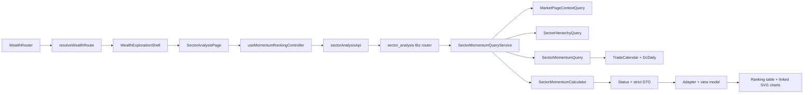

# 财势探查｜板块分析低层设计 v1

## 0. 文档状态

- 状态：v1.7；M0、M1、Pre-M2、M2 已完成；M3 动量排名前端已实现，正在进行响应式布局纠偏和用户验收。
- 编写日期：2026-08-27。
- 适用仓库：`/Users/congming/github/goldenshare`，当前开发分支 `dev-interface`。
- 产品依据：[财势乾坤板块分析产品交互基线文档](./sector-analysis-product-interaction-baseline-v1.md)。
- 技术依据：[财势探查｜板块分析技术实施方案 v1](./sector-analysis-implementation-design-v1.md)。
- Figma：`Goldenshare Web`，file key `RADlZzREU4lPVviYfkLy6x`，页面 `14 Wealth Exploration - Sector Analysis`（`965:2`）。
- 目标路由：`/wealth/exploration/sector-analysis/momentum-ranking`。
- 目标 API：`/api/v1/wealth/market/sector-analysis/**`。
- 待拍板项：无。若编码时发现本文与当前事实冲突，必须停止并回到方案层确认。

本文只定义财势探查页面结构收口和首期“横截面动量排名”的编码方案。双动量、相对轮动、成员广度、量价分布只保留按钮和“待建设”提示，不得生成路由、controller、API、Mock、隐藏工作区或计算逻辑。

---

## 1. 冻结口径与开发约束

| 硬口径 | 编码落点 | 必须证明的正反例 |
|---|---|---|
| 首期只做行业动量排名 | `sector-analysis/momentum-ranking/**` | 仓库没有概念、地域、申万、Heat、预测或 QTF 依赖 |
| Prod 是唯一在线事实源 | 三个只读 Query | 只出现 `TradeCalendar`、`WealthSectorHierarchy`、`DcDaily` |
| 公共业务日期唯一 | `MarketPageContextQuery` + URL `tradeDate` | Pre-M2 将内部访问收敛为 1 条 SQL；20:00 默认口径、显式历史严格命中和公开合同不变；前端无本机业务日计算 |
| 历史缺口必须可见 | Meta 日期覆盖 DTO + 日期选择器 | 覆盖区间内全部 SSE 开市日均返回；COMPLETE/PARTIAL/MISSING 不被过滤 |
| 五类比较池固定 | `SectorMomentumScope` + `resolve_scope_pool()` | 全体一级/二级/三级与两类直属子级集合完全正确 |
| 周期固定为 1/5/10/20/30 | `SectorMomentumPeriod` | 未批准周期和任意整数被拒绝 |
| 1 日读取 `pct_change`，多日读取完整 N+1 收盘窗口 | `SectorMomentumCalculator` | 缺任一日期、空值、非正收盘均不可计算，不补值 |
| 涨/跌只改变展示顺序 | `sort_ranking_rows()` | 同行业 `returnPct/strengthRank/percentile` 在两方向完全一致 |
| `strengthRank` 是唯一历史排名 | `rank_strength()` | 最高收益第 1，竞赛排名，历史接口无 direction |
| 完整列表，不做 TopN | rankings DTO + table | 返回当前比较池全部对象，null 行仍保留在末尾 |
| 当前行业尽量保留 | URL reducer + controller | 日期、周期、方向、显示范围变化不擅自换行业 |
| 两图同时展示并联动 | `MomentumDetailPanel` | 同一交易日索引、独立纵轴、缺点断线、排名第 1 在顶部 |
| 1600 仅是像素基线，运行时必须等宽适配 | `sector-momentum.css` | 1600px 为 `776+12+776`；1512px 自动收缩且无裁剪；不得把 1564px 写成运行时固定宽度 |
| 页面状态只用五态 | API 四态 + 前端 LOADING | READY/DELAYED/EMPTY/ERROR；PARTIAL 只能作为日期覆盖元数据，不能成为第六种页面状态 |
| 未建设方法零副作用 | `SectorAnalysisMethodBar` | 点击只 toast；URL、请求、图表和工作区均不变化 |
| 不新增持久化能力 | 无迁移、表、缓存服务 | Alembic head 不变；无新 ORM model、Redis 或后台任务 |

公式身份固定：

```text
formulaKey = sector-cross-sectional-momentum
formulaVersion = 1
```

本版本描述当前和历史表现，不输出预测、信号、成功率、持续性或未来解释。

## 2. 当前实现审计

### 2.1 CodeGraph 与代码影响面

M1 开发前使用仓库根 CodeGraph 索引完成了入口、调用方、被调用方、共享契约、测试和前端消费者核验。索引状态为 healthy；M1 前基线主链为：

```text
WealthRouter
  -> routerState.isWealthExplorationPath
  -> WealthExplorationPage
      -> MarketPageContext API
      -> MajorIndices API
      -> TurnoverInsight controller

MarketOverviewPage
  -> market-overview/layout/ShortcutBar

sector-overview API
  -> MarketSectorOverviewQueryService
      -> SectorHierarchyQuery
      -> SectorSelectionResolver(SectorHierarchyNode)
```

M1 完成后的当前主链为：

```text
WealthRouter
  -> resolveWealthExplorationRoute
      -> WealthExplorationLandingPage
      -> TurnoverInsightPage
      -> SectorAnalysisPage
  -> WealthExplorationShell
      -> MarketPageContext API
      -> MajorIndices API

MarketOverviewPage
  -> MarketShortcutBar
      -> shared/ui/shortcut-bar
```

结论：页面结构、精确路由和共享 Shortcut 已完成；板块分析当前只有页面壳和五按钮方法栏，没有板块 API、查询、计算、Mock、图表或结果工作区。后端现状仍与 M0 审计一致。

### 2.2 前端真实现状

1. `routerState.ts` 使用判别联合解析四个精确地址；未知 `/wealth/exploration/**` 不会被宽松吞入模块路由。
2. `/wealth/exploration`、`/turnover-insight` 和 `/sector-analysis/momentum-ranking` 分别由 landing、turnover、sector 三页承载；板块根地址以 `replace` 保留 query 后进入动量地址。
3. `WealthExplorationShell` 只加载公共时间和主要指数 ticker；入口首页没有成交额或板块业务请求。
4. `TurnoverInsightPage` 独占既有 `TurnoverInsightSection/controller`，接口、超时和 adapter 合同未变。
5. `SectorAnalysisPage` 只有一个 active 方法和四个“待建设”按钮；四按钮只产生本地 toast，不改变 URL，不发板块请求。
6. 市场总览六项数据已移入 `MarketShortcutBar`；共享卡片外层改为原生 button，内部 DOM/class、6 等分、10px 列距、12px 底距、最小高 72px 和内边距保持不变。
7. 旧 `WealthExplorationPage`、旧私有 Shortcut、零高度 `sector-radar` 节点和对应历史门禁已经删除，不留 wrapper 或 re-export。
8. `TopMarketBar`、`PageBreadcrumb`、market context 和主要指数 ticker 继续复用既有公共能力，没有复制或改契约。

### 2.3 后端真实现状

1. `DcDaily` 映射 `core_serving.dc_daily`，业务键为 `(ts_code, trade_date, category)`；本需求使用 `close/pct_change`，已有 `trade_date` 及 `(trade_date, category)` 索引。
2. `WealthSectorHierarchy` 映射 `core_serving.wealth_sector_hierarchy`，包含本需求所需层级、父级、root、路径、排序、版本和发布时间字段；已有 level/parent/root 三组查找索引。
3. `TradeCalendar` 映射 `core_serving.trade_calendar`，业务键 `(exchange, trade_date)`，已有 `trade_date` 索引。
4. `MarketPageContextQuery` 已实现 SSE 交易日和 20:00 默认切换。Pre-M2 已将显式模式最坏 2 条、默认模式最坏 4 条 SQL 收敛为 1 条只读 SQL；20:00 规则、公开方法、返回字段和消费者语义保持不变。
5. 当前工作区已把 `SectorHierarchyQuery` 移到 `queries/wealth/market/common/sector_hierarchy_query.py`，补齐父／root 名称、`is_leaf` 和最大 `published_at`；两个直接消费者均已切换到公共绝对 import，首页板块速览与架构回归 33 项通过。该独立完成项不等于 M2 API 已开始或完成。
6. 现有 `sector-overview` DTO 绑定首页 Top5、概念、地域、成员、资金和 Heat，不能扩写为本页 DTO。
7. `src/app/api/v1/router.py` 逐模块 include `src.biz.api.wealth.market.*`；板块分析只需新增一个 Biz router include，App 不承载业务逻辑。

### 2.4 当前状态与目标状态的差异

| 事项 | 当前代码 | 本期目标 | 处理方式 |
|---|---|---|---|
| 财势探查根页 | 纯入口首页（M1 已完成） | 纯入口首页 | 保持 landing 零业务请求 |
| 成交额路由 | `/turnover-insight`（M1 已完成） | 独立子页 | 保持既有业务合同 |
| 板块分析 | 独立子页与方法栏（M1 已完成） | 动量工作区 | M2 只实现后端，M3 才接前端 |
| Shortcut | 共享展示 + 两个 feature wrapper（M1 已完成） | 零漂移共享能力 | 后续不得回写 feature 私有副本 |
| 行业层级 Query | Biz 公共 Query（当前工作区已移动） | Biz 公共 Query | M2 收口时再次回归首页板块速览，不再重复移动 |
| 动量事实 | 无 | 三个独立只读 API | 新建 sector_analysis 模块 |
| 页面异常态 | 无板块状态 | 五态稳定骨架 | 按 Figma 正式节点实现 |

### 2.5 Prod DuckDB 只读覆盖证据

2026-08-27 用 DuckDB 1.5.5 `postgres` 扩展，通过现有 Web 只读连接直接附加 Prod，白名单只包含 `trade_calendar/wealth_sector_hierarchy/dc_daily`。审计没有写库、导出来源行或建立快照。

1. 当前层级为一级 31、二级 128、三级 337，共 496 个行业。
2. `2024-01-02..2026-08-26` 有 642 个 SSE 开市日、317,825 条当前行业池行情；重复业务键、非开市日行情、无效 close 和无效 pct_change 均为 0。
3. 20 个开市日存在 607 个行业日缺口：2026-05-20 缺 484、2026-05-18 缺 97、2026-05-25 缺 9，其余 17 日各缺 1。完整日期表见技术方案第 5.5 节。
4. 另有 14 个不属于当前发布层级的历史行情代码、7,216 行；它们不得进入当前行业池、覆盖分母或排名。
5. 以 2026-08-26 为结束日审计最近 60 个结束点：5 日完整窗口 29,760/29,760；10 日 29,249/29,760；20 日 24,391/29,760；30 日 19,531/29,760。历史缺口会真实传导到 N+1 可计算性。

这项审计关闭“是否存在缺口”的事实问题，但不关闭 M2 的实现验收：编码仍必须用同一门禁生成日期覆盖状态、空值行和断点，并通过正反例证明没有补值或隐藏缺口。

## 3. Figma 开发交付审计

### 3.1 正式节点基线

| 状态 | 节点 | 尺寸 | 用途 |
|---|---|---:|---|
| Ready／一级总榜涨幅 | `965:55` | 1600×1292.390625 | 默认视觉基线 |
| Ready／一级总榜跌幅 | `971:352` | 1600×1292.390625 | 方向切换 |
| Ready／二级总榜 | `1051:951` | 1600×1292.390625 | 全部二级、所属一级路径和双排名摘要 |
| Ready／三级总榜 | `1051:1251` | 1600×1292.390625 | 全部三级、一级／二级路径和双排名摘要 |
| Ready／一级内二级 | `987:476` | 1600×1292.390625 | 单父级选择器及下钻结果 |
| Ready／二级内三级 | `987:776` | 1600×1292.390625 | 两级联动及下钻结果 |
| Ready／双图 Hover | `1053:5261` | 1600×1292.390625 | 两图同日期十字线和联合 Tooltip |
| Ready／交易日选择器 | `1062:2` | 1600×1292.390625 | COMPLETE/PARTIAL/MISSING 可见且均可选择 |
| Loading | `1036:634` | 1600×1292.390625 | 稳定骨架加载态 |
| Delayed | `1036:1014` | 1600×1292.390625 | 保留上一完整交易日内容 |
| Empty | `1036:1386` | 1600×1292.390625 | 全部不可计算或显式日无数据 |
| Error | `1036:1762` | 1600×1292.390625 | 错误与重试 |

`1292.390625px` 是现有 Figma 内容边界形成的画板高度，不是运行时固定高度合同。编码只把 `1600px` 作为桌面截图验收宽度，并按下文整数尺寸实现内部骨架；页面根节点不得写死 `height:1292.390625px`，应由内容高度和现有页面 Shell 自然撑开。

其余四个方法的节点 `967:72/967:158/967:244/967:330` 仍是 Draft，只证明按钮位置，不是本期工作区实现依据。

### 3.2 结构与 Design System 结论

1. 正式画板直接复用 `TopMarketBar` 实例、`PageBreadcrumb` 实例、`ShortcutCard` 实例和方法 Tab 组件实例。
2. PageShell 使用纵向 Auto Layout；`1600px` 验收基线下左右工作区为 `776 + 12 + 776 = 1564px`，运行时两列使用等分弹性轨道，不得固定为 776px。
3. `1600px` 基线下工具栏为 `1564×128`、正文为 `1564×866`；运行时宽度均为当前 PageShell 内容宽度的 `100%`，高度不变。
4. `1600px` 基线下榜单滚动 viewport 为 `776×772`；运行时宽度随左列变化，高度仍为 772px。固定表头高 40px、行高 56px、`clipsContent=true`、`overflowDirection=VERTICAL` 不变。
5. 图表、涨跌数据条和滚动条叠层保留绝对坐标。它们是几何绘图区，不应改成 Auto Layout。
6. 页面普通容器、工具栏、行、摘要卡、状态面板均使用 Auto Layout；不存在用补偿坐标模拟页面布局的新增节点。
7. 核心颜色已绑定 `CSQ / Market Overview / M0 / Color` 变量；Delayed 新增语义变量 `System/Warning`（`VariableID:1033:2`，`#f59e0b`），Web syntax 为 `var(--cs-color-warning)`，scope 覆盖 Frame/Shape/Text Fill 和 Stroke。
8. Shortcut 外层容器已从原始色值绑定到 `Background/Panel` 和 `Border/Subtle`。
9. Loading skeleton 已绑定 `Background/PanelSoft`；Error 重试复用 `Button / Neutral / M0`。
10. 模块自有正式文本已绑定可精确匹配的本地 Text Style；共享 TopMarketBar 和 ShortcutCard 内仍有少量继承自既有组件的原始色值和无 textStyleId 文本。它们是现有共享组件债务，本期不修改，否则会扩大到全站；其实际颜色与 Web Token 一致，不阻塞本模块编码。

### 3.3 已修正的问题

| ID | 原问题 | 严重度 | 修正结果 |
|---|---|---|---|
| F01 | 列表“排名”与详情“当前排名”混淆展示序号和业务排名 | 高 | 改为“序号”与“同组强度排名” |
| F02 | 上下两图各有一套 20/30/60 控件，可能形成两套显示范围 | 高 | 每张 Ready 画板只保留上图一套共用控件 |
| F03 | viewport 只有手绘滚动条，没有 Figma 纵向滚动语义 | 高 | 六类 Ready 榜单画板均设置 `VERTICAL` overflow |
| F04 | 只有 Ready，没有 Loading/Delayed/Empty/Error 正式页 | 高 | 新增四张完整正式状态画板 |
| F05 | 图题“历史排名”未说明范围，滚动收益未显示计算周期 | 中 | 标题改为周期和比较范围专属文案 |
| F06 | Shortcut 外层未绑定变量 | 中 | 绑定 Panel/Subtle Token |
| F07 | 本地 Breadcrumb 组件横向溢出 section 32px | 中 | `966:55.x` 从 32 改为 0 |
| F08 | Loading skeleton 继承白色底和原始灰 | 中 | 清除白底并绑定 PanelSoft |
| F09 | 涨跌榜把展示序号误当业务排名，百分位端点不符合公式 | 高 | 跌幅最弱示例改为 `31/31、0.0%`，涨幅最强示例改为 `100.0%`；方向只改变展示顺序 |
| F10 | 缺二级／三级总榜和双排名摘要 | 高 | 新增 `1051:951/1051:1251`；二／三级同时表达全层级和直属父级排名 |
| F11 | 四个待建设按钮跳草稿，行选择与下钻边界不清 | 高 | 清除草稿导航；行点击只选中，独立箭头下钻，三级明确无下钻 |
| F12 | 两图共用范围和 Hover 无正式编码状态 | 高 | 六张 Ready 均标注“两图共用”；新增 `1053:5261` 展示共享十字线和联合 Tooltip |
| F13 | 一级排名轴只到 20，无法表达 31 个对象 | 高 | 涨／跌与 Hover 纵轴完整覆盖 `1..31`；二／三级总榜分别覆盖 `1..128`、`1..337` |
| F14 | Warning Token 和模块文字样式未完成开发交付绑定 | 中 | 补 Web syntax/scope；模块自有正式文本绑定本地 Text Style，不拆共享实例 |
| F15 | 日期字段只表达当前值，无法看到缺口日 | 高 | 新增 `1062:2`；Popover 使用真实覆盖示例显示日期、完整／部分缺失／无数据图例及 `valid/expected`，所有状态均可选择 |

### 3.4 Figma 基线与运行时响应式映射

| Figma 区域 | 代码约束 |
|---|---|
| 1600 根画板 | 设计验收宽度，不是运行时固定宽度；运行时外壳使用现有 content max/min Token，不做 CSS scale，不写死 Figma 小数画板高度 |
| PageShell | `padding: 14px 18px 34px`，纵向 12px 基础节奏 |
| ShortcutBar | 1600 基线宽 1564px，运行时跟随 PageShell 为 `width:100%`；卡间 10px、当前两卡保持卡宽约 252.33px，不强制两卡拉满整行 |
| 方法栏 | 高 48px、内边距 4px、按钮间 4px |
| 工具栏 | 1600 基线为 1564×128；运行时 `width:100%`，16px 内边距、两行各 44px、行间 8px |
| 分析正文 | 1600 基线为两列各 776px；运行时 `repeat(2,minmax(0,1fr))`、列间 12px、高 866px |
| 榜单 | 运行时宽度等于左列；标题 54px、固定表头 40px、viewport 高 772px、行 56px |
| 详情摘要 | 1600 基线 776×112；运行时 `width:100%`、高度 112px |
| 趋势图 | 1600 基线每图 776×365；运行时 `width:100%`、高度 365px、图间 12px |
| 状态面板 | 运行时 `width:100%`、高 866px，替换正文但保留工具栏及页面骨架 |

Figma 是视觉和布局事实源；交互状态、数据语义、缺失处理和请求边界以产品基线与本 LLD 为准。不得从示例文字、示例日期或示例行业推导生产默认值。

运行时宽度计算固定为：

```text
shellOuterWidth = min(max(viewportWidth, 1460), 1840)
contentWidth = shellOuterWidth - 36
columnWidth = (contentWidth - 12) / 2
```

在 1600px 下列宽为 776px；约 1512px 下列宽为 732px。低于全局 1460px 最小宽度时沿用全站页面级横向滚动，不允许本模块另加 CSS scale、固定 1564px 宽度或独立响应式断点。

## 4. 目标调用链



页面壳只加载 page context 和 ticker；业务 controller 只由对应子页挂载。Backend API 不访问 Ops、TaskRun、QTF、DG 或 Lake。

## 5. 文件级编码矩阵

### 5.1 前端移动与共享提取

| 操作 | 文件 | 精确要求 |
|---|---|---|
| 新增 | `wealth/src/shared/ui/shortcut-bar/shortcutBarTypes.ts` | 定义 `ShortcutItem` 和 key/path/title/description；无 feature 常量 |
| 新增 | `wealth/src/shared/ui/shortcut-bar/ShortcutCard.tsx` | 外层使用真实 `<button type="button">`；保留既有内部 DOM/class；接收 selected/disabled/onSelect |
| 新增 | `wealth/src/shared/ui/shortcut-bar/ShortcutBar.tsx` | 接收 items/activeKey/onNavigate；不决定业务路由 |
| 新增 | `wealth/src/shared/ui/shortcut-bar/shortcut-bar.css` | 原样迁移 `.shortcut-*` 视觉；补 button reset、focus-visible，不改尺寸 |
| 删除 | `wealth/src/features/market-overview/layout/ShortcutBar.tsx` | 全部消费者切换后彻底删除，不留 wrapper/re-export |
| 修改 | `wealth/src/pages/market-overview/market-overview-page.css` | 只删除已迁移 Shortcut 规则；其它 CSS 字节级保持 |
| 新增 | `wealth/src/features/market-overview/layout/MarketShortcutBar.tsx` | 保留当前六项数据和 toast 行为 |
| 修改 | `wealth/src/pages/market-overview/MarketOverviewPage.tsx` | 仅切换 wrapper import；渲染顺序不变 |

共享组件只把最外层 `article` 更正为 `button`，内部两层 DOM、全部 class、选中伪元素和视觉尺寸必须不变。CSS 必须增加 `appearance:none; color:inherit; font:inherit; text-align:left; width:100%`，避免浏览器默认按钮样式造成漂移。技术方案所称“保留 DOM”在编码中具体指保留内部结构和 CSS 选择器，不保留缺少键盘语义的错误外层标签。

### 5.2 财势探查页面结构

| 操作 | 文件 | 精确要求 |
|---|---|---|
| 新增 | `wealth/src/pages/wealth-exploration/layout/WealthExplorationShell.tsx` | TopBar、context、ticker、breadcrumb、shortcut、toast 和 children slot |
| 新增 | `wealth/src/pages/wealth-exploration/layout/useWealthExplorationShell.ts` | 迁移现页 context/ticker 两段请求；不加载业务模块 |
| 新增 | `wealth/src/features/wealth-exploration/navigation/explorationNavigation.ts` | 两个入口的唯一配置和正式 path |
| 新增 | `wealth/src/features/wealth-exploration/navigation/ExplorationShortcutBar.tsx` | 组合共享 Shortcut；入口首页 activeKey=null |
| 新增 | `wealth/src/pages/wealth-exploration/WealthExplorationLandingPage.tsx` | 只渲染 Shell，无业务请求 |
| 新增 | `wealth/src/pages/wealth-exploration/TurnoverInsightPage.tsx` | Shell + 既有 `TurnoverInsightSection/controller` |
| 新增 | `wealth/src/pages/wealth-exploration/SectorAnalysisPage.tsx` | Shell + 方法栏 + 当前动量工作区 |
| 删除 | `wealth/src/pages/wealth-exploration/WealthExplorationPage.tsx` | 三个新页面接管全部用途后删除，不保留兼容页面 |
| 修改 | `wealth/src/pages/wealth-exploration/wealth-exploration-page.css` | 删除零高度 slot，增加 Shell/shortcut/method/workspace 布局；复用 Token |

### 5.3 前端路由

| 操作 | 文件 | 精确要求 |
|---|---|---|
| 修改 | `wealth/src/app/routes/routerState.ts` | 新增正式常量、路径 builder 和有界 route resolver |
| 修改 | `wealth/src/app/routes/WealthRouter.tsx` | 按判别联合类型渲染三个页面；sector-analysis 根 path replace 到 momentum path |
| 修改 | `wealth/src/app/routes/routerState.test.ts` | 正反例覆盖精确路径、未知子路径、query 保留和 replace |

不得继续扩写一个返回 boolean 的宽松 `isWealthExplorationPath()`。目标解析器：

```ts
type WealthExplorationRoute =
  | { kind: "landing" }
  | { kind: "turnover-insight" }
  | { kind: "sector-analysis-redirect" }
  | { kind: "sector-analysis-momentum" }
  | { kind: "not-exploration" };

resolveWealthExplorationRoute(pathname: string): WealthExplorationRoute
```

精确路由常量：

```text
/wealth/exploration
/wealth/exploration/turnover-insight
/wealth/exploration/sector-analysis
/wealth/exploration/sector-analysis/momentum-ranking
```

未知 `/wealth/exploration/**` 必须返回 `not-exploration`，证明它没有被误识别为本模块路由；本期继续保留 Router 当前既有 fallback，不顺手新增全站 404 或错误路由框架。

### 5.4 后端公共查询移动

| 操作 | 文件 | 精确要求 |
|---|---|---|
| 新增 | `src/biz/queries/wealth/market/common/sector_hierarchy_query.py` | 原类完整移动；Node 补齐父/root 名称和 `is_leaf`，Snapshot 增加 `published_at` 元数据 |
| 删除 | `src/biz/queries/wealth/market/sector_overview/sector_hierarchy_query.py` | 消费者和测试改完后删除，无兼容 re-export |
| 修改 | `sector_overview/sector_overview_query_service.py` | 相对 import 改为 common 绝对 import；行为不变 |
| 修改 | `sector_overview/sector_selection_resolver.py` | `SectorHierarchyNode` 改为 common import |

移动后必须保留：单一版本、代码唯一、一级 root、父级层次、root 闭包、`industry_level/display_order/sector_code` 稳定次序。为 Meta DTO 扩展 `SectorHierarchyNode` 的 `parent_sector_name/root_sector_name/is_leaf`，并把所有行 `published_at` 的最大值作为 Snapshot `published_at`；不新增“发布时间必须完全相同”的阻断规则，不改变首页现有选择或错误语义。

### 5.4A Pre-M2 公共日期查询收敛

| 操作 | 文件 | 精确要求 |
|---|---|---|
| 修改 | `src/biz/queries/wealth/market/context/market_page_context_query.py` | 保持公开合同和 20:00 语义不变，把单次 `resolve_context()` 收敛为 1 条只读 SQL |
| 新增 | `tests/test_wealth_market_page_context_query.py` | 注入固定北京时间，覆盖时间边界、显式／默认、日历缺失和 SQL 数量 |
| 修改 | `tests/web/test_wealth_market_context_api.py` | 保持公共 context HTTP 响应合同不变，补充 20:00 前后和无日历记录反例 |

Pre-M2 不修改任何调用方 API，不新增模型、迁移、缓存或配置。CodeGraph 当前确认的 9 个直接调用入口全部继续调用同一个 `resolve_context()`；实施后必须回归公共 context、个股详情、指数详情／K 线／权重、成交额洞察、个股九转和指数九转。

### 5.5 后端新增

```text
src/biz/api/wealth/market/sector_analysis.py
src/biz/schemas/wealth/market/sector_analysis.py
src/biz/queries/wealth/market/sector_analysis/
  __init__.py
  sector_analysis_meta_query.py
  sector_momentum_query.py
  sector_momentum_query_service.py
src/biz/services/wealth/market/sector_analysis/
  __init__.py
  sector_analysis_exception_builder.py
  sector_analysis_status_resolver.py
  sector_momentum_contract.py
  sector_momentum_calculator.py
```

只使用一个 Biz router 文件，避免两个 endpoint 文件分别复制参数验证。`src/app/api/v1/router.py` 只增加一次 import 和 include。

### 5.6 前端板块分析新增

```text
wealth/src/features/wealth-exploration/sector-analysis/
  navigation/
    SectorAnalysisMethodBar.tsx
  momentum-ranking/
    api/
      sectorMomentumApi.ts
      sectorMomentumAdapter.ts
    model/
      sectorMomentumTypes.ts
      sectorMomentumUrlState.ts
      useMomentumRankingController.ts
    ui/
      MomentumRankingWorkspace.tsx
      MomentumControlBar.tsx
      MomentumRankingPanel.tsx
      MomentumRankingTable.tsx
      MomentumRankingRow.tsx
      MomentumReturnBar.tsx
      MomentumDetailPanel.tsx
      SelectedSectorSummary.tsx
      RollingReturnChart.tsx
      HistoricalRankChart.tsx
      MomentumLinkedTooltip.tsx
      MomentumStateSurface.tsx
      sector-momentum.css
```

首个消费者保持 feature-local，不提前沉到 shared。只有 Shortcut 是当前已经存在两个消费者且视觉合同相同的真正共享组件。

## 6. 后端合同与纯计算设计

### 6.1 代码枚举

```python
SectorMomentumScope = Literal[
    "LEVEL_1", "LEVEL_2", "LEVEL_3",
    "LEVEL_1_CHILDREN", "LEVEL_2_CHILDREN",
]
SectorMomentumDirection = Literal["GAINERS", "LOSERS"]
SectorMomentumPeriod = Literal[1, 5, 10, 20, 30]
SectorHistoryRange = Literal[20, 30, 60]
SectorAnalysisStatus = Literal["READY", "DELAYED", "EMPTY", "ERROR"]
```

API 接受大写枚举，前端 URL 使用小写短值；转换只允许在前端 adapter/request builder 一处完成。

### 6.2 查询数据结构

```python
@dataclass(frozen=True, slots=True)
class SectorDailyFact:
    sector_code: str
    trade_date: date
    close: Decimal | None
    pct_change: Decimal | None

@dataclass(frozen=True, slots=True)
class SectorReturnFact:
    sector_code: str
    trade_date: date
    return_pct: Decimal | None
    missing_reason: Literal[
        "NONE", "HISTORY_INSUFFICIENT", "DATE_MISSING",
        "CLOSE_MISSING", "CLOSE_NON_POSITIVE", "PCT_CHANGE_MISSING",
    ]

@dataclass(frozen=True, slots=True)
class SectorRankFact:
    sector_code: str
    return_pct: Decimal | None
    strength_rank: int | None
    percentile: Decimal | None
```

`missing_reason` 只用于服务内部和有界 debug，正式行不新增解释字段；页面统一显示 `--`。

### 6.3 比较池解析

`resolve_scope_pool(snapshot, scope, level1_code, level2_code)` 必须是纯函数：

1. `LEVEL_1`：全部 `industry_level=1`。
2. `LEVEL_2`：全部 `industry_level=2`。
3. `LEVEL_3`：全部 `industry_level=3`。
4. `LEVEL_1_CHILDREN`：`parent_sector_code=level1Code` 且 level=2。
5. `LEVEL_2_CHILDREN`：先验证 level2 是 level1 直属子级，再取其直属 level=3。
6. 返回次序固定为 `(display_order, sector_code)`；不因行情值变化改变对象池顺序。
7. 缺父级、错层、跨父级分别抛有界合同异常，API 映射 `SA_SCOPE_INVALID`。

### 6.3.1 Pre-M2 单语句日期锚点

`MarketPageContextQuery.resolve_context()` 保持现有入口：

```python
resolve_context(
    session: Session,
    *,
    market: str,
    requested_trade_date: date | None,
) -> MarketPageContext
```

内部只允许执行一条 SQL。Python 端先且只生成一次 `local_now=datetime.now(ZoneInfo("Asia/Shanghai"))`，SQL 使用绑定参数 `local_date`、`before_eod_switch` 和可选 `requested_trade_date`，不得使用数据库 `CURRENT_DATE/current_timestamp` 推导业务时间。

单条 SQL 必须通过标量子查询或 CTE 同时构造以下事实：

```text
latest_open_date      = max(SSE open trade_date <= local_date)
today_calendar        = SSE calendar row at local_date
previous_open_before_today = max(SSE open trade_date < local_date)
requested_calendar    = SSE calendar row at requested_trade_date（显式模式）
resolved_trade_date   = 显式日期；否则在今天开市、20:00前且存在 previous_open_before_today 时取该值，其余取 latest_open_date
resolved_calendar     = SSE calendar row at resolved_trade_date
previous_open_fallback = max(SSE open trade_date < resolved_trade_date)
```

结果映射规则冻结为：

1. 显式模式：`trade_date=requested_trade_date`。若 `resolved_calendar` 存在，`is_trading_day=resolved_calendar.is_open`、`prev_trade_date=resolved_calendar.pretrade_date`；若不存在，`is_trading_day=false`、`prev_trade_date=previous_open_fallback`。
2. 默认模式：今天开市、`local_now.hour < 20` 且 `previous_open_before_today` 非空时使用该日期；否则使用 `latest_open_date`。必须保持当前 `max(open trade_date < local_date)` 语义，不改为信任 `today_calendar.pretrade_date`。
3. 默认模式没有任何开市日时，继续使用 `local_date`。若该日存在日历记录，仍读取其 `is_open/pretrade_date`；若不存在，返回 `is_trading_day=false` 和有界 fallback。
4. `session_status` 继续按现有 `_resolve_session_status(local_now=local_now, is_trading_day=is_trading_day)` 原样计算；Pre-M2 不额外引入“最终日期必须等于 local_date”的判断，避免改变现有显式日期与调用方合同。
5. `source` 仍严格为 `explicit/default`，`generated_at` 必须等于本次唯一的 `local_now`。
6. 禁止第二次查询最终日历行、禁止再次查询上一开市日、禁止在调用方复制20:00分支、禁止服务端全局缓存。

SQLAlchemy event counter 必须证明所有正反例都是恰好 1 条 SQL。参数或市场在发 SQL 前即可判定非法时允许 0 条；不得为了满足计数跳过合法日期事实。

### 6.4 日期解析

服务同时接收 `trade_date: date | None`，不能只接收 context 的日期结果，因为必须区分默认和显式模式：

1. 先用 `MarketPageContextQuery.resolve_context()` 得到 `expectedTradeDate`。
2. 显式模式：只查 `expectedTradeDate`；`COMPLETE` 和 `PARTIAL` 日都严格命中该日，`MISSING` 日返回 EMPTY，不回退。
3. 默认模式：先计算 expected 日的当前 496 行业来源覆盖；只有 `COMPLETE` 才直接使用 expected。若为 `PARTIAL/MISSING`，向前取最近一个 `COMPLETE` SSE 开市日作为 observed 并返回 DELAYED，不能把“当天只来了几行”误当当日数据已经发布完整。
4. observed 必须同时位于 SSE 开市日；非开市脏日期不能成为页面日期。
5. history 的结束日期固定为 observed，rankings 与 history 不得分别选择日期。
6. 显式日期早于 `coverageStartDate` 或晚于 `coverageEndDate` 是范围非法，不作为来源缺失；Meta 不把覆盖起始日前的历史交易日伪装成 MISSING。

### 6.5 交易日窗口

`SectorMomentumQuery.load_open_dates(end_date, count)` 使用：

```sql
SELECT trade_date
FROM core_serving.trade_calendar
WHERE exchange = 'SSE'
  AND is_open = true
  AND trade_date <= :end_date
ORDER BY trade_date DESC
LIMIT :count
```

取回后在内存反转为升序。rankings 最大 `count=31`；history 最大 `count=90`（60 个显示日 + 最早显示点之前 30 个交易日，最早一日已经是分母日）。禁止自然日减法或再多取第 91 日。

Meta 的日期覆盖查询使用当前层级 496 个代码作为固定分母，对 `coverageStartDate..coverageEndDate` 的全部 SSE 开市日做日级聚合并左连接有效行情计数。结果必须按日期升序返回：`valid=expected` 为 COMPLETE，`0<valid<expected` 为 PARTIAL，`valid=0` 为 MISSING。当前层级外代码不参与计数；不能用 `INNER JOIN dc_daily` 过滤掉缺口日。

### 6.6 行情查询

一个请求只发一次有界行情查询：

```sql
SELECT ts_code, trade_date, close, pct_change
FROM core_serving.dc_daily
WHERE category = '行业板块'
  AND ts_code IN :sector_codes
  AND trade_date BETWEEN :start_date AND :end_date
ORDER BY trade_date, ts_code
```

禁止逐行业、逐日期回查。返回行先验证业务键唯一；虽然数据库有主键，单元测试仍必须覆盖重复输入反例，纯计算内核不得静默后写覆盖前写。

### 6.7 区间收益计算

1 日：

```text
returnPct = pct_change(t)
```

N 日：

```text
requiredDates = [t-N, ..., t] 共 N+1 个 SSE 交易日
returnPct = (close(t) / close(t-N) - 1) * 100
```

门禁：

1. 每个 required date 必须有且只有一条该行业行。
2. 每条 `close` 必须非空、有限且大于 0；中间日期虽不进入除法，也作为完整窗口门禁。
3. 任一门禁失败返回 `null`，不连乘 `pct_change`、不跳过停牌日、不补零、不前向填充。
4. 内部使用 `Decimal`；DTO 边界按 `0.0001`、`ROUND_HALF_UP` 输出 4 位小数并转 JSON number。

### 6.8 强度排名与百分位

对同日同一比较池的非空收益：

```text
strengthRank(x) = 1 + count(returnPct > x)
```

因此并列值为竞赛排名 `1,2,2,4`。

百分位使用并列平均名次：

```text
greater = count(returnPct > x)
equal = count(returnPct == x)
averageRank = greater + (equal + 1) / 2      # 1-based
percentile = (n - averageRank) / (n - 1) * 100
```

1. `n=1` 时返回 `100.0`。
2. 最强为 100，最弱为 0；并列对象返回相同值。
3. DTO 按 `0.1`、`ROUND_HALF_UP` 输出 1 位小数。
4. null 行的 rank/percentile 都为 null，且不进入 `calculableCount`。

### 6.9 展示排序与榜单序号

1. GAINERS：非空收益 `desc`。
2. LOSERS：非空收益 `asc`。
3. 同值使用 `sector_code asc`。
4. null 永远在所有有效值之后，并按 `sector_code asc`。
5. 排序完成后才赋值 `listPosition=1..totalCount`。
6. `direction` 不传入 `rank_strength()`，也不传入 history Query/Calculator。

### 6.10 历史序列

一次 history 请求取得 `historyRange + period` 个不同交易日；其中 period 个日期位于最早显示点之前，最早一个就是该点的分母日。然后：

1. 对每个显示日重新计算当前比较池每个行业的 returnPct。
2. 对当日非空值重新计算 strengthRank 和 percentile。
3. 只输出当前 `sectorCode` 的两条同日期序列。
4. 两数组必须长度相同、日期严格升序且日期集合完全相同。
5. 当前行业缺值时，`returnPct/strengthRank/percentile=null`，但保留日期槽；`calculableCount` 仍表达该日其他可计算对象数量。
6. `totalCount` 是当前发布层级下比较池大小，每个点都返回，不能把它误作 calculableCount。
7. 历史不足 20/30/60 时返回现有全部显示日，不伪造前序日期。

### 6.11 查询数量预算

| Endpoint | 正常路径最大 SQL 数 |
|---|---:|
| meta | 3：公共日期 1、层级（含发布时间）1、可用日期 1 |
| rankings | 显式／默认日期均最多 5：公共日期 1、层级 1、observed 1、窗口日历 1、行情事实 1 |
| history | 显式／默认日期均最多 5；行情仍为一次有界集合查询 |

实现测试使用 SQLAlchemy event counter 记录数量；Pre-M2 必须先证明公共日期查询严格为 1 条，M2 再证明 Meta/Rankings/History 分别不超过 3/5/5 条。出现按行增长即失败。允许同一请求内复用已经加载的 hierarchy snapshot，不允许增加服务端全局缓存。

## 7. API 与 DTO 冻结

### 7.1 Router 形态

一个 router：

```python
router = APIRouter(prefix="/wealth/market/sector-analysis", tags=["wealth-market"])
```

三个 `GET` 均复用 `require_quote_access` 和 `get_db_session`。每个请求先显式检查 unknown/duplicate query 参数，再做类型和闭包校验；不得依赖 FastAPI 默认忽略未知参数。

### 7.2 Meta

```http
GET /api/v1/wealth/market/sector-analysis/meta?market=CN_A
```

```python
class SectorTradeDateAvailabilityDto(StrictDto):
    tradeDate: date
    availability: Literal["COMPLETE", "PARTIAL", "MISSING"]
    expectedSectorCount: int
    validSectorCount: int

class SectorAnalysisMetaResponseDto(StrictDto):
    formula: SectorFormulaDto
    hierarchy: SectorHierarchyDto
    coverageStartDate: date
    coverageEndDate: date
    tradeDates: list[SectorTradeDateAvailabilityDto]
```

Meta 的 `tradeDates` 日期严格升序、无重复，且必须等于覆盖闭区间内 SSE 开市日全集。`expectedSectorCount` 从本次请求加载的 hierarchy snapshot 节点数动态取得，本次审计值为 496，禁止写成代码常量；`validSectorCount` 只统计当前层级代码中业务键唯一、close 有限且大于 0、pct_change 有限的行。`COMPLETE/PARTIAL/MISSING` 分别对应 `valid=expected`、`0<valid<expected`、`valid=0`。

`SectorHierarchyNodeDto` 字段：

```text
sectorCode, sectorName, industryLevel,
parentSectorCode, parentSectorName,
rootSectorCode, rootSectorName,
hierarchyPath, displayOrder, isLeaf
```

Meta 只存在成功 DTO。层级空、多版本或闭包非法时 API 返回 HTTP 500、业务 code `SA_HIERARCHY_UNAVAILABLE`；前端进入 ERROR，不使用空 hierarchy 猜默认值。

### 7.3 Rankings 请求

```text
market=CN_A
tradeDate?=YYYY-MM-DD
scope=LEVEL_1|LEVEL_2|LEVEL_3|LEVEL_1_CHILDREN|LEVEL_2_CHILDREN
level1Code?=BKxxxx.DC
level2Code?=BKxxxx.DC
period=1|5|10|20|30
direction=GAINERS|LOSERS
debug=0|1
```

响应：

```python
class SectorMomentumRankingsResponseDto(StrictDto):
    status: Literal["READY", "DELAYED", "EMPTY", "ERROR"]
    tradingDay: SectorAnalysisTradingDayDto
    pageStatus: SectorAnalysisPageStatusDto
    ranking: SectorRankingDto | None
    message: str | None
    exceptionCode: str | None
    debugInfo: SectorAnalysisDebugInfoDto | None
```

`SectorAnalysisTradingDayDto` 固定字段：

```text
expectedTradeDate, observedTradeDate,
expectedAvailability, expectedSectorCount, expectedValidSectorCount,
observedAvailability, observedValidSectorCount
```

显式完整／部分缺失日的 expected 与 observed 相同；默认目标日不完整时，expected 保留目标日及其 PARTIAL/MISSING 覆盖，observed 指向最近 COMPLETE 日。这样页面既能展示回退事实，也不会隐藏当天为何回退。

`SectorRankingDto`：

```text
formulaKey, formulaVersion, hierarchyVersion,
scope, period, direction, parentSelection,
totalCount, calculableCount, rows
```

`SectorRankingRowDto`：

```text
listPosition: int
strengthRank: int | null
sectorCode: string
sectorName: string
industryLevel: 1|2|3
parentSectorCode: string|null
parentSectorName: string|null
hierarchyPath: string
returnPct: number|null
percentile: number|null
canDrillDown: boolean
```

### 7.4 History 请求

history 参数与 rankings 相同，删除 `direction`，增加：

```text
historyRange=20|30|60
sectorCode=BKxxxx.DC
```

重复或未知 `direction` 必须返回 400，不能接收后忽略。

```python
class SectorMomentumHistoryResponseDto(StrictDto):
    status: Literal["READY", "DELAYED", "EMPTY", "ERROR"]
    tradingDay: SectorAnalysisTradingDayDto
    pageStatus: SectorAnalysisPageStatusDto
    detail: SectorMomentumDetailDto | None
    rollingReturns: list[RollingReturnPointDto]
    historicalRanks: list[HistoricalRankPointDto]
    message: str | None
    exceptionCode: str | None
    debugInfo: SectorAnalysisDebugInfoDto | None
```

Detail 字段：

```text
sectorCode, sectorName, industryLevel, hierarchyPath, scopeTitle,
returnPct, percentile,
currentScopeStrengthRank/currentScopeCalculableCount/currentScopeTotalCount,
globalLevelStrengthRank/globalLevelCalculableCount/globalLevelTotalCount,
parentStrengthRank/parentCalculableCount/parentTotalCount,
formulaKey/formulaVersion/hierarchyVersion
```

一级的 parent 三字段为 null。二级/三级按产品合同同时返回全层级和直属父级内摘要；当前 scope 摘要始终对应历史线的分母。

### 7.5 状态校验器

Pydantic 全部 `ConfigDict(extra="forbid")`，并增加模型级校验：

1. READY/DELAYED rankings 必须有 ranking 且 `calculableCount>0`，rows 数等于 totalCount。
2. EMPTY/ERROR rankings 的 ranking 可保留规范化选择和空 rows，但不得带伪造可计算值；首版统一设 `ranking=null`，减少歧义。
3. READY/DELAYED history 必须有 detail，两数组日期一一对应。
4. EMPTY/ERROR history 必须 detail=null、两数组为空。
5. DELAYED 必须 `observedTradeDate < expectedTradeDate`、`expectedAvailability in {PARTIAL,MISSING}` 且 `observedAvailability=COMPLETE`；READY 必须日期相等且 expectedAvailability 不得为 MISSING。
6. 所有 count 非负且不大于 expectedSectorCount；COMPLETE/PARTIAL/MISSING 与 count 关系必须满足 Meta 的同一判定式。
7. exceptionCode 与状态一致；READY 为 null。
8. debugInfo 只在现有 local/dev/test debug 门禁下出现。

### 7.6 HTTP 与异常映射

| 情况 | HTTP | code | 页面状态 |
|---|---:|---|---|
| 启用行情登录门禁后未登录 | 401 | `require_quote_access` | 全页权限壳 |
| 未知/重复参数、非法市场 | 400 | `SA_SCOPE_INVALID` 或通用请求错误 | 不发后续请求 |
| scope/父级闭包非法 | 400 | `SA_SCOPE_INVALID` | 保留当前页面并提示修正 |
| sectorCode 不在比较池 | 400 | `SA_SELECTION_INVALID` | URL 状态无效，不静默换行业 |
| 默认目标日 PARTIAL/MISSING | 200 | `SA_SOURCE_DELAYED` | DELAYED，保留最近 COMPLETE 日内容并说明目标日覆盖 |
| 显式 MISSING 日或当前周期全部不可计算 | 200 | `SA_SOURCE_EMPTY` | EMPTY；日期缺口仍保留在选择器 |
| 层级不可用 | 500(meta) / 200(业务响应) | `SA_HIERARCHY_UNAVAILABLE` | ERROR |
| 未分类查询/计算异常 | 200 | `SA_QUERY_FAILED` | ERROR |

Meta 无法构建页面对象池时返回 500；rankings/history 已有稳定响应壳时返回 200 ERROR。两类都由同一异常 builder 生成安全文案，不返回 SQL、堆栈、连接信息或源凭据。

## 8. 前端低层设计

### 8.1 Shell 状态

`useWealthExplorationShell(search)` 按 M1 前 `WealthExplorationPage` 的既有请求语义迁移：

```ts
interface WealthExplorationShellModel {
  contextState: "loading" | "ready" | "error";
  pageContext: MarketPageContextViewModel | null;
  tickers: readonly TopMarketTicker[];
  retryContext(): void;
}
```

1. context 成功后才加载主要指数 ticker。
2. ticker 失败只清空 ticker，不阻断子页。
3. 子页业务请求必须等待 context ready。
4. landing 不挂载任何业务 controller。
5. turnover 子页继续复用现有 controller 的 5 秒超时和业务状态，不改成交额接口。

### 8.2 URL 状态

```ts
interface SectorMomentumUrlState {
  tradeDate: string | null;
  scope: "level1" | "level2" | "level3" | "level1-children" | "level2-children";
  level1Code: string | null;
  level2Code: string | null;
  period: 1 | 5 | 10 | 20 | 30;
  direction: "gainers" | "losers";
  range: 20 | 30 | 60;
  sectorCode: string | null;
}
```

`parseSectorMomentumUrlState()` 只做语法解析和固定枚举检查；层级闭包和比较池归属由 meta/rankings 事实校验。非法语法不发业务请求，并显示可恢复错误。

写入规则：

1. 选择榜单行只 `replaceState` sectorCode。
2. scope、父级、周期、方向、范围、历史日期和下钻使用 `pushState`。
3. 默认值不强制写入 URL；服务返回规范化选择后，只在需要恢复用户选择时写入。
4. 浏览器 popstate 重新解析全部状态，不保留组件私有旧值。

### 8.3 Controller 状态机

```ts
type MomentumViewState =
  | { kind: "loading"; meta?: MetaVm }
  | { kind: "ready"; meta: MetaVm; ranking: RankingVm; history: HistoryVm; selectedCode: string }
  | { kind: "delayed"; meta: MetaVm; ranking: RankingVm; history: HistoryVm; selectedCode: string }
  | { kind: "empty"; meta: MetaVm; message: string }
  | { kind: "error"; meta?: MetaVm; message: string; retryable: boolean };
```

请求阶段：

1. context ready 后请求 meta。
2. meta 成功后构造覆盖闭区间内的完整交易日选择器：COMPLETE/PARTIAL/MISSING 均保留并显示状态，不允许过滤缺口日。
3. 按 URL/default 请求 rankings；显式 MISSING 日仍发送请求并由真实 EMPTY 响应驱动页面，不能在前端静默改成别的日期。
4. rankings READY/DELAYED 后确定选中行业：保留池内现值；否则首条可计算；否则第一行。
5. 只对选中行业请求 history。
6. direction 变化只刷新 rankings；history key 不含 direction。
7. range 变化只刷新 history。
8. scope/父级/period/tradeDate 变化刷新 rankings 和 history。
9. 每个请求使用 AbortController 和规范化 requestKey；旧响应必须在 reducer 前丢弃。
10. rankings 与 history 的 observedDate、hierarchyVersion、formulaVersion 或日期覆盖计数任一不一致时进入 ERROR，不拼接不同事实。

### 8.4 Adapter 边界

Adapter 允许：

1. 枚举大小写映射。
2. 数值显示文本、`--`、百分号和“第 N / M 名”。
3. 把 Meta 的 COMPLETE/PARTIAL/MISSING 映射为日期控件的完整、部分缺失和整日缺失标记，并展示 `valid/expected`；不得重新判断覆盖状态。
4. 按 API 有效 min/max 生成 ReturnBar 几何。
5. 把两历史数组按日期 zip 为图表 view model，并在不一致时拒绝。

Adapter 禁止：

1. 计算 returnPct、strengthRank、percentile 或父级排名。
2. 过滤 null 行或重新做业务排序。
3. 根据 direction 生成另一套历史排名。
4. 补日期、补零、前向填充或用最近点延长曲线。

ReturnBar 只做视觉几何：有效值的 `maxAbs=max(abs(min),abs(max))`，零点固定 50%，端点为 `50% + value/maxAbs*50%`；全为 0 时只显示零线。红涨绿跌来自 CSS Token，数值文本永远保留。

### 8.5 组件职责

1. `SectorAnalysisMethodBar`：一个 active 按钮；四个未建设按钮只调用页面 toast。
2. `MomentumControlBar`：scope、父级选择器、日期、period、direction 和 DataStatus；不承载计算。
3. `MomentumRankingPanel`：标题、总数、固定表头和滚动区域。
4. `MomentumRankingRow`：真实 button/row 选择语义；下钻是独立 button，阻止事件冒泡。
5. `SelectedSectorSummary`：行业身份、路径、同组强度排名、收益、百分位和二/三级双排名摘要。
6. `RollingReturnChart`、`HistoricalRankChart`：纯 SVG；不引入图表库。
7. `MomentumLinkedTooltip`：由父级 detail panel 持有一个 hoverIndex，两图共享。
8. `MomentumStateSurface`：Loading/Empty/Error；Delayed 不替换内容，只在 DataStatus 显示实际日期。

### 8.6 榜单滚动和长文本

1. 外层 `MomentumRankingPanel` 高 866px，header 不参与滚动。
2. viewport 使用 `overflow-y:auto; min-height:0; scrollbar-gutter:stable`。
3. rows 容器不做虚拟化；当前层级对象规模可在一个 panel 内完整渲染。若真实 DOM 性能超预算，必须回 LLD，不自行增加 TopN。
4. 行业和路径 `white-space:nowrap; overflow:hidden; text-overflow:ellipsis`。
5. 只有 `scrollWidth > clientWidth` 时才提供 title/Tooltip，避免所有行都重复朗读。

### 8.7 双图几何

SVG 使用固定的 `776×365` 内部坐标系，但由浏览器按实际容器宽度缩放；页面不使用固定 1600px 坐标：

1. 1600px 基线下图外容器为 776×365；运行时宽度随右列变化、高度保持 365px。SVG 固定使用 `viewBox="0 0 776 365"`，plot padding 固定 left 58/right 28/top 76/bottom 53，与 Figma 基线一致。
2. x 使用共同日期索引均匀分布；显示 20/30/60 时只减少标签密度，不删事实点。
3. return y domain 包含 0；全为同值时增加最小视觉 padding，但 Tooltip 保留真实值。
4. rank y domain 为 `1..max(calculableCount)`，SVG range 从 top 到 bottom，使第 1 名在顶部。
5. null 点切断 path；不跨缺口连线。
6. hover/focus 以最近 x 索引定位，两图同时画 crosshair 和同日期 marker。
7. Tooltip 显示日期、N 日收益、`第 strengthRank 名 / calculableCount 个可计算行业`；同时可显示 totalCount。
8. 只有上图一套 20/30/60 显示范围控件，控制两图共同范围。

### 8.8 可访问性

1. 方法栏使用 `role=tablist` 或 button group；只允许一个 `aria-selected/aria-pressed`。
2. scope/period/direction/range 都用原生 button；父级和日期使用有 label 的 select/date control。
3. 行使用 button 或 roving tabindex；Enter/Space 选择。
4. 下钻按钮的 accessible name 包含行业名和目标层级。
5. SVG 提供 title/desc；键盘 focus 可以更新 Tooltip。
6. 所有 focus-visible 使用 Brand Token 描边，颜色不是唯一涨跌表达。

### 8.9 样式 Token

只允许使用现有 Web Token：

```text
--cs-color-bg / panel / panel-soft / surface-card
--cs-color-text-primary / secondary / muted
--cs-color-market-up / down / flat
--cs-color-brand / warning / error
--cs-color-border-subtle / default / strong
--cs-radius-panel / card / control
--cs-space-*
--cs-font-family-number
```

禁止把 Figma RGB 值复制为新的页面常量。图表颜色也从 CSS custom property 读取后传入 SVG。

## 9. 状态、缺失与交互规则

### 9.1 五态

| 前端态 | 来源 | UI |
|---|---|---|
| LOADING | 任一当前 request pending | `1036:634`，保留 shell/method/toolbar，正文 skeleton |
| READY | 至少一个可计算行业且 observed=expected | 对应六类 Ready 榜单画板；共享 Hover 见 `1053:5261` |
| DELAYED | 默认请求 observed<expected | `1036:1014`，保留内容并显示实际日期 |
| EMPTY | 显式日无数据或当前池全部不可计算 | `1036:1386`，不展示旧事实 |
| ERROR | meta、query、合同或组合失败 | `1036:1762`，安全文案和重试 |

`PARTIAL` 只描述交易日来源覆盖，不是页面态。显式 PARTIAL 日仍使用 READY 骨架，缺值行业继续存在，`returnPct/strengthRank/percentile` 显示 `--`，并展示 `validSectorCount/expectedSectorCount`；默认目标日为 PARTIAL 时按公共延迟体验进入 DELAYED 并回退最近 COMPLETE 日。

### 9.2 默认与保留选择

1. 默认：一级总榜、1 日、涨幅榜、20 日显示范围。
2. 第一次没有合法 sectorCode：首条可计算行，否则第一行。
3. tradeDate/period/direction/range 变化：当前行业仍在对象池就保留，即使当前值为 null。
4. scope/父级变化：当前行业仍在新池则保留；退出时才重选。
5. 一级父级变化时，二级父级必须重置为新一级的第一直属子级，再验证 sectorCode。
6. 下钻保留日期、周期、方向和显示范围。

### 9.3 待建设按钮

点击“双动量/相对轮动/成员广度/量价分布”：

```text
toast = 待建设
route unchanged
URL query unchanged
controller unchanged
network requests +0
chart instances +0
```

不得创建禁用按钮，因为产品已确认需要可点击提示；也不得切到 Draft Figma 工作区。

## 10. 异常码与安全

`wealth/docs/system/exception-code-registry.md` 已使用模块 `sectorAnalysis` 完成编码前登记；业务代码只能引用下列现有条目：

| code | severity | debugOnly | 恢复动作 |
|---|---|---:|---|
| `SA_SOURCE_DELAYED` | warn | true | 显示实际盘后日期 |
| `SA_SOURCE_EMPTY` | warn | true | 空态，不回退显式历史 |
| `SA_HIERARCHY_UNAVAILABLE` | error | true | 错误态，禁止猜层级 |
| `SA_SCOPE_INVALID` | warn | false | HTTP 400，修正 URL/选择 |
| `SA_SELECTION_INVALID` | warn | false | HTTP 400，保留当前输入 |
| `SA_QUERY_FAILED` | error | true | 错误态，可重试 |

安全边界：

1. 复用 `require_quote_access`；不新增用户、角色或账号。当前公共依赖只定义未登录 401，本需求不增加权限模型，也不验证不存在的 403 路径。
2. market 首期只允许 CN_A；代码只允许 `BK[0-9]{4}.DC` 规范形态；`tradeDate` 必须是 SSE 开市日，开市日无来源事实进入 EMPTY。
3. 用户不可输入 SQL、字段名、表名、排序表达式或任意窗口。
4. debug 只在 local/dev/test 生效，details 只含计数、日期、scope 和最多 5 个 sectorCode。
5. 页面不出现 DC、数据源品牌、表名或技术堆栈。

## 11. 测试设计

### 11.1 后端单元测试

新增：

```text
tests/test_wealth_market_page_context_query.py
tests/test_wealth_sector_analysis_contract.py
tests/test_wealth_sector_momentum_calculator.py
tests/test_wealth_sector_momentum_query_service.py
tests/web/test_wealth_sector_analysis_api.py
tests/architecture/test_wealth_sector_analysis_guardrails.py
```

必须覆盖：

1. Pre-M2 公共日期查询在交易日 19:59／20:00、周末／节假日、显式开市／休市／缺行、空日历下保持原语义；每个合法调用严格 1 条 SQL，9 个直接消费者无回退。
2. 五个 scope 的精确 code 集合和父子闭包反例。
3. 1/5/10/20/30 公式与 N+1 日期；缺中间日也必须 null。
4. 日期覆盖全集：COMPLETE/PARTIAL/MISSING 三类、左连接缺口不丢日、当前层级外代码不计数、coverage 边界和稳定日期排序。
5. Decimal 取舍、非正收盘、pct_change 空、重复业务键。
6. GAINERS/LOSERS 全列表、null 末尾、sectorCode 稳定 tie-break。
7. `listPosition` 随方向变化；`strengthRank/percentile` 不变。
8. 竞赛排名、平均百分位、最强 100.0、最弱 0.0、n=1 和全部 null。
9. 二/三级全局与父级内摘要。
10. 20/30/60 历史、预热、缺点日期槽、分母变化和方向参数拒绝。
11. 默认 COMPLETE 为 READY、默认 PARTIAL/MISSING 回退为 DELAYED、显式 PARTIAL 为 READY、显式 MISSING 为 EMPTY、层级 ERROR、query ERROR。
12. Meta/rankings/history 未知参数、重复参数、非法日期/market/code。
13. 启用行情登录门禁后的未登录 401、debug 环境门禁和敏感信息反例；不构造不存在的 403 权限场景。
14. Meta/Rankings/History SQL 数分别不超过 3/5/5，且不随行业数和历史点线性增长。
15. 公共层级 Query 移动后 `/sector-overview` 响应与既有测试零回退。

### 11.2 前端测试

新增/修改：

```text
wealth/src/app/routes/routerState.test.ts
wealth/src/shared/ui/shortcut-bar/ShortcutBar.test.tsx
wealth/src/pages/market-overview/MarketOverviewPage.test.tsx
wealth/src/pages/wealth-exploration/WealthExplorationLandingPage.test.tsx
wealth/src/pages/wealth-exploration/TurnoverInsightPage.test.tsx
wealth/src/pages/wealth-exploration/SectorAnalysisPage.test.tsx
wealth/src/features/wealth-exploration/sector-analysis/**/**.test.ts(x)
tests/test_wealth_turnover_insight_static_gates.py
```

关键断言：

1. landing 只请求 context/ticker，零 turnover/sector 请求。
2. turnover 子页继续展示既有真实模块；旧业务 adapter/controller 测试不变。
3. sector 根地址 replace 到 momentum；刷新、前进、后退恢复 query。
4. 市场总览 Shortcut 提取前后 class、顺序、选中、hover/focus 和视觉不漂移。
5. 入口两卡顺序、active、breadcrumb 和直达切换正确。
6. 默认控件和首条可计算选择正确。
7. 日期选择器完整显示覆盖区间内全部 SSE 开市日及三类覆盖标记；PARTIAL/MISSING 不被禁用或隐藏。
8. 五 scope、父级级联、行选择、独立下钻和三级无下钻。
9. 全列表固定表头和内部滚动；null 行显示 `--`。
10. direction 只导致 rankings 请求，history 请求数不增加。
11. 两图同时存在，共享 hover index；rank 1 在顶部，null 断线。
12. 选择保留规则覆盖日期、周期、方向、range、scope 和父级。
13. 四个待建设按钮只 toast，零路由/请求/图表副作用。
14. 五态真实 API 驱动；显式 PARTIAL 使用 READY 骨架并展示缺失数，显式 MISSING 进入 EMPTY；重试只重发失败链路。
15. 快速切换时旧响应不能覆盖当前 URL 状态。

### 11.3 删除旧门禁的安全步骤

1. 先新增 landing/turnover/sector 三页测试，证明新页面职责。
2. 再修改 `WealthExplorationPage.test.tsx`：拆成三页测试后删除旧文件，不简单删除覆盖。
3. 修改 `test_wealth_turnover_insight_static_gates.py`：
   - 删除 `sector-radar` slot 必须存在的断言；
   - 改为 Turnover 只被 `TurnoverInsightPage` 消费；
   - 新增 landing 不 import Turnover、SectorAnalysis 的反例；
   - 保留 turnover feature 无跨 feature 依赖、无预测和后端数学门禁。
4. 新门禁全部通过后才删除旧 `WealthExplorationPage.tsx` 和零高度 CSS。

### 11.4 Figma/浏览器验收

1. 1600px 对照 12 个正式节点。
2. 1512px 验证两列等宽收缩且无横向裁剪；1460px 验证内容最小宽度无内部重叠；1366px 仅允许全局 `min-width:1460px` 产生页面级横向滚动，不允许模块自身再固定为 1564px，也不允许 CSS scale、文字裁剪或列间重叠。
3. Ready 默认/跌幅/二级总榜/三级总榜/一级内二级/二级内三级/Hover/交易日选择器分别验收。
4. 长列表验证真实固定表头和内部滚动，不以短 fixture 替代。
5. Tooltip、键盘、focus-visible、下钻事件隔离和双图 hover 联动人工验收。
6. 普通 UI 相对 Figma 允许误差不超过 2px；图表坐标轴、plot padding 和零线不得无依据移动。

## 12. 性能与验收门禁

| 项目 | 门禁 |
|---|---:|
| Meta P95 | <= 300ms |
| Rankings P95 | <= 500ms |
| History P95 | <= 700ms |
| 当前工作区可用 | <= 1.5s，不含异常网络 |
| 单 endpoint payload | <= 256KB |
| 同一 query key 有效请求 | 1 |
| 未选工作区请求/图表 | 0 |

M2 Prod 只读验收已经证明现有索引满足本期查询：最重 History 查询的数据库服务端执行约 `116.8ms`，同规模完整 service DTO 与 JSON 组装 P95 为 `99.721ms`。跨公网逐条调用的本地 History P95 包含 5 次网络往返，不作为部署态 API 结论；最终同拓扑端到端 P95 仍由 M4 在部署后验收。本期没有新增索引或迁移。

前端不引入新第三方依赖。图表用 SVG/CSS，列表先使用原生滚动。首次实现禁止为了预期性能增加虚拟列表、服务端缓存或结果表。

## 13. 开发里程碑

### M0：合同和治理收口

状态：`PASS (2026-08-27)`。

1. 用户确认本 LLD 和 Figma 交付节点。
2. 核对统一注册表中已登记的 `SA_*` 与本文 COMPLETE/PARTIAL/MISSING、DELAYED 和 EMPTY 语义一致；不得重复登记同义码。
3. 新增静态架构门禁，冻结三张来源表、无迁移、无 QTF/DG/Lake/预测。
4. 停止点：文档与门禁通过，不改页面和业务。
5. 验收证据：`tests/architecture/test_wealth_sector_analysis_guardrails.py` 的 6 项门禁通过；M0 没有新增页面、API、查询、计算、模型或迁移。

### M1：页面结构与共享 Shortcut

状态：`PASS (2026-08-27)`。

1. 提取共享 Shortcut，完成市场总览零漂移测试。
2. 建立 Shell、landing、turnover、sector 三页和精确路由。
3. 移动既有成交额入口，不改其 API/feature 合同。
4. 删除旧页面和 sector-radar 占位及历史门禁。
5. 停止点：三个地址可独立刷新；sector 只有稳定壳和方法栏，无板块 API。
6. 验收证据：46 项 M1 前端定向测试、16 项静态/架构门禁、TypeScript 检查和生产构建通过；未新增 API、查询、模型、迁移、依赖或板块请求。

### Pre-M2：公共业务日期查询单语句化

状态：`PASS (2026-08-27)`。

1. 保持 `MarketPageContextQuery` 公开方法、返回合同、20:00规则和消费者调用方式不变。
2. 将显式最坏 2 条、默认最坏 4 条 SQL 统一收敛为 1 条只读 SQL。
3. 补齐固定北京时间、交易／休市、显式缺行、空日历、SQL event counter 和 9 个消费者回归。
4. 验收证据：Pre-M2 与全部直接消费者、首页板块速览及架构定向回归共 106 项通过；所有合法调用恰好 1 条 SQL，不支持市场为 0 条，公共 context HTTP 合同和消费者结果零回退。
5. 停止点已满足；Meta 后续正常路径 SQL 预算固定为最多 3 条。

### M2：后端动量事实

状态：`PASS (2026-08-27)`。

1. 移动公共 hierarchy Query，修改全部消费者并回归首页板块速览。
2. 实现 strict schema、纯计算内核、meta/rankings/history。
3. 完成状态、异常、鉴权、真实路由和 SQL 数测试。
4. 执行只读 EXPLAIN 和性能预算。
5. 停止点：真实 API 可独立验收，不进入前端。
6. 自动化证据：五类 scope、五个周期、N+1 完整窗口、全列表、方向无关强度排名、并列百分位、历史时间前沿、覆盖缺口、默认／显式日期状态、严格 query、未登录 401 和安全异常映射均有正反例；定向与回归共 156 项通过。
7. SQL 与 Prod 证据：Meta/Rankings/History 分别不超过 3/5/5 条 SQL；当前层级 496 个节点、三级 337 个，行情覆盖 `2024-01-02..2026-08-27`、643 个交易日；Meta P95 `260.439ms`、Rankings P95 `374.495ms`，payload 分别为 `206533/99715` bytes。History 服务端查询与应用计算分段预算通过，部署态端到端 P95 留给 M4。

### M3：前端动量工作区

状态：`IMPLEMENTED / PENDING USER ACCEPTANCE (2026-08-28)`。

1. 实现 URL 状态、API/adapter/controller。
2. 实现控件、全列表、详情摘要和两张联动 SVG 图。
3. 实现五态，并回归 M1 已完成的四个待建设 toast 保持零副作用。
4. 停止点：全部使用真实 API，仓库无 Mock 兜底。
5. 1600px 命中 Figma 固定尺寸；1512px 和 1460px 按第 3.4 节连续等宽收缩；用户验收前不进入 M4。

### M4：联调和交付

1. 跑后端、前端、架构、typecheck、build 和 docs 检查。
2. 完成 12 节点 Figma 像素/交互验收及 1366 宽验证。
3. 对账市场总览、成交额、首页板块速览、股票/指数详情无回退。
4. 用户部署后做生产只读 API 和页面验收。

每个里程碑完成后停止，不自动进入下一阶段，不自动提交、推送、迁移或部署。

## 14. 验证命令

编码阶段按切片执行，最终至少包括：

```text
uv run pytest -q \
  tests/test_wealth_market_page_context_query.py \
  tests/web/test_wealth_market_context_api.py \
  tests/web/test_wealth_stock_detail_api.py \
  tests/web/test_wealth_index_detail_api.py \
  tests/web/test_wealth_turnover_insight_api.py \
  tests/web/test_wealth_stock_nine_turn_api.py \
  tests/web/test_wealth_index_nine_turn_api.py \
  tests/test_wealth_sector_analysis_contract.py \
  tests/test_wealth_sector_momentum_calculator.py \
  tests/test_wealth_sector_momentum_query_service.py \
  tests/web/test_wealth_sector_analysis_api.py \
  tests/web/test_wealth_market_sector_overview_api.py \
  tests/test_wealth_turnover_insight_static_gates.py \
  tests/architecture/test_wealth_sector_analysis_guardrails.py \
  tests/architecture/test_subsystem_dependency_matrix.py

cd wealth && npm test -- --run
cd wealth && npm run typecheck
cd wealth && npm run build
uv run alembic heads
uv run python scripts/check_docs_integrity.py
git diff --check
```

本期无迁移；`alembic heads` 只证明未意外制造迁移分叉，不等于生产验收。

## 15. 编码门禁矩阵

| Gate | 通过条件 | 当前状态 |
|---|---|---|
| G01 产品范围 | 只有动量排名，四方法待建设 | PASS (docs/Figma) |
| G02 Figma Ready | 八张 Ready/交互画板覆盖六类榜单状态、共享 Hover 和交易日覆盖选择器；尺寸、术语、单 range、滚动正确 | PASS |
| G03 Figma states | Loading/Delayed/Empty/Error 正式画板 | PASS |
| G04 Design System | 公共组件复用、核心 Token、Auto Layout/绝对坐标边界正确 | PASS；共享组件遗留原始色值不扩改 |
| G04A M0 治理门禁 | 三张 Prod 来源、无迁移、无 QTF/DG/Lake/预测、统一异常码 | PASS (M0 static guardrail) |
| G05 路由 | 精确四 path、未知子路由反例 | PASS (M1) |
| G06 页面请求边界 | landing 零业务请求、模块按需挂载 | PASS (M1) |
| G07 Shortcut 零漂移 | 市场总览 DOM/视觉/交互回归 | PASS (M1) |
| G07A 公共日期单语句 | 20:00与显式日期语义零变化；所有合法调用恰好1条 SQL；9个消费者回归 | PASS (Pre-M2) |
| G08 事实源 | 只读三张 Prod 表 | PASS (M2) |
| G09 公式 | 1/5/10/20/30 与 N+1 完整窗口；真实缺口不得被隐藏或补值 | PASS (M2) |
| G10 排名语义 | listPosition/strengthRank/percentile 分离 | PASS (M2) |
| G11 时间前沿 | 历史逐日只读截至当日事实 | PASS (M2) |
| G12 API strict | unknown/duplicate/闭包/状态 validator | PASS (M2) |
| G13 异常码 | 统一注册表已登记并由安全 API builder 映射 | PASS (M2) |
| G14 前端真实合同 | adapter 无业务计算、无 Mock | OPEN (M3) |
| G15 选择保持 | URL 可恢复和切换规则全矩阵 | OPEN (M3) |
| G16 双图联动 | 同日期、独立 y、rank1 顶部、null 断线 | OPEN (M3) |
| G17 性能 | SQL 数、P95、payload、按需加载 | PASS (M2 SQL/服务端/应用分段) / OPEN (M4 部署态端到端) |
| G18 回归 | 首页、成交额、板块速览、详情无回退 | OPEN (M4) |
| G19 用户验收 | 部署后真实页面验收 | OPEN (M4) |

### 15.1 例外白名单

当前白名单为空。Figma 图表和数据条使用绝对坐标是批准的正确结构，不属于代码或架构例外。

## 16. 计划对账

### 16.1 已完成的编码前工作

1. 产品口径、技术方案、当前代码和测试消费者已完成对账。
2. CodeGraph 影响面已覆盖路由、页面、Shortcut、MarketPageContext、hierarchy Query、sector-overview 消费者及测试。
3. Figma 已收口为六类 Ready 榜单状态、一个共享 Hover、一个交易日覆盖选择器和四个异常态，共 12 张正式交付画板。
4. Figma 已消除排名／百分位语义、缺失同级总榜、父级双排名、草稿跳转、下钻边界、重复显示范围、无共享悬停、纵轴裁剪、滚动语义和模块 Token/Text Style 问题。
5. LLD 已冻结文件、DTO、查询、算法、状态、交互、测试和里程碑。
6. DuckDB 只读审计已证明生产历史存在 20 个缺口日和 N+1 传导影响；Meta 覆盖 DTO 与计算完整性门禁已据此冻结。
7. M0 静态门禁已冻结三张 Prod 来源表、无迁移、禁用 QTF/DG/Lake/预测范围和统一 `SA_*` 异常码；6 项架构测试通过。
8. M1 已完成三个页面、四个精确路由、公共 Shell、共享 Shortcut、成交额入口迁移、方法栏和旧占位安全删除；板块业务请求仍为 0。
9. 公共行业层级 Query 已移动到 `market/common`，两个既有消费者与板块速览回归通过；没有保留旧路径兼容层。
10. Pre-M2 已把公共业务日期查询收敛为 1 条 SQL；固定北京时间、日期边界、空日历、合法／非法市场和 9 个直接消费者均通过自动化回归。
11. M2 已实现三个只读 API、strict schema、纯计算内核、五类比较池、日期状态、异常映射和 SQL 数门禁；定向与回归共 156 项通过。
12. Prod 只读审计、EXPLAIN 和应用计算基准已完成；现有索引满足本期范围，无迁移、缓存或结果表。

### 16.2 尚未完成

1. M3 动量工作区已实现并读取 M2 真实 API；响应式宽度纠偏完成后仍等待用户验收，不得标记 PASS。
2. M4 的部署态真实 API P95、最终 Figma 像素和全量浏览器交互验收尚未完成。
3. 本期前端与文档修改尚未提交、推送或部署，本期没有迁移。

## 17. 风险、回滚与停止条件

| 风险 | 预防 | 回滚 |
|---|---|---|
| 根路由语义变化 | M1 测试三个精确地址和浏览器历史 | 恢复前一提交；不保留双语义兼容分支 |
| Shortcut 提取漂移 | 原 class/尺寸、MarketOverview screenshot/DOM 门禁 | 回退 M1，共享组件不带入 M2 |
| hierarchy Query 移动影响首页 | 全消费者 import 清单 + sector-overview 真实 API 回归 | 回退 M2 整体移动；不留 re-export |
| 多日计算误用自然日 | 只从 SSE calendar 取窗口 | calculator 单测失败即停止 |
| direction 污染历史排名 | history schema 无 direction；纯函数分离 | API 契约测试失败即停止 |
| 历史 SQL 变 N+1 | 有界一次查询 + SQL event counter | 性能门禁失败，回到 Query 设计 |
| Figma 示例被写死 | LLD 明确示例非默认，默认由层级/排行事实产生 | code review/测试禁止固定行业代码 |
| 1600 基线被误作运行时固定宽度 | 工作区、工具栏、状态面板使用 `width:100%`，两列使用等分弹性轨道；在 1600/1512/1460 三档实测 | 任一非 1600 宽度出现裁剪或模块级横向溢出即不通过 M3 |
| 共享组件遗留 Token 债务 | 本期只记录，不扩大全站修改 | 不影响本模块；另立 Design System 任务 |

必须停止并等待确认的情况：

1. 当前表字段或索引与本文不一致，且会改变查询/迁移范围。
2. 真实 API 性能超预算，需要新增索引、缓存、结果表或虚拟列表。
3. 产品要求引入概念、地域、申万、成员、资金、Heat、预测或 QTF。
4. Figma 需要改变页面尺寸、左右栏比例、字段、颜色、字号或图表结构。
5. 公共 hierarchy 移动无法保持 sector-overview 行为零变化。

## 18. 结论

M0、M1、Pre-M2 与 M2 已按本文收口。M3 动量工作区已经实现，当前严格停留在响应式布局与用户验收阶段；只有 1600px 像素基线、1512px 自适应、1460px 最小宽度及现有交互回归全部通过后才能标记 M3 PASS，之后才允许进入 M4。
