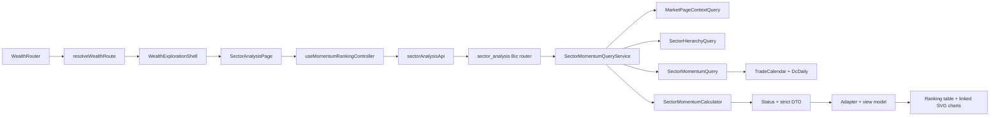

# 财势探查｜板块分析低层设计 v1

## 0. 文档状态

- 状态：v1.15；既有动量排名 M0～M4 保持原结论；双动量 M5 合同、M6 后端与 M7 前端代码及自动化均已收口，下一步固定为 M8 真实联调和最终交付验收。
- 编写日期：2026-08-28。
- 适用仓库：`/Users/congming/github/goldenshare`，当前开发分支 `dev-interface`。
- 产品依据：[财势乾坤板块分析产品交互基线文档](./sector-analysis-product-interaction-baseline-v1.md)。
- 技术依据：[财势探查｜板块分析技术实施方案 v1](./sector-analysis-implementation-design-v1.md)。
- Figma：`Goldenshare Web`，file key `RADlZzREU4lPVviYfkLy6x`，页面 `14 Wealth Exploration - Sector Analysis`（`965:2`）。
- 目标路由：`/wealth/exploration/sector-analysis/momentum-ranking`、`/wealth/exploration/sector-analysis/dual-momentum`。
- 目标 API：既有 `/api/v1/wealth/market/sector-analysis/meta|momentum/**`；新增 `/api/v1/wealth/market/sector-analysis/dual-momentum/meta|results`。
- 待拍板项：无。若编码时发现本文与当前事实冲突，必须停止并回到方案层确认。

本文定义财势探查页面结构、已完成的“横截面动量排名”与 M3A 三级行业成分股明细，以及第二个独立方法“双动量”的代码级方案。双动量只描述当前行业同时满足绝对动量和相对动量的状态，不做预测、信号或综合评分。相对轮动、成员广度、量价分布继续只保留按钮和“待建设”提示，不得生成路由、controller、API、Mock、隐藏工作区或计算逻辑。M3A 成分股明细只是已选三级行业的事实下钻，不属于“成员广度”。

---

## 1. 冻结口径与开发约束

| 硬口径 | 编码落点 | 必须证明的正反例 |
|---|---|---|
| 首期只做行业动量排名 | `sector-analysis/momentum-ranking/**` | 仓库没有概念、地域、申万、Heat、预测或 QTF 依赖 |
| Prod 是唯一在线事实源 | 既有动量 Query + M3A 成员 Query | 只出现 `TradeCalendar`、`WealthSectorHierarchy`、`DcDaily`、`DcMember`、`EquityDailyBar`；后两者只用于三级行业成员明细 |
| 公共业务日期唯一 | `MarketPageContextQuery` + URL `tradeDate` | Pre-M2 将内部访问收敛为 1 条 SQL；20:00 默认口径、显式历史严格命中和公开合同不变；前端无本机业务日计算 |
| 历史缺口必须可见 | Meta 日期覆盖 DTO + 日期选择器 | 覆盖区间内全部 SSE 开市日均返回；COMPLETE/PARTIAL/MISSING 不被过滤 |
| 五类比较池固定 | `SectorMomentumScope` + `resolve_scope_pool()` | 全体一级/二级/三级与两类直属子级集合完全正确 |
| 周期固定为 1/5/10/20/30 | `SectorMomentumPeriod` | 未批准周期和任意整数被拒绝 |
| 1 日读取 `pct_change`，多日读取完整 N+1 收盘窗口 | `SectorMomentumCalculator` | 缺任一日期、空值、非正收盘均不可计算，不补值 |
| 涨/跌只改变展示顺序 | `sort_ranking_rows()` | 同行业 `returnPct/strengthRank/percentile` 在两方向完全一致 |
| `strengthRank` 是唯一历史排名 | `rank_strength()` | 最高收益第 1，竞赛排名，历史接口无 direction |
| 完整列表，不做 TopN | rankings DTO + table | 返回当前比较池全部对象，null 行仍保留在末尾 |
| 三级成员使用来源全集 | members DTO + member table | 不套 Heat 有效池；B 股、停牌或行情缺口行保留并显示 `--` |
| 成员收益公式独立 | `SectorMemberReturnCalculator` | 1 日取 `pct_chg(t)`；多日逐日连乘；禁止复用行业首尾收盘价算法 |
| 成员事实版本一致 | members 必填 `hierarchyVersion` | 版本不一致返回 409；禁止把不同层级版本的榜单和成员拼接 |
| 成员局部状态隔离 | 独立 member controller/state | 成员 Loading/Empty/Error 不改变整页 READY/DELAYED，不遮蔽行业榜单和右侧详情 |
| 当前行业尽量保留 | URL reducer + controller | 日期、周期、方向、显示范围变化不擅自换行业 |
| 两图同时展示并联动 | `MomentumDetailPanel` | 同一交易日索引、独立纵轴、缺点断线、排名第 1 在顶部 |
| 1600 仅是像素基线，运行时必须等宽适配 | `sector-momentum.css` | 1600px 为 `776+12+776`；1512px 自动收缩且无裁剪；不得把 1564px 写成运行时固定宽度 |
| 页面状态只用五态 | API 四态 + 前端 LOADING | READY/DELAYED/EMPTY/ERROR；PARTIAL 只能作为日期覆盖元数据，不能成为第六种页面状态 |
| 双动量是独立方法 | 独立 route、Meta/Results、controller 和工作区 | 动量排名与双动量不能同时挂载；不得复制收益/排名公式或解释旧页面 DTO |
| 双动量周期与阈值固定 | period `5/10/20/30`；threshold `70/80/90` | 1 日、任意周期、任意阈值均拒绝；阈值相等时计入领先 |
| 双动量只描述当前状态 | `sector-dual-momentum@1` 分类器 | 不输出综合分、预测、信号、成功率、Lift 或发布状态 |
| 未建设方法零副作用 | `SectorAnalysisMethodBar` | 相对轮动、成员广度、量价分布点击只 toast；URL、请求、图表和工作区均不变化 |
| 不新增持久化能力 | 复用既有 ORM；无迁移、表、缓存服务 | Alembic head 不变；无新 ORM model、Redis 或后台任务 |

公式身份固定：

```text
formulaKey = sector-cross-sectional-momentum
formulaVersion = 1
```

本版本描述当前和历史表现，不输出预测、信号、成功率、持续性或未来解释。

## 2. 当前实现审计

### 2.1 CodeGraph 与代码影响面

M1 开发前使用仓库根 CodeGraph 索引完成了入口、调用方、被调用方、共享契约、测试和前端消费者核验。索引状态为 healthy；M1 前基线主链为：

```text
WealthRouter
  -> routerState.isWealthExplorationPath
  -> WealthExplorationPage
      -> MarketPageContext API
      -> MajorIndices API
      -> TurnoverInsight controller

MarketOverviewPage
  -> market-overview/layout/ShortcutBar

sector-overview API
  -> MarketSectorOverviewQueryService
      -> SectorHierarchyQuery
      -> SectorSelectionResolver(SectorHierarchyNode)
```

M1 完成后的当前主链为：

```text
WealthRouter
  -> resolveWealthExplorationRoute
      -> WealthExplorationLandingPage
      -> TurnoverInsightPage
      -> SectorAnalysisPage
  -> WealthExplorationShell
      -> MarketPageContext API
      -> MajorIndices API

MarketOverviewPage
  -> MarketShortcutBar
      -> shared/ui/shortcut-bar
```

结论：页面结构、精确路由和共享 Shortcut 已完成；M2 已提供 meta/rankings/history 三个真实接口，M3 已实现动量排名结果工作区，M3A 已实现 members 第四接口、独立成员计算主链、成员局部 controller/state 和左栏下半区。M3 与 M3A 已于 2026-08-28 通过用户验收。

### 2.2 前端真实现状

1. `routerState.ts` 使用判别联合解析四个精确地址；未知 `/wealth/exploration/**` 不会被宽松吞入模块路由。
2. `/wealth/exploration`、`/turnover-insight` 和 `/sector-analysis/momentum-ranking` 分别由 landing、turnover、sector 三页承载；板块根地址以 `replace` 保留 query 后进入动量地址。
3. `WealthExplorationShell` 只加载公共时间和主要指数 ticker；入口首页没有成交额或板块业务请求。
4. `TurnoverInsightPage` 独占既有 `TurnoverInsightSection/controller`，接口、超时和 adapter 合同未变。
5. `SectorAnalysisPage` 已挂载真实动量排名 controller/workspace；一个 active 方法和四个“待建设”按钮仍保持，四按钮只产生本地 toast，不改变 URL，不发对应方法请求。
6. 市场总览六项数据已移入 `MarketShortcutBar`；共享卡片外层改为原生 button，内部 DOM/class、6 等分、10px 列距、12px 底距、最小高 72px 和内边距保持不变。
7. 旧 `WealthExplorationPage`、旧私有 Shortcut、零高度 `sector-radar` 节点和对应历史门禁已经删除，不留 wrapper 或 re-export。
8. `TopMarketBar`、`PageBreadcrumb`、market context 和主要指数 ticker 继续复用既有公共能力，没有复制或改契约。

### 2.3 后端真实现状

1. `DcDaily` 映射 `core_serving.dc_daily`，业务键为 `(ts_code, trade_date, category)`；本需求使用 `close/pct_change`，已有 `trade_date` 及 `(trade_date, category)` 索引。
2. `WealthSectorHierarchy` 映射 `core_serving.wealth_sector_hierarchy`，包含本需求所需层级、父级、root、路径、排序、版本和发布时间字段；已有 level/parent/root 三组查找索引。
3. `TradeCalendar` 映射 `core_serving.trade_calendar`，业务键 `(exchange, trade_date)`，已有 `trade_date` 索引。
4. `MarketPageContextQuery` 已实现 SSE 交易日和 20:00 默认切换。Pre-M2 已将显式模式最坏 2 条、默认模式最坏 4 条 SQL 收敛为 1 条只读 SQL；20:00 规则、公开方法、返回字段和消费者语义保持不变。
5. 当前工作区已把 `SectorHierarchyQuery` 移到 `queries/wealth/market/common/sector_hierarchy_query.py`，补齐父／root 名称、`is_leaf` 和最大 `published_at`；两个直接消费者均已切换到公共绝对 import，首页板块速览与架构回归 33 项通过。该独立完成项不等于 M2 API 已开始或完成。
6. 现有 `sector-overview` DTO 绑定首页 Top5、概念、地域、成员、资金和 Heat，不能扩写为本页 DTO。
7. `src/app/api/v1/router.py` 逐模块 include `src.biz.api.wealth.market.*`；板块分析只需新增一个 Biz router include，App 不承载业务逻辑。
8. `sector_analysis.py` 当前提供 meta、rankings、history 和 members 四类事实；members 使用独立 DTO、Query、Calculator、QueryService 和前端局部状态，不改变既有三类事实。
9. `DcMember` 已映射 `core_serving.dc_member`，业务键为 `(trade_date, ts_code, con_code)`，名称字段允许为空；`EquityDailyBar` 已映射 `core_serving.equity_daily_bar`，业务键为 `(ts_code, trade_date)`，`close/pct_chg` 均允许为空。M3A 复用现有 ORM，不新增模型或迁移。
10. 首页 `SectorMemberQuery.load_top()` 还会连接证券和停牌事实、最多返回 5 行并按单日涨跌幅排序；它只被首页板块速览消费，M3A 禁止修改、扩写或复用该 DTO。
11. 现有 `SectorMomentumCalculator` 的多日行业收益使用首尾收盘价比，不符合 M3A 已拍板的逐日 `pct_chg` 连乘；M3A 必须新增独立纯计算器。

### 2.4 当前状态与目标状态的差异

| 事项 | 当前代码 | 本期目标 | 处理方式 |
|---|---|---|---|
| 财势探查根页 | 纯入口首页（M1 已完成） | 纯入口首页 | 保持 landing 零业务请求 |
| 成交额路由 | `/turnover-insight`（M1 已完成） | 独立子页 | 保持既有业务合同 |
| 板块分析 | M2 三接口 + M3 动量工作区已实现 | 增加三级行业成员下钻 | 插入独立 M3A，不修改既有三个 endpoint 和右侧详情 |
| Shortcut | 共享展示 + 两个 feature wrapper（M1 已完成） | 零漂移共享能力 | 后续不得回写 feature 私有副本 |
| 行业层级 Query | Biz 公共 Query（当前工作区已移动） | Biz 公共 Query | M2 收口时再次回归首页板块速览，不再重复移动 |
| 动量事实 | meta/rankings/history 已实现 | 增加 members 第四个只读 API | 独立 query/calculator/service/DTO，不复用首页 Top5 |
| 页面异常态 | 整页五态已实现 | 增加成员局部四态 | 局部失败不得升级为整页 ERROR |
| 左栏 | 所有 scope 只有单行业榜单 | 两个三级 scope 使用上下双滚动 | 其他三个 scope 的 DOM、请求和尺寸保持不变 |

### 2.5 Prod DuckDB 只读覆盖证据

2026-08-27 用 DuckDB 1.5.5 `postgres` 扩展，通过现有 Web 只读连接直接附加 Prod，白名单只包含 `trade_calendar/wealth_sector_hierarchy/dc_daily`。审计没有写库、导出来源行或建立快照。

1. 当前层级为一级 31、二级 128、三级 337，共 496 个行业。
2. `2024-01-02..2026-08-26` 有 642 个 SSE 开市日、317,825 条当前行业池行情；重复业务键、非开市日行情、无效 close 和无效 pct_change 均为 0。
3. 20 个开市日存在 607 个行业日缺口：2026-05-20 缺 484、2026-05-18 缺 97、2026-05-25 缺 9，其余 17 日各缺 1。完整日期表见技术方案第 5.5 节。
4. 另有 14 个不属于当前发布层级的历史行情代码、7,216 行；它们不得进入当前行业池、覆盖分母或排名。
5. 以 2026-08-26 为结束日审计最近 60 个结束点：5 日完整窗口 29,760/29,760；10 日 29,249/29,760；20 日 24,391/29,760；30 日 19,531/29,760。历史缺口会真实传导到 N+1 可计算性。

这项审计关闭“是否存在缺口”的事实问题，但不关闭 M2 的实现验收：编码仍必须用同一门禁生成日期覆盖状态、空值行和断点，并通过正反例证明没有补值或隐藏缺口。

### 2.6 M3A Prod 成分事实审计

2026-08-28 使用现有 Web 只读连接审计当前 337 个三级行业、最近 30 个 SSE 开市日和目标日成员行情；只返回聚合数量和少量代码样本，没有写库、导出来源行或建立副本。

1. 最近 30 个开市日 `2026-07-17..2026-08-27` 共 10,110 个三级行业组日，成员快照缺失为 0。
2. 单行业成员数最小 1、P50 11、P95 约 55、最大 139；139 行冻结 DTO 估算约 `13.5KB`，低于 `256KB`，因此完整返回且不分页。
3. 目标日 5,641 条来源成员中 5,547 条有日行情，94 条无目标日行情：78 条 B 股、3 条停牌、13 条其他缺口。全部保留为来源成员并显示 `--`，不引入证券池、停牌补零或前向填充。
4. 1/5/10/20/30 日严格可计算数量为 `5,547/5,537/5,529/5,508/5,487`。
5. 两张来源表未发现重复业务键；目标日名称无空白，但 ORM 允许名称为空，DTO 必须允许 null。

该证据冻结 Members `<=4 SQL` 和完整列表设计；实现后仍需验证真实 API P95，不能用聚合审计替代部署态性能结论。

### 2.7 M5～M7 双动量代码与消费者审计

2026-08-28 在仓库根的最新 CodeGraph 索引上复核了后端 API、QueryService、Calculator、schema、前端路由、方法栏、URL 状态、controller、页面消费者和测试。索引状态为 up to date，共 2,787 个文件、49,059 个节点和 124,757 条边。

1. `SectorMomentumQueryService.build_rankings()` 已改为消费 `SectorMomentumSnapshotQueryService` 的不可变单日快照，只增加 `direction/listPosition` 和旧 Rankings DTO；双动量直接消费同一快照，不依赖旧页面响应。
2. `SectorMomentumCalculator` 已正确实现本需求所需的区间收益、竞赛排名和并列平均百分位。M6 必须复用该纯计算器；禁止复制公式、修改 `formulaVersion=1` 或在双动量分类器里重算收益和百分位。
3. 单日快照已一次加载公共日期、层级、比较池和行情，按 `(display_order, sector_code)` 保留全量事实行；既有 Rankings service 负责方向排序与旧 DTO，新 Dual service 负责状态分类与新 DTO。History 继续走原多日网格，未进入快照重构。
4. 公共 Meta service 已只输出日期、层级和覆盖事实；既有 Meta 与双动量 Meta 分别映射自己的 strict DTO，旧 Meta 的 `period=1/directions/historyRanges` 未泄漏到双动量。
5. 前端已具有 `sector-analysis-momentum` 与 `sector-analysis-dual-momentum` 两个精确路由；`SectorAnalysisPage` 通过显式方法判别只挂载一个 controller，`SectorAnalysisMethodBar` 对两个已建设方法执行真实导航，其余三个按钮继续仅触发“待建设”提示。
6. 现有动量 URL/parser/API/adapter/controller 都在 `momentum-ranking` feature 内，含方向、历史范围和成员事实；不得扩成带 method 分支的通用大 controller。双动量建立 feature-local 的 Meta/Results、URL 和状态边界。
7. CodeGraph 影响面确认 `SectorMomentumQueryService` 变化会传导到既有 meta/rankings/history API 与查询测试，`SectorMomentumCalculator` 会传导到 rankings/history 和计算测试；因此 M6 的硬回归是四个既有 endpoint 响应零变化和 calculator 全量测试，而不是只测新接口。
8. `SectorAnalysisMethodBar` 当前唯一页面消费者是 `SectorAnalysisPage`；`parseSectorMomentumUrlState` 的直接消费者是现有 controller 和测试。新增双动量独立 parser 可避免污染现有 URL 合同。
9. 双动量不需要 history、members、成分股、资金、Heat、QTF、DG/Lake 或数据库写入；其列表、摘要和散点图都由同一个 Results 全量响应派生。M5 没有发现需要新增配置、依赖、迁移、缓存、结果表或账号的理由。

## 3. Figma 开发交付审计

### 3.1 正式节点基线

| 状态 | 节点 | 尺寸 | 用途 |
|---|---|---:|---|
| Ready／一级总榜涨幅 | `965:55` | 1600×1292.390625 | 默认视觉基线 |
| Ready／一级总榜跌幅 | `971:352` | 1600×1292.390625 | 方向切换 |
| Ready／二级总榜 | `1051:951` | 1600×1292.390625 | 全部二级、所属一级路径和双排名摘要 |
| Ready／三级总榜 | `1051:1251` | 1600×1292.390625 | 全部三级；左栏上下双滚动，成员面板 `1085:1268` |
| Ready／一级内二级 | `987:476` | 1600×1292.390625 | 单父级选择器及下钻结果 |
| Ready／二级内三级 | `987:776` | 1600×1292.390625 | 两级联动；左栏上下双滚动，成员面板 `1088:1268` |
| Ready／双图 Hover | `1053:5261` | 1600×1292.390625 | 两图同日期十字线和联合 Tooltip |
| Ready／交易日选择器 | `1062:2` | 1600×1292.390625 | COMPLETE/PARTIAL/MISSING 可见且均可选择 |
| Loading | `1036:634` | 1600×1292.390625 | 稳定骨架加载态 |
| Delayed | `1036:1014` | 1600×1292.390625 | 保留上一完整交易日内容 |
| Empty | `1036:1386` | 1600×1292.390625 | 全部不可计算或显式日无数据 |
| Error | `1036:1762` | 1600×1292.390625 | 错误与重试 |

`1292.390625px` 是现有 Figma 内容边界形成的画板高度，不是运行时固定高度合同。编码只把 `1600px` 作为桌面截图验收宽度，并按下文整数尺寸实现内部骨架；页面根节点不得写死 `height:1292.390625px`，应由内容高度和现有页面 Shell 自然撑开。

双动量旧草稿 `967:72` 已冻结并移出正式画板区域，不得作为编码依据。双动量唯一正式基线为：

| 状态 | 节点 | 编码用途 |
|---|---|---|
| Ready／符合条件 | `1096:1267` | 默认一级总榜、20 日、80% 阈值 |
| Ready／全部行业 | `1101:5478` | 同一 Results 本地切换完整列表 |
| Ready／一级内二级 | `1103:1425` | 所选一级直属二级池 |
| Ready／二级内三级 | `1104:1898` | 所选二级直属三级池 |
| Ready／二级总榜 | `1105:1583` | 全部二级同组比较 |
| Ready／三级总榜 | `1105:1938` | 全部三级同组比较 |
| Ready／Hover | `1106:1741` | 散点 Hover 与列表联动 |
| Ready／Partial Data | `1106:2109` | 有可用事实时的局部覆盖提示 |
| Loading | `1106:2528` | 稳定工作区骨架 |
| Delayed | `1106:7209` | 上一完整交易日事实与实际日期提示 |
| Empty | `1106:2713` | 比较池零个可计算对象 |
| Error | `1106:2894` | 合同或查询失败与重试 |
| Ready／Small Group | `1107:2216` | 可计算对象少于 3，只展示事实不判定资格 |
| Ready／No Qualified | `1115:2295` | 有可计算事实但零符合条件对象 |
| Ready／Missing Selected Coordinate | `1115:2571` | 所选行业可保留，但散点不伪造坐标 |

上述 15 张正式页面均为 `1600×1292.390625`，双动量工作区实例为 `1564×1006`，组件集为 `1132:9777`，交互说明节点为 `1137:422`。运行时继续使用等宽弹性 Grid，不把 1564px 写成固定宽度。

相对轮动、成员广度、量价分布的节点 `967:158/967:244/967:330` 仍是 Draft，只证明按钮位置，不是本期工作区实现依据。

### 3.2 结构与 Design System 结论

1. 正式画板直接复用 `TopMarketBar` 实例、`PageBreadcrumb` 实例、`ShortcutCard` 实例和方法 Tab 组件实例。
2. PageShell 使用纵向 Auto Layout；`1600px` 验收基线下左右工作区为 `776 + 12 + 776 = 1564px`，运行时两列使用等分弹性轨道，不得固定为 776px。
3. `1600px` 基线下工具栏为 `1564×128`、正文为 `1564×866`；运行时宽度均为当前 PageShell 内容宽度的 `100%`，高度不变。
4. 一级、二级和一级内二级继续使用单榜单左栏：`1600px` 基线下榜单滚动 viewport 为 `776×772`；运行时宽度随左列变化，高度仍为 772px。固定表头高 40px、行高 56px、`clipsContent=true`、`overflowDirection=VERTICAL` 不变。
5. 三级总榜和二级内三级的左栏包装节点分别为 `1085:1267/1088:1267`，均为 `776×866` 纵向 Auto Layout：上部行业榜单 `776×390`、间距 `12`、下部成员面板 `776×464`。成员面板包含 54px 标题、40px 固定表头和 370px 纵向滚动 viewport，成员行高 48px。
6. 图表、涨跌数据条和滚动条叠层保留绝对坐标。它们是几何绘图区，不应改成 Auto Layout。
7. 页面普通容器、工具栏、行、摘要卡、状态面板均使用 Auto Layout；不存在用补偿坐标模拟页面布局的新增节点。
8. 核心颜色已绑定 `CSQ / Market Overview / M0 / Color` 变量；Delayed 新增语义变量 `System/Warning`（`VariableID:1033:2`，`#f59e0b`），Web syntax 为 `var(--cs-color-warning)`，scope 覆盖 Frame/Shape/Text Fill 和 Stroke。
9. Shortcut 外层容器已从原始色值绑定到 `Background/Panel` 和 `Border/Subtle`。
10. Loading skeleton 已绑定 `Background/PanelSoft`；Error 重试复用 `Button / Neutral / M0`。
11. 模块自有正式文本已绑定可精确匹配的本地 Text Style；共享 TopMarketBar 和 ShortcutCard 内仍有少量继承自既有组件的原始色值和无 textStyleId 文本。它们是现有共享组件债务，本期不修改，否则会扩大到全站；其实际颜色与 Web Token 一致，不阻塞本模块编码。

### 3.3 已修正的问题

| ID | 原问题 | 严重度 | 修正结果 |
|---|---|---|---|
| F01 | 列表“排名”与详情“当前排名”混淆展示序号和业务排名 | 高 | 改为“序号”与“同组强度排名” |
| F02 | 上下两图各有一套 20/30/60 控件，可能形成两套显示范围 | 高 | 每张 Ready 画板只保留上图一套共用控件 |
| F03 | viewport 只有手绘滚动条，没有 Figma 纵向滚动语义 | 高 | 六类 Ready 榜单画板均设置 `VERTICAL` overflow |
| F04 | 只有 Ready，没有 Loading/Delayed/Empty/Error 正式页 | 高 | 新增四张完整正式状态画板 |
| F05 | 图题“历史排名”未说明范围，滚动收益未显示计算周期 | 中 | 标题改为周期和比较范围专属文案 |
| F06 | Shortcut 外层未绑定变量 | 中 | 绑定 Panel/Subtle Token |
| F07 | 本地 Breadcrumb 组件横向溢出 section 32px | 中 | `966:55.x` 从 32 改为 0 |
| F08 | Loading skeleton 继承白色底和原始灰 | 中 | 清除白底并绑定 PanelSoft |
| F09 | 涨跌榜把展示序号误当业务排名，百分位端点不符合公式 | 高 | 跌幅最弱示例改为 `31/31、0.0%`，涨幅最强示例改为 `100.0%`；方向只改变展示顺序 |
| F10 | 缺二级／三级总榜和双排名摘要 | 高 | 新增 `1051:951/1051:1251`；二／三级同时表达全层级和直属父级排名 |
| F11 | 四个待建设按钮跳草稿，行选择与下钻边界不清 | 高 | 清除草稿导航；行点击只选中，独立箭头下钻，三级明确无下钻 |
| F12 | 两图共用范围和 Hover 无正式编码状态 | 高 | 六张 Ready 均标注“两图共用”；新增 `1053:5261` 展示共享十字线和联合 Tooltip |
| F13 | 一级排名轴只到 20，无法表达 31 个对象 | 高 | 涨／跌与 Hover 纵轴完整覆盖 `1..31`；二／三级总榜分别覆盖 `1..128`、`1..337` |
| F14 | Warning Token 和模块文字样式未完成开发交付绑定 | 中 | 补 Web syntax/scope；模块自有正式文本绑定本地 Text Style，不拆共享实例 |
| F15 | 日期字段只表达当前值，无法看到缺口日 | 高 | 新增 `1062:2`；Popover 使用真实覆盖示例显示日期、完整／部分缺失／无数据图例及 `valid/expected`，所有状态均可选择 |
| F16 | 选中三级行业后无法继续查看成分明细 | 高 | `1051:1251/987:776` 左栏改为 `390+12+464` 双滚动；下部四列显示完整来源成员、目标日收盘价和当前周期涨跌幅 |

### 3.4 Figma 基线与运行时响应式映射

| Figma 区域 | 代码约束 |
|---|---|
| 1600 根画板 | 设计验收宽度，不是运行时固定宽度；运行时外壳使用现有 content max/min Token，不做 CSS scale，不写死 Figma 小数画板高度 |
| PageShell | `padding: 14px 18px 34px`，纵向 12px 基础节奏 |
| ShortcutBar | 1600 基线宽 1564px，运行时跟随 PageShell 为 `width:100%`；卡间 10px、当前两卡保持卡宽约 252.33px，不强制两卡拉满整行 |
| 方法栏 | 高 48px、内边距 4px、按钮间 4px |
| 工具栏 | 1600 基线为 1564×128；运行时 `width:100%`，16px 内边距、两行各 44px、行间 8px |
| 分析正文 | 1600 基线为两列各 776px；运行时 `repeat(2,minmax(0,1fr))`、列间 12px、高 866px |
| 单榜单左栏 | 仅一级、二级、一级内二级；运行时宽度等于左列；标题 54px、固定表头 40px、viewport 高 772px、行 56px |
| 三级双列表左栏 | 仅三级总榜、二级内三级；总高 866px，上榜单 390px、间距 12px、下成员 464px；两个 viewport 独立纵向滚动 |
| 成员表 | 标题 54px、固定表头 40px、viewport 370px、行 48px、左右内边距 12px；表头与行共用同一响应式 Grid |
| 详情摘要 | 1600 基线 776×112；运行时 `width:100%`、高度 112px |
| 趋势图 | 1600 基线每图 776×365；运行时 `width:100%`、高度 365px、图间 12px |
| 状态面板 | 运行时 `width:100%`、高 866px，替换正文但保留工具栏及页面骨架 |

Figma 是视觉和布局事实源；交互状态、数据语义、缺失处理和请求边界以产品基线与本 LLD 为准。不得从示例文字、示例日期或示例行业推导生产默认值。

运行时宽度计算固定为：

```text
shellOuterWidth = min(max(viewportWidth, 1460), 1840)
contentWidth = shellOuterWidth - 36
columnWidth = (contentWidth - 12) / 2
```

在 1600px 下列宽为 776px；约 1512px 下列宽为 732px。低于全局 1460px 最小宽度时沿用全站页面级横向滚动，不允许本模块另加 CSS scale、固定 1564px 宽度或独立响应式断点。

Selected Summary 的 Identity 额外使用 `ResizeObserver` 观察自身尺寸，并以真实 DOM 溢出决定字号，不读取浏览器视口宽度：

1. 每次行业、层级路径或 Identity 宽度变化时，先移除 compact/extra-compact，以设计稿字号测量行业名和完整层级路径的 `scrollWidth/clientWidth`。
2. 两者均完整容纳时维持行业名 `17px`、层级路径 `11px`；任一文本溢出时设置 compact，行业名改为 `14px`、层级路径改为 `9px`，等级标签同步收紧为 `10px` 和 `2px 5px` 内边距。
3. compact 应用后必须立即再次测量；若行业名或路径仍溢出，则增加 extra-compact，行业名改为 `12px`、路径改为 `8px`，等级标签改为 `9px` 和 `2px 4px` 内边距。
4. 容器再次变宽时必须从设计稿字号重新测量；宽度足够后自动退出两级 compact，不能永久停留在小字号。
5. 等级标签始终 `white-space:nowrap` 且不得参与 flex 收缩；行业名和层级路径在 extra-compact 后仍保留 Tooltip/省略保护，只用于防御超过当前正式名称长度的异常数据。

成分股四列在 Figma `776px` 基线内为 `240/176/144/192`，只定义相对比例。代码统一使用：

```css
grid-template-columns:
  minmax(0, 240fr)
  minmax(0, 176fr)
  minmax(0, 144fr)
  minmax(0, 192fr);
```

同一声明必须同时用于表头和每一行。名称列单行省略并提供 Tooltip；代码、收盘价和涨跌幅禁止换行，后三列右对齐。运行时不得写死 752px，否则在 1512px 视口下左栏内容宽约 708px 时会溢出。

## 4. 目标调用链



页面壳只加载 page context 和 ticker；业务 controller 只由对应子页挂载。Backend API 不访问 Ops、TaskRun、QTF、DG 或 Lake。

## 5. 文件级编码矩阵

### 5.1 前端移动与共享提取

| 操作 | 文件 | 精确要求 |
|---|---|---|
| 新增 | `wealth/src/shared/ui/shortcut-bar/shortcutBarTypes.ts` | 定义 `ShortcutItem` 和 key/path/title/description；无 feature 常量 |
| 新增 | `wealth/src/shared/ui/shortcut-bar/ShortcutCard.tsx` | 外层使用真实 `<button type="button">`；保留既有内部 DOM/class；接收 selected/disabled/onSelect |
| 新增 | `wealth/src/shared/ui/shortcut-bar/ShortcutBar.tsx` | 接收 items/activeKey/onNavigate；不决定业务路由 |
| 新增 | `wealth/src/shared/ui/shortcut-bar/shortcut-bar.css` | 原样迁移 `.shortcut-*` 视觉；补 button reset、focus-visible，不改尺寸 |
| 删除 | `wealth/src/features/market-overview/layout/ShortcutBar.tsx` | 全部消费者切换后彻底删除，不留 wrapper/re-export |
| 修改 | `wealth/src/pages/market-overview/market-overview-page.css` | 只删除已迁移 Shortcut 规则；其它 CSS 字节级保持 |
| 新增 | `wealth/src/features/market-overview/layout/MarketShortcutBar.tsx` | 保留当前六项数据和 toast 行为 |
| 修改 | `wealth/src/pages/market-overview/MarketOverviewPage.tsx` | 仅切换 wrapper import；渲染顺序不变 |

共享组件只把最外层 `article` 更正为 `button`，内部两层 DOM、全部 class、选中伪元素和视觉尺寸必须不变。CSS 必须增加 `appearance:none; color:inherit; font:inherit; text-align:left; width:100%`，避免浏览器默认按钮样式造成漂移。技术方案所称“保留 DOM”在编码中具体指保留内部结构和 CSS 选择器，不保留缺少键盘语义的错误外层标签。

### 5.2 财势探查页面结构

| 操作 | 文件 | 精确要求 |
|---|---|---|
| 新增 | `wealth/src/pages/wealth-exploration/layout/WealthExplorationShell.tsx` | TopBar、context、ticker、breadcrumb、shortcut、toast 和 children slot |
| 新增 | `wealth/src/pages/wealth-exploration/layout/useWealthExplorationShell.ts` | 迁移现页 context/ticker 两段请求；不加载业务模块 |
| 新增 | `wealth/src/features/wealth-exploration/navigation/explorationNavigation.ts` | 两个入口的唯一配置和正式 path |
| 新增 | `wealth/src/features/wealth-exploration/navigation/ExplorationShortcutBar.tsx` | 组合共享 Shortcut；入口首页 activeKey=null |
| 新增 | `wealth/src/pages/wealth-exploration/WealthExplorationLandingPage.tsx` | 只渲染 Shell，无业务请求 |
| 新增 | `wealth/src/pages/wealth-exploration/TurnoverInsightPage.tsx` | Shell + 既有 `TurnoverInsightSection/controller` |
| 新增 | `wealth/src/pages/wealth-exploration/SectorAnalysisPage.tsx` | Shell + 方法栏 + 当前动量工作区 |
| 删除 | `wealth/src/pages/wealth-exploration/WealthExplorationPage.tsx` | 三个新页面接管全部用途后删除，不保留兼容页面 |
| 修改 | `wealth/src/pages/wealth-exploration/wealth-exploration-page.css` | 删除零高度 slot，增加 Shell/shortcut/method/workspace 布局；复用 Token |

### 5.3 前端路由

| 操作 | 文件 | 精确要求 |
|---|---|---|
| 修改 | `wealth/src/app/routes/routerState.ts` | 新增正式常量、路径 builder 和有界 route resolver |
| 修改 | `wealth/src/app/routes/WealthRouter.tsx` | 按判别联合类型渲染三个页面；sector-analysis 根 path replace 到 momentum path |
| 修改 | `wealth/src/app/routes/routerState.test.ts` | 正反例覆盖精确路径、未知子路径、query 保留和 replace |

不得继续扩写一个返回 boolean 的宽松 `isWealthExplorationPath()`。目标解析器：

```ts
type WealthExplorationRoute =
  | { kind: "landing" }
  | { kind: "turnover-insight" }
  | { kind: "sector-analysis-redirect" }
  | { kind: "sector-analysis-momentum" }
  | { kind: "not-exploration" };

resolveWealthExplorationRoute(pathname: string): WealthExplorationRoute
```

精确路由常量：

```text
/wealth/exploration
/wealth/exploration/turnover-insight
/wealth/exploration/sector-analysis
/wealth/exploration/sector-analysis/momentum-ranking
```

未知 `/wealth/exploration/**` 必须返回 `not-exploration`，证明它没有被误识别为本模块路由；本期继续保留 Router 当前既有 fallback，不顺手新增全站 404 或错误路由框架。

### 5.4 后端公共查询移动（M2 已完成，不得重复执行）

| 操作 | 文件 | 精确要求 |
|---|---|---|
| 新增 | `src/biz/queries/wealth/market/common/sector_hierarchy_query.py` | 原类完整移动；Node 补齐父/root 名称和 `is_leaf`，Snapshot 增加 `published_at` 元数据 |
| 删除 | `src/biz/queries/wealth/market/sector_overview/sector_hierarchy_query.py` | 消费者和测试改完后删除，无兼容 re-export |
| 修改 | `sector_overview/sector_overview_query_service.py` | 相对 import 改为 common 绝对 import；行为不变 |
| 修改 | `sector_overview/sector_selection_resolver.py` | `SectorHierarchyNode` 改为 common import |

上述移动已经完成。M3A 只复用公共查询的单一版本、代码唯一、一级 root、父级层次、root 闭包和稳定排序结果，并以现有 `baseline_version` 校验 members 请求；不得再次移动文件、增加兼容 re-export 或改变首页选择和错误语义。

### 5.4A Pre-M2 公共日期查询收敛

| 操作 | 文件 | 精确要求 |
|---|---|---|
| 修改 | `src/biz/queries/wealth/market/context/market_page_context_query.py` | 保持公开合同和 20:00 语义不变，把单次 `resolve_context()` 收敛为 1 条只读 SQL |
| 新增 | `tests/test_wealth_market_page_context_query.py` | 注入固定北京时间，覆盖时间边界、显式／默认、日历缺失和 SQL 数量 |
| 修改 | `tests/web/test_wealth_market_context_api.py` | 保持公共 context HTTP 响应合同不变，补充 20:00 前后和无日历记录反例 |

Pre-M2 不修改任何调用方 API，不新增模型、迁移、缓存或配置。CodeGraph 当前确认的 9 个直接调用入口全部继续调用同一个 `resolve_context()`；实施后必须回归公共 context、个股详情、指数详情／K 线／权重、成交额洞察、个股九转和指数九转。

### 5.5 后端新增

```text
src/biz/api/wealth/market/sector_analysis.py
src/biz/schemas/wealth/market/sector_analysis.py
src/biz/queries/wealth/market/sector_analysis/
  __init__.py
  sector_analysis_meta_query.py
  sector_momentum_query.py
  sector_momentum_query_service.py
src/biz/services/wealth/market/sector_analysis/
  __init__.py
  sector_analysis_exception_builder.py
  sector_analysis_status_resolver.py
  sector_momentum_contract.py
  sector_momentum_calculator.py
```

只使用一个 Biz router 文件，避免两个 endpoint 文件分别复制参数验证。`src/app/api/v1/router.py` 只增加一次 import 和 include。

### 5.6 前端板块分析新增

```text
wealth/src/features/wealth-exploration/sector-analysis/
  navigation/
    SectorAnalysisMethodBar.tsx
  momentum-ranking/
    api/
      sectorMomentumApi.ts
      sectorMomentumAdapter.ts
    model/
      sectorMomentumTypes.ts
      sectorMomentumUrlState.ts
      useMomentumRankingController.ts
    ui/
      MomentumRankingWorkspace.tsx
      MomentumControlBar.tsx
      MomentumRankingPanel.tsx
      MomentumRankingTable.tsx
      MomentumRankingRow.tsx
      MomentumReturnBar.tsx
      MomentumDetailPanel.tsx
      SelectedSectorSummary.tsx
      RollingReturnChart.tsx
      HistoricalRankChart.tsx
      MomentumLinkedTooltip.tsx
      MomentumStateSurface.tsx
      sector-momentum.css
```

首个消费者保持 feature-local，不提前沉到 shared。只有 Shortcut 是当前已经存在两个消费者且视觉合同相同的真正共享组件。

### 5.7 M3A 文件级增量矩阵

| 操作 | 文件 | 精确要求 |
|---|---|---|
| 修改 | `src/biz/api/wealth/market/sector_analysis.py` | 新增第四个 `GET /momentum/members`；继续 strict unknown/duplicate 参数；不得改变三个既有 endpoint |
| 修改 | `src/biz/schemas/wealth/market/sector_analysis.py` | 新增严格 Members DTO 和计数不变量；不改既有 DTO |
| 新增 | `src/biz/queries/wealth/market/sector_analysis/sector_member_detail_query.py` | 集合读取精确开市日窗口、来源成员和批量股票行情；禁止 N+1 SQL |
| 新增 | `src/biz/queries/wealth/market/sector_analysis/sector_member_detail_query_service.py` | 版本/层级校验、调用 Query/Calculator、局部状态和 DTO 组装 |
| 新增 | `src/biz/services/wealth/market/sector_analysis/sector_member_detail_contract.py` | 输入事实、结果事实、缺失原因和固定枚举；不引入任意表达式 |
| 新增 | `src/biz/services/wealth/market/sector_analysis/sector_member_return_calculator.py` | 纯计算每日 `pct_chg` 连乘、Decimal 取舍、稳定排序和覆盖计数；无 IO |
| 修改 | `tests/architecture/test_wealth_sector_analysis_guardrails.py` | 精确新增两张允许表/模型和第四 endpoint；删除只针对 `dc_member` 的旧禁止项，继续禁止其他股票衍生表、资金、Heat、DG/Lake/QTF |
| 修改 | `wealth/docs/system/exception-code-registry.md` | 登记三个 Members 专用异常码；与本文和技术方案完全一致 |
| 修改 | `wealth/src/features/wealth-exploration/sector-analysis/momentum-ranking/api/sectorMomentumApi.ts` | 新增 members URL/fetch；请求必带 observedTradeDate 和 hierarchyVersion |
| 修改 | `wealth/src/features/wealth-exploration/sector-analysis/momentum-ranking/api/sectorMomentumAdapter.ts` | 严格校验响应、计数、可空字段和请求事实一致性；不计算收益或重排 |
| 修改 | `wealth/src/features/wealth-exploration/sector-analysis/momentum-ranking/model/sectorMomentumTypes.ts` | 新增 Member DTO/ViewModel 和局部四态 |
| 修改 | `wealth/src/features/wealth-exploration/sector-analysis/momentum-ranking/model/useMomentumRankingController.ts` | 增加独立 member requestId/AbortController/retry；不把 member 状态并入整页五态 |
| 修改 | `wealth/src/features/wealth-exploration/sector-analysis/momentum-ranking/ui/MomentumRankingWorkspace.tsx` | 两个三级 scope 使用 `MomentumLeftWorkspace`；其他 scope 保持既有渲染 |
| 新增 | `wealth/src/features/wealth-exploration/sector-analysis/momentum-ranking/ui/SectorMemberPanel.tsx` | 54px 标题、40px 表头、370px viewport、48px 行和局部四态 |
| 修改 | `wealth/src/features/wealth-exploration/sector-analysis/momentum-ranking/ui/sector-momentum.css` | 冻结 `390+12+464`、共享响应式四列 Grid、独立滚动；不改右栏 |

明确禁止修改：`sector_overview/sector_member_query.py`、`SectorMomentumCalculator`、`MomentumDetailPanel` 两图业务、TopMarketBar、Shortcut、数据库模型、迁移、配置和第三方依赖。

### 5.8 M6／M7 双动量文件级增量矩阵

M6 后端只允许下列增量：

| 操作 | 文件 | 精确要求 |
|---|---|---|
| 新增 | `src/biz/queries/wealth/market/sector_analysis/sector_analysis_meta_query_service.py` | 一次加载公共 context、当前层级和日期覆盖，返回页面无关事实；不返回任何 DTO，不增加 SQL |
| 新增 | `src/biz/queries/wealth/market/sector_analysis/sector_momentum_snapshot_query_service.py` | 解析比较池、业务日期和单日窗口，调用现有 Calculator，输出不可变事实快照；正常路径最多 5 SQL |
| 新增 | `src/biz/queries/wealth/market/sector_analysis/sector_dual_momentum_query_service.py` | 组合专属 Meta/Results、状态、计数、稳定排序和安全异常；不访问 members/history |
| 新增 | `src/biz/services/wealth/market/sector_analysis/sector_dual_momentum_contract.py` | 冻结公式、周期、阈值、分类／坐标／展示状态及不可变分类结果；不含 ORM、Session 或 DTO |
| 新增 | `src/biz/services/wealth/market/sector_analysis/sector_dual_momentum_classifier.py` | 只根据快照的 return/rank/percentile 分类，纯函数、无 IO、不重算收益或排名 |
| 新增 | `src/biz/schemas/wealth/market/sector_dual_momentum.py` | 双动量专属 strict Meta/Results DTO 与跨字段 validator；不扩写旧 Formula/Ranking DTO |
| 修改 | `src/biz/queries/wealth/market/sector_analysis/sector_momentum_query_service.py` | `build_meta/build_rankings` 改为消费公共 Meta／单日快照；旧 response model 与 JSON 事实必须零变化；`build_history` 计算链保持不变 |
| 修改 | `src/biz/api/wealth/market/sector_analysis.py` | 在同一 router 增加双动量 Meta/Results；继续 strict query、quote auth 和安全错误映射 |
| 修改 | `wealth/docs/system/exception-code-registry.md` | 登记 `SA_FACT_VERSION_MISMATCH`；不复用成员专用版本冲突码 |
| 新增 | `tests/test_wealth_sector_momentum_snapshot_query_service.py` | 快照、SQL 数、缺口、比较池、日期和旧 Rankings 等价性 |
| 新增 | `tests/test_wealth_sector_dual_momentum_classifier.py` | 公式边界、小组、缺值、状态组合和排序纯函数测试 |
| 新增 | `tests/test_wealth_sector_dual_momentum_query_service.py` | Meta/Results 状态、计数、版本、性能预算和来源门禁 |
| 修改 | `tests/web/test_wealth_sector_analysis_api.py` | 新增两个 endpoint 正反例；四个旧 endpoint response dump 回归 |
| 修改 | `tests/architecture/test_wealth_sector_analysis_guardrails.py` | 方法级证明双动量只读前三张表，禁止成员、股票、资金、Heat、QTF、DG/Lake、迁移和配置 |

M7 前端只允许下列增量：

| 操作 | 文件 | 精确要求 |
|---|---|---|
| 修改 | `wealth/src/features/wealth-exploration/navigation/explorationNavigation.ts` | 新增双动量正式 path 常量；入口卡仍默认进入动量排名 |
| 修改 | `wealth/src/app/routes/routerState.ts` | 增加 `sector-analysis-dual-momentum` 判别值、path builder 和精确反例 |
| 修改 | `wealth/src/app/routes/WealthRouter.tsx` | 向同一 `SectorAnalysisPage` 传显式 method；根地址仍 replace 到动量排名 |
| 修改 | `wealth/src/pages/wealth-exploration/SectorAnalysisPage.tsx` | 按 method 只挂载一个 controller/workspace；公共 Shell、context 和 toast 不变 |
| 修改 | `wealth/src/features/wealth-exploration/sector-analysis/navigation/SectorAnalysisMethodBar.tsx` | 改为受控 activeMethod/onSelect；两个可用方法导航，另外三个只 toast |
| 新增 | `wealth/src/features/wealth-exploration/sector-analysis/dual-momentum/api/sectorDualMomentumApi.ts` | 专属 Meta/Results URL、fetch 和专属有界错误类 |
| 新增 | `wealth/src/features/wealth-exploration/sector-analysis/dual-momentum/api/sectorDualMomentumAdapter.ts` | strict 读取、数量／状态／排序／请求事实校验；不计算资格、收益或百分位 |
| 新增 | `wealth/src/features/wealth-exploration/sector-analysis/dual-momentum/model/sectorDualMomentumTypes.ts` | 独立 DTO、ViewModel、URL、主状态和局部展示类型 |
| 新增 | `wealth/src/features/wealth-exploration/sector-analysis/dual-momentum/model/sectorDualMomentumUrlState.ts` | 十个 URL key、默认值、枚举、父级状态和 canonical search |
| 新增 | `wealth/src/features/wealth-exploration/sector-analysis/dual-momentum/model/useSectorDualMomentumController.ts` | Meta→Results、竞态、409、选择、resultView 和本地排序；不请求 history/members |
| 新增 | `wealth/src/features/wealth-exploration/sector-analysis/dual-momentum/ui/**` | 严格实现 Toolbar、ResultPanel/List、SelectedSummary、ScatterPlot、StateSurface 和正式 CSS |
| 修改／新增 | 对应 route、page、feature 测试 | 覆盖精确路由、按需挂载、URL、两请求、15 个状态、散点、响应式和三个待建设按钮 |

禁止在 M6/M7 修改 `SectorMomentumCalculator` 公式、Members 查询／controller、`MomentumRankingWorkspace` DOM、首页板块速览、TopMarketBar、Shortcut、Foundation/Ops/QTF/DG/Lake、ORM、Alembic、配置、依赖或构建脚本。若共享快照无法保持旧 Rankings JSON 和测试零变化，M6 必须停止，不能退回复制公式或兼容分支。

## 6. 后端合同与纯计算设计

### 6.1 代码枚举

```python
SectorMomentumScope = Literal[
    "LEVEL_1", "LEVEL_2", "LEVEL_3",
    "LEVEL_1_CHILDREN", "LEVEL_2_CHILDREN",
]
SectorMomentumDirection = Literal["GAINERS", "LOSERS"]
SectorMomentumPeriod = Literal[1, 5, 10, 20, 30]
SectorHistoryRange = Literal[20, 30, 60]
SectorAnalysisStatus = Literal["READY", "DELAYED", "EMPTY", "ERROR"]
```

API 接受大写枚举，前端 URL 使用小写短值；转换只允许在前端 adapter/request builder 一处完成。

### 6.2 查询数据结构

```python
@dataclass(frozen=True, slots=True)
class SectorDailyFact:
    sector_code: str
    trade_date: date
    close: Decimal | None
    pct_change: Decimal | None

@dataclass(frozen=True, slots=True)
class SectorReturnFact:
    sector_code: str
    trade_date: date
    return_pct: Decimal | None
    missing_reason: Literal[
        "NONE", "HISTORY_INSUFFICIENT", "DATE_MISSING",
        "CLOSE_MISSING", "CLOSE_NON_POSITIVE", "PCT_CHANGE_MISSING",
    ]

@dataclass(frozen=True, slots=True)
class SectorRankFact:
    sector_code: str
    return_pct: Decimal | None
    strength_rank: int | None
    percentile: Decimal | None
```

`missing_reason` 只用于服务内部和有界 debug，正式行不新增解释字段；页面统一显示 `--`。

### 6.3 比较池解析

`resolve_scope_pool(snapshot, scope, level1_code, level2_code)` 必须是纯函数：

1. `LEVEL_1`：全部 `industry_level=1`。
2. `LEVEL_2`：全部 `industry_level=2`。
3. `LEVEL_3`：全部 `industry_level=3`。
4. `LEVEL_1_CHILDREN`：`parent_sector_code=level1Code` 且 level=2。
5. `LEVEL_2_CHILDREN`：先验证 level2 是 level1 直属子级，再取其直属 level=3。
6. 返回次序固定为 `(display_order, sector_code)`；不因行情值变化改变对象池顺序。
7. 缺父级、错层、跨父级分别抛有界合同异常，API 映射 `SA_SCOPE_INVALID`。

### 6.3.1 Pre-M2 单语句日期锚点

`MarketPageContextQuery.resolve_context()` 保持现有入口：

```python
resolve_context(
    session: Session,
    *,
    market: str,
    requested_trade_date: date | None,
) -> MarketPageContext
```

内部只允许执行一条 SQL。Python 端先且只生成一次 `local_now=datetime.now(ZoneInfo("Asia/Shanghai"))`，SQL 使用绑定参数 `local_date`、`before_eod_switch` 和可选 `requested_trade_date`，不得使用数据库 `CURRENT_DATE/current_timestamp` 推导业务时间。

单条 SQL 必须通过标量子查询或 CTE 同时构造以下事实：

```text
latest_open_date      = max(SSE open trade_date <= local_date)
today_calendar        = SSE calendar row at local_date
previous_open_before_today = max(SSE open trade_date < local_date)
requested_calendar    = SSE calendar row at requested_trade_date（显式模式）
resolved_trade_date   = 显式日期；否则在今天开市、20:00前且存在 previous_open_before_today 时取该值，其余取 latest_open_date
resolved_calendar     = SSE calendar row at resolved_trade_date
previous_open_fallback = max(SSE open trade_date < resolved_trade_date)
```

结果映射规则冻结为：

1. 显式模式：`trade_date=requested_trade_date`。若 `resolved_calendar` 存在，`is_trading_day=resolved_calendar.is_open`、`prev_trade_date=resolved_calendar.pretrade_date`；若不存在，`is_trading_day=false`、`prev_trade_date=previous_open_fallback`。
2. 默认模式：今天开市、`local_now.hour < 20` 且 `previous_open_before_today` 非空时使用该日期；否则使用 `latest_open_date`。必须保持当前 `max(open trade_date < local_date)` 语义，不改为信任 `today_calendar.pretrade_date`。
3. 默认模式没有任何开市日时，继续使用 `local_date`。若该日存在日历记录，仍读取其 `is_open/pretrade_date`；若不存在，返回 `is_trading_day=false` 和有界 fallback。
4. `session_status` 继续按现有 `_resolve_session_status(local_now=local_now, is_trading_day=is_trading_day)` 原样计算；Pre-M2 不额外引入“最终日期必须等于 local_date”的判断，避免改变现有显式日期与调用方合同。
5. `source` 仍严格为 `explicit/default`，`generated_at` 必须等于本次唯一的 `local_now`。
6. 禁止第二次查询最终日历行、禁止再次查询上一开市日、禁止在调用方复制20:00分支、禁止服务端全局缓存。

SQLAlchemy event counter 必须证明所有正反例都是恰好 1 条 SQL。参数或市场在发 SQL 前即可判定非法时允许 0 条；不得为了满足计数跳过合法日期事实。

### 6.4 日期解析

服务同时接收 `trade_date: date | None`，不能只接收 context 的日期结果，因为必须区分默认和显式模式：

1. 先用 `MarketPageContextQuery.resolve_context()` 得到 `expectedTradeDate`。
2. 显式模式：只查 `expectedTradeDate`；`COMPLETE` 和 `PARTIAL` 日都严格命中该日，`MISSING` 日返回 EMPTY，不回退。
3. 默认模式：先计算 expected 日的当前 496 行业来源覆盖；只有 `COMPLETE` 才直接使用 expected。若为 `PARTIAL/MISSING`，向前取最近一个 `COMPLETE` SSE 开市日作为 observed 并返回 DELAYED，不能把“当天只来了几行”误当当日数据已经发布完整。
4. observed 必须同时位于 SSE 开市日；非开市脏日期不能成为页面日期。
5. history 的结束日期固定为 observed，rankings 与 history 不得分别选择日期。
6. 显式日期早于 `coverageStartDate` 或晚于 `coverageEndDate` 是范围非法，不作为来源缺失；Meta 不把覆盖起始日前的历史交易日伪装成 MISSING。

### 6.5 交易日窗口

`SectorMomentumQuery.load_open_dates(end_date, count)` 使用：

```sql
SELECT trade_date
FROM core_serving.trade_calendar
WHERE exchange = 'SSE'
  AND is_open = true
  AND trade_date <= :end_date
ORDER BY trade_date DESC
LIMIT :count
```

取回后在内存反转为升序。rankings 最大 `count=31`；history 最大 `count=90`（60 个显示日 + 最早显示点之前 30 个交易日，最早一日已经是分母日）。禁止自然日减法或再多取第 91 日。

Meta 的日期覆盖查询使用当前层级 496 个代码作为固定分母，对 `coverageStartDate..coverageEndDate` 的全部 SSE 开市日做日级聚合并左连接有效行情计数。结果必须按日期升序返回：`valid=expected` 为 COMPLETE，`0<valid<expected` 为 PARTIAL，`valid=0` 为 MISSING。当前层级外代码不参与计数；不能用 `INNER JOIN dc_daily` 过滤掉缺口日。

### 6.6 行情查询

一个请求只发一次有界行情查询：

```sql
SELECT ts_code, trade_date, close, pct_change
FROM core_serving.dc_daily
WHERE category = '行业板块'
  AND ts_code IN :sector_codes
  AND trade_date BETWEEN :start_date AND :end_date
ORDER BY trade_date, ts_code
```

禁止逐行业、逐日期回查。返回行先验证业务键唯一；虽然数据库有主键，单元测试仍必须覆盖重复输入反例，纯计算内核不得静默后写覆盖前写。

### 6.7 区间收益计算

1 日：

```text
returnPct = pct_change(t)
```

N 日：

```text
requiredDates = [t-N, ..., t] 共 N+1 个 SSE 交易日
returnPct = (close(t) / close(t-N) - 1) * 100
```

门禁：

1. 每个 required date 必须有且只有一条该行业行。
2. 每条 `close` 必须非空、有限且大于 0；中间日期虽不进入除法，也作为完整窗口门禁。
3. 任一门禁失败返回 `null`，不连乘 `pct_change`、不跳过停牌日、不补零、不前向填充。
4. 内部使用 `Decimal`；DTO 边界按 `0.0001`、`ROUND_HALF_UP` 输出 4 位小数并转 JSON number。

### 6.8 强度排名与百分位

对同日同一比较池的非空收益：

```text
strengthRank(x) = 1 + count(returnPct > x)
```

因此并列值为竞赛排名 `1,2,2,4`。

百分位使用并列平均名次：

```text
greater = count(returnPct > x)
equal = count(returnPct == x)
averageRank = greater + (equal + 1) / 2      # 1-based
percentile = (n - averageRank) / (n - 1) * 100
```

1. `n=1` 时返回 `100.0`。
2. 最强为 100，最弱为 0；并列对象返回相同值。
3. DTO 按 `0.1`、`ROUND_HALF_UP` 输出 1 位小数。
4. null 行的 rank/percentile 都为 null，且不进入 `calculableCount`。

### 6.9 展示排序与榜单序号

1. GAINERS：非空收益 `desc`。
2. LOSERS：非空收益 `asc`。
3. 同值使用 `sector_code asc`。
4. null 永远在所有有效值之后，并按 `sector_code asc`。
5. 排序完成后才赋值 `listPosition=1..totalCount`。
6. `direction` 不传入 `rank_strength()`，也不传入 history Query/Calculator。

### 6.10 历史序列

一次 history 请求取得 `historyRange + period` 个不同交易日；其中 period 个日期位于最早显示点之前，最早一个就是该点的分母日。然后：

1. 对每个显示日重新计算当前比较池每个行业的 returnPct。
2. 对当日非空值重新计算 strengthRank 和 percentile。
3. 只输出当前 `sectorCode` 的两条同日期序列。
4. 两数组必须长度相同、日期严格升序且日期集合完全相同。
5. 当前行业缺值时，`returnPct/strengthRank/percentile=null`，但保留日期槽；`calculableCount` 仍表达该日其他可计算对象数量。
6. `totalCount` 是当前发布层级下比较池大小，每个点都返回，不能把它误作 calculableCount。
7. 历史不足 20/30/60 时返回现有全部显示日，不伪造前序日期。

### 6.11 查询数量预算

| Endpoint | 正常路径最大 SQL 数 |
|---|---:|
| meta | 3：公共日期 1、层级（含发布时间）1、可用日期 1 |
| rankings | 显式／默认日期均最多 5：公共日期 1、层级 1、observed 1、窗口日历 1、行情事实 1 |
| history | 显式／默认日期均最多 5；行情仍为一次有界集合查询 |
| members | 4：当前层级 1、精确开市日及窗口 1、来源成员 1、成员集合批量日行情 1 |

实现测试使用 SQLAlchemy event counter 记录数量；Pre-M2 已证明公共日期查询严格为 1 条，M2 已证明 Meta/Rankings/History 分别不超过 3/5/5 条。M3A 必须证明 Members 不超过 4 条，且成员数和周期变化不会增加 SQL 数。允许同一请求内复用已经加载的 hierarchy snapshot，不允许增加服务端全局缓存。

### 6.12 Members 输入事实与窗口

```python
@dataclass(frozen=True, slots=True)
class SectorMemberSourceFact:
    stock_code: str
    stock_name: str | None

@dataclass(frozen=True, slots=True)
class SectorMemberDailyFact:
    stock_code: str
    trade_date: date
    close: Decimal | None
    pct_change: Decimal | None

@dataclass(frozen=True, slots=True)
class SectorMemberReturnFact:
    stock_code: str
    stock_name: str | None
    close: Decimal | None
    return_pct: Decimal | None
    return_missing_reason: Literal[
        "NONE", "DATE_MISSING", "PCT_CHANGE_MISSING",
        "HISTORY_INSUFFICIENT",
    ]
```

1. 成员关系固定读取 `dc_member.trade_date=tradeDate` 且 `dc_member.ts_code=sectorCode`；不连接 `Security`、停牌表或 Heat 有效池。
2. 1 日和多日都使用截至 `tradeDate` 的最近 N 个 SSE 开市日；成员多日公式需要 N 个每日 `pct_chg`，不是行业公式的 N+1 个收盘价。
3. 行情查询使用全部成员代码集合和窗口日期集合一次读取，按 `trade_date, ts_code` 稳定排序；同一业务键重复立即失败，不取第一条。
4. 目标日收盘价只读取 `close(tradeDate)`，与区间收益是否可计算相互独立：收益缺失时仍可显示收盘价，收盘价缺失时若必要 `pct_chg` 完整仍可显示区间收益。

### 6.13 Members 收益纯计算

1 日：

```text
memberReturnPct(1,t) = pct_chg(t)
```

N 日，其中 `N ∈ {5,10,20,30}`：

```text
requiredDates = 截至 t 的最近 N 个 SSE 开市日
memberReturnPct(N,t) = (Π[d ∈ requiredDates](1 + pct_chg(d) / 100) - 1) × 100
```

门禁：

1. 每个必要日期必须有且只有一条该股票行情；任一日期缺行返回 `DATE_MISSING`。
2. 每个必要 `pct_chg` 必须非空且有限；否则返回 `PCT_CHANGE_MISSING`。
3. 开市日窗口不足 N 个返回 `HISTORY_INSUFFICIENT`。
4. 目标日 `close` 非空、有限且大于 0 时保留原值，否则 `close=null`；收盘价缺失不写入 `return_missing_reason`，避免覆盖独立的收益缺失原因。
5. 内部使用 Decimal；`returnPct` 按 `0.0001/ROUND_HALF_UP` 输出，禁止在前端重新连乘。
6. 不补零、不前向填充、不借用最近有价日、不按停牌自动视为 0，也不保留首尾收盘价的第二运行分支。

### 6.14 Members 排序和覆盖计数

```text
GAINERS: returnPct 非空 desc, stockCode asc
LOSERS:  returnPct 非空 asc,  stockCode asc
null:    始终末尾, stockCode asc
```

服务必须满足：

```text
rows.length == totalMemberCount
0 <= calculableCount <= totalMemberCount
0 <= closeAvailableCount <= totalMemberCount
```

`calculableCount` 与 `closeAvailableCount` 彼此不要求包含关系，因为目标日收盘价和区间 `pct_chg` 的完整性是两项独立事实；这避免错误拒绝“有收益但目标 close 缺失”的合法来源行。

### 6.15 Members 层级版本和状态

1. 请求必须携带 rankings 返回的 `hierarchyVersion`；服务重新加载当前唯一层级快照并要求完全相等。
2. 版本不一致返回 HTTP 409 `SA_MEMBER_FACT_MISMATCH`，不执行成员和行情查询；前端必须清空四类短期事实并从 meta 重载。
3. `sectorCode` 必须在该版本中存在且 `industry_level=3`；否则 HTTP 400 `SA_SELECTION_INVALID`，不静默替换行业。
4. 来源成员数大于 0 时始终返回局部 `READY`，即使全部 `close/returnPct` 为 null。
5. 来源成员数为 0 返回局部 `EMPTY/SA_MEMBER_SOURCE_EMPTY`；查询、重复键或计算合同失败返回局部 `ERROR/SA_MEMBER_QUERY_FAILED`。

### 6.16 Members Query/Service 伪代码

```python
def build_members(session, request):
    hierarchy = hierarchy_query.load_current(session)                  # SQL 1
    require_version_and_level3(hierarchy, request)
    open_dates = member_query.load_open_window(session, request)       # SQL 2
    members = member_query.load_members(session, request)              # SQL 3
    if not members:
        return empty_response(request, hierarchy)
    daily = member_query.load_daily_facts(                             # SQL 4
        session, codes={row.stock_code for row in members}, dates=open_dates
    )
    facts = member_calculator.calculate(members, daily, open_dates, request)
    rows = member_calculator.sort(facts, direction=request.direction)
    return build_strict_dto(rows, request, hierarchy)
```

Query 不返回 DTO，Calculator 不访问 Session，Service 不在循环中执行 SQL。任一层不得调用首页 `SectorMemberQuery.load_top()`。

### 6.17 双动量公式与固定枚举

双动量不是新收益算法。它依赖既有公式：

```text
basisFormulaKey = sector-cross-sectional-momentum
basisFormulaVersion = 1
formulaKey = sector-dual-momentum
formulaVersion = 1
minimumGroupSize = 3
periods = [5, 10, 20, 30]
leadingThresholds = [70, 80, 90]
```

输入只接受五类既有 `SectorMomentumScope`、一个固定 period 和一个固定 leadingThreshold。`1` 日、列表方向、historyRange、成员参数、任意阈值或任意公式版本均不属于双动量合同。

分类公式固定为：

```text
absoluteStatus = POSITIVE       iff returnPct > 0
                 NOT_POSITIVE  iff returnPct <= 0
                 UNAVAILABLE   iff returnPct is null

relativeStatus = SAMPLE_INSUFFICIENT
                   iff returnPct/percentile 可计算且 calculableCount < 3
                 LEADING
                   iff calculableCount >= 3 and percentile >= leadingThreshold
                 NOT_LEADING
                   iff calculableCount >= 3 and percentile < leadingThreshold
                 UNAVAILABLE
                   iff returnPct or percentile is null

qualificationStatus = QUALIFIED
  iff absoluteStatus=POSITIVE and relativeStatus=LEADING
qualificationStatus = NOT_QUALIFIED
  iff absoluteStatus in {POSITIVE, NOT_POSITIVE}
      and relativeStatus in {LEADING, NOT_LEADING}
qualificationStatus = NOT_EVALUATED
  otherwise

coordinateStatus = PLOTTABLE iff returnPct and percentile are both non-null
                   UNAVAILABLE otherwise
```

`returnPct=0` 明确属于 `NOT_POSITIVE`。小于 3 个可计算对象时，既有排名和百分位仍是客观事实，但所有可计算对象的 `relativeStatus=SAMPLE_INSUFFICIENT`、`qualificationStatus=NOT_EVALUATED`，不能产生伪 `QUALIFIED`。

`displayStatus` 由上述事实唯一映射：

```text
QUALIFIED
UP_NOT_LEADING
NOT_UP_LEADING
NOT_UP_NOT_LEADING
SAMPLE_INSUFFICIENT
DATA_INSUFFICIENT
```

前四项分别对应绝对／相对的四种完整组合；小组与事实缺失使用后两项。前端不得自行重算或覆盖该状态。

### 6.18 页面无关 Meta 事实与单日快照

公共 Meta service 输出不可变 `SectorAnalysisMetaFacts`：

```python
@dataclass(frozen=True, slots=True)
class SectorAnalysisMetaFacts:
    context: MarketPageContext
    hierarchy: SectorHierarchySnapshot
    coverage_start_date: date
    coverage_end_date: date
    trade_dates: tuple[SectorTradeDateAvailability, ...]
```

公共 Meta 事实仍只执行 3 条 SQL：公共日期 1、层级 1、日期覆盖 1。既有动量 Meta 映射原 `SectorAnalysisMetaResponseDto`；双动量 Meta 映射专属 DTO。公共 service 不包含公式、方向、历史范围、默认筛选或页面文案。

单日快照输出：

```python
@dataclass(frozen=True, slots=True)
class SectorMomentumSnapshotRow:
    node: SectorHierarchyNode
    return_fact: SectorReturnFact
    rank_fact: SectorRankFact

@dataclass(frozen=True, slots=True)
class SectorMomentumSnapshot:
    context: MarketPageContext
    hierarchy: SectorHierarchySnapshot
    resolution: SectorTradingDateResolution
    scope: SectorMomentumScope
    period: SectorMomentumPeriod
    level1_code: str | None
    level2_code: str | None
    rows: tuple[SectorMomentumSnapshotRow, ...]
```

不变量：

1. `rows` 与 `resolve_scope_pool()` 一一对应，次序固定为 `(display_order, sector_code)`；缺行情对象不能丢行。
2. `return_fact.sector_code == rank_fact.sector_code == node.sector_code`；return/rank/percentile 只能同空或同有。
3. 快照只加载一个业务日期和一个比较池，正常路径最多 5 条 SQL；不访问 history 或 members。
4. `SectorMomentumQueryService.build_rankings()` 只在快照之上增加 direction 排序、listPosition 和旧 DTO；旧 JSON、状态、异常、SQL 上限和测试必须不变。
5. 双动量 service 只在快照之上调用分类器、计算数量并映射专属 DTO；不得调用 `build_rankings()`、解析旧 DTO、访问其私有方法或第二次读 Prod。
6. `build_history()` 继续使用现有历史网格算法；M6 不把历史链路强行改造成快照，也不改变其查询计划。

### 6.19 双动量结果计数、排序和主状态

对快照全量行计算：

```text
totalCount       = rows.length
calculableCount  = count(returnPct and percentile are non-null)
qualifiedCount   = count(qualificationStatus=QUALIFIED)
insufficientCount= count(qualificationStatus=NOT_EVALUATED)
plottableCount   = count(coordinateStatus=PLOTTABLE)
```

必须满足：

```text
0 <= qualifiedCount <= calculableCount <= totalCount
0 <= insufficientCount <= totalCount
0 <= plottableCount <= calculableCount <= totalCount
qualifiedCount + count(NOT_QUALIFIED) + insufficientCount = totalCount
items.length = totalCount
```

规范响应排序固定为：可计算行在前，`percentile desc`、`returnPct desc`、`sectorCode asc`；缺值行在末尾并按 `sectorCode asc`。服务不接收 resultView 或本地 sort 参数。

页面主状态继续复用 `READY/DELAYED/EMPTY/ERROR`：

1. `calculableCount>0` 且 observed=expected 为 READY。
2. 默认目标日不完整、已回退最近 COMPLETE 日且 `calculableCount>0` 为 DELAYED。
3. `calculableCount=0` 为 EMPTY。
4. 查询、层级、公式、DTO 或内部合同失败为 ERROR。
5. `qualifiedCount=0`、`calculableCount<3`、部分行缺坐标都仍是 Ready/Delayed 内容状态，不得改成 Empty/Error。

### 6.20 层级版本与查询时序

双动量 Results 必须携带 Meta 返回的 `hierarchyVersion`，最长 128 个字符、trim 后非空；服务加载当前唯一发布层级后先比较版本，再读取窗口日历和行情。版本不一致立即返回 HTTP 409 `SA_FACT_VERSION_MISMATCH`，不得继续读取行情或返回新旧混合结果。

正常 Results 查询顺序固定为：公共日期、层级、observed 覆盖／回退、窗口日历、一次行业行情集合查询，最多 5 条 SQL。显式 MISSING 日不回退；默认 PARTIAL/MISSING 才按既有公共延迟规则回退。双动量不得增加第二套日期规则、自然日减法、逐行业 SQL、缓存、快照副本或结果表。

## 7. API 与 DTO 冻结

### 7.1 Router 形态

一个 router：

```python
router = APIRouter(prefix="/wealth/market/sector-analysis", tags=["wealth-market"])
```

四个 `GET` 均复用 `require_quote_access` 和 `get_db_session`。每个请求先显式检查 unknown/duplicate query 参数，再做类型和闭包校验；不得依赖 FastAPI 默认忽略未知参数。

### 7.2 Meta

```http
GET /api/v1/wealth/market/sector-analysis/meta?market=CN_A
```

```python
class SectorTradeDateAvailabilityDto(StrictDto):
    tradeDate: date
    availability: Literal["COMPLETE", "PARTIAL", "MISSING"]
    expectedSectorCount: int
    validSectorCount: int

class SectorAnalysisMetaResponseDto(StrictDto):
    formula: SectorFormulaDto
    hierarchy: SectorHierarchyDto
    coverageStartDate: date
    coverageEndDate: date
    tradeDates: list[SectorTradeDateAvailabilityDto]
```

Meta 的 `tradeDates` 日期严格升序、无重复，且必须等于覆盖闭区间内 SSE 开市日全集。`expectedSectorCount` 从本次请求加载的 hierarchy snapshot 节点数动态取得，本次审计值为 496，禁止写成代码常量；`validSectorCount` 只统计当前层级代码中业务键唯一、close 有限且大于 0、pct_change 有限的行。`COMPLETE/PARTIAL/MISSING` 分别对应 `valid=expected`、`0<valid<expected`、`valid=0`。

`SectorHierarchyNodeDto` 字段：

```text
sectorCode, sectorName, industryLevel,
parentSectorCode, parentSectorName,
rootSectorCode, rootSectorName,
hierarchyPath, displayOrder, isLeaf
```

Meta 只存在成功 DTO。层级空、多版本或闭包非法时 API 返回 HTTP 500、业务 code `SA_HIERARCHY_UNAVAILABLE`；前端进入 ERROR，不使用空 hierarchy 猜默认值。

### 7.3 Rankings 请求

```text
market=CN_A
tradeDate?=YYYY-MM-DD
scope=LEVEL_1|LEVEL_2|LEVEL_3|LEVEL_1_CHILDREN|LEVEL_2_CHILDREN
level1Code?=BKxxxx.DC
level2Code?=BKxxxx.DC
period=1|5|10|20|30
direction=GAINERS|LOSERS
debug=0|1
```

响应：

```python
class SectorMomentumRankingsResponseDto(StrictDto):
    status: Literal["READY", "DELAYED", "EMPTY", "ERROR"]
    tradingDay: SectorAnalysisTradingDayDto
    pageStatus: SectorAnalysisPageStatusDto
    ranking: SectorRankingDto | None
    message: str | None
    exceptionCode: str | None
    debugInfo: SectorAnalysisDebugInfoDto | None
```

`SectorAnalysisTradingDayDto` 固定字段：

```text
expectedTradeDate, observedTradeDate,
expectedAvailability, expectedSectorCount, expectedValidSectorCount,
observedAvailability, observedValidSectorCount
```

显式完整／部分缺失日的 expected 与 observed 相同；默认目标日不完整时，expected 保留目标日及其 PARTIAL/MISSING 覆盖，observed 指向最近 COMPLETE 日。这样页面既能展示回退事实，也不会隐藏当天为何回退。

`SectorRankingDto`：

```text
formulaKey, formulaVersion, hierarchyVersion,
scope, period, direction, parentSelection,
totalCount, calculableCount, rows
```

`SectorRankingRowDto`：

```text
listPosition: int
strengthRank: int | null
sectorCode: string
sectorName: string
industryLevel: 1|2|3
parentSectorCode: string|null
parentSectorName: string|null
hierarchyPath: string
returnPct: number|null
percentile: number|null
canDrillDown: boolean
```

### 7.4 History 请求

history 参数与 rankings 相同，删除 `direction`，增加：

```text
historyRange=20|30|60
sectorCode=BKxxxx.DC
```

重复或未知 `direction` 必须返回 400，不能接收后忽略。

```python
class SectorMomentumHistoryResponseDto(StrictDto):
    status: Literal["READY", "DELAYED", "EMPTY", "ERROR"]
    tradingDay: SectorAnalysisTradingDayDto
    pageStatus: SectorAnalysisPageStatusDto
    detail: SectorMomentumDetailDto | None
    rollingReturns: list[RollingReturnPointDto]
    historicalRanks: list[HistoricalRankPointDto]
    message: str | None
    exceptionCode: str | None
    debugInfo: SectorAnalysisDebugInfoDto | None
```

Detail 字段：

```text
sectorCode, sectorName, industryLevel, hierarchyPath, scopeTitle,
returnPct, percentile,
currentScopeStrengthRank/currentScopeCalculableCount/currentScopeTotalCount,
globalLevelStrengthRank/globalLevelCalculableCount/globalLevelTotalCount,
parentStrengthRank/parentCalculableCount/parentTotalCount,
formulaKey/formulaVersion/hierarchyVersion
```

一级的 parent 三字段为 null。二级/三级按产品合同同时返回全层级和直属父级内摘要；当前 scope 摘要始终对应历史线的分母。

### 7.5 状态校验器

Pydantic 全部 `ConfigDict(extra="forbid")`，并增加模型级校验：

1. READY/DELAYED rankings 必须有 ranking 且 `calculableCount>0`，rows 数等于 totalCount。
2. EMPTY/ERROR rankings 的 ranking 可保留规范化选择和空 rows，但不得带伪造可计算值；首版统一设 `ranking=null`，减少歧义。
3. READY/DELAYED history 必须有 detail，两数组日期一一对应。
4. EMPTY/ERROR history 必须 detail=null、两数组为空。
5. DELAYED 必须 `observedTradeDate < expectedTradeDate`、`expectedAvailability in {PARTIAL,MISSING}` 且 `observedAvailability=COMPLETE`；READY 必须日期相等且 expectedAvailability 不得为 MISSING。
6. 所有 count 非负且不大于 expectedSectorCount；COMPLETE/PARTIAL/MISSING 与 count 关系必须满足 Meta 的同一判定式。
7. exceptionCode 与状态一致；READY 为 null。
8. debugInfo 只在现有 local/dev/test debug 门禁下出现。

### 7.6 HTTP 与异常映射

| 情况 | HTTP | code | 页面状态 |
|---|---:|---|---|
| 启用行情登录门禁后未登录 | 401 | `require_quote_access` | 全页权限壳 |
| 未知/重复参数、非法市场 | 400 | `SA_SCOPE_INVALID` 或通用请求错误 | 不发后续请求 |
| scope/父级闭包非法 | 400 | `SA_SCOPE_INVALID` | 保留当前页面并提示修正 |
| sectorCode 不在比较池 | 400 | `SA_SELECTION_INVALID` | URL 状态无效，不静默换行业 |
| 默认目标日 PARTIAL/MISSING | 200 | `SA_SOURCE_DELAYED` | DELAYED，保留最近 COMPLETE 日内容并说明目标日覆盖 |
| 显式 MISSING 日或当前周期全部不可计算 | 200 | `SA_SOURCE_EMPTY` | EMPTY；日期缺口仍保留在选择器 |
| 层级不可用 | 500(meta) / 200(业务响应) | `SA_HIERARCHY_UNAVAILABLE` | ERROR |
| 未分类查询/计算异常 | 200 | `SA_QUERY_FAILED` | ERROR |
| members 层级版本过期 | 409 | `SA_MEMBER_FACT_MISMATCH` | 成员局部 ERROR；清空四类事实并从 meta 重载 |
| members 来源成员为空 | 200 | `SA_MEMBER_SOURCE_EMPTY` | 成员局部 EMPTY；上榜单和右详情保留 |
| members 查询/计算失败 | 200 | `SA_MEMBER_QUERY_FAILED` | 成员局部 ERROR；仅重试 members |

Meta 无法构建页面对象池时返回 500；rankings/history 已有稳定响应壳时返回 200 ERROR；members 使用自己的严格响应壳和局部状态。三类都由同一异常 builder 生成安全文案，不返回 SQL、堆栈、连接信息或源凭据。

### 7.7 Members 请求与 DTO

```http
GET /api/v1/wealth/market/sector-analysis/momentum/members
  ?market=CN_A
  &tradeDate=2026-08-27
  &hierarchyVersion=dc-industry-v1
  &sectorCode=BKyyyy.DC
  &period=20
  &direction=GAINERS
```

所有参数均必填；不接受 `scope/level1Code/level2Code/historyRange/range/limit/offset/sort/debug`。`market` 只允许 `CN_A`，`tradeDate` 必须是显式 ISO 日期和 SSE 开市日，`sectorCode` 必须是 `BKxxxx.DC` 且属于指定层级版本的三级行业。

```python
class SectorMemberRowDto(StrictDto):
    stockName: str | None
    stockCode: str
    close: Decimal | None
    returnPct: Decimal | None

class SectorMemberDetailResponseDto(StrictDto):
    status: Literal["READY", "EMPTY", "ERROR"]
    message: str | None
    exceptionCode: str | None
    tradeDate: date
    hierarchyVersion: str
    sectorCode: str
    sectorName: str
    period: Literal[1, 5, 10, 20, 30]
    direction: Literal["GAINERS", "LOSERS"]
    totalMemberCount: int
    closeAvailableCount: int
    calculableCount: int
    rows: list[SectorMemberRowDto]
```

模型级校验：

1. `rows` 股票代码唯一，顺序满足第 6.14 节；`rows.length=totalMemberCount`。
2. 三个 count 均非负且不大于 total；`calculableCount` 与 `closeAvailableCount` 互不要求包含。
3. READY 必须 `totalMemberCount>0`，允许 `closeAvailableCount=0` 或 `calculableCount=0`；exceptionCode 为 null。
4. EMPTY 必须 `totalMemberCount=closeAvailableCount=calculableCount=0`、rows 为空、exceptionCode=`SA_MEMBER_SOURCE_EMPTY`。
5. ERROR 不返回来源行，三个 count 为 0、rows 为空；exceptionCode 只允许 `SA_MEMBER_QUERY_FAILED`。版本不一致在 HTTP 409 错误壳返回 `SA_MEMBER_FACT_MISMATCH`，不伪造 200 ERROR DTO。
6. `stockCode` 保留完整 `ts_code`；`stockName/close/returnPct` 可空。API 使用 Decimal JSON number，不返回格式化字符串。

### 7.8 双动量 Meta 请求与 DTO

```http
GET /api/v1/wealth/market/sector-analysis/dual-momentum/meta?market=CN_A
```

只接受 `market`，未知或重复参数返回 400。专属 schema 可以复用既有 `SectorHierarchyDto`、`SectorTradeDateAvailabilityDto`、`SectorAnalysisTradingDayDto`、`SectorAnalysisPageStatusDto` 和安全 Debug DTO，但不能复用 `SectorFormulaDto`。

```python
class SectorDualMomentumFormulaDto(StrictDto):
    formulaKey: Literal["sector-dual-momentum"]
    formulaVersion: Literal[1]
    basisFormulaKey: Literal["sector-cross-sectional-momentum"]
    basisFormulaVersion: Literal[1]
    periods: list[Literal[5, 10, 20, 30]]
    leadingThresholds: list[Literal[70, 80, 90]]
    minimumGroupSize: Literal[3]
    scopes: list[SectorMomentumScopeValue]

class SectorDualMomentumDefaultsDto(StrictDto):
    scope: Literal["LEVEL_1"]
    period: Literal[20]
    leadingThreshold: Literal[80]
    resultView: Literal["QUALIFIED"]

class SectorDualMomentumMetaResponseDto(StrictDto):
    status: Literal["READY", "DELAYED"]
    tradingDay: SectorAnalysisTradingDayDto
    pageStatus: SectorAnalysisPageStatusDto
    message: str | None
    exceptionCode: str | None
    debugInfo: SectorAnalysisDebugInfoDto | None
    formula: SectorDualMomentumFormulaDto
    defaults: SectorDualMomentumDefaultsDto
    hierarchy: SectorHierarchyDto
    coverageStartDate: date
    coverageEndDate: date
    tradeDates: list[SectorTradeDateAvailabilityDto]
```

Meta 的 `status/tradingDay` 只描述公共默认业务日期当前是否回退，用于首屏提示；用户选中的历史日期以 Results 为权威。Meta 构建失败继续使用 HTTP 500 安全错误壳，不伪造带空层级的 ERROR DTO。`periods/leadingThresholds/scopes` 必须按上面顺序精确返回，不能混入 1 日、direction 或 historyRange。

### 7.9 双动量 Results 请求与 DTO

```http
GET /api/v1/wealth/market/sector-analysis/dual-momentum/results
  ?market=CN_A
  &tradeDate=2026-08-27
  &scope=LEVEL_1
  &period=20
  &leadingThreshold=80
  &hierarchyVersion=dc-industry-v1
  &debug=0
```

请求字段严格为：

```text
market=CN_A
tradeDate?=YYYY-MM-DD
scope=LEVEL_1|LEVEL_2|LEVEL_3|LEVEL_1_CHILDREN|LEVEL_2_CHILDREN
level1Code?=BKxxxx.DC
level2Code?=BKxxxx.DC
period=5|10|20|30
leadingThreshold=70|80|90
hierarchyVersion=<non-empty, max 128>
debug=0|1
```

`market/scope/period/leadingThreshold/hierarchyVersion` 必填；`tradeDate` 缺省时使用公共业务日期。父级字段仍按既有 scope 闭包校验。请求禁止 `resultView/sectorCode/sort/direction/historyRange/range/limit/offset`，收到即 400，不能接收后忽略。

```python
AbsoluteStatus = Literal["POSITIVE", "NOT_POSITIVE", "UNAVAILABLE"]
RelativeStatus = Literal[
    "LEADING", "NOT_LEADING", "SAMPLE_INSUFFICIENT", "UNAVAILABLE"
]
QualificationStatus = Literal["QUALIFIED", "NOT_QUALIFIED", "NOT_EVALUATED"]
CoordinateStatus = Literal["PLOTTABLE", "UNAVAILABLE"]
DisplayStatus = Literal[
    "QUALIFIED", "UP_NOT_LEADING", "NOT_UP_LEADING",
    "NOT_UP_NOT_LEADING", "SAMPLE_INSUFFICIENT", "DATA_INSUFFICIENT",
]

class SectorDualMomentumRowDto(StrictDto):
    sectorCode: str
    sectorName: str
    industryLevel: Literal[1, 2, 3]
    parentSectorCode: str | None
    parentSectorName: str | None
    hierarchyPath: str
    canDrillDown: bool
    returnPct: float | None
    strengthRank: int | None
    percentile: float | None
    absoluteStatus: AbsoluteStatus
    relativeStatus: RelativeStatus
    qualificationStatus: QualificationStatus
    coordinateStatus: CoordinateStatus
    displayStatus: DisplayStatus
    missingReason: Literal[
        "HISTORY_INSUFFICIENT", "DATE_MISSING", "CLOSE_MISSING",
        "CLOSE_NON_POSITIVE", "PCT_CHANGE_MISSING",
    ] | None

class SectorDualMomentumAnalysisDto(StrictDto):
    formulaKey: Literal["sector-dual-momentum"]
    formulaVersion: Literal[1]
    basisFormulaKey: Literal["sector-cross-sectional-momentum"]
    basisFormulaVersion: Literal[1]
    hierarchyVersion: str
    scope: SectorMomentumScopeValue
    period: Literal[5, 10, 20, 30]
    leadingThreshold: Literal[70, 80, 90]
    minimumGroupSize: Literal[3]
    parentSelection: SectorParentSelectionDto
    totalCount: int
    calculableCount: int
    qualifiedCount: int
    insufficientCount: int
    plottableCount: int
    items: list[SectorDualMomentumRowDto]

class SectorDualMomentumResultsResponseDto(StrictDto):
    status: SectorAnalysisStatusValue
    tradingDay: SectorAnalysisTradingDayDto
    pageStatus: SectorAnalysisPageStatusDto
    analysis: SectorDualMomentumAnalysisDto | None
    message: str | None
    exceptionCode: str | None
    debugInfo: SectorAnalysisDebugInfoDto | None
```

模型级校验必须重算并证明第 6.19 节全部计数、代码唯一、规范排序及状态组合：

1. `returnPct/strengthRank/percentile` 只能同空或同有；同有必须 `coordinateStatus=PLOTTABLE`，同空必须 `UNAVAILABLE` 且 `missingReason` 非空。
2. `QUALIFIED` 必须同时 `POSITIVE + LEADING + PLOTTABLE`；小组和缺数据只能 `NOT_EVALUATED`。
3. READY/DELAYED 必须有 `analysis` 且 `calculableCount>0`；EMPTY/ERROR 必须 `analysis=null`。
4. No Qualified、Small Group、Partial Data 和 Missing Selected Coordinate 都通过 READY/DELAYED 的 `analysis` 表达，不增加响应状态。
5. Decimal 输出沿用既有收益 4 位、百分位 1 位 JSON number；不返回格式化字符串、综合分或预测文案。

### 7.10 双动量 HTTP 与异常映射

| 情况 | HTTP | code | 处理 |
|---|---:|---|---|
| 未登录 | 401 | 认证层 | 全页权限壳 |
| 未知／重复参数、非法枚举或闭包 | 400 | `SA_SCOPE_INVALID` | 不执行后续事实查询 |
| 选中日期非法 | 400 | `SA_SELECTION_INVALID` | 保留输入并提示修正 |
| hierarchyVersion 过期 | 409 | `SA_FACT_VERSION_MISMATCH` | 清空双动量 Meta/Results 并从 Meta 重载 |
| 默认目标日延迟 | 200 | `SA_SOURCE_DELAYED` | DELAYED，保留最近 COMPLETE 日全量结果 |
| 当前池零个可计算对象 | 200 | `SA_SOURCE_EMPTY` | EMPTY |
| 层级不可用 | 500 Meta／200 Results | `SA_HIERARCHY_UNAVAILABLE` | 稳定 ERROR |
| 未分类查询／合同失败 | 500 Meta／200 Results | `SA_QUERY_FAILED` | 稳定 ERROR |

`SA_MEMBER_FACT_MISMATCH` 只能用于成员请求，不能承担双动量版本冲突；两者恢复范围不同。409 必须发生在行情 SQL 之前。

## 8. 前端低层设计

### 8.1 Shell 状态

`useWealthExplorationShell(search)` 按 M1 前 `WealthExplorationPage` 的既有请求语义迁移：

```ts
interface WealthExplorationShellModel {
  contextState: "loading" | "ready" | "error";
  pageContext: MarketPageContextViewModel | null;
  tickers: readonly TopMarketTicker[];
  retryContext(): void;
}
```

1. context 成功后才加载主要指数 ticker。
2. ticker 失败只清空 ticker，不阻断子页。
3. 子页业务请求必须等待 context ready。
4. landing 不挂载任何业务 controller。
5. turnover 子页继续复用现有 controller 的 5 秒超时和业务状态，不改成交额接口。

### 8.2 URL 状态

```ts
interface SectorMomentumUrlState {
  tradeDate: string | null;
  scope: "level1" | "level2" | "level3" | "level1-children" | "level2-children";
  level1Code: string | null;
  level2Code: string | null;
  period: 1 | 5 | 10 | 20 | 30;
  direction: "gainers" | "losers";
  range: 20 | 30 | 60;
  sectorCode: string | null;
}
```

`parseSectorMomentumUrlState()` 只做语法解析和固定枚举检查；层级闭包和比较池归属由 meta/rankings 事实校验。非法语法不发业务请求，并显示可恢复错误。

写入规则：

1. 选择榜单行只 `replaceState` sectorCode。
2. scope、父级、周期、方向、范围、历史日期和下钻使用 `pushState`。
3. 默认值不强制写入 URL；服务返回规范化选择后，只在需要恢复用户选择时写入。
4. 浏览器 popstate 重新解析全部状态，不保留组件私有旧值。

### 8.3 Controller 状态机

```ts
type MomentumViewState =
  | { kind: "loading"; meta?: MetaVm }
  | { kind: "ready"; meta: MetaVm; ranking: RankingVm; history: HistoryVm; selectedCode: string }
  | { kind: "delayed"; meta: MetaVm; ranking: RankingVm; history: HistoryVm; selectedCode: string }
  | { kind: "empty"; meta: MetaVm; message: string }
  | { kind: "error"; meta?: MetaVm; message: string; retryable: boolean };

type MemberViewState =
  | { kind: "idle" }
  | { kind: "loading"; key: string }
  | { kind: "ready"; key: string; data: MemberVm }
  | { kind: "empty"; key: string; message: string }
  | { kind: "error"; key: string; message: string; retryable: boolean };
```

请求阶段：

1. context ready 后请求 meta。
2. meta 成功后构造覆盖闭区间内的完整交易日选择器：COMPLETE/PARTIAL/MISSING 均保留并显示状态，不允许过滤缺口日。
3. 按 URL/default 请求 rankings；显式 MISSING 日仍发送请求并由真实 EMPTY 响应驱动页面，不能在前端静默改成别的日期。
4. rankings READY/DELAYED 后确定选中行业：保留池内现值；否则首条可计算；否则第一行。
5. 只对选中行业请求 history。
6. direction 变化只刷新 rankings；history key 不含 direction。
7. range 变化只刷新 history。
8. scope/父级/period/tradeDate 变化刷新 rankings 和 history。
9. 每个请求使用 AbortController 和规范化 requestKey；旧响应必须在 reducer 前丢弃。
10. rankings 与 history 的 observedDate、hierarchyVersion、formulaVersion 或日期覆盖计数任一不一致时进入 ERROR，不拼接不同事实。
11. 只有 scope 为 `level3/level2-children` 且整页已经有 rankings READY/DELAYED 和合法 selectedCode 时派生 members 请求；请求事实固定取 rankings 的 `observedTradeDate/hierarchyVersion`，不得使用浏览器时间或 URL 原始目标日。
12. members requestKey 为 `observedTradeDate|hierarchyVersion|sectorCode|period|direction`；`range` 不在 key 中。切换到非三级 scope 立即 abort 并置 idle。
13. members 使用独立 `memberRequestId/memberRetryVersion/AbortController`；局部 loading/empty/error 不改变 MomentumViewState，局部重试只增加 memberRetryVersion。
14. 普通旧响应或请求事实不匹配时只丢弃；收到 HTTP 409 `SA_MEMBER_FACT_MISMATCH` 时清空 meta/rankings/history/member 状态并重新启动 meta 请求。

### 8.4 Adapter 边界

Adapter 允许：

1. 枚举大小写映射。
2. 数值显示文本、`--`、百分号和“第 N / M 名”。
3. 把 Meta 的 COMPLETE/PARTIAL/MISSING 映射为日期控件的完整、部分缺失和整日缺失标记，并展示 `valid/expected`；不得重新判断覆盖状态。
4. 按 API 有效 min/max 生成 ReturnBar 几何。
5. 把两历史数组按日期 zip 为图表 view model，并在不一致时拒绝。
6. 校验 Members `tradeDate/hierarchyVersion/sectorCode/period/direction` 与请求完全一致，校验代码唯一、排序、count 和状态不变量。
7. 把 `stockName/close/returnPct` 的 null 映射为 `--`，收盘价和涨跌幅显示 2 位小数；保留原始 Decimal 数值用于颜色和已由后端确定的顺序。

Adapter 禁止：

1. 计算 returnPct、strengthRank、percentile 或父级排名。
2. 过滤 null 行或重新做业务排序。
3. 根据 direction 生成另一套历史排名。
4. 补日期、补零、前向填充或用最近点延长曲线。
5. 过滤 B 股、停牌、缺行情或空名称成员，重新排序成员，或在前端连乘 `pct_chg`。

ReturnBar 只做视觉几何：有效值的 `maxAbs=max(abs(min),abs(max))`，零点固定 50%，端点为 `50% + value/maxAbs*50%`；全为 0 时只显示零线。红涨绿跌来自 CSS Token，数值文本永远保留。

### 8.5 组件职责

1. `SectorAnalysisMethodBar`：一个 active 按钮；四个未建设按钮只调用页面 toast。
2. `MomentumControlBar`：scope、父级选择器、日期、period、direction 和 DataStatus；不承载计算。
3. `MomentumRankingPanel`：标题、总数、固定表头和滚动区域。
4. `MomentumRankingRow`：真实 button/row 选择语义；下钻是独立 button，阻止事件冒泡。
5. `SelectedSectorSummary`：行业身份、路径、同组强度排名、收益、百分位和二/三级双排名摘要。
6. `RollingReturnChart`、`HistoricalRankChart`：纯 SVG；不引入图表库。
7. `MomentumLinkedTooltip`：由父级 detail panel 持有一个 hoverIndex，两图共享。
8. `MomentumStateSurface`：Loading/Empty/Error；Delayed 不替换内容，只在 DataStatus 显示实际日期。
9. `MomentumLeftWorkspace`：只根据 scope 选择单榜单或 `390+12+464` 双列表骨架，不持有数据计算。
10. `SectorMemberPanel`：成员标题与总数、四列表头、局部四态和滚动行；不增加股票跳转或操作列。

### 8.6 榜单滚动和长文本

1. 非三级 scope 的外层 `MomentumRankingPanel` 高 866px；两个三级 scope 中该 panel 高 390px，外层 `MomentumLeftWorkspace` 高 866px。
2. viewport 使用 `overflow-y:auto; min-height:0; scrollbar-gutter:stable`。
3. rows 容器不做虚拟化；当前层级对象规模可在一个 panel 内完整渲染。若真实 DOM 性能超预算，必须回 LLD，不自行增加 TopN。
4. 行业和路径 `white-space:nowrap; overflow:hidden; text-overflow:ellipsis`。
5. 只有 `scrollWidth > clientWidth` 时才提供 title/Tooltip，避免所有行都重复朗读。
6. `SectorMemberPanel` 高 464px：header 54px、固定表头 40px、viewport 370px、行 48px；成员 viewport 与上部行业 viewport 完全独立。
7. 成员表头和行共享 `240fr 176fr 144fr 192fr` Grid；名称单行省略，后三列禁止换行且右对齐。不得复制 Figma 的固定 752px 内容宽。
8. 成员请求 key 变化后 `viewport.scrollTop=0`；相同 key 的局部重试不要求保留失败前滚动位置。

### 8.7 双图几何

SVG 使用固定的 `776×365` 内部坐标系，但由浏览器按实际容器宽度缩放；页面不使用固定 1600px 坐标：

1. 1600px 基线下图外容器为 776×365；运行时宽度随右列变化、高度保持 365px。SVG 固定使用 `viewBox="0 0 776 365"`，plot padding 固定 left 58/right 28/top 76/bottom 53，与 Figma 基线一致。
2. x 使用共同日期索引均匀分布；显示 20/30/60 时只减少标签密度，不删事实点。
3. return y domain 包含 0；全为同值时增加最小视觉 padding，但 Tooltip 保留真实值。
4. rank y domain 为 `1..max(calculableCount)`，SVG range 从 top 到 bottom，使第 1 名在顶部。
5. null 点切断 path；不跨缺口连线。
6. hover/focus 以最近 x 索引定位，两图同时画 crosshair 和同日期 marker。
7. Tooltip 显示日期、N 日收益、`第 strengthRank 名 / calculableCount 个可计算行业`；同时可显示 totalCount。
8. 只有上图一套 20/30/60 显示范围控件，控制两图共同范围。

### 8.8 可访问性

1. 方法栏使用 `role=tablist` 或 button group；只允许一个 `aria-selected/aria-pressed`。
2. scope/period/direction/range 都用原生 button；父级和日期使用有 label 的 select/date control。
3. 行使用 button 或 roving tabindex；Enter/Space 选择。
4. 下钻按钮的 accessible name 包含行业名和目标层级。
5. SVG 提供 title/desc；键盘 focus 可以更新 Tooltip。
6. 所有 focus-visible 使用 Brand Token 描边，颜色不是唯一涨跌表达。

### 8.9 样式 Token

只允许使用现有 Web Token：

```text
--cs-color-bg / panel / panel-soft / surface-card
--cs-color-text-primary / secondary / muted
--cs-color-market-up / down / flat
--cs-color-brand / warning / error
--cs-color-border-subtle / default / strong
--cs-radius-panel / card / control
--cs-space-*
--cs-font-family-number
```

禁止把 Figma RGB 值复制为新的页面常量。图表颜色也从 CSS custom property 读取后传入 SVG。

### 8.10 双动量路由和方法装配

路由判别联合增加：

```ts
| { kind: "sector-analysis-dual-momentum" }
```

正式路径固定为 `/wealth/exploration/sector-analysis/dual-momentum`。`SectorAnalysisPage` 接收：

```ts
type SectorAnalysisMethod = "momentum-ranking" | "dual-momentum";
```

页面只根据该判别值创建一个 controller 和一个工作区；不得用 CSS 隐藏另一个方法。方法栏改为受控组件：动量排名／双动量导航到各自 path 并保留两者都支持的 `market/debug/tradeDate`；相对轮动、成员广度和量价分布继续 toast“待建设”，零 URL、controller、请求和图表副作用。板块分析根地址仍 replace 到动量排名。

### 8.11 双动量 URL 状态

```ts
interface SectorDualMomentumUrlState {
  market: "CN_A";
  debug: boolean;
  tradeDate: string | null;
  scope: "level1" | "level2" | "level3" | "level1-children" | "level2-children";
  level1Code: string | null;
  level2Code: string | null;
  period: 5 | 10 | 20 | 30;
  threshold: 70 | 80 | 90;
  resultView: "qualified" | "all";
  sectorCode: string | null;
}
```

默认值是 `level1 / 20 / 80 / qualified`，日期取公共 context。白名单严格为这 10 个 key；未知、重复、非法日期、代码或枚举进入可恢复的 URL Error，不发 Results。`threshold` 只在前端 URL 使用，API 唯一映射为 `leadingThreshold`。

父级状态规则：全局 scope 切换时可以继续保留 URL 中最近合法的 `level1Code/level2Code`，便于返回父级内 scope；Results request builder 必须按当前 scope 省略无关父级参数。一级选择改变后，原二级不属于新一级时重置为新一级首个合法二级；不得顺带重置日期、周期、阈值或 resultView。

scope、父级、日期、period、threshold 和独立下钻使用 `pushState`；自动规范化失效 `sectorCode` 使用 `replaceState`。浏览器前进／后退重新解析完整 URL，不保留与 URL 冲突的组件旧状态。

### 8.12 双动量 controller 状态与请求

```ts
type DualMomentumViewState =
  | { kind: "loading"; meta?: DualMomentumMetaVm }
  | { kind: "ready"; meta: DualMomentumMetaVm; results: DualMomentumResultsVm; selectedCode: string | null }
  | { kind: "delayed"; meta: DualMomentumMetaVm; results: DualMomentumResultsVm; selectedCode: string | null }
  | { kind: "empty"; meta: DualMomentumMetaVm; message: string }
  | { kind: "error"; meta?: DualMomentumMetaVm; message: string; retryable: boolean };
```

1. 公共 context ready 后请求双动量 Meta；Meta 成功后规范化父级和 URL，再携带其 `hierarchyVersion` 请求 Results。
2. Meta request key 为 `market|debug`；Results key 为 `market|tradeDate|scope|active parents|period|threshold|hierarchyVersion|debug`。
3. `resultView/sectorCode/本地排序` 不在 Results key；这三类交互请求数必须增加 0。
4. Meta 与 Results 各自使用 AbortController、单调 requestId 和 5 秒既有网络超时；旧请求完成后必须在 adapter 和 reducer 前双重校验 key。
5. 409 `SA_FACT_VERSION_MISMATCH` 只允许执行一次“废弃 Meta/Results→重新加载 Meta”；重载后的同一版本再次 409 进入 Error，禁止无限重试。
6. QUALIFIED 视图保留仍 `QUALIFIED` 的 sectorCode，否则选规范结果第一只 Qualified；零符合条件时清空选择。ALL 视图保留仍在比较池的 sectorCode，否则选规范结果第一行。
7. 列表行和散点选择同一个 sectorCode；自动选择写 URL 使用 replace，用户主动选择也使用 replace，避免长列表点击污染浏览器历史。
8. 本地排序初始为 `percentile desc`；只允许 `percentile` 与 `returnPct`，同列点击切换升降序，换列默认降序。排序偏好只在当前挂载周期内保留，刷新重置，不改后端数组和资格。

### 8.13 strict adapter 不变量

Adapter 除格式化和映射外，必须拒绝：未知字段／枚举、错误公式版本、Meta 固定数组缺项或乱序、响应事实与 request 不一致、重复行业代码、计数不一致、错误规范排序、非法状态组合、Ready 无 analysis、Empty/Error 带 analysis。

Adapter 可以生成数字文本、颜色 class、筛选后的展示数组和散点几何输入；不得计算 returnPct、rank、percentile、absolute/relative/qualification/displayStatus，不得把缺值变为 0，也不得用 resultView 解释为新的比较池。

### 8.14 列表、摘要和散点图

1. Result list 使用固定表头和内部纵向滚动，完整展示当前视图；QUALIFIED 只过滤后端 `QUALIFIED`，ALL 保留全部行业和缺值行。
2. 表头本地排序只影响行序；显示序号由当前展示数组 index 派生，不作为业务事实或 API 字段。
3. 名称、路径单行省略且仅溢出时 Tooltip；数值使用 `tabular-nums`，缺值显示 `--`。
4. 选择摘要只消费已选 row；行业名称响应式字号继续使用既有长名称规则，不因双动量复制一套不一致规则。
5. Scatter 使用响应式 SVG，x=`returnPct`，y=`percentile`，y 域固定 `[0,100]`。x 域令 `extent=max(abs(min),abs(max))`；`extent=0` 时为 `[-1,1]`，否则为 `[-1.08*extent,1.08*extent]`。绘制 0% 竖线、阈值横线和右上资格区域。
6. 图中始终绘制全量 `PLOTTABLE` 行，与 resultView 无关。符合条件用填充表达；选中用更大点和品牌描边表达；小组不足使用中性填充。
7. 只有选中行业常驻名称。Pointer/键盘在 10px 命中半径内选择最近点；距离并列时优先当前选中点，再按 sectorCode。Hover 展示名称、路径、收益、排名和百分位。
8. 缺坐标行业不绘点；被选中时摘要保留，图内显示“当前行业坐标不可计算”，不得放在 `(0,0)`。
9. 放大按钮打开同页可访问 dialog，只复用当前全量结果和选择，不发请求、不新增轨迹；Escape、关闭按钮和焦点回归必须可用。

### 8.15 双动量响应式和 Design System

工作区根固定使用：

```css
grid-template-columns: minmax(0, 1fr) 12px minmax(0, 1fr);
```

1600px 命中 `776+12+776`；1512px、1460px 连续等宽收缩并对所有 Grid 子项设置 `min-width:0`；1366px 仅允许公共 `min-width:1460px` 产生页面级横向滚动。不得固定 `width:1564px`、CSS scale 或模块级横向滚动。

颜色、边框、圆角、字体、字号、间距和阴影只使用现有 `--cs-*` Token 与板块分析公共 class。M7 不新增 Design Token、不修改 TopMarketBar/Shortcut、不从 Figma 复制十六进制值，也不引入图表库。

## 9. 状态、缺失与交互规则

### 9.1 五态

| 前端态 | 来源 | UI |
|---|---|---|
| LOADING | 任一当前 request pending | `1036:634`，保留 shell/method/toolbar，正文 skeleton |
| READY | 至少一个可计算行业且 observed=expected | 对应六类 Ready 榜单画板；共享 Hover 见 `1053:5261` |
| DELAYED | 默认请求 observed<expected | `1036:1014`，保留内容并显示实际日期 |
| EMPTY | 显式日无数据或当前池全部不可计算 | `1036:1386`，不展示旧事实 |
| ERROR | meta、query、合同或组合失败 | `1036:1762`，安全文案和重试 |

`PARTIAL` 只描述交易日来源覆盖，不是页面态。显式 PARTIAL 日仍使用 READY 骨架，缺值行业继续存在，`returnPct/strengthRank/percentile` 显示 `--`，并展示 `validSectorCount/expectedSectorCount`；默认目标日为 PARTIAL 时按公共延迟体验进入 DELAYED 并回退最近 COMPLETE 日。

### 9.2 默认与保留选择

1. 默认：一级总榜、1 日、涨幅榜、20 日显示范围。
2. 第一次没有合法 sectorCode：首条可计算行，否则第一行。
3. tradeDate/period/direction/range 变化：当前行业仍在对象池就保留，即使当前值为 null。
4. scope/父级变化：当前行业仍在新池则保留；退出时才重选。
5. 一级父级变化时，二级父级必须重置为新一级的第一直属子级，再验证 sectorCode。
6. 下钻保留日期、周期、方向和显示范围。

### 9.3 方法按钮

点击“动量排名／双动量”进入各自正式路由，只挂载目标方法。点击“相对轮动／成员广度／量价分布”：

```text
toast = 待建设
route unchanged
URL query unchanged
controller unchanged
network requests +0
chart instances +0
```

不得创建禁用按钮，因为产品已确认需要可点击提示；也不得切到 Draft Figma 工作区。

### 9.4 Members 局部四态

| 局部态 | 条件 | UI 与恢复 |
|---|---|---|
| IDLE | 非两个三级 scope，或整页尚未形成合法选中三级行业 | 不挂载成员面板、不发请求 |
| LOADING | 当前 members key 请求中 | 固定标题/表头和 370px skeleton；上榜单与右详情保留 |
| READY | 来源成员数大于 0；允许全部数值为空 | 完整行、覆盖计数和 `--`；可继续滚动和切换行业 |
| EMPTY | 来源成员数为 0 | 只在下半区显示“暂无成分股数据” |
| ERROR | 查询、合同或版本失败 | 只在下半区显示安全文案；普通失败仅重试 members，版本冲突重载全部事实 |

成员局部状态不是第六种页面状态。整页 READY/DELAYED 只由既有 ranking/history 决定；member Loading/Empty/Error 不得改变工具栏日期状态、清空行业榜单、隐藏右侧详情或自动切换行业。

### 9.5 双动量 Ready 内容状态

| 内容状态 | 判定 | 展示规则 |
|---|---|---|
| 普通 Ready | `calculableCount>=3` 且 `qualifiedCount>0` | 列表、摘要、散点完整展示 |
| Partial Data | `0<calculableCount<totalCount` | 保留全部行；缺值显示 `--`，散点只画可绘制对象，明确缺失数量 |
| No Qualified | `calculableCount>=3` 且 `qualifiedCount=0` | 符合条件列表局部空提示；允许切换全部行业；散点仍展示全量可绘制对象 |
| Small Group | `0<calculableCount<3` | 展示收益、排名、百分位和散点；不做资格填充，说明样本不足 |
| Missing Selected Coordinate | 选中 row 的 `coordinateStatus=UNAVAILABLE` | 列表和摘要保留，图内局部提示，无伪点 |

以上状态可以同时出现，例如 Partial Data + No Qualified；它们只由 Results 事实派生，不增加网络请求、页面主状态或异常码。Delayed 也可以携带这些内容状态，但页面必须优先明确实际盘后日期。

## 10. 异常码与安全

`wealth/docs/system/exception-code-registry.md` 已使用模块 `sectorAnalysis` 完成编码前登记；业务代码只能引用下列现有条目：

| code | severity | debugOnly | 恢复动作 |
|---|---|---:|---|
| `SA_SOURCE_DELAYED` | warn | true | 显示实际盘后日期 |
| `SA_SOURCE_EMPTY` | warn | true | 空态，不回退显式历史 |
| `SA_HIERARCHY_UNAVAILABLE` | error | true | 错误态，禁止猜层级 |
| `SA_SCOPE_INVALID` | warn | false | HTTP 400，修正 URL/选择 |
| `SA_SELECTION_INVALID` | warn | false | HTTP 400，保留当前输入 |
| `SA_FACT_VERSION_MISMATCH` | warn | false | 双动量 Results HTTP 409；清空双动量 Meta/Results 并重新加载 Meta |
| `SA_MEMBER_FACT_MISMATCH` | warn | false | HTTP 409，清空四类短期事实并从 meta 重载 |
| `SA_MEMBER_SOURCE_EMPTY` | warn | true | 成员局部 EMPTY，不影响整页 |
| `SA_MEMBER_QUERY_FAILED` | error | true | 成员局部 ERROR，仅重试当前请求 |
| `SA_QUERY_FAILED` | error | true | 错误态，可重试 |

安全边界：

1. 复用 `require_quote_access`；不新增用户、角色或账号。当前公共依赖只定义未登录 401，本需求不增加权限模型，也不验证不存在的 403 路径。
2. market 首期只允许 CN_A；代码只允许 `BK[0-9]{4}.DC` 规范形态；`tradeDate` 必须是 SSE 开市日，开市日无来源事实进入 EMPTY。
3. 用户不可输入 SQL、字段名、表名、排序表达式或任意窗口。
4. debug 只在 local/dev/test 生效，details 只含计数、日期、scope 和最多 5 个 sectorCode。
5. 页面不出现 DC、数据源品牌、表名或技术堆栈。
6. Members 不返回 SQL、缺失原因内部枚举、停牌判断、来源表名或连接信息；用户只看到完整成员行、空值和覆盖计数。
7. 双动量只暴露第 7.9 节批准的有界 `missingReason`；不返回 SQL、表名、连接、计算堆栈、原始异常或 debug 技术 payload。`SA_FACT_VERSION_MISMATCH` 与成员版本冲突码不得互换。

## 11. 测试设计

### 11.1 后端单元测试

新增：

```text
tests/test_wealth_market_page_context_query.py
tests/test_wealth_sector_analysis_contract.py
tests/test_wealth_sector_momentum_calculator.py
tests/test_wealth_sector_momentum_query_service.py
tests/test_wealth_sector_member_return_calculator.py
tests/test_wealth_sector_member_detail_query_service.py
tests/test_wealth_sector_momentum_snapshot_query_service.py
tests/test_wealth_sector_dual_momentum_classifier.py
tests/test_wealth_sector_dual_momentum_query_service.py
tests/web/test_wealth_sector_analysis_api.py
tests/architecture/test_wealth_sector_analysis_guardrails.py
```

必须覆盖：

1. Pre-M2 公共日期查询在交易日 19:59／20:00、周末／节假日、显式开市／休市／缺行、空日历下保持原语义；每个合法调用严格 1 条 SQL，9 个直接消费者无回退。
2. 五个 scope 的精确 code 集合和父子闭包反例。
3. 1/5/10/20/30 公式与 N+1 日期；缺中间日也必须 null。
4. 日期覆盖全集：COMPLETE/PARTIAL/MISSING 三类、左连接缺口不丢日、当前层级外代码不计数、coverage 边界和稳定日期排序。
5. Decimal 取舍、非正收盘、pct_change 空、重复业务键。
6. GAINERS/LOSERS 全列表、null 末尾、sectorCode 稳定 tie-break。
7. `listPosition` 随方向变化；`strengthRank/percentile` 不变。
8. 竞赛排名、平均百分位、最强 100.0、最弱 0.0、n=1 和全部 null。
9. 二/三级全局与父级内摘要。
10. 20/30/60 历史、预热、缺点日期槽、分母变化和方向参数拒绝。
11. 默认 COMPLETE 为 READY、默认 PARTIAL/MISSING 回退为 DELAYED、显式 PARTIAL 为 READY、显式 MISSING 为 EMPTY、层级 ERROR、query ERROR。
12. Meta/rankings/history 未知参数、重复参数、非法日期/market/code。
13. 启用行情登录门禁后的未登录 401、debug 环境门禁和敏感信息反例；不构造不存在的 403 权限场景。
14. Meta/Rankings/History SQL 数分别不超过 3/5/5，且不随行业数和历史点线性增长。
15. 公共层级 Query 移动后 `/sector-overview` 响应与既有测试零回退。
16. Members 只接受必填 market/tradeDate/hierarchyVersion/sectorCode/period/direction；未知、重复、一级/二级、非开市日和未批准周期均拒绝。
17. hierarchyVersion 匹配成功；不匹配时 409 `SA_MEMBER_FACT_MISMATCH`，成员和行情 SQL 均为 0。
18. 1 日 `pct_chg(t)` 和 5/10/20/30 日每日连乘；缺首日、中间日、末日、空值、非有限值和历史不足均返回 null，不补零。
19. 目标 close 与 returnPct 独立可空；有 return/无 close、有 close/无 return、两者皆无都保留来源行。
20. GAINERS/LOSERS、null 末尾、同值 stockCode 升序；B 股、停牌和其他缺行情样本不被过滤。
21. READY 允许 calculableCount=0；EMPTY 只允许来源成员为 0；三个 count、代码唯一和 rows 长度的 DTO 反例全部拒绝。
22. Members 正常路径最多 4 SQL，且 1/139 个成员、1/30 日窗口 SQL 数相同；禁止逐股票查询。
23. 现有三个 endpoint、行业 `SectorMomentumCalculator` 和首页 `/sector-overview` Top5 成员响应零回退。
24. 快照 rows 与比较池一一对应、缺值不丢行、事实代码一致；既有 Rankings 在抽取前后 response dump、状态和 SQL 数完全相同。
25. 双动量 5/10/20/30、70/80/90、阈值相等、return=0、四种完整组合、缺值、小组 1/2/3 和 displayStatus 全矩阵。
26. total/calculable/qualified/insufficient/plottable 五个计数、代码唯一、规范排序和 strict DTO 反例。
27. 五个 scope、父子闭包、显式／默认日期、Partial/Delayed/Empty/Error、No Qualified、Missing Coordinate 和 Small Group。
28. hierarchyVersion 匹配；过期返回 409 `SA_FACT_VERSION_MISMATCH` 且行情 SQL 为 0；重用成员专用 code 的反例失败。
29. 双动量 Meta/Results 分别不超过 3/5 SQL，且只使用 `TradeCalendar/WealthSectorHierarchy/DcDaily`；成员、股票、资金、Heat、QTF、DG/Lake、迁移、配置和预测词门禁保持 0。
30. 既有四个 endpoint、现有 Calculator、首页板块速览及完整后端冻结套件零回退。

### 11.2 前端测试

新增/修改：

```text
wealth/src/app/routes/routerState.test.ts
wealth/src/shared/ui/shortcut-bar/ShortcutBar.test.tsx
wealth/src/pages/market-overview/MarketOverviewPage.test.tsx
wealth/src/pages/wealth-exploration/WealthExplorationLandingPage.test.tsx
wealth/src/pages/wealth-exploration/TurnoverInsightPage.test.tsx
wealth/src/pages/wealth-exploration/SectorAnalysisPage.test.tsx
wealth/src/features/wealth-exploration/sector-analysis/**/**.test.ts(x)
tests/test_wealth_turnover_insight_static_gates.py
```

关键断言：

1. landing 只请求 context/ticker，零 turnover/sector 请求。
2. turnover 子页继续展示既有真实模块；旧业务 adapter/controller 测试不变。
3. sector 根地址 replace 到 momentum；刷新、前进、后退恢复 query。
4. 市场总览 Shortcut 提取前后 class、顺序、选中、hover/focus 和视觉不漂移。
5. 入口两卡顺序、active、breadcrumb 和直达切换正确。
6. 默认控件和首条可计算选择正确。
7. 日期选择器完整显示覆盖区间内全部 SSE 开市日及三类覆盖标记；PARTIAL/MISSING 不被禁用或隐藏。
8. 五 scope、父级级联、行选择、独立下钻和三级无下钻。
9. 全列表固定表头和内部滚动；null 行显示 `--`。
10. direction 只导致 rankings 请求，history 请求数不增加。
11. 两图同时存在，共享 hover index；rank 1 在顶部，null 断线。
12. 选择保留规则覆盖日期、周期、方向、range、scope 和父级。
13. 双动量按钮进入正式 route 并只挂载双动量 controller；另外三个待建设按钮只 toast，零路由/请求/图表副作用。
14. 五态真实 API 驱动；显式 PARTIAL 使用 READY 骨架并展示缺失数，显式 MISSING 进入 EMPTY；重试只重发失败链路。
15. 快速切换时旧响应不能覆盖当前 URL 状态。
16. 只有 level3/level2-children 请求 members；其他三个 scope 请求数为 0，且保持既有 866px 单榜单。
17. members key 精确包含 observedTradeDate/hierarchyVersion/sectorCode/period/direction；range 变化请求数不增加，direction 变化只刷新 ranking/member，不刷新 history。
18. 成员局部 Loading/Ready/Empty/Error 只替换下半区；上榜单、右详情和整页 READY/DELAYED 保留。
19. HTTP 409 层级版本冲突重载 meta；普通成员失败的重试只重发 members。
20. 表头和行共用相同 Grid；1512px 下不横向溢出，长名称省略有 Tooltip，代码和数字不换行。
21. `390+12+464`、成员 54/40/370/48 高度、上下独立滚动和请求 key 变化回顶均有 DOM/CSS 断言。
22. 双动量 URL 十个 key、默认值、五 scope、父级保留／省略、日期、周期、阈值、resultView、sectorCode 和历史导航恢复。
23. Meta→Results 时序、未选方法零请求、旧响应丢弃、5 秒超时、409 单次重载和重复 409 停止。
24. resultView、行业选择、列表排序均零请求；QUALIFIED/ALL 的选择保留和规范化写 URL 正确。
25. strict adapter 拒绝未知字段、公式版本、固定数组乱序、请求事实错代、计数、规范排序和状态组合错误；前端源码无资格公式。
26. 列表／散点双向选择、选中与资格视觉分离、10px Hover 命中、缺坐标无伪点、Small Group 中性点、放大 dialog 零请求。
27. 15 个双动量正式状态和 1600/1512/1460/1366 四档宽度；长名称、完整长列表和密集散点无新增换行、裁剪、重叠或模块级横向溢出。

### 11.3 删除旧门禁的安全步骤

1. 先新增 landing/turnover/sector 三页测试，证明新页面职责。
2. 再修改 `WealthExplorationPage.test.tsx`：拆成三页测试后删除旧文件，不简单删除覆盖。
3. 修改 `test_wealth_turnover_insight_static_gates.py`：
   - 删除 `sector-radar` slot 必须存在的断言；
   - 改为 Turnover 只被 `TurnoverInsightPage` 消费；
   - 新增 landing 不 import Turnover、SectorAnalysis 的反例；
   - 保留 turnover feature 无跨 feature 依赖、无预测和后端数学门禁。
4. 新门禁全部通过后才删除旧 `WealthExplorationPage.tsx` 和零高度 CSS。

### 11.4 Figma/浏览器验收

1. 1600px 对照 12 个正式节点。
2. 1512px 验证两列等宽收缩且无横向裁剪；1460px 验证内容最小宽度无内部重叠；1366px 仅允许全局 `min-width:1460px` 产生页面级横向滚动，不允许模块自身再固定为 1564px，也不允许 CSS scale、文字裁剪或列间重叠。
3. Ready 默认/跌幅/二级总榜/三级总榜/一级内二级/二级内三级/Hover/交易日选择器分别验收。
4. 长列表验证真实固定表头和内部滚动，不以短 fixture 替代。
5. Tooltip、键盘、focus-visible、下钻事件隔离和双图 hover 联动人工验收。
6. 普通 UI 相对 Figma 允许误差不超过 2px；图表坐标轴、plot padding 和零线不得无依据移动。
7. `1051:1251/987:776` 单独验收：左栏总高 866px、上榜单 390px、间距 12px、下成员 464px；四列表头/行在 1600/1512/1460 三档严格对齐且无横向溢出。
8. 双动量逐一对照第 3.1 节 15 个正式节点和组件集 `1132:9777`；旧草稿 `967:72` 不得出现在截图依据或代码注释中。
9. 双动量 1600px 工作区命中 `1564×1006` 和 `776+12+776`；1512/1460 连续等宽收缩，1366 只出现页面级横向滚动。
10. No Qualified、Small Group、Missing Selected Coordinate 和 Partial Data 必须在 Ready 骨架内验收；不能用 Empty/Error 画板替代。

## 12. 性能与验收门禁

| 项目 | 门禁 |
|---|---:|
| Meta P95 | <= 300ms |
| Rankings P95 | <= 500ms |
| History P95 | <= 700ms |
| Members P95 | <= 500ms |
| 双动量 Meta P95 | <= 500ms |
| 双动量 Results P95 | <= 500ms |
| 当前工作区可用 | <= 1.5s，不含异常网络 |
| 单 endpoint payload | <= 256KB |
| 同一 query key 有效请求 | 1 |
| 未选工作区请求/图表 | 0 |

M2 Prod 只读验收已经证明现有索引满足既有三接口查询：最重 History 查询的数据库服务端执行约 `116.8ms`，同规模完整 service DTO 与 JSON 组装 P95 为 `99.721ms`。M3A 聚合审计证明最大成员数 139，不需要分页或虚拟列表；实现后以 `2026-08-27` 最大真实组日 `BK1444.DC` 的 138 行、30 日窗口连续执行 20 次本地同拓扑 GET，P95 为 `334.279ms`，响应 `12,126 bytes`，满足 Members `500ms/256KB` 门禁。M6 使用当前完整 496 节点层级 Meta 与最大 337 行比较池 Results，各执行 20 次本地同拓扑 GET：双动量 Meta 为 3 SQL、P95 `14.646ms`、`150,638 bytes`，Results 为 5 SQL、P95 `158.317ms`、`157,518 bytes`，均满足 `500ms/256KB`；没有新增缓存、索引、结果表或迁移。

前端不引入新第三方依赖。图表用 SVG/CSS，列表先使用原生滚动。首次实现禁止为了预期性能增加虚拟列表、服务端缓存或结果表。

## 13. 开发里程碑

### M0：合同和治理收口

状态：`PASS (2026-08-27)`。

1. 用户确认本 LLD 和 Figma 交付节点。
2. 核对统一注册表中已登记的 `SA_*` 与本文 COMPLETE/PARTIAL/MISSING、DELAYED 和 EMPTY 语义一致；不得重复登记同义码。
3. 新增静态架构门禁，冻结三张来源表、无迁移、无 QTF/DG/Lake/预测。
4. 停止点：文档与门禁通过，不改页面和业务。
5. 验收证据：`tests/architecture/test_wealth_sector_analysis_guardrails.py` 的 6 项门禁通过；M0 没有新增页面、API、查询、计算、模型或迁移。

### M1：页面结构与共享 Shortcut

状态：`PASS (2026-08-27)`。

1. 提取共享 Shortcut，完成市场总览零漂移测试。
2. 建立 Shell、landing、turnover、sector 三页和精确路由。
3. 移动既有成交额入口，不改其 API/feature 合同。
4. 删除旧页面和 sector-radar 占位及历史门禁。
5. 停止点：三个地址可独立刷新；sector 只有稳定壳和方法栏，无板块 API。
6. 验收证据：46 项 M1 前端定向测试、16 项静态/架构门禁、TypeScript 检查和生产构建通过；未新增 API、查询、模型、迁移、依赖或板块请求。

### Pre-M2：公共业务日期查询单语句化

状态：`PASS (2026-08-27)`。

1. 保持 `MarketPageContextQuery` 公开方法、返回合同、20:00规则和消费者调用方式不变。
2. 将显式最坏 2 条、默认最坏 4 条 SQL 统一收敛为 1 条只读 SQL。
3. 补齐固定北京时间、交易／休市、显式缺行、空日历、SQL event counter 和 9 个消费者回归。
4. 验收证据：Pre-M2 与全部直接消费者、首页板块速览及架构定向回归共 106 项通过；所有合法调用恰好 1 条 SQL，不支持市场为 0 条，公共 context HTTP 合同和消费者结果零回退。
5. 停止点已满足；Meta 后续正常路径 SQL 预算固定为最多 3 条。

### M2：后端动量事实

状态：`PASS (2026-08-27)`。

1. 移动公共 hierarchy Query，修改全部消费者并回归首页板块速览。
2. 实现 strict schema、纯计算内核、meta/rankings/history。
3. 完成状态、异常、鉴权、真实路由和 SQL 数测试。
4. 执行只读 EXPLAIN 和性能预算。
5. 停止点：真实 API 可独立验收，不进入前端。
6. 自动化证据：五类 scope、五个周期、N+1 完整窗口、全列表、方向无关强度排名、并列百分位、历史时间前沿、覆盖缺口、默认／显式日期状态、严格 query、未登录 401 和安全异常映射均有正反例；定向与回归共 156 项通过。
7. SQL 与 Prod 证据：Meta/Rankings/History 分别不超过 3/5/5 条 SQL；当前层级 496 个节点、三级 337 个，行情覆盖 `2024-01-02..2026-08-27`、643 个交易日；Meta P95 `260.439ms`、Rankings P95 `374.495ms`，payload 分别为 `206533/99715` bytes。History 服务端查询与应用计算分段预算通过，部署态端到端 P95 留给 M4。

### M3：前端动量工作区

状态：`PASS (2026-08-28)`。

1. 实现 URL 状态、API/adapter/controller。
2. 实现控件、全列表、详情摘要和两张联动 SVG 图。
3. 实现五态，并回归 M1 已完成的四个待建设 toast 保持零副作用。
4. 停止点：全部使用真实 API，仓库无 Mock 兜底。
5. 1600px 命中 Figma 固定尺寸；1512px 和 1460px 按第 3.4 节连续等宽收缩；当前页面已通过用户验收。

### M3A：三级行业成分股明细

状态：`PASS (2026-08-28)`。

1. 先同步中央异常码和静态架构护栏合同，再实现 members DTO、Query、独立 Calculator 和 QueryService；既有三个 endpoint、行业 Calculator 和首页 Top5 Query 不得修改语义。
2. 后端先完成正反例、4 SQL 门禁和真实 API 测试，再接前端；不允许先在页面 mock 成员数据。
3. 前端增加独立 member 状态和请求链，只在两个三级 scope 挂载 `390+12+464` 左栏；右侧摘要和图表保持不变。
4. 依次验收 hierarchyVersion 冲突、来源全集、逐日连乘、空值保留、局部四态、快速切换、响应式四列和首页零回退。
5. 自动化证据：139 成员×30 日仍为 4 条 SQL；过期成员响应、普通局部重试、409 全量重载、范围键隔离、完整列表和空值保留均有正反例。
6. 浏览器证据：1600/1512/1460 三档页面和模块横向溢出均为 0，左右栏连续等宽收缩，`390+12+464` 与 370px 成员视口不变，四列表头与内容列偏差为 0。
7. 当前页面已于 2026-08-28 通过用户验收；按用户指令进入 M4 自动化联调门禁。

### M4：联调和交付

状态：`AUTOMATED GATES PASS / FIGMA FINAL ACCEPTANCE UNDECIDED (2026-08-28)`。

1. 后端、前端、架构、typecheck、build 和 docs 检查已完成：冻结后端套件 `179 passed`，前端全量 `379 passed`，TypeScript 与生产构建通过；Alembic 单一 head 为 `20260828_000154`，文档完整性与 `git diff --check` 通过。
2. 12 节点 Figma 像素/交互验收及 1366 宽验证先不执行；先向用户说明工作内容、复杂度和消耗，再由用户另行决定。
3. 按用户 2026-08-28 的决定，不做周边页面专项人工回归；第 1 项现有自动化套件仍必须覆盖其既有回归用例。
4. 按用户 2026-08-28 的决定，不做部署后生产只读 API 和页面验收。

### M5：双动量 LLD 与编码门禁

状态：`PASS (2026-08-28)`。

1. 已将产品基线 v1.4、技术方案 v1.19 和 15 张正式 Figma 状态映射到文件、类、DTO、路由、URL、状态、交互和测试。
2. CodeGraph 已覆盖 `SectorMomentumQueryService`、`SectorMomentumCalculator`、Meta/Rankings API/schema、`SectorAnalysisPage`、方法栏、路由、现有 URL/controller 及测试消费者。
3. 已冻结“公共 Meta 事实 + 单日动量事实快照 + 独立双动量分类器”的复用边界；禁止复制公式或解释旧 Rankings DTO。
4. 已冻结两只 endpoint、3/5 SQL、五类比较池、四周期、三阈值、计数和状态不变量、409 版本恢复、前端按需挂载和 15 状态验收。
5. 已登记 `SA_FACT_VERSION_MISMATCH`；配置审计结论为“不适用”，M5/M6/M7 不新增配置、依赖、迁移、缓存、账号或结果表。
6. M5 只修改文档和异常码注册表，没有实现接口、页面、测试代码或 Figma；下一步只允许 M6 后端。

### M6：双动量后端

状态：`PASS (2026-08-28)`。

1. 先抽取公共 Meta 事实和单日动量事实快照，证明四个既有 endpoint JSON、SQL 和测试零变化。
2. 再实现版本化分类器、专属 strict schema、Meta/Results 及异常映射。
3. 第 11.1 节正反例已覆盖五 scope、四周期、三阈值、四组合、阈值相等、零值、小组、缺值、Partial/Delayed/Empty/Error、五计数、strict DTO、409 和来源门禁。
4. LLD 冻结后端套件 `217 passed`；完整 496 节点 Meta 与最大 337 行 Results 的 SQL、P95 和 payload 均通过；既有四 endpoint、Calculator 和首页板块速览零回退。
5. 未修改前端、Figma、数据库、迁移、配置、依赖或生产数据；M6 完成后停止，没有自动进入 M7、提交、推送或部署。

### M7：双动量前端

状态：`PASS (CODE + AUTOMATED TESTS, 2026-08-28)`。

1. 已新增正式 route、受控方法栏、独立 API／adapter／十项 URL／controller 和工作区；两个方法只挂载当前 controller。
2. 已实现 15 个 Figma 状态、完整滚动列表、摘要、响应式散点、放大 dialog、键盘／指针选择及 `minmax(0,1fr) 12px minmax(0,1fr)` 骨架。
3. 已覆盖五 scope、四周期、三阈值、历史恢复、局部零请求交互、5 秒超时、401、409、过期响应和快速连续筛选竞态；M7 定向 82 项、前端全量 436 项、typecheck/build 通过。
4. 未修改 M6 后端、数据库、迁移、配置、依赖、TopMarketBar、Shortcut、既有 `MomentumRankingWorkspace` 或 Members 主链；M7 已停止，未进入 M8。

### M8：双动量联调与交付

状态：`READY / NOT STARTED`。

1. 执行真实 API smoke、SQL/P95/payload、完整后端／前端／架构／类型／构建／文档门禁。
2. 逐一验收 15 张正式画板和 1600/1512/1460/1366 四档宽度。
3. 用户验收前不把双动量标为完成，不自动开始相对轮动或其他方法。

每个里程碑完成后停止，不自动进入下一阶段，不自动提交、推送、迁移或部署。

## 14. 验证命令

编码阶段按切片执行，最终至少包括：

```text
uv run pytest -q \
  tests/test_wealth_market_page_context_query.py \
  tests/web/test_wealth_market_context_api.py \
  tests/web/test_wealth_stock_detail_api.py \
  tests/web/test_wealth_index_detail_api.py \
  tests/web/test_wealth_turnover_insight_api.py \
  tests/web/test_wealth_stock_nine_turn_api.py \
  tests/web/test_wealth_index_nine_turn_api.py \
  tests/test_wealth_sector_analysis_contract.py \
  tests/test_wealth_sector_momentum_calculator.py \
  tests/test_wealth_sector_momentum_query_service.py \
  tests/test_wealth_sector_member_return_calculator.py \
  tests/test_wealth_sector_member_detail_query_service.py \
  tests/test_wealth_sector_momentum_snapshot_query_service.py \
  tests/test_wealth_sector_dual_momentum_classifier.py \
  tests/test_wealth_sector_dual_momentum_query_service.py \
  tests/web/test_wealth_sector_analysis_api.py \
  tests/web/test_wealth_market_sector_overview_api.py \
  tests/test_wealth_turnover_insight_static_gates.py \
  tests/architecture/test_wealth_sector_analysis_guardrails.py \
  tests/architecture/test_subsystem_dependency_matrix.py

cd wealth && npm test -- --run
cd wealth && npm run typecheck
cd wealth && npm run build
uv run alembic heads
uv run python scripts/check_docs_integrity.py
git diff --check
```

本期无迁移；`alembic heads` 只证明未意外制造迁移分叉，不等于生产验收。

## 15. 编码门禁矩阵

| Gate | 通过条件 | 当前状态 |
|---|---|---|
| G01 产品范围 | 动量排名与双动量是两个独立方法；另外三方法待建设 | PASS (docs/Figma) |
| G02 Figma Ready | 八张 Ready/交互画板覆盖六类榜单状态、共享 Hover 和交易日覆盖选择器；尺寸、术语、单 range、滚动正确 | PASS |
| G03 Figma states | Loading/Delayed/Empty/Error 正式画板 | PASS |
| G04 Design System | 公共组件复用、核心 Token、Auto Layout/绝对坐标边界正确 | PASS；共享组件遗留原始色值不扩改 |
| G04A M0 治理门禁 | 三张 Prod 来源、无迁移、无 QTF/DG/Lake/预测、统一异常码 | PASS (M0 static guardrail) |
| G04B M3A 治理增量 | 精确增加 DcMember/EquityDailyBar 与第四 endpoint；仍无迁移、无其他股票表/资金/Heat/QTF | PASS (M3A code/guardrail) |
| G05 路由 | 精确四 path、未知子路由反例 | PASS (M1) |
| G06 页面请求边界 | landing 零业务请求、模块按需挂载 | PASS (M1) |
| G07 Shortcut 零漂移 | 市场总览 DOM/视觉/交互回归 | PASS (M1) |
| G07A 公共日期单语句 | 20:00与显式日期语义零变化；所有合法调用恰好1条 SQL；9个消费者回归 | PASS (Pre-M2) |
| G08 事实源 | 只读三张 Prod 表 | PASS (M2) |
| G08A 成员事实源 | 后两张表只服务两个三级 scope 的成员明细；来源全集不被过滤 | PASS (Prod audit/M3A code) |
| G09 公式 | 1/5/10/20/30 与 N+1 完整窗口；真实缺口不得被隐藏或补值 | PASS (M2) |
| G10 排名语义 | listPosition/strengthRank/percentile 分离 | PASS (M2) |
| G11 时间前沿 | 历史逐日只读截至当日事实 | PASS (M2) |
| G12 API strict | unknown/duplicate/闭包/状态 validator | PASS (M2) |
| G13 异常码 | 统一注册表已登记并由安全 API builder 映射 | PASS (M2) |
| G13A 成员异常码 | 三个成员码已登记；409/局部 EMPTY/局部 ERROR 映射正确 | PASS (docs/M3A code) |
| G14 前端真实合同 | adapter 无业务计算、无 Mock | PASS (M3 code/user acceptance) |
| G15 选择保持 | URL 可恢复和切换规则全矩阵 | PASS (M3 code/user acceptance) |
| G16 双图联动 | 同日期、独立 y、rank1 顶部、null 断线 | PASS (M3 code/user acceptance) |
| G17 性能 | SQL 数、P95、payload、按需加载 | PASS (M2/M3A local same-topology)；按用户决定不追加生产部署验收 |
| G18 回归 | 现有自动化套件覆盖首页、成交额、板块速览、股票/指数详情既有合同 | PASS (M4 automated gates) |
| G19 用户验收 | 当前真实 API 页面完成用户验收；本阶段不要求部署后复验 | PASS (2026-08-28) |
| G20 成员公式 | 1 日 pct_chg、多日逐日连乘、完整 N 日、无补值、独立于行业算法 | PASS (M3A code/tests) |
| G21 成员局部状态 | 独立 request key/retry/abort；不污染整页五态 | PASS (M3A code/tests) |
| G22 成员响应式 | `390+12+464`、共享四列 Grid、三档无溢出、双滚动 | PASS (Figma/M3A browser) |
| G23 双动量产品与 Figma | 产品基线 v1.4、15 状态、组件集和旧草稿冻结一致 | PASS (M5 docs/Figma) |
| G24 双动量代码边界 | 公共 Meta 事实、单日快照、分类器、页面 service 职责及禁止项冻结 | PASS (M5 LLD/M6 code) |
| G25 双动量 API 合同 | 专属 Meta/Results、strict DTO、五计数、状态和 409 语义 | PASS (M6 code/tests) |
| G26 双动量公式 | 复用 basis@1；5/10/20/30、70/80/90、min group 3、零值边界 | PASS (M6 classifier/tests) |
| G27 双动量事实源 | 只读前三张 Prod 表，无 members/股票/资金/Heat/QTF/DG/Lake | PASS (M6 guardrail) |
| G28 双动量路由与按需挂载 | 两个方法精确路由，只挂载当前 controller，三按钮零副作用 | PASS (M7 code/tests) |
| G29 双动量前端事实边界 | adapter 无分类计算，resultView/选择/排序零请求，散点无伪点 | PASS (M7 code/tests) |
| G30 双动量交付 | 后端、前端、性能、15 状态和四档宽度全量验收 | OPEN (M8) |

### 15.1 例外白名单

当前白名单为空。Figma 图表和数据条使用绝对坐标是批准的正确结构，不属于代码或架构例外。

## 16. 计划对账

### 16.1 已完成的编码前工作

1. 产品口径、技术方案、当前代码和测试消费者已完成对账。
2. CodeGraph 影响面已覆盖路由、页面、Shortcut、MarketPageContext、hierarchy Query、sector-overview 消费者及测试。
3. Figma 已收口为六类 Ready 榜单状态、一个共享 Hover、一个交易日覆盖选择器和四个异常态，共 12 张正式交付画板。
4. Figma 已消除排名／百分位语义、缺失同级总榜、父级双排名、草稿跳转、下钻边界、重复显示范围、无共享悬停、纵轴裁剪、滚动语义和模块 Token/Text Style 问题。
5. LLD 已冻结文件、DTO、查询、算法、状态、交互、测试和里程碑。
6. DuckDB 只读审计已证明生产历史存在 20 个缺口日和 N+1 传导影响；Meta 覆盖 DTO 与计算完整性门禁已据此冻结。
7. M0 静态门禁已冻结三张 Prod 来源表、无迁移、禁用 QTF/DG/Lake/预测范围和统一 `SA_*` 异常码；6 项架构测试通过。
8. M1 已完成三个页面、四个精确路由、公共 Shell、共享 Shortcut、成交额入口迁移、方法栏和旧占位安全删除；板块业务请求仍为 0。
9. 公共行业层级 Query 已移动到 `market/common`，两个既有消费者与板块速览回归通过；没有保留旧路径兼容层。
10. Pre-M2 已把公共业务日期查询收敛为 1 条 SQL；固定北京时间、日期边界、空日历、合法／非法市场和 9 个直接消费者均通过自动化回归。
11. M2 已实现三个只读 API、strict schema、纯计算内核、五类比较池、日期状态、异常映射和 SQL 数门禁；定向与回归共 156 项通过。
12. Prod 只读审计、EXPLAIN 和应用计算基准已完成；现有索引满足本期范围，无迁移、缓存或结果表。
13. M3A 产品基线、D01-D05、两张 Figma 正式画板和 Prod 成分聚合审计已完成；最大 139 行和约 `13.5KB` 已证明完整返回不需要分页。
14. M3A LLD 已冻结第四 endpoint、必填 hierarchyVersion、独立 Query/Calculator/Service、局部状态、响应式 Grid、异常码、4 SQL 和测试矩阵。
15. M3A 已实现第四只读 endpoint、独立成员计算主链、局部 controller/state、响应式双列表、竞态保护和三类异常映射；后端 179 项、前端 379 项、typecheck/build 均通过。
16. 139 成员×30 日 SQL 门禁、最大真实组日 API P95/payload 和 1600/1512/1460 浏览器三档均通过；没有新增迁移、模型、配置、依赖、缓存或分页。
17. 双动量产品基线 v1.4、技术方案 v1.19、15 张正式画板和当前代码／消费者已经完成 M5 对账。
18. M5 已冻结公共 Meta 事实、单日动量快照、专属分类器、两只 API、strict DTO、五计数、URL/controller、散点和全矩阵测试；`SA_FACT_VERSION_MISMATCH` 已完成编码前登记。
19. M6 已实现公共 Meta、单日快照、双动量分类器、专属 strict DTO 和两只只读 API；217 项冻结后端回归、3/5 SQL、完整 496 节点 Meta／最大 337 行 Results P95/payload 与来源架构门禁均通过。
20. M7 已实现双动量精确路由、受控方法栏、独立 API／adapter／URL／controller、15 个正式状态和响应式工作区；定向 82 项、前端全量 436 项、typecheck/build 均通过，未修改后端合同或既有动量 DOM。

### 16.2 尚未完成

1. M4 的 12 节点最终 Figma 像素/交互及 1366 宽验收尚未执行；先向用户说明复杂度和消耗，再另行决定。
2. 按用户决定，本阶段不执行周边页面专项人工回归和部署后生产验收；这两项不再作为 M4 关闭条件。
3. M3A 代码已提交为 `e13eab20`；M4 自动化门禁已通过，本轮状态与 M4 对账文档尚未提交，本期没有迁移。
4. 双动量 M6 后端与 M7 前端代码／自动化均已完成；M8 的真实 API smoke、四档像素与交互对照和最终用户验收尚未执行，因此仍不能把双动量误写为最终交付完成或已上线。

## 17. 风险、回滚与停止条件

| 风险 | 预防 | 回滚 |
|---|---|---|
| 根路由语义变化 | M1 测试三个精确地址和浏览器历史 | 恢复前一提交；不保留双语义兼容分支 |
| Shortcut 提取漂移 | 原 class/尺寸、MarketOverview screenshot/DOM 门禁 | 回退 M1，共享组件不带入 M2 |
| hierarchy Query 移动影响首页 | 全消费者 import 清单 + sector-overview 真实 API 回归 | 回退 M2 整体移动；不留 re-export |
| 多日计算误用自然日 | 只从 SSE calendar 取窗口 | calculator 单测失败即停止 |
| direction 污染历史排名 | history schema 无 direction；纯函数分离 | API 契约测试失败即停止 |
| 历史 SQL 变 N+1 | 有界一次查询 + SQL event counter | 性能门禁失败，回到 Query 设计 |
| 成员收益误用行业公式 | 独立 `SectorMemberReturnCalculator` 和反例；禁止复用首尾 close 计算器 | 回退 M3A，不修改 M2 行业算法 |
| 成员请求出现 N+1 | 四条 SQL event counter，行情按代码/日期集合批量查询 | 停止 M3A，回到 Query 设计 |
| 层级版本串代 | 请求必带 hierarchyVersion；409 后从 meta 重载 | 丢弃当前四类缓存，不拼接响应 |
| B 股/停牌被静默过滤 | Query 只按 dc_member 来源关系，空行情保留行 | 测试发现行数减少即否决 M3A |
| 固定四列在窄宽度溢出 | 表头/行共享 fr Grid；1600/1512/1460 三档验收 | 回退成员 CSS，不改变整页宽度合同 |
| Figma 示例被写死 | LLD 明确示例非默认，默认由层级/排行事实产生 | code review/测试禁止固定行业代码 |
| 1600 基线被误作运行时固定宽度 | 工作区、工具栏、状态面板使用 `width:100%`，两列使用等分弹性轨道；在 1600/1512/1460 三档实测 | 任一非 1600 宽度出现裁剪或模块级横向溢出即不通过 M3 |
| 共享组件遗留 Token 债务 | 本期只记录，不扩大全站修改 | 不影响本模块；另立 Design System 任务 |
| 双动量复制公式 | 分类器自行重算收益／排名或解析旧页面 DTO | 只消费不可变快照；发现第二套公式即停止 M6 |
| 抽取快照改变旧接口 | Rankings 的排序、DTO、状态或 SQL 被公共化重构污染 | response dump + 四 endpoint 全量回归；不能保持零变化则回滚 M6 |
| 小组产生伪资格 | 1～2 个对象仍按百分位高亮 | minimumGroupSize=3；只保留中性客观事实 |
| 前端自行分类 | 页面依据收益／百分位重算资格 | strict adapter 只读服务端状态；源码静态门禁禁止公式 |
| 方法切换双请求 | 两个 controller 同时挂载或隐藏 DOM | route 判别只渲染一个 feature；请求计数反例 |
| 旧草稿进入开发 | 引用 `967:72` 而非 15 张正式画板 | 设计节点测试清单和 code review 拒绝 |

必须停止并等待确认的情况：

1. 当前表字段或索引与本文不一致，且会改变查询/迁移范围。
2. 真实 API 性能超预算，需要新增索引、缓存、结果表或虚拟列表。
3. 产品要求引入概念、地域、申万、成员广度、更多成员字段、资金、Heat、预测或 QTF。
4. Figma 需要改变页面尺寸、左右栏比例、字段、颜色、字号或图表结构。
5. 公共 hierarchy 移动无法保持 sector-overview 行为零变化。
6. 单日快照抽取不能保持既有四 endpoint response、SQL 数或 Calculator 语义零变化。
7. 双动量需要新增数据库、索引、缓存、配置、依赖、结果表、成员／股票事实或产品未批准字段。
8. Figma 正式节点与本文 DTO、状态或响应式合同出现无法消除的冲突。

## 18. 结论

既有动量排名 M0～M4 保持原验收结论。双动量 M5 合同、M6 后端与 M7 前端代码／自动化均已完成：公共 Meta、单日事实快照、版本化分类器、两只只读 API、strict DTO、状态计数、版本冲突、3/5 SQL、完整 496 节点 Meta／最大 337 行 Results 性能、正式路由、独立前端事实边界和 15 个页面状态均已落地；没有新增配置、迁移、依赖、缓存或持久化。

下一步严格固定为 M8 双动量联调与交付验收：执行真实 API smoke，并逐一核验 15 张正式画板和 1600／1512／1460／1366 四档宽度；M8 开始前不得修改 M6/M7 已冻结合同，也不得自动开始其他分析方法。

### 18.1 版本记录

| 版本 | 日期 | 变更摘要 |
|---|---|---|
| v1.15 | 2026-08-28 | 完成双动量 M7 前端：精确路由与按需挂载、独立 strict adapter／URL／controller、15 个状态、完整列表与响应式散点、历史恢复、超时／401／409／竞态保护及零请求交互均完成自动化；定向 82 项、前端全量 436 项、typecheck/build 通过，下一步 M8 |
| v1.14 | 2026-08-28 | 完成双动量 M6 后端：公共 Meta、单日快照、分类器、专属 DTO、Meta/Results、409、3/5 SQL、完整 496 节点 Meta／最大 337 行 Results 性能和 217 项冻结回归通过；下一步 M7，未编码前端 |
| v1.13 | 2026-08-28 | 完成双动量 M5：基于当前代码和 CodeGraph 冻结公共 Meta／单日事实快照、独立分类器、Meta/Results DTO、异常、URL/controller、散点、15 状态、性能、测试和 M6～M8 顺序；下一步 M6，未编码 |
| v1.12 | 2026-08-28 | 记录既有动量排名 M4 自动化门禁与用户验收状态 |
